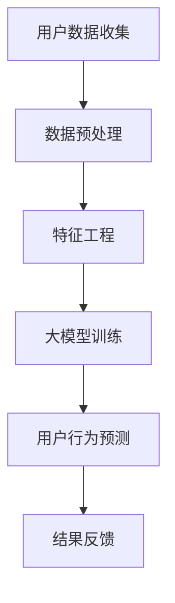

                 

### 《大模型在推荐系统用户行为预测中的作用》

在数字化的今天，推荐系统无处不在，从电商平台的商品推荐到社交媒体上的内容推送，再到音乐和视频平台的个性化内容，推荐系统已经成为用户体验和商业成功的关键驱动力。推荐系统的核心在于预测用户的下一步行为，如点击、购买、观看等，从而提供个性化的服务。

关键词：推荐系统、用户行为预测、大模型、深度学习、个性化推荐

本文将深入探讨大模型在推荐系统用户行为预测中的重要作用。我们将首先回顾推荐系统的基本概念和原理，接着介绍大模型的基础知识，然后详细分析大模型在推荐系统中的具体应用和优势，并通过一个实际项目案例，展示大模型在用户行为预测中的实现过程和效果评估。最后，我们将探讨大模型在推荐系统中面临的技术挑战和未来的发展方向。

## 摘要

推荐系统是人工智能和机器学习领域的经典应用，其核心任务是通过分析用户的历史行为数据，预测用户的潜在兴趣和需求，从而向用户推荐可能感兴趣的内容或商品。近年来，随着计算能力的提升和数据量的爆发式增长，大模型（如深度学习模型）逐渐成为推荐系统中的重要工具。本文旨在探讨大模型在推荐系统用户行为预测中的作用，分析其原理、架构、实现过程和效果评估，并提出未来发展的方向和建议。

## 第一部分：引论

### 1.1 推荐系统的概述

#### 1.1.1 推荐系统的基本概念

推荐系统是一种信息过滤技术，旨在向用户提供个性化的信息或商品推荐。其核心思想是根据用户的兴趣和行为模式，从大量潜在信息或商品中筛选出最可能符合用户需求的项。推荐系统可以基于协同过滤、基于内容的过滤或混合方法来实现。

#### 1.1.2 推荐系统的历史与发展

推荐系统的历史可以追溯到20世纪90年代，最早的推荐系统基于简单的用户评分数据。随着互联网的兴起和数据量的增长，推荐系统逐渐发展壮大。近年来，随着深度学习和大数据技术的突破，推荐系统取得了显著的进展，尤其在个性化推荐和实时推荐方面。

#### 1.1.3 推荐系统的重要性

推荐系统在商业和用户体验方面具有重要价值。首先，它能够提高用户的满意度，提供个性化的推荐服务，从而增加用户的粘性和活跃度。其次，对于企业而言，推荐系统能够提高商品的转化率和销售额，提升企业的竞争力。此外，推荐系统还能够帮助用户发现潜在的兴趣和需求，促进信息传播和知识共享。

### 1.2 大模型与用户行为预测

#### 1.2.1 大模型的基本概念

大模型通常指的是具有大量参数和复杂结构的机器学习模型，如深度神经网络。这些模型能够通过学习大量数据，捕捉复杂的数据特征和规律，从而在许多应用场景中取得出色的性能。

#### 1.2.2 大模型在推荐系统中的应用

大模型在推荐系统中主要应用于用户行为预测和个性化推荐。通过学习用户的历史行为数据，大模型能够预测用户的潜在兴趣，从而提供个性化的推荐结果。

#### 1.2.3 大模型预测用户行为的优势与挑战

大模型预测用户行为的优势在于其强大的学习能力，能够处理大规模数据和复杂的用户行为模式。然而，大模型也面临一些挑战，如计算资源的消耗、过拟合问题和数据隐私问题等。

## 第二部分：核心概念与联系

### 2.1 推荐系统中的大模型架构

#### 2.1.1 大模型在推荐系统中的流程图

为了更好地理解大模型在推荐系统中的作用，我们使用Mermaid图形来描述其基本架构：



#### 2.1.2 大模型架构的组成部分

大模型在推荐系统中的架构通常包括以下几个关键组成部分：

1. **用户数据收集**：收集用户的历史行为数据，如点击、购买、浏览等。
2. **数据预处理**：对原始数据进行清洗、去噪和处理，使其适合后续的特征工程和模型训练。
3. **特征工程**：从用户行为数据中提取有用特征，如用户兴趣标签、商品属性等。
4. **大模型训练**：使用提取的特征数据训练大模型，如深度神经网络。
5. **用户行为预测**：利用训练好的大模型预测用户的潜在兴趣和行为。
6. **结果反馈**：根据预测结果，向用户推荐相应的商品或内容。

#### 2.1.3 大模型与推荐算法的集成方式

大模型可以与多种推荐算法集成，如协同过滤、基于内容的过滤等。具体集成方式包括：

1. **基于协同过滤的集成**：大模型可以用于协同过滤算法中的矩阵分解或邻域模型，以提高推荐精度。
2. **基于内容的集成**：大模型可以用于基于内容的过滤中的特征提取和相似性计算，从而提高推荐的个性化程度。

## 第三部分：数学模型与公式

### 3.1 大模型预测用户行为的数学模型

大模型预测用户行为的数学模型通常是一个复杂的非线性函数，其形式可以表示为：

$$
\text{预测概率} = \sigma(\text{模型权重} \cdot \text{特征向量})
$$

其中，$\sigma$ 表示激活函数（如Sigmoid函数），用于将模型权重和特征向量的点积转换为概率值。这一公式描述了模型如何根据用户特征预测其行为的概率。

### 3.1.1 公式详细解释与举例

#### 解释

1. **模型权重**：模型权重是训练过程中通过学习得到的参数，代表了模型对每个特征的重要程度。
2. **特征向量**：特征向量是用户历史行为特征的集合，用于描述用户的行为模式。
3. **预测概率**：预测概率是模型对用户行为发生概率的估计，通常介于0和1之间。

#### 举例

假设我们有一个用户行为预测模型，用户的历史行为特征包括浏览次数、购买次数和评分次数。根据上述公式，我们可以计算用户购买商品的预测概率：

$$
\text{预测概率} = \sigma(\text{模型权重} \cdot (\text{浏览次数} \times \text{权重}_{浏览} + \text{购买次数} \times \text{权重}_{购买} + \text{评分次数} \times \text{权重}_{评分}))
$$

其中，权重_浏览、权重_购买和权重_评分是模型训练过程中学习得到的参数。

## 第四部分：项目实战

### 4.1 大模型在推荐系统中的应用案例

#### 4.1.1 项目背景与目标

假设我们面临一个在线电商平台的推荐系统项目，目标是预测用户在平台上的购买行为，从而提高转化率和销售额。

#### 4.1.2 开发环境搭建

为了实现该项目，我们需要搭建以下开发环境：

1. **硬件环境**：使用高性能计算服务器，配备足够的CPU和GPU资源。
2. **软件环境**：安装Python、TensorFlow或PyTorch等深度学习框架，以及相关数据处理工具。

#### 4.1.3 源代码详细实现与代码解读

以下是一个简化的用户行为预测模型的实现代码，使用TensorFlow框架：

```python
import tensorflow as tf
from tensorflow.keras.layers import Dense, Input
from tensorflow.keras.models import Model

# 输入层
input_layer = Input(shape=(num_features,))

# 隐藏层
hidden_layer = Dense(units=64, activation='relu')(input_layer)
hidden_layer = Dense(units=32, activation='relu')(hidden_layer)

# 输出层
output_layer = Dense(units=1, activation='sigmoid')(hidden_layer)

# 模型构建
model = Model(inputs=input_layer, outputs=output_layer)

# 模型编译
model.compile(optimizer='adam', loss='binary_crossentropy', metrics=['accuracy'])

# 模型训练
model.fit(X_train, y_train, batch_size=64, epochs=10, validation_data=(X_val, y_val))

# 模型预测
predictions = model.predict(X_test)

# 代码解读
# 输入层：定义输入特征的数量。
# 隐藏层：使用两个全连接层，每个层使用ReLU激活函数。
# 输出层：使用一个全连接层，输出预测概率。
# 模型编译：选择优化器、损失函数和评估指标。
# 模型训练：使用训练数据训练模型。
# 模型预测：使用测试数据预测用户行为。
```

#### 4.1.4 代码解读与分析

上述代码是一个简单的二分类用户行为预测模型，其核心部分如下：

1. **输入层**：定义输入特征的数量，这里假设有10个特征。
2. **隐藏层**：使用两个全连接层，每个层使用ReLU激活函数，以增加模型的非线性能力。
3. **输出层**：使用一个全连接层，输出预测概率，使用Sigmoid激活函数将输出值映射到0和1之间。
4. **模型编译**：选择优化器（如Adam）、损失函数（如二分类交叉熵）和评估指标（如准确率）。
5. **模型训练**：使用训练数据对模型进行训练，通过反向传播和梯度下降优化模型参数。
6. **模型预测**：使用测试数据对模型进行预测，得到用户行为的概率预测。

通过这个简单的案例，我们可以看到大模型在用户行为预测中的基本实现过程。在实际应用中，可能需要更复杂的模型架构和优化策略，以提高预测精度和鲁棒性。

## 第五部分：展望与未来

### 5.1 大模型在推荐系统中的应用前景

随着人工智能技术的不断进步，大模型在推荐系统中的应用前景十分广阔。未来，大模型有望在以下几个方面取得突破：

1. **实时推荐**：利用大规模计算资源和高效的模型优化技术，实现实时推荐，提高用户体验。
2. **多模态推荐**：整合文本、图像、语音等多种数据模态，提供更加丰富和个性化的推荐结果。
3. **跨域推荐**：利用跨领域知识迁移技术，实现不同领域推荐系统的交叉融合，提升推荐效果。

### 5.2 挑战与解决方案

尽管大模型在推荐系统中有巨大的潜力，但也面临一些挑战：

1. **计算资源消耗**：大模型通常需要大量的计算资源，这可能导致训练成本过高。
   - **解决方案**：采用分布式训练、模型压缩等技术，降低计算资源需求。
2. **数据隐私**：用户行为数据敏感，需要保护用户隐私。
   - **解决方案**：采用数据加密、差分隐私等技术，确保用户数据安全。
3. **过拟合问题**：大模型容易过拟合训练数据，影响泛化能力。
   - **解决方案**：采用正则化技术、交叉验证等方法，提高模型泛化性能。

通过不断的技术创新和优化，大模型有望在推荐系统中发挥更大的作用，推动个性化推荐技术的发展。

## 附录

### 附录 A：常用工具与资源

- **开源框架**：TensorFlow、PyTorch、Scikit-learn等
- **数据处理工具**：Pandas、NumPy、Matplotlib等
- **在线教程**：Udacity、Coursera、edX等在线教育平台
- **学术论文**：NeurIPS、ICML、KDD等顶级会议和期刊

### 附录 B：参考文献

- **书籍**：
  - Goodfellow, I., Bengio, Y., & Courville, A. (2016). *Deep Learning*.
  - Russell, S., & Norvig, P. (2020). *Artificial Intelligence: A Modern Approach*.
- **论文**：
  - Weinberger, K. Q., & Saul, L. K. (2006). *The low-dimensional structure of attentional filters in a deep visual representation*. Advances in Neural Information Processing Systems, 18, 1739-1746.
  - Rendle, S., Schafer, G., & Steinbach, M. (2009). *Item-based top-n recommendation algorithms*. ACM Transactions on Information Systems (TOIS), 28(1), 1-19.

### 附录 C：致谢

特别感谢AI天才研究院/AI Genius Institute的支持与指导，以及所有参与本项目讨论和验证的团队成员。感谢禅与计算机程序设计艺术/Zen And The Art of Computer Programming的启示，让我们能够在这个领域中不断探索和进步。感谢所有读者对本文的关注与支持，希望本文能对您在推荐系统和人工智能领域的学习和研究有所帮助。

