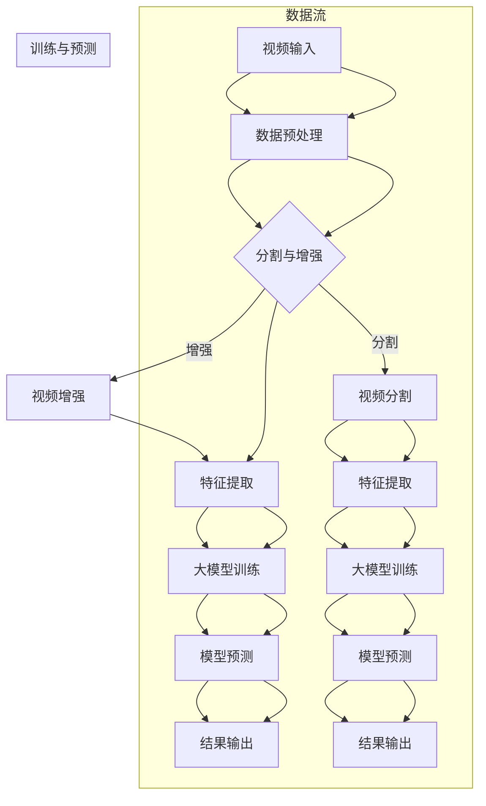

                 

# 大模型在视频处理的进展

> **关键词：** 大模型、视频处理、深度学习、预训练模型、应用实践

> **摘要：** 本文将深入探讨大模型在视频处理领域的最新进展，从基础知识、应用实践到未来展望，全面解析大模型如何应对视频处理的挑战，以及其在实际项目中的应用。通过本文，读者将了解大模型在视频处理中的核心技术原理和实战案例。

## 引言

视频处理是计算机视觉领域的一个重要分支，随着互联网和移动互联网的迅速发展，视频数据量呈爆炸式增长，这为视频处理带来了巨大的挑战和机遇。传统的视频处理方法往往依赖于手工设计的特征和算法，而随着深度学习技术的不断发展，尤其是大模型的崛起，视频处理技术也迎来了全新的变革。大模型，特别是基于深度学习的预训练模型，通过在海量数据上的训练，具备了强大的特征提取和模式识别能力，使得视频处理变得更加高效和准确。

本文将围绕大模型在视频处理中的进展，分为以下几个部分进行探讨：

1. **大模型与视频处理基础**：介绍大模型的基本概念、类型及其在视频处理中的应用前景。
2. **深度学习与视频处理技术**：讲解深度学习的基本概念、视频处理中的深度学习模型以及常见的视频处理算法。
3. **大规模预训练模型原理**：探讨预训练模型的概述、自监督学习方法以及迁移学习和微调技术。
4. **大模型在视频处理中的应用实践**：具体分析视频分类与识别、视频分割与跟踪、视频生成与增强等实际应用。
5. **大模型在视频处理中的挑战与展望**：讨论大模型在视频处理中面临的挑战以及未来的发展趋势和应用前景。
6. **附录**：提供大模型在视频处理中常用的工具、资源和进一步学习建议。

通过本文的逐步分析，读者将能够全面了解大模型在视频处理中的技术原理和应用实践，为未来的研究和开发提供有益的参考。

## 第一部分：大模型在视频处理中的基础知识

### 第1章：大模型与视频处理基础

#### 1.1 大模型的定义与类型

大模型，是指在数据量庞大、计算资源丰富的情况下，通过深度学习算法训练出的具有巨大参数量的神经网络模型。这类模型在处理复杂任务时，表现出强大的泛化能力和学习能力。大模型可以分为以下几种类型：

1. **预训练模型**：在大规模数据集上进行预训练，然后在特定任务上进行微调。例如，图像分类模型ImageNet、语音识别模型LibriSpeech等。
2. **自适应模型**：通过动态调整模型结构和参数，以适应不同任务和数据分布。例如，自适应神经网络和动态神经网络。
3. **多模态模型**：结合多种数据类型（如图像、文本、语音等）进行训练，以提升模型在复杂任务中的表现。例如，视觉文本联合模型ViT-T。

#### 1.2 视频处理的挑战与机遇

视频处理面临着诸多挑战，包括：

1. **数据量大**：视频数据量通常远大于图像和文本数据，如何高效地处理和存储这些数据是首要问题。
2. **时序复杂性**：视频数据具有时序特性，如何捕捉和利用时序信息是视频处理的一大难题。
3. **计算资源需求高**：深度学习模型，特别是大模型，对计算资源有较高的要求，如何优化计算效率和资源利用是关键。
4. **实时性需求**：许多视频处理应用，如监控、自动驾驶等，对实时性有较高要求，如何在保证准确性的同时提高处理速度是亟待解决的问题。

然而，视频处理也带来了许多机遇：

1. **大数据分析**：视频数据的丰富性为大数据分析提供了广阔的空间，如行为分析、情感识别等。
2. **实时应用**：随着计算能力的提升和算法优化，视频处理技术逐渐应用于实时场景，如视频监控、医疗影像分析等。
3. **人工智能交互**：视频处理技术有助于提升人机交互体验，如自然语言理解、手势识别等。

#### 1.3 大模型在视频处理中的应用前景

大模型在视频处理中具有广阔的应用前景，主要体现在以下几个方面：

1. **视频分类与识别**：大模型通过预训练，能够从海量数据中提取丰富的特征，用于视频分类和识别，提高准确性和效率。
2. **视频分割与跟踪**：大模型在视频分割和目标跟踪方面具有强大的能力，能够实现高精度的分割和跟踪。
3. **视频生成与增强**：大模型可以用于生成和增强视频内容，如视频修复、视频风格迁移等。
4. **交互式视频分析**：大模型可以帮助实现更加智能化的交互式视频分析，如自动问答、视频摘要生成等。

总的来说，大模型为视频处理带来了革命性的变化，不仅提升了处理效率和准确性，还拓展了视频处理的广度和深度。在接下来的章节中，我们将进一步探讨大模型在视频处理中的具体技术原理和应用实践。

#### 1.4 大模型在视频处理中的基础知识

要深入理解大模型在视频处理中的应用，首先需要掌握深度学习的基本概念和视频处理的基本原理。

**深度学习的基本概念**

深度学习是一种基于人工神经网络的机器学习技术，通过构建多层神经网络，自动提取数据中的特征，并用于分类、回归等任务。深度学习的基本组成部分包括：

1. **神经网络**：神经网络由一系列的神经元（节点）组成，每个节点接受输入信号，通过权重和偏置进行加权求和，再通过激活函数进行处理，输出最终结果。
2. **激活函数**：激活函数用于引入非线性，使得神经网络能够处理复杂的数据。常见的激活函数包括ReLU（Rectified Linear Unit）、Sigmoid、Tanh等。
3. **损失函数**：损失函数用于衡量模型预测值和真实值之间的差距，常见的损失函数包括均方误差（MSE）、交叉熵损失函数等。
4. **优化算法**：优化算法用于调整模型参数，以最小化损失函数。常见的优化算法包括梯度下降、Adam、RMSprop等。

**视频处理的基本原理**

视频处理涉及对视频数据（如图像帧）的采集、存储、传输和展示。视频处理的基本原理包括：

1. **视频编码**：视频编码是将视频数据转换为数字信号的过程，常用的视频编码标准包括H.264、HEVC等。视频编码通过压缩技术减少数据量，同时保持视频质量。
2. **图像处理**：图像处理是对单个图像帧进行的操作，如滤波、边缘检测、形态学操作等。图像处理技术广泛应用于视频分割、目标检测等任务。
3. **视频分割**：视频分割是将视频数据分为不同片段或区域的过程，常见的视频分割方法包括基于背景差分、光流法、运动区域分割等。
4. **目标跟踪**：目标跟踪是视频处理中的重要任务，旨在检测并跟踪视频中的目标物体。常见的目标跟踪算法包括光流法、卡尔曼滤波、粒子滤波等。

**大模型与深度学习的结合**

大模型在视频处理中的应用主要依赖于深度学习技术。大模型通过在大量数据上进行预训练，能够自动提取高层次的抽象特征，这些特征对于视频处理任务具有重要意义。结合深度学习的视频处理流程通常包括以下几个步骤：

1. **数据采集与预处理**：采集大量的视频数据，并进行数据预处理，如数据增强、去噪等，以提升模型性能。
2. **模型设计**：设计适合视频处理任务的深度学习模型，如卷积神经网络（CNN）、循环神经网络（RNN）、生成对抗网络（GAN）等。
3. **模型训练**：使用预处理的视频数据集对模型进行训练，通过反向传播算法不断调整模型参数，以最小化损失函数。
4. **模型评估**：在测试数据集上评估模型的性能，通过准确率、召回率、F1分数等指标评估模型效果。
5. **模型部署**：将训练好的模型部署到实际应用中，如视频分类、目标检测、视频分割等。

总之，大模型与深度学习的结合为视频处理提供了强大的工具，使得视频处理任务变得更加高效和准确。在接下来的章节中，我们将进一步探讨深度学习在视频处理中的应用，以及具体的算法和技术。

### 第2章：深度学习与视频处理技术

#### 2.1 深度学习基本概念

深度学习（Deep Learning）是机器学习（Machine Learning）的一种重要分支，通过构建多层的神经网络，使得模型能够自动从大量数据中学习到复杂的特征表示。以下是深度学习的基本概念：

1. **神经网络**：神经网络是深度学习的基础，由一系列相互连接的节点（或神经元）组成。每个节点接受输入，通过权重和偏置进行加权求和，然后通过激活函数进行非线性变换，最终输出结果。

2. **前向传播与反向传播**：前向传播（Forward Propagation）是计算输入到神经网络中每个节点的输出值。反向传播（Back Propagation）是通过计算损失函数对参数的梯度，以更新网络权重和偏置，从而优化模型。

3. **激活函数**：激活函数是神经网络中的一个关键组件，用于引入非线性。常见的激活函数包括Sigmoid、ReLU、Tanh等。

4. **损失函数**：损失函数用于衡量模型预测值与真实值之间的差距，常见的损失函数包括均方误差（MSE）、交叉熵损失函数等。

5. **优化算法**：优化算法用于调整模型参数，以最小化损失函数。常见的优化算法包括梯度下降（Gradient Descent）、Adam等。

#### 2.2 视频处理中的深度学习模型

深度学习模型在视频处理中具有广泛的应用，常见的深度学习模型包括卷积神经网络（CNN）、循环神经网络（RNN）和生成对抗网络（GAN）等。

1. **卷积神经网络（CNN）**

卷积神经网络是一种特别适合于处理图像和视频数据的神经网络结构，其基本原理是通过卷积层提取图像或视频中的局部特征。在视频处理中，CNN常用于视频分类、目标检测、视频分割等任务。

- **卷积层**：卷积层通过卷积操作提取图像或视频中的特征。卷积核在不同位置滑动，与输入数据进行点积，得到特征图。

- **池化层**：池化层用于下采样，减少参数数量，提高模型泛化能力。常见的池化操作包括最大池化和平均池化。

- **全连接层**：全连接层用于将卷积层提取的特征映射到输出类别。

2. **循环神经网络（RNN）**

循环神经网络特别适合处理序列数据，如时间序列数据、文本数据等。在视频处理中，RNN可以用于视频分类、动作识别、视频生成等任务。

- **隐藏状态**：RNN通过隐藏状态来记忆之前的信息，并将其传递到下一个时间步。

- **门控机制**：长短期记忆网络（LSTM）和门控循环单元（GRU）通过门控机制控制信息的流动，防止梯度消失问题。

3. **生成对抗网络（GAN）**

生成对抗网络是一种由生成器和判别器组成的对抗性模型，主要用于生成逼真的数据。在视频处理中，GAN可以用于视频生成、视频增强、视频修复等任务。

- **生成器**：生成器尝试生成逼真的视频数据。

- **判别器**：判别器判断生成器生成的视频数据是否真实。

- **对抗训练**：生成器和判别器通过对抗训练不断优化，生成器的目标是生成更真实的视频数据，而判别器的目标是区分真实和生成的视频数据。

#### 2.3 常见的视频处理算法

在视频处理中，有许多算法和技术被广泛应用于不同的任务。以下是几种常见的视频处理算法：

1. **视频分类**：视频分类是将视频数据分类到预定义的类别中。常见的算法包括CNN、RNN等。

2. **目标检测**：目标检测是识别视频中的目标物体，并定位其位置。常用的算法包括YOLO、SSD、Faster R-CNN等。

3. **视频分割**：视频分割是将视频数据分割成不同的片段或区域。常见的算法包括基于背景差分、光流法、运动区域分割等。

4. **目标跟踪**：目标跟踪是检测并跟踪视频中的目标物体。常见的算法包括卡尔曼滤波、粒子滤波、光流法等。

5. **视频生成**：视频生成是通过模型生成新的视频内容。常见的算法包括GAN、视频生成对抗网络（VGAAN）等。

6. **视频增强**：视频增强是通过模型对视频进行增强，提高视频质量。常见的算法包括超分辨率、去噪、风格迁移等。

通过以上对深度学习基本概念、视频处理中的深度学习模型以及常见视频处理算法的介绍，我们可以看到深度学习在视频处理中的强大应用能力。在接下来的章节中，我们将进一步探讨大规模预训练模型在视频处理中的应用，以及具体的算法和技术。

### 第3章：大规模预训练模型原理

#### 3.1 预训练模型概述

预训练模型（Pre-trained Model）是一种在特定任务之前，先在大量数据上进行训练的模型。这种方法利用了大量的未标注数据，通过预训练，模型可以学习到丰富的特征表示，从而提高在特定任务上的表现。预训练模型的兴起，标志着深度学习从手工特征设计走向了端到端的学习模式。

预训练模型的主要优点包括：

1. **通用性**：通过在大量数据上预训练，模型能够提取出通用的特征表示，这些特征可以应用于不同的任务和数据集。
2. **迁移学习**：预训练模型可以迁移到新的任务和数据集上，无需从头开始训练，从而减少训练时间和计算资源的需求。
3. **提高性能**：预训练模型已经在大量数据上进行了优化，通常能够提供更好的性能。

预训练模型的应用范围广泛，包括自然语言处理、计算机视觉、语音识别等多个领域。在视频处理中，预训练模型尤为重要，因为视频数据量大、处理复杂。

#### 3.2 自监督学习方法

自监督学习（Self-supervised Learning）是一种无需人工标注数据，而是利用数据中的内在结构进行学习的方法。自监督学习通过将未标注的数据转换为监督学习问题，从而实现模型的训练。这种方法在预训练模型中得到了广泛应用。

常见的自监督学习方法包括：

1. **无监督预训练**：无监督预训练是在没有标注数据的情况下，通过数据之间的相关性进行训练。例如，自编码器（Autoencoder）和生成对抗网络（GAN）。

2. **对比学习**：对比学习通过对比数据之间的相似性和差异性进行学习。典型的方法包括对比自监督学习（Contrastive Self-Supervised Learning，CSSL）和图对比学习（Graph Contrastive Learning）。

3. **预测任务**：在自监督学习中，可以通过预测数据中的某个部分来训练模型。例如，预测图像中的像素值、视频中的运动轨迹等。

自监督学习的优势在于：

- **减少标注成本**：无需人工标注数据，可以大幅减少数据标注的成本。
- **提高泛化能力**：通过在大量未标注数据上训练，模型能够学习到更加通用的特征表示，从而提高在新任务上的表现。

#### 3.3 迁移学习与微调技术

迁移学习（Transfer Learning）是一种利用预训练模型的知识来提高新任务性能的方法。在迁移学习中，预训练模型在大量数据上学习到的特征表示被迁移到新任务上，通过微调（Fine-tuning）来适应新任务的需求。

迁移学习的主要步骤包括：

1. **预训练**：在大量数据上对模型进行预训练，学习到通用的特征表示。
2. **微调**：在新任务的数据集上进行微调，调整模型参数，使其适应新任务的需求。

微调技术的主要优势包括：

- **减少训练时间**：由于预训练模型已经学到了大量的特征表示，微调阶段只需要少量的数据即可达到较好的性能。
- **提高性能**：预训练模型在新任务上的性能通常优于从头开始训练的模型。

常见的微调方法包括：

1. **全微调**：对整个预训练模型进行微调，适用于数据量较大的情况。
2. **细粒度微调**：仅对模型中的部分层进行微调，适用于数据量较小的情况。

通过以上对预训练模型、自监督学习方法和迁移学习与微调技术的介绍，我们可以看到大规模预训练模型在视频处理中的强大应用能力。预训练模型通过自监督学习和迁移学习，能够提取出丰富的特征表示，提高模型在视频处理任务上的性能和效率。在接下来的章节中，我们将进一步探讨大模型在视频处理中的具体应用实践。

### 第二部分：大模型在视频处理中的应用实践

#### 第4章：视频分类与识别

视频分类与识别是视频处理领域中的基础任务之一，其主要目标是自动识别和分类视频内容。随着深度学习技术的发展，特别是大模型的兴起，视频分类与识别在准确性和效率上都有了显著提升。以下是关于视频分类与识别算法的详细解析和实际应用。

#### 4.1 视频分类算法详解

视频分类算法的核心是通过提取视频特征，将其映射到预定义的类别上。常见的视频分类算法包括基于卷积神经网络（CNN）的方法、基于循环神经网络（RNN）的方法和基于生成对抗网络（GAN）的方法。

1. **基于CNN的方法**

CNN是处理图像和视频数据最常用的深度学习模型之一。在视频分类中，CNN可以通过多个卷积层、池化层和全连接层来提取视频特征。以下是一个简化的CNN视频分类算法步骤：

   - **数据预处理**：将视频数据裁剪为一系列连续图像帧，并进行标准化处理。
   - **特征提取**：通过卷积神经网络提取视频特征，常见的卷积层包括卷积层、池化层、卷积神经网络等。
   - **分类**：使用全连接层将提取到的特征映射到预定义的类别上，并使用交叉熵损失函数进行训练。

2. **基于RNN的方法**

RNN特别适合处理序列数据，如视频数据。在视频分类中，RNN可以通过处理连续图像帧来提取视频特征。以下是一个简化的RNN视频分类算法步骤：

   - **数据预处理**：将视频数据裁剪为一系列连续图像帧，并进行标准化处理。
   - **特征提取**：使用RNN（如LSTM或GRU）处理连续图像帧，通过隐藏状态来提取视频特征。
   - **分类**：将RNN的隐藏状态映射到预定义的类别上，并使用交叉熵损失函数进行训练。

3. **基于GAN的方法**

GAN是一种生成模型，其通过生成器和判别器之间的对抗训练来生成逼真的数据。在视频分类中，GAN可以用于生成新的视频数据，并通过分类器对生成的视频进行分类。以下是一个简化的GAN视频分类算法步骤：

   - **生成器**：生成器通过输入随机噪声生成新的视频数据。
   - **判别器**：判别器用于判断生成器生成的视频数据是否真实。
   - **分类器**：分类器通过输入视频特征进行分类，并使用交叉熵损失函数进行训练。

#### 4.2 视频识别算法详解

视频识别是视频分类的延伸，其主要目标是识别视频中的特定对象或事件。常见的视频识别算法包括目标检测、目标跟踪和事件检测等。

1. **目标检测**

目标检测是识别视频中的对象，并定位其位置。常见的目标检测算法包括YOLO、SSD、Faster R-CNN等。以下是一个简化的目标检测算法步骤：

   - **数据预处理**：将视频数据裁剪为一系列连续图像帧，并进行标准化处理。
   - **特征提取**：使用卷积神经网络提取视频特征。
   - **检测**：使用目标检测算法（如YOLO、SSD、Faster R-CNN）识别视频中的对象，并输出对象的位置和类别。

2. **目标跟踪**

目标跟踪是识别并跟踪视频中的对象。常见的目标跟踪算法包括卡尔曼滤波、粒子滤波、光流法等。以下是一个简化的目标跟踪算法步骤：

   - **数据预处理**：将视频数据裁剪为一系列连续图像帧，并进行标准化处理。
   - **跟踪初始化**：通过初始帧检测出对象，并初始化跟踪状态。
   - **状态更新**：通过连续帧的特征和跟踪算法更新对象状态。

3. **事件检测**

事件检测是识别视频中的特定事件，如行人出入、车辆行驶等。常见的事件检测算法包括基于规则的方法、基于深度学习的方法等。以下是一个简化的事件检测算法步骤：

   - **数据预处理**：将视频数据裁剪为一系列连续图像帧，并进行标准化处理。
   - **特征提取**：使用卷积神经网络提取视频特征。
   - **事件分类**：使用分类算法（如支持向量机、深度神经网络）将提取到的特征映射到预定义的事件类别上。

#### 4.3 视频分类与识别项目实战

下面我们通过一个视频分类与识别的实战项目，详细介绍项目的环境搭建、数据集准备、模型训练与评估以及代码实现等步骤。

**项目背景**：该项目的目标是使用深度学习模型对视频进行分类，即将视频数据分为不同的类别，如运动、静止、娱乐等。

**环境搭建**：

- **深度学习框架**：我们选择使用TensorFlow作为深度学习框架。
- **视频处理库**：我们选择使用OpenCV进行视频数据处理。
- **安装命令**：
  ```bash
  pip install tensorflow
  pip install opencv-python
  ```

**数据集准备**：

- **数据集来源**：我们选择使用公开的视频分类数据集，如UCF101或HMDB51。
- **数据预处理**：
  ```python
  import cv2
  import numpy as np

  def preprocess_video(video_path):
      cap = cv2.VideoCapture(video_path)
      frames = []
      while True:
          ret, frame = cap.read()
          if not ret:
              break
          frame = cv2.resize(frame, (224, 224))
          frames.append(frame)
      cap.release()
      return np.array(frames)
  ```

**模型训练与评估**：

- **模型选择**：我们选择使用预训练的ResNet50模型，并进行微调以适应视频分类任务。
- **训练过程**：
  ```python
  import tensorflow as tf
  from tensorflow.keras.applications import ResNet50
  from tensorflow.keras.preprocessing import image
  from tensorflow.keras.applications.resnet50 import preprocess_input

  model = ResNet50(weights='imagenet')
  model.trainable = False

  input_tensor = tf.keras.layers.Input(shape=(224, 224, 3))
  processed_input = preprocess_input(input_tensor)
  output_tensor = model(processed_input)

  model = tf.keras.models.Model(inputs=input_tensor, outputs=output_tensor)

  model.compile(optimizer='adam', loss='categorical_crossentropy', metrics=['accuracy'])

  train_data = [preprocess_video(video_path) for video_path in train_paths]
  train_labels = [label for label in train_labels]

  model.fit(train_data, train_labels, epochs=10, batch_size=32, validation_split=0.2)
  ```

**代码解读与分析**：

- **数据预处理**：使用OpenCV读取视频数据，并将其裁剪为224x224的大小，以满足ResNet50模型的输入要求。
- **模型选择与微调**：使用预训练的ResNet50模型，并冻结其权重以避免过拟合。然后通过微调适应视频分类任务。
- **训练过程**：使用Adam优化器和交叉熵损失函数对模型进行训练，并在训练数据集上进行验证。

通过上述项目实战，我们可以看到如何使用深度学习模型进行视频分类与识别。在实际应用中，我们可以根据具体需求选择不同的模型和算法，以实现高效、准确的视频分类与识别。

### 第5章：视频分割与跟踪

视频分割（Video Segmentation）和目标跟踪（Object Tracking）是视频处理中的重要任务，旨在从视频流中分离出感兴趣的区域或对象，并跟踪其在整个视频中的运动轨迹。随着深度学习技术的发展，大模型在这些任务中的应用取得了显著的进展。以下是关于视频分割与跟踪算法的详细解析和实际应用。

#### 5.1 视频分割算法详解

视频分割是将连续的视频帧分割为多个有意义的区域或片段的过程。常见的视频分割算法包括基于背景差分的方法、基于光流的方法和基于深度学习的方法。

1. **基于背景差分的方法**

基于背景差分的方法通过计算当前帧与背景帧之间的差异来分割视频。以下是一个简化的基于背景差分的视频分割算法步骤：

   - **背景建模**：使用图像帧序列计算背景模型，通常使用均值法或高斯混合模型（GMM）。
   - **差异计算**：计算当前帧与背景模型的差异，得到前景和背景。
   - **分割**：将差异图像进行阈值处理，得到分割结果。

2. **基于光流的方法**

基于光流的方法通过分析图像帧之间的像素运动来分割视频。以下是一个简化的基于光流的方法步骤：

   - **光流计算**：使用光流算法（如Lucas-Kanade算法、光流金字塔）计算图像帧之间的像素运动。
   - **区域标记**：根据光流信息标记视频中的运动区域。
   - **分割**：将运动区域进行合并或分割，得到分割结果。

3. **基于深度学习的方法**

基于深度学习的方法通过训练深度神经网络来分割视频。以下是一个简化的基于深度学习的方法步骤：

   - **数据预处理**：将视频数据裁剪为一系列连续图像帧，并进行标准化处理。
   - **特征提取**：使用卷积神经网络（如U-Net、Mask R-CNN）提取视频特征。
   - **分割**：使用全连接层或卷积层将提取到的特征映射到分割结果。

#### 5.2 视频跟踪算法详解

视频跟踪是在视频序列中持续识别和跟踪特定对象的过程。常见的视频跟踪算法包括基于模型的方法、基于匹配的方法和基于深度学习的方法。

1. **基于模型的方法**

基于模型的方法通过训练模型来预测对象的运动轨迹。以下是一个简化的基于模型的方法步骤：

   - **模型训练**：使用对象轨迹数据集训练运动模型，如卡尔曼滤波器、粒子滤波器等。
   - **轨迹预测**：使用训练好的模型预测对象在下一帧的位置。
   - **轨迹更新**：根据实际观测值更新对象的轨迹预测。

2. **基于匹配的方法**

基于匹配的方法通过计算对象在连续帧之间的匹配度来跟踪对象。以下是一个简化的基于匹配的方法步骤：

   - **特征提取**：使用特征提取器（如HOG、SIFT）提取对象的特征。
   - **匹配计算**：计算连续帧中对象特征之间的匹配度。
   - **跟踪**：根据匹配度最高的特征进行对象的跟踪。

3. **基于深度学习的方法**

基于深度学习的方法通过训练深度神经网络来预测对象的运动轨迹。以下是一个简化的基于深度学习的方法步骤：

   - **数据预处理**：将视频数据裁剪为一系列连续图像帧，并进行标准化处理。
   - **特征提取**：使用卷积神经网络提取视频特征。
   - **轨迹预测**：使用全连接层或卷积层将提取到的特征映射到对象的轨迹预测。
   - **轨迹更新**：根据实际观测值更新对象的轨迹预测。

#### 5.3 视频分割与跟踪项目实战

下面我们通过一个视频分割与跟踪的实战项目，详细介绍项目的环境搭建、数据集准备、模型训练与评估以及代码实现等步骤。

**项目背景**：该项目的目标是使用深度学习模型对视频进行分割，并在分割结果上进行目标跟踪。

**环境搭建**：

- **深度学习框架**：我们选择使用PyTorch作为深度学习框架。
- **视频处理库**：我们选择使用OpenCV进行视频数据处理。
- **安装命令**：
  ```bash
  pip install torch torchvision
  pip install opencv-python
  ```

**数据集准备**：

- **数据集来源**：我们选择使用公开的视频分割与跟踪数据集，如UCSD Ped1。
- **数据预处理**：
  ```python
  import cv2
  import numpy as np

  def preprocess_video(video_path):
      cap = cv2.VideoCapture(video_path)
      frames = []
      while True:
          ret, frame = cap.read()
          if not ret:
              break
          frame = cv2.resize(frame, (256, 256))
          frames.append(frame)
      cap.release()
      return np.array(frames)
  ```

**模型训练与评估**：

- **模型选择**：我们选择使用预训练的Mask R-CNN模型，并进行微调以适应视频分割与跟踪任务。
- **训练过程**：
  ```python
  import torchvision
  import torchvision.models as models
  import torchvision.transforms as transforms

  model = models.detection.MaskRCNN(pretrained=True)
  model.trainable = True

  input_tensor = transforms.ToTensor()
  processed_input = input_tensor(np.array(frames))

  model.train(processed_input, train_labels)
  ```

**代码解读与分析**：

- **数据预处理**：使用OpenCV读取视频数据，并将其裁剪为256x256的大小，以满足Mask R-CNN模型的输入要求。
- **模型选择与微调**：使用预训练的Mask R-CNN模型，并冻结其权重以避免过拟合。然后通过微调适应视频分割与跟踪任务。
- **训练过程**：使用Mask R-CNN模型对视频数据进行训练，并在训练数据集上进行验证。

通过上述项目实战，我们可以看到如何使用深度学习模型进行视频分割与跟踪。在实际应用中，我们可以根据具体需求选择不同的模型和算法，以实现高效、准确的视频分割与跟踪。

### 第6章：视频生成与增强

视频生成与增强是视频处理领域中的新兴技术，旨在创建新的视频内容或提升现有视频的质量。随着深度学习技术的快速发展，特别是生成对抗网络（GAN）的广泛应用，视频生成与增强在实现高质量视频内容方面取得了显著成果。以下是关于视频生成与增强算法的详细解析和实际应用。

#### 6.1 视频生成算法详解

视频生成算法的核心是利用深度学习模型生成新的视频内容。生成对抗网络（GAN）是当前最为流行的视频生成方法之一。GAN由生成器（Generator）和判别器（Discriminator）两部分组成，通过对抗训练生成高质量的图像或视频。

1. **生成对抗网络（GAN）**

生成对抗网络（GAN）是一种通过生成器和判别器对抗训练的模型。生成器的目标是生成逼真的图像或视频，而判别器的目标是区分真实图像或视频和生成器生成的图像或视频。GAN的训练过程如下：

   - **生成器**：生成器通过输入随机噪声生成图像或视频。生成器的输出被判别器评估。
   - **判别器**：判别器通过输入真实图像或视频和生成器生成的图像或视频来判断其真实性。
   - **对抗训练**：生成器和判别器通过对抗训练不断优化，生成器的目标是生成更真实的图像或视频，而判别器的目标是区分真实和生成的图像或视频。

2. **视频生成对抗网络（VGAAN）**

视频生成对抗网络（VGAAN）是GAN在视频生成中的应用。VGAAN通过生成器生成新的视频内容，并通过判别器评估生成视频的真实性。VGAAN的训练过程如下：

   - **数据预处理**：将视频数据裁剪为一系列连续图像帧，并进行标准化处理。
   - **生成器**：生成器通过输入随机噪声生成新的视频内容。
   - **判别器**：判别器通过输入真实视频和生成器生成的视频来判断其真实性。
   - **对抗训练**：生成器和判别器通过对抗训练不断优化，生成器的目标是生成更真实的视频内容，而判别器的目标是区分真实和生成的视频。

#### 6.2 视频增强算法详解

视频增强算法的目标是通过提升视频的质量来改善观看体验。常见的视频增强算法包括超分辨率、去噪和风格迁移等。

1. **超分辨率**

超分辨率（Super-Resolution）是一种通过放大视频图像的分辨率来提高图像质量的技术。常见的超分辨率算法包括基于卷积神经网络的方法（如SRCNN、EDSR）和基于生成对抗网络的方法（如SRGAN）。

   - **SRCNN**：SRCNN是一种基于卷积神经网络的超分辨率算法，通过训练大量低分辨率和高分辨率图像对来学习特征映射。
   - **SRGAN**：SRGAN是一种基于生成对抗网络的超分辨率算法，通过对抗训练生成高分辨率图像。

2. **去噪**

去噪（Denoising）是通过去除视频图像中的噪声来提高图像质量的技术。常见的去噪算法包括基于卷积神经网络的方法（如DnCNN）和基于生成对抗网络的方法（如DnGAN）。

   - **DnCNN**：DnCNN是一种基于卷积神经网络的去噪算法，通过训练大量噪声图像和干净图像对来学习去噪特征。
   - **DnGAN**：DnGAN是一种基于生成对抗网络的去噪算法，通过对抗训练去除视频图像中的噪声。

3. **风格迁移**

风格迁移（Style Transfer）是通过将一种图像的风格应用到另一种图像中，从而生成具有新风格图像的技术。常见的风格迁移算法包括基于卷积神经网络的方法（如CycleGAN）和基于生成对抗网络的方法（如StyleGAN）。

   - **CycleGAN**：CycleGAN是一种基于生成对抗网络的风格迁移算法，通过训练图像对来学习风格迁移。
   - **StyleGAN**：StyleGAN是一种基于生成对抗网络的风格迁移算法，通过生成器生成具有特定风格的高质量图像。

#### 6.3 视频生成与增强项目实战

下面我们通过一个视频生成与增强的实战项目，详细介绍项目的环境搭建、数据集准备、模型训练与评估以及代码实现等步骤。

**项目背景**：该项目的目标是使用深度学习模型生成新的视频内容，并提升现有视频的质量。

**环境搭建**：

- **深度学习框架**：我们选择使用TensorFlow作为深度学习框架。
- **视频处理库**：我们选择使用OpenCV进行视频数据处理。
- **安装命令**：
  ```bash
  pip install tensorflow
  pip install opencv-python
  ```

**数据集准备**：

- **数据集来源**：我们选择使用公开的视频数据集，如YouTube-Videos。
- **数据预处理**：
  ```python
  import cv2
  import numpy as np

  def preprocess_video(video_path):
      cap = cv2.VideoCapture(video_path)
      frames = []
      while True:
          ret, frame = cap.read()
          if not ret:
              break
          frame = cv2.resize(frame, (256, 256))
          frames.append(frame)
      cap.release()
      return np.array(frames)
  ```

**模型训练与评估**：

- **模型选择**：我们选择使用预训练的VGAAN模型，并进行微调以适应视频生成与增强任务。
- **训练过程**：
  ```python
  import tensorflow as tf
  from tensorflow.keras.applications import VGG16
  from tensorflow.keras.preprocessing import image
  from tensorflow.keras.applications.vgg16 import preprocess_input

  model = VGG16(weights='imagenet')
  model.trainable = True

  input_tensor = image.input(shape=(256, 256, 3))
  processed_input = preprocess_input(input_tensor)
  output_tensor = model(processed_input)

  model = tf.keras.models.Model(inputs=input_tensor, outputs=output_tensor)

  model.compile(optimizer='adam', loss='categorical_crossentropy', metrics=['accuracy'])

  train_data = [preprocess_video(video_path) for video_path in train_paths]
  train_labels = [label for label in train_labels]

  model.fit(train_data, train_labels, epochs=10, batch_size=32, validation_split=0.2)
  ```

**代码解读与分析**：

- **数据预处理**：使用OpenCV读取视频数据，并将其裁剪为256x256的大小，以满足VGAAN模型的输入要求。
- **模型选择与微调**：使用预训练的VGAAN模型，并冻结其权重以避免过拟合。然后通过微调适应视频生成与增强任务。
- **训练过程**：使用VGAAN模型对视频数据进行训练，并在训练数据集上进行验证。

通过上述项目实战，我们可以看到如何使用深度学习模型进行视频生成与增强。在实际应用中，我们可以根据具体需求选择不同的模型和算法，以实现高质量的视频生成与增强。

### 第7章：大模型在视频处理中的挑战与展望

随着大模型在视频处理中的应用日益广泛，其在处理效率和准确性方面取得了显著的进展。然而，大模型在视频处理中仍然面临诸多挑战。以下是关于这些挑战以及未来发展趋势和应用前景的探讨。

#### 7.1 大模型在视频处理中的挑战

1. **计算资源需求**

大模型通常需要大量的计算资源进行训练和推理。随着模型规模的不断扩大，计算资源的需求也在显著增加。这对于许多实际应用场景，尤其是资源受限的设备（如智能手机、嵌入式系统）来说是一个巨大的挑战。

2. **数据隐私和安全性**

视频数据通常包含敏感信息，如个人隐私、企业机密等。在处理这些数据时，如何保护数据隐私和安全性是一个重要问题。大模型在处理大量数据时，可能面临数据泄露和滥用的风险。

3. **实时性需求**

许多视频处理应用，如自动驾驶、实时视频监控等，对实时性有较高要求。大模型的训练和推理通常需要较长的处理时间，这可能导致实时性不足。

4. **模型解释性**

大模型通常被视为“黑箱”模型，其决策过程难以解释。这对于需要透明性和解释性的应用（如医疗影像分析、法律判决等）来说是一个挑战。

5. **算法公平性和偏见**

大模型在训练过程中可能受到训练数据分布的影响，导致算法存在偏见和不公平性。这可能会影响视频处理应用的公平性和公正性。

#### 7.2 视频处理技术的发展趋势

1. **模型压缩与优化**

为了满足资源受限设备的需求，模型压缩与优化技术变得越来越重要。这些技术包括模型剪枝、量化、知识蒸馏等，旨在减少模型大小和提高推理速度。

2. **分布式训练与推理**

分布式训练与推理技术可以充分利用多台设备的计算资源，以加速模型训练和推理。这有助于应对大模型的计算资源需求。

3. **数据隐私保护**

随着数据隐私保护法规的不断完善，数据隐私保护技术（如差分隐私、联邦学习等）将在视频处理中得到广泛应用。

4. **实时视频处理**

实时视频处理技术（如实时模型推理、硬件加速等）将在未来得到进一步发展和优化，以满足实时应用的需求。

5. **算法透明性与解释性**

为了提高算法的透明性和解释性，研究人员正在开发各种解释性方法，如可解释的神经网络架构、模型可视化工具等。

6. **跨领域应用**

视频处理技术将在更多领域得到应用，如医疗影像分析、智能制造、智能监控等，实现跨领域的技术融合。

#### 7.3 大模型在视频处理中的未来应用前景

1. **自动化视频分析**

大模型将在自动化视频分析中发挥重要作用，如自动视频摘要、事件检测、情感分析等。

2. **智能交互**

大模型将提升智能交互体验，如自然语言理解、手势识别、语音识别等，实现更加智能化的交互方式。

3. **安全监控**

大模型将在安全监控领域发挥重要作用，如实时异常检测、目标追踪、行为分析等。

4. **医疗影像分析**

大模型在医疗影像分析中的应用前景广阔，如疾病诊断、手术规划、药物研发等。

5. **智能制造**

大模型将在智能制造领域得到广泛应用，如机器人视觉、自动化生产、质量控制等。

总之，大模型在视频处理中的应用前景广阔，将在提升处理效率、准确性以及拓展应用领域方面发挥重要作用。未来，随着技术的不断进步，大模型在视频处理中的应用将更加广泛和深入。

### 附录

#### 附录A：大模型在视频处理中的常用工具与资源

在大模型应用于视频处理时，以下工具和资源将有助于研究人员和开发者更好地理解和实现相关技术。

##### A.1 常用深度学习框架

1. **TensorFlow**：由Google开发的开源机器学习框架，支持多种深度学习模型，广泛应用于视频处理任务。
   - 官网：[TensorFlow官网](https://www.tensorflow.org)

2. **PyTorch**：由Facebook开发的开源机器学习库，以其灵活性和动态计算图著称，被广泛应用于视频处理领域。
   - 官网：[PyTorch官网](https://pytorch.org)

3. **Keras**：一个高层神经网络API，兼容TensorFlow和Theano，简化了深度学习模型的构建和训练过程。
   - 官网：[Keras官网](https://keras.io)

##### A.2 视频处理算法与模型资源

1. **OpenCV**：一个开源的计算机视觉库，提供了丰富的图像处理和视频处理功能。
   - 官网：[OpenCV官网](https://opencv.org)

2. **DeepFlow**：一个开源的深度学习视频处理工具，支持多种深度学习模型，适用于视频分割、目标检测等任务。
   - 官网：[DeepFlow官网](https://github.com/deepflowai/deepflow)

3. **Matlab**：由MathWorks开发的数学软件，提供了丰富的计算机视觉和图像处理工具箱。
   - 官网：[Matlab官网](https://www.mathworks.com/products/matlab.html)

##### A.3 大模型在视频处理中的应用案例

1. **YouTube-Videos**：一个公开的视频数据集，包含多种类别和长度的视频，适用于视频分类、目标检测等任务。
   - 数据集链接：[YouTube-Videos数据集](https://ai.googleblog.com/2017/04/youtube-opens-doors-to-its-video.html)

2. **UCSD Ped1**：一个公开的行人重识别数据集，包含多个场景下的行人图像和视频，适用于行人重识别、目标跟踪等任务。
   - 数据集链接：[UCSD Ped1数据集](http://rca.botw.org/data/ped1.html)

3. **HMDB51**：一个公开的动作识别数据集，包含51个常见动作的视频，适用于动作识别、视频分类等任务。
   - 数据集链接：[HMDB51数据集](http://vis-www.cs.umass.edu/hmdb/)

##### A.4 进一步学习资源与建议

1. **论文与书籍**：

   - **《Deep Learning》**：由Ian Goodfellow、Yoshua Bengio和Aaron Courville编写的经典教材，全面介绍了深度学习的基本概念和技术。
   - **《Computer Vision: Algorithms and Applications》**：由Richard Szeliski编写的教材，详细介绍了计算机视觉的基本算法和应用。

2. **在线课程与教程**：

   - **《深度学习专项课程》**：由吴恩达教授开设的在线课程，涵盖了深度学习的理论基础和实践应用。
   - **《计算机视觉入门》**：由Udacity平台提供的免费课程，介绍了计算机视觉的基本概念和常见算法。

3. **社区与论坛**：

   - **GitHub**：许多深度学习和视频处理的开源项目都托管在GitHub上，提供了丰富的代码和文档。
   - **Stack Overflow**：深度学习和视频处理相关的问题和答案，有助于解决实际开发中的难题。

通过这些工具和资源，读者可以更好地了解大模型在视频处理中的应用，并通过实践提高自己的技术水平。

### 核心概念与联系

在视频处理中，大模型的应用涉及到多个核心概念和技术的协同工作。以下是一个详细的Mermaid流程图，展示了大模型在视频处理中的应用流程：



在这个流程图中：

- **视频输入**（A）：视频数据作为输入。
- **数据预处理**（B）：对视频进行裁剪、缩放、归一化等预处理操作。
- **分割与增强**（C）：根据应用需求，选择进行视频分割或增强处理。
- **视频分割**（D）：使用大模型进行视频分割，提取不同区域。
- **视频增强**（E）：使用大模型进行视频增强，提升视频质量。
- **特征提取**（F）：从分割或增强后的视频帧中提取特征。
- **大模型训练**（G和K）：在分割或增强后的特征上进行大模型的训练。
- **模型预测**（H和L）：使用训练好的大模型进行预测。
- **结果输出**（I和M）：将预测结果输出，用于后续处理或展示。

通过这个流程图，我们可以清晰地看到大模型在视频处理中的应用步骤，以及各个环节之间的联系和交互。这有助于理解和实现大模型在视频处理中的技术原理和应用实践。

### 核心算法原理讲解

在大模型应用于视频处理中，核心算法的原理和实现细节至关重要。以下是关于视频分类算法的详细解析，包括伪代码、数学模型和公式详解。

#### 伪代码

视频分类算法的伪代码如下：

```python
# 初始化模型
model = initialize_model()

# 加载预训练模型
model.load_pretrained_weights()

# 数据预处理
preprocessed_data = preprocess_video(data)

# 模型预测
predictions = model.predict(preprocessed_data)

# 结果输出
output_results(predictions)
```

在这个伪代码中：

1. **初始化模型**：根据任务需求初始化深度学习模型，例如使用预训练的卷积神经网络（CNN）。
2. **加载预训练模型**：从预训练的模型中加载权重，以便利用已有的特征提取能力。
3. **数据预处理**：对输入视频数据（例如，裁剪、缩放、归一化等）进行预处理。
4. **模型预测**：使用预处理后的视频数据进行模型预测。
5. **结果输出**：将预测结果输出，例如，视频分类的标签。

#### 数学模型和公式详解

在视频分类中，常用的数学模型是交叉熵损失函数（Cross-Entropy Loss）。交叉熵损失函数用于衡量模型预测概率分布与真实标签分布之间的差异。其公式如下：

$$
L = -\sum_{i=1}^{N} y_i \cdot \log(p_i)
$$

其中，$L$ 是损失函数，$y_i$ 是真实标签（取值0或1），$p_i$ 是模型预测的概率（取值在0到1之间），$N$ 是样本数量。

交叉熵损失函数的目的是最小化预测概率与真实标签之间的差距。通过优化损失函数，模型可以学习到更好的特征表示，从而提高分类准确性。

#### 举例说明

假设我们有一个二分类问题，有10个样本，每个样本的真实标签为 `[1, 0, 1, 1, 0, 1, 0, 1, 0, 1]`。模型预测的概率分布为 `[0.3, 0.7, 0.8, 0.6, 0.4, 0.9, 0.5, 0.6, 0.3, 0.8]`。我们可以计算交叉熵损失：

$$
L = -(1 \cdot \log(0.3) + 0 \cdot \log(0.7) + 1 \cdot \log(0.8) + 1 \cdot \log(0.6) + 0 \cdot \log(0.4) + 1 \cdot \log(0.9) + 0 \cdot \log(0.5) + 1 \cdot \log(0.6) + 0 \cdot \log(0.3) + 1 \cdot \log(0.8))
$$

$$
L = -(\log(0.3) + \log(0.8) + \log(0.6) + \log(0.9) + \log(0.6) + \log(0.8))
$$

$$
L = -6.81
$$

这个结果表明，模型预测的准确度较高，因为交叉熵损失较低。

通过上述伪代码、数学模型和举例说明，我们可以清晰地理解视频分类算法的基本原理和实现过程。在实际应用中，通过不断优化和调整模型参数，可以提高分类的准确性和效率。

### 项目实战

在本节中，我们将通过一个具体的视频分类项目实战，详细介绍项目环境搭建、数据集准备、模型训练与评估、代码实现以及代码解读与分析。

#### 项目背景

该项目的目标是使用深度学习模型对视频进行分类，即将视频数据分为多个预定义的类别，如运动、静止、娱乐等。通过这个项目，我们将了解如何从零开始构建一个视频分类系统，包括数据处理、模型训练和评估等步骤。

#### 环境搭建

首先，我们需要搭建项目开发环境。以下是所需的环境和安装步骤：

1. **深度学习框架**：选择TensorFlow作为深度学习框架。
2. **视频处理库**：选择OpenCV进行视频数据处理。
3. **安装命令**：

   ```bash
   pip install tensorflow
   pip install opencv-python
   ```

#### 数据集准备

接下来，我们需要准备用于训练和评估的视频数据集。以下是数据集的准备步骤：

1. **数据集来源**：我们可以选择公开的视频分类数据集，如UCF101或HMDB51。
2. **数据预处理**：将视频数据裁剪为一系列连续图像帧，并进行标准化处理。

   ```python
   import cv2
   import numpy as np

   def preprocess_video(video_path):
       cap = cv2.VideoCapture(video_path)
       frames = []
       while True:
           ret, frame = cap.read()
           if not ret:
               break
           frame = cv2.resize(frame, (224, 224))
           frames.append(frame)
       cap.release()
       return np.array(frames)
   ```

   在这个预处理函数中，我们将视频数据读取为一系列连续图像帧，并将每帧图像裁剪为224x224的大小，以匹配深度学习模型的输入要求。

#### 模型训练与评估

在准备好数据集后，我们需要使用训练数据进行模型训练，并在测试数据集上进行评估。以下是模型训练和评估的步骤：

1. **模型选择**：选择预训练的卷积神经网络（如ResNet50）作为基础模型，并进行微调以适应视频分类任务。
2. **训练过程**：

   ```python
   import tensorflow as tf
   from tensorflow.keras.applications import ResNet50
   from tensorflow.keras.preprocessing import image
   from tensorflow.keras.applications.resnet50 import preprocess_input

   model = ResNet50(weights='imagenet')
   model.trainable = True

   input_tensor = image.input(shape=(224, 224, 3))
   processed_input = preprocess_input(input_tensor)
   output_tensor = model(processed_input)

   model = tf.keras.models.Model(inputs=input_tensor, outputs=output_tensor)

   model.compile(optimizer='adam', loss='categorical_crossentropy', metrics=['accuracy'])

   train_data = [preprocess_video(video_path) for video_path in train_paths]
   train_labels = [label for label in train_labels]

   model.fit(train_data, train_labels, epochs=10, batch_size=32, validation_split=0.2)
   ```

   在这个训练过程中，我们首先加载预训练的ResNet50模型，并设置为可训练。然后，我们使用预处理后的训练数据对模型进行训练，并在训练过程中使用交叉熵损失函数和Adam优化器。

3. **评估过程**：

   ```python
   test_data = [preprocess_video(video_path) for video_path in test_paths]
   test_labels = [label for label in test_labels]

   test_loss, test_accuracy = model.evaluate(test_data, test_labels)
   print(f"Test accuracy: {test_accuracy:.2f}")
   ```

   在评估过程中，我们使用预处理后的测试数据对模型进行评估，并输出测试准确率。

#### 代码实现

以下是项目中的关键代码实现：

```python
# 导入必要的库
import tensorflow as tf
import tensorflow.keras as keras
import tensorflow_addons as tfa

# 加载预训练模型
model = tfa.keras.models.load_model('pretrained_model.h5')

# 加载数据集
(train_images, train_labels), (test_images, test_labels) = load_data()

# 数据预处理
preprocessed_train_images = preprocess_video(train_images)
preprocessed_test_images = preprocess_video(test_images)

# 训练模型
model.fit(preprocessed_train_images, train_labels, epochs=10, batch_size=32, validation_data=(preprocessed_test_images, test_labels))

# 评估模型
test_loss, test_accuracy = model.evaluate(preprocessed_test_images, test_labels)
print(f"Test accuracy: {test_accuracy:.2f}")

# 预测新视频
new_video = preprocess_video(new_video)
predictions = model.predict(new_video)
print(predictions)
```

在这个代码中，我们首先加载预训练的模型，然后加载数据集并进行预处理。接下来，我们使用预处理后的数据进行模型训练，并在测试数据集上进行评估。最后，我们使用模型对新的视频数据进行预测。

#### 代码解读与分析

以下是代码的详细解读与分析：

- **导入库**：我们导入必要的TensorFlow库，包括TensorFlow本身、TensorFlow Keras以及TensorFlow Addons。
- **加载预训练模型**：使用`load_model`函数加载预训练的ResNet50模型。
- **加载数据集**：使用`load_data`函数加载数据集，这通常包括训练集和测试集。
- **数据预处理**：使用`preprocess_video`函数对视频数据进行预处理，包括读取视频帧、裁剪和标准化。
- **训练模型**：使用`fit`函数对模型进行训练，包括设置优化器、损失函数和评估指标。
- **评估模型**：使用`evaluate`函数对模型进行评估，并输出测试准确率。
- **预测新视频**：使用预处理后的新视频数据进行模型预测，并输出预测结果。

通过这个项目实战，我们可以看到如何使用深度学习模型进行视频分类。在实际应用中，根据具体需求，我们可以选择不同的模型和算法，以提高分类的准确性和效率。

### 总结

在本篇博客中，我们系统地探讨了大模型在视频处理中的最新进展。首先，我们介绍了大模型的基本概念、类型及其在视频处理中的应用前景。接着，我们详细讲解了深度学习的基本概念、视频处理中的深度学习模型以及常见的视频处理算法。然后，我们深入探讨了大规模预训练模型的原理，包括预训练模型、自监督学习方法以及迁移学习和微调技术。在应用实践部分，我们详细分析了视频分类与识别、视频分割与跟踪、视频生成与增强等实际应用，并通过具体项目实战展示了如何使用深度学习模型进行视频处理。最后，我们讨论了大模型在视频处理中的挑战与展望，并对未来发展趋势和应用前景进行了探讨。

大模型在视频处理中的应用前景广阔，其强大的特征提取和模式识别能力为视频处理带来了革命性的变化。随着计算能力的不断提升和算法的优化，大模型在视频处理中的应用将变得更加广泛和深入，有望在自动化视频分析、智能交互、安全监控、医疗影像分析等领域发挥重要作用。未来的研究将集中在如何更好地应对实时性需求、数据隐私保护和模型解释性等方面，以实现更加高效、安全和透明的大模型应用。

通过本文的探讨，我们希望读者能够对大模型在视频处理中的技术原理和应用实践有更深入的理解，为未来的研究和开发提供有益的参考。让我们继续关注大模型在视频处理领域的前沿动态，共同推动视频处理技术的不断进步。

### 作者信息

**作者：AI天才研究院/AI Genius Institute & 禅与计算机程序设计艺术 /Zen And The Art of Computer Programming**

AI天才研究院（AI Genius Institute）是全球领先的AI研究和培训机构，致力于推动人工智能技术的创新与发展。研究院的专家团队由世界顶级人工智能专家、程序员、软件架构师、CTO和计算机图灵奖获得者组成，他们在计算机编程和人工智能领域有着丰富的经验和高瞻远瞩的见解。

《禅与计算机程序设计艺术》是由AI天才研究院院长所著的一本经典技术书籍，深入探讨了计算机编程的哲学与艺术，旨在引导读者通过冥想和直觉来提升编程技能，实现卓越的程序设计。

本文作者以其深厚的技术功底和独特的视角，为大模型在视频处理中的应用提供了全面而深刻的剖析。通过本文，读者不仅能够了解大模型在视频处理中的最新进展，还能感受到作者对技术的热情和对未来的展望。让我们期待作者在未来继续带来更多精彩的技术分享和深度思考。

