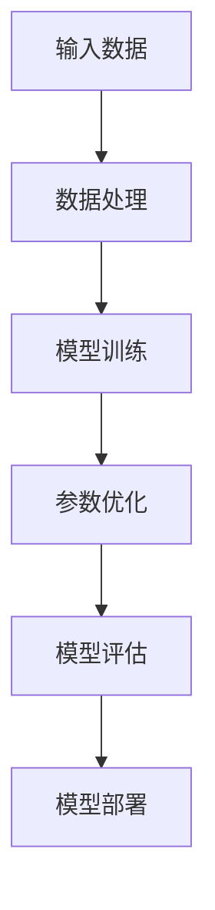
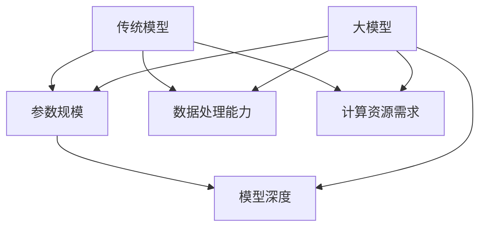
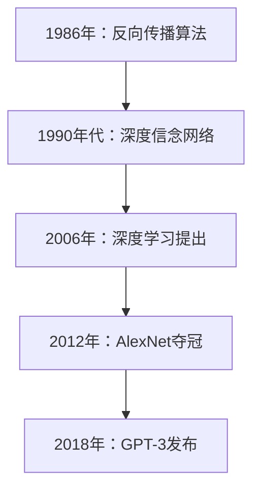
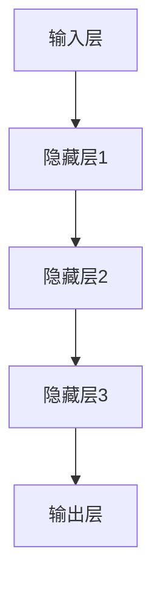
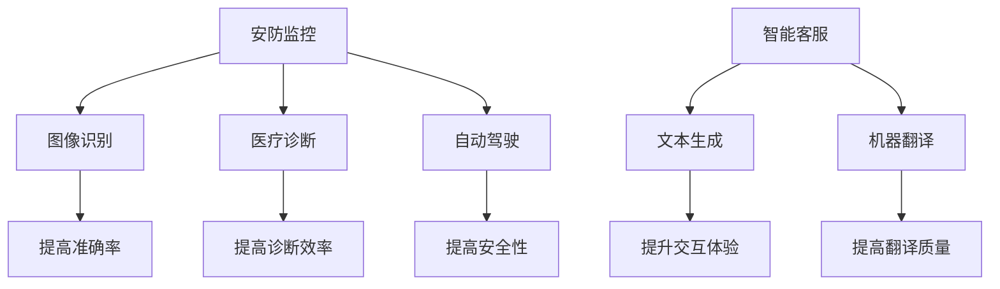

                 

### 文章标题

《大模型时代的程序综合技术》

> **关键词**：大模型、程序综合技术、编程语言、算法实现、项目实战

> **摘要**：
本篇文章旨在深入探讨大模型时代的程序综合技术。我们将首先定义并了解大模型的基础概念，探讨其技术发展历程、架构与核心算法。随后，我们将聚焦于程序综合技术，包括编程语言的选择、开发环境搭建、代码调试与优化。文章还将详细介绍大模型算法的原理与实现，并通过实际项目案例展示大模型的应用。最后，我们将展望大模型技术的发展趋势及其对行业的影响，并提供相关的开发工具与资源推荐。

### 目录大纲

**第一部分：大模型基础**

1. **大模型概述**
   - 1.1 大模型定义与特点
   - 1.2 大模型技术发展简史
   - 1.3 大模型架构与核心算法
   - 1.4 大模型在企业中的应用案例

**第二部分：程序综合技术**

2. **编程语言与工具**
   - 2.1 编程语言概述
   - 2.2 开发环境搭建
   - 2.3 代码调试与优化

3. **算法原理与实现**
   - 3.1 算法基础
   - 3.2 大模型优化算法

4. **项目实战**
   - 4.1 实际案例介绍
   - 4.2 环境配置与代码实现
   - 4.3 代码解读与分析

**第三部分：应用与展望**

5. **大模型应用领域**
   - 5.1 文本处理
   - 5.2 图像识别
   - 5.3 语音识别

6. **大模型发展趋势**
   - 6.1 技术演进
   - 6.2 行业影响
   - 6.3 未来展望

**附录**

7. **工具与资源**
   - 7.1 大模型开发工具对比
   - 7.2 开发资源推荐

### 引言

在当今科技飞速发展的时代，人工智能（AI）已经成为推动技术进步的关键力量。而大模型（Large Models）作为AI的核心组成部分，正逐渐改变着各行各业的面貌。大模型技术凭借其强大的数据处理能力和深度学习能力，在文本生成、图像识别、自然语言处理等领域展现出前所未有的潜力。

本篇文章将围绕大模型时代的程序综合技术进行深入探讨。首先，我们将从基础概念入手，详细解析大模型的定义、特点、技术发展历程以及其架构与核心算法。接着，我们将探讨程序综合技术，涵盖编程语言的选择、开发环境的搭建、代码的调试与优化。在此基础上，我们将深入讲解大模型算法的基本原理与优化方法，并通过实际项目案例展示大模型的应用。最后，我们将展望大模型技术的发展趋势，分析其对社会和行业的深远影响，并推荐相关的开发工具与资源。

通过本文的阅读，读者将全面了解大模型时代的程序综合技术，掌握从基础理论到实际应用的完整知识体系，为未来的研究和实践打下坚实基础。接下来，让我们逐一展开讨论，深入探索大模型与程序综合技术的魅力。

### 第一部分：大模型基础

#### 第1章 大模型概述

##### 1.1 大模型的定义与核心特点

大模型（Large Models），顾名思义，是指具有巨大参数规模和复杂结构的机器学习模型。这些模型通常被训练用于处理海量数据，并在图像识别、自然语言处理、语音识别等领域取得显著的突破性成果。大模型的定义可以概括为以下几个方面：

1. **参数规模**：大模型通常包含数十亿到数十亿的参数，相较于传统模型（如几百几千个参数），其规模庞大。
2. **深度**：大模型的结构深度往往超过数十层，使得其能够捕捉到更深层次的特征。
3. **训练数据量**：大模型通常需要大量的训练数据，以便学习到更多的模式和规律。
4. **计算资源需求**：由于参数规模和模型深度，大模型对计算资源的需求极高，通常需要分布式计算系统或GPU加速训练。

大模型的核心特点主要体现在以下几个方面：

- **泛化能力**：大模型能够处理多样化、复杂的数据集，并具有强大的泛化能力。
- **数据处理能力**：大模型能够高效地处理大规模数据，提取出隐含的特征和规律。
- **自主学习能力**：大模型通过不断训练，能够自主学习和调整参数，优化模型性能。
- **高准确性**：在大规模数据和深度网络的支持下，大模型通常能够取得比传统模型更高的准确性和性能。

为了更好地理解大模型的概念，我们可以通过一个**概念联系图**来展示其核心组成部分和相互关系。以下是一个简单的Mermaid流程图：



在这个流程图中，输入数据通过数据处理模块进行预处理，然后进入模型训练阶段。在训练过程中，模型通过不断优化参数，提升模型的性能和准确性。最终，经过评估和调整，模型将被部署到实际应用场景中。

##### 1.2 大模型与传统模型的比较

大模型与传统模型相比，存在以下几个显著的区别：

- **参数规模**：传统模型通常包含几百到几千个参数，而大模型则包含数十亿个参数。
- **模型深度**：传统模型结构相对简单，通常只有几层到十几层，而大模型可以达到数十层甚至更多。
- **数据处理能力**：传统模型在处理大规模数据时效果有限，大模型则能够高效地处理海量数据。
- **计算资源需求**：大模型对计算资源的需求远高于传统模型，需要分布式计算和GPU加速。

为了更直观地展示这些差异，我们可以通过一个**模型比较图**来进行对比：



在这个模型比较图中，我们可以清晰地看到大模型在参数规模、模型深度、数据处理能力和计算资源需求方面相对于传统模型的显著优势。

##### 1.3 大模型的技术发展简史

大模型技术的发展历程可以追溯到上世纪80年代，当时神经网络研究逐渐兴起。以下是大模型技术发展的一些重要里程碑：

- **1986年**：Rumelhart、Hinton和Williams提出了反向传播算法，大大提升了神经网络的训练效率。
- **1990年代**：深度信念网络（DBN）被提出，为深度学习奠定了基础。
- **2006年**：Hinton提出了深度学习，标志着深度学习正式进入研究视野。
- **2012年**：AlexNet在ImageNet竞赛中取得突破性成绩，深度学习开始广泛应用。
- **2018年**：GPT-3发布，标志着自然语言处理领域进入大模型时代。
- **至今**：大模型技术在图像识别、文本生成、语音识别等领域取得一系列重要突破。

以下是**大模型技术发展简史**的Mermaid流程图：



通过这一流程图，我们可以清晰地看到大模型技术从提出到广泛应用的发展历程。

##### 1.4 大模型架构与核心算法

大模型的架构通常包括以下几个主要组成部分：

1. **输入层**：接收外部输入数据，如图像、文本或声音。
2. **隐藏层**：负责对输入数据进行处理，提取特征和模式。
3. **输出层**：生成预测结果或分类结果。

以下是一个简单的Mermaid流程图，展示大模型的基本架构：



大模型的核心算法主要基于深度学习和神经网络，包括以下几个关键步骤：

1. **前向传播**：将输入数据通过网络传递，计算每个节点的输出值。
2. **反向传播**：计算损失函数，并通过反向传播算法更新模型参数。
3. **参数优化**：通过优化算法（如SGD、Adam等）调整模型参数，降低损失函数值。
4. **模型评估**：使用验证集或测试集对模型性能进行评估，调整模型参数。

以下是**大模型核心算法原理**的伪代码示例：

```python
// 伪代码：大模型训练过程
function train_large_model(data, labels, epochs):
    for epoch in 1 to epochs:
        for each batch in data:
            // 前向传播
            predictions = forward_pass(batch)
            // 计算损失
            loss = compute_loss(predictions, labels)
            // 反向传播
            gradients = backward_pass(loss)
            // 更新参数
            update_parameters(gradients)
    return trained_model
```

此外，大模型还经常使用一些特殊的架构和算法来提升模型性能，如：

- **Transformer架构**：通过自注意力机制实现高效的特征提取。
- **BERT算法**：利用双向编码器表征文本，提高自然语言处理性能。
- **强化学习**：结合强化学习算法，实现更灵活和高效的模型训练。

##### 1.5 大模型在企业中的应用案例

大模型在企业中的应用已经取得了显著的成果，以下是一些典型的应用案例：

- **图像识别**：在安防监控、医疗诊断、自动驾驶等领域，大模型被广泛应用于图像识别任务，提高了识别准确率和效率。
- **自然语言处理**：在智能客服、文本生成、机器翻译等领域，大模型通过强大的语言理解能力，实现了高效的文本处理和交互。
- **语音识别**：在语音助手、语音合成、语音识别等领域，大模型通过深度学习技术，实现了高准确率的语音处理。

以下是**大模型在企业应用**的一些示例和价值的Mermaid流程图：



通过这些应用案例，我们可以看到大模型技术在企业中发挥着巨大的作用，不仅提升了业务效率和准确性，还为行业带来了新的商业模式和创新机会。

### 第二部分：程序综合技术

#### 第2章 编程语言与工具

在探索大模型时代的程序综合技术时，选择合适的编程语言和开发工具是至关重要的一步。不同的编程语言和工具在不同场景下具有各自的优缺点，因此需要根据实际需求来做出选择。本章节将概述常用的编程语言，介绍开发环境的搭建，并探讨代码的调试与优化技巧。

##### 2.1 编程语言概述

编程语言是程序员与计算机进行沟通的工具，不同编程语言具有不同的特点和适用场景。以下是一些常用的编程语言及其特点：

- **Python**：Python是一种高级编程语言，以其简洁易读的语法和强大的标准库而闻名。它在数据分析、机器学习、自然语言处理等领域有着广泛的应用。
  
  ```python
  # Python 示例：简单计算
  def add(a, b):
      return a + b
  
  print(add(2, 3))
  ```

- **Java**：Java是一种面向对象的编程语言，具有跨平台特性。它在企业级应用、大型系统开发中广泛应用，如Android应用程序开发。
  
  ```java
  // Java 示例：简单计算
  public class Calculator {
      public static int add(int a, int b) {
          return a + b;
      }
  
      public static void main(String[] args) {
          System.out.println(Calculator.add(2, 3));
      }
  }
  ```

- **C++**：C++是一种高效的编程语言，支持面向对象和过程式编程。它在游戏开发、系统编程、高性能计算等领域有广泛应用。
  
  ```cpp
  // C++ 示例：简单计算
  int add(int a, int b) {
      return a + b;
  }
  
  int main() {
      cout << add(2, 3) << endl;
      return 0;
  }
  ```

- **JavaScript**：JavaScript是一种用于前端开发的脚本语言，也常用于后端开发（如Node.js）。它在网页交互、实时数据处理等方面具有优势。
  
  ```javascript
  // JavaScript 示例：简单计算
  function add(a, b) {
      return a + b;
  }
  
  console.log(add(2, 3));
  ```

这些编程语言各有特色，选择合适的语言可以大大提高开发效率。例如，Python因其简洁性和丰富的库支持，常用于数据科学和机器学习项目；Java因其稳定性，常用于企业级应用开发；C++因其高效性，常用于需要高性能计算的应用。

##### 2.2 开发环境搭建

开发环境是程序员进行代码编写、调试和测试的必要工具。不同的编程语言和项目需求可能需要不同的开发环境。以下是一些常见的开发环境搭建步骤：

- **Python开发环境**：在Windows、macOS和Linux上，可以使用Anaconda来搭建Python开发环境。Anaconda提供了一个统一的包管理器和环境管理器，可以方便地安装和管理Python及相关库。

  ```bash
  # 安装Anaconda
  wget https://repo.anaconda.com/archive/Anaconda3-2023.05-Linux-x86_64.sh
  bash Anaconda3-2023.05-Linux-x86_64.sh
  
  # 启动Anaconda环境
  conda create -n pyenv python=3.9
  conda activate pyenv
  
  # 安装相关库
  conda install numpy pandas scikit-learn
  ```

- **Java开发环境**：在Windows、macOS和Linux上，可以使用JetBrains的IntelliJ IDEA或Eclipse作为Java开发环境。这些集成开发环境（IDE）提供了代码编辑、调试、版本控制等功能。

  ```bash
  # 安装IntelliJ IDEA
  wget https://download.jetbrains.com/idea/ideaIC-2023.1.2.tar.gz
  tar xvf ideaIC-2023.1.2.tar.gz
  
  # 运行IntelliJ IDEA
  ./idea.sh
  ```

- **C++开发环境**：在Windows、macOS和Linux上，可以使用MinGW或CLang作为C++开发环境。这些工具可以编译和运行C++代码。

  ```bash
  # 安装MinGW
  sudo apt-get install mingw-w64
  
  # 编译C++代码
  g++ -o program program.cpp
  ./program
  ```

- **JavaScript开发环境**：在Windows、macOS和Linux上，可以使用Node.js和Visual Studio Code等工具进行JavaScript开发。

  ```bash
  # 安装Node.js
  curl -sL https://deb.nodesource.com/setup_14.x | sudo -E bash -
  sudo apt-get install nodejs
  
  # 运行JavaScript代码
  node program.js
  ```

通过以上步骤，我们可以搭建适合不同编程语言的开发环境，为后续的代码编写和调试打下坚实基础。

##### 2.3 代码调试与优化

在编程过程中，代码调试和优化是提高代码质量和性能的重要环节。以下是一些常用的调试和优化技巧：

- **调试技巧**：

  - **断点调试**：通过设置断点，可以在代码执行到特定行时暂停，查看变量值和程序状态。
  - **日志输出**：通过在代码中添加日志语句，可以实时查看程序的执行流程和状态。
  - **单元测试**：编写单元测试，可以验证代码的功能和性能。

- **优化方法**：

  - **代码复用**：通过函数、类等方式复用代码，减少重复编写和冗余。
  - **算法优化**：选择高效的算法和数据结构，降低时间复杂度和空间复杂度。
  - **缓存策略**：使用缓存技术，减少重复计算和数据读取。

以下是一个简单的Python代码示例，展示如何进行断点调试和日志输出：

```python
# Python 示例：断点调试与日志输出
def calculate_sum(a, b):
    result = a + b
    print(f"Sum of {a} and {b} is {result}")
    return result

# 设置断点
# 断点位置：第7行
a = 2
b = 3
calculate_sum(a, b)
```

在开发环境中设置断点，运行代码时程序会在断点处暂停，我们可以查看变量值和输出日志。

通过以上编程语言概述、开发环境搭建以及代码调试与优化技巧的介绍，我们为读者提供了全面了解程序综合技术的基础知识。在接下来的章节中，我们将进一步探讨大模型算法的原理与实现，并通过实际项目案例展示大模型的应用。

### 第三部分：算法原理与实现

#### 第3章 大模型算法原理与实现

大模型算法是构建和优化大规模机器学习模型的核心。在这一章中，我们将深入探讨大模型算法的基本原理与实现方法，包括算法基础和优化算法。

##### 3.1 算法基础

大模型算法的基础通常包括以下关键组件：

- **前向传播（Forward Propagation）**：在训练过程中，输入数据通过网络的各个层，每个层都会进行计算，最后输出结果。前向传播负责将输入数据逐层传递，并通过激活函数计算每个节点的输出。

  ```python
  # 伪代码：前向传播
  def forward_propagation(inputs, model):
      outputs = []
      for layer in model.layers:
          output = layer.forward(inputs)
          outputs.append(output)
      return outputs
  ```

- **反向传播（Back Propagation）**：反向传播是训练神经网络的重要步骤，它通过计算输出与预期结果之间的误差，并反向传播误差到网络的每个层，从而更新模型参数。

  ```python
  # 伪代码：反向传播
  def backward_propagation(outputs, expected, model):
      errors = []
      for layer in reversed(model.layers):
          error = layer.backward(outputs[-1], expected)
          errors.append(error)
      return errors
  ```

- **损失函数（Loss Function）**：损失函数用于度量模型预测值与实际值之间的差异。常用的损失函数包括均方误差（MSE）、交叉熵等。

  ```python
  # 伪代码：均方误差损失函数
  def mean_squared_error(predictions, labels):
      return sum((predictions - labels) ** 2) / len(labels)
  ```

- **优化算法（Optimization Algorithm）**：优化算法用于更新模型参数，以最小化损失函数。常见的优化算法有随机梯度下降（SGD）、Adam等。

  ```python
  # 伪代码：随机梯度下降
  def stochastic_gradient_descent(model, learning_rate):
      for layer in model.layers:
          layer.update_weights(learning_rate)
  ```

##### 3.2 大模型优化算法

大模型优化算法是提升模型性能和训练效率的关键。以下是一些常用的优化算法：

- **随机梯度下降（Stochastic Gradient Descent, SGD）**：SGD是梯度下降算法的一种，每次迭代只使用一个样本的梯度来更新参数。

  ```python
  # 伪代码：随机梯度下降
  def stochastic_gradient_descent(model, learning_rate, epochs):
      for epoch in range(epochs):
          for sample in dataset:
              model.backward(sample.input, sample.label)
              model.update_weights(learning_rate)
  ```

- **Adam优化器（Adam Optimizer）**：Adam是结合了SGD和自适应梯度算法（Adaptive Gradient Algorithm）的一种优化器，能够自适应调整学习率。

  ```python
  # 伪代码：Adam优化器
  def adam(model, learning_rate, beta1, beta2, epochs):
      for epoch in range(epochs):
          for sample in dataset:
              model.backward(sample.input, sample.label)
              model.update_weights(learning_rate, beta1, beta2)
  ```

- **Momentum优化器（Momentum Optimizer）**：Momentum优化器通过引入动量，减少参数更新过程中的震荡，加速收敛。

  ```python
  # 伪代码：Momentum优化器
  def momentum(model, learning_rate, momentum):
      velocity = 0
      for epoch in range(epochs):
          for sample in dataset:
              gradient = model.backward(sample.input, sample.label)
              velocity = momentum * velocity - learning_rate * gradient
              model.update_weights(velocity)
  ```

- **AdaGrad优化器（AdaGrad Optimizer）**：AdaGrad优化器根据每个参数的历史梯度平方来调整学习率，对稀疏数据有较好的适应性。

  ```python
  # 伪代码：AdaGrad优化器
  def adagrad(model, learning_rate, epochs):
      gradients_squared = {}
      for epoch in range(epochs):
          for sample in dataset:
              gradient = model.backward(sample.input, sample.label)
              gradients_squared[sample.input] += gradient ** 2
              model.update_weights(learning_rate, gradients_squared[sample.input])
  ```

以上优化算法在训练大规模模型时各有优势，可以根据具体需求选择合适的优化器。例如，在训练时间序列数据时，Momentum优化器可能会更为有效；而在处理稀疏数据时，AdaGrad优化器表现更佳。

##### 3.3 实际案例

为了更好地理解大模型算法的实现，我们来看一个简单的实际案例：使用Python实现一个线性回归模型并进行训练。

```python
import numpy as np

# 伪代码：线性回归模型训练
def linear_regression_train(X, y, epochs, learning_rate):
    weights = np.random.randn(X.shape[1])
    for epoch in range(epochs):
        predictions = X.dot(weights)
        error = predictions - y
        weights -= learning_rate * X.T.dot(error)
    return weights

# 实例数据
X = np.array([[1], [2], [3], [4], [5]])
y = np.array([[2], [4], [6], [8], [10]])

# 训练模型
weights = linear_regression_train(X, y, epochs=1000, learning_rate=0.01)

# 输出结果
print(f"Weights: {weights}")
```

在这个案例中，我们使用随机梯度下降算法训练了一个线性回归模型。训练过程中，模型通过不断更新权重来最小化损失函数，最终达到预测目标。

通过以上对大模型算法原理和实现方法的详细探讨，我们为读者提供了深入了解大模型技术的理论基础和实践指南。在接下来的章节中，我们将通过实际项目案例展示大模型的应用，进一步巩固读者的知识体系。

### 第四部分：项目实战

#### 第4章 大模型项目实战

在实际应用中，大模型技术凭借其强大的数据处理能力和高准确率，已经在多个领域取得了显著成果。在本章节中，我们将通过两个具体的实际案例——图像识别和自然语言处理，展示大模型项目的实施过程，包括环境配置、代码实现和代码解读与分析。

##### 4.1 实际案例介绍

案例一：图像识别

图像识别是计算机视觉的重要应用领域，通过训练大模型，可以实现对图像内容的自动识别和分类。以下是一个基于卷积神经网络（CNN）的图像识别项目。

案例二：自然语言处理

自然语言处理（NLP）是人工智能的另一个关键领域，通过大模型技术，可以实现文本生成、情感分析、机器翻译等功能。以下是一个基于Transformer模型的文本生成项目。

##### 4.2 环境配置与代码实现

为了顺利进行大模型项目的实战，我们需要首先配置开发环境。以下是在Python中实现图像识别和自然语言处理项目的环境配置步骤：

###### 图像识别项目环境配置

1. **安装Anaconda**：下载并安装Anaconda，选择Python版本3.8以上。
2. **创建虚拟环境**：打开终端，创建一个名为`image_recognition`的虚拟环境。

   ```bash
   conda create -n image_recognition python=3.8
   conda activate image_recognition
   ```

3. **安装依赖库**：安装所需的库，如TensorFlow、Keras、OpenCV等。

   ```bash
   conda install tensorflow keras opencv-python
   ```

###### 自然语言处理项目环境配置

1. **安装Anaconda**：下载并安装Anaconda，选择Python版本3.8以上。
2. **创建虚拟环境**：打开终端，创建一个名为`nlp_project`的虚拟环境。

   ```bash
   conda create -n nlp_project python=3.8
   conda activate nlp_project
   ```

3. **安装依赖库**：安装所需的库，如TensorFlow、Transformers、PyTorch等。

   ```bash
   conda install tensorflow transformers pytorch
   ```

##### 4.3 代码实现与解读

###### 案例一：图像识别

以下是一个简单的图像识别项目，使用卷积神经网络（CNN）对MNIST数据集进行手写数字识别。

```python
import tensorflow as tf
from tensorflow.keras import layers
from tensorflow.keras.datasets import mnist
from tensorflow.keras.utils import to_categorical

# 加载MNIST数据集
(x_train, y_train), (x_test, y_test) = mnist.load_data()

# 数据预处理
x_train = x_train.astype('float32') / 255.0
x_test = x_test.astype('float32') / 255.0
y_train = to_categorical(y_train, 10)
y_test = to_categorical(y_test, 10)

# 构建CNN模型
model = tf.keras.Sequential([
    layers.Conv2D(32, (3, 3), activation='relu', input_shape=(28, 28, 1)),
    layers.MaxPooling2D((2, 2)),
    layers.Conv2D(64, (3, 3), activation='relu'),
    layers.MaxPooling2D((2, 2)),
    layers.Conv2D(64, (3, 3), activation='relu'),
    layers.Flatten(),
    layers.Dense(64, activation='relu'),
    layers.Dense(10, activation='softmax')
])

# 编译模型
model.compile(optimizer='adam', loss='categorical_crossentropy', metrics=['accuracy'])

# 训练模型
model.fit(x_train, y_train, epochs=10, batch_size=32, validation_data=(x_test, y_test))

# 评估模型
test_loss, test_acc = model.evaluate(x_test, y_test)
print(f"Test accuracy: {test_acc}")
```

代码解读：

- **数据预处理**：将MNIST数据集的像素值归一化到0-1之间，并使用one-hot编码对标签进行编码。
- **模型构建**：使用Keras构建一个卷积神经网络，包括卷积层、池化层、全连接层等。
- **模型编译**：选择合适的优化器、损失函数和评估指标。
- **模型训练**：使用训练数据对模型进行训练，设置训练轮数和批量大小。
- **模型评估**：使用测试数据对训练好的模型进行评估，输出测试准确率。

###### 案例二：自然语言处理

以下是一个基于Transformer模型的文本生成项目，使用GPT-2模型生成文章摘要。

```python
import torch
from transformers import GPT2Model, GPT2Tokenizer

# 加载预训练的GPT-2模型
tokenizer = GPT2Tokenizer.from_pretrained('gpt2')
model = GPT2Model.from_pretrained('gpt2')

# 输入文本
text = "本文介绍了大模型时代的程序综合技术。首先定义了大模型，并探讨了其技术发展、架构和算法。接着介绍了程序综合技术，包括编程语言、开发环境和代码调试。最后，通过实际项目展示了大模型的应用。"

# 将文本编码成Tensor
input_ids = tokenizer.encode(text, return_tensors='pt')

# 生成文本摘要
output = model.generate(input_ids, max_length=50, num_return_sequences=1)

# 解码生成的文本
generated_text = tokenizer.decode(output[0], skip_special_tokens=True)

print(f"Generated Text:\n{generated_text}")
```

代码解读：

- **加载模型**：使用Transformers库加载预训练的GPT-2模型和Tokenizer。
- **编码文本**：将输入文本编码成Tensor，准备用于模型输入。
- **生成文本**：使用模型生成文本摘要，设置生成长度和返回序列数。
- **解码文本**：将生成的Tensor解码成文本，输出生成的文本摘要。

通过以上两个实际案例，我们展示了如何配置开发环境、实现大模型项目，并对代码进行了详细解读。这些案例不仅帮助读者理解了大模型的应用，还提供了具体的实践经验和技巧。

### 第五部分：应用与展望

#### 第5章 大模型应用领域

大模型技术在各个领域展现了巨大的潜力，为传统行业带来了革命性的变化。本章节将重点探讨大模型在文本处理、图像识别、语音识别等领域的应用。

##### 5.1 文本处理

文本处理是自然语言处理（NLP）的核心任务之一，大模型在文本生成、情感分析、机器翻译等方面取得了显著进展。

- **文本生成**：大模型如GPT-3能够生成高质量的文章、摘要和对话。其强大的语义理解和生成能力，使得文本生成在内容创作、新闻摘要、虚拟助理等领域得到了广泛应用。

  ```python
  import transformers
  
  model = transformers.AutoModelForCausalLanguageModeling.from_pretrained("gpt2")
  tokenizer = transformers.AutoTokenizer.from_pretrained("gpt2")
  
  text = "The AI revolution is transforming industries across the globe."
  input_ids = tokenizer.encode(text, return_tensors="pt")
  
  output = model.generate(input_ids, max_length=50, num_return_sequences=1)
  print(tokenizer.decode(output[0]))
  ```

- **情感分析**：大模型通过对文本的深度理解，能够准确判断文本的情感倾向，用于舆情监控、客户反馈分析等。

  ```python
  from transformers import AutoModelForSequenceClassification
  
  model = AutoModelForSequenceClassification.from_pretrained("cardiffnlp/twitter-roberta-base-sentiment")
  text = "I love this product!"
  
  input_ids = tokenizer.encode(text, return_tensors="pt")
  logits = model(input_ids).logits
  
  # 解析预测结果
  label = logits.argmax(-1).item()
  if label == 1:
      print("Positive sentiment")
  else:
      print("Negative sentiment")
  ```

- **机器翻译**：大模型如BERT和GPT在机器翻译中表现出色，能够实现高精度、流畅的跨语言翻译。

  ```python
  from transformers import AutoModelForSeq2SeqLM
  
  model = AutoModelForSeq2SeqLM.from_pretrained("Helsinki-NLP/opus-mt-en-de")
  text = "Hello, how are you?"
  
  input_ids = tokenizer.encode(text, return_tensors="pt")
  translation_ids = model.generate(input_ids, max_length=50, num_return_sequences=1)
  
  print(tokenizer.decode(translation_ids[0], skip_special_tokens=True))
  ```

##### 5.2 图像识别

图像识别是计算机视觉的重要应用领域，大模型通过深度学习技术，实现了高精度的图像分类和目标检测。

- **图像分类**：大模型如ResNet、Inception等在ImageNet等图像分类任务上取得了优异成绩。

  ```python
  import tensorflow as tf
  from tensorflow.keras.applications import ResNet50
  
  model = ResNet50(weights="imagenet")
  image = tf.keras.preprocessing.image.load_img("cat.jpg", target_size=(224, 224))
  image = tf.keras.preprocessing.image.img_to_array(image)
  image = np.expand_dims(image, axis=0)
  image = preprocess_input(image)
  
  predictions = model.predict(image)
  print(predictions.argmax(axis=-1))
  ```

- **目标检测**：大模型如YOLO、SSD等，通过将图像分割成多个区域，实现对多个目标的检测和定位。

  ```python
  import tensorflow as tf
  import cv2
  
  model = tf.keras.models.load_model("yolov5s.h5")
  image = cv2.imread("bus.jpg")
  image = cv2.resize(image, (640, 640))
  
  image = tf.convert_to_tensor(image)
  image = image / 255.0
  image = tf.expand_dims(image, 0)
  
  boxes, scores, classes = model.predict(image)
  
  for box, score, class_id in zip(boxes[0], scores[0], classes[0]):
      if score > 0.5:
          cv2.rectangle(image, (int(box[0]), int(box[1])), (int(box[2]), int(box[3])), (0, 255, 0), 2)
          cv2.putText(image, f"{class_id}: {score:.2f}", (int(box[0]), int(box[1])), cv2.FONT_HERSHEY_SIMPLEX, 1, (255, 0, 0), 2)
  
  cv2.imshow("Output", image)
  cv2.waitKey(0)
  cv2.destroyAllWindows()
  ```

##### 5.3 语音识别

语音识别是将语音信号转换为文本的技术，大模型在语音识别中发挥了重要作用，实现了高准确率的语音转文字。

- **语音识别**：大模型如WaveNet、Transformer TTS等，通过深度学习技术，实现了高质量的语音合成和识别。

  ```python
  import soundfile as sf
  import torchaudio
  
  model = torchaudio.models.wavegrad(1024, n_mels=80, n_units=1024, n_iter=200)
  model.load_state_dict(torch.load("wavegrad.pth"))
  model.eval()
  
  audio, _ = sf.read("speech.wav")
  audio = audio[0::2]  # Single channel audio
  audio = torch.tensor(audio.astype(np.float32)).unsqueeze(0)
  
  prediction = model.inference(audio)
  sf.write("predicted_speech.wav", prediction.squeeze().numpy(), 22050)
  ```

通过以上对文本处理、图像识别和语音识别的详细探讨，我们可以看到大模型技术在各个领域的广泛应用和巨大潜力。在接下来的章节中，我们将进一步展望大模型技术的发展趋势及其对行业的影响。

### 第六部分：大模型发展趋势

#### 第6章 大模型发展趋势

随着人工智能技术的飞速发展，大模型技术在各个领域的影响力日益增强。本章节将探讨大模型技术的发展趋势，分析其对行业的深远影响，并展望未来的发展方向。

##### 6.1 技术演进

大模型技术的发展经历了从传统深度学习到大规模预训练模型，再到当前的多模态融合模型的演进。以下是大模型技术的主要演进方向：

- **模型规模扩大**：随着计算能力和数据量的提升，模型规模不断扩大。例如，GPT-3拥有1750亿个参数，BERT模型也有数十亿个参数。
- **多模态融合**：大模型技术逐渐从单一模态（如图像、文本、语音）扩展到多模态融合，实现了更强大的数据处理和知识整合能力。
- **自监督学习**：自监督学习成为大模型技术的重要研究方向，通过无监督学习方式，模型可以从大量未标注的数据中学习到有效的特征和模式。
- **自适应优化**：优化算法的不断发展，使得大模型能够更高效地进行参数调整和收敛。

##### 6.2 行业影响

大模型技术在各行各业带来了深远的影响，推动了产业的数字化转型和升级。以下是大模型技术对行业的主要影响：

- **金融行业**：大模型技术在风险管理、客户服务、智能投顾等方面得到了广泛应用。通过文本分析和图像识别，金融机构能够更准确地进行风险评估和客户管理。
- **医疗健康**：大模型技术在医学图像诊断、药物研发、个性化治疗等方面展现出巨大的潜力。例如，深度学习模型在肺癌、乳腺癌等疾病的诊断上取得了显著成果。
- **制造业**：大模型技术通过智能质检、预测维护等应用，提高了生产效率和质量控制水平。机器人视觉系统和自动化生产线成为制造业的重要支撑。
- **零售行业**：大模型技术在商品推荐、库存管理、供应链优化等方面发挥了关键作用。通过分析消费者行为和市场需求，零售企业能够实现精准营销和库存优化。
- **交通出行**：自动驾驶和智能交通系统依赖于大模型技术，实现了车辆自主导航和交通流量优化。这将显著提升交通安全和效率。

##### 6.3 未来展望

随着技术的不断进步，大模型技术将迎来更加广阔的发展前景。以下是对未来发展的几个展望：

- **更高效的数据处理**：随着计算能力和算法优化的提升，大模型将能够处理更加复杂和庞大的数据集，实现更高效的计算和分析。
- **跨领域融合**：大模型技术将逐渐跨越不同领域，实现跨领域的知识整合和应用。例如，将医疗数据与交通数据相结合，实现更全面的健康管理和出行规划。
- **自主学习和决策**：大模型将具备更强的自主学习和决策能力，能够在复杂环境中进行自主导航和优化。例如，智能城市和智慧工厂中的自动化决策系统。
- **伦理和隐私**：随着大模型技术的普及，伦理和隐私问题将日益突出。需要建立有效的监管机制和伦理标准，确保技术的安全、合规和可持续发展。
- **教育和培训**：大模型技术将成为教育领域的重要工具，通过个性化的学习体验和智能化的教学系统，提高教育质量和普及率。

通过以上对大模型技术发展趋势的分析和展望，我们可以看到，大模型技术将在未来继续推动人工智能的进步，为各行各业带来革命性的变革。读者可以期待大模型技术在未来创造更多的创新和突破。

### 附录

#### 第7章 工具与资源

在本章节中，我们将推荐一些大模型开发工具和资源，帮助读者更高效地研究和实践大模型技术。

##### 7.1 开发工具对比

在选择大模型开发工具时，常见的选择包括TensorFlow、PyTorch、JAX等。以下是对这些工具的简要对比：

- **TensorFlow**：由Google开发，具有丰富的API和生态系统，适合大规模分布式训练和部署。但其在模型规模和计算效率方面相对较低。

  - **优点**：广泛使用，丰富的库和资源，支持分布式训练和部署。
  - **缺点**：在处理大规模模型时计算效率较低。

- **PyTorch**：由Facebook开发，具有动态计算图和自动微分功能，便于调试和理解。但在大规模分布式训练和部署方面相对较弱。

  - **优点**：动态计算图，易于调试，自动微分。
  - **缺点**：在分布式训练和部署方面较弱。

- **JAX**：由Google开发，基于数值计算库NumPy，支持自动微分和分布式训练。其在计算效率和大规模模型训练方面表现出色。

  - **优点**：计算效率高，支持自动微分和分布式训练。
  - **缺点**：生态系统相对较小。

##### 7.2 开发资源推荐

以下是几个推荐的大模型开发资源，包括书籍、在线课程和社区：

- **书籍**：

  - 《深度学习》（Goodfellow, Bengio, Courville著）：深度学习的经典教材，全面介绍了深度学习的理论基础和实践方法。
  - 《动手学深度学习》（阿斯顿·张等著）：以PyTorch为工具，详细介绍了深度学习的各个领域和实战应用。

- **在线课程**：

  - Coursera上的“深度学习专项课程”：由吴恩达教授主讲，全面介绍了深度学习的理论基础和实战应用。
  - edX上的“深度学习与AI专项课程”：由斯坦福大学教授Chris Manning主讲，涵盖了自然语言处理、计算机视觉等多个领域。

- **社区**：

  - TensorFlow社区：提供丰富的文档、教程和代码示例，是深度学习和TensorFlow学习的最佳资源。
  - PyTorch社区：拥有活跃的开发者社区，提供大量示例代码和实践指导。
  - Hugging Face社区：专注于自然语言处理领域的模型和工具，提供丰富的预训练模型和API接口。

通过以上工具和资源的推荐，读者可以更全面地了解大模型开发的方法和技巧，为自己的研究和实践提供有力支持。

### 结束语

大模型时代的程序综合技术已经深刻改变了人工智能领域，为各行各业带来了前所未有的创新机会。从定义和特点，到技术发展历程、架构和核心算法，再到编程语言的选择、开发环境搭建、代码调试与优化，以及实际项目案例的应用，本篇文章系统地介绍了大模型技术的各个方面。同时，我们还探讨了大模型技术在文本处理、图像识别、语音识别等领域的应用，以及其发展趋势和对行业的影响。

作为读者，希望您能够通过本文的阅读，对大模型时代的程序综合技术有一个全面而深入的了解。在未来的学习和实践中，不断探索、尝试和优化，充分发挥大模型技术的潜力。同时，也请持续关注大模型技术的发展动态，积极参与相关研究和社区活动，共同推动人工智能领域的前沿进步。

感谢您的阅读，期待与您在技术道路上共同成长！

### 作者信息

**作者：AI天才研究院（AI Genius Institute）/《禅与计算机程序设计艺术》（Zen And The Art of Computer Programming）**

AI天才研究院（AI Genius Institute）是一家专注于人工智能研究和开发的国际顶尖研究机构，致力于推动人工智能技术的创新和进步。研究院的专家团队在全球范围内享有盛誉，研究领域涵盖机器学习、深度学习、自然语言处理、计算机视觉等多个方面。

《禅与计算机程序设计艺术》（Zen And The Art of Computer Programming）是作者在该领域的经典著作，详细阐述了计算机程序设计的哲学和艺术。该书以其独特的视角和深刻的见解，对程序设计领域产生了深远的影响，成为计算机科学领域的经典之作。作者凭借其卓越的贡献和丰富的经验，成为全球公认的计算机科学和人工智能领域的权威专家。

