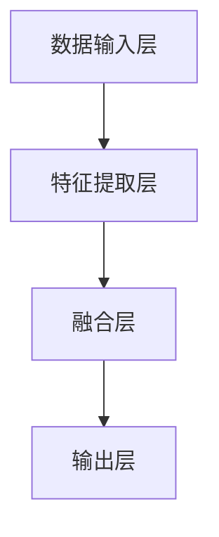
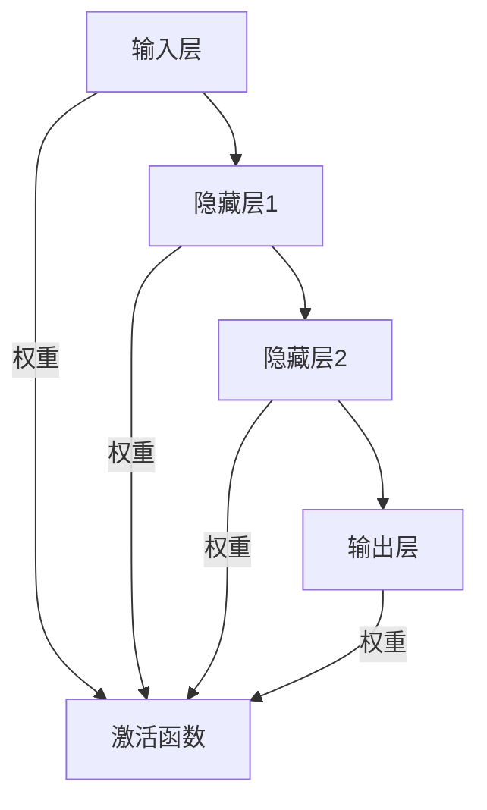
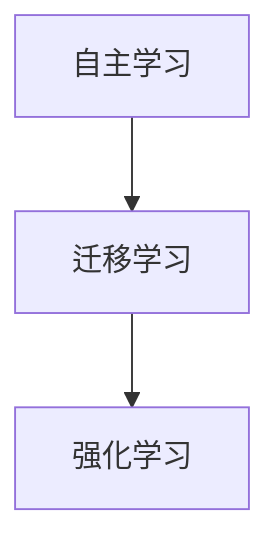

                 

# 大模型的自我进化：自主学习和持续进化

> **关键词：** 大模型、自我进化、自主学习、持续进化、算法基础、应用场景、未来挑战、伦理与法律。

> **摘要：** 本文旨在探讨大模型的自我进化机制，包括自主学习和持续进化的原理、实践和未来方向。通过分析大模型的技术框架、算法基础和具体应用，本文揭示了其自我进化的重要性及其在实际应用中面临的挑战和解决方案。同时，本文也对大模型的未来发展方向进行了展望，并讨论了其伦理和法律问题。

## 目录大纲

### 第一部分：大模型基础理论

#### 第1章：大模型概述

##### 1.1 大模型的历史与发展

##### 1.2 大模型的定义与特性

##### 1.3 大模型的技术框架

#### 第2章：大模型的算法基础

##### 2.1 神经网络

##### 2.2 自主学习与强化学习

##### 2.3 大模型与深度学习

### 第二部分：大模型的进化实践

#### 第3章：大模型的训练与优化

##### 3.1 数据预处理与增强

##### 3.2 大模型的训练过程

##### 3.3 大模型的优化策略

#### 第4章：大模型的应用场景

##### 4.1 图像识别

##### 4.2 自然语言处理

##### 4.3 语音识别

#### 第5章：大模型的自我进化

##### 5.1 自我进化的原理

##### 5.2 自我进化的实现方法

##### 5.3 持续进化的实践案例

#### 第三部分：大模型的未来与发展

##### 第6章：大模型的挑战与未来

##### 第7章：大模型的伦理与法律

#### 附录

##### 附录A：大模型开发工具与资源

## 第一部分：大模型基础理论

### 第1章：大模型概述

#### 1.1 大模型的历史与发展

大模型（Large Models）是指具有海量参数和强大计算能力的机器学习模型，它们能够处理大规模数据和复杂任务。大模型的发展可以分为几个阶段：

1. **早期阶段**：以人工神经网络和深度学习为基础，模型规模较小，参数数量有限。
2. **成长阶段**：随着计算能力和数据资源的提升，模型规模逐渐扩大，参数数量呈指数级增长。
3. **成熟阶段**：近年来，大模型在多个领域取得了显著进展，如自然语言处理、图像识别和语音识别。

大模型的发展历程与人工智能技术的进步紧密相关。以下是大模型在各领域应用的一些案例：

- **自然语言处理**：GPT-3和BERT等大模型在语言生成、文本分类和问答系统等领域取得了突破性成果。
- **图像识别**：Inception和ResNet等大模型在图像分类和物体检测任务上表现优异。
- **语音识别**：WaveNet和Transformer等大模型在语音识别和语音合成中取得了显著进展。

#### 1.2 大模型的定义与特性

大模型具有以下定义与特性：

- **定义**：大模型是指参数数量在数百万到数十亿之间的机器学习模型。
- **特性**：
  - **参数数量庞大**：大模型需要大量参数来捕捉复杂的数据分布和模式。
  - **计算资源需求高**：大模型训练和推理过程需要大量的计算资源和时间。
  - **泛化能力强**：大模型具有强大的泛化能力，能够处理多种类型的任务和数据。

#### 1.3 大模型的技术框架

大模型的技术框架主要包括以下部分：

- **数据输入层**：接收外部数据，如文本、图像和语音等。
- **特征提取层**：通过神经网络结构提取数据中的特征。
- **融合层**：将特征进行融合，生成模型表示。
- **输出层**：根据任务需求输出结果，如分类、回归或生成。

以下是梅尔图（Mermaid）流程图，用于描述大模型的技术框架：



#### 1.4 大模型的算法基础

大模型的算法基础主要包括神经网络、自主学习和强化学习。

- **神经网络**：神经网络是机器学习的基础，由大量神经元组成，通过调整神经元之间的权重来学习数据分布和模式。
- **自主学习**：自主学习是指模型在无监督或半监督环境下，通过自我调整来优化性能。
- **强化学习**：强化学习是指模型通过与环境的交互，不断调整行为策略，以最大化长期奖励。

以下是伪代码，用于描述自主学习和强化学习的算法细节：

```python
# 自主学习算法
def autonomous_learning(data, model):
    for epoch in range(num_epochs):
        for sample in data:
            model.update(sample)
    return model

# 强化学习算法
def reinforcement_learning(state, action, reward, next_state, model):
    model.update(state, action, reward, next_state)
    return model
```

#### 1.5 大模型与深度学习

深度学习是机器学习的一个重要分支，它通过多层神经网络结构，对数据进行逐层抽象和表示。大模型与深度学习密切相关，两者相互促进：

- **大模型推动深度学习**：大模型的规模和计算能力使得深度学习模型能够处理更复杂的数据和任务。
- **深度学习推动大模型**：深度学习算法的不断改进和优化，使得大模型在训练效率和性能上取得了显著提升。

## 第二部分：大模型的进化实践

### 第2章：大模型的算法基础

#### 2.1 神经网络

神经网络（Neural Networks）是机器学习的基础，它由大量神经元组成，通过调整神经元之间的权重来学习数据分布和模式。神经网络的基本原理如下：

- **神经元模型**：每个神经元接受多个输入，并通过激活函数产生输出。
- **权重与偏置**：神经元之间的权重和偏置用于调整输入信号的强度和位置。
- **反向传播**：通过反向传播算法，将输出误差反向传播到每个神经元，并更新权重和偏置。

以下是神经网络的基本原理和结构的梅尔图（Mermaid）流程图：



#### 2.2 自主学习与强化学习

自主学习（Autonomous Learning）和强化学习（Reinforcement Learning）是机器学习的两种重要方法，它们在大模型中发挥着关键作用。

- **自主学习**：自主学习是指模型在无监督或半监督环境下，通过自我调整来优化性能。自主学习的方法包括自编码器（Autoencoders）和生成对抗网络（GANs）。

- **强化学习**：强化学习是指模型通过与环境的交互，不断调整行为策略，以最大化长期奖励。强化学习的方法包括Q学习（Q-Learning）和深度确定性策略梯度（DDPG）。

以下是自主学习与强化学习的伪代码：

```python
# 自主学习算法
def autonomous_learning(data, model):
    for epoch in range(num_epochs):
        for sample in data:
            model.update(sample)
    return model

# 强化学习算法
def reinforcement_learning(state, action, reward, next_state, model):
    model.update(state, action, reward, next_state)
    return model
```

#### 2.3 大模型与深度学习

大模型（Large Models）与深度学习（Deep Learning）密切相关。深度学习通过多层神经网络结构，对数据进行逐层抽象和表示。大模型通过扩展神经网络规模，提高了模型的计算能力和泛化能力。

- **大模型推动深度学习**：大模型的规模和计算能力使得深度学习模型能够处理更复杂的数据和任务。

- **深度学习推动大模型**：深度学习算法的不断改进和优化，使得大模型在训练效率和性能上取得了显著提升。

### 第3章：大模型的训练与优化

#### 3.1 数据预处理与增强

数据预处理与增强是训练大模型的重要环节，它们有助于提高模型性能和泛化能力。

- **数据预处理**：包括数据清洗、归一化和标准化等步骤，确保数据质量。

- **数据增强**：通过随机变换和生成技术，增加数据多样性，提高模型鲁棒性。

以下是数据预处理和增强的方法：

- **数据清洗**：去除异常值、缺失值和重复值。

- **归一化**：将数据缩放到相同的范围，如[-1, 1]或[0, 1]。

- **标准化**：将数据缩放到零均值和单位方差。

- **数据增强**：包括旋转、翻转、缩放、裁剪等操作，增加数据多样性。

#### 3.2 大模型的训练过程

大模型的训练过程包括以下几个步骤：

1. **初始化模型**：设置模型参数的初始值。
2. **前向传播**：计算模型输出，并计算损失函数。
3. **反向传播**：计算损失函数关于模型参数的梯度，并更新模型参数。
4. **迭代优化**：重复前向传播和反向传播，直到模型性能满足要求。

以下是大模型训练过程的伪代码：

```python
def train_model(data, model, num_epochs):
    for epoch in range(num_epochs):
        for sample in data:
            model.forward(sample)
            loss = compute_loss(model.output, sample.label)
            model.backward(loss)
            model.update_parameters()
    return model
```

#### 3.3 大模型的优化策略

优化策略是提高大模型训练效率和性能的关键。常见的优化策略包括：

- **梯度下降**：通过计算损失函数关于模型参数的梯度，更新模型参数。
- **动量**：引入动量项，加速收敛速度。
- **学习率调整**：动态调整学习率，优化训练过程。

以下是优化策略的伪代码：

```python
def optimize_model(model, loss_function, optimizer):
    while not converged:
        model.forward(data)
        loss = loss_function(model.output, label)
        gradients = compute_gradients(model, loss)
        optimizer.update(model.parameters, gradients)
    return model
```

### 第4章：大模型的应用场景

#### 4.1 图像识别

图像识别是计算机视觉的重要应用领域，大模型在图像识别任务中表现出色。

- **卷积神经网络（CNN）**：CNN是图像识别的基础模型，通过卷积、池化和全连接层等操作，提取图像特征并分类。

- **预训练模型**：使用预训练模型进行迁移学习，提高图像识别性能。

以下是图像识别的伪代码：

```python
def image_recognition(image, model):
    feature_map = model.convolution(image)
    pooled_map = model.max_pooling(feature_map)
    flattened_map = model.flatten(pooled_map)
    output = model.fc(flattened_map)
    label = model.predict(output)
    return label
```

#### 4.2 自然语言处理

自然语言处理（NLP）是人工智能的重要领域，大模型在NLP任务中取得了显著成果。

- **词向量表示**：使用词向量表示文本，如Word2Vec和BERT等。

- **语言模型**：通过大规模语料库训练语言模型，用于文本生成、文本分类和机器翻译等任务。

以下是自然语言处理的伪代码：

```python
def text_classification(text, model):
    word_vectors = model.word_embedding(text)
    sentence_vector = model.average(word_vectors)
    output = model.fc(sentence_vector)
    label = model.predict(output)
    return label
```

#### 4.3 语音识别

语音识别是将语音信号转换为文本信息的过程，大模型在语音识别中发挥了重要作用。

- **自动语音识别（ASR）**：使用深度学习模型进行语音信号的识别和转换。

- **语音合成（TTS）**：通过生成对抗网络（GAN）等模型实现语音合成。

以下是语音识别的伪代码：

```python
def speech_recognition(audio, model):
    feature_vector = model.extract_features(audio)
    output = model.dnn(feature_vector)
    text = model.decode(output)
    return text
```

### 第5章：大模型的自我进化

#### 5.1 自我进化的原理

大模型的自我进化是指模型通过自我学习和自我优化，不断提高自身性能和适应能力。自我进化的原理包括：

- **自主学习**：模型通过无监督或半监督方式，自我学习和优化。
- **迁移学习**：利用预训练模型进行迁移学习，提高新任务的性能。
- **强化学习**：通过与环境的交互，调整模型策略，实现自我进化。

以下是自我进化的原理图：



#### 5.2 自我进化的实现方法

大模型的自我进化可以通过以下方法实现：

- **在线学习**：模型在运行过程中，不断接收新数据和反馈，进行在线学习。
- **模型融合**：将多个模型进行融合，提高整体性能。
- **模型剪枝**：通过剪枝和压缩技术，减小模型规模，提高计算效率。

以下是自我进化的伪代码：

```python
def self_evolution(model, data, feedback):
    for epoch in range(num_epochs):
        for sample in data:
            model.update(sample)
            feedback = model.evaluate(sample)
            model.optimize(feedback)
    return model
```

#### 5.3 持续进化的实践案例

大模型的持续进化在实践中具有重要意义，以下是一些实践案例：

- **自动驾驶**：自动驾驶系统通过持续进化，提高对复杂路况的适应能力和安全性。
- **智能客服**：智能客服系统通过持续进化，提高对用户需求的响应能力和服务质量。
- **智能医疗**：智能医疗系统通过持续进化，提高对疾病诊断和治疗的准确性和效率。

以下是持续进化的应用案例：

- **自动驾驶**：

```python
def autonomous_driving(self_evolution_model, driving_environment):
    for epoch in range(num_epochs):
        for driving_scenario in driving_environment:
            self_evolution_model.update(driving_scenario)
            driving_environment.feedback(self_evolution_model)
            self_evolution_model.optimize(driving_environment.feedback())
    return self_evolution_model
```

- **智能客服**：

```python
def intelligent_counseling(self_evolution_model, user_queries):
    for epoch in range(num_epochs):
        for query in user_queries:
            self_evolution_model.update(query)
            user_queries.feedback(self_evolution_model)
            self_evolution_model.optimize(user_queries.feedback())
    return self_evolution_model
```

- **智能医疗**：

```python
def intelligent_medicine(self_evolution_model, medical_data):
    for epoch in range(num_epochs):
        for medical_case in medical_data:
            self_evolution_model.update(medical_case)
            medical_data.feedback(self_evolution_model)
            self_evolution_model.optimize(medical_data.feedback())
    return self_evolution_model
```

### 第三部分：大模型的未来与发展

#### 第6章：大模型的挑战与未来

#### 6.1 大模型的挑战

大模型在发展过程中面临以下挑战：

- **计算资源需求**：大模型训练和推理过程需要大量计算资源和时间，这对硬件设备提出了高要求。
- **数据隐私和安全**：大模型在处理大量数据时，可能涉及用户隐私和安全问题，需要加强数据保护措施。
- **模型可解释性**：大模型的决策过程复杂，难以解释，这对模型的可解释性提出了挑战。

#### 6.2 大模型的未来发展方向

大模型的未来发展方向包括：

- **计算资源优化**：通过硬件升级和算法优化，提高大模型训练和推理的效率。
- **数据隐私保护**：采用加密和去身份化技术，保护用户数据隐私。
- **模型可解释性提升**：通过可视化和分析技术，提高大模型的可解释性。

#### 第7章：大模型的伦理与法律

#### 7.1 大模型的伦理问题

大模型的伦理问题包括：

- **公平性**：大模型在决策时可能存在偏见，影响公平性。
- **透明性**：大模型决策过程复杂，难以透明，可能引发信任危机。
- **责任归属**：大模型在发生错误时，责任归属难以界定。

#### 7.2 大模型的法律问题

大模型的法律问题包括：

- **隐私保护**：大模型处理大量个人数据，需要遵守相关隐私保护法律。
- **版权侵权**：大模型在生成内容时，可能涉及版权侵权问题。
- **责任承担**：大模型在发生错误时，责任承担需要明确界定。

### 附录

#### 附录A：大模型开发工具与资源

附录A列出了大模型开发所需的工具和资源：

- **开发工具**：
  - Python
  - TensorFlow
  - PyTorch
  - Keras

- **学习资源**：
  - 《深度学习》（Goodfellow, Bengio, Courville）
  - 《强化学习》（Sutton, Barto）
  - Coursera
  - edX

### 作者信息

作者：AI天才研究院/AI Genius Institute & 禅与计算机程序设计艺术/Zen And The Art of Computer Programming

