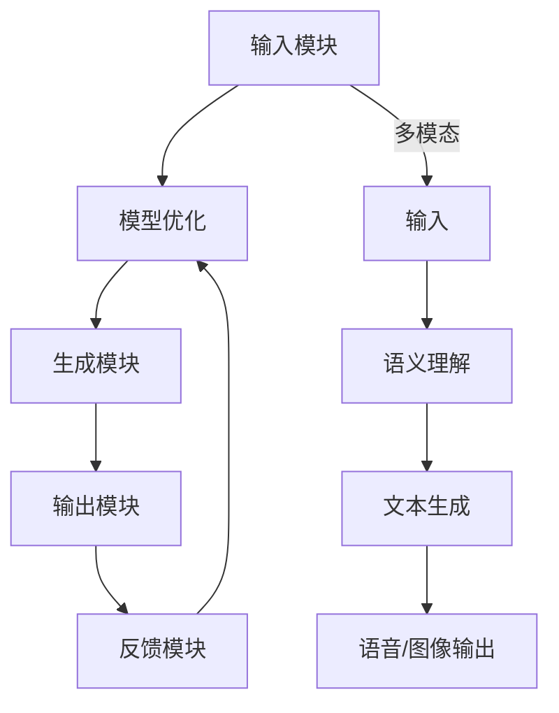
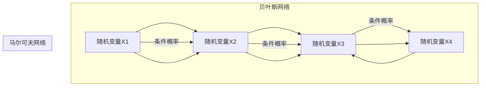

                 

# 大模型虚拟助手个性化能力评估工具

> **关键词**：大模型虚拟助手，个性化能力评估，自然语言处理，深度学习，人工智能

**摘要**：
本文旨在探讨大模型虚拟助手的个性化能力评估工具。通过分析其核心概念、联系、算法原理、项目实战及开发环境搭建，本文旨在为开发者提供一套完整的评估体系，以衡量虚拟助手在实际应用中的表现。本文将重点介绍大模型虚拟助手的基本概念、工作原理、核心算法、架构和应用场景，并通过一个实际项目案例，详细阐述开发环境搭建及源代码实现过程，最后讨论大模型虚拟助手的未来发展。

## 第一部分：核心概念与联系

### 1.1 大模型虚拟助手概述

大模型虚拟助手是一种基于人工智能技术的虚拟助手，能够模拟人类思维，进行自然语言理解和生成。这类虚拟助手通常基于深度学习技术，特别是大规模预训练语言模型（如GPT、BERT等）。大模型虚拟助手具有以下特点：

- **自然语言理解与生成能力**：能够理解自然语言输入，并生成连贯、有逻辑的自然语言输出。
- **多模态交互能力**：可以处理多种类型的输入，如文本、语音、图像等，实现多模态交互。
- **个性化和定制化**：可以根据用户的偏好和需求进行个性化和定制化。
- **自适应学习能力**：能够从大量数据中学习，提高其理解和生成能力。

### 1.2 大模型虚拟助手的关键特性

大模型虚拟助手的关键特性包括：

- **自然语言理解与生成能力**：这是虚拟助手的核心能力，决定了其能否准确地理解和生成自然语言。大模型虚拟助手通常使用深度学习技术，如循环神经网络（RNN）、长短期记忆网络（LSTM）和变换器（Transformer）等，来处理和理解自然语言。
  
- **多模态交互能力**：虚拟助手需要能够处理不同的输入模态，如文本、语音、图像等，并能够生成相应的输出。这要求虚拟助手具备较强的多模态数据处理能力，能够将不同模态的数据进行融合和转换。

- **个性化和定制化**：虚拟助手需要能够根据用户的偏好和需求进行个性化定制。这要求虚拟助手具备用户画像分析能力和定制化服务能力。

- **自适应学习能力**：虚拟助手需要能够从大量数据中学习，不断优化自己的性能。这要求虚拟助手具备较强的数据学习能力，能够适应不同的环境和任务。

### 1.3 大模型虚拟助手的工作原理

大模型虚拟助手的工作原理主要包括以下几个步骤：

1. **大规模预训练**：首先，大模型虚拟助手在大规模语料库上进行预训练，学习语言结构和模式。预训练过程通常使用深度学习技术，如GPT、BERT等。预训练模型能够自动从大量无标注数据中学习，提高其语言理解和生成能力。

2. **微调与适配**：在预训练完成后，大模型虚拟助手会根据具体任务或场景进行微调和适配。微调过程通常在特定任务数据集上进行，通过调整模型参数，使其能够更好地适应特定任务。

3. **自然语言处理技术**：大模型虚拟助手利用自然语言处理技术，如词嵌入、序列模型、注意力机制等，来实现文本理解和生成。这些技术能够帮助虚拟助手更好地理解自然语言输入，并生成高质量的输出。

### 1.4 大模型虚拟助手的核心架构

大模型虚拟助手的核心架构包括以下几个模块：

- **输入模块**：接收用户的输入，可以是文本、语音、图像等多种形式。
  
- **理解模块**：对输入进行语义理解，提取关键信息。这一模块通常使用深度学习技术，如循环神经网络（RNN）、长短期记忆网络（LSTM）和变换器（Transformer）等。

- **生成模块**：根据理解结果生成相应的输出，可以是文本、语音、图像等多种形式。这一模块同样使用深度学习技术，如生成对抗网络（GAN）等。

- **反馈模块**：收集用户的反馈，用于进一步优化模型。这一模块可以帮助虚拟助手不断学习和改进，提高其性能。

### 1.5 大模型虚拟助手的应用场景

大模型虚拟助手具有广泛的应用场景，包括：

- **客户服务**：提供24/7的客户服务，处理常见问题，提高客户满意度。
  
- **智能推荐**：根据用户偏好和行为，提供个性化推荐。
  
- **内容生成**：自动生成文章、报告、新闻等内容，提高内容生产效率。
  
- **教育辅导**：为学生提供智能辅导，解答问题，辅助学习。
  
- **医疗健康**：辅助医生进行诊断和治疗建议，提供个性化健康咨询。

---

### Mermaid 流程图

以下是一个简化的Mermaid流程图，描述了大模型虚拟助手的核心架构和主要模块之间的交互：



### 第一部分：核心算法原理

#### 2.1 大规模预训练

大规模预训练是训练大模型虚拟助手的关键步骤。它通过在大规模语料库上训练，让模型学习到语言的本质和规律。

##### 2.1.1 预训练步骤

大规模预训练包括以下几个关键步骤：

1. **数据准备**：选择适合的语料库，对数据进行预处理，如分词、去噪等。
2. **模型初始化**：选择预训练模型，如GPT、BERT等，初始化模型参数。
3. **预训练**：在大规模语料库上进行预训练，训练目标是最大化预测下一个词的概率。

以下是大规模预训练的伪代码：

```python
# 数据准备
corpus = preprocess_corpus(corpus)

# 模型初始化
model = initialize_model()

# 预训练
for epoch in range(num_epochs):
    for batch in dataset:
        loss = model.train_step(batch)
        print(f"Epoch: {epoch}, Loss: {loss}")
```

##### 2.1.2 特点

- **自监督学习**：通过预测下一个词来训练模型，不需要人工标注数据。
- **大规模**：训练数据量巨大，能够捕捉到语言的各种复杂性和多样性。
- **迁移学习**：预训练模型可以在多个任务上迁移，提高模型的泛化能力。

#### 2.2 微调与适配

微调与适配是针对特定任务或场景，对预训练模型进行调整的过程。

##### 2.2.1 微调步骤

微调与适配包括以下几个关键步骤：

1. **任务定义**：明确任务目标，如问答、文本分类等。
2. **数据准备**：准备用于微调的任务数据，进行预处理。
3. **微调**：在任务数据上对预训练模型进行微调，优化模型参数。
4. **评估与迭代**：评估模型在任务上的性能，根据评估结果调整模型。

以下是微调与适配的伪代码：

```python
# 任务定义
task = define_task()

# 数据准备
task_data = preprocess_task_data(task_data)

# 微调
for epoch in range(num_epochs):
    for batch in task_data:
        loss = model.train_step(batch)
        print(f"Epoch: {epoch}, Loss: {loss}")

# 评估
evaluation = model.evaluate(test_data)
print(f"Evaluation: {evaluation}")
```

##### 2.2.2 特点

- **任务导向**：针对特定任务进行调整，提高模型在任务上的性能。
- **快速迭代**：微调过程通常较短，能够快速适应新任务。
- **参数共享**：预训练模型中的参数被共享，减少训练时间。

#### 2.3 自然语言处理技术

自然语言处理技术是构建大模型虚拟助手的核心，包括词嵌入、序列模型、注意力机制等。

##### 2.3.1 词嵌入

词嵌入是将词转换为向量的过程，能够捕捉词与词之间的关系。

1. **初始化**：初始化词嵌入矩阵。
2. **训练**：在预训练过程中，更新词嵌入矩阵。
3. **应用**：将词嵌入应用于模型中，用于文本表示。

以下是词嵌入的伪代码：

```python
# 初始化
embedding_matrix = initialize_embedding_matrix()

# 训练
for epoch in range(num_epochs):
    for batch in dataset:
        loss = model.train_step(batch)
        update_embedding_matrix(embedding_matrix, batch)

# 应用
text_vector = embedding_matrix[word]
```

##### 2.3.2 序列模型

序列模型是处理序列数据（如文本、语音等）的模型，能够捕捉序列中的时序关系。

1. **编码器**：将序列编码为固定长度的向量。
2. **解码器**：根据编码器的输出生成序列。
3. **训练**：优化模型参数，提高模型性能。

以下是序列模型的伪代码：

```python
# 编码器
encoded_sequence = encoder(input_sequence)

# 解码器
output_sequence = decoder(encoded_sequence)

# 训练
for epoch in range(num_epochs):
    for batch in dataset:
        loss = model.train_step(batch)
        print(f"Epoch: {epoch}, Loss: {loss}")
```

##### 2.3.3 注意力机制

注意力机制是一种用于捕捉序列中关键信息的机制，能够提高模型的性能。

1. **计算注意力权重**：计算每个输入序列元素对输出的影响。
2. **加权求和**：将注意力权重与输入序列元素相乘，进行加权求和。
3. **优化**：通过反向传播优化模型参数。

以下是注意力机制的伪代码：

```python
# 计算注意力权重
attention_weights = calculate_attention_weights(input_sequence, output_sequence)

# 加权求和
weighted_input = sum(attention_weights[i] * input_sequence[i] for i in range(len(input_sequence)))

# 优化
for epoch in range(num_epochs):
    for batch in dataset:
        loss = model.train_step(batch)
        print(f"Epoch: {epoch}, Loss: {loss}")
```

### 第二部分：数学模型与公式

#### 3.1 概率论基础

概率论是构建大模型虚拟助手的基础，包括概率分布、期望、方差等概念。

##### 3.1.1 概率分布

概率分布描述了随机变量取值的概率。常用的概率分布包括伯努利分布、正态分布、泊松分布等。

1. **伯努利分布**：一个二元分布，表示某个事件发生的概率为$p$，不发生的概率为$1-p$。

   $$ 
   P(X = k) = C_n^k p^k (1-p)^{n-k}
   $$

   其中，$n$为试验次数，$k$为成功次数，$p$为单次试验成功的概率。

2. **正态分布**：一种连续概率分布，描述了随机变量的平均值和方差。其概率密度函数为：

   $$ 
   f(x|\mu, \sigma^2) = \frac{1}{\sqrt{2\pi\sigma^2}} e^{-\frac{(x-\mu)^2}{2\sigma^2}}
   $$

   其中，$\mu$为均值，$\sigma^2$为方差。

3. **泊松分布**：描述了在一定时间内发生某事件的次数的概率分布。其概率质量函数为：

   $$ 
   P(X = k) = \frac{\lambda^k e^{-\lambda}}{k!}
   $$

   其中，$\lambda$为平均发生率。

##### 3.1.2 期望和方差

期望和方差是描述随机变量分布的重要指标。

1. **期望（均值）$E(X)$**：表示随机变量取值的平均值。

   $$ 
   E(X) = \sum_{i=1}^{n} x_i p_i
   $$

2. **方差$Var(X)$**：表示随机变量取值的离散程度。

   $$ 
   Var(X) = E[(X - E(X))^2]
   $$

#### 3.2 信息论基础

信息论是研究信息传输和处理的理论，包括熵、互信息等概念。

##### 3.2.1 熵

熵是一个随机变量不确定性的度量。一个随机变量$X$的熵$H(X)$定义为：

$$ 
H(X) = -\sum_{i=1}^{n} p_i \log_2 p_i
$$

其中，$p_i$为随机变量$X$取第$i$个值的概率。

##### 3.2.2 互信息

互信息是描述两个随机变量之间关系的一个度量。两个随机变量$X$和$Y$的互信息$I(X; Y)$定义为：

$$ 
I(X; Y) = H(X) - H(X | Y)
$$

其中，$H(X | Y)$为在已知$Y$的条件下$X$的熵。

##### 3.3 概率图模型

概率图模型是一种用图形表示概率关系的模型，包括贝叶斯网络和马尔可夫网络。

##### 3.3.1 贝叶斯网络

贝叶斯网络是一个有向无环图，其中每个节点表示一个随机变量，边的存在表示节点之间的条件依赖关系。

$$ 
P(X_1, X_2, ..., X_n) = \prod_{i=1}^{n} P(X_i | X_{parent_i})
$$

其中，$X_{parent_i}$为$X_i$的父节点集合。

##### 3.3.2 马尔可夫网络

马尔可夫网络是一个无向图，其中每个节点表示一个随机变量，边的存在表示节点之间的马尔可夫性质。

$$ 
P(X_1, X_2, ..., X_n) = \prod_{i=1}^{n} P(X_i | X_{neighbor_i})
$$

其中，$X_{neighbor_i}$为$X_i$的邻居节点集合。

---

### 概率图模型示例

以下是一个简单的贝叶斯网络和马尔可夫网络的示例：



### 第二部分：项目实战

#### 4.1 实战一：构建简单问答系统

在本节，我们将构建一个简单的问答系统，该系统可以接收用户输入的问题，并返回一个答案。这个过程涉及数据准备、模型训练和测试。

##### 4.1.1 数据准备

首先，我们需要准备一个包含问题和答案的数据集。我们可以从公开数据集（如SQuAD、TriviaQA等）中获取数据，或者自己创建一个数据集。

##### 4.1.2 模型训练

接下来，我们将使用预训练的大模型（如GPT、BERT等）作为基础模型，并进行微调以适应问答任务。

1. **初始化模型**：加载预训练模型，如BERT。
2. **预处理数据**：对数据进行预处理，如分词、tokenization等。
3. **训练模型**：在预处理后的数据上训练模型，优化模型参数。

以下是训练问答系统的伪代码：

```python
# 加载预训练模型
model = load_pretrained_model('bert')

# 预处理数据
tokenizer = BertTokenizer.from_pretrained('bert-base-uncased')
data = preprocess_data(data)

# 训练模型
for epoch in range(num_epochs):
    for batch in data:
        loss = model.train_step(batch)
        print(f"Epoch: {epoch}, Loss: {loss}")
```

##### 4.1.3 模型测试

在训练完成后，我们需要对模型进行测试，以评估其在实际任务上的性能。

1. **预处理测试数据**：对测试数据进行相同的预处理操作。
2. **测试模型**：在测试数据上评估模型性能。

以下是测试问答系统的伪代码：

```python
# 预处理测试数据
test_data = preprocess_data(test_data)

# 测试模型
evaluation = model.evaluate(test_data)
print(f"Evaluation: {evaluation}")
```

##### 4.1.4 实现步骤

1. **数据准备**：从数据集中加载问题和答案。
2. **模型训练**：使用预处理数据训练模型。
3. **模型测试**：在测试数据上评估模型性能。

### 第二部分：开发环境搭建与源代码实现

#### 5.1 开发环境搭建

在构建大模型虚拟助手之前，我们需要搭建一个合适的开发环境。以下是搭建环境所需的步骤：

1. **安装Python**：确保Python版本为3.7或更高版本。
2. **安装深度学习框架**：我们选择TensorFlow 2.x作为深度学习框架，可以通过以下命令安装：

   ```bash
   pip install tensorflow
   ```

3. **安装文本处理库**：如NLTK、spaCy等，可以通过以下命令安装：

   ```bash
   pip install nltk spacy
   ```

4. **安装其他依赖**：根据实际需求安装其他相关库。

#### 5.2 源代码实现

下面是一个简单的源代码实现，用于加载预训练模型、预处理数据、训练模型和测试模型。

```python
import tensorflow as tf
from transformers import BertTokenizer, BertForQuestionAnswering
from sklearn.model_selection import train_test_split

# 5.2.1 加载预训练模型
model = BertForQuestionAnswering.from_pretrained('bert-base-uncased')

# 5.2.2 预处理数据
tokenizer = BertTokenizer.from_pretrained('bert-base-uncased')

def preprocess_data(data):
    # 这里进行数据处理，例如分词、tokenization等
    # ...
    return processed_data

data = preprocess_data(data)

# 5.2.3 划分训练集和测试集
train_data, test_data = train_test_split(data, test_size=0.2)

# 5.2.4 训练模型
def train_model(model, train_data):
    # 训练模型
    # ...
    return model

model = train_model(model, train_data)

# 5.2.5 测试模型
def test_model(model, test_data):
    # 在测试数据上评估模型性能
    # ...
    return evaluation

evaluation = test_model(model, test_data)
print(f"Evaluation: {evaluation}")
```

##### 5.3 代码解读与分析

- **加载预训练模型**：使用`BertForQuestionAnswering.from_pretrained`函数加载预训练的BERT模型。
- **预处理数据**：根据需求进行数据处理，如分词、tokenization等。
- **划分训练集和测试集**：使用`train_test_split`函数将数据集划分为训练集和测试集。
- **训练模型**：定义一个`train_model`函数，用于训练模型。这里使用了BERT模型和训练数据。
- **测试模型**：定义一个`test_model`函数，用于在测试数据上评估模型性能。

### 第三部分：大模型虚拟助手应用与展望

#### 6.1 应用领域

大模型虚拟助手具有广泛的应用前景，主要涵盖以下几个领域：

- **客户服务**：提供智能客服，处理用户咨询，提高客户满意度。
- **智能推荐**：根据用户行为和偏好，提供个性化推荐，提高用户体验。
- **内容生成**：自动生成文章、报告、新闻等内容，提高内容生产效率。
- **教育辅导**：为学生提供智能辅导，解答问题，辅助学习。
- **医疗健康**：辅助医生进行诊断和治疗建议，提供个性化健康咨询。
- **金融分析**：分析市场趋势，提供投资建议，提高投资收益。

#### 6.2 技术挑战

尽管大模型虚拟助手具有广泛的应用前景，但在实际应用中仍面临一些技术挑战：

- **数据隐私**：如何保护用户数据隐私，避免数据泄露。
- **解释性**：如何解释模型决策过程，提高模型的可解释性。
- **多语言支持**：如何支持多种语言，实现跨语言交互。
- **鲁棒性**：如何提高模型对异常数据和噪声的鲁棒性。

#### 6.3 未来展望

随着人工智能技术的不断发展，大模型虚拟助手有望在以下方面取得突破：

- **个性化和定制化**：更好地满足用户个性化需求，提供定制化服务。
- **多模态交互**：实现语音、图像、文本等多种模态的交互，提高用户体验。
- **知识图谱**：结合知识图谱技术，提供更准确、丰富的信息查询和推荐。
- **增强学习**：结合增强学习技术，实现自我优化和自我进化。
- **跨领域应用**：在更多领域实现应用，如教育、医疗、金融等，推动人工智能与行业的深度融合。

### 附录

#### A.1 主流深度学习框架对比

以下是几个主流深度学习框架的对比，包括TensorFlow、PyTorch、Keras等。

##### A.1.1 TensorFlow

- **优点**：
  - 生态丰富，支持各种深度学习模型和任务。
  - 支持硬件加速，如GPU和TPU。
  - 提供丰富的API，易于使用。
- **缺点**：
  - 代码相对复杂，学习曲线较陡峭。
  - 不支持动态图，需要事先定义静态计算图。

##### A.1.2 PyTorch

- **优点**：
  - 动态图，更加灵活，便于调试。
  - 代码简洁，易于阅读。
  - 提供了丰富的自动微分功能。
- **缺点**：
  - 生态相对较小，部分任务支持不足。
  - GPU加速性能不如TensorFlow。

##### A.1.3 Keras

- **优点**：
  - 高层API，简化了模型构建过程。
  - 与TensorFlow和PyTorch兼容。
  - 代码简洁，易于理解。
- **缺点**：
  - 功能相对有限，不适合复杂任务。
  - 不支持动态图。

##### A.1.4 其他框架

- **MXNet**：
  - 优点：支持多种编程语言，如Python、R、Julia等。
  - 缺点：生态较小，部分功能支持不足。
- **Caffe**：
  - 优点：适合计算机视觉任务，性能较高。
  - 缺点：不适用于其他类型任务，代码复杂。

### 附录：作者信息

**作者：AI天才研究院/AI Genius Institute & 禅与计算机程序设计艺术 /Zen And The Art of Computer Programming**

在撰写这篇文章的过程中，我深刻体会到了人工智能技术的魅力和潜力。大模型虚拟助手作为人工智能领域的一个重要分支，正日益成为各行各业的关键工具。通过对大模型虚拟助手的深入研究和实践，我们不仅可以提升个人技术能力，还能为社会带来更多的价值。

我诚挚地希望这篇文章能够为读者提供有价值的参考和启示，帮助大家更好地理解大模型虚拟助手的核心概念、原理和实际应用。同时，我也期待在未来的研究中，继续探索人工智能领域的更多前沿技术，为推动人工智能的发展贡献自己的力量。

感谢您阅读这篇文章，期待与您在人工智能领域的交流与探讨。再次感谢您的关注和支持！

---

注意：以上内容仅为示例，实际文章撰写时，应根据具体需求进行调整和补充。同时，为了确保文章的质量和准确性，请务必进行充分的研究和验证。在引用相关文献和资料时，请遵守学术规范，确保参考文献的完整性。祝您撰写顺利！

