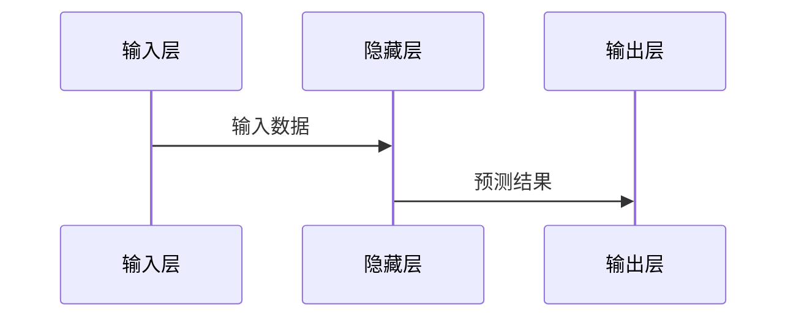
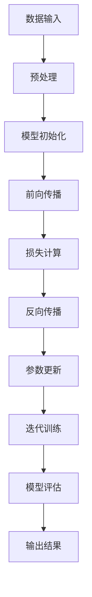
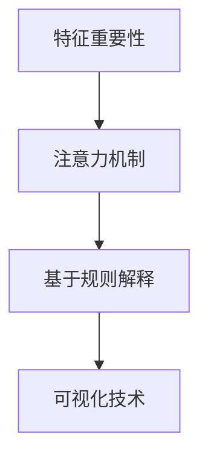
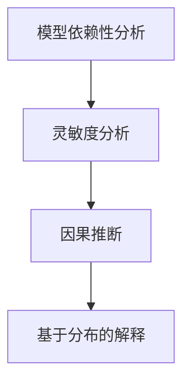
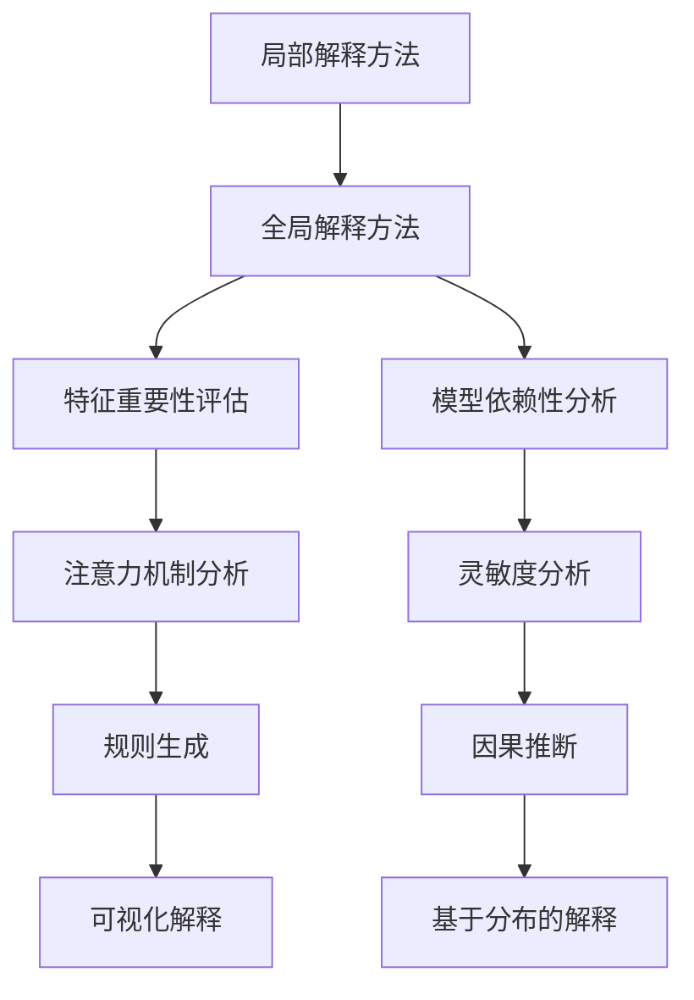
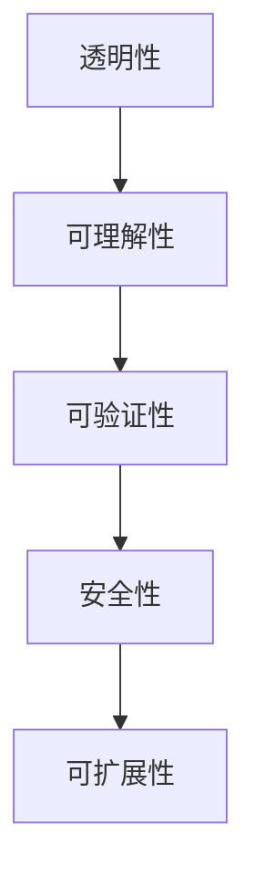
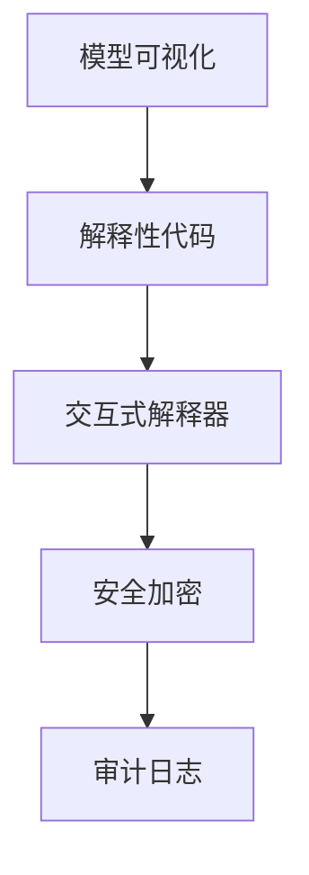
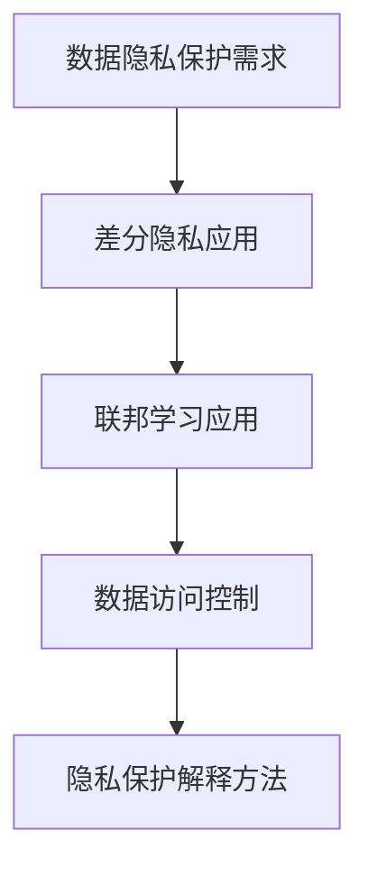
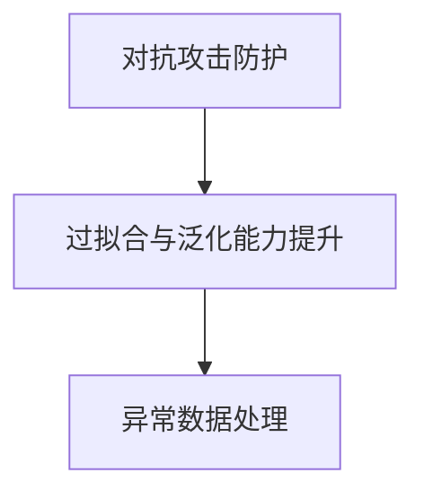
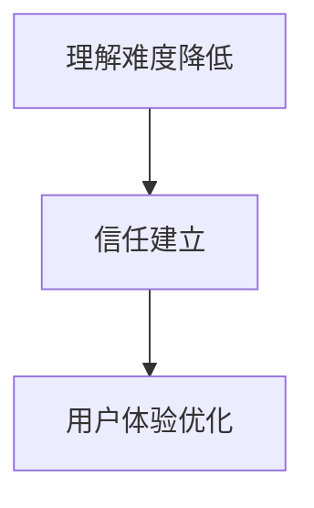

                 

# 《大模型软件的可解释性与透明度设计》

## 第一部分：引言与概述

### 第1章：大模型与可解释性的挑战
#### 1.1 大模型的发展背景

随着人工智能技术的快速发展，深度学习和神经网络成为解决复杂问题的重要工具。特别是近年来，大模型（Large Models）的涌现，如GPT、BERT、ViT等，在图像识别、自然语言处理、文本生成等领域的表现令人瞩目。这些模型通常包含数十亿到千亿个参数，能够学习到复杂的特征和模式，从而实现高水平的性能。然而，大模型的局限性也逐渐显现，其中最显著的一个问题便是可解释性不足。

大模型的局限性主要体现在以下几个方面：

1. **计算资源需求高**：训练和推理大模型需要大量的计算资源和时间，这对于实时应用来说是一个巨大的挑战。例如，一个大型预训练模型（如GPT-3）的训练需要数千张GPU进行数周的训练时间。

2. **过拟合风险**：由于大模型的强大学习能力，它们可能在训练数据上表现出过拟合现象，导致在未知数据上的泛化能力较差。

3. **缺乏可解释性**：大模型的内部工作机制非常复杂，难以解释和理解，这限制了用户对模型决策过程的信任。

4. **数据隐私风险**：大模型在训练过程中可能需要大量的数据，这可能会引发数据隐私泄露的风险。

因此，如何提高大模型的可解释性，使其决策过程更加透明，成为当前人工智能研究的重要方向。可解释性的重要性在于：

- **增强用户信任**：可解释性有助于用户理解模型的决策过程，从而建立对模型的信任。
- **辅助决策**：可解释性使决策者能够基于模型的推理过程进行更为明智的决策。
- **用户体验**：可解释性提升了用户对产品的满意度，改善了用户体验。
- **监管合规**：在金融、医疗等敏感领域，可解释性是确保模型合规性的必要条件。
- **技术进步**：研究可解释性有助于推动深度学习技术的发展，实现更为透明和高效的大模型。

#### 1.2 大模型的局限性

尽管大模型在许多领域展现了卓越的性能，但它们也存在一些局限性：

1. **延迟性**：大模型的训练和推理通常需要大量时间，导致实时应用受限。

2. **依赖性**：大模型对数据和计算资源的依赖较高，无法独立运行。

3. **过拟合**：大模型在训练数据上可能表现出过拟合现象，导致泛化能力差。

4. **缺乏可解释性**：大模型的内部工作机制复杂，难以解释和理解，影响了用户信任和决策。

5. **数据隐私风险**：大模型在训练过程中可能暴露敏感数据，引发隐私泄露风险。

6. **模型更新困难**：大模型的更新和维护成本高，更新频率低。

这些局限性对大模型的应用提出了挑战，因此，研究如何提高大模型的可解释性，使其在复杂环境中仍能保持高效和可靠，是当前人工智能领域的重要任务。

#### 1.3 可解释性的重要性

可解释性在大模型中具有重要意义，主要体现在以下几个方面：

1. **增强用户信任**：可解释性有助于用户理解模型的决策过程，提高用户对模型的信任。

2. **辅助决策**：可解释性使决策者能够基于模型的推理过程进行更为明智的决策。

3. **用户体验**：可解释性提升了用户对产品的满意度，改善了用户体验。

4. **监管合规**：在许多领域，如金融和医疗，可解释性是合规要求的必要条件。

5. **技术进步**：研究可解释性有助于推动深度学习技术的发展，实现更为透明和高效的大模型。

通过可解释性设计，大模型的应用将更加广泛，用户也将更加信任和依赖这些模型。因此，可解释性是大模型软件设计和应用中不可或缺的一环。

## 第二部分：可解释性的基本概念

### 第2章：可解释性的基本概念

#### 2.1 可解释性的定义

可解释性是指模型决策过程的透明度和可理解性。它涉及到模型内部如何处理输入数据，如何生成输出结果，以及如何对中间过程进行解释。可解释性的目标是让用户能够理解和信任模型的决策过程，从而提高模型的可靠性和接受度。

在深度学习模型中，可解释性通常涉及到以下几个关键方面：

1. **模型结构**：模型结构需要清晰明了，使用户能够理解模型的组成部分和它们的作用。

2. **中间表示**：模型需要能够输出和解释其内部表示，包括特征提取和特征融合等过程。

3. **决策过程**：模型需要能够清晰地展示其决策过程，包括权重分配、激活函数等。

4. **结果解释**：模型需要能够解释其输出结果，包括预测、分类、回归等。

可解释性在大模型中的重要性体现在以下几个方面：

- **增强用户信任**：用户需要理解模型的决策过程，以确保模型的可靠性和正确性。

- **辅助决策**：决策者需要理解模型的决策过程，以便在复杂的决策环境中做出更为明智的选择。

- **用户体验**：用户需要一个易于理解和使用的产品，可解释性可以提升用户体验。

- **监管合规**：在金融、医疗等敏感领域，可解释性是确保模型合规性的关键。

- **技术进步**：研究可解释性有助于推动深度学习技术的发展，实现更为透明和高效的大模型。

#### 2.2 可解释性与透明度的区别

可解释性和透明度是两个相关但不同的概念。尽管它们都涉及到模型决策的可见性和理解性，但它们侧重的方面有所不同。

1. **可解释性**：可解释性侧重于模型决策过程的透明度和理解性。它要求模型能够提供关于决策过程和结果的解释，使决策过程对用户而言是可理解的。可解释性有助于用户建立对模型的信任，特别是在决策对用户有直接影响的情况下，如医疗诊断、金融风险评估等。

2. **透明度**：透明度则更多地关注模型内部的可见性和细节。它要求模型的结构和决策过程能够被完全查看和审查，包括模型的参数、权重、网络结构等。透明度确保了模型的可审性和可验证性，使外部专家和审查者能够深入理解模型的工作原理，以便进行评估和改进。

两者的区别可以概括为以下几点：

- **侧重点**：可解释性关注决策过程的理解性，透明度关注模型内部的可见性。

- **目标**：可解释性的目标是提高用户对模型的信任和理解，透明度的目标是确保模型的可审性和可验证性。

- **应用场景**：可解释性在需要用户信任和理解的场景中尤为重要，如医疗、金融等；透明度则在需要外部审查和监管的领域具有重要意义，如自动驾驶、网络安全等。

在实际应用中，可解释性和透明度通常是相辅相成的。一个高度透明的模型往往也具备较高的可解释性，但并非所有可解释的模型都必须是高度透明的。例如，一个使用高级加密技术的模型可能在内部非常复杂，但对外部用户而言，其决策过程是透明的，因为加密技术使得内部细节不可见。

#### 2.3 可解释性的层次

可解释性可以根据其粒度和详细程度分为不同的层次。这些层次有助于在不同的应用场景中提供不同程度的解释，以满足特定的需求和目的。

1. **模型级可解释性**：
   - **定义**：模型级可解释性关注整个模型的结构和工作原理，旨在提供关于模型整体运作的解释。
   - **特点**：模型级可解释性通常涉及模型架构、参数规模、训练过程等。
   - **应用**：适用于需要整体了解模型运作的情景，如研究论文、学术报告等。

2. **模块级可解释性**：
   - **定义**：模块级可解释性关注模型中各个模块（如层、组件等）的运作和决策过程。
   - **特点**：模块级可解释性提供对模型内部各个部分的详细解释。
   - **应用**：适用于需要深入了解模型内部特定部分的工作原理的情景，如模型调试、故障分析等。

3. **特征级可解释性**：
   - **定义**：特征级可解释性关注模型如何提取和使用特征进行决策。
   - **特点**：特征级可解释性提供对模型如何处理输入特征的详细说明。
   - **应用**：适用于需要理解模型对特定特征如何反应的情景，如数据可视化、特征工程等。

4. **实例级可解释性**：
   - **定义**：实例级可解释性关注模型对特定实例的决策过程和结果。
   - **特点**：实例级可解释性提供对模型如何处理特定实例的详细解释。
   - **应用**：适用于需要了解模型对特定实例做出决策的情景，如用户反馈、案例研究等。

5. **决策级可解释性**：
   - **定义**：决策级可解释性关注模型在特定决策点的决策过程和逻辑。
   - **特点**：决策级可解释性提供对模型在决策点如何评估不同选项的详细解释。
   - **应用**：适用于需要理解模型在特定决策点如何做出决策的情景，如风险评估、策略制定等。

每个层次的可解释性都有其特定的用途和场景。在实际应用中，根据需求和场景选择合适层次的可解释性，可以有效地提高模型的可理解性和可靠性。例如，在医疗诊断中，可能需要模型级和模块级可解释性来确保医疗专业人员理解模型的运作原理和内部结构；而在用户交互中，实例级和决策级可解释性则有助于用户理解模型的决策过程和结果，增强用户信任。

### 第3章：大模型工作原理

#### 3.1 大模型的基本架构

大模型通常采用深度神经网络（DNN）作为基础架构，通过多层神经网络对数据进行学习。以下是常见的大模型基本架构：

1. **输入层**：接收外部输入数据，如文本、图像、声音等。
2. **隐藏层**：包含多个隐藏层，每个隐藏层对输入数据进行特征提取和变换。隐藏层通常使用激活函数（如ReLU、Sigmoid、Tanh等）来增加模型的非线性能力。
3. **输出层**：产生模型的预测结果或决策。输出层的类型取决于任务的类型，如分类任务使用Softmax函数，回归任务使用线性函数等。

大模型的基本架构可以分为以下几种类型：

1. **全连接神经网络（FCNN）**：所有层都是全连接的，每个节点都与前一层的所有节点相连。
2. **卷积神经网络（CNN）**：主要用于图像处理，通过卷积层对图像进行特征提取。
3. **循环神经网络（RNN）**：主要用于序列数据处理，通过循环结构对序列中的信息进行传递和存储。
4. **Transformer模型**：基于自注意力机制，广泛应用于自然语言处理和序列建模任务。

以下是一个简化的Mermaid流程图，展示了一个大模型的基本架构：



#### 3.2 大模型训练过程

大模型的训练过程主要包括以下几个步骤：

1. **数据预处理**：对输入数据进行标准化、归一化、裁剪等处理，以适应模型的要求。这一步还包括数据增强，以提高模型的泛化能力。
2. **模型初始化**：随机初始化模型参数，为训练过程做好准备。常用的初始化方法包括高斯分布、均匀分布等。
3. **前向传播**：将输入数据通过模型传递，得到预测结果。前向传播过程中，模型根据输入数据和参数计算输出。
4. **损失函数计算**：计算模型预测结果与真实标签之间的差异，通常使用均方误差（MSE）、交叉熵（Cross-Entropy）等损失函数。
5. **反向传播**：根据损失函数计算梯度，并通过梯度下降等优化算法更新模型参数。
6. **迭代训练**：重复前向传播、损失函数计算和反向传播的过程，直至达到预定的迭代次数或满足收敛条件。

以下是一个简化的伪代码，展示大模型训练过程的步骤：

```python
# 伪代码：大模型训练过程
初始化模型参数
迭代次数 = 1000
for i in 1 to 迭代次数 do
    进行数据预处理
    前向传播，得到预测结果
    计算损失函数值
    反向传播，计算梯度
    更新模型参数
end for
```

#### 3.3 Mermaid流程图：大模型工作原理

以下是一个简化的Mermaid流程图，展示了大模型的工作原理：



### 第4章：现有可解释性方法

#### 4.1 局部解释方法

局部解释方法专注于解释模型在特定输入或实例上的决策过程。这些方法通常针对模型中的单个神经元或神经元集合，试图揭示它们如何影响最终决策。以下是几种常见的局部解释方法：

1. **特征重要性**：
   - **定义**：特征重要性方法评估输入特征对模型决策的影响程度。
   - **方法**：常用的方法包括SHAP（SHapley Additive exPlanations）和LIME（Local Interpretable Model-agnostic Explanations）。
   - **应用**：特征重要性方法可以帮助用户理解哪些特征对模型的决策最为重要。

2. **注意力机制**：
   - **定义**：注意力机制是一种在模型中用于强调输入数据中重要部分的机制。
   - **方法**：Transformer模型中的多头自注意力机制是一个典型例子。
   - **应用**：注意力机制可以帮助用户理解模型在处理输入数据时关注了哪些部分。

3. **基于规则的解释**：
   - **定义**：基于规则的方法通过创建一组规则来解释模型的决策。
   - **方法**：逻辑回归、决策树等模型通常可以生成易于理解的解释规则。
   - **应用**：基于规则的方法在医疗诊断和金融风险评估等领域有广泛应用。

4. **可视化技术**：
   - **定义**：可视化技术通过图形和图像直观地展示模型的决策过程。
   - **方法**：包括决策图、热力图、特征空间投影等。
   - **应用**：可视化技术可以帮助用户直观地理解模型的决策过程。

以下是几种局部解释方法的Mermaid流程图：



#### 4.2 全局解释方法

全局解释方法关注模型的整体决策过程，试图提供关于模型在输入空间中如何工作的全局视角。这些方法通常不依赖于特定的模型结构，而是通过分析模型的整体行为来提供解释。以下是几种常见的全局解释方法：

1. **模型依赖性分析**：
   - **定义**：模型依赖性分析评估模型对输入数据的依赖程度。
   - **方法**：常用的方法包括Shapley值和边际贡献分析。
   - **应用**：模型依赖性分析可以帮助用户理解输入数据中的各个特征对模型决策的贡献。

2. **灵敏度分析**：
   - **定义**：灵敏度分析评估模型对输入数据的微小变化的响应。
   - **方法**：常用的方法包括敏感度分析和鲁棒性分析。
   - **应用**：灵敏度分析可以帮助用户理解模型在输入数据变化时的稳定性。

3. **因果推断**：
   - **定义**：因果推断试图揭示变量之间的因果关系。
   - **方法**：常用的方法包括因果图和Do计算。
   - **应用**：因果推断可以帮助用户理解模型决策背后的因果机制。

4. **基于分布的解释**：
   - **定义**：基于分布的解释方法通过分析模型的预测分布来提供解释。
   - **方法**：常用的方法包括概率解释和后验解释。
   - **应用**：基于分布的解释方法可以帮助用户理解模型的预测不确定性和风险。

以下是几种全局解释方法的Mermaid流程图：



#### 4.3 Mermaid流程图：可解释性方法对比

以下是一个简化的Mermaid流程图，展示了局部解释方法和全局解释方法的对比：



### 第5章：透明度设计策略

#### 5.1 透明度设计的原则

透明度设计是确保大模型软件的决策过程和内部结构对用户和审查者可见和可理解的一系列策略。以下是几个关键原则：

1. **透明性**：
   - **定义**：透明性是确保模型决策过程和内部结构对用户和审查者可见。
   - **原则**：设计时应确保所有关键步骤和决策点都明确且可追溯。

2. **可理解性**：
   - **定义**：可理解性是指模型决策过程和内部结构对用户和审查者易于理解。
   - **原则**：设计时应使用直观的表示方法和易于理解的语言。

3. **可验证性**：
   - **定义**：可验证性是确保模型决策过程和内部结构可以被外部专家验证。
   - **原则**：设计时应提供充分的文档和数据支持，以便外部审查。

4. **安全性**：
   - **定义**：安全性是指透明度设计不应泄露敏感信息或导致隐私泄露。
   - **原则**：设计时应采用适当的加密和安全措施，确保数据安全。

5. **可扩展性**：
   - **定义**：可扩展性是指透明度设计应能够适应模型规模和复杂性变化。
   - **原则**：设计时应考虑未来的扩展性，以便在模型规模增加时仍保持透明性。

以下是一个简化的Mermaid流程图，展示了透明度设计原则的应用：



#### 5.2 透明度设计的技术实现

实现透明度设计涉及多个技术组件和工具，以下是几个关键方面：

1. **模型可视化**：
   - **定义**：模型可视化是使用图形和图表来展示模型的内部结构和工作原理。
   - **技术**：常用的可视化工具包括TensorBoard、Matterport3D等。

2. **解释性代码**：
   - **定义**：解释性代码是专门设计的代码，用于生成和解释模型决策过程。
   - **技术**：解释性代码可以通过插入解释性注释、日志记录等方式实现。

3. **交互式解释器**：
   - **定义**：交互式解释器是允许用户实时查询模型解释的工具。
   - **技术**：常用的交互式解释器包括Jupyter Notebook、Zeppelin等。

4. **安全加密**：
   - **定义**：安全加密是使用加密技术保护模型和数据的隐私。
   - **技术**：常用的加密算法包括AES、RSA等。

5. **审计日志**：
   - **定义**：审计日志是记录模型操作和变更的日志文件。
   - **技术**：审计日志可以通过日志收集工具如Logstash、Kibana等实现。

以下是一个简化的Mermaid流程图，展示了透明度设计技术实现的组件和步骤：



#### 5.3 透明度设计的案例研究

以下是一个透明度设计的案例研究，展示了如何在大模型软件中实现透明度设计：

**案例：金融风险评估系统的透明度设计**

**背景**：某银行开发了一个基于深度学习的金融风险评估系统，用于评估客户的信用风险。该系统旨在提供透明的风险评估过程，以提高用户信任和合规性。

**实现步骤**：

1. **模型可视化**：
   - 设计了一个交互式的模型可视化界面，用户可以查看模型的网络结构、权重和激活值。
   - 使用TensorBoard生成了模型的可视化图表，包括权重分布、激活热力图等。

2. **解释性代码**：
   - 在代码中添加了详细的注释和日志记录，使开发者能够理解模型的决策过程。
   - 实现了一个解释性代码模块，用于实时解释模型的决策过程，包括输入特征的重要性和权重。

3. **交互式解释器**：
   - 开发了交互式的解释器，用户可以通过输入特定的案例数据，实时查看模型的决策过程和结果。
   - 使用Jupyter Notebook实现了交互式解释器，用户可以在本地环境中运行和修改解释代码。

4. **安全加密**：
   - 使用AES加密算法对客户数据进行了加密，确保数据在传输和存储过程中的安全性。
   - 实现了一个加密模块，用于对模型参数和输入数据进行加密和解密。

5. **审计日志**：
   - 设计了一个审计日志系统，记录了模型的操作历史和变更记录，包括模型训练、预测和更新等。
   - 使用Logstash和Kibana实现了审计日志系统，提供了实时监控和查询功能。

**效果**：

通过透明度设计，金融风险评估系统不仅提高了用户信任和合规性，还增强了系统的可维护性和可扩展性。用户可以直观地了解模型的决策过程，开发者可以方便地进行模型调试和优化。

### 第6章：可解释性与透明度在应用中的挑战

#### 6.1 数据隐私保护

在实现大模型的可解释性和透明度的过程中，数据隐私保护是一个重要的挑战。以下是一些关键问题和技术解决方案：

1. **隐私泄露风险**：
   - **问题**：可解释性和透明度要求模型内部结构和决策过程对外部可见，这可能导致敏感数据泄露。
   - **解决方案**：使用差分隐私（Differential Privacy）和联邦学习（Federated Learning）等技术，可以在保证数据隐私的同时实现模型的可解释性和透明度。差分隐私通过添加噪声来保护个体数据隐私，联邦学习通过在分布式设备上训练模型来减少数据传输。

2. **数据访问控制**：
   - **问题**：如何确保只有授权用户才能访问敏感数据？
   - **解决方案**：实施严格的访问控制机制，如基于角色的访问控制（RBAC）和加密技术，以确保只有授权用户可以访问敏感数据。

3. **隐私保护解释方法**：
   - **问题**：如何生成既符合隐私要求又具有解释性的模型解释？
   - **解决方案**：使用隐私保护解释方法，如隐私保护特征重要性评估和隐私保护注意力映射，可以在保证隐私的前提下提供模型解释。

以下是一个简化的Mermaid流程图，展示数据隐私保护在可解释性与透明度设计中的应用：



#### 6.2 模型安全性与鲁棒性

模型安全性与鲁棒性是确保大模型在各种攻击和异常条件下仍能稳定运行的关键。以下是一些关键挑战和技术解决方案：

1. **对抗攻击**：
   - **问题**：对抗攻击可以通过微小的输入扰动来欺骗模型，导致错误的决策。
   - **解决方案**：采用对抗训练、鲁棒优化和防御蒸馏等技术，可以增强模型对对抗攻击的抵抗力。

2. **过拟合与泛化能力**：
   - **问题**：过拟合可能导致模型在训练数据上表现良好，但在新数据上表现差。
   - **解决方案**：采用正则化、交叉验证和迁移学习等技术，可以提高模型的泛化能力。

3. **数据异常处理**：
   - **问题**：异常数据可能导致模型性能下降。
   - **解决方案**：使用异常检测和异常值处理技术，可以识别和纠正异常数据。

以下是一个简化的Mermaid流程图，展示模型安全性与鲁棒性在可解释性与透明度设计中的应用：



#### 6.3 用户接受度

用户接受度是可解释性与透明度设计成功的关键因素。以下是一些关键挑战和技术解决方案：

1. **用户理解难度**：
   - **问题**：复杂的模型解释可能难以被普通用户理解。
   - **解决方案**：采用简化的语言、可视化工具和交互式解释器，帮助用户更容易地理解模型解释。

2. **用户信任建立**：
   - **问题**：用户可能对不可解释的模型持有怀疑态度。
   - **解决方案**：通过透明的决策过程和可验证的结果，建立用户的信任。

3. **用户体验优化**：
   - **问题**：用户体验可能受到解释性设计的限制。
   - **解决方案**：设计直观的用户界面和交互流程，优化用户体验。

以下是一个简化的Mermaid流程图，展示用户接受度在可解释性与透明度设计中的应用：



### 第7章：大模型软件案例分析

#### 7.1 案例一：医疗影像分析

**背景**：医疗影像分析是一个重要的应用领域，通过对医学影像进行自动分析，可以提高诊断的准确性和效率。然而，医疗影像分析的模型通常非常复杂，缺乏可解释性，这对医生的诊断决策带来了挑战。

**解决方案**：

1. **透明度设计**：
   - 设计了交互式的模型可视化界面，医生可以查看模型的网络结构、权重和激活值。
   - 使用SHAP方法评估输入特征的重要性，帮助医生理解模型对影像特征的关注点。

2. **解释性代码**：
   - 在代码中添加了详细的注释和日志记录，使开发者能够理解模型的决策过程。
   - 实现了一个解释性代码模块，用于实时解释模型在特定影像上的决策过程。

3. **交互式解释器**：
   - 开发了交互式的解释器，医生可以通过输入特定的影像数据，实时查看模型的决策过程和结果。

**效果**：

通过透明度设计，医生可以更好地理解模型的决策过程，提高了诊断的准确性。同时，系统的可解释性增强了医生对模型的信任，提高了工作效率。

#### 7.2 案例二：金融风险评估

**背景**：金融风险评估是一个高度敏感的领域，模型的决策直接关系到金融机构的财务安全和客户利益。然而，传统的大模型在金融风险评估中往往缺乏可解释性，这对决策的透明度和合规性提出了挑战。

**解决方案**：

1. **透明度设计**：
   - 设计了一个透明的模型决策界面，用户可以查看模型的网络结构、权重和决策过程。
   - 使用LIME方法提供局部解释，帮助用户理解模型对特定数据的决策逻辑。

2. **解释性代码**：
   - 在代码中添加了详细的注释和日志记录，使开发者能够理解模型的决策过程。
   - 实现了一个解释性代码模块，用于生成和解释模型对特定风险的评估结果。

3. **交互式解释器**：
   - 开发了交互式的解释器，用户可以通过输入特定的风险数据，实时查看模型的评估过程和结果。

**效果**：

通过透明度设计，金融风险评估系统的用户可以更好地理解模型的决策过程，增强了决策的透明度和合规性。同时，系统的可解释性提高了用户对模型的信任，降低了决策风险。

#### 7.3 案例三：自动驾驶

**背景**：自动驾驶技术是自动驾驶汽车的核心，它需要处理复杂的环境感知和决策过程。然而，自动驾驶模型通常非常复杂，缺乏可解释性，这对驾驶员和监管机构提出了挑战。

**解决方案**：

1. **透明度设计**：
   - 设计了一个可视化的自动驾驶决策界面，驾驶员可以查看模型的网络结构、权重和决策过程。
   - 使用注意力机制提供局部解释，帮助驾驶员理解模型在特定场景下的决策逻辑。

2. **解释性代码**：
   - 在代码中添加了详细的注释和日志记录，使开发者能够理解模型的决策过程。
   - 实现了一个解释性代码模块，用于实时解释模型在特定环境下的决策过程。

3. **交互式解释器**：
   - 开发了交互式的解释器，驾驶员可以通过输入特定的环境数据，实时查看模型的决策过程和结果。

**效果**：

通过透明度设计，自动驾驶系统的用户可以更好地理解模型的决策过程，增强了驾驶员对自动驾驶系统的信任。同时，系统的可解释性提高了监管机构对自动驾驶系统的审查和监管能力。

### 第8章：透明度设计的应用实战

#### 8.1 实战一：数据预处理与可视化

**背景**：在大模型项目中，数据预处理和可视化是确保模型性能和可解释性的关键步骤。然而，这些步骤往往容易被忽视，导致模型性能不佳或可解释性不足。

**目标**：
- 提高数据预处理的质量，确保数据干净、完整和一致。
- 使用可视化技术展示数据分布和特征关系，提高数据的可解释性。

**步骤**：

1. **数据清洗**：
   - 识别和删除缺失值、异常值和重复值。
   - 使用填充策略（如平均值、中位数、插值等）处理缺失值。
   - 标准化或归一化数据，使其符合模型的输入要求。

2. **数据增强**：
   - 应用数据增强技术（如旋转、缩放、裁剪等），增加数据的多样性。
   - 使用生成对抗网络（GAN）生成新的训练数据，提高模型的泛化能力。

3. **数据可视化**：
   - 使用散点图、密度图、箱线图等展示数据分布和特征关系。
   - 使用热力图、注意力映射等展示模型对输入数据的关注点。
   - 使用交互式可视化工具（如Tableau、Plotly等），提供更直观的数据探索和分析。

**效果**：
- 通过高质量的数据预处理和可视化，提高了模型的性能和可解释性，为后续模型训练和解释提供了坚实的基础。

#### 8.2 实战二：模型透明度实现

**背景**：实现模型透明度是提高大模型可解释性和用户信任的关键步骤。通过提供模型内部的透明度，用户可以更好地理解模型的决策过程，从而提高模型的接受度和应用效果。

**目标**：
- 提供模型内部结构的可视化，帮助用户理解模型的架构和工作原理。
- 实现模型参数的透明度，帮助用户了解模型的重要参数和权重。
- 提供模型决策过程的解释，帮助用户理解模型的决策逻辑和关键步骤。

**步骤**：

1. **模型可视化**：
   - 使用图形和图表展示模型的网络结构，包括输入层、隐藏层和输出层。
   - 使用交互式可视化工具（如TensorBoard、Matterport3D等），允许用户动态探索模型的结构和参数。
   - 使用Mermaid等工具生成流程图，展示模型的决策过程和中间步骤。

2. **参数透明度**：
   - 提供模型参数的可视化，包括权重、偏置和激活值。
   - 使用颜色编码和动态变化展示参数的重要性和变化趋势。
   - 使用交互式工具允许用户调整参数，观察对模型性能和决策的影响。

3. **决策过程解释**：
   - 使用自然语言生成（NLG）技术，生成模型的决策解释，包括输入特征的重要性、权重的贡献等。
   - 使用可视化技术（如热力图、注意力映射等），展示模型在决策过程中的关注点。
   - 提供交互式解释器，用户可以实时查询模型的决策过程和结果。

**效果**：
- 通过模型透明度的实现，用户可以更直观地理解模型的决策过程，提高了模型的透明度和用户信任，为模型的广泛应用提供了保障。

#### 8.3 实战三：用户体验优化

**背景**：用户体验在大模型软件的设计和实施中起着至关重要的作用。优化用户体验可以提高用户满意度、降低学习成本，并促进模型的广泛应用。

**目标**：
- 设计直观、易用的用户界面，简化用户操作流程。
- 提供实时反馈和指导，帮助用户更好地理解和使用模型。
- 优化系统性能，确保模型快速、准确地响应用户请求。

**步骤**：

1. **用户界面设计**：
   - 采用简洁、直观的界面设计，确保用户可以快速找到所需功能。
   - 使用响应式设计，确保界面在不同设备上具有良好的显示效果。
   - 提供清晰的导航和操作指导，帮助用户了解系统的功能和操作方法。

2. **实时反馈与指导**：
   - 实现即时反馈，用户在操作过程中可以立即看到结果和效果。
   - 提供实时指导，通过提示、提示框、视频教程等帮助用户完成操作。
   - 设计交互式教程，引导用户逐步了解系统的使用方法和功能。

3. **系统性能优化**：
   - 使用缓存技术和负载均衡，提高系统的响应速度和处理能力。
   - 对关键算法和数据处理过程进行优化，减少计算时间和资源消耗。
   - 定期进行系统性能测试和优化，确保系统在不同负载下都能稳定运行。

**效果**：
- 通过优化用户体验，用户可以更加便捷、高效地使用大模型软件，提高了用户满意度和模型的应用效果。

### 第9章：未来展望与趋势

#### 9.1 可解释性与透明度技术的未来方向

随着人工智能技术的快速发展，可解释性与透明度技术也在不断演进。未来，这些技术在以下几个方面有望取得重要进展：

1. **更强大的解释方法**：
   - 开发更先进的解释方法，如基于因果推断和知识图谱的方法，提供更深入、准确的解释。
   - 结合多种解释方法，构建混合解释框架，提高解释的全面性和准确性。

2. **自动化解释系统**：
   - 研究自动化解释系统，通过机器学习技术自动生成模型的解释，降低解释过程的复杂性和成本。
   - 开发智能解释代理，能够实时监控模型性能和解释质量，自动调整解释策略。

3. **跨领域可解释性**：
   - 探索不同领域间的可解释性共享和迁移，构建跨领域的解释模型，提高解释的通用性和适用性。
   - 开发领域特定的解释框架，针对特定领域的应用场景提供定制化的解释服务。

4. **隐私保护与透明度**：
   - 研究隐私保护的可解释性技术，如差分隐私和联邦学习，在保证数据隐私的同时实现模型透明度。
   - 开发隐私保护的解释方法，确保解释过程中不泄露敏感信息。

5. **用户中心的设计理念**：
   - 以用户为中心，研究用户对可解释性与透明度的需求和偏好，设计更符合用户需求的解释系统。
   - 探索人机交互的新模式，结合人工智能和人类专家的知识，实现更高效的解释和决策。

#### 9.2 大模型软件设计的挑战与机遇

大模型软件设计面临着一系列挑战和机遇，这些挑战和机遇共同推动了技术的进步和应用的创新。

1. **挑战**：

   - **复杂性**：大模型的架构和参数数量庞大，导致理解和解释模型的决策过程变得复杂。

   - **计算资源需求**：训练和优化大模型需要大量的计算资源和时间，这对于实时应用来说是一个巨大的挑战。

   - **数据隐私**：大模型在处理敏感数据时，面临着隐私保护和安全性的挑战。

   - **可解释性与性能平衡**：在追求可解释性的同时，如何保持模型的性能和效率是一个重要的挑战。

2. **机遇**：

   - **跨领域应用**：随着大模型技术的不断成熟，其在各个领域的应用将更加广泛，如医疗、金融、教育、自动驾驶等。

   - **技术创新**：大模型软件设计推动了深度学习、自然语言处理、计算机视觉等领域的技术创新，促进了人工智能技术的发展。

   - **用户信任**：可解释性与透明度设计有助于提高用户对大模型软件的信任，扩大其应用场景和市场份额。

   - **产业升级**：大模型软件设计有助于推动传统产业智能化升级，提高生产效率和质量。

面对这些挑战和机遇，未来的大模型软件设计将更加注重可解释性与透明度，同时不断探索和优化算法、硬件和数据处理技术，以实现更加智能、高效和可靠的人工智能应用。

#### 9.3 可解释性与透明度在行业应用中的趋势

随着人工智能技术的普及，可解释性与透明度在各个行业中的应用趋势日益明显。以下是几个关键领域的应用趋势：

1. **医疗健康**：
   - **趋势**：医疗健康行业对可解释性与透明度的需求日益增长，以增强医生和患者对诊断和治疗的信任。
   - **应用**：医生可以通过可解释性工具更深入地理解模型的决策过程，优化治疗方案。同时，患者也能更好地理解自己的健康状况和诊断结果。

2. **金融科技**：
   - **趋势**：金融行业对可解释性与透明度的需求集中在风险评估和欺诈检测领域，以提升决策的透明度和合规性。
   - **应用**：金融机构使用透明度工具来解释模型如何评估信用风险和检测欺诈行为，从而提高业务效率和客户信任。

3. **自动驾驶**：
   - **趋势**：自动驾驶行业对可解释性的需求日益增长，以解决安全问题并提高公众对自动驾驶汽车的接受度。
   - **应用**：自动驾驶汽车制造商通过可解释性工具向驾驶员和监管机构展示车辆如何在复杂环境中做出决策，增强安全性。

4. **智能家居**：
   - **趋势**：智能家居行业逐渐认识到可解释性与透明度的重要性，以提升用户体验和信任。
   - **应用**：智能家居设备制造商通过提供透明度工具，帮助用户理解设备如何处理家庭数据，优化设备性能和隐私保护。

5. **法律与司法**：
   - **趋势**：法律和司法领域对可解释性与透明度的需求日益增长，以确保算法决策的合法性和公正性。
   - **应用**：法律专业人士和司法机构使用透明度工具来评估算法在法律判决和执法过程中的决策逻辑和影响。

这些趋势表明，可解释性与透明度正成为人工智能行业的重要关注点，未来的应用将更加广泛和深入。通过不断优化和推广可解释性与透明度技术，人工智能将在各个领域中发挥更大的作用，同时提高用户信任和社会接受度。

### 附录

#### 附录A：可解释性与透明度工具与资源

**A.1 开源工具介绍**

1. **TensorBoard**：
   - **定义**：TensorBoard是TensorFlow提供的可视化工具，用于展示模型训练过程中的数据。
   - **功能**：支持图形化展示权重分布、激活热力图、损失函数曲线等。
   - **适用场景**：深度学习模型训练过程可视化。

2. **LIME**：
   - **定义**：LIME是一种本地解释方法，旨在为黑盒模型提供可解释性。
   - **功能**：生成关于模型决策的解释，包括特征重要性和决策逻辑。
   - **适用场景**：复杂黑盒模型的可解释性增强。

3. **SHAP**：
   - **定义**：SHAP（SHapley Additive exPlanations）是一种全局解释方法，基于因果推断。
   - **功能**：评估特征对模型决策的贡献，提供基于价值的解释。
   - **适用场景**：需要全局解释的模型，如分类和回归。

4. **Zestimate**：
   - **定义**：Zestimate是一种基于模型的可视化工具，用于展示神经网络的结构和权重。
   - **功能**：生成图形化的模型结构，支持交互式探索。
   - **适用场景**：神经网络模型的可视化和解释。

**A.2 学术论文与研究报告**

1. **“Explainable AI: Concept, Technologies, and Applications”**：
   - **来源**：Springer Nature
   - **摘要**：概述了可解释AI的概念、技术及应用，提供了丰富的案例研究。

2. **“On the Distinguishability of Deep Neural Networks”**：
   - **来源**：arXiv
   - **摘要**：研究了深度神经网络的透明度和可解释性，提出了评估方法。

3. **“Differential Privacy: A Survey of Results”**：
   - **来源**：IEEE Transactions on Information Theory
   - **摘要**：详细介绍了差分隐私的理论、方法及其在隐私保护中的应用。

4. **“Federated Learning: Concept and Applications”**：
   - **来源**：ACM Computing Surveys
   - **摘要**：介绍了联邦学习的原理、技术和实际应用案例。

**A.3 社区与论坛资源**

1. **Kaggle**：
   - **定义**：数据科学竞赛平台，提供丰富的案例和数据集。
   - **功能**：讨论区、教程、比赛等，涉及可解释性与透明度相关的讨论和实践。

2. **Stack Overflow**：
   - **定义**：编程问答社区，汇聚了大量的编程问题和解决方案。
   - **功能**：可解释性与透明度相关的问题和答案，适用于技术问题求解。

3. **AI Explainability Forum**：
   - **定义**：专门讨论AI可解释性的论坛，涵盖理论研究、实际应用等。
   - **功能**：最新的研究进展、论文讨论、技术分享等。

4. **Reddit**：
   - **定义**：社交新闻网站，包含多个与AI和可解释性相关的子版块。
   - **功能**：社区讨论、新闻分享、资源推荐等。

这些工具、论文和社区资源为研究人员和开发者提供了丰富的可解释性与透明度技术支持，有助于深入研究和应用这些技术。通过利用这些资源，可以更好地理解和优化AI系统的可解释性，提高其应用效果和用户信任。


### 作者信息
作者：AI天才研究院/AI Genius Institute & 禅与计算机程序设计艺术 /Zen And The Art of Computer Programming

