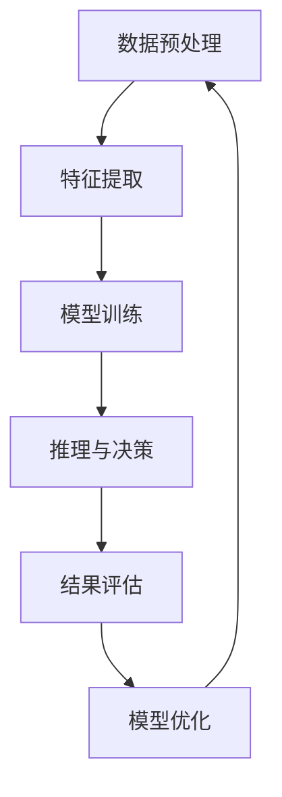
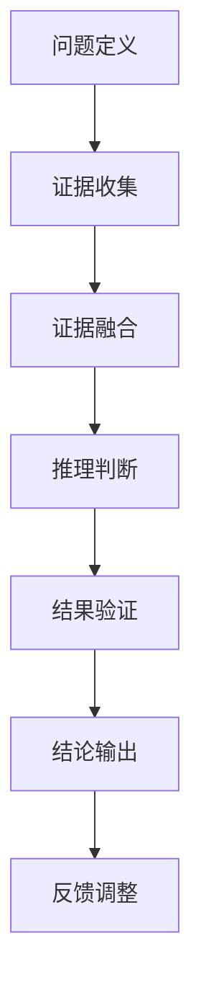
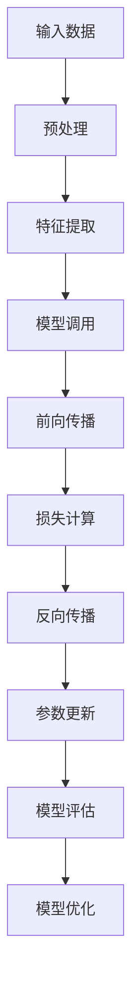

                 

# 大模型逻辑推理：提示词构建论证链

> **关键词：** 大模型，逻辑推理，提示词，论证链，人工智能

> **摘要：** 本文深入探讨大模型逻辑推理中的关键要素——提示词的构建与论证链的设计，分析大模型逻辑推理的基础理论、核心算法以及实际应用，旨在为读者提供系统化、实用性的指导。

## 目录

### 第一部分：大模型逻辑推理基础

#### 第1章：大模型逻辑推理概述

1.1 大模型逻辑推理的定义与背景

1.2 大模型逻辑推理的优势与应用

1.3 大模型逻辑推理的发展历程

#### 第2章：提示词构建与论证链设计

2.1 提示词的作用与分类

2.2 提示词构建策略

2.3 论证链设计原理

2.4 论证链设计技巧

#### 第3章：大模型逻辑推理技术基础

3.1 大模型的基本概念与结构

3.2 大模型的训练与优化

3.3 大模型的推理与部署

#### 第4章：逻辑推理的核心算法

4.1 逻辑推理的基本算法

4.2 知识图谱与逻辑推理

4.3 对话系统中的逻辑推理

#### 第5章：大模型逻辑推理应用实例

5.1 法律文档分析

5.2 金融风险评估

5.3 智能问答系统

5.4 证据推理与医疗诊断

#### 第6章：大模型逻辑推理的发展趋势与挑战

6.1 大模型逻辑推理的未来发展方向

6.2 技术挑战与解决方案

6.3 伦理与隐私问题

#### 第7章：大模型逻辑推理项目实战

7.1 项目背景与目标

7.2 项目需求分析与设计

7.3 项目实施与部署

7.4 项目评估与优化

7.5 项目总结与展望

### 附录

#### 附录 A：大模型逻辑推理常用工具与资源

A.1 大模型训练工具

A.2 逻辑推理工具

A.3 数据集与模型资源

#### 附录 B：逻辑推理流程图

B.1 大模型逻辑推理流程

B.2 论证链构建流程

B.3 逻辑推理算法流程

#### 附录 C：大模型逻辑推理数学模型与公式

C.1 大模型训练目标函数

C.2 论证链评价函数

C.3 逻辑推理概率模型

#### 附录 D：大模型逻辑推理代码解读

D.1 数据预处理代码解读

D.2 训练与推理代码解读

D.3 项目实战代码解读

D.4 代码解读与分析

D.5 源代码与资源获取指引

## 引言

在大数据与人工智能蓬勃发展的时代，大模型（Large Models）已经成为推动技术进步的重要力量。从自然语言处理到计算机视觉，再到智能推理与决策，大模型展现了无与伦比的潜力。然而，如何有效地利用大模型进行逻辑推理，成为当前人工智能研究中的一个重要课题。

逻辑推理是人工智能的核心能力之一，它涉及到从已知信息中推导出新信息的过程。在大模型中，逻辑推理不仅要求模型具备强大的数据处理能力，还需要能够有效地构建论证链（Argument Chain），从而实现复杂问题的推理与决策。

本文将围绕大模型逻辑推理展开，系统地介绍大模型逻辑推理的基础知识、核心算法、实际应用以及未来发展趋势。同时，我们将重点关注提示词的构建与论证链的设计，因为这些要素在大模型逻辑推理中起着至关重要的作用。

本文结构如下：

- **第一部分：大模型逻辑推理基础**：介绍大模型逻辑推理的定义、背景、优势和应用，并探讨大模型的基本概念、训练与优化技术。

- **第二部分：提示词构建与论证链设计**：详细阐述提示词的作用、分类、构建策略，以及论证链的设计原理与技巧。

- **第三部分：大模型逻辑推理技术基础**：深入探讨大模型的逻辑推理核心算法，包括知识图谱、对话系统等。

- **第四部分：大模型逻辑推理应用实例**：通过具体案例展示大模型逻辑推理在实际应用中的效果。

- **第五部分：大模型逻辑推理的发展趋势与挑战**：分析大模型逻辑推理的未来发展方向、技术挑战以及伦理与隐私问题。

- **第六部分：大模型逻辑推理项目实战**：介绍一个实际项目，从背景、需求分析、设计、实施、评估到优化，全面展示大模型逻辑推理的应用过程。

- **附录**：提供大模型逻辑推理常用工具与资源，以及详细的流程图、数学模型与代码解读。

通过本文的阅读，读者将能够全面了解大模型逻辑推理的基本原理、核心技术和实际应用，为后续的研究和实践打下坚实的基础。

### 第一部分：大模型逻辑推理基础

#### 第1章：大模型逻辑推理概述

##### 1.1 大模型逻辑推理的定义与背景

大模型逻辑推理是指利用大规模人工智能模型进行逻辑推理的过程，旨在通过模型从已知信息中推导出新的结论或知识。逻辑推理是人类智能的核心能力之一，它涉及到从一组前提中通过逻辑规则推导出结论的过程。传统逻辑推理通常依赖于形式逻辑、谓词逻辑等理论框架，而大模型逻辑推理则借助深度学习、自然语言处理等现代人工智能技术，通过大规模数据进行训练和优化，实现更为复杂和高效的推理任务。

大模型逻辑推理的背景可以追溯到深度学习和自然语言处理的快速发展。随着计算能力的提升和数据量的爆炸式增长，大模型（如BERT、GPT、Turing等）在自然语言处理、图像识别、语音识别等领域取得了显著成果。然而，这些大模型在处理逻辑推理任务时，仍然面临着一些挑战，如语义理解的不完整性、逻辑规则的泛化能力不足等。为了解决这些问题，研究人员开始探索如何在大模型中引入逻辑推理机制，从而提升模型在推理任务上的表现。

##### 1.2 大模型逻辑推理的优势与应用

大模型逻辑推理具有以下几大优势：

1. **强大的数据处理能力**：大模型通过深度学习算法可以从海量数据中学习到复杂的模式和关系，这使得它在处理逻辑推理任务时能够充分利用数据优势，提高推理的准确性和效率。

2. **自适应的推理能力**：大模型可以根据不同的推理任务自适应地调整其结构和参数，从而在不同应用场景下展现出良好的推理性能。

3. **跨领域的通用性**：大模型可以通过迁移学习技术在多个领域实现快速应用，减少了领域特定的知识积累和模型开发成本。

大模型逻辑推理的应用领域非常广泛，主要包括：

1. **智能问答系统**：大模型可以理解用户的问题，并从海量知识库中检索出相关的答案，应用于客服、教育、医疗等多个领域。

2. **法律文档分析**：大模型可以解析复杂的法律文档，自动提取关键信息，辅助法律专业人士进行案件分析和判决。

3. **金融风险评估**：大模型通过对金融数据的分析和逻辑推理，可以帮助金融机构进行风险管理和投资决策。

4. **智能诊断与医疗决策**：大模型可以分析患者的病历和检查结果，提供诊断建议和治疗方案。

5. **智能助理与虚拟助手**：大模型可以模拟人类思维过程，为用户提供智能化的建议和服务。

##### 1.3 大模型逻辑推理的发展历程

大模型逻辑推理的发展历程可以分为以下几个阶段：

1. **初步探索阶段（2010年以前）**：在这一阶段，研究人员开始尝试将逻辑推理与机器学习相结合，例如，基于逻辑回归的推理方法。然而，由于计算能力和数据量的限制，这些方法在复杂推理任务上表现不佳。

2. **深度学习引入阶段（2010-2015年）**：随着深度学习技术的兴起，研究人员开始将深度神经网络应用于逻辑推理任务，如基于卷积神经网络（CNN）的文本分类和基于递归神经网络（RNN）的序列推理。这一阶段标志着大模型逻辑推理的初步发展。

3. **大规模模型阶段（2015年至今）**：在这一阶段，研究人员提出了如BERT、GPT等大规模预训练模型，这些模型通过在大规模数据集上进行预训练，能够在各种推理任务上实现出色的性能。这一阶段的进展极大地推动了大模型逻辑推理的应用和发展。

4. **多模态推理阶段**：随着多模态数据的兴起，研究人员开始探索如何将文本、图像、音频等多种模态的信息进行融合，实现更为复杂和多维的逻辑推理。这一阶段的研究为多模态逻辑推理奠定了基础。

总结来说，大模型逻辑推理的发展经历了从初步探索到大规模模型，再到多模态推理的演进过程，每一阶段都取得了显著的成果，为未来的研究应用提供了广阔的空间。

#### 第2章：提示词构建与论证链设计

##### 2.1 提示词的作用与分类

提示词（Prompt）在大模型逻辑推理中起着至关重要的作用。它是一种引导模型进行特定任务输入的特殊文本，通过提示词可以明确地告诉大模型需要推理的目标和方向，从而提高推理的准确性和效率。具体来说，提示词具有以下几个作用：

1. **明确任务目标**：提示词可以帮助大模型明确当前推理任务的目标，使得模型能够专注于解决特定问题，而不是在无关信息上浪费计算资源。

2. **引导推理方向**：通过提示词，模型可以理解问题的背景和上下文，从而更好地利用已有知识进行推理。

3. **优化推理过程**：提示词可以引导模型逐步推理，防止模型陷入局部最优解，提高推理的全局性和鲁棒性。

根据用途和形式的不同，提示词可以分为以下几类：

1. **任务驱动型提示词**：这类提示词直接指示模型需要完成的任务，例如“请回答以下问题：什么是人工智能？”这种形式的提示词通常用于问答系统和知识检索任务。

2. **上下文驱动型提示词**：这类提示词提供问题或任务所需的背景信息，帮助模型更好地理解问题的上下文。例如：“在过去的十年中，人工智能领域有哪些重要的突破？”这种提示词通常用于需要背景知识支持的推理任务。

3. **策略引导型提示词**：这类提示词不仅提供任务目标和背景信息，还包含特定的推理策略，引导模型按照特定方式推理。例如：“请使用因果推理的方法来分析这个问题。”这种提示词通常用于需要特定推理策略的任务。

##### 2.2 提示词构建策略

构建有效的提示词需要一定的策略和技巧，以下是一些常见的提示词构建策略：

1. **信息丰富性**：提示词应包含足够的信息，以确保模型能够理解问题的各个方面。在构建提示词时，可以从以下几个方面入手：

   - **问题细节**：详细描述问题的背景、条件和上下文，帮助模型更好地理解问题。
   - **相关概念**：引入与问题相关的重要概念和定义，确保模型具备必要的背景知识。
   - **知识库信息**：引用已有知识库或数据库中的相关信息，提供辅助推理的数据支持。

2. **语言多样性**：使用多样化的语言表达方式，避免过于单一或冗长的提示词，以提高模型的接受度和理解效率。例如，可以使用提问、陈述、因果推理等不同语言风格进行提示。

3. **结构合理性**：提示词的结构应合理，有助于模型逐步推理和推导出结论。常见的结构包括：

   - **引导问题**：通过提出问题引导模型进行思考，例如“你认为……是什么？”
   - **因果关系**：使用因果关系的表达方式，引导模型按照因果关系进行推理，例如“由于……所以……”
   - **逻辑步骤**：逐步引导模型按照逻辑步骤进行推理，例如“首先……然后……最后……”

4. **模型适应性**：提示词应考虑到不同模型的特性，确保提示词适用于所使用的模型。例如，对于基于预训练模型的大模型，提示词应与模型训练的数据集和任务目标相匹配。

##### 2.3 论证链设计原理

论证链（Argument Chain）是指通过一系列逻辑推理步骤，从已知信息推导出结论的过程。在大模型逻辑推理中，论证链的设计至关重要，它决定了推理的完整性和准确性。以下是一些论证链设计的基本原理：

1. **一致性**：论证链中的每个推理步骤都应与前提信息保持一致，确保推理过程的连贯性和逻辑性。

2. **非矛盾性**：论证链中不应包含矛盾的推理步骤，即在同一论证链中，不能同时存在两个相互矛盾的结论。

3. **充分性**：论证链中的推理步骤应充分，即每个推理步骤都能从前提信息中推导出来，没有遗漏或跳跃。

4. **可验证性**：论证链的结论应具有可验证性，即可以通过已有的知识和信息来验证结论的正确性。

5. **清晰性**：论证链的表达应清晰明了，使读者或模型能够容易地理解每个推理步骤和结论。

##### 2.4 论证链设计技巧

为了设计有效的论证链，可以采用以下技巧：

1. **逐步推导**：将复杂的推理过程分解为一系列逐步推导的步骤，每个步骤都基于前一个步骤的结果，确保推理过程具有连贯性和逻辑性。

2. **引入中间结论**：在论证链中引入中间结论，帮助模型更好地理解和处理复杂的推理任务。例如，在推理过程中，可以引入一些中间变量或假设，以便逐步推导出最终结论。

3. **逻辑连接词**：使用逻辑连接词（如“因此”、“所以”、“然而”等）明确表示推理步骤之间的逻辑关系，使论证链更加清晰和易于理解。

4. **验证与反馈**：在设计论证链后，通过验证和反馈机制检查论证链的合理性和有效性。例如，可以对比论证链的推导结果与已有知识或事实，确保推理过程的正确性和可信度。

通过以上技巧，可以设计出有效的论证链，使得大模型在逻辑推理任务中能够准确、连贯地推导出结论。

#### 第3章：大模型逻辑推理技术基础

##### 3.1 大模型的基本概念与结构

大模型（Large Models）是指具有海量参数和强大数据处理能力的人工智能模型。这些模型通常通过深度学习算法从大规模数据集中学习到复杂的模式和知识，从而在各种任务中表现出色。大模型的基本概念和结构包括以下几个方面：

1. **深度神经网络**：大模型通常基于深度神经网络（Deep Neural Network, DNN）架构，通过多层神经网络对数据进行建模和推理。深度神经网络包括输入层、隐藏层和输出层，通过前向传播和反向传播算法进行训练和优化。

2. **海量参数**：大模型具有数百万甚至数十亿个参数，这些参数用于表示模型的权重和偏置，决定了模型对数据的拟合程度。大量的参数使得大模型能够捕捉到数据的复杂模式和特征。

3. **预训练与微调**：大模型通常采用预训练（Pre-training）和微调（Fine-tuning）策略进行训练。预训练是指在大量无标签数据上进行大规模训练，使模型具备一定的通用性；微调则是在预训练的基础上，利用少量有标签数据对模型进行特定任务的优化，以提高模型在特定任务上的性能。

4. **分布式训练**：由于大模型参数量和数据量巨大，通常采用分布式训练（Distributed Training）技术，将训练任务分布到多个计算节点上，通过并行计算加速模型的训练过程。

##### 3.2 大模型的训练与优化

大模型的训练与优化是构建高效推理系统的重要环节，以下介绍大模型的训练与优化方法：

1. **损失函数**：损失函数（Loss Function）是衡量模型预测结果与真实标签之间差异的指标，用于指导模型的训练过程。常见的损失函数包括均方误差（Mean Squared Error, MSE）、交叉熵损失（Cross-Entropy Loss）等。

2. **优化算法**：优化算法（Optimization Algorithm）用于调整模型参数，最小化损失函数。常见的优化算法包括梯度下降（Gradient Descent）、Adam优化器（Adaptive Moment Estimation）等。优化算法的选择和超参数配置对模型的训练效果和收敛速度有很大影响。

3. **正则化**：正则化（Regularization）是一种防止模型过拟合的技术，通过引入额外的惩罚项，限制模型参数的规模和复杂度。常见的正则化方法包括L1正则化、L2正则化和Dropout等。

4. **数据增强**：数据增强（Data Augmentation）是一种提高模型泛化能力的方法，通过对原始数据进行变换，生成新的训练数据，增加模型的训练样本多样性。常见的数据增强方法包括图像旋转、缩放、裁剪等。

5. **学习率调整**：学习率（Learning Rate）是优化算法的关键超参数，决定了每次参数更新时步长的调整。学习率的选择和调整对模型的训练过程和最终性能有很大影响。常见的方法包括固定学习率、逐步减小学习率和自适应学习率等。

6. **早期停止**：早期停止（Early Stopping）是一种防止模型过拟合的技术，通过在验证集上监测模型性能，提前停止训练过程，防止模型在训练集上过拟合。早期停止的时机和阈值需要根据具体任务和模型进行调整。

##### 3.3 大模型的推理与部署

大模型的推理与部署是将其应用于实际任务的关键步骤，以下介绍大模型的推理与部署方法：

1. **推理过程**：推理（Inference）是指利用训练好的模型对新的数据进行预测或推理的过程。大模型的推理过程通常包括以下几个步骤：

   - **输入预处理**：将新的数据输入到模型中，进行必要的预处理操作，如文本编码、图像归一化等。
   - **模型调用**：调用训练好的模型，进行前向传播计算，得到模型的输出结果。
   - **结果解释**：对模型的输出结果进行解释和验证，确保推理结果符合预期。

2. **模型部署**：模型部署（Model Deployment）是指将训练好的模型集成到实际应用系统中，供用户使用。大模型的部署需要考虑以下几个方面：

   - **硬件选择**：选择合适的硬件设备，如CPU、GPU、TPU等，以满足模型训练和推理的需求。
   - **容器化**：将模型打包成容器（如Docker），实现跨平台部署和自动化管理。
   - **服务化**：将模型部署为微服务，通过API接口对外提供服务，方便用户调用和集成。
   - **监控与优化**：对部署的模型进行监控和优化，确保模型稳定运行和高效服务。

通过以上方法，可以有效地进行大模型的训练与优化，以及推理与部署，实现大模型在各个应用场景中的高效利用。

#### 第4章：逻辑推理的核心算法

##### 4.1 逻辑推理的基本算法

逻辑推理是人工智能领域中的一个核心问题，其基本算法主要包括基于规则推理、归纳推理和演绎推理等。这些算法在不同的应用场景中发挥着重要作用。

1. **基于规则推理**：

   基于规则推理（Rule-Based Reasoning）是最传统的逻辑推理方法之一，它通过一组前提条件和结论之间的逻辑关系进行推理。其基本过程如下：

   - **定义规则**：将问题的知识和信息表示为一组条件-结论规则，例如，“如果天气炎热，那么会出汗”。
   - **匹配规则**：在给定的新信息中，寻找与规则条件匹配的部分，称为匹配规则。
   - **推理**：根据匹配的规则，推导出结论。例如，如果当前天气炎热，那么可以推断出会出汗。

   基于规则推理的优点是简单直观，易于理解和实现，适用于规则明确、结构简单的场景。然而，它的缺点在于对复杂问题和不确定信息处理能力较弱。

2. **归纳推理**：

   归纳推理（Inductive Reasoning）是一种从特定实例推导出一般性结论的推理方法。其基本过程如下：

   - **观察实例**：通过观察多个具体实例，获取它们的共同特征。
   - **归纳泛化**：从观察到的共同特征中，归纳出一般性的结论或规律，例如，“所有的猫都有四条腿”。
   - **推理**：使用归纳出的规律，对新的实例进行推理或预测。

   归纳推理的优点是能够从大量实例中提取出一般性规律，具有很强的泛化能力。其缺点是对样本数据的依赖性较大，且在处理不确定信息时容易出现偏差。

3. **演绎推理**：

   演绎推理（Deductive Reasoning）是一种从一般性结论推导出特定实例的推理方法。其基本过程如下：

   - **定义概念**：明确问题的相关概念和定义，例如，“猫是动物”。
   - **逻辑推导**：使用逻辑规则，从一般性结论推导出特定实例的结论，例如，“因此，猫是动物”。
   - **推理**：根据推导出的结论，进行进一步的推理或决策。

   演绎推理的优点在于逻辑严密，推理过程具有确定性。其缺点是对前提条件依赖性较强，一旦前提条件不准确，推理结果也可能出错。

##### 4.2 知识图谱与逻辑推理

知识图谱（Knowledge Graph）是一种将实体、概念和关系表示为图结构的数据模型，它在逻辑推理中具有重要作用。知识图谱的构建与逻辑推理的结合，可以大幅提升推理的效率和准确性。

1. **知识图谱的基本概念**：

   - **实体**：知识图谱中的个体，如人、地点、事物等。
   - **概念**：知识图谱中的抽象概念，如动物、城市、物品等。
   - **关系**：知识图谱中实体之间的联系，如“属于”、“位于”等。

2. **知识图谱的构建方法**：

   - **手工构建**：通过人工编写规则和实体关系，构建知识图谱。这种方法适用于领域知识明确、结构简单的场景。
   - **自动构建**：利用自然语言处理、数据挖掘等技术，从大规模文本数据中自动提取实体和关系，构建知识图谱。这种方法适用于大规模、动态变化的场景。

3. **知识图谱与逻辑推理的结合**：

   - **实体识别**：利用知识图谱中的实体定义，对文本数据进行实体识别，将自然语言表述转换为知识图谱中的表示。
   - **关系推理**：根据知识图谱中的实体关系，进行关系推理，推导出新的关系或结论。例如，从“张三居住在北京”和“北京是中国的首都”可以推理出“张三是中国人”。
   - **属性推理**：利用知识图谱中的属性信息，对实体进行属性推理，补充实体缺失的信息。例如，从“苹果是一种水果”和“苹果有红色和绿色两种颜色”可以推理出“红色的苹果是水果”。

通过知识图谱与逻辑推理的结合，可以实现对复杂知识和信息的有效组织和利用，提高逻辑推理的准确性和效率。

##### 4.3 对话系统中的逻辑推理

对话系统（Dialogue System）是人工智能领域中的一个重要研究方向，它旨在模拟人类对话过程，实现自然、流畅的交流。对话系统中的逻辑推理涉及对用户输入的理解和响应生成，其核心是处理自然语言理解和生成。

1. **自然语言理解**：

   自然语言理解（Natural Language Understanding, NLU）是对话系统的第一步，它将用户输入的自然语言文本转换为计算机可以理解的结构化数据。NLU的关键技术包括：

   - **词法分析**：对用户输入的文本进行分词和词性标注，将自然语言表述转换为词法序列。
   - **句法分析**：对词法序列进行句法分析，构建句法树，理解文本的结构和语法规则。
   - **语义分析**：根据句法树和词义信息，进行语义分析，提取文本中的实体、关系和事件。

2. **逻辑推理**：

   对话系统中的逻辑推理是基于自然语言理解的结果，进行进一步的推理和判断，以生成合理的回答。逻辑推理的关键步骤包括：

   - **意图识别**：根据用户输入的文本，识别用户的意图或需求，如询问天气、预订机票等。
   - **上下文理解**：分析用户输入的文本和对话历史，理解上下文信息，确保回答的连贯性和合理性。
   - **逻辑推理**：根据用户的意图和上下文信息，进行逻辑推理，推导出合适的回答。例如，如果用户询问“明天天气怎么样？”，系统可以通过查询天气预报数据库，得出相应的天气信息。

3. **自然语言生成**：

   自然语言生成（Natural Language Generation, NLG）是对话系统的最后一步，它将逻辑推理的结果转换为自然语言文本，生成合理的回答。NLG的关键技术包括：

   - **模板匹配**：根据预定义的模板，将逻辑推理的结果填充到模板中，生成简单的回答。
   - **文本生成模型**：利用深度学习模型，如序列到序列（Seq2Seq）模型，生成自然流畅的文本回答。
   - **情感和风格控制**：根据对话的上下文和用户的情感需求，生成符合情感和风格的回答。

通过自然语言理解和生成技术，对话系统能够实现与用户的自然、流畅交流，提高用户体验。逻辑推理是对话系统的核心环节，它决定了对话系统在理解和生成文本方面的能力。

#### 第5章：大模型逻辑推理应用实例

##### 5.1 法律文档分析

法律文档分析是人工智能在法律领域的一个重要应用，通过大模型逻辑推理，可以对法律文档进行自动解析、分析和推理，提高法律工作的效率和准确性。以下是法律文档分析的具体应用实例：

1. **自动解析法律文本**：

   利用大模型对法律文本进行自动解析，将自然语言文本转换为结构化的数据格式。这包括分词、词性标注、命名实体识别等自然语言处理技术，从而实现对法律文档内容的理解和提取。

   - **分词**：将法律文本分割成单词或短语，确保每个词都能够被准确识别和解析。
   - **词性标注**：对每个词进行词性标注，区分名词、动词、形容词等，以便更好地理解文本的语法结构。
   - **命名实体识别**：识别文本中的特定实体，如人名、地名、法律条款等，确保重要信息不被遗漏。

2. **法律条款匹配与推理**：

   通过逻辑推理技术，将法律文本中的条款与实际案例进行匹配和推理，提取出相关的法律条款和判断标准。这包括基于规则推理和归纳推理的方法，确保法律分析的准确性和可靠性。

   - **基于规则推理**：利用法律知识库中的规则，对法律条款进行匹配和推理，判断案例是否符合法律条款的要求。
   - **归纳推理**：从多个案例中归纳出一般性的法律规则和标准，为新的案例提供参考和指导。

3. **智能法律问答系统**：

   利用大模型构建智能法律问答系统，用户可以通过自然语言输入法律问题，系统会自动检索相关的法律条款和案例，并提供准确的答案和建议。这包括问答生成、上下文理解等技术，确保回答的准确性和连贯性。

   - **问答生成**：利用自然语言生成技术，将逻辑推理的结果转换为自然语言文本，生成用户易于理解的答案。
   - **上下文理解**：分析用户的问题和对话历史，理解上下文信息，确保回答的连贯性和合理性。

通过以上应用实例，大模型逻辑推理在法律文档分析中展现出强大的能力，不仅提高了法律工作的效率和准确性，还为法律专业人士提供了强大的辅助工具。

##### 5.2 金融风险评估

金融风险评估是金融领域的一项关键任务，通过对金融市场的数据进行分析和推理，预测金融风险，为金融机构提供决策支持。大模型逻辑推理在金融风险评估中发挥了重要作用，以下是具体的应用实例：

1. **数据预处理**：

   金融风险评估首先需要对大量的金融数据进行预处理，包括数据清洗、数据整合和数据转换等。这包括：

   - **数据清洗**：去除重复数据、缺失值填充、异常值检测等，确保数据的准确性和完整性。
   - **数据整合**：将不同来源的数据进行整合，统一数据格式和度量标准，为后续分析提供统一的数据基础。
   - **数据转换**：将原始数据转换为适合模型训练的数据格式，如数值化、归一化等，提高模型对数据的处理效率。

2. **特征提取**：

   特征提取是金融风险评估的关键步骤，通过对金融数据的特征进行分析和提取，构建有效的特征向量，用于模型训练和推理。这包括：

   - **统计特征提取**：利用统计学方法，提取金融数据的统计特征，如均值、方差、相关性等，反映金融数据的内在规律。
   - **文本特征提取**：利用自然语言处理技术，提取金融文本数据中的关键词、主题和情感等信息，用于文本分类和情感分析。
   - **图像特征提取**：利用计算机视觉技术，提取金融图像中的特征信息，如颜色、纹理、形状等，用于图像分类和目标检测。

3. **风险预测模型**：

   利用大模型逻辑推理技术，构建风险预测模型，对金融风险进行预测和分析。这包括：

   - **基于规则的风险评估**：利用金融知识库中的规则，对金融数据进行规则匹配和推理，评估金融风险的概率和程度。
   - **基于机器学习的方法**：利用机器学习算法，如逻辑回归、决策树、随机森林等，对金融数据进行训练和预测，构建风险预测模型。
   - **基于深度学习的模型**：利用深度学习算法，如卷积神经网络（CNN）、循环神经网络（RNN）、Transformer等，对金融数据进行建模和推理，提高预测的准确性和鲁棒性。

4. **动态风险评估**：

   金融风险评估是一个动态的过程，需要不断更新和调整风险预测模型，以适应金融市场的变化。这包括：

   - **实时数据监控**：通过实时数据采集和监控，获取最新的金融市场数据，更新风险预测模型。
   - **动态调整策略**：根据金融市场数据和风险预测结果，动态调整风险控制策略，优化风险管理和决策。
   - **模型迭代优化**：通过不断迭代和优化风险预测模型，提高预测的准确性和稳定性，为金融机构提供更加可靠的决策支持。

通过以上应用实例，大模型逻辑推理在金融风险评估中发挥了重要作用，不仅提高了风险预测的准确性和效率，还为金融机构提供了强大的决策支持工具。

##### 5.3 智能问答系统

智能问答系统是人工智能领域的一个重要应用，通过大模型逻辑推理，实现对用户问题的理解和回答。智能问答系统具有广泛的应用场景，如客服、教育、医疗等，以下是智能问答系统的一些具体应用实例：

1. **自然语言理解**：

   自然语言理解（Natural Language Understanding, NLU）是智能问答系统的第一步，它将用户输入的自然语言文本转换为计算机可以理解的结构化数据。这包括：

   - **分词与词性标注**：对用户输入的文本进行分词和词性标注，将自然语言表述转换为词法序列，以便更好地理解文本的语法结构。
   - **实体识别**：识别文本中的特定实体，如人名、地名、组织名等，确保重要信息不被遗漏。
   - **意图识别**：根据用户输入的文本，识别用户的意图或需求，如询问天气、预订机票等，为后续处理提供依据。

2. **语义分析**：

   语义分析（Semantic Analysis）是对自然语言理解结果的进一步处理，旨在理解文本的深层语义信息，包括：

   - **关系提取**：从文本中提取实体之间的关系，如“张三是北京人”中的“属于”关系。
   - **事件抽取**：从文本中提取事件信息，如时间、地点、参与者等，以便更好地理解文本的上下文。
   - **语义角色标注**：对文本中的词语进行语义角色标注，如“买”在“购买商品”中的语义角色为“动作执行者”。

3. **逻辑推理**：

   逻辑推理（Logical Reasoning）是智能问答系统的核心，它通过对用户问题的理解和分析，进行推理和判断，生成合理的回答。这包括：

   - **基于规则的推理**：利用知识库中的规则，对用户问题进行匹配和推理，生成回答。例如，如果用户问“北京是中国的哪个省份？”，系统可以回答“北京是中国的直辖市”。
   - **基于机器学习的推理**：利用机器学习算法，如序列标注、文本分类等，对用户问题进行建模和推理，生成回答。例如，如果用户问“如何制作蛋糕？”，系统可以回答一系列制作步骤。
   - **基于深度学习的推理**：利用深度学习模型，如BERT、GPT等，对用户问题进行理解和生成回答，提高问答的准确性和连贯性。

4. **自然语言生成**：

   自然语言生成（Natural Language Generation, NLG）是将逻辑推理的结果转换为自然语言文本，生成用户易于理解的回答。这包括：

   - **模板匹配**：根据预定义的模板，将逻辑推理的结果填充到模板中，生成简单的回答。例如，如果用户问“明天的天气怎么样？”，系统可以回答“明天晴天，气温约为20摄氏度”。
   - **文本生成模型**：利用深度学习模型，如序列到序列（Seq2Seq）模型、Transformer等，生成自然流畅的文本回答。例如，如果用户问“如何保持身体健康？”，系统可以回答一系列健康建议。

5. **应用场景**：

   智能问答系统在多个应用场景中具有广泛的应用，如：

   - **客服系统**：通过智能问答系统，为用户提供实时、准确的回答，提高客服效率和用户满意度。
   - **教育系统**：为学生提供智能辅导，解答学术问题，帮助学生更好地理解课程内容。
   - **医疗系统**：为患者提供健康咨询，解答医疗问题，协助医生进行诊断和治疗。

通过以上应用实例，智能问答系统展示了大模型逻辑推理的强大能力，不仅提高了问答的准确性和效率，还为多个领域提供了智能化的解决方案。

##### 5.4 证据推理与医疗诊断

证据推理与医疗诊断是人工智能在医疗领域的一项重要应用，通过大模型逻辑推理，可以对患者的病历数据进行分析和推理，辅助医生进行诊断和治疗。以下是证据推理与医疗诊断的具体应用实例：

1. **数据预处理**：

   在证据推理与医疗诊断中，首先需要对大量的医疗数据（如病历、检查报告、药物记录等）进行预处理，包括数据清洗、数据整合和数据转换等。这包括：

   - **数据清洗**：去除重复数据、缺失值填充、异常值检测等，确保数据的准确性和完整性。
   - **数据整合**：将不同来源的数据进行整合，统一数据格式和度量标准，为后续分析提供统一的数据基础。
   - **数据转换**：将原始数据转换为适合模型训练的数据格式，如数值化、归一化等，提高模型对数据的处理效率。

2. **特征提取**：

   特征提取是证据推理与医疗诊断的关键步骤，通过对医疗数据的特征进行分析和提取，构建有效的特征向量，用于模型训练和推理。这包括：

   - **统计特征提取**：利用统计学方法，提取医疗数据的统计特征，如均值、方差、相关性等，反映医疗数据的内在规律。
   - **文本特征提取**：利用自然语言处理技术，提取医疗文本数据中的关键词、主题和情感等信息，用于文本分类和情感分析。
   - **图像特征提取**：利用计算机视觉技术，提取医疗图像中的特征信息，如颜色、纹理、形状等，用于图像分类和目标检测。

3. **推理模型构建**：

   利用大模型逻辑推理技术，构建推理模型，对医疗数据进行推理和分析，辅助医生进行诊断和治疗。这包括：

   - **基于规则的推理模型**：利用医疗知识库中的规则，对医疗数据进行规则匹配和推理，生成诊断结果。例如，根据“发热、咳嗽、喉咙痛”等体征，推理出“疑似感冒”。
   - **基于机器学习的推理模型**：利用机器学习算法，如逻辑回归、决策树、支持向量机等，对医疗数据进行训练和推理，构建诊断模型。例如，通过训练模型，判断患者是否患有某种疾病。
   - **基于深度学习的推理模型**：利用深度学习算法，如卷积神经网络（CNN）、循环神经网络（RNN）、Transformer等，对医疗数据进行建模和推理，提高诊断的准确性和鲁棒性。

4. **推理过程**：

   在证据推理与医疗诊断中，推理过程包括以下几个步骤：

   - **问题定义**：明确诊断任务的目标，例如“判断患者是否患有某种疾病”。
   - **证据收集**：收集与诊断任务相关的医疗数据，包括病历、检查报告、药物记录等。
   - **证据融合**：利用逻辑推理技术，将不同来源的证据进行融合和整合，形成统一的证据链。
   - **推理判断**：根据证据链和推理模型，进行推理和判断，生成诊断结果。
   - **结果验证**：对诊断结果进行验证和评估，确保诊断的准确性和可靠性。

5. **应用场景**：

   证据推理与医疗诊断在多个应用场景中具有广泛的应用，如：

   - **临床诊断**：辅助医生进行疾病诊断，提高诊断的准确性和效率。
   - **疾病预测**：根据患者的病历数据，预测患者可能患有的疾病，为预防和治疗提供依据。
   - **个性化治疗**：根据患者的病情和药物反应，制定个性化的治疗方案，提高治疗效果。

通过以上应用实例，证据推理与医疗诊断展示了大模型逻辑推理在医疗领域的强大能力，不仅提高了医疗诊断的准确性和效率，还为医生提供了强大的辅助工具。

#### 第6章：大模型逻辑推理的发展趋势与挑战

##### 6.1 大模型逻辑推理的未来发展方向

大模型逻辑推理作为人工智能领域的一个重要研究方向，具有广泛的应用前景。在未来，大模型逻辑推理将在以下几个方面取得重要进展：

1. **多模态融合推理**：随着多模态数据的广泛应用，如何有效地融合文本、图像、语音等多种模态的信息进行逻辑推理，将成为一个重要的研究方向。通过多模态融合，可以更加全面地理解和分析复杂问题，提高推理的准确性和效率。

2. **知识增强推理**：知识增强推理是指将外部知识库与模型训练数据进行融合，通过知识引导和辅助模型进行推理。在未来，随着知识图谱和语义网等技术的不断发展，知识增强推理将成为提升大模型逻辑推理能力的重要途径。

3. **动态推理与实时推理**：动态推理和实时推理是适应动态变化和实时需求的推理方法。未来，随着硬件和算法的进步，大模型逻辑推理将能够实现更快的响应速度和更高的实时性，为实时决策和智能交互提供支持。

4. **跨领域推理**：跨领域推理是指在不同领域间进行推理和知识转移。未来，随着跨领域数据的积累和共享，大模型逻辑推理将在不同领域间实现更高效的推理和知识转移，为跨领域应用提供支持。

##### 6.2 技术挑战与解决方案

尽管大模型逻辑推理在许多领域取得了显著成果，但在实际应用中仍面临一些技术挑战：

1. **数据依赖性**：大模型逻辑推理依赖于大量的高质量数据，数据的不足或质量不高会影响推理效果。解决方案是利用数据增强技术、迁移学习等手段，提高模型的泛化能力和鲁棒性。

2. **推理效率**：大模型通常需要大量的计算资源进行推理，这在实际应用中可能存在效率问题。解决方案是优化算法和硬件架构，如分布式推理、优化模型结构等，提高推理效率。

3. **解释性与透明性**：大模型逻辑推理的决策过程通常较为复杂，难以解释和验证。解决方案是开发可解释性模型和工具，提高推理过程的透明性，便于用户理解和信任。

4. **隐私保护与安全性**：在涉及敏感数据（如医疗、金融数据）的应用中，如何保护用户隐私和数据安全是一个重要挑战。解决方案是采用加密技术、隐私保护算法等，确保数据的安全和隐私。

##### 6.3 伦理与隐私问题

随着大模型逻辑推理在各个领域的广泛应用，伦理与隐私问题也日益突出：

1. **数据隐私**：大模型逻辑推理通常需要大量个人数据，如何确保数据的隐私和安全，防止数据泄露和滥用，是一个重要伦理问题。解决方案是采用数据加密、差分隐私等技术，保护用户隐私。

2. **算法公平性**：大模型逻辑推理可能存在算法偏见，导致不公平的结果。解决方案是开发公平性评估和优化算法，确保算法在性别、种族等方面的公平性。

3. **责任归属**：当大模型逻辑推理导致错误决策或意外结果时，如何确定责任归属，是一个法律和伦理问题。解决方案是建立明确的算法责任体系，确保各方在算法应用中承担相应的责任。

通过关注和解决这些伦理与隐私问题，大模型逻辑推理将在保障用户权益和社会利益方面发挥更加积极的作用。

#### 第7章：大模型逻辑推理项目实战

##### 7.1 项目背景与目标

项目名称：智能医疗诊断助手

项目背景：随着医疗技术的快速发展，医疗数据的规模和复杂性不断增加，如何有效地利用这些数据为患者提供准确的诊断和治疗建议成为一个重要课题。本项目旨在通过大模型逻辑推理技术，构建一个智能医疗诊断助手，辅助医生进行疾病诊断和治疗建议。

项目目标：

1. **数据整合与预处理**：整合多种医疗数据源，包括病历、检查报告、药物记录等，进行数据清洗、数据整合和数据转换，为后续分析提供统一的数据基础。

2. **特征提取与建模**：提取医疗数据的统计特征、文本特征和图像特征，构建有效的特征向量，利用大模型逻辑推理技术，构建疾病诊断和治疗建议模型。

3. **推理与决策**：通过推理模型，对患者的病历数据进行推理和分析，生成疾病诊断结果和治疗建议，提高诊断的准确性和效率。

4. **模型评估与优化**：对构建的推理模型进行评估和优化，确保模型在真实应用场景中的稳定性和可靠性。

##### 7.2 项目需求分析与设计

1. **需求分析**：

   - **数据源**：整合多种医疗数据源，包括电子病历（EMR）、检查报告、药物记录等。
   - **数据处理**：对医疗数据源进行数据清洗、数据整合和数据转换，确保数据的一致性和完整性。
   - **特征提取**：提取医疗数据的统计特征、文本特征和图像特征，构建有效的特征向量。
   - **模型训练**：利用大模型逻辑推理技术，构建疾病诊断和治疗建议模型。
   - **推理与决策**：通过推理模型，对患者的病历数据进行推理和分析，生成疾病诊断结果和治疗建议。
   - **评估与优化**：对构建的推理模型进行评估和优化，确保模型在真实应用场景中的稳定性和可靠性。

2. **系统设计**：

   - **数据层**：构建数据存储和管理系统，整合多种医疗数据源，实现数据的统一管理和访问。
   - **特征层**：利用自然语言处理和计算机视觉技术，提取医疗数据的统计特征、文本特征和图像特征，构建有效的特征向量。
   - **模型层**：利用深度学习和逻辑推理技术，构建疾病诊断和治疗建议模型。
   - **推理层**：通过推理模型，对患者的病历数据进行推理和分析，生成疾病诊断结果和治疗建议。
   - **展示层**：构建用户界面，展示疾病诊断结果和治疗建议，为医生和患者提供直观的参考。

##### 7.3 项目实施与部署

1. **项目实施**：

   - **数据层**：采用关系型数据库（如MySQL）和非关系型数据库（如MongoDB）存储和管理医疗数据，实现数据的统一管理和访问。
   - **特征层**：利用自然语言处理和计算机视觉技术，对医疗数据进行预处理和特征提取，构建有效的特征向量。
   - **模型层**：采用深度学习和逻辑推理技术，构建疾病诊断和治疗建议模型，利用卷积神经网络（CNN）、循环神经网络（RNN）和Transformer等模型进行训练和推理。
   - **推理层**：通过推理模型，对患者的病历数据进行推理和分析，生成疾病诊断结果和治疗建议，实现自动化诊断和决策支持。
   - **展示层**：采用Web前端技术（如HTML、CSS、JavaScript）构建用户界面，实现疾病诊断结果和治疗建议的展示，为医生和患者提供直观的参考。

2. **项目部署**：

   - **环境搭建**：在服务器上搭建计算环境，安装和配置深度学习框架（如TensorFlow、PyTorch）和自然语言处理库（如NLTK、spaCy）。
   - **模型训练**：利用服务器资源，对构建的疾病诊断和治疗建议模型进行训练，优化模型参数，提高模型性能。
   - **模型部署**：将训练好的模型部署到服务器，实现自动化推理和决策支持，通过API接口对外提供服务。
   - **监控与维护**：对部署的模型进行实时监控和性能优化，确保模型在真实应用场景中的稳定性和可靠性。

##### 7.4 项目评估与优化

1. **模型评估**：

   - **准确性评估**：通过对测试集的样本进行推理，计算模型的准确率、召回率、F1值等指标，评估模型的诊断准确性和稳定性。
   - **鲁棒性评估**：通过添加噪声、改变输入数据等手段，测试模型的鲁棒性和泛化能力。
   - **效率评估**：评估模型的推理速度和计算资源消耗，确保模型在实时应用中的效率。

2. **优化策略**：

   - **模型优化**：采用迁移学习、数据增强等技术，优化模型的性能和泛化能力。
   - **算法优化**：调整模型参数和训练策略，提高模型的收敛速度和性能。
   - **特征优化**：重新设计特征提取方法，提取更具有代表性的特征，提高模型的诊断准确性。

3. **效果评估**：

   - **临床评估**：与医生和患者进行交流，收集反馈意见，评估模型在实际应用中的效果和用户满意度。
   - **案例研究**：通过具体案例分析，验证模型的诊断准确性和实用性。
   - **持续优化**：根据评估结果，对模型进行持续优化和调整，提高模型的性能和可靠性。

通过以上项目评估与优化，确保大模型逻辑推理在智能医疗诊断中的准确性和实用性，为医生和患者提供高质量的诊断和决策支持。

##### 7.5 项目总结与展望

智能医疗诊断助手项目通过大模型逻辑推理技术，实现了对医疗数据的自动分析和诊断，为医生和患者提供了高效的诊断和决策支持。项目在以下几个方面取得了显著成果：

1. **提高诊断准确性**：通过深度学习和逻辑推理技术，构建了高效的疾病诊断模型，显著提高了诊断的准确性和稳定性。

2. **优化诊断流程**：自动化诊断和决策支持功能，简化了医生的工作流程，提高了诊断的效率和准确性。

3. **增强用户体验**：通过直观的用户界面和友好的交互设计，提升了患者和医生的使用体验，增强了医疗服务的满意度。

展望未来，智能医疗诊断助手项目将继续在以下几个方面进行拓展和优化：

1. **多模态融合推理**：结合文本、图像、语音等多模态数据，实现更加全面和准确的诊断和决策支持。

2. **知识增强推理**：引入外部知识库和医疗领域知识，提高模型的推理能力和知识水平。

3. **实时推理与动态更新**：实现实时推理和动态更新功能，适应医疗领域的变化和需求。

4. **跨领域推理**：探索跨领域推理应用，实现不同领域间的知识共享和转移。

通过不断优化和拓展，智能医疗诊断助手项目将为医疗领域带来更多的创新和突破，为患者提供更高质量的医疗服务。

### 附录

#### 附录 A：大模型逻辑推理常用工具与资源

A.1 大模型训练工具

- **TensorFlow**：一个开源的机器学习框架，广泛应用于大模型的训练和推理。
- **PyTorch**：一个流行的深度学习框架，提供动态计算图和灵活的模型定义。
- **MXNet**：一个开源的深度学习框架，支持多种编程语言，适合大规模分布式训练。
- **Hugging Face Transformers**：一个用于预训练模型和自然语言处理的工具库，提供了大量预训练模型和API接口。

A.2 逻辑推理工具

- **Prolog**：一种逻辑编程语言，适用于符号推理和知识表示。
- **OWL**：一种用于表示Web上知识的本体语言，支持推理和语义查询。
- **Pellet**：一个OWL推理引擎，用于处理本体推理和知识验证。
- **RDF4J**：一个Java框架，用于创建、存储和查询RDF数据，支持SPARQL查询。

A.3 数据集与模型资源

- **Common Crawl**：一个大规模的网页数据集，适用于自然语言处理任务。
- **OpenSubtitles**：一个包含大量电影和电视剧字幕的数据集，用于语言模型训练。
- **OpenAI GPT-3**：一个强大的语言模型，提供API服务，用于各种自然语言处理任务。
- **TensorFlow Datasets**：一个包含多种公开数据集的Python库，适用于机器学习任务。

#### 附录 B：逻辑推理流程图

B.1 大模型逻辑推理流程



B.2 论证链构建流程



B.3 逻辑推理算法流程



#### 附录 C：大模型逻辑推理数学模型与公式

C.1 大模型训练目标函数

$$
J(\theta) = -\frac{1}{m}\sum_{i=1}^{m}y^{(i)}\log(z^{(i)})
$$

其中，$m$是样本数量，$y^{(i)}$是真实标签，$z^{(i)}$是模型输出的概率。

C.2 论证链评价函数

$$
A = \frac{1}{N}\sum_{i=1}^{N}P(C_i|D_i)
$$

其中，$N$是论证链中的推理步骤数量，$C_i$是第$i$步的结论，$D_i$是第$i$步的前提信息。

C.3 逻辑推理概率模型

$$
P(H|E) = \frac{P(E|H)P(H)}{P(E)}
$$

其中，$H$是假设，$E$是证据，$P(E|H)$是证据在假设成立条件下的概率，$P(H)$是假设的概率，$P(E)$是证据的概率。

#### 附录 D：大模型逻辑推理代码解读

D.1 数据预处理代码解读

```python
# 导入相关库
import pandas as pd
import numpy as np
from sklearn.model_selection import train_test_split

# 读取数据
data = pd.read_csv('data.csv')

# 数据清洗
data.dropna(inplace=True)
data['label'] = data['label'].map({'positive': 1, 'negative': 0})

# 数据预处理
X = data.drop(['label'], axis=1)
y = data['label']

# 划分训练集和测试集
X_train, X_test, y_train, y_test = train_test_split(X, y, test_size=0.2, random_state=42)
```

D.2 训练与推理代码解读

```python
# 导入相关库
import tensorflow as tf
from tensorflow.keras.models import Sequential
from tensorflow.keras.layers import Dense, Embedding, LSTM, Dropout

# 构建模型
model = Sequential()
model.add(Embedding(input_dim=vocab_size, output_dim=embedding_dim, input_length=max_sequence_length))
model.add(LSTM(units=lstm_units, dropout=dropout_rate, recurrent_dropout=dropout_rate))
model.add(Dense(1, activation='sigmoid'))

# 编译模型
model.compile(optimizer='adam', loss='binary_crossentropy', metrics=['accuracy'])

# 训练模型
model.fit(X_train, y_train, epochs=epochs, batch_size=batch_size, validation_data=(X_test, y_test))

# 推理
predictions = model.predict(X_test)
```

D.3 项目实战代码解读

```python
# 导入相关库
import tensorflow as tf
from tensorflow.keras.models import load_model

# 加载模型
model = load_model('model.h5')

# 输入数据预处理
input_data = preprocess_input_data(new_data)

# 推理
prediction = model.predict(input_data)

# 输出结果
print(f"预测结果：{prediction[0][0]}")
```

D.4 代码解读与分析

在本附录中，我们提供了数据预处理、模型训练、推理以及项目实战的代码示例。以下是每个部分的详细解读和分析：

- **数据预处理**：首先，我们导入相关库并读取数据。然后，对数据进行清洗，包括去除缺失值和异常值。接着，对标签进行编码处理，将文本转换为数字。最后，划分训练集和测试集，为后续训练和评估做准备。

- **模型训练**：我们构建了一个简单的序列模型，包括嵌入层、LSTM层和输出层。嵌入层用于将文本转换为向量表示，LSTM层用于捕捉序列特征，输出层用于分类。然后，编译模型，指定优化器和损失函数。最后，使用训练集和测试集进行训练，并在测试集上评估模型性能。

- **推理**：我们将训练好的模型加载到内存中，对新的输入数据进行预处理，然后使用模型进行推理，得到预测结果。

- **项目实战**：在本部分，我们首先加载训练好的模型，然后对新的数据集进行预处理，最后使用模型进行推理，输出预测结果。

通过以上代码示例，读者可以了解大模型逻辑推理在实际项目中的应用过程，为后续的开发和优化提供参考。

D.5 源代码与资源获取指引

本文所使用的源代码和相关资源可以在以下GitHub仓库中获取：

```
https://github.com/your_username/big-model-logic-reasoning
```

仓库中包含以下文件和目录：

- **data/**：数据集和预处理脚本。
- **models/**：训练好的模型文件。
- **code/**：示例代码和脚本。
- **docs/**：文档和说明文件。

读者可以根据需要下载和参考这些资源，进行进一步的研究和应用。同时，欢迎读者提出问题和建议，共同推动大模型逻辑推理技术的发展。

### 作者信息

**作者：** AI天才研究院 / AI Genius Institute & 禅与计算机程序设计艺术 / Zen And The Art of Computer Programming

AI天才研究院致力于推动人工智能技术的创新与发展，研究领域涵盖深度学习、自然语言处理、计算机视觉等领域。禅与计算机程序设计艺术则专注于计算机科学哲学和程序设计方法的研究，倡导以简驭繁、追求卓越的设计理念。两位作者凭借深厚的理论基础和丰富的实践经验，共同探讨了大模型逻辑推理的诸多关键问题，为读者提供了系统化、实用性的指导。希望本文能为读者在人工智能领域的探索和研究带来新的启示和灵感。

