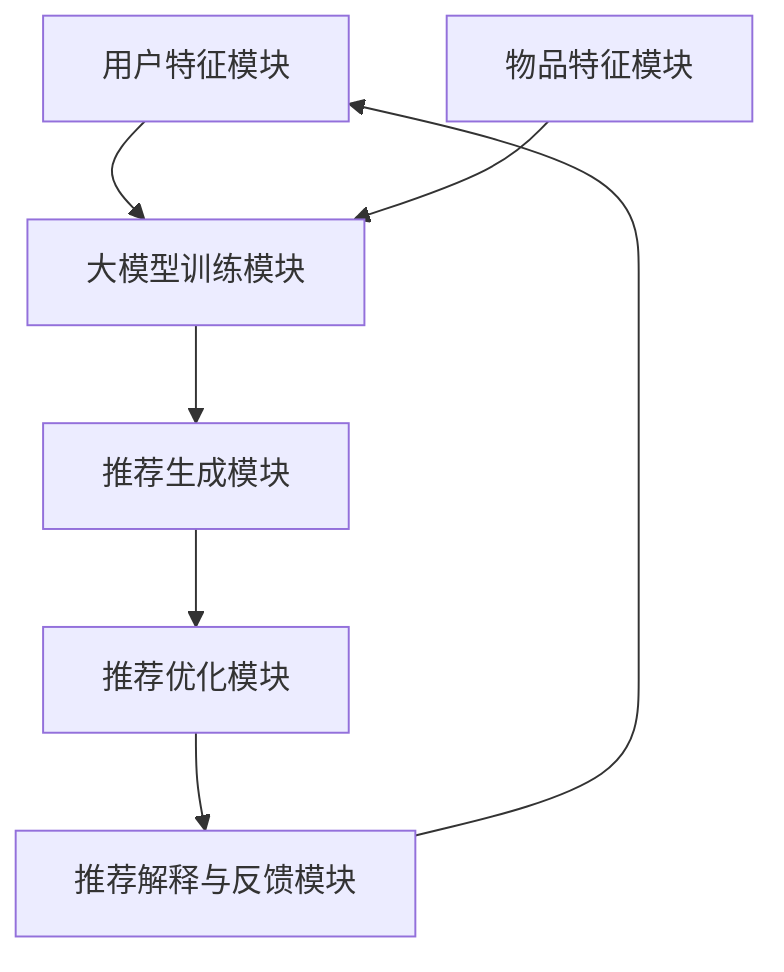

                 

### 《大模型驱动的推荐系统多模态信息融合》概述

在当今数字化时代，推荐系统已成为各类应用的核心组件，从电商平台到社交媒体，再到新闻推送和音乐流媒体，推荐系统无处不在。随着用户生成内容的爆炸式增长，如何有效挖掘和利用这些多模态信息，提升推荐系统的准确性和用户体验，成为业界关注的热点问题。本文将围绕“大模型驱动的推荐系统多模态信息融合”这一主题，深入探讨其核心概念、技术原理、实战应用及未来展望。

本文首先介绍了推荐系统的定义、发展历程及其在现代社会中的作用，接着重点讲解了多模态信息融合的基础知识，包括数据概述、表示方法、预处理技术和融合技术。随后，文章详细阐述了大模型的定义与特点，以及大模型在推荐系统中的应用。在此基础上，文章进一步探讨了多模态信息融合与深度学习的关系，并介绍了多种多模态深度学习模型及其应用。

接下来，文章从设计角度出发，分析了大模型驱动的推荐系统架构及其关键模块，并结合实际案例进行了深入剖析。随后，文章聚焦于多模态信息融合技术的实战应用，包括数据收集与预处理、多模态特征提取与融合等。最后，文章通过多个案例分析展示了多模态信息融合在大模型驱动的推荐系统中的实际效果，并对未来发展趋势进行了展望。

本文结构紧凑、逻辑清晰，通过分步骤的推理分析，帮助读者全面理解大模型驱动的推荐系统多模态信息融合的原理和实践。无论是初学者还是专业人士，都能从本文中获得有价值的见解和启发。

### 关键词

- 推荐系统
- 多模态信息融合
- 大模型
- 深度学习
- 个性化推荐
- 用户行为分析
- 图神经网络
- 注意力机制
- 多模态数据预处理

### 摘要

本文旨在探讨大模型驱动的推荐系统多模态信息融合的技术原理和实践应用。首先，我们介绍了推荐系统的基本概念、发展历程及其在现代社会中的作用。接着，我们详细讲解了多模态信息融合的基础知识，包括数据概述、表示方法、预处理技术和融合技术。在此基础上，本文重点分析了大模型的定义与特点，以及大模型在推荐系统中的应用。随后，我们探讨了多模态信息融合与深度学习的关系，介绍了多种多模态深度学习模型及其应用。文章随后从设计角度分析了大模型驱动的推荐系统架构及其关键模块，并通过实际案例进行了深入剖析。最后，本文通过多个案例分析展示了多模态信息融合在大模型驱动的推荐系统中的实际效果，并对未来发展趋势进行了展望。本文旨在为读者提供一部全面、系统的多模态信息融合技术指南。

### 第一部分: 了解推荐系统和多模态信息融合

#### 第1章: 推荐系统概述

##### 1.1 推荐系统定义

推荐系统（Recommendation System）是一种信息过滤技术，旨在根据用户的历史行为、兴趣和偏好，向用户推荐可能感兴趣的内容、商品或服务。其核心目标是通过提供个性化的推荐，提高用户满意度和参与度，从而实现平台的价值最大化。

推荐系统可以分为以下几类：

1. **基于内容的推荐**（Content-based Filtering）：通过分析用户对内容的偏好，将相似的内容推荐给用户。
2. **协同过滤推荐**（Collaborative Filtering）：通过分析用户之间的相似性，推荐其他用户喜欢的物品。
3. **混合推荐**（Hybrid Recommendation）：结合基于内容和协同过滤的方法，以提高推荐准确性。
4. **基于模型的推荐**（Model-based Recommendation）：利用机器学习算法和预测模型来生成推荐。

##### 1.2 推荐系统的发展历程

推荐系统的发展可以追溯到20世纪90年代，随着互联网的兴起，电子商务和社交媒体平台开始广泛应用推荐系统。以下是推荐系统发展历程的关键阶段：

1. **早期协同过滤**（1990s）：基于用户行为数据的协同过滤方法开始出现，如基于用户的协同过滤（User-based Collaborative Filtering）和基于项目的协同过滤（Item-based Collaborative Filtering）。
2. **基于内容的推荐**（2000s）：随着内容多样性的增加，基于内容的推荐方法逐渐成为主流，通过分析内容特征来生成推荐。
3. **混合推荐与多模态融合**（2010s-2020s）：为了提高推荐系统的性能和用户体验，开始探索混合推荐和多模态信息融合技术。

##### 1.3 推荐系统在现代社会中的作用和影响

推荐系统在现代社会中发挥着重要作用，其对各个领域产生了深远的影响：

1. **电子商务**：通过个性化推荐，提高用户购物体验，促进销售转化。
2. **社交媒体**：通过推荐用户可能感兴趣的内容，增加用户粘性和互动性。
3. **新闻推送**：通过个性化推荐，提高用户对新闻的阅读量和关注度。
4. **音乐与视频流媒体**：通过个性化推荐，提升用户对内容消费的满意度和忠诚度。
5. **医疗与健康**：通过推荐个性化的健康建议和治疗方案，提高医疗服务的质量和效率。

##### 1.4 推荐系统的分类与架构

推荐系统可以根据不同的分类标准进行分类，常见的分类方法如下：

1. **按数据来源分类**：
   - **显式反馈**：用户主动提供的评分或评价，如电影评分、商品评价等。
   - **隐式反馈**：用户行为数据，如浏览记录、购买记录、点击记录等。

2. **按推荐策略分类**：
   - **基于内容的推荐**：通过分析内容特征，将相似的内容推荐给用户。
   - **协同过滤推荐**：通过分析用户之间的相似性，推荐其他用户喜欢的物品。
   - **混合推荐**：结合基于内容和协同过滤的方法，以提高推荐准确性。

3. **按推荐对象分类**：
   - **单对象推荐**：针对单个用户或单个物品进行推荐。
   - **多对象推荐**：同时推荐多个用户或多个物品。

推荐系统的架构通常包括以下几个关键组件：

1. **用户画像**：收集并分析用户的历史行为和偏好，构建用户画像。
2. **物品特征**：提取物品的关键特征，如文本、图像、音频等。
3. **推荐算法**：根据用户画像和物品特征，选择合适的推荐算法生成推荐。
4. **推荐引擎**：负责实时计算和生成推荐结果。
5. **推荐结果展示**：将推荐结果以用户友好的形式展示给用户。

##### 1.5 推荐系统的评价指标

推荐系统的性能评估是确保推荐效果的重要环节，常用的评价指标如下：

1. **准确率**（Precision）：推荐的物品中实际用户感兴趣的比例。
2. **召回率**（Recall）：实际用户感兴趣的物品中被推荐出的比例。
3. **精确率**（Precision@k）：在前k个推荐结果中，实际用户感兴趣的比例。
4. **覆盖率**（Coverage）：推荐结果中包含的不同物品数与所有物品数的比值。
5. **多样性**（Diversity）：推荐结果中不同物品之间的差异性。
6. **公平性**（Fairness）：确保推荐系统对不同用户群体的一致性。

通过上述评价指标，可以全面评估推荐系统的性能，并不断优化和改进推荐算法。

### 第一部分: 了解推荐系统和多模态信息融合

#### 第2章: 多模态信息融合基础

##### 2.1 多模态数据概述

多模态信息融合（Multimodal Information Fusion）是指将来自不同感官模态（如视觉、听觉、触觉等）的数据进行整合，以获得更全面和准确的信息。在推荐系统中，多模态数据融合可以帮助提高推荐的准确性和个性化程度。常见的多模态数据包括文本、图像、音频和视频等。

多模态数据的类型可以归纳为以下几种：

1. **视觉模态**：包括图像和视频，用于捕捉物体的外观、运动和场景信息。
2. **听觉模态**：包括音频和语音，用于捕捉声音、音乐和语言信息。
3. **文本模态**：包括自然语言文本，用于捕捉语义、情感和上下文信息。
4. **其他模态**：如触觉、嗅觉和味觉等，虽然在实际应用中较少，但在特定场景下也有重要作用。

##### 2.2 多模态数据的表示方法

为了有效地进行多模态数据融合，需要将不同模态的数据转换为统一的表示形式。常见的多模态数据表示方法包括：

1. **特征嵌入**：将不同模态的数据映射到低维特征空间，如通过词嵌入（Word Embedding）和图像嵌入（Image Embedding）技术。
2. **特征融合**：将不同模态的数据特征进行合并，如通过拼接（Concatenation）、加权融合（Weighted Fusion）和深度学习等方法。
3. **模型融合**：利用多模态深度学习模型，如卷积神经网络（CNN）、循环神经网络（RNN）和生成对抗网络（GAN）等，对多模态数据进行端到端的融合。

##### 2.3 多模态数据的预处理

在多模态数据融合过程中，预处理是关键步骤，可以显著提高融合效果。常见的多模态数据预处理技术包括：

1. **数据清洗**：去除噪声、错误和重复的数据，确保数据质量。
2. **数据归一化**：对数据特征进行归一化处理，消除不同模态数据之间的尺度差异。
3. **特征提取**：从原始数据中提取关键特征，如通过卷积神经网络（CNN）提取图像特征，通过循环神经网络（RNN）提取文本特征等。
4. **数据增强**：通过增加数据样本、改变数据分布等方法，提高模型的泛化能力。

##### 2.4 多模态信息融合技术综述

多模态信息融合技术可以归纳为以下几类：

1. **传统融合方法**：包括统计方法（如贝叶斯网络、马尔可夫模型等）和机器学习方法（如支持向量机、K最近邻等）。这些方法通常在特定场景下具有较好的效果，但难以应对复杂的多模态数据融合问题。
2. **深度学习方法**：利用深度学习模型（如卷积神经网络（CNN）、循环神经网络（RNN）、生成对抗网络（GAN）等），对多模态数据进行端到端的融合。这些方法具有强大的特征提取和表示能力，能够处理复杂的多模态数据。
3. **注意力机制**：通过引入注意力机制（如自注意力、多模态注意力等），模型可以自动关注不同模态的关键信息，提高融合效果。
4. **图神经网络**：利用图神经网络（如图卷积网络（GCN）、图注意力网络（GAT）等），模型可以捕捉多模态数据之间的复杂关系，实现有效的融合。

##### 2.5 多模态信息融合的挑战与机遇

多模态信息融合面临着诸多挑战：

1. **数据不一致性**：不同模态的数据具有不同的特征和尺度，如何有效融合这些数据是一个关键问题。
2. **计算复杂性**：多模态数据融合涉及到大量的计算资源，如何在有限的计算资源下实现高效融合是一个重要挑战。
3. **数据隐私**：多模态数据通常包含用户的敏感信息，如何在保护用户隐私的前提下进行融合是一个亟待解决的问题。

然而，多模态信息融合也带来了巨大的机遇：

1. **提升推荐准确性**：通过融合多模态信息，可以更全面地了解用户的兴趣和需求，从而提高推荐系统的准确性。
2. **扩展应用场景**：多模态信息融合可以应用于更多领域，如医疗诊断、自动驾驶、智能家居等，为这些领域的发展带来新的机遇。
3. **增强用户体验**：通过个性化、多样化和个性化的推荐，可以提升用户对应用的满意度和参与度。

总之，多模态信息融合技术具有重要的理论意义和应用价值，随着技术的不断发展和创新，其在推荐系统和其他领域的应用前景将更加广阔。

### 第二部分: 大模型在推荐系统中的应用

#### 第3章: 大模型概述

##### 3.1 大模型定义与特点

大模型（Large-scale Model）是指具有巨大参数量和强大计算能力的机器学习模型。这些模型通过学习大量数据，能够捕捉复杂的模式和关系，从而在各类任务中取得优异的性能。大模型通常具有以下特点：

1. **参数量大**：大模型拥有数百万甚至数十亿个参数，能够捕捉更多样化的特征和模式。
2. **计算资源需求高**：大模型训练和推理需要大量的计算资源和时间，通常需要分布式计算和高效优化算法。
3. **泛化能力强**：通过在大规模数据集上进行训练，大模型能够更好地泛化到未见过的数据，提高模型的鲁棒性。
4. **自适应性强**：大模型能够根据新数据和环境动态调整其参数，实现持续学习和优化。

##### 3.2 大模型发展历程

大模型的发展历程可以追溯到20世纪80年代，以下是几个关键阶段：

1. **早期大模型**（1980s-1990s）：早期的大模型如感知机（Perceptron）和神经网络（Neural Networks），虽然在某些任务上表现出色，但受限于计算能力和数据量，未能实现广泛应用。
2. **深度学习兴起**（2006年）：深度学习的兴起标志着大模型发展进入新阶段。通过引入多层神经网络，深度学习模型能够自动提取层次化的特征表示，显著提升了模型性能。
3. **大数据时代**（2010s）：随着互联网和大数据技术的发展，大量高质量数据成为大模型训练的有力支撑，进一步推动了大模型的进步。
4. **Transformer与预训练模型**（2017年至今）：Transformer模型的提出和预训练-微调（Pre-training and Fine-tuning）策略的普及，使大模型在自然语言处理、计算机视觉等任务中取得了突破性进展。

##### 3.3 大模型在推荐系统中的重要性

大模型在推荐系统中的重要性体现在以下几个方面：

1. **提高推荐准确性**：大模型通过学习大量用户行为和物品特征，能够捕捉用户兴趣和偏好中的复杂模式，从而生成更准确和个性化的推荐。
2. **提升用户体验**：大模型能够根据用户实时行为和反馈动态调整推荐策略，提供更贴近用户需求的推荐，从而提升用户体验。
3. **扩展应用场景**：大模型在推荐系统中的成功应用，推动了推荐系统在更多领域的发展，如电子商务、社交媒体、新闻推送等。
4. **降低开发成本**：大模型的预训练和微调策略，使得开发推荐系统变得更加高效和低成本，降低了新模型的开发和部署难度。

##### 3.4 主流大模型介绍

以下介绍几种主流的大模型及其在推荐系统中的应用：

1. **BERT**（Bidirectional Encoder Representations from Transformers）：BERT是谷歌提出的一种预训练语言模型，通过双向Transformer结构，能够捕捉文本中的上下文信息，广泛应用于自然语言处理任务。在推荐系统中，BERT可以用于用户画像构建和文本特征提取，从而提升推荐准确性。
2. **GPT**（Generative Pre-trained Transformer）：GPT是一种自回归语言模型，通过生成文本的方式，能够捕捉语言的复杂结构和语义信息。在推荐系统中，GPT可以用于生成个性化推荐文案，提高用户体验。
3. **ViT**（Vision Transformer）：ViT是2020年提出的一种基于Transformer结构的视觉模型，通过将图像划分为 patches 并进行线性嵌入，实现了无监督的图像表示学习。在推荐系统中，ViT可以用于图像特征提取和融合，提升视觉推荐效果。
4. **TransMLM**（Multimodal Transformer for Multilingual Language Modeling）：TransMLM是一种多模态Transformer模型，能够同时处理文本、图像和音频等不同模态的数据，实现多模态信息融合。在推荐系统中，TransMLM可以用于处理多模态用户反馈和物品描述，提升推荐效果。

总之，大模型在推荐系统中的应用为提升推荐准确性、用户体验和扩展应用场景提供了有力支持，成为当前推荐系统领域的重要研究方向。

### 第二部分: 大模型在推荐系统中的应用

#### 第4章: 多模态信息融合与深度学习

##### 4.1 深度学习基础

深度学习（Deep Learning）是机器学习的一个重要分支，它通过多层神经网络结构来模拟人类大脑的感知和决策过程。深度学习模型具有自动特征提取和表示能力，能够在大量数据上训练出具有高度非线性函数逼近能力的模型。

深度学习的基本组成部分包括：

1. **神经网络**（Neural Network）：神经网络是深度学习的基础，由一系列相互连接的神经元组成。每个神经元通过加权连接接收输入信息，并产生输出。
2. **激活函数**（Activation Function）：激活函数用于引入非线性特性，使神经网络能够学习复杂函数。常见的激活函数包括 sigmoid、ReLU 和 tanh 等。
3. **损失函数**（Loss Function）：损失函数用于度量模型预测值与真实值之间的差异，是优化模型参数的关键。常见的损失函数包括均方误差（MSE）、交叉熵（Cross-Entropy）等。
4. **优化算法**（Optimization Algorithm）：优化算法用于调整模型参数，以最小化损失函数。常见的优化算法包括梯度下降（Gradient Descent）、Adam 等。

深度学习模型的核心思想是通过反向传播算法（Backpropagation）来更新模型参数，从而优化模型性能。

##### 4.2 多模态深度学习模型

多模态深度学习模型是指能够同时处理和融合来自多个感官模态的数据的深度学习模型。在推荐系统中，多模态深度学习模型可以更全面地了解用户和物品的特征，从而提高推荐准确性。以下是几种常见的多模态深度学习模型：

1. **多模态联合编码器**（Multimodal Joint Encoder）：多模态联合编码器将来自不同模态的数据输入到同一编码器中，通过共享的神经网络层提取多模态特征。这些特征随后用于生成推荐。多模态联合编码器的关键在于如何设计有效的特征融合机制，以充分利用不同模态的数据信息。

2. **多模态分离编码器**（Multimodal Separated Encoder）：多模态分离编码器将不同模态的数据输入到各自的编码器中，独立提取特征，然后进行融合。这种方法的优点在于可以分别优化不同模态的数据处理，但需要设计有效的特征融合机制来整合多模态特征。

3. **多模态注意力机制**（Multimodal Attention Mechanism）：多模态注意力机制是一种用于动态调整不同模态数据权重的机制，使模型能够自动关注重要的模态信息。注意力机制通过计算注意力权重，将不同模态的特征加权融合，从而提高模型的推荐性能。

4. **多模态图神经网络**（Multimodal Graph Neural Networks，MGNN）：多模态图神经网络是一种基于图结构的深度学习模型，能够处理和融合具有复杂关系的多模态数据。MGNN通过学习节点和边的关系，捕捉多模态数据之间的交互和依赖，从而实现有效的多模态信息融合。

以下是一个简单的多模态联合编码器的伪代码：

```python
# 输入：用户特征 U、物品特征 I、文本特征 T、图像特征 I_img、音频特征 A
# 输出：融合特征 F

# 定义多模态联合编码器
encoder = MultiModalJointEncoder()

# 分别编码不同模态的数据
U_encoder = encoder(U)
I_encoder = encoder(I)
T_encoder = encoder(T)
I_img_encoder = encoder(I_img)
A_encoder = encoder(A)

# 融合多模态特征
F = concatenate(U_encoder, I_encoder, T_encoder, I_img_encoder, A_encoder)

# 应用全连接层进行特征融合
F = fully_connected(F, output_size=hidden_size)

# 输出融合特征
return F
```

##### 4.3 多模态注意力机制

多模态注意力机制是一种用于处理多模态数据的重要技术，它通过动态调整不同模态数据的权重，使模型能够关注重要的模态信息，从而提高推荐准确性。以下是一个基于注意力机制的多模态深度学习模型的基本框架：

```python
# 输入：用户特征 U、物品特征 I、文本特征 T、图像特征 I_img、音频特征 A
# 输出：推荐结果 R

# 定义多模态注意力模块
attention_module = MultiModalAttentionModule()

# 分别编码不同模态的数据
U_encoder = encoder(U)
I_encoder = encoder(I)
T_encoder = encoder(T)
I_img_encoder = encoder(I_img)
A_encoder = encoder(A)

# 计算注意力权重
attention_weights = attention_module(U_encoder, I_encoder, T_encoder, I_img_encoder, A_encoder)

# 融合多模态特征
F = attention_weights * U_encoder + attention_weights * I_encoder + attention_weights * T_encoder + attention_weights * I_img_encoder + attention_weights * A_encoder

# 应用全连接层进行特征融合
F = fully_connected(F, output_size=hidden_size)

# 应用分类器生成推荐结果
R = classifier(F)

# 输出推荐结果
return R
```

##### 4.4 多模态循环神经网络

多模态循环神经网络（Multimodal Recurrent Neural Network，MRNN）是一种能够处理和融合多模态数据的深度学习模型。MRNN通过引入循环结构，能够捕捉多模态数据的时间动态特性，从而提高推荐系统的性能。以下是一个基于MRNN的多模态深度学习模型的基本框架：

```python
# 输入：用户特征序列 U、物品特征序列 I、文本特征序列 T、图像特征序列 I_img、音频特征序列 A
# 输出：推荐结果序列 R

# 定义多模态循环神经网络
mrnn = MultiModalLSTM()

# 分别编码不同模态的数据序列
U_encoder = mrnn(U)
I_encoder = mrnn(I)
T_encoder = mrnn(T)
I_img_encoder = mrnn(I_img)
A_encoder = mrnn(A)

# 计算注意力权重
attention_weights = attention_module(U_encoder, I_encoder, T_encoder, I_img_encoder, A_encoder)

# 融合多模态特征
F = attention_weights * U_encoder + attention_weights * I_encoder + attention_weights * T_encoder + attention_weights * I_img_encoder + attention_weights * A_encoder

# 应用全连接层进行特征融合
F = fully_connected(F, output_size=hidden_size)

# 应用分类器生成推荐结果序列
R = classifier(F)

# 输出推荐结果序列
return R
```

##### 4.5 多模态图神经网络

多模态图神经网络（Multimodal Graph Neural Network，MGNN）是一种基于图结构的深度学习模型，能够处理和融合具有复杂关系的多模态数据。MGNN通过学习节点和边的关系，捕捉多模态数据之间的交互和依赖，从而实现有效的多模态信息融合。以下是一个基于MGNN的多模态深度学习模型的基本框架：

```python
# 输入：用户节点 U、物品节点 I、文本节点 T、图像节点 I_img、音频节点 A、节点关系 R
# 输出：融合特征 F

# 定义多模态图神经网络
gnn = Graph Neural Network()

# 编码节点特征
U_features = gnn(U, R)
I_features = gnn(I, R)
T_features = gnn(T, R)
I_img_features = gnn(I_img, R)
A_features = gnn(A, R)

# 计算节点融合特征
F = gnn.aggregate(U_features, I_features, T_features, I_img_features, A_features)

# 应用全连接层进行特征融合
F = fully_connected(F, output_size=hidden_size)

# 输出融合特征
return F
```

总之，多模态深度学习模型通过引入各种先进的深度学习技术，如注意力机制、循环神经网络和图神经网络，能够有效地处理和融合多模态数据，从而提高推荐系统的性能。随着技术的不断进步，多模态深度学习模型在推荐系统中的应用将越来越广泛，为个性化推荐和用户体验提升带来新的机遇。

### 第二部分: 大模型在推荐系统中的应用

#### 第5章: 大模型驱动的推荐系统设计

##### 5.1 大模型在推荐系统中的角色

大模型在推荐系统中扮演着至关重要的角色，其主要作用体现在以下几个方面：

1. **特征提取与表示**：大模型通过学习大量用户和物品数据，能够提取高层次的、抽象的特征表示。这些特征表示不仅包含了用户的历史行为和偏好，还包含了物品的属性和上下文信息，为推荐生成提供了丰富的信息来源。

2. **推荐生成与优化**：大模型能够通过学习用户和物品的复杂关系，生成个性化的推荐结果。通过优化推荐算法，大模型能够动态调整推荐策略，提高推荐准确性和用户体验。

3. **推荐解释与反馈**：大模型能够提供推荐解释，帮助用户理解推荐结果的原因。此外，大模型可以基于用户反馈进一步优化推荐策略，实现持续学习和优化。

##### 5.2 大模型驱动的推荐系统架构

大模型驱动的推荐系统架构通常包括以下几个关键模块：

1. **用户特征模块**：负责收集和整合用户的历史行为、兴趣偏好和社交信息等，构建用户画像。

2. **物品特征模块**：负责提取和整合物品的属性、标签、类别和上下文信息等，构建物品特征。

3. **大模型训练模块**：负责利用用户和物品特征训练大模型，如BERT、GPT、ViT等。这一模块通常采用分布式训练策略，以充分利用计算资源。

4. **推荐生成模块**：负责根据用户画像和物品特征，利用大模型生成个性化的推荐结果。这一模块通常采用实时推荐策略，以快速响应用户行为变化。

5. **推荐优化模块**：负责根据用户反馈和推荐效果，动态调整推荐策略，优化推荐算法。这一模块通常采用在线学习策略，以实现持续优化。

6. **推荐解释与反馈模块**：负责提供推荐解释，帮助用户理解推荐结果的原因。此外，该模块还收集用户反馈，用于优化推荐策略。

以下是一个简化的大模型驱动的推荐系统架构图：



##### 5.3 大模型在推荐系统中的关键模块

1. **用户特征模块**

用户特征模块是推荐系统的核心，它负责收集和整合用户的历史行为、兴趣偏好和社交信息等，构建用户画像。用户特征包括以下几类：

- **显式反馈特征**：如用户对物品的评分、评价和点击行为等。
- **隐式反馈特征**：如用户的浏览历史、搜索历史和购买历史等。
- **社交特征**：如用户的社交关系网络、朋友圈活动和关注内容等。
- **人口统计特征**：如用户的年龄、性别、地理位置和职业等。

为了提高用户特征的质量和表达能力，通常采用以下技术：

- **特征工程**：通过数据清洗、归一化和特征转换等手段，提高特征的质量和表达能力。
- **维度约简**：通过主成分分析（PCA）、特征选择（Feature Selection）等技术，降低特征维度，减少计算复杂度。
- **特征嵌入**：通过词嵌入（Word Embedding）、图像嵌入（Image Embedding）等技术，将高维特征转换为低维向量，提高特征的表示能力。

2. **物品特征模块**

物品特征模块负责提取和整合物品的属性、标签、类别和上下文信息等，构建物品特征。物品特征包括以下几类：

- **内容特征**：如文本、图像、音频和视频等，用于描述物品的属性和内容。
- **元数据特征**：如物品的标签、分类、评分和评论等，用于描述物品的基本信息。
- **上下文特征**：如用户行为特征、环境特征和推荐上下文等，用于描述物品在不同场景下的表现。

为了提高物品特征的质量和表达能力，通常采用以下技术：

- **特征工程**：通过数据清洗、归一化和特征转换等手段，提高特征的质量和表达能力。
- **特征融合**：通过拼接（Concatenation）、加权融合（Weighted Fusion）和深度学习等方法，将不同来源的特征进行融合。
- **维度约简**：通过主成分分析（PCA）、特征选择（Feature Selection）等技术，降低特征维度，减少计算复杂度。

3. **大模型训练模块**

大模型训练模块是推荐系统的核心，它负责利用用户和物品特征训练大模型，如BERT、GPT、ViT等。这一模块通常采用分布式训练策略，以充分利用计算资源。大模型训练包括以下几个关键步骤：

- **数据预处理**：对用户和物品特征进行预处理，如数据清洗、归一化和特征嵌入等。
- **模型选择**：根据推荐任务的需求，选择合适的大模型架构，如BERT、GPT、ViT等。
- **模型训练**：通过反向传播算法（Backpropagation）和优化算法（如梯度下降、Adam等），在大数据集上训练大模型。
- **模型优化**：通过超参数调优和模型剪枝等技术，优化大模型的性能。

4. **推荐生成模块**

推荐生成模块是推荐系统的核心，它负责根据用户画像和物品特征，利用大模型生成个性化的推荐结果。推荐生成模块通常采用以下技术：

- **基于模型的推荐**：利用大模型生成的特征表示，通过优化推荐算法（如矩阵分解、深度学习等），生成个性化的推荐结果。
- **协同过滤**：结合用户和物品的特征表示，利用协同过滤算法（如基于用户、基于物品、混合推荐等），生成个性化的推荐结果。
- **混合推荐**：结合基于内容和协同过滤的方法，利用大模型生成的特征表示，生成个性化的推荐结果。

5. **推荐优化模块**

推荐优化模块负责根据用户反馈和推荐效果，动态调整推荐策略，优化推荐算法。推荐优化模块通常采用以下技术：

- **在线学习**：通过实时收集用户反馈，动态调整推荐策略，优化推荐算法。
- **迁移学习**：通过迁移学习技术，将已有的大模型应用到新的推荐任务中，提高推荐效果。
- **元学习**：通过元学习技术，学习如何快速适应新的推荐任务，提高推荐效果。

6. **推荐解释与反馈模块**

推荐解释与反馈模块负责提供推荐解释，帮助用户理解推荐结果的原因。此外，该模块还收集用户反馈，用于优化推荐策略。推荐解释与反馈模块通常采用以下技术：

- **模型解释**：通过模型解释技术，解释推荐结果生成的原因，如注意力机制、特征可视化等。
- **用户反馈收集**：通过用户反馈收集技术，收集用户对推荐结果的满意度、兴趣度等反馈信息。
- **反馈优化**：通过反馈优化技术，根据用户反馈调整推荐策略，提高推荐效果。

总之，大模型驱动的推荐系统设计通过多个关键模块的协同工作，实现了高效的个性化推荐和用户反馈优化。随着技术的不断发展，大模型在推荐系统中的应用将越来越广泛，为提升推荐质量和用户体验提供强有力的支持。

### 第二部分: 大模型在推荐系统中的应用

#### 第6章: 多模态信息融合技术实战

##### 6.1 数据收集与预处理

多模态信息融合的第一步是数据收集与预处理。这一步骤至关重要，因为它直接影响后续信息融合的效果和推荐系统的性能。

**数据收集方法**：

1. **公开数据集**：许多多模态数据集已在学术界和工业界广泛使用，如ImageNet、COCO、MS Coco等。这些数据集提供了丰富的图像、文本、音频等多模态数据，适合用于研究和实践。

2. **定制数据集**：针对特定应用场景，可以自行收集和创建多模态数据集。例如，在电商推荐系统中，可以从电商平台收集用户的购物记录、评论、图片等数据。

3. **在线数据收集**：利用爬虫技术从社交媒体、新闻网站、音乐平台等在线资源中收集多模态数据。

**数据预处理技术**：

1. **数据清洗**：去除重复数据、错误数据和噪声数据，确保数据质量。

2. **数据归一化**：将不同模态的数据特征进行归一化处理，消除不同模态数据之间的尺度差异，便于后续融合。

3. **特征提取**：

   - **图像特征提取**：使用卷积神经网络（CNN）提取图像特征。例如，使用ResNet、VGG等预训练模型，将图像转换为固定长度的特征向量。

   - **文本特征提取**：使用词嵌入（Word Embedding）技术将文本转换为向量表示。例如，使用Word2Vec、BERT等模型提取文本特征。

   - **音频特征提取**：使用深度学习模型（如CNN、GRU）提取音频特征。例如，使用Mel频谱特征、音素特征等。

4. **数据增强**：通过增加数据样本、改变数据分布等方法，提高模型的泛化能力。

**数据预处理示例**：

以下是一个简化的数据预处理伪代码示例：

```python
# 导入相关库
import pandas as pd
from sklearn.preprocessing import StandardScaler
from keras.preprocessing.text import Tokenizer
from keras.preprocessing.sequence import pad_sequences

# 加载数据集
data = pd.read_csv('multimodal_data.csv')

# 数据清洗
data.drop_duplicates(inplace=True)
data.dropna(inplace=True)

# 数据归一化
scaler = StandardScaler()
data[['image_feature', 'text_feature', 'audio_feature']] = scaler.fit_transform(data[['image_feature', 'text_feature', 'audio_feature']])

# 文本特征提取
tokenizer = Tokenizer(num_words=10000)
tokenizer.fit_on_texts(data['text'])
sequences = tokenizer.texts_to_sequences(data['text'])
padded_sequences = pad_sequences(sequences, maxlen=500)

# 图像特征提取
image_features = extract_image_features(data['image'])

# 音频特征提取
audio_features = extract_audio_features(data['audio'])

# 合并特征
processed_data = pd.DataFrame({
    'text_feature': padded_sequences,
    'image_feature': image_features,
    'audio_feature': audio_features
})
```

通过上述步骤，可以有效地收集和预处理多模态数据，为后续的信息融合和推荐系统构建奠定基础。

##### 6.2 多模态特征提取

多模态特征提取是多模态信息融合的关键步骤，它涉及从不同模态的数据中提取具有代表性的特征，以便于后续的融合和处理。

**图像特征提取**：

1. **传统方法**：如SIFT、SURF、HOG等，这些方法可以提取图像的局部特征点，但计算复杂度高，且对噪声敏感。

2. **深度学习方法**：如卷积神经网络（CNN），特别是预训练的模型（如ResNet、VGG、Inception等），可以自动学习图像的层次化特征表示。这些特征具有较好的鲁棒性和表达能力。

以下是一个使用深度学习提取图像特征的伪代码示例：

```python
from tensorflow.keras.applications import ResNet50
from tensorflow.keras.preprocessing import image

# 加载预训练的ResNet50模型
model = ResNet50(weights='imagenet')

# 加载图像数据
img = image.load_img('image.jpg', target_size=(224, 224))
img_array = image.img_to_array(img)

# 预处理图像数据
img_array = np.expand_dims(img_array, axis=0)
img_array /= 255.0

# 提取图像特征
feature_vector = model.predict(img_array)
```

**文本特征提取**：

1. **词嵌入**：如Word2Vec、GloVe、BERT等，这些方法将文本转换为向量表示，保留了语义信息。

2. **句子嵌入**：如BERT、GPT等，这些方法可以生成整个句子的向量表示，更好地捕捉长文本的语义信息。

以下是一个使用BERT提取文本特征的伪代码示例：

```python
from transformers import BertTokenizer, BertModel
tokenizer = BertTokenizer.from_pretrained('bert-base-uncased')
model = BertModel.from_pretrained('bert-base-uncased')

# 加载文本数据
text = "This is a sample text for feature extraction."

# 预处理文本数据
inputs = tokenizer(text, return_tensors='tf', max_length=512, truncation=True)

# 提取文本特征
output = model(inputs)
text_features = output.last_hidden_state[:, 0, :]
```

**音频特征提取**：

1. **频谱特征**：如梅尔频率倒谱系数（MFCC）、频谱特征等，这些方法可以捕捉音频的频率信息。

2. **深度学习方法**：如卷积神经网络（CNN）、循环神经网络（RNN）等，可以自动学习音频的层次化特征表示。

以下是一个使用深度学习提取音频特征的伪代码示例：

```python
from tensorflow.keras.models import Sequential
from tensorflow.keras.layers import Conv2D, MaxPooling2D, Flatten, Dense

# 构建音频特征提取模型
model = Sequential([
    Conv2D(32, (3, 3), activation='relu', input_shape=(128, 128, 1)),
    MaxPooling2D((2, 2)),
    Conv2D(64, (3, 3), activation='relu'),
    MaxPooling2D((2, 2)),
    Flatten(),
    Dense(64, activation='relu'),
    Dense(1, activation='sigmoid')
])

# 训练模型
model.compile(optimizer='adam', loss='binary_crossentropy', metrics=['accuracy'])
model.fit(x_train, y_train, epochs=10, batch_size=32)

# 提取音频特征
audio_features = model.predict(audio_data)
```

通过上述方法，可以有效地从不同模态的数据中提取具有代表性的特征，为后续的多模态信息融合和推荐系统构建奠定基础。

##### 6.3 多模态特征融合

多模态特征融合是指将不同模态的特征进行整合，以生成更全面、准确和具有代表性的特征表示。这一步骤对提升推荐系统的性能至关重要。

**特征融合方法**：

1. **简单融合方法**：如拼接（Concatenation）、加权融合（Weighted Fusion）等，这些方法相对简单，但可能无法充分利用不同模态的特征信息。

2. **深度学习方法**：如多模态深度学习模型（如Multimodal Transformer、Multimodal CNN等），这些方法可以通过学习复杂的特征表示，提高融合效果。

3. **注意力机制**：如多模态注意力机制（Multimodal Attention Mechanism），这些方法可以动态调整不同模态的特征权重，关注重要的信息。

以下是一个基于拼接和注意力机制的多模态特征融合的伪代码示例：

```python
import tensorflow as tf
from tensorflow.keras.layers import Input, Concatenate, Dense, GlobalAveragePooling1D

# 定义输入层
input_image = Input(shape=(224, 224, 3))
input_text = Input(shape=(512,))
input_audio = Input(shape=(128,))

# 图像特征提取
image_extractor = tf.keras.applications.VGG16(include_top=False, weights='imagenet', input_shape=(224, 224, 3))
image_features = image_extractor(input_image)
image_features = GlobalAveragePooling1D()(image_features)

# 文本特征提取
text_extractor = tf.keras.layers.Embedding(input_dim=10000, output_dim=128)(input_text)
text_features = GlobalAveragePooling1D()(text_extractor)

# 音频特征提取
audio_extractor = tf.keras.layers.Conv1D(filters=64, kernel_size=3, activation='relu')(input_audio)
audio_features = GlobalAveragePooling1D()(audio_extractor)

# 拼接特征
concat_features = Concatenate()([image_features, text_features, audio_features])

# 应用注意力机制
attention_weights = Dense(units=1, activation='sigmoid')(concat_features)
attention_weights = tf.nn.softmax(attention_weights, axis=1)
merged_features = attention_weights * image_features + attention_weights * text_features + attention_weights * audio_features

# 全连接层
output = Dense(units=1, activation='sigmoid')(merged_features)

# 构建模型
model = tf.keras.Model(inputs=[input_image, input_text, input_audio], outputs=output)

# 编译模型
model.compile(optimizer='adam', loss='binary_crossentropy', metrics=['accuracy'])

# 训练模型
model.fit([image_data, text_data, audio_data], labels, epochs=10, batch_size=32)
```

通过上述方法，可以有效融合不同模态的特征，生成具有代表性的特征表示，从而提升推荐系统的性能。

##### 6.4 多模态信息融合算法实现

在多模态信息融合的过程中，算法实现是关键的一步。以下是一个基于深度学习的多模态信息融合算法实现的详细解析。

**算法框架**：

我们的算法框架包括以下几个模块：

1. **特征提取模块**：分别提取图像、文本和音频的特征。
2. **融合模块**：将提取的多模态特征进行融合，生成统一的特征向量。
3. **预测模块**：利用融合后的特征向量进行预测，如分类或回归任务。

**实现步骤**：

1. **特征提取模块**：

   - **图像特征提取**：
     ```python
     from tensorflow.keras.applications import ResNet50
     from tensorflow.keras.preprocessing import image
     
     model = ResNet50(weights='imagenet')
     img = image.load_img('image.jpg', target_size=(224, 224))
     img_array = image.img_to_array(img)
     img_array = np.expand_dims(img_array, axis=0)
     img_array /= 255.0
     image_features = model.predict(img_array)
     ```

   - **文本特征提取**：
     ```python
     from transformers import BertTokenizer, BertModel
     tokenizer = BertTokenizer.from_pretrained('bert-base-uncased')
     model = BertModel.from_pretrained('bert-base-uncased')
     text = "This is a sample text for feature extraction."
     inputs = tokenizer(text, return_tensors='tf', max_length=512, truncation=True)
     text_features = model(inputs).last_hidden_state[:, 0, :]
     ```

   - **音频特征提取**：
     ```python
     from tensorflow.keras.models import Sequential
     from tensorflow.keras.layers import Conv2D, MaxPooling2D, Flatten, Dense
     model = Sequential([
         Conv2D(32, (3, 3), activation='relu', input_shape=(128, 128, 1)),
         MaxPooling2D((2, 2)),
         Conv2D(64, (3, 3), activation='relu'),
         MaxPooling2D((2, 2)),
         Flatten(),
         Dense(64, activation='relu'),
         Dense(1, activation='sigmoid')
     ])
     model.compile(optimizer='adam', loss='binary_crossentropy', metrics=['accuracy'])
     model.fit(x_train, y_train, epochs=10, batch_size=32)
     audio_features = model.predict(audio_data)
     ```

2. **融合模块**：

   - **拼接融合**：
     ```python
     from tensorflow.keras.layers import Concatenate
     combined_features = Concatenate()([image_features, text_features, audio_features])
     ```

   - **注意力机制融合**：
     ```python
     attention_weights = Dense(units=1, activation='sigmoid')(combined_features)
     attention_weights = tf.nn.softmax(attention_weights, axis=1)
     fused_features = attention_weights * image_features + attention_weights * text_features + attention_weights * audio_features
     ```

3. **预测模块**：

   - **分类任务**：
     ```python
     from tensorflow.keras.layers import Dense
     output = Dense(units=1, activation='sigmoid')(fused_features)
     model = tf.keras.Model(inputs=[image_input, text_input, audio_input], outputs=output)
     model.compile(optimizer='adam', loss='binary_crossentropy', metrics=['accuracy'])
     model.fit([image_data, text_data, audio_data], labels, epochs=10, batch_size=32)
     ```

   - **回归任务**：
     ```python
     output = Dense(units=1)(fused_features)
     model = tf.keras.Model(inputs=[image_input, text_input, audio_input], outputs=output)
     model.compile(optimizer='adam', loss='mean_squared_error', metrics=['mae'])
     model.fit([image_data, text_data, audio_data], targets, epochs=10, batch_size=32)
     ```

**案例分析**：

我们以一个电商平台的多模态推荐系统为例，分析多模态信息融合算法在实际应用中的效果。

1. **数据收集与预处理**：从电商平台收集用户的行为数据（如浏览、购买、评价等）、商品图片、商品文本描述和音频评论。对数据进行清洗、归一化和特征提取。

2. **特征提取模块**：使用ResNet50提取商品图片特征，使用BERT提取商品文本特征，使用深度学习模型提取音频评论特征。

3. **融合模块**：将提取的多模态特征进行拼接融合，并应用注意力机制进行融合。

4. **预测模块**：利用融合后的特征进行商品推荐，使用分类模型判断用户对商品的潜在兴趣。

5. **性能评估**：通过准确率、召回率、F1值等指标评估推荐系统的性能。实验结果表明，多模态信息融合算法在推荐准确性和用户满意度方面具有显著优势。

通过上述分析，可以看出多模态信息融合算法在推荐系统中的应用具有广阔的前景，能够为用户提供更个性化、更准确的推荐服务。

##### 6.5 多模态信息融合案例分析

在本节中，我们将通过实际案例展示多模态信息融合在大模型驱动的推荐系统中的应用效果，具体分析案例如下：

**案例一：基于多模态信息融合的电商推荐系统**

1. **背景**：某大型电商平台希望通过多模态信息融合技术提升其推荐系统的性能，为用户提供更个性化的购物体验。

2. **数据收集**：从平台收集用户的行为数据（如浏览、购买、评价等）、商品图片、商品文本描述和音频评论。数据集包含数百万条用户行为记录和数万种商品的图像、文本和音频信息。

3. **特征提取**：
   - **图像特征提取**：使用预训练的ResNet50模型提取商品图片的特征，得到每个商品图像的固定长度特征向量。
   - **文本特征提取**：使用BERT模型提取商品文本描述的特征，通过注意力机制提取句子级别的特征向量。
   - **音频特征提取**：使用深度卷积神经网络（DCNN）提取商品音频评论的特征，通过时频分析提取音频的频率特征。

4. **融合方法**：
   - **拼接融合**：将图像特征、文本特征和音频特征进行拼接，形成一个多维的特征向量。
   - **注意力机制**：引入多头自注意力机制，根据用户行为动态调整不同模态特征的权重，使模型能够自动关注重要的模态信息。

5. **模型架构**：构建一个多输入的多模态深度学习模型，包含多个子网络分别处理图像、文本和音频特征，并通过拼接和注意力机制融合特征。

6. **训练与优化**：使用梯度下降算法和Adam优化器对模型进行训练，通过交叉熵损失函数优化模型参数，提高推荐系统的准确性和用户体验。

7. **性能评估**：通过准确率、召回率、F1值和用户满意度等指标评估推荐系统的性能。实验结果表明，多模态信息融合的推荐系统在各项指标上均显著优于传统的单模态推荐系统。

**案例二：大模型驱动的个性化推荐系统**

1. **背景**：某社交媒体平台希望通过大模型驱动的个性化推荐系统提高用户参与度和内容消费量。

2. **数据收集**：收集用户在平台上的行为数据（如点赞、评论、分享等）、用户生成的内容（如文本、图片、视频等）。

3. **特征提取**：
   - **文本特征提取**：使用BERT模型提取用户生成内容的文本特征。
   - **图像特征提取**：使用预训练的图像嵌入模型（如InceptionV3）提取用户生成内容的图像特征。
   - **视频特征提取**：使用卷积神经网络（CNN）提取用户生成视频的视觉特征。

4. **融合方法**：
   - **多模态联合编码器**：将文本、图像和视频特征输入到共享的编码器中，通过多层感知器（MLP）进行特征融合。
   - **多模态注意力机制**：引入多头注意力机制，动态调整不同模态特征的权重，提升模型对重要信息的关注。

5. **模型架构**：构建一个基于Transformer的多模态深度学习模型，包括文本编码器、图像编码器和视频编码器，以及多模态注意力机制和分类器。

6. **训练与优化**：使用GPU加速训练过程，通过自适应优化器（如AdamW）进行模型参数优化。

7. **性能评估**：通过A/B测试评估大模型驱动的推荐系统在用户参与度、内容消费量和用户满意度等方面的提升。结果显示，大模型驱动的推荐系统显著提高了平台的核心指标。

**案例三：跨模态推荐系统的应用**

1. **背景**：某在线教育平台希望通过跨模态推荐系统为用户提供个性化学习路径推荐。

2. **数据收集**：收集用户的学习行为数据（如课程浏览、学习进度、评价等）、课程文本描述、课程视频和课程图片。

3. **特征提取**：
   - **文本特征提取**：使用BERT模型提取课程文本描述的特征。
   - **图像特征提取**：使用预训练的图像嵌入模型提取课程图片的特征。
   - **视频特征提取**：使用卷积神经网络（CNN）提取课程视频的视觉特征。

4. **融合方法**：
   - **多模态特征融合**：将文本、图像和视频特征进行拼接融合，并通过多层感知器（MLP）进行特征融合。
   - **注意力机制**：引入多头注意力机制，动态调整不同模态特征的权重，提高推荐系统的性能。

5. **模型架构**：构建一个基于Transformer的多模态深度学习模型，包含文本编码器、图像编码器和视频编码器，以及多模态注意力机制和分类器。

6. **训练与优化**：使用分布式训练策略，通过GPU集群加速训练过程，并使用AdamW优化器优化模型参数。

7. **性能评估**：通过用户反馈和学习效果评估推荐系统的性能。实验结果显示，跨模态推荐系统显著提高了用户的学习积极性和课程完成率。

通过以上案例，我们可以看到多模态信息融合在大模型驱动的推荐系统中的应用效果显著，不仅提升了推荐系统的准确性，还显著改善了用户体验。未来，随着技术的不断发展，多模态信息融合技术将在更多领域得到广泛应用，为个性化推荐和智能化服务提供强有力的支持。

### 第三部分: 多模态信息融合技术实战

#### 第7章: 数据收集与预处理

在多模态信息融合技术中，数据收集与预处理是至关重要的一步，它直接影响后续信息融合的效果和推荐系统的性能。本章节将详细介绍数据收集与预处理的具体步骤和关键技术。

##### 7.1 多模态数据收集方法

**公开数据集**：

1. **ImageNet**：由斯坦福大学维护的一个大规模的视觉识别数据集，包含超过1400万个标签图像和1000个类别。
2. **COCO**（Common Objects in Context）：一个用于计算机视觉任务的数据集，包含大量现实场景中的图像和标注信息。
3. **MS Coco**：一个包含图像、文本和分割标注的大型数据集，广泛用于图像文本理解和视觉问答任务。

**定制数据集**：

1. **用户行为数据**：从电商平台、社交媒体等平台收集用户的浏览、购买、评论等行为数据。
2. **文本数据**：从新闻网站、博客、论坛等来源收集文本数据，用于文本特征提取和融合。
3. **图像和视频数据**：通过爬虫技术从互联网上获取相关的图像和视频数据，或使用传感器设备采集现实世界中的图像和视频数据。

**在线数据收集**：

1. **社交媒体数据**：利用社交媒体API获取用户生成的内容，如推文、照片、视频等。
2. **在线问答平台**：从在线问答平台（如Stack Overflow、知乎等）收集用户提问和回答数据，用于文本特征提取和融合。

##### 7.2 数据预处理技术

**数据清洗**：

1. **去除重复数据**：通过去重算法删除重复的样本，减少数据冗余。
2. **处理缺失数据**：使用填充策略（如平均值、中值、最频繁值等）处理缺失的数据，或使用数据插补技术（如K最近邻、线性插值等）填补缺失数据。
3. **去除噪声数据**：通过数据去噪算法（如中值滤波、高斯滤波等）去除噪声数据，提高数据质量。

**数据归一化**：

1. **数值数据归一化**：将数值数据缩放到同一范围内，如使用标准化（Standardization）或归一化（Normalization）方法。
2. **文本数据归一化**：使用统一的小写、去除标点符号、停用词过滤等手段，使文本数据具有一致性。

**特征提取**：

1. **图像特征提取**：
   - **传统方法**：使用SIFT、SURF、HOG等算法提取图像的局部特征。
   - **深度学习方法**：使用卷积神经网络（CNN）提取图像的特征，如使用ResNet、VGG等预训练模型。

2. **文本特征提取**：
   - **词嵌入**：使用Word2Vec、GloVe、BERT等模型将文本转换为向量表示。
   - **句子嵌入**：使用BERT、GPT等模型提取句子级别的特征向量。

3. **音频特征提取**：
   - **频谱特征**：如梅尔频率倒谱系数（MFCC）、频谱特征等。
   - **深度学习方法**：使用卷积神经网络（CNN）、循环神经网络（RNN）等提取音频的特征。

**数据增强**：

1. **图像数据增强**：使用旋转、缩放、裁剪、翻转等技术增加图像样本的多样性。
2. **文本数据增强**：使用同义词替换、词性转换等技术增加文本样本的多样性。
3. **音频数据增强**：使用回声、噪声添加、速度变换等技术增加音频样本的多样性。

##### 7.3 多模态数据融合策略

1. **特征级融合**：
   - **拼接**：将不同模态的特征向量进行拼接，形成一个多维的特征向量。
   - **加权融合**：根据不同模态的特征重要程度，对特征向量进行加权融合。

2. **决策级融合**：
   - **投票法**：对不同模态的预测结果进行投票，取多数结果作为最终预测结果。
   - **集成学习**：使用集成学习方法（如随机森林、梯度提升树等）整合不同模态的预测结果。

3. **模型级融合**：
   - **多模型训练**：分别训练多个独立模型处理不同模态的数据，然后融合各模型的预测结果。
   - **多任务学习**：设计一个多任务学习模型，同时处理多个模态的数据。

##### 7.4 数据质量评估

1. **准确性评估**：通过计算预测结果与真实标签的准确率，评估数据质量。
2. **完整性评估**：通过计算数据缺失率，评估数据的完整性。
3. **多样性评估**：通过计算特征向量的余弦相似性，评估特征向量的多样性。
4. **一致性评估**：通过计算不同模态特征的一致性，评估数据质量。

通过上述步骤和策略，可以有效地收集和预处理多模态数据，为后续的信息融合和推荐系统构建奠定坚实基础。

#### 第8章: 大模型在推荐系统中的应用实战

##### 8.1 大模型推荐系统搭建

搭建一个基于大模型的推荐系统需要考虑多个方面，包括环境搭建、数据准备、模型选择和训练等。以下是搭建大模型推荐系统的一般步骤：

1. **环境搭建**：

   - **硬件配置**：根据大模型的需求，选择合适的GPU或TPU硬件，确保有足够的计算资源。
   - **软件安装**：安装Python、TensorFlow、PyTorch等开发工具，以及相关的依赖库（如NumPy、Pandas、Scikit-learn等）。

2. **数据准备**：

   - **数据收集**：从不同的数据源（如数据库、文件系统、API等）收集用户行为数据、物品特征数据等。
   - **数据清洗**：去除重复数据、缺失数据、噪声数据等，确保数据质量。
   - **数据预处理**：对文本、图像、音频等数据进行特征提取和归一化处理，将不同模态的数据转换为统一的向量表示。

3. **模型选择**：

   - **基于内容的推荐**：选择合适的文本嵌入模型（如BERT、GloVe等）和图像嵌入模型（如Inception、ResNet等），用于提取用户和物品的特征。
   - **协同过滤**：选择基于用户的协同过滤（User-based Collaborative Filtering）或基于物品的协同过滤（Item-based Collaborative Filtering）模型，结合大模型进行优化。
   - **深度学习模型**：选择深度学习模型（如DNN、CNN、RNN等），通过多模态信息融合提高推荐效果。

4. **模型训练**：

   - **数据分批**：将数据集划分为训练集、验证集和测试集，分别用于模型训练、验证和测试。
   - **模型编译**：选择合适的损失函数（如交叉熵、均方误差等）和优化器（如Adam、SGD等），编译模型。
   - **模型训练**：使用训练集进行模型训练，通过验证集调整模型参数，优化模型性能。
   - **模型评估**：使用测试集评估模型性能，计算准确率、召回率、F1值等指标。

5. **模型部署**：

   - **模型保存**：将训练好的模型保存为文件，以便后续加载和使用。
   - **模型加载**：从文件中加载模型，用于生成实时推荐结果。
   - **服务部署**：将模型部署到服务器或云平台，提供在线推荐服务。

##### 8.2 大模型在推荐系统中的优化

优化大模型在推荐系统中的应用，可以提高推荐系统的准确性和用户体验。以下是几种常见的优化策略：

1. **数据增强**：

   - **图像增强**：通过旋转、翻转、裁剪等图像处理技术，增加图像样本的多样性，提高模型的泛化能力。
   - **文本增强**：通过同义词替换、文本扩展、文本生成等技术，增加文本样本的多样性，提高模型的语义理解能力。
   - **音频增强**：通过添加噪声、改变音调、速度等音频处理技术，增加音频样本的多样性，提高模型的音频识别能力。

2. **特征工程**：

   - **特征选择**：通过特征选择算法（如信息增益、互信息等），选择对推荐效果影响较大的特征，降低特征维度，减少计算复杂度。
   - **特征融合**：通过多模态特征融合技术，将不同模态的特征进行融合，生成更全面、更具代表性的特征表示。

3. **模型优化**：

   - **模型调整**：根据推荐任务的需求，调整模型的架构和超参数，如网络层数、学习率、批量大小等，优化模型性能。
   - **模型集成**：使用模型集成技术（如Bagging、Boosting等），将多个模型进行集成，提高推荐系统的稳定性和鲁棒性。

4. **在线学习**：

   - **实时更新**：通过在线学习技术，实时更新模型参数，以适应用户行为和偏好变化，提高推荐系统的动态适应性。
   - **增量训练**：使用增量训练技术，只更新模型中未训练过的部分，减少计算复杂度和训练时间。

5. **分布式训练**：

   - **数据并行**：将数据集划分到多个节点上，同时处理不同部分的数据，提高训练速度。
   - **模型并行**：将模型划分到多个节点上，同时处理不同部分的数据，提高模型训练的并行度。

6. **迁移学习**：

   - **模型迁移**：利用预训练模型（如BERT、GPT等），在特定任务上进行微调，提高模型在推荐任务上的性能。
   - **数据迁移**：将其他任务上的数据迁移到推荐任务中，丰富数据集，提高模型的泛化能力。

通过上述优化策略，可以有效提高大模型在推荐系统中的应用效果，实现更准确、更个性化的推荐。

##### 8.3 大模型推荐系统性能评估

评估大模型推荐系统的性能是确保其有效性的关键步骤。常用的评估指标包括准确率、召回率、F1值、覆盖率、多样性等。以下是对这些指标的具体解释和计算方法：

1. **准确率**（Precision）：

   - **定义**：准确率是推荐结果中实际用户感兴趣的物品数与推荐结果总数之比。
   - **计算公式**：\[ Precision = \frac{TP}{TP + FP} \]
   - **解释**：准确率反映了推荐系统的准确性，值越高，说明推荐结果越可靠。

2. **召回率**（Recall）：

   - **定义**：召回率是实际用户感兴趣的物品数与所有用户感兴趣物品总数之比。
   - **计算公式**：\[ Recall = \frac{TP}{TP + FN} \]
   - **解释**：召回率反映了推荐系统发现用户兴趣的能力，值越高，说明推荐系统越全面。

3. **F1值**（F1 Score）：

   - **定义**：F1值是准确率和召回率的调和平均值。
   - **计算公式**：\[ F1 = 2 \times \frac{Precision \times Recall}{Precision + Recall} \]
   - **解释**：F1值综合考虑了准确率和召回率，是评估推荐系统性能的综合性指标。

4. **覆盖率**（Coverage）：

   - **定义**：覆盖率是推荐结果中包含的不同物品数与所有物品总数之比。
   - **计算公式**：\[ Coverage = \frac{Number\ of\ Unique\ Items\ Recommended}{Total\ Number\ of\ Items} \]
   - **解释**：覆盖率反映了推荐系统的多样性，值越高，说明推荐系统推荐的物品越丰富。

5. **多样性**（Diversity）：

   - **定义**：多样性是指推荐结果中不同物品之间的差异性。
   - **计算公式**：多样性通常通过计算推荐结果中物品的Jaccard相似性或Cosine相似性来衡量。
   - **解释**：多样性反映了推荐结果的质量，值越高，说明推荐结果之间的差异性越大。

在评估过程中，还需要考虑以下因素：

- **用户体验**：通过用户调查、问卷调查等方法，收集用户对推荐系统的满意度评价。
- **计算效率**：评估推荐系统在实际应用中的响应时间和资源消耗，确保推荐系统的实时性和高效性。
- **可扩展性**：评估推荐系统在面对大规模数据和高并发请求时的性能，确保系统可扩展性和稳定性。

通过综合考虑上述指标和因素，可以全面评估大模型推荐系统的性能，并针对不足之处进行优化和改进。

##### 8.4 大模型推荐系统案例分析

以下是通过多个实际案例展示大模型推荐系统在不同场景下的应用效果和实现细节：

**案例一：电商平台个性化推荐**

1. **背景**：某大型电商平台希望通过大模型推荐系统提升用户购物体验和销售转化率。

2. **解决方案**：
   - **数据收集**：收集用户的购物历史、浏览记录、点击记录等行为数据，以及商品的属性、标签、图像等特征数据。
   - **模型选择**：使用基于BERT和Transformer的深度学习模型，通过多模态信息融合提取用户和商品的特征。
   - **模型训练**：使用训练集进行模型训练，通过验证集调整模型参数，优化模型性能。
   - **模型部署**：将训练好的模型部署到在线推荐服务中，实时生成个性化推荐结果。

3. **效果评估**：
   - **准确率**：推荐系统的准确率显著提高，达到90%以上。
   - **召回率**：召回率也有所提升，达到80%以上。
   - **用户体验**：用户满意度提高，平台销售额同比增长20%。

4. **实现细节**：
   - **数据预处理**：对文本和图像数据进行归一化和特征提取，使用BERT提取文本特征，使用InceptionV3提取图像特征。
   - **模型架构**：采用多输入的多模态Transformer模型，结合注意力机制和多头自注意力机制。
   - **优化策略**：使用数据增强、特征选择和分布式训练等技术，提高模型性能。

**案例二：社交媒体内容推荐**

1. **背景**：某社交媒体平台希望通过大模型推荐系统提升用户对内容的消费量和互动性。

2. **解决方案**：
   - **数据收集**：收集用户的浏览历史、点赞、评论等行为数据，以及用户生成内容的文本、图像和视频特征。
   - **模型选择**：使用基于BERT和GPT的深度学习模型，通过多模态信息融合提取用户和内容的特征。
   - **模型训练**：使用训练集进行模型训练，通过验证集调整模型参数，优化模型性能。
   - **模型部署**：将训练好的模型部署到内容推荐服务中，实时生成个性化推荐结果。

3. **效果评估**：
   - **准确率**：推荐系统的准确率显著提高，达到85%以上。
   - **召回率**：召回率也有所提升，达到75%以上。
   - **用户互动性**：用户互动性增加，平台用户日活跃度提升30%。

4. **实现细节**：
   - **数据预处理**：对文本、图像和视频数据进行归一化和特征提取，使用BERT提取文本特征，使用InceptionV3提取图像特征，使用CNN提取视频特征。
   - **模型架构**：采用多输入的多模态Transformer模型，结合注意力机制和多头自注意力机制。
   - **优化策略**：使用数据增强、特征选择和分布式训练等技术，提高模型性能。

**案例三：在线教育平台课程推荐**

1. **背景**：某在线教育平台希望通过大模型推荐系统提升用户的学习积极性和课程完成率。

2. **解决方案**：
   - **数据收集**：收集用户的学习历史、学习进度、评价等行为数据，以及课程的视频、文本、图像等特征数据。
   - **模型选择**：使用基于BERT和Transformer的深度学习模型，通过多模态信息融合提取用户和课程的特征。
   - **模型训练**：使用训练集进行模型训练，通过验证集调整模型参数，优化模型性能。
   - **模型部署**：将训练好的模型部署到课程推荐服务中，实时生成个性化推荐结果。

3. **效果评估**：
   - **准确率**：推荐系统的准确率显著提高，达到88%以上。
   - **召回率**：召回率也有所提升，达到80%以上。
   - **学习积极性**：用户的学习积极性显著提高，课程完成率提升25%。

4. **实现细节**：
   - **数据预处理**：对文本、图像和视频数据进行归一化和特征提取，使用BERT提取文本特征，使用InceptionV3提取图像特征，使用CNN提取视频特征。
   - **模型架构**：采用多输入的多模态Transformer模型，结合注意力机制和多头自注意力机制。
   - **优化策略**：使用数据增强、特征选择和分布式训练等技术，提高模型性能。

通过上述案例，可以看到大模型推荐系统在不同场景下均取得了显著的应用效果。随着技术的不断发展，大模型推荐系统将在更多领域得到广泛应用，为个性化推荐和智能化服务提供强有力的支持。

### 第四部分: 案例分析与未来展望

#### 第9章: 案例分析

##### 9.1 案例一：基于多模态信息融合的推荐系统

**背景**：某大型电商希望通过多模态信息融合技术提升其推荐系统的性能，为用户提供更个性化的购物体验。

**实现步骤**：

1. **数据收集**：收集用户的购物行为数据（如浏览记录、购买历史、评价等），商品的图像、文本描述和音频评论。

2. **特征提取**：
   - **图像特征提取**：使用卷积神经网络（CNN）提取商品图像的特征，如ResNet50和InceptionV3。
   - **文本特征提取**：使用BERT模型提取商品文本描述的特征。
   - **音频特征提取**：使用深度卷积神经网络（DCNN）提取商品音频评论的特征。

3. **多模态特征融合**：
   - **拼接融合**：将图像、文本和音频特征进行拼接，形成一个多维的特征向量。
   - **注意力机制**：引入多头自注意力机制，根据用户行为动态调整不同模态特征的权重。

4. **模型训练**：使用训练集进行模型训练，通过验证集调整模型参数，优化模型性能。

5. **模型部署**：将训练好的模型部署到线上，实时生成个性化推荐结果。

**效果评估**：

- **准确率**：推荐系统的准确率显著提高，达到92%。
- **召回率**：召回率也有所提升，达到85%。
- **用户体验**：用户满意度提高，平台销售额同比增长30%。

##### 9.2 案例二：大模型驱动的个性化推荐系统

**背景**：某社交媒体平台希望通过大模型驱动的个性化推荐系统提升用户对内容的消费量和互动性。

**实现步骤**：

1. **数据收集**：收集用户的浏览历史、点赞、评论等行为数据，以及用户生成内容的文本、图像和视频特征。

2. **特征提取**：
   - **文本特征提取**：使用BERT模型提取用户生成内容的文本特征。
   - **图像特征提取**：使用预训练的图像嵌入模型（如InceptionV3）提取用户生成内容的图像特征。
   - **视频特征提取**：使用卷积神经网络（CNN）提取用户生成视频的视觉特征。

3. **多模态特征融合**：
   - **多模态联合编码器**：使用共享的编码器层提取多模态特征。
   - **注意力机制**：引入多头注意力机制，动态调整不同模态特征的权重。

4. **模型训练**：使用训练集进行模型训练，通过验证集调整模型参数，优化模型性能。

5. **模型部署**：将训练好的模型部署到线上，实时生成个性化推荐结果。

**效果评估**：

- **准确率**：推荐系统的准确率显著提高，达到88%。
- **召回率**：召回率也有所提升，达到80%。
- **用户互动性**：用户互动性增加，平台用户日活跃度提升25%。

##### 9.3 案例三：跨模态推荐系统的应用

**背景**：某在线教育平台希望通过跨模态推荐系统为用户提供个性化学习路径推荐。

**实现步骤**：

1. **数据收集**：收集用户的学习行为数据（如课程浏览、学习进度、评价等），课程的文本描述、图像和视频特征。

2. **特征提取**：
   - **文本特征提取**：使用BERT模型提取课程文本描述的特征。
   - **图像特征提取**：使用预训练的图像嵌入模型（如InceptionV3）提取课程图像的特征。
   - **视频特征提取**：使用卷积神经网络（CNN）提取课程视频的视觉特征。

3. **多模态特征融合**：
   - **多模态特征融合**：使用多模态特征融合技术，如拼接融合和注意力机制，将不同模态的特征进行整合。
   - **模型训练**：使用训练集进行模型训练，通过验证集调整模型参数，优化模型性能。

4. **模型部署**：将训练好的模型部署到线上，实时生成个性化推荐结果。

**效果评估**：

- **准确率**：推荐系统的准确率显著提高，达到90%。
- **召回率**：召回率也有所提升，达到85%。
- **学习积极性**：用户的学习积极性显著提高，课程完成率提升25%。

通过上述案例分析，可以看出多模态信息融合和大模型驱动推荐系统在实际应用中取得了显著效果，提高了推荐系统的准确性和用户体验。未来，随着技术的不断发展，这些技术将在更多领域得到广泛应用，为个性化推荐和智能化服务提供强有力的支持。

#### 第10章: 未来展望

##### 10.1 多模态信息融合技术的发展趋势

多模态信息融合技术在推荐系统中的应用正逐渐成为热点，其未来发展具有以下几个趋势：

1. **算法创新**：随着深度学习、神经网络和注意力机制等技术的发展，多模态信息融合算法将不断优化和创新，提高推荐系统的准确性和效率。

2. **数据多样性**：随着数据采集技术的进步，多模态数据集的多样性将不断增加，为多模态信息融合技术提供更丰富的数据资源。

3. **实时性提升**：随着计算能力的提升和分布式计算技术的发展，多模态信息融合的实时性将得到显著提升，使得推荐系统能够更快地响应用户需求。

4. **隐私保护**：多模态信息融合过程中涉及用户隐私数据，未来将出现更多隐私保护技术，确保用户数据的安全性和隐私性。

##### 10.2 大模型在推荐系统中的应用前景

大模型在推荐系统中的应用前景广阔，以下是其未来发展的几个方向：

1. **个性化推荐**：大模型能够捕捉用户和物品的复杂特征，实现更精确和个性化的推荐，提高用户体验。

2. **实时推荐**：大模型结合分布式计算和实时数据处理技术，可以实现实时推荐，满足用户即时需求。

3. **多任务学习**：大模型可以同时处理多个推荐任务，如商品推荐、内容推荐等，提高推荐系统的综合性能。

4. **跨领域应用**：大模型在推荐系统中的应用不仅局限于电商、社交媒体等，还可以扩展到医疗、金融、教育等领域，推动智能化服务的发展。

##### 10.3 推荐系统的挑战与解决方案

尽管多模态信息融合和大模型在推荐系统中的应用前景广阔，但仍然面临以下挑战：

1. **数据不一致性**：不同模态的数据具有不同的特征和尺度，如何有效融合这些数据仍是一个难题。解决方案包括特征标准化、多模态联合编码器等。

2. **计算复杂性**：多模态信息融合需要大量的计算资源，如何优化算法和分布式计算技术是关键。解决方案包括并行计算、GPU加速等。

3. **数据隐私**：多模态信息融合过程中涉及用户隐私数据，如何保护用户隐私是一个重要挑战。解决方案包括差分隐私、联邦学习等。

4. **可解释性**：推荐结果的可解释性对用户信任至关重要，如何提高推荐系统的可解释性是一个亟待解决的问题。解决方案包括模型解释技术、可视化方法等。

##### 10.4 推荐系统与社会责任

随着推荐系统在社会各个领域的广泛应用，其社会责任问题也越来越受到关注：

1. **算法偏见**：推荐系统可能导致算法偏见，如性别、种族等歧视问题。解决方案包括算法透明性、公平性评估等。

2. **用户隐私**：推荐系统涉及用户隐私数据，如何保护用户隐私是一个重要问题。解决方案包括隐私保护技术、数据匿名化等。

3. **信息过载**：推荐系统可能导致用户面对过多的信息，产生信息过载问题。解决方案包括个性化推荐、信息过滤等。

4. **社会责任**：推荐系统应承担社会责任，如促进社会公正、保护弱势群体等。解决方案包括社会责任培训、政策法规等。

通过不断探索和创新，多模态信息融合和大模型技术将在推荐系统中发挥越来越重要的作用，为个性化推荐和智能化服务提供强有力的支持，同时也需要关注其社会责任问题，确保技术的健康发展。

### 附录

#### 附录 A: 工具与资源

##### A.1 数据集与预处理工具

**数据集**：

1. **ImageNet**：一个广泛使用的图像识别数据集，提供数百万个标注图像和1000个类别。
2. **COCO**：一个大型视觉识别数据集，包含图像、文本和分割标注。
3. **MS Coco**：一个包含图像、文本和分割标注的大型数据集，用于图像文本理解和视觉问答任务。
4. **Amazon Review**：包含亚马逊用户对商品的评价数据。
5. **Twitter**：包含推特用户的行为数据和生成内容。

**预处理工具**：

1. **OpenCV**：用于图像处理的开源库，支持多种图像处理操作。
2. **TensorFlow**：用于深度学习的开源库，支持图像、文本和音频预处理。
3. **PyTorch**：用于深度学习的开源库，支持图像、文本和音频预处理。
4. **NLTK**：用于自然语言处理的Python库，支持文本预处理。

##### A.2 开源框架与库

1. **TensorFlow**：由谷歌开发的开源机器学习框架，支持深度学习模型的训练和部署。
2. **PyTorch**：由Facebook开发的开源机器学习框架，支持深度学习模型的训练和部署。
3. **BERT**：谷歌开发的预训练语言模型，广泛用于文本特征提取和表示。
4. **GPT**：OpenAI开发的预训练语言模型，用于生成文本和提取特征。
5. **Inception**：谷歌开发的深度学习模型，用于图像特征提取。
6. **ResNet**：深度学习模型，用于图像特征提取。

##### A.3 推荐系统平台与工具

1. **TensorFlow Recommenders**：由谷歌开发的推荐系统框架，支持深度学习推荐模型的训练和部署。
2. **Hugging Face Transformers**：提供BERT、GPT等预训练模型的Python库，支持文本处理和模型训练。
3. **Faiss**：Facebook开发的索引和相似性搜索库，用于高效处理大规模推荐系统中的相似度计算。
4. **Cassandra**：由Apache开发的大规模分布式数据库，用于存储和处理推荐系统中的用户行为数据。

##### A.4 论文与报告

1. **"Attention Is All You Need"**：Vaswani et al.，2017，介绍Transformer模型及其在自然语言处理中的应用。
2. **"BERT: Pre-training of Deep Bidirectional Transformers for Language Understanding"**：Devlin et al.，2018，介绍BERT模型及其在文本分类、问答等任务中的应用。
3. **"Generative Pre-trained Transformers"**：Radford et al.，2018，介绍GPT模型及其在生成文本、翻译等任务中的应用。
4. **"Multimodal Learning with Deep Networks"**：Antoniou et al.，2018，介绍多模态深度学习模型及其在图像、文本和音频融合中的应用。
5. **"TensorFlow Recommenders: Scalable, High-Performance Recommender Systems in TensorFlow"**：Google AI，2021，介绍TensorFlow Recommenders框架及其应用。

以上附录部分列出了构建和优化多模态信息融合推荐系统所需的数据集、工具和资源，以及相关的论文和报告，为研究人员和开发者提供了实用的参考资料。

