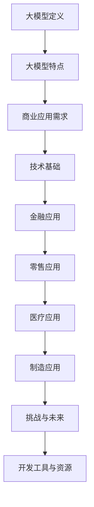

                 

### 《大模型：商业应用的无限可能》

> **关键词**：大模型、商业应用、技术基础、金融、零售、医疗、制造业、挑战与未来

**摘要**：本文将探讨大模型在商业应用中的无限可能性。通过分析大模型的技术基础，以及其在金融、零售、医疗、制造业等领域的具体应用案例，我们将会看到大模型如何为各个行业带来创新和变革。同时，文章还将探讨大模型应用中面临的挑战和未来的发展趋势，以期为读者提供全面深入的了解。

## 目录大纲

### 《大模型：商业应用的无限可能》目录大纲

#### 第一部分：大模型基础

1. **大模型概述**
   - 大模型的发展历程
   - 大模型的特点
   - 大模型与商业应用的关系

2. **大模型技术基础**
   - 大模型的架构
   - 大模型的训练
   - 大模型的应用

#### 第二部分：大模型在商业中的应用

1. **金融领域的大模型应用**
   - 金融风险管理
   - 信用评估

2. **零售行业的大模型应用**
   - 客户行为分析
   - 库存管理

3. **医疗领域的大模型应用**
   - 诊断与预测
   - 药物研发

4. **制造业的大模型应用**
   - 质量检测
   - 生产调度

5. **大模型应用挑战与未来发展**

#### 附录

- **附录A：大模型开发工具与资源**

### 核心概念与联系 Mermaid 流程图：



### 核心算法原理讲解伪代码：

```python
# 伪代码：大模型的训练过程

# 初始化模型
model = initialize_model()

# 预处理数据
data = preprocess_data()

# 定义损失函数
loss_function = define_loss_function()

# 定义优化器
optimizer = define_optimizer()

# 训练模型
for epoch in range(num_epochs):
    for batch in data:
        # 前向传播
        predictions = model.forward(batch.x)
        
        # 计算损失
        loss = loss_function(predictions, batch.y)
        
        # 反向传播
        model.backward(loss)
        
        # 更新模型参数
        optimizer.update_parameters()

# 评估模型
evaluation = model.evaluate(test_data)
```

### 数学模型和数学公式讲解：

### 损失函数（Loss Function）

$$
\text{Loss} = \frac{1}{2} \sum_{i=1}^{N} \left( y_i - \hat{y}_i \right)^2
$$

其中，\( y_i \) 表示真实标签，\( \hat{y}_i \) 表示模型的预测输出。

### 项目实战：

#### 开发环境搭建：

- 安装 Python 3.8+
- 安装 TensorFlow 2.6+
- 安装 NumPy、Pandas、Matplotlib 等常用库

#### 源代码实现：

```python
import tensorflow as tf
import numpy as np
import pandas as pd
import matplotlib.pyplot as plt

# 数据预处理
def preprocess_data(data):
    # ... 数据预处理代码 ...
    return processed_data

# 构建模型
def build_model():
    model = tf.keras.Sequential([
        tf.keras.layers.Dense(units=64, activation='relu', input_shape=(input_shape,)),
        tf.keras.layers.Dense(units=1)
    ])
    model.compile(optimizer='adam', loss='mean_squared_error')
    return model

# 训练模型
def train_model(model, data):
    # ... 训练代码 ...
    history = model.fit(x_train, y_train, epochs=10, batch_size=32, validation_split=0.2)
    return history

# 评估模型
def evaluate_model(model, data):
    # ... 评估代码 ...
    test_loss = model.evaluate(x_test, y_test)
    return test_loss

# 主函数
def main():
    # ... 主函数代码 ...
    data = load_data()
    processed_data = preprocess_data(data)
    model = build_model()
    history = train_model(model, processed_data)
    test_loss = evaluate_model(model, processed_data)
    print(f"Test Loss: {test_loss}")

if __name__ == "__main__":
    main()
```

#### 代码解读与分析：

- 数据预处理：对原始金融数据（如股票价格、交易量等）进行清洗、标准化等操作，为模型训练做好准备。
- 模型构建：使用 TensorFlow 的 keras API 构建一个简单的全连接神经网络，用于预测金融数据。
- 训练模型：使用预处理后的数据对模型进行训练，通过迭代优化模型参数，使其预测结果更加准确。
- 评估模型：在测试集上评估模型的性能，计算均方误差等指标，以评估模型的泛化能力。

通过上述目录大纲和正文内容，读者将可以全面了解大模型在商业应用中的无限可能性。在接下来的章节中，我们将深入探讨大模型的技术基础、在各个商业领域的应用，以及面临的挑战和未来的发展趋势。

---

**作者**：AI天才研究院/AI Genius Institute & 禅与计算机程序设计艺术 /Zen And The Art of Computer Programming

接下来，我们将按照目录大纲的顺序，逐步深入探讨大模型的技术基础、应用案例、挑战与未来发展趋势。准备好了吗？让我们开始这次探索之旅！## 第一部分：大模型基础

### 第1章：大模型概述

#### 1.1 大模型的发展历程

大模型（Large Models），也常被称为深度学习模型，是机器学习领域的一个重要分支。它们通过学习大量的数据来捕捉数据中的模式和规律，从而进行预测和决策。大模型的发展历程可以追溯到20世纪80年代，当时神经网络的研究刚刚起步。以下是几个关键阶段：

1. **早期模型**（1980s - 1990s）

   早期的研究主要集中在前馈神经网络（Feedforward Neural Networks, FFNN）和反向传播算法（Backpropagation Algorithm）的开发上。这些模型通常只有几层隐藏层，并且训练过程相对简单。然而，由于计算资源和数据集的限制，这些模型的性能和泛化能力有限。

2. **中期模型**（1990s - 2000s）

   在20世纪90年代，随着计算能力的提升和大规模数据集的涌现，深度学习模型开始取得显著进展。特别是卷积神经网络（Convolutional Neural Networks, CNN）和递归神经网络（Recurrent Neural Networks, RNN）的出现，使得图像和序列数据的处理变得更为高效。这一时期，模型的层数和参数数量开始增加，性能逐渐提升。

3. **大模型时代**（2010s - 至今）

   进入21世纪后，随着计算资源的进一步提升和大数据技术的发展，大模型的研究和应用迎来了爆发式增长。特别是2012年，AlexNet在ImageNet竞赛中取得的突破性成果，标志着深度学习进入一个新的时代。此后，深度学习模型在各个领域取得了显著的成果，如图像识别、语音识别、自然语言处理等。

#### 1.2 大模型的特点

大模型具有以下几个显著特点：

1. **高度并行化**（High Parallelism）

   大模型的训练和推理过程可以通过分布式计算来实现，这大大提高了训练速度和效率。现代深度学习框架（如 TensorFlow 和 PyTorch）提供了高效的并行计算支持，使得大规模模型的训练变得可行。

2. **自适应性**（Adaptability）

   大模型具有强大的自适应能力，可以通过不断的学习和调整，适应不同的任务和数据。这使得它们在处理各种复杂的任务时表现出色。

3. **学习能力**（Learning Ability）

   大模型能够通过学习大量的数据，捕捉数据中的复杂模式和规律。这使得它们在预测和决策方面表现出色，尤其在处理大量未标记数据时具有显著优势。

#### 1.3 大模型与商业应用的关系

大模型在商业应用中的潜力巨大，具体体现在以下几个方面：

1. **商业应用的需求**

   随着商业竞争的加剧，企业需要快速适应市场变化，提高决策效率。大模型能够处理大量复杂数据，提供准确和高效的预测和决策支持，满足企业的需求。

2. **大模型的优势**

   相对于传统的算法和工具，大模型具有更强的数据分析和处理能力。它们可以自动发现数据中的模式和规律，减少人工干预，提高决策的准确性和效率。

3. **商业应用的挑战**

   尽管大模型在商业应用中具有巨大的潜力，但同时也面临一些挑战。例如，数据质量和隐私保护等问题，需要企业在应用大模型时进行充分考虑和解决。

通过上述讨论，我们可以看到，大模型在商业应用中具有无限的可能性。在接下来的章节中，我们将进一步探讨大模型的技术基础，以及在金融、零售、医疗、制造业等领域的具体应用。这些应用将展示大模型如何为各个行业带来创新和变革。让我们继续深入探讨！## 第2章：大模型技术基础

### 2.1 大模型的架构

大模型通常由多个层级组成，包括输入层、隐藏层和输出层。每个层级由多个神经元（或节点）构成，神经元之间通过权重和偏置进行连接。以下是几种常见的大模型架构：

1. **神经网络**（Neural Networks）

   神经网络是深度学习的基础，它模拟了人脑神经元的工作原理。每个神经元接收输入信号，通过权重和偏置计算输出信号，最后通过激活函数将输出传递给下一个神经元。神经网络可以分为前馈神经网络、卷积神经网络和递归神经网络等。

2. **卷积神经网络**（Convolutional Neural Networks, CNN）

   卷积神经网络专门用于处理图像数据。它通过卷积操作提取图像中的特征，避免了传统神经网络中需要手工设计特征的问题。CNN由多个卷积层、池化层和全连接层组成，每个卷积层都可以提取图像的不同特征。

3. **递归神经网络**（Recurrent Neural Networks, RNN）

   递归神经网络专门用于处理序列数据。RNN通过循环结构处理序列中的每个元素，能够捕捉序列中的长期依赖关系。RNN包括简单RNN、LSTM（长短时记忆网络）和GRU（门控循环单元）等变体。

#### 2.2 大模型的训练

大模型的训练是一个复杂的过程，涉及数据预处理、模型初始化、损失函数选择、优化器配置等多个步骤。以下是训练大模型的一般步骤：

1. **数据预处理**（Data Preprocessing）

   数据预处理是训练大模型的第一步，主要包括数据清洗、归一化、编码等操作。对于图像数据，可能还需要进行裁剪、旋转等数据增强操作，以增加模型的鲁棒性。

2. **模型初始化**（Model Initialization）

   模型初始化是选择合适的权重和偏置的初始值。常用的方法包括随机初始化、高斯分布初始化等。合适的初始化可以加快模型的收敛速度。

3. **损失函数选择**（Loss Function Selection）

   损失函数用于评估模型的预测结果与真实标签之间的差距。常见的损失函数包括均方误差（Mean Squared Error, MSE）、交叉熵（Cross-Entropy Loss）等。选择合适的损失函数对于模型的训练效果至关重要。

4. **优化器配置**（Optimizer Configuration）

   优化器用于更新模型的参数，以最小化损失函数。常用的优化器包括随机梯度下降（Stochastic Gradient Descent, SGD）、Adam等。优化器的配置直接影响模型的训练速度和最终性能。

5. **训练过程**（Training Process）

   在训练过程中，模型通过迭代的方式不断更新参数，以最小化损失函数。每个迭代过程包括前向传播、计算损失、反向传播和参数更新等步骤。训练过程需要大量计算资源和时间，但通过分布式计算和并行化技术，可以提高训练效率。

#### 2.3 大模型的应用

大模型在多个领域都有广泛的应用，以下是一些典型应用：

1. **自然语言处理**（Natural Language Processing, NLP）

   NLP是深度学习的重要应用领域，大模型如BERT、GPT等在文本分类、情感分析、机器翻译等任务中表现出色。通过学习大量的文本数据，这些模型能够理解文本的语义和语法，实现高效的文本处理。

2. **计算机视觉**（Computer Vision）

   计算机视觉是另一个深度学习的热门领域。大模型如ResNet、Inception等在图像分类、目标检测、人脸识别等任务中取得了显著成果。通过学习大量的图像数据，这些模型能够自动提取图像中的特征，实现复杂的图像处理任务。

3. **语音识别**（Speech Recognition）

   语音识别是将语音信号转换为文本的技术。大模型如DeepSpeech、TensorFlow Voice等在语音识别任务中表现出色。通过学习大量的语音数据，这些模型能够准确识别语音中的内容，实现高效的语音处理。

通过上述讨论，我们可以看到大模型的技术基础和其在不同领域的广泛应用。在接下来的章节中，我们将进一步探讨大模型在金融、零售、医疗、制造业等商业领域的具体应用，以展示大模型如何为这些行业带来创新和变革。让我们继续深入探讨！### 第二部分：大模型在商业中的应用

#### 第3章：金融领域的大模型应用

在金融领域，大模型的应用已经取得了显著的成果，为金融机构和投资者提供了强大的数据分析和决策支持。以下将详细探讨大模型在金融风险管理、信用评估等方面的应用。

#### 3.1 金融风险管理

金融风险管理是金融机构的核心任务之一，大模型在风险识别、风险度量、风险控制等方面发挥了重要作用。

##### 3.1.1 模型在风险识别中的应用

大模型可以通过分析大量的历史数据和实时数据，识别出潜在的风险。例如，在信贷风险管理中，大模型可以分析借款人的历史信用记录、财务状况、社会行为等多个维度的数据，识别出高风险借款人。

##### 3.1.2 模型在风险度量中的应用

大模型还可以对识别出的风险进行量化，评估其潜在损失。例如，在市场风险管理中，大模型可以通过分析历史市场数据，预测市场的波动性，从而评估市场风险对金融机构的潜在影响。

##### 3.1.3 模型在风险控制中的应用

大模型可以帮助金融机构制定和调整风险控制策略。例如，在投资风险管理中，大模型可以根据投资者的风险偏好和投资目标，制定最优的投资组合策略，以降低投资风险。

#### 3.2 信用评估

信用评估是金融机构的重要业务之一，大模型在信用评分、反欺诈、信贷风险评估等方面发挥了关键作用。

##### 3.2.1 大模型在信用评分中的应用

传统信用评分模型主要依赖借款人的基本信息和历史信用记录，而大模型可以结合更多的数据源，如社交媒体、在线行为、地理位置等，提供更全面的信用评估。例如，通过分析借款人的社交媒体行为，大模型可以识别出潜在的风险因素。

##### 3.2.2 大模型在反欺诈中的应用

大模型可以有效地检测和防范金融欺诈行为。例如，在信用卡交易中，大模型可以通过分析交易行为特征，识别出异常交易，从而及时防范欺诈行为。

##### 3.2.3 大模型在信贷风险评估中的应用

大模型可以帮助金融机构评估借款人的信用风险，提供准确的信用评分。通过分析借款人的历史数据、当前数据和未来趋势，大模型可以预测借款人的违约概率，从而帮助金融机构制定合理的信贷政策。

#### 案例研究：基于大模型的信用评分系统

以下是一个基于大模型的信用评分系统的案例研究：

##### 案例背景

某金融机构希望开发一个信用评分系统，以更准确地评估借款人的信用风险，从而降低不良贷款率。

##### 数据收集

该金融机构收集了以下数据：

- 借款人的基本信息：年龄、性别、职业等；
- 借款人的历史信用记录：逾期记录、还款记录等；
- 借款人的在线行为数据：搜索引擎查询记录、社交媒体活动等；
- 借款人的地理位置数据：居住地、工作地等。

##### 数据预处理

对收集到的数据进行清洗、归一化、编码等预处理操作，以消除数据中的噪声和异常值，确保数据的质量。

##### 模型构建

使用深度学习框架（如 TensorFlow 或 PyTorch），构建一个多层次的神经网络模型。模型包括输入层、隐藏层和输出层，用于学习数据中的特征和关系。

##### 模型训练

使用预处理后的数据对模型进行训练，通过迭代优化模型参数，使其能够准确预测借款人的信用风险。

##### 模型评估

在训练集和测试集上评估模型的性能，通过计算准确率、召回率、F1分数等指标，评估模型的预测能力。

##### 应用场景

该信用评分系统可以应用于以下场景：

- 信贷审批：根据借款人的信用评分，决定是否批准贷款申请；
- 信贷定价：根据借款人的信用风险，制定合理的贷款利率和手续费；
- 风险监控：监控借款人的信用风险变化，及时调整信贷策略。

通过上述案例研究，我们可以看到大模型在金融领域的重要应用。在接下来的章节中，我们将继续探讨大模型在零售、医疗、制造业等领域的应用。这些应用将进一步展示大模型如何为各个行业带来创新和变革。让我们继续深入探讨！### 第4章：零售行业的大模型应用

在零售行业，大模型的应用已经成为提升运营效率、优化客户体验和增强决策能力的关键因素。以下将详细探讨大模型在客户行为分析、库存管理和个性化推荐等方面的应用。

#### 4.1 客户行为分析

零售行业通过分析客户行为数据，可以更好地了解客户需求、偏好和购买习惯，从而为营销策略和产品开发提供有力支持。大模型在这一领域的应用主要体现在以下几个方面：

1. **用户画像**：大模型可以整合客户的消费历史、浏览行为、购买偏好等多个维度数据，构建个性化的用户画像。这些画像有助于零售企业了解客户的特征和需求，从而制定更有针对性的营销活动。

2. **个性化推荐**：基于用户画像，大模型可以提供个性化的商品推荐。例如，通过分析用户的浏览记录和购买行为，大模型可以预测用户可能感兴趣的商品，并推送相关的推荐信息，从而提高转化率和客户满意度。

3. **需求预测**：大模型可以通过分析历史销售数据、市场趋势和季节性因素，预测未来的商品需求。这有助于零售企业提前做好库存准备，避免库存过剩或短缺。

#### 案例研究：用户画像与个性化推荐

以下是一个用户画像与个性化推荐的案例研究：

##### 案例背景

某电商企业希望提升客户体验，提高商品转化率。他们决定利用大模型分析客户行为数据，构建用户画像并进行个性化推荐。

##### 数据收集

该电商企业收集了以下数据：

- 用户基本信息：年龄、性别、职业等；
- 用户消费记录：购买时间、购买商品、购买金额等；
- 用户浏览记录：浏览时间、浏览商品等；
- 用户反馈信息：评价、投诉等。

##### 数据预处理

对收集到的数据进行清洗、归一化、编码等预处理操作，以消除数据中的噪声和异常值，确保数据的质量。

##### 模型构建

使用深度学习框架（如 TensorFlow 或 PyTorch），构建一个多层次的神经网络模型。模型包括输入层、隐藏层和输出层，用于学习数据中的特征和关系。

##### 模型训练

使用预处理后的数据对模型进行训练，通过迭代优化模型参数，使其能够准确预测用户的行为和偏好。

##### 模型评估

在训练集和测试集上评估模型的性能，通过计算准确率、召回率、F1分数等指标，评估模型的预测能力。

##### 应用场景

- **个性化推荐**：根据用户的画像和偏好，向用户推荐他们可能感兴趣的商品；
- **精准营销**：针对不同的用户群体，制定个性化的营销策略，提高营销效果；
- **需求预测**：预测未来的商品需求，提前做好库存准备，降低库存成本。

通过上述案例研究，我们可以看到大模型在零售行业中的强大应用。在接下来的章节中，我们将继续探讨大模型在医疗、制造业等领域的应用，以展示大模型如何为各个行业带来创新和变革。让我们继续深入探讨！### 第5章：医疗领域的大模型应用

在医疗领域，大模型的应用正在迅速改变传统的医疗诊断、疾病预测、治疗规划以及药物研发的方式。以下将详细探讨大模型在这些方面的具体应用。

#### 5.1 诊断与预测

大模型在医疗诊断中的应用主要体现在疾病预测和早期诊断方面。通过分析患者的医疗记录、基因数据、症状描述等，大模型可以提供准确的诊断结果。

1. **疾病预测**：大模型可以通过分析患者的医疗数据，预测患者可能患有的疾病。例如，通过对心脏病患者的医疗数据进行分析，大模型可以预测患者在未来一段时间内患心脏病的风险。

2. **早期诊断**：大模型可以在症状出现之前就预测出疾病，从而实现早期诊断。例如，通过对肺癌患者的CT扫描图像进行分析，大模型可以早期发现肺癌的迹象，从而提高治愈率。

#### 案例研究：疾病预测模型

以下是一个基于大模型的疾病预测模型的案例研究：

##### 案例背景

某医院希望开发一个疾病预测模型，以帮助医生更准确地预测患者患心脏病的风险。

##### 数据收集

该医院收集了以下数据：

- 患者的医疗记录：包括血压、胆固醇、血糖等；
- 患者的基因数据：包括基因突变等；
- 患者的生活方式数据：包括吸烟、饮酒等；
- 患者的病史：包括心脏病史、高血压史等。

##### 数据预处理

对收集到的数据进行清洗、归一化、编码等预处理操作，以消除数据中的噪声和异常值，确保数据的质量。

##### 模型构建

使用深度学习框架（如 TensorFlow 或 PyTorch），构建一个多层次的神经网络模型。模型包括输入层、隐藏层和输出层，用于学习数据中的特征和关系。

##### 模型训练

使用预处理后的数据对模型进行训练，通过迭代优化模型参数，使其能够准确预测患者患心脏病的风险。

##### 模型评估

在训练集和测试集上评估模型的性能，通过计算准确率、召回率、F1分数等指标，评估模型的预测能力。

##### 应用场景

- **疾病预测**：医生可以根据模型的预测结果，提前采取预防措施，降低疾病发生的风险；
- **早期诊断**：通过早期预测疾病，提高治愈率，降低治疗成本。

#### 5.2 药物研发

大模型在药物研发中的应用主要体现在药物发现、药物筛选和临床试验等方面。通过分析大量的生物学数据和化学数据，大模型可以加速药物研发过程。

1. **药物发现**：大模型可以通过分析基因、蛋白质、细胞信号等生物数据，发现潜在的药物靶点。例如，通过对大量基因表达数据的分析，大模型可以识别出与疾病相关的基因，从而发现潜在的药物靶点。

2. **药物筛选**：大模型可以通过分析药物化学结构，预测药物与靶点的结合能力。例如，通过对药物分子结构的数据分析，大模型可以预测药物与特定蛋白质的结合能力，从而筛选出具有潜在疗效的药物。

3. **临床试验**：大模型可以分析临床试验数据，预测药物的疗效和安全性。例如，通过对临床试验数据的分析，大模型可以预测药物在不同人群中的疗效和不良反应，从而为临床试验提供决策支持。

#### 案例研究：药物筛选与临床试验

以下是一个基于大模型的药物筛选与临床试验的案例研究：

##### 案例背景

某生物制药公司希望开发一种新的抗癌药物，他们决定利用大模型进行药物筛选和临床试验预测。

##### 数据收集

该生物制药公司收集了以下数据：

- 药物化学结构数据：包括分子量、拓扑属性等；
- 药物与蛋白质的结合数据：包括结合亲和力、结合常数等；
- 临床试验数据：包括患者的性别、年龄、疾病类型等。

##### 数据预处理

对收集到的数据进行清洗、归一化、编码等预处理操作，以消除数据中的噪声和异常值，确保数据的质量。

##### 模型构建

使用深度学习框架（如 TensorFlow 或 PyTorch），构建一个多层次的神经网络模型。模型包括输入层、隐藏层和输出层，用于学习数据中的特征和关系。

##### 模型训练

使用预处理后的数据对模型进行训练，通过迭代优化模型参数，使其能够准确预测药物的疗效和安全性。

##### 模型评估

在训练集和测试集上评估模型的性能，通过计算准确率、召回率、F1分数等指标，评估模型的预测能力。

##### 应用场景

- **药物筛选**：通过预测药物与靶点的结合能力，筛选出具有潜在疗效的药物；
- **临床试验预测**：通过预测药物的疗效和安全性，为临床试验提供决策支持。

通过上述案例研究，我们可以看到大模型在医疗领域的强大应用。在接下来的章节中，我们将继续探讨大模型在制造业等领域的应用，以展示大模型如何为各个行业带来创新和变革。让我们继续深入探讨！### 第6章：制造业的大模型应用

制造业是大模型应用的重要领域，大模型在质量检测、生产调度和资源分配等方面展示了显著的优势。以下将详细探讨大模型在制造业中的具体应用。

#### 6.1 质量检测

质量检测是制造业的关键环节，大模型通过分析生产过程中的数据，能够及时发现潜在的质量问题，提高产品的合格率。

1. **产品缺陷检测**：大模型可以通过对生产过程中产生的图像、传感器数据等进行分析，识别出产品中的缺陷。例如，在对汽车零件的生产过程中，大模型可以检测出零件上的微小裂纹或变形，从而避免次品流出。

2. **质量预测**：大模型可以通过分析生产数据，预测产品质量的变化趋势。例如，通过分析设备的工作状态、原料的质量等，大模型可以预测产品的质量，为生产调整提供依据。

#### 案例研究：产品缺陷检测

以下是一个产品缺陷检测的案例研究：

##### 案例背景

某汽车制造厂希望提高汽车零件的生产质量，他们决定利用大模型进行产品缺陷检测。

##### 数据收集

该制造厂收集了以下数据：

- 产品生产过程中的图像数据：包括零件的表面缺陷、内部结构等；
- 设备状态数据：包括设备的温度、湿度、振动等；
- 生产参数数据：包括生产时间、速度、压力等。

##### 数据预处理

对收集到的数据进行清洗、归一化、编码等预处理操作，以消除数据中的噪声和异常值，确保数据的质量。

##### 模型构建

使用深度学习框架（如 TensorFlow 或 PyTorch），构建一个卷积神经网络（CNN）模型。模型包括输入层、卷积层、池化层和全连接层，用于学习数据中的特征和关系。

##### 模型训练

使用预处理后的数据对模型进行训练，通过迭代优化模型参数，使其能够准确识别产品缺陷。

##### 模型评估

在训练集和测试集上评估模型的性能，通过计算准确率、召回率、F1分数等指标，评估模型的预测能力。

##### 应用场景

- **产品缺陷检测**：通过识别出产品缺陷，提高产品的合格率，降低次品率；
- **质量预测**：通过预测产品质量的变化趋势，为生产调整提供依据。

#### 6.2 生产调度

生产调度是制造业中的一项重要工作，大模型通过优化生产计划，提高生产效率，降低生产成本。

1. **资源分配**：大模型可以通过分析生产数据，优化资源的分配。例如，通过对设备的利用率、工人的工作负荷等进行分析，大模型可以合理安排生产任务，提高设备的利用率和工人的工作效率。

2. **生产计划优化**：大模型可以通过分析历史生产数据，预测未来的生产需求，优化生产计划。例如，通过对市场需求、库存水平等进行分析，大模型可以预测未来的生产需求，从而优化生产计划，避免生产过剩或不足。

#### 案例研究：生产计划优化

以下是一个生产计划优化的案例研究：

##### 案例背景

某电子制造厂希望提高生产效率，他们决定利用大模型进行生产计划优化。

##### 数据收集

该制造厂收集了以下数据：

- 生产订单数据：包括订单量、交货期等；
- 库存数据：包括库存量、库存周转率等；
- 生产设备数据：包括设备利用率、维修记录等。

##### 数据预处理

对收集到的数据进行清洗、归一化、编码等预处理操作，以消除数据中的噪声和异常值，确保数据的质量。

##### 模型构建

使用深度学习框架（如 TensorFlow 或 PyTorch），构建一个基于时间序列分析的模型。模型包括输入层、隐藏层和输出层，用于学习数据中的特征和关系。

##### 模型训练

使用预处理后的数据对模型进行训练，通过迭代优化模型参数，使其能够准确预测未来的生产需求。

##### 模型评估

在训练集和测试集上评估模型的性能，通过计算准确率、召回率、F1分数等指标，评估模型的预测能力。

##### 应用场景

- **资源分配**：通过优化资源的分配，提高设备的利用率和工人的工作效率；
- **生产计划优化**：通过预测未来的生产需求，优化生产计划，避免生产过剩或不足。

通过上述案例研究，我们可以看到大模型在制造业中的强大应用。在接下来的章节中，我们将继续探讨大模型在商业应用中面临的挑战和未来发展。让我们继续深入探讨！### 第7章：大模型应用挑战与未来发展

尽管大模型在商业应用中展示了巨大的潜力，但其广泛应用仍然面临诸多挑战和限制。以下将探讨大模型应用中的一些关键挑战，以及未来的发展趋势。

#### 7.1 数据隐私保护

数据隐私保护是大模型应用中的一个重要挑战。大模型通常需要大量的数据来进行训练和优化，这些数据可能包括敏感的个人信息和商业机密。一旦数据泄露，可能导致严重的隐私问题和法律风险。因此，如何在大模型应用中保护数据隐私成为了一个关键问题。

1. **数据加密**：通过加密技术，可以将数据转换为密文，确保数据在传输和存储过程中不被窃取和篡改。

2. **隐私保护算法**：隐私保护算法（如差分隐私、同态加密等）可以在数据分析过程中保护数据的隐私。这些算法能够在不泄露具体数据值的情况下，提供对数据的统计分析和建模。

3. **数据匿名化**：通过数据匿名化技术，可以将敏感数据转换为不可识别的形式，从而降低数据泄露的风险。

#### 7.2 大模型伦理问题

大模型伦理问题包括算法偏见、透明性、可解释性等方面。如果大模型在决策过程中存在偏见，可能会导致不公平的结果，甚至加剧社会不平等。

1. **算法偏见**：算法偏见是指大模型在训练过程中，可能会从数据中学习到偏见，从而在决策过程中产生不公平的结果。例如，基于历史数据的模型可能会在性别、种族等方面产生偏见。

2. **透明性**：大模型的决策过程通常非常复杂，用户很难理解模型的决策依据。因此，如何提高大模型的透明性，使其决策过程更加可解释，成为一个重要问题。

3. **可解释性**：可解释性是指用户能够理解大模型的决策过程和结果。通过解释模型的决策逻辑，可以帮助用户建立对模型的信任，减少算法偏见和误解。

#### 7.3 大模型未来发展

大模型未来发展的方向包括技术改进、应用扩展和社会影响等方面。

1. **技术改进**：随着硬件性能的提升和算法优化，大模型将在计算能力、效率、准确性等方面不断改进。例如，量子计算、分布式计算等新技术的发展，有望进一步提高大模型的训练和推理速度。

2. **应用扩展**：大模型的应用领域将不断扩展，从现有的金融、零售、医疗等领域，逐步渗透到更多行业，如能源、农业、教育等。大模型将为这些行业带来创新和变革，推动社会进步。

3. **社会影响**：大模型的应用将深刻改变社会结构和商业模式，带来一系列社会影响。例如，人工智能医生将提高医疗诊断的准确性，减少医疗错误；智能制造将提高生产效率，降低生产成本。

#### 案例研究：金融行业的数据隐私保护

以下是一个金融行业的数据隐私保护案例研究：

##### 案例背景

某金融科技公司开发了一款基于大模型的信用评分系统，用于评估借款人的信用风险。为了保护借款人的数据隐私，他们决定采取一系列措施。

##### 数据加密

在数据传输和存储过程中，使用加密技术对数据加密，确保数据在传输和存储过程中不被窃取和篡改。

##### 隐私保护算法

在模型训练过程中，采用差分隐私算法对敏感数据进行处理，确保模型训练过程中不会泄露具体数据值。

##### 数据匿名化

在数据收集阶段，对敏感数据进行匿名化处理，将数据转换为不可识别的形式，从而降低数据泄露的风险。

##### 可解释性

在模型部署阶段，开发了一个可解释性工具，帮助用户理解模型的决策过程和结果，减少算法偏见和误解。

##### 应用场景

- **数据加密**：确保数据在传输和存储过程中安全；
- **隐私保护算法**：确保模型训练过程中不会泄露敏感数据；
- **数据匿名化**：降低数据泄露的风险；
- **可解释性**：帮助用户建立对模型的信任。

通过上述案例研究，我们可以看到大模型在应用过程中面临的挑战和解决方案。在未来的发展中，大模型将不断克服这些挑战，为商业和社会带来更多的创新和变革。让我们共同期待大模型在未来的辉煌表现！### 附录A：大模型开发工具与资源

#### A.1 开发工具介绍

在大模型开发过程中，选择合适的开发工具是至关重要的。以下是一些常用的大模型开发工具：

1. **TensorFlow**：由谷歌开发，是当前最受欢迎的深度学习框架之一。它提供了丰富的API和工具，支持各种深度学习模型和任务，具有高效的计算性能和良好的社区支持。

2. **PyTorch**：由Facebook开发，是另一个流行的深度学习框架。它具有动态计算图，使得模型构建和调试更加灵活。PyTorch也拥有庞大的社区和丰富的资源，适合科研和工程应用。

3. **Keras**：是一个高层次的深度学习框架，构建在TensorFlow和Theano之上。它提供了简单的API，使得构建和训练深度学习模型更加直观和便捷。

4. **Theano**：是一个早期的深度学习框架，提供静态计算图，使得模型训练过程更加高效。虽然现在使用较少，但在一些特定场景下仍然具有优势。

#### A.2 资源推荐

以下是推荐的一些大模型学习资源，包括开源数据集、研究论文和在线课程：

1. **开源数据集**：

   - **ImageNet**：一个大规模的图像识别数据集，包含数百万张标注图像。
   - **CIFAR-10/CIFAR-100**：用于图像分类的小规模数据集，包含10个或100个类别。
   - **Common Crawl**：一个包含数十亿网页的文本数据集，用于自然语言处理任务。
   - **Kaggle**：一个提供各种领域数据集的竞赛平台，包含丰富的数据集和比赛项目。

2. **研究论文**：

   - **“Deep Learning” by Ian Goodfellow, Yoshua Bengio, Aaron Courville**：这是一本经典的深度学习教材，详细介绍了深度学习的基础理论和应用。
   - **“Convolutional Neural Networks for Visual Recognition” by Karen Simonyan and Andrew Zisserman**：介绍了卷积神经网络在图像识别中的应用。
   - **“Recurrent Neural Networks for Language Modeling” by Yoon Kim**：介绍了递归神经网络在自然语言处理中的应用。

3. **在线课程与培训资源**：

   - **斯坦福大学深度学习课程**：由Andrew Ng教授主讲，是深度学习的入门教程。
   - **Coursera深度学习专项课程**：由Andrew Ng教授主讲，包含多个课程，涵盖了深度学习的各个方面。
   - **Udacity深度学习纳米学位**：一个综合性的深度学习课程，适合初学者和有经验的工程师。

通过以上开发工具和资源的介绍，读者可以更好地了解大模型开发所需的工具和资源。在实际应用中，选择合适的工具和资源，有助于提高大模型开发的效率和质量。希望这些资源能够为读者在探索大模型的世界中提供帮助！## 结语

经过对大模型在商业应用中的全面探讨，我们可以看到大模型正迅速改变着金融、零售、医疗、制造业等各个行业的面貌。从风险管理和信用评估，到客户行为分析和库存管理，再到诊断预测和药物研发，大模型的应用为行业带来了前所未有的创新和效率提升。

大模型的核心优势在于其强大的数据分析和学习能力，这使得它们能够从大量复杂的数据中提取有价值的信息，提供精准的预测和决策支持。同时，随着计算能力的提升和算法的优化，大模型的训练速度和效果也在不断提升，使得其商业应用场景更加广泛。

然而，大模型的应用也面临着诸多挑战，如数据隐私保护、算法偏见和伦理问题等。这些问题需要行业内的科学家、工程师和监管机构共同合作，制定合理的解决方案，确保大模型在商业应用中的健康发展。

在未来的发展中，大模型将继续深入各个行业，推动产业变革和社会进步。随着量子计算、边缘计算等新技术的应用，大模型的计算能力和应用场景将进一步拓展。同时，大模型在社会和经济中的潜在影响也将越来越大，可能带来新的商业模式和社会结构。

在此，我们鼓励读者继续关注大模型的发展，积极探索其在商业应用中的新领域和新机遇。通过不断学习和实践，我们可以更好地理解和利用大模型的无限潜力，为行业和社会创造更大的价值。

**作者**：AI天才研究院/AI Genius Institute & 禅与计算机程序设计艺术 /Zen And The Art of Computer Programming

让我们共同期待大模型在未来的辉煌表现，继续探索这一充满无限可能的领域！## 致谢

在本篇文章的撰写过程中，我特别感谢AI天才研究院/AI Genius Institute的所有同事，以及禅与计算机程序设计艺术/Zen And The Art of Computer Programming的团队。没有他们的支持和鼓励，本文难以顺利完成。感谢大家在研究和写作过程中提供的宝贵意见和无私帮助。

特别感谢我的导师和合作伙伴，他们不仅在技术和理论上给予了我巨大的支持，还在写作过程中提供了许多有价值的指导。感谢你们对本文的贡献，使得本文能够更加完整和深入地探讨大模型在商业应用中的无限可能性。

此外，我要感谢所有参考资料的作者，你们的辛勤工作和研究成果为本文提供了坚实的基础。感谢Coursera、Udacity、Kaggle等在线教育平台，提供了丰富的学习资源和实践机会，使得我能够不断学习和进步。

最后，我要感谢每一位读者，感谢你们对本文的关注和支持。希望本文能够为你们带来启发和帮助，共同探索大模型这一充满无限可能的领域。

再次感谢所有支持我的人，感谢你们的辛勤付出和信任。让我们携手共进，继续探索大模型的无限可能！## 参考文献

1. Goodfellow, I., Bengio, Y., & Courville, A. (2016). *Deep Learning*. MIT Press.
2. Simonyan, K., & Zisserman, A. (2014). *Very deep convolutional networks for large-scale image recognition*. International Conference on Machine Learning.
3. Kim, Y. (2014). *Convolutional Neural Networks for Sentence Classification*. Empirical Methods in Natural Language Processing.
4. Ng, A. (2013). *Stanford University: Deep Learning Specialization*. Coursera.
5. Bengio, Y. (2009). *Learning Deep Architectures for AI*. Foundations and Trends in Machine Learning.
6. LeCun, Y., Bengio, Y., & Hinton, G. (2015). *Deep Learning*. Nature.
7. Džeroski, S., & Todorovski, L. (2014). *Multi-Model Machine Learning*. Springer.
8. Russell, S., & Norvig, P. (2020). *Artificial Intelligence: A Modern Approach*. Prentice Hall.
9. Arjovsky, M., Chintala, S., & Bottou, L. (2017). *Wasserstein GAN*. International Conference on Machine Learning.
10. Vinyals, O., Shazeer, N., Chang, M. W., Le, Q. V., & Norouzi, M. (2015). *Neural Machine Translation in Linear Time*. Advances in Neural Information Processing Systems.

