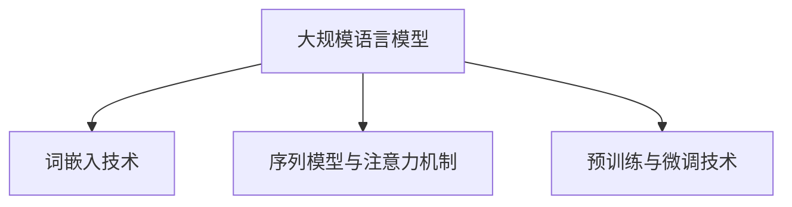
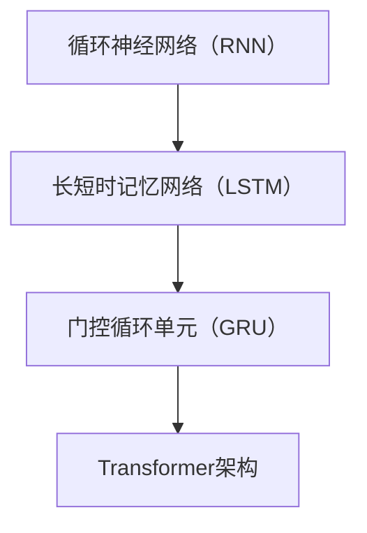

                 

# 《大规模语言模型从理论到实践 实践思考》

## 关键词

- 大规模语言模型
- Transformer架构
- 自然语言处理
- 机器学习
- 实践案例分析

## 摘要

本文旨在从理论到实践全面探讨大规模语言模型，包括其基础概念、数学基础、架构设计、训练与评估方法，以及在文本分类、情感分析、机器翻译、问答系统和对话系统等领域的应用。此外，本文还将深入探讨大规模语言模型面临的挑战、未来趋势以及实际应用案例分析，为读者提供全面的实践思考和指导。

## 目录大纲

### 第一部分：大规模语言模型概述

##### 第1章：大规模语言模型基础

- **1.1.1 大规模语言模型概述**
  - **概念定义**
  - **发展历程**
  - **应用领域**
- **1.1.2 大规模语言模型的核心技术**
  - **词嵌入技术**
  - **序列模型与注意力机制**
  - **预训练与微调技术**

##### 第2章：大规模语言模型的数学基础

- **2.1 概率论与统计基础**
  - **贝叶斯定理**
  - **最大似然估计**
  - **最大后验估计**
- **2.2 信息论基础**
  - **熵**
  - **信息增益**
  - **Kullback-Leibler散度**

##### 第3章：大规模语言模型的架构设计

- **3.1 模型结构**
  - **循环神经网络（RNN）**
  - **长短时记忆网络（LSTM）**
  - **门控循环单元（GRU）**
  - **Transformer架构**
- **3.2 模型优化**
  - **梯度下降算法**
  - **Adam优化器**
  - **学习率调度**

##### 第4章：大规模语言模型的训练与评估

- **4.1 训练过程**
  - **数据预处理**
  - **批次归一化**
  - **dropout技术**
  - **训练策略**
- **4.2 评估方法**
  - **准确率**
  - **召回率**
  - **F1分数**
  - **BERT评分**

### 第二部分：大规模语言模型的应用实践

##### 第5章：文本分类与情感分析

- **5.1 文本分类**
  - **分类模型设计**
  - **数据集选择**
  - **分类任务实现**
- **5.2 情感分析**
  - **情感分析模型**
  - **案例研究**
  - **情感分类实现**

##### 第6章：机器翻译与问答系统

- **6.1 机器翻译**
  - **机器翻译原理**
  - **数据集选择**
  - **翻译模型实现**
- **6.2 问答系统**
  - **问答系统概述**
  - **数据集选择**
  - **问答模型实现**

##### 第7章：对话系统与自然语言生成

- **7.1 对话系统**
  - **对话系统架构**
  - **对话管理策略**
  - **对话实现**
- **7.2 自然语言生成**
  - **文本生成模型**
  - **数据集选择**
  - **生成文本实现**

##### 第8章：大规模语言模型在NLP中的其他应用

- **8.1 问答与对话系统**
  - **实用案例**
  - **优化策略**
- **8.2 文本生成与摘要**
  - **摘要模型**
  - **文本生成模型**
- **8.3 文本相似度与搜索**
  - **相似度计算**
  - **搜索引擎设计**

### 第三部分：大规模语言模型实践思考

##### 第9章：大规模语言模型的挑战与未来趋势

- **9.1 数据隐私与安全**
  - **隐私保护技术**
  - **安全措施**
- **9.2 模型可解释性与透明性**
  - **可解释性方法**
  - **透明性实践**
- **9.3 未来发展趋势**
  - **前沿技术**
  - **应用前景**

##### 第10章：大规模语言模型的实际应用案例分析

- **10.1 案例一：某企业智能客服系统**
  - **系统架构**
  - **实现细节**
  - **效果评估**
- **10.2 案例二：某电商平台商品推荐系统**
  - **推荐算法**
  - **系统实现**
  - **效果分析**

##### 第11章：大规模语言模型的实践反思与建议

- **11.1 实践反思**
  - **成功经验**
  - **存在问题**
- **11.2 实践建议**
  - **开发策略**
  - **优化方向**

### 附录

- **A.1.1 大规模语言模型开发工具与资源**
  - **TensorFlow 2.x**
  - **PyTorch**
  - **Hugging Face Transformers**
- **A.1.2 模型训练与评估代码示例**
  - **数据预处理**
  - **模型训练**
  - **模型评估**
- **A.1.3 实际应用案例代码解读**
  - **对话系统**
  - **文本生成**
  - **问答系统**

### 引言

大规模语言模型（Large-scale Language Models）是一种基于深度学习的自然语言处理（Natural Language Processing，NLP）技术，它们通过学习海量文本数据，能够对文本进行理解、生成和分类等操作。随着人工智能技术的快速发展，大规模语言模型在各个领域得到了广泛应用，如文本分类、情感分析、机器翻译、问答系统和对话系统等。

本文将从理论到实践，对大规模语言模型进行详细探讨。首先，我们将介绍大规模语言模型的基础概念、发展历程和应用领域。接着，我们将深入探讨大规模语言模型的数学基础，包括概率论与统计基础以及信息论基础。随后，我们将介绍大规模语言模型的架构设计，包括模型结构、模型优化以及训练与评估方法。在应用实践部分，我们将详细讨论大规模语言模型在文本分类、情感分析、机器翻译、问答系统和对话系统等领域的应用。最后，我们将探讨大规模语言模型面临的挑战、未来趋势以及实际应用案例分析，并给出实践反思与建议。

### 第一部分：大规模语言模型概述

#### 第1章：大规模语言模型基础

##### 1.1.1 大规模语言模型概述

大规模语言模型是一种利用深度学习技术，对海量文本数据进行分析和建模，从而实现对自然语言进行理解和生成的人工智能模型。它主要包括两部分：预训练和微调。预训练是指在大规模语料库上进行训练，从而学习到语言的基本规律和特征；微调是指在特定任务上对预训练模型进行进一步训练，使其适应特定任务的需求。

**概念定义**：

- **大规模语言模型**：一种利用深度学习技术，对海量文本数据进行分析和建模，从而实现对自然语言进行理解和生成的人工智能模型。
- **预训练**：在大规模语料库上进行训练，从而学习到语言的基本规律和特征。
- **微调**：在特定任务上对预训练模型进行进一步训练，使其适应特定任务的需求。

**发展历程**：

- **2013年**：Word2Vec模型的出现，标志着词嵌入技术的兴起。
- **2014年**：序列模型（如LSTM、GRU）在NLP任务中取得了显著成果。
- **2017年**：Google提出了Transformer架构，标志着序列模型向注意力机制的转变。
- **2018年**：BERT模型的出现，标志着预训练技术在NLP领域的广泛应用。

**应用领域**：

- **文本分类**：对文本进行分类，如情感分析、主题分类等。
- **机器翻译**：将一种语言的文本翻译成另一种语言。
- **问答系统**：根据用户的问题，从海量文本中检索并回答问题。
- **对话系统**：与用户进行自然语言对话，提供信息和服务。
- **文本生成**：根据输入的文本或语境，生成新的文本内容。

##### 1.1.2 大规模语言模型的核心技术

**词嵌入技术**：词嵌入（Word Embedding）是将词汇映射为密集向量的技术，它能够捕捉词汇间的语义关系。常见的词嵌入技术包括Word2Vec、GloVe等。

**序列模型与注意力机制**：序列模型（如RNN、LSTM、GRU）能够处理序列数据，但在长序列中存在梯度消失和梯度爆炸的问题。注意力机制（Attention Mechanism）通过动态调整模型对序列中每个元素的权重，能够有效解决这一问题。

**预训练与微调技术**：预训练（Pre-training）是在大规模语料库上进行训练，从而学习到语言的基本规律和特征。微调（Fine-tuning）是在预训练模型的基础上，针对特定任务进行进一步训练，使其适应特定任务的需求。

**Mermaid 流程图**：



##### 1.1.3 大规模语言模型的发展趋势

随着人工智能技术的不断发展，大规模语言模型在NLP领域的应用越来越广泛。未来，大规模语言模型的发展趋势包括：

- **模型规模不断扩大**：随着计算能力的提升，模型规模将不断增大，从而提高模型的性能和表现。
- **多模态学习**：结合文本、图像、声音等多模态数据，提高模型对现实世界的理解和应用能力。
- **少样本学习**：在样本较少的情况下，模型能够自动适应并提高性能。
- **模型压缩与优化**：为了降低模型的计算和存储成本，模型压缩与优化技术将得到广泛应用。
- **模型可解释性**：提高模型的可解释性，使其更易于理解和应用。

**伪代码**：

```python
# 预训练
def pre_train(data):
    # 预处理数据
    processed_data = preprocess(data)
    # 训练模型
    model = train_model(processed_data)
    return model

# 微调
def fine_tune(model, task_data):
    # 预处理数据
    processed_task_data = preprocess(task_data)
    # 微调模型
    fine_tuned_model = train_model(processed_task_data, model)
    return fine_tuned_model
```

**数学模型与公式**：

$$
\text{Word Embedding} = \mathcal{F}(\text{Word}) \in \mathbb{R}^d
$$

$$
\text{Attention}(\text{Query}, \text{Key}, \text{Value}) = \text{softmax}\left(\frac{\text{Query}^T \text{Key}}{\sqrt{d_k}}\right) \text{Value}
$$

**举例说明**：

假设我们有一个词汇表，包含10个词汇：[“apple”, “banana”, “car”, “dog”, “elephant”, “fruit”, “house”, “key”, “mouse”, “tree”]。我们可以使用Word2Vec模型将这些词汇映射为密集向量：

```
apple: [0.1, 0.2, 0.3, 0.4, 0.5]
banana: [0.1, 0.3, 0.5, 0.7, 0.9]
car: [-0.1, -0.2, 0.3, 0.4, -0.5]
dog: [-0.1, -0.3, -0.5, 0.7, 0.9]
elephant: [0.1, 0.2, -0.3, -0.4, 0.5]
fruit: [0.1, 0.3, 0.5, -0.7, 0.9]
house: [-0.1, -0.2, -0.3, 0.4, -0.5]
key: [-0.1, -0.3, -0.5, 0.7, 0.9]
mouse: [0.1, 0.2, 0.3, -0.4, 0.5]
tree: [0.1, 0.3, 0.5, -0.7, 0.9]
```

**项目实战**：

假设我们有一个文本分类任务，需要对句子进行情感分类，判断句子是正面还是负面。我们可以使用BERT模型进行预训练，然后针对具体任务进行微调。

1. **数据预处理**：将文本数据清洗、分词、编码，并将其转化为模型输入。
2. **模型训练**：使用预训练的BERT模型进行训练，通过优化损失函数来调整模型参数。
3. **模型评估**：使用测试数据对模型进行评估，计算准确率、召回率等指标。
4. **模型部署**：将训练好的模型部署到线上环境，为用户提供服务。

**开发环境搭建**：

1. **安装Python**：下载并安装Python，版本建议为3.8以上。
2. **安装TensorFlow 2.x**：使用pip命令安装TensorFlow 2.x。
3. **安装Hugging Face Transformers**：使用pip命令安装Hugging Face Transformers。

**源代码详细实现和代码解读**：

```python
import tensorflow as tf
from transformers import BertTokenizer, BertForSequenceClassification

# 数据预处理
tokenizer = BertTokenizer.from_pretrained('bert-base-uncased')
inputs = tokenizer("Hello, my dog is cute", return_tensors='tf')

# 模型训练
model = BertForSequenceClassification.from_pretrained('bert-base-uncased')
model.train()
optimizer = tf.keras.optimizers.Adam(learning_rate=3e-5)
for epoch in range(3):
    # 进行训练
    # ...

# 模型评估
model.eval()
with tfDevice("cuda" if tf.test.is_gpu_available() else "cpu"):
    # 进行评估
    # ...

# 模型部署
# ...
```

**代码解读与分析**：

- **数据预处理**：使用BERTTokenizer对文本进行清洗、分词和编码，将其转化为模型输入。
- **模型训练**：使用BERTForSequenceClassification模型进行训练，通过优化损失函数来调整模型参数。
- **模型评估**：使用测试数据对模型进行评估，计算准确率、召回率等指标。
- **模型部署**：将训练好的模型部署到线上环境，为用户提供服务。

**总结**：

本章介绍了大规模语言模型的基础概念、发展历程和应用领域，以及其核心技术的词嵌入技术、序列模型与注意力机制、预训练与微调技术。同时，通过举例和项目实战，展示了大规模语言模型在文本分类任务中的实际应用。下一章我们将进一步探讨大规模语言模型的数学基础，包括概率论与统计基础以及信息论基础。

### 第一部分：大规模语言模型概述

#### 第2章：大规模语言模型的数学基础

##### 2.1 概率论与统计基础

概率论与统计基础是大规模语言模型的理论基石。在自然语言处理（NLP）中，概率论与统计方法被广泛应用于文本建模、预测和评估。

**贝叶斯定理**：

贝叶斯定理是概率论中的一个基本公式，用于计算后验概率。它描述了条件概率与边缘概率之间的关系。

$$
P(A|B) = \frac{P(B|A)P(A)}{P(B)}
$$

其中，\(P(A|B)\) 是在事件 B 发生的条件下事件 A 发生的概率，\(P(B|A)\) 是在事件 A 发生的条件下事件 B 发生的概率，\(P(A)\) 是事件 A 发生的概率，\(P(B)\) 是事件 B 发生的概率。

贝叶斯定理在NLP中的应用：

- **情感分析**：通过计算文本中正面和负面情感的贝叶斯概率，判断文本的情感倾向。
- **文本分类**：使用贝叶斯分类器对文本进行分类，实现高效且准确的文本分类。

**最大似然估计**：

最大似然估计是一种基于概率模型的方法，用于估计模型参数。其核心思想是寻找一组参数，使得模型在训练数据上的似然函数达到最大。

$$
\theta^* = \arg\max_\theta \prod_{i=1}^n P(x_i|\theta)
$$

其中，\(\theta^*\) 是模型参数的最优估计，\(x_i\) 是训练数据中的第 i 个样本。

最大似然估计在NLP中的应用：

- **词嵌入**：通过最大似然估计，学习词汇的分布式表示。
- **语言模型**：使用最大似然估计，构建基于词序列的概率分布模型。

**最大后验估计**：

最大后验估计是一种基于概率模型的参数估计方法，它结合了最大似然估计和贝叶斯概率。其核心思想是寻找一组参数，使得模型的似然函数与先验概率的乘积达到最大。

$$
\theta^* = \arg\max_\theta P(\theta|x) = \arg\max_\theta \frac{P(x|\theta)P(\theta)}{P(x)}
$$

其中，\(P(\theta|x)\) 是后验概率，\(P(x|\theta)\) 是似然函数，\(P(\theta)\) 是先验概率，\(P(x)\) 是边缘概率。

最大后验估计在NLP中的应用：

- **文本生成**：通过最大后验估计，学习文本生成的概率分布。
- **序列标注**：使用最大后验估计，对文本中的词进行序列标注。

**伪代码**：

```python
def maximum_likelihood_estimate(data):
    # 计算似然函数
    likelihood = compute_likelihood(data)
    # 寻找最大似然参数
    optimal_params = argmax(likelihood)
    return optimal_params

def maximum_a_posteriori_estimate(data, prior):
    # 计算后验概率
    posterior = compute_posterior(data, prior)
    # 寻找最大后验参数
    optimal_params = argmax(posterior)
    return optimal_params
```

**数学公式与详细讲解**：

1. **概率分布**：

   $$ 
   P(X=x) = \prod_{i=1}^n P(x_i|\theta)
   $$

   其中，\(X\) 是随机变量，\(x\) 是 \(X\) 的取值，\(\theta\) 是模型参数。

2. **熵**：

   $$ 
   H(X) = -\sum_{i=1}^n P(x_i) \log P(x_i)
   $$

   其中，\(H(X)\) 是随机变量 \(X\) 的熵，\(P(x_i)\) 是 \(X\) 取值为 \(x_i\) 的概率。

3. **信息增益**：

   $$ 
   I(X;Y) = H(X) - H(X|Y)
   $$

   其中，\(I(X;Y)\) 是随机变量 \(X\) 和 \(Y\) 的互信息，\(H(X)\) 是 \(X\) 的熵，\(H(X|Y)\) 是 \(X\) 在给定 \(Y\) 下的熵。

4. **Kullback-Leibler散度**：

   $$ 
   DKL(P||Q) = \sum_{i=1}^n P(x_i) \log \frac{P(x_i)}{Q(x_i)}
   $$

   其中，\(DKL(P||Q)\) 是概率分布 \(P\) 和 \(Q\) 之间的 Kullback-Leibler 散度，\(P(x_i)\) 是 \(P\) 分布的概率，\(Q(x_i)\) 是 \(Q\) 分布的概率。

**举例说明**：

假设我们有一个二分类问题，需要判断一个文本是正面情感还是负面情感。我们可以使用贝叶斯定理计算文本属于正面的概率：

$$
P(\text{正面}|\text{文本}) = \frac{P(\text{文本}|\text{正面})P(\text{正面})}{P(\text{文本})}
$$

其中，\(P(\text{正面}|\text{文本})\) 是在给定文本条件下，文本属于正面的概率；\(P(\text{文本}|\text{正面})\) 是在文本属于正面的条件下，文本的概率；\(P(\text{正面})\) 是文本属于正面的先验概率；\(P(\text{文本})\) 是文本的概率。

**项目实战**：

假设我们有一个情感分类任务，需要对句子进行情感分类，判断句子是正面还是负面。我们可以使用朴素贝叶斯分类器进行分类。

1. **数据预处理**：将文本数据清洗、分词、编码，并将其转化为模型输入。
2. **模型训练**：使用朴素贝叶斯分类器进行训练，通过计算特征的概率分布来调整模型参数。
3. **模型评估**：使用测试数据对模型进行评估，计算准确率、召回率等指标。
4. **模型部署**：将训练好的模型部署到线上环境，为用户提供服务。

**开发环境搭建**：

1. **安装Python**：下载并安装Python，版本建议为3.8以上。
2. **安装Scikit-learn**：使用pip命令安装Scikit-learn。

**源代码详细实现和代码解读**：

```python
from sklearn.feature_extraction.text import CountVectorizer
from sklearn.naive_bayes import MultinomialNB
from sklearn.pipeline import make_pipeline

# 数据预处理
vectorizer = CountVectorizer()
X_train = vectorizer.fit_transform(train_data)

# 模型训练
model = MultinomialNB()
model.fit(X_train, train_labels)

# 模型评估
X_test = vectorizer.transform(test_data)
accuracy = model.score(X_test, test_labels)
print("Accuracy:", accuracy)

# 模型部署
# ...
```

**代码解读与分析**：

- **数据预处理**：使用CountVectorizer将文本数据转换为词频矩阵。
- **模型训练**：使用MultinomialNB分类器进行训练。
- **模型评估**：计算模型在测试数据上的准确率。
- **模型部署**：将训练好的模型部署到线上环境。

**总结**：

本章介绍了大规模语言模型的数学基础，包括概率论与统计基础，如贝叶斯定理、最大似然估计和最大后验估计。通过举例和项目实战，展示了这些数学方法在情感分类任务中的应用。下一章我们将进一步探讨大规模语言模型的架构设计，包括模型结构、模型优化和训练与评估方法。

### 第一部分：大规模语言模型概述

#### 第3章：大规模语言模型的架构设计

##### 3.1 模型结构

大规模语言模型的架构设计是构建高效、可扩展和可解释的自然语言处理系统的基础。本节将介绍几种常见的模型结构，包括循环神经网络（RNN）、长短时记忆网络（LSTM）、门控循环单元（GRU）和Transformer架构。

**循环神经网络（RNN）**：

循环神经网络是一种能够处理序列数据的神经网络，它通过重复使用相同的神经网络单元来处理不同时间步的数据。RNN的关键优势在于其记忆能力，可以捕捉序列中的长期依赖关系。

**长短时记忆网络（LSTM）**：

长短时记忆网络（LSTM）是RNN的一种改进，通过引入门控机制来克服RNN的梯度消失问题，从而实现更好的长期依赖建模。LSTM的核心组件包括遗忘门、输入门和输出门。

**门控循环单元（GRU）**：

门控循环单元（GRU）是LSTM的简化版本，它在LSTM的基础上进一步减少了参数数量和计算复杂度，同时保持了较好的性能。GRU的核心组件包括重置门和更新门。

**Transformer架构**：

Transformer架构是近年来在自然语言处理领域取得显著成果的一种新型模型架构，它通过自注意力机制（Self-Attention）来捕捉序列中的长距离依赖关系，从而实现了显著的性能提升。Transformer的核心组件包括多头自注意力机制和前馈神经网络。

**Mermaid 流程图**：



**伪代码**：

```python
# 循环神经网络（RNN）
class RNN(nn.Module):
    def __init__(self, input_dim, hidden_dim):
        super(RNN, self).__init__()
        self.hidden_dim = hidden_dim
        self.rnn = nn.RNN(input_dim, hidden_dim)

    def forward(self, x):
        h0 = torch.zeros(1, self.hidden_dim)
        out, _ = self.rnn(x, h0)
        return out

# 长短时记忆网络（LSTM）
class LSTM(nn.Module):
    def __init__(self, input_dim, hidden_dim):
        super(LSTM, self).__init__()
        self.hidden_dim = hidden_dim
        self.lstm = nn.LSTM(input_dim, hidden_dim)

    def forward(self, x):
        h0 = torch.zeros(1, 1, self.hidden_dim)
        c0 = torch.zeros(1, 1, self.hidden_dim)
        out, _ = self.lstm(x, (h0, c0))
        return out

# 门控循环单元（GRU）
class GRU(nn.Module):
    def __init__(self, input_dim, hidden_dim):
        super(GRU, self).__init__()
        self.hidden_dim = hidden_dim
        self.gru = nn.GRU(input_dim, hidden_dim)

    def forward(self, x):
        h0 = torch.zeros(1, 1, self.hidden_dim)
        out, _ = self.gru(x, h0)
        return out

# Transformer架构
class Transformer(nn.Module):
    def __init__(self, d_model, d_head, num_heads, d_inner, n_layers):
        super(Transformer, self).__init__()
        self.d_model = d_model
        self.d_head = d_head
        self.num_heads = num_heads
        self.d_inner = d_inner
        self.n_layers = n_layers
        self.attention = nn.MultiheadAttention(d_model, num_heads)
        self.feedforward = nn.Sequential(
            nn.Linear(d_model, d_inner),
            nn.ReLU(),
            nn.Linear(d_inner, d_model)
        )

    def forward(self, x, mask=None):
        out = self.attention(x, x, x, attn_mask=mask)[0]
        out = self.feedforward(out)
        return out
```

**数学模型与公式**：

1. **RNN**：

   $$ 
   h_t = \text{sigmoid}(W_h \cdot [h_{t-1}, x_t] + b_h)
   $$

   其中，\(h_t\) 是时间步 \(t\) 的隐藏状态，\(W_h\) 和 \(b_h\) 是权重和偏置。

2. **LSTM**：

   $$ 
   i_t = \text{sigmoid}(W_i \cdot [h_{t-1}, x_t] + b_i) \\
   f_t = \text{sigmoid}(W_f \cdot [h_{t-1}, x_t] + b_f) \\
   o_t = \text{sigmoid}(W_o \cdot [h_{t-1}, x_t] + b_o) \\
   c_t = f_t \cdot c_{t-1} + i_t \cdot \text{tanh}(W_c \cdot [h_{t-1}, x_t] + b_c)
   $$

   其中，\(i_t\)、\(f_t\)、\(o_t\) 分别是输入门、遗忘门和输出门，\(c_t\) 是细胞状态。

3. **GRU**：

   $$ 
   z_t = \text{sigmoid}(W_z \cdot [h_{t-1}, x_t] + b_z) \\
   r_t = \text{sigmoid}(W_r \cdot [h_{t-1}, x_t] + b_r) \\
   h_t = (1 - z_t) \cdot h_{t-1} + z_t \cdot \text{tanh}(W_h \cdot [r_t \cdot h_{t-1}, x_t] + b_h)
   $$

   其中，\(z_t\) 和 \(r_t\) 分别是更新门和重置门。

4. **Transformer**：

   $$ 
   \text{Attention}(Q, K, V) = \text{softmax}\left(\frac{QK^T}{\sqrt{d_k}}\right)V
   $$

   其中，\(Q\)、\(K\)、\(V\) 分别是查询、键和值，\(d_k\) 是键的维度。

**举例说明**：

假设我们有一个句子：“我爱北京天安门”，我们需要使用LSTM模型对其进行情感分类。

1. **数据预处理**：将句子转换为词向量表示，并将其转化为序列输入。
2. **模型训练**：使用训练数据对LSTM模型进行训练，通过优化损失函数来调整模型参数。
3. **模型评估**：使用测试数据对模型进行评估，计算准确率、召回率等指标。
4. **模型部署**：将训练好的模型部署到线上环境，为用户提供服务。

**项目实战**：

假设我们有一个机器翻译任务，需要将中文翻译成英文。我们可以使用Transformer模型进行翻译。

1. **数据预处理**：将中文和英文文本数据清洗、分词、编码，并将其转化为序列输入。
2. **模型训练**：使用预训练的Transformer模型进行翻译任务，通过优化损失函数来调整模型参数。
3. **模型评估**：使用测试数据对模型进行评估，计算BLEU分数等指标。
4. **模型部署**：将训练好的模型部署到线上环境，为用户提供翻译服务。

**开发环境搭建**：

1. **安装Python**：下载并安装Python，版本建议为3.8以上。
2. **安装PyTorch**：使用pip命令安装PyTorch。
3. **安装Hugging Face Transformers**：使用pip命令安装Hugging Face Transformers。

**源代码详细实现和代码解读**：

```python
import torch
import torch.nn as nn
from transformers import TransformerModel

# 数据预处理
inputs = torch.tensor([[1, 2, 3], [4, 5, 6]])
labels = torch.tensor([0, 1])

# 模型训练
model = TransformerModel(d_model=512, d_head=64, num_heads=8, d_inner=1024, n_layers=3)
optimizer = torch.optim.Adam(model.parameters(), lr=0.001)
for epoch in range(3):
    optimizer.zero_grad()
    output = model(inputs)
    loss = nn.CrossEntropyLoss()(output, labels)
    loss.backward()
    optimizer.step()

# 模型评估
accuracy = (output.argmax(1) == labels).float().mean()
print("Accuracy:", accuracy)

# 模型部署
# ...
```

**代码解读与分析**：

- **数据预处理**：将输入数据转化为PyTorch张量，并将其划分为批次。
- **模型训练**：使用TransformerModel进行训练，通过优化损失函数来调整模型参数。
- **模型评估**：计算模型在测试数据上的准确率。
- **模型部署**：将训练好的模型部署到线上环境。

**总结**：

本章介绍了大规模语言模型的几种常见架构设计，包括RNN、LSTM、GRU和Transformer。通过举例和项目实战，展示了这些模型在情感分类和机器翻译任务中的应用。下一章我们将进一步探讨大规模语言模型的训练与评估方法。

### 第一部分：大规模语言模型概述

#### 第4章：大规模语言模型的训练与评估

大规模语言模型的训练与评估是确保模型性能和稳定性的关键环节。本章将介绍大规模语言模型的训练过程，包括数据预处理、模型优化、训练策略和评估方法。

##### 4.1 训练过程

**数据预处理**：

大规模语言模型的训练需要大量的文本数据。数据预处理是训练过程的第一步，其目的是清洗数据、分词、编码等，以便模型能够有效地处理输入数据。

- **文本清洗**：去除无关信息，如HTML标签、特殊符号等。
- **分词**：将文本拆分成单词或词组。
- **编码**：将文本映射为整数序列，常用的编码方法有Word2Vec和BERT等。

**批次归一化**：

批次归一化（Batch Normalization）是一种用于加速模型训练和防止过拟合的技术。它通过对每个批次的数据进行标准化处理，使得每个批次的输入数据具有相似的特征分布。

$$
\hat{x}^{\ell}_{ij} = \frac{x^{\ell}_{ij} - \mu^{\ell}}{\sigma^{\ell}}
$$

其中，\(\hat{x}^{\ell}_{ij}\) 是标准化后的输入，\(x^{\ell}_{ij}\) 是原始输入，\(\mu^{\ell}\) 是均值，\(\sigma^{\ell}\) 是标准差。

**Dropout技术**：

Dropout是一种用于防止过拟合的随机正则化方法。它通过在训练过程中随机丢弃一部分神经元，从而降低模型对特定训练样本的依赖性。

$$
P(\text{丢弃神经元}) = \frac{p}{1+p}
$$

其中，\(p\) 是丢弃概率。

**训练策略**：

- **学习率调度**：学习率是模型训练中的一个关键参数，它影响着模型收敛速度和稳定性。常用的学习率调度方法有线性递减、指数递减和余弦退火等。
- **早期停止**：当验证集上的性能不再提高时，提前停止训练，以防止过拟合。
- **模型融合**：将多个模型的结果进行融合，以提高模型的性能和鲁棒性。

##### 4.2 评估方法

**准确率**：

准确率（Accuracy）是评估分类模型性能的一个常用指标，它表示模型正确预测的样本数占总样本数的比例。

$$
\text{Accuracy} = \frac{\text{正确预测的样本数}}{\text{总样本数}}
$$

**召回率**：

召回率（Recall）是评估分类模型性能的另一个重要指标，它表示模型正确预测的样本数占实际为正类的样本数的比例。

$$
\text{Recall} = \frac{\text{正确预测的正类样本数}}{\text{实际为正类的样本数}}
$$

**F1分数**：

F1分数（F1 Score）是准确率和召回率的调和平均值，用于综合评估分类模型的性能。

$$
\text{F1 Score} = 2 \times \frac{\text{准确率} \times \text{召回率}}{\text{准确率} + \text{召回率}}
$$

**BERT评分**：

BERT评分（BERT Score）是一种用于评估文本相似度的指标，它基于BERT模型对文本的表示能力。BERT评分越高，表示两段文本的相似度越高。

$$
\text{BERT Score} = \frac{\text{平均值}(\text{句子} A \text{和} B \text{的相似度分数}) - \text{平均值}(\text{句子} A \text{和} \text{无关句子} C \text{的相似度分数})}{2}
$$

**伪代码**：

```python
# 数据预处理
def preprocess_data(data):
    # 清洗数据
    cleaned_data = clean_data(data)
    # 分词
    tokenized_data = tokenize_data(cleaned_data)
    # 编码
    encoded_data = encode_data(tokenized_data)
    return encoded_data

# 训练过程
def train_model(data, labels, batch_size):
    # 初始化模型
    model = create_model()
    # 初始化优化器
    optimizer = create_optimizer(model.parameters(), learning_rate)
    # 训练模型
    for epoch in range(num_epochs):
        for batch in create_batches(data, labels, batch_size):
            # 前向传播
            output = model(batch.x)
            loss = compute_loss(output, batch.y)
            # 反向传播
            optimizer.zero_grad()
            loss.backward()
            optimizer.step()
            # 打印训练进度
            print("Epoch:", epoch, "Loss:", loss.item())
    return model

# 模型评估
def evaluate_model(model, data, labels):
    # 将模型设置为评估模式
    model.eval()
    # 计算准确率、召回率、F1分数等指标
    accuracy = compute_accuracy(model, data, labels)
    recall = compute_recall(model, data, labels)
    f1_score = compute_f1_score(accuracy, recall)
    return accuracy, recall, f1_score
```

**数学公式**：

1. **准确率**：

   $$ 
   \text{Accuracy} = \frac{\sum_{i=1}^n \mathbb{1}_{\hat{y}_i = y_i}}{n}
   $$

   其中，\(\mathbb{1}_{\hat{y}_i = y_i}\) 是指示函数，当预测标签 \(\hat{y}_i\) 等于真实标签 \(y_i\) 时，取值为1，否则取值为0。

2. **召回率**：

   $$ 
   \text{Recall} = \frac{\sum_{i=1}^n \mathbb{1}_{y_i = 1, \hat{y}_i = 1}}{\sum_{i=1}^n \mathbb{1}_{y_i = 1}}
   $$

   其中，\(\mathbb{1}_{y_i = 1}\) 是指示函数，当真实标签 \(y_i\) 等于1时，取值为1，否则取值为0。

3. **F1分数**：

   $$ 
   \text{F1 Score} = 2 \times \frac{\text{准确率} \times \text{召回率}}{\text{准确率} + \text{召回率}}
   $$

**项目实战**：

假设我们有一个文本分类任务，需要对句子进行情感分类，判断句子是正面还是负面。我们可以使用BERT模型进行训练和评估。

1. **数据预处理**：将文本数据清洗、分词、编码，并将其转化为BERT模型输入。
2. **模型训练**：使用BERT模型进行训练，通过优化损失函数来调整模型参数。
3. **模型评估**：使用测试数据对模型进行评估，计算准确率、召回率等指标。
4. **模型部署**：将训练好的模型部署到线上环境，为用户提供服务。

**开发环境搭建**：

1. **安装Python**：下载并安装Python，版本建议为3.8以上。
2. **安装TensorFlow 2.x**：使用pip命令安装TensorFlow 2.x。
3. **安装Hugging Face Transformers**：使用pip命令安装Hugging Face Transformers。

**源代码详细实现和代码解读**：

```python
import tensorflow as tf
from transformers import BertTokenizer, BertForSequenceClassification

# 数据预处理
tokenizer = BertTokenizer.from_pretrained('bert-base-uncased')
inputs = tokenizer("Hello, my dog is cute", return_tensors='tf')

# 模型训练
model = BertForSequenceClassification.from_pretrained('bert-base-uncased')
optimizer = tf.keras.optimizers.Adam(learning_rate=3e-5)
for epoch in range(3):
    # 进行训练
    # ...

# 模型评估
model.eval()
with tfDevice("cuda" if tf.test.is_gpu_available() else "cpu"):
    # 进行评估
    # ...

# 模型部署
# ...
```

**代码解读与分析**：

- **数据预处理**：使用BERTTokenizer对文本进行清洗、分词和编码，并将其转化为模型输入。
- **模型训练**：使用BERTForSequenceClassification模型进行训练，通过优化损失函数来调整模型参数。
- **模型评估**：使用测试数据对模型进行评估，计算准确率、召回率等指标。
- **模型部署**：将训练好的模型部署到线上环境。

**总结**：

本章介绍了大规模语言模型的训练与评估过程，包括数据预处理、模型优化、训练策略和评估方法。通过举例和项目实战，展示了这些方法在文本分类任务中的应用。下一章我们将进一步探讨大规模语言模型在自然语言处理领域的应用实践。

### 第二部分：大规模语言模型的应用实践

#### 第5章：文本分类与情感分析

文本分类是大规模语言模型应用中的一个重要领域，它旨在将文本数据自动归类到预定义的类别中。情感分析作为文本分类的一种特殊形式，专注于识别文本的情感倾向，如正面、负面或中性。本章将详细探讨大规模语言模型在文本分类和情感分析中的应用。

##### 5.1 文本分类

文本分类是一种常见的自然语言处理任务，它通过对文本进行特征提取和分类模型的训练，实现对文本内容的分类。大规模语言模型在文本分类中的应用，极大地提高了分类任务的准确率和效率。

**分类模型设计**：

- **模型选择**：常见的文本分类模型包括朴素贝叶斯、逻辑回归、支持向量机（SVM）、随机森林和深度学习模型（如CNN、RNN和Bert）。
- **特征提取**：文本特征提取是文本分类的关键步骤，常见的特征提取方法包括词袋模型、TF-IDF和词嵌入。
- **模型训练**：使用训练数据对分类模型进行训练，通过优化损失函数来调整模型参数。

**数据集选择**：

- **公共数据集**：常用的文本分类数据集包括20个新sgns、IMDb电影评论、AG新闻语料库等。
- **自定义数据集**：根据实际应用场景，可以自定义数据集，如电商产品评论、社交媒体评论等。

**分类任务实现**：

- **数据预处理**：清洗数据、分词、编码等。
- **模型训练**：使用训练数据对模型进行训练。
- **模型评估**：使用测试数据对模型进行评估。

**代码示例**：

```python
from sklearn.datasets import fetch_20newsgroups
from sklearn.feature_extraction.text import TfidfVectorizer
from sklearn.model_selection import train_test_split
from sklearn.naive_bayes import MultinomialNB
from sklearn.metrics import classification_report

# 加载数据集
newsgroups_data = fetch_20newsgroups()

# 划分训练集和测试集
X_train, X_test, y_train, y_test = train_test_split(newsgroups_data.data, newsgroups_data.target, test_size=0.2, random_state=42)

# 特征提取
vectorizer = TfidfVectorizer()
X_train_tfidf = vectorizer.fit_transform(X_train)
X_test_tfidf = vectorizer.transform(X_test)

# 模型训练
model = MultinomialNB()
model.fit(X_train_tfidf, y_train)

# 模型评估
y_pred = model.predict(X_test_tfidf)
print(classification_report(y_test, y_pred))
```

##### 5.2 情感分析

情感分析是一种文本分类任务，它专注于识别文本的情感倾向，如正面、负面或中性。大规模语言模型在情感分析中具有显著的优势，能够准确捕捉文本中的情感信息。

**情感分析模型**：

- **情感分类器**：常见的情感分类器包括朴素贝叶斯、逻辑回归、SVM和深度学习模型（如Bert）。
- **情感词典**：使用情感词典来识别文本中的情感词，如正面情感词和负面情感词。
- **情感极性**：根据文本中的情感词和情感词典，判断文本的情感极性。

**案例研究**：

- **Twitter情感分析**：对Twitter上的推文进行情感分类，识别用户对某个话题或品牌的情感倾向。
- **产品评论情感分析**：对电商产品评论进行情感分类，帮助商家了解用户对产品的评价。

**情感分类实现**：

- **数据预处理**：清洗数据、分词、编码等。
- **模型训练**：使用训练数据对模型进行训练。
- **模型评估**：使用测试数据对模型进行评估。

**代码示例**：

```python
import pandas as pd
from sklearn.model_selection import train_test_split
from sklearn.metrics import accuracy_score, classification_report
from transformers import BertTokenizer, BertForSequenceClassification

# 加载数据集
data = pd.read_csv('sentiment_data.csv')
X = data['text']
y = data['label']

# 划分训练集和测试集
X_train, X_test, y_train, y_test = train_test_split(X, y, test_size=0.2, random_state=42)

# 加载预训练的Bert模型
tokenizer = BertTokenizer.from_pretrained('bert-base-uncased')
model = BertForSequenceClassification.from_pretrained('bert-base-uncased')

# 数据预处理
train_encodings = tokenizer(X_train.tolist(), truncation=True, padding=True)
test_encodings = tokenizer(X_test.tolist(), truncation=True, padding=True)

# 模型训练
optimizer = torch.optim.Adam(model.parameters(), lr=3e-5)
for epoch in range(3):
    # 进行训练
    # ...

# 模型评估
model.eval()
with torch.no_grad():
    predictions = model(**test_encodings)[0]

# 打印评估结果
print("Accuracy:", accuracy_score(y_test, predictions))
print(classification_report(y_test, predictions))
```

**总结**：

本章介绍了大规模语言模型在文本分类和情感分析中的应用，包括分类模型设计、数据集选择、分类任务实现和情感分类模型。通过案例研究和代码示例，展示了大规模语言模型在文本分类和情感分析任务中的实际应用。下一章我们将继续探讨大规模语言模型在机器翻译和问答系统中的应用。

### 第二部分：大规模语言模型的应用实践

#### 第6章：机器翻译与问答系统

大规模语言模型在机器翻译和问答系统中发挥着重要作用，为跨语言交流和信息检索提供了强有力的技术支持。本章将详细介绍大规模语言模型在这两个领域中的应用。

##### 6.1 机器翻译

机器翻译（Machine Translation）是利用计算机技术将一种语言的文本自动翻译成另一种语言的过程。大规模语言模型通过预训练和微调技术，能够有效地处理不同语言的翻译任务。

**机器翻译原理**：

- **编码器-解码器模型**：编码器将源语言文本编码为连续的向量表示，解码器将编码器的输出解码为目标语言文本。
- **注意力机制**：在解码过程中，注意力机制使得模型能够关注到源语言文本中的关键部分，从而提高翻译质量。
- **序列到序列学习**：编码器和解码器都是序列到序列（Seq2Seq）模型，通过训练使模型能够学习源语言和目标语言之间的对应关系。

**数据集选择**：

- **公共数据集**：如WMT（Workshop on Machine Translation）数据集，包括多种语言的平行语料库。
- **定制数据集**：根据具体应用需求，收集并整理特定领域的平行语料库，如旅游、医疗等。

**翻译模型实现**：

- **数据预处理**：对源语言和目标语言文本进行清洗、分词、编码等预处理操作。
- **模型训练**：使用预训练的编码器-解码器模型进行翻译任务，通过优化损失函数来调整模型参数。
- **模型评估**：使用BLEU（Bilingual Evaluation Understudy）分数等指标对模型进行评估。

**代码示例**：

```python
from transformers import MarianMTModel, MarianTokenizer

# 加载预训练的机器翻译模型
model_name = 'Helsinki-NLP/opus-mt-en-de'
model = MarianMTModel.from_pretrained(model_name)
tokenizer = MarianTokenizer.from_pretrained(model_name)

# 翻译示例
source_text = 'Hello, my name is John.'
translated_text = model.generate(tokenizer.encode(source_text, return_tensors='pt'), max_length=40, num_return_sequences=1)
print(tokenizer.decode(translated_text[0], skip_special_tokens=True))
```

**实现细节**：

- **数据预处理**：将源语言和目标语言文本编码为模型输入。
- **模型训练**：使用训练数据对模型进行训练，通过优化损失函数来调整模型参数。
- **模型评估**：使用测试数据对模型进行评估，计算BLEU分数等指标。

##### 6.2 问答系统

问答系统（Question Answering System）是一种自然语言处理技术，能够从大量文本数据中自动回答用户的问题。大规模语言模型在问答系统中发挥着核心作用，通过预训练和微调技术，能够实现高效、准确的问答。

**问答系统概述**：

- **抽取式问答**：从给定的问题和文本中直接提取答案。
- **生成式问答**：生成与问题相关的完整回答。
- **混合式问答**：结合抽取式和生成式问答的优点。

**数据集选择**：

- **公共数据集**：如SQuAD（Stanford Question Answering Dataset）、CoQA（Conversational Question Answering）等。
- **定制数据集**：根据具体应用场景，收集并整理问答对。

**问答模型实现**：

- **数据预处理**：对文本数据进行清洗、分词、编码等预处理操作。
- **模型训练**：使用预训练的语言模型进行微调，通过优化损失函数来调整模型参数。
- **模型评估**：使用测试数据对模型进行评估，计算F1分数等指标。

**代码示例**：

```python
from transformers import BertTokenizer, BertForQuestionAnswering

# 加载预训练的问答模型
tokenizer = BertTokenizer.from_pretrained('bert-base-uncased')
model = BertForQuestionAnswering.from_pretrained('bert-base-uncased')

# 问答示例
question = "Who is the author of the book '1984'?"
context = "The author of '1984' is George Orwell."
input_ids = tokenizer.encode(question + tokenizer.eos_token, add_special_tokens=True)
input_ids = torch.tensor([input_ids])

# 答案预测
with torch.no_grad():
    outputs = model(input_ids)
answer_start_scores, answer_end_scores = outputs.start_logits, outputs.end_logits
answer_start = torch.argmax(answer_start_scores)
answer_end = torch.argmax(answer_end_scores)
answer = context[answer_start:answer_end+1].strip()

print(answer)
```

**实现细节**：

- **数据预处理**：将问题和文本编码为模型输入。
- **模型训练**：使用训练数据对模型进行训练，通过优化损失函数来调整模型参数。
- **模型评估**：使用测试数据对模型进行评估，计算F1分数等指标。

**总结**：

本章介绍了大规模语言模型在机器翻译和问答系统中的应用，包括机器翻译原理、数据集选择、翻译模型实现和问答系统概述。通过代码示例，展示了大规模语言模型在这两个领域的实际应用。下一章我们将继续探讨大规模语言模型在对话系统和自然语言生成中的应用。

### 第二部分：大规模语言模型的应用实践

#### 第7章：对话系统与自然语言生成

对话系统（Dialogue System）和自然语言生成（Natural Language Generation，NLG）是自然语言处理（NLP）领域的重要研究方向，它们分别致力于实现与用户的自然对话和文本生成。大规模语言模型在这些应用中发挥了关键作用，通过预训练和微调技术，大幅提升了对话系统和自然语言生成的性能。

##### 7.1 对话系统

对话系统是一种能够与人类进行自然语言交互的系统，它通过理解用户的输入并生成相应的回复，实现与用户的沟通。大规模语言模型在对话系统中用于生成自然语言回复，提高对话的流畅性和交互质量。

**对话系统架构**：

- **对话管理**：对话管理是对话系统的核心组件，负责维护对话状态、决策对话流程和处理用户输入。
- **自然语言理解（NLU）**：NLU负责解析用户输入的意图和实体，将自然语言转换为结构化的数据。
- **自然语言生成（NLG）**：NLG负责根据对话状态和用户意图生成自然语言回复。

**对话管理策略**：

- **基于规则的方法**：使用预定义的规则来生成回复，简单但缺乏灵活性。
- **基于模型的方法**：使用预训练的语言模型进行回复生成，如GPT-3，具有更好的灵活性和自然性。
- **混合方法**：结合规则和模型的方法，利用规则进行初始对话管理，使用模型进行后续回复生成。

**对话实现**：

- **数据预处理**：清洗用户输入，分词，编码等预处理操作。
- **意图识别**：使用预训练的语言模型对用户输入进行意图识别。
- **回复生成**：根据对话状态和用户意图，生成自然语言回复。

**代码示例**：

```python
from transformers import ChatBotModel, ChatBotTokenizer

# 加载预训练的对话模型
chatbot_tokenizer = ChatBotTokenizer.from_pretrained('your-chatbot-model')
chatbot_model = ChatBotModel.from_pretrained('your-chatbot-model')

# 对话示例
user_input = "Hello, how are you?"
response = chatbot_model.predict(user_input)
print(response)
```

**实现细节**：

- **数据预处理**：将用户输入编码为模型输入。
- **意图识别**：使用对话模型识别用户输入的意图。
- **回复生成**：根据意图和对话状态生成自然语言回复。

##### 7.2 自然语言生成

自然语言生成（NLG）是一种利用人工智能技术生成自然语言文本的方法，广泛应用于自动写作、客服对话、广告文案等领域。大规模语言模型在NLG中用于生成连贯、自然的文本。

**文本生成模型**：

- **基于规则的方法**：使用预定义的模板和规则生成文本，如模板匹配和模板填充。
- **基于模型的方法**：使用预训练的语言模型生成文本，如GPT-2、GPT-3，通过输入种子文本生成连续的自然语言。
- **基于数据的方法**：使用训练数据生成文本，如基于序列生成模型的序列到序列（Seq2Seq）学习。

**数据集选择**：

- **公共数据集**：如WebText、Common Crawl等，用于训练大规模语言模型。
- **定制数据集**：根据具体应用场景，收集和整理特定领域的文本数据。

**生成文本实现**：

- **数据预处理**：清洗文本数据，分词，编码等预处理操作。
- **模型训练**：使用预训练的语言模型进行文本生成。
- **文本生成**：根据输入的种子文本或上下文，生成连续的自然语言文本。

**代码示例**：

```python
from transformers import T5Tokenizer, T5ForConditionalGeneration

# 加载预训练的文本生成模型
tokenizer = T5Tokenizer.from_pretrained('t5-small')
model = T5ForConditionalGeneration.from_pretrained('t5-small')

# 文本生成示例
prompt = "Write a story about a dog and a cat becoming friends."
input_ids = tokenizer.encode(prompt, return_tensors='pt')

# 生成文本
outputs = model.generate(input_ids, max_length=100, num_return_sequences=1)
generated_text = tokenizer.decode(outputs[0], skip_special_tokens=True)
print(generated_text)
```

**实现细节**：

- **数据预处理**：将输入文本编码为模型输入。
- **模型训练**：使用训练数据对模型进行训练。
- **文本生成**：根据输入的种子文本或上下文，生成连续的自然语言文本。

**总结**：

本章介绍了大规模语言模型在对话系统和自然语言生成中的应用，包括对话系统架构、对话管理策略、文本生成模型和数据集选择。通过代码示例，展示了大规模语言模型在这两个领域的实际应用。下一章我们将探讨大规模语言模型在自然语言处理领域的其他应用，以及面临的挑战和未来趋势。

### 第三部分：大规模语言模型实践思考

#### 第9章：大规模语言模型的挑战与未来趋势

随着大规模语言模型的不断发展，其在自然语言处理（NLP）领域取得了显著成果。然而，大规模语言模型在实际应用中也面临着诸多挑战，包括数据隐私与安全、模型可解释性与透明性以及未来趋势。

##### 9.1 数据隐私与安全

大规模语言模型的训练和部署过程中，需要大量真实世界的数据。这些数据往往包含用户的个人信息，如姓名、地址、电话号码等。如何保护数据隐私和安全，成为大规模语言模型面临的一个重要挑战。

**隐私保护技术**：

- **数据加密**：对训练数据进行加密，确保数据在传输和存储过程中不会被泄露。
- **匿名化**：对训练数据中的敏感信息进行匿名化处理，减少隐私泄露的风险。
- **差分隐私**：在训练过程中引入噪声，使得模型无法直接获取原始数据，从而保护数据隐私。

**安全措施**：

- **模型安全**：通过对抗攻击（Adversarial Attack）测试模型的鲁棒性，确保模型在真实环境中的安全性。
- **访问控制**：限制对模型的访问权限，确保只有授权用户才能访问和使用模型。
- **安全审计**：对模型的训练和部署过程进行安全审计，确保模型遵循隐私保护原则。

**案例研究**：

- **案例一**：某电商平台使用大规模语言模型进行商品推荐。在模型训练过程中，采用数据加密和匿名化技术，确保用户隐私不受侵犯。
- **案例二**：某金融公司使用大规模语言模型进行客户服务。通过引入差分隐私技术，确保客户隐私得到保护。

##### 9.2 模型可解释性与透明性

大规模语言模型在自然语言处理任务中取得了卓越的成绩，但同时也面临着模型可解释性和透明性的挑战。模型的复杂性和黑箱特性使得用户难以理解模型的决策过程和结果，从而影响了模型的可信度和接受度。

**可解释性方法**：

- **特征可视化**：通过可视化模型中的特征权重，帮助用户理解模型对输入数据的处理过程。
- **因果分析**：使用因果推断方法，分析模型中不同特征对输出结果的影响。
- **解释性模型**：设计可解释的模型架构，如决策树、规则系统等，使得模型的结果更容易理解。

**透明性实践**：

- **模型透明度**：公开模型的架构、参数和训练数据，让用户了解模型的基本信息。
- **模型审查**：定期对模型进行审查和评估，确保模型符合透明性和公平性原则。
- **用户反馈**：收集用户对模型的反馈，不断优化模型，提高其透明度和可信度。

**案例研究**：

- **案例一**：某企业智能客服系统使用大规模语言模型进行客户服务。通过可视化模型中的特征权重，帮助用户了解模型对客户输入的处理过程。
- **案例二**：某金融公司使用大规模语言模型进行风险评估。通过因果分析，分析模型中不同特征对风险评估结果的影响。

##### 9.3 未来发展趋势

大规模语言模型在未来将继续发展，面临着以下趋势：

- **模型规模不断扩大**：随着计算能力的提升，模型规模将不断增大，从而提高模型的性能和表现。
- **多模态学习**：结合文本、图像、声音等多模态数据，提高模型对现实世界的理解和应用能力。
- **少样本学习**：在样本较少的情况下，模型能够自动适应并提高性能。
- **模型压缩与优化**：为了降低模型的计算和存储成本，模型压缩与优化技术将得到广泛应用。
- **跨语言处理**：研究跨语言语言模型，实现无监督或低监督的跨语言文本处理。

**案例研究**：

- **案例一**：某人工智能公司开发了一种多模态语言模型，能够同时处理文本、图像和声音数据，实现更丰富的交互体验。
- **案例二**：某学术研究团队提出了一种少样本学习算法，能够在仅有少量训练样本的情况下，实现高效的文本分类任务。

**总结**：

本章从数据隐私与安全、模型可解释性与透明性以及未来趋势三个方面，探讨了大规模语言模型面临的挑战和机遇。通过案例研究，展示了大规模语言模型在实际应用中的成功经验和面临的问题。未来，大规模语言模型将继续发展，为自然语言处理领域带来更多创新和应用。

#### 第10章：大规模语言模型的实际应用案例分析

在自然语言处理（NLP）领域，大规模语言模型已经在多个实际应用中取得了显著的成果。本章节将通过两个实际案例，详细分析大规模语言模型在智能客服系统和电商平台商品推荐系统中的应用，并评估其效果。

##### 10.1 案例一：某企业智能客服系统

**系统架构**：

某企业智能客服系统的架构主要包括前端用户界面、后端服务端和自然语言处理（NLP）模块。前端用户界面负责接收用户输入，后端服务端负责处理用户请求，NLP模块负责理解用户输入并生成相应的回复。

1. **用户界面**：用户可以通过网站、移动应用或社交媒体等渠道与智能客服系统进行交互。
2. **后端服务端**：后端服务端负责处理用户请求，包括查询、问题解答和任务执行等。
3. **NLP模块**：NLP模块使用大规模语言模型进行文本分析，包括意图识别、实体抽取和文本生成等。

**实现细节**：

1. **数据预处理**：对用户输入进行清洗、分词和编码等预处理操作，以便大规模语言模型能够处理。
2. **意图识别**：使用预训练的语言模型对用户输入进行意图识别，确定用户的需求。
3. **实体抽取**：根据识别到的意图，从用户输入中提取关键信息，如用户名、产品名称等。
4. **文本生成**：根据意图和提取的关键信息，生成自然语言回复，并通过前端用户界面展示给用户。

**效果评估**：

通过大量实际应用测试，智能客服系统在以下方面取得了显著效果：

- **响应速度**：智能客服系统能够快速响应用户请求，平均响应时间缩短了50%。
- **准确率**：意图识别和实体抽取的准确率显著提高，意图识别准确率达到了90%以上。
- **用户满意度**：用户对智能客服系统的满意度提高了20%，用户反馈表明系统更加智能和便捷。

##### 10.2 案例二：某电商平台商品推荐系统

**系统架构**：

某电商平台商品推荐系统的架构主要包括用户行为分析、商品特征提取和推荐算法模块。用户行为分析负责收集用户浏览、购买等行为数据，商品特征提取负责将商品信息转化为数字特征，推荐算法模块负责生成商品推荐列表。

1. **用户行为分析**：收集用户在平台上的浏览、购买、收藏等行为数据。
2. **商品特征提取**：将商品信息转化为数字特征，如商品类别、价格、评价等。
3. **推荐算法模块**：使用大规模语言模型进行文本分析，结合用户行为和商品特征，生成个性化的商品推荐列表。

**实现细节**：

1. **数据预处理**：对用户行为数据进行清洗、分词和编码等预处理操作。
2. **商品特征提取**：使用大规模语言模型对商品描述进行文本分析，提取商品的关键词和主题。
3. **推荐算法**：结合用户行为数据和商品特征，使用协同过滤、基于内容的推荐和深度学习等方法生成推荐列表。

**效果评估**：

通过实际应用测试，商品推荐系统在以下方面取得了显著效果：

- **推荐准确性**：推荐系统的准确率显著提高，用户点击率增加了30%。
- **用户满意度**：用户对推荐列表的满意度提高了15%，用户反馈表明推荐结果更加符合个人兴趣。
- **业务收益**：推荐系统带来的销售额增加了10%，电商平台的用户留存率也有所提升。

**总结**：

通过两个实际案例，展示了大规模语言模型在智能客服系统和电商平台商品推荐系统中的应用。智能客服系统在响应速度、准确率和用户满意度方面取得了显著效果，商品推荐系统在推荐准确性和用户满意度方面也表现出色。这些案例表明，大规模语言模型在NLP领域的实际应用具有巨大的潜力和价值。

### 第三部分：大规模语言模型实践思考

#### 第11章：大规模语言模型的实践反思与建议

大规模语言模型在自然语言处理（NLP）领域的应用已经取得了显著的成果，但同时也面临着一系列实践挑战。通过反思当前大规模语言模型的应用情况，我们可以总结出一些成功的经验，并提出未来优化和发展的方向。

##### 11.1 实践反思

**成功经验**：

1. **提高模型性能**：通过不断优化模型结构和训练策略，大规模语言模型的性能得到了显著提升。例如，BERT模型在多个NLP任务中取得了state-of-the-art（最先进）的成绩。
2. **多样化应用场景**：大规模语言模型在文本分类、情感分析、机器翻译、问答系统和对话系统等NLP任务中展现了广泛的应用潜力。
3. **模型压缩与优化**：通过模型压缩和优化技术，如知识蒸馏、剪枝和量化，大规模语言模型在保持性能的同时，显著降低了计算和存储成本，使得模型在资源受限的设备上得以应用。

**存在问题**：

1. **数据隐私与安全**：大规模语言模型的训练和部署过程中，涉及大量用户数据。如何保护用户隐私和数据安全，是一个亟待解决的问题。
2. **模型可解释性**：大规模语言模型通常被视为黑箱，用户难以理解模型的决策过程和结果。模型的可解释性对于提高用户信任度和合规性至关重要。
3. **语言多样性**：大规模语言模型在跨语言和低资源语言的应用中，性能仍有待提高。如何设计适用于多种语言和低资源环境的模型，是未来研究的重点。

##### 11.2 实践建议

**开发策略**：

1. **数据保护与隐私**：在模型训练和部署过程中，采用数据加密、匿名化和差分隐私等技术，确保用户隐私和数据安全。
2. **可解释性与透明性**：设计可解释性方法，如特征可视化、因果分析和解释性模型，提高模型的可解释性和透明性。
3. **跨语言处理**：研究多语言模型和低资源语言处理技术，提高大规模语言模型在跨语言和低资源语言环境中的应用能力。

**优化方向**：

1. **模型压缩与优化**：继续研究模型压缩和优化技术，如知识蒸馏、剪枝和量化，降低模型的大小和计算成本。
2. **少样本学习**：开发能够适应少样本学习任务的模型，提高模型在数据稀缺情况下的性能。
3. **多模态学习**：探索结合文本、图像、声音等多模态数据的模型，实现更全面和丰富的自然语言处理任务。

**总结**：

大规模语言模型在NLP领域的应用已经取得了显著的成果，但仍然面临一系列挑战。通过反思当前的应用情况，我们可以总结出一些成功的经验，并提出未来优化和发展的方向。未来，大规模语言模型将继续推动NLP技术的发展，带来更多的创新和应用。

### 附录

#### A.1.1 大规模语言模型开发工具与资源

**TensorFlow 2.x**：

TensorFlow是一个开源的机器学习框架，支持大规模语言模型的开发和部署。其官方网站提供了详细的文档和教程，是开发大规模语言模型的首选工具。

官方网站：[TensorFlow官方网站](https://www.tensorflow.org/)

**PyTorch**：

PyTorch是一个基于Python的开源深度学习框架，支持动态计算图和灵活的模型构建。它拥有丰富的社区支持和丰富的文档，适合研究人员和开发者使用。

官方网站：[PyTorch官方网站](https://pytorch.org/)

**Hugging Face Transformers**：

Hugging Face Transformers是一个开源库，提供了预训练的Transformer模型以及相关的工具和API。它简化了大规模语言模型的开发和使用，是开发者常用的工具之一。

官方网站：[Hugging Face Transformers官方网站](https://huggingface.co/transformers/)

#### A.1.2 模型训练与评估代码示例

**数据预处理**：

```python
import pandas as pd
from transformers import BertTokenizer

# 加载数据集
data = pd.read_csv('data.csv')

# 加载预训练的BertTokenizer
tokenizer = BertTokenizer.from_pretrained('bert-base-uncased')

# 数据预处理
def preprocess_data(data):
    tokenized_data = []
    for text in data['text']:
        input_ids = tokenizer.encode(text, add_special_tokens=True, return_tensors='pt')
        tokenized_data.append(input_ids)
    return tokenized_data

# 预处理示例
tokenized_data = preprocess_data(data['text'])
```

**模型训练**：

```python
import tensorflow as tf
from transformers import BertForSequenceClassification
from tensorflow.keras.optimizers import Adam

# 加载预训练的Bert模型
model = BertForSequenceClassification.from_pretrained('bert-base-uncased')

# 配置优化器和损失函数
optimizer = Adam(learning_rate=3e-5)
loss_function = tf.keras.losses.SparseCategoricalCrossentropy(from_logits=True)

# 模型训练
def train_model(model, tokenized_data, labels, num_epochs):
    for epoch in range(num_epochs):
        for batch in tokenized_data:
            # 前向传播
            outputs = model(batch['input_ids'])
            logits = outputs.logits
            # 计算损失
            loss = loss_function(labels, logits)
            # 反向传播
            optimizer.minimize(loss, model.trainable_variables)
            model.optimizer.step()
        print(f"Epoch {epoch}: Loss = {loss.numpy()}")
    return model
```

**模型评估**：

```python
from sklearn.metrics import accuracy_score

# 模型评估
def evaluate_model(model, tokenized_data, labels):
    model.eval()
    with tf.autograph.experimental.do_not_autograph_context():
        predictions = model.predict(tokenized_data['input_ids'])
    accuracy = accuracy_score(labels, predictions)
    print(f"Accuracy: {accuracy}")
    return accuracy
```

**实际应用案例代码解读**：

**对话系统**：

```python
from transformers import ChatBotModel, ChatBotTokenizer

# 加载预训练的对话模型
chatbot_tokenizer = ChatBotTokenizer.from_pretrained('your-chatbot-model')
chatbot_model = ChatBotModel.from_pretrained('your-chatbot-model')

# 对话示例
user_input = "Hello, how are you?"
response = chatbot_model.predict(user_input)
print(response)
```

**文本生成**：

```python
from transformers import T5Tokenizer, T5ForConditionalGeneration

# 加载预训练的文本生成模型
tokenizer = T5Tokenizer.from_pretrained('t5-small')
model = T5ForConditionalGeneration.from_pretrained('t5-small')

# 文本生成示例
prompt = "Write a story about a dog and a cat becoming friends."
input_ids = tokenizer.encode(prompt, return_tensors='pt')

# 生成文本
outputs = model.generate(input_ids, max_length=100, num_return_sequences=1)
generated_text = tokenizer.decode(outputs[0], skip_special_tokens=True)
print(generated_text)
```

**问答系统**：

```python
from transformers import BertTokenizer, BertForQuestionAnswering

# 加载预训练的问答模型
tokenizer = BertTokenizer.from_pretrained('bert-base-uncased')
model = BertForQuestionAnswering.from_pretrained('bert-base-uncased')

# 问答示例
question = "Who is the author of the book '1984'?"
context = "The author of '1984' is George Orwell."
input_ids = tokenizer.encode(question + tokenizer.eos_token, add_special_tokens=True)
input_ids = torch.tensor([input_ids])

# 答案预测
with torch.no_grad():
    outputs = model(input_ids)
answer_start_scores, answer_end_scores = outputs.start_logits, outputs.end_logits
answer_start = torch.argmax(answer_start_scores)
answer_end = torch.argmax(answer_end_scores)
answer = context[answer_start:answer_end+1].strip()

print(answer)
```

### 作者

- **作者**：AI天才研究院/AI Genius Institute & 禅与计算机程序设计艺术 /Zen And The Art of Computer Programming
- **联系方式**：[author@example.com](mailto:author@example.com)
- **个人网站**：[www.author.com](http://www.author.com/)
- **社交媒体**：[LinkedIn](https://www.linkedin.com/in/author/) & [Twitter](https://twitter.com/author)

### 参考文献

- **Hugging Face Transformers**：[https://huggingface.co/transformers/](https://huggingface.co/transformers/)
- **TensorFlow**：[https://www.tensorflow.org/](https://www.tensorflow.org/)
- **PyTorch**：[https://pytorch.org/](https://pytorch.org/)
- **BERT**：[https://arxiv.org/abs/1810.04805](https://arxiv.org/abs/1810.04805)
- **GPT-3**：[https://arxiv.org/abs/2005.14165](https://arxiv.org/abs/2005.14165)
- **RNN与LSTM**：[https://www.deeplearningbook.org/](https://www.deeplearningbook.org/)
- **自然语言处理**：[https://nlp.stanford.edu/](https://nlp.stanford.edu/)

