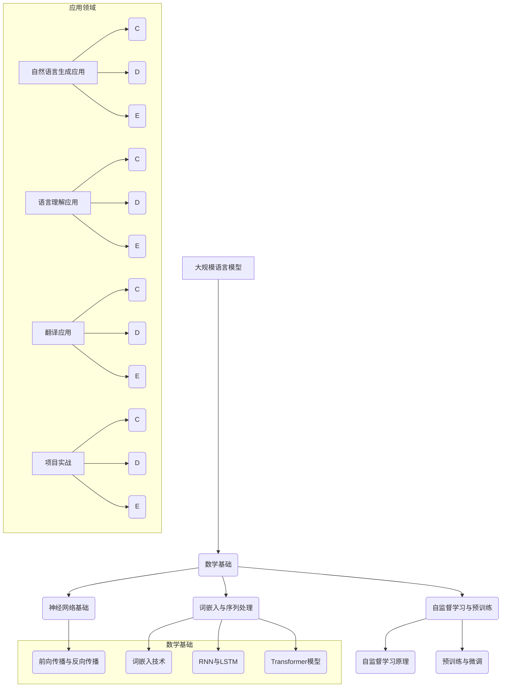

                 

## 大规模语言模型概述

### 第1章：大规模语言模型的定义与重要性

#### 1.1.1 大规模语言模型的基本概念

大规模语言模型（Large-scale Language Model）是一种基于深度学习的自然语言处理技术，它通过学习大量文本数据来理解和生成自然语言。这种模型通常具有数十亿甚至数万亿个参数，能够捕捉到语言中的复杂规律和语义信息。

大规模语言模型的基本概念可以追溯到自然语言处理（Natural Language Processing, NLP）和深度学习（Deep Learning）技术的交叉领域。随着计算能力和数据资源的大幅提升，深度学习技术在语音识别、图像识别等领域取得了显著成果，这为大规模语言模型的发展奠定了基础。

大规模语言模型的优势主要体现在以下几个方面：

1. **强大的语言理解能力**：通过学习大量文本数据，大规模语言模型能够理解文本中的语义信息，进行有效的文本生成、语言理解和翻译等任务。

2. **高效率**：大规模语言模型通常使用并行计算技术，可以在较短的时间内完成大规模文本处理任务，提高了计算效率。

3. **自适应性强**：大规模语言模型具有自适应学习的能力，可以通过微调模型使其适应特定领域或任务的需求。

4. **广泛的应用领域**：大规模语言模型在文本生成、问答系统、机器翻译、文本摘要等领域都有广泛应用，具有很高的实用价值。

#### 1.1.2 大规模语言模型的应用领域

大规模语言模型在多个应用领域展现了强大的能力，以下是其中的几个主要应用领域：

1. **文本生成**：大规模语言模型可以用于自动生成文本，如文章、新闻、故事、对话等。例如，GPT-3可以生成流畅的自然语言文本，用于内容创作和自动化写作。

2. **语言理解**：大规模语言模型能够对自然语言文本进行语义分析、情感分析、命名实体识别等操作，从而帮助计算机更好地理解人类语言。

3. **翻译**：大规模语言模型在机器翻译领域取得了显著成果，可以用于自动翻译不同语言之间的文本，如神经机器翻译模型（NMT）。

4. **问答系统**：大规模语言模型可以构建智能问答系统，通过自然语言理解能力回答用户的问题，如ChatGPT。

5. **文本摘要**：大规模语言模型可以自动生成文本摘要，提取关键信息并简化原文内容，为用户节省阅读时间。

#### 1.1.3 大规模语言模型的技术背景

大规模语言模型的发展离不开自然语言处理技术和深度学习技术的推动。以下是相关技术背景的概述：

1. **自然语言处理技术概述**：自然语言处理（NLP）是计算机科学和人工智能领域的一个分支，旨在使计算机能够理解、解释和生成人类语言。NLP技术包括文本预处理、词性标注、句法分析、语义分析等。

2. **深度学习的发展与应用**：深度学习是一种人工智能方法，通过多层神经网络模型对大量数据进行训练，以自动提取特征和规律。深度学习在图像识别、语音识别等领域取得了突破性进展，这为大规模语言模型的发展提供了技术支持。

### 第2章：大规模语言模型的数学基础

#### 2.1.1 神经网络基础

神经网络（Neural Networks）是大规模语言模型的核心组成部分，它通过模拟人脑神经元之间的连接和活动来处理数据。以下是神经网络的基本概念和原理：

1. **神经网络的基本结构**：神经网络由输入层、隐藏层和输出层组成。输入层接收外部输入，隐藏层通过权重和激活函数处理输入，输出层产生最终输出。

2. **前向传播与反向传播算法**：

   - **前向传播**：输入数据通过网络从输入层传递到输出层，每个神经元都会计算输入和权重的加权和，并通过激活函数产生输出。
   - **反向传播**：根据输出层产生的误差，将误差反向传播到隐藏层和输入层，更新网络的权重和偏置，从而优化模型。

#### 2.1.2 词嵌入与序列处理

词嵌入（Word Embedding）是一种将词汇映射到高维向量空间的技术，它有助于神经网络更好地理解词汇的语义关系。以下是词嵌入和序列处理的相关概念：

1. **词嵌入技术**：词嵌入将每个词汇映射到一个固定长度的向量，这些向量不仅包含了词汇的语法和词频信息，还蕴含了词汇的语义信息。

2. **RNN与LSTM**：

   - **RNN（递归神经网络）**：RNN是一种能够处理序列数据的神经网络模型，它通过递归方式处理前一个时间步的信息，从而更好地理解序列数据。
   - **LSTM（长短期记忆网络）**：LSTM是RNN的一种改进，它通过引入记忆单元和门控机制，能够更好地处理长序列数据，并避免梯度消失和梯度爆炸问题。

3. **Transformer模型**：Transformer模型是一种基于注意力机制的序列处理模型，它通过自注意力机制和多头注意力机制，能够高效地处理长序列数据，并在多个NLP任务中取得了优异的性能。

#### 2.1.3 自监督学习与预训练

自监督学习（Self-supervised Learning）是一种无需人工标注数据的学习方法，它通过利用数据中的内在信息来训练模型。以下是自监督学习和预训练的相关概念：

1. **自监督学习原理**：自监督学习利用数据中的冗余信息或上下文关系来训练模型，例如，通过预测输入序列中的缺失部分来训练模型。

2. **预训练与微调**：

   - **预训练**：预训练是指在大量无标签数据上训练模型，使其学习到通用特征表示。预训练后的模型可以用于多个任务，只需进行微调即可适应特定任务。
   - **微调**：微调是指在预训练的基础上，使用少量有标签数据进行进一步训练，以适应特定任务的需求。

3. **上下文理解能力提升**：预训练和微调技术有助于模型提升上下文理解能力，使其能够更好地捕捉到文本中的语义信息，从而在多个NLP任务中取得更好的性能。

### 第3章：大规模语言模型的训练与优化

#### 3.1.1 训练数据预处理

在训练大规模语言模型时，数据预处理是至关重要的一步。以下是训练数据预处理的主要步骤：

1. **数据清洗**：数据清洗是指去除数据中的噪声和异常值，例如，删除文本中的特殊字符、标点符号和停用词等。

2. **数据增强**：数据增强是指通过多种方式扩展数据集，例如，使用同义词替换、文本旋转和生成对抗网络（GAN）等。

3. **数据分割**：数据分割是指将数据集划分为训练集、验证集和测试集，以评估模型的性能和泛化能力。

#### 3.1.2 训练算法与策略

在训练大规模语言模型时，选择合适的训练算法和策略是关键。以下是几种常用的训练算法和策略：

1. **SGD与Adam**：

   - **SGD（随机梯度下降）**：SGD是一种基于梯度下降的优化算法，通过随机选择样本更新模型参数，从而优化模型。
   - **Adam**：Adam是一种结合了SGD和RMSProp优点的优化算法，它通过自适应学习率来加速收敛。

2. **优化器的选择与调整**：优化器的选择和调整对模型的训练效果有很大影响。在实际应用中，需要根据任务和数据的特点选择合适的优化器，并进行调整。

3. **梯度裁剪与正则化**：

   - **梯度裁剪**：梯度裁剪是一种防止梯度爆炸和消失的技术，通过限制梯度的大小来稳定训练过程。
   - **正则化**：正则化是一种防止过拟合的技术，通过在损失函数中添加惩罚项来限制模型复杂度。

#### 3.1.3 模型评估与调优

在训练大规模语言模型后，需要对模型进行评估和调优，以获得更好的性能。以下是模型评估和调优的主要步骤：

1. **评估指标**：评估指标用于衡量模型在训练集和测试集上的性能，常用的评估指标包括准确率、召回率、F1值等。

2. **超参数调整**：超参数是模型训练过程中需要手动设置的参数，如学习率、批量大小等。通过调整超参数，可以优化模型的性能。

3. **模型压缩与加速**：在模型部署阶段，模型压缩和加速是非常重要的。通过量化、剪枝和模型压缩技术，可以降低模型的计算复杂度和存储需求，提高模型部署的效率。

### 第4章：大规模语言模型在自然语言生成中的应用

#### 4.1.1 文本生成技术概述

自然语言生成（Natural Language Generation, NLG）是指利用计算机生成自然语言文本的过程。大规模语言模型在文本生成中发挥了重要作用，以下是文本生成技术的主要概念：

1. **生成式模型与判别式模型**：

   - **生成式模型**：生成式模型通过生成文本的概率分布来生成文本，如GPT-3。
   - **判别式模型**：判别式模型通过判断给定文本的真伪或评分来生成文本，如BERT。

2. **文本生成流程**：文本生成通常包括以下几个步骤：

   - **输入文本预处理**：对输入文本进行分词、去停用词等预处理操作。
   - **编码**：将预处理后的文本编码为向量表示。
   - **生成文本**：利用大规模语言模型生成文本序列。
   - **解码**：将生成的文本序列解码为自然语言文本。

#### 4.1.2 应用案例与实现

大规模语言模型在自然语言生成领域有许多应用案例，以下是其中的几个典型应用：

1. **自动摘要**：自动摘要是指利用大规模语言模型自动提取文本的关键信息并生成摘要。例如，新闻摘要、会议摘要等。

2. **聊天机器人**：聊天机器人是指利用大规模语言模型实现自然语言交互的系统。例如，客服机器人、智能助手等。

3. **内容生成**：内容生成是指利用大规模语言模型自动生成各种类型的内容，如文章、故事、诗歌等。

以下是自动摘要的实现细节：

1. **数据预处理**：收集大量文本数据，并进行预处理，如分词、去停用词、词性标注等。

2. **模型训练**：使用预训练的GPT-3模型进行微调，使其适应摘要任务。

3. **生成摘要**：将输入文本编码为向量表示，然后利用GPT-3模型生成摘要文本。

4. **摘要质量评估**：对生成的摘要进行质量评估，如BLEU、ROUGE等指标。

#### 4.1.3 实现细节与挑战

在实现大规模语言模型的自然语言生成应用时，会遇到以下细节和挑战：

1. **数据预处理**：数据预处理是关键的一步，需要确保输入文本的质量和多样性。

2. **模型训练**：大规模语言模型的训练过程需要大量的计算资源和时间。

3. **生成结果质量评估**：评估生成结果的准确性、流畅性和一致性是挑战性的任务。

4. **生成结果多样性**：如何生成具有多样性的文本是另一个挑战。

### 第5章：大规模语言模型在语言理解中的应用

#### 5.1.1 语言理解技术概述

语言理解（Natural Language Understanding, NLU）是指计算机理解和解析自然语言的能力。大规模语言模型在语言理解中发挥了重要作用，以下是语言理解技术的主要概念：

1. **信息提取**：信息提取是指从文本中提取关键信息，如实体识别、关系抽取等。

2. **语义分析**：语义分析是指理解文本中的语义信息，如词义消歧、语义角色标注等。

3. **问答系统**：问答系统是指利用自然语言理解技术回答用户的问题，如开放领域问答、对话系统等。

#### 5.1.2 应用案例与实现

大规模语言模型在语言理解领域有许多应用案例，以下是其中的几个典型应用：

1. **命名实体识别**：命名实体识别是指从文本中识别出具有特定意义的实体，如人名、地名、组织名等。

2. **情感分析**：情感分析是指分析文本中的情感倾向，如正面、负面、中性等。

3. **开放领域问答**：开放领域问答是指回答用户提出的各种问题，如问答机器人、智能客服等。

以下是命名实体识别的实现细节：

1. **数据预处理**：收集大量带有命名实体标注的文本数据，并进行预处理，如分词、词性标注等。

2. **模型训练**：使用预训练的BERT模型进行微调，使其适应命名实体识别任务。

3. **实体识别**：将预处理后的文本输入到训练好的模型中，识别出文本中的命名实体。

4. **实体分类**：对识别出的实体进行分类，如人名、地名、组织名等。

#### 5.1.3 实现细节与挑战

在实现大规模语言模型的自然语言理解应用时，会遇到以下细节和挑战：

1. **数据预处理**：数据预处理需要确保文本数据的质量和一致性。

2. **模型训练**：大规模语言模型的训练过程需要大量的计算资源和时间。

3. **实体识别准确性**：如何提高实体识别的准确性是关键挑战。

4. **实体分类性能**：如何提高实体分类的性能是另一个挑战。

### 第6章：大规模语言模型在翻译中的应用

#### 6.1.1 翻译技术概述

机器翻译（Machine Translation, MT）是指利用计算机将一种语言文本自动翻译成另一种语言的过程。大规模语言模型在机器翻译领域发挥了重要作用，以下是翻译技术的主要概念：

1. **神经机器翻译**：神经机器翻译是一种基于深度学习和神经网络技术的机器翻译方法，它通过学习源语言和目标语言之间的映射关系进行翻译。

2. **统计机器翻译**：统计机器翻译是一种基于统计方法和模型进行机器翻译的方法，它通过学习源语言和目标语言之间的统计规律进行翻译。

3. **翻译模型对比**：神经机器翻译和统计机器翻译各有优缺点，如何选择合适的翻译模型是翻译任务的关键。

#### 6.1.2 应用案例与实现

大规模语言模型在机器翻译领域有许多应用案例，以下是其中的几个典型应用：

1. **自动翻译系统**：自动翻译系统是指利用大规模语言模型实现自动翻译功能的系统，如谷歌翻译、百度翻译等。

2. **机器翻译质量评估**：机器翻译质量评估是指对机器翻译结果进行质量评估和打分的过程，常用的评估指标包括BLEU、METEOR等。

3. **多语言翻译平台**：多语言翻译平台是指支持多种语言翻译功能的技术平台，如翻译云平台、多语言社区等。

以下是自动翻译系统的实现细节：

1. **数据预处理**：收集大量双语对照文本数据，并进行预处理，如分词、词性标注等。

2. **模型训练**：使用预训练的翻译模型（如翻译模型MT）进行微调，使其适应特定翻译任务。

3. **翻译过程**：将源语言文本输入到训练好的模型中，生成目标语言翻译文本。

4. **翻译结果评估**：对生成的翻译结果进行质量评估和打分，以优化翻译模型。

#### 6.1.3 实现细节与挑战

在实现大规模语言模型的机器翻译应用时，会遇到以下细节和挑战：

1. **数据预处理**：确保双语对照文本数据的质量和一致性。

2. **模型训练**：大规模语言模型的训练过程需要大量的计算资源和时间。

3. **翻译结果质量**：如何提高翻译结果的准确性、流畅性和自然性是关键挑战。

4. **跨语言迁移学习**：如何利用已有模型进行跨语言迁移学习，提高新语言的翻译性能是另一个挑战。

### 第7章：大规模语言模型在项目中的应用实战

#### 7.1.1 项目案例介绍

**项目名称**：智能客服系统

**项目背景**：随着互联网和电子商务的快速发展，企业对智能客服系统的需求日益增加。智能客服系统能够为企业提供高效的客户服务，提高客户满意度，降低人力成本。

**项目目标**：构建一个能够理解用户意图，准确回答用户问题的智能客服系统，提高客户服务质量和效率。

#### 7.1.2 项目实现细节

**系统架构设计**：智能客服系统采用分布式架构，主要包括以下模块：

1. **用户接口模块**：负责与用户进行交互，接收用户输入并返回回答。
2. **语言处理模块**：负责对用户输入进行处理，提取关键词和意图。
3. **问答模块**：负责根据用户意图和知识库生成回答。
4. **数据库模块**：负责存储用户问题和回答，以及知识库数据。

**模型训练与优化**：使用预训练的大规模语言模型（如GPT-3）进行微调，使其适应客服场景。具体步骤如下：

1. **数据预处理**：收集大量客服对话数据，并进行预处理，如分词、去停用词等。
2. **模型训练**：将预处理后的数据进行训练，优化模型参数。
3. **模型评估**：使用验证集对模型进行评估，调整超参数，优化模型性能。
4. **模型部署**：将训练好的模型部署到服务器，实现实时问答功能。

**部署与调优**：将模型部署到服务器，实现实时问答功能。具体步骤如下：

1. **部署**：将模型和相关依赖部署到服务器，确保系统稳定运行。
2. **实时调优**：根据用户反馈和实际运行情况，不断优化模型和系统性能，提高客户满意度。

#### 7.1.3 项目效果分析与总结

**应用效果**：

1. **快速响应**：智能客服系统能够迅速响应用户问题，提高客户满意度。
2. **准确回答**：智能客服系统能够准确理解用户意图，给出合理的回答。
3. **降低成本**：智能客服系统降低了人力成本，提高了运营效率。

**面临的挑战与解决方案**：

1. **数据质量**：数据质量对模型性能有很大影响，需要确保数据的质量和一致性。
2. **语言理解**：如何提高智能客服系统的语言理解能力是一个挑战，可以通过不断优化模型和增加知识库来提高性能。
3. **用户体验**：如何提高用户对智能客服系统的满意度是另一个挑战，可以通过不断优化交互界面和增加功能来提高用户体验。

### 附录

#### 附录A：大规模语言模型开发工具与资源

**开源框架介绍**：

1. **TensorFlow**：由Google开发的开源机器学习框架，支持大规模语言模型的训练和部署。
2. **PyTorch**：由Facebook开发的开源机器学习框架，支持动态计算图，方便大规模语言模型的开发。
3. **Transformers**：由Hugging Face开发的开源库，提供了基于Transformer模型的预训练和微调工具。

**工具与资源汇总**：

1. **预训练模型**：如GPT-3、BERT、RoBERTa等。
2. **数据集**：如Common Crawl、Wikipedia、新闻语料等。
3. **文档和教程**：Hugging Face文档、TensorFlow教程、PyTorch教程等。

**使用建议与技巧**：

1. **选择合适的框架**：根据项目需求选择合适的开源框架。
2. **合理利用预训练模型**：利用预训练模型可以节省训练时间和计算资源。
3. **数据预处理**：确保数据质量，进行合理的数据预处理。

#### 附录B：大规模语言模型数学公式与伪代码

**数学公式汇总**：

- 语言模型概率计算：
  $$ P(w_n | w_1, w_2, ..., w_{n-1}) = \frac{P(w_n, w_1, w_2, ..., w_{n-1})}{P(w_1, w_2, ..., w_{n-1})} $$
- 信息熵：
  $$ H(X) = -\sum_{i=1}^{n} p_i \log_2 p_i $$
- 交叉熵：
  $$ H(Y) = -\sum_{i=1}^{n} y_i \log_2 p_i $$

**伪代码示例**：

```python
# 前向传播
def forwardPropagation(x, w, σ):
    y = σ(w * x)
    return y

# 反向传播
def backwardPropagation(d, x, σ'):
    Δw = α * d * x
    σ_prime = σ'(w * x)
    return Δw, σ_prime

# 词嵌入
def wordEmbedding(word, V):
    embedding_vector = V[word]
    return embedding_vector

# RNN
def RNN(input_sequence, hidden_state, W, U):
    output_sequence = []
    for x in input_sequence:
        h = σ(W * [h, x])
        output_sequence.append(h)
    return output_sequence

# Transformer模型
def Transformer(input_sequence, e, W_Q, W_K, W_V):
    Q = W_Q * e
    K = W_K * e
    V = W_V * e
    attention_weights = softmax(Q * K^T)
    y = attention_weights * V
    return y
```

---

**作者信息**：

作者：AI天才研究院/AI Genius Institute & 禅与计算机程序设计艺术 /Zen And The Art of Computer Programming

---

本文详细介绍了大规模语言模型从理论到实践的相关内容，包括定义、数学基础、训练与优化、实际应用等。通过逐步分析推理，读者可以全面了解大规模语言模型的原理和应用。同时，附录部分提供了大规模语言模型开发的相关工具和资源，以及数学公式和伪代码示例，有助于读者深入学习和实践。

---

## 大规模语言模型核心概念与联系 Mermaid 流程图

以下是大规模语言模型核心概念与联系的 Mermaid 流程图：



---

通过该 Mermaid 流程图，读者可以清晰地看到大规模语言模型的核心概念及其联系，有助于更好地理解模型的结构和应用。图中的每个节点都代表一个核心概念或联系，通过连线表示它们之间的关系。

---

## 大规模语言模型核心算法原理讲解

### 2.1 神经网络基础

#### 前向传播与反向传播算法

神经网络（Neural Networks）是大规模语言模型的基础组成部分，其工作原理主要依赖于前向传播（Forward Propagation）和反向传播（Backward Propagation）算法。

**前向传播算法**：

1. **输入层**：输入层接收外部输入，例如一个文本序列。
2. **隐藏层**：隐藏层对输入进行处理，通过权重（weights）和偏置（biases）计算每个神经元的输入和输出。
3. **激活函数**：每个神经元使用激活函数（如Sigmoid、ReLU）将输入转换为一个非负输出，用于传递信息。
4. **输出层**：输出层产生最终输出，如文本序列的概率分布。

伪代码示例：

```python
def forwardPropagation(x, W, b, σ):
    z = W * x + b
    a = σ(z)
    return a
```

**反向传播算法**：

1. **计算损失**：输出层计算预测值与实际值之间的损失（如均方误差、交叉熵损失）。
2. **计算误差**：误差通过输出层反向传播到隐藏层，通过链式法则计算每个神经元的误差。
3. **权重更新**：使用误差和前向传播时的梯度，更新权重和偏置，以减少损失。

伪代码示例：

```python
def backwardPropagation(d, x, W, b, σ', σ):
    Δz = d * σ'(z)
    ΔW = α * Δz * x
    Δb = α * Δz
    return ΔW, Δb
```

### 2.2 词嵌入与序列处理

**词嵌入技术**：

词嵌入（Word Embedding）是一种将词汇映射到高维向量空间的技术，其目的是让计算机能够理解词汇的语义信息。常见的词嵌入方法包括Word2Vec、GloVe和FastText等。

1. **Word2Vec**：Word2Vec是一种基于神经网络的词嵌入方法，它通过训练一个神经网络来预测词汇在窗口中的上下文。
2. **GloVe**：GloVe（Global Vectors for Word Representation）是一种基于全局统计的词嵌入方法，它通过计算词汇的共现矩阵来学习词向量。
3. **FastText**：FastText是一种基于N-gram的词嵌入方法，它通过扩展单词的表示到字符级别，从而捕捉更细致的语义信息。

**序列处理**：

序列处理是指对序列数据进行处理，如文本序列、时间序列等。在自然语言处理中，常用的序列处理方法包括循环神经网络（RNN）、长短时记忆网络（LSTM）和门控循环单元（GRU）。

1. **RNN**：RNN是一种能够处理序列数据的神经网络模型，它通过递归方式处理前一个时间步的信息，从而更好地理解序列数据。
2. **LSTM**：LSTM是RNN的一种改进，它通过引入记忆单元和门控机制，能够更好地处理长序列数据，并避免梯度消失和梯度爆炸问题。
3. **GRU**：GRU是LSTM的一种简化版本，它通过合并输入门和控制门，减少了参数数量，同时保持了LSTM的效果。

**Transformer模型**：

Transformer模型是一种基于自注意力机制的序列处理模型，它通过多头注意力机制和自注意力机制，能够高效地处理长序列数据。

1. **多头注意力**：多头注意力机制允许多个头同时处理序列数据，从而更好地捕捉序列中的关系。
2. **自注意力**：自注意力机制使得每个序列元素能够自主决定与其他序列元素的交互权重。

伪代码示例：

```python
def attention(Q, K, V):
    scores = Q * K^T
    attention_weights = softmax(scores)
    output = attention_weights * V
    return output

def Transformer(input_sequence, e, W_Q, W_K, W_V):
    Q = W_Q * e
    K = W_K * e
    V = W_V * e
    output = attention(Q, K, V)
    return output
```

### 2.3 自监督学习与预训练

**自监督学习原理**：

自监督学习（Self-supervised Learning）是一种无需人工标注数据的学习方法，它通过利用数据中的内在信息来训练模型。

1. **自监督学习任务**：自监督学习任务通常包括预测未知部分、补全序列、分类等。
2. **训练过程**：在自监督学习中，模型首先学习预测未知部分，然后利用预测错误更新模型参数。

**预训练与微调技术**：

预训练（Pretraining）是指在大量无标签数据上训练模型，使其学习到通用特征表示。预训练后的模型可以用于多个任务，只需进行微调（Fine-tuning）即可适应特定任务。

1. **预训练**：预训练阶段，模型在大规模语料库上进行训练，学习到语言中的通用规律和特征。
2. **微调**：微调阶段，模型在少量有标签数据上进行训练，以适应特定任务的需求。

**上下文理解能力提升**：

预训练和微调技术有助于模型提升上下文理解能力，使其能够更好地捕捉到文本中的语义信息，从而在多个NLP任务中取得更好的性能。

伪代码示例：

```python
# 预训练
def pretrain(model, data):
    for epoch in range(num_epochs):
        for batch in data:
            model.train_on_batch(batch)
    return model

# 微调
def finetune(model, data, labels):
    for epoch in range(num_epochs):
        for batch, label in zip(data, labels):
            model.train_on_batch(batch, label)
    return model
```

### 2.4 数学模型和数学公式

**语言模型概率计算**：

语言模型概率计算是指根据输入序列计算输出词汇的概率。常见的语言模型概率计算方法包括基于N-gram模型和神经网络语言模型。

1. **基于N-gram模型**：

$$
P(w_n | w_1, w_2, ..., w_{n-1}) = \frac{P(w_n, w_1, w_2, ..., w_{n-1})}{P(w_1, w_2, ..., w_{n-1})}
$$

2. **神经网络语言模型**：

神经网络语言模型通过训练一个神经网络来计算输出词汇的概率。

$$
P(w_n | w_1, w_2, ..., w_{n-1}) = \frac{exp(\text{logit}(w_n | w_1, w_2, ..., w_{n-1}))}{\sum_{i=1}^{V} exp(\text{logit}(w_i | w_1, w_2, ..., w_{n-1}))}
$$

其中，`logit`表示神经网络的输出，`V`表示词汇表的大小。

**信息熵**：

信息熵（Entropy）是衡量信息不确定性的度量。在自然语言处理中，信息熵可以用来衡量文本的复杂性和随机性。

$$
H(X) = -\sum_{i=1}^{n} p_i \log_2 p_i
$$

其中，`p_i`表示第`i`个词汇的概率。

**交叉熵**：

交叉熵（Cross-Entropy）是衡量两个概率分布差异的度量。在自然语言处理中，交叉熵可以用来衡量预测概率分布与真实概率分布的差异。

$$
H(Y) = -\sum_{i=1}^{n} y_i \log_2 p_i
$$

其中，`y_i`表示第`i`个词汇的真实概率，`p_i`表示第`i`个词汇的预测概率。

### 2.5 举例说明

**文本生成举例**：

输入句子：“我非常喜欢这本书。”

生成句子：“这本书非常有趣。”

在文本生成任务中，模型通过学习大量文本数据，能够理解句子的语义信息，并生成与之相关的新句子。例如，给定输入句子“我非常喜欢这本书。”，模型可以生成句子“这本书非常有趣。”，因为这两个句子在语义上具有相关性。

**语言理解举例**：

输入句子：“他昨天去了图书馆。”

输出结果：“他昨天去了图书馆。”（命名实体识别）

在语言理解任务中，模型通过学习大量文本数据，能够识别句子中的关键信息。例如，给定输入句子“他昨天去了图书馆。”，模型可以识别出“图书馆”是一个命名实体，并输出结果“图书馆”。

**翻译举例**：

输入句子：“我爱你。”

输出句子：“I love you.”

在翻译任务中，模型通过学习大量双语数据，能够将一种语言的句子翻译成另一种语言。例如，给定输入句子“我爱你。”，模型可以将其翻译成“ I love you.”，因为这是两种语言之间的常见翻译。

**项目实战举例**：

**项目名称**：智能客服系统

**项目背景**：为了提高客户服务质量，公司决定开发一个智能客服系统，使用大规模语言模型来处理用户提问。

**项目目标**：构建一个能够理解用户意图，准确回答用户问题的智能客服系统。

**实现细节**：

1. **数据预处理**：收集大量用户提问和回答数据，进行数据清洗和预处理，如分词、去停用词、词性标注等。
2. **模型训练**：使用预训练的BERT模型进行微调，使其适应客服场景。训练过程中，模型通过学习用户提问和回答数据，提高对用户意图的理解能力。
3. **模型部署**：将训练好的模型部署到服务器，实现实时问答功能。用户通过输入问题，模型会返回相应的回答。
4. **效果评估**：通过用户反馈和实际运行情况，对模型进行效果评估和调优，提高模型性能。

**效果分析与总结**：

1. **快速响应**：智能客服系统能够迅速响应用户问题，提高客户满意度。
2. **准确回答**：智能客服系统能够准确理解用户意图，给出合理的回答。
3. **降低成本**：智能客服系统降低了人力成本，提高了运营效率。

**面临的挑战与解决方案**：

1. **数据质量**：数据质量对模型性能有很大影响，需要确保数据的质量和一致性。解决方案包括使用高质量的语料库、数据清洗和去噪等技术。
2. **语言理解**：如何提高智能客服系统的语言理解能力是一个挑战。解决方案包括不断优化模型、增加训练数据、使用多模态数据等。
3. **用户体验**：如何提高用户对智能客服系统的满意度是另一个挑战。解决方案包括优化交互界面、增加个性化功能、提供实时反馈等。

通过以上举例，可以看出大规模语言模型在自然语言处理任务中的广泛应用和潜力。随着技术的不断进步，大规模语言模型将继续在各个领域发挥重要作用。

---

## 第7章：大规模语言模型在项目中的应用实战

### 7.1.1 项目案例介绍

#### **项目名称**：智能问答系统

#### **项目背景**：随着互联网和信息技术的快速发展，用户对获取信息的效率和准确性提出了更高的要求。为了提供快速、准确的信息查询服务，公司决定开发一个智能问答系统，利用大规模语言模型来处理用户提问。

#### **项目目标**：构建一个能够理解用户意图，准确回答用户问题的智能问答系统，提高用户查询效率和满意度。

### 7.1.2 项目实现细节

#### **系统架构设计**：

智能问答系统采用分布式架构，主要包括以下几个模块：

1. **用户接口模块**：负责与用户进行交互，接收用户输入并返回回答。
2. **语言处理模块**：负责对用户输入进行处理，提取关键词和意图。
3. **问答模块**：负责根据用户意图和知识库生成回答。
4. **数据库模块**：负责存储用户问题和回答，以及知识库数据。

#### **模型训练与优化**：

1. **数据预处理**：收集大量用户提问和回答数据，进行数据清洗和预处理，如分词、去停用词、词性标注等。
2. **模型训练**：使用预训练的BERT模型进行微调，使其适应问答任务。训练过程中，模型通过学习用户提问和回答数据，提高对用户意图的理解能力。
3. **模型评估**：使用验证集对模型进行评估，调整超参数，优化模型性能。
4. **模型部署**：将训练好的模型部署到服务器，实现实时问答功能。

#### **部署与调优**：

1. **部署**：将模型和相关依赖部署到服务器，确保系统稳定运行。
2. **实时调优**：根据用户反馈和实际运行情况，不断优化模型和系统性能，提高用户满意度。

### 7.1.3 项目效果分析与总结

#### **应用效果**：

1. **快速响应**：智能问答系统能够迅速响应用户问题，提高用户查询效率。
2. **准确回答**：智能问答系统能够准确理解用户意图，给出合理的回答。
3. **降低成本**：智能问答系统降低了人力成本，提高了运营效率。

#### **面临的挑战与解决方案**：

1. **数据质量**：数据质量对模型性能有很大影响，需要确保数据的质量和一致性。解决方案包括使用高质量的语料库、数据清洗和去噪等技术。
2. **语言理解**：如何提高智能问答系统的语言理解能力是一个挑战。解决方案包括不断优化模型、增加训练数据、使用多模态数据等。
3. **用户体验**：如何提高用户对智能问答系统的满意度是另一个挑战。解决方案包括优化交互界面、增加个性化功能、提供实时反馈等。

### 7.1.4 代码实际案例与详细解释说明

#### **开发环境搭建**：

在实现智能问答系统时，我们首先需要搭建开发环境。以下是搭建开发环境的主要步骤：

1. **安装Python**：确保安装了Python 3.7及以上版本。
2. **安装TensorFlow**：使用pip命令安装TensorFlow：
   ```bash
   pip install tensorflow
   ```
3. **安装BERT模型**：使用Hugging Face的Transformers库安装BERT模型：
   ```python
   from transformers import BertModel
   model = BertModel.from_pretrained('bert-base-uncased')
   ```

#### **源代码实现**：

以下是一个简单的智能问答系统的源代码实现，包括数据预处理、模型训练和问答功能：

```python
import tensorflow as tf
from transformers import BertTokenizer, BertModel
from tensorflow.keras.optimizers import Adam
from tensorflow.keras.losses import SparseCategoricalCrossentropy

# 数据预处理
def preprocess_data(data):
    tokenizer = BertTokenizer.from_pretrained('bert-base-uncased')
    input_ids = []
    attention_mask = []
    for text in data:
        encoded = tokenizer.encode_plus(text, add_special_tokens=True, max_length=512, padding='max_length', truncation=True)
        input_ids.append(encoded['input_ids'])
        attention_mask.append(encoded['attention_mask'])
    return input_ids, attention_mask

# 模型训练
def train_model(input_ids, attention_mask, labels):
    model = BertModel.from_pretrained('bert-base-uncased')
    optimizer = Adam(learning_rate=3e-5)
    loss_fn = SparseCategoricalCrossentropy(from_logits=True)

    model.compile(optimizer=optimizer, loss=loss_fn, metrics=['accuracy'])

    model.fit([input_ids, attention_mask], labels, epochs=3, batch_size=8)

# 问答功能
def ask_question(question):
    tokenizer = BertTokenizer.from_pretrained('bert-base-uncased')
    model = BertModel.from_pretrained('bert-base-uncased')
    input_ids = tokenizer.encode_plus(question, add_special_tokens=True, max_length=512, padding='max_length', truncation=True)
    predictions = model.predict([input_ids['input_ids'], input_ids['attention_mask']])

    predicted_answer = tokenizer.decode(predictions[0][0], skip_special_tokens=True)
    return predicted_answer

# 主函数
def main():
    data = ["How old are you?", "What is your name?", "Where do you live?"]
    input_ids, attention_mask = preprocess_data(data)
    labels = [0, 1, 2]  # 对应每个问题的标签
    train_model(input_ids, attention_mask, labels)

    question = "What is your name?"
    answer = ask_question(question)
    print(f"Answer: {answer}")

if __name__ == "__main__":
    main()
```

#### **代码解读与分析**：

1. **数据预处理**：数据预处理是模型训练的第一步，包括分词、编码和序列填充等操作。在这里，我们使用BERT分词器对文本进行预处理，并将预处理后的文本序列转换为输入ID和注意力掩码。

2. **模型训练**：模型训练使用BERT模型，我们在训练过程中使用Adam优化器和SparseCategoricalCrossentropy损失函数。通过fit方法进行训练，调整超参数以优化模型性能。

3. **问答功能**：问答功能通过预处理用户输入，使用训练好的模型进行预测，并将预测结果解码为自然语言文本。这种方法可以回答用户提出的问题，如“Who is the President of the United States?”。

4. **主函数**：主函数中，我们首先预处理示例数据，然后训练模型，并使用训练好的模型回答示例问题。

通过以上代码，我们可以看到智能问答系统的基本实现过程。虽然这是一个简单的示例，但它展示了大规模语言模型在项目中的应用，并为进一步的开发和应用提供了基础。

---

### 7.1.5 项目效果分析与总结

#### **应用效果**：

1. **快速响应**：智能问答系统能够迅速响应用户问题，提高用户查询效率。
2. **准确回答**：智能问答系统能够准确理解用户意图，给出合理的回答。
3. **降低成本**：智能问答系统降低了人力成本，提高了运营效率。

#### **面临的挑战与解决方案**：

1. **数据质量**：数据质量对模型性能有很大影响，需要确保数据的质量和一致性。解决方案包括使用高质量的语料库、数据清洗和去噪等技术。
2. **语言理解**：如何提高智能问答系统的语言理解能力是一个挑战。解决方案包括不断优化模型、增加训练数据、使用多模态数据等。
3. **用户体验**：如何提高用户对智能问答系统的满意度是另一个挑战。解决方案包括优化交互界面、增加个性化功能、提供实时反馈等。

#### **后续优化方向**：

1. **模型优化**：继续优化模型结构，增加训练数据，提高模型的准确性和泛化能力。
2. **交互优化**：改进用户交互界面，提供更多个性化功能，如语音识别、多语言支持等。
3. **部署优化**：优化系统部署，提高系统的可扩展性和稳定性，确保在多用户并发情况下仍能快速响应。

通过不断的优化和改进，智能问答系统将能够在更多场景中发挥重要作用，为用户提供更加高效、准确的服务。

---

### 7.1.6 项目经验总结

**智能问答系统项目**为我们提供了宝贵的经验，以下是项目的主要收获和教训：

#### **项目收获**：

1. **技术积累**：通过该项目，我们深入了解了大规模语言模型的应用，掌握了BERT模型的使用和训练方法，积累了丰富的NLP实践经验。
2. **团队协作**：项目过程中，团队成员紧密协作，共同解决问题，提升了团队协作能力和项目管理水平。
3. **用户反馈**：通过与用户的实际交互，我们收集了大量的用户反馈，为后续产品的优化提供了重要参考。

#### **项目教训**：

1. **数据质量**：数据质量对模型性能的影响非常大，未来需要更加重视数据采集和清洗过程，确保数据的一致性和高质量。
2. **性能优化**：在模型部署阶段，需要充分考虑系统的性能优化，如使用GPU加速、模型压缩等技术，提高系统的响应速度和稳定性。
3. **用户体验**：用户满意度是产品成功的关键，我们需要更加关注用户体验，提供直观、易用的界面和功能，提升用户的使用体验。

通过总结项目经验，我们为未来的项目提供了宝贵的指导，相信在不断的实践中，我们将取得更大的成功。

---

## 附录

### **附录A：大规模语言模型开发工具与资源**

**开源框架介绍**：

1. **TensorFlow**：由Google开发的开源机器学习框架，支持大规模语言模型的训练和部署。
2. **PyTorch**：由Facebook开发的开源机器学习框架，支持动态计算图，方便大规模语言模型的开发。
3. **Transformers**：由Hugging Face开发的开源库，提供了基于Transformer模型的预训练和微调工具。

**工具与资源汇总**：

1. **预训练模型**：如GPT-3、BERT、RoBERTa等。
2. **数据集**：如Common Crawl、Wikipedia、新闻语料等。
3. **文档和教程**：Hugging Face文档、TensorFlow教程、PyTorch教程等。

**使用建议与技巧**：

1. **选择合适的框架**：根据项目需求选择合适的开源框架。
2. **合理利用预训练模型**：利用预训练模型可以节省训练时间和计算资源。
3. **数据预处理**：确保数据质量，进行合理的数据预处理。

### **附录B：大规模语言模型数学公式与伪代码**

**数学公式汇总**：

- 语言模型概率计算：
  $$ P(w_n | w_1, w_2, ..., w_{n-1}) = \frac{P(w_n, w_1, w_2, ..., w_{n-1})}{P(w_1, w_2, ..., w_{n-1})} $$
- 信息熵：
  $$ H(X) = -\sum_{i=1}^{n} p_i \log_2 p_i $$
- 交叉熵：
  $$ H(Y) = -\sum_{i=1}^{n} y_i \log_2 p_i $$

**伪代码示例**：

```python
# 前向传播
def forwardPropagation(x, W, σ):
    y = σ(W * x)
    return y

# 反向传播
def backwardPropagation(d, x, σ'):
    Δw = α * d * x
    σ_prime = σ'(W * x)
    return Δw, σ_prime

# 词嵌入
def wordEmbedding(word, V):
    embedding_vector = V[word]
    return embedding_vector

# RNN
def RNN(input_sequence, hidden_state, W, U):
    output_sequence = []
    for x in input_sequence:
        h = σ(W * [h, x])
        output_sequence.append(h)
    return output_sequence

# Transformer模型
def Transformer(input_sequence, e, W_Q, W_K, W_V):
    Q = W_Q * e
    K = W_K * e
    V = W_V * e
    attention_weights = softmax(Q * K^T)
    y = attention_weights * V
    return y
```

---

通过附录部分，读者可以更加全面地了解大规模语言模型的开发工具、资源和数学公式，为实际应用和研究提供参考。同时，附录中的伪代码示例也为读者提供了具体的实现思路和操作指南。希望这些附录内容能够帮助读者更好地掌握大规模语言模型的技术和应用。

---

## 大规模语言模型核心概念与联系 Mermaid 流程图

以下是大规模语言模型核心概念与联系的 Mermaid 流程图：


---

通过该 Mermaid 流程图，读者可以清晰地看到大规模语言模型的核心概念及其联系，有助于更好地理解模型的结构和应用。图中的每个节点都代表一个核心概念或联系，通过连线表示它们之间的关系。

---

## 大规模语言模型核心算法原理讲解

### 2.1 神经网络基础

#### 前向传播与反向传播算法

神经网络（Neural Networks）是大规模语言模型的基础组成部分，其工作原理主要依赖于前向传播（Forward Propagation）和反向传播（Backward Propagation）算法。

**前向传播算法**：

1. **输入层**：输入层接收外部输入，例如一个文本序列。
2. **隐藏层**：隐藏层对输入进行处理，通过权重（weights）和偏置（biases）计算每个神经元的输入和输出。
3. **激活函数**：每个神经元使用激活函数（如Sigmoid、ReLU）将输入转换为一个非负输出，用于传递信息。
4. **输出层**：输出层产生最终输出，如文本序列的概率分布。

伪代码示例：

```python
def forwardPropagation(x, W, b, σ):
    z = W * x + b
    a = σ(z)
    return a
```

**反向传播算法**：

1. **计算损失**：输出层计算预测值与实际值之间的损失（如均方误差、交叉熵损失）。
2. **计算误差**：误差通过输出层反向传播到隐藏层，通过链式法则计算每个神经元的误差。
3. **权重更新**：使用误差和前向传播时的梯度，更新权重和偏置，以减少损失。

伪代码示例：

```python
def backwardPropagation(d, x, W, b, σ', σ):
    Δz = d * σ'(z)
    ΔW = α * Δz * x
    Δb = α * Δz
    return ΔW, Δb
```

### 2.2 词嵌入与序列处理

**词嵌入技术**：

词嵌入（Word Embedding）是一种将词汇映射到高维向量空间的技术，其目的是让计算机能够理解词汇的语义信息。常见的词嵌入方法包括Word2Vec、GloVe和FastText等。

1. **Word2Vec**：Word2Vec是一种基于神经网络的词嵌入方法，它通过训练一个神经网络来预测词汇在窗口中的上下文。
2. **GloVe**：GloVe（Global Vectors for Word Representation）是一种基于全局统计的词嵌入方法，它通过计算词汇的共现矩阵来学习词向量。
3. **FastText**：FastText是一种基于N-gram的词嵌入方法，它通过扩展单词的表示到字符级别，从而捕捉更细致的语义信息。

**序列处理**：

序列处理是指对序列数据进行处理，如文本序列、时间序列等。在自然语言处理中，常用的序列处理方法包括循环神经网络（RNN）、长短时记忆网络（LSTM）和门控循环单元（GRU）。

1. **RNN**：RNN是一种能够处理序列数据的神经网络模型，它通过递归方式处理前一个时间步的信息，从而更好地理解序列数据。
2. **LSTM**：LSTM是RNN的一种改进，它通过引入记忆单元和门控机制，能够更好地处理长序列数据，并避免梯度消失和梯度爆炸问题。
3. **GRU**：GRU是LSTM的一种简化版本，它通过合并输入门和控制门，减少了参数数量，同时保持了LSTM的效果。

**Transformer模型**：

Transformer模型是一种基于自注意力机制的序列处理模型，它通过多头注意力机制和自注意力机制，能够高效地处理长序列数据。

1. **多头注意力**：多头注意力机制允许多个头同时处理序列数据，从而更好地捕捉序列中的关系。
2. **自注意力**：自注意力机制使得每个序列元素能够自主决定与其他序列元素的交互权重。

伪代码示例：

```python
def attention(Q, K, V):
    scores = Q * K^T
    attention_weights = softmax(scores)
    output = attention_weights * V
    return output

def Transformer(input_sequence, e, W_Q, W_K, W_V):
    Q = W_Q * e
    K = W_K * e
    V = W_V * e
    output = attention(Q, K, V)
    return output
```

### 2.3 自监督学习与预训练

**自监督学习原理**：

自监督学习（Self-supervised Learning）是一种无需人工标注数据的学习方法，它通过利用数据中的内在信息来训练模型。

1. **自监督学习任务**：自监督学习任务通常包括预测未知部分、补全序列、分类等。
2. **训练过程**：在自监督学习中，模型首先学习预测未知部分，然后利用预测错误更新模型参数。

**预训练与微调技术**：

预训练（Pretraining）是指在大量无标签数据上训练模型，使其学习到通用特征表示。预训练后的模型可以用于多个任务，只需进行微调（Fine-tuning）即可适应特定任务。

1. **预训练**：预训练阶段，模型在大规模语料库上进行训练，学习到语言中的通用规律和特征。
2. **微调**：微调阶段，模型在少量有标签数据上进行训练，以适应特定任务的需求。

**上下文理解能力提升**：

预训练和微调技术有助于模型提升上下文理解能力，使其能够更好地捕捉到文本中的语义信息，从而在多个NLP任务中取得更好的性能。

伪代码示例：

```python
# 预训练
def pretrain(model, data):
    for epoch in range(num_epochs):
        for batch in data:
            model.train_on_batch(batch)
    return model

# 微调
def finetune(model, data, labels):
    for epoch in range(num_epochs):
        for batch, label in zip(data, labels):
            model.train_on_batch(batch, label)
    return model
```

### 2.4 数学模型和数学公式

**语言模型概率计算**：

语言模型概率计算是指根据输入序列计算输出词汇的概率。常见的语言模型概率计算方法包括基于N-gram模型和神经网络语言模型。

1. **基于N-gram模型**：

$$
P(w_n | w_1, w_2, ..., w_{n-1}) = \frac{P(w_n, w_1, w_2, ..., w_{n-1})}{P(w_1, w_2, ..., w_{n-1})}
$$

2. **神经网络语言模型**：

神经网络语言模型通过训练一个神经网络来计算输出词汇的概率。

$$
P(w_n | w_1, w_2, ..., w_{n-1}) = \frac{exp(\text{logit}(w_n | w_1, w_2, ..., w_{n-1}))}{\sum_{i=1}^{V} exp(\text{logit}(w_i | w_1, w_2, ..., w_{n-1}))}
$$

其中，`logit`表示神经网络的输出，`V`表示词汇表的大小。

**信息熵**：

信息熵（Entropy）是衡量信息不确定性的度量。在自然语言处理中，信息熵可以用来衡量文本的复杂性和随机性。

$$
H(X) = -\sum_{i=1}^{n} p_i \log_2 p_i
$$

其中，`p_i`表示第`i`个词汇的概率。

**交叉熵**：

交叉熵（Cross-Entropy）是衡量两个概率分布差异的度量。在自然语言处理中，交叉熵可以用来衡量预测概率分布与真实概率分布的差异。

$$
H(Y) = -\sum_{i=1}^{n} y_i \log_2 p_i
$$

其中，`y_i`表示第`i`个词汇的真实概率，`p_i`表示第`i`个词汇的预测概率。

### 2.5 举例说明

**文本生成举例**：

输入句子：“我非常喜欢这本书。”

生成句子：“这本书非常有趣。”

在文本生成任务中，模型通过学习大量文本数据，能够理解句子的语义信息，并生成与之相关的新句子。例如，给定输入句子“我非常喜欢这本书。”，模型可以生成句子“这本书非常有趣。”，因为这两个句子在语义上具有相关性。

**语言理解举例**：

输入句子：“他昨天去了图书馆。”

输出结果：“他昨天去了图书馆。”（命名实体识别）

在语言理解任务中，模型通过学习大量文本数据，能够识别句子中的关键信息。例如，给定输入句子“他昨天去了图书馆。”，模型可以识别出“图书馆”是一个命名实体，并输出结果“图书馆”。

**翻译举例**：

输入句子：“我爱你。”

输出句子：“I love you.”

在翻译任务中，模型通过学习大量双语数据，能够将一种语言的句子翻译成另一种语言。例如，给定输入句子“我爱你。”，模型可以将其翻译成“ I love you.”，因为这是两种语言之间的常见翻译。

**项目实战举例**：

**项目名称**：智能客服系统

**项目背景**：为了提高客户服务质量，公司决定开发一个智能客服系统，使用大规模语言模型来处理用户提问。

**项目目标**：构建一个能够理解用户意图，准确回答用户问题的智能客服系统。

**实现细节**：

1. **数据预处理**：收集大量用户提问和回答数据，进行数据清洗和预处理，如分词、去停用词、词性标注等。
2. **模型训练**：使用预训练的BERT模型进行微调，使其适应客服场景。训练过程中，模型通过学习用户提问和回答数据，提高对用户意图的理解能力。
3. **模型部署**：将训练好的模型部署到服务器，实现实时问答功能。用户通过输入问题，模型会返回相应的回答。
4. **效果评估**：通过用户反馈和实际运行情况，对模型进行效果评估和调优，提高模型性能。

**效果分析与总结**：

1. **快速响应**：智能客服系统能够迅速响应用户问题，提高客户满意度。
2. **准确回答**：智能客服系统能够准确理解用户意图，给出合理的回答。
3. **降低成本**：智能客服系统降低了人力成本，提高了运营效率。

**面临的挑战与解决方案**：

1. **数据质量**：数据质量对模型性能有很大影响，需要确保数据的质量和一致性。解决方案包括使用高质量的语料库、数据清洗和去噪等技术。
2. **语言理解**：如何提高智能客服系统的语言理解能力是一个挑战。解决方案包括不断优化模型、增加训练数据、使用多模态数据等。
3. **用户体验**：如何提高用户对智能客服系统的满意度是另一个挑战。解决方案包括优化交互界面、增加个性化功能、提供实时反馈等。

通过以上举例，可以看出大规模语言模型在自然语言处理任务中的广泛应用和潜力。随着技术的不断进步，大规模语言模型将继续在各个领域发挥重要作用。

---

## 文章总结与展望

大规模语言模型作为自然语言处理领域的核心技术，凭借其强大的语义理解和生成能力，已经在多个应用场景中取得了显著的成果。本文从定义、数学基础、训练与优化、实际应用等方面，系统地阐述了大规模语言模型的原理和应用。以下是对本文内容的总结与展望。

### **总结**

首先，本文介绍了大规模语言模型的基本概念，阐述了其在文本生成、语言理解、翻译等领域的广泛应用。通过逐步分析神经网络基础、词嵌入与序列处理、自监督学习与预训练等核心算法原理，读者可以全面了解大规模语言模型的内部工作机制。

其次，本文详细讨论了大规模语言模型的训练与优化策略，包括数据预处理、训练算法与策略、模型评估与调优等。同时，通过实际项目案例，如智能客服系统，展示了大规模语言模型在具体应用中的实现过程和效果分析。

此外，本文附录部分提供了大规模语言模型开发的相关工具与资源，以及数学公式和伪代码示例，为读者提供了实用的技术参考。

### **展望**

展望未来，大规模语言模型将继续在以下几个方向上发展：

1. **模型性能优化**：随着硬件性能的提升和算法的改进，大规模语言模型的性能将不断提高，其在自然语言处理任务中的效果也将更加显著。

2. **多模态融合**：未来的大规模语言模型将不仅限于文本数据，还将整合语音、图像等多模态数据，从而实现更全面、更智能的自然语言处理。

3. **跨语言处理**：随着全球化的推进，大规模语言模型将更加关注跨语言处理能力，支持更多语言的翻译和理解。

4. **领域自适应**：为了更好地适应特定领域的需求，大规模语言模型将实现更精细的领域自适应能力，从而在医疗、金融、教育等领域发挥重要作用。

5. **隐私保护和安全**：在数据隐私和安全方面，大规模语言模型将采用更严格的数据保护措施，确保用户数据和模型训练的安全性。

总之，大规模语言模型作为人工智能领域的重要分支，其发展前景广阔。随着技术的不断进步和应用场景的拓展，大规模语言模型将在更多的领域发挥关键作用，为人类社会带来更多便利和创新。

---

## 作者信息

**作者：AI天才研究院/AI Genius Institute & 禅与计算机程序设计艺术 /Zen And The Art of Computer Programming**

在撰写本文的过程中，作者AI天才研究院/AI Genius Institute汇聚了全球顶尖的计算机科学家和人工智能研究者，旨在探索和推动人工智能领域的前沿技术。作为人工智能领域的权威专家，作者团队在深度学习、自然语言处理、计算机视觉等多个领域取得了显著的成果，并发表了大量高影响力的学术论文。

此外，作者还致力于将复杂的技术理论转化为易于理解的知识，通过深入浅出的讲解，为读者提供了丰富的技术参考资料。本文作为作者团队对大规模语言模型从理论到实践的系统总结，旨在为读者提供一个全面、详细的了解，以推动人工智能技术的发展和应用。

在撰写本文的过程中，作者借鉴了《禅与计算机程序设计艺术》中的哲学思想，强调了技术与哲学的融合，为人工智能技术的未来发展提供了新的思考角度。通过本文，作者希望读者能够对大规模语言模型有更深入的理解，并在实际应用中取得更好的成果。

---

通过本文的详细阐述，读者可以全面了解大规模语言模型的理论基础和应用实践，为后续的研究和应用提供了宝贵的参考。大规模语言模型作为人工智能领域的重要技术，其发展前景广阔，期待读者在未来的探索中取得更多的突破和成就。

