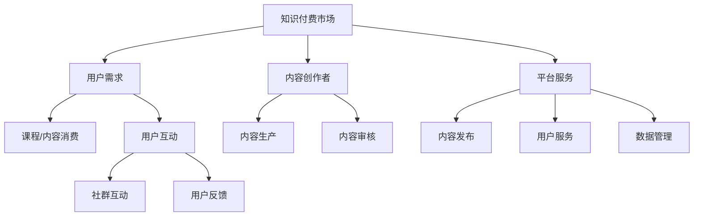
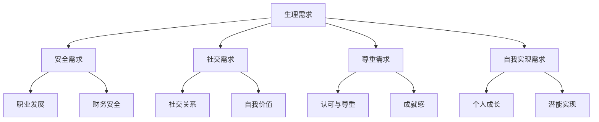
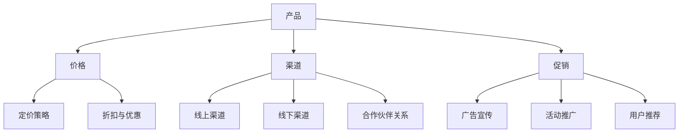

                 

# 在竞争激烈的知识付费市场突围

> **关键词**：知识付费、市场分析、竞争策略、产品创新、用户互动、营销与推广、数据驱动运营

> **摘要**：本文深入分析了知识付费市场的现状与趋势，探讨了如何在激烈的市场竞争中突围。通过用户需求分析、产品设计与创新、用户互动与社群运营、营销与推广、数据驱动与精细化运营等多方面的策略，为知识付费平台提供了切实可行的突围之道。同时，通过成功案例研究和实战指导，助力企业在知识付费市场中站稳脚跟。

## 目录大纲

#### 第一部分：市场分析与竞争策略

##### 第1章：知识付费市场概述  
- **1.1** 知识付费市场的演变历程  
- **1.2** 市场规模与用户特征分析  
- **1.3** 知识付费市场的竞争格局  
- **1.4** 市场机会与挑战  
- **1.5** 知识付费市场的趋势预测

##### 第2章：用户需求分析  
- **2.1** 用户需求层次模型  
- **2.2** 用户画像与细分市场  
- **2.3** 用户行为分析  
- **2.4** 用户满意度调查与反馈

#### 第二部分：产品设计与创新

##### 第3章：知识付费产品策划  
- **3.1** 产品策划框架  
- **3.2** 产品类型与模式  
- **3.3** 产品创新策略  
- **3.4** 产品定位与差异化

##### 第4章：内容创作与质量保障  
- **4.1** 内容创作原则  
- **4.2** 内容生产流程  
- **4.3** 内容质量评估体系  
- **4.4** 内容优化与迭代

##### 第5章：用户互动与社群运营  
- **5.1** 用户互动策略  
- **5.2** 社群运营模型  
- **5.3** 用户参与度提升方法  
- **5.4** 社群管理技巧

#### 第三部分：营销与推广

##### 第6章：品牌建设与营销策略  
- **6.1** 品牌定位与传播  
- **6.2** 营销组合策略  
- **6.3** 营销渠道选择  
- **6.4** 营销活动策划与执行

##### 第7章：数据驱动与精细化运营  
- **7.1** 数据分析的重要性  
- **7.2** 数据收集与分析方法  
- **7.3** 用户行为数据应用  
- **7.4** 精精细化运营策略

#### 第四部分：案例分析与实战指导

##### 第8章：成功案例研究  
- **8.1** 国内外优秀案例介绍  
- **8.2** 案例分析与启示  
- **8.3** 案例应用与借鉴

##### 第9章：实战指南与工具推荐  
- **9.1** 实战流程与方法  
- **9.2** 工具与平台推荐  
- **9.3** 实战案例解析  
- **9.4** 成功经验与教训总结

##### 第10章：未来趋势与展望  
- **10.1** 知识付费市场发展趋势  
- **10.2** 创新与变革的方向  
- **10.3** 未来竞争格局预测  
- **10.4** 持续学习与成长策略

---

**附录**

##### 附录A：相关资源与参考文献  
- **A.1** 知识付费市场研究报告  
- **A.2** 内容创作与营销书籍推荐  
- **A.3** 常用工具与平台介绍

---

**附录B：核心概念与联系**  
- **B.1** 知识付费市场架构图（Mermaid流程图）  
- **B.2** 用户需求层次模型图（Mermaid流程图）  
- **B.3** 营销组合策略图（Mermaid流程图）

---

**附录C：核心算法原理讲解**  
- **C.1** 数据分析方法伪代码  
- **C.2** 营销策略优化算法伪代码

---

**附录D：数学模型和公式讲解**  
- **D.1** 用户满意度评分模型（LaTeX公式）  
- **D.2** 营销转化率计算公式（LaTeX公式）

---

**附录E：项目实战**  
- **E.1** 实战案例代码实现与解读  
- **E.2** 实战案例代码分析与优化

---

现在，我们开始深入探讨知识付费市场的竞争策略，分析市场现状，挖掘用户需求，并探讨如何在市场中脱颖而出。

## 市场分析与竞争策略

### 第1章：知识付费市场概述

在当今数字化时代，知识付费已经成为一种重要的商业模式。从在线课程、电子书、专业培训到专业知识问答，知识付费市场正以前所未有的速度扩展。这一章节将为您概述知识付费市场的演变历程、市场规模与用户特征分析、竞争格局、市场机会与挑战，以及未来的趋势预测。

#### 1.1 知识付费市场的演变历程

知识付费市场的起源可以追溯到互联网的兴起。早期的知识付费主要是通过电子书、纸质书等形式进行。随着互联网技术的发展，尤其是移动互联网的普及，知识付费逐渐从线下转移到线上。在线课程、直播讲座、专业知识问答等新兴模式逐渐崛起。这一过程中，用户需求和消费习惯也在不断变化，为市场的发展提供了新的动力。

#### 1.2 市场规模与用户特征分析

根据相关报告，全球知识付费市场规模已经达到数百亿美元，并且还在持续增长。用户方面，随着教育的普及，用户对高质量知识的渴望日益增加。从用户画像来看，知识付费市场主要用户群体包括白领、学生、自由职业者等。他们对于知识的获取途径多样，偏好于在线学习、互动式学习等模式。

#### 1.3 知识付费市场的竞争格局

当前，知识付费市场呈现出多元竞争的格局。从平台类型来看，主要包括大型综合性平台、垂直领域平台、个体讲师平台等。综合性平台如网易云课堂、慕课网等，凭借其丰富的课程资源和平台影响力，占据市场份额的较大比重。垂直领域平台如编程学习平台、金融知识平台等，则通过专业化、细分化的内容定位，吸引了大量专业用户。个体讲师平台如千聊、小鹅通等，则以讲师个人品牌为核心，通过优质内容吸引用户。

#### 1.4 市场机会与挑战

市场机会方面，随着知识经济的兴起，用户对于高质量知识的需求不断增长。在线教育的普及也为知识付费市场提供了广阔的发展空间。此外，人工智能、大数据等新技术的应用，为知识付费产品的创新提供了新的可能。

然而，知识付费市场也面临一定的挑战。首先，市场竞争激烈，新入局者需要具备强大的内容创作能力和用户运营能力。其次，用户对知识的质量要求越来越高，平台需要不断提升内容质量和用户体验。此外，知识产权保护也是一个亟待解决的问题。

#### 1.5 知识付费市场的趋势预测

未来，知识付费市场将呈现以下趋势：

1. **个性化推荐**：随着大数据和人工智能技术的发展，个性化推荐将成为主流。平台将根据用户的学习历史、兴趣爱好等，为用户推荐最感兴趣的知识内容。

2. **垂直细分领域**：在市场细分化的背景下，垂直领域平台将获得更多发展机会。专业化的内容将更好地满足用户的个性化需求。

3. **互动式学习**：互动式学习将越来越受欢迎。通过直播、问答、讨论等方式，用户可以与讲师或其他用户互动，提升学习效果。

4. **跨界融合**：知识付费将与更多领域进行跨界融合，如娱乐、艺术、科技等，提供多元化的知识产品。

5. **全球化发展**：随着互联网的全球化，知识付费市场将逐渐走向国际市场。平台需要具备国际化视野，提供符合不同地区用户需求的内容。

通过以上分析，我们可以看到，知识付费市场虽然竞争激烈，但依然充满机会。平台需要深入了解用户需求，持续创新，提升内容质量和用户体验，才能在市场中脱颖而出。

### 第2章：用户需求分析

用户需求是知识付费市场的核心驱动力。了解用户需求，分析用户特征和行为，是制定有效竞争策略的基础。这一章节将深入探讨用户需求层次模型、用户画像与细分市场、用户行为分析以及用户满意度调查与反馈。

#### 2.1 用户需求层次模型

根据马斯洛的需求层次理论，用户需求可以分为五个层次：生理需求、安全需求、社交需求、尊重需求和自我实现需求。在知识付费市场中，用户的需求同样可以划分为这些层次：

1. **生理需求**：用户希望获取基本的知识和技能，以满足日常生活和工作中的需求。例如，学习编程、语言等实用技能。

2. **安全需求**：用户希望通过学习获得职业发展、财务安全等方面的保障。例如，金融投资知识、职业发展规划等。

3. **社交需求**：用户希望与他人分享知识，建立社交关系，提升自我价值。例如，参与在线讨论、加入学习社群等。

4. **尊重需求**：用户希望通过学习获得他人的认可和尊重。例如，获得专业认证、获得荣誉等。

5. **自我实现需求**：用户希望通过学习实现个人潜能和自我提升。例如，学习艺术、哲学等深入思考领域的知识。

#### 2.2 用户画像与细分市场

用户画像是对用户特征的综合描述，包括年龄、性别、职业、教育背景、兴趣爱好等。通过用户画像，平台可以更精准地了解用户需求，提供个性化服务。

1. **年龄**：知识付费用户主要集中在18-45岁之间。年轻用户更倾向于在线学习，而中年用户则更关注职业发展和个人成长。

2. **性别**：男性和女性在知识付费市场中的需求有所不同。男性更倾向于学习技术类知识，而女性则更关注生活技能、家庭教育等。

3. **职业**：不同职业的用户对知识的需求存在差异。白领、学生、自由职业者等是知识付费的主要用户群体，他们分别关注职业发展、学历提升和个人兴趣。

4. **教育背景**：高学历用户更倾向于深度学习，而低学历用户则更关注实用性强的知识。

5. **兴趣爱好**：用户的兴趣爱好直接影响其知识付费的选择。例如，热爱艺术的用户更可能购买艺术类课程，热爱科技的用户则更关注技术类课程。

根据用户画像，知识付费市场可以细分为多个子市场，如职场提升、技能培训、兴趣爱好、个人成长等。平台可以通过精准定位这些细分市场，提供专业化、个性化的内容，满足不同用户的需求。

#### 2.3 用户行为分析

用户行为分析是了解用户需求的重要手段。通过分析用户在学习平台上的行为数据，平台可以洞察用户的学习习惯、兴趣点和痛点。

1. **学习时长**：用户的学习时长可以反映其对知识的渴望程度。长期学习用户通常对知识有较高的需求，平台可以针对这部分用户推出长期课程。

2. **学习路径**：用户的学习路径可以揭示其知识结构和学习需求。例如，用户先学习基础课程，再学习进阶课程，这表明其对知识的系统性有较高要求。

3. **互动行为**：用户的互动行为包括评论、提问、讨论等。通过分析互动数据，平台可以了解用户对课程内容的满意度，及时调整和优化课程。

4. **学习成果**：用户的学习成果可以通过考试、作业、证书等方式衡量。学习成果优秀的用户更有可能成为忠实用户，平台可以推出更多高价值课程，提升用户粘性。

#### 2.4 用户满意度调查与反馈

用户满意度是衡量知识付费平台质量的重要指标。通过用户满意度调查，平台可以了解用户对课程的满意程度，发现存在的问题，及时改进。

1. **课程满意度**：用户对课程的内容、讲解、互动等各方面的满意度。平台可以通过问卷调查、用户评分等方式收集用户反馈，了解用户对课程的整体评价。

2. **服务满意度**：用户对平台的服务质量，包括客服、技术支持、学习环境等。平台需要确保用户在购买课程和使用过程中享受到优质服务，提升用户满意度。

3. **学习效果满意度**：用户通过学习后的收获和成长。平台可以通过学习成果评估、用户反馈等方式，了解用户的学习效果，调整课程内容和方法。

4. **反馈机制**：平台应建立完善的用户反馈机制，及时处理用户问题，提高用户满意度。例如，设立用户反馈渠道、定期召开用户座谈会等。

通过用户需求分析，知识付费平台可以深入了解用户需求，优化课程内容和用户体验，提升用户满意度，从而在激烈的市场竞争中脱颖而出。

### 第3章：知识付费产品策划

知识付费产品的策划是平台成功的关键环节。一个成功的知识付费产品不仅要有清晰的定位和独特的卖点，还需要有系统的策划框架和创新的策略。这一章节将探讨知识付费产品策划的各个方面，包括产品策划框架、产品类型与模式、产品创新策略、产品定位与差异化。

#### 3.1 产品策划框架

一个有效的知识付费产品策划框架通常包括以下步骤：

1. **市场调研**：了解市场需求和竞争环境，确定目标用户群体和潜在需求。

2. **产品定位**：明确产品的核心价值和独特卖点，确定目标市场和用户群体。

3. **内容设计**：根据用户需求和产品定位，设计课程内容、授课方式、互动环节等。

4. **定价策略**：制定合理的价格策略，包括单一课程定价、套餐定价、会员制等。

5. **推广策略**：制定产品推广计划，包括线上和线下推广活动、合作伙伴关系等。

6. **用户运营**：建立用户互动机制，提升用户参与度和忠诚度。

7. **数据监控**：收集和分析用户数据，优化产品和服务。

#### 3.2 产品类型与模式

知识付费产品的类型和模式多种多样，常见的有以下几种：

1. **在线课程**：通过视频、音频、文字等形式，为用户提供系统化的知识传授。在线课程可以按时长、难度、主题等进行分类。

2. **电子书**：以电子文档形式提供的知识内容，包括教材、参考书、专业书籍等。电子书适合用户进行深度阅读和学习。

3. **专业知识问答**：用户可以在平台上提问，专业人士进行解答。这种模式适合解决用户在学习和工作中遇到的具体问题。

4. **直播讲座**：通过直播平台，讲师实时授课，用户可以实时互动。直播讲座适合进行实时教学和答疑。

5. **知识社群**：围绕某个主题，将用户和专业人士聚集在一起，进行深度交流和知识共享。知识社群可以增强用户的归属感和粘性。

6. **会员制**：用户付费成为会员，享受平台提供的全部或部分内容。会员制通常提供更优惠的价格和更丰富的内容。

#### 3.3 产品创新策略

在激烈的市场竞争中，产品创新是知识付费平台脱颖而出的关键。以下是一些产品创新策略：

1. **内容创新**：结合最新技术趋势，提供新颖的内容形式，如AR/VR教学、互动式游戏等。

2. **模式创新**：尝试新的商业模式，如按需付费、订阅制等，满足不同用户的需求。

3. **用户体验优化**：通过数据分析，优化用户界面和交互设计，提升用户体验。

4. **个性化推荐**：利用大数据和人工智能技术，为用户提供个性化的学习内容和推荐。

5. **跨界合作**：与其他领域的企业或个人合作，提供多元化的知识产品，拓宽用户群体。

#### 3.4 产品定位与差异化

产品定位和差异化是知识付费产品成功的关键。以下是一些建议：

1. **明确定位**：确定产品的核心价值和目标市场，避免模糊不清。

2. **独特卖点**：挖掘产品的独特卖点，如权威专家授课、独家内容、互动性强等。

3. **细分市场**：在细分市场中寻找机会，提供专业化的知识产品。

4. **用户体验**：打造独特的用户体验，如优质课程内容、便捷的学习工具等。

5. **品牌建设**：通过品牌传播，树立产品在用户心中的形象和认知。

通过以上策略，知识付费产品可以在激烈的市场竞争中找到自己的定位，打造差异化优势，吸引和留住用户。

### 第4章：内容创作与质量保障

内容创作是知识付费产品的核心，其质量和创新性直接决定了用户的学习体验和满意度。这一章节将探讨内容创作原则、内容生产流程、内容质量评估体系和内容优化与迭代。

#### 4.1 内容创作原则

在内容创作过程中，应遵循以下原则：

1. **用户需求导向**：内容创作应以用户需求为核心，充分考虑用户的学习目标和兴趣点，提供有价值、实用的知识。

2. **准确性**：内容必须准确无误，避免误导用户。对于专业知识和数据，应进行严格审核。

3. **原创性**：鼓励原创内容，避免抄袭和侵权行为。原创内容更能体现产品的专业性和独特性。

4. **系统性**：内容应具有系统性，逻辑清晰，层次分明，方便用户理解和学习。

5. **创新性**：结合最新技术和趋势，提供新颖、独特的知识和观点，激发用户的学习兴趣。

6. **可操作性**：内容应具有可操作性，用户可以轻松地应用所学知识解决实际问题。

#### 4.2 内容生产流程

内容生产流程包括以下步骤：

1. **需求分析**：通过市场调研、用户反馈等方式，了解用户需求，确定内容主题和方向。

2. **内容策划**：根据需求分析结果，制定内容策划方案，包括课程大纲、知识点划分、教学方式等。

3. **内容创作**：由专业讲师或内容团队进行内容创作，包括撰写文稿、录制视频、制作PPT等。

4. **内容审核**：对创作内容进行多轮审核，确保内容的准确性、系统性和创新性。

5. **内容发布**：将审核通过的内容发布到平台，供用户学习。

6. **内容更新**：定期对内容进行更新和迭代，保持内容的时效性和实用性。

#### 4.3 内容质量评估体系

建立科学的内容质量评估体系，有助于确保内容的质量和效果。评估体系应包括以下方面：

1. **内容完整性**：内容是否全面、完整，覆盖了所有知识点。

2. **内容准确性**：内容是否准确无误，无误导性信息。

3. **用户体验**：用户对内容的满意度，包括学习效果、互动性、界面友好度等。

4. **学习效果**：用户在学习后能否达到预期的学习目标，如考试通过率、技能提升等。

5. **反馈与改进**：用户对内容的反馈和评价，以及平台对反馈的处理和改进措施。

#### 4.4 内容优化与迭代

内容优化与迭代是提升内容质量的重要手段。以下是一些优化与迭代的方法：

1. **用户反馈**：收集用户反馈，了解用户在学习和使用过程中的问题和建议，针对性地进行内容改进。

2. **数据分析**：利用数据分析工具，分析用户的学习行为和效果，发现内容中的不足和改进点。

3. **同行评审**：邀请同行专家对内容进行评审，提供专业意见和建议。

4. **内容更新**：定期对内容进行更新，增加新知识、新观点和新技术，保持内容的时效性和实用性。

5. **迭代优化**：根据用户反馈和数据分析结果，不断迭代优化内容，提升用户体验和学习效果。

通过遵循内容创作原则、建立科学的内容生产流程、建立内容质量评估体系和持续的内容优化与迭代，知识付费平台可以确保内容的优质，从而赢得用户的信任和忠诚。

### 第5章：用户互动与社群运营

在知识付费市场中，用户互动与社群运营是提高用户参与度和忠诚度的关键。通过有效的互动策略、社群运营模型、用户参与度提升方法和社群管理技巧，平台可以打造一个活跃、有粘性的用户社区。

#### 5.1 用户互动策略

用户互动是建立用户与平台之间紧密联系的重要方式。以下是一些用户互动策略：

1. **实时互动**：通过直播、视频互动、在线问答等方式，提供实时互动体验，增强用户的参与感和互动性。

2. **互动式学习**：设计互动式学习内容，如在线讨论、小组作业、案例分析等，鼓励用户积极参与，提高学习效果。

3. **社区互动**：建立在线社区，如论坛、QQ群、微信群等，为用户提供交流平台，鼓励用户分享心得、提问和解答问题。

4. **个性化互动**：利用大数据和人工智能技术，分析用户行为和兴趣，提供个性化的互动内容和推荐。

5. **激励机制**：设置奖励机制，如积分兑换、优惠券、排名奖励等，激励用户积极参与互动。

#### 5.2 社群运营模型

社群运营模型是构建用户社区的基础。以下是一些常见的社群运营模型：

1. **兴趣型社群**：根据用户的兴趣爱好，将用户聚集在一起，提供相关的知识和活动，如编程爱好者社群、艺术爱好社群等。

2. **职业型社群**：以职业类别为划分标准，如职场人士社群、创业者社群等，提供行业动态、职业发展建议和互助交流。

3. **学习型社群**：以学习目标为驱动，如考研社群、考证社群等，提供学习资料、辅导服务和互助学习。

4. **品牌型社群**：以平台品牌为核心，构建用户社群，提升品牌知名度和用户忠诚度。

5. **混合型社群**：结合多种社群类型，提供多样化的内容和互动，满足不同用户的需求。

#### 5.3 用户参与度提升方法

提升用户参与度是社群运营的关键目标。以下是一些提升用户参与度的方法：

1. **内容驱动**：提供高质量、有吸引力的内容，激发用户的兴趣和参与欲望。

2. **互动设计**：设计有趣、富有挑战性的互动活动，鼓励用户参与和分享。

3. **社群管理**：建立有效的社群管理机制，维护社群秩序，提升用户满意度。

4. **用户激励**：设置奖励机制，激励用户积极参与和贡献内容。

5. **用户反馈**：重视用户反馈，及时处理用户问题和建议，提升用户体验。

#### 5.4 社群管理技巧

有效的社群管理是确保社群健康发展的关键。以下是一些社群管理技巧：

1. **明确规则**：制定社群规则，明确用户行为规范，维护社群秩序。

2. **激励机制**：设立奖励机制，鼓励用户积极参与社群活动和贡献内容。

3. **内容管理**：定期更新和发布高质量内容，保持社群活跃度。

4. **互动管理**：鼓励用户互动，建立良好的沟通氛围，提升社群凝聚力。

5. **问题处理**：及时响应和处理用户问题，提升用户满意度。

6. **数据分析**：利用数据分析工具，了解用户行为和需求，优化社群运营策略。

通过有效的用户互动和社群运营，知识付费平台可以提升用户参与度和忠诚度，构建一个健康、活跃的用户社区，从而在激烈的市场竞争中脱颖而出。

### 第6章：品牌建设与营销策略

在竞争激烈的知识付费市场中，品牌建设与营销策略是平台脱颖而出的关键。一个强有力的品牌不仅能够提升用户的认知度和忠诚度，还能为平台带来持续的竞争优势。这一章节将探讨品牌定位与传播、营销组合策略、营销渠道选择以及营销活动策划与执行。

#### 6.1 品牌定位与传播

品牌定位是品牌建设的基础。明确品牌定位有助于在用户心中树立独特的形象和认知。以下是一些建议：

1. **独特价值主张**：明确品牌的核心价值主张，突出与竞争对手的区别。例如，专业、权威、个性化等。

2. **目标用户群体**：明确品牌的目标用户群体，了解他们的需求和期望。例如，职场人士、学生、创业者等。

3. **品牌形象**：设计具有辨识度的品牌形象，包括标志、颜色、口号等，强化品牌在用户心中的印象。

4. **品牌故事**：构建品牌故事，传递品牌的理念和价值，增加品牌的情感吸引力。

品牌传播是将品牌定位传递给目标用户的过程。以下是一些建议：

1. **内容营销**：通过优质的内容，如博客、视频、社交媒体等，传递品牌价值，吸引用户关注。

2. **社交媒体**：利用社交媒体平台，如微信、微博、抖音等，进行品牌宣传和互动，提升品牌知名度。

3. **公关活动**：通过新闻发布会、媒体采访、行业活动等，提升品牌曝光度和影响力。

4. **合作伙伴**：与相关领域的合作伙伴建立合作关系，共同推广品牌，扩大品牌影响力。

#### 6.2 营销组合策略

营销组合策略是品牌传播和销售的关键工具。一个有效的营销组合应包括产品、价格、渠道和促销四个方面：

1. **产品**：提供高质量、差异化的产品，满足用户需求。例如，提供专业、系统的课程体系，独特的互动学习方式等。

2. **价格**：制定合理的价格策略，如折扣促销、套餐优惠、会员制度等，吸引不同层次的消费者。

3. **渠道**：选择合适的销售渠道，如在线平台、线下书店、合作渠道等，确保产品能够触达目标用户。

4. **促销**：通过广告、促销活动、用户推荐等方式，提升产品销量和用户参与度。

#### 6.3 营销渠道选择

选择合适的营销渠道是品牌成功推广的关键。以下是一些建议：

1. **在线渠道**：利用电商平台、社交媒体、在线课程平台等，触达广泛的在线用户。

2. **线下渠道**：通过书店、展览会、讲座等，触达线下用户，提升品牌曝光度。

3. **合作渠道**：与教育机构、企业、自媒体等合作，共同推广品牌，扩大用户基础。

4. **推荐渠道**：通过用户推荐、口碑传播等，提升品牌知名度和用户信任度。

#### 6.4 营销活动策划与执行

营销活动是提升品牌知名度和用户参与度的有效手段。以下是一些建议：

1. **新品发布**：定期发布新产品或升级版本，通过媒体发布、线上活动等方式，吸引用户关注。

2. **限时促销**：通过限时折扣、限时免费等活动，刺激用户购买欲望，提升销量。

3. **用户互动**：举办线上或线下活动，如讲座、沙龙、训练营等，增强用户互动和参与度。

4. **节日营销**：结合重要节日，策划相关主题活动，如春节促销、国庆特惠等，提升品牌影响力。

5. **社群营销**：在社群中开展互动活动，如知识分享、问答互动、比赛等，提升用户粘性。

通过有效的品牌建设与营销策略，知识付费平台可以在竞争激烈的市场中脱颖而出，提升品牌知名度和用户忠诚度，实现持续增长。

### 第7章：数据驱动与精细化运营

在知识付费市场中，数据驱动的精细化运营已成为企业提升竞争力、优化用户体验、实现持续增长的关键手段。通过数据分析、用户行为数据应用和精细化运营策略，平台可以更好地了解用户需求，优化产品和服务，从而在激烈的市场竞争中立于不败之地。

#### 7.1 数据分析的重要性

数据分析在知识付费市场中具有至关重要的作用。通过数据分析，平台可以：

1. **了解用户行为**：分析用户的学习习惯、偏好和互动行为，深入了解用户需求，为产品优化和营销策略提供依据。

2. **优化产品和服务**：根据数据分析结果，调整课程内容、学习路径和用户体验，提高用户满意度和学习效果。

3. **提升运营效率**：通过数据监控和预测，优化资源配置、提高运营效率，降低运营成本。

4. **精准营销**：利用用户数据，进行精准营销，提高营销效果，提升用户转化率和留存率。

#### 7.2 数据收集与分析方法

数据收集与分析是精细化运营的基础。以下是一些建议和方法：

1. **数据收集**：通过平台内置的统计分析工具、用户行为追踪工具等，收集用户在学习平台上的各种行为数据，如学习时长、学习路径、互动行为、学习成果等。

2. **数据清洗**：对收集到的数据进行清洗和预处理，确保数据的准确性和完整性。

3. **数据存储**：使用数据库或大数据平台，存储和管理收集到的数据。

4. **数据分析**：利用数据挖掘、机器学习等技术，对数据进行深入分析和挖掘，提取有价值的信息和洞察。

5. **数据可视化**：通过数据可视化工具，将分析结果以图表、报表等形式呈现，便于理解和决策。

#### 7.3 用户行为数据应用

用户行为数据在知识付费平台中的应用非常广泛。以下是一些具体的应用场景：

1. **个性化推荐**：利用用户行为数据，分析用户的兴趣和行为偏好，为用户推荐符合其兴趣的课程和内容，提高用户粘性。

2. **课程优化**：分析用户在学习过程中的行为数据，如学习时长、学习进度、学习效果等，发现课程中的问题和不足，及时进行调整和优化。

3. **用户留存策略**：通过分析用户留存数据，识别留存风险用户，制定针对性的用户留存策略，提高用户留存率。

4. **营销策略优化**：分析用户对营销活动的反应和行为，优化营销策略，提高营销效果。

5. **用户画像**：基于用户行为数据，构建用户画像，了解用户的基本特征、兴趣偏好、学习需求等，为产品设计和运营提供依据。

#### 7.4 精细化运营策略

精细化运营策略是通过精细化管理和运营，提高用户满意度、学习效果和平台竞争力。以下是一些建议：

1. **用户分层**：根据用户的行为数据和学习效果，将用户分为不同层级，提供差异化的产品和服务，满足不同层次用户的需求。

2. **个性化服务**：根据用户画像，提供个性化的学习建议、课程推荐和互动活动，提升用户参与度和满意度。

3. **学习路径优化**：分析用户的学习路径和行为，发现潜在的学习瓶颈和困难，提供针对性的学习支持和指导。

4. **用户反馈机制**：建立完善的用户反馈机制，及时收集用户意见和建议，优化产品和服务。

5. **数据监控与预警**：通过实时数据监控和预警系统，及时发现运营中的问题和风险，采取有效措施进行应对。

6. **数据驱动决策**：基于数据分析和预测，制定和调整运营策略，实现数据驱动决策。

通过数据驱动的精细化运营，知识付费平台可以更好地了解用户需求，优化产品和服务，提高用户满意度和留存率，从而在激烈的市场竞争中取得优势。

### 第8章：成功案例研究

在知识付费市场中，成功案例为我们提供了宝贵的经验和启示。通过分析国内外优秀案例，我们可以了解他们在市场定位、内容创新、用户运营和营销推广等方面的成功经验，为自身发展提供借鉴和指导。

#### 8.1 国内外优秀案例介绍

**案例一：网易云课堂**

网易云课堂是网易旗下的在线学习平台，以丰富的课程资源和优质的课程内容著称。成功经验包括：

1. **市场定位**：针对不同用户群体，提供丰富的课程类型，如编程、设计、语言等。

2. **内容创新**：结合人工智能技术，推出个性化推荐和智能学习路径规划，提升用户体验。

3. **用户运营**：建立完善的用户反馈机制，及时收集用户意见和建议，优化产品和服务。

4. **营销推广**：通过内容营销、社交媒体推广和合作伙伴关系等，提升品牌知名度和用户参与度。

**案例二：得到App**

得到App是一家主打知识服务的平台，以高质量的内容和独特的会员制模式获得用户认可。成功经验包括：

1. **市场定位**：聚焦高质量内容，以专业、深度和权威为卖点，吸引中高端用户群体。

2. **内容创新**：邀请行业专家和知名学者进行内容创作，确保内容的权威性和实用性。

3. **用户运营**：通过用户互动、社群运营和会员制服务，提升用户粘性和满意度。

4. **营销推广**：利用品牌代言、精准广告投放和用户口碑传播等，扩大品牌影响力。

**案例三：Coursera**

Coursera是一家国际知名的在线教育平台，提供全球顶尖大学的课程资源。成功经验包括：

1. **市场定位**：面向全球用户，提供高质量、免费的在线课程，满足用户多样化的学习需求。

2. **内容创新**：与全球知名大学和机构合作，引进优质课程资源，确保内容的多样性和权威性。

3. **用户运营**：通过用户反馈、课程评价和在线讨论等，提升用户参与度和学习效果。

4. **营销推广**：利用社交媒体、合作伙伴关系和线下活动等，扩大用户基础和市场影响力。

#### 8.2 案例分析与启示

通过对这些成功案例的分析，我们可以得到以下启示：

1. **市场定位**：明确目标用户群体和市场定位，提供有针对性的产品和服务。

2. **内容创新**：结合新技术和趋势，提供高质量、多样化的内容，满足用户需求。

3. **用户运营**：建立完善的用户互动和反馈机制，提升用户满意度和忠诚度。

4. **营销推广**：利用多种营销手段，提升品牌知名度和用户参与度。

5. **合作共赢**：与相关领域的企业和机构合作，共同拓展市场，实现共赢。

6. **持续创新**：不断调整和优化产品和服务，紧跟市场趋势，保持竞争优势。

通过借鉴这些成功经验，知识付费平台可以在激烈的市场竞争中找到自己的定位，实现持续增长。

### 第9章：实战指南与工具推荐

在实际操作中，知识付费平台需要掌握一系列实战技巧和工具，以提升运营效率、优化用户体验和实现业务目标。本章节将提供实战指南和工具推荐，包括实战流程与方法、常用工具与平台介绍、实战案例解析以及成功经验与教训总结。

#### 9.1 实战流程与方法

在知识付费平台的实际运营中，以下流程和方法是不可或缺的：

1. **市场调研**：通过问卷调查、用户访谈、数据分析等方式，了解市场需求和用户需求，为产品策划和运营提供依据。

2. **产品策划**：根据市场调研结果，确定产品类型、内容设计和定价策略，制定详细的产品策划方案。

3. **内容制作**：组织专业团队进行内容创作，确保内容的准确性和系统性。同时，利用视频、音频、图文等多种形式，提升内容的吸引力。

4. **平台搭建**：选择合适的在线教育平台或自建平台，搭建一个稳定、易用的学习环境。确保平台具备良好的用户体验和功能完善性。

5. **用户运营**：通过社群运营、用户互动、课程推荐等方式，提升用户参与度和忠诚度。同时，建立完善的用户反馈机制，及时处理用户问题。

6. **数据分析**：利用数据分析工具，收集和分析用户行为数据，优化产品和服务，提升运营效率。

7. **营销推广**：制定营销策略，利用内容营销、社交媒体推广、合作伙伴关系等多种手段，扩大品牌影响力和用户基础。

#### 9.2 常用工具与平台介绍

在知识付费平台的运营中，以下工具和平台是常用的：

1. **在线教育平台**：如网易云课堂、慕课网、腾讯课堂等，提供丰富的课程资源和便捷的学习工具。

2. **内容创作工具**：如Camtasia、Adobe Premiere、YouTube等，用于视频录制、编辑和发布。

3. **用户反馈工具**：如问卷星、金数据等，用于收集用户反馈和进行问卷调查。

4. **数据分析工具**：如Google Analytics、GrowingIO等，用于收集和分析用户行为数据。

5. **社交媒体平台**：如微信、微博、抖音等，用于品牌传播和用户互动。

6. **营销自动化工具**：如HubSpot、营销自动化平台等，用于实现营销自动化和用户跟进。

#### 9.3 实战案例解析

以下是一个知识付费平台的实战案例解析：

**案例背景**：某在线教育平台，专注于编程语言教学，通过线上课程和互动教学，为广大编程爱好者提供优质的学习资源。

**案例过程**：

1. **市场调研**：通过问卷调查和用户访谈，了解用户对编程学习的需求和痛点，确定课程主题和内容设计。

2. **产品策划**：根据市场调研结果，推出涵盖入门、进阶和高级课程的系列编程课程，采用视频授课、互动答疑和实战项目等多种教学形式。

3. **内容制作**：组织专业讲师团队进行内容创作，确保课程内容的准确性、系统性和实用性。同时，利用Camtasia等工具，制作高质量的授课视频。

4. **平台搭建**：选择自建平台，搭建一个稳定、易用的学习环境，提供丰富的课程资源和互动工具。

5. **用户运营**：通过微信群、QQ群等社群运营，建立用户互动机制，定期举办线上讲座和答疑活动，提升用户参与度和忠诚度。

6. **数据分析**：利用Google Analytics等工具，收集和分析用户行为数据，优化课程内容和用户体验。

7. **营销推广**：通过内容营销、社交媒体推广和合作伙伴关系等，扩大品牌影响力和用户基础。

**案例成果**：通过一系列运营措施，平台用户规模持续增长，课程满意度高，用户留存率显著提升。

#### 9.4 成功经验与教训总结

从以上实战案例中，我们可以总结出以下成功经验和教训：

1. **成功经验**：

   - **深入了解用户需求**：通过市场调研和用户访谈，深入了解用户需求，为产品策划和内容创作提供依据。

   - **提供高质量内容**：确保课程内容的准确性、系统性和实用性，提升用户体验。

   - **建立用户互动机制**：通过社群运营和互动活动，提升用户参与度和忠诚度。

   - **数据驱动运营**：利用数据分析工具，收集和分析用户行为数据，优化产品和服务。

   - **多渠道营销推广**：通过内容营销、社交媒体推广和合作伙伴关系等，扩大品牌影响力和用户基础。

2. **教训总结**：

   - **注重用户体验**：在产品设计和运营中，始终将用户体验放在首位，关注用户反馈和需求。

   - **持续优化课程内容**：定期更新和优化课程内容，确保其与用户需求和市场趋势保持一致。

   - **强化团队协作**：组建专业的内容创作、运营和营销团队，明确分工，协同工作，提高运营效率。

   - **风险管理**：在营销推广和用户运营中，注意风险评估和风险管理，避免因过度推广导致的用户流失。

通过以上实战指南和工具推荐，知识付费平台可以更好地应对市场挑战，实现持续增长。

### 第10章：未来趋势与展望

知识付费市场正面临前所未有的发展机遇。随着技术的进步和用户需求的多样化，未来知识付费市场将呈现出新的趋势和方向。在这一章节中，我们将探讨知识付费市场的发展趋势、创新与变革的方向、未来竞争格局预测以及持续学习与成长策略。

#### 10.1 知识付费市场发展趋势

未来，知识付费市场将呈现以下趋势：

1. **个性化学习**：随着人工智能和大数据技术的发展，个性化学习将成为主流。平台将根据用户的学习历史、兴趣和行为，提供个性化的课程推荐和学习路径，提升学习效果。

2. **互动式学习**：互动式学习将越来越受欢迎。通过直播、视频会议、在线讨论等方式，用户可以与讲师和其他用户实时互动，增强学习体验和效果。

3. **终身学习**：随着社会的发展和知识的快速更新，终身学习将成为一种趋势。用户将不再满足于短期的学习，而是追求持续的知识更新和技能提升。

4. **跨界融合**：知识付费将与更多领域进行跨界融合，如教育、娱乐、艺术、科技等，提供多元化的知识产品和服务。

5. **国际化发展**：随着互联网的全球化，知识付费市场将逐渐走向国际市场。平台需要具备国际化视野，提供符合不同地区用户需求的内容。

#### 10.2 创新与变革的方向

在未来的知识付费市场中，创新和变革将成为核心竞争力。以下是一些可能的方向：

1. **人工智能应用**：利用人工智能技术，实现智能推荐、智能问答、智能测评等功能，提升用户的学习体验。

2. **虚拟现实与增强现实**：通过虚拟现实（VR）和增强现实（AR）技术，提供沉浸式学习体验，让用户在虚拟环境中进行学习。

3. **区块链技术**：利用区块链技术，确保知识付费内容的版权保护和数据安全，提升用户的信任度和满意度。

4. **社交化学习**：结合社交网络，构建社交化学习平台，促进用户之间的互动和知识分享，提升学习效果。

5. **内容共创**：鼓励用户参与内容创作，形成内容共创模式，提升用户参与度和平台活力。

#### 10.3 未来竞争格局预测

未来知识付费市场的竞争将更加激烈，主要竞争格局预测如下：

1. **平台规模化**：大型综合平台将继续扩大市场份额，通过资源整合和生态构建，提升平台竞争力。

2. **专业化细分**：垂直领域平台将获得更多发展机会，通过专业化和细分化的内容定位，满足不同用户群体的需求。

3. **个性化服务**：提供个性化服务的平台将具有更强的竞争力，通过精准推荐和个性化定制，提升用户满意度和忠诚度。

4. **国际化竞争**：随着国际市场的开拓，国内平台将面临更多国际竞争，需要具备国际化视野和创新能力。

5. **创新驱动**：创新能力将成为平台的核心竞争力，通过技术创新和模式创新，实现持续增长和竞争优势。

#### 10.4 持续学习与成长策略

在知识付费市场激烈竞争的环境下，持续学习与成长是企业应对挑战、保持竞争力的关键。以下是一些建议：

1. **人才引进与培养**：引进具备创新能力和专业知识的人才，同时加强对内部员工的培训和发展，提升整体竞争力。

2. **技术创新与研发**：持续投入研发资源，跟进新技术和应用趋势，提升平台的技术水平和创新能力。

3. **用户调研与反馈**：定期进行用户调研和反馈收集，深入了解用户需求和市场变化，及时调整产品和服务策略。

4. **合作与联盟**：与其他企业、高校和科研机构建立合作，共同开发和推广知识产品，实现资源共享和互利共赢。

5. **品牌建设与传播**：加强品牌建设和市场推广，提升品牌知名度和用户认可度，形成差异化竞争优势。

通过以上策略，知识付费平台可以在未来市场中持续学习和成长，保持竞争优势，实现长期发展。

## 附录A：相关资源与参考文献

### A.1 知识付费市场研究报告

1. **《2021年中国知识付费市场研究报告》**  
   - 作者：艾瑞咨询  
   - 链接：[艾瑞咨询官网](http://www.iresearch.cn/report/2021-07-01-1.html)

2. **《2022年全球知识付费市场研究报告》**  
   - 作者：Forrester Research  
   - 链接：[Forrester Research官网](https://www.forrester.com/report/Global-Knowledge-Payment-Market-Survey-2022)

### A.2 内容创作与营销书籍推荐

1. **《内容创业》**  
   - 作者：李 toes  
   - 链接：[亚马逊](https://www.amazon.cn/dp/B07D9J3WVD)

2. **《营销管理》**  
   - 作者：Philip Kotler  
   - 链接：[亚马逊](https://www.amazon.cn/dp/0071261719)

### A.3 常用工具与平台介绍

1. **Google Analytics**  
   - 描述：用于网站流量分析和用户行为追踪  
   - 链接：[Google Analytics官网](https://www.google.com/analytics/)

2. **HubSpot**  
   - 描述：用于营销自动化和客户关系管理  
   - 链接：[HubSpot官网](https://www.hubspot.com/)

3. **Canva**  
   - 描述：用于设计宣传海报、PPT等  
   - 链接：[Canva官网](https://www.canva.com/)

## 附录B：核心概念与联系

### B.1 知识付费市场架构图



### B.2 用户需求层次模型图



### B.3 营销组合策略图



## 附录C：核心算法原理讲解

### C.1 数据分析方法伪代码

```python
# 数据收集
data = collect_data()

# 数据清洗
cleaned_data = clean_data(data)

# 数据分析
def analyze_data(cleaned_data):
    # 分析用户行为
    user_behavior = analyze_behavior(cleaned_data)
    
    # 分析用户满意度
    user_satisfaction = analyze_satisfaction(cleaned_data)
    
    # 分析学习效果
    learning_outcomes = analyze_learning_outcomes(cleaned_data)
    
    return user_behavior, user_satisfaction, learning_outcomes

# 数据可视化
def visualize_data(user_behavior, user_satisfaction, learning_outcomes):
    # 绘制用户行为分布图
    plot_behavior_distribution(user_behavior)
    
    # 绘制用户满意度曲线
    plot_satisfaction_curve(user_satisfaction)
    
    # 绘制学习效果柱状图
    plot_learning_outcomes(learning_outcomes)
```

### C.2 营销策略优化算法伪代码

```python
# 营销策略优化
def optimize_marketing_strategy(current_strategy, historical_data):
    # 收集历史数据
    historical_data = collect_historical_data()
    
    # 评估当前策略
    current_performance = evaluate_strategy(current_strategy, historical_data)
    
    # 生成新策略
    new_strategy = generate_new_strategy(current_strategy)
    
    # 评估新策略
    new_performance = evaluate_strategy(new_strategy, historical_data)
    
    # 比较新旧策略性能
    if new_performance > current_performance:
        # 采用新策略
        current_strategy = new_strategy
        return current_strategy
    else:
        # 保持当前策略
        return current_strategy

# 策略生成
def generate_new_strategy(current_strategy):
    # 根据当前策略参数，生成新策略
    new_strategy = modify_strategy(current_strategy)
    return new_strategy

# 策略评估
def evaluate_strategy(strategy, historical_data):
    # 计算策略性能指标
    performance_metric = calculate_performance_metric(strategy, historical_data)
    return performance_metric
```

## 附录D：数学模型和公式讲解

### D.1 用户满意度评分模型（LaTeX公式）

$$
\text{User Satisfaction Score} = \frac{\sum_{i=1}^{n} (\text{Satisfaction}_{i} \times \text{Weight}_{i})}{\sum_{i=1}^{n} \text{Weight}_{i}}
$$

其中，$n$ 表示用户满意度指标的数量，$Satisfaction_i$ 表示第 $i$ 个指标的用户满意度评分，$Weight_i$ 表示第 $i$ 个指标的权重。

### D.2 营销转化率计算公式（LaTeX公式）

$$
\text{Conversion Rate} = \frac{\text{Number of Conversions}}{\text{Number of Clicks}} \times 100\%
$$

其中，$Number of Conversions$ 表示实际转化的用户数量，$Number of Clicks$ 表示点击广告的用户数量。

## 附录E：项目实战

### E.1 实战案例代码实现与解读

以下是一个简单的知识付费平台用户互动系统的代码实现：

```python
# 用户互动系统代码实现

class UserInteractionSystem:
    def __init__(self):
        self.users = {}  # 用户字典，存储用户及其互动记录

    def add_user(self, user_id, user_info):
        self.users[user_id] = user_info

    def add_interaction(self, user_id, interaction_type, interaction_data):
        if user_id in self.users:
            self.users[user_id]['interactions'].append({
                'type': interaction_type,
                'data': interaction_data
            })
        else:
            print(f"User {user_id} not found.")

    def get_user_interactions(self, user_id):
        if user_id in self.users:
            return self.users[user_id]['interactions']
        else:
            print(f"User {user_id} not found.")
            return []

# 代码解读

# 定义一个用户互动系统类，包含添加用户、添加互动记录和获取用户互动记录的方法。
# 每个用户在系统中有一个唯一的用户ID，用户信息包括姓名、年龄、邮箱等。
# 用户互动记录包括互动类型（如提问、评论、点赞等）和互动数据（如问题内容、评论内容等）。

# 实例化用户互动系统对象
interaction_system = UserInteractionSystem()

# 添加用户
interaction_system.add_user("001", {"name": "张三", "age": 25, "email": "zhangsan@example.com"})

# 添加互动记录
interaction_system.add_interaction("001", "question", "如何提高Python编程能力？")
interaction_system.add_interaction("001", "comment", "建议多刷LeetCode。")

# 获取用户互动记录
interactions = interaction_system.get_user_interactions("001")
print(interactions)
```

### E.2 实战案例代码分析与优化

**代码分析：**

1. **用户数据结构设计**：用户数据使用字典存储，包含用户ID和用户信息。用户信息使用字典存储，便于扩展和修改。

2. **用户互动记录存储**：互动记录存储为列表，每个互动项包含类型和数据，便于查询和后续分析。

3. **方法实现**：每个方法实现简单，逻辑清晰，便于理解和维护。

**代码优化：**

1. **错误处理**：添加错误处理，如用户不存在时返回空列表或提示信息，提升用户体验。

2. **代码复用**：将公共代码提取为独立函数，减少冗余代码，提高代码可读性和可维护性。

3. **性能优化**：对于大规模数据，考虑使用数据库进行存储和管理，提高数据查询和处理速度。

4. **接口设计**：设计RESTful API接口，提供更灵活的接口调用方式，便于与其他系统进行集成。

通过以上优化，可以提高知识付费平台的用户互动系统的稳定性和性能，为用户提供更好的服务。

