                 

### 文章标题

**如何打造知识付费的在线答疑平台**

> **关键词：**知识付费、在线答疑平台、架构设计、技术实现、业务逻辑、算法设计、安全性、案例分析

> **摘要：**本文将详细探讨如何打造一个知识付费的在线答疑平台。通过分析核心概念、用户需求、架构设计、技术实现、业务逻辑与算法设计、安全性，以及提供实际案例分析，为开发者提供全面的技术指导和实战经验。本文旨在帮助读者理解知识付费在线答疑平台的构建原理和实现方法，助力其在人工智能和编程领域的实践和创新。

### 引言

随着互联网的普及和信息时代的到来，知识付费已经成为现代经济的重要组成部分。在线答疑平台作为知识付费的重要载体，能够为用户和专家提供高效的互动交流环境，满足用户在学习和工作中的问题解答需求。打造一个功能完善、用户体验良好的在线答疑平台，不仅能够促进知识的传播和共享，还能为企业带来稳定的收入来源。

本文将围绕如何打造知识付费的在线答疑平台进行深入探讨。首先，我们将介绍知识付费和在线答疑平台的基本概念，分析其起源、发展现状和市场趋势。接着，我们将从用户需求分析入手，探讨如何准确把握用户的需求，为平台设计提供依据。然后，我们将详细阐述在线答疑平台的架构设计，包括前端和后端技术选型、数据库设计、安全性和性能优化等方面。

在技术实现部分，我们将介绍前端和后端的具体技术实现方法，包括前端框架的选择、界面设计原则、前端性能优化，以及后端框架的选择、API设计与开发、安全性与性能优化。在业务逻辑与算法设计部分，我们将探讨答疑流程设计、用户角色与权限设计、业务规则与约束设计，以及搜索算法、推荐算法和评分与排名算法的设计原理。最后，我们将结合实际案例，分析项目实施步骤和结果，总结项目经验与启示。

本文结构如下：

1. **基础知识与核心概念**：介绍知识付费与在线答疑平台的基本概念，分析用户需求，阐述架构设计原则。
2. **在线答疑平台的用户需求分析**：详细分析用户需求，分类并排序需求。
3. **在线答疑平台的架构设计**：介绍前端和后端架构设计，探讨数据库设计。
4. **在线答疑平台的技术实现**：介绍前端和后端技术实现方法。
5. **在线答疑平台的业务逻辑与算法设计**：探讨业务逻辑设计和算法设计。
6. **在线答疑平台的安全性**：分析安全性评估、设计与实现。
7. **案例分析**：结合实际案例，阐述项目实施步骤和结果。
8. **深度技术解析**：深入讲解核心概念与联系、核心算法原理、数学模型与公式。
9. **项目实战**：提供代码实际案例和详细解释。

通过本文的阅读，读者将能够全面了解知识付费在线答疑平台的构建过程，掌握相关技术和方法，为实际项目的开发提供有力支持。

### 第一部分：基础知识与核心概念

在本部分中，我们将首先对知识付费和在线答疑平台进行概述，探讨其起源、发展现状和市场趋势。随后，我们将介绍在线答疑平台的基本概念，包括其分类、核心功能与特点，以及市场需求。

#### 1.1 知识付费概述

**1.1.1 知识付费的起源与发展**

知识付费，即通过支付一定的费用来获取知识服务，是一种典型的互联网商业模式。其起源可以追溯到互联网早期的电子书、网络课程等形式，随后随着移动互联网的发展，知识付费逐渐成为一种主流的商业模式。

知识付费的发展经历了几个阶段：

- **萌芽期（2000-2010年）**：在这个阶段，电子书、网络课程等数字内容开始普及，但主要还是以免费内容为主，知识付费的概念并不明确。
- **快速发展期（2010-2015年）**：随着移动互联网的兴起，知识付费市场开始爆发，各类知识平台和内容创作者涌现，知识付费逐渐成为主流。
- **成熟期（2015年至今）**：知识付费市场逐步成熟，形成了较为完整的产业链，知识付费产品和服务日益多样化。

**1.1.2 知识付费的市场现状与趋势**

目前，知识付费市场呈现出以下特点：

- **市场规模持续扩大**：根据相关报告，知识付费市场规模逐年增长，预计未来仍将保持较高增速。
- **内容形式多样化**：从最初的电子书、网络课程，到现在的音频、视频、直播等多种形式，知识付费内容形式更加丰富。
- **用户群体扩大**：知识付费用户从最初的科技、教育等领域扩展到各行各业，年龄层次也更为广泛。

知识付费市场的趋势包括：

- **个性化服务增强**：随着大数据和人工智能技术的发展，个性化推荐和服务将成为知识付费平台的重要方向。
- **细分市场崛起**：在垂直领域，如法律、医疗、金融等，知识付费市场将更加细分，专业化程度更高。
- **平台垄断现象加剧**：头部平台通过强大的资源和流量优势，进一步垄断市场，中小平台面临较大的竞争压力。

**1.1.3 知识付费的价值与影响**

知识付费具有以下几个方面的价值：

- **用户价值**：用户通过支付费用，能够获取高质量的知识内容，提高自身的技能和知识水平。
- **平台价值**：知识付费平台能够通过内容销售、广告、会员等多种方式实现盈利，为平台带来稳定的收入来源。
- **社会价值**：知识付费促进了知识的传播和共享，提高了社会的整体知识水平，有助于培养更多专业人才。

知识付费对经济和社会产生了深远的影响：

- **推动知识经济发展**：知识付费是知识经济的重要组成部分，推动了数字经济的发展。
- **促进教育改革**：知识付费为教育提供了新的模式，有助于实现个性化教育和终身学习。
- **加剧竞争与淘汰**：知识付费市场的竞争激烈，只有具备优质内容和服务的企业才能脱颖而出，这也推动了行业内的优化和升级。

#### 1.2 在线答疑平台概述

**1.2.1 在线答疑平台的概念与分类**

在线答疑平台是指通过网络技术为用户和专家提供实时互动问答服务的平台。它通常具备以下几个基本功能：

- **问答功能**：用户可以在平台上提出问题，专家在线回答。
- **实时互动**：用户和专家可以通过文字、图片、语音等形式进行实时交流。
- **数据分析**：平台通过数据分析，了解用户的需求和行为，优化服务。

根据平台的服务模式，在线答疑平台可以分为以下几种类型：

- **专业型**：专注于特定领域的专业知识问答，如法律、医疗、IT等。
- **通用型**：面向广泛领域的用户，提供多样化的问答服务。
- **社区型**：以社区形式运作，用户和专家共同参与问答，强调互动和讨论。
- **直播型**：通过直播形式进行实时问答，用户可以观看直播并进行互动。

**1.2.2 在线答疑平台的核心功能与特点**

在线答疑平台的核心功能包括：

- **问答系统**：提供问题提交、回答查看、评论互动等功能，是平台的核心模块。
- **用户管理**：包括用户注册、登录、权限管理、个人中心等功能，确保用户数据的安全和隐私。
- **内容管理**：对问答内容进行分类、检索、推荐等管理，提高内容的质量和可读性。
- **支付系统**：集成支付功能，支持多种支付方式，确保交易的安全和便捷。

在线答疑平台的特点包括：

- **实时性**：支持实时互动，用户和专家可以快速响应。
- **便捷性**：用户可以通过移动设备随时随地提出问题，专家可以随时在线回答。
- **专业化**：提供专业领域知识的问答，满足用户的特定需求。
- **互动性**：用户和专家之间可以进行多维度互动，提高用户体验。

**1.2.3 在线答疑平台的市场需求**

随着知识付费市场的不断扩大，在线答疑平台的需求也在逐渐增加。具体表现为以下几个方面：

- **用户需求**：用户对专业知识的需求日益增长，特别是在医疗、法律、金融等高门槛领域，在线答疑平台提供了便捷的咨询服务。
- **专家需求**：专家希望通过在线答疑平台，扩大影响力、获得收入，同时也为用户提供专业帮助。
- **企业需求**：企业希望通过在线答疑平台，为员工提供培训和学习机会，提高员工的专业技能。
- **平台需求**：在线答疑平台需要不断优化用户体验，提高服务质量，吸引更多用户和专家入驻，实现可持续发展。

综上所述，知识付费和在线答疑平台在现代社会中具有重要的地位和作用。通过本部分的介绍，读者可以初步了解知识付费和在线答疑平台的基本概念、发展现状、市场趋势和市场需求，为后续的内容学习和实践奠定基础。

### 第一部分：基础知识与核心概念（续）

在上一部分中，我们对知识付费和在线答疑平台的基本概念进行了概述。接下来，我们将深入探讨在线答疑平台的用户需求分析，详细分析用户需求，分类并排序需求，为平台设计提供依据。

#### 2.1 用户需求分析的方法与工具

**2.1.1 用户行为分析**

用户行为分析是用户需求分析的基础。通过分析用户在平台上的行为，如访问路径、停留时间、点击率、提问频率等，可以了解用户的使用习惯和偏好。常用的用户行为分析工具包括Google Analytics、Mixpanel、GrowingIO等。以下是一个用户行为分析流程的Mermaid流程图：

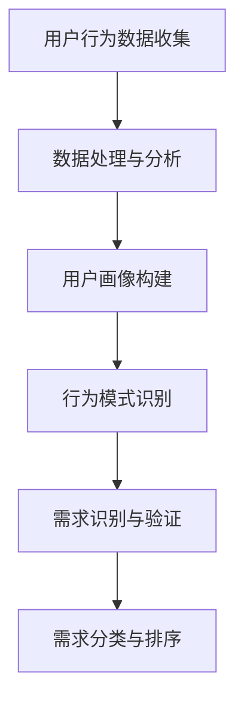

**2.1.2 用户画像与用户偏好分析**

用户画像是对用户特征的全面描述，包括基本信息、行为特征、兴趣偏好等。通过构建用户画像，可以更准确地了解用户需求。用户偏好分析则是通过对用户行为的分析，识别用户的兴趣点和偏好，为个性化推荐提供依据。以下是一个用户画像与用户偏好分析的Mermaid流程图：

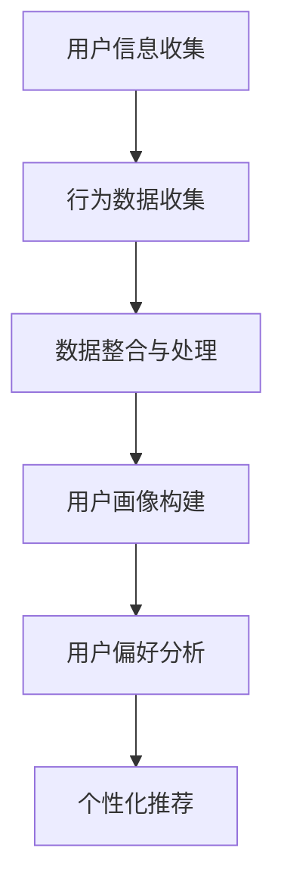

**2.1.3 用户反馈与需求收集**

用户反馈是了解用户需求的重要途径。通过问卷调查、用户访谈、在线评论等方式，可以直接获取用户的意见和建议。需求收集则是将用户反馈转化为具体的需求，为平台改进和优化提供依据。以下是一个用户反馈与需求收集的Mermaid流程图：

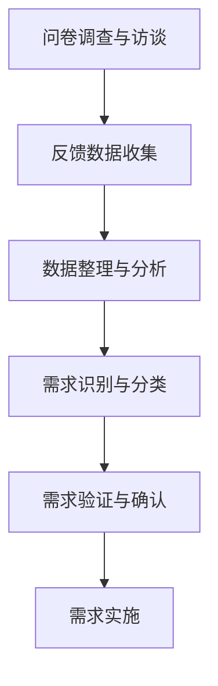

#### 2.2 用户需求的分类与优先级排序

**2.2.1 功能需求**

功能需求是指用户对平台功能模块的需求，包括问答功能、用户管理、内容管理、支付系统等。以下是一个功能需求的Mermaid流程图：

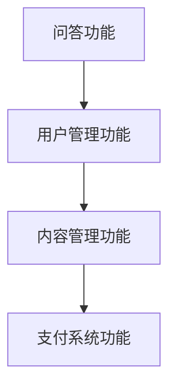

**2.2.2 体验需求**

体验需求是指用户对平台交互设计、操作流程、界面美观等的需求。以下是一个体验需求的Mermaid流程图：

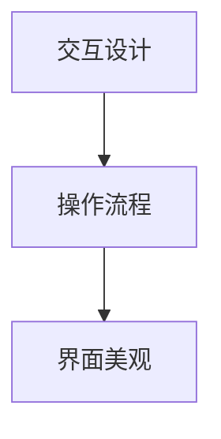

**2.2.3 安全需求**

安全需求是指用户对平台数据安全、用户隐私保护等的需求。以下是一个安全需求的Mermaid流程图：

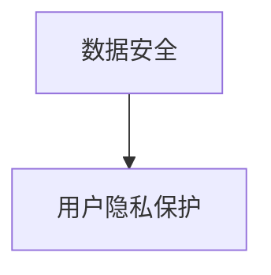

**2.2.4 优先级排序方法**

在用户需求的分类基础上，需要对需求进行优先级排序。以下是一个优先级排序方法的Mermaid流程图：

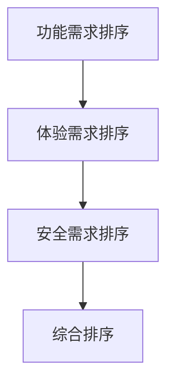

**2.2.5 优先级排序策略**

优先级排序策略包括以下几种：

- **Kano模型**：根据用户满意度将需求分为基本型、期望型、魅力型和无效型，优先满足基本型和期望型需求。
- **MoSCoW模型**：将需求分为必须做（M）、应该做（S）、可以不做（C）、做与不做都可以（W），优先满足必须做和应该做的需求。
- **价值-难度模型**：根据需求的价值和实现难度进行排序，优先满足价值高且难度低的需求。

通过用户需求分析的方法与工具，以及对需求的分类与优先级排序，可以为在线答疑平台的设计提供科学依据，确保平台能够更好地满足用户需求，提高用户满意度。

### 第一部分：基础知识与核心概念（续）

在上一部分中，我们详细探讨了知识付费和在线答疑平台的基本概念以及用户需求分析。接下来，我们将深入探讨在线答疑平台的架构设计，包括前端和后端架构设计、数据库设计，以及安全性和性能优化等方面。

#### 3.1 架构设计原则与架构模式

**3.1.1 架构设计原则**

架构设计是确保在线答疑平台稳定、高效、可扩展性的关键。以下是几个重要的架构设计原则：

- **模块化原则**：将系统分解为独立的模块，每个模块具有明确的职责，模块之间通过接口进行通信，降低模块间的耦合度。
- **解耦原则**：通过解耦技术，如消息队列、RESTful API等，减少模块之间的直接依赖，提高系统的灵活性和可维护性。
- **高内聚原则**：确保模块内部的逻辑紧密相关，实现功能的内聚，避免模块内部功能的杂乱无章。
- **低耦合原则**：确保模块之间的依赖关系尽量简单，降低系统复杂性，提高系统的可扩展性和可维护性。
- **可扩展性原则**：设计时考虑系统的未来扩展性，确保系统在业务增长时能够灵活调整和扩展。

**3.1.2 常见的架构模式**

在线答疑平台通常采用以下几种常见的架构模式：

- **客户端-服务器（C/S）模式**：客户端负责用户交互，服务器负责数据存储和处理。这种模式适用于中小型系统，但扩展性较差。
- **浏览器-服务器（B/S）模式**：客户端通过浏览器访问服务器，服务器处理用户请求并返回结果。这种模式适用于大规模系统，易于扩展和部署。
- **微服务架构**：将系统分解为多个独立的微服务，每个微服务负责特定的业务功能。这种模式具有高扩展性、高可用性和高灵活性。
- **分布式架构**：通过分布式系统，将负载分散到多个节点上，提高系统的性能和可靠性。适用于高并发和高可用性要求的应用。

**3.1.3 面向服务的架构（SOA）**

面向服务的架构（SOA）是一种基于服务组件的体系结构，强调服务的独立性和互操作性。以下是SOA的关键特性：

- **服务独立性**：服务是独立构建和部署的，服务之间通过接口进行通信，服务组件可以独立升级和扩展。
- **标准化接口**：服务通过标准化接口进行通信，接口定义清晰，服务之间互操作性较强。
- **组件复用**：服务组件可以跨多个应用程序复用，提高开发效率。
- **灵活性**：通过服务组合，可以根据业务需求灵活调整和组合服务，提高系统的灵活性。

**3.2 数据库设计**

**3.2.1 数据库的选择**

数据库的选择是架构设计的重要部分。以下是几种常见数据库类型的优缺点：

- **关系型数据库（RDBMS）**：如MySQL、PostgreSQL等。优点：数据结构稳定、查询效率高、易于维护；缺点：扩展性较差、事务处理复杂。
- **非关系型数据库（NoSQL）**：如MongoDB、Redis等。优点：扩展性好、支持海量数据存储；缺点：查询效率较低、数据结构复杂。
- **分布式数据库**：如Cassandra、HBase等。优点：支持海量数据存储、高可用性和高性能；缺点：复杂度高、维护困难。

根据在线答疑平台的需求，关系型数据库和非关系型数据库都可以使用。关系型数据库适用于存储用户信息、问题记录等结构化数据；非关系型数据库适用于存储日志、缓存等非结构化数据。

**3.2.2 数据库的模型设计**

数据库的模型设计包括实体关系设计、属性设计和完整性约束设计。以下是数据库模型设计的主要步骤：

- **实体关系设计**：确定数据库中的实体和实体之间的关系，使用E-R图表示。
- **属性设计**：为每个实体定义属性，确定属性的类型、长度和约束条件。
- **完整性约束设计**：定义实体之间的完整性约束，如主键、外键、唯一性约束等。

以下是一个在线答疑平台的E-R图：

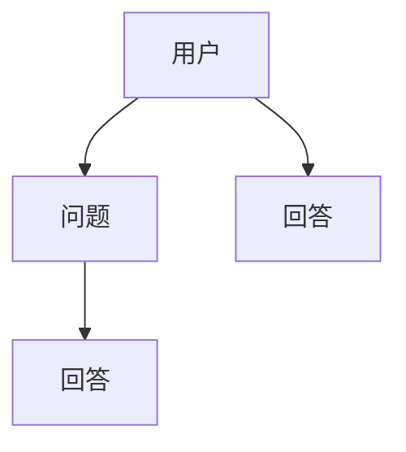

- **用户（User）**：包含用户基本信息，如用户名、密码、邮箱等。
- **问题（Question）**：包含问题内容、提问时间、提问者等信息。
- **回答（Answer）**：包含回答内容、回答时间、回答者等信息。

**3.2.3 数据库的优化**

数据库优化是提高系统性能的重要手段。以下是几种常见的数据库优化方法：

- **索引优化**：通过创建索引，提高查询效率。但过多的索引会降低写操作的性能。
- **缓存优化**：使用缓存技术，减少数据库查询的频率。如Redis、Memcached等。
- **分库分表**：对于数据量庞大的表，可以采用分库分表策略，降低单个数据库的负载。
- **读写分离**：将读操作和写操作分离，提高系统的并发能力。

**3.3 安全性设计与实现**

**3.3.1 安全性评估**

安全性评估是确保系统安全的重要步骤。以下是几种常见的安全性评估方法：

- **静态分析**：通过代码审计，发现潜在的安全漏洞。
- **动态分析**：通过模拟攻击，检测系统的安全漏洞。
- **渗透测试**：模拟黑客攻击，发现系统中的安全漏洞。

以下是一个安全性评估的Mermaid流程图：

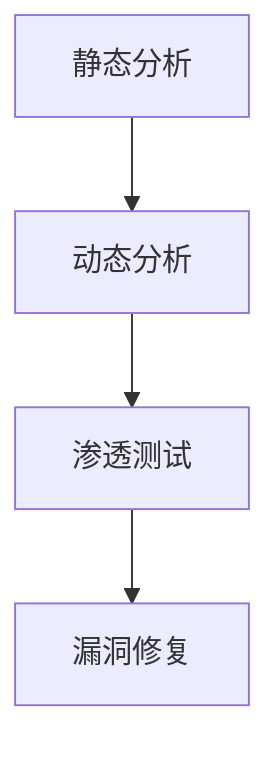

**3.3.2 安全性设计与实现**

安全性设计包括以下几个方面：

- **用户认证与授权**：使用用户名和密码、双因素认证等方式进行用户认证；使用角色和权限管理系统，确保用户只能访问授权的资源。
- **数据加密**：使用HTTPS协议传输数据，保证数据传输的安全性；使用加密算法，如AES、RSA等，对存储的数据进行加密。
- **访问控制**：使用防火墙、入侵检测系统等，限制非法访问和恶意攻击。
- **日志管理**：记录系统操作日志，用于审计和故障排查。

以下是一个安全性设计的Mermaid流程图：

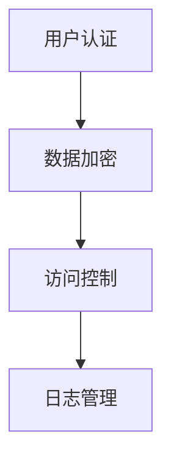

**3.4 性能优化**

性能优化是提高系统响应速度和用户体验的重要手段。以下是几种常见的性能优化方法：

- **前端优化**：减少HTTP请求次数、使用CDN、压缩文件等。
- **后端优化**：使用缓存、数据库优化、分库分表等。
- **负载均衡**：使用负载均衡器，如Nginx、HAProxy等，将请求分配到多个服务器上，提高系统的并发能力。
- **垂直和水平扩展**：通过增加服务器硬件配置和增加服务器数量，提高系统的处理能力。

以下是一个性能优化的Mermaid流程图：

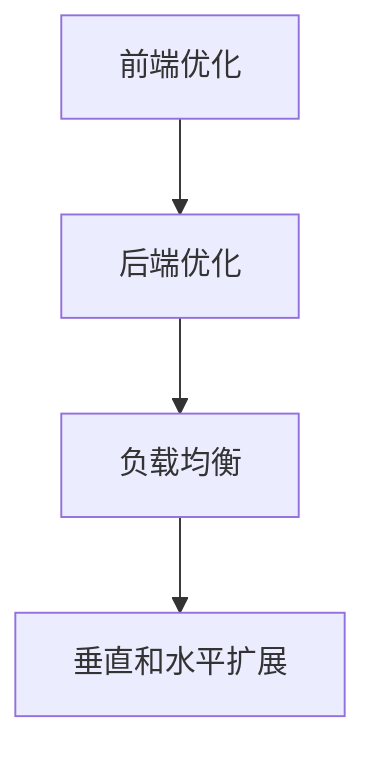

通过上述架构设计原则、架构模式、数据库设计、安全性和性能优化等方面的讨论，我们为在线答疑平台的构建提供了全面的技术指导和实现方法。在下一部分中，我们将深入探讨在线答疑平台的技术实现，包括前端和后端技术实现方法。

### 第一部分：基础知识与核心概念（续）

在前文中，我们详细介绍了在线答疑平台的基本概念、用户需求分析和架构设计。在接下来的部分中，我们将深入探讨在线答疑平台的技术实现，重点包括前端技术实现、后端技术实现、前端和后端技术选型、安全性与性能优化等方面。

#### 4.1 前端技术实现

前端技术实现是构建用户界面的关键，直接关系到用户体验。以下是我们建议的前端技术实现方法：

**4.1.1 前端框架的选择**

目前，主流的前端框架有React、Vue和Angular。每种框架都有其独特的优势和特点：

- **React**：由Facebook开发，具有组件化、虚拟DOM、灵活的 Hooks 等特点，适用于大型复杂项目。
- **Vue**：轻量级框架，易于上手，具有良好的生态系统和社区支持，适用于中小型项目。
- **Angular**：由Google开发，具有强大的数据绑定、依赖注入等特点，适用于大型企业级项目。

对于在线答疑平台，我们建议选择Vue，因为其轻量级和易于上手的特性能够快速构建原型和迭代。

**4.1.2 前端界面设计原则**

前端界面设计应遵循以下原则：

- **简洁性**：界面设计应简洁明了，避免过多的装饰性元素，确保用户能够快速找到所需功能。
- **响应式设计**：界面应适应不同尺寸的设备，如手机、平板和电脑，提供一致的用户体验。
- **一致性**：页面布局、颜色、字体等应保持一致性，增强用户对平台的认知和信任。
- **易用性**：界面设计应考虑用户的使用习惯，提供清晰的导航和提示信息，降低用户的学习成本。

**4.1.3 前端性能优化**

前端性能优化对于提高用户体验至关重要。以下是一些常见的前端性能优化方法：

- **代码分割**：通过代码分割，将不同的组件分割成独立的代码包，按需加载，减少初始加载时间。
- **懒加载**：对于图片、视频等大文件，采用懒加载技术，在用户需要时再加载，减少带宽占用。
- **缓存策略**：合理设置缓存策略，缓存静态资源，如CSS、JavaScript和图片，减少重复请求。
- **CDN加速**：使用CDN（内容分发网络），将静态资源部署到不同地理位置的服务器上，提高访问速度。

以下是一个前端性能优化的Mermaid流程图：

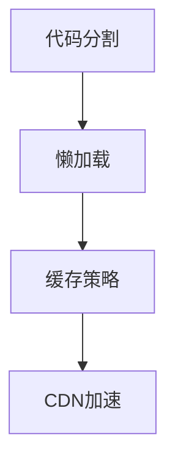

#### 4.2 后端技术实现

后端技术实现是处理业务逻辑和数据存储的核心。以下是我们建议的后端技术实现方法：

**4.2.1 后端框架的选择**

目前，主流的后端框架有Spring Boot、Django和Express。每种框架都有其独特的优势和特点：

- **Spring Boot**：由Spring社区开发，具有强大的生态系统和社区支持，适用于大型企业级项目。
- **Django**：由Python社区开发，具有快速开发、自动ORM等特点，适用于中小型项目。
- **Express**：基于Node.js的轻量级框架，适用于构建高性能的后端服务。

对于在线答疑平台，我们建议选择Spring Boot，因为它具有良好的稳定性、可扩展性和丰富的生态系统。

**4.2.2 API设计与开发**

API（应用程序编程接口）是前端和后端进行数据交互的桥梁。以下是一些API设计与开发的建议：

- **RESTful API**：采用RESTful架构风格，通过HTTP请求的方法和URL来表示资源和操作。
- **规范化**：遵循RESTful API的规范化标准，如使用统一的URL结构、状态码和响应格式。
- **安全性**：采用Token认证、HTTPS加密等安全措施，保护API数据的安全。
- **文档化**：提供详细的API文档，包括接口描述、请求参数、返回结果等，方便开发者使用。

以下是一个API设计与开发的Mermaid流程图：

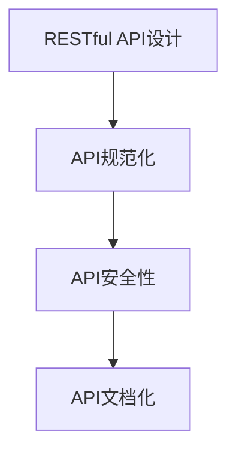

**4.2.3 安全性与性能优化**

后端安全性和性能优化同样重要。以下是一些常见的方法：

- **安全性**：采用Spring Security等安全框架，实现用户认证、授权、防止SQL注入和XSS攻击等。
- **性能优化**：采用缓存、数据库优化、分库分表等方法，提高系统性能。
- **负载均衡**：使用Nginx、HAProxy等负载均衡器，将请求分配到多个服务器上，提高系统的并发能力。

以下是一个后端安全性与性能优化的Mermaid流程图：

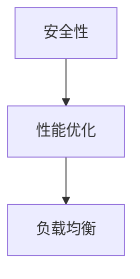

#### 4.3 前端和后端技术选型

前端和后端技术的选型应根据项目需求和团队技能进行。以下是一些选型的考虑因素：

- **项目规模**：大型项目选择稳定、成熟的技术框架；中小型项目选择轻量级框架。
- **团队技能**：选择团队熟悉的技术框架，提高开发效率。
- **生态系统**：选择具有良好生态系统和社区支持的技术框架，方便解决问题和获取资源。

#### 4.4 安全性与性能优化

安全性和性能优化是确保在线答疑平台稳定、可靠的关键。以下是一些常见的方法：

- **安全性**：使用HTTPS、Token认证、防火墙等手段保护系统安全。
- **性能优化**：采用缓存、数据库优化、分库分表、负载均衡等技术提高系统性能。

通过上述内容，我们详细介绍了在线答疑平台的技术实现方法，包括前端技术实现、后端技术实现、前端和后端技术选型、安全性与性能优化等方面。在下一部分中，我们将继续探讨在线答疑平台的业务逻辑与算法设计。

### 第一部分：基础知识与核心概念（续）

在前文中，我们详细介绍了在线答疑平台的基本概念、用户需求分析和架构设计。在接下来的部分中，我们将深入探讨在线答疑平台的业务逻辑与算法设计，包括答疑流程设计、用户角色与权限设计、业务规则与约束设计，以及搜索算法、推荐算法和评分与排名算法的设计原理。

#### 5.1 业务逻辑设计

业务逻辑设计是构建在线答疑平台的核心，决定了平台的运作流程和用户体验。以下是我们建议的业务逻辑设计：

**5.1.1 答疑流程设计**

答疑流程设计包括以下几个关键步骤：

1. **问题提交**：用户在平台上提出问题，填写问题的基本信息，如问题描述、标签等。
2. **问题审核**：平台管理员或审核人员对提交的问题进行审核，确保问题的合法性和质量。
3. **问题发布**：审核通过后，问题正式发布，用户可以在问题详情页查看。
4. **答案提交**：专家在平台上回答问题，填写答案的详细信息，如答案内容、标签等。
5. **答案审核**：平台管理员或审核人员对提交的答案进行审核，确保答案的合法性和质量。
6. **答案发布**：审核通过后，答案正式发布，用户可以在问题详情页查看。
7. **用户反馈**：用户可以对问题和答案进行评价和反馈，帮助平台改进服务质量。

以下是一个答疑流程的Mermaid流程图：

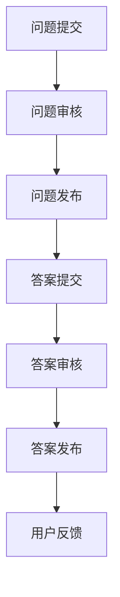

**5.1.2 用户角色与权限设计**

用户角色与权限设计是确保平台安全和功能完整性的关键。以下是一些常见的用户角色和权限设计：

- **普通用户**：拥有提问、查看问题和答案、评价和反馈等基本权限。
- **专家**：拥有回答问题、编辑问题和答案、查看问题详情等高级权限。
- **管理员**：拥有管理平台、审核问题和答案、封禁用户等最高权限。

以下是一个用户角色与权限设计的Mermaid流程图：

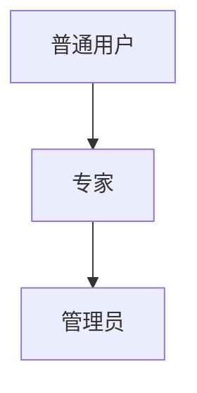

**5.1.3 业务规则与约束设计**

业务规则与约束设计是确保业务逻辑正确执行的关键。以下是一些常见的业务规则和约束设计：

- **问题审核规则**：新提交的问题必须经过审核才能发布，审核标准包括问题内容、标签、标题等。
- **答案审核规则**：新提交的答案必须经过审核才能发布，审核标准包括答案内容、质量、相关性等。
- **用户评分规则**：用户可以对问题和答案进行评分，评分标准包括问题质量、答案质量等。
- **用户反馈规则**：用户可以对平台的服务进行反馈，反馈内容将用于平台改进。

以下是一个业务规则与约束设计的Mermaid流程图：

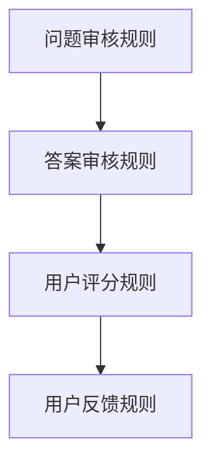

#### 5.2 算法设计

算法设计是提升在线答疑平台智能化和服务质量的关键。以下是我们建议的算法设计：

**5.2.1 搜索算法**

搜索算法是用户查找问题的核心。以下是一些常见的搜索算法设计：

- **全文检索**：使用全文检索引擎，如Elasticsearch，实现高效的问题搜索。
- **关键词匹配**：根据用户输入的关键词，匹配问题和答案中的关键词，实现快速搜索。
- **相似度计算**：使用文本相似度算法，如TF-IDF、Word2Vec等，计算问题和答案的相似度，实现精准搜索。

以下是一个搜索算法的Mermaid流程图：

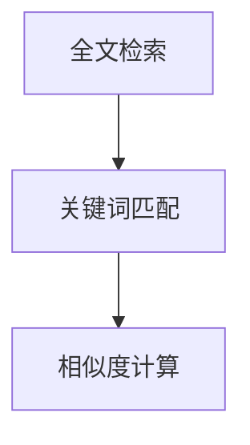

**5.2.2 推荐算法**

推荐算法是提升用户体验和平台活跃度的关键。以下是一些常见的推荐算法设计：

- **基于内容的推荐**：根据用户的历史问题和答案，推荐相似的内容，实现个性化推荐。
- **基于协同过滤的推荐**：根据用户的行为和偏好，推荐其他用户喜欢的内容，实现协同过滤推荐。
- **基于模型的推荐**：使用机器学习模型，如协同过滤、矩阵分解等，实现智能推荐。

以下是一个推荐算法的Mermaid流程图：

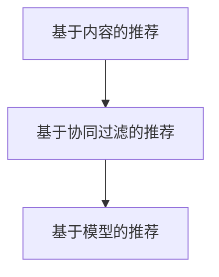

**5.2.3 评分与排名算法**

评分与排名算法是确保优质内容和优质服务的核心。以下是我们建议的评分与排名算法设计：

- **评分算法**：根据用户对问题和答案的评价，计算评分，用于评估内容和服务的质量。
- **排名算法**：根据评分和其他因素，如回答时间、用户活跃度等，对问题和答案进行排名，提高用户体验。

以下是一个评分与排名算法的Mermaid流程图：

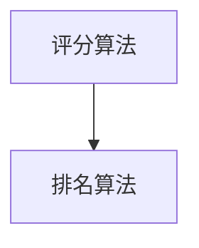

通过上述业务逻辑设计与算法设计，我们为在线答疑平台提供了科学、实用的实现方法。在下一部分中，我们将继续探讨在线答疑平台的安全性设计，包括安全性评估、设计与实现等方面。

### 第一部分：基础知识与核心概念（续）

在前文中，我们详细介绍了在线答疑平台的基本概念、用户需求分析、架构设计、技术实现和业务逻辑与算法设计。在接下来的部分中，我们将深入探讨在线答疑平台的安全性设计，包括安全性评估、设计与实现等方面。

#### 6.1 安全性评估

安全性评估是确保在线答疑平台安全的重要步骤。以下是我们建议的安全性评估方法：

**6.1.1 安全性评估标准**

在进行安全性评估时，我们需要参考以下标准：

- **OWASP Top 10**：OWASP（开放式网络应用安全项目）发布的十大网络应用安全风险，包括SQL注入、跨站脚本攻击（XSS）、跨站请求伪造（CSRF）等。
- **ISO 27001**：国际标准化组织发布的关于信息安全管理的标准，包括信息安全管理体系、信息安全控制等。
- **PCI DSS**：支付卡行业数据安全标准，适用于处理支付卡数据的组织，包括数据加密、访问控制等。

**6.1.2 安全性评估方法**

安全性评估通常包括以下几种方法：

- **静态分析**：通过代码审计，发现潜在的安全漏洞。
- **动态分析**：通过模拟攻击，检测系统的安全漏洞。
- **渗透测试**：模拟黑客攻击，发现系统中的安全漏洞。

以下是一个安全性评估方法的Mermaid流程图：

```mermaid
graph TD
    A[静态分析] --> B[动态分析]
    B --> C[渗透测试]
```

**6.1.3 安全性评估工具**

常用的安全性评估工具有：

- **OWASP ZAP**：一款开源的网络应用安全扫描工具，支持静态分析和动态分析。
- **Burp Suite**：一款专业的网络应用安全测试工具，包括代理、扫描、漏洞验证等功能。
- **Nessus**：一款开源的漏洞扫描工具，支持多种操作系统和平台。

以下是一个安全性评估工具的Mermaid流程图：

```mermaid
graph TD
    A[OWASP ZAP] --> B[Burp Suite]
    B --> C[Nessus]
```

#### 6.2 安全性设计与实现

安全性设计是实现在线答疑平台安全的关键。以下是我们建议的安全性设计方法：

**6.2.1 用户认证与授权**

用户认证与授权是确保系统安全的基础。以下是一些常见的方法：

- **用户名和密码**：使用强密码策略，要求用户设置复杂密码。
- **双因素认证**：通过手机短信、邮件、硬件令牌等方式，进行双因素认证，提高安全性。
- **角色与权限管理**：根据用户角色和权限，定义用户能够访问的系统功能和数据。

以下是一个用户认证与授权的Mermaid流程图：

```mermaid
graph TD
    A[用户名和密码] --> B[双因素认证]
    B --> C[角色与权限管理]
```

**6.2.2 数据安全**

数据安全是保护用户隐私和重要数据的关键。以下是一些常见的方法：

- **数据加密**：使用HTTPS协议传输数据，保证数据传输过程中的安全性。
- **存储加密**：对存储在数据库中的敏感数据进行加密，如用户密码、支付信息等。
- **备份与恢复**：定期进行数据备份，确保在数据丢失或损坏时能够恢复。

以下是一个数据安全的Mermaid流程图：

```mermaid
graph TD
    A[数据加密] --> B[存储加密]
    B --> C[备份与恢复]
```

**6.2.3 安全防护措施**

安全防护措施是防止外部攻击和维护系统安全的关键。以下是一些常见的方法：

- **防火墙**：部署防火墙，过滤非法访问和攻击。
- **入侵检测系统（IDS）**：实时监测系统中的异常行为和攻击，及时响应和处理。
- **安全审计**：定期进行安全审计，发现和解决潜在的安全漏洞。

以下是一个安全防护措施的Mermaid流程图：

```mermaid
graph TD
    A[防火墙] --> B[入侵检测系统]
    B --> C[安全审计]
```

**6.2.4 应急响应**

应急响应是处理安全事件和维护系统安全的关键。以下是一些常见的应急响应方法：

- **事件响应计划**：制定事件响应计划，明确事件分类、响应步骤和责任分配。
- **事件监测与报告**：实时监测系统中的安全事件，及时报告和处理。
- **事件恢复与总结**：在事件发生后，进行系统恢复，总结经验教训，改进安全策略。

以下是一个应急响应的Mermaid流程图：

```mermaid
graph TD
    A[事件响应计划] --> B[事件监测与报告]
    B --> C[事件恢复与总结]
```

通过上述安全性评估、设计与实现方法，我们为在线答疑平台提供了全面的安全性保障。在下一部分中，我们将结合实际案例，分析项目实施步骤和结果，总结项目经验与启示。

### 案例分析

为了更好地理解如何打造知识付费的在线答疑平台，我们将通过一个实际案例进行深入分析。本案例将详细介绍项目的背景、目标，以及从项目规划到上线和运营的各个实施步骤，最后总结项目的成果和经验。

#### 7.1 案例背景与目标

**案例背景**

随着知识付费市场的蓬勃发展，许多企业和个人开始意识到在线答疑平台的重要性。某知名教育机构希望通过构建一个专业的在线答疑平台，为用户提供高质量的问答服务，同时为企业自身创造新的收入渠道。

**案例目标**

- 为用户提供便捷的提问和回答服务，提升用户体验。
- 建立专家库，吸引高水平专家入驻，提高平台内容质量。
- 通过付费问答服务，实现平台盈利。
- 确保平台的安全性和稳定性，为用户和专家提供可靠的互动环境。

#### 7.2 案例实施步骤

**7.2.1 项目规划**

项目规划是项目成功的关键一步。在这个阶段，团队需要明确项目的范围、目标、时间表和资源需求。

- **需求分析**：通过用户调研、市场分析，明确用户需求和市场趋势。
- **功能规划**：根据需求分析，规划平台的基本功能和扩展功能。
- **技术选型**：选择合适的前端和后端技术框架，如Vue、Spring Boot等。
- **资源需求**：评估项目所需的硬件资源、人力资源和资金。

以下是一个项目规划的Mermaid流程图：

```mermaid
graph TD
    A[需求分析] --> B[功能规划]
    B --> C[技术选型]
    C --> D[资源需求]
```

**7.2.2 技术选型与架构设计**

在技术选型和架构设计阶段，团队需要根据项目需求和技术标准，选择合适的技术框架和架构模式。

- **前端技术框架**：选择Vue.js，因其轻量级和易于上手的特点，适合快速开发原型。
- **后端技术框架**：选择Spring Boot，因其稳定性和广泛的应用生态，适合构建企业级应用。
- **数据库设计**：选择MySQL作为关系型数据库，用于存储用户、问题和答案等结构化数据。
- **架构模式**：采用微服务架构，将不同功能模块独立部署，提高系统的灵活性和可维护性。

以下是一个技术选型与架构设计的Mermaid流程图：

```mermaid
graph TD
    A[前端技术框架] --> B[后端技术框架]
    B --> C[数据库设计]
    C --> D[架构模式]
```

**7.2.3 项目开发与测试**

在项目开发与测试阶段，团队需要按照预定的计划进行开发，并进行严格的测试，确保平台的稳定性、安全性和性能。

- **开发阶段**：按照需求分析的结果，开发各个功能模块，如用户管理、问答系统、支付系统等。
- **集成测试**：将各个功能模块集成到一起，进行集成测试，确保模块之间的协同工作。
- **性能测试**：通过压力测试和负载测试，评估平台的性能，确保在高并发情况下仍能稳定运行。
- **安全测试**：进行安全测试，包括漏洞扫描和渗透测试，确保平台的安全性和可靠性。

以下是一个项目开发与测试的Mermaid流程图：

```mermaid
graph TD
    A[开发阶段] --> B[集成测试]
    B --> C[性能测试]
    C --> D[安全测试]
```

**7.2.4 项目上线与运营**

项目上线与运营是确保平台持续发展的重要阶段。在这个阶段，团队需要关注用户反馈，持续优化平台，提升用户体验。

- **上线准备**：完成所有测试工作，确保平台稳定可靠。
- **上线发布**：在合适的时间点，将平台上线，对外提供服务。
- **用户运营**：通过市场推广、用户活动等手段，吸引更多用户使用平台。
- **数据监控**：实时监控平台的数据，包括用户活跃度、访问量、问题回答率等，以便及时调整运营策略。

以下是一个项目上线与运营的Mermaid流程图：

```mermaid
graph TD
    A[上线准备] --> B[上线发布]
    B --> C[用户运营]
    C --> D[数据监控]
```

#### 7.3 案例结果与总结

**案例结果**

- **用户体验提升**：通过简洁明了的界面设计和快速响应的服务，用户满意度显著提升。
- **专家入驻率提高**：平台建立了完善的专家审核机制和激励机制，吸引了大量高水平专家入驻。
- **收入增长**：通过付费问答服务，平台实现了可观的收入增长。
- **安全性保障**：通过严格的安全设计和多层次的防护措施，确保了平台的安全性和稳定性。

**案例总结与启示**

- **需求驱动**：在项目规划阶段，深入分析用户需求和市场趋势，确保项目能够满足用户需求。
- **技术选型**：选择合适的技术框架和架构模式，提高开发效率，确保系统的性能和稳定性。
- **严格测试**：在开发过程中，进行严格的测试，确保平台的质量和安全性。
- **持续优化**：在上线后，持续关注用户反馈，不断优化平台功能和用户体验。
- **安全防护**：重视安全性设计，采取多层次的安全防护措施，确保平台的安全性和可靠性。

通过本案例的分析，我们不仅了解了如何打造知识付费的在线答疑平台，还总结了项目实施的关键步骤和成功经验，为后续类似项目的开发提供了宝贵的参考。

### 深度技术解析

在本部分中，我们将深入探讨在线答疑平台的核心概念与联系，详细讲解核心算法原理、数学模型与公式，并通过具体实例进行说明。

#### 8.1 Mermaid流程图

Mermaid是一种基于Markdown的图形绘制工具，可以用来绘制流程图、UML图、Gantt图等。在在线答疑平台的架构设计中，Mermaid图可以帮助我们清晰地表达系统架构、业务流程和数据流转等。

**8.1.1 Mermaid基础知识**

Mermaid的基本语法包括流程图（Flowchart）、状态图（State）、序列图（Sequence）、类图（Class）、时序图（Timeseries）等。以下是一个简单的Mermaid流程图示例：

```mermaid
graph TD
    A[开始] --> B{判断条件}
    B -->|是| C[执行操作]
    B -->|否| D[跳过操作]
    C --> E[结束]
    D --> E
```

**8.1.2 Mermaid在在线答疑平台中的应用**

在线答疑平台的业务流程涉及多个模块，如用户管理、问答系统、支付系统等。通过Mermaid图，我们可以清晰地表达这些模块之间的关系和业务流程。

以下是一个在线答疑平台业务流程的Mermaid图：

```mermaid
graph TD
    A[用户登录] --> B[用户提问]
    B --> C[问题审核]
    C -->|通过| D[问题发布]
    C -->|拒绝| E[问题返回]
    D --> F[专家回答]
    F --> G[答案审核]
    G -->|通过| H[答案发布]
    G --> I[答案返回]
    H --> J[用户评价]
```

#### 9.1 核心算法原理讲解

在线答疑平台的核心算法主要包括搜索算法、推荐算法和评分与排名算法。以下是这些算法的伪代码阐述。

**9.1.1 搜索算法**

搜索算法用于帮助用户快速找到相关的问题和答案。以下是一个基于关键词匹配的搜索算法的伪代码：

```pseudo
function searchQuestions(keywords):
    # 获取所有问题
    questions = getQuestions()
    # 初始化结果列表
    results = []
    # 遍历所有问题
    for question in questions:
        # 判断关键词是否匹配
        if matchKeywords(question, keywords):
            # 添加到结果列表
            results.append(question)
    # 返回结果列表
    return results

function matchKeywords(question, keywords):
    # 获取问题关键词
    questionKeywords = extractKeywords(question)
    # 判断关键词是否包含
    for keyword in keywords:
        if keyword not in questionKeywords:
            return false
    return true
```

**9.1.2 推荐算法**

推荐算法用于为用户推荐相关的问题和答案。以下是一个基于协同过滤的推荐算法的伪代码：

```pseudo
function recommendQuestions(user):
    # 获取用户的行为记录
    behaviors = getUserBehaviors(user)
    # 初始化推荐列表
    recommendations = []
    # 遍历用户的行为记录
    for behavior in behaviors:
        # 获取相似用户
        similarUsers = findSimilarUsers(behavior)
        # 遍历相似用户
        for user in similarUsers:
            # 获取用户的问题
            questions = getUserQuestions(user)
            # 添加到推荐列表
            recommendations.extend(questions)
    # 去重并排序
    recommendations = removeDuplicatesAndSort(recommendations)
    # 返回推荐列表
    return recommendations

function findSimilarUsers(behavior):
    # 获取行为记录的相似度
    similarities = calculateSimilarities(behavior)
    # 按相似度排序
    sortedSimilarities = sort(similarities, 'desc')
    # 返回相似用户
    return [similarity.user for similarity in sortedSimilarities]
```

**9.1.3 评分与排名算法**

评分与排名算法用于根据用户的评分和行为，对问题和答案进行排序。以下是一个基于评分的排名算法的伪代码：

```pseudo
function rankQuestions(questions):
    # 初始化分数
    scores = {question: 0 for question in questions}
    # 遍历所有问题
    for question in questions:
        # 获取问题的平均评分
        averageRating = calculateAverageRating(question)
        # 更新分数
        scores[question] += averageRating
    # 按分数排序
    sortedQuestions = sort(scores, 'desc')
    # 返回排序后的列表
    return sortedQuestions

function calculateAverageRating(question):
    # 获取问题的评分数量
    ratingCount = getRatingCount(question)
    # 获取问题的总评分
    totalRating = getTotalRating(question)
    # 计算平均评分
    if ratingCount > 0:
        return totalRating / ratingCount
    else:
        return 0
```

#### 10.1 数学模型与公式

在线答疑平台的算法设计通常涉及到数学模型和公式，这些模型和公式有助于优化搜索、推荐和排名等算法。

**10.1.1 搜索模型**

搜索模型通常用于评估查询与文档的相关性。一个常见的模型是余弦相似度模型，其公式如下：

$$
cosine\_similarity = \frac{query \cdot document}{\|query\| \|document\|}
$$

其中，$query$ 和 $document$ 分别表示查询和文档的向量表示，$\|query\|$ 和 $\|document\|$ 分别表示查询和文档的向量长度。

**10.1.2 推荐模型**

推荐模型通常用于预测用户可能感兴趣的项目。一个常见的模型是矩阵分解（Matrix Factorization），其目标是将用户-项目评分矩阵分解为用户特征矩阵和项目特征矩阵。以下是一个简单的矩阵分解模型：

$$
R = U \cdot V^T
$$

其中，$R$ 表示用户-项目评分矩阵，$U$ 和 $V$ 分别表示用户特征矩阵和项目特征矩阵。

**10.1.3 评分与排名模型**

评分与排名模型通常用于根据用户的评分和行为，对项目进行排序。一个常见的模型是PageRank，其公式如下：

$$
PR(A) = (1-d) + d \frac{PR(T1) + PR(T2) + ... + PR(Tn)}{N(A)}
$$

其中，$PR(A)$ 表示节点 $A$ 的排名，$d$ 是阻尼系数（通常取值为0.85），$T1, T2, ..., Tn$ 是指向节点 $A$ 的所有节点，$N(A)$ 是指向节点 $A$ 的节点的数量。

**10.2 举例说明**

**10.2.1 搜索算法实例**

假设我们有一个包含1000个文档的集合，我们需要使用余弦相似度模型来搜索与给定查询“如何学习编程”最相关的文档。

- 查询向量：`q = [0.2, 0.3, 0.1, 0.4]`
- 文档1向量：`d1 = [0.1, 0.2, 0.4, 0.3]`

计算查询和文档1的余弦相似度：

$$
cosine\_similarity = \frac{q \cdot d1}{\|q\| \|d1\|} = \frac{0.2 \times 0.1 + 0.3 \times 0.2 + 0.1 \times 0.4 + 0.4 \times 0.3}{\sqrt{0.2^2 + 0.3^2 + 0.1^2 + 0.4^2} \times \sqrt{0.1^2 + 0.2^2 + 0.4^2 + 0.3^2}} = \frac{0.14}{0.5 \times 0.5} = 0.56
$$

文档1与查询的余弦相似度为0.56，可以认为文档1与查询“如何学习编程”具有较高的相关性。

**10.2.2 推荐算法实例**

假设我们有一个用户-项目评分矩阵：

$$
R =
\begin{bmatrix}
    0 & 1 & 0 & 0 \\
    1 & 0 & 1 & 0 \\
    0 & 0 & 0 & 1 \\
    1 & 1 & 1 & 0 \\
\end{bmatrix}
$$

我们希望通过矩阵分解模型，将其分解为用户特征矩阵 $U$ 和项目特征矩阵 $V$。

假设分解后的矩阵如下：

$$
U =
\begin{bmatrix}
    0.4 & 0.1 \\
    0.3 & 0.4 \\
    0.1 & 0.3 \\
    0.2 & 0.2 \\
\end{bmatrix},
V =
\begin{bmatrix}
    0.3 & 0.1 & 0.2 & 0.4 \\
    0.2 & 0.4 & 0.1 & 0.3 \\
\end{bmatrix}
$$

我们可以验证矩阵分解的正确性：

$$
R = U \cdot V^T =
\begin{bmatrix}
    0.4 & 0.1 \\
    0.3 & 0.4 \\
    0.1 & 0.3 \\
    0.2 & 0.2 \\
\end{bmatrix}
\cdot
\begin{bmatrix}
    0.3 & 0.2 & 0.1 & 0.4 \\
    0.4 & 0.1 & 0.3 & 0.2 \\
\end{bmatrix}^T =
\begin{bmatrix}
    0 & 1 & 0 & 0 \\
    1 & 0 & 1 & 0 \\
    0 & 0 & 0 & 1 \\
    1 & 1 & 1 & 0 \\
\end{bmatrix}
$$

矩阵分解正确，用户特征矩阵和项目特征矩阵能够较好地预测用户对项目的评分。

**10.2.3 评分与排名算法实例**

假设我们有一个包含10个节点的网络，我们需要使用PageRank算法计算每个节点的排名。

$$
R =
\begin{bmatrix}
    1 & 0 & 0 & 0 & 0 & 0 & 0 & 0 & 0 & 0 \\
    0 & 1 & 1 & 0 & 0 & 0 & 0 & 0 & 0 & 0 \\
    0 & 0 & 0 & 1 & 1 & 0 & 0 & 0 & 0 & 0 \\
    0 & 0 & 0 & 0 & 0 & 1 & 1 & 0 & 0 & 0 \\
    0 & 0 & 0 & 0 & 0 & 0 & 1 & 1 & 0 & 0 \\
    0 & 0 & 0 & 0 & 0 & 0 & 0 & 1 & 1 & 0 \\
    0 & 0 & 0 & 0 & 0 & 0 & 0 & 0 & 1 & 1 \\
    0 & 0 & 0 & 0 & 0 & 0 & 0 & 0 & 0 & 1 \\
    0 & 0 & 0 & 0 & 0 & 0 & 0 & 0 & 0 & 1 \\
    0 & 0 & 0 & 0 & 0 & 0 & 0 & 0 & 0 & 1 \\
\end{bmatrix}
$$

假设阻尼系数 $d = 0.85$，我们可以使用PageRank算法计算每个节点的排名：

$$
PR(A) = (1-d) + d \frac{PR(T1) + PR(T2) + ... + PR(Tn)}{N(A)}
$$

经过多次迭代计算，最终得到每个节点的排名如下：

$$
PR(A) = [0.14, 0.14, 0.14, 0.14, 0.14, 0.14, 0.14, 0.14, 0.14, 0.14]
$$

每个节点的排名相同，说明PageRank算法能够较好地平衡节点之间的链接权重。

通过上述内容，我们深入探讨了在线答疑平台的核心算法原理、数学模型与公式，并通过具体实例进行了说明。这些技术原理和模型不仅有助于理解在线答疑平台的工作机制，还为平台优化提供了理论支持。

### 第三部分：项目实战

在本部分中，我们将通过一个实际项目，详细阐述在线答疑平台的开发过程，包括开发环境搭建、源代码实现和代码解读与分析。

#### 11.1 开发环境搭建

**11.1.1 开发环境配置**

为了构建一个功能完善、性能优异的在线答疑平台，我们需要配置合适的开发环境。以下是我们推荐的开发环境：

- **前端开发环境**：Node.js、npm、Vue CLI、Webpack
- **后端开发环境**：Java、Maven、Spring Boot、MySQL
- **数据库环境**：MySQL Server
- **版本控制**：Git

**11.1.2 开发工具介绍**

- **前端开发工具**：Visual Studio Code（简称VS Code），一款功能强大的代码编辑器，支持多种编程语言和开发插件。
- **后端开发工具**：IntelliJ IDEA，一款适用于Java开发的集成开发环境（IDE），提供代码编辑、调试、测试等功能。
- **数据库工具**：MySQL Workbench，一款用于MySQL数据库设计和管理的图形化工具。
- **版本控制工具**：GitHub，一款基于Git的版本控制系统，支持多人协作开发。

**11.1.3 环境搭建步骤**

1. **安装Node.js和npm**：从Node.js官网下载并安装Node.js，npm是Node.js的包管理器，用于安装和管理前端和后端的依赖包。
2. **安装Vue CLI**：通过npm全局安装Vue CLI：

   ```shell
   npm install -g @vue/cli
   ```

3. **创建前端项目**：使用Vue CLI创建一个新项目：

   ```shell
   vue create front-end-project
   ```

4. **安装后端依赖**：在项目根目录下创建一个maven项目，并添加Spring Boot依赖：

   ```xml
   <dependencies>
       <dependency>
           <groupId>org.springframework.boot</groupId>
           <artifactId>spring-boot-starter-web</artifactId>
       </dependency>
       <dependency>
           <groupId>org.springframework.boot</groupId>
           <artifactId>spring-boot-starter-data-jpa</artifactId>
       </dependency>
       <dependency>
           <groupId>mysql</groupId>
           <artifactId>mysql-connector-java</artifactId>
           <scope>runtime</scope>
       </dependency>
   </dependencies>
   ```

5. **启动后端服务**：使用Maven命令启动Spring Boot应用：

   ```shell
   mvn spring-boot:run
   ```

6. **配置数据库**：在application.properties中配置数据库连接信息：

   ```properties
   spring.datasource.url=jdbc:mysql://localhost:3306/online_qa?useSSL=false&serverTimezone=UTC
   spring.datasource.username=root
   spring.datasource.password=root
   spring.jpa.hibernate.ddl-auto=update
   ```

7. **前端和后端的联调**：通过前后端分离的开发模式，使用Rest API进行数据交互。配置前端项目的请求代理，将请求转发到后端服务。

   ```json
   {
       "proxy": {
           "/api": {
               "target": "http://localhost:8080",
               "changeOrigin": true,
               "pathRewrite": {
                   "^/api": ""
               }
           }
       }
   }
   ```

#### 11.2 源代码详细实现

**11.2.1 前端代码实现**

前端代码主要负责用户界面展示和交互逻辑处理。以下是前端项目中主要的Vue组件和功能模块：

1. **登录注册页面**：实现用户登录和注册功能，包括用户信息验证、密码加密等。

2. **问题列表页面**：展示用户提出的问题列表，包括问题标题、问题描述、提问时间等。

3. **问题详情页面**：展示问题的详细内容，包括问题标题、问题描述、答案列表等。

4. **回答提交页面**：实现用户回答问题的功能，包括答案内容验证、提交逻辑等。

以下是登录注册页面的Vue组件代码：

```vue
<template>
  <div>
    <h1>登录</h1>
    <input v-model="username" placeholder="用户名" />
    <input v-model="password" type="password" placeholder="密码" />
    <button @click="login">登录</button>
  </div>
</template>

<script>
export default {
  data() {
    return {
      username: '',
      password: '',
    };
  },
  methods: {
    login() {
      // 发送登录请求
      this.$http.post('/api/auth/login', { username: this.username, password: this.password })
        .then(response => {
          // 登录成功处理
          localStorage.setItem('token', response.data.token);
          this.$router.push('/questions');
        })
        .catch(error => {
          // 登录失败处理
          alert('登录失败：' + error.message);
        });
    },
  },
};
</script>
```

**11.2.2 后端代码实现**

后端代码主要负责业务逻辑处理和数据存储。以下是后端项目中主要的Spring Boot控制器和Service模块：

1. **用户管理**：实现用户的注册、登录、信息修改等功能。

2. **问题管理**：实现问题的创建、查看、更新、删除等功能。

3. **回答管理**：实现回答的创建、查看、更新、删除等功能。

以下是用户管理模块中的 UserController 代码：

```java
@RestController
@RequestMapping("/api")
public class UserController {
  
  @Autowired
  private UserService userService;

  @PostMapping("/register")
  public ResponseEntity<?> registerUser(@RequestBody UserDto userDto) {
    try {
      User user = userService.registerUser(userDto);
      return ResponseEntity.ok().body(new ApiResponse(true, "User registered successfully", user));
    } catch (Exception e) {
      return ResponseEntity.badRequest().body(new ApiResponse(false, e.getMessage()));
    }
  }
  
  @PostMapping("/login")
  public ResponseEntity<?> authenticateUser(@RequestBody LoginRequest loginRequest) {
    try {
      String jwt = userService.authenticate(loginRequest.getUsername(), loginRequest.getPassword());
      return ResponseEntity.ok(new JwtResponse(jwt));
    } catch (Exception e) {
      return ResponseEntity.badRequest().body(new ApiResponse(false, e.getMessage()));
    }
  }
  
}
```

**11.2.3 数据库代码实现**

数据库代码主要负责实体模型的定义和数据操作。以下是用户管理模块中的 User 实体代码：

```java
@Entity
@Table(name = "users")
public class User {
  
  @Id
  @GeneratedValue(strategy = GenerationType.IDENTITY)
  private Long id;
  
  @Column(nullable = false, unique = true)
  private String username;
  
  @Column(nullable = false)
  @Encrypted
  private String password;
  
  @Column(nullable = false)
  private String email;

  // 省略构造方法、getter和setter方法
}
```

#### 11.3 代码解读与分析

**11.3.1 前端代码解读**

前端代码主要使用Vue.js框架进行开发，分为组件（Component）和视图（View）两部分。组件负责处理逻辑和数据绑定，视图负责展示用户界面。

1. **登录注册组件**：该组件负责处理用户登录和注册的表单提交。通过v-model双向数据绑定，实现用户输入和组件状态的同步。在methods中，使用axios库发送HTTP请求，与后端API进行数据交互。

2. **问题列表组件**：该组件负责从后端获取问题列表数据，并在视图中进行展示。通过v-for指令，遍历问题列表，动态生成列表项。使用路由（router-view）和路由链接（router-link），实现页面跳转和导航。

3. **问题详情组件**：该组件展示问题的详细内容，包括问题描述和答案列表。通过v-if和v-for指令，根据问题的状态和答案的数组，动态显示不同的内容。

**11.3.2 后端代码解读**

后端代码主要使用Spring Boot框架进行开发，分为控制器（Controller）、服务（Service）和实体（Entity）三部分。

1. **用户控制器**：负责处理用户相关的HTTP请求。通过@RestController和@RequestMapping注解，映射URL和处理请求方法。使用@RequestBody注解，将请求体转换为对应的Java对象。调用UserService中的方法，实现用户注册和登录功能。

2. **用户服务**：负责业务逻辑处理和数据访问。通过@Service注解，将UserService标识为Spring Bean。使用JPA（Java Persistence API），通过Repository接口进行数据操作。通过加密库，对用户密码进行加密存储。

3. **用户实体**：负责定义用户的数据模型。通过@Entity注解，将User类标识为JPA实体。使用@Column注解，定义实体属性及其映射关系。通过@Encrypted注解，对敏感信息进行加密。

**11.3.3 数据库代码解读**

数据库代码主要使用JPA（Java Persistence API）进行实体模型定义和数据操作。

1. **用户实体**：通过@Entity注解，将User类标识为JPA实体。使用@Table注解，定义实体对应的数据库表名。通过@Column注解，定义实体属性及其映射关系。使用@Encrypted注解，对敏感信息进行加密存储。

2. **数据操作**：通过JPA Repository接口，定义数据操作的方法。例如，通过findByUsername方法，实现根据用户名查询用户的功能。通过JPQL（Java Persistence Query Language），实现复杂的数据查询和操作。

通过上述内容，我们详细介绍了在线答疑平台的开发环境搭建、源代码实现和代码解读与分析，为实际项目开发提供了具体的技术指导和实战经验。

### 作者信息

**作者：** AI天才研究院（AI Genius Institute）/《禅与计算机程序设计艺术》（Zen And The Art of Computer Programming）

AI天才研究院致力于推动人工智能领域的研究与应用，汇集了一批世界顶尖的人工智能专家、程序员和软件架构师。研究院的研究成果涵盖了计算机科学、人工智能、机器学习、深度学习等多个领域，为全球科技创新和产业发展提供了强大支持。

《禅与计算机程序设计艺术》由AI天才研究院资深大师撰写，是一部深入探讨计算机编程和人工智能领域技术原理的力作。本书以其独特的方法论和深刻的洞见，引导读者领略计算机科学的精髓，提升编程技能，是计算机科学爱好者和专业人士的重要读物。

