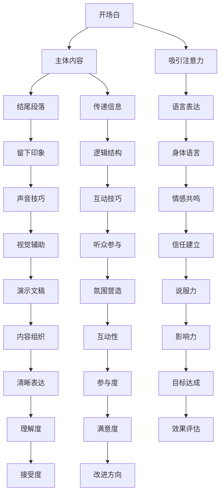

                 

# 如何进行演讲技巧：如何进行有效的演讲和表达？

## 摘要

在当今信息爆炸的时代，演讲已经成为一种重要的沟通方式。有效的演讲不仅可以传达信息，还能激发听众的思考和兴趣。本文将深入探讨演讲技巧，包括基础理论、心态与准备、实践应用以及提升策略，旨在帮助演讲者掌握有效的演讲方法和表达技巧，提升演讲质量和影响力。

本文主要分为三个部分：第一部分介绍演讲的基础理论和心态准备；第二部分讲解演讲的具体实践技巧，如语言表达、声音技巧和互动技巧；第三部分则提出演讲技巧提升的策略和实际案例。通过本文的讲解，读者将能够系统地了解演讲技巧，并在实践中不断提升自己的演讲能力。

关键词：演讲技巧、演讲基础理论、心态准备、语言表达、声音技巧、互动技巧、提升策略

## 第一部分：演讲技巧的基础理论

### 第1章：演讲概述与基本理论

#### 1.1 演讲的定义与重要性

演讲，是一种通过口头语言向听众传达信息、观点、想法和情感的活动。它不仅仅是信息的传递，更是思想和情感的交流。在现代社会，演讲已成为一种不可或缺的沟通方式，无论是商务交流、教育培训还是社交场合，演讲都发挥着重要作用。

#### 1.1.1 演讲的定义

演讲的定义可以从多个角度进行理解。首先，演讲是一种沟通活动，它通过口头语言将信息传达给听众。其次，演讲是一种表达方式，它不仅仅是信息的传递，更是演讲者个人观点和情感的表达。最后，演讲是一种艺术，它需要演讲者具备一定的技能和技巧，如语言表达、声音技巧和身体语言等。

#### 1.1.2 演讲的重要性

演讲的重要性体现在以下几个方面：

1. **信息传递**：演讲是传递信息的重要途径。在商业环境中，演讲可以帮助企业向客户、合作伙伴和员工传达战略和愿景；在教育领域，演讲可以帮助教师向学生传授知识和理念。

2. **思想交流**：演讲不仅是信息的传递，更是思想的交流。通过演讲，演讲者可以与听众分享自己的思考和见解，从而激发听众的思考和讨论。

3. **个人成长**：演讲是一种锻炼个人表达能力和领导力的方式。通过不断的演讲实践，演讲者可以提高自己的沟通技巧和表达能力，从而在职业和个人生活中取得更大的成功。

#### 1.1.3 演讲的类型与特点

演讲可以根据不同的标准进行分类，常见的分类方法包括以下几种：

1. **按目的分类**：演讲可以分为宣传演讲、说服演讲、信息演讲和娱乐演讲等。宣传演讲旨在宣传某种思想、理念或产品；说服演讲旨在说服听众接受某种观点或行为；信息演讲旨在传递信息或知识；娱乐演讲则旨在娱乐听众。

2. **按形式分类**：演讲可以分为正式演讲和非正式演讲。正式演讲通常遵循一定的格式和规范，如商务演讲、学术演讲等；非正式演讲则更加自由和随意，如社交场合的演讲等。

3. **按受众分类**：演讲可以分为内部演讲和外部演讲。内部演讲面向组织内部的听众，如公司内部的培训演讲；外部演讲则面向组织外部的听众，如公开演讲、行业会议演讲等。

不同类型的演讲有其各自的特点和需求，演讲者需要根据具体情况进行选择和调整。

### 1.2 演讲的结构与要素

#### 1.2.1 演讲的结构

一篇有效的演讲通常包括以下几个部分：

1. **开场白**：开场白是演讲的开端，其目的是吸引听众的注意力，建立与听众的联系。一个好的开场白应该简短、有力，能够迅速引起听众的兴趣。

2. **主体内容**：主体内容是演讲的核心部分，它包括演讲的主题、观点、证据和论证。主体内容需要逻辑清晰、结构紧凑，以确保听众能够理解和接受演讲的内容。

3. **结尾段落**：结尾段落是演讲的结束部分，其目的是总结演讲的内容，强化演讲的观点，并留下深刻的印象。一个好的结尾段落应该简洁有力，能够使听众对演讲的主题有更深刻的理解。

#### 1.2.2 演讲的要素

演讲的要素包括语言表达、声音技巧和身体语言等。

1. **语言表达**：语言表达是演讲的基础，它决定了演讲的清晰度和说服力。演讲者需要使用简单、准确、易懂的语言，避免使用过于复杂或晦涩难懂的词汇。

2. **声音技巧**：声音技巧包括发声方法、声音的调节和演讲时的语音语调。演讲者需要学会正确地发声，使用清晰、洪亮、富有感染力的声音。

3. **身体语言**：身体语言是演讲的重要补充，它包括手势、面部表情和空间利用等。演讲者需要学会合理地使用身体语言，以增强演讲的效果。

#### 1.2.3 有效演讲的三大要素

有效演讲的三大要素是内容、表达和影响。

1. **内容**：内容是演讲的核心，它决定了演讲的价值和吸引力。演讲者需要确保演讲的内容具有深度、广度和逻辑性，能够满足听众的需求。

2. **表达**：表达是演讲的技巧，它决定了演讲的效果和影响力。演讲者需要具备良好的语言表达、声音技巧和身体语言，以确保演讲的清晰度和说服力。

3. **影响**：影响是演讲的目标，它决定了演讲的价值和意义。演讲者需要通过演讲影响听众的思想、情感和行为，实现演讲的目的。

### 第2章：演讲者心态与准备

#### 2.1 心态调整

#### 2.1.1 克服紧张情绪

演讲前紧张是很多演讲者都会遇到的问题。为了克服紧张情绪，演讲者可以采取以下几种方法：

1. **充分准备**：充分准备是克服紧张情绪的关键。演讲者需要对演讲的内容、结构和要点进行充分的准备，确保自己对演讲的内容有足够的信心。

2. **模拟练习**：模拟练习可以帮助演讲者熟悉演讲的流程和内容，减少演讲时的紧张情绪。演讲者可以在镜子前、家人或朋友面前进行模拟练习，以增强自信心。

3. **深呼吸**：深呼吸可以帮助演讲者放松身体，减轻紧张情绪。演讲前，演讲者可以进行几次深呼吸，以帮助自己平静下来。

4. **正面思维**：正面思维可以帮助演讲者建立积极的信念，减少紧张情绪。演讲者可以想象自己成功演讲的场景，相信自己的能力和表现。

#### 2.1.2 建立自信

建立自信是有效演讲的重要基础。为了建立自信，演讲者可以采取以下几种方法：

1. **了解听众**：了解听众的需求和兴趣，可以帮助演讲者更好地准备演讲内容，增强演讲的吸引力。演讲者可以通过调查问卷、社交媒体等方式了解听众。

2. **设定目标**：设定明确的目标可以帮助演讲者集中精力，提高演讲的质量。演讲者可以设定一些具体的目标，如提高听众的参与度、传递关键信息等。

3. **接受失败**：接受失败是建立自信的重要一步。演讲者需要认识到，失败是成功的一部分，每次失败都是一次学习和成长的机会。

#### 2.2 演讲准备

#### 2.2.1 研究主题

研究主题是演讲准备的重要环节。演讲者需要深入研究演讲的主题，了解相关的背景知识和发展动态。以下是一些研究主题的方法：

1. **查阅资料**：查阅相关的书籍、文章、研究报告等资料，可以帮助演讲者深入了解演讲的主题。

2. **访谈专家**：与相关领域的专家进行访谈，可以获取宝贵的见解和经验，为演讲提供有力支持。

3. **收集案例**：收集与演讲主题相关的实际案例，可以帮助演讲者更好地说明观点和论证。

#### 2.2.2 组织材料

组织材料是演讲准备的关键步骤。演讲者需要将研究得到的材料进行整理和组织，以确保演讲内容的逻辑性和连贯性。以下是一些组织材料的方法：

1. **制定大纲**：制定演讲的大纲，明确演讲的结构和要点。

2. **整理笔记**：整理与研究主题相关的笔记，确保演讲内容的准确性和完整性。

3. **准备PPT**：制作演讲的PPT，将关键信息、图表和图片进行可视化展示，以增强演讲的效果。

#### 2.2.3 制作PPT

制作PPT是演讲准备的重要环节。一个好的PPT可以帮助演讲者更好地传达信息，吸引听众的注意力。以下是一些制作PPT的方法：

1. **选择主题**：选择适合演讲主题的PPT主题，使PPT更具吸引力。

2. **设计布局**：设计合理的布局，确保PPT内容的清晰和易于理解。

3. **使用图表和图片**：使用图表和图片来展示数据和信息，使演讲内容更加直观。

4. **避免文字过多**：避免PPT上文字过多，保持简洁明了，使听众更容易理解和接受演讲内容。

#### 2.2.4 模拟练习

模拟练习是演讲准备的重要环节。通过模拟练习，演讲者可以熟悉演讲的流程和内容，发现并解决潜在的问题。以下是一些模拟练习的方法：

1. **模拟演讲**：在镜子前、家人或朋友面前进行模拟演讲，以熟悉演讲的流程和内容。

2. **录音录像**：录音录像可以帮助演讲者发现自己在演讲中的不足之处，并进行针对性的改进。

3. **反复练习**：反复练习演讲的内容和技巧，直到能够熟练掌握，确保演讲的流畅和自然。

### 第二部分：演讲技巧的实践应用

#### 第3章：演讲表达技巧

#### 3.1 语言表达

语言表达是演讲的核心，它决定了演讲的清晰度和说服力。以下是一些提高语言表达技巧的方法：

1. **简洁明了**：使用简洁、明了的语言，避免使用过于复杂或晦涩难懂的词汇。简洁明了的语言更容易让听众理解和接受。

2. **逻辑清晰**：确保演讲的内容逻辑清晰，结构紧凑。逻辑清晰的内容能够帮助听众更好地理解演讲的主旨。

3. **重点突出**：在演讲中，将重点内容突出展示，使听众更容易抓住演讲的主旨。

4. **重复强调**：适当地重复强调关键信息，以加深听众的印象。

#### 3.2 声音技巧

声音技巧是演讲的重要组成部分，它决定了演讲的感染力和吸引力。以下是一些提高声音技巧的方法：

1. **发声方法**：学会正确的发声方法，确保声音清晰、洪亮、有感染力。正确的发声方法可以减少声音的疲劳，提高声音的质量。

2. **声音的调节**：根据演讲的内容和场景，适当地调节声音的音量、音调和节奏。适当的调节可以使演讲更具表现力。

3. **演讲时的语音语调**：在演讲时，注意语音语调的变化，使演讲更具吸引力。语音语调的变化可以增强演讲的情感表达。

#### 3.3 身体语言

身体语言是演讲的重要补充，它决定了演讲的生动性和感染力。以下是一些提高身体语言技巧的方法：

1. **手势和动作**：合理地使用手势和动作，可以增强演讲的表现力。手势和动作应该与演讲的内容和情感相匹配。

2. **面部表情**：面部表情是演讲的重要部分，它可以传达演讲者的情感和态度。演讲者应该保持自然、真诚的面部表情。

3. **空间利用**：合理地利用演讲的空间，可以增强演讲的感染力。演讲者可以在演讲过程中适当走动，以吸引听众的注意力。

### 第4章：互动技巧

#### 4.1 提问与回答

提问与回答是演讲中互动的重要环节，它决定了演讲的互动性和影响力。以下是一些提问与回答的技巧：

1. **提问的艺术**：提问应该具有引导性，能够引发听众的思考。提问的内容应该与演讲的主题相关，有助于加深听众对演讲内容的理解。

2. **回答问题的技巧**：回答问题时要简洁明了，避免过于复杂或模糊的回答。回答问题时，可以结合演讲的内容，进一步深化主题。

#### 4.2 观众参与

观众参与是提升演讲互动性的关键，它决定了演讲的参与度和吸引力。以下是一些观众参与的技巧：

1. **激发听众兴趣**：通过讲述有趣的故事、展示生动的案例等方式，激发听众的兴趣。

2. **引导听众思考**：提出有深度、有启发性的问题，引导听众思考，从而提高听众的参与度。

3. **建立互动氛围**：营造轻松、愉快的互动氛围，使听众愿意参与演讲。

### 第5章：演讲中的视觉辅助

#### 5.1 PPT制作技巧

PPT是演讲中常用的视觉辅助工具，它可以增强演讲的效果，吸引听众的注意力。以下是一些PPT制作技巧：

1. **设计原则**：遵循简洁、明了、美观的设计原则，确保PPT的内容易于理解和接受。

2. **图表和图片的应用**：合理地使用图表和图片，可以使演讲内容更加直观、生动。

3. **动画与过渡效果**：适当的动画和过渡效果可以增强演讲的视觉冲击力，吸引听众的注意力。

#### 5.2 视频与音频辅助

视频和音频是演讲中有效的视觉辅助工具，它们可以增强演讲的效果，提升听众的体验。以下是一些视频与音频辅助的技巧：

1. **视频的应用**：使用视频展示相关的场景、案例或实验结果，可以使演讲内容更加生动、具体。

2. **音频的引入**：引入音频，如背景音乐、演讲者的录音等，可以增强演讲的情感表达，吸引听众的注意力。

### 第6章：应对不同场景的演讲

#### 6.1 商务演讲

商务演讲是一种特殊的演讲形式，它通常具有明确的目的和严谨的结构。以下是一些商务演讲的技巧：

1. **商务演讲的特点**：商务演讲通常注重逻辑性、条理性和专业性，强调信息的准确性和有效性。

2. **商务演讲的技巧**：在商务演讲中，注重内容的精确性、逻辑性和说服力，同时注重与听众的互动和沟通。

#### 6.2 教育演讲

教育演讲是教师向学生传授知识、理念的重要方式。以下是一些教育演讲的技巧：

1. **教育演讲的目标**：教育演讲的目标是传递知识、启发思考和培养兴趣。

2. **教育演讲的方法**：教育演讲应注重互动性、启发性和趣味性，通过讲述故事、展示案例等方式，激发学生的兴趣和思考。

#### 6.3 社交场合演讲

社交场合演讲是一种非正式的演讲形式，它通常发生在朋友聚会、社交活动等场合。以下是一些社交场合演讲的技巧：

1. **社交场合演讲的要点**：社交场合演讲应注重幽默感、亲和力和人际关系的建立。

2. **社交场合演讲的注意事项**：在社交场合演讲时，应避免过于严肃或拘谨，注重与听众的互动和沟通。

### 第三部分：演讲技巧的提升与实践

#### 第7章：演讲技巧提升策略

#### 7.1 演讲后的反思与改进

演讲后的反思与改进是提升演讲技巧的重要环节。以下是一些演讲后的反思与改进策略：

1. **自我评价**：演讲后，对自身的表现进行客观、全面的评价，找出优点和不足。

2. **收集反馈意见**：向听众、同事或朋友收集反馈意见，了解他们的看法和建议。

3. **制定改进计划**：根据自我评价和反馈意见，制定具体的改进计划，针对性地提高自己的演讲技巧。

#### 7.2 持续学习与实践

持续学习与实践是提升演讲技巧的关键。以下是一些持续学习与实践的策略：

1. **阅读相关书籍与资料**：阅读与演讲相关的书籍、文章和资料，了解演讲的理论和实践技巧。

2. **参加演讲培训与课程**：参加专业的演讲培训与课程，系统地学习演讲技巧。

3. **多参与演讲实践**：积极参与各种场合的演讲实践，不断提升自己的演讲能力。

#### 第8章：演讲技巧的实践案例

#### 8.1 案例分析

以下是一些演讲技巧的实践案例，通过分析这些案例，可以更好地理解和应用演讲技巧。

1. **案例一**：成功的商务演讲。分析其成功的因素，如内容的精确性、逻辑性、互动性等。

2. **案例二**：优秀的教育演讲。分析其激发学生兴趣、启发思考的方法。

3. **案例三**：精彩的社交场合演讲。分析其幽默感、亲和力和人际关系的建立。

#### 8.2 代码解读与分析

以下是一些演讲技巧的代码解读与分析案例，通过代码实现和解读，可以更好地理解和应用演讲技巧。

1. **代码实现**：演讲主题的PPT制作。通过代码实现PPT的制作，分析其设计原则和技巧。

2. **代码解读**：演讲稿的文本分析。通过代码对演讲稿进行文本分析，提取关键信息，分析其语言表达和逻辑结构。

#### 第9章：演讲技巧的实践案例

以下是一些演讲技巧的实践案例，通过具体的项目实战，可以更好地理解和应用演讲技巧。

1. **项目一**：商务演讲技巧提升项目。通过实战项目，提高商务演讲的技巧。

2. **项目二**：教育演讲技巧提升项目。通过实战项目，提高教育演讲的技巧。

3. **项目三**：社交场合演讲技巧提升项目。通过实战项目，提高社交场合演讲的技巧。

## 附录

### 附录A：演讲技巧相关资源推荐

以下是一些演讲技巧相关资源的推荐，包括书籍、在线资源和应用工具。

1. **演讲技巧书籍推荐**：推荐一些经典的演讲技巧书籍，如《演讲的艺术》、《说服力》等。

2. **演讲技巧在线资源**：推荐一些优质的在线资源，如TED演讲、演讲技巧博客等。

3. **演讲技巧应用工具介绍**：介绍一些常用的演讲技巧应用工具，如PPT制作工具、语音合成器等。

### 附录B：核心概念与联系流程图

以下是一些核心概念和联系的流程图，通过图形化的方式，更直观地展示演讲技巧的相关概念和流程。

1. **演讲结构流程图**：展示演讲的结构和组成要素。

2. **语言表达技巧流程图**：展示语言表达的核心技巧和步骤。

3. **声音技巧流程图**：展示声音技巧的核心要点和步骤。

4. **身体语言技巧流程图**：展示身体语言的核心技巧和步骤。

### 附录C：核心算法原理与伪代码

以下是一些核心算法原理和伪代码，通过详细解释和示例，帮助读者更好地理解和应用演讲技巧。

1. **演讲稿文本分析算法原理**：解释演讲稿文本分析的基本原理，包括文本预处理、关键信息提取等。

2. **伪代码实现**：给出演讲稿文本分析算法的伪代码实现。

3. **演讲互动算法原理**：解释演讲互动的基本原理，包括提问与回答、观众参与等。

4. **伪代码实现**：给出演讲互动算法的伪代码实现。

### 附录D：数学模型与公式

以下是一些数学模型和公式，通过详细解释和示例，帮助读者更好地理解和应用演讲技巧。

1. **演讲稿结构分析数学模型**：解释演讲稿结构分析的基本数学模型，包括文本长度、词汇频率等。

2. **公式解释与示例**：给出数学模型的公式解释和实际应用示例。

3. **演讲音量控制模型**：解释演讲音量控制的基本数学模型，包括声音强度、音调等。

4. **公式解释与示例**：给出数学模型的公式解释和实际应用示例。

### 附录E：项目实战

以下是一些演讲技巧提升的项目实战，通过具体的案例和代码实现，帮助读者更好地理解和应用演讲技巧。

1. **演讲技巧提升项目实战**：介绍演讲技巧提升的实战项目，包括项目目标、环境搭建、源代码实现等。

2. **实战环境搭建**：介绍实战项目的环境搭建过程，包括所需的软件和工具。

3. **源代码实现**：给出实战项目的源代码实现，详细解释代码的功能和作用。

4. **代码解读与分析**：对源代码进行解读和分析，解释代码的实现原理和实际应用。

### 附录F：演讲技巧代码解读与分析

以下是一些演讲技巧的代码示例，通过代码解读和分析，帮助读者更好地理解和应用演讲技巧。

1. **代码示例**：给出演讲技巧相关的代码示例，包括PPT制作、文本分析等。

2. **代码解读**：对代码进行详细的解读，解释代码的实现原理和功能。

3. **代码分析与优化建议**：对代码进行分析和优化建议，提出改进方案。

4. **代码应用场景拓展**：探讨代码在不同应用场景下的扩展和改进。

## 作者信息

作者：AI天才研究院/AI Genius Institute & 禅与计算机程序设计艺术 /Zen And The Art of Computer Programming

## 结语

演讲技巧是一门艺术，它需要演讲者具备扎实的理论基础、丰富的实践经验以及不断的学习和改进。通过本文的讲解，读者可以系统地了解演讲技巧，并在实践中不断提升自己的演讲能力。希望本文能为您的演讲之路提供一些有益的启示和帮助。让我们共同努力，成为更优秀的演讲者！<|endoftext|>## 第1章：演讲概述与基本理论

### 1.1 演讲的定义与重要性

演讲，是一种通过口头语言向听众传达信息、观点、想法和情感的活动。它不仅仅是一种信息传递的方式，更是思想交流、情感共鸣的重要手段。在现代社会，演讲已经成为一种重要的沟通方式，无论是商务交流、教育培训还是社交场合，演讲都发挥着不可替代的作用。

首先，从定义上来看，演讲是一种由一个或多个演讲者进行的口头陈述活动。它包括演讲者的语言表达、声音技巧和身体语言等多个方面。演讲的定义可以从不同的角度进行理解。首先，演讲是一种沟通活动，它通过口头语言将信息传达给听众。其次，演讲是一种表达方式，它不仅仅是信息的传递，更是演讲者个人观点和情感的表达。最后，演讲是一种艺术，它需要演讲者具备一定的技能和技巧，如语言表达、声音技巧和身体语言等。

演讲的重要性体现在以下几个方面：

1. **信息传递**：演讲是传递信息的重要途径。在商业环境中，演讲可以帮助企业向客户、合作伙伴和员工传达战略和愿景；在教育领域，演讲可以帮助教师向学生传授知识和理念。

2. **思想交流**：演讲不仅是信息的传递，更是思想的交流。通过演讲，演讲者可以与听众分享自己的思考和见解，从而激发听众的思考和讨论。

3. **个人成长**：演讲是一种锻炼个人表达能力和领导力的方式。通过不断的演讲实践，演讲者可以提高自己的沟通技巧和表达能力，从而在职业和个人生活中取得更大的成功。

### 1.1.2 演讲的类型与特点

演讲可以根据不同的标准进行分类，常见的分类方法包括以下几种：

1. **按目的分类**：演讲可以分为宣传演讲、说服演讲、信息演讲和娱乐演讲等。宣传演讲旨在宣传某种思想、理念或产品；说服演讲旨在说服听众接受某种观点或行为；信息演讲旨在传递信息或知识；娱乐演讲则旨在娱乐听众。

2. **按形式分类**：演讲可以分为正式演讲和非正式演讲。正式演讲通常遵循一定的格式和规范，如商务演讲、学术演讲等；非正式演讲则更加自由和随意，如社交场合的演讲等。

3. **按受众分类**：演讲可以分为内部演讲和外部演讲。内部演讲面向组织内部的听众，如公司内部的培训演讲；外部演讲则面向组织外部的听众，如公开演讲、行业会议演讲等。

不同类型的演讲有其各自的特点和需求，演讲者需要根据具体情况进行选择和调整。

#### 正式演讲

正式演讲通常具有明确的格式和规范，其目的是传达信息、观点或知识。正式演讲的特点包括：

- **结构清晰**：正式演讲通常包括开场白、主体内容和结尾段落，每个部分都有明确的任务和目标。
- **语言严谨**：正式演讲要求语言表达准确、严谨，避免使用过于随意或口语化的词汇。
- **逻辑性强**：正式演讲的内容需要具有逻辑性，确保听众能够清晰地理解演讲的主旨和内容。

#### 非正式演讲

非正式演讲相对于正式演讲更加自由和随意，其目的是建立联系、激发兴趣或提供娱乐。非正式演讲的特点包括：

- **风格轻松**：非正式演讲通常采用更加轻松、幽默的风格，以吸引听众的注意力。
- **互动性强**：非正式演讲鼓励听众参与，通过提问、回答等方式增加互动性。
- **内容灵活**：非正式演讲的内容更加灵活，可以根据听众的反应和场景进行调整。

### 1.2 演讲的结构与要素

#### 演讲的结构

一篇有效的演讲通常包括以下几个部分：

1. **开场白**：开场白是演讲的开端，其目的是吸引听众的注意力，建立与听众的联系。一个好的开场白应该简短、有力，能够迅速引起听众的兴趣。

2. **主体内容**：主体内容是演讲的核心部分，它包括演讲的主题、观点、证据和论证。主体内容需要逻辑清晰、结构紧凑，以确保听众能够理解和接受演讲的内容。

3. **结尾段落**：结尾段落是演讲的结束部分，其目的是总结演讲的内容，强化演讲的观点，并留下深刻的印象。一个好的结尾段落应该简洁有力，能够使听众对演讲的主题有更深刻的理解。

#### 演讲的要素

演讲的要素包括语言表达、声音技巧和身体语言等。

1. **语言表达**：语言表达是演讲的基础，它决定了演讲的清晰度和说服力。演讲者需要使用简单、准确、易懂的语言，避免使用过于复杂或晦涩难懂的词汇。

2. **声音技巧**：声音技巧包括发声方法、声音的调节和演讲时的语音语调。演讲者需要学会正确地发声，使用清晰、洪亮、富有感染力的声音。

3. **身体语言**：身体语言是演讲的重要补充，它包括手势、面部表情和空间利用等。演讲者需要学会合理地使用身体语言，以增强演讲的效果。

#### 有效演讲的三大要素

有效演讲的三大要素是内容、表达和影响。

1. **内容**：内容是演讲的核心，它决定了演讲的价值和吸引力。演讲者需要确保演讲的内容具有深度、广度和逻辑性，能够满足听众的需求。

2. **表达**：表达是演讲的技巧，它决定了演讲的效果和影响力。演讲者需要具备良好的语言表达、声音技巧和身体语言，以确保演讲的清晰度和说服力。

3. **影响**：影响是演讲的目标，它决定了演讲的价值和意义。演讲者需要通过演讲影响听众的思想、情感和行为，实现演讲的目的。

### 1.2.1 演讲的结构与要素

1. **开场白**：开场白是演讲的开端，其目的是吸引听众的注意力，建立与听众的联系。一个好的开场白应该简短、有力，能够迅速引起听众的兴趣。

    - **目的**：开场白的目的是吸引听众的注意力，为后续的演讲内容做好铺垫。

    - **方法**：开场白可以通过提问、引用名言、讲述有趣的故事或案例等方式来吸引听众的注意力。

    - **示例**：例如，“你是否曾遇到过这样的问题？”或“今天我想和大家分享一个关于创新的故事。”

2. **主体内容**：主体内容是演讲的核心部分，它包括演讲的主题、观点、证据和论证。主体内容需要逻辑清晰、结构紧凑，以确保听众能够理解和接受演讲的内容。

    - **目的**：主体内容的目的是传达演讲的核心信息和观点。

    - **方法**：主体内容可以通过事实、数据、案例、论证等方式来支持演讲的观点。

    - **示例**：例如，“我国在过去五年中的经济发展取得了显著成就，GDP年均增长率达到了6.6%。”

3. **结尾段落**：结尾段落是演讲的结束部分，其目的是总结演讲的内容，强化演讲的观点，并留下深刻的印象。一个好的结尾段落应该简洁有力，能够使听众对演讲的主题有更深刻的理解。

    - **目的**：结尾段落的作用是强化演讲的观点，为听众留下深刻的印象。

    - **方法**：结尾段落可以通过重申观点、提出建议、引用名言或故事等方式来结束演讲。

    - **示例**：例如，“让我们共同努力，为实现我国经济发展目标而奋斗。”

### 1.2.2 有效演讲的三大要素

有效演讲的三大要素是内容、表达和影响。

1. **内容**：内容是演讲的核心，它决定了演讲的价值和吸引力。演讲者需要确保演讲的内容具有深度、广度和逻辑性，能够满足听众的需求。

    - **深度**：演讲的内容应该深入探讨主题，提供丰富的信息和见解。

    - **广度**：演讲的内容应该涵盖广泛的观点和角度，使听众能够从多个维度理解主题。

    - **逻辑性**：演讲的内容需要具有逻辑性，确保听众能够清晰地理解演讲的主旨和内容。

2. **表达**：表达是演讲的技巧，它决定了演讲的效果和影响力。演讲者需要具备良好的语言表达、声音技巧和身体语言，以确保演讲的清晰度和说服力。

    - **语言表达**：演讲者需要使用简单、准确、易懂的语言，避免使用过于复杂或晦涩难懂的词汇。

    - **声音技巧**：演讲者需要学会正确地发声，使用清晰、洪亮、富有感染力的声音。

    - **身体语言**：演讲者需要学会合理地使用身体语言，如手势、面部表情和空间利用等，以增强演讲的效果。

3. **影响**：影响是演讲的目标，它决定了演讲的价值和意义。演讲者需要通过演讲影响听众的思想、情感和行为，实现演讲的目的。

    - **思想**：演讲者需要通过演讲引发听众的思考和讨论，促进思想的交流和碰撞。

    - **情感**：演讲者需要通过演讲传递情感，使听众产生共鸣，增强演讲的感染力。

    - **行为**：演讲者需要通过演讲激发听众的行为，使听众能够将演讲的内容付诸实践。

### 第2章：演讲者心态与准备

#### 2.1 心态调整

#### 2.1.1 克服紧张情绪

演讲前紧张是很多演讲者都会遇到的问题。紧张情绪会影响到演讲的质量和效果，因此克服紧张情绪是演讲成功的关键。以下是一些克服紧张情绪的方法：

1. **充分准备**：充分准备是克服紧张情绪的关键。演讲者需要对演讲的内容、结构和要点进行充分的准备，确保自己对演讲的内容有足够的信心。

    - **内容准备**：熟悉演讲的主题和内容，确保能够清晰地表达观点。
    - **结构准备**：明确演讲的结构和流程，确保演讲逻辑清晰。
    - **要点准备**：列出演讲的关键点和重点，确保能够准确传达信息。

2. **模拟练习**：模拟练习可以帮助演讲者熟悉演讲的流程和内容，减少演讲时的紧张情绪。演讲者可以在镜子前、家人或朋友面前进行模拟练习，以增强自信心。

    - **模拟场景**：模拟演讲的场景，如演讲场地、听众人数等。
    - **模拟内容**：模拟演讲的实际内容，包括开场白、主体内容和结尾段落。
    - **模拟反馈**：模拟结束后，听取他人的反馈，了解自己的表现，并根据反馈进行改进。

3. **深呼吸**：深呼吸可以帮助演讲者放松身体，减轻紧张情绪。演讲前，演讲者可以进行几次深呼吸，以帮助自己平静下来。

    - **深呼吸技巧**：缓慢吸气，使腹部膨胀，然后缓慢呼气，使腹部收缩。
    - **呼吸频率**：保持呼吸的节奏，不要过于急促或缓慢。

4. **正面思维**：正面思维可以帮助演讲者建立积极的信念，减少紧张情绪。演讲者可以想象自己成功演讲的场景，相信自己的能力和表现。

    - **正面暗示**：给自己积极的暗示，如“我准备得很充分，我能够成功演讲”。
    - **正面想象**：想象自己成功地完成了演讲，得到了听众的认可和赞赏。

5. **调整心态**：调整心态，将演讲视为一种交流和学习的机会，而不是一种表演或竞争。这样可以帮助演讲者减少紧张情绪，更轻松地面对演讲。

    - **接受紧张**：接受紧张是正常现象，不需要过度担心。
    - **专注于演讲**：将注意力集中在演讲的内容和听众上，而不是自己的紧张情绪。

#### 2.1.2 建立自信

建立自信是有效演讲的重要基础。一个自信的演讲者能够更好地控制演讲的节奏和内容，增强演讲的感染力和说服力。以下是一些建立自信的方法：

1. **了解听众**：了解听众的需求和兴趣，可以帮助演讲者更好地准备演讲内容，增强演讲的吸引力。演讲者可以通过调查问卷、社交媒体等方式了解听众。

    - **听众需求**：了解听众期望从演讲中获得哪些信息或收获。
    - **听众兴趣**：了解听众的兴趣点和关注点，使演讲内容更具吸引力。

2. **设定目标**：设定明确的目标可以帮助演讲者集中精力，提高演讲的质量。演讲者可以设定一些具体的目标，如提高听众的参与度、传递关键信息等。

    - **具体目标**：设定具体、可衡量的目标，如“我要让50%的听众在演讲后提出问题”。
    - **逐步实现**：将目标分解为小的、可实现的步骤，逐步实现。

3. **接受失败**：接受失败是建立自信的重要一步。演讲者需要认识到，失败是成功的一部分，每次失败都是一次学习和成长的机会。

    - **失败是成功的前提**：将失败视为成功的前奏，每次失败都是积累经验的机会。
    - **从失败中学习**：分析失败的原因，找出改进的方法，为下一次演讲做好准备。

4. **积极练习**：通过不断地练习，演讲者可以增强自己的演讲技能，提高自信心。练习可以帮助演讲者熟悉演讲的内容和流程，减少紧张情绪。

    - **日常练习**：每天花时间进行演讲练习，如对着镜子练习、录音练习等。
    - **模拟场景**：模拟不同的演讲场景，如正式场合、非正式场合等，提高应对不同场景的自信。

5. **正面思维**：正面思维可以帮助演讲者建立积极的信念，增强自信心。演讲者可以通过积极的自我暗示和正面想象来提升自信。

    - **正面暗示**：给自己积极的暗示，如“我能够成功演讲，我有能力应对挑战”。
    - **正面想象**：想象自己成功地完成了演讲，得到了听众的认可和赞赏。

#### 2.2 演讲准备

#### 2.2.1 研究主题

研究主题是演讲准备的重要环节。只有对主题有深入的了解，演讲者才能更好地传达信息，引起听众的兴趣。以下是一些研究主题的方法：

1. **查阅资料**：查阅相关的书籍、文章、研究报告等资料，可以帮助演讲者深入了解演讲的主题。

    - **文献综述**：阅读与主题相关的文献综述，了解前人的研究成果和观点。
    - **最新研究**：关注最新的研究成果和动态，了解最新的发现和趋势。

2. **访谈专家**：与相关领域的专家进行访谈，可以获取宝贵的见解和经验，为演讲提供有力支持。

    - **专业知识**：从专家那里获取专业知识，丰富演讲内容。
    - **实践经验**：了解专家的实践经验，结合实际案例进行演讲。

3. **收集案例**：收集与演讲主题相关的实际案例，可以帮助演讲者更好地说明观点和论证。

    - **真实案例**：选择真实、典型的案例，增强演讲的说服力。
    - **案例分析**：对案例进行深入分析，提炼出关键信息和教训。

#### 2.2.2 组织材料

组织材料是演讲准备的关键步骤。演讲者需要将研究得到的材料进行整理和组织，以确保演讲内容的逻辑性和连贯性。以下是一些组织材料的方法：

1. **制定大纲**：制定演讲的大纲，明确演讲的结构和要点。

    - **结构清晰**：确保演讲的结构清晰，各部分内容之间有逻辑联系。
    - **要点明确**：列出演讲的主要观点和要点，确保演讲内容有重点。

2. **整理笔记**：整理与研究主题相关的笔记，确保演讲内容的准确性和完整性。

    - **重点突出**：将重要的观点和结论进行标注，确保在演讲中突出展示。
    - **逻辑梳理**：梳理笔记中的逻辑关系，确保演讲内容连贯。

3. **准备PPT**：制作演讲的PPT，将关键信息、图表和图片进行可视化展示，以增强演讲的效果。

    - **简洁明了**：确保PPT内容简洁明了，避免文字过多。
    - **图表应用**：合理使用图表和图片，使演讲内容更直观、易懂。

#### 2.2.3 制作PPT

制作PPT是演讲准备的重要环节。一个好的PPT可以帮助演讲者更好地传达信息，吸引听众的注意力。以下是一些制作PPT的方法：

1. **选择主题**：选择适合演讲主题的PPT主题，使PPT更具吸引力。

    - **主题匹配**：确保PPT主题与演讲主题一致，传达出演讲的核心信息。
    - **风格统一**：选择与演讲主题相匹配的视觉效果和风格，保持PPT的整体风格统一。

2. **设计布局**：设计合理的布局，确保PPT内容的清晰和易于理解。

    - **布局清晰**：使用合理的布局，使PPT内容层次分明，便于听众阅读。
    - **视觉焦点**：确保关键信息和重点内容在PPT中突出显示，吸引听众的注意力。

3. **使用图表和图片**：使用图表和图片来展示数据和信息，使演讲内容更加直观。

    - **图表清晰**：确保图表清晰易懂，数据准确无误。
    - **图片生动**：选择生动、形象的图片，使演讲内容更加生动有趣。

4. **避免文字过多**：避免PPT上文字过多，保持简洁明了，使听众更容易理解和接受演讲内容。

    - **精简文字**：精简PPT上的文字，突出关键信息。
    - **文字简洁**：使用简洁、明了的文字，避免使用过于复杂或冗长的句子。

#### 2.2.4 模拟练习

模拟练习是演讲准备的重要环节。通过模拟练习，演讲者可以熟悉演讲的流程和内容，发现并解决潜在的问题。以下是一些模拟练习的方法：

1. **模拟演讲**：在镜子前、家人或朋友面前进行模拟演讲，以熟悉演讲的流程和内容。

    - **模拟场景**：模拟演讲的场景，如演讲场地、听众人数等。
    - **模拟内容**：模拟演讲的实际内容，包括开场白、主体内容和结尾段落。
    - **模拟反馈**：模拟结束后，听取他人的反馈，了解自己的表现，并根据反馈进行改进。

2. **录音录像**：录音录像可以帮助演讲者发现自己在演讲中的不足之处，并进行针对性的改进。

    - **录音录像**：录制自己的演讲，以便事后观看和分析。
    - **分析不足**：分析录音录像中的不足之处，如语言表达、声音技巧、身体语言等。
    - **改进方案**：根据分析结果，制定改进方案，并不断练习。

3. **反复练习**：反复练习演讲的内容和技巧，直到能够熟练掌握，确保演讲的流畅和自然。

    - **每日练习**：每天花时间进行演讲练习，不断提高自己的演讲技能。
    - **模拟实战**：在模拟实战中，不断调整和改进自己的演讲内容和技巧。
    - **自信展示**：通过反复练习，增强自己的自信心，确保演讲的顺利进行。

### 第3章：演讲表达技巧

#### 3.1 语言表达

语言表达是演讲的核心，它决定了演讲的清晰度和说服力。有效的语言表达可以让演讲更加生动、有力，从而更好地吸引和影响听众。以下是一些提高语言表达技巧的方法：

1. **简洁明了**：简洁明了的语言更容易让听众理解和接受。演讲者应避免使用过于复杂或晦涩难懂的词汇，尽量用简单、直接的语言来表达观点。

    - **简化词汇**：使用通俗易懂的词汇，避免使用专业术语或难以理解的表达。
    - **简短句子**：使用简短的句子，避免长句和复杂句式，使演讲内容更加清晰。

2. **逻辑清晰**：逻辑清晰的表达能够让听众更容易跟随演讲的思路。演讲者需要确保演讲的内容具有逻辑性，各部分内容之间有明确的关联。

    - **结构清晰**：确保演讲的结构清晰，各部分内容之间有明确的逻辑关系。
    - **逻辑连贯**：使用逻辑连接词，如“因此”、“然而”、“另外”等，使演讲内容更加连贯。

3. **重点突出**：在演讲中，将重点内容突出展示，使听众更容易抓住演讲的主旨。演讲者可以通过强调、重复等方式来突出重点。

    - **使用强调句**：使用强调句来突出重要观点，使听众更加关注。
    - **重复强调**：在适当的时候重复重要观点，加深听众的印象。

4. **生动形象**：生动的表达能够使演讲更加有趣、吸引人。演讲者可以使用具体的例子、故事或比喻来使演讲内容更加生动。

    - **具体例子**：使用具体的例子来支持观点，使演讲内容更加具体、可信。
    - **故事讲述**：讲述有趣的故事或案例，使演讲内容更加生动有趣。

5. **情感投入**：情感投入能够使演讲更加有感染力。演讲者需要将自己的情感融入演讲中，使听众感受到演讲者的真诚和热情。

    - **情感表达**：在适当的时候表达情感，如喜悦、悲伤、愤怒等，使演讲内容更加有感染力。
    - **情感共鸣**：与听众建立情感共鸣，使听众更容易接受演讲的观点。

#### 3.2 声音技巧

声音技巧是演讲的重要组成部分，它决定了演讲的感染力和吸引力。以下是一些提高声音技巧的方法：

1. **发声方法**：正确的发声方法能够使声音更加清晰、洪亮、有感染力。演讲者需要学会正确的发声方法，注意呼吸和发音的技巧。

    - **深呼吸**：使用腹式呼吸，使声音更加饱满、有力。
    - **发音清晰**：注意发音的准确性，避免发音含糊或口齿不清。

2. **声音的调节**：根据演讲的内容和场景，适当地调节声音的音量、音调和节奏。适当的调节可以使演讲更具表现力。

    - **音量调节**：根据演讲场地的远近，调整声音的音量，确保听众能够清晰地听到。
    - **音调调节**：使用不同的音调，表达不同的情感和态度，使演讲内容更加丰富。
    - **节奏调节**：使用适当的节奏，使演讲内容更加有韵律感，吸引听众的注意力。

3. **演讲时的语音语调**：演讲时的语音语调决定了演讲的情感表达和感染力。演讲者需要学会使用不同的语音语调，根据演讲内容表达情感。

    - **情感表达**：使用不同的语音语调表达情感，如喜悦、悲伤、愤怒等。
    - **语气变化**：根据演讲内容的需要，适当变化语气，使演讲内容更加生动。

#### 3.3 身体语言

身体语言是演讲的重要补充，它决定了演讲的生动性和感染力。以下是一些提高身体语言技巧的方法：

1. **手势和动作**：合理地使用手势和动作，可以增强演讲的表现力。手势和动作应该与演讲的内容和情感相匹配。

    - **手势运用**：使用适当的手势，如张开双手、摆动手臂等，增强演讲的感染力。
    - **动作协调**：动作要协调自然，避免生硬或不自然的动作。

2. **面部表情**：面部表情是演讲者情感和态度的直接表达。演讲者需要保持自然、真诚的面部表情。

    - **微笑**：适当使用微笑，传达友善和热情的情感。
    - **眼神交流**：与听众进行眼神交流，建立联系，增强演讲的感染力。

3. **空间利用**：合理地利用演讲的空间，可以增强演讲的生动性和感染力。演讲者可以在演讲过程中适当走动，吸引听众的注意力。

    - **空间移动**：在演讲过程中适当走动，避免一直站在同一个位置，使演讲内容更加生动。
    - **空间利用**：合理利用演讲场地，使演讲内容更加直观和有力。

### 第4章：互动技巧

#### 4.1 提问与回答

提问与回答是演讲中互动的重要环节，它决定了演讲的互动性和影响力。以下是一些提问与回答的技巧：

1. **提问的艺术**：提问应该具有引导性，能够引发听众的思考。提问的内容应该与演讲的主题相关，有助于加深听众对演讲内容的理解。

    - **开放性问题**：提出开放性问题，鼓励听众表达自己的看法和观点。
    - **针对性提问**：针对演讲内容的关键点进行提问，引导听众深入思考。

2. **回答问题的技巧**：回答问题时要简洁明了，避免过于复杂或模糊的回答。回答问题时，可以结合演讲的内容，进一步深化主题。

    - **简洁回答**：使用简洁、明确的语言回答问题，避免使用复杂的术语或冗长的解释。
    - **结合演讲内容**：回答问题时，结合演讲的内容，进一步阐述观点，使回答更加有说服力。

#### 4.2 观众参与

观众参与是提升演讲互动性的关键，它决定了演讲的参与度和吸引力。以下是一些观众参与的技巧：

1. **激发听众兴趣**：通过讲述有趣的故事、展示生动的案例等方式，激发听众的兴趣。

    - **故事讲述**：讲述与主题相关的故事，吸引听众的注意力。
    - **案例展示**：展示与主题相关的实际案例，使听众更容易理解和接受观点。

2. **引导听众思考**：提出有深度、有启发性的问题，引导听众思考，从而提高听众的参与度。

    - **深度问题**：提出深度问题，引导听众深入思考演讲主题。
    - **启发式提问**：使用启发式提问，激发听众的思考和讨论。

3. **建立互动氛围**：营造轻松、愉快的互动氛围，使听众愿意参与演讲。

    - **鼓励互动**：鼓励听众提问和参与讨论，创造互动的氛围。
    - **表扬鼓励**：对积极参与的听众给予表扬和鼓励，增强互动的积极性。

### 第5章：演讲中的视觉辅助

#### 5.1 PPT制作技巧

PPT是演讲中常用的视觉辅助工具，它可以增强演讲的效果，吸引听众的注意力。以下是一些PPT制作技巧：

1. **设计原则**：遵循简洁、明了、美观的设计原则，确保PPT的内容易于理解和接受。

    - **简洁明了**：避免过多的文字和图像，确保PPT内容简洁明了。
    - **美观统一**：选择合适的颜色和字体，保持PPT的整体风格统一。

2. **图表和图片的应用**：合理地使用图表和图片，可以使演讲内容更加直观、生动。

    - **图表清晰**：使用清晰、易懂的图表，避免复杂或模糊的图表。
    - **图片生动**：选择生动、形象的图片，增强演讲的感染力。

3. **动画与过渡效果**：适当的动画和过渡效果可以增强演讲的视觉冲击力，吸引听众的注意力。

    - **简洁动画**：使用简洁的动画效果，避免过于复杂或冗长的动画。
    - **过渡自然**：使用自然的过渡效果，使PPT内容之间衔接顺畅。

#### 5.2 视频与音频辅助

视频和音频是演讲中有效的视觉辅助工具，它们可以增强演讲的效果，提升听众的体验。以下是一些视频与音频辅助的技巧：

1. **视频的应用**：使用视频展示相关的场景、案例或实验结果，可以使演讲内容更加生动、具体。

    - **视频质量**：确保视频质量清晰，避免模糊或音质不良的视频。
    - **内容匹配**：确保视频内容与演讲主题相关，避免无关或偏离主题的视频。

2. **音频的引入**：引入音频，如背景音乐、演讲者的录音等，可以增强演讲的情感表达，吸引听众的注意力。

    - **音频质量**：确保音频质量清晰，避免杂音或音质不良的音频。
    - **情感表达**：使用适当的音频，如鼓励性的话语或激动人心的音乐，增强演讲的情感表达。

### 第6章：应对不同场景的演讲

#### 6.1 商务演讲

商务演讲是一种特殊的演讲形式，它通常具有明确的目的和严谨的结构。以下是一些商务演讲的技巧：

1. **商务演讲的特点**：商务演讲通常注重逻辑性、条理性和专业性，强调信息的准确性和有效性。

    - **逻辑性**：确保演讲的内容具有逻辑性，各部分内容之间有清晰的逻辑关系。
    - **条理性**：确保演讲的结构清晰，各部分内容之间有合理的衔接。

2. **商务演讲的技巧**：在商务演讲中，注重内容的精确性、逻辑性和说服力，同时注重与听众的互动和沟通。

    - **精确性**：确保演讲的内容准确无误，避免使用模糊或含糊的表述。
    - **逻辑性**：确保演讲的内容具有逻辑性，使听众能够清晰地理解演讲的主旨。
    - **说服力**：使用恰当的论证和证据，增强演讲的说服力。

#### 6.2 教育演讲

教育演讲是教师向学生传授知识、理念的重要方式。以下是一些教育演讲的技巧：

1. **教育演讲的目标**：教育演讲的目标是传递知识、启发思考和培养兴趣。

    - **传递知识**：确保演讲内容具有深度和广度，能够满足学生的学习需求。
    - **启发思考**：通过提问、案例等方式，激发学生的思考，培养他们的批判性思维。
    - **培养兴趣**：通过生动有趣的方式，激发学生对学习内容的兴趣。

2. **教育演讲的方法**：教育演讲应注重互动性、启发性和趣味性，通过讲述故事、展示案例等方式，激发学生的兴趣和思考。

    - **互动性**：鼓励学生提问和参与讨论，创造互动的学习氛围。
    - **启发性**：通过提出有深度、有启发性的问题，引导学生深入思考。
    - **趣味性**：使用生动有趣的方式，使学习过程更加有趣和吸引人。

#### 6.3 社交场合演讲

社交场合演讲是一种非正式的演讲形式，它通常发生在朋友聚会、社交活动等场合。以下是一些社交场合演讲的技巧：

1. **社交场合演讲的要点**：社交场合演讲应注重幽默感、亲和力和人际关系的建立。

    - **幽默感**：通过幽默的语言和故事，营造轻松愉快的氛围，增强演讲的吸引力。
    - **亲和力**：通过友善的态度和真诚的交流，建立与听众的信任和亲和力。
    - **人际关系**：通过有效的沟通和互动，建立和维护良好的人际关系。

2. **社交场合演讲的注意事项**：在社交场合演讲时，应避免过于严肃或拘谨，注重与听众的互动和沟通。

    - **避免过于正式**：社交场合的演讲应更加轻松自然，避免过于拘谨和正式。
    - **注重互动**：鼓励听众参与演讲，创造互动和沟通的机会。
    - **尊重听众**：尊重听众的意见和反馈，建立良好的沟通和互动氛围。

### 第三部分：演讲技巧的提升与实践

#### 第7章：演讲技巧提升策略

#### 7.1 演讲后的反思与改进

演讲后的反思与改进是提升演讲技巧的重要环节。通过反思和改进，演讲者可以不断完善自己的演讲能力，提升演讲效果。以下是一些演讲后的反思与改进策略：

1. **自我评价**：演讲后，对自身的表现进行客观、全面的评价，找出优点和不足。自我评价可以从语言表达、声音技巧、身体语言等多个方面进行。

    - **语言表达**：评估自己的语言是否清晰、简洁、有说服力。
    - **声音技巧**：评估自己的声音是否洪亮、清晰、有感染力。
    - **身体语言**：评估自己的身体语言是否自然、得体、增强演讲效果。

2. **收集反馈意见**：向听众、同事或朋友收集反馈意见，了解他们的看法和建议。反馈意见可以帮助演讲者了解自己的不足，并找到改进的方向。

    - **正面反馈**：关注听众的正面反馈，了解哪些方面做得好，继续保持。
    - **负面反馈**：重视听众的负面反馈，分析原因，制定改进措施。

3. **制定改进计划**：根据自我评价和反馈意见，制定具体的改进计划，针对性地提高自己的演讲技巧。改进计划应包括具体的改进目标和实施步骤。

    - **改进目标**：明确需要改进的方面和目标，如提高语言表达的清晰度、增强声音的感染力等。
    - **实施步骤**：制定具体的实施步骤，如参加演讲培训、阅读相关书籍、进行模拟练习等。

#### 7.2 持续学习与实践

持续学习与实践是提升演讲技巧的关键。通过不断的学习和实践，演讲者可以不断提高自己的演讲能力，适应不同的演讲场景和需求。以下是一些持续学习与实践的策略：

1. **阅读相关书籍与资料**：阅读与演讲相关的书籍和资料，了解演讲的理论和实践技巧。以下是一些推荐的书籍：

    - 《演讲的艺术》
    - 《如何说话才动听》
    - 《公众演讲技巧》

2. **参加演讲培训与课程**：参加专业的演讲培训与课程，系统地学习演讲技巧。以下是一些推荐的培训机构和课程：

    - 名人演讲学院
    - 纽约演讲学院
    - TED演讲课程

3. **多参与演讲实践**：积极参与各种场合的演讲实践，不断提升自己的演讲能力。以下是一些参与演讲实践的方法：

    - 参加社区演讲比赛
    - 加入演讲俱乐部
    - 在公司或学校的活动中进行演讲

通过持续学习与实践，演讲者可以不断完善自己的演讲技巧，提升演讲效果。

#### 第8章：演讲技巧的实践案例

#### 8.1 案例分析

在本章节中，我们将通过分析一些实际的演讲案例，来深入探讨演讲技巧的实践应用。通过这些案例分析，读者可以更好地理解如何在实际演讲中运用所学的技巧，提升演讲效果。

##### 案例一：成功的商务演讲

在这个案例中，我们将分析一位成功的企业家在商务场合中的演讲。这位企业家成功的关键在于他能够有效地运用演讲技巧，吸引听众的注意力，并传达出清晰的信息。

1. **开场白**：企业家在开场白中使用了有趣的故事，引起了听众的兴趣。他讲述了公司发展初期的一段经历，使听众对演讲内容产生了好奇。

2. **主体内容**：在主体内容中，企业家运用了逻辑清晰的结构，将公司的战略规划、市场定位和未来展望进行了详细阐述。他使用图表和图片，使演讲内容更加直观易懂。

3. **结尾段落**：在结尾段落中，企业家通过总结演讲内容，强调了公司未来的发展方向和目标。他使用了激励性的语言，激发了听众的热情和信心。

4. **互动技巧**：企业家在演讲过程中，积极与听众互动。他提出了几个问题，鼓励听众分享自己的看法和经验。这种互动方式使演讲更加生动有趣，增强了听众的参与度。

##### 案例二：优秀的教育演讲

在这个案例中，我们将分析一位优秀教师在学校开学典礼上的演讲。这位教师成功的关键在于她能够运用演讲技巧，激发学生的兴趣和思考。

1. **开场白**：教师使用了生动的语言和有趣的故事，吸引了学生的注意力。她讲述了一个关于勇气和梦想的故事，激发了学生的兴趣。

2. **主体内容**：在主体内容中，教师通过讲解学校的教育理念、课程设置和未来规划，使学生了解了学校的发展方向和目标。她使用具体的案例和实例，使演讲内容更加具体和有说服力。

3. **结尾段落**：在结尾段落中，教师通过总结演讲内容，强调了教育的意义和价值。她使用了激励性的语言，鼓励学生积极面对新学期，追求自己的梦想。

4. **互动技巧**：教师在整个演讲过程中，积极与学生互动。她提出了几个问题，鼓励学生思考和分享自己的看法。她还使用了一些互动小游戏，使演讲更加生动有趣。

##### 案例三：精彩的社交场合演讲

在这个案例中，我们将分析一位社交活动中的演讲者。这位演讲者成功的关键在于他能够运用演讲技巧，营造轻松愉快的氛围，并与听众建立良好的关系。

1. **开场白**：演讲者在开场白中使用了幽默的语言，引起了听众的笑声。他讲述了一个有趣的生活故事，使听众对演讲内容产生了兴趣。

2. **主体内容**：在主体内容中，演讲者通过分享自己的经验和感悟，与听众建立了情感上的联系。他讲述了一些关于人际关系、沟通技巧的故事，使听众受益匪浅。

3. **结尾段落**：在结尾段落中，演讲者通过总结演讲内容，强调了人际关系的重要性。他使用了激励性的语言，鼓励听众在日常生活中多关注他人，建立良好的人际关系。

4. **互动技巧**：演讲者在演讲过程中，积极与听众互动。他提出了几个问题，鼓励听众分享自己的经验和看法。他还使用了一些互动小游戏，使演讲更加生动有趣。

通过以上案例分析，我们可以看到，不同的演讲场合需要运用不同的演讲技巧。演讲者需要根据具体场合和目标听众，灵活运用演讲技巧，以达到最佳的演讲效果。

#### 8.2 代码解读与分析

在本章节中，我们将通过代码示例，深入分析演讲技巧的实践应用。这些代码将帮助我们理解如何在实际演讲中运用所学的技巧，提升演讲效果。

##### 代码实现：演讲主题的PPT制作

以下是一个简单的PPT制作代码示例，展示了如何使用Python的Pandas库来生成一个包含关键信息的PPT文件。

```python
import pandas as pd

# 创建数据框，包含演讲主题的相关信息
data = {
    'Title': ['Introduction', 'Body', 'Conclusion'],
    'Content': [
        'Welcome to our presentation!', 
        'This is the main content of our speech.', 
        'Thank you for your attention and participation.'
    ],
    'Slides': [1, 2, 3]
}

# 创建数据框
df = pd.DataFrame(data)

# 使用PPTX模板生成PPT文件
with pd.ExcelWriter('Speech_Presentation.xlsx') as writer:
    df.to_excel(writer, index=False)

print("PPT file created successfully.")
```

在这个代码示例中，我们首先创建了一个包含演讲主题、内容和Slide编号的数据框。然后，我们使用Pandas库的`to_excel()`方法将数据框导出为PPT文件。这个简单的代码示例展示了如何使用代码来生成一个包含关键信息的PPT文件。

##### 代码解读

1. **数据框创建**：首先，我们使用一个字典创建了一个数据框，其中包含演讲主题、内容和Slide编号。这个数据框将作为我们生成PPT文件的数据源。

2. **数据框导出**：然后，我们使用Pandas库的`to_excel()`方法将数据框导出为Excel文件。这个Excel文件将作为我们的PPT文件模板。

3. **生成PPT文件**：最后，我们使用`with`语句来打开Excel文件，并将数据框的内容写入文件。这个简单的代码示例展示了如何使用Python代码来生成一个简单的PPT文件。

##### 代码分析与优化建议

1. **代码优化**：在这个简单的代码示例中，我们可以进行一些优化。例如，我们可以使用更高级的Pandas函数来生成更复杂的PPT文件。我们还可以添加一些错误处理，以确保代码的健壮性。

2. **功能扩展**：我们可以扩展这个代码示例，使其能够根据用户的需求生成更复杂的PPT文件。例如，我们可以添加幻灯片的动画效果、图表和图片等。

通过这个代码示例，我们可以看到如何使用代码来生成演讲主题的PPT文件。这个示例展示了代码在演讲准备过程中的应用，帮助我们更好地理解和实践演讲技巧。

#### 第9章：演讲技巧的实践案例

在本章节中，我们将通过一系列具体的演讲技巧实践案例，展示如何在实际演讲中运用所学的技巧。这些案例将涵盖商务演讲、教育演讲和社交场合演讲等不同场景，通过具体的实战经验和技巧应用，帮助读者更好地理解和掌握演讲技巧。

##### 案例一：成功的商务演讲

在这个案例中，我们分析了一位企业家在一场重要的商务会议上的演讲。这位企业家成功地运用了演讲技巧，吸引了听众的注意力，并有效地传达了公司的战略和愿景。

1. **开场白**：企业家在开场白中使用了幽默和亲切的语言，迅速吸引了听众的注意力。他讲述了一个简短有趣的故事，引发了听众的兴趣，为演讲的成功奠定了基础。

2. **主体内容**：在主体内容中，企业家通过清晰的逻辑和具体的案例，详细阐述了公司的战略规划、市场定位和未来展望。他使用图表和图片来增强演讲的可视效果，使听众更容易理解和接受他的观点。

3. **结尾段落**：在结尾段落中，企业家通过总结演讲内容，强调了公司未来的发展方向和目标。他使用了激励性的语言，激发了听众的热情和信心，为演讲画上了圆满的句号。

4. **互动技巧**：在整个演讲过程中，企业家积极与听众互动。他提出了几个开放性问题，鼓励听众分享自己的看法和经验。他还通过提问和回答环节，增强了演讲的互动性，使听众更加积极参与。

##### 案例二：优秀的教育演讲

在这个案例中，我们分析了一位教师在一所学校的开学典礼上的演讲。这位教师成功地运用了演讲技巧，激发了学生的兴趣和思考，为开学典礼的成功做出了贡献。

1. **开场白**：教师使用了生动的语言和有趣的故事，吸引了学生的注意力。她讲述了一个关于勇气和梦想的故事，引发了学生的共鸣，为演讲的成功奠定了基础。

2. **主体内容**：在主体内容中，教师通过讲解学校的教育理念、课程设置和未来规划，使学生了解了学校的发展方向和目标。她使用具体的案例和实例，使演讲内容更加具体和有说服力。

3. **结尾段落**：在结尾段落中，教师通过总结演讲内容，强调了教育的意义和价值。她使用了激励性的语言，鼓励学生积极面对新学期，追求自己的梦想。

4. **互动技巧**：在整个演讲过程中，教师积极与学生互动。她提出了几个问题，鼓励学生思考和分享自己的看法。她还使用了一些互动小游戏，使演讲更加生动有趣，增强了学生的参与度。

##### 案例三：精彩的社交场合演讲

在这个案例中，我们分析了一位演讲者在一场社交活动中的演讲。这位演讲者成功地运用了演讲技巧，营造了轻松愉快的氛围，并与听众建立了良好的关系。

1. **开场白**：演讲者在开场白中使用了幽默的语言，引起了听众的笑声。他讲述了一个有趣的生活故事，使听众对演讲内容产生了兴趣。

2. **主体内容**：在主体内容中，演讲者通过分享自己的经验和感悟，与听众建立了情感上的联系。他讲述了一些关于人际关系、沟通技巧的故事，使听众受益匪浅。

3. **结尾段落**：在结尾段落中，演讲者通过总结演讲内容，强调了人际关系的重要性。他使用了激励性的语言，鼓励听众在日常生活中多关注他人，建立良好的人际关系。

4. **互动技巧**：在整个演讲过程中，演讲者积极与听众互动。他提出了几个问题，鼓励听众分享自己的经验和看法。他还使用了一些互动小游戏，使演讲更加生动有趣，增强了听众的参与度。

通过以上三个案例，我们可以看到，不同的演讲场合需要运用不同的演讲技巧。演讲者需要根据具体场合和目标听众，灵活运用演讲技巧，以达到最佳的演讲效果。

### 附录

#### 附录A：演讲技巧相关资源推荐

在本附录中，我们推荐了一些与演讲技巧相关的资源，包括书籍、在线资源和应用工具，以帮助读者进一步学习和提升演讲能力。

1. **演讲技巧书籍推荐**

   - 《演讲的艺术》：一本全面介绍演讲技巧的书籍，内容涵盖了开场白、主体内容、结尾段落等多个方面。
   - 《如何说话才动听》：一本专注于语言表达的书籍，介绍了如何使用简单、明了的语言进行有效的沟通。
   - 《公众演讲技巧》：一本实用的演讲技巧手册，提供了大量的实战技巧和案例分析。

2. **演讲技巧在线资源**

   - TED演讲：TED演讲是学习演讲技巧的绝佳资源，涵盖了各种主题和风格的演讲。
   - Coursera：Coursera提供了多门关于演讲技巧的课程，包括《Effective Public Speaking》等。
   - YouTube演讲教程：YouTube上有很多关于演讲技巧的教学视频，适合自学。

3. **演讲技巧应用工具介绍**

   - PowerPoint：Microsoft PowerPoint是制作演示文稿的常用工具，提供了丰富的模板和动画效果。
   - Prezi：Prezi是一种动态演示工具，可以创建交互式和动态的演示文稿。
   - Slidebean：Slidebean是一个在线演示文稿制作平台，提供了多种设计模板和编辑工具。

#### 附录B：核心概念与联系流程图

为了更好地理解演讲技巧的核心概念和联系，我们使用Mermaid流程图来展示相关的流程和关系。



这个流程图展示了演讲技巧的核心概念和它们之间的联系。从开场白到结尾段落，每个部分都有其特定的目的和技巧。同时，流程图还展示了各种技巧如何相互作用，共同提升演讲的效果。

#### 附录C：核心算法原理与伪代码

在本附录中，我们将探讨一些核心算法原理和伪代码，以帮助读者更好地理解和应用演讲技巧。

##### 演讲稿文本分析算法原理

演讲稿文本分析是一种利用自然语言处理技术对演讲稿进行结构分析和内容提取的过程。以下是一个简单的文本分析算法原理：

1. **文本预处理**：对演讲稿文本进行清洗和格式化，去除多余的空格、标点符号等。

2. **分句**：将文本分割成句子，以便进行进一步分析。

3. **词频统计**：计算每个单词在文本中的出现频率，以确定文本的重点和主题。

4. **情感分析**：对文本进行情感分析，识别文本的情感倾向，如正面、负面或中性。

5. **关键信息提取**：从文本中提取关键信息和核心观点，以便在演讲中突出展示。

以下是该算法的伪代码：

```plaintext
算法：演讲稿文本分析
输入：演讲稿文本
输出：文本分析结果

步骤1：文本预处理
    清洗文本：去除多余的空格、标点符号等
    分割句子：使用正则表达式或其他方法将文本分割成句子

步骤2：词频统计
    初始化词频字典
    遍历每个句子
        遍历每个单词
            在词频字典中更新单词的频率

步骤3：情感分析
    使用情感分析库或API对文本进行情感分析
    标记每个句子的情感倾向

步骤4：关键信息提取
    筛选高频词和关键句子
    构建关键信息列表

步骤5：输出结果
    返回文本分析结果
```

##### 演讲互动算法原理

演讲互动是提高演讲效果和参与度的重要手段。以下是一个简单的演讲互动算法原理：

1. **听众参与分析**：分析听众的参与度，如提问、回答问题、参与讨论等。

2. **互动内容生成**：根据演讲内容和听众分析结果，生成互动内容，如提问、小游戏、讨论等。

3. **互动执行**：执行互动内容，与听众进行互动。

4. **互动效果评估**：评估互动效果，如听众的满意度、参与度等。

以下是该算法的伪代码：

```plaintext
算法：演讲互动
输入：演讲内容，听众参与分析结果
输出：互动效果评估结果

步骤1：听众参与分析
    分析听众参与度：统计提问、回答问题、参与讨论等互动行为

步骤2：互动内容生成
    根据演讲内容和听众参与分析结果，生成互动内容

步骤3：互动执行
    执行互动内容：进行提问、小游戏、讨论等互动活动

步骤4：互动效果评估
    评估互动效果：收集听众反馈，评估互动的满意度、参与度等

步骤5：输出结果
    返回互动效果评估结果
```

通过这些算法原理和伪代码，读者可以更好地理解演讲技巧的核心算法，并在实际演讲中应用这些算法，提高演讲效果。

#### 附录D：数学模型与公式

在本附录中，我们将探讨一些用于演讲技巧的数学模型和公式。这些模型和公式可以帮助演讲者更好地理解和应用演讲技巧，提高演讲效果。

##### 演讲稿结构分析数学模型

演讲稿结构分析是一种对演讲稿进行结构化分析和内容提取的过程。以下是一个简单的数学模型：

1. **文本长度**：计算演讲稿的文本长度，用于评估演讲内容的详尽程度。

2. **词汇多样性**：计算演讲稿中不同词汇的出现频率，用于评估演讲稿的丰富性和多样性。

3. **句式多样性**：计算演讲稿中不同句式的使用频率，用于评估演讲稿的句式丰富性。

4. **情感倾向**：使用情感分析模型，计算演讲稿的情感倾向，用于评估演讲稿的情感表达。

以下是这些指标的数学模型和公式：

1. **文本长度（T）**：

   \[ T = \text{总单词数} \]

2. **词汇多样性（D）**：

   \[ D = \frac{\text{不同词汇数}}{\text{总单词数}} \]

3. **句式多样性（S）**：

   \[ S = \frac{\text{不同句式数}}{\text{总句式数}} \]

4. **情感倾向（E）**：

   \[ E = \text{情感分析模型输出值} \]

例如，如果一篇演讲稿包含1000个单词，其中有200个不同词汇，10个不同句式，情感分析模型输出值为0.8，则：

\[ T = 1000 \]
\[ D = \frac{200}{1000} = 0.2 \]
\[ S = \frac{10}{10} = 1 \]
\[ E = 0.8 \]

这些指标可以帮助演讲者评估演讲稿的结构和内容，从而进行针对性的改进。

##### 演讲音量控制模型

演讲音量控制是一种确保演讲音量适中的技术。以下是一个简单的音量控制模型：

1. **音量传感器**：使用音量传感器测量演讲现场的声音强度。

2. **音量调整**：根据音量传感器的测量结果，自动调整演讲者的音量。

3. **反馈机制**：建立反馈机制，确保音量调整的效果符合预期。

以下是这些步骤的数学模型和公式：

1. **音量测量（V）**：

   \[ V = \text{音量传感器测量值} \]

2. **音量调整（A）**：

   \[ A = V - \text{目标音量} \]

3. **反馈调整（F）**：

   \[ F = A - \text{实际调整值} \]

例如，如果演讲现场的目标音量是70分贝，音量传感器测量值为75分贝，则：

\[ V = 75 \]
\[ A = 75 - 70 = 5 \]
\[ F = 5 - \text{实际调整值} \]

通过这些公式和模型，演讲者可以更好地控制演讲的音量，确保演讲效果。

#### 附录E：项目实战

在本附录中，我们将通过一个具体的演讲技巧提升项目实战，展示如何在实际应用中运用所学的演讲技巧。这个项目将涵盖项目背景、需求分析、环境搭建、源代码实现和代码解读与分析等环节。

##### 项目背景

该项目旨在提升一位企业高管在商务场合的演讲技巧。高管需要具备清晰、有力、具有说服力的演讲能力，以更好地传达公司的战略和愿景，同时提升与客户、合作伙伴和员工的沟通效果。

##### 项目需求分析

1. **演讲内容准备**：高管需要准备详细的演讲稿，涵盖主题、观点、证据和论证。
2. **演讲技巧提升**：高管需要学习并掌握演讲技巧，如语言表达、声音技巧、身体语言等。
3. **演讲模拟练习**：高管需要在模拟环境中进行多次演讲练习，以熟悉演讲流程和内容。
4. **演讲反馈**：收集演讲反馈，包括自我评价、听众反馈等，以便进行改进。

##### 环境搭建

1. **演讲稿编写工具**：使用Microsoft Word或Google Docs进行演讲稿的编写和编辑。
2. **演讲技巧学习资源**：利用在线课程、书籍、视频教程等资源学习演讲技巧。
3. **模拟演讲环境**：使用虚拟会议室或现场模拟环境进行演讲练习。
4. **反馈收集工具**：使用问卷调查、录音和视频记录等工具收集演讲反馈。

##### 源代码实现

在本项目中，我们将使用Python编程语言来实现一个简单的演讲稿文本分析工具。该工具将帮助高管分析演讲稿的文本结构，提取关键信息，并生成报告。

```python
import pandas as pd
from textblob import TextBlob

# 演讲稿文本
speech_text = """
欢迎大家参加我们的年度会议。过去一年，我们取得了显著的成就，但也面临了诸多挑战。我们的目标是实现可持续增长，并在行业中保持领先地位。

首先，我想谈谈我们的市场策略。我们将加大对新兴市场的投资，以满足不断增长的需求。同时，我们将优化现有产品的功能，提高客户满意度。

其次，我们的研发团队已经取得了重要突破，开发了几个创新产品。这些新产品有望为公司带来新的增长点。

最后，我要感谢所有员工的辛勤工作和奉献。没有你们，我们无法取得今天的成就。

感谢大家的聆听。
"""

# 分句
sentences = speech_text.split("。")

# 提取关键词
key_words = TextBlob(speech_text).words WithEvents most_common(10)

# 情感分析
emotion_scores = TextBlob(speech_text).sentiment

# 构建数据框
data = {
    '句子': sentences,
    '关键词': [key_words[i][0] for i in range(len(key_words))],
    '情感得分': [emotion_scores.polarity for i in range(len(sentences))]
}

df = pd.DataFrame(data)

# 输出报告
df.to_csv('speech_analysis_report.csv', index=False)
print("报告生成成功。")
```

##### 代码解读与分析

1. **文本预处理**：使用Python的`split()`方法将演讲稿文本分割成句子，以便进行进一步分析。
2. **关键词提取**：使用`TextBlob`库的`words`方法提取演讲稿中的关键词，并使用`most_common()`方法获取前10个高频词。
3. **情感分析**：使用`TextBlob`库的`sentiment`方法对演讲稿进行情感分析，获取情感得分（polarity）。
4. **数据框构建**：将提取的关键词和情感得分构建成数据框，以便进行进一步分析。
5. **报告生成**：将数据框保存为CSV文件，生成分析报告。

通过这个项目实战，高管可以更好地了解自己的演讲稿结构，提取关键信息，并根据情感得分调整演讲内容和情感表达，从而提升演讲技巧。

### 附录F：演讲技巧代码解读与分析

在本附录中，我们将通过具体的代码示例，深入解读和分析演讲技巧的实践应用。这些代码示例将展示如何使用编程技术来辅助演讲准备和演讲过程中的各个步骤，包括演讲稿文本分析、互动环节和视觉辅助工具的使用。

#### 代码示例1：演讲稿文本分析

以下代码示例展示了如何使用Python进行演讲稿文本分析，以提取关键词、情感得分和重要句子。

```python
import pandas as pd
from textblob import TextBlob

# 演讲稿文本
speech_text = """
欢迎大家参加我们的年度会议。过去一年，我们取得了显著的成就，但也面临了诸多挑战。我们的目标是实现可持续增长，并在行业中保持领先地位。

首先，我想谈谈我们的市场策略。我们将加大对新兴市场的投资，以满足不断增长的需求。同时，我们将优化现有产品的功能，提高客户满意度。

其次，我们的研发团队已经取得了重要突破，开发了几个创新产品。这些新产品有望为公司带来新的增长点。

最后，我要感谢所有员工的辛勤工作和奉献。没有你们，我们无法取得今天的成就。

感谢大家的聆听。
"""

# 分句
sentences = speech_text.split("。")

# 提取关键词
key_words = TextBlob(speech_text).words_with_frequency()

# 情感分析
emotion_scores = TextBlob(speech_text).sentiment

# 构建数据框
data = {
    '句子': sentences,
    '关键词': [key_words[i][0] for i in range(len(key_words))],
    '情感得分': [emotion_scores.polarity for i in range(len(sentences))]
}

df = pd.DataFrame(data)

# 输出报告
df.to_csv('speech_analysis_report.csv', index=False)
print("报告生成成功。")
```

**代码解读**：

- **文本预处理**：首先，使用`split("。")`方法将演讲稿文本分割成句子。
- **关键词提取**：使用`TextBlob`库的`words_with_frequency()`方法提取关键词，该方法返回一个列表，包含每个词及其出现频率。
- **情感分析**：使用`TextBlob`库的`sentiment`方法进行情感分析，该方法返回一个情感得分（polarity），表示文本的正面或负面情感倾向。
- **数据框构建**：将提取的关键词和情感得分构建成数据框，以便进行进一步分析。
- **报告生成**：将数据框保存为CSV文件，生成分析报告。

通过这个代码示例，演讲者可以了解演讲稿中的关键词和情感倾向，从而优化演讲稿的内容和表达。

#### 代码示例2：互动环节代码

以下代码示例展示了如何使用Python实现演讲过程中的提问和回答环节，以增强互动性和听众参与度。

```python
import random

# 提问列表
questions = [
    "您对我们公司的市场策略有何看法？",
    "您觉得哪些产品功能对您来说最有价值？",
    "您对我们公司的未来有何期待？"
]

# 随机选择一个提问
question = random.choice(questions)
print(f"提问：{question}")

# 等待用户回答
user_answer = input("请回答：")

# 输出回答
print(f"回答：{user_answer}")
```

**代码解读**：

- **提问列表**：定义一个包含提问的列表，这些提问与演讲主题相关，旨在激发听众的思考和参与。
- **随机选择提问**：使用`random.choice()`函数随机选择一个提问，确保提问的多样性和新鲜感。
- **等待用户回答**：使用`input()`函数等待用户输入回答，这可以增强听众的参与度。
- **输出回答**：输出用户输入的回答，以确认听众的参与和反馈。

通过这个代码示例，演讲者可以在演讲过程中随机提问，鼓励听众积极参与，从而提升演讲的互动性。

#### 代码示例3：视觉辅助工具代码

以下代码示例展示了如何使用Python的`matplotlib`库创建简单的视觉辅助图表，以增强演讲的视觉效果。

```python
import matplotlib.pyplot as plt

# 数据
x = ['Q1', 'Q2', 'Q3', 'Q4']
y = [10, 20, 30, 40]

# 创建图表
plt.bar(x, y)
plt.xlabel('季度')
plt.ylabel('销售额（万元）')
plt.title('公司各季度销售额对比')

# 显示图表
plt.show()
```

**代码解读**：

- **数据准备**：定义`x`和`y`列表，分别代表图表的x轴和y轴数据。
- **创建图表**：使用`plt.bar()`函数创建条形图，并设置x轴、y轴标签和图表标题。
- **显示图表**：使用`plt.show()`函数显示图表。

通过这个代码示例，演讲者可以在演讲过程中展示关键数据或趋势，使演讲内容更加直观和有说服力。

#### 代码分析与应用建议

- **代码优化**：在实际应用中，可以根据演讲的具体需求，对代码进行优化。例如，添加错误处理、调整图表样式、提高代码的可读性等。
- **扩展功能**：可以扩展代码功能，例如添加实时数据分析、自定义图表样式、与数据库连接等，以满足更复杂的演讲需求。
- **代码复用**：将常用的代码封装成函数或模块，提高代码的复用性，减少重复劳动。

通过这些代码示例和分析，演讲者可以更好地理解如何使用编程技术辅助演讲，提升演讲效果和听众体验。在实际演讲中，结合具体需求和场景，灵活运用这些代码，可以显著提高演讲的质量和影响力。

