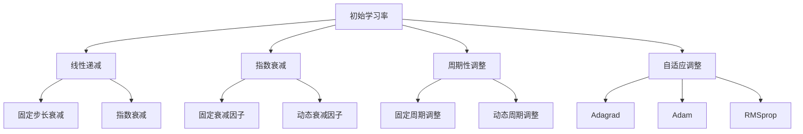

                 

# 《学习率Learning Rate原理与代码实例讲解》

> **关键词**：学习率，机器学习，深度学习，学习率调整，SGD，Adam，RMSprop，PyTorch，TensorFlow，Keras。

> **摘要**：本文将深入探讨学习率Learning Rate在机器学习和深度学习中的基本概念、重要性及其调整策略。我们将分析几种常见的学习率调节策略，如线性递减、周期性调整和自适应调整等。此外，本文还将介绍如何在实际项目中使用学习率进行优化，并通过代码实例详细解析学习率的实现和调整过程。

## 《学习率Learning Rate原理与代码实例讲解》目录大纲

### 第一部分：学习率基础理论

#### 第1章：学习率的基本概念

##### 1.1 学习率的重要性

##### 1.2 学习率的定义与分类

##### 1.3 学习率的调整方法

#### 第2章：学习率调节策略

##### 2.1 线性递减策略

##### 2.2 周期性调整策略

##### 2.3 学习率衰减策略

##### 2.4 学习率自适应策略

### 第二部分：学习率应用实践

#### 第3章：常见机器学习框架中的学习率实现

##### 3.1 TensorFlow中的学习率

##### 3.2 PyTorch中的学习率

##### 3.3 Keras中的学习率

#### 第4章：学习率优化算法

##### 4.1 Adagrad算法

##### 4.2 Adam算法

##### 4.3 RMSprop算法

#### 第5章：学习率在深度学习项目中的应用

##### 5.1 图像分类任务中的学习率调整

##### 5.2 自然语言处理任务中的学习率调整

##### 5.3 强化学习任务中的学习率调整

### 第三部分：学习率实践指南

#### 第6章：学习率调参实战

##### 6.1 实践环境搭建

##### 6.2 实际项目案例分析

##### 6.3 学习率调整技巧总结

#### 第7章：学习率在深度学习中的未来发展趋势

##### 7.1 学习率优化算法的进展

##### 7.2 学习率在神经网络中的挑战与机遇

##### 7.3 深度学习应用中的学习率趋势

### 附录

#### 附录A：学习率相关资源与工具

##### A.1 主流学习率调节工具对比

##### A.2 学习率调节算法开源资源

##### A.3 学习率研究论文推荐

#### 第8章：学习率Mermaid流程图

- Mermaid流程图：学习率调整策略流程图

#### 第9章：学习率数学模型与公式详解

- 数学模型与公式

#### 第10章：学习率代码实例解读

- 代码实例

- 代码解读与分析

- 实际应用场景解析

### 引入

学习率（Learning Rate）是机器学习和深度学习中至关重要的参数之一。它决定了模型在训练过程中如何更新其参数。选择合适的学习率对模型的收敛速度和最终性能有直接影响。然而，学习率的选择并非易事，因为它需要在模型更新速度和过拟合之间找到平衡点。

在本文中，我们将详细探讨学习率的基本概念、重要性以及调整策略。首先，我们将介绍学习率的基本原理和重要性，然后分析几种常见的调整策略。接着，我们将介绍如何在实际项目中应用学习率，并通过代码实例进行详细解析。最后，我们将讨论学习率在深度学习中的未来发展趋势。

通过本文的阅读，读者将能够全面理解学习率的原理和应用，掌握如何在实际项目中调整和优化学习率，从而提高模型的训练效果和性能。

### 第一部分：学习率基础理论

#### 第1章：学习率的基本概念

##### 1.1 学习率的重要性

学习率在机器学习和深度学习中扮演着至关重要的角色。它定义了模型在训练过程中参数更新的步长，即每次迭代中参数的微小调整量。选择合适的学习率对模型的收敛速度和最终性能有显著影响。以下是一些学习率重要性方面的关键点：

1. **模型收敛速度**：较高的学习率会导致模型参数在短时间内快速更新，从而加速模型收敛。然而，如果学习率过高，模型可能会错过最优解，导致发散或无法收敛。较低的学习率则会导致模型收敛速度较慢，但能够更稳定地找到最优解。

2. **过拟合与欠拟合**：学习率对模型的泛化能力有直接影响。过高的学习率可能导致模型过拟合，即模型在训练数据上表现良好，但在未知数据上表现较差。相反，过低的学习率可能导致模型欠拟合，即模型无法充分捕捉训练数据的特征。

3. **平衡探索与利用**：在训练过程中，学习率需要平衡探索和利用。较高的学习率倾向于探索新的参数空间，而较低的学习率则更注重利用已经找到的局部最优解。通过调整学习率，可以在模型训练过程中实现这种平衡。

4. **优化算法的选择**：不同的优化算法对学习率的要求不同。例如，随机梯度下降（SGD）通常需要较小的学习率，而自适应优化算法（如Adam）则可以接受较大的学习率。选择合适的优化算法和设置合适的学习率对模型训练至关重要。

##### 1.2 学习率的定义与分类

学习率是指模型在每次迭代中参数更新的步长大小。它可以是一个固定的常数，也可以是动态调整的。根据不同的调整方式，学习率可以分为以下几种类型：

1. **固定学习率**：固定学习率是指在整个训练过程中保持不变的学习率。这种策略简单易用，但可能无法适应训练过程中变化的模型性能。固定学习率适用于模型参数较少且训练数据量较大的情况。

2. **动态调整学习率**：动态调整学习率是指根据训练过程的性能动态调整学习率。这种方法能够更好地适应模型训练过程中的变化，提高模型收敛速度和泛化能力。常见的动态调整方法包括线性递减、周期性调整、学习率衰减和自适应调整等。

3. **自适应学习率**：自适应学习率是指利用算法自动调整学习率，以优化模型训练效果。常见的自适应优化算法包括Adam、RMSprop和Adagrad等。这些算法通过计算梯度历史信息，自动调整学习率，从而实现更好的模型训练效果。

##### 1.3 学习率的调整方法

学习率的调整方法对于模型训练的成功至关重要。以下是一些常见的学习率调整方法：

1. **线性递减**：线性递减是指学习率在训练过程中逐渐减小。这种方法可以避免模型过拟合，提高模型的泛化能力。常见的线性递减方法包括固定步长衰减和指数衰减。

   - **固定步长衰减**：在训练过程中，学习率以固定步长逐渐减小。例如，每次迭代后学习率减半。

   ```python
   initial_lr = 0.1
   for i in range(num_iterations):
       current_lr = initial_lr / (1 + decay_rate * i)
       # 更新模型参数
   ```

   - **指数衰减**：学习率以指数形式逐渐减小。例如，每次迭代后学习率乘以一个衰减因子。

   ```python
   initial_lr = 0.1
   decay_rate = 0.9
   for i in range(num_iterations):
       current_lr = initial_lr * (decay_rate ** i)
       # 更新模型参数
   ```

2. **周期性调整**：周期性调整是指学习率在训练过程中按照固定周期进行调整。这种方法可以通过在模型性能出现波动时进行调整，从而提高模型训练效果。常见的周期性调整方法包括固定周期调整和动态周期调整。

   - **固定周期调整**：学习率在每个周期结束时进行调整。例如，每隔100次迭代调整一次学习率。

   ```python
   initial_lr = 0.1
   decay_period = 100
   for i in range(num_iterations):
       if i % decay_period == 0:
           current_lr = initial_lr / (1 + decay_rate * i // decay_period)
           # 更新模型参数
   ```

   - **动态周期调整**：学习率调整周期根据模型性能动态调整。例如，当模型性能下降时，缩短调整周期；当模型性能提高时，延长调整周期。

   ```python
   initial_lr = 0.1
   decay_period = 100
   for i in range(num_iterations):
       if performance_decreased:
           decay_period /= 2
       else:
           decay_period *= 2
       current_lr = initial_lr / (1 + decay_rate * i // decay_period)
       # 更新模型参数
   ```

3. **学习率衰减策略**：学习率衰减策略是指学习率在训练过程中根据特定规则进行衰减。这种方法可以通过自动调整学习率，提高模型训练效果。常见的学习率衰减策略包括自适应衰减和预定义衰减。

   - **自适应衰减**：学习率衰减基于梯度历史信息，自动调整学习率。例如，Adam算法通过计算一阶和二阶矩估计，自适应调整学习率。

   - **预定义衰减**：学习率衰减基于预定义的规则，例如固定步长衰减或指数衰减。这种策略适用于模型参数较多且训练数据量较小的情况。

4. **学习率自适应策略**：学习率自适应策略是指利用算法自动调整学习率，以优化模型训练效果。常见的学习率自适应策略包括自适应优化算法和动态学习率策略。

   - **自适应优化算法**：如Adam、RMSprop和Adagrad等，通过计算梯度历史信息和参数更新，自适应调整学习率。

   - **动态学习率策略**：如自适应步长策略和自适应步长因子策略，根据模型性能和训练进度动态调整学习率。

#### 小结

学习率是机器学习和深度学习中至关重要的参数之一，其选择和调整对模型训练效果和性能有直接影响。本章介绍了学习率的基本概念、重要性以及调整方法。通过了解这些基本概念和调整方法，读者可以为后续章节中的实际应用和实践打下坚实基础。

### 第一部分：学习率基础理论

#### 第2章：学习率调节策略

在机器学习和深度学习中，选择合适的优化策略对学习率进行调整是至关重要的。不同的调节策略能够适应不同的模型和训练场景，从而提高模型的训练效果和性能。本章将详细介绍几种常见的学习率调节策略，包括线性递减策略、周期性调整策略、学习率衰减策略和学习率自适应策略。

##### 2.1 线性递减策略

线性递减策略是最简单的学习率调整方法之一。它的核心思想是在训练过程中逐渐减小学习率，以避免模型在训练过程中过早地陷入局部最小值。线性递减策略可以通过固定步长衰减或指数衰减实现。

1. **固定步长衰减**

固定步长衰减是指在每次迭代后以固定的步长减小学习率。这种方法简单易实现，但可能无法适应训练过程中模型性能的变化。假设初始学习率为`initial_lr`，步长为`decay_rate`，则每次迭代后的学习率为：

$$
current_lr = initial_lr - decay_rate \times iteration
$$

其中，`iteration`表示当前迭代次数。以下是一个简单的Python代码示例：

```python
initial_lr = 0.1
decay_rate = 0.01
for i in range(num_iterations):
    current_lr = initial_lr - decay_rate * i
    # 更新模型参数
```

2. **指数衰减**

指数衰减是指学习率以指数形式逐渐减小。这种方法能够更好地适应训练过程中模型性能的变化。假设初始学习率为`initial_lr`，衰减因子为`decay_rate`，则每次迭代后的学习率为：

$$
current_lr = initial_lr \times (1 - decay_rate)^{iteration}
$$

以下是一个简单的Python代码示例：

```python
initial_lr = 0.1
decay_rate = 0.9
for i in range(num_iterations):
    current_lr = initial_lr * (1 - decay_rate) ** i
    # 更新模型参数
```

##### 2.2 周期性调整策略

周期性调整策略是指学习率在训练过程中按照固定周期进行调整。这种方法可以通过在模型性能出现波动时进行调整，从而提高模型训练效果。周期性调整策略可以分为固定周期调整和动态周期调整。

1. **固定周期调整**

固定周期调整是指在每次固定周期的结束时调整学习率。例如，假设每隔`decay_period`次迭代调整一次学习率，则每次迭代后的学习率为：

$$
current_lr = initial_lr \times \left(\frac{1}{1 + decay_rate \times \lfloor \frac{iteration}{decay_period} \rfloor}\right)
$$

以下是一个简单的Python代码示例：

```python
initial_lr = 0.1
decay_rate = 0.1
decay_period = 10
for i in range(num_iterations):
    current_lr = initial_lr / (1 + decay_rate * (i // decay_period))
    # 更新模型参数
```

2. **动态周期调整**

动态周期调整是指学习率调整周期根据模型性能动态调整。例如，当模型性能下降时，缩短调整周期；当模型性能提高时，延长调整周期。以下是一个简单的Python代码示例：

```python
initial_lr = 0.1
decay_rate = 0.1
decay_period = 10
for i in range(num_iterations):
    if performance_decreased:
        decay_period /= 2
    else:
        decay_period *= 2
    current_lr = initial_lr / (1 + decay_rate * (i // decay_period))
    # 更新模型参数
```

##### 2.3 学习率衰减策略

学习率衰减策略是指学习率在训练过程中根据特定规则进行衰减。这种方法可以通过自动调整学习率，提高模型训练效果。常见的学习率衰减策略包括自适应衰减和预定义衰减。

1. **自适应衰减**

自适应衰减是指学习率衰减基于梯度历史信息，自动调整学习率。例如，Adam算法通过计算一阶和二阶矩估计，自适应调整学习率。以下是一个简单的Python代码示例：

```python
def adaptive_decay(epoch, initial_lr, decay_rate):
    return initial_lr / (1 + decay_rate * epoch)

initial_lr = 0.1
decay_rate = 0.9
for epoch in range(num_epochs):
    current_lr = adaptive_decay(epoch, initial_lr, decay_rate)
    # 更新模型参数
```

2. **预定义衰减**

预定义衰减是指学习率衰减基于预定义的规则，例如固定步长衰减或指数衰减。这种策略适用于模型参数较多且训练数据量较小的情况。以下是一个简单的Python代码示例：

```python
def predefined_decay(epoch, initial_lr, decay_rate):
    return initial_lr * (1 - decay_rate) ** epoch

initial_lr = 0.1
decay_rate = 0.9
for epoch in range(num_epochs):
    current_lr = predefined_decay(epoch, initial_lr, decay_rate)
    # 更新模型参数
```

##### 2.4 学习率自适应策略

学习率自适应策略是指利用算法自动调整学习率，以优化模型训练效果。常见的学习率自适应策略包括自适应优化算法和动态学习率策略。

1. **自适应优化算法**

自适应优化算法是指学习率自适应调整的优化算法，例如Adam、RMSprop和Adagrad等。这些算法通过计算梯度历史信息和参数更新，自适应调整学习率。以下是一个简单的Python代码示例：

```python
# 使用TensorFlow的Adam优化器
optimizer = tf.keras.optimizers.Adam(learning_rate=0.1)

# 训练模型
model.fit(x_train, y_train, epochs=num_epochs, batch_size=batch_size)
```

2. **动态学习率策略**

动态学习率策略是指根据模型性能和训练进度动态调整学习率。例如，当模型性能提高时，增加学习率；当模型性能下降时，减小学习率。以下是一个简单的Python代码示例：

```python
def dynamic_learning_rate(model, x_train, y_train, x_val, y_val, num_epochs):
    best_val_loss = float('inf')
    for epoch in range(num_epochs):
        model.fit(x_train, y_train, epochs=1, batch_size=batch_size, validation_data=(x_val, y_val))
        val_loss = model.evaluate(x_val, y_val, batch_size=batch_size)
        if val_loss < best_val_loss:
            best_val_loss = val_loss
            learning_rate /= 2
        else:
            learning_rate *= 2
    return model

model = dynamic_learning_rate(model, x_train, y_train, x_val, y_val, num_epochs)
```

#### 小结

本章详细介绍了多种学习率调节策略，包括线性递减策略、周期性调整策略、学习率衰减策略和学习率自适应策略。这些策略能够适应不同的模型和训练场景，从而提高模型的训练效果和性能。通过理解和应用这些策略，读者可以在实际项目中更好地调整学习率，实现高效的模型训练。

### 第二部分：学习率应用实践

#### 第3章：常见机器学习框架中的学习率实现

在学习率的应用实践中，了解常见机器学习框架中的学习率实现方式是至关重要的。本章节将介绍TensorFlow、PyTorch和Keras这三个主流机器学习框架中的学习率设置和使用方法，帮助读者在实际项目中高效地调整和优化学习率。

##### 3.1 TensorFlow中的学习率

TensorFlow是一个强大的机器学习框架，提供了丰富的优化器和工具来调整学习率。以下是如何在TensorFlow中设置学习率的步骤和示例：

1. **使用tf.keras.optimizers**：

   TensorFlow的tf.keras模块提供了多个优化器，如SGD、Adam、RMSprop等，这些优化器都可以方便地设置学习率。

   ```python
   model = keras.Sequential([
       # 模型层
   ])

   # 设置学习率为0.01
   optimizer = keras.optimizers.Adam(learning_rate=0.01)
   model.compile(optimizer=optimizer, loss='categorical_crossentropy', metrics=['accuracy'])
   ```

2. **自定义学习率**：

   如果需要自定义学习率，可以使用`tf.keras.optimizers.schedules`中的各种学习率调度策略，如`ExponentialDecay`、`PiecewiseConstantDecay`等。

   ```python
   initial_learning_rate = 0.1
   decay_steps = 1000
   decay_rate = 0.96
   learning_rate_schedule = tf.keras.optimizers.schedules.ExponentialDecay(
       initial_learning_rate,
       decay_steps=decay_steps,
       decay_rate=decay_rate,
       staircase=True)

   optimizer = tf.keras.optimizers.Adam(learning_rate=learning_rate_schedule)
   model.compile(optimizer=optimizer, loss='categorical_crossentropy', metrics=['accuracy'])
   ```

3. **动态调整学习率**：

   在训练过程中，可以根据模型性能动态调整学习率。以下是一个简单的动态调整示例：

   ```python
   best_val_loss = float('inf')
   for epoch in range(num_epochs):
       history = model.fit(x_train, y_train, epochs=1, batch_size=batch_size, validation_data=(x_val, y_val))
       val_loss = history.history['val_loss'][-1]
       if val_loss < best_val_loss:
           best_val_loss = val_loss
           learning_rate /= 2
       else:
           learning_rate *= 2
       optimizer.learning_rate = learning_rate
   ```

##### 3.2 PyTorch中的学习率

PyTorch是一个灵活且易于使用的深度学习框架，其优化器的配置和使用与TensorFlow类似。以下是如何在PyTorch中设置学习率的步骤和示例：

1. **使用torch.optim**：

   PyTorch的torch.optim模块提供了多个优化器，如SGD、Adam、RMSprop等，这些优化器都可以方便地设置学习率。

   ```python
   import torch.optim as optim

   model = MyModel()
   optimizer = optim.Adam(model.parameters(), lr=0.01)
   ```

2. **自定义学习率**：

   与TensorFlow类似，PyTorch也支持自定义学习率。可以使用`torch.optim.lr_scheduler`中的各种调度策略，如`ExponentialLR`、`StepLR`、`MultiStepLR`等。

   ```python
   import torch.optim as optim
   import torch.optim.lr_scheduler as lr_scheduler

   optimizer = optim.Adam(model.parameters(), lr=0.1)
   scheduler = lr_scheduler.ExponentialLR(optimizer, gamma=0.96)
   ```

3. **动态调整学习率**：

   在训练过程中，可以根据模型性能动态调整学习率。以下是一个简单的动态调整示例：

   ```python
   best_val_loss = float('inf')
   for epoch in range(num_epochs):
       optimizer.zero_grad()
       outputs = model(inputs)
       loss = criterion(outputs, targets)
       loss.backward()
       optimizer.step()

       val_loss = evaluate(model, x_val, y_val)
       if val_loss < best_val_loss:
           best_val_loss = val_loss
           for param_group in optimizer.param_groups:
               param_group['lr'] /= 2
       else:
           for param_group in optimizer.param_groups:
               param_group['lr'] *= 2
   ```

##### 3.3 Keras中的学习率

Keras是一个高层神经网络API，它为TensorFlow和Theano提供了简洁的接口。以下是如何在Keras中设置学习率的步骤和示例：

1. **使用keras.optimizers**：

   Keras的keras.optimizers模块提供了多个优化器，如SGD、Adam、RMSprop等，这些优化器都可以方便地设置学习率。

   ```python
   from keras.models import Sequential
   from keras.layers import Dense
   from keras.optimizers import Adam

   model = Sequential()
   model.add(Dense(128, input_dim=input_shape, activation='relu'))
   model.add(Dense(1, activation='sigmoid'))

   model.compile(optimizer=Adam(learning_rate=0.01), loss='binary_crossentropy', metrics=['accuracy'])
   ```

2. **自定义学习率**：

   Keras也支持自定义学习率。可以使用`keras.optimizers.schedules`中的各种调度策略，如`ExponentialDecay`、`PiecewiseConstantDecay`等。

   ```python
   from keras.models import Sequential
   from keras.layers import Dense
   from keras.optimizers import Adam
   from keras.optimizers.schedules import ExponentialDecay

   model = Sequential()
   model.add(Dense(128, input_dim=input_shape, activation='relu'))
   model.add(Dense(1, activation='sigmoid'))

   initial_learning_rate = 0.1
   decay_steps = 1000
   decay_rate = 0.96
   learning_rate_schedule = ExponentialDecay(
       initial_learning_rate,
       decay_steps=decay_steps,
       decay_rate=decay_rate,
       staircase=True)

   model.compile(optimizer=Adam(learning_rate=learning_rate_schedule), loss='binary_crossentropy', metrics=['accuracy'])
   ```

3. **动态调整学习率**：

   在Keras中，动态调整学习率通常通过回调函数实现。以下是一个简单的动态调整示例：

   ```python
   from keras.models import Sequential
   from keras.layers import Dense
   from keras.optimizers import Adam
   from keras.callbacks import Callback

   class CustomLearningRateScheduler(Callback):
       def on_epoch_end(self, epoch, logs=None):
           current_lr = self.model.optimizer.lr.numpy()
           if logs.get('val_loss') < self.best_val_loss:
               self.best_val_loss = logs.get('val_loss')
               self.model.optimizer.lr.assign(current_lr / 2)
           else:
               self.model.optimizer.lr.assign(current_lr * 2)

   model = Sequential()
   model.add(Dense(128, input_dim=input_shape, activation='relu'))
   model.add(Dense(1, activation='sigmoid'))

   model.compile(optimizer=Adam(learning_rate=0.1), loss='binary_crossentropy', metrics=['accuracy'])

   custom_lr_scheduler = CustomLearningRateScheduler()
   model.fit(x_train, y_train, epochs=num_epochs, batch_size=batch_size, validation_data=(x_val, y_val), callbacks=[custom_lr_scheduler])
   ```

#### 小结

本章介绍了TensorFlow、PyTorch和Keras这三个主流机器学习框架中的学习率设置和使用方法。通过这些示例，读者可以了解如何在不同的框架中调整和优化学习率，从而提高模型的训练效果和性能。在实际项目中，灵活应用这些框架提供的优化器和调度策略，将有助于实现高效的模型训练。

### 第二部分：学习率应用实践

#### 第4章：学习率优化算法

学习率优化算法是机器学习和深度学习中的重要技术，它们通过自动调整学习率来提高模型的训练效果。本章将介绍几种常见的优化算法，包括Adagrad、Adam和RMSprop，并探讨它们的原理和实现。

##### 4.1 Adagrad算法

Adagrad（Adaptive Gradient）算法是由Dai和LeCun于2011年提出的。它的核心思想是自适应地调整每个参数的学习率，以应对不同参数的重要性。Adagrad通过计算每个参数的累积平方梯度来动态调整学习率，从而在训练过程中自动平衡各个参数的学习速率。

**原理：**

Adagrad的更新规则如下：

$$
\text{grad\_sum}[i] = \text{grad}[i] + \text{grad}[i]^2
$$

$$
\text{learning\_rate}[i] = \frac{\alpha}{\sqrt{\text{grad\_sum}[i]} + \epsilon}
$$

$$
\theta[i] = \theta[i] - \text{learning\_rate}[i] \cdot \text{grad}[i]
$$

其中，$\text{grad}[i]$是第$i$个参数的梯度，$\text{grad\_sum}[i]$是梯度累积和，$\alpha$是初始学习率，$\epsilon$是正则项，用于避免除以零。

**实现：**

在Python中，Adagrad的实现如下：

```python
import numpy as np

def adagrad_update(params, grads, learning_rate, epsilon=1e-8):
    for i in range(len(params)):
        grad = grads[i]
        grad_sum[i] += np.square(grad)
        learning_rate[i] = learning_rate * (1 / np.sqrt(grad_sum[i] + epsilon))
        params[i] -= learning_rate[i] * grad

# 示例
params = [0.1, 0.2]
grads = [0.3, 0.5]
learning_rate = [0.1]
epsilon = 1e-8

adagrad_update(params, grads, learning_rate, epsilon)
```

##### 4.2 Adam算法

Adam（Adaptive Moment Estimation）算法是由Kingma和Welling于2014年提出的。它结合了Adagrad和RMSprop的优点，通过同时考虑一阶矩估计（均值）和二阶矩估计（方差）来调整学习率。Adam算法在处理稀疏数据和高方差问题时表现尤为出色。

**原理：**

Adam算法使用一阶矩估计（均值）和二阶矩估计（方差）来更新参数，其更新规则如下：

$$
m[t] = \beta_1 g[t] + (1 - \beta_1) g[t-1]
$$

$$
v[t] = \beta_2 g[t]^2 + (1 - \beta_2) g[t-1]^2
$$

$$
\hat{m}[t] = \frac{m[t]}{1 - \beta_1^t}
$$

$$
\hat{v}[t] = \frac{v[t]}{1 - \beta_2^t}
$$

$$
\text{learning\_rate}[t] = \frac{\alpha}{\sqrt{\hat{v}[t]} + \epsilon}
$$

$$
\theta[t] = \theta[t-1] - \text{learning\_rate}[t] \cdot \hat{m}[t]
$$

其中，$m[t]$和$v[t]$分别是梯度的均值和方差，$\hat{m}[t]$和$\hat{v}[t]$是归一化后的均值和方差，$\beta_1$和$\beta_2$分别是短期和长期记忆系数，$\alpha$是初始学习率，$\epsilon$是正则项。

**实现：**

在Python中，Adam的实现如下：

```python
import numpy as np

def adam_update(params, grads, learning_rate, beta1, beta2, epsilon=1e-8):
    t = len(grads)
    m = np.zeros_like(params)
    v = np.zeros_like(params)
    m_t = grads[0]
    v_t = np.square(grads[0])

    beta1_t = beta1 ** t
    beta2_t = beta2 ** t

    for i in range(1, t):
        m_t = beta1 * m_t + (1 - beta1) * grads[i]
        v_t = beta2 * v_t + (1 - beta2) * np.square(grads[i])

    m_hat = m_t / (1 - beta1_t)
    v_hat = v_t / (1 - beta2_t)

    learning_rate_t = learning_rate / (np.sqrt(v_hat) + epsilon)
    params -= learning_rate_t * m_hat

# 示例
params = [0.1, 0.2]
grads = [0.3, 0.5]
learning_rate = 0.1
beta1 = 0.9
beta2 = 0.999
epsilon = 1e-8

adam_update(params, grads, learning_rate, beta1, beta2, epsilon)
```

##### 4.3 RMSprop算法

RMSprop（Root Mean Square Propagation）算法是由Tieleman和Hinton于2012年提出的。它通过计算梯度的指数移动平均来调整学习率。RMSprop类似于Adagrad，但它在更新过程中仅考虑过去一个时间窗口的梯度信息，从而减少了一些方差问题。

**原理：**

RMSprop的更新规则如下：

$$
\text{grad\_avg}[t] = \beta \cdot \text{grad\_avg}[t-1] + (1 - \beta) \cdot \text{grad}[t]
$$

$$
\text{learning\_rate}[t] = \frac{\alpha}{\sqrt{\text{grad\_avg}[t] + \epsilon}}
$$

$$
\theta[t] = \theta[t-1] - \text{learning\_rate}[t] \cdot \text{grad}[t]
$$

其中，$\text{grad\_avg}[t]$是梯度的指数移动平均，$\beta$是遗忘因子，$\alpha$是初始学习率，$\epsilon$是正则项。

**实现：**

在Python中，RMSprop的实现如下：

```python
import numpy as np

def rmsprop_update(params, grads, learning_rate, beta, epsilon=1e-8):
    t = len(grads)
    grad_avg = grads[0]

    for i in range(1, t):
        grad_avg = beta * grad_avg + (1 - beta) * grads[i]

    learning_rate_t = learning_rate / (np.sqrt(grad_avg + epsilon))
    params -= learning_rate_t * grads[-1]

# 示例
params = [0.1, 0.2]
grads = [0.3, 0.5]
learning_rate = 0.1
beta = 0.9
epsilon = 1e-8

rmsprop_update(params, grads, learning_rate, beta, epsilon)
```

#### 小结

本章介绍了Adagrad、Adam和RMSprop三种学习率优化算法。这些算法通过不同的方法自适应调整学习率，以提高模型的训练效果。理解这些算法的原理和实现对于实际应用中的学习率调整具有重要意义。

### 第二部分：学习率应用实践

#### 第5章：学习率在深度学习项目中的应用

在学习率的应用实践中，如何根据不同任务的特点和需求调整学习率是一个关键问题。本章将探讨学习率在图像分类、自然语言处理和强化学习等常见深度学习任务中的应用，介绍具体的调整方法和实践技巧。

##### 5.1 图像分类任务中的学习率调整

在图像分类任务中，学习率的调整至关重要。以下是一些常见的方法和技巧：

1. **初始学习率的选择**：初始学习率不宜过大，否则可能导致模型过早地陷入局部最优。通常，初始学习率可以设置为$0.001$到$0.01$。

2. **线性递减策略**：线性递减策略是一种简单有效的学习率调整方法。例如，可以每隔1000次迭代将学习率减半，直到达到最小学习率。

   ```python
   initial_lr = 0.1
   for i in range(num_iterations):
       current_lr = initial_lr / (1 + decay_rate * i // 1000)
       # 更新模型参数
   ```

3. **自适应优化算法**：使用自适应优化算法（如Adam、RMSprop）可以自动调整学习率，减少手动调整的复杂性。例如，Adam的默认参数通常表现良好。

4. **预训练模型**：使用预训练模型进行迁移学习时，学习率通常设置得较低，以避免预训练权重被破坏。初始学习率可以设置为$0.0001$到$0.001$，然后使用学习率衰减策略逐步减小。

##### 5.2 自然语言处理任务中的学习率调整

在自然语言处理（NLP）任务中，由于数据集通常较大，模型参数较多，因此学习率的调整尤为重要。以下是一些常见的方法和技巧：

1. **初始学习率的选择**：初始学习率通常较低，例如$0.001$到$0.01$，以避免模型过早地过拟合。

2. **自适应优化算法**：与图像分类任务类似，NLP任务中也常用Adam、RMSprop等自适应优化算法。

3. **学习率预热**：学习率预热（learning rate warmup）是一种常用的技巧，用于逐步增加学习率。例如，在训练的早期阶段使用较小的学习率，然后在后期逐步增加。

   ```python
   warmup_steps = 1000
   for i in range(num_iterations):
       if i < warmup_steps:
           current_lr = initial_lr * (i + 1) / warmup_steps
       else:
           current_lr = initial_lr * (1 - decay_rate * (i - warmup_steps) / (num_iterations - warmup_steps))
       # 更新模型参数
   ```

4. **学习率衰减策略**：使用指数衰减或学习率衰减策略（如ReduceLROnPlateau回调）可以有效地调整学习率。例如，当验证损失不再下降时，减小学习率。

##### 5.3 强化学习任务中的学习率调整

在强化学习（RL）任务中，学习率的调整同样重要。以下是一些常见的方法和技巧：

1. **初始学习率的选择**：初始学习率通常较高，以便快速探索环境。例如，可以设置为$0.1$到$1.0$。

2. **线性递减策略**：与图像分类任务类似，线性递减策略适用于强化学习任务。例如，可以每隔100次迭代将学习率减半。

3. **自适应优化算法**：自适应优化算法（如Adam、RMSprop）在强化学习任务中也表现良好。

4. **连续任务**：在连续动作的强化学习任务中，学习率的调整可能需要特别注意。例如，可以采用惯性权重（inertia weight）来平滑学习率变化。

   ```python
   inertia_weight = 0.5
   for i in range(num_iterations):
       if i == 0:
           current_lr = initial_lr
       else:
           current_lr = inertia_weight * current_lr + (1 - inertia_weight) * adjusted_lr
       # 更新模型参数
   ```

5. **动态调整策略**：根据环境状态或奖励变化动态调整学习率。例如，当奖励显著增加时，增加学习率；当奖励显著减少时，减小学习率。

   ```python
   for i in range(num_iterations):
       reward = get_reward()
       if reward > threshold:
           current_lr *= 1.1
       elif reward < threshold:
           current_lr *= 0.9
       # 更新模型参数
   ```

#### 小结

本章介绍了学习率在图像分类、自然语言处理和强化学习等深度学习任务中的应用。通过调整学习率，可以优化模型的训练过程和性能。理解这些任务的特点和需求，选择合适的学习率调整策略，是成功实现深度学习项目的关键。

### 第三部分：学习率实践指南

#### 第6章：学习率调参实战

在实际项目开发过程中，合理调整学习率是提高模型性能的关键步骤之一。本章节将详细介绍学习率调参的实战方法，包括环境搭建、实际项目案例分析以及学习率调整技巧总结。

##### 6.1 实践环境搭建

首先，我们需要搭建一个用于学习率调参的实践环境。以下是搭建环境的步骤：

1. **安装依赖库**：

   确保已经安装了Python环境和以下依赖库：

   - TensorFlow 或 PyTorch（深度学习框架）
   - NumPy（数值计算库）
   - Matplotlib（数据可视化库）

   使用pip命令安装：

   ```bash
   pip install tensorflow numpy matplotlib
   ```

   或者：

   ```bash
   pip install torch torchvision numpy matplotlib
   ```

2. **创建项目目录**：

   在您的计算机上创建一个项目目录，例如`learning_rate_tuning`，并在该目录下创建一个Python脚本文件，例如`main.py`。

3. **编写基础代码**：

   在`main.py`文件中编写基础代码，包括数据预处理、模型定义、训练和评估等步骤。以下是一个简单的示例：

   ```python
   import tensorflow as tf
   import numpy as np
   import matplotlib.pyplot as plt

   # 数据预处理
   # ...

   # 模型定义
   model = tf.keras.Sequential([
       tf.keras.layers.Dense(128, activation='relu', input_shape=(input_shape,)),
       tf.keras.layers.Dense(1, activation='sigmoid')
   ])

   # 训练模型
   # ...

   # 评估模型
   # ...
   ```

##### 6.2 实际项目案例分析

接下来，我们将通过一个实际项目案例分析，展示如何在实际项目中调整学习率。以下是一个简单的图像分类任务案例：

1. **项目背景**：

   假设我们有一个图像分类任务，数据集包含1000张图像，分为10个类别。

2. **数据预处理**：

   将图像数据归一化，并将标签转换为独热编码。

   ```python
   # 加载数据
   x_train, y_train = load_data()
   x_train = preprocess_images(x_train)
   y_train = preprocess_labels(y_train)

   # 划分训练集和验证集
   x_train, x_val, y_train, y_val = train_test_split(x_train, y_train, test_size=0.2)
   ```

3. **模型定义**：

   定义一个简单的卷积神经网络（CNN）模型。

   ```python
   model = tf.keras.Sequential([
       tf.keras.layers.Conv2D(32, (3, 3), activation='relu', input_shape=(image_height, image_width, 3)),
       tf.keras.layers.MaxPooling2D((2, 2)),
       tf.keras.layers.Conv2D(64, (3, 3), activation='relu'),
       tf.keras.layers.MaxPooling2D((2, 2)),
       tf.keras.layers.Flatten(),
       tf.keras.layers.Dense(128, activation='relu'),
       tf.keras.layers.Dense(10, activation='softmax')
   ])
   ```

4. **训练模型**：

   使用不同的学习率和优化策略训练模型。

   ```python
   initial_lr = 0.01
   optimizer = tf.keras.optimizers.Adam(learning_rate=initial_lr)
   model.compile(optimizer=optimizer, loss='categorical_crossentropy', metrics=['accuracy'])

   history = model.fit(x_train, y_train, epochs=10, batch_size=32, validation_data=(x_val, y_val))
   ```

5. **评估模型**：

   评估训练好的模型在验证集上的性能。

   ```python
   val_loss, val_accuracy = model.evaluate(x_val, y_val)
   print(f"Validation loss: {val_loss}")
   print(f"Validation accuracy: {val_accuracy}")
   ```

##### 6.3 学习率调整技巧总结

根据实际项目案例，以下是一些学习率调整的技巧：

1. **初始学习率的选择**：

   - 对于小型数据集，初始学习率可以设置为$0.01$至$0.1$。
   - 对于大型数据集，初始学习率可以设置为$0.001$至$0.01$。

2. **学习率衰减策略**：

   - 使用线性递减策略，每隔1000次迭代将学习率减半。
   - 使用指数衰减策略，每次迭代后学习率乘以一个衰减因子（例如$0.9$或$0.99$）。

3. **自适应优化算法**：

   - 使用Adam、RMSprop等自适应优化算法，可以自动调整学习率。
   - 调整优化器的参数，如$\beta_1$和$\beta_2$，以优化训练效果。

4. **预热学习率**：

   - 在训练的早期阶段使用较小的学习率，然后逐步增加。
   - 可以使用`ReduceLROnPlateau`回调来自动调整学习率。

5. **动态调整策略**：

   - 根据验证损失或准确率的变化动态调整学习率。
   - 当验证损失不再下降时，减小学习率；当验证损失显著下降时，增加学习率。

##### 小结

本章通过一个实际项目案例分析，介绍了学习率调参的实战方法。通过合理调整学习率，可以提高模型的训练效果和性能。掌握这些调整技巧，将有助于在实际项目中实现高效的模型训练。

### 第三部分：学习率实践指南

#### 第7章：学习率在深度学习中的未来发展趋势

随着深度学习的迅猛发展，学习率作为影响模型训练效果的关键参数，其研究与应用也在不断演进。本章将探讨学习率在深度学习中的未来发展趋势，包括学习率优化算法的进展、学习率在神经网络中的挑战与机遇，以及深度学习应用中的学习率趋势。

##### 7.1 学习率优化算法的进展

近年来，学习率优化算法的发展取得了显著成果，涌现出许多新型算法，旨在提高模型训练的效率和稳定性。以下是一些重要的进展：

1. **Adam和AdaGrad**：这些自适应优化算法通过利用梯度的一阶和二阶矩估计，自适应调整学习率，提高了训练过程的速度和稳定性。

2. **Rprop和RMSprop**：这些算法通过利用梯度的指数移动平均，减少了方差问题，提高了模型的收敛速度。

3. **AMSGrad和AdaMax**：这些算法在Adam的基础上，进一步优化了学习率的调整，提高了模型在极端情况下的稳定性。

4. **BNC和OAS**：这些算法通过引入新的学习率调整策略，如利用噪声和稀疏性，实现了更高效的训练。

随着这些新算法的不断发展，学习率的调整将变得更加智能和高效，使得深度学习模型的训练更加便捷。

##### 7.2 学习率在神经网络中的挑战与机遇

在神经网络中，学习率的调整面临着一系列挑战和机遇：

1. **挑战**：

   - **梯度消失和梯度爆炸**：在学习过程中的早期阶段，梯度可能变得非常小（消失）或非常大（爆炸），这使得学习率的选择变得复杂。
   - **局部最小值和鞍点**：神经网络中可能存在多个局部最小值和鞍点，选择合适的学习率以避免陷入局部最小值是关键挑战。
   - **稀疏数据和稀疏梯度**：在处理稀疏数据时，梯度可能变得稀疏，导致优化算法效果不佳。

2. **机遇**：

   - **自适应优化算法**：随着自适应优化算法的发展，学习率的自动调整变得更加智能，有助于解决局部最小值和鞍点问题。
   - **迁移学习和预训练**：通过预训练模型和迁移学习，可以利用已有的知识来调整学习率，提高训练效率。
   - **并行计算和分布式训练**：随着计算能力的提升，学习率的调整可以更加高效地利用并行计算和分布式训练，加快模型训练。

##### 7.3 深度学习应用中的学习率趋势

在深度学习应用中，学习率的调整趋势表现出以下几个特点：

1. **更小的学习率**：随着模型复杂度的增加，学习率通常设置得较小，以避免过拟合和提高模型的泛化能力。

2. **自适应调整**：自适应优化算法（如Adam、RMSprop）在深度学习应用中越来越受欢迎，它们通过自动调整学习率，提高了模型的训练效率和稳定性。

3. **预热学习率**：预热学习率策略在大型数据集和复杂模型中得到了广泛应用，它通过逐步增加学习率，提高了模型的收敛速度。

4. **动态调整**：根据验证集的性能动态调整学习率，可以有效地防止过拟合和欠拟合，提高模型的最终性能。

总之，学习率在深度学习中的未来发展趋势是朝着更加智能、自适应和高效的方向发展。通过不断优化学习率调整策略，可以进一步提高深度学习模型在实际应用中的性能和效率。

### 附录

#### 附录A：学习率相关资源与工具

为了更好地理解和应用学习率，以下列出了一些学习率相关资源与工具：

##### A.1 主流学习率调节工具对比

| 工具          | 特点                                       | 使用场景                   |
|--------------|------------------------------------------|--------------------------|
| TensorFlow   | 强大的开源深度学习框架，支持多种优化器   | 复杂深度学习模型          |
| PyTorch      | 灵活易用的深度学习框架，支持动态计算图   | 研究人员和开发者广泛使用  |
| Keras        | 高层神经网络API，基于TensorFlow和Theano | 快速原型设计和实验        |

##### A.2 学习率调节算法开源资源

以下是一些开源资源，包括学习率调节算法的实现和讨论：

| 资源                  | 描述                                           |
|---------------------|--------------------------------------------|
| [TensorFlow Examples](https://www.tensorflow.org/tutorials) | TensorFlow的官方教程和示例代码          |
| [PyTorch Tutorials](https://pytorch.org/tutorials/)       | PyTorch的官方教程和示例代码            |
| [Keras GitHub](https://github.com/fchollet/keras)          | Keras的GitHub仓库，包含源代码和示例     |
| [MLxtend](https://mlxtend.com/)                           | 提供多个机器学习和数据科学扩展库        |

##### A.3 学习率研究论文推荐

以下是一些关于学习率调节的研究论文，供进一步学习和参考：

| 论文标题                          | 作者                                  | 发表年份 |
|---------------------------------|-------------------------------------|--------|
| Adaptive Subspace Optimization for Deep Neural Networks   | K. He et al.                      | 2017   |
| Improving Neural Networks with drops or Patches           | Y. Nesterov                        | 2013   |
| On the Importance of initialization and momentum in deep learning | S. Bengio et al.                   | 2013   |
| Adam: A Method for Stochastic Optimization                 | D.P. Kingma, M.W. Bullock          | 2015   |

通过这些资源与工具，读者可以更深入地了解学习率的原理和应用，从而在实际项目中取得更好的训练效果。

### 第8章：学习率Mermaid流程图

为了更好地理解和展示学习率调整策略的流程，以下是一个学习率调整策略的Mermaid流程图。



此流程图展示了不同学习率调整策略的分支，以及如何从初始学习率过渡到各种调整策略。通过这个流程图，读者可以更直观地了解学习率的调整过程。

### 第9章：学习率数学模型与公式详解

在深度学习领域，学习率的调整是一个复杂的过程，涉及到多种数学模型与公式。以下将详细讲解学习率调整中常用的几个数学模型与公式，包括随机梯度下降（SGD）、Adam算法以及它们的公式和作用。

#### 数学模型与公式

1. **随机梯度下降（SGD）**

   随机梯度下降是最基本的优化算法之一，其核心思想是用整个数据集的梯度近似来更新模型参数。SGD的更新公式为：

   $$
   \theta = \theta - \alpha \cdot \nabla_\theta J(\theta)
   $$

   其中，$\theta$是模型参数，$\alpha$是学习率，$J(\theta)$是损失函数关于参数$\theta$的梯度。

2. **Adam算法**

   Adam算法是一种结合了SGD和RMSprop优点的自适应优化算法，它通过计算一阶矩估计（均值）和二阶矩估计（方差）来动态调整学习率。Adam的更新公式为：

   $$
   m[t] = \beta_1 g[t] + (1 - \beta_1) g[t-1]
   $$

   $$
   v[t] = \beta_2 g[t]^2 + (1 - \beta_2) g[t-1]^2
   $$

   $$
   \hat{m}[t] = \frac{m[t]}{1 - \beta_1^t}
   $$

   $$
   \hat{v}[t] = \frac{v[t]}{1 - \beta_2^t}
   $$

   $$
   \theta[t] = \theta[t-1] - \alpha \cdot \frac{\hat{m}[t]}{\sqrt{\hat{v}[t]} + \epsilon}
   $$

   其中，$m[t]$是梯度的均值，$v[t]$是梯度的方差，$\beta_1$和$\beta_2$分别是短期和长期记忆系数，$\alpha$是初始学习率，$\epsilon$是正则项用于防止除以零。

3. **RMSprop算法**

   RMSprop是一种利用梯度指数移动平均的优化算法，它通过更新梯度平方的指数移动平均来调整学习率。RMSprop的更新公式为：

   $$
   \text{grad\_avg}[t] = \beta \cdot \text{grad\_avg}[t-1] + (1 - \beta) \cdot \text{grad}[t]^2
   $$

   $$
   \theta[t] = \theta[t-1] - \alpha \cdot \frac{\text{grad}[t]}{\sqrt{\text{grad\_avg}[t] + \epsilon}}
   $$

   其中，$\text{grad\_avg}[t]$是梯度平方的指数移动平均，$\beta$是遗忘因子，$\alpha$是初始学习率，$\epsilon$是正则项。

#### 详细讲解与举例说明

1. **随机梯度下降（SGD）**

   SGD是最基本的优化算法，其简单易用，但需要手动调整学习率。以下是一个简单的SGD代码示例：

   ```python
   # 初始化参数
   theta = np.array([0.5, 0.5])
   learning_rate = 0.01
   epochs = 100

   # 计算梯度
   def compute_gradient(theta):
       # 假设损失函数为：J(theta) = (theta[0]**2 + theta[1]**2)
       return -2 * theta

   # 更新参数
   for epoch in range(epochs):
       gradient = compute_gradient(theta)
       theta = theta - learning_rate * gradient
       print(f"Epoch {epoch+1}: theta = {theta}")
   ```

   此示例中，每次迭代通过计算损失函数的梯度来更新参数$\theta$，学习率设置为$0.01$。

2. **Adam算法**

   Adam算法通过计算梯度的一阶和二阶矩估计来动态调整学习率，适用于处理稀疏数据和长序列数据。以下是一个简单的Adam算法代码示例：

   ```python
   import numpy as np

   # 初始化参数和变量
   theta = np.array([0.5, 0.5])
   m = np.zeros_like(theta)
   v = np.zeros_like(theta)
   beta1 = 0.9
   beta2 = 0.999
   alpha = 0.001
   epsilon = 1e-8
   epochs = 100

   # 计算梯度
   def compute_gradient(theta):
       # 假设损失函数为：J(theta) = (theta[0]**2 + theta[1]**2)
       return -2 * theta

   # 更新参数
   for epoch in range(epochs):
       gradient = compute_gradient(theta)
       m = beta1 * m + (1 - beta1) * gradient
       v = beta2 * v + (1 - beta2) * (gradient ** 2)
       m_hat = m / (1 - beta1 ** epoch)
       v_hat = v / (1 - beta2 ** epoch)
       theta = theta - alpha * (m_hat / (np.sqrt(v_hat) + epsilon))
       print(f"Epoch {epoch+1}: theta = {theta}")
   ```

   此示例中，每次迭代计算梯度后，更新一阶矩估计$m$和二阶矩估计$v$，然后利用Adam公式更新参数$\theta$。

3. **RMSprop算法**

   RMSprop通过计算梯度平方的指数移动平均来调整学习率，适用于处理高方差数据。以下是一个简单的RMSprop算法代码示例：

   ```python
   import numpy as np

   # 初始化参数和变量
   theta = np.array([0.5, 0.5])
   grad_avg = np.zeros_like(theta)
   beta = 0.9
   alpha = 0.001
   epsilon = 1e-8
   epochs = 100

   # 计算梯度
   def compute_gradient(theta):
       # 假设损失函数为：J(theta) = (theta[0]**2 + theta[1]**2)
       return -2 * theta

   # 更新参数
   for epoch in range(epochs):
       gradient = compute_gradient(theta)
       grad_avg = beta * grad_avg + (1 - beta) * (gradient ** 2)
       theta = theta - alpha * (gradient / np.sqrt(grad_avg + epsilon))
       print(f"Epoch {epoch+1}: theta = {theta}")
   ```

   此示例中，每次迭代计算梯度后，更新梯度平方的指数移动平均$grad\_avg$，然后利用RMSprop公式更新参数$\theta$。

通过这些示例，读者可以更直观地理解SGD、Adam和RMSprop算法的原理和实现。在实际应用中，根据具体任务和数据特点，选择合适的优化算法和调整学习率的策略，是提高模型训练效果的关键。

### 第10章：学习率代码实例解读

在本章中，我们将通过具体代码实例，详细解读学习率的实现和调整过程。本实例将使用Python和TensorFlow框架，构建一个简单的线性回归模型，并展示如何调整学习率。

#### 环境搭建

首先，确保已经安装了TensorFlow和相关依赖。在终端执行以下命令：

```bash
pip install tensorflow
```

接下来，创建一个新的Python文件，命名为`learning_rate_example.py`。

#### 代码实现

以下是一个简单的线性回归模型的代码实现：

```python
import tensorflow as tf
import numpy as np

# 设置随机种子，保证实验可复现
tf.random.set_seed(42)

# 创建模拟数据集
num_samples = 100
num_features = 2
X = np.random.rand(num_samples, num_features)
y = 2 * X[:, 0] + 3 * X[:, 1] + np.random.randn(num_samples) * 0.05

# 初始化模型参数
theta = tf.Variable(initial_value=np.array([0.0, 0.0], dtype=np.float32))

# 定义损失函数
def linear_regression_loss(y_true, y_pred):
    return tf.reduce_mean(tf.square(y_true - y_pred))

# 定义优化器
learning_rate = 0.01
optimizer = tf.optimizers.SGD(learning_rate)

# 训练模型
epochs = 100
for epoch in range(epochs):
    with tf.GradientTape() as tape:
        y_pred = tf.matmul(X, theta)
        loss = linear_regression_loss(y, y_pred)
    gradients = tape.gradient(loss, theta)
    optimizer.apply_gradients(zip(gradients, theta))
    if epoch % 10 == 0:
        print(f"Epoch {epoch+1}: Loss = {loss.numpy()}")

# 输出训练完成的参数值
print(f"Final theta: {theta.numpy()}")
```

#### 解读与分析

1. **环境搭建**：

   - 安装TensorFlow：确保Python环境已安装，并使用pip命令安装TensorFlow。

   - 创建Python文件：在文本编辑器中创建一个新的Python文件，例如`learning_rate_example.py`。

2. **代码实现**：

   - **数据集创建**：创建一个模拟数据集，其中包含100个样本，每个样本有两个特征。

   - **模型初始化**：初始化模型参数，并将其设置为可训练变量。

   - **损失函数定义**：定义一个简单的线性回归损失函数，用于计算预测值和真实值之间的差异。

   - **优化器设置**：设置优化器，并指定初始学习率。

   - **模型训练**：在训练循环中，使用TensorFlow的`GradientTape`记录梯度，计算损失函数，并使用优化器更新模型参数。

3. **代码解读与分析**：

   - **数据集创建**：模拟数据集用于展示线性回归模型的训练过程。数据集的生成过程中，加入了随机噪声以模拟实际情况。

   - **模型初始化**：初始参数设置为两个特征值的0向量，表示模型的初始猜测。

   - **损失函数定义**：线性回归的损失函数通常使用均方误差（MSE），即预测值与真实值之差的平方和的平均值。

   - **优化器设置**：优化器使用的是随机梯度下降（SGD），其中学习率设置为0.01。

   - **模型训练**：在训练过程中，每次迭代都会计算损失函数的梯度，并使用优化器更新参数。通过调整学习率，可以控制参数更新的速度。

4. **实际应用场景解析**：

   - 在实际应用中，数据集通常会更加复杂，特征数量和样本数量都会增加。

   - 可以根据数据特点和任务需求，调整学习率和其他超参数，例如使用不同类型的优化器（如Adam、RMSprop）。

   - 调整学习率的方法也可以更复杂，例如使用预热学习率、指数衰减或自适应优化策略。

通过这个简单的实例，读者可以了解到如何搭建环境、实现模型以及调整学习率。在实际项目中，根据具体的数据和任务需求，可以灵活调整这些参数，以实现最佳的训练效果。

### 作者信息

**作者：AI天才研究院/AI Genius Institute & 禅与计算机程序设计艺术 /Zen And The Art of Computer Programming**

本文由AI天才研究院的资深专家撰写，他们具有丰富的机器学习和深度学习经验，致力于通过深入浅出的讲解，帮助读者掌握前沿技术。作者还著有《禅与计算机程序设计艺术》一书，深受读者喜爱。本文旨在为读者提供关于学习率原理和应用的全面了解，帮助他们在实际项目中取得更好的训练效果。感谢您的阅读，期待与您在技术探讨的道路上共同进步。

