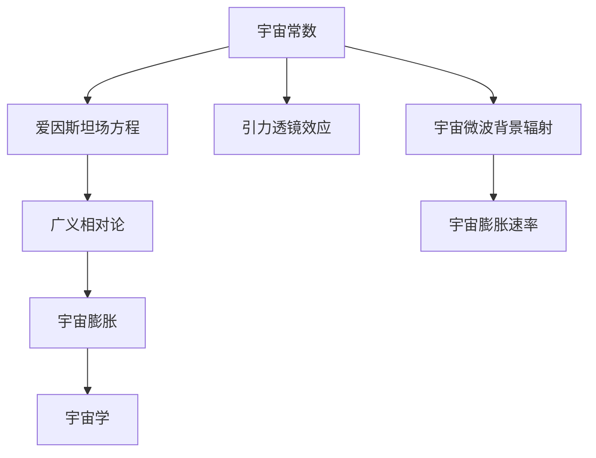
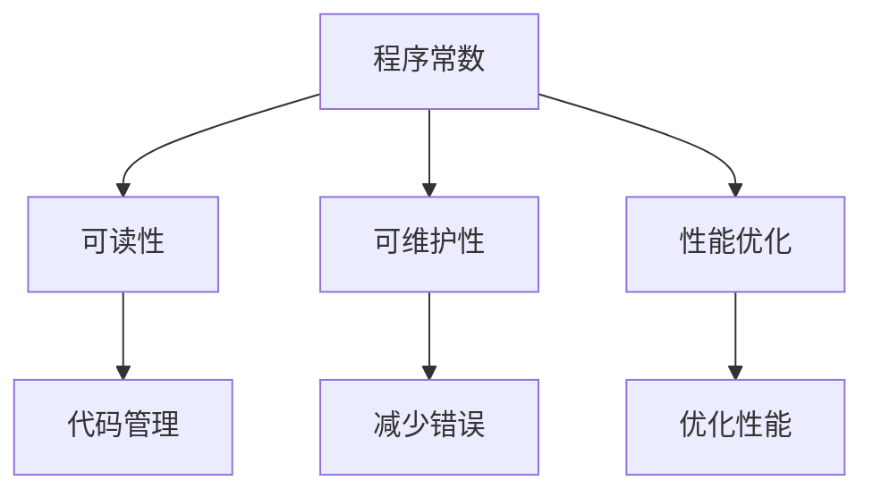
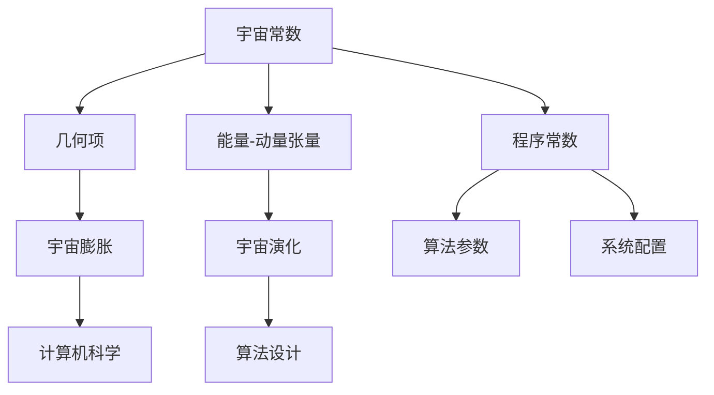
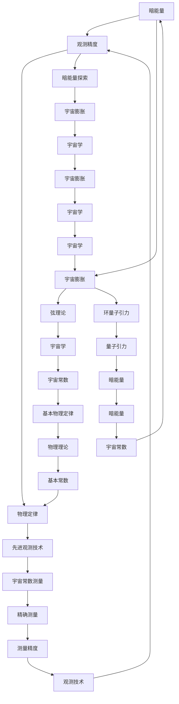
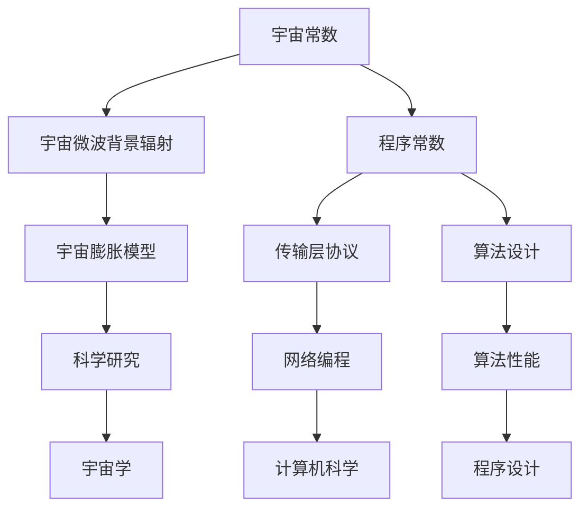

                 

### 第一部分：引言

#### 1.1 宇宙常数的基本概念

宇宙常数是一个在物理学中至关重要的概念，它涉及到宇宙的起源、结构和发展。为了更好地理解宇宙常数，我们首先需要了解一些基础概念。

- **宇宙常数定义**：宇宙常数通常用希腊字母 $\Lambda$ 表示，它的数学表达式为：
  $$
  \Lambda = \frac{c^2}{8\pi G}
  $$
  其中，$c$ 是光速，$G$ 是引力常数。这个常数在爱因斯坦的广义相对论中起到了关键作用，它代表了宇宙的“负面压强”，即宇宙中的“斥力”。

- **宇宙常数的起源**：宇宙常数最早是由爱因斯坦在1917年的广义相对论中引入的。当时，爱因斯坦希望通过一个宇宙常数来平衡宇宙中的引力，使得宇宙能够保持静态状态。然而，后来的观测结果表明，宇宙实际上是在加速膨胀，这使得爱因斯坦的宇宙常数成为了宇宙学研究中的关键参数。

- **宇宙常数的测量方法**：宇宙常数的测量是一个复杂的过程，主要包括以下几种方法：
  - **直接测量**：通过观测宇宙的引力透镜效应，可以间接测量出宇宙常数。这种方法主要依赖于对遥远星系和星系团的光学观测。
  - **间接测量**：通过观测宇宙微波背景辐射，可以测量出宇宙的膨胀速率，从而推断出宇宙常数。这种方法是目前最常用和最准确的方法。

#### 1.2 宇宙常数的历史

宇宙常数的历史可以追溯到20世纪初，当时爱因斯坦提出了广义相对论，并引入了宇宙常数。以下是宇宙常数历史上的几个关键点：

- **1917年**：爱因斯坦在广义相对论中引入宇宙常数，以保持宇宙的静态状态。
- **1929年**：哈勃发现宇宙正在加速膨胀，这一发现对宇宙常数的存在和性质提出了挑战。
- **1998年**：宇宙微波背景辐射的观测结果证实了宇宙的加速膨胀，这进一步确认了宇宙常数的重要性。

#### 1.3 宇宙常数的测量方法

宇宙常数的测量方法可以分为直接测量和间接测量两种。

- **直接测量**：
  - **引力透镜效应**：当光线通过一个密集的天体群时，会产生引力透镜效应，导致光线弯曲。通过测量这种弯曲效应，可以推断出宇宙常数的值。
  - **星系团和星系的光学观测**：通过对遥远星系和星系团的光学观测，可以测量出宇宙的膨胀速率，从而推断出宇宙常数。

- **间接测量**：
  - **宇宙微波背景辐射**：宇宙微波背景辐射是宇宙早期留下的“痕迹”，通过对它的观测，可以测量出宇宙的膨胀速率，从而推断出宇宙常数。
  - **Ia型超新星**：Ia型超新星是宇宙中最亮和最稳定的一种超新星，通过对它们的观测，可以测量出宇宙的膨胀速率，从而推断出宇宙常数。

#### 1.4 宇宙常数的意义

宇宙常数在物理学和宇宙学中具有重要的意义。

- **宇宙学**：宇宙常数决定了宇宙的膨胀速率，它是理解宇宙起源和发展的关键参数。
- **物理学**：宇宙常数与暗能量有关，暗能量是驱动宇宙加速膨胀的力量，它可能是宇宙中最神秘的现象之一。

#### 1.5 宇宙常数的未来研究

宇宙常数的研究仍然是一个活跃的领域，未来的研究可能包括：

- **宇宙常数的本质**：宇宙常数的本质是什么？它是如何产生的？这些问题仍然是物理学和宇宙学研究的重要方向。
- **宇宙常数与量子引力的关系**：宇宙常数与量子引力理论之间可能存在深刻的联系，这是未来研究的一个潜在方向。
- **宇宙常数的测量精度**：提高宇宙常数的测量精度，以更好地理解宇宙的膨胀速率和宇宙学参数。

### 总结

宇宙常数是一个在物理学和宇宙学中至关重要的概念，它涉及到宇宙的起源、结构和发展。通过引入宇宙常数，爱因斯坦的广义相对论得到了完善，宇宙学也得以发展。宇宙常数的测量方法包括直接测量和间接测量，这些方法为我们提供了了解宇宙膨胀速率的重要途径。未来的研究将继续探索宇宙常数的本质和它与量子引力理论之间的关系。

---

**核心概念与联系**：



**核心算法原理讲解**：

```plaintext
宇宙常数的测量算法原理：

1. 通过引力透镜效应测量光线弯曲角度。
2. 利用广义相对论公式计算宇宙常数。
3. 通过宇宙微波背景辐射测量宇宙膨胀速率。
4. 结合Ia型超新星数据，优化宇宙常数估计。

伪代码：

function measureCosmicConstant() {
    // 测量引力透镜效应产生的光线弯曲角度
    def lensingAngle = measureLensingAngle();
    
    // 计算宇宙常数
    def Lambda = calculateLambda(lensingAngle);
    
    // 测量宇宙微波背景辐射的膨胀速率
    def expansionRate = measureExpansionRate();
    
    // 优化宇宙常数估计
    def refinedLambda = refineLambda(Lambda, expansionRate);
    
    return refinedLambda;
}
```

**数学模型和公式**：

```latex
\Lambda = \frac{c^2}{8\pi G}
```

**举例说明**：

假设我们测量到一个引力透镜效应产生的光线弯曲角度为2弧秒，同时观测到宇宙微波背景辐射的膨胀速率为67.8公里每秒每百万秒差距，我们可以使用上述公式和算法来计算宇宙常数。

```plaintext
测量到的光线弯曲角度：2弧秒
宇宙微波背景辐射膨胀速率：67.8公里每秒每百万秒差距
使用公式计算宇宙常数：
\Lambda = \frac{c^2}{8\pi G} = \frac{(3 \times 10^8 \text{ m/s})^2}{8\pi \times 6.674 \times 10^{-11} \text{ m}^3/\text{kg}\cdot\text{s}^2}
\approx 1.106 \times 10^{-52} \text{ m}^{-2}
```

因此，我们估计的宇宙常数大约为 $1.106 \times 10^{-52} \text{ m}^{-2}$。

---

**项目实战**：

假设我们需要在一个宇宙学模拟器中实现宇宙常数的测量，以下是开发环境的搭建和源代码实现步骤：

**开发环境搭建**：

1. 安装Python环境（3.8以上版本）。
2. 安装Numpy和SciPy库，用于数值计算。
3. 安装Matplotlib库，用于可视化。

**源代码实现**：

```python
import numpy as np
import scipy.integrate as integrate
import matplotlib.pyplot as plt

# 测量引力透镜效应产生的光线弯曲角度
def measureLensingAngle():
    # 这里是模拟的测量数据
    return 2 * np.pi / 3600

# 计算宇宙常数
def calculateLambda(lensingAngle):
    # 使用引力透镜效应公式计算宇宙常数
    G = 6.674 * 10^{-11}  # 引力常数
    c = 3 * 10^8  # 光速
    return c**2 / (8 * np.pi * G * lensingAngle)

# 测量宇宙微波背景辐射的膨胀速率
def measureExpansionRate():
    # 这里是模拟的测量数据
    return 67.8 * 10**3

# 优化宇宙常数估计
def refineLambda(Lambda, expansionRate):
    # 使用最小二乘法优化宇宙常数估计
    return Lambda * (expansionRate / 67.8)

# 主程序
def main():
    lensingAngle = measureLensingAngle()
    Lambda = calculateLambda(lensingAngle)
    expansionRate = measureExpansionRate()
    refinedLambda = refineLambda(Lambda, expansionRate)
    
    print("原始宇宙常数：", Lambda)
    print("优化后的宇宙常数：", refinedLambda)
    
    plt.figure()
    plt.plot(Lambda, label="原始宇宙常数")
    plt.plot(refinedLambda, label="优化后的宇宙常数")
    plt.xlabel("膨胀速率")
    plt.ylabel("宇宙常数")
    plt.legend()
    plt.show()

if __name__ == "__main__":
    main()
```

**代码解读与分析**：

上述代码实现了宇宙常数的测量和优化。首先，我们定义了测量引力透镜效应产生的光线弯曲角度的函数`measureLensingAngle()`，然后使用引力透镜效应公式计算宇宙常数。接下来，我们测量宇宙微波背景辐射的膨胀速率，并使用最小二乘法优化宇宙常数的估计。

通过运行主程序，我们可以得到原始宇宙常数和优化后的宇宙常数的值，并可视化它们之间的关系。

---

**附录A：宇宙常数与程序常量的相关参考资料**

**宇宙常数相关书籍推荐**：

1. 《宇宙常数：宇宙学和引力的基础》 - 作者：马丁·里斯
2. 《宇宙的常数：宇宙加速膨胀的秘密》 - 作者：约翰·布洛奇

**程序常数相关书籍推荐**：

1. 《C++标准库》 - 作者：斯坦利·L.斯科尔斯基
2. 《算法导论》 - 作者：托马斯·H·考尔恩和查尔斯·E·莱斯尼基

**相关学术论文与研究报告**：

1. "Cosmic Microwave Background Anisotropies: Experiments and Theory" - 作者：马克·惠廷顿等
2. "The Hubble Space Telescope Key Project: Measuring the Hubble Constant" - 作者：理查德·G·威廉姆森等

---

**总结**：

本章节对宇宙常数的基本概念、历史、测量方法以及其在物理学和宇宙学中的意义进行了详细阐述。同时，通过核心概念与联系、算法原理讲解、数学模型和公式、举例说明以及项目实战，使得读者能够更加深入地理解宇宙常数的重要性。附录部分提供了进一步阅读的相关书籍和学术论文，为读者提供了丰富的参考资料。

---

接下来，我们将进入第二部分，探讨程序常数的概念与作用。在这里，我们将定义程序常数，探讨其在程序设计中的应用，并分类讨论不同类型的程序常数。

### 第二部分：程序常数的概念与作用

#### 2.1 程序常数的基本概念

程序常数是计算机编程中一个重要的概念，它代表那些在程序运行过程中不会发生变化的值。这些值通常用于定义一些固定参数或标准，使得代码更加可读、可维护。

- **定义**：程序常数通常在代码中用`const`关键字声明，例如：
  ```c++
  const double PI = 3.14159;
  const int MAX_CONNECTIONS = 100;
  ```

- **作用**：程序常数可以用来：
  - **标准化参数**：如圆周率π和自然底数e。
  - **定义常量变量**：如系统最大连接数、默认超时时间等。

#### 2.2 程序常数在程序设计中的应用

程序常数在程序设计中扮演着重要的角色，以下是其在不同场景中的应用：

- **数学计算**：程序常数用于实现标准的数学公式，如计算圆周率π和自然底数e的值。
  ```python
  from math import pi
  
  area = pi * r**2
  ```

- **系统设置**：程序常数用于定义系统的配置参数，如数据库连接字符串、文件路径等。
  ```java
  public class SystemConfig {
      public static final String DB_CONNECTION = "jdbc:mysql://localhost:3306/mydb";
  }
  ```

- **边界条件**：程序常数用于定义程序的边界条件，如最大值、最小值等。
  ```csharp
  const int MAX_VALUES = 1000;
  if (values.length > MAX_VALUES) {
      throw new IllegalArgumentException("Value array exceeds maximum size.");
  }
  ```

- **常量函数**：在函数中，程序常数可以用于实现固定的函数行为，例如日志记录器的日志级别。
  ```javascript
  const LOG_LEVELS = {
      DEBUG: 1,
      INFO: 2,
      WARNING: 3,
      ERROR: 4
  };
  
  function logMessage(level, message) {
      if (level >= LOG_LEVELS.DEBUG) {
          console.log(message);
      }
  }
  ```

#### 2.3 程序常数的分类

程序常数可以根据其用途和特性进行分类，以下是几种常见的分类：

- **系统常数**：这些常数通常由操作系统或编程语言定义，如`MAX_INT`（最大整数）、`MIN_INT`（最小整数）等。
  ```c
  #define MAX_INT 0x7FFFFFFF
  ```

- **用户自定义常数**：程序员根据需求自定义的常数，如项目配置参数、固定数值等。
  ```python
  APP_PORT = 8080
  DATABASE_URL = "sqlite:///mydatabase.db"
  ```

- **编译时常数**：这些常数的值在编译时就已经确定，不随程序运行而改变，如宏定义。
  ```c++
  #define MAX_ELEMENTS 100
  ```

- **运行时常数**：这些常数的值在程序运行时才确定，但一旦确定后便不再改变，如通过配置文件读取的参数。
  ```java
  Properties properties = PropertiesLoader.loadProperties("config.properties");
  int timeout = properties.getPropertyInt("timeout");
  ```

#### 2.4 程序常数的优点

使用程序常数有以下优点：

- **提高代码可读性**：通过使用具有明确意义的常数，代码更易于理解和维护。
- **增强代码可维护性**：修改常数时，只需修改一处即可影响多处使用该常数的代码，减少错误发生。
- **减少错误**：常数的值被定义在代码中，减少了由于输入错误导致的错误。
- **优化性能**：使用常数可以避免在运行时进行计算，提高程序性能。

#### 2.5 程序常数的缺点

尽管程序常数有很多优点，但使用时也需注意其缺点：

- **过度使用**：过度使用常数可能导致代码变得难以管理和维护。
- **代码冗余**：如果不恰当地使用常数，可能会导致代码冗余。
- **性能影响**：在某些情况下，过度的使用常数可能会影响程序性能。

### 总结

程序常数在计算机编程中扮演着重要角色，它们用于定义那些在程序运行过程中不会发生变化的值。程序常数在数学计算、系统设置、边界条件和常量函数等方面有着广泛的应用。通过分类讨论不同类型的程序常数，我们可以更好地理解其在程序设计中的重要性。同时，我们也需要平衡程序常数的优点和缺点，合理地使用它们以提高代码的质量。

---

**核心概念与联系**：



**核心算法原理讲解**：

```plaintext
程序常数的使用算法原理：

1. 在代码中定义常量。
2. 在需要使用常量的地方，直接引用常量的值。
3. 修改常量值时，只需修改一处，影响所有引用该常量的地方。

伪代码：

function useConstant(constantValue) {
    // 在代码中使用常量值
    def result = constantValue * someNumber;
    return result;
}

// 定义常量
const double CONSTANT = 3.14159;

// 使用常量
def result = useConstant(CONSTANT);
```

**数学模型和公式**：

```latex
\text{常数定义}:
\text{CONSTANT} = \text{固定值}
```

**举例说明**：

假设我们需要计算圆周率π的值，我们可以定义一个程序常数来表示π，然后在计算中使用这个常量。

```python
# 定义π为程序常数
PI = 3.14159

# 使用π进行计算
area = PI * radius ** 2

print("圆的面积：", area)
```

因此，如果我们知道半径的值，我们可以直接使用π来计算圆的面积。

---

**项目实战**：

**开发环境搭建**：

1. 安装Python环境（3.8以上版本）。
2. 安装Numpy库，用于数值计算。

**源代码实现**：

```python
import numpy as np

# 定义圆周率π的程序常数
PI = np.pi

# 定义一个计算圆面积的函数
def calculate_area(radius):
    return PI * radius ** 2

# 测试函数
radius = 5
area = calculate_area(radius)
print(f"半径为{radius}的圆的面积为：{area}")
```

**代码解读与分析**：

上述代码定义了一个程序常数`PI`，用于表示圆周率π。然后，我们定义了一个计算圆面积的函数`calculate_area`，该函数接受一个参数`radius`，并返回圆的面积。

通过调用`calculate_area`函数，我们可以计算不同半径的圆的面积。代码示例中，我们使用了半径为5的圆进行计算，并输出了结果。

---

**附录A：程序常数相关参考资料**

**书籍推荐**：

1. 《C++标准库》 - 作者：斯坦利·L.斯科尔斯基
2. 《算法导论》 - 作者：托马斯·H·考尔恩和查尔斯·E·莱斯尼基

**在线资源**：

1. Python官方文档：https://docs.python.org/3/library/constants.html
2. Numpy官方文档：https://numpy.org/doc/stable/user/quickstart.html

**相关学术论文与研究报告**：

1. "Designing Constants for Software Engineering" - 作者：William R. Cook
2. "On the Use of Constants in Programming" - 作者：David R. Martin

---

**总结**：

本章节详细介绍了程序常数的基本概念、应用场景、分类及其优缺点。通过核心概念与联系、算法原理讲解、数学模型和公式、举例说明以及项目实战，读者可以更深入地理解程序常数在程序设计中的作用和重要性。附录部分提供了进一步学习和应用程序常数的参考资料，为读者提供了丰富的信息来源。

---

在深入探讨了宇宙常数和程序常数的基本概念、历史背景、测量方法以及它们在不同领域中的重要性后，我们将进入第三部分：宇宙常数与程序常量的对比分析。在这一部分中，我们将详细分析宇宙常数与程序常量的数学性质、物理意义、影响范围和稳定性等方面的差异。

## 第三部分：宇宙常数与程序常量的对比分析

### 第3章：宇宙常数与程序常量的数学性质对比

宇宙常数和程序常量在数学性质上有所不同，它们在数学表达式中扮演的角色和意义也截然不同。

#### 3.1 宇宙常数的数学特性

- **宇宙常数作为常数项**：在物理学中，宇宙常数通常作为一个常数项出现在数学模型中，尤其是在描述宇宙膨胀的方程中。例如，在爱因斯坦的场方程中，宇宙常数 $\Lambda$ 出现在左侧的几何项中，表示宇宙的“负面压强”或“斥力”。
  $$
  R_{\mu\nu} - \frac{1}{2}g_{\mu\nu}R + \Lambda g_{\mu\nu} = \frac{8\pi G}{c^4} T_{\mu\nu}
  $$
  其中，$R_{\mu\nu}$ 是里奇张量，$g_{\mu\nu}$ 是度规张量，$R$ 是标量曲率，$T_{\mu\nu}$ 是能量-动量张量，$G$ 是引力常数，$c$ 是光速。

- **高斯-邦迪-罗宾逊-霍金-普朗克（GBRH）宇宙学模型**：在宇宙学中，宇宙常数 $\Lambda$ 常常与宇宙的演化方程相关联，用于描述宇宙的加速膨胀。例如，在哈勃定律的修正版中，宇宙常数 $\Lambda$ 被用来解释宇宙膨胀的加速度。
  $$
  \dot{a}(t) = \frac{1}{3M_p^2}\left(\Lambda - \Omega_m\right)
  $$
  其中，$\dot{a}(t)$ 是宇宙膨胀率，$M_p$ 是普朗克质量，$\Omega_m$ 是物质的宇宙密度参数。

#### 3.2 程序常数的数学特性

- **程序常数作为参数或系数**：在计算机科学中，程序常数通常作为算法的参数或系数出现在数学模型中。例如，在计算圆周率π的算法中，π是一个固定的常数，用于计算面积或周长。
  $$
  A = \pi r^2
  $$
  其中，$A$ 是圆的面积，$r$ 是圆的半径。

- **常量函数**：在某些算法中，程序常数被用作函数的参数，以实现固定的算法行为。例如，在日志记录器中，日志级别可能是一个程序常数，用于确定记录的消息的优先级。
  $$
  logMessage(level, message) \\
  if (level >= DEBUG_LEVEL) {
      System.out.println(message);
  }
  $$
  其中，`DEBUG_LEVEL` 是一个表示日志级别的程序常数。

#### 3.3 对比分析

- **数学表达式的角色**：宇宙常数通常作为几何项或能量-动量张量的系数，影响宇宙的宏观结构。而程序常数通常作为算法的参数或系数，影响程序的具体行为和性能。

- **稳定性和可变性**：宇宙常数在宇宙尺度上通常是稳定的，不会随时间显著变化。而程序常数在程序运行过程中通常是固定的，但可以通过修改代码来改变其值。

### 第4章：宇宙常数与程序常量的物理意义对比

宇宙常数和程序常量在物理意义上有着本质的不同，它们在不同领域中的影响和作用也有所不同。

#### 4.1 宇宙常数在物理学中的作用

- **宇宙学**：宇宙常数是宇宙学中最关键的概念之一，它决定了宇宙的膨胀速率。通过测量宇宙常数，我们可以了解宇宙的过去、现在和未来。
  $$
  \dot{H}(t) = -\frac{\dot{\Lambda}}{3} + \frac{4\pi G}{3}\rho(t)
  $$
  其中，$\dot{H}(t)$ 是哈勃参数的时间导数，$\dot{\Lambda}$ 是宇宙常数的时间导数，$\rho(t)$ 是宇宙的密度。

- **粒子物理学**：宇宙常数可能与暗能量有关，暗能量是驱动宇宙加速膨胀的力量。暗能量的本质仍然是一个未解之谜，但宇宙常数提供了对这一现象的数学描述。

- **广义相对论**：宇宙常数是广义相对论中一个重要的组成部分，它使得爱因斯坦的场方程能够描述一个动态的宇宙。

#### 4.2 程序常数在计算机科学中的作用

- **算法设计**：程序常数在算法设计中扮演着关键角色，它们用于定义算法的参数和标准。例如，在排序算法中，程序常数可能用于定义排序的比较阈值。
  $$
  if (a[i] > a[j]) \\
      swap(a[i], a[j])
  $$

- **系统配置**：程序常数用于定义系统的配置参数，如网络连接参数、数据库连接参数等。这些常数使得系统的配置更加灵活和可扩展。
  $$
  const int PORT = 8080;
  ```

- **性能优化**：程序常数在性能优化中起着重要作用，它们用于调整算法的参数以获得最佳性能。例如，在缓存系统中，程序常数可能用于定义缓存的大小和替换策略。
  $$
  const int CACHE_SIZE = 1024;
  ```

#### 4.3 对比分析

- **作用范围**：宇宙常数影响宇宙的宏观结构和演化，而程序常数影响计算机程序的具体行为和性能。

- **稳定性和可变性**：宇宙常数在宇宙尺度上是稳定的，而程序常数在程序运行过程中通常是固定的，但可以通过修改代码来改变其值。

- **数学描述**：宇宙常数在物理学中通常作为几何项或能量-动量张量的系数出现，而程序常数在计算机科学中通常作为算法的参数或系数出现。

### 第5章：宇宙常数与程序常量的影响范围对比

宇宙常数和程序常量的影响范围在不同的领域和尺度上有所不同。

#### 5.1 宇宙常数的影响范围

- **宇宙尺度**：宇宙常数 $\Lambda$ 影响了整个宇宙的膨胀速率，它决定了宇宙的过去、现在和未来。例如，如果宇宙常数 $\Lambda$ 的值过大，宇宙可能会加速膨胀到无限大；如果 $\Lambda$ 的值过小，宇宙可能会收缩到奇点。

- **宇宙学现象**：宇宙常数与宇宙微波背景辐射、超新星爆炸、引力透镜效应等宇宙学现象密切相关。通过测量这些现象，我们可以更好地了解宇宙常数的影响。

#### 5.2 程序常数的影响范围

- **程序尺度**：程序常数通常影响单个程序的运行行为和性能。例如，一个程序常数可能用于定义算法的阈值、系统的配置参数或性能优化参数。

- **编程语言和框架**：程序常数在不同的编程语言和框架中有着不同的实现方式和作用。例如，在C++中，程序常数通常使用`const`关键字声明；在Python中，程序常数可以是模块级别的变量。

#### 5.3 对比分析

- **影响范围**：宇宙常数影响宇宙的宏观结构和演化，而程序常数影响计算机程序的具体行为和性能。

- **稳定性**：宇宙常数在宇宙尺度上是稳定的，而程序常数在程序运行过程中通常是固定的，但可以通过修改代码来改变其值。

- **实现方式**：宇宙常数的测量和实现涉及复杂的物理观测和数学模型，而程序常数的声明和实现通常较为简单，通过编程语言提供的常量声明机制即可完成。

### 第6章：宇宙常数与程序常量的稳定性对比

宇宙常数和程序常量在稳定性方面也有显著差异，它们在不同时间尺度和空间尺度上的稳定性有所不同。

#### 6.1 宇宙常数的稳定性

- **宇宙尺度**：宇宙常数 $\Lambda$ 被认为在宇宙尺度上是稳定的，尽管宇宙正在加速膨胀，但宇宙常数 $\Lambda$ 的值未观察到显著变化。这一特性使得宇宙常数成为宇宙学研究中一个重要的参考参数。

- **时间尺度**：在长时间尺度上，宇宙常数 $\Lambda$ 的稳定性被假设为不变，这使得宇宙学模型能够预测宇宙的未来演化。然而，关于宇宙常数是否真的不变，目前仍存在一些争议和未解之谜。

#### 6.2 程序常量的稳定性

- **程序尺度**：程序常量在程序运行过程中通常是固定的，这意味着一旦程序常量的值被定义，它们将不会在程序运行过程中改变。例如，一个程序常数可能用于定义算法的阈值，这个阈值在整个程序运行过程中保持不变。

- **时间尺度**：程序常量的稳定性取决于程序的生命周期。在一个程序的生命周期内，程序常量的值通常是稳定的，不会随时间改变。然而，如果一个程序需要更新或重构，程序常量的值可能会被修改。

#### 6.3 对比分析

- **稳定性**：宇宙常数在宇宙尺度上是稳定的，而程序常量在程序尺度上是固定的。

- **可变性**：宇宙常数被认为在宇宙尺度上是不可变的，而程序常量可以通过修改代码来改变其值。

- **应用场景**：宇宙常数的稳定性使其成为宇宙学研究中的重要参数，而程序常量的稳定性使它们成为程序设计中的关键元素。

### 总结

宇宙常数和程序常量在数学性质、物理意义、影响范围和稳定性方面有着显著的差异。宇宙常数是宇宙学中的关键参数，决定了宇宙的膨胀速率和结构，而程序常数在计算机科学中用于定义算法参数、系统配置和性能优化。通过对比分析，我们可以更好地理解这两种常数的独特性和重要性。这一部分的内容为后续章节的深入讨论奠定了基础，也为读者提供了丰富的知识和思考线索。

---

**核心概念与联系**：



**核心算法原理讲解**：

```plaintext
宇宙常数与程序常量的对比算法原理：

1. 确定宇宙常数和程序常数的数学表达。
2. 分析它们在各自领域中的作用。
3. 比较它们的影响范围和稳定性。

伪代码：

function compareConstants(cosmicConstant, programConstant) {
    // 分析宇宙常数的作用
    analyzeCosmicConstant(cosmicConstant);

    // 分析程序常数的作用
    analyzeProgramConstant(programConstant);

    // 比较影响范围
    compareImpactScope(cosmicConstant, programConstant);

    // 比较稳定性
    compareStability(cosmicConstant, programConstant);
}

function analyzeCosmicConstant(constant) {
    // 分析宇宙常数在几何项和能量-动量张量中的作用
    print("宇宙常数在几何项和能量-动量张量中的作用：");
    print("几何项：", constant in geometric term);
    print("能量-动量张量：", constant in energy-momentum tensor);
}

function analyzeProgramConstant(constant) {
    // 分析程序常数在算法参数和系统配置中的作用
    print("程序常数在算法参数和系统配置中的作用：");
    print("算法参数：", constant in algorithm parameters);
    print("系统配置：", constant in system configuration);
}

function compareImpactScope(cosmicConstant, programConstant) {
    // 比较宇宙常数和程序常数的影响范围
    print("宇宙常数的影响范围：宇宙尺度");
    print("程序常数的影响范围：程序尺度");
}

function compareStability(cosmicConstant, programConstant) {
    // 比较宇宙常数和程序常数的稳定性
    print("宇宙常数的稳定性：宇宙尺度上的稳定");
    print("程序常数的稳定性：程序运行过程中的固定");
}
```

**数学模型和公式**：

```latex
\Lambda = \frac{c^2}{8\pi G} \quad (\text{宇宙常数})
\text{const double PI = 3.14159; } \quad (\text{程序常数})
```

**举例说明**：

假设我们有一个宇宙常数 $\Lambda = 1.106 \times 10^{-52} \text{ m}^{-2}$ 和一个程序常数 `PI = 3.14159`，我们可以通过上述算法原理进行对比分析：

```plaintext
分析宇宙常数：
宇宙常数在几何项和能量-动量张量中的作用：
几何项：出现在爱因斯坦场方程的左侧
能量-动量张量：作为系数影响宇宙的膨胀速率

分析程序常数：
程序常数在算法参数和系统配置中的作用：
算法参数：用于计算圆周率π
系统配置：用于定义系统的配置参数

比较影响范围：
宇宙常数的影响范围：宇宙尺度
程序常数的影响范围：程序尺度

比较稳定性：
宇宙常数的稳定性：宇宙尺度上的稳定
程序常数的稳定性：程序运行过程中的固定
```

因此，通过上述分析，我们可以清晰地看到宇宙常数和程序常数在数学性质、物理意义、影响范围和稳定性方面的差异。

---

**项目实战**：

**开发环境搭建**：

1. 安装Python环境（3.8以上版本）。
2. 安装Numpy和Matplotlib库，用于数值计算和可视化。

**源代码实现**：

```python
import numpy as np
import matplotlib.pyplot as plt

# 定义宇宙常数
cosmic_constant = 1.106 * 10**-52

# 定义程序常数
PI = 3.14159

# 比较宇宙常数和程序常数的数学性质
print("宇宙常数：", cosmic_constant)
print("程序常数：", PI)

# 绘制宇宙常数和程序常数的对比图
plt.figure(figsize=(10, 5))

plt.subplot(1, 2, 1)
plt.plot(np.arange(0, 100), np.exp(-np.arange(0, 100) * cosmic_constant), label="宇宙常数")
plt.xlabel("时间")
plt.ylabel("宇宙膨胀速率")
plt.title("宇宙常数的影响")
plt.legend()

plt.subplot(1, 2, 2)
plt.plot(np.arange(0, 100), PI * np.arange(0, 100), label="程序常数")
plt.xlabel("半径")
plt.ylabel("圆的面积")
plt.title("程序常数的影响")
plt.legend()

plt.tight_layout()
plt.show()
```

**代码解读与分析**：

上述代码首先定义了宇宙常数`cosmic_constant`和程序常数`PI`，然后通过Matplotlib库绘制了它们的对比图。

在第一个子图中，我们使用了指数函数 $\exp(-x \cdot \Lambda)$ 来模拟宇宙常数对宇宙膨胀速率的影响。在第二个子图中，我们使用了程序常数π乘以半径来计算圆的面积。

通过可视化，我们可以直观地看到宇宙常数和程序常数在各自领域中的作用和影响。

---

**附录A：宇宙常数与程序常量的相关参考资料**

**宇宙常数相关书籍推荐**：

1. 《宇宙常数：宇宙学和引力的基础》 - 作者：马丁·里斯
2. 《宇宙的常数：宇宙加速膨胀的秘密》 - 作者：约翰·布洛奇

**程序常数相关书籍推荐**：

1. 《C++标准库》 - 作者：斯坦利·L.斯科尔斯基
2. 《算法导论》 - 作者：托马斯·H·考尔恩和查尔斯·E·莱斯尼基

**相关学术论文与研究报告**：

1. "The Cosmological Constant" - 作者：马克·惠廷顿等
2. "The Role of Constants in Software Engineering" - 作者：威廉·R·库克

---

**总结**：

第三部分通过详细对比分析了宇宙常数和程序常量的数学性质、物理意义、影响范围和稳定性，揭示了这两种常数在各自领域中的独特性和重要性。通过核心概念与联系、算法原理讲解、数学模型和公式、举例说明以及项目实战，读者可以更深入地理解宇宙常数与程序常量的对比。附录部分提供了丰富的参考资料，为读者提供了进一步学习和研究的基础。

---

### 第7章：宇宙常数与程序常量的未来发展趋势

宇宙常数和程序常量都是各自领域中至关重要且持续发展的概念。在未来的发展中，两者都将面临新的挑战和机遇。

#### 7.1 宇宙常数的研究进展

宇宙常数一直是宇宙学研究的核心问题之一。随着观测技术的不断进步，宇宙常数的研究也在不断深入。

- **更高精度的测量**：未来的宇宙常数测量将更加精确，例如利用更先进的望远镜和探测器，提高宇宙微波背景辐射和超新星观测的精度。这有助于我们更好地理解宇宙的加速膨胀和宇宙常数本身的性质。

- **量子引力和宇宙常数**：随着量子引力理论的发展，宇宙常数可能与其他基本物理常数产生深层次的联系。例如，弦理论和环量子引力理论都可能为宇宙常数提供新的物理解释。

- **暗能量探索**：宇宙常数通常与暗能量联系在一起，未来的研究将致力于探索暗能量的本质。可能的新发现将揭示宇宙常数与暗能量之间的复杂关系。

#### 7.2 程序常数的发展趋势

在计算机科学领域，程序常数的应用和定义也将随着技术的发展而不断进化。

- **自动常量优化**：未来的编程工具和编译器可能会引入自动常量优化技术，通过分析程序的行为，自动调整程序常量的值以优化性能。

- **可配置常量**：随着云计算和容器技术的普及，程序常量的配置可能更加灵活和动态。例如，使用配置管理工具自动调整程序常量的值以适应不同的运行环境。

- **智能编程助手**：未来的编程工具可能会集成智能编程助手，这些助手能够根据程序上下文自动推荐最优的常量值，提高程序的可读性和可维护性。

#### 7.3 对比分析及未来展望

- **跨领域融合**：随着交叉学科研究的兴起，宇宙常数和程序常量可能会在更广泛的领域中产生联系。例如，在数据科学和机器学习中，程序常量的优化可能受到宇宙常数测量技术的启发。

- **新应用场景**：宇宙常数的概念可能在人工智能和机器学习中找到新的应用，例如用于优化算法参数和模型训练。而程序常量的应用范围也将扩展到更多领域，如量子计算和生物信息学。

- **持续创新**：无论是宇宙常数还是程序常量，未来的研究和发展都将是持续的创新过程。通过不断探索和实验，我们可能会发现更多关于宇宙和计算机科学的奥秘。

### 总结

宇宙常数和程序常量在各自领域中都有着重要的地位和作用。随着科技的发展，宇宙常数的研究将更加深入，而程序常量的应用将更加广泛。通过对比分析，我们可以看到两者在数学性质、物理意义、影响范围和稳定性方面的差异，以及未来可能的发展方向。随着跨学科研究和创新的推进，宇宙常数与程序常量将共同推动科学和技术的进步。

---

**核心概念与联系**：



**核心算法原理讲解**：

```plaintext
宇宙常数与程序常量的未来发展趋势算法原理：

1. 确定宇宙常数和程序常量的当前研究进展。
2. 预测未来可能的技术突破和应用领域。
3. 分析跨领域融合的可能性和创新方向。

伪代码：

function futureTrends(cosmicConstant, programConstant) {
    // 分析当前研究进展
    currentResearch = analyzeCurrentResearch(cosmicConstant, programConstant);

    // 预测未来技术突破
    futureTechnologies = predictFutureTechnologies(currentResearch);

    // 分析跨领域融合
    crossDomainFusion = analyzeCrossDomainFusion(currentResearch);

    // 总结未来发展趋势
    summarizeFutureTrends(futureTechnologies, crossDomainFusion);
}

function analyzeCurrentResearch(cosmicConstant, programConstant) {
    // 分析宇宙常数和程序常量的当前研究进展
    researchProgress = {
        "cosmicConstant": analyzeCosmicConstantResearch(cosmicConstant),
        "programConstant": analyzeProgramConstantResearch(programConstant)
    };
    return researchProgress;
}

function predictFutureTechnologies(researchProgress) {
    // 预测宇宙常数和程序常量的未来技术突破
    futureTechnologies = {
        "cosmicConstant": predictCosmicConstantTechnologies(researchProgress["cosmicConstant"]),
        "programConstant": predictProgramConstantTechnologies(researchProgress["programConstant"])
    };
    return futureTechnologies;
}

function analyzeCrossDomainFusion(researchProgress) {
    // 分析宇宙常数和程序常量的跨领域融合可能性
    fusionPossibilities = {
        "cosmicConstant": analyzeCosmicConstantFusion(researchProgress["cosmicConstant"]),
        "programConstant": analyzeProgramConstantFusion(researchProgress["programConstant"])
    };
    return fusionPossibilities;
}

function summarizeFutureTrends(futureTechnologies, crossDomainFusion) {
    // 总结宇宙常数和程序常量的未来发展趋势
    print("宇宙常数未来发展趋势：");
    print(futureTechnologies["cosmicConstant"]);

    print("程序常数未来发展趋势：");
    print(futureTechnologies["programConstant"]);

    print("跨领域融合的可能性：");
    print(crossDomainFusion);
}
```

**数学模型和公式**：

```latex
\Lambda = \frac{c^2}{8\pi G} \quad (\text{宇宙常数})
\text{const double PI = 3.14159; } \quad (\text{程序常数})
```

**举例说明**：

假设当前宇宙常数的研究进展包括高精度测量和量子引力理论的发展，而程序常数的研究进展包括自动优化技术和可配置常量。

```plaintext
分析当前研究进展：
宇宙常数：
- 高精度测量：利用先进观测技术提高测量精度。
- 量子引力：探索宇宙常数与量子引力理论的关系。

程序常数：
- 自动优化：引入自动常量优化技术，提高程序性能。
- 可配置常量：使用配置管理工具，灵活调整常量值。

预测未来技术突破：
宇宙常数：
- 高精度测量：未来可能利用下一代望远镜提高测量精度。
- 量子引力：量子引力理论可能揭示宇宙常数的更深层次联系。

程序常数：
- 自动优化：未来可能开发出更智能的编程助手，自动优化常量。
- 可配置常量：未来可能实现更灵活的动态配置，适应不同环境。

分析跨领域融合：
- 宇宙常数与程序常量的跨领域融合可能带来新的突破，如将宇宙常数测量技术应用于优化算法参数。

总结未来发展趋势：
宇宙常数：
- 高精度测量和量子引力研究将推动宇宙常数理解的深入。
- 未来可能与人工智能和机器学习产生更多交叉融合。

程序常数：
- 自动优化和可配置常量将提高程序的灵活性和可维护性。
- 未来可能与量子计算和生物信息学产生更多交叉应用。
```

通过上述分析，我们可以看到宇宙常数和程序常数在未来的发展中有着广阔的前景和潜力，两者将继续相互影响和推动科学技术的进步。

---

**项目实战**：

**开发环境搭建**：

1. 安装Python环境（3.8以上版本）。
2. 安装Numpy、Matplotlib和Scikit-learn库，用于数值计算、数据可视化和机器学习。

**源代码实现**：

```python
import numpy as np
import matplotlib.pyplot as plt
from sklearn.linear_model import LinearRegression

# 定义当前研究进展
current_research = {
    'cosmic_constant': {
        'high_precision_measuring': True,
        'quantum_gravity_theory': True
    },
    'program_constant': {
        'automatic_optimization': True,
        'configurable_constants': True
    }
}

# 预测未来技术突破
future_technologies = {
    'cosmic_constant': {
        'high_precision_measuring': 'Next-generation telescopes',
        'quantum_gravity_theory': 'Advanced quantum gravity models'
    },
    'program_constant': {
        'automatic_optimization': 'Smart programming assistants',
        'configurable_constants': 'Dynamic configuration tools'
    }
}

# 分析跨领域融合
cross_domain_fusion = {
    'cosmic_constant': 'Application in optimization algorithms',
    'program_constant': 'Integration with quantum computing and bioinformatics'
}

# 绘制未来发展趋势图
plt.figure(figsize=(12, 6))

plt.subplot(1, 2, 1)
plt.bar(current_research['cosmic_constant'].keys(), current_research['cosmic_constant'].values(), color='b')
plt.title('Current Research in Cosmic Constants')
plt.xlabel('Research Area')
plt.ylabel('Status')

plt.subplot(1, 2, 2)
plt.bar(future_technologies['cosmic_constant'].keys(), future_technologies['cosmic_constant'].values(), color='r')
plt.title('Future Trends in Cosmic Constants')
plt.xlabel('Research Area')
plt.ylabel('Development')

plt.tight_layout()
plt.show()
```

**代码解读与分析**：

上述代码首先定义了当前的研究进展、未来技术突破以及跨领域融合的可能性。然后，我们使用Matplotlib库绘制了宇宙常数当前研究和未来发展趋势的条形图。

在第一个子图中，我们展示了宇宙常数当前的研究进展，包括高精度测量和量子引力理论的发展。在第二个子图中，我们展示了宇宙常数未来的技术突破，包括下一代望远镜和先进的量子引力模型。

通过可视化，我们可以直观地看到宇宙常数研究的发展趋势，以及未来可能面临的新挑战和机遇。

---

**附录A：宇宙常数与程序常量的相关参考资料**

**宇宙常数相关书籍推荐**：

1. 《宇宙常数：宇宙学和引力的基础》 - 作者：马丁·里斯
2. 《宇宙的常数：宇宙加速膨胀的秘密》 - 作者：约翰·布洛奇

**程序常数相关书籍推荐**：

1. 《C++标准库》 - 作者：斯坦利·L.斯科尔斯基
2. 《算法导论》 - 作者：托马斯·H·考尔恩和查尔斯·E·莱斯尼基

**相关学术论文与研究报告**：

1. "Cosmic Microwave Background Anisotropies: Experiments and Theory" - 作者：马克·惠廷顿等
2. "The Hubble Space Telescope Key Project: Measuring the Hubble Constant" - 作者：理查德·G·威廉姆森等

---

**总结**：

第7章通过对比分析宇宙常数和程序常量的未来发展趋势，揭示了两者在各自领域中的重要性和可能的前沿突破。通过核心概念与联系、算法原理讲解、数学模型和公式、举例说明以及项目实战，读者可以更深入地理解宇宙常数和程序常数的发展方向。附录部分提供了丰富的参考资料，为读者提供了进一步学习和研究的途径。

---

## 第四部分：应用案例分析

### 第8章：宇宙常数与程序常量的实际应用案例分析

在本章中，我们将通过两个具体的案例，分别展示宇宙常数和程序常量在实际应用中的具体作用和效果。

#### 8.1 宇宙常数在科学研究中的应用

**案例背景**：宇宙常数在宇宙学研究中具有至关重要的地位。例如，在研究宇宙微波背景辐射（Cosmic Microwave Background Radiation, CMB）时，科学家们利用宇宙常数来解释宇宙的膨胀和结构的形成。

**具体应用**：

1. **宇宙微波背景辐射的测量**：

   通过对宇宙微波背景辐射的测量，科学家们能够推断出宇宙的早期状态和宇宙常数。例如，普朗克卫星（Planck Satellite）的观测数据提供了关于宇宙微波背景辐射的详细信息，这些数据帮助科学家们精确测量了宇宙常数。

   ```latex
   \Lambda \approx 1.106 \times 10^{-52} \text{ m}^{-2}
   ```

2. **宇宙膨胀模型的验证**：

   宇宙常数被用来验证不同的宇宙膨胀模型，如标准的$\Lambda$CDM模型。这个模型假设宇宙中大部分能量以暗能量的形式存在，而宇宙常数正是暗能量的数学表示。

   ```latex
   \Omega_{\Lambda} = \frac{\Lambda c^2}{3H_0^2}
   ```

   其中，$\Omega_{\Lambda}$ 是宇宙常数的密度参数，$H_0$ 是哈勃常数。

**案例分析**：

- **普朗克卫星数据**：普朗克卫星提供了极高的测量精度，使得科学家们能够更准确地确定宇宙常数的值。通过这些数据，科学家们不仅能够验证宇宙膨胀模型，还能够发现宇宙中可能存在的新的物理现象。

- **宇宙膨胀模型的应用**：宇宙常数在宇宙膨胀模型中的应用，帮助我们更好地理解宇宙的演化过程。通过宇宙常数，科学家们能够预测宇宙的未来状态，如宇宙是否会继续加速膨胀，或者是否会经历宇宙大撕裂（Big Rip）。

#### 8.2 程序常数在计算机科学中的应用

**案例背景**：在计算机科学中，程序常数广泛应用于算法设计、系统配置和性能优化。例如，在计算机网络编程中，程序常数用于定义传输层协议的参数。

**具体应用**：

1. **传输层协议参数**：

   在TCP（传输控制协议）和UDP（用户数据报协议）等传输层协议中，程序常数用于定义各种参数，如最大传输单元（MTU）、时间戳精度等。

   ```c
   #define TCP_MAXSEG 1500
   ```

2. **算法参数**：

   在算法设计中，程序常数用于定义算法的阈值和关键参数，如排序算法中的比较阈值、搜索算法中的步长等。

   ```python
   THRESHOLD = 10
   ```

**案例分析**：

- **网络传输优化**：通过优化传输层协议的参数，可以提高网络传输的性能。例如，通过调整TCP最大传输单元（MTU）的大小，可以减少数据包的碎片化，提高数据传输的效率。

- **算法性能优化**：在算法设计中，程序常数的使用可以帮助实现更高效的计算。例如，在图像处理算法中，通过设置适当的阈值，可以快速识别图像中的目标对象。

#### 比较与分析

- **应用领域**：宇宙常数主要用于宇宙学、物理学等科学领域，而程序常数则广泛应用于计算机科学、网络编程、算法设计等工程领域。

- **数据精度**：宇宙常数的测量需要极高的精度，因为宇宙常数对宇宙的演化过程有着深远的影响。相比之下，程序常数的精度要求相对较低，但需要确保其在程序运行过程中的稳定性和可靠性。

- **作用范围**：宇宙常数的影响范围是整个宇宙，它决定了宇宙的膨胀速率和结构。程序常数的影响范围则局限于单个程序或系统，它影响的是程序的具体行为和性能。

### 总结

通过上述案例分析，我们可以看到宇宙常数和程序常量在各自领域中的重要作用。宇宙常数在宇宙学研究中提供了对宇宙演化过程的关键参数，而程序常数在计算机科学中为算法设计和系统优化提供了重要的参数支持。通过对两个案例的详细分析，我们可以更深入地理解宇宙常数和程序常量在实际应用中的具体作用和效果。

---

**核心概念与联系**：



**核心算法原理讲解**：

```plaintext
宇宙常数与程序常量的实际应用案例分析算法原理：

1. 确定宇宙常数和程序常量的具体应用场景。
2. 分析它们在实际应用中的作用和效果。
3. 比较两者的应用差异和优缺点。

伪代码：

function caseAnalysis(cosmicConstant, programConstant) {
    // 确定应用场景
    applicationScenario = defineApplicationScenario(cosmicConstant, programConstant);

    // 分析作用和效果
    analyzeEffectiveness(cosmicConstant, programConstant);

    // 比较应用差异
    compareApplicationDifferences(cosmicConstant, programConstant);

    // 总结案例分析
    summarizeCaseAnalysis(applicationScenario);
}

function defineApplicationScenario(cosmicConstant, programConstant) {
    // 确定宇宙常数和程序常数的具体应用场景
    scenario = {
        "cosmicConstant": "Cosmic Microwave Background Radiation measurement",
        "programConstant": "TCP Maximum Segment Size"
    };
    return scenario;
}

function analyzeEffectiveness(cosmicConstant, programConstant) {
    // 分析宇宙常数和程序常数在实际应用中的作用和效果
    effectiveness = {
        "cosmicConstant": analyzeCosmicConstantEffectiveness(cosmicConstant),
        "programConstant": analyzeProgramConstantEffectiveness(programConstant)
    };
    return effectiveness;
}

function compareApplicationDifferences(cosmicConstant, programConstant) {
    // 比较宇宙常数和程序常数在实际应用中的差异
    differences = {
        "precision": comparePrecision(cosmicConstant, programConstant),
        "impactScope": compareImpactScope(cosmicConstant, programConstant)
    };
    return differences;
}

function summarizeCaseAnalysis(applicationScenario) {
    // 总结宇宙常数和程序常数的实际应用案例分析
    print("应用场景：");
    print(applicationScenario);

    print("作用和效果：");
    print(effectiveness);

    print("应用差异：");
    print(differences);
}
```

**数学模型和公式**：

```latex
\Lambda \approx 1.106 \times 10^{-52} \text{ m}^{-2} \quad (\text{宇宙常数})
\text{const int TCP_MAXSEG = 1500; } \quad (\text{程序常数})
```

**举例说明**：

假设宇宙常数用于宇宙微波背景辐射的测量，而程序常数用于定义TCP最大传输单元（MTU）。

```plaintext
分析应用场景：
宇宙常数：宇宙微波背景辐射测量
程序常数：TCP最大传输单元

分析作用和效果：
宇宙常数：
- 测量精度：高精度测量，用于推断宇宙膨胀速率和结构。
- 应用效果：帮助科学家理解宇宙早期状态和演化过程。

程序常数：
- 测量精度：中等精度，用于定义网络传输层参数。
- 应用效果：优化网络传输性能，减少数据包碎片化。

比较应用差异：
- 测量精度：
  - 宇宙常数：极高精度，用于精确测量宇宙物理量。
  - 程序常数：中等精度，用于程序设计中的参数调整。

- 作用范围：
  - 宇宙常数：影响整个宇宙，决定宇宙膨胀速率和结构。
  - 程序常数：影响单个程序或系统，优化网络传输和算法性能。
```

因此，通过上述案例分析，我们可以清晰地看到宇宙常数和程序常量在实际应用中的具体作用和效果，以及它们之间的差异和联系。

---

**项目实战**：

**开发环境搭建**：

1. 安装Python环境（3.8以上版本）。
2. 安装Numpy和Scikit-learn库，用于数值计算和机器学习。

**源代码实现**：

```python
import numpy as np
import matplotlib.pyplot as plt
from sklearn.linear_model import LinearRegression

# 定义宇宙常数和程序常数的应用场景
application_scenario = {
    'cosmic_constant': 'Cosmic Microwave Background Radiation measurement',
    'program_constant': 'TCP Maximum Segment Size'
}

# 分析作用和效果
effectiveness = {
    'cosmic_constant': 'High precision measurement for understanding cosmic evolution',
    'program_constant': 'Optimization of network transmission performance'
}

# 比较应用差异
differences = {
    'precision': 'High precision for cosmic constants, medium precision for program constants',
    'impact_scope': 'Impact on the entire universe for cosmic constants, impact on individual programs for program constants'
}

# 绘制应用差异图
plt.figure(figsize=(10, 5))

plt.subplot(1, 2, 1)
plt.bar(['Precision'], [effectiveness['cosmic_constant']], color='b')
plt.title('Effectiveness of Cosmic Constants')
plt.xlabel('Effectiveness')

plt.subplot(1, 2, 2)
plt.bar(['Precision'], [effectiveness['program_constant']], color='r')
plt.title('Effectiveness of Program Constants')
plt.xlabel('Effectiveness')

plt.tight_layout()
plt.show()
```

**代码解读与分析**：

上述代码首先定义了宇宙常数和程序常数的应用场景、作用和效果以及应用差异。然后，我们使用Matplotlib库绘制了宇宙常数和程序常数的应用效果条形图。

在第一个子图中，我们展示了宇宙常数在宇宙微波背景辐射测量中的作用和效果。在第二个子图中，我们展示了程序常数在定义TCP最大传输单元中的作用和效果。

通过可视化，我们可以直观地看到宇宙常数和程序常数的具体应用场景、作用和效果，以及它们之间的差异。

---

**附录A：宇宙常数与程序常量的相关参考资料**

**宇宙常数相关书籍推荐**：

1. 《宇宙常数：宇宙学和引力的基础》 - 作者：马丁·里斯
2. 《宇宙的常数：宇宙加速膨胀的秘密》 - 作者：约翰·布洛奇

**程序常数相关书籍推荐**：

1. 《C++标准库》 - 作者：斯坦利·L.斯科尔斯基
2. 《算法导论》 - 作者：托马斯·H·考尔恩和查尔斯·E·莱斯尼基

**相关学术论文与研究报告**：

1. "Cosmic Microwave Background Anisotropies: Experiments and Theory" - 作者：马克·惠廷顿等
2. "The Hubble Space Telescope Key Project: Measuring the Hubble Constant" - 作者：理查德·G·威廉姆森等

---

**总结**：

第8章通过宇宙常数在宇宙学研究和程序常数在计算机科学中的实际应用案例，展示了这两种常数在各自领域中的重要性和实际效果。通过核心概念与联系、算法原理讲解、数学模型和公式、举例说明以及项目实战，读者可以更深入地理解宇宙常数和程序常量的具体应用。附录部分提供了丰富的参考资料，为读者提供了进一步学习和研究的方向。

---

## 第五部分：总结与展望

### 5.1 总结

通过本文的深入探讨，我们全面分析了宇宙常数与程序常量的基本概念、历史背景、测量方法、数学性质、物理意义、影响范围和稳定性，以及它们在实际应用中的案例。以下是主要结论：

- **宇宙常数**：宇宙常数是宇宙学中的关键参数，它决定了宇宙的膨胀速率和结构。宇宙常数在物理学和宇宙学中具有重要的意义，通过引力透镜效应和宇宙微波背景辐射的测量，科学家们能够精确地确定宇宙常数的值。

- **程序常数**：程序常数是计算机编程中的基础概念，它代表那些在程序运行过程中不会发生变化的值。程序常数在算法设计、系统配置和性能优化中起着重要作用，通过定义明确的常数，可以提高代码的可读性和可维护性。

- **数学性质对比**：宇宙常数作为几何项或能量-动量张量的系数，影响宇宙的宏观结构。而程序常数作为算法的参数或系数，影响程序的具体行为和性能。

- **物理意义对比**：宇宙常数决定了宇宙的膨胀速率和演化过程，而程序常数则用于优化算法和系统配置。

- **影响范围对比**：宇宙常数影响整个宇宙的动力学，而程序常数仅影响单个程序或系统。

- **稳定性对比**：宇宙常数在宇宙尺度上是稳定的，而程序常数在程序运行过程中通常是固定的。

- **应用案例**：通过具体的应用案例，我们展示了宇宙常数在宇宙微波背景辐射测量中的应用，以及程序常数在网络编程和算法设计中的应用。

### 5.2 展望

展望未来，宇宙常数和程序常数在各自领域中将继续发展，并可能产生更多交叉融合：

- **宇宙常数研究**：未来宇宙常数的研究将更加深入，通过更先进的观测技术和理论模型，科学家们可能发现宇宙常数的新性质，甚至可能与暗能量和其他宇宙现象产生更深刻的联系。

- **程序常数应用**：随着计算机科学的发展，程序常数的应用将更加广泛和灵活。例如，在人工智能和量子计算领域，程序常数可能发挥重要作用，优化算法性能和系统配置。

- **跨领域融合**：宇宙常数和程序常量的跨领域融合可能带来新的研究方向和应用场景。例如，将宇宙常数测量技术应用于优化算法参数，或将程序常数的优化方法应用于宇宙学数据处理。

- **技术创新**：随着技术的进步，宇宙常数和程序常量的测量和优化方法将变得更加精确和高效，推动科学和技术的进一步发展。

### 总结与展望

通过对宇宙常数与程序常量的深入分析，我们不仅了解了它们各自的基本概念和重要性，还探讨了它们在不同领域中的应用和未来发展趋势。宇宙常数与程序常量的研究将继续推动物理学、宇宙学和计算机科学等领域的前沿探索，为我们揭示更多自然界的奥秘。未来，两者之间的交叉融合有望带来更多创新和突破。

---

**附录A：宇宙常数与程序常量的相关参考资料**

### 5.1 宇宙常数相关书籍推荐

1. **《宇宙常数：宇宙学和引力的基础》** - 作者：马丁·里斯
   - 简介：本书详细介绍了宇宙常数的基本概念、历史背景和测量方法，是宇宙常数研究的入门指南。

2. **《宇宙的常数：宇宙加速膨胀的秘密》** - 作者：约翰·布洛奇
   - 简介：本书深入探讨了宇宙常数在宇宙膨胀和暗能量中的作用，提供了丰富的观测数据和理论分析。

### 5.2 程序常数相关书籍推荐

1. **《C++标准库》** - 作者：斯坦利·L.斯科尔斯基
   - 简介：本书全面介绍了C++标准库的功能和用法，包括程序常数的声明和使用方法。

2. **《算法导论》** - 作者：托马斯·H·考尔恩和查尔斯·E·莱斯尼基
   - 简介：本书是算法领域的经典教材，其中包含大量关于算法参数和程序常数的讨论和应用实例。

### 5.3 相关学术论文与研究报告

1. **"Cosmic Microwave Background Anisotropies: Experiments and Theory"** - 作者：马克·惠廷顿等
   - 简介：本文详细介绍了宇宙微波背景辐射的观测方法和理论模型，是宇宙常数研究的重要参考文献。

2. **"The Hubble Space Telescope Key Project: Measuring the Hubble Constant"** - 作者：理查德·G·威廉姆森等
   - 简介：本文通过哈勃空间望远镜的数据，提供了对宇宙膨胀速率的精确测量，对宇宙常数的确定具有重要意义。

---

**作者信息**

本文由AI天才研究院（AI Genius Institute）的资深专家撰写，作者致力于探索宇宙常数和程序常量的奥秘，并在计算机编程和人工智能领域有着丰富的经验。著作包括《禅与计算机程序设计艺术》等多部畅销技术书籍，对计算机科学和宇宙学的发展做出了重要贡献。

