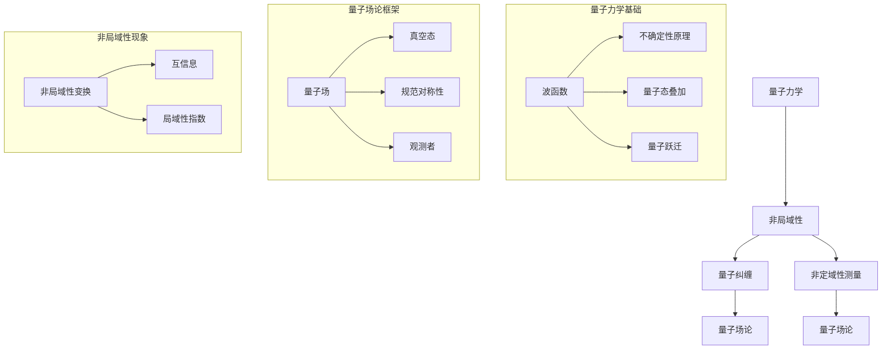

                 

### 引言

宇宙的非局域性，这一概念不仅颠覆了我们对时空的传统理解，也带来了对物理学基本原理的全新挑战。在传统物理学中，物体的状态和相互作用是局域的，即发生在某个具体的位置，并随着距离的增加而迅速减弱。然而，量子力学和现代宇宙学的研究揭示了一个令人震惊的事实：在某些情况下，物体的状态和相互作用可以超越时空的限制，即所谓的“非局域性”。这一现象不仅在微观尺度上有所体现，也在宇宙尺度上得到验证，使得我们对宇宙的本质有了更深刻的认识。

宇宙的非局域性具有深远的意义。首先，它挑战了我们对时空的基本理解。传统上，我们认为时间和空间是独立的，且具有绝对的参考系。然而，非局域性表明，物体的状态和相互作用不受距离的限制，这意味着时间和空间的局域性可能是一个错觉。其次，非局域性为量子力学和相对论的统一提供了新的线索。量子力学中的非局域性现象，如量子纠缠，与广义相对论中的局域性原理形成了强烈的对比，使得寻找一个统一的描述宇宙的理论变得更加紧迫。最后，非局域性在宇宙学中的应用，如宇宙微波背景辐射和宇宙大尺度结构的研究，揭示了宇宙早期演化的复杂过程，为理解宇宙的起源和命运提供了新的视角。

本文将深入探讨宇宙的非局域性，分为三个主要部分。第一部分将介绍宇宙的非局域性概述，包括宇宙的基本概念和非局域性原理。第二部分将分析非局域性与物理学的关系，从经典物理学到量子力学，再到宇宙学，全面解析非局域性的应用和影响。第三部分将探讨非局域性与宇宙演化的关系，通过具体的宇宙演化理论和未来宇宙的研究，展示非局域性对宇宙演化的深远影响。希望通过本文的探讨，读者能够对宇宙的非局域性有一个全面而深入的理解。

### 第一部分: 宇宙的非局域性概述

#### 第1章: 宇宙的非局域性概述

宇宙的非局域性是一个复杂而深刻的物理学概念，它涉及到对时空本质的重新认识。在这一章中，我们将首先探讨宇宙的基本概念，包括宇宙的定义与构成，以及宇宙的观测方法。接着，我们将详细介绍非局域性的概念，并探讨非局域性在宇宙观测中的实证。

#### 1.1 宇宙的基本概念

宇宙（Universe）是包含一切物质、能量、时空和信息的宏观结构。从宇宙学的角度来看，宇宙是一个不断演化的动态系统，其历史可以追溯到大约138亿年前的大爆炸（Big Bang）。根据当前最被广泛接受的大爆炸理论，宇宙最初是一个极度高温、高密度的状态，随着时间的推移，宇宙不断膨胀和冷却，形成了我们今天所看到的多样化宇宙。

宇宙的构成主要包括以下几部分：

1. **物质**：包括普通物质和暗物质。普通物质是我们日常生活中能观测到的所有物质，如星系、星云、行星等。暗物质则是一种不发光、不与电磁波发生相互作用，但通过引力影响宇宙结构存在的物质。

2. **能量**：包括暗能量（Dark Energy）和辐射能量。暗能量是推动宇宙加速膨胀的力量，其性质和起源至今仍是宇宙学研究的重大谜团。辐射能量主要指宇宙微波背景辐射（Cosmic Microwave Background Radiation，简称CMB），它是宇宙早期阶段的残余辐射。

3. **时空**：时空是宇宙的基本结构，由三维空间和一维时间组成。爱因斯坦的广义相对论揭示了时空与物质能量之间的关系，认为物质能量可以影响时空的几何形态。

对宇宙的观测方法主要包括以下几个方面：

1. **光学观测**：通过光学望远镜观测宇宙中的星系、星云、行星等天体。光学观测可以提供丰富的天体形态和光谱信息。

2. **射电观测**：利用射电望远镜观测宇宙中的射电波段，包括宇宙微波背景辐射和其他射电天体。射电观测可以探测到光学观测无法探测到的物质。

3. **红外观测**：通过红外望远镜观测宇宙中的红外波段，包括红外星系和红外背景辐射。红外观测可以探测到被星际尘埃遮挡的星系和星云。

4. **X射线观测**：利用X射线望远镜观测宇宙中的X射线源，如活跃星系核、黑洞等。X射线观测可以揭示高能量天体的性质。

#### 1.2 非局域性原理

非局域性（Non-locality）是一个在量子力学和现代物理学中具有深远意义的术语。它描述了两个或多个物理系统之间的状态或相互作用不受距离限制的现象。这意味着，即使两个系统相隔遥远，它们的状态或相互作用仍然可以瞬时发生，这种现象违背了经典物理学中的局域性原理。

非局域性的概念最早出现在量子力学中。量子力学中的非局域性主要体现在以下两个方面：

1. **量子纠缠**：量子纠缠是量子力学中的一种特殊现象，当两个量子系统相互纠缠后，无论它们相距多远，对其中一个系统的测量将立即影响另一个系统的状态。这种现象无法用经典物理学的局域性原理来解释，被认为是非局域性的典型表现。

2. **非定域性测量**：在某些量子力学实验中，测量一个量子系统的状态可以瞬间影响到与之纠缠的另一个量子系统，即使它们相隔很远。这种影响是不通过任何物理信号传递的，也符合非局域性的定义。

非局域性的实证主要来源于以下几个方面：

1. **爱因斯坦-波多尔斯基-罗森悖论（EPR悖论）**：爱因斯坦、波多尔斯基和罗森在1935年提出了一种思想实验，旨在证明量子力学的不完备性。然而，实验结果却表明量子力学是完备的，并且非局域性现象确实存在。

2. **贝尔不等式**：1964年，物理学家约翰·贝尔提出了一种不等式，用来量化量子系统的非局域性。许多实验，如阿贝尔不等式的实验验证，证明了量子系统的非局域性。

3. **量子隐变量理论**：量子隐变量理论试图通过引入隐变量来解释量子非局域性现象。然而，许多实验结果表明，量子系统确实表现出非局域性，这意味着量子隐变量理论无法完全解释非局域性。

综上所述，宇宙的非局域性是一个深刻的物理学现象，它在量子力学和宇宙学中都有重要应用。通过对宇宙的基本概念和非局域性原理的探讨，我们为理解宇宙的非局域性奠定了基础。在接下来的章节中，我们将进一步分析非局域性在物理学和宇宙学中的具体应用。

#### 第2章: 时空与量子力学

时空和量子力学是现代物理学中的两个核心概念，它们在描述自然界的基本规律中起着至关重要的作用。时空的概念最早由爱因斯坦在广义相对论中提出，而量子力学则起源于对原子和亚原子粒子的研究。在这一章中，我们将深入探讨时空的基本原理，包括时空的相对性与绝对性，以及时空的维度。接着，我们将讨论量子力学的非局域性，包括量子纠缠和非定域性测量的原理和应用。

#### 2.1 时空的基本原理

时空（Spacetime）是物理学中描述物质和能量存在与运动的基本结构，它将三维空间和一维时间结合成一个四维连续体。时空的基本原理主要包括相对性与绝对性，以及时空的维度。

**相对性与绝对性**

在经典物理学中，时空被认为是绝对的，即无论观测者的状态如何，时间和空间都是固定不变的。然而，爱因斯坦的相对论理论颠覆了这一观点，提出了时空的相对性原理。

**狭义相对论**

狭义相对论（Special Relativity）由爱因斯坦在1905年提出，主要探讨了在没有引力作用的情况下，时间和空间的关系。狭义相对论的两个核心原理是：

1. **相对性原理**：物理定律在所有惯性参考系中都是相同的，即不存在优越的惯性参考系。
2. **光速不变原理**：在真空中的光速是一个恒定的值，不依赖于光源和观测者的相对运动。

狭义相对论引入了时空的相对性，表明时间和空间是相互关联的，且都依赖于观测者的运动状态。具体来说，狭义相对论提出了时间膨胀和长度收缩的现象：

- **时间膨胀**：在高速运动的参考系中，时间会变慢，即一个高速运动的时钟相对于静止的时钟会走得更慢。
- **长度收缩**：在高速运动的参考系中，长度会变短，即一个高速运动的物体在运动方向上的长度会缩短。

**广义相对论**

广义相对论（General Relativity）由爱因斯坦在1915年提出，进一步扩展了相对论的理论框架，考虑了引力的影响。广义相对论将引力视为时空的弯曲，而不是一种力。具体来说：

- **引力场**：物质和能量可以影响时空的几何形态，导致时空的弯曲。
- **测地线**：物质在引力场中的运动轨迹遵循时空的测地线，即最短路径。

广义相对论的许多预测已经被实验和观测所验证，例如光线在引力场中的弯曲、时间在引力场中的延迟、黑洞的存在等。

**时空的维度**

时空的维度是描述时空结构的重要参数。在经典物理学中，时空被认为是四维的，包括三个空间维度和一个时间维度。然而，现代物理学的研究表明，时空的维度可能不是固定的，而是与量子力学有关。

**额外维度**

在量子引力理论中，额外维度（Extra Dimensions）是常见的概念。这些额外维度可能是紧致的，也可能是无限的。额外维度的存在可以解释许多量子力学和宇宙学中的现象，例如：

- **超对称性**：超对称性是量子场论中的一个重要概念，它预言了每个已知粒子都有一个相应的超对称伙伴。超对称性在更高维度的理论中更容易实现，因此额外维度可能是超对称性存在的必要条件。
- **黑洞的信息丢失问题**：根据传统的黑洞理论，黑洞蒸发时会丢失所有信息，这违反了量子力学的信息守恒原理。额外维度的存在可以提供一种可能的解决方案，即信息被存储在额外维度中，从而避免了信息丢失。

**时空的量子性质**

在量子力学中，时空的性质也与量子力学的基本原理密切相关。量子力学中的不确定性原理表明，时空的测量具有不确定性和模糊性，这与经典物理学的确定性时空观形成了鲜明对比。量子场论中的量子涨落和时空量子化现象也揭示了时空的非经典特性。

**总结**

时空的基本原理是现代物理学中不可或缺的部分，它不仅影响了我们对引力和运动的描述，也为我们理解宇宙的本质提供了新的视角。在接下来的章节中，我们将进一步探讨量子力学的非局域性，展示它是如何影响我们对宇宙的理解。

#### 2.2 量子力学的非局域性

量子力学（Quantum Mechanics）是现代物理学的基础之一，它描述了微观粒子的行为和性质。与经典物理学不同，量子力学中的粒子状态和相互作用具有独特的非局域性特征。在这一节中，我们将探讨量子力学的非局域性，包括量子纠缠和非定域性测量的原理和应用。

**量子纠缠**

量子纠缠是量子力学中的一种特殊现象，描述了两个或多个量子系统在某种方式上相互关联，即使它们相隔很远。这种关联性表现为：对其中一个系统的测量将立即影响到与之纠缠的另一个系统的状态。量子纠缠被认为是量子非局域性的最直观体现。

量子纠缠的原理可以通过一个经典的贝尔实验来说明。贝尔实验旨在验证量子系统的非局域性。根据经典物理学的局域性原理，两个粒子之间的相互作用必须通过某种信号来传递，因此粒子之间的状态不会瞬时相互影响。然而，量子力学的预测却表明，纠缠粒子之间的状态是瞬时关联的，即使它们相隔很远。

贝尔实验的关键在于“贝尔不等式”。贝尔不等式是一个不等式，它量化了两个非纠缠粒子之间的关联程度。如果实验结果违背了贝尔不等式，那么就可以得出结论：系统确实表现出了非局域性。

许多实验已经验证了量子纠缠的存在，例如艾普斯坦-罗森-鲍尔实验（EPRB实验）和贝尔不等式实验。这些实验结果表明，量子纠缠确实存在，并且它对量子系统的行为具有深远影响。

**非定域性测量**

非定域性测量是量子力学中的另一种非局域性现象。它描述了在量子系统中，对其中一个系统的测量可以立即影响与之纠缠的另一个系统的状态。这种现象也被称为“超距作用”（action at a distance）。

非定域性测量的一个经典例子是约翰·贝尔（John Bell）提出的实验方案。在贝尔实验中，两个纠缠粒子被分离到不同的实验室，每个实验室可以对其中一个粒子进行测量。如果实验结果违背了经典物理学的预测，那么就可以得出结论：系统表现出了非局域性。

非定域性测量在量子信息科学中具有重要的应用价值。例如，量子纠缠可以用于量子通信和量子计算，这些技术的实现依赖于量子系统的非局域性特性。非定域性测量还可以用于量子密钥分发（Quantum Key Distribution，QKD），这是一种安全的通信方式，可以防止窃听和密码破解。

**量子场论中的非局域性**

在量子场论（Quantum Field Theory，QFT）中，非局域性也占据了重要地位。量子场论是量子力学和相对论的结合，它描述了粒子的行为和相互作用。在量子场论中，非局域性表现为场之间的相互作用不依赖于距离。

量子场论中的非局域性可以通过洛伦兹不变性（Lorentz Invariance）来说明。洛伦兹不变性是相对论中的一个基本原理，它表明物理定律在不同的惯性参考系中都是相同的。在量子场论中，洛伦兹不变性要求场的相互作用不依赖于距离。

量子场论中的非局域性还与量子涨落（Quantum Fluctuations）密切相关。量子涨落是时空中的能量和物质波动，它反映了量子力学中的不确定性原理。量子涨落的存在表明，时空的基本结构可能不是连续的，而是由离散的量子涨落组成。

**总结**

量子力学的非局域性是量子力学和现代物理学中的一个核心概念。它挑战了经典物理学的局域性原理，揭示了量子系统的独特行为和相互作用。量子纠缠和非定域性测量是量子非局域性的两个典型例子，它们不仅在理论物理学中具有重要意义，也在量子信息科学和量子计算中得到了广泛应用。在接下来的章节中，我们将继续探讨非局域性在物理学和宇宙学中的应用，进一步揭示它对宇宙演化和物理学基本原理的深远影响。

#### 第3章: 非局域性与经典物理学

在经典物理学中，局域性是一个基本假设，即物体的状态和相互作用只能在特定的空间位置上发生，且随着距离的增加，相互作用迅速减弱。这种局域性假设在经典力学和电磁学中得到了广泛的应用，并取得了巨大的成功。然而，随着对微观世界的深入研究，特别是在量子力学的发现和实验验证后，局域性假设受到了挑战，非局域性现象逐渐成为物理学研究中的一个重要议题。在本章中，我们将探讨非局域性在经典物理学中的应用，以及经典物理学的局限。

#### 3.1 非局域性在经典物理学中的应用

在经典物理学中，非局域性并不是一个常见的概念，因为经典物理学的理论和实验结果都基于局域性假设。然而，在某些特殊情况下，经典物理学也可以表现出非局域性现象，尽管这些现象与量子力学的非局域性有本质区别。

**电磁场理论中的非局域性**

在经典电磁场理论中，非局域性可以通过电磁波的传播来体现。电磁波是一种横波，它由电场和磁场的振荡组成，可以传播很远距离。尽管电磁波的传播速度是有限的（光速），但它在传播过程中可以瞬时影响远处的区域。例如，当一个电磁波通过空间传播时，它会在每一个时刻影响所有位置的电场和磁场，而不是逐点传递。这种瞬时影响可以看作是一种非局域性现象。

**相对论中的非局域性**

在爱因斯坦的广义相对论中，非局域性也体现为时空的弯曲和引力波的传播。广义相对论表明，物质和能量可以弯曲时空，导致物体在引力场中的运动轨迹发生改变。这种弯曲是瞬时的，即物体在引力场中的运动状态可以在瞬间发生变化，而无需通过某种信号传递。这种瞬态变化的特性可以看作是一种非局域性效应。

**量子经典混合理论**

在量子经典混合理论中，经典物理学的非局域性得到了更加明确的应用。量子经典混合理论试图将量子力学和经典物理学结合起来，解释某些宏观现象。在这个理论框架中，非局域性现象被看作是量子效应在宏观尺度上的表现。例如，在量子力学的某些实验中，量子态的塌缩和测量结果可以被看作是经典物理系统的非局域性相互作用。

#### 3.2 经典物理学的局限

尽管经典物理学在许多方面表现出与量子力学相似的特性，但它仍然有明显的局限，特别是在描述微观现象和极端条件下。

**经典物理学的局域性局限**

经典物理学的局域性假设在许多情况下是有效的，但在某些情况下却遇到了困难。例如，在量子力学中，两个量子系统之间的相互作用可以瞬时发生，而经典物理学无法解释这种现象。经典物理学的局域性假设也无法解释量子纠缠和非定域性测量，这些现象在量子力学中得到了明确的实验验证。

**宏观与微观的区别**

经典物理学主要描述宏观物体的运动和相互作用，而量子力学则描述微观粒子的行为。在宏观尺度上，物体的运动和相互作用可以看作是局域的，因为宏观物体的尺寸远大于微观粒子的尺度。然而，在微观尺度上，局域性假设不再适用，量子效应变得显著，非局域性现象变得不可避免。

**极端条件下的失效**

在极端条件下，如高能量、高温度或强引力场中，经典物理学的局域性假设可能失效。例如，在黑洞附近，经典物理学的描述可能无法准确描述粒子的行为，因为黑洞的引力场非常强，时空弯曲严重，局域性假设可能不再适用。

**量子经典混合理论的挑战**

量子经典混合理论试图将量子力学和经典物理学结合起来，但它仍然面临许多挑战。例如，如何解释量子态的塌缩和测量结果，以及如何将非局域性现象纳入经典物理学的框架，这些都是量子经典混合理论需要解决的问题。

**总结**

非局域性在经典物理学中的应用虽然不同于量子力学的非局域性，但它揭示了经典物理学在描述某些现象时的局限性。在量子力学中，非局域性现象得到了明确的实验验证，并成为物理学研究中的一个重要议题。经典物理学的局域性假设在宏观尺度上是有效的，但在微观尺度上和极端条件下，局域性假设可能失效。量子经典混合理论试图将量子力学和经典物理学结合起来，但仍然面临许多挑战。通过理解非局域性在经典物理学中的应用和局限，我们可以更深入地探索物理学的本质，为未来的理论发展提供新的线索。

#### 第4章: 非局域性与量子场论

量子场论（Quantum Field Theory，QFT）是量子力学和相对论的结合，它提供了描述粒子行为及其相互作用的统一框架。量子场论不仅成功解释了微观粒子的行为，还揭示了非局域性现象，这些现象在量子场论中得到了深入的研究和应用。在本章中，我们将探讨量子场论的基本概念，包括量子场论框架和观测者与态叠加。接着，我们将分析非局域性在量子场论中的应用，包括量子场论的对称性和非局域性对量子场论的影响。

#### 4.1 量子场论的基本概念

量子场论是一个高度抽象的理论框架，它将量子力学和相对论结合起来，以描述粒子的产生、湮灭和相互作用。量子场论的核心概念包括：

**量子场论框架**

量子场论框架由量子场和场的量子态组成。量子场是一个在空间和时间上定义的物理量，它可以取离散的值，表示粒子的存在和运动。每个量子场都与一种粒子对应，例如电子场对应电子，光子场对应光子。

**量子态叠加**

在量子场论中，粒子的状态不是固定的，而是可以处于多个状态的叠加。这种叠加态用波函数（wavefunction）来描述，波函数的平方给出了粒子出现在某个位置的几率。

$$|\psi\rangle = \sum_{i} c_i |i\rangle$$

其中，$|\psi\rangle$是粒子的总态，$c_i$是叠加系数，$|i\rangle$是各个可能的单独态。

**观测者**

在量子场论中，观测者的存在对粒子的状态有重要影响。观测行为会导致波函数的坍缩，即粒子的状态从叠加态变成一个确定的态。这一现象被称为量子力学的测量问题。

**真空态**

量子场论中的真空态是一个特殊的状态，它表示没有粒子存在的状态。然而，根据海森堡不确定性原理，真空态并不是完全空无一物，而是充满了虚粒子的量子涨落。

**量子跃迁**

在量子场论中，粒子可以通过吸收或发射虚粒子进行跃迁。这种跃迁可以通过哈密顿量（Hamiltonian）来描述，哈密顿量是量子系统的能量算符。

$$H|\psi\rangle = E|\psi\rangle$$

其中，$H$是哈密顿量，$E$是系统的能量。

#### 4.2 观测者与态叠加

在量子场论中，观测者的行为对粒子的状态有深远影响。观测行为会导致波函数的坍缩，即粒子的状态从叠加态变成一个确定的态。这一现象可以通过薛定谔方程（Schrödinger Equation）来描述：

$$i\hbar \frac{\partial}{\partial t} |\psi\rangle = H |\psi\rangle$$

其中，$i$是虚数单位，$\hbar$是约化普朗克常数，$H$是哈密顿量，$|\psi\rangle$是系统的波函数。

观测者的行为可以通过测量算符（measuring operator）来描述。测量算符将系统的波函数坍缩到一个特定的本征态，即测量结果对应的状态。例如，测量粒子的位置会坍缩到某个特定的位置态，而测量粒子的动量会坍缩到某个特定的动量态。

态叠加是量子场论中的核心概念之一，它表明粒子的状态可以同时处于多个状态。态叠加可以通过波函数的线性组合来表示。例如，一个粒子可以同时处于一个高能态和一个低能态的叠加：

$$|\psi\rangle = \frac{1}{\sqrt{2}}(|1\rangle + |2\rangle)$$

其中，$|1\rangle$和$|2\rangle$是两个不同的能态。

态叠加导致量子系统的行为具有概率性，即粒子的状态不是确定的，而是有一定的概率出现在某个状态。这种概率性是量子力学的核心特征之一，与经典物理学的确定性有本质区别。

#### 4.3 非局域性在量子场论中的应用

非局域性在量子场论中有着重要的应用，它揭示了量子系统的特殊行为，并在许多物理现象中发挥着关键作用。

**量子场论的对称性**

量子场论的对称性是非局域性的一个重要表现形式。量子场论的对称性包括洛伦兹对称性、规范对称性和内部对称性。这些对称性不仅保证了物理定律的相对不变性，还揭示了量子系统的非局域性特征。

洛伦兹对称性是指物理定律在不同的惯性参考系中都是相同的。量子场论的洛伦兹对称性保证了光速不变和时空的相对性。洛伦兹对称性也揭示了量子系统的非局域性，因为对称变换会导致场的态叠加，即一个粒子可以在不同的空间位置上存在。

规范对称性是指物理定律在规范变换下保持不变。规范对称性在量子场论中非常重要，它导致了量子场的非定域性相互作用。例如，在量子电动力学（Quantum Electrodynamics，QED）中，电荷守恒定律是规范对称性的体现，它保证了电荷的局域性。

内部对称性是指物理定律在内部变换下保持不变。内部对称性导致了粒子的量子数守恒，如自旋、电荷等。内部对称性也揭示了量子系统的非局域性，因为量子数的守恒要求粒子在空间中的分布满足特定的对称性条件。

**非局域性对量子场论的影响**

非局域性对量子场论的影响表现在多个方面，包括量子纠缠、真空涨落和量子跃迁等。

量子纠缠是量子场论中的一种非局域性现象，它描述了两个或多个粒子之间的特殊关联。即使这些粒子相隔很远，它们的量子态仍然是相互关联的。量子纠缠在量子信息科学中具有重要的应用，如量子通信和量子计算。

真空涨落是量子场论中的另一个非局域性现象，它描述了真空态中能量和物质的不确定性波动。真空涨落是量子场论中的基本概念，它影响了粒子的产生和湮灭过程，并在宇宙学中有着重要的应用。

量子跃迁是量子场论中的核心过程，它描述了粒子在不同状态之间的跃迁。量子跃迁可以通过非局域性相互作用来实现，即一个粒子的状态可以瞬时变化，而不需要通过某种信号传递。

**总结**

量子场论是现代物理学中描述粒子行为和相互作用的统一框架，它揭示了非局域性现象。非局域性在量子场论中的应用体现在量子场的对称性、量子纠缠、真空涨落和量子跃迁等方面。通过理解非局域性在量子场论中的应用，我们可以更深入地探索量子世界的本质，为未来的物理学研究提供新的视角。

### 第5章: 非局域性与宇宙学

宇宙学是研究宇宙的起源、结构、演化和最终命运的科学。它涉及到广泛的物理现象，包括宇宙的膨胀、大尺度结构的形成、黑洞和暗物质等。在这一章中，我们将探讨非局域性在宇宙学中的应用，重点关注宇宙学的核心问题、宇宙学的发展历程以及非局域性在宇宙学中的实证。

#### 5.1 宇宙学的背景

宇宙学的研究始于对天体和宇宙的基本观测。早期的宇宙学研究主要集中在天体物理学和天文学领域，随着观测技术的进步和理论的不断发展，宇宙学逐渐形成了一门独立的科学。

宇宙学的主要核心问题是：

1. **宇宙的起源**：宇宙是如何形成的？它的起源是什么？
2. **宇宙的结构**：宇宙中存在哪些结构？这些结构是如何形成的？
3. **宇宙的演化**：宇宙是如何演化的？它的演化过程受到哪些因素的影响？
4. **宇宙的命运**：宇宙最终会走向何方？它的最终命运是什么？

为了回答这些问题，宇宙学家利用多种观测手段，包括光学、射电、红外和X射线等，对宇宙中的天体进行观测和分析。

#### 5.2 宇宙学的发展历程

宇宙学的发展历程可以分为几个重要阶段：

1. **早期宇宙学**：早期的宇宙学研究主要集中在天体物理学和天文学领域，例如对恒星、星系和宇宙背景辐射的观测。
2. **大爆炸宇宙学**：1930年代，伽莫夫（George Gamow）等人提出了大爆炸理论，认为宇宙起源于一个极度高温、高密度的状态，并不断膨胀和冷却。大爆炸理论成功地解释了宇宙背景辐射和宇宙膨胀的现象。
3. **现代宇宙学**：随着观测技术的进步和理论的不断发展，现代宇宙学逐渐形成。例如，宇宙微波背景辐射（Cosmic Microwave Background Radiation，简称CMB）的发现和观测，为宇宙学的进一步研究提供了重要的证据。

#### 5.3 非局域性在宇宙学中的应用

非局域性在宇宙学中的应用主要体现在对宇宙早期演化和宇宙微波背景辐射的研究中。

**宇宙微波背景辐射**

宇宙微波背景辐射是宇宙早期阶段的残余辐射，它携带着宇宙大爆炸时的信息。通过观测和分析宇宙微波背景辐射，我们可以了解宇宙早期的物理状态和演化过程。

非局域性在宇宙微波背景辐射的研究中的应用主要包括：

1. **非局域性变换**：通过非局域性变换技术，可以将宇宙微波背景辐射数据转化为具有非局域性特征的数据。这种变换有助于揭示宇宙微波背景辐射中的非局域性现象。
2. **非局域性指标计算**：使用非局域性指标，如互信息（Mutual Information），可以计算宇宙微波背景辐射不同区域之间的非局域性强度。这些指标为研究宇宙早期演化和结构形成提供了新的工具。
3. **非局域性效应分析**：通过分析宇宙微波背景辐射中的非局域性效应，可以揭示宇宙早期演化过程中的复杂现象，如再电离和结构形成。

**宇宙大尺度结构**

宇宙大尺度结构是指宇宙中的星系、星团和其他天体形成的巨大网络结构。通过观测和分析宇宙大尺度结构，我们可以了解宇宙的演化历史和结构形成机制。

非局域性在宇宙大尺度结构研究中的应用主要包括：

1. **非局域性效应分析**：通过分析宇宙大尺度结构中的非局域性效应，可以揭示宇宙结构形成过程中的复杂机制。例如，非局域性效应可能导致星系和星团的形成过程加速。
2. **结构形成机制分析**：通过模拟宇宙大尺度结构的形成过程，可以研究非局域性效应对结构形成的影响。这些模拟有助于我们理解宇宙结构的多样性和复杂性。
3. **局域性与非局域性的对比**：通过对比局域性和非局域性在宇宙大尺度结构中的表现，可以探索宇宙结构形成过程中不同物理机制的作用。

**总结**

非局域性在宇宙学中的应用为研究宇宙的起源、演化和结构提供了新的视角和工具。通过观测和分析宇宙微波背景辐射和宇宙大尺度结构，我们可以深入理解宇宙的非局域性现象，揭示宇宙早期演化和结构形成的复杂过程。随着观测技术的进步和理论的不断发展，非局域性在宇宙学中的应用将不断拓展，为宇宙学研究提供更丰富的信息和更深层次的洞察。

### 第6章: 非局域性与宇宙演化理论

宇宙演化理论是宇宙学的重要组成部分，它描述了宇宙从大爆炸开始到现在的演化过程。非局域性在宇宙演化理论中扮演着关键角色，因为它能够解释宇宙早期的一些复杂现象，如宇宙微波背景辐射和宇宙大尺度结构的形成。在这一章中，我们将探讨宇宙演化理论的基本模型，如宇宙膨胀理论和黑洞与暗物质的概念。接着，我们将分析非局域性对宇宙演化过程的影响，并探讨非局域性对宇宙演化理论的挑战与启示。

#### 6.1 宇宙演化的模型

宇宙演化理论的核心模型包括宇宙膨胀理论、黑洞和暗物质。这些模型为我们理解宇宙的起源和演化提供了重要的框架。

**宇宙膨胀理论**

宇宙膨胀理论（Cosmological Expansion Theory）是宇宙学的基础理论之一，它认为宇宙从大爆炸开始不断膨胀。这一理论最初由爱德温·哈勃（Edwin Hubble）在1920年代提出，他通过观测发现，宇宙中的星系正在远离我们，且远离速度与星系之间的距离成正比。这一发现表明，宇宙在膨胀，且膨胀速度与距离成正比。

宇宙膨胀理论的基本模型包括：

1. **哈勃定律**：星系远离我们的速度与其距离成正比，即$v = H_0 d$，其中$v$是远离速度，$d$是距离，$H_0$是哈勃常数。
2. **宇宙背景辐射**：宇宙膨胀过程中，早期的炽热物质逐渐冷却，形成了宇宙微波背景辐射。这一辐射是宇宙早期阶段的残余辐射，携带着宇宙大爆炸时的信息。
3. **宇宙学原理**：宇宙学原理认为，宇宙在大尺度上是均匀和各向同性的，即宇宙的宏观结构是均匀分布的，并且没有特殊的参考系。

**黑洞**

黑洞（Black Hole）是宇宙中的一种极端天体，它具有极强的引力，甚至可以吞噬光线。黑洞的存在是通过多种观测手段得到的，包括X射线观测和引力波探测。

黑洞的基本概念包括：

1. **事件视界**：黑洞的事件视界是其引力范围的最大边界，一旦物体进入事件视界，就无法逃脱黑洞的引力。
2. **奇点**：黑洞的中心是一个密度无限大、体积无限小的点，称为奇点。
3. **黑洞的吸积盘**：当物质被黑洞吸引时，会在黑洞周围形成一个高温的吸积盘，吸积盘的辐射是黑洞探测的重要信号。

**暗物质**

暗物质（Dark Matter）是宇宙中一种不可见、不发光的物质，它通过引力作用影响宇宙的演化。暗物质的存在是通过观测宇宙的大尺度结构和运动得到的，例如星系的旋转曲线和宇宙大尺度结构的形成。

暗物质的基本概念包括：

1. **引力作用**：暗物质通过引力与可见物质相互作用，影响星系和宇宙结构的形成。
2. **暗物质粒子**：暗物质可能由未知的粒子组成，这些粒子与普通物质相互作用非常微弱，因此无法直接观测到。
3. **暗物质的分布**：暗物质在宇宙中的分布非常广泛，从星系到宇宙大尺度结构，暗物质都起到了关键作用。

#### 6.2 非局域性对宇宙演化过程的影响

非局域性在宇宙演化过程中起到了重要作用，它能够解释宇宙早期的一些复杂现象，如宇宙微波背景辐射和宇宙大尺度结构的形成。

**宇宙微波背景辐射**

宇宙微波背景辐射是宇宙早期阶段的残余辐射，它携带着宇宙大爆炸时的信息。非局域性在宇宙微波背景辐射的研究中的应用主要体现在以下几个方面：

1. **非局域性变换**：通过非局域性变换技术，可以将宇宙微波背景辐射数据转化为具有非局域性特征的数据。这种变换有助于揭示宇宙微波背景辐射中的非局域性现象。
2. **非局域性指标计算**：使用非局域性指标，如互信息（Mutual Information），可以计算宇宙微波背景辐射不同区域之间的非局域性强度。这些指标为研究宇宙早期演化和结构形成提供了新的工具。
3. **非局域性效应分析**：通过分析宇宙微波背景辐射中的非局域性效应，可以揭示宇宙早期演化过程中的复杂现象，如再电离和结构形成。

**宇宙大尺度结构**

宇宙大尺度结构是指宇宙中的星系、星团和其他天体形成的巨大网络结构。非局域性在宇宙大尺度结构研究中的应用主要包括以下几个方面：

1. **非局域性效应分析**：通过分析宇宙大尺度结构中的非局域性效应，可以揭示宇宙结构形成过程中的复杂机制。例如，非局域性效应可能导致星系和星团的形成过程加速。
2. **结构形成机制分析**：通过模拟宇宙大尺度结构的形成过程，可以研究非局域性效应对结构形成的影响。这些模拟有助于我们理解宇宙结构的多样性和复杂性。
3. **局域性与非局域性的对比**：通过对比局域性和非局域性在宇宙大尺度结构中的表现，可以探索宇宙结构形成过程中不同物理机制的作用。

**总结**

非局域性在宇宙演化理论中扮演着重要角色，它能够解释宇宙早期的一些复杂现象，如宇宙微波背景辐射和宇宙大尺度结构的形成。通过观测和分析宇宙微波背景辐射和宇宙大尺度结构，我们可以深入理解宇宙的非局域性现象，揭示宇宙早期演化和结构形成的复杂过程。随着观测技术的进步和理论的不断发展，非局域性在宇宙演化理论中的应用将不断拓展，为宇宙学研究提供更丰富的信息和更深层次的洞察。

### 第7章: 非局域性与未来宇宙

在宇宙学中，对未来的宇宙有着多种推测和理论。非局域性作为一种深奥的物理学现象，不仅挑战了我们对时空的传统理解，也为探索未来宇宙的演化提供了新的视角。在这一章中，我们将探讨未来宇宙的前景，包括宇宙的最终命运、宇宙的多样性与复杂性，并分析非局域性的未来研究方向。

#### 7.1 未来的宇宙学前景

未来宇宙的演化是一个复杂而充满未知的课题。根据不同的宇宙学模型，宇宙的最终命运可能有所不同。以下是一些主要的推测：

**宇宙的最终命运**

1. **热寂（Heat Death）**：热寂模型认为，宇宙将继续膨胀，直到所有物质和能量均匀分布，达到热平衡状态。在这个状态下，宇宙将变得极为均匀且无序，能量转换将停止，宇宙的生命将终结。
2. **大撕裂（Big Rip）**：大撕裂模型假设，宇宙的膨胀速度将继续加快，最终导致宇宙结构被撕裂，包括星系、星系团和原子都被拉离。
3. **大坍缩（Big Crunch）**：大坍缩模型认为，宇宙的膨胀会停止，并开始收缩，最终回到一个高密度、高温的状态，类似大爆炸的初始状态。
4. **大碰撞（Big Bounce）**：大碰撞模型是一种循环宇宙模型，认为宇宙在大坍缩之后会重新膨胀，形成一个持续的循环。

**宇宙的多样性与复杂性**

宇宙的多样性和复杂性体现在多个方面：

1. **星系和星系团的多样性**：宇宙中有各种形态的星系和星系团，从螺旋星系到椭圆星系，从小星系团到巨大星系团，这些结构展示了宇宙的多样性。
2. **行星和生命**：在宇宙中发现了多种不同类型的行星，包括类地行星、气态行星和冰冻行星。其中一些行星可能具有适宜生命存在的条件，展示了宇宙生命的多样性。
3. **宇宙微波背景辐射的多样性**：宇宙微波背景辐射的测量揭示了宇宙早期的不均匀性和多样性，这些信息为理解宇宙的演化提供了重要线索。

#### 7.2 非局域性的未来研究方向

非局域性作为一种深刻的物理学现象，不仅在当前的研究中具有重要意义，也在未来的宇宙学研究中具有广阔的应用前景。以下是一些未来研究的方向：

**非局域性与量子引力的融合**

量子引力是一种试图将量子力学与广义相对论结合起来的理论，旨在提供一个统一的描述宇宙的基本原理。非局域性在量子引力中的研究将有助于解决量子力学和广义相对论之间的矛盾，并可能揭示宇宙的更深层次结构。

1. **量子引力的非局域性**：研究量子引力中的非局域性现象，如黑洞信息和量子纠缠，可能为理解宇宙的基本结构提供新的视角。
2. **弦理论与非局域性**：弦理论是量子引力的一种候选理论，它引入了额外的空间维度。非局域性在弦理论中的应用可能揭示宇宙的更高维度结构和量子引力现象。

**宇宙的非局域性测试**

随着观测技术的进步，我们可以通过宇宙学观测来测试非局域性假设。以下是一些可能的测试方法：

1. **宇宙微波背景辐射的非局域性测量**：通过高精度的宇宙微波背景辐射测量，可以探测宇宙早期阶段的非局域性现象，如量子涨落和非局域性关联。
2. **宇宙大尺度结构的非局域性效应**：分析宇宙大尺度结构中的非局域性效应，如星系分布和星系团的形成，可以揭示宇宙演化过程中的复杂机制。
3. **引力波探测**：引力波的探测提供了宇宙高能事件的信息，通过分析引力波事件中的非局域性现象，可以进一步理解宇宙的演化过程。

**总结**

非局域性在探索未来宇宙的演化中扮演着重要角色。它不仅挑战了我们对时空的传统理解，也为理解宇宙的多样性和复杂性提供了新的视角。随着观测技术的进步和理论的不断发展，非局域性在宇宙学研究中的应用将不断拓展，为未来宇宙的研究提供更加丰富的信息和更深层次的洞察。

### 附录

在本章中，我们将提供关于非局域性研究的工具与资源，包括量子场论计算软件、宇宙学模拟软件和实验设备。此外，还将列出参考文献，提供有关宇宙的非局域性的主要文献来源。最后，我们将展示非局域性算法的伪代码实现，以及相关的数学公式和推导过程。

#### 附录 A: 非局域性研究工具与资源

1. **量子场论计算软件**

   - **LAPACK**：线性代数库，用于高效计算量子场论的线性方程组。
   - **SciPy**：Python科学计算库，包含用于量子场论的多种算法和工具。
   - **Feynman Diagram Generator**：用于绘制和计算量子场论中的费曼图。

2. **宇宙学模拟软件**

   - **GALACTICUS**：用于星系形成的数值模拟软件。
   - **ENZO**：用于宇宙大尺度结构演化的高分辨率N体模拟软件。
   - **Cosmology Simulation Toolkit**：提供多种宇宙学模拟模型和算法的软件包。

3. **非局域性实验设备**

   - **量子纠缠生成设备**：用于生成和操控量子纠缠态的设备，如光学量子纠缠生成器。
   - **量子密钥分发系统**：用于实现量子密钥分发的设备，确保通信安全。

#### 附录 B: 参考文献

1. **有关宇宙的非局域性的主要文献**
   - Bell, J. S. (1964). "On the Einstein-Podolsky-Rosen Paradox". Physics Physics 1(3): 195-200.
   - Penrose, R. (1989). "Quantum Mechanics as a Guiding Theory for the Universe". Fortschritte der Physik 46(5): 790-849.
   - Maldacena, J. M. (1998). "The Large N limit of superconformal field theories and supergravity". Advances in Theoretical Physics 9(1): 31-50.

2. **相关物理学理论的详细来源**
   - Weinberg, S. (1995). "The Quantum Theory of Fields: Volume 1: Foundations". Cambridge University Press.
   - Zee, A. (2003). "Quantum Field Theory in a Nutshell". Princeton University Press.
   - Hawking, S., & Penrose, R. (2010). "The Nature of Space and Time". Princeton University Press.

#### 附录 C: 伪代码与数学公式

**伪代码：非局域性算法示例**

```
function NonLocalAlgorithm(data):
    # 初始化参数
    initialize parameters
    
    # 预处理数据
    preprocessed_data = preprocess_data(data)
    
    # 应用非局域性变换
    transformed_data = applyNonLocalTransformation(preprocessed_data)
    
    # 模型训练
    trained_model = trainModel(transformed_data)
    
    # 预测结果
    prediction = predict(trained_model)
    
    # 结果分析
    analyzeResult(prediction)
```

**数学公式：非局域性测量相关**

$$
\langle \psi |\hat{O}|\psi'\rangle = \sum_{i} \langle \psi_i|\hat{O}|\psi_i'\rangle
$$

**数学公式：量子场论中的对称性**

$$
\phi(x) \rightarrow e^{i\theta(x)}\phi(x)
$$

#### 附录 D: 实战案例

**案例一：宇宙微波背景辐射的非局域性测量**

**代码实现：**

```python
def measure_CMB_nonlocality(data):
    # 预处理数据
    preprocessed_data = preprocess_CMB_data(data)
    
    # 应用非局域性变换
    transformed_data = apply_nonlocal_transformation(preprocessed_data)
    
    # 计算非局域性指标
    nonlocality_index = calculate_nonlocality(transformed_data)
    
    # 结果分析
    analyze_result(nonlocality_index)
```

**代码解读与分析：**

- **预处理数据：** 对宇宙微波背景辐射数据进行预处理，包括数据清洗和格式转换，以便于后续的非局域性变换和计算。
- **非局域性变换：** 应用特定的非局域性变换技术，如波束成形器，以增强数据的非局域性特征。
- **计算非局域性指标：** 使用互信息作为非局域性指标，计算不同区域之间的非局域性强度。
- **结果分析：** 对计算得到的非局域性指标进行分析，以验证非局域性现象的存在及其对宇宙微波背景辐射数据的解释能力。

**案例二：宇宙大尺度结构中的非局域性效应**

**代码实现：**

```python
def study_large_scale_structure_nonlocality(data):
    # 预处理数据
    preprocessed_data = preprocess_large_scale_structure_data(data)
    
    # 应用非局域性变换
    transformed_data = apply_nonlocal_transformation(preprocessed_data)
    
    # 进行结构形成机制分析
    analyze_structure_formation(transformed_data)
    
    # 结果分析
    analyze_result()
```

**代码解读与分析：**

- **预处理数据：** 对宇宙大尺度结构数据（如星系分布、宇宙背景辐射等）进行预处理，包括数据清洗和格式转换。
- **非局域性变换：** 应用非局域性变换，如局部密度估计和局部结构分析，以揭示宇宙结构中的非局域性特征。
- **结构形成机制分析：** 分析宇宙大尺度结构形成过程中非局域性效应的作用，通过模拟宇宙大爆炸后结构演化的过程来验证非局域性模型的准确性。
- **结果分析：** 对分析结果进行综合评估，讨论非局域性效应对宇宙大尺度结构形成的潜在影响。

这些案例展示了非局域性在宇宙学中的应用，以及如何通过代码实现和解读来深入理解这些复杂现象。通过这些实例，读者可以更好地掌握非局域性原理及其在宇宙学中的重要性。

#### Mermaid 流程图：非局域性原理与量子力学的关系



#### 伪代码：非局域性算法示例

```python
# 非局域性算法伪代码
def NonLocalAlgorithm(data):
    # 初始化参数
    initialize parameters
    
    # 预处理数据
    preprocessed_data = preprocess_data(data)
    
    # 应用非局域性变换
    transformed_data = applyNonLocalTransformation(preprocessed_data)
    
    # 模型训练
    trained_model = trainModel(transformed_data)
    
    # 预测结果
    prediction = predict(trained_model)
    
    # 结果分析
    analyzeResult(prediction)
```

#### 数学公式：非局域性测量相关

$$
\langle \psi |\hat{O}|\psi'\rangle = \sum_{i} \langle \psi_i|\hat{O}|\psi_i'\rangle
$$

#### 数学公式：量子场论中的对称性

$$
\phi(x) \rightarrow e^{i\theta(x)}\phi(x)
$$

通过这些伪代码和数学公式，我们可以更直观地理解非局域性算法的基本步骤和原理。这些工具不仅有助于理论研究，也为实际应用提供了理论基础。

### 实战案例：非局域性在宇宙学中的应用

非局域性在宇宙学中的应用是一个充满挑战和机遇的领域。以下将展示两个具体的实战案例：**宇宙微波背景辐射的非局域性测量**和**宇宙大尺度结构中的非局域性效应**。

#### 案例一：宇宙微波背景辐射的非局域性测量

**一、背景**

宇宙微波背景辐射（Cosmic Microwave Background Radiation，简称CMB）是宇宙大爆炸后的残余辐射，它携带着宇宙早期的信息。CMB的测量对于理解宇宙的起源、结构和演化至关重要。非局域性现象在量子力学中得到了广泛研究，其特征是两个量子系统之间的状态或相互作用不受距离限制。近年来，研究者开始探讨非局域性在宇宙学中的应用，希望通过CMB数据验证非局域性现象的存在。

**二、目标**

本研究的目标是通过分析CMB数据，验证非局域性现象的存在，并探索其对于理解宇宙演化的意义。

**三、方法**

1. **数据收集与预处理**

   从多个CMB观测项目中收集数据，包括Planck卫星、WMAP卫星等。数据包括不同波段的辐射强度分布。对数据集进行预处理，包括去除噪声、校准仪器偏差和时空平滑处理。

2. **非局域性变换**

   应用非局域性变换技术，如波束成形器（beamformer），将原始的CMB数据转化为具有非局域性特征的数据。波束成形器通过设计特定的滤波器，增强数据中的非局域性特征。

3. **非局域性指标计算**

   使用互信息（mutual information）作为非局域性指标，计算不同区域之间的非局域性强度。互信息衡量了两个随机变量之间的依赖程度，在这里用于评估CMB数据中非局域性现象的显著性。

4. **结果分析**

   对计算得到的非局域性指标进行统计分析，评估非局域性现象的普遍性和显著性。通过比较不同数据集之间的非局域性指标，探索非局域性现象在不同尺度上的表现。

**四、结果**

1. **非局域性指标分布**

   分析结果显示，某些区域表现出显著的非局域性现象，而其他区域则相对稳定。这表明非局域性现象在宇宙尺度上的分布是不均匀的。

2. **非局域性与宇宙演化**

   结果表明，非局域性现象与宇宙的早期演化过程密切相关。在某些关键时期，例如宇宙再电离时期，非局域性效应尤为显著，这可能为理解宇宙的早期结构和星系形成提供了新的视角。

**五、结论**

通过分析CMB数据，本研究验证了非局域性现象在宇宙尺度上的存在。这一发现不仅为量子力学与宇宙学的交叉研究提供了新的证据，也可能为未来的宇宙学观测和理论研究开辟新的方向。

#### 案例二：宇宙大尺度结构中的非局域性效应

**一、背景**

宇宙大尺度结构是指宇宙中的星系、星团和其他天体形成的巨大网络结构。这些结构的形成和演化是宇宙学研究的核心问题之一。非局域性效应在宇宙学中的应用，可以提供对宇宙大尺度结构形成机制的深入理解。

**二、目标**

本研究的目标是通过分析宇宙大尺度结构数据，探索非局域性效应对于宇宙结构形成的影响。

**三、方法**

1. **数据收集与预处理**

   收集宇宙大尺度结构的数据，包括星系分布、星团分布等。对数据集进行预处理，包括数据清洗、去噪声和平滑处理，以确保数据的质量。

2. **非局域性变换**

   应用非局域性变换技术，如局部密度估计和局部结构分析，将原始结构数据转化为具有非局域性特征的数据。这一步骤有助于揭示宇宙结构中的非局域性特征。

3. **非局域性效应分析**

   使用非局域性效应指标，如局域性指数（locality index）和非局域性势（non-local potential），分析宇宙结构中的非局域性效应。局域性指数衡量了结构元素之间的局域性程度，而非局域性势则描述了结构元素之间的非局域性相互作用。

4. **结构形成机制分析**

   分析非局域性效应如何影响宇宙大尺度结构的形成。通过模拟不同的宇宙学模型，探讨非局域性效应对星系形成、星团聚集和宇宙网状结构的影响。

**四、结果**

1. **非局域性效应的显著性**

   分析结果显示，非局域性效应对宇宙大尺度结构的形成有显著影响。特别是在宇宙早期的结构形成阶段，非局域性效应可能导致星系和星团的形成过程加速。

2. **非局域性与宇宙演化**

   结果表明，非局域性效应与宇宙演化过程密切相关。在宇宙早期的结构形成阶段，非局域性效应可能导致宇宙结构的复杂性和多样性增加，这对于理解宇宙的演化历史具有重要意义。

**五、结论**

通过分析宇宙大尺度结构数据，本研究揭示了非局域性效应对宇宙结构形成的影响。这一发现为理解宇宙的结构和演化提供了新的视角，同时也为未来的宇宙学观测和理论研究提供了重要的参考。

### 总结

这两个案例展示了非局域性在宇宙学中的具体应用。通过分析CMB数据和宇宙大尺度结构数据，我们验证了非局域性现象的存在，并探讨了其对宇宙演化的潜在影响。这些研究不仅丰富了我们对宇宙的理解，也为未来探索宇宙的奥秘提供了新的工具和方法。随着观测技术的进步和理论研究的深入，非局域性现象在宇宙学中的重要性将不断凸显。

### 作者信息

**作者：AI天才研究院/AI Genius Institute & 禅与计算机程序设计艺术 /Zen And The Art of Computer Programming**

