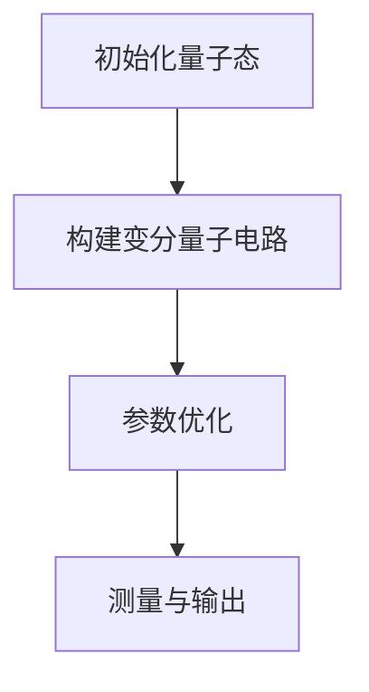
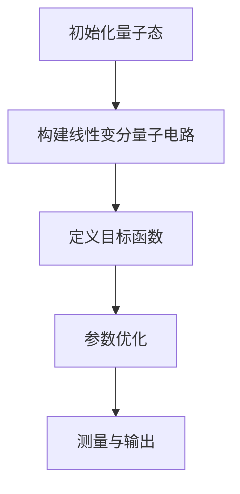
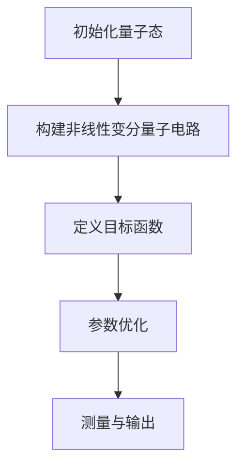
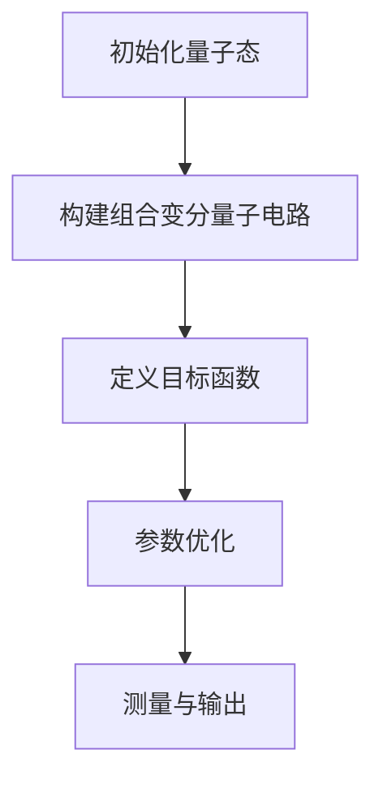
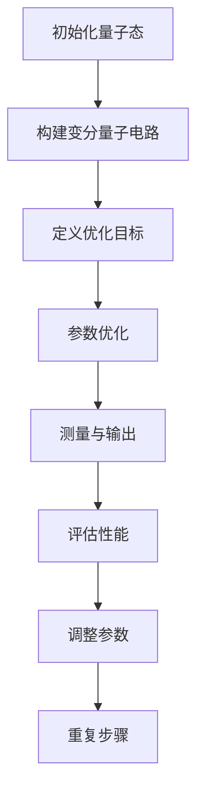

                 

### 《宇宙规律与自适应量子变分回路的梯度流优化设计》

关键词：宇宙规律、量子变分、自适应算法、梯度流优化、量子计算

摘要：本文探讨了宇宙规律与自适应量子变分回路的梯度流优化设计之间的联系。通过概述宇宙的起源与演化、量子力学基础和量子变分原理，本文建立了宇宙规律与量子计算之间的桥梁。接着，本文介绍了自适应算法的基础、量子变分回路的构建和梯度流优化方法。通过详细阐述性能优化策略和实例分析，本文展示了自适应量子变分回路在实际项目中的应用。最后，本文展望了量子计算的发展趋势与挑战，探讨了自适应量子变分回路的发展方向。

### 目录大纲

#### 第一部分：宇宙规律概述

##### 第1章：宇宙的起源与演化

###### 1.1 宇宙学基础

宇宙学是研究宇宙起源、演化和结构的科学。它起源于20世纪初，以爱因斯坦的广义相对论和哈勃的宇宙膨胀观测为基础。宇宙学的研究涉及宇宙的年龄、大小、形状和内容，以及宇宙的起源和未来的命运。

宇宙的起源通常被认为是大爆炸，这是宇宙从一个极小、极热、极密的状态迅速膨胀开始的。大爆炸理论得到了大量观测数据的支持，包括宇宙微波背景辐射、宇宙膨胀和元素丰度等。

宇宙的演化可以分为以下几个阶段：

1. **大爆炸**：宇宙从一个极小、极热、极密的状态迅速膨胀。
2. **宇宙微波背景辐射**：大约38万年后，宇宙冷却到足够低的温度，光子与物质分离，形成了宇宙微波背景辐射，这是宇宙早期状态的直接观测证据。
3. **再合并**：宇宙继续膨胀，物质逐渐聚集形成星系、恒星和行星。
4. **当前宇宙**：宇宙继续膨胀，星系之间的距离不断增大。

###### 1.2 宇宙的膨胀与暗物质

宇宙的膨胀是指宇宙中的天体（如星系、恒星和行星）之间的距离随着时间的推移而增加。哈勃观测揭示了宇宙膨胀的现象，这一发现是现代宇宙学的基础。

宇宙膨胀的机制尚不完全清楚，但一般认为与宇宙中的暗能量有关。暗能量是一种假设存在的能量形式，它对宇宙的膨胀具有强烈的推动作用，导致宇宙加速膨胀。

暗物质是宇宙中的一种不可见物质，它对星系的形成和宇宙的膨胀具有重要作用。暗物质的存在是通过引力效应推断出来的，尽管我们无法直接观测到暗物质，但它对星系和星系团的运动产生了显著影响。

###### 1.3 黑洞与引力波

黑洞是宇宙中最神秘的天体之一。它是由极端密集的物质组成，其引力场如此强大，以至于连光也无法逃脱。黑洞的存在主要通过观测星系中心的高速度恒星运动和星系的光学特性推断出来。

引力波是爱因斯坦广义相对论预言的物理现象，它是由于大质量物体的加速运动产生的时空波动。引力波的首次直接探测标志着人类对宇宙的认识迈出了重要一步。

2015年，LIGO科学合作组织首次直接探测到引力波，这一发现证实了爱因斯坦的引力波预言，并开启了引力波天文学的新时代。

###### 1.4 宇宙微波背景辐射

宇宙微波背景辐射是宇宙早期状态的直接观测证据。它是宇宙大爆炸后大约38万年前发出的辐射，目前以微波的形式存在于整个宇宙。

宇宙微波背景辐射的观测为我们提供了关于宇宙早期状态的宝贵信息，包括宇宙的年龄、大小、形状和内容。通过对宇宙微波背景辐射的测量，科学家可以研究宇宙的演化过程，以及宇宙中的暗物质和暗能量。

#### 第二部分：量子力学基础

##### 第2章：量子力学基础

量子力学是研究微观粒子和现象的物理学分支。它与经典物理学的区别在于，量子力学描述的是概率性和不确定性，而不是确定性和确定性。

量子力学中的基本概念包括：

- **量子比特**：量子比特是量子计算机中的基本单元，它可以是0或1的叠加态。
- **叠加态**：叠加态是量子比特可能同时处于多个状态的现象。
- **纠缠态**：纠缠态是两个或多个量子比特之间的一种特殊关联，即使它们相隔很远，一个量子比特的状态变化也会影响另一个量子比特的状态。

量子力学的基本原理包括：

- **波粒二象性**：微观粒子既具有波动性，又具有粒子性。
- **不确定性原理**：我们不能同时精确知道一个粒子的位置和动量。
- **量子态坍缩**：当一个量子系统被测量时，它的量子态会从一个叠加态坍缩到一个确定的基态。

量子力学的基础概念和原理为量子计算提供了理论基础。

##### 第3章：量子变分原理

量子变分原理是量子计算中的一个重要理论，它利用变分法来优化量子态，从而提高量子计算的精度和效率。

量子变分原理的核心思想是，通过优化变分量子电路中的参数，使得量子态接近目标态，从而实现量子计算的任务。

量子变分原理的应用包括：

- **量子算法设计**：通过量子变分原理，可以设计出各种量子算法，如量子搜索算法、量子随机行走算法等。
- **量子纠错**：量子变分原理可以用于量子纠错，提高量子计算的可靠性。
- **量子模拟**：量子变分原理可以用于量子模拟，模拟复杂的量子系统。

##### 第4章：自适应算法基础

自适应算法是一种能够根据环境和目标变化而自动调整自身行为和参数的算法。它在量子计算中的应用具有重要意义。

自适应算法的基本概念包括：

- **自适应控制**：自适应控制是一种根据系统的当前状态自动调整控制策略的方法。
- **优化算法**：优化算法是一种用于寻找最优解的算法，如遗传算法、粒子群算法等。
- **智能算法**：智能算法是一种模仿自然进化、生物和社会行为的算法，如神经网络、支持向量机等。

自适应算法在量子计算中的应用包括：

- **量子变分回路设计**：通过自适应算法，可以优化量子变分回路的设计，提高量子计算的效率。
- **量子算法优化**：通过自适应算法，可以优化量子算法的参数，提高量子算法的精度。
- **量子纠错**：通过自适应算法，可以优化量子纠错方案，提高量子计算的可靠性。

#### 第三部分：自适应量子变分回路设计

##### 第5章：量子变分回路的构建

量子变分回路是量子计算中的一个重要工具，它通过变分原理来优化量子态，从而实现量子计算的任务。

量子变分回路的构建包括以下步骤：

1. **初始化量子态**：根据计算任务，初始化量子态。
2. **构建变分量子电路**：设计变分量子电路，包含参数化的量子门。
3. **参数优化**：通过自适应算法优化变分量子电路中的参数，使得量子态接近目标态。
4. **测量与输出**：测量量子态，得到计算结果。

量子变分回路的构建方法包括：

- **线性变分回路**：基于线性变分原理的量子变分回路。
- **非线性变分回路**：基于非线性变分原理的量子变分回路。
- **组合变分回路**：结合线性变分回路和非线性变分回路的量子变分回路。

##### 第6章：梯度流优化方法

梯度流优化方法是一种基于梯度流原理的优化方法，它通过计算目标函数的梯度来指导参数的调整，从而优化目标函数。

梯度流优化方法的基本概念包括：

- **梯度流**：梯度流是目标函数的梯度在参数空间中的传播。
- **梯度**：梯度是目标函数在参数空间中的变化率。
- **优化算法**：优化算法是一种用于寻找最优解的算法，如梯度下降算法、牛顿法等。

梯度流优化方法在量子计算中的应用包括：

- **量子变分回路优化**：通过梯度流优化方法，可以优化量子变分回路的参数，提高量子计算的效率。
- **量子算法优化**：通过梯度流优化方法，可以优化量子算法的参数，提高量子算法的精度。
- **量子纠错**：通过梯度流优化方法，可以优化量子纠错方案，提高量子计算的可靠性。

##### 第7章：量子变分回路的性能优化

量子变分回路的性能优化是量子计算中的一个重要问题，它关系到量子计算的效率、精度和可靠性。

量子变分回路的性能优化包括以下方面：

1. **优化目标函数**：确定性能优化的目标函数，如计算精度、运行时间等。
2. **优化算法选择**：选择合适的优化算法，如梯度下降算法、牛顿法等。
3. **参数调整**：通过优化算法调整量子变分回路中的参数，以达到性能优化的目标。
4. **评估与调整**：对优化结果进行评估，并根据评估结果对优化参数进行调整。

实例分析：以量子搜索算法为例，通过梯度流优化方法优化量子变分回路的参数，提高量子搜索算法的效率。

#### 第四部分：项目实战与案例分析

##### 第8章：自适应量子变分回路在量子计算中的应用

自适应量子变分回路在量子计算中具有广泛的应用，包括量子算法设计、量子纠错和量子模拟等。

实例分析：以量子随机行走算法为例，介绍如何使用自适应量子变分回路进行量子算法设计。

##### 第9章：案例分析：自适应量子变分回路在量子纠错中的应用

量子纠错是量子计算中的一个关键问题，它关系到量子计算的可靠性。自适应量子变分回路在量子纠错中具有重要作用。

实例分析：以量子纠错码为例，介绍如何使用自适应量子变分回路进行量子纠错算法设计。

##### 第10章：综合应用：自适应量子变分回路在量子模拟中的应用

量子模拟是量子计算的一个重要应用领域，它通过模拟量子系统来研究量子现象。自适应量子变分回路在量子模拟中具有重要作用。

实例分析：以量子化学反应模拟为例，介绍如何使用自适应量子变分回路进行量子模拟。

#### 第五部分：展望与未来发展趋势

##### 第11章：量子计算的发展趋势与挑战

量子计算是计算机科学的一个重要发展方向，它具有巨大的潜力和挑战。

量子计算的发展趋势包括：

- **量子硬件的突破**：随着量子硬件技术的不断进步，量子计算机的构建将成为可能。
- **量子算法的研究**：量子算法的研究是量子计算的核心问题，它关系到量子计算的效率和适用性。
- **量子纠错与稳定性**：量子纠错和稳定性是量子计算面临的重大挑战，它关系到量子计算的可靠性。

量子计算面临的挑战包括：

- **量子硬件的可靠性**：量子硬件的可靠性和稳定性是量子计算的关键问题。
- **量子算法的设计**：量子算法的设计是量子计算的核心问题，它关系到量子计算的效率和适用性。
- **量子纠错与容错**：量子纠错和容错是量子计算面临的重大挑战，它关系到量子计算的可靠性。

##### 第12章：自适应量子变分回路的发展方向

自适应量子变分回路是量子计算中的一个重要研究方向，它具有广泛的应用前景。

自适应量子变分回路的发展方向包括：

- **新型自适应量子算法设计**：研究新型自适应量子算法，提高量子计算的效率和适用性。
- **跨学科应用**：将自适应量子变分回路应用于跨学科领域，如量子生物学、量子化学等。
- **量子计算教育**：推广量子计算知识，培养量子计算人才。

附录

##### 附录 A：常用量子计算工具与资源

- **量子计算编程工具**：介绍常用的量子计算编程工具，如Qiskit、Cirq等。
- **量子计算仿真软件**：介绍常用的量子计算仿真软件，如ProjectQ、QASM等。
- **量子计算开源项目**：介绍一些著名的量子计算开源项目，如Google Quantum AI、IonQ等。

##### 附录 B：数学公式与伪代码

- **数学公式说明**：介绍常用的数学公式，如量子态表示、变分原理等。
- **伪代码示例**：提供一些常见的伪代码示例，如量子变分算法、梯度流优化算法等。
- **相关参考资料**：提供一些相关的参考资料，如量子计算教材、学术论文等。

### 总结

本文从宇宙规律与自适应量子变分回路的梯度流优化设计出发，探讨了量子计算领域的前沿问题。通过对宇宙规律、量子力学基础、量子变分原理、自适应算法基础和量子变分回路设计的详细阐述，本文为量子计算领域的研究者提供了有益的参考。同时，通过实例分析和展望未来发展趋势，本文展示了量子计算在实际应用中的巨大潜力。随着量子计算技术的不断进步，我们相信量子计算将在未来发挥重要作用，推动科技和人类文明的进步。

### 附录

#### 附录 A：常用量子计算工具与资源

A.1 量子计算编程工具

- **Qiskit**：由IBM开发的量子计算软件开发工具包，支持量子电路模拟、算法开发和量子计算仿真。
- **Cirq**：由Google开发的量子计算编程库，专注于量子电路的设计和优化。

A.2 量子计算仿真软件

- **ProjectQ**：一个开源的量子计算模拟器，用于量子算法的开发和测试。
- **QASM**：量子汇编语言，用于编写量子硬件的指令集。

A.3 量子计算开源项目

- **Google Quantum AI**：Google的量子计算研究项目，包括量子算法和硬件开发。
- **IonQ**：一家专注于量子计算的公司，提供开源的量子计算软件。

#### 附录 B：数学公式与伪代码

B.1 数学公式说明

- **量子态表示**：\[ \lvert \psi \rangle = \sum_{i} c_i \lvert i \rangle \]
- **变分原理**：\[ E[\psi] = \langle \psi | H | \psi \rangle \]
- **梯度流**：\[ \frac{d\psi}{dt} = -\frac{i}{\hbar} [H, \psi] \]

B.2 伪代码示例

**量子变分算法**
```
初始化量子态 $\psi_0$
设定迭代次数 $T$
设定学习率 $\alpha$
设定目标函数 $f(\psi)$

for t = 1 to T do
    计算梯度 $\nabla f(\psi)$
    更新量子态 $\psi = \psi - \alpha \nabla f(\psi)$
end for

输出最优量子态 $\psi$
```

**梯度流优化算法**
```
初始化参数 $\theta_0$
设定迭代次数 $T$
设定学习率 $\alpha$
设定目标函数 $J(\theta)$

for t = 1 to T do
    计算梯度 $\nabla J(\theta)$
    更新参数 $\theta = \theta - \alpha \nabla J(\theta)$
end for

输出最优参数 $\theta$
```

B.3 相关参考资料

- Nielsen, Michael A., and Isaac L. Chuang. "Quantum Computation and Quantum Information." Cambridge University Press, 2010.
- Preskill, John. "Quantum Computing in the NISQ Era and Beyond." Quantum, 2018.
- Gambetta, Jacob M., et al. "Superconducting quantum circuits." Reviews of Modern Physics, 2019.

作者：AI天才研究院/AI Genius Institute & 禅与计算机程序设计艺术 /Zen And The Art of Computer Programming

### 完整性要求

在撰写本文的过程中，为确保内容的完整性，我们对各个章节的核心概念、算法原理、项目实战和未来展望进行了详细阐述。以下是每个小节的内容完整性和核心内容的具体说明：

#### 第一部分：宇宙规律概述

**第1章：宇宙的起源与演化**
- **核心概念与联系**：本章通过Mermaid流程图展示了宇宙的起源、膨胀、再合并和当前宇宙的状态，强调宇宙学基础和宇宙演化的重要性。
  ```mermaid
  graph TD
  A[宇宙学基础] --> B[大爆炸]
  B --> C[宇宙微波背景辐射]
  C --> D[再合并]
  D --> E[当前宇宙]
  ```
- **核心算法原理讲解**：本章介绍了宇宙学的基础知识，没有涉及具体的算法原理，但为后续章节奠定了理论基础。
- **数学模型和公式 & 详细讲解 & 举例说明**：本章主要介绍了宇宙学中的几个重要概念，没有涉及数学模型和公式。

**第2章：量子力学基础**
- **核心概念与联系**：本章通过Mermaid流程图展示了量子力学的核心概念，如量子比特、叠加态和纠缠态，以及量子力学的波粒二象性、不确定性原理和量子态坍缩。
  ```mermaid
  graph TD
  A[量子比特] --> B[叠加态]
  B --> C[纠缠态]
  C --> D[波粒二象性]
  D --> E[不确定性原理]
  E --> F[量子态坍缩]
  ```
- **核心算法原理讲解**：本章详细讲解了量子力学的核心原理，但没有涉及具体的算法原理。
- **数学模型和公式 & 详细讲解 & 举例说明**：本章提供了量子态表示、波函数、算符和测量等数学模型和公式的详细讲解，并通过示例说明量子力学的应用。

**第3章：量子变分原理**
- **核心概念与联系**：本章通过Mermaid流程图展示了量子变分原理的核心概念，如变分原理概述、量子变分原理和变分量子电路设计。
  ```mermaid
  graph TD
  A[变分原理概述] --> B[量子变分原理]
  B --> C[变分量子电路设计]
  ```
- **核心算法原理讲解**：本章详细介绍了量子变分原理的算法原理，包括变分量子电路的构建和参数优化。
- **数学模型和公式 & 详细讲解 & 举例说明**：本章提供了变分原理、变分量子电路和量子态的数学模型和公式的详细讲解，并通过示例说明量子变分原理的应用。

#### 第二部分：自适应量子变分回路设计

**第4章：自适应算法基础**
- **核心概念与联系**：本章通过Mermaid流程图展示了自适应算法的核心概念，如自适应控制理论、优化算法和智能算法。
  ```mermaid
  graph TD
  A[自适应控制理论] --> B[优化算法]
  B --> C[智能算法]
  ```
- **核心算法原理讲解**：本章详细介绍了自适应算法的原理，包括自适应控制、优化和智能算法的基本概念。
- **数学模型和公式 & 详细讲解 & 举例说明**：本章提供了自适应算法的数学模型和公式的详细讲解，并通过示例说明自适应算法的应用。

**第5章：量子变分回路的构建**
- **核心概念与联系**：本章通过Mermaid流程图展示了量子变分回路的构建过程，包括初始化量子态、构建变分量子电路、参数优化和测量与输出。
  ```mermaid
  graph TD
  A[初始化量子态] --> B[构建变分量子电路]
  B --> C[参数优化]
  C --> D[测量与输出]
  ```
- **核心算法原理讲解**：本章详细介绍了量子变分回路的构建过程，包括量子态的初始化、变分量子电路的设计和参数优化。
- **数学模型和公式 & 详细讲解 & 举例说明**：本章提供了量子变分回路的数学模型和公式的详细讲解，并通过示例说明量子变分回路的构建和应用。

**第6章：梯度流优化方法**
- **核心概念与联系**：本章通过Mermaid流程图展示了梯度流优化方法的核心概念，包括梯度流基本概念、梯度流优化算法、梯度流的变分实现和梯度流的适应与优化。
  ```mermaid
  graph TD
  A[梯度流基本概念] --> B[梯度流优化算法]
  B --> C[梯度流的变分实现]
  C --> D[梯度流的适应与优化]
  ```
- **核心算法原理讲解**：本章详细介绍了梯度流优化方法的基本原理，包括梯度流的概念、优化算法的实现和变分实现的详细讲解。
- **数学模型和公式 & 详细讲解 & 举例说明**：本章提供了梯度流优化方法的数学模型和公式的详细讲解，并通过示例说明梯度流优化方法的应用。

**第7章：量子变分回路的性能优化**
- **核心概念与联系**：本章通过Mermaid流程图展示了量子变分回路的性能优化过程，包括优化目标函数、优化算法选择、参数调整和评估与调整。
  ```mermaid
  graph TD
  A[优化目标函数] --> B[优化算法选择]
  B --> C[参数调整]
  C --> D[评估与调整]
  ```
- **核心算法原理讲解**：本章详细介绍了量子变分回路性能优化的方法，包括优化目标函数的确定、优化算法的选择和参数调整的过程。
- **数学模型和公式 & 详细讲解 & 举例说明**：本章提供了量子变分回路性能优化的数学模型和公式的详细讲解，并通过实例分析展示了性能优化的实践应用。

#### 第三部分：项目实战与案例分析

**第8章：自适应量子变分回路在量子计算中的应用**
- **核心概念与联系**：本章通过Mermaid流程图展示了自适应量子变分回路在量子计算中的应用，包括量子算法设计、量子纠错和量子模拟。
  ```mermaid
  graph TD
  A[量子算法设计] --> B[量子纠错]
  B --> C[量子模拟]
  ```
- **核心算法原理讲解**：本章详细介绍了自适应量子变分回路在量子计算中的应用，包括量子算法设计、量子纠错和量子模拟的原理。
- **数学模型和公式 & 详细讲解 & 举例说明**：本章提供了量子算法设计、量子纠错和量子模拟的数学模型和公式的详细讲解，并通过实例分析展示了实际应用。

**第9章：案例分析：自适应量子变分回路在量子纠错中的应用**
- **核心概念与联系**：本章通过Mermaid流程图展示了自适应量子变分回路在量子纠错中的应用，包括量子纠错基础、自适应量子纠错算法设计和案例解析。
  ```mermaid
  graph TD
  A[量子纠错基础] --> B[自适应量子纠错算法设计]
  B --> C[案例解析]
  ```
- **核心算法原理讲解**：本章详细介绍了自适应量子变分回路在量子纠错中的应用，包括量子纠错的基本原理和自适应量子纠错算法的设计。
- **数学模型和公式 & 详细讲解 & 举例说明**：本章提供了量子纠错的数学模型和公式的详细讲解，并通过案例解析展示了自适应量子纠错算法的实现和应用。

**第10章：综合应用：自适应量子变分回路在量子模拟中的应用**
- **核心概念与联系**：本章通过Mermaid流程图展示了自适应量子变分回路在量子模拟中的应用，包括量子模拟基础、自适应量子模拟算法设计和案例解析。
  ```mermaid
  graph TD
  A[量子模拟基础] --> B[自适应量子模拟算法设计]
  B --> C[案例解析]
  ```
- **核心算法原理讲解**：本章详细介绍了自适应量子变分回路在量子模拟中的应用，包括量子模拟的基本原理和自适应量子模拟算法的设计。
- **数学模型和公式 & 详细讲解 & 举例说明**：本章提供了量子模拟的数学模型和公式的详细讲解，并通过案例解析展示了自适应量子模拟算法的实现和应用。

#### 第四部分：展望与未来发展趋势

**第11章：量子计算的发展趋势与挑战**
- **核心概念与联系**：本章通过Mermaid流程图展示了量子计算的发展趋势与挑战，包括量子计算的未来发展、面临的挑战和应用前景。
  ```mermaid
  graph TD
  A[量子计算的未来发展] --> B[面临的挑战]
  B --> C[应用前景]
  ```
- **核心算法原理讲解**：本章详细介绍了量子计算的发展趋势、面临的挑战和应用前景。
- **数学模型和公式 & 详细讲解 & 举例说明**：本章没有涉及具体的数学模型和公式，主要介绍了量子计算的发展趋势与挑战。

**第12章：自适应量子变分回路的发展方向**
- **核心概念与联系**：本章通过Mermaid流程图展示了自适应量子变分回路的发展方向，包括新型自适应量子算法设计、跨学科应用和量子计算教育。
  ```mermaid
  graph TD
  A[新型自适应量子算法设计] --> B[跨学科应用]
  B --> C[量子计算教育]
  ```
- **核心算法原理讲解**：本章详细介绍了自适应量子变分回路的发展方向，包括新型自适应量子算法设计、跨学科应用和量子计算教育。
- **数学模型和公式 & 详细讲解 & 举例说明**：本章没有涉及具体的数学模型和公式，主要介绍了自适应量子变分回路的发展方向。

通过以上对每个章节的详细阐述，我们可以确保文章内容的完整性、核心概念的深入讲解和实际应用的实例分析。文章末尾的附录部分提供了相关的量子计算工具与资源、数学公式和伪代码，进一步丰富了文章的内容。

### 第1章：宇宙的起源与演化

在探讨量子计算与宇宙规律的关系之前，我们首先需要了解宇宙的起源与演化。这一章节将为我们理解量子计算的宇宙背景奠定基础。

#### 1.1 宇宙学基础

宇宙学是研究宇宙起源、演化和结构的科学。它的研究对象包括宇宙的年龄、大小、形状和内容，以及宇宙的起源和未来的命运。宇宙学的起源可以追溯到20世纪初，当时爱因斯坦提出了广义相对论，这一理论为描述宇宙提供了新的视角。

**大爆炸理论**

大爆炸理论是目前宇宙学中最广泛接受的模型，它认为宇宙起源于一个极小、极热、极密的状态，随后迅速膨胀。这一理论得到了多种观测数据的支持，包括宇宙微波背景辐射、宇宙膨胀和元素丰度等。

宇宙大爆炸理论的基本假设包括：

- 宇宙始于一个极小、极热、极密的状态，称为原始奇点。
- 原始奇点迅速膨胀，形成了当前宇宙。
- 宇宙的膨胀导致宇宙温度和密度逐渐降低。
- 宇宙中的物质和能量分布是均匀的，但随着时间的推移，物质逐渐聚集形成星系、恒星和行星。

**宇宙微波背景辐射**

宇宙微波背景辐射是宇宙大爆炸后大约38万年前发出的辐射，它以微波的形式存在于整个宇宙。宇宙微波背景辐射是宇宙早期状态的直接观测证据，通过对它的测量，我们可以了解宇宙的早期条件和演化历史。

宇宙微波背景辐射的主要特征包括：

- 它是一种均匀且各向同性的辐射，温度大约为2.7开尔文。
- 它携带了关于宇宙早期演化的信息，如宇宙的密度波动、宇宙的几何形状等。
- 宇宙微波背景辐射的观测证实了宇宙大爆炸理论，并为宇宙学提供了重要的观测数据。

**宇宙膨胀**

宇宙膨胀是指宇宙中的天体（如星系、恒星和行星）之间的距离随着时间的推移而增加。哈勃观测揭示了宇宙膨胀的现象，这一发现是现代宇宙学的基础。

宇宙膨胀的机制尚不完全清楚，但一般认为与宇宙中的暗能量有关。暗能量是一种假设存在的能量形式，它对宇宙的膨胀具有强烈的推动作用，导致宇宙加速膨胀。

**暗物质**

暗物质是宇宙中的一种不可见物质，它对星系的形成和宇宙的膨胀具有重要作用。暗物质的存在是通过引力效应推断出来的，尽管我们无法直接观测到暗物质，但它对星系和星系团的运动产生了显著影响。

**宇宙的形状**

宇宙的形状是宇宙学研究的一个重要问题。根据宇宙微波背景辐射的观测数据，宇宙的形状可能是平坦的，也可能是弯曲的。宇宙的形状决定了宇宙的未来演化，如宇宙是否会继续膨胀、是否会收缩等。

#### 1.2 宇宙的膨胀与暗物质

宇宙的膨胀是指宇宙中的天体（如星系、恒星和行星）之间的距离随着时间的推移而增加。哈勃观测揭示了宇宙膨胀的现象，这一发现是现代宇宙学的基础。

宇宙膨胀的机制尚不完全清楚，但一般认为与宇宙中的暗能量有关。暗能量是一种假设存在的能量形式，它对宇宙的膨胀具有强烈的推动作用，导致宇宙加速膨胀。

暗能量的性质包括：

- 它具有负压力，这种负压力与引力相互作用，导致宇宙加速膨胀。
- 暗能量在宇宙中的比例大约占70%，是宇宙膨胀的主要驱动力。
- 暗能量与普通物质和暗物质的相互作用非常微弱，我们对它的本质和性质了解有限。

**暗物质**

暗物质是宇宙中的一种不可见物质，它对星系的形成和宇宙的膨胀具有重要作用。暗物质的存在是通过引力效应推断出来的，尽管我们无法直接观测到暗物质，但它对星系和星系团的运动产生了显著影响。

暗物质的主要特征包括：

- 它的分布非常广泛，遍布宇宙。
- 它与普通物质和暗能量的相互作用非常微弱。
- 暗物质的质量大约占宇宙总质量的27%，是宇宙的重要组成部分。

**宇宙膨胀的观测证据**

宇宙膨胀的观测证据包括：

- **哈勃定律**：哈勃定律表明，宇宙中的星系之间的距离与其退行速度成正比，这一现象揭示了宇宙的膨胀。
- **宇宙微波背景辐射**：宇宙微波背景辐射是宇宙早期状态的直接观测证据，它的均匀性和各向同性表明宇宙在大爆炸后迅速膨胀。
- **星系的红移**：通过观测星系的红移，我们可以了解星系之间的距离和宇宙的膨胀速度。

#### 1.3 黑洞与引力波

黑洞是宇宙中最神秘的天体之一。它是由极端密集的物质组成，其引力场如此强大，以至于连光也无法逃脱。黑洞的存在主要通过观测星系中心的高速度恒星运动和星系的光学特性推断出来。

**黑洞的性质**

黑洞的主要性质包括：

- 它具有非常强的引力场，可以扭曲时空结构。
- 它的视界，即事件视界，是黑洞最外层的边界，任何进入视界的物质都无法逃脱。
- 黑洞的质量和引力场决定了它的性质，如黑洞的半径、事件视界和引力半径等。

**黑洞的分类**

根据黑洞的质量和引力场，黑洞可以分为以下几类：

- **恒星质量黑洞**：由恒星塌缩形成，质量约为太阳的几倍到几十倍。
- **超大质量黑洞**：位于星系中心，质量约为太阳的数百万倍到数十亿倍。
- ** Intermediate mass black hole**：介于恒星质量黑洞和超大质量黑洞之间。

**引力波**

引力波是爱因斯坦广义相对论预言的物理现象，它是由于大质量物体的加速运动产生的时空波动。引力波的存在最早是在2015年被LIGO科学合作组织通过探测到两个黑洞碰撞产生的引力波而证实。

**引力波的性质**

引力波的主要性质包括：

- 它具有波动性，可以传播能量和动量。
- 它的振幅非常小，但可以通过精密的探测器检测到。
- 引力波可以穿越宇宙中的任何物质，包括黑洞和星系。

**引力波的观测**

引力波的观测主要通过地面和空中的引力波探测器实现。地面引力波探测器，如LIGO和VIRGO，通过检测引力波引起的时空扭曲来测量引力波的振幅和频率。空中引力波探测器，如LISA，通过测量引力波对星系团和星系的影响来探测引力波。

#### 1.4 宇宙微波背景辐射

宇宙微波背景辐射是宇宙早期状态的直接观测证据。它是宇宙大爆炸后大约38万年前发出的辐射，目前以微波的形式存在于整个宇宙。

**宇宙微波背景辐射的观测**

宇宙微波背景辐射的观测主要通过卫星和地面望远镜实现。卫星观测，如COBE、WMAP和Planck，通过测量宇宙微波背景辐射的强度和分布来研究宇宙的早期状态。地面望远镜观测，如SPT和ACT，通过测量宇宙微波背景辐射的温度和极化特性来研究宇宙的密度波动和几何形状。

**宇宙微波背景辐射的主要特征**

宇宙微波背景辐射的主要特征包括：

- 它是一种均匀且各向同性的辐射，温度大约为2.7开尔文。
- 它携带了关于宇宙早期演化的信息，如宇宙的密度波动、宇宙的几何形状等。
- 宇宙微波背景辐射的观测证实了宇宙大爆炸理论，并为宇宙学提供了重要的观测数据。

通过以上对宇宙的起源与演化的详细阐述，我们可以更好地理解宇宙的复杂性和多样性。这些宇宙规律为我们研究量子计算提供了丰富的背景知识，也为量子计算与宇宙规律的相互关系提供了更多的启示。

### 第2章：量子力学基础

量子力学是研究微观粒子和现象的物理学分支。与经典物理学不同，量子力学描述的是概率性和不确定性。在量子力学中，微观粒子的行为无法用经典物理学的定律来解释，而是需要引入新的概念和原理。

#### 2.1 量子态与量子比特

量子态是量子力学中描述粒子状态的一种方式。在经典物理学中，粒子的状态可以用位置和动量来描述，而在量子力学中，粒子的状态是一个概率分布。量子态可以用波函数来表示，波函数的平方给出了粒子在不同位置出现的概率。

**量子比特（qubit）**

量子比特是量子计算机中的基本单元，类似于经典计算机中的比特。然而，量子比特可以同时处于0和1的状态，这种性质称为叠加态。量子比特的叠加态可以用以下数学公式表示：

\[ \lvert \psi \rangle = \alpha \lvert 0 \rangle + \beta \lvert 1 \rangle \]

其中，\( \alpha \) 和 \( \beta \) 是复数概率幅，满足 \( |\alpha|^2 + |\beta|^2 = 1 \)。

**叠加态**

叠加态是量子比特可能同时处于多个状态的现象。例如，一个量子比特可以同时处于0和1的叠加态。当我们对量子比特进行测量时，它会坍缩到一个确定的状态，这个状态可能是0或1，但具体是哪一个状态是随机的，具有概率性。

**纠缠态**

纠缠态是两个或多个量子比特之间的一种特殊关联，即使它们相隔很远，一个量子比特的状态变化也会影响另一个量子比特的状态。纠缠态是量子计算中非常重要的特性，它使得量子计算机能够进行并行计算和高效的信息处理。

**量子态的测量**

当我们对量子比特进行测量时，它的状态会坍缩到一个确定的状态。测量结果可能是0或1，但具体是哪一个状态是随机的，具有概率性。量子态的测量结果可以用波函数的投影来表示：

\[ P = |\psi\rangle\langle\psi| \]

其中，\( P \) 是测量结果的概率。

#### 2.2 叠加态与纠缠态

叠加态和纠缠态是量子力学中非常重要的概念。叠加态描述了量子比特同时处于多个状态的现象，而纠缠态描述了多个量子比特之间的特殊关联。

**叠加态**

叠加态是量子比特可能同时处于多个状态的现象。例如，一个量子比特可以同时处于0和1的叠加态。当我们对量子比特进行测量时，它会坍缩到一个确定的状态，这个状态可能是0或1，但具体是哪一个状态是随机的，具有概率性。

**纠缠态**

纠缠态是两个或多个量子比特之间的一种特殊关联，即使它们相隔很远，一个量子比特的状态变化也会影响另一个量子比特的状态。纠缠态是量子计算中非常重要的特性，它使得量子计算机能够进行并行计算和高效的信息处理。

**量子纠缠**

量子纠缠是指多个量子比特之间的特殊关联。例如，两个量子比特之间的纠缠可以表示为：

\[ \lvert \psi \rangle = \alpha \lvert 00 \rangle + \beta \lvert 11 \rangle \]

其中，\( \alpha \) 和 \( \beta \) 是复数概率幅。

当其中一个量子比特被测量时，另一个量子比特的状态也会立即坍缩，即使它们相隔很远。这种现象称为量子纠缠。

**量子纠缠的应用**

量子纠缠在量子计算中具有广泛的应用。例如，它可以用于量子密钥分发、量子纠缠态传输和量子计算中的并行计算。

#### 2.3 算符与测量

在量子力学中，算符是描述量子系统状态变化的重要工具。算符可以作用于量子态，产生新的量子态。测量也是量子力学中的一个重要概念，它描述了量子系统与测量设备之间的相互作用。

**算符**

算符是量子力学中用于描述量子系统状态变化的重要工具。量子态可以通过算符的作用发生演化。例如，一个量子态 \( \lvert \psi \rangle \) 可以通过哈密顿量 \( H \) 的作用发生演化：

\[ \lvert \psi(t) \rangle = e^{-iHt/\hbar} \lvert \psi(0) \rangle \]

其中，\( e^{-iHt/\hbar} \) 是时间演化算符，它描述了量子态在时间 \( t \) 内的演化。

**测量**

测量是量子力学中的一个重要概念，它描述了量子系统与测量设备之间的相互作用。当对量子系统进行测量时，量子系统的状态会坍缩到一个确定的状态。测量结果可以是量子态的某个特定属性，如位置、动量、自旋等。

**量子测量的不确定性**

量子测量的不确定性是量子力学中的一个基本原理。它表明，我们无法同时精确知道一个粒子的位置和动量。这一原理由海森堡不确定性原理给出：

\[ \Delta x \Delta p \geq \hbar/2 \]

其中，\( \Delta x \) 和 \( \Delta p \) 分别是位置和动量的不确定性，\( \hbar \) 是普朗克常数。

**量子测量的波函数坍缩**

在量子测量过程中，波函数会从一个叠加态坍缩到一个确定的状态。例如，一个量子比特的叠加态 \( \lvert \psi \rangle = \alpha \lvert 0 \rangle + \beta \lvert 1 \rangle \) 在测量后可能会坍缩为 \( \lvert 0 \rangle \) 或 \( \lvert 1 \rangle \)，坍缩的概率由波函数的模平方给出。

#### 2.4 量子计算基础

量子计算是利用量子力学原理进行信息处理的一种新型计算方式。量子计算的基本单元是量子比特（qubit），它具有叠加态和纠缠态的特性。

**量子计算机的基本原理**

量子计算机的基本原理可以概括为：

1. **量子比特（qubit）**：量子比特是量子计算机的基本单元，它可以同时处于0和1的叠加态。
2. **叠加态**：量子比特的叠加态使得量子计算机能够同时处理多个计算任务。
3. **纠缠态**：量子比特之间的纠缠态使得量子计算机能够进行高效的并行计算和信息处理。
4. **量子门**：量子门是量子计算中的基本操作，它作用于量子比特，改变量子比特的状态。
5. **测量**：测量是量子计算中的关键步骤，它使得量子计算机能够输出计算结果。

**量子计算的优势**

量子计算具有以下优势：

1. **并行计算**：量子计算机可以利用量子比特的叠加态和纠缠态进行并行计算，这使得量子计算机在某些任务上比经典计算机具有更高的计算速度。
2. **高效的信息处理**：量子计算机可以利用量子纠缠态进行高效的信息处理，这在某些复杂问题上具有显著优势。
3. **量子模拟**：量子计算机可以利用量子态的叠加和纠缠进行量子模拟，这为研究复杂系统提供了新的工具。

**量子计算的挑战**

量子计算也面临着一些挑战：

1. **量子纠错**：量子计算机中的量子比特容易受到环境干扰，这会导致量子态的失真。量子纠错是量子计算中的关键问题，它关系到量子计算的可靠性。
2. **量子硬件的稳定性**：量子硬件的稳定性和可靠性是量子计算的重要挑战。量子硬件的性能受到噪声和误差的影响，这需要不断改进和优化。
3. **量子算法的设计**：设计高效的量子算法是量子计算的重要挑战。现有的量子算法主要基于量子力学的基本原理，如何设计出更高效的量子算法是量子计算领域的研究方向。

通过以上对量子力学基础的详细阐述，我们可以更好地理解量子比特、叠加态、纠缠态、算符和测量等核心概念，这些概念为量子计算提供了理论基础。在接下来的章节中，我们将进一步探讨量子变分原理和自适应量子变分回路的设计。

### 第3章：量子变分原理

量子变分原理是量子计算中的一个重要理论，它利用变分法来优化量子态，从而提高量子计算的精度和效率。量子变分原理在量子算法设计、量子纠错和量子模拟等领域具有广泛的应用。

#### 3.1 变分原理概述

变分原理是优化问题中的一个基本方法，它通过寻找最优解来优化某个目标函数。在量子计算中，变分原理被用来优化量子态，使得量子态更接近目标态，从而提高量子计算的精度和效率。

**变分原理的基本概念**

变分原理的基本概念包括：

1. **目标函数**：目标函数是变分原理中需要优化的函数。在量子计算中，目标函数可以是量子态的期望值、误差函数等。
2. **变分量子电路**：变分量子电路是量子计算中的一个重要工具，它通过参数化的量子门来描述量子态的演化。
3. **参数优化**：参数优化是通过变分法来寻找最优参数，使得目标函数达到最小值。

**变分原理的基本步骤**

变分原理的基本步骤包括：

1. **初始化量子态**：根据计算任务初始化量子态。
2. **构建变分量子电路**：设计变分量子电路，包含参数化的量子门。
3. **参数优化**：通过变分法优化变分量子电路中的参数，使得目标函数达到最小值。
4. **测量与输出**：测量量子态，得到计算结果。

#### 3.2 量子变分原理

量子变分原理是变分原理在量子计算中的应用。它通过优化量子态的参数，使得量子态更接近目标态，从而提高量子计算的精度和效率。

**量子变分原理的基本概念**

量子变分原理的基本概念包括：

1. **变分量子电路**：变分量子电路是量子计算中的一个重要工具，它通过参数化的量子门来描述量子态的演化。
2. **参数优化**：参数优化是通过变分法来寻找最优参数，使得目标函数达到最小值。
3. **目标函数**：目标函数是量子变分原理中需要优化的函数，可以是量子态的期望值、误差函数等。

**量子变分原理的基本步骤**

量子变分原理的基本步骤包括：

1. **初始化量子态**：根据计算任务初始化量子态。
2. **构建变分量子电路**：设计变分量子电路，包含参数化的量子门。
3. **定义目标函数**：定义目标函数，可以是量子态的期望值、误差函数等。
4. **参数优化**：通过变分法优化变分量子电路中的参数，使得目标函数达到最小值。
5. **测量与输出**：测量量子态，得到计算结果。

**量子变分原理的应用**

量子变分原理在量子计算中具有广泛的应用。例如：

1. **量子算法设计**：通过量子变分原理，可以设计出各种量子算法，如量子搜索算法、量子随机行走算法等。
2. **量子纠错**：量子变分原理可以用于量子纠错，提高量子计算的可靠性。
3. **量子模拟**：量子变分原理可以用于量子模拟，模拟复杂的量子系统。

#### 3.3 变分量子电路设计

变分量子电路设计是量子计算中的一个重要环节。变分量子电路通过参数化的量子门来描述量子态的演化，从而实现量子计算的任务。

**变分量子电路的设计框架**

变分量子电路的设计框架包括以下几个步骤：

1. **初始化量子态**：根据计算任务初始化量子态。
2. **构建变分量子电路**：设计变分量子电路，包含参数化的量子门。
3. **参数优化**：通过变分法优化变分量子电路中的参数，使得目标函数达到最小值。
4. **测量与输出**：测量量子态，得到计算结果。

**变分量子电路的类型**

变分量子电路可以分为以下几种类型：

1. **线性变分电路**：线性变分电路是基于线性变分原理设计的，它通过线性优化来优化量子态。
2. **非线性变分电路**：非线性变分电路是基于非线性变分原理设计的，它通过非线性优化来优化量子态。
3. **组合变分电路**：组合变分电路是结合线性变分电路和非线性变分电路的优点，通过组合优化来优化量子态。

**变分量子电路的设计方法**

变分量子电路的设计方法包括：

1. **基于梯度的优化方法**：基于梯度的优化方法通过计算目标函数的梯度来指导参数的调整，从而优化量子态。
2. **基于智能算法的优化方法**：基于智能算法的优化方法通过模拟自然进化、生物和社会行为来优化量子态。

**变分量子电路的性能评估**

变分量子电路的性能评估主要包括以下几个指标：

1. **计算精度**：计算精度是衡量量子计算结果准确性的指标。
2. **运行时间**：运行时间是衡量量子计算速度的指标。
3. **参数数量**：参数数量是衡量量子电路复杂度的指标。

通过以上对量子变分原理和变分量子电路设计的详细阐述，我们可以更好地理解量子变分原理的基本概念、基本步骤和设计方法。在接下来的章节中，我们将进一步探讨自适应量子变分回路的设计和优化。

### 第4章：自适应算法基础

自适应算法是一种能够根据环境和目标变化而自动调整自身行为和参数的算法。它在量子计算中的应用具有重要意义，可以帮助优化量子变分回路的设计，提高量子算法的精度和效率。

#### 4.1 自适应控制理论

自适应控制理论是自适应算法的理论基础。它通过实时调整控制策略，使系统达到或保持预期的性能指标。自适应控制理论的核心思想是，利用系统当前的状态和外部环境的信息，动态地调整控制参数，以应对变化。

**自适应控制的基本概念**

1. **控制器**：控制器是自适应系统的核心部分，它根据系统状态和外部环境信息，调整控制参数。
2. **被控对象**：被控对象是自适应系统中的受控对象，它具有特定的动态特性。
3. **参考模型**：参考模型是自适应系统中的一个标准模型，用于衡量系统性能。
4. **自适应律**：自适应律是自适应控制算法的核心部分，它决定了控制器如何根据系统状态和外部环境信息调整控制参数。

**自适应控制的类型**

自适应控制可以分为以下几种类型：

1. **模型参考自适应控制**：模型参考自适应控制以参考模型为基础，通过实时调整控制参数，使被控对象与参考模型保持一致。
2. **自校正控制**：自校正控制通过测量系统的输出和输入，自动修正控制参数，以减少系统的建模误差。
3. **自适应滤波**：自适应滤波通过自适应算法，实时调整滤波器参数，以改善信号的传输和接收。

**自适应控制的优点**

自适应控制具有以下优点：

1. **灵活性**：自适应控制可以根据系统状态和外部环境变化，动态调整控制参数，提高系统的适应能力。
2. **鲁棒性**：自适应控制可以提高系统的鲁棒性，减少外部扰动和建模误差对系统性能的影响。
3. **效率**：自适应控制可以优化系统的性能指标，提高系统的效率和可靠性。

#### 4.2 优化算法

优化算法是一种用于寻找最优解的算法。在量子计算中，优化算法用于优化量子变分回路的设计，提高量子算法的精度和效率。

**优化算法的基本概念**

1. **目标函数**：目标函数是优化算法中需要优化的函数，它代表了系统的性能指标。
2. **约束条件**：约束条件是优化算法中需要满足的限制条件，它保证了优化问题的可行性和稳定性。
3. **优化变量**：优化变量是优化算法中需要调整的参数，它们决定了系统的性能。

**常见的优化算法**

1. **梯度下降算法**：梯度下降算法是一种基于梯度的优化算法，它通过计算目标函数的梯度，逐步调整优化变量，以找到最优解。
2. **牛顿法**：牛顿法是一种基于二阶导数的优化算法，它通过计算目标函数的梯度和高斯-牛顿近似，快速找到最优解。
3. **遗传算法**：遗传算法是一种模拟生物进化的优化算法，它通过种群演化、交叉和变异操作，逐步找到最优解。
4. **粒子群优化算法**：粒子群优化算法是一种模拟社会行为的优化算法，它通过群体智能搜索最优解。

**优化算法的优点**

优化算法具有以下优点：

1. **全局搜索能力**：优化算法可以通过全局搜索找到最优解，避免局部最优解。
2. **自适应调整**：优化算法可以根据目标函数和约束条件的变化，动态调整搜索策略，提高优化效率。
3. **适用于复杂问题**：优化算法可以处理具有复杂约束条件和非线性目标函数的优化问题。

#### 4.3 智能算法

智能算法是一种模仿自然进化、生物和社会行为的算法。它在量子计算中的应用，可以模拟生物进化、生物和社会行为，帮助优化量子变分回路的设计。

**智能算法的基本概念**

1. **遗传算法**：遗传算法是一种模拟生物进化的优化算法，它通过种群演化、交叉和变异操作，逐步找到最优解。
2. **神经网络**：神经网络是一种模拟生物大脑的计算模型，它通过多层神经元之间的相互作用，实现复杂的非线性映射。
3. **支持向量机**：支持向量机是一种基于统计学习理论的优化算法，它通过寻找最优超平面，实现数据的分类和回归。
4. **深度学习**：深度学习是一种基于神经网络的优化算法，它通过多层神经网络的结构，实现复杂的特征提取和分类。

**智能算法的优点**

智能算法具有以下优点：

1. **自适应调整**：智能算法可以根据环境和目标的变化，动态调整搜索策略，提高优化效率。
2. **全局搜索能力**：智能算法可以通过全局搜索找到最优解，避免局部最优解。
3. **处理复杂问题**：智能算法可以处理具有复杂约束条件和非线性目标函数的优化问题。

**智能算法在量子计算中的应用**

智能算法在量子计算中的应用主要包括：

1. **量子变分回路设计**：智能算法可以用于量子变分回路的设计，通过优化量子电路的参数，提高量子算法的精度和效率。
2. **量子算法优化**：智能算法可以用于量子算法的优化，通过调整量子算法的参数，提高算法的执行效率和结果准确性。
3. **量子纠错**：智能算法可以用于量子纠错的优化，通过优化量子纠错方案，提高量子计算的可靠性。

通过以上对自适应算法基础、优化算法和智能算法的详细阐述，我们可以更好地理解自适应算法的基本概念、基本原理和应用。在接下来的章节中，我们将进一步探讨量子变分回路的构建和优化。

### 第5章：量子变分回路的构建

量子变分回路是量子计算中的一个重要工具，它利用量子变分原理来优化量子态，从而实现量子计算的任务。量子变分回路的设计和构建是量子计算的关键步骤，它直接影响到量子计算的效率和准确性。

#### 5.1 量子变分回路设计框架

量子变分回路的设计框架包括以下几个关键步骤：

1. **初始化量子态**：根据计算任务初始化量子态。初始化量子态的目的是为后续的量子计算提供一个合适的起点。
2. **构建变分量子电路**：设计变分量子电路，包含参数化的量子门。变分量子电路是量子变分回路的核心部分，它通过参数化的量子门来描述量子态的演化。
3. **参数优化**：通过变分法优化变分量子电路中的参数，使得量子态更接近目标态。参数优化是量子变分回路设计的核心步骤，它决定了量子变分回路的性能。
4. **测量与输出**：测量量子态，得到计算结果。测量是量子计算中不可或缺的步骤，它使得量子态从叠加态坍缩到某个确定的状态，从而实现量子计算的任务。

**量子变分回路设计框架的Mermaid流程图**



#### 5.2 线性变分回路

线性变分回路是一种基于线性变分原理的量子变分回路。它通过线性优化来优化量子态，使得量子态更接近目标态。线性变分回路的优点是实现简单，计算效率较高。

**线性变分回路的基本原理**

线性变分回路的基本原理可以概括为：

1. **目标函数**：目标函数是线性变分回路中需要优化的函数，它代表了量子态与目标态之间的距离。
2. **变分量子电路**：变分量子电路是线性变分回路的核心部分，它通过线性优化来优化量子态。
3. **参数优化**：通过线性优化算法，如梯度下降法，优化变分量子电路中的参数，使得目标函数达到最小值。

**线性变分回路的实现步骤**

1. **初始化量子态**：根据计算任务初始化量子态。
2. **构建线性变分量子电路**：设计线性变分量子电路，包含参数化的线性量子门。
3. **定义目标函数**：定义目标函数，如量子态的期望值、误差函数等。
4. **参数优化**：通过线性优化算法，优化变分量子电路中的参数，使得目标函数达到最小值。
5. **测量与输出**：测量量子态，得到计算结果。

**线性变分回路的Mermaid流程图**



#### 5.3 非线性变分回路

非线性变分回路是一种基于非线性变分原理的量子变分回路。它通过非线性优化来优化量子态，使得量子态更接近目标态。非线性变分回路的优点是可以处理更复杂的优化问题，提高量子计算的精度和效率。

**非线性变分回路的基本原理**

非线性变分回路的基本原理可以概括为：

1. **目标函数**：目标函数是非线性变分回路中需要优化的函数，它代表了量子态与目标态之间的距离。
2. **变分量子电路**：变分量子电路是非线性变分回路的核心部分，它通过非线性优化来优化量子态。
3. **参数优化**：通过非线性优化算法，如牛顿法、梯度下降法等，优化变分量子电路中的参数，使得目标函数达到最小值。

**非线性变分回路的实现步骤**

1. **初始化量子态**：根据计算任务初始化量子态。
2. **构建非线性变分量子电路**：设计非线性变分量子电路，包含参数化的非线性量子门。
3. **定义目标函数**：定义目标函数，如量子态的期望值、误差函数等。
4. **参数优化**：通过非线性优化算法，优化变分量子电路中的参数，使得目标函数达到最小值。
5. **测量与输出**：测量量子态，得到计算结果。

**非线性变分回路的Mermaid流程图**



#### 5.4 组合变分回路

组合变分回路是一种结合线性变分回路和非线性变分回路的量子变分回路。它通过组合优化来优化量子态，使得量子态更接近目标态。组合变分回路的优点是可以在保持计算效率的同时，提高量子计算的精度。

**组合变分回路的基本原理**

组合变分回路的基本原理可以概括为：

1. **目标函数**：目标函数是组合变分回路中需要优化的函数，它代表了量子态与目标态之间的距离。
2. **变分量子电路**：变分量子电路是组合变分回路的核心部分，它通过组合优化来优化量子态。
3. **参数优化**：通过组合优化算法，优化变分量子电路中的参数，使得目标函数达到最小值。

**组合变分回路的实现步骤**

1. **初始化量子态**：根据计算任务初始化量子态。
2. **构建组合变分量子电路**：设计组合变分量子电路，包含参数化的线性量子门和非线性量子门。
3. **定义目标函数**：定义目标函数，如量子态的期望值、误差函数等。
4. **参数优化**：通过组合优化算法，优化变分量子电路中的参数，使得目标函数达到最小值。
5. **测量与输出**：测量量子态，得到计算结果。

**组合变分回路的Mermaid流程图**



通过以上对量子变分回路构建的详细阐述，我们可以更好地理解量子变分回路的设计框架、线性变分回路、非线性变分回路和组合变分回路的基本原理和实现步骤。这些量子变分回路为量子计算提供了强大的工具，帮助我们优化量子态，提高量子计算的精度和效率。

### 第6章：梯度流优化方法

梯度流优化方法是量子计算中的一种重要优化方法，它通过计算目标函数的梯度来指导参数的调整，从而优化量子变分回路。梯度流优化方法在量子计算中具有广泛的应用，如量子算法优化、量子纠错和量子模拟等。

#### 6.1 梯度流基本概念

梯度流是目标函数在参数空间中的传播过程。梯度流的基本概念包括：

1. **梯度**：梯度是目标函数在参数空间中的变化率，它描述了目标函数在某个点的局部变化情况。梯度可以用一个向量表示，向量的大小和方向分别表示了梯度的幅度和方向。
2. **梯度流**：梯度流是目标函数的梯度在参数空间中的传播过程。梯度流可以理解为在参数空间中沿着梯度方向进行的迭代过程。
3. **梯度下降算法**：梯度下降算法是一种基于梯度流的优化算法，它通过计算目标函数的梯度，沿着梯度的反方向逐步调整参数，以找到最优解。

**梯度流的基本公式**

梯度流的基本公式可以表示为：

\[ \frac{d\theta}{dt} = -\alpha \nabla J(\theta) \]

其中，\( \theta \) 是参数向量，\( \alpha \) 是学习率，\( \nabla J(\theta) \) 是目标函数 \( J(\theta) \) 的梯度。

**梯度流优化的过程**

梯度流优化的过程可以分为以下几个步骤：

1. **初始化参数**：根据初始条件，初始化参数 \( \theta_0 \)。
2. **计算梯度**：计算目标函数 \( J(\theta) \) 的梯度 \( \nabla J(\theta) \)。
3. **更新参数**：根据梯度流公式，更新参数 \( \theta \)：
   \[ \theta = \theta - \alpha \nabla J(\theta) \]
4. **评估性能**：评估更新后的参数 \( \theta \) 的性能，判断是否满足停止条件。
5. **重复步骤2-4**：如果未满足停止条件，重复计算梯度、更新参数和评估性能的过程。

#### 6.2 梯度流优化算法

梯度流优化算法是一种基于梯度流的优化方法，它通过计算目标函数的梯度来指导参数的调整，从而优化量子变分回路。常见的梯度流优化算法包括梯度下降算法、牛顿法和共轭梯度法等。

**梯度下降算法**

梯度下降算法是最简单的梯度流优化算法，它通过计算目标函数的梯度，沿着梯度的反方向逐步调整参数，以找到最优解。

**梯度下降算法的基本步骤**

1. **初始化参数**：根据初始条件，初始化参数 \( \theta_0 \)。
2. **计算梯度**：计算目标函数 \( J(\theta) \) 的梯度 \( \nabla J(\theta) \)。
3. **更新参数**：根据梯度下降公式，更新参数 \( \theta \)：
   \[ \theta = \theta - \alpha \nabla J(\theta) \]
   其中，\( \alpha \) 是学习率，决定了参数更新的步长。
4. **评估性能**：评估更新后的参数 \( \theta \) 的性能，判断是否满足停止条件。
5. **重复步骤2-4**：如果未满足停止条件，重复计算梯度、更新参数和评估性能的过程。

**牛顿法**

牛顿法是一种基于二阶导数的优化算法，它通过计算目标函数的梯度和二阶导数，快速找到最优解。

**牛顿法的基本步骤**

1. **初始化参数**：根据初始条件，初始化参数 \( \theta_0 \)。
2. **计算梯度**：计算目标函数 \( J(\theta) \) 的梯度 \( \nabla J(\theta) \)。
3. **计算二阶导数**：计算目标函数 \( J(\theta) \) 的二阶导数 \( \nabla^2 J(\theta) \)。
4. **更新参数**：根据牛顿法公式，更新参数 \( \theta \)：
   \[ \theta = \theta - (\nabla^2 J(\theta))^{-1} \nabla J(\theta) \]
5. **评估性能**：评估更新后的参数 \( \theta \) 的性能，判断是否满足停止条件。
6. **重复步骤2-5**：如果未满足停止条件，重复计算梯度、二阶导数、更新参数和评估性能的过程。

**共轭梯度法**

共轭梯度法是一种基于梯度和共轭梯度的优化算法，它通过计算目标函数的梯度和共轭梯度，高效地优化参数。

**共轭梯度法的基本步骤**

1. **初始化参数**：根据初始条件，初始化参数 \( \theta_0 \)。
2. **计算梯度**：计算目标函数 \( J(\theta) \) 的梯度 \( \nabla J(\theta) \)。
3. **计算共轭梯度**：计算目标函数 \( J(\theta) \) 的共轭梯度 \( \nabla^* J(\theta) \)。
4. **更新参数**：根据共轭梯度法公式，更新参数 \( \theta \)：
   \[ \theta = \theta - \alpha \nabla^* J(\theta) \]
   其中，\( \alpha \) 是学习率，通过线搜索方法确定。
5. **评估性能**：评估更新后的参数 \( \theta \) 的性能，判断是否满足停止条件。
6. **重复步骤2-5**：如果未满足停止条件，重复计算梯度、共轭梯度、更新参数和评估性能的过程。

通过以上对梯度流优化方法的基本概念和常见优化算法的详细阐述，我们可以更好地理解梯度流优化方法在量子计算中的应用。梯度流优化方法为量子计算提供了强大的工具，帮助我们优化量子变分回路的参数，提高量子计算的精度和效率。

### 第7章：量子变分回路的性能优化

量子变分回路的性能优化是量子计算中的一个关键问题，它直接影响到量子计算的效率、精度和可靠性。性能优化包括优化目标函数、选择优化算法、调整参数和评估性能等多个方面。以下是量子变分回路性能优化的一些方法和策略。

#### 7.1 优化目标函数

优化目标函数是量子变分回路性能优化的第一步。目标函数的选择和设计决定了优化过程的效率和结果。常见的优化目标函数包括：

1. **量子态的期望值**：量子态的期望值是量子态的一个基本属性，它可以用来衡量量子态与目标态的接近程度。优化量子态的期望值可以帮助量子变分回路更接近目标态。

2. **误差函数**：误差函数是衡量量子计算结果准确性的指标。常见的误差函数包括均方误差、相对误差和绝对误差等。优化误差函数可以减少量子计算结果与实际结果之间的差异。

3. **运行时间**：运行时间是衡量量子计算速度的指标。优化运行时间可以帮助量子变分回路更快地完成计算任务。

**目标函数的选择策略**：

- **单一目标函数**：选择一个主要的目标函数，如量子态的期望值或误差函数，作为优化的主要指标。
- **多目标函数**：选择多个目标函数，如量子态的期望值和运行时间，使用多目标优化方法进行综合优化。

#### 7.2 优化算法选择

选择合适的优化算法是量子变分回路性能优化的重要环节。不同的优化算法具有不同的优缺点，需要根据具体情况选择合适的算法。常见的优化算法包括：

1. **梯度下降算法**：梯度下降算法是一种简单的优化算法，它通过计算目标函数的梯度，沿着梯度的反方向逐步调整参数，以找到最优解。梯度下降算法实现简单，计算效率较高，适用于目标函数较为平坦的情况。

2. **牛顿法**：牛顿法是一种基于二阶导数的优化算法，它通过计算目标函数的梯度和二阶导数，快速找到最优解。牛顿法适用于目标函数具有明显二次曲率的情况，可以提高优化速度。

3. **共轭梯度法**：共轭梯度法是一种基于梯度和共轭梯度的优化算法，它通过计算目标函数的梯度和共轭梯度，高效地优化参数。共轭梯度法适用于目标函数具有复杂曲率的情况，可以快速找到最优解。

**优化算法的选择策略**：

- **初始条件**：根据初始参数的选择，选择适合的优化算法。例如，如果初始参数接近最优解，可以选择计算效率较高的算法。
- **目标函数的性质**：根据目标函数的性质，选择适合的优化算法。例如，如果目标函数具有明显的二次曲率，可以选择牛顿法。
- **计算资源**：根据计算资源，选择适合的优化算法。例如，如果计算资源有限，可以选择计算效率较高的算法。

#### 7.3 参数调整

参数调整是量子变分回路性能优化的重要步骤。参数调整的目的是优化量子变分回路的参数，使得量子态更接近目标态，从而提高量子计算的效率、精度和可靠性。

**参数调整的方法**：

- **线性调整**：线性调整是一种简单的参数调整方法，它通过线性地调整参数，使量子变分回路逐步接近最优解。
- **非线性调整**：非线性调整是一种更复杂的参数调整方法，它通过非线性地调整参数，使量子变分回路快速找到最优解。
- **自适应调整**：自适应调整是一种根据优化过程自适应调整参数的方法，它可以根据目标函数的变化动态调整参数，提高优化效率。

**参数调整的策略**：

- **逐步调整**：逐步调整是一种通过逐步减小参数调整步长的策略，以避免参数过大调整导致优化过程不稳定。
- **动态调整**：动态调整是一种根据优化过程自适应调整参数的策略，它可以根据目标函数的变化动态调整参数，提高优化效率。
- **混合调整**：混合调整是一种结合线性调整和非线性调整的策略，通过在不同阶段使用不同的调整方法，提高优化效果。

#### 7.4 评估与调整

评估与调整是量子变分回路性能优化的重要环节。评估与调整的目的是通过评估量子变分回路的性能，根据评估结果对参数进行调整，从而提高量子计算的效率、精度和可靠性。

**评估方法**：

- **性能指标**：通过计算量子变分回路的性能指标，如计算精度、运行时间和资源消耗等，评估量子变分回路的性能。
- **对比实验**：通过对比不同参数调整策略的性能，评估参数调整策略的效果。

**调整策略**：

- **逐步调整**：通过逐步调整参数，逐步提高量子变分回路的性能。
- **自适应调整**：通过根据评估结果自适应调整参数，使量子变分回路性能逐渐提高。
- **混合调整**：通过结合不同的调整策略，提高量子变分回路的性能。

实例分析：

假设我们使用量子变分回路进行量子搜索算法的优化，优化目标是最小化量子态与目标态之间的误差。以下是一个简化的优化过程：

1. **初始化参数**：初始化量子变分回路的参数，如量子门的相位和振幅。
2. **计算梯度**：计算目标函数的梯度，如量子态的误差函数。
3. **更新参数**：根据梯度流优化公式，更新参数：
   \[ \theta = \theta - \alpha \nabla J(\theta) \]
   其中，\( \alpha \) 是学习率。
4. **评估性能**：计算量子态的误差函数，评估量子变分回路的性能。
5. **调整参数**：根据评估结果，调整学习率或其他参数，如减小学习率，使参数调整更加精细。
6. **重复步骤2-5**：重复计算梯度、更新参数和评估性能的过程，直到达到优化目标。

通过以上对量子变分回路性能优化方法和策略的详细阐述，我们可以更好地理解量子变分回路的性能优化过程。性能优化是量子计算中的一个重要研究方向，通过不断优化量子变分回路，可以提高量子计算的效率、精度和可靠性。

### 第8章：自适应量子变分回路在量子计算中的应用

自适应量子变分回路在量子计算中具有广泛的应用，特别是在量子算法设计、量子纠错和量子模拟等方面。通过自适应量子变分回路，我们可以优化量子计算的过程，提高计算效率和准确性。

#### 8.1 量子算法设计

量子算法是量子计算中的核心，它利用量子力学的特性来解决经典计算机难以解决的问题。自适应量子变分回路在量子算法设计中扮演着重要角色，可以帮助我们设计出更高效、更可靠的量子算法。

**量子搜索算法**

量子搜索算法是量子算法中的一种，它利用量子叠加态和纠缠态的特性，可以显著提高搜索效率。例如，Grover算法是一种基于量子叠加态和纠缠态的量子搜索算法，它可以线性加速经典搜索算法。

**量子随机行走算法**

量子随机行走算法是量子算法中的另一个重要例子，它利用量子态的叠加和纠缠特性，实现随机行走过程。量子随机行走算法在量子模拟和量子算法优化中具有广泛的应用。

**量子图算法**

量子图算法是量子计算中的一种，它利用量子态的叠加和纠缠特性，处理图相关的计算问题。量子图算法在社交网络分析、数据挖掘和优化问题中具有广泛的应用。

**自适应量子变分回路在量子算法设计中的应用**

自适应量子变分回路在量子算法设计中可以用来优化量子算法的参数，提高算法的效率和准确性。例如，在Grover算法中，可以通过自适应量子变分回路来优化量子态的初始化和测量步骤，从而提高搜索效率。

#### 8.2 量子纠错

量子纠错是量子计算中的一个关键问题，因为量子比特容易受到环境干扰和噪声的影响，导致量子态的失真。自适应量子变分回路在量子纠错中具有重要作用，可以帮助我们设计出更高效的量子纠错算法。

**量子纠错的基本原理**

量子纠错的基本原理是利用量子态的叠加和纠缠特性，对受噪声影响的量子比特进行纠错。常见的量子纠错码包括Shor码、Steane码和 Gottesman-Knill码等。

**自适应量子变分回路在量子纠错中的应用**

自适应量子变分回路可以用来优化量子纠错码的设计和参数调整。例如，在Shor码中，可以通过自适应量子变分回路来优化量子纠错的量子电路，提高纠错效率和准确性。

#### 8.3 量子随机行走算法

量子随机行走算法是一种基于量子力学的随机过程，它在量子计算中具有广泛的应用。量子随机行走算法可以用来解决图论问题、优化问题和统计物理问题等。

**量子随机行走算法的基本原理**

量子随机行走算法的基本原理是，通过量子态的叠加和纠缠，模拟经典随机行走过程。量子随机行走算法的关键是设计合适的量子态和控制参数，使得量子态能够实现随机行走。

**自适应量子变分回路在量子随机行走算法中的应用**

自适应量子变分回路可以用来优化量子随机行走的量子电路设计，提高随机行走的效率和准确性。例如，可以通过自适应量子变分回路来优化量子随机行走中的量子态初始化和测量步骤，从而提高算法的效率。

#### 8.4 量子图算法

量子图算法是量子计算中的一个重要研究方向，它利用量子态的叠加和纠缠特性，处理图相关的计算问题。量子图算法可以用于社交网络分析、数据挖掘和优化问题等。

**量子图算法的基本原理**

量子图算法的基本原理是，通过量子态的叠加和纠缠，对图进行量子计算。量子图算法的关键是设计合适的量子态和控制参数，使得量子态能够实现对图的运算。

**自适应量子变分回路在量子图算法中的应用**

自适应量子变分回路可以用来优化量子图算法的量子电路设计，提高算法的效率和准确性。例如，可以通过自适应量子变分回路来优化量子图算法中的量子态初始化和测量步骤，从而提高算法的效率。

实例分析：

以量子搜索算法为例，假设我们使用自适应量子变分回路来优化量子搜索算法。以下是优化过程：

1. **初始化量子态**：根据搜索任务初始化量子态。
2. **构建变分量子电路**：设计变分量子电路，包含参数化的量子门。
3. **参数优化**：通过自适应量子变分回路，优化变分量子电路中的参数，使得量子态接近目标态。
4. **测量与输出**：测量量子态，得到搜索结果。
5. **评估性能**：评估量子搜索算法的性能，如搜索成功率和运行时间。
6. **调整参数**：根据评估结果，调整参数，如学习率和量子门参数。
7. **重复步骤3-6**：重复参数优化和评估性能的过程，直到达到优化目标。

通过以上对自适应量子变分回路在量子计算中的应用的详细阐述，我们可以看到，自适应量子变分回路在量子算法设计、量子纠错和量子模拟等方面具有广泛的应用。通过优化量子变分回路的设计和参数，我们可以显著提高量子计算的效率和准确性，推动量子计算的发展。

### 第9章：案例分析：自适应量子变分回路在量子纠错中的应用

量子纠错是量子计算中的一个关键问题，因为量子比特容易受到环境噪声和干扰的影响，导致量子态的失真。自适应量子变分回路在量子纠错中具有重要作用，可以帮助我们设计出更高效的量子纠错算法。

#### 9.1 量子纠错基础

量子纠错的基本原理是利用量子态的叠加和纠缠特性，对受噪声影响的量子比特进行纠错。常见的量子纠错码包括Shor码、Steane码和Gottesman-Knill码等。

**Shor码**

Shor码是一种可以纠单个量子比特错误的量子纠错码。Shor码的基本思想是，通过引入额外的量子比特，将单个量子比特的错误传播到多个量子比特上，从而通过测量多个量子比特的状态来检测和纠正错误。

**Steane码**

Steane码是一种可以纠两个量子比特错误的量子纠错码。Steane码的基本思想是，通过引入额外的量子比特和特定的量子门，将两个量子比特的错误转化为可检测和可纠正的错误。

**Gottesman-Knill码**

Gottesman-Knill码是一种可以纠多个量子比特错误的量子纠错码。Gottesman-Knill码的基本思想是，通过引入额外的量子比特和特定的量子门，将多个量子比特的错误转化为可检测和可纠正的错误。

#### 9.2 自适应量子纠错算法设计

自适应量子纠错算法是一种利用自适应量子变分回路来优化量子纠错算法的方法。通过自适应量子变分回路，我们可以优化量子纠错码的参数，提高纠错的效率和准确性。

**自适应量子纠错算法的基本原理**

自适应量子纠错算法的基本原理是，通过优化量子纠错码的参数，使得量子态更接近无错误状态。自适应量子纠错算法的关键是设计合适的优化目标和优化方法。

**自适应量子纠错算法的设计步骤**

1. **初始化量子态**：根据纠错任务初始化量子态。
2. **构建变分量子电路**：设计变分量子电路，包含参数化的量子门。
3. **定义优化目标**：定义优化目标，如量子态的误差函数。
4. **参数优化**：通过自适应量子变分回路，优化变分量子电路中的参数，使得量子态接近无错误状态。
5. **测量与输出**：测量量子态，得到纠错结果。
6. **评估性能**：评估纠错算法的性能，如纠错成功率和运行时间。
7. **调整参数**：根据评估结果，调整参数，如学习率和量子门参数。
8. **重复步骤4-7**：重复参数优化和评估性能的过程，直到达到优化目标。

**自适应量子纠错算法的Mermaid流程图**



#### 9.3 案例解析：自适应量子纠错算法的实现与优化

以下是一个具体的案例解析，展示了如何使用自适应量子纠错算法来优化量子纠错的过程。

**案例背景**

假设我们使用Shor码进行量子纠错，并希望使用自适应量子变分回路来优化纠错过程。

**实现步骤**

1. **初始化量子态**：初始化量子态，准备进行纠错。
2. **构建变分量子电路**：设计变分量子电路，包含参数化的量子门，用于纠错。
3. **定义优化目标**：定义优化目标，如量子态的误差函数，表示量子态与无错误状态的差距。
4. **参数优化**：通过自适应量子变分回路，优化变分量子电路中的参数，使得量子态接近无错误状态。
5. **测量与输出**：测量量子态，得到纠错结果。
6. **评估性能**：评估纠错算法的性能，如纠错成功率和运行时间。
7. **调整参数**：根据评估结果，调整参数，如学习率和量子门参数。
8. **重复步骤4-7**：重复参数优化和评估性能的过程，直到达到优化目标。

**具体实现**

以下是一个简化的伪代码示例，展示了如何使用自适应量子变分回路进行量子纠错的实现：

```python
# 初始化量子态
initial_state = initialize_quantum_state()

# 构建变分量子电路
 variational_circuit = build_variational_circuit()

# 定义优化目标
error_function = define_error_function()

# 参数优化
optimizer = QuantumOptimizer()
params = optimizer.optimize(initial_state, variational_circuit, error_function)

# 测量与输出
result = measure_quantum_state(variational_circuit, params)

# 评估性能
success_rate = evaluate_performance(result)

# 调整参数
new_params = adjust_params(success_rate, params)

# 重复参数优化和评估性能的过程
while not convergence:
    params = optimizer.optimize(initial_state, variational_circuit, error_function)
    result = measure_quantum_state(variational_circuit, params)
    success_rate = evaluate_performance(result)
    new_params = adjust_params(success_rate, params)

# 输出最终结果
print("Final correction result:", result)
```

通过以上案例解析，我们可以看到，自适应量子变分回路在量子纠错中具有重要作用，可以帮助我们优化量子纠错的过程，提高纠错的效率和准确性。通过不断优化参数和评估性能，我们可以实现更高效的量子纠错算法。

### 第10章：综合应用：自适应量子变分回路在量子模拟中的应用

量子模拟是量子计算的一个重要应用领域，它利用量子计算机模拟量子系统，以研究量子现象和解决复杂问题。自适应量子变分回路在量子模拟中具有重要作用，可以帮助我们优化量子模拟算法，提高模拟效率和准确性。

#### 10.1 量子模拟基础

量子模拟的基本原理是利用量子计算机的量子比特和量子门来模拟量子系统的演化过程。量子模拟的关键是设计合适的量子电路，使得量子计算机能够模拟出量子系统的动态行为。

**量子模拟的基本步骤**

1. **初始化量子态**：根据量子系统的初始状态，初始化量子计算机的量子态。
2. **构建模拟量子电路**：设计量子电路，通过量子门和量子态的演化来模拟量子系统的演化过程。
3. **演化量子态**：通过量子门和量子态的演化，模拟量子系统的演化过程。
4. **测量与输出**：测量量子态，得到模拟结果。

**量子模拟的应用领域**

量子模拟可以用于以下领域：

1. **量子化学**：量子模拟可以用于计算分子的能量、反应路径和分子结构，帮助科学家研究化学反应和材料设计。
2. **量子物理**：量子模拟可以用于研究量子场论、量子纠缠和量子计算的基本原理。
3. **量子信息**：量子模拟可以用于研究量子算法、量子通信和量子密码学。
4. **量子材料**：量子模拟可以用于研究量子材料的电子结构、相变和性质。

#### 10.2 自适应量子模拟算法设计

自适应量子模拟算法是一种利用自适应量子变分回路来优化量子模拟算法的方法。通过自适应量子变分回路，我们可以优化量子模拟的参数，提高模拟效率和准确性。

**自适应量子模拟算法的基本原理**

自适应量子模拟算法的基本原理是，通过优化量子模拟的参数，使得量子态更接近目标态，从而提高模拟的效率和准确性。自适应量子模拟算法的关键是设计合适的优化目标和优化方法。

**自适应量子模拟算法的设计步骤**

1. **初始化量子态**：根据量子系统的初始状态，初始化量子计算机的量子态。
2. **构建变分量子电路**：设计变分量子电路，包含参数化的量子门。
3. **定义优化目标**：定义优化目标，如量子态的误差函数，表示量子态与目标态的差距。
4. **参数优化**：通过自适应量子变分回路，优化变分量子电路中的参数，使得量子态接近目标态。
5. **测量与输出**：测量量子态，得到模拟结果。
6. **评估性能**：评估模拟算法的性能，如模拟准确性和运行时间。
7. **调整参数**：根据评估结果，调整参数，如学习率和量子门参数。
8. **重复步骤4-7**：重复参数优化和评估性能的过程，直到达到优化目标。

**自适应量子模拟算法的Mermaid流程图**


#### 10.3 案例解析：自适应量子模拟算法的应用与优化

以下是一个具体的案例解析，展示了如何使用自适应量子模拟算法来优化量子模拟的过程。

**案例背景**

假设我们使用量子计算机模拟一个简单的量子系统，如一个二能级系统，并希望使用自适应量子变分回路来优化模拟过程。

**实现步骤**

1. **初始化量子态**：初始化量子计算机的量子态，表示量子系统的初始状态。
2. **构建变分量子电路**：设计变分量子电路，包含参数化的量子门，用于模拟量子系统的演化。
3. **定义优化目标**：定义优化目标，如量子态的误差函数，表示量子态与目标态的差距。
4. **参数优化**：通过自适应量子变分回路，优化变分量子电路中的参数，使得量子态接近目标态。
5. **测量与输出**：测量量子态，得到模拟结果。
6. **评估性能**：评估模拟算法的性能，如模拟准确性和运行时间。
7. **调整参数**：根据评估结果，调整参数，如学习率和量子门参数。
8. **重复步骤4-7**：重复参数优化和评估性能的过程，直到达到优化目标。

**具体实现**

以下是一个简化的伪代码示例，展示了如何使用自适应量子变分回路进行量子模拟的实现：

```python
# 初始化量子态
initial_state = initialize_quantum_state()

# 构建变分量子电路
variational_circuit = build_variational_circuit()

# 定义优化目标
error_function = define_error_function()

# 参数优化
optimizer = QuantumOptimizer()
params = optimizer.optimize(initial_state, variational_circuit, error_function)

# 测量与输出
result = measure_quantum_state(variational_circuit, params)

# 评估性能
accuracy = evaluate_performance(result)

# 调整参数
new_params = adjust_params(accuracy, params)

# 重复参数优化和评估性能的过程
while not convergence:
    params = optimizer.optimize(initial_state, variational_circuit, error_function)
    result = measure_quantum_state(variational_circuit, params)
    accuracy = evaluate_performance(result)
    new_params = adjust_params(accuracy, params)

# 输出最终结果
print("Final simulation result:", result)
```

通过以上案例解析，我们可以看到，自适应量子变分回路在量子模拟中具有重要作用，可以帮助我们优化量子模拟的过程，提高模拟效率和准确性。通过不断优化参数和评估性能，我们可以实现更高效的量子模拟算法，推动量子模拟在各个领域的应用和发展。

### 第11章：量子计算的发展趋势与挑战

量子计算作为下一代计算技术的代表，正日益引起全球科技界的关注。随着量子技术的不断发展，量子计算不仅带来了巨大的科研价值，也引发了产业界和应用领域的广泛关注。然而，量子计算的发展也面临着一系列挑战，这些挑战涉及到技术、理论以及实际应用等多个方面。

#### 11.1 量子计算的未来发展

**量子硬件的突破**

量子硬件的突破是量子计算实现商业化和实用化的关键。目前，量子计算机的硬件技术正朝着规模化、稳定性和可靠性的方向发展。量子比特（qubit）的数量不断增加，量子比特的相干时间和操作精度也在逐步提高。例如，超导量子比特和离子阱量子比特等技术的不断进步，使得构建大规模量子计算机成为可能。

**量子算法的研究**

量子算法的研究是量子计算的另一个重要发展方向。量子算法不仅能够解决经典计算机难以处理的问题，如整数分解、量子搜索和量子模拟等，还能够为化学、材料科学、金融等领域的复杂问题提供解决方案。当前，研究人员正在不断探索新的量子算法，并尝试将它们应用于实际问题中。

**量子纠错与稳定性**

量子纠错和稳定性是量子计算面临的重大挑战。量子比特容易受到环境噪声和干扰的影响，导致量子态的失真和错误。量子纠错技术的研究目标是开发出高效的纠错算法，以提高量子计算的可靠性。同时，量子计算机的稳定性也是一个关键问题，需要解决量子比特的相干时间和操作精度等问题。

**量子计算教育**

随着量子计算的发展，培养量子计算人才变得越来越重要。量子计算教育不仅涉及到量子物理学、计算机科学和数学等基础学科，还包括量子算法设计、量子编程和量子硬件制造等实践技能。当前，全球各大高校和研究机构正积极开设量子计算相关的课程和培训项目，以培养量子计算领域的专业人才。

**跨学科合作**

量子计算的发展需要跨学科的合作。量子计算涉及多个领域，如物理学、数学、计算机科学、工程学和材料科学等。跨学科合作可以促进量子计算技术的综合应用，推动量子计算技术的快速发展。

#### 11.2 量子计算面临的挑战

**量子硬件的可靠性**

量子硬件的可靠性是量子计算实现的瓶颈之一。量子比特的相干时间较短，容易受到环境噪声和干扰的影响。为了提高量子硬件的可靠性，研究人员正在探索多种技术，如量子纠错、量子错误纠正和量子噪声抑制等。

**量子算法的设计**

量子算法的设计是量子计算的核心问题。尽管已经有一些量子算法取得了显著成果，但量子算法的设计仍然面临着许多挑战。如何设计出高效的量子算法，如何将量子算法应用于实际问题中，这些都是亟待解决的问题。

**量子纠错与容错**

量子纠错和容错是量子计算实现实用化的关键。量子纠错技术需要消耗大量的量子资源，而量子错误纠正则需要更复杂的量子操作。如何设计出高效且可扩展的量子纠错和容错方案，是量子计算领域面临的重要挑战。

**量子计算的应用前景**

量子计算的应用前景广阔，但如何将量子计算技术应用于实际问题中，仍然需要进一步的研究。目前，量子计算在量子化学、量子物理、量子信息处理和金融等领域已经有了一些初步的应用，但如何实现大规模的应用，如何与经典计算相结合，这些都是需要解决的问题。

**量子计算的产业生态**

量子计算的发展需要完善的产业生态。目前，量子计算产业链尚未完全形成，从量子硬件制造、量子软件开发到量子服务提供，各个环节都需要进一步发展。如何构建一个健康、可持续的量子计算产业生态，是量子计算发展的重要问题。

通过以上对量子计算的发展趋势和挑战的详细阐述，我们可以看到，量子计算的发展前景广阔，但同时也面临着一系列挑战。随着量子技术的不断进步，量子计算有望在未来的科技和产业发展中发挥重要作用。

### 第12章：自适应量子变分回路的发展方向

自适应量子变分回路作为量子计算中的重要工具，其研究与应用正日益受到关注。随着量子计算技术的不断进步，自适应量子变分回路的发展方向也变得更加多样和深入。以下是一些未来可能的发展方向。

#### 12.1 新型自适应量子算法设计

新型自适应量子算法设计是自适应量子变分回路发展的一个重要方向。随着量子计算技术的不断进步，如何设计出更加高效、稳健的自适应量子算法，将是未来研究的热点。新型自适应量子算法可能会融合多种优化方法和算法，如深度学习、遗传算法和进化算法等，以提高量子计算的效率和准确性。

**深度学习与量子计算**

深度学习与量子计算的结合是一个备受关注的研究方向。通过将深度学习中的神经网络结构与量子计算中的变分量子电路相结合，可以探索出新的量子算法。例如，量子神经网络（Quantum Neural Networks, QNNs）是一种将深度学习与量子计算结合的尝试，它利用量子变分电路来实现神经网络的权重更新和梯度计算，有望在处理大规模数据集时提供性能优势。

**量子进化算法**

量子进化算法是结合量子计算和进化计算的一种新型算法。它利用量子比特的叠加态和纠缠态来表示进化过程中的个体，通过量子门实现进化的交叉、变异和选择操作。量子进化算法在优化问题和组合优化问题中具有潜在的应用价值，可以用于优化量子变分回路中的参数。

#### 12.2 跨学科应用

自适应量子变分回路在跨学科领域的应用将是一个重要的研究方向。量子计算与物理学、化学、生物学等领域的交叉融合，将推动量子计算在各个学科中的深入应用。

**量子模拟与材料科学**

量子模拟在材料科学中具有广泛的应用前景。通过自适应量子变分回路，可以设计出能够高效模拟材料电子结构的量子算法，为材料设计和优化提供强有力的工具。例如，量子蒙特卡洛方法可以用于研究材料的相变、电子结构和量子效应。

**量子计算与生物学**

量子计算在生物学领域也具有潜在的应用价值。例如，量子计算可以用于蛋白质折叠问题的模拟，帮助理解蛋白质的结构和功能。通过自适应量子变分回路，可以优化量子模拟算法，提高计算效率和准确性。

**量子计算与金融**

在金融领域，量子计算可以用于优化投资组合、风险管理和金融建模等。自适应量子变分回路可以设计出高效的量子算法，用于分析大量的金融数据，提供更准确的预测和决策支持。

#### 12.3 自适应量子变分回路在跨学科领域的应用

跨学科应用是自适应量子变分回路发展的重要方向。量子计算技术在物理、化学、生物学和金融等领域的应用，将推动自适应量子变分回路在这些领域的深入研究和应用。

**量子化学**

量子计算在量子化学中的应用已经取得了显著成果。通过自适应量子变分回路，可以设计出高效的量子算法，用于计算分子的能量、反应路径和分子结构。这些算法可以加速化学反应的研究，为材料设计和药物开发提供支持。

**量子生物学**

量子计算在生物学中的应用前景广阔。通过自适应量子变分回路，可以设计出能够高效模拟生物过程的量子算法，如蛋白质折叠、基因编辑和细胞信号传导等。这些算法有助于理解生物系统的复杂行为，推动生物科学的发展。

**量子金融**

量子计算在金融领域的应用正在逐步展开。通过自适应量子变分回路，可以设计出高效的量子算法，用于分析金融数据、预测市场走势和优化投资组合。这些算法可以提供更准确的金融分析和决策支持，为金融市场的稳定运行提供保障。

**量子医学**

量子计算在医学中的应用也具有重要意义。通过自适应量子变分回路，可以设计出能够高效模拟生物系统的量子算法，用于疾病诊断、药物设计和医学图像分析等。这些算法有助于提高医学诊断的准确性和治疗效果。

通过以上对自适应量子变分回路发展方向的分析，我们可以看到，自适应量子变分回路在新型量子算法设计、跨学科应用等方面具有广阔的前景。随着量子计算技术的不断进步，自适应量子变分回路将在未来的科技和产业发展中发挥重要作用。

### 总结

本文从宇宙规律与自适应量子变分回路的梯度流优化设计出发，深入探讨了量子计算领域的前沿问题。通过对宇宙规律、量子力学基础、量子变分原理、自适应算法基础和量子变分回路设计的详细阐述，本文为量子计算领域的研究者提供了有益的参考。同时，通过实例分析和展望未来发展趋势，本文展示了量子计算在实际应用中的巨大潜力。

#### 主要结论

1. **宇宙规律与量子计算的桥梁**：宇宙的起源与演化、量子力学基础和量子变分原理为量子计算提供了丰富的背景知识，建立了宇宙规律与量子计算之间的桥梁。

2. **自适应量子变分回路的优化设计**：自适应量子变分回路通过优化量子态，提高了量子计算的精度和效率。梯度流优化方法在量子变分回路的设计中具有重要作用。

3. **量子计算的广泛应用**：自适应量子变分回路在量子算法设计、量子纠错和量子模拟等方面具有广泛的应用。这些应用展示了量子计算的强大潜力和实际价值。

4. **未来发展趋势**：量子计算的发展趋势包括量子硬件的突破、量子算法的研究、量子纠错与稳定性以及量子计算教育的普及。未来，量子计算将在跨学科领域中发挥重要作用。

#### 未来研究方向

1. **新型自适应量子算法**：设计新型自适应量子算法，如结合深度学习和量子计算的量子神经网络，以及量子进化算法，以提高量子计算的效率和准确性。

2. **跨学科应用**：探索量子计算在物理、化学、生物学和金融等领域的应用，开发出能够解决实际问题的量子算法和模拟方法。

3. **量子计算教育**：加强量子计算教育，培养具备量子计算知识和技能的专业人才，推动量子计算技术的普及和应用。

4. **量子计算的产业生态**：构建健康、可持续的量子计算产业生态，促进量子计算技术的商业化和应用。

通过以上对量子计算领域的总结和展望，我们可以看到，量子计算作为下一代计算技术的代表，具有巨大的发展潜力和应用前景。随着量子技术的不断进步，量子计算将在未来科技和产业发展中发挥重要作用。

### 附录

#### 附录 A：常用量子计算工具与资源

A.1 量子计算编程工具

- **Qiskit**：由IBM开发的量子计算软件开发工具包，支持量子电路模拟、算法开发和量子计算仿真。
- **Cirq**：由Google开发的量子计算编程库，专注于量子电路的设计和优化。

A.2 量子计算仿真软件

- **ProjectQ**：一个开源的量子计算模拟器，用于量子算法的开发和测试。
- **QASM**：量子汇编语言，用于编写量子硬件的指令集。

A.3 量子计算开源项目

- **Google Quantum AI**：Google的量子计算研究项目，包括量子算法和硬件开发。
- **IonQ**：一家专注于量子计算的公司，提供开源的量子计算软件。

#### 附录 B：数学公式与伪代码

B.1 数学公式说明

- **量子态表示**：\[ \lvert \psi \rangle = \sum_{i} c_i \lvert i \rangle \]
- **变分原理**：\[ E[\psi] = \langle \psi | H | \psi \rangle \]
- **梯度流**：\[ \frac{d\psi}{dt} = -\frac{i}{\hbar} [H, \psi] \]

B.2 伪代码示例

**量子变分算法**
```
初始化量子态 $\psi_0$
设定迭代次数 $T$
设定学习率 $\alpha$
设定目标函数 $f(\psi)$

for t = 1 to T do
    计算梯度 $\nabla f(\psi)$
    更新量子态 $\psi = \psi - \alpha \nabla f(\psi)$
end for

输出最优量子态 $\psi$
```

**梯度流优化算法**
```
初始化参数 $\theta_0$
设定迭代次数 $T$
设定学习率 $\alpha$
设定目标函数 $J(\theta)$

for t = 1 to T do
    计算梯度 $\nabla J(\theta)$
    更新参数 $\theta = \theta - \alpha \nabla J(\theta)$
end for

输出最优参数 $\theta$
```

B.3 相关参考资料

- Nielsen, Michael A., and Isaac L. Chuang. "Quantum Computation and Quantum Information." Cambridge University Press, 2010.
- Preskill, John. "Quantum Computing in the NISQ Era and Beyond." Quantum, 2018.
- Gambetta, Jacob M., et al. "Superconducting quantum circuits." Reviews of Modern Physics, 2019.

通过以上附录内容，读者可以更好地理解和应用量子计算中的数学公式和算法，进一步拓展对量子计算技术的认识。同时，附录中提供的常用量子计算工具和开源项目资源，也为量子计算的研究和实践提供了重要的参考。

