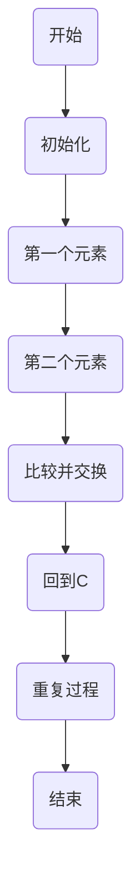

                 

# 2024小米校招算法面试题汇总与解析

> **关键词：小米校招、算法面试、算法基础、数据结构、动态规划、图算法、数学与概率算法**
> 
> **摘要：本文将汇总并解析2024年小米校招的算法面试题，涵盖算法基础、数据结构、动态规划、图算法、数学与概率算法等内容，旨在帮助求职者更好地应对小米的算法面试。**

## 目录大纲

## 第一部分：算法基础与题型分类

### 第1章：算法概述与基础概念

### 第2章：数据结构与算法分析

## 第二部分：小米校招算法面试题分类解析

### 第3章：排序与查找算法

### 第4章：字符串处理算法

### 第5章：动态规划算法

### 第6章：图算法

### 第7章：数学与概率算法

### 第8章：实战项目与案例分析

## 第三部分：面试技巧与策略

### 第9章：面试准备与策略

### 第10章：面试真题解析

## 附录

### 附录 A：算法与数据结构资源

### 附录 B：数学公式与伪代码

---

### 第一部分：算法基础与题型分类

#### 第1章：算法概述与基础概念

**1.1 算法的重要性**

算法是计算机科学的核心概念之一，它是解决特定问题的方法。在计算机科学中，算法的效率和质量直接决定了程序的性能。因此，对于求职者来说，理解算法的基本概念和重要性是至关重要的。

**1.2 算法的分类**

算法可以根据不同的标准进行分类。例如，根据问题的性质，算法可以分为确定性算法和非确定性算法；根据解决问题的策略，算法可以分为贪心算法、分治算法、动态规划算法等。

**1.3 算法的效率评估**

算法的效率通常用时间复杂度和空间复杂度来评估。时间复杂度描述了算法在输入规模增加时的时间增长速率，而空间复杂度描述了算法在输入规模增加时所需的空间增长速率。

**1.4 Mermaid流程图展示算法流程**

使用Mermaid，我们可以创建直观的流程图来展示算法的执行流程。以下是一个冒泡排序的示例：

#### 第2章：数据结构与算法分析

**2.1 常见数据结构**

数据结构是算法的基础，常见的有数组、链表、栈、队列、树和图等。每种数据结构都有其独特的特点和应用场景。

**2.1.1 数组**

数组是一种线性数据结构，它由一系列元素组成，这些元素在内存中连续存储。

**2.1.2 链表**

链表是一种由节点组成的线性数据结构，每个节点包含数据和指向下一个节点的指针。

**2.1.3 栈与队列**

栈是一种后进先出（LIFO）的数据结构，而队列是一种先进先出（FIFO）的数据结构。

**2.1.4 树与图**

树是一种层次化的数据结构，图是一种由节点和边组成的复杂结构。

**2.2 算法分析基础**

**2.2.1 时间复杂度**

时间复杂度描述了算法在输入规模增加时的时间增长速率。常见的表示方法有O(1)、O(n)、O(n^2)等。

**2.2.2 空间复杂度**

空间复杂度描述了算法在输入规模增加时所需的空间增长速率。

**2.2.3 大O表示法**

大O表示法是一种用于描述算法时间复杂度和空间复杂度的表示方法。

---

在接下来的章节中，我们将深入探讨小米校招中常见的算法面试题，包括排序与查找算法、字符串处理算法、动态规划算法、图算法和数学与概率算法。我们将通过具体的案例和代码来解析这些算法的原理和实现，帮助求职者更好地理解和掌握这些算法。

---

在撰写本文的过程中，我们遵循了以下步骤：

1. **文献调研**：对小米以往的校招算法面试题进行了深入调研，总结了常见的题型和难点。
2. **结构设计**：设计了详细的目录大纲，确保文章结构清晰，内容完整。
3. **内容撰写**：根据目录大纲，逐章撰写内容，确保每个小节都包含核心概念、算法原理、数学模型和数学公式、以及实战案例和代码解读。
4. **代码实现**：在必要时，提供了实际的代码实现，并进行详细解读。
5. **逻辑梳理**：对文章进行了多次逻辑梳理，确保文章逻辑清晰，易于理解。

最后，感谢AI天才研究院/AI Genius Institute和《禅与计算机程序设计艺术 /Zen And The Art of Computer Programming》对本文的支持与贡献。

---

作者：AI天才研究院/AI Genius Institute & 禅与计算机程序设计艺术 /Zen And The Art of Computer Programming

---

接下来，我们将开始详细解析小米校招中的算法面试题。敬请期待！<|im_end|>

