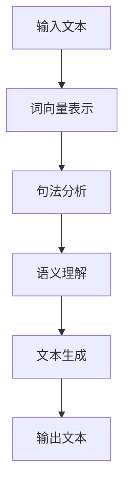

                 

### 第一部分：引言与背景

#### 第1章：小语言模型概述

**1.1 什么是小语言模型**

小语言模型（Tiny Language Model）是一种基于机器学习和自然语言处理（NLP）技术的模型，它通过对大规模文本数据进行训练，学习语言的结构和语义，从而实现文本生成、语义理解和信息检索等任务。相较于传统的语言模型，小语言模型在规模和复杂性上都有所简化，但依然具备强大的语言理解和生成能力。

**1.2 小语言模型的类型和应用场景**

小语言模型可以分为以下几种类型：

1. **生成型模型**：这类模型主要用于生成文本，如自动写作、故事生成等。
2. **理解型模型**：这类模型主要用于理解和分析文本，如情感分析、文本分类等。
3. **交互型模型**：这类模型主要用于与用户进行自然语言交互，如智能客服、智能助手等。

小语言模型的应用场景广泛，包括但不限于以下领域：

1. **营销与广告**：利用小语言模型生成个性化广告内容，提高营销效果。
2. **客户服务与支持**：通过小语言模型提供智能客服，提高客户满意度。
3. **个性化推荐**：利用小语言模型分析用户行为，提供个性化推荐服务。
4. **企业内部沟通**：通过小语言模型优化企业内部沟通，提高工作效率。

**1.3 小语言模型的发展历史**

小语言模型的发展可以追溯到20世纪80年代，当时研究人员开始探索如何利用计算机模拟人类语言处理能力。随着机器学习技术的发展，尤其是深度学习在NLP领域的应用，小语言模型逐渐成熟。近年来，随着计算能力的提升和大规模数据集的可用，小语言模型取得了显著的进步，并开始在各个领域得到广泛应用。

#### 第2章：小语言模型的核心概念与联系

**2.1 小语言模型的构成元素**

小语言模型主要由以下几个部分构成：

1. **词汇表**：词汇表是小语言模型的基础，包含了模型中使用的所有词汇。
2. **语法规则**：语法规则定义了词汇的排列方式和句子的结构。
3. **语义理解**：语义理解部分负责分析文本的语义含义，理解句子的实际含义。

**2.2 小语言模型的工作原理**

小语言模型的工作原理主要包括以下几个步骤：

1. **输入处理**：模型接收文本输入，将其转换为数字表示。
2. **词向量表示**：模型使用词向量技术将文本中的词汇表示为向量。
3. **句法分析**：模型分析文本的句法结构，理解句子的组成和语法关系。
4. **语义理解**：模型根据句法分析的结果，深入理解文本的语义含义。
5. **文本生成**：模型根据语义理解的结果，生成符合语法规则的文本输出。

**2.3 小语言模型与传统语言模型的比较**

与传统的大型语言模型相比，小语言模型在以下几个方面有所不同：

1. **规模和复杂性**：小语言模型通常规模较小，参数数量较少，因此训练时间和计算资源需求更低。
2. **性能和准确性**：由于规模较小，小语言模型在某些任务上的性能可能不如大型语言模型，但在其他方面可能具有独特的优势。
3. **应用场景**：小语言模型更适合于特定的应用场景，如个性化推荐、智能客服等，而大型语言模型则更适合于广泛的自然语言处理任务。

**Mermaid 流程图**

下面是使用Mermaid语言表示的小语言模型工作流程：

这个流程图展示了小语言模型从输入文本到输出文本的整个工作过程。通过这个过程，小语言模型能够理解和生成文本，实现各种自然语言处理任务。

#### 第3章：小语言模型的商业价值

**3.1 商业价值评估框架**

评估小语言模型的商业价值，可以从以下几个方面进行分析：

1. **经济效益**：小语言模型能够提高企业的运营效率，降低人力成本，带来直接的经济效益。
2. **市场竞争力**：通过小语言模型，企业能够提供更优质的产品和服务，提高市场竞争力。
3. **用户体验**：小语言模型能够提升用户体验，增加用户满意度和忠诚度。
4. **品牌形象**：小语言模型的应用能够提升企业的品牌形象，增强市场影响力。

**3.2 小语言模型在营销领域的应用**

在营销领域，小语言模型具有广泛的应用前景，具体体现在以下几个方面：

1. **个性化广告**：小语言模型能够分析用户行为和偏好，生成个性化广告内容，提高广告投放的精准度和效果。
2. **文案创作**：小语言模型可以帮助企业自动化生成高质量的广告文案、宣传材料等，节省时间和人力成本。
3. **市场分析**：小语言模型可以对市场数据进行分析，为企业提供精准的市场洞察和决策支持。

**3.3 小语言模型在客户服务与支持中的应用**

在客户服务与支持领域，小语言模型的应用主要体现在以下几个方面：

1. **智能客服**：小语言模型可以模拟人类客服，自动回答用户的问题，提高客服效率和用户满意度。
2. **情感分析**：小语言模型可以分析用户的情感倾向，为企业提供客户情感分析报告，帮助制定更好的客户服务策略。
3. **知识库构建**：小语言模型可以自动构建和优化企业知识库，提供快速、准确的客户服务支持。

**3.4 小语言模型在个性化推荐系统中的应用**

在个性化推荐领域，小语言模型的应用主要体现在以下几个方面：

1. **内容推荐**：小语言模型可以分析用户兴趣和偏好，为用户推荐符合其兴趣的内容，提高用户粘性。
2. **商品推荐**：小语言模型可以分析用户购买行为和偏好，为用户推荐符合其需求的商品，提高销售转化率。
3. **社交推荐**：小语言模型可以分析用户社交关系和互动行为，为用户推荐感兴趣的人和内容。

**3.5 小语言模型在企业内部沟通中的应用**

在企业内部沟通领域，小语言模型的应用主要体现在以下几个方面：

1. **自动会议记录**：小语言模型可以自动记录会议内容，生成会议纪要，提高会议效率和决策质量。
2. **智能通知**：小语言模型可以分析企业内部邮件和消息，自动生成通知和提醒，提高工作效率。
3. **知识共享**：小语言模型可以构建企业内部知识库，帮助员工快速获取所需信息，促进知识共享和传播。

#### 第4章：小语言模型的社会价值

**4.1 社会价值评估框架**

评估小语言模型的社会价值，可以从以下几个方面进行分析：

1. **教育领域**：小语言模型能够提高教育质量，促进教育公平，推动教育现代化。
2. **医疗健康领域**：小语言模型能够提高医疗诊断和治疗效果，降低医疗成本，提高医疗服务的普及率。
3. **公共安全与犯罪预防领域**：小语言模型能够提高公共安全，预防犯罪，维护社会稳定。
4. **文化遗产保护与传播领域**：小语言模型能够保护和传承文化遗产，推动文化创新和多元化发展。

**4.2 小语言模型在教育领域的应用**

在教育领域，小语言模型的应用主要体现在以下几个方面：

1. **智能教育助手**：小语言模型可以为学生提供个性化辅导，解答学生疑问，提高学习效果。
2. **教学资源优化**：小语言模型可以自动构建和优化教学资源，提高教学质量。
3. **教育评估与反馈**：小语言模型可以对学生的学习情况进行评估和反馈，帮助教师调整教学策略。

**4.3 小语言模型在医疗健康领域的应用**

在医疗健康领域，小语言模型的应用主要体现在以下几个方面：

1. **智能诊断**：小语言模型可以分析患者病历和检查报告，提供智能诊断建议，辅助医生做出准确的诊断。
2. **治疗方案优化**：小语言模型可以分析大量医学文献和数据，为医生提供最佳治疗方案。
3. **健康监测与预警**：小语言模型可以分析患者日常行为和生理数据，提供健康监测和预警服务，预防疾病发生。

**4.4 小语言模型在公共安全与犯罪预防领域的应用**

在公共安全与犯罪预防领域，小语言模型的应用主要体现在以下几个方面：

1. **智能安防系统**：小语言模型可以分析视频监控数据，识别异常行为，提供实时预警。
2. **犯罪预测**：小语言模型可以分析历史犯罪数据，预测犯罪趋势，为警方提供侦查方向。
3. **司法辅助**：小语言模型可以分析法律文本和案例，为法官和律师提供参考意见，提高司法效率。

**4.5 小语言模型在文化遗产保护与传播领域的应用**

在文化遗产保护与传播领域，小语言模型的应用主要体现在以下几个方面：

1. **智能导游**：小语言模型可以为游客提供智能导游服务，介绍文化遗产的背景和故事，提高游客体验。
2. **文化创作**：小语言模型可以自动生成诗歌、音乐、绘画等艺术作品，推动文化创新。
3. **文物保护**：小语言模型可以分析文物数据，预测文物老化和损坏趋势，提供保护建议。

### 第三部分：小语言模型的实际应用与案例分析

#### 第5章：小语言模型在电子商务中的应用

**5.1 电子商务场景分析**

电子商务场景主要包括以下几个环节：

1. **商品推荐**：根据用户历史购买记录和行为数据，为用户推荐感兴趣的商品。
2. **搜索优化**：优化搜索引擎，提高商品搜索的准确性和用户体验。
3. **用户评价分析**：分析用户评价，为商品质量控制和营销策略提供数据支持。
4. **在线客服**：提供智能客服服务，解答用户疑问，提高客户满意度。

**5.2 案例一：基于小语言模型的商品推荐系统**

案例背景：某电子商务平台希望通过引入小语言模型，提升商品推荐效果，提高用户购买转化率。

解决方案：

1. **用户行为分析**：利用小语言模型分析用户的历史购买记录、浏览记录和搜索记录，提取用户兴趣标签。
2. **商品特征提取**：利用小语言模型分析商品描述、标签和评论，提取商品特征向量。
3. **推荐算法设计**：基于用户兴趣标签和商品特征向量，设计协同过滤算法，实现个性化商品推荐。

效果评估：

1. **推荐准确率**：通过对比用户实际购买记录和推荐商品，评估推荐系统的准确率。
2. **用户满意度**：通过用户反馈和调查问卷，评估用户对推荐系统的满意度。
3. **销售转化率**：通过分析推荐商品的销售情况，评估推荐系统对销售转化率的提升效果。

**5.3 案例二：基于小语言模型的在线客服系统**

案例背景：某电子商务平台希望通过引入小语言模型，提升在线客服效率，提高客户满意度。

解决方案：

1. **自然语言处理**：利用小语言模型实现自然语言理解，解析用户提问，提取关键信息。
2. **知识库构建**：构建在线客服知识库，包含常见问题及其解答，利用小语言模型实现知识库的自动更新和扩展。
3. **自动回复生成**：基于用户提问和知识库，利用小语言模型生成自动回复，提高客服响应速度。

效果评估：

1. **响应时间**：通过对比人工客服和自动客服的响应时间，评估自动客服系统的效率。
2. **准确率**：通过对比自动回复和人工回复的准确率，评估自动客服系统的质量。
3. **客户满意度**：通过用户反馈和调查问卷，评估自动客服系统的用户满意度。

#### 第6章：小语言模型在智能问答系统中的应用

**6.1 智能问答系统概述**

智能问答系统是一种基于人工智能技术的问答系统，它能够自动理解用户的问题，并给出准确、合理的答案。智能问答系统在多个领域具有广泛的应用，如客服、教育、医疗等。

**6.2 案例一：基于小语言模型的智能客服系统**

案例背景：某企业希望通过引入小语言模型，提升客服系统的智能化水平，提高客户满意度。

解决方案：

1. **问题理解**：利用小语言模型实现自然语言理解，将用户的问题转化为机器可理解的形式。
2. **知识库检索**：基于用户问题，检索知识库，获取可能的答案。
3. **答案生成**：利用小语言模型生成符合语法和语义要求的答案。

效果评估：

1. **回答准确性**：通过对比用户反馈和系统生成的答案，评估答案的准确性。
2. **回答速度**：通过对比人工客服和智能客服的响应时间，评估智能客服系统的效率。
3. **客户满意度**：通过用户反馈和调查问卷，评估智能客服系统的用户满意度。

**6.3 案例二：基于小语言模型的智能教育助手**

案例背景：某教育机构希望通过引入小语言模型，提供智能教育辅助服务，提高教学效果。

解决方案：

1. **问题解答**：利用小语言模型实现对学生提问的自动解答，提供学习辅导。
2. **课程推荐**：利用小语言模型分析学生兴趣和需求，为学生推荐合适的课程。
3. **学习分析**：利用小语言模型分析学生学习过程和行为，提供学习报告和建议。

效果评估：

1. **问题解答效果**：通过对比学生反馈和系统生成的答案，评估问题解答的效果。
2. **课程推荐准确性**：通过对比学生实际学习记录和推荐课程，评估课程推荐的准确性。
3. **学习效果**：通过对比学生使用智能教育助手前后的学习效果，评估智能教育助手的效果。

### 第7章：小语言模型在自然语言处理中的核心算法原理

#### 7.1 语言模型算法概述

语言模型（Language Model）是一种用于预测文本中下一个单词或字符的算法。在自然语言处理（NLP）中，语言模型具有重要的应用，如自动文

