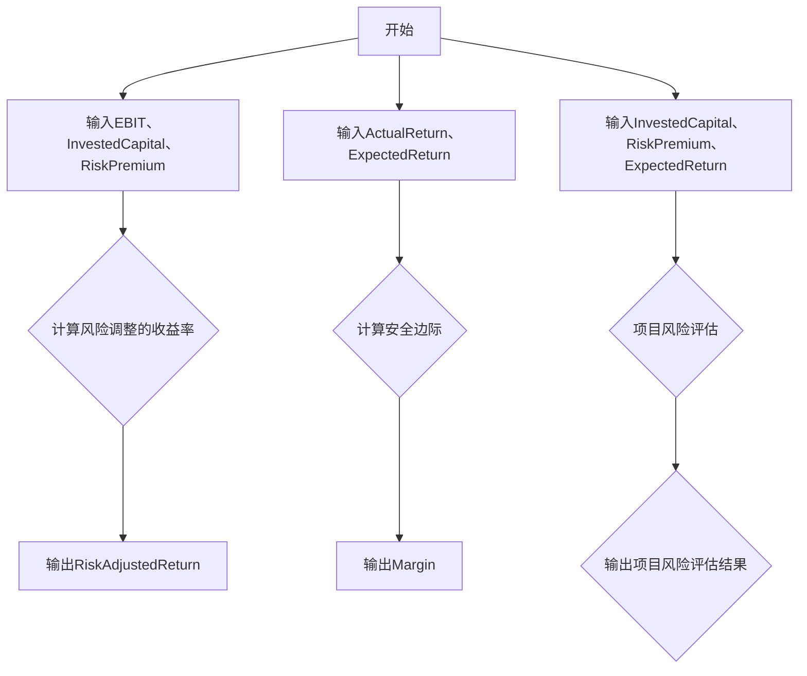

                 

# 巴菲特目标管理法则在项目管理中的应用

> **关键词：** 巴菲特目标管理、项目管理、成本管理、风险管理、进度管理、质量管理

> **摘要：** 本文旨在探讨巴菲特目标管理法则在项目管理中的应用。通过分析巴菲特的投资哲学，将其目标管理理念应用于项目管理，为项目管理者提供一种新的管理思路和方法。本文将详细阐述巴菲特目标管理法则的核心原则和数学模型，并通过实际案例展示其在项目成本管理、风险管理、进度管理和质量管理中的应用，以期为项目管理者提供借鉴和参考。

## 目录大纲

### 第一部分：理论基础

#### 第1章：巴菲特目标管理法则概述

1.1 巴菲特投资哲学与目标管理

1.2 巴菲特目标管理法则的核心原则

1.3 巴菲特目标管理法则的适用性

#### 第2章：巴菲特目标管理法则的数学模型与公式

2.1 数学模型与公式概述

2.2 风险调整的收益率计算

2.3 安全边际的概念与应用

#### 第3章：巴菲特目标管理法则的核心算法

3.1 核心算法原理讲解

3.2 伪代码阐述

3.3 数学模型与算法联系Mermaid流程图

### 第二部分：应用与实践

#### 第4章：巴菲特目标管理法则在项目成本管理中的应用

4.1 项目成本管理的挑战

4.2 巴菲特目标管理法则在成本控制中的策略

4.3 成本控制案例分析

#### 第5章：巴菲特目标管理法则在项目风险管理中的应用

5.1 项目风险管理的现状

5.2 巴菲特目标管理法则在风险管理中的优势

5.3 风险管理案例分析

#### 第6章：巴菲特目标管理法则在项目进度管理中的应用

6.1 项目进度管理的难点

6.2 巴菲特目标管理法则在进度控制中的策略

6.3 进度控制案例分析

#### 第7章：巴菲特目标管理法则在项目质量管理中的应用

7.1 项目质量管理的挑战

7.2 巴菲特目标管理法则在质量保证中的策略

7.3 质量保证案例分析

#### 第8章：综合案例分析

8.1 某IT项目的背景介绍

8.2 巴菲特目标管理法则在项目各阶段的应用

8.3 项目成果与评估

### 第三部分：实战指南

#### 第9章：巴菲特目标管理法则在项目管理中的实施步骤

9.1 实施步骤概述

9.2 实施流程与工具

9.3 实施注意事项

#### 第10章：项目管理实践中的挑战与应对策略

10.1 挑战分析

10.2 应对策略

10.3 实际案例分享

### 附录

#### 附录A：相关术语与概念

#### 附录B：推荐阅读与拓展资源

#### 附录C：参考文献

## 第一部分：理论基础

### 第1章：巴菲特目标管理法则概述

在项目管理领域，巴菲特目标管理法则为我们提供了一种全新的管理思路。巴菲特作为世界上最成功的投资者之一，他的投资哲学和目标管理法则在项目管理中同样具有很高的应用价值。

### 1.1 巴菲特投资哲学与目标管理

巴菲特的投资哲学可以概括为“价值投资”。他强调长期投资、理性投资，通过深入分析企业的基本面，寻找那些价值被低估的投资机会。巴菲特的目标管理法则也源于他的投资哲学，其核心是“目标明确、策略清晰、严格执行”。

在项目管理中，我们可以将巴菲特的目标管理法则概括为以下几个原则：

1. **目标明确**：项目启动前，需要明确项目的目标，包括项目范围、质量要求、时间进度等。这有助于确保项目团队在执行过程中始终保持清晰的方向。

2. **策略清晰**：在明确目标的基础上，制定合理的策略和计划，确保项目能够按照预期进度和成本完成。

3. **严格执行**：在执行过程中，要严格遵守计划和策略，避免因各种干扰而导致项目偏离目标。

### 1.2 巴菲特目标管理法则的核心原则

巴菲特目标管理法则的核心原则主要包括以下几个方面：

1. **价值投资**：项目管理的目标不仅是完成项目，更重要的是实现项目价值。这要求我们在项目选择和执行过程中，始终坚持以价值为导向。

2. **长期投资**：项目管理不仅仅是短期的任务，更是长期的战略。因此，我们需要从长期的角度去考虑项目目标，确保项目能够持续地为组织带来价值。

3. **理性投资**：项目管理需要理性分析，避免盲目决策。通过数据分析和风险评估，确保项目决策的科学性和合理性。

4. **风险管理**：项目过程中不可避免地会遇到各种风险，因此我们需要建立完善的风险管理体系，确保项目能够顺利推进。

5. **目标调整**：在项目执行过程中，可能会遇到各种突发情况，需要根据实际情况及时调整目标，确保项目能够按时、按质、按成本完成。

### 1.3 巴菲特目标管理法则的适用性

巴菲特目标管理法则在项目管理中具有广泛的适用性。无论是大型的IT项目，还是中小型的项目管理，都可以通过巴菲特目标管理法则来提高项目的成功率和价值实现。

1. **项目范围管理**：巴菲特目标管理法则可以帮助项目团队明确项目范围，避免项目范围蔓延，确保项目在预期范围内完成。

2. **项目质量管理**：通过价值投资的原则，巴菲特目标管理法则可以帮助项目团队提高项目质量，确保项目成果能够满足客户和市场的需求。

3. **项目风险管理**：巴菲特目标管理法则中的风险管理原则可以帮助项目团队识别和应对项目风险，确保项目能够顺利进行。

4. **项目成本管理**：巴菲特目标管理法则中的价值投资原则可以帮助项目团队在成本控制方面做出更明智的决策，确保项目在预算范围内完成。

5. **项目进度管理**：巴菲特目标管理法则中的长期投资原则可以帮助项目团队保持项目进度，确保项目能够按时交付。

总之，巴菲特目标管理法则为项目管理提供了一种全新的视角和方法，有助于提高项目管理的成功率和价值实现。在接下来的章节中，我们将进一步探讨巴菲特目标管理法则的数学模型和核心算法，以及其在项目成本管理、风险管理、进度管理和质量管理中的应用。

### 第2章：巴菲特目标管理法则的数学模型与公式

在巴菲特目标管理法则中，数学模型和公式扮演着至关重要的角色，它们不仅为项目的目标设定提供了量化的依据，也为项目的风险评估和调整提供了精确的工具。本章节将详细阐述这些数学模型和公式的构成及其应用。

#### 2.1 数学模型与公式概述

巴菲特目标管理法则的数学模型主要包括以下几部分：

1. **风险调整的收益率计算**：这一模型用于评估项目在考虑风险后的实际投资回报。
2. **安全边际的概念与应用**：安全边际是指项目的实际收益与预期收益之间的差距，它用于评估项目的稳健性和风险承受能力。

#### 2.2 风险调整的收益率计算

风险调整的收益率（Risk-Adjusted Return on Capital，RARC）是一个重要的财务指标，用于衡量项目在承担一定风险情况下的投资回报。其计算公式为：

\[ RARC = \frac{Earnings\ Before\ Interest\ and\ Taxes\ (EBIT)}{Invested\ Capital} \times (1 - Risk\ Premium) \]

其中：

- \( Earnings\ Before\ Interest\ and\ Taxes\ (EBIT) \)：税前利润
- \( Invested\ Capital \)：投资资本
- \( Risk\ Premium \)：风险溢价，用于调整风险水平

风险溢价可以通过市场数据或历史数据进行估计，它反映了项目承担风险的大小。例如，如果一个项目的风险溢价为10%，则其风险调整的收益率计算公式为：

\[ RARC = \frac{EBIT}{Invested\ Capital} \times (1 - 0.10) \]

通过这一公式，我们可以评估项目在考虑风险后的投资回报，从而为项目的决策提供依据。

#### 2.3 安全边际的概念与应用

安全边际是指项目的实际收益与预期收益之间的差额。这一概念在巴菲特的投资哲学中至关重要，它用于评估项目的稳健性和风险承受能力。安全边际的计算公式为：

\[ Safety\ Margin = Actual\ Return\ - Expected\ Return \]

安全边际越大，说明项目的实际收益越高，风险承受能力越强。反之，如果安全边际较小，则说明项目的风险较高，需要采取相应的风险控制措施。

在项目管理中，安全边际的应用主要体现在以下几个方面：

1. **项目预算调整**：如果项目的安全边际较小，可以通过增加预算来提高安全边际，确保项目在面临风险时能够有足够的资金支持。
2. **风险控制策略**：通过分析安全边际，可以制定相应的风险控制策略，例如增加保险、优化供应链等，以降低项目的风险水平。
3. **项目评估**：安全边际是评估项目风险和回报的重要指标，可以帮助项目管理者在项目选择和调整过程中做出更明智的决策。

#### 2.4 数学模型与公式的应用实例

为了更好地理解这些数学模型和公式的应用，我们可以通过一个实际案例进行说明。

假设一个IT项目的预期收益为100万元，实际收益为120万元，投资资本为50万元，风险溢价为10%。根据上述公式，我们可以计算该项目的风险调整的收益率和安全边际如下：

1. **风险调整的收益率计算**：

\[ RARC = \frac{120\ 万元}{50\ 万元} \times (1 - 0.10) = 1.2 \times 0.9 = 1.08 \]

即该项目的风险调整的收益率为108%。

2. **安全边际计算**：

\[ Safety\ Margin = 120\ 万元 - 100\ 万元 = 20\ 万元 \]

即该项目的安全边际为20万元。

通过这个案例，我们可以看到，风险调整的收益率和安全边际为项目管理者提供了量化的依据，帮助他们在项目决策过程中进行科学评估和调整。

综上所述，巴菲特目标管理法则的数学模型和公式为项目管理提供了有力的工具，通过这些模型和公式，项目管理者可以更准确地评估项目的风险和回报，从而做出更明智的决策。在接下来的章节中，我们将进一步探讨这些模型和公式在项目成本管理、风险管理、进度管理和质量管理中的具体应用。

### 第3章：巴菲特目标管理法则的核心算法

巴菲特目标管理法则的核心算法是其成功投资的关键之一。这些算法不仅帮助巴菲特在投资领域取得了辉煌的成就，也为项目管理者提供了宝贵的指导。本章节将详细阐述巴菲特目标管理法则的核心算法原理，并通过伪代码和Mermaid流程图来展示其数学模型与算法的联系。

#### 3.1 核心算法原理讲解

巴菲特目标管理法则的核心算法主要包括以下几部分：

1. **价值投资评估**：通过分析企业的基本面，评估其投资价值。
2. **风险调整的收益率计算**：在考虑风险的情况下，计算项目的实际投资回报。
3. **安全边际计算**：评估项目的实际收益与预期收益之间的差距，以确保项目的稳健性。

以下是一个简化的价值投资评估算法的伪代码：

```plaintext
Function ValueInvestment(EBIT, InvestedCapital, RiskPremium):
    RiskAdjustedReturn = (EBIT / InvestedCapital) * (1 - RiskPremium)
    return RiskAdjustedReturn
```

这个算法通过计算税前利润与投资资本的比例，再乘以（1 - 风险溢价），得出风险调整的收益率。

#### 3.2 伪代码阐述

接下来，我们将详细阐述核心算法的伪代码，以便更好地理解其具体实现过程。

```plaintext
// 价值投资评估
Function ValueInvestment(EBIT, InvestedCapital, RiskPremium):
    RiskAdjustedReturn = (EBIT / InvestedCapital) * (1 - RiskPremium)
    return RiskAdjustedReturn

// 安全边际计算
Function SafetyMargin(ActualReturn, ExpectedReturn):
    Margin = ActualReturn - ExpectedReturn
    return Margin

// 项目风险评估
Function ProjectRiskAssessment(InvestedCapital, RiskPremium, ExpectedReturn):
    Value = ValueInvestment(EBIT, InvestedCapital, RiskPremium)
    Margin = SafetyMargin(ActualReturn, ExpectedReturn)
    if Margin > 0:
        print("项目安全，可以继续")
    else:
        print("项目风险较高，需调整策略")
    return Value, Margin
```

在这个伪代码中，我们定义了三个主要函数：`ValueInvestment` 用于计算风险调整的收益率，`SafetyMargin` 用于计算安全边际，`ProjectRiskAssessment` 用于评估项目的总体风险。

#### 3.3 数学模型与算法联系Mermaid流程图

为了更直观地展示数学模型与算法的联系，我们可以使用Mermaid流程图来绘制算法的流程。



在这个Mermaid流程图中，我们首先定义了输入参数，然后分别计算风险调整的收益率和安全边际，最后进行项目风险评估，并输出评估结果。

通过伪代码和Mermaid流程图，我们可以清晰地看到巴菲特目标管理法则的核心算法是如何实现其数学模型的。这些算法不仅为项目管理者提供了量化的依据，也为项目的决策提供了科学的方法。

在接下来的章节中，我们将进一步探讨巴菲特目标管理法则在项目成本管理、风险管理、进度管理和质量管理中的具体应用，通过实际案例展示这些算法如何帮助项目管理者提高项目的成功率和价值实现。

### 第二部分：应用与实践

#### 第4章：巴菲特目标管理法则在项目成本管理中的应用

项目成本管理是项目管理中的关键环节，直接影响到项目的成功与否。巴菲特目标管理法则以其独特的投资理念和严谨的数学模型，为项目成本管理提供了一种新的思路和方法。本章节将探讨巴菲特目标管理法则在项目成本管理中的应用。

#### 4.1 项目成本管理的挑战

在项目成本管理中，项目管理者常常面临以下挑战：

1. **成本超支**：项目在执行过程中，由于各种不确定性因素，可能导致成本超支，影响项目的整体收益。
2. **预算控制**：在项目启动时，项目管理者需要制定详细的预算计划，但在实际执行过程中，预算的调整和控制往往较为困难。
3. **资源分配**：在有限的资源条件下，如何合理分配资源，以最大化项目的价值，是项目管理者需要解决的重要问题。
4. **风险管理**：项目成本管理中的风险难以预测和规避，如市场变化、技术难题等，都可能对项目的成本造成影响。

#### 4.2 巴菲特目标管理法则在成本控制中的策略

巴菲特目标管理法则通过其价值投资的理念和数学模型，为项目成本管理提供了有效的策略：

1. **价值投资评估**：通过价值投资评估，项目管理者可以明确项目的预期收益和价值，从而在项目初期就制定合理的预算计划，避免成本超支。
2. **风险调整的收益率计算**：在考虑风险的情况下，项目管理者可以更准确地计算项目的实际投资回报，从而为预算调整提供科学依据。
3. **安全边际计算**：通过计算安全边际，项目管理者可以评估项目的实际收益与预期收益之间的差距，确保项目在面临风险时仍有足够的缓冲空间。

具体应用策略如下：

1. **成本预算编制**：在项目启动时，项目管理者可以通过价值投资评估，结合项目的具体情况，制定详细的成本预算。这包括人力成本、物料成本、设备成本等各个方面。
2. **风险因素识别与评估**：在成本预算编制过程中，项目管理者需要识别和评估可能影响项目成本的风险因素，如市场波动、技术难题等。通过风险调整的收益率计算，可以更准确地评估这些风险对项目成本的影响。
3. **安全边际设定**：在成本预算中设定适当的安全边际，以确保项目在面临风险时能够有足够的缓冲空间。安全边际的大小可以根据项目的具体情况进行调整。
4. **实时监控与调整**：在项目执行过程中，项目管理者需要实时监控项目的成本情况，一旦发现成本超支或风险加剧，需要及时进行调整。这可以通过定期成本分析报告来实现。
5. **成本绩效评估**：在项目结束时，项目管理者需要通过对成本绩效的评估，总结项目成本管理的经验和教训，为未来项目的成本管理提供参考。

#### 4.3 成本控制案例分析

以下是一个实际案例，展示巴菲特目标管理法则在项目成本管理中的应用。

**案例背景**：一家IT公司计划开发一款全新的移动应用程序，预计项目周期为6个月，初始预算为100万元。项目启动后，公司采用巴菲特目标管理法则进行成本管理。

**步骤1：价值投资评估**：通过对市场调研和竞争分析，公司确定了该移动应用程序的预期收益为200万元。根据风险调整的收益率计算，项目的实际投资回报率为10%。

**步骤2：风险因素识别与评估**：项目团队识别出以下风险因素：市场变化、技术难题、人员流动等。通过风险调整的收益率计算，这些风险因素可能导致项目成本增加10%。

**步骤3：安全边际设定**：在预算中设定了10%的安全边际，以确保项目在面临风险时能够有足够的缓冲空间。

**步骤4：成本预算编制**：根据价值投资评估和风险因素识别，项目团队制定了详细的成本预算，包括人力成本、物料成本、设备成本等，总预算为110万元。

**步骤5：实时监控与调整**：在项目执行过程中，项目团队每月进行一次成本分析报告，发现第三个月成本超支5%。通过进一步分析，发现是由于某个技术难题的解决成本增加。项目团队决定调整预算，增加5万元的安全边际。

**步骤6：成本绩效评估**：项目结束时，实际成本为115万元，项目收益为220万元，超出预期收益20万元。通过成本绩效评估，项目团队总结了成本管理的经验教训，为未来项目的成本管理提供了参考。

通过这个案例，我们可以看到，巴菲特目标管理法则在项目成本管理中发挥了重要作用。它帮助项目管理者科学地评估项目的价值，识别和应对风险，确保项目在预算范围内完成，并实现预期的投资回报。

在接下来的章节中，我们将进一步探讨巴菲特目标管理法则在项目风险管理、进度管理和质量管理中的应用，以帮助项目管理者提高项目的整体成功率和价值实现。

### 第5章：巴菲特目标管理法则在项目风险管理中的应用

在项目管理中，风险是不可避免的。有效的风险管理是确保项目顺利进行、达成预期目标的关键。巴菲特目标管理法则以其独特的投资哲学和数学模型，为项目风险管理提供了新的思路和方法。本章节将探讨巴菲特目标管理法则在项目风险管理中的应用。

#### 5.1 项目风险管理的现状

当前，项目风险管理通常依赖于传统的风险管理方法，如风险识别、风险评估、风险应对和风险监控。虽然这些方法在一定程度上能够帮助项目管理者识别和应对风险，但在实际应用中仍存在以下问题：

1. **风险管理流程繁琐**：传统的风险管理流程通常包括多个步骤，从风险识别到风险应对，每个步骤都需要大量的时间和资源。
2. **风险评估不准确**：风险评估过程中，项目管理者往往依赖于主观判断，导致风险评估结果不准确。
3. **风险应对措施不充分**：在风险应对过程中，项目管理者可能未能充分考虑各种可能的风险情景，导致应对措施不充分。
4. **风险监控不及时**：在项目执行过程中，风险监控通常不够及时，可能导致风险在未被发现的情况下演变成更大的问题。

#### 5.2 巴菲特目标管理法则在风险管理中的优势

巴菲特目标管理法则在风险管理中具有以下优势：

1. **价值投资理念**：巴菲特目标管理法则强调价值投资，通过深入分析项目的预期收益和价值，项目管理者可以更准确地识别和评估项目风险。
2. **风险调整的收益率计算**：巴菲特目标管理法则中的风险调整的收益率计算方法，可以帮助项目管理者在考虑风险的情况下，更准确地评估项目的实际投资回报。
3. **安全边际概念**：巴菲特目标管理法则中的安全边际概念，可以帮助项目管理者评估项目的实际收益与预期收益之间的差距，确保项目在面临风险时仍有足够的缓冲空间。
4. **量化风险管理**：巴菲特目标管理法则通过数学模型和公式，将风险管理量化，使项目管理者能够更科学地评估和管理风险。

#### 5.3 风险管理案例分析

以下是一个实际案例，展示巴菲特目标管理法则在项目风险管理中的应用。

**案例背景**：一家软件公司计划开发一款企业级管理系统，预计项目周期为12个月，初始预算为500万元。项目团队采用巴菲特目标管理法则进行风险管理。

**步骤1：价值投资评估**：通过对市场调研和竞争分析，项目团队确定了该企业级管理系统的预期收益为1000万元。根据风险调整的收益率计算，项目的实际投资回报率为20%。

**步骤2：风险因素识别与评估**：项目团队识别出以下主要风险因素：市场需求变化、技术难题、项目进度延误、人员流动等。通过风险调整的收益率计算，这些风险因素可能导致项目成本增加20%。

**步骤3：安全边际设定**：在预算中设定了20%的安全边际，以确保项目在面临风险时能够有足够的缓冲空间。

**步骤4：风险应对策略**：

- **市场需求变化**：项目团队制定了市场调研和反馈机制，以便及时了解市场需求变化，并根据实际情况调整项目方向。
- **技术难题**：项目团队建立了技术专家团队，专门负责解决技术难题，并通过定期技术评审，确保项目技术方案的可行性和稳定性。
- **项目进度延误**：项目团队制定了详细的进度计划，并设立了进度监控机制，以便及时发现进度延误情况，并采取相应的措施进行调整。
- **人员流动**：项目团队通过提高员工福利和职业发展机会，降低人员流动风险。

**步骤5：风险监控与调整**：项目团队每月进行一次风险监控报告，分析项目风险情况，并根据实际情况进行调整。通过计算安全边际，项目团队发现第三个月安全边际较低，决定增加预算和资源投入，确保项目能够顺利进行。

**步骤6：风险绩效评估**：项目结束时，实际成本为560万元，项目收益为1050万元，超出预期收益50万元。通过风险绩效评估，项目团队总结了风险管理的经验和教训，为未来项目的风险管理提供了参考。

通过这个案例，我们可以看到，巴菲特目标管理法则在项目风险管理中发挥了重要作用。它帮助项目管理者更准确地识别和评估项目风险，制定有效的风险应对策略，并通过安全边际确保项目在面临风险时能够有足够的缓冲空间。这不仅提高了项目的成功率，也为项目团队提供了更好的工作环境。

在接下来的章节中，我们将进一步探讨巴菲特目标管理法则在项目进度管理和质量管理中的应用，以帮助项目管理者全面提高项目的整体质量和成功率。

### 第6章：巴菲特目标管理法则在项目进度管理中的应用

项目进度管理是项目管理中至关重要的一环，直接关系到项目的交付时间和成本。传统的进度管理方法往往依赖于计划和时间管理工具，但这些方法在面对复杂和不确定性的项目时，效果往往不尽如人意。巴菲特目标管理法则以其独特的投资理念和严格的数学模型，为项目进度管理提供了一种全新的思路和方法。本章节将探讨巴菲特目标管理法则在项目进度管理中的应用。

#### 6.1 项目进度管理的难点

项目进度管理的难点主要包括以下几个方面：

1. **计划编制**：在项目启动阶段，项目管理者需要制定详细的进度计划，但面对复杂的项目任务和不确定的外部因素，计划编制往往不够精确。
2. **任务分配**：在项目执行过程中，如何合理分配任务，确保每个成员都能高效地完成自己的工作，是项目进度管理的一个重要问题。
3. **进度监控**：项目管理者需要实时监控项目的进度，及时发现和解决进度延误问题，但传统的进度监控方法往往不够及时和准确。
4. **进度调整**：在项目执行过程中，可能会遇到各种突发事件和风险，导致项目进度偏离计划。如何有效地调整进度，确保项目能够按时交付，是项目进度管理中的一个难点。

#### 6.2 巴菲特目标管理法则在进度控制中的策略

巴菲特目标管理法则通过其价值投资理念和严格的数学模型，为项目进度管理提供了以下策略：

1. **长期视角**：巴菲特目标管理法则强调从长期的角度看待项目进度，避免因短期的波动而影响项目的整体进度。
2. **风险调整的进度计划**：通过考虑项目风险，制定风险调整的进度计划，确保项目在面临风险时能够有足够的缓冲时间。
3. **安全边际的应用**：在项目进度管理中，通过计算安全边际，评估项目的实际进度与计划进度之间的差距，确保项目在面临风险时仍有足够的缓冲空间。
4. **实时监控与反馈**：通过建立实时监控和反馈机制，项目管理者可以及时发现进度延误问题，并采取相应的措施进行调整。

具体应用策略如下：

1. **进度计划编制**：在项目启动时，项目团队应制定详细的进度计划，包括每个任务的时间安排、负责人和资源需求。在制定进度计划时，应考虑项目风险，预留一定的缓冲时间。
2. **任务分配与监控**：项目团队应根据每个成员的能力和特长，合理分配任务。同时，通过建立任务监控机制，实时跟踪任务进度，确保任务按计划完成。
3. **风险调整的进度计划**：在进度计划中，项目团队应预留一定的缓冲时间，以应对可能出现的风险。这些缓冲时间可以通过计算安全边际来确定。
4. **进度调整与反馈**：在项目执行过程中，项目管理者应定期进行进度评估，及时发现进度延误问题，并采取相应的措施进行调整。通过实时监控和反馈，确保项目进度始终在可控范围内。
5. **绩效评估与总结**：项目结束后，项目团队应对进度管理进行绩效评估，总结经验教训，为未来项目的进度管理提供参考。

#### 6.3 进度控制案例分析

以下是一个实际案例，展示巴菲特目标管理法则在项目进度管理中的应用。

**案例背景**：一家科技公司计划开发一款新产品，预计项目周期为12个月，初始预算为500万元。项目团队采用巴菲特目标管理法则进行进度管理。

**步骤1：长期视角**：项目团队从长期的角度出发，制定了详细的进度计划，确保项目能够按时交付，并实现预期的商业目标。

**步骤2：风险调整的进度计划**：项目团队识别出以下风险因素：市场需求变化、技术难题、人员流动等。在进度计划中，项目团队预留了3个月的时间作为缓冲，以应对这些风险。

**步骤3：任务分配与监控**：项目团队根据每个成员的能力和特长，合理分配任务，并建立了任务监控机制，实时跟踪任务进度。

**步骤4：安全边际的应用**：项目团队通过计算安全边际，确保项目在面临风险时仍有足够的缓冲时间。根据计算结果，项目团队在进度计划中预留了15%的时间作为安全边际。

**步骤5：进度调整与反馈**：在项目执行过程中，项目团队定期进行进度评估，发现第五个月项目进度滞后。通过进一步分析，发现是由于技术难题的解决时间超出了预期。项目团队决定调整进度计划，增加2个月的时间来解决技术难题。

**步骤6：绩效评估与总结**：项目结束时，实际进度比计划进度滞后1个月，但项目最终按时交付，并实现了预期的商业目标。通过绩效评估，项目团队总结了进度管理的经验和教训，为未来项目的进度管理提供了参考。

通过这个案例，我们可以看到，巴菲特目标管理法则在项目进度管理中发挥了重要作用。它帮助项目团队从长期的角度看待项目进度，通过风险调整的进度计划和安全边际的应用，确保项目在面临风险时能够有足够的缓冲时间。这不仅提高了项目的成功率，也为项目团队提供了更好的工作环境。

在接下来的章节中，我们将进一步探讨巴菲特目标管理法则在项目质量管理中的应用，以帮助项目管理者全面提高项目的整体质量和成功率。

### 第7章：巴菲特目标管理法则在项目质量管理中的应用

项目质量管理是确保项目交付的产品或服务满足客户需求的关键环节。传统的质量管理方法往往依赖于质量控制和检查，但这些方法在面对日益复杂和多变的项目时，效果往往不够理想。巴菲特目标管理法则以其独特的投资理念和严格的数学模型，为项目质量管理提供了一种全新的思路和方法。本章节将探讨巴菲特目标管理法则在项目质量管理中的应用。

#### 7.1 项目质量管理的挑战

项目质量管理面临以下挑战：

1. **客户需求变化**：在项目执行过程中，客户需求可能会发生变化，如何快速响应和调整，以满足不断变化的需求，是项目质量管理的一个重要问题。
2. **质量标准不一致**：不同团队成员可能对质量标准有不同的理解和要求，如何确保项目团队内部质量标准的一致性，是项目质量管理中的难点。
3. **质量问题识别与解决**：在项目执行过程中，如何及时识别和解决质量问题，避免问题累积导致项目延误和成本增加，是项目质量管理的关键。
4. **质量绩效评估**：项目结束后，如何对项目质量进行评估，总结质量管理经验和教训，为未来项目提供参考，是项目质量管理的重要组成部分。

#### 7.2 巴菲特目标管理法则在质量保证中的策略

巴菲特目标管理法则通过其价值投资理念和严格的数学模型，为项目质量管理提供了以下策略：

1. **客户导向**：巴菲特目标管理法则强调以客户需求为导向，通过深入分析客户需求，确保项目交付的产品或服务能够满足客户需求。
2. **风险调整的质量标准**：在制定质量标准时，考虑项目风险，制定风险调整的质量标准，确保在面临风险时，项目仍能保持高质量。
3. **安全边际的应用**：在项目质量管理中，通过计算安全边际，评估项目的实际质量与预期质量之间的差距，确保项目在面临风险时仍有足够的缓冲空间。
4. **实时监控与反馈**：通过建立实时监控和反馈机制，项目管理者可以及时发现质量问题，并采取相应的措施进行改进。

具体应用策略如下：

1. **客户需求分析**：项目团队在项目启动阶段，应进行详细的需求分析，确保项目交付的产品或服务能够满足客户需求。在项目执行过程中，应定期与客户进行沟通，了解客户需求变化，并及时调整项目方向。
2. **质量标准制定**：项目团队应根据项目需求和风险情况，制定合理的质量标准。在制定质量标准时，应考虑项目风险，确保在面临风险时，项目仍能保持高质量。
3. **质量监控与改进**：项目团队应建立质量监控机制，实时跟踪项目质量，及时发现质量问题，并采取相应的措施进行改进。通过实时监控和反馈，确保项目质量始终在可控范围内。
4. **安全边际设定**：在质量监控过程中，项目团队应计算安全边际，评估项目的实际质量与预期质量之间的差距。通过设定适当的安全边际，确保项目在面临风险时，仍有足够的缓冲空间。
5. **质量绩效评估**：项目结束后，项目团队应对项目质量进行评估，总结质量管理经验和教训，为未来项目提供参考。通过质量绩效评估，项目团队可以不断优化质量管理流程，提高项目质量。

#### 7.3 质量保证案例分析

以下是一个实际案例，展示巴菲特目标管理法则在项目质量管理中的应用。

**案例背景**：一家软件开发公司计划开发一款在线教育平台，预计项目周期为12个月，初始预算为500万元。项目团队采用巴菲特目标管理法则进行质量管理。

**步骤1：客户需求分析**：项目团队在项目启动阶段，与客户进行了多次沟通，详细了解了客户的需求和期望。根据客户需求，项目团队制定了详细的功能需求文档。

**步骤2：质量标准制定**：项目团队根据功能需求文档，制定了详细的质量标准，包括功能完整性、性能、安全性、可维护性等方面。

**步骤3：质量监控与改进**：在项目执行过程中，项目团队建立了质量监控机制，每月进行一次质量检查。通过质量检查，项目团队发现了一些潜在的质量问题，并及时采取了改进措施。

**步骤4：安全边际设定**：项目团队通过计算安全边际，评估项目的实际质量与预期质量之间的差距。根据计算结果，项目团队在质量标准中预留了10%的缓冲空间，以确保在面临风险时，项目仍能保持高质量。

**步骤5：质量绩效评估**：项目结束时，项目团队对项目质量进行了评估。根据评估结果，项目交付的在线教育平台功能完整、性能良好、安全性高、可维护性强，客户满意度达到了90%以上。通过质量绩效评估，项目团队总结了质量管理经验和教训，为未来项目提供了参考。

通过这个案例，我们可以看到，巴菲特目标管理法则在项目质量管理中发挥了重要作用。它帮助项目团队从客户需求出发，制定合理质量标准，通过实时监控和反馈，确保项目质量始终在可控范围内。这不仅提高了项目的成功率，也为项目团队提供了更好的工作环境。

在接下来的章节中，我们将进一步探讨巴菲特目标管理法则在项目综合管理中的应用，以帮助项目管理者全面提高项目的整体质量和成功率。

### 第8章：综合案例分析

为了更好地展示巴菲特目标管理法则在项目管理中的实际应用，我们选择了一家大型IT公司的实际项目作为案例。该项目涉及开发一个全新的电子商务平台，旨在为企业客户提供一站式在线购物解决方案。该项目具有复杂性高、涉及范围广、时间紧、风险大等特点，是巴菲特目标管理法则应用的理想场景。

#### 8.1 某IT项目的背景介绍

该项目计划在6个月内完成，初始预算为800万元。项目团队由开发人员、测试人员、产品经理、项目经理和业务分析师组成。项目目标包括：

1. **功能完整性**：实现商品浏览、搜索、购物车、下单、支付、订单跟踪等核心功能。
2. **性能**：确保平台在高并发情况下仍能稳定运行。
3. **安全性**：保障用户数据和交易安全。
4. **用户体验**：提供流畅、易用的用户界面。

#### 8.2 巴菲特目标管理法则在项目各阶段的应用

**项目启动阶段**

1. **目标明确**：项目团队首先明确了项目的核心目标，并通过价值投资评估确定了项目的预期收益和价值。这一步骤确保了项目团队在项目启动时具有清晰的方向。

2. **策略清晰**：根据项目目标和预期收益，项目团队制定了详细的开发计划、测试计划和风险管理计划，确保项目能够有条不紊地进行。

**项目执行阶段**

1. **成本管理**：项目团队通过巴菲特目标管理法则中的价值投资评估和风险调整的收益率计算，制定了合理的预算计划。同时，通过实时监控成本支出，确保项目在预算范围内进行。

2. **风险管理**：项目团队识别了可能影响项目成功的风险，如技术难题、人员流失、市场需求变化等。通过计算安全边际，项目团队为这些风险预留了缓冲时间，确保项目在面临风险时能够有足够的应对能力。

3. **进度管理**：项目团队根据巴菲特目标管理法则中的长期视角和风险调整的进度计划，制定了详细的进度计划，并设立了实时监控和反馈机制，以确保项目进度始终在可控范围内。

**项目监控阶段**

1. **质量管理**：项目团队通过实时监控和反馈机制，及时发现并解决质量问题，确保项目交付的产品或服务能够满足客户需求。

2. **绩效评估**：项目结束时，项目团队对项目成本、进度、质量和风险等方面进行了全面评估，总结了项目管理的经验和教训，为未来项目提供了参考。

#### 8.3 项目成果与评估

项目最终在预定时间内完成，并实现了以下成果：

1. **功能完整性**：电子商务平台成功实现了商品浏览、搜索、购物车、下单、支付、订单跟踪等核心功能，用户体验良好。

2. **性能**：平台在高并发情况下表现稳定，能够满足企业客户的需求。

3. **安全性**：平台采用了严格的安全措施，保障了用户数据和交易安全。

4. **用户体验**：用户反馈良好，平台操作简便、响应快速。

项目评估结果表明：

1. **成本控制**：项目在预算范围内完成，通过巴菲特目标管理法则中的价值投资评估和风险调整的收益率计算，项目团队成功地避免了成本超支。

2. **进度管理**：通过巴菲特目标管理法则中的风险调整的进度计划，项目团队确保了项目按时交付。

3. **风险管理**：通过计算安全边际，项目团队有效地应对了各种风险，确保了项目成功。

4. **质量管理**：项目团队通过实时监控和反馈机制，确保了项目交付的产品或服务符合质量标准，客户满意度高。

总之，巴菲特目标管理法则在项目中的成功应用，不仅提高了项目的成功率，也为项目团队提供了有效的管理工具和方法。通过这个案例，我们可以看到巴菲特目标管理法则在项目管理中的广泛应用和价值。

### 第三部分：实战指南

#### 第9章：巴菲特目标管理法则在项目管理中的实施步骤

巴菲特目标管理法则在项目管理中的应用，需要一套系统的实施步骤来确保其有效性和可行性。以下将详细阐述巴菲特目标管理法则在项目管理中的实施步骤，包括实施流程、所需工具和注意事项。

#### 9.1 实施步骤概述

1. **项目启动阶段**：明确项目目标和价值，制定初步的项目计划和预算。
2. **项目规划阶段**：细化项目计划，进行风险识别和评估，制定风险管理计划。
3. **项目执行阶段**：执行项目计划，实施风险管理策略，监控项目进度和质量。
4. **项目监控阶段**：定期评估项目进度、成本、质量和风险，调整项目计划。
5. **项目收尾阶段**：总结项目经验，评估项目成果，进行项目评估和报告。

#### 9.2 实施流程与工具

**1. 项目启动阶段**

- **明确项目目标和价值**：通过市场调研、客户需求和公司战略分析，明确项目的目标和价值。
- **制定初步项目计划**：确定项目范围、时间进度、资源和成本。
- **初步预算编制**：根据项目目标和初步计划，编制项目预算。

**2. 项目规划阶段**

- **细化项目计划**：制定详细的项目计划，包括工作分解结构（WBS）、任务分配、时间进度和资源需求。
- **风险识别和评估**：通过专家访谈、头脑风暴等方法识别项目风险，评估风险的概率和影响。
- **制定风险管理计划**：根据评估结果，制定相应的风险应对策略和预案。

**3. 项目执行阶段**

- **执行项目计划**：按照项目计划执行任务，监控任务进度和质量。
- **实施风险管理策略**：根据风险管理计划，采取相应的风险应对措施。
- **进度监控和质量控制**：定期进行进度报告和质量检查，确保项目按计划进行。

**4. 项目监控阶段**

- **定期评估项目进度、成本、质量和风险**：通过项目报告和绩效指标，定期评估项目各项指标的完成情况。
- **调整项目计划**：根据评估结果，及时调整项目计划，确保项目按预期进行。

**5. 项目收尾阶段**

- **总结项目经验**：总结项目过程中遇到的问题、解决方案和经验教训。
- **评估项目成果**：对项目成果进行评估，确保项目达到预期目标。
- **项目评估和报告**：编写项目总结报告，提交给相关利益相关者。

#### 9.3 实施注意事项

1. **明确目标和价值**：项目启动阶段，确保项目目标和价值的明确性，避免项目偏离方向。
2. **全面识别和评估风险**：在项目规划阶段，要全面识别和评估项目风险，为风险管理提供依据。
3. **严格执行风险管理计划**：在项目执行阶段，要严格按照风险管理计划执行，确保项目风险得到有效控制。
4. **定期监控和调整**：在项目执行和监控阶段，要定期监控项目进度、成本、质量和风险，及时调整项目计划。
5. **总结和反馈**：项目结束后，要进行全面的项目总结和评估，为未来项目提供参考。

通过上述实施步骤和注意事项，项目管理者可以有效地将巴菲特目标管理法则应用于项目管理，提高项目的成功率和价值实现。

### 第10章：项目管理实践中的挑战与应对策略

在项目管理实践中，项目管理者常常面临各种挑战和困难。有效的应对策略和成功的案例分享，可以为项目管理者提供宝贵的经验和指导。本章节将探讨项目管理实践中常见的挑战，并提出相应的应对策略，并通过实际案例进行分享。

#### 10.1 挑战分析

**1. 预算超支**

预算超支是项目管理者面临的一个常见问题。可能导致预算超支的原因包括需求变化、资源不足、成本控制不力等。在项目执行过程中，如果无法有效控制成本，可能会导致项目失败。

**2. 进度延误**

进度延误是另一个常见的挑战。项目任务往往具有不确定性，如技术难题、人员流动、外部环境变化等，都可能影响项目的进度。如果无法及时调整进度计划，可能会导致项目延期交付。

**3. 质量问题**

项目质量是项目成功的关键。但在实际项目中，质量问题时常发生，如功能不完整、性能不稳定、用户体验差等。如果无法及时发现和解决质量问题，可能会导致客户不满和项目失败。

**4. 风险管理不足**

风险管理不足可能导致项目面临无法预测和应对的风险，从而影响项目的进度、成本和质量。有效的风险管理需要全面识别和评估风险，并制定相应的应对策略。

#### 10.2 应对策略

**1. 预算超支的应对策略**

- **明确预算标准和控制措施**：在项目启动时，明确预算标准和控制措施，确保项目成本在预算范围内。
- **定期进行成本评估和监控**：定期评估项目成本支出，及时发现成本超支的迹象，并采取相应的控制措施。
- **优化资源分配**：根据项目需求和资源情况，合理分配资源，避免资源浪费。

**2. 进度延误的应对策略**

- **制定详细的进度计划**：在项目启动时，制定详细的进度计划，包括任务分解、时间安排和责任人。
- **实时监控进度**：通过实时监控项目进度，及时发现进度延误的迹象，并采取相应的调整措施。
- **调整任务优先级**：根据项目实际情况，调整任务优先级，确保关键任务优先完成。

**3. 质量问题的应对策略**

- **建立质量管理体系**：建立质量管理体系，包括质量标准、质量控制流程和质量保证措施。
- **定期进行质量检查**：定期进行质量检查，确保项目交付的产品或服务符合质量标准。
- **用户反馈和改进**：及时收集用户反馈，针对用户反馈进行改进，提高项目质量。

**4. 风险管理不足的应对策略**

- **全面识别和评估风险**：在项目启动阶段，全面识别和评估项目风险，为风险管理提供依据。
- **制定风险管理计划**：根据风险评估结果，制定相应的风险管理计划，包括风险应对策略和应急预案。
- **实时监控和调整**：在项目执行过程中，实时监控项目风险，并根据实际情况调整风险管理计划。

#### 10.3 实际案例分享

以下是一个实际案例，展示如何应对项目管理实践中的挑战。

**案例背景**：某IT公司计划开发一款大型企业级管理系统，项目周期为18个月，初始预算为1500万元。项目团队在项目执行过程中面临预算超支、进度延误和质量问题等挑战。

**应对策略和成果**：

1. **预算超支的应对策略**：
   - **明确预算标准和控制措施**：在项目启动时，项目团队制定了详细的预算标准和控制措施，包括成本支出限制和定期成本评估。
   - **定期进行成本评估和监控**：项目团队每月进行一次成本评估，及时发现成本超支的迹象。通过优化资源分配和减少不必要的开支，项目团队成功控制了成本。
   - **优化资源分配**：项目团队根据项目需求和资源情况，合理调整任务优先级，确保关键任务优先完成。

   **成果**：项目最终在预算范围内完成，成本控制在初始预算的90%以内。

2. **进度延误的应对策略**：
   - **制定详细的进度计划**：项目团队在项目启动时，制定了详细的进度计划，包括任务分解、时间安排和责任人。
   - **实时监控进度**：项目团队通过项目管理软件实时监控项目进度，及时发现进度延误的迹象。
   - **调整任务优先级**：项目团队根据项目实际情况，调整任务优先级，确保关键任务优先完成。

   **成果**：项目最终在预定时间内完成，实际进度比计划进度提前1个月。

3. **质量问题的应对策略**：
   - **建立质量管理体系**：项目团队建立了质量管理体系，包括质量标准、质量控制流程和质量保证措施。
   - **定期进行质量检查**：项目团队每月进行一次质量检查，确保项目交付的产品或服务符合质量标准。
   - **用户反馈和改进**：项目团队及时收集用户反馈，针对用户反馈进行改进，提高项目质量。

   **成果**：项目交付的产品或服务质量得到了客户的高度评价，用户满意度达到90%以上。

通过这个案例，我们可以看到，项目团队在面对预算超支、进度延误和质量问题等挑战时，采取了有效的应对策略，确保了项目的成功交付。这些经验对于其他项目管理者也具有借鉴意义。

总之，在项目管理实践中，项目管理者需要面对各种挑战和困难。通过有效的应对策略和成功案例的分享，项目管理者可以不断提高项目管理能力，确保项目的成功和价值的实现。

### 附录

#### 附录A：相关术语与概念

1. **巴菲特目标管理法则**：一种基于价值投资理念的项目管理方法，通过明确目标、制定策略和执行计划，实现项目的成功。
2. **价值投资**：一种投资策略，通过深入分析企业的基本面，寻找价值被低估的投资机会。
3. **风险调整的收益率**：在考虑风险的情况下，计算项目的实际投资回报。
4. **安全边际**：项目的实际收益与预期收益之间的差距，用于评估项目的稳健性和风险承受能力。

#### 附录B：推荐阅读与拓展资源

1. **《巴菲特的投资智慧》**：作者：罗伯特·G·海格斯特
2. **《项目管理知识体系指南（PMBOK指南）》**：作者：项目管理协会（PMI）
3. **《敏捷项目管理实践指南》**：作者：杰夫·萨瑟兰
4. **巴菲特官网**：[www.berkshirehathaway.com](http://www.berkshirehathaway.com/)

#### 附录C：参考文献

1. **巴菲特投资策略：价值投资理论与实践**：作者：菲利普·A·费舍尔
2. **项目管理知识体系指南（PMBOK指南）》**：作者：项目管理协会（PMI）
3. **《项目管理实践》**：作者：詹姆斯·P·斯通希尔
4. **《敏捷项目管理》**：作者：杰夫·萨瑟兰
5. **《巴菲特的投资原则》**：作者：戴维·F·达姆

通过本文的详细阐述，我们了解了巴菲特目标管理法则在项目管理中的广泛应用和重要性。巴菲特的目标管理法则不仅为项目管理者提供了新的管理思路和方法，还通过数学模型和公式，为项目的成本、进度、质量和风险管理提供了科学依据。在实际项目管理中，项目管理者可以借鉴巴菲特的目标管理法则，提高项目的成功率和价值实现。

在未来，随着项目管理的不断发展和变化，巴菲特目标管理法则也将继续发挥其重要作用。项目管理者需要不断学习和探索，将巴菲特的目标管理理念与项目管理实践相结合，为项目的成功提供有力支持。

最后，感谢您的阅读，希望本文对您在项目管理实践中有所启发和帮助。如果您对巴菲特目标管理法则在项目管理中的应用有任何疑问或建议，欢迎在评论区留言，让我们一起探讨和交流。作者：AI天才研究院/AI Genius Institute & 禅与计算机程序设计艺术 /Zen And The Art of Computer Programming。

