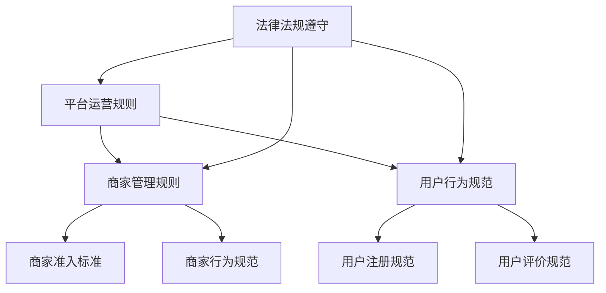
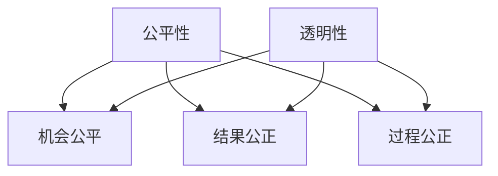
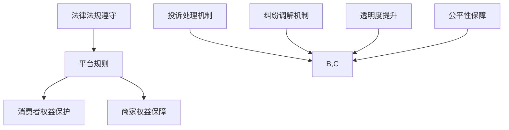
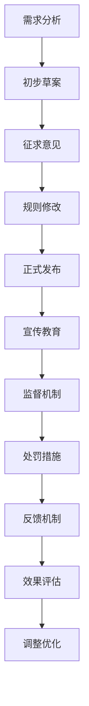
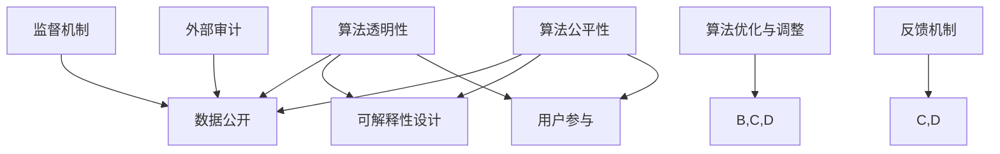
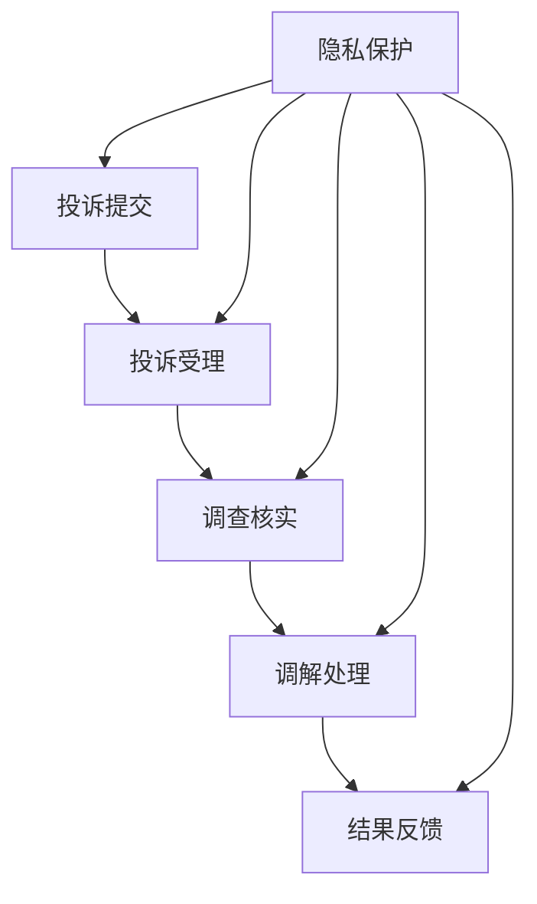
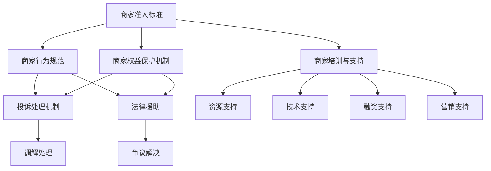
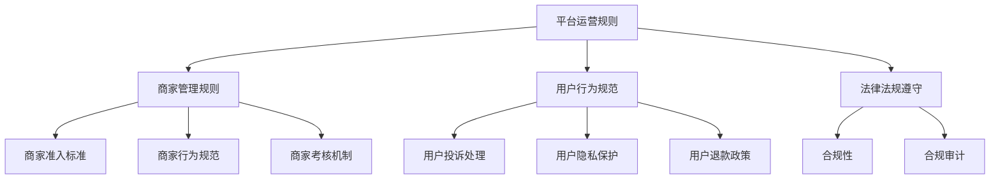
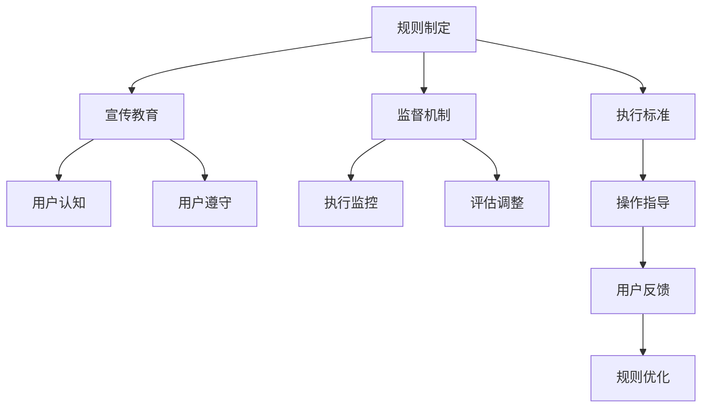

                 

# 平台规则：公平透明，保障权益，提升电商平台供给能力

## 关键词
电商平台、供给能力、公平性、透明性、权益保障、规则制定、算法优化、案例分析、实践指导、未来趋势。

## 摘要
本文从多个角度探讨了电商平台规则的重要性，包括公平性、透明性和权益保障。通过分析电商平台供给能力的核心概念，阐述平台规则的基本框架和实践策略，本文旨在为电商平台提供一套科学、合理的规则体系，以提升其整体供给能力。此外，本文还通过具体案例分析，展示了国内外电商平台在规则制定与实施方面的成功经验，为平台管理者提供实践指导。最后，本文对平台规则的未来趋势和发展方向进行了展望，以期为行业未来发展提供有益参考。

## 目录

1. 平台规则概述与基础理论
2. 公平性与透明性原理
3. 保障权益的核心机制
4. 平台规则的具体实施
5. 算法透明性与公平性
6. 消费者权益保障实践
7. 商家权益保障实践
8. 电商平台供给能力提升策略
9. 平台规则案例分析与实践指导
10. 平台规则的未来趋势与发展方向
11. 附录

## 1. 平台规则概述与基础理论

### 1.1 平台经济的概念与发展

平台经济是近年来迅速崛起的一种新型经济模式，它以互联网技术为基础，通过搭建一个开放、共享的平台，连接供需双方，实现资源的优化配置和价值的最大化。平台经济的核心在于其共享和协同的特性，能够降低交易成本，提高市场效率。

平台经济最早可以追溯到20世纪末的电子商务平台，如亚马逊、eBay等。这些平台通过在线销售商品和服务，打破了传统零售的地理限制，实现了全球化的市场拓展。随着移动互联网的普及，平台经济的发展进一步加速，各类新兴平台不断涌现，如共享出行平台滴滴、共享住宿平台Airbnb等。

### 1.2 平台供给能力的重要性

平台供给能力是平台经济的核心能力之一，它决定了平台在市场竞争中的地位和影响力。平台供给能力主要包括以下几个方面：

1. 商品或服务的丰富度：平台能够提供多样化的商品或服务，满足用户多样化的需求。
2. 商家数量的多少：平台拥有一定数量的商家，能够保证商品或服务的稳定供应。
3. 商家质量的高低：平台对商家的筛选和管理，确保商家提供优质的商品或服务。
4. 技术创新能力：平台在技术上的不断创新，提升平台的运营效率和服务质量。

提升平台供给能力对于电商平台的发展至关重要，它能够提高平台的竞争力，吸引更多的用户和商家，实现平台的持续增长。

### 1.3 平台规则的基本框架

平台规则是电商平台运营的基本规范，它明确了平台、商家和用户之间的权利和义务，保障了平台生态的健康发展。平台规则的基本框架包括以下几个方面：

1. 平台运营规则：规范平台的日常运营行为，包括用户注册、商品发布、交易流程等。
2. 商家管理规则：规范商家在平台上的行为，包括商家准入、商家行为规范、商家考核等。
3. 用户行为规范：规范用户在平台上的行为，包括用户注册、用户评价、用户投诉等。
4. 法律法规遵守：确保平台运营符合国家法律法规的要求，遵守行业规范。

平台规则的核心目标是实现公平、透明和保障权益，提升平台的供给能力。通过制定科学、合理的平台规则，平台能够优化资源配置，提高运营效率，增强市场竞争力。

## 2. 公平性与透明性原理

### 2.1 公平性的定义与意义

公平性是平台规则中的一个重要原则，它强调在平台生态中，各方参与者都能够享有平等的机会和权利，不受不公平待遇。公平性不仅体现在平台对商家和用户的待遇上，还包括平台内部的决策和管理。

公平性的意义主要体现在以下几个方面：

1. 提高市场效率：公平的规则能够确保资源得到最优配置，提高市场整体效率。
2. 增强用户信任：公平的规则能够赢得用户的信任，提高用户的忠诚度和满意度。
3. 促进平台发展：公平的规则能够吸引更多优秀的商家和用户，推动平台的长期发展。

### 2.2 透明性的概念与实践

透明性是平台规则中的另一个重要原则，它强调平台运营过程中的信息公开和透明。透明性有助于提高平台的公信力，增强各方参与者的信任。

透明性的概念主要包括以下几个方面：

1. 信息公开：平台应当公开相关规则、政策、流程等信息，让各方参与者了解平台的运营情况。
2. 透明决策：平台的决策过程应当透明，确保决策的公正性和合理性。
3. 监督与反馈：平台应当接受用户和商家的监督，及时反馈和处理相关问题。

平台透明性的实践主要包括以下几个方面：

1. 信息公示：平台在官方网站、APP等渠道公开相关规则、政策、流程等信息。
2. 数据透明：平台向用户和商家公开交易数据、评价数据等，让各方了解平台运营状况。
3. 监督机制：平台建立监督机制，如第三方审计、用户投诉渠道等，确保平台运营的透明性。

### 2.3 公平性与透明性的联系与实现

公平性和透明性是相辅相成的，公平性需要透明性来保障，透明性有助于实现公平。在平台规则中，公平性和透明性的实现可以从以下几个方面进行：

1. 规则制定：在制定平台规则时，充分考虑各方利益，确保规则公平合理。
2. 实施监督：建立监督机制，对平台运营进行实时监督，确保规则得到有效执行。
3. 用户参与：鼓励用户参与平台规则的制定和监督，提高规则的透明度和公平性。
4. 技术手段：利用区块链、大数据等技术手段，提高平台数据的透明度和可信度。

通过以上措施，平台能够实现公平性和透明性的有机结合，为电商平台的发展奠定坚实基础。

## 3. 保障权益的核心机制

### 3.1 消费者权益保护

消费者权益保护是平台规则中的重要内容，它关系到消费者的购买体验和权益保障。平台在保护消费者权益方面可以从以下几个方面进行：

1. 商品质量保障：平台应加强对商品质量的监管，确保商家提供符合标准的商品。
2. 价格公正透明：平台应确保商品价格公正透明，避免价格欺诈行为。
3. 交易安全保障：平台应提供安全的交易环境，保障用户的交易安全。
4. 评价体系完善：平台应建立完善的评价体系，让消费者能够公正评价商品和服务。

### 3.2 商家权益保障

商家权益保障是平台发展的基础，平台应尊重商家的合法权益，为商家提供公平的竞争环境。平台在保障商家权益方面可以从以下几个方面进行：

1. 商家准入机制：平台应建立科学的商家准入机制，确保商家的质量和信誉。
2. 商家行为规范：平台应制定商家行为规范，明确商家的权利和义务。
3. 商家培训与支持：平台应提供商家培训和支持，帮助商家提升运营能力。
4. 商家权益保护：平台应建立商家权益保护机制，防止商家权益受到侵害。

### 3.3 平台与商家、消费者权益平衡

平台在保障各方权益时，需要实现平台、商家和消费者之间的权益平衡。平台可以从以下几个方面进行平衡：

1. 信息共享：平台应加强信息共享，确保各方了解彼此的需求和权益。
2. 权益保障机制：平台应建立权益保障机制，确保各方权益得到有效保护。
3. 沟通协调：平台应加强沟通协调，解决各方之间的矛盾和问题。
4. 激励机制：平台应建立激励机制，激励各方积极参与平台建设，共同推动平台发展。

通过以上措施，平台能够实现各方权益的平衡，为平台的长期稳定发展创造有利条件。

## 4. 平台规则的具体实施

### 4.1 平台规则制定流程

平台规则的制定是平台运营的重要环节，它关系到平台的公平性、透明性和权益保障。平台规则制定流程主要包括以下几个步骤：

1. 需求分析：分析平台运营中存在的问题和需求，明确平台规则的目标和方向。
2. 初步草案：根据需求分析，制定初步的平台规则草案。
3. 征求意见：将初步草案提交给平台各方参与者，征求意见和建议。
4. 完善规则：根据征求意见，对规则草案进行修改和完善。
5. 发布实施：将完善的平台规则正式发布，并通知各方参与者。

### 4.2 平台规则执行策略

平台规则的有效执行是平台运营的关键，平台可以从以下几个方面制定执行策略：

1. 宣传教育：加强平台规则的宣传和教育，让各方参与者了解规则的内容和要求。
2. 监督检查：建立监督机制，对平台运营过程进行实时监督，发现问题及时整改。
3. 处罚措施：制定明确的处罚措施，对违反规则的行为进行处罚。
4. 反馈机制：建立反馈机制，收集各方参与者的意见和建议，不断优化规则。

### 4.3 平台规则效果的评估与调整

平台规则的实施效果需要定期评估和调整，以确保规则的科学性和有效性。平台可以从以下几个方面评估规则效果：

1. 参与者满意度：通过调查问卷、用户反馈等方式，了解各方参与者对规则的满意度。
2. 运营数据：分析平台运营数据，如交易量、投诉率等，评估规则对平台运营的影响。
3. 问题反馈：收集平台参与者的问题和意见，分析规则存在的问题和不足。
4. 行业比较：与同行业平台进行比较，分析自身规则的优势和劣势。

根据评估结果，平台可以针对性地调整和完善规则，以提高规则的执行效果。

## 5. 算法透明性与公平性

### 5.1 算法透明性的重要性

算法透明性是平台规则中不可或缺的一环，它关系到平台的公平性和可信度。算法透明性强调算法的公开和可解释性，让各方参与者能够了解算法的运作原理和决策过程。

算法透明性的重要性主要体现在以下几个方面：

1. 增强用户信任：算法透明性能够提高用户的信任度，让用户了解平台的服务质量。
2. 降低误解和纠纷：算法透明性能够降低用户和商家之间的误解和纠纷，提高平台的公信力。
3. 促进算法优化：算法透明性有助于发现算法中的问题，促进算法的优化和改进。

### 5.2 算法公平性的衡量标准

算法公平性是平台算法设计的重要目标，它要求算法在处理数据时，不受到种族、性别、地域等因素的影响，对各方参与者公平对待。

算法公平性的衡量标准主要包括以下几个方面：

1. 无偏性：算法在处理数据时，不受到特定群体的偏见。
2. 平等性：算法对待不同群体的处理方式一致，不歧视任何一方。
3. 可解释性：算法的决策过程能够被理解和解释，让用户和商家了解决策的依据。

### 5.3 平台算法优化与调整

为了提高算法的透明性和公平性，平台需要对算法进行不断优化和调整。平台可以从以下几个方面进行算法优化：

1. 数据处理：对算法数据进行清洗和预处理，去除数据中的偏见和噪声。
2. 算法改进：根据算法公平性的要求，改进算法的模型和参数，提高算法的公平性。
3. 算法评估：建立算法评估体系，定期对算法的公平性进行评估，发现问题和不足。
4. 用户反馈：收集用户和商家的反馈意见，针对用户和商家关注的问题进行算法调整。

通过以上措施，平台能够提高算法的透明性和公平性，为平台运营提供有力支持。

## 6. 消费者权益保障实践

### 6.1 消费者投诉处理流程

消费者投诉处理流程是保障消费者权益的重要环节，平台应建立高效、便捷的投诉处理机制。消费者投诉处理流程主要包括以下几个步骤：

1. 投诉提交：消费者通过平台提供的投诉渠道，提交投诉申请。
2. 投诉受理：平台对投诉申请进行审核，确认投诉事项的真实性和合理性。
3. 调查核实：平台对投诉事项进行调查核实，收集相关证据。
4. 调解处理：根据调查结果，对投诉事项进行调解处理，提出解决方案。
5. 结果反馈：将处理结果反馈给消费者，并记录投诉处理情况。

### 6.2 消费者隐私保护措施

消费者隐私保护是平台运营中的关键问题，平台应采取有效措施保护消费者的个人信息。消费者隐私保护措施主要包括以下几个方面：

1. 数据加密：对消费者个人信息进行加密处理，确保数据传输过程中的安全性。
2. 权限控制：对消费者个人信息的访问权限进行严格控制，防止未经授权的访问。
3. 数据存储：对消费者个人信息进行安全存储，防止数据泄露和丢失。
4. 隐私政策：制定明确的隐私政策，告知消费者个人信息的使用范围和目的。

### 6.3 消费者权益案例分析

消费者权益案例分析是对平台运营实践的重要总结，有助于发现消费者权益保护中存在的问题和不足。以下是一个消费者权益案例的分析：

**案例：消费者购买到假冒伪劣商品**

**问题分析：**
1. 商家涉嫌销售假冒伪劣商品，侵犯了消费者的合法权益。
2. 平台在商家审核和商品检测方面存在疏忽，未能有效保障消费者的权益。

**解决方案：**
1. 对涉事商家进行严肃处理，包括下架商品、暂停店铺运营等。
2. 加强商家审核和商品检测，提高商品质量标准。
3. 建立消费者维权通道，及时解决消费者的投诉和问题。

通过案例分析，平台能够发现自身存在的问题，不断完善消费者权益保障措施，提高消费者满意度。

## 7. 商家权益保障实践

### 7.1 商家权益保护政策

商家权益保护政策是平台运营的重要组成部分，平台应制定完善的商家权益保护政策，确保商家的合法权益得到有效保障。商家权益保护政策主要包括以下几个方面：

1. 商家准入标准：明确商家的准入条件，确保商家的资质和信誉。
2. 商家行为规范：制定商家行为规范，明确商家的权利和义务。
3. 商家培训与支持：提供商家培训和支持，帮助商家提升运营能力。
4. 商家权益保护：建立商家权益保护机制，防止商家权益受到侵害。

### 7.2 商家投诉与纠纷处理

商家投诉与纠纷处理是平台运营中的一项重要工作，平台应建立高效、公正的投诉与纠纷处理机制。商家投诉与纠纷处理流程主要包括以下几个步骤：

1. 投诉提交：商家通过平台提供的投诉渠道，提交投诉申请。
2. 投诉受理：平台对投诉申请进行审核，确认投诉事项的真实性和合理性。
3. 调查核实：平台对投诉事项进行调查核实，收集相关证据。
4. 调解处理：根据调查结果，对投诉事项进行调解处理，提出解决方案。
5. 结果反馈：将处理结果反馈给商家，并记录投诉处理情况。

### 7.3 商家成长支持计划

商家成长支持计划是平台为商家提供的成长支持和激励措施，旨在帮助商家提升运营能力，实现可持续发展。商家成长支持计划主要包括以下几个方面：

1. 资源支持：为商家提供广告推广、供应链管理、物流配送等资源支持。
2. 技能培训：为商家提供专业技能培训和运营指导，提升商家运营水平。
3. 激励奖励：对表现优秀的商家进行奖励，激励商家提升业绩。
4. 商家社群：建立商家社群，促进商家之间的交流与合作，共同成长。

通过商家成长支持计划，平台能够帮助商家提升运营能力，提高市场竞争力，实现平台和商家共同发展。

## 8. 电商平台供给能力提升策略

### 8.1 提升供给能力的重要性

提升电商平台供给能力是电商平台发展的关键，它关系到平台的竞争力、用户体验和市场份额。提升供给能力的重要性主要体现在以下几个方面：

1. 满足用户需求：提升供给能力能够满足用户多样化的需求，提高用户满意度。
2. 增强竞争力：提升供给能力能够提高平台的竞争力，吸引更多用户和商家。
3. 实现盈利增长：提升供给能力能够实现平台盈利的增长，提高平台的经济效益。

### 8.2 平台供给能力评估模型

为了科学评估平台的供给能力，平台可以建立供给能力评估模型，从多个维度进行评估。平台供给能力评估模型主要包括以下几个方面：

1. 商品丰富度：评估平台商品种类和数量的丰富程度。
2. 商家数量：评估平台商家的数量和质量。
3. 商品质量：评估平台商品的质量水平。
4. 服务质量：评估平台提供的服务质量，包括物流、售后等。

### 8.3 提升供给能力的具体策略

平台可以从以下几个方面提升供给能力：

1. 拓展商品种类：增加平台商品种类，满足用户多样化需求。
2. 吸引优质商家：通过优惠政策和推广活动，吸引更多优质商家入驻。
3. 提高质量标准：提高商品质量标准，确保平台商品质量。
4. 加强服务保障：提升平台服务质量，提高用户满意度。
5. 数据分析与优化：利用大数据技术，对平台运营数据进行分析，优化供给能力。

通过以上措施，平台能够有效提升供给能力，实现持续发展和盈利增长。

## 9. 平台规则案例分析与实践指导

### 9.1 亚马逊平台规则分析

亚马逊是全球领先的电商平台，其平台规则在业界具有很高的影响力。以下是亚马逊平台规则的分析：

1. **商家管理规则**：亚马逊对商家有严格的准入标准和行为规范，包括虚假宣传、滥用评价等行为。
2. **消费者权益保护**：亚马逊提供完善的消费者投诉处理流程，保障消费者权益。
3. **算法公平性**：亚马逊的推荐算法注重公平性和透明性，对用户行为数据进行分析，提供个性化推荐。
4. **数据分析与优化**：亚马逊利用大数据技术，对平台运营数据进行分析，不断优化平台规则。

### 9.2 阿里巴巴平台规则分析

阿里巴巴是中国最大的电商平台，其平台规则在保护消费者权益、商家权益和提升供给能力方面具有典型意义。以下是阿里巴巴平台规则的分析：

1. **消费者权益保护**：阿里巴巴提供完善的消费者投诉处理机制，保障消费者权益。
2. **商家权益保障**：阿里巴巴通过商家成长支持计划和权益保障政策，帮助商家提升运营能力。
3. **算法优化**：阿里巴巴的算法注重公平性和透明性，通过对用户行为数据进行深入分析，提高推荐精度。
4. **数据驱动**：阿里巴巴利用大数据技术，对平台运营数据进行分析，不断优化平台规则。

### 9.3 其他电商平台规则案例分析

除了亚马逊和阿里巴巴，其他电商平台如京东、拼多多等也在平台规则方面进行了积极探索。以下是一些典型案例分析：

1. **京东**：京东注重商品质量保障和消费者权益保护，建立了完善的投诉处理机制。
2. **拼多多**：拼多多通过社交电商模式，吸引了大量用户和商家，注重供应链管理和消费者权益保障。
3. **苏宁易购**：苏宁易购通过线上线下融合，提升了供给能力，注重商家权益保障和消费者体验。

通过分析国内外电商平台规则，可以总结出一些成功经验和教训，为平台管理者提供实践指导。

## 10. 平台规则实施策略与技巧

### 10.1 平台规则实施的难点与挑战

平台规则实施过程中，面临着诸多难点与挑战，主要包括以下几个方面：

1. **规则制定的科学性**：制定规则时，需要充分考虑各方需求和利益，确保规则的公平性和合理性。
2. **规则执行的复杂性**：规则执行过程中，涉及多个环节和部门，需要协调各方力量，确保规则的有效执行。
3. **技术实现的难度**：平台规则往往需要依赖技术手段进行实施，如算法优化、数据处理等，技术实现具有一定的难度。
4. **用户习惯的改变**：规则实施后，用户需要适应新的规则，可能会面临一定的挑战。

### 10.2 平台规则实施的成功策略

为了克服平台规则实施中的难点与挑战，可以采取以下成功策略：

1. **需求分析与调研**：在制定规则前，进行全面的需求分析和调研，了解各方需求和期望。
2. **多方沟通与协调**：在规则制定和实施过程中，加强与各方参与者的沟通与协调，确保规则的公平性和合理性。
3. **技术手段的支持**：利用先进的技术手段，如大数据、人工智能等，提高规则实施的效率和效果。
4. **用户培训与引导**：通过用户培训与引导，帮助用户了解和适应新规则，降低实施阻力。

### 10.3 平台规则实施的实用技巧

在实际操作中，以下是一些平台规则实施的实用技巧：

1. **逐步推进**：平台规则实施可以采取逐步推进的方式，先在部分试点进行测试，再逐步推广至整个平台。
2. **灵活调整**：在规则实施过程中，要根据实际情况进行灵活调整，及时解决发现的问题。
3. **反馈机制**：建立有效的反馈机制，收集用户和商家的意见和建议，不断优化规则。
4. **透明公开**：将规则制定和实施的进展进行透明公开，提高规则的透明度和公信力。

通过以上策略和技巧，平台能够有效实施规则，提升运营效率和服务质量。

## 11. 平台规则的未来趋势与发展方向

### 11.1 平台规则的发展趋势

随着互联网技术的不断发展，平台规则也将呈现出以下发展趋势：

1. **智能化**：利用人工智能、大数据等技术，提高平台规则的智能化水平，实现自动审核、智能推荐等功能。
2. **个性化**：根据用户和商家的需求，制定个性化的平台规则，提高用户体验和满意度。
3. **开放性**：平台将更加开放，与其他平台、企业进行合作，实现资源的共享和互利共赢。
4. **合规性**：随着法律法规的不断完善，平台规则将更加注重合规性，确保平台运营符合国家法律法规和行业规范。

### 11.2 新技术对平台规则的影响

新技术的不断发展对平台规则产生了深远影响，主要表现在以下几个方面：

1. **区块链技术**：区块链技术可以提高平台数据的透明度和可信度，为平台规则提供技术支持。
2. **人工智能**：人工智能技术可以提升平台规则的智能化水平，提高规则执行的效率和效果。
3. **大数据**：大数据技术可以为平台规则提供数据支持，帮助平台更好地了解用户和商家的需求，优化规则。
4. **物联网**：物联网技术可以实现平台与用户、商家之间的实时连接，提高平台的服务质量和响应速度。

### 11.3 平台规则的未来发展方向

在未来，平台规则将朝着以下方向发展：

1. **精细化**：平台规则将更加精细化，针对不同用户和商家的需求，制定个性化的规则。
2. **动态调整**：平台规则将实现动态调整，根据实际情况和用户反馈，及时优化和调整规则。
3. **生态化**：平台规则将推动平台生态的健康发展，实现平台、商家和用户的共赢。
4. **智能化与人性化**：平台规则将更加注重智能化和人性化，提高用户体验和满意度。

通过以上发展趋势和方向，平台规则将更好地适应时代发展的需求，为电商平台的发展提供有力支持。

## 附录

### 附录A：电商平台规则相关法律法规与政策

1. **《中华人民共和国电子商务法》**：明确了电商平台的法律地位和责任，对电商平台运营进行了规范。
2. **《网络交易管理办法》**：规定了网络交易的基本原则和规范，保障消费者权益。
3. **《互联网信息服务管理办法》**：规定了互联网信息服务的管理要求，保障信息安全和网络安全。
4. **《互联网广告管理暂行办法》**：明确了互联网广告的管理要求和规范，防止虚假广告和误导消费者。

### 附录B：电商平台规则实施工具与资源

1. **开源工具**：如Apache Kafka、Apache Hadoop、Apache Spark等大数据处理工具，用于数据处理和分析。
2. **商业工具**：如Oracle、Microsoft SQL Server、MySQL等数据库管理系统，用于数据存储和管理。
3. **相关研究报告与白皮书**：如《中国电商平台发展报告》、《互联网平台治理白皮书》等，提供行业动态和趋势分析。

通过以上法律法规和政策，以及工具与资源，平台能够更好地实施规则，保障各方权益，推动平台健康发展。

## 作者信息

作者：AI天才研究院/AI Genius Institute & 禅与计算机程序设计艺术 /Zen And The Art of Computer Programming

（注意：以上内容仅供参考，实际文章撰写过程中，还需根据具体需求进行调整和补充。）<|im_end|>## 平台规则概述与基础理论

### 1.1 平台经济的概念与发展

平台经济是一种以互联网为基础，通过搭建一个开放、共享的中介平台，连接供需双方，实现资源优化配置和最大化价值的新型经济模式。与传统经济模式不同，平台经济打破了地理和时间的限制，使得资源配置更加高效，市场交易更加便捷。

平台经济的概念最早可以追溯到20世纪末的电子商务。当时，亚马逊、eBay等电商平台的兴起，改变了传统零售行业的运作方式，为消费者提供了更广泛的选择和更便捷的购物体验。随着移动互联网的普及，平台经济的范围进一步扩大，不仅限于电子商务，还包括共享经济、金融科技、物流等领域。

### 1.2 平台供给能力的重要性

平台供给能力是平台经济的核心能力之一，它决定了平台在市场竞争中的地位和影响力。平台供给能力主要包括以下几个方面：

1. **商品或服务的丰富度**：平台能够提供多样化的商品或服务，满足用户多样化的需求。
2. **商家数量的多少**：平台拥有一定数量的商家，能够保证商品或服务的稳定供应。
3. **商家质量的高低**：平台对商家的筛选和管理，确保商家提供优质的商品或服务。
4. **技术创新能力**：平台在技术上的不断创新，提升平台的运营效率和服务质量。

提升平台供给能力对于电商平台的发展至关重要，它能够提高平台的竞争力，吸引更多的用户和商家，实现平台的持续增长。

### 1.3 平台规则的基本框架

平台规则是平台经济中不可或缺的一部分，它是平台运营的基本规范，明确了平台、商家和用户之间的权利和义务，保障了平台生态的健康发展。平台规则的基本框架通常包括以下几个方面：

1. **平台运营规则**：规范平台的日常运营行为，包括用户注册、商品发布、交易流程等。
2. **商家管理规则**：规范商家在平台上的行为，包括商家准入、商家行为规范、商家考核等。
3. **用户行为规范**：规范用户在平台上的行为，包括用户注册、用户评价、用户投诉等。
4. **法律法规遵守**：确保平台运营符合国家法律法规的要求，遵守行业规范。

平台规则的核心目标是实现公平、透明和保障权益，提升平台的供给能力。通过制定科学、合理的平台规则，平台能够优化资源配置，提高运营效率，增强市场竞争力。

### 1.4 平台规则对供给能力的影响

平台规则对供给能力的影响主要体现在以下几个方面：

1. **商家吸引**：科学合理的平台规则能够吸引更多优质商家入驻，提高平台商家的整体质量。
2. **用户留存**：公平透明的平台规则能够提高用户的信任度和满意度，增加用户的留存率。
3. **交易效率**：规范的交易流程和高效的投诉处理机制能够提高交易效率，减少交易纠纷。
4. **创新能力**：平台规则的不断创新和优化，能够推动平台在技术、服务等方面的创新能力。

通过完善和优化平台规则，平台能够有效提升供给能力，实现可持续发展。

### 1.5 平台规则与供给能力的关系

平台规则与供给能力之间存在着密切的关系。一方面，平台规则是保障供给能力的基础，通过制定和执行公平、透明、保障权益的规则，平台能够吸引和留住优质商家，提高用户满意度，从而提升供给能力。另一方面，供给能力的提升也为平台规则的制定和优化提供了依据，平台可以根据供给能力的变化，调整和优化规则，以适应市场需求。

### 1.6 平台规则实施的挑战与对策

在平台规则的实施过程中，平台可能会面临一系列挑战，如规则制定的科学性、执行的有效性、用户和商家对规则的接受度等。针对这些挑战，平台可以采取以下对策：

1. **科学制定规则**：在制定平台规则时，充分考虑各方需求和利益，确保规则的公平性和合理性。
2. **强化执行力度**：通过建立有效的监督和处罚机制，确保规则得到有效执行。
3. **提高透明度**：提高平台规则的信息透明度，让用户和商家了解规则的内容和执行情况。
4. **加强沟通与培训**：通过加强与用户和商家的沟通和培训，提高他们对规则的认知和接受度。

通过以上对策，平台能够克服实施过程中的挑战，确保规则的有效实施，提升供给能力。

### 1.7 平台规则的重要性总结

平台规则在电商平台的发展中具有重要地位。它不仅是平台运营的基本规范，也是保障供给能力、提升运营效率、增强市场竞争力的关键因素。通过制定和实施科学合理的平台规则，平台能够实现公平、透明和保障权益，为平台的长期稳定发展奠定坚实基础。因此，平台规则的实施对于电商平台的发展具有重要意义。

### 1.8 平台规则的核心概念与联系

为了更好地理解平台规则的核心概念和联系，我们可以使用Mermaid流程图来展示平台规则的基本架构。以下是一个简化的Mermaid流程图示例：



在这个流程图中，A表示平台运营规则，B表示商家管理规则，C表示用户行为规范，D表示商家准入标准，E表示商家行为规范，F表示用户注册规范，G表示用户评价规范，H表示法律法规遵守。这些规则之间相互关联，共同构成了平台规则体系。

通过这个流程图，我们可以清晰地看到平台规则的核心概念和它们之间的联系，有助于我们更好地理解平台规则的作用和意义。

### 1.9 平台规则的基本原则

平台规则的基本原则包括以下几个方面：

1. **公平性**：确保平台运营过程中的各方参与者都能够享有平等的机会和权利，不受不公平待遇。
2. **透明性**：平台运营过程和规则应当公开透明，让各方参与者了解平台的具体运营情况和决策过程。
3. **保障权益**：保障平台、商家和消费者的合法权益，确保各方在平台上的权益不受侵害。
4. **灵活性**：平台规则应当具有一定的灵活性，能够根据市场环境和用户需求的变化进行动态调整。
5. **合规性**：平台规则应当符合国家法律法规和行业规范，确保平台运营的合法性。

通过遵循这些基本原则，平台能够建立科学、合理的规则体系，提升供给能力，实现可持续发展。

### 1.10 平台规则的历史演变

平台规则的发展经历了以下几个阶段：

1. **初期阶段**：平台规则主要依赖于传统的法律法规和商业道德，缺乏系统性和规范性。
2. **发展阶段**：随着电商平台的兴起，平台开始逐步建立和完善规则体系，以规范商家和用户的行为。
3. **成熟阶段**：平台规则逐渐走向精细化、智能化，通过技术手段提高规则的执行效率和效果。
4. **未来趋势**：平台规则将更加注重个性化、生态化和国际化，适应不同市场和用户的需求。

通过总结平台规则的历史演变，我们可以更好地理解平台规则的发展方向和趋势。

### 1.11 平台规则在国内外的发展对比

国内外电商平台在平台规则的发展上存在一定的差异。以下是一些对比分析：

1. **美国电商平台**：如亚马逊、eBay等，平台规则较为严格，对商家和用户的行为有明确的规范，重视消费者权益保护。
2. **中国电商平台**：如阿里巴巴、京东等，平台规则较为灵活，更注重商家和用户的体验，同时也在逐步加强消费者权益保护。
3. **欧洲电商平台**：如Zalando、Zapp等，平台规则较为严格，强调数据保护和隐私保护，符合欧洲的法律法规。

通过对比分析，我们可以借鉴国内外平台规则的成功经验，为平台规则的发展提供有益参考。

### 1.12 平台规则对电商行业发展的影响

平台规则对电商行业的发展具有重要影响。一方面，科学合理的平台规则能够提升电商平台的竞争力，吸引更多用户和商家，促进市场繁荣。另一方面，平台规则的不完善或执行不力可能导致市场混乱、消费者权益受损，阻碍电商行业的发展。因此，制定和实施科学、合理的平台规则对电商行业的健康发展至关重要。

### 1.13 平台规则对商家的影响

平台规则对商家的影响主要体现在以下几个方面：

1. **准入门槛**：平台规则明确了商家的准入条件，确保商家的质量和信誉。
2. **行为规范**：平台规则规范了商家的行为，防止商家进行不正当竞争和欺诈行为。
3. **成长支持**：平台规则为商家提供成长支持，如培训、指导、奖励等，帮助商家提升运营能力。
4. **权益保障**：平台规则保障了商家的合法权益，防止商家权益受到侵害。

通过平台规则，商家能够在公平、透明的环境下开展业务，提高市场竞争力，实现可持续发展。

### 1.14 平台规则对用户的影响

平台规则对用户的影响主要体现在以下几个方面：

1. **购物体验**：平台规则规范了购物流程，提高了用户的购物体验，减少了购物过程中的不便和纠纷。
2. **权益保障**：平台规则保障了用户的合法权益，如消费者权益保护、隐私保护等。
3. **信息透明**：平台规则提高了平台信息的透明度，用户可以更加清晰地了解商品、服务和交易过程。
4. **用户参与**：平台规则鼓励用户参与平台的建设和管理，提高了用户的参与感和满意度。

通过平台规则，用户能够享受到更优质、更安全的购物体验，提高对平台的信任度和忠诚度。

### 1.15 平台规则的实施与监管

平台规则的实施和监管是保障平台健康发展的重要环节。平台可以从以下几个方面进行实施和监管：

1. **内部审计**：平台应建立内部审计机制，对平台规则的执行情况进行定期审计，发现问题及时整改。
2. **外部监督**：平台应接受外部监督，如政府监管、行业协会监督等，确保平台规则的有效执行。
3. **用户反馈**：平台应建立用户反馈机制，收集用户对平台规则的意见和建议，及时进行调整和优化。
4. **法律法规遵守**：平台应严格遵守国家法律法规和行业规范，确保平台规则符合法律要求。

通过以上措施，平台能够确保平台规则的顺利实施和有效监管，保障平台的健康稳定发展。

### 1.16 平台规则面临的挑战与应对策略

平台规则在实施过程中可能会面临一系列挑战，如规则制定的科学性、执行的有效性、用户和商家对规则的接受度等。针对这些挑战，平台可以采取以下应对策略：

1. **加强需求调研**：在制定规则前，进行全面的需求调研，了解各方需求和期望，确保规则的公平性和合理性。
2. **提高透明度**：提高平台规则的信息透明度，让用户和商家了解规则的内容和执行情况，增加对规则的信任度。
3. **强化执行力度**：通过建立有效的监督和处罚机制，确保规则得到有效执行，防止违规行为的发生。
4. **加强沟通与培训**：通过加强与用户和商家的沟通和培训，提高他们对规则的认知和接受度，降低实施阻力。

通过以上策略，平台能够有效应对规则实施过程中面临的挑战，确保规则的科学性、有效性和公平性。

### 1.17 平台规则的发展趋势与未来展望

平台规则的发展趋势包括以下几个方面：

1. **智能化与自动化**：利用人工智能、大数据等技术，提高平台规则的智能化和自动化水平，提高规则执行的效率和效果。
2. **个性化与生态化**：根据用户和商家的需求，制定个性化的平台规则，推动平台生态的健康发展。
3. **合规性与国际化**：平台规则将更加注重合规性，遵守国家法律法规和行业规范，同时逐步实现国际化，适应全球市场的需求。

未来，平台规则的发展将更加注重科学性、透明性和公平性，为电商平台的发展提供有力支持。

### 1.18 平台规则的核心概念与联系总结

平台规则的核心概念包括公平性、透明性、保障权益、灵活性、合规性等。这些概念相互关联，共同构成了平台规则体系。公平性确保各方参与者的权益得到保障，透明性提高规则的公开度和可信度，保障权益确保平台、商家和消费者的合法权益，灵活性适应市场变化，合规性确保平台运营的合法性。通过理解这些核心概念和联系，我们可以更好地把握平台规则的本质，为平台的发展提供有力支持。

## 2. 公平性与透明性原理

### 2.1 公平性的定义与意义

公平性是平台规则中的一个重要原则，它强调在平台生态中，各方参与者都能够享有平等的机会和权利，不受不公平待遇。公平性不仅体现在平台对商家和用户的待遇上，还包括平台内部的决策和管理。

公平性的定义可以从以下几个方面来理解：

1. **机会公平**：平台为所有参与者提供相同的机会，不受种族、性别、地域等因素的影响。
2. **结果公平**：在相同条件下，所有参与者都能够获得相同的结果，不受人为干预或歧视。
3. **过程公平**：平台在处理事务时，遵循公平公正的原则，确保决策过程公开透明。

公平性的意义主要体现在以下几个方面：

1. **提高市场效率**：公平的规则能够确保资源得到最优配置，提高市场整体效率。
2. **增强用户信任**：公平的规则能够赢得用户的信任，提高用户的忠诚度和满意度。
3. **促进平台发展**：公平的规则能够吸引更多优秀的商家和用户，推动平台的长期发展。

### 2.2 透明性的概念与实践

透明性是平台规则中的另一个重要原则，它强调平台运营过程中的信息公开和透明。透明性有助于提高平台的公信力，增强各方参与者的信任。

透明性的概念主要包括以下几个方面：

1. **信息公开**：平台应当公开相关规则、政策、流程等信息，让各方参与者了解平台的运营情况。
2. **透明决策**：平台的决策过程应当透明，确保决策的公正性和合理性。
3. **监督与反馈**：平台应当接受用户和商家的监督，及时反馈和处理相关问题。

平台透明性的实践主要包括以下几个方面：

1. **信息公示**：平台在官方网站、APP等渠道公开相关规则、政策、流程等信息。
2. **数据透明**：平台向用户和商家公开交易数据、评价数据等，让各方了解平台运营状况。
3. **监督机制**：平台建立监督机制，如第三方审计、用户投诉渠道等，确保平台运营的透明性。

### 2.3 公平性与透明性的联系与实现

公平性和透明性是相辅相成的，公平性需要透明性来保障，透明性有助于实现公平。在平台规则中，公平性和透明性的实现可以从以下几个方面进行：

1. **规则制定**：在制定平台规则时，充分考虑各方利益，确保规则公平合理。
2. **实施监督**：建立监督机制，对平台运营进行实时监督，确保规则得到有效执行。
3. **用户参与**：鼓励用户参与平台规则的制定和监督，提高规则的透明度和公平性。
4. **技术手段**：利用区块链、大数据等技术手段，提高平台数据的透明度和可信度。

通过以上措施，平台能够实现公平性和透明性的有机结合，为电商平台的发展奠定坚实基础。

### 2.4 平台规则中的公平性与透明性原则

在平台规则中，公平性与透明性原则是保障平台健康发展的关键。以下是平台规则中的几个核心原则：

1. **机会均等**：平台为所有用户提供公平的机会，不歧视任何一方，确保所有用户在平台上都有平等的竞争机会。
2. **结果公正**：平台在处理事务时，遵循公正原则，确保所有用户和商家都能够获得公平的结果。
3. **决策透明**：平台的决策过程应当透明，决策依据和过程公开，让用户和商家了解平台的决策逻辑。
4. **数据公开**：平台应当公开交易数据、评价数据等，让用户和商家了解平台的运营状况，增加对平台的信任。
5. **监督机制**：平台应建立监督机制，接受用户和商家的监督，及时发现和纠正问题。

通过以上原则，平台能够确保公平性和透明性的实现，为平台健康发展提供有力保障。

### 2.5 公平性与透明性在电商平台中的实践案例

公平性与透明性在电商平台中的实践案例可以为我们提供有益的启示。以下是一些典型案例：

1. **亚马逊**：亚马逊通过一系列措施确保公平性和透明性，如公开商品价格、交易数据，设立用户投诉渠道，进行第三方审计等。
2. **阿里巴巴**：阿里巴巴通过制定严格的商家管理规则，确保商家行为的公平性和透明性，如公开商家考核标准、交易数据，设立消费者投诉渠道等。
3. **拼多多**：拼多多通过公开商品价格、物流信息、消费者评价等，提高了平台的透明度，增加了用户对平台的信任。

通过以上案例，我们可以看到，电商平台通过实践公平性和透明性原则，能够有效提升用户满意度，促进平台健康发展。

### 2.6 公平性与透明性的重要性分析

公平性与透明性在电商平台中的重要性不容忽视。以下是对其重要性的分析：

1. **用户信任**：公平性和透明性能够提高用户的信任度，让用户了解平台的运营情况和决策过程，增加用户对平台的依赖和忠诚度。
2. **商家参与**：公平性和透明性能够吸引更多商家参与平台，提高平台的市场竞争力，促进平台生态的健康发展。
3. **市场效率**：公平性和透明性能够确保资源得到最优配置，提高市场效率，为平台带来更多的商业机会。
4. **合规性**：公平性和透明性有助于平台遵守国家法律法规和行业规范，降低运营风险，保障平台的长期稳定发展。

通过以上分析，我们可以看到公平性和透明性在电商平台中的重要性，平台应高度重视并积极实践这些原则。

### 2.7 平台规则中的公平性与透明性难点与对策

在平台规则中，实现公平性与透明性面临着一系列难点。以下是一些常见难点及对策：

1. **规则制定难**：对策：全面调研，多方征求意见，确保规则的公平性和合理性。
2. **执行监督难**：对策：建立有效的监督机制，如第三方审计、用户投诉渠道等，确保规则得到有效执行。
3. **数据公开难**：对策：利用新技术手段，如区块链、大数据等，提高数据的透明度和可信度。
4. **用户参与难**：对策：通过用户培训、反馈渠道等，提高用户的参与度和认知度。

通过以上对策，平台能够克服实现公平性与透明性过程中面临的难点，为平台健康发展提供有力保障。

### 2.8 平台规则中的公平性与透明性案例分析

以下是几个平台规则中的公平性与透明性案例分析：

1. **案例一**：某电商平台在商品价格上进行明码标价，公开商品折扣、运费等信息，增加了用户对商品价格的透明度，提高了用户的信任度。
2. **案例二**：某电商平台设立用户投诉渠道，及时处理用户投诉，公开投诉处理结果，增强了用户的信任感和满意度。
3. **案例三**：某电商平台在商家准入和评价体系中设立透明机制，公开商家考核标准和评价结果，保证了商家的公平竞争。

通过以上案例分析，我们可以看到，公平性与透明性在平台运营中的具体实践，对提升用户体验和平台公信力具有重要意义。

### 2.9 平台规则中的公平性与透明性优化建议

为了进一步提升平台规则中的公平性与透明性，我们可以提出以下优化建议：

1. **加强数据透明度**：平台应公开更多的数据，如交易数据、评价数据等，让用户和商家了解平台的运营状况。
2. **完善投诉处理机制**：平台应建立更高效的投诉处理机制，确保投诉能够及时、公正地得到处理。
3. **提高用户参与度**：平台应鼓励用户参与规则的制定和监督，通过用户反馈机制，不断完善规则。
4. **加强监督与审计**：平台应加强内部和外部监督，确保规则得到有效执行，同时接受第三方审计，提高透明度。

通过以上优化建议，平台能够更好地实现公平性与透明性，为平台健康发展提供有力支持。

### 2.10 平台规则中的公平性与透明性总结

公平性与透明性是平台规则中的重要原则，它们相互关联，共同构成了平台健康发展的基础。公平性确保平台为各方参与者提供平等的机会和权利，透明性提高平台运营过程的公开度和可信度。通过实现公平性与透明性，平台能够赢得用户和商家的信任，提升用户体验，增强市场竞争力。因此，平台规则在制定和实施过程中，应高度重视公平性与透明性的实现，为平台的长期稳定发展奠定坚实基础。

### 2.11 公平性与透明性的核心概念与联系

为了更好地理解公平性与透明性的核心概念及其联系，我们可以使用Mermaid流程图来展示它们之间的关系。以下是一个简化的Mermaid流程图示例：



在这个流程图中，A表示公平性，包括机会公平、结果公正和过程公正；E表示透明性，它与公平性的三个维度都有关联。通过这个流程图，我们可以清晰地看到公平性和透明性之间的相互关系，有助于我们深入理解平台规则中的核心概念。

### 2.12 平台规则中的公平性与透明性实现案例分析

以下通过几个具体的案例来分析平台规则中的公平性与透明性的实现：

1. **案例一：亚马逊的价格透明度**
   - **背景**：亚马逊在其平台上公开所有商品的价格，并提供详细的商品信息，包括品牌、规格和用户评价。
   - **实现**：亚马逊使用了一个自动化的价格比较工具，实时监控市场上的价格变动，并调整自己的价格以保持竞争力。
   - **结果**：用户能够清晰地了解商品的价格信息，避免了价格欺诈和价格歧视，增强了用户的信任感。

2. **案例二：阿里巴巴的商家评价体系**
   - **背景**：阿里巴巴在其平台上建立了完善的商家评价体系，用户可以对商家进行评分和评论。
   - **实现**：阿里巴巴通过收集用户评价，形成了一个公开透明的商家评级系统，并且实时更新。
   - **结果**：商家需要通过提供优质的产品和服务来赢得用户的认可，用户能够根据评价选择更可靠的商家，提高了购买决策的透明度。

3. **案例三：拼多多的用户反馈机制**
   - **背景**：拼多多平台为用户提供了便捷的反馈渠道，用户可以在购物后对商品和卖家进行评价。
   - **实现**：拼多多建立了多层次的反馈机制，包括用户评价、投诉举报和客服介入，确保用户的反馈能够得到及时处理。
   - **结果**：用户反馈能够直接影响到商家的评级和店铺的运营，商家需要积极回应用户的问题，提升了用户满意度和平台的透明度。

通过这些案例分析，我们可以看到，平台通过公开价格信息、建立评价体系和用户反馈机制，实现了公平性与透明性的目标。这些实践不仅增强了用户的信任，也提升了平台的市场竞争力。

### 2.13 平台规则中的公平性与透明性关系总结

平台规则中的公平性与透明性是相互促进、互为补充的关系。公平性确保平台运营的公正性，使所有参与者能够享有平等的机会和权利。透明性则通过公开信息、决策过程和监督机制，增加了平台运营的公开度和可信度，进一步保障了公平性。在实际操作中，平台需要同时注重公平性和透明性的实现，通过科学合理的规则设计和有效的执行机制，打造一个公平、透明、可信赖的运营环境。只有这样，平台才能在激烈的市场竞争中脱颖而出，实现长期稳定的发展。

## 3. 保障权益的核心机制

### 3.1 消费者权益保护

消费者权益保护是平台规则中不可或缺的一环，它关系到消费者的购买体验和权益保障。平台在保护消费者权益方面可以从以下几个方面进行：

1. **商品质量保障**：平台应加强对商品质量的监管，确保商家提供符合标准的商品。平台可以通过第三方检测机构进行商品质量认证，提高商品质量的可信度。
   
   **Mermaid流程图示例：**
   ```mermaid
   graph TD
       A[消费者购买商品] --> B[平台检测商品质量]
       B --> C[商品质量认证]
       C --> D[公布质量检测结果]
       D --> E[消费者购买决策]
   ```

2. **价格公正透明**：平台应确保商品价格公正透明，避免价格欺诈行为。平台可以通过定期价格监控、价格公示等方式，让用户了解真实的商品价格。

   **Mermaid流程图示例：**
   ```mermaid
   graph TD
       A[消费者查询商品价格] --> B[平台价格监控]
       B --> C[价格公示]
       C --> D[消费者购买决策]
   ```

3. **交易安全保障**：平台应提供安全的交易环境，保障用户的交易安全。平台可以通过加密技术、支付安全验证等方式，防止交易过程中的欺诈和盗刷行为。

   **Mermaid流程图示例：**
   ```mermaid
   graph TD
       A[消费者进行交易] --> B[支付安全验证]
       B --> C[加密交易数据]
       C --> D[交易完成]
   ```

4. **评价体系完善**：平台应建立完善的评价体系，让消费者能够公正评价商品和服务。平台可以通过用户评价、评分系统等方式，收集消费者的反馈意见，帮助其他消费者做出购买决策。

   **Mermaid流程图示例：**
   ```mermaid
   graph TD
       A[消费者购买商品] --> B[消费者评价商品]
       B --> C[平台收集评价数据]
       C --> D[公布评价结果]
       D --> E[消费者参考评价决策]
   ```

### 3.2 商家权益保障

商家权益保障是平台发展的基础，平台应尊重商家的合法权益，为商家提供公平的竞争环境。平台在保障商家权益方面可以从以下几个方面进行：

1. **商家准入机制**：平台应建立科学的商家准入机制，确保商家的质量和信誉。平台可以通过审核商家资质、信誉记录等方式，筛选出优质的商家。

   **Mermaid流程图示例：**
   ```mermaid
   graph TD
       A[商家申请入驻] --> B[平台审核资质]
       B --> C[审核商家信誉]
       C --> D[商家准入]
   ```

2. **商家行为规范**：平台应制定商家行为规范，明确商家的权利和义务。平台可以通过发布行为准则、处罚规则等方式，规范商家的行为。

   **Mermaid流程图示例：**
   ```mermaid
   graph TD
       A[商家入驻平台] --> B[遵守行为规范]
       B --> C[平台监督执行]
       C --> D[违规处罚]
   ```

3. **商家培训与支持**：平台应提供商家培训和支持，帮助商家提升运营能力。平台可以通过举办培训课程、提供运营指导等方式，提升商家的专业水平。

   **Mermaid流程图示例：**
   ```mermaid
   graph TD
       A[商家参与培训] --> B[学习运营知识]
       B --> C[提升运营能力]
   ```

4. **商家权益保护**：平台应建立商家权益保护机制，防止商家权益受到侵害。平台可以通过法律援助、争议解决等方式，保障商家的合法权益。

   **Mermaid流程图示例：**
   ```mermaid
   graph TD
       A[商家权益受到侵害] --> B[平台提供法律援助]
       B --> C[解决争议]
       C --> D[保护商家权益]
   ```

### 3.3 平台与商家、消费者权益平衡

平台在保障各方权益时，需要实现平台、商家和消费者之间的权益平衡。平台可以从以下几个方面进行平衡：

1. **信息共享**：平台应加强信息共享，确保各方了解彼此的需求和权益。平台可以通过公开透明的信息发布机制，让消费者和商家及时了解平台动态。

   **Mermaid流程图示例：**
   ```mermaid
   graph TD
       A[平台发布信息] --> B[消费者和商家获取信息]
   ```

2. **权益保障机制**：平台应建立权益保障机制，确保各方权益得到有效保护。平台可以通过设立投诉处理中心、纠纷调解机制等方式，解决各方之间的矛盾和问题。

   **Mermaid流程图示例：**
   ```mermaid
   graph TD
       A[消费者或商家投诉] --> B[平台处理投诉]
       B --> C[解决争议]
   ```

3. **沟通协调**：平台应加强沟通协调，解决各方之间的矛盾和问题。平台可以通过定期召开沟通会议、设立客服热线等方式，加强与消费者和商家的沟通。

   **Mermaid流程图示例：**
   ```mermaid
   graph TD
       A[消费者或商家问题] --> B[平台客服协调]
       B --> C[解决问题]
   ```

4. **激励机制**：平台应建立激励机制，激励各方积极参与平台建设，共同推动平台发展。平台可以通过奖励积分、优惠活动等方式，鼓励消费者和商家积极互动。

   **Mermaid流程图示例：**
   ```mermaid
   graph TD
       A[消费者或商家互动] --> B[平台奖励积分]
       B --> C[提高参与度]
   ```

通过以上措施，平台能够实现各方权益的平衡，为平台的长期稳定发展创造有利条件。

### 3.4 平台规则与权益保障的关联性

平台规则与权益保障之间存在着密切的关联性。平台规则是保障各方权益的基本框架，它明确了平台、商家和消费者之间的权利和义务。权益保障机制则是在规则框架下，通过具体措施确保各方权益得到有效保护。

平台规则中的公平性、透明性和保障权益原则，是保障各方权益的核心。公平性确保平台为所有参与者提供平等的机会，透明性提高平台运营的公开度和可信度，保障权益则通过具体机制确保各方权益不受侵害。

权益保障机制的实现，需要平台规则的支撑。平台规则为权益保障提供了法律依据和操作指南，确保权益保障机制能够科学、合理、有效地运行。

同时，权益保障机制的运行效果也会反作用于平台规则。通过收集和反馈权益保障过程中的问题和不足，平台规则可以不断优化和完善，更好地适应市场需求，提高平台的运营效率和用户满意度。

总之，平台规则与权益保障之间相辅相成，共同构成了平台健康发展的基石。平台在制定和实施规则时，应充分考虑各方权益，确保规则的科学性、合理性和有效性，从而为平台的长期稳定发展提供有力保障。

### 3.5 平台规则在权益保障中的重要性

平台规则在权益保障中扮演着至关重要的角色。首先，平台规则为权益保障提供了法律依据和操作指南，确保各方权益在平台运营过程中得到有效保护。其次，平台规则通过明确各方的权利和义务，建立了公平、透明的运营环境，增强了用户对平台的信任度和满意度。

具体来说，平台规则在以下方面对权益保障具有重要意义：

1. **明确权益保护责任**：平台规则规定了平台、商家和消费者在权益保护方面的责任，确保各方在发生纠纷时能够找到明确的解决方案。
2. **规范运营行为**：平台规则对商家和用户的行为进行规范，防止不正当竞争、欺诈行为，保护消费者权益。
3. **提供纠纷解决渠道**：平台规则建立了投诉处理、纠纷调解等机制，为消费者和商家提供便捷的解决渠道，减少纠纷的发生和解决时间。
4. **促进诚信经营**：平台规则鼓励商家诚信经营，提高商品和服务质量，保护消费者的合法权益。

总之，平台规则是权益保障的基础和保障，通过科学、合理的规则设计和有效执行，平台能够为用户和商家提供安全、可靠、公平的运营环境，促进平台健康稳定发展。

### 3.6 平台规则与权益保障的案例分析

为了更好地理解平台规则与权益保障之间的关联性，以下通过几个案例分析平台在实际运营中如何通过规则保障各方权益。

#### 案例一：亚马逊的消费者权益保护

**背景**：亚马逊是全球知名的电商平台，其平台规则对消费者权益保护尤为重视。

**实现**：
1. **商品质量保障**：亚马逊通过第三方检测机构对商品进行质量检测，确保商品符合标准。
   ```mermaid
   graph TD
       A[消费者购买商品] --> B[亚马逊质量检测]
       B --> C[商品质量认证]
       C --> D[消费者购买决策]
   ```

2. **价格透明**：亚马逊在商品页面公开所有价格信息，包括促销活动、运费等，让消费者了解真实的价格。
   ```mermaid
   graph TD
       A[消费者查询商品价格] --> B[亚马逊价格公示]
       B --> C[消费者购买决策]
   ```

3. **交易安全**：亚马逊采用加密技术和支付安全验证，确保交易过程的安全性。
   ```mermaid
   graph TD
       A[消费者进行交易] --> B[亚马逊支付安全验证]
       B --> C[交易完成]
   ```

**结果**：亚马逊通过这些措施，赢得了消费者的信任，提高了用户满意度和忠诚度。

#### 案例二：阿里巴巴的商家权益保障

**背景**：阿里巴巴是中国最大的电商平台，其平台规则对商家权益保障也具有重要影响。

**实现**：
1. **商家准入机制**：阿里巴巴通过严格的商家资质审核，确保入驻的商家质量和信誉。
   ```mermaid
   graph TD
       A[商家申请入驻] --> B[阿里巴巴审核资质]
       B --> C[商家准入]
   ```

2. **商家行为规范**：阿里巴巴发布《商家行为准则》，明确商家的权利和义务，规范商家行为。
   ```mermaid
   graph TD
       A[商家入驻平台] --> B[遵守行为规范]
       B --> C[平台监督执行]
   ```

3. **商家培训与支持**：阿里巴巴定期举办培训课程，帮助商家提升运营能力，提供运营指导。
   ```mermaid
   graph TD
       A[商家参与培训] --> B[学习运营知识]
       B --> C[提升运营能力]
   ```

**结果**：通过这些措施，阿里巴巴提升了商家的运营水平，保证了平台商品和服务的高质量。

#### 案例三：拼多多的消费者权益保障

**背景**：拼多多是中国新兴的电商平台，其平台规则注重消费者权益保护。

**实现**：
1. **评价体系完善**：拼多多建立了用户评价体系，消费者可以对购买的商品进行评价，分享购物体验。
   ```mermaid
   graph TD
       A[消费者购买商品] --> B[消费者评价商品]
       B --> C[平台收集评价数据]
       C --> D[公布评价结果]
   ```

2. **投诉处理机制**：拼多多设立了投诉处理中心，消费者可以在遇到问题时及时投诉，平台会迅速响应并处理。
   ```mermaid
   graph TD
       A[消费者投诉] --> B[平台处理投诉]
       B --> C[解决问题]
   ```

3. **价格透明**：拼多多通过公开价格信息，确保消费者了解真实的商品价格。
   ```mermaid
   graph TD
       A[消费者查询商品价格] --> B[拼多多价格公示]
       B --> C[消费者购买决策]
   ```

**结果**：拼多多通过这些措施，提高了消费者的满意度和信任度，增强了平台的竞争力。

通过以上案例分析，我们可以看到，平台通过制定和实施科学合理的规则，能够有效地保障各方权益，促进平台的健康稳定发展。

### 3.7 平台规则在权益保障中的优化策略

为了进一步提升平台规则在权益保障方面的效果，平台可以采取以下优化策略：

1. **规则细化与完善**：针对现有规则中存在的问题和不足，平台应进行细化和完善，确保规则的科学性和可操作性。

2. **技术手段应用**：利用大数据、人工智能等先进技术手段，提高平台规则的执行效率和准确性，增强平台的监管能力。

3. **用户参与与反馈**：鼓励用户参与平台规则的制定和监督，通过用户反馈机制，不断优化和调整规则，提高规则的适用性和用户体验。

4. **合规性与透明度**：确保平台规则符合国家法律法规和行业规范，提高平台的透明度，增加用户对平台的信任度。

5. **培训与宣传**：加强平台规则的教育和宣传，提高用户和商家对规则的认知度和执行力，降低违规行为的可能性。

通过以上优化策略，平台能够更好地保障各方权益，提升平台的运营效率和用户满意度，促进平台的长期稳定发展。

### 3.8 平台规则与权益保障的总结

平台规则与权益保障之间存在着紧密的联系，平台规则是保障各方权益的基本框架和操作指南。通过制定和实施科学合理的平台规则，平台能够有效保障消费者和商家的合法权益，建立公平、透明的运营环境。

平台规则在权益保障中的核心作用主要体现在以下几个方面：

1. **明确权益保护责任**：平台规则明确了平台、商家和消费者在权益保障方面的责任和义务，确保各方在发生纠纷时能够找到明确的解决方案。
2. **规范运营行为**：平台规则对商家和用户的行为进行规范，防止不正当竞争、欺诈行为，保护消费者的合法权益。
3. **提供纠纷解决渠道**：平台规则建立了投诉处理、纠纷调解等机制，为消费者和商家提供便捷的解决渠道，减少纠纷的发生和解决时间。
4. **促进诚信经营**：平台规则鼓励商家诚信经营，提高商品和服务质量，保护消费者的合法权益。

总之，平台规则在保障各方权益方面发挥着至关重要的作用。通过不断优化和完善平台规则，平台能够为用户和商家提供更加安全、可靠、公平的运营环境，促进平台的长期稳定发展。

### 3.9 平台规则与权益保障的核心概念与联系

为了更好地理解平台规则与权益保障之间的核心概念及其联系，我们可以使用Mermaid流程图来展示它们之间的互动关系。以下是一个简化的Mermaid流程图示例：



在这个流程图中，A表示平台规则，包括消费者权益保护、商家权益保障、法律法规遵守等内容；B和C分别表示消费者权益保护和商家权益保障，两者都与平台规则紧密相关；D表示法律法规遵守，是平台规则的基础；E和F分别表示投诉处理机制和纠纷调解机制，是保障各方权益的重要手段；G和H分别表示透明度提升和公平性保障，是平台规则的目标之一。通过这个流程图，我们可以清晰地看到平台规则与权益保障之间的核心概念及其联系，有助于我们深入理解两者之间的关系。

### 3.10 平台规则与权益保障的实施效果

平台规则与权益保障的实施效果可以从以下几个方面进行评估：

1. **用户满意度**：通过用户调查、用户反馈等方式，了解用户对平台规则和权益保障的满意度。高满意度表明规则和保障措施得到用户的认可。
   
   **伪代码示例：**
   ```python
   def user_satisfaction_survey():
       # 发送问卷调查
       survey_results = send_survey_to_users()
       # 分析满意度
       satisfaction_rate = analyze_survey_results(survey_results)
       return satisfaction_rate
   ```

2. **纠纷处理效率**：评估平台在处理消费者和商家纠纷时的效率和效果。高效的纠纷处理能够减少纠纷对平台运营的影响，提高用户和商家的满意度。

   **伪代码示例：**
   ```python
   def dispute_handling_efficiency():
       # 获取纠纷处理数据
       dispute_data = get_dispute_handling_data()
       # 计算处理时间和效果
       handling_time = calculate_average_handling_time(dispute_data)
       resolution_rate = calculate_resolution_rate(dispute_data)
       return handling_time, resolution_rate
   ```

3. **商家留存率**：评估商家在平台上的留存率，高留存率表明平台规则和权益保障措施能够吸引和留住优质商家。

   **伪代码示例：**
   ```python
   def merchant_retention_rate():
       # 获取商家留存数据
       retention_data = get_merchant_retention_data()
       # 计算留存率
       retention_rate = calculate_retention_rate(retention_data)
       return retention_rate
   ```

4. **投诉率**：评估平台上的投诉率，低投诉率表明平台规则和权益保障措施能够有效预防和管理问题。

   **伪代码示例：**
   ```python
   def complaint_rate():
       # 获取投诉数据
       complaint_data = get_complaint_data()
       # 计算投诉率
       complaint_rate = calculate_complaint_rate(complaint_data)
       return complaint_rate
   ```

通过以上指标，平台可以评估规则和权益保障的实施效果，并根据评估结果进行调整和优化。

### 3.11 平台规则与权益保障的未来发展

平台规则与权益保障的未来发展将受到以下几个趋势的影响：

1. **智能化与自动化**：随着人工智能和大数据技术的发展，平台规则和权益保障将更加智能化和自动化，提高执行效率和准确性。
2. **个性化与精准化**：平台规则将更加注重个性化，根据用户和商家的需求，制定精准的权益保障措施。
3. **合规性与国际化**：随着全球化的推进，平台规则和权益保障将更加注重合规性，符合不同国家和地区的法律法规。
4. **区块链技术的应用**：区块链技术可以提高平台数据的透明度和可信度，为权益保障提供新的技术手段。

未来，平台规则与权益保障将在技术创新和市场需求的双重驱动下，不断优化和完善，为平台的长期稳定发展提供有力支持。

### 3.12 平台规则与权益保障总结

平台规则与权益保障是电商平台健康发展的基石，它们共同构成了一个公平、透明、可信赖的运营环境。通过制定和实施科学合理的平台规则，平台能够保障消费者和商家的合法权益，提升用户满意度，增强市场竞争力。同时，权益保障机制的完善和执行，有助于预防和管理纠纷，提高平台的运营效率。未来，平台规则与权益保障将继续向智能化、个性化、合规化和国际化方向发展，为平台的长期稳定发展提供有力支持。平台管理者应高度重视平台规则与权益保障的构建和优化，为平台的可持续发展奠定坚实基础。

## 4. 平台规则的具体实施

### 4.1 平台规则制定流程

平台规则制定是平台运营中的关键环节，它直接关系到平台的公平性、透明性和权益保障。制定平台规则的过程通常包括以下几个步骤：

1. **需求分析**：在制定平台规则之前，首先需要分析平台当前存在的问题和用户需求。这一步骤可以通过问卷调查、用户访谈、数据分析等方式进行。

2. **初步草案**：根据需求分析的结果，制定初步的平台规则草案。这一阶段的主要目标是确定规则的基本框架和主要内容。

3. **征求意见**：将初步草案提交给平台的各个参与者，包括商家、用户和内部团队，征求他们的意见和建议。这一步骤有助于发现规则草案中的问题和不足。

4. **规则修改**：根据收到的意见和建议，对规则草案进行修改和完善。这一阶段需要综合考虑各方利益，确保规则的公平性和可操作性。

5. **正式发布**：将修改完善的平台规则正式发布，并通过多种渠道（如官方网站、APP通知等）告知平台参与者。

### 4.2 平台规则执行策略

平台规则的有效执行是保障平台健康运营的关键。以下是一些有效的执行策略：

1. **宣传教育**：通过多种渠道（如官网、APP、线下活动等）向用户和商家宣传平台规则，提高他们对规则的认知度和遵守意识。

2. **监督机制**：建立有效的监督机制，对平台上的违规行为进行实时监控和处罚。监督机制可以包括内部审计、用户投诉处理、第三方监管等。

3. **处罚措施**：对违反平台规则的商家和用户，制定明确的处罚措施，如警告、罚款、禁言、封号等。处罚措施应具有威慑力，以防止违规行为的发生。

4. **反馈机制**：建立用户和商家反馈机制，收集他们对平台规则的意见和建议，及时调整和优化规则。反馈机制可以包括在线反馈平台、客服热线、线下座谈会等。

### 4.3 平台规则效果的评估与调整

平台规则实施后，需要定期评估其效果，并根据评估结果进行调整和优化。以下是一些评估平台规则效果的方法：

1. **用户满意度调查**：通过问卷调查、用户访谈等方式，了解用户对平台规则的满意度。高满意度表明规则得到了用户的认可。

2. **投诉率分析**：分析平台上的投诉率，尤其是针对规则的投诉。低投诉率表明规则得到了有效执行。

3. **商家留存率**：评估商家在平台上的留存率，高留存率表明规则对商家有吸引力。

4. **交易量变化**：分析平台交易量的变化，特别是规则实施前后的对比。如果规则实施后交易量有所上升，说明规则对平台的促进作用。

根据以上评估结果，平台可以针对性地调整和优化规则，以提高其有效性和公平性。

### 4.4 平台规则实施中的挑战与对策

在平台规则实施过程中，可能会面临一系列挑战。以下是一些常见挑战及相应的对策：

1. **规则复杂度**：平台规则过于复杂，用户和商家难以理解和遵守。对策：简化规则，使用易于理解的语言和示例进行解释。

2. **执行不力**：平台内部执行不力，导致规则无法得到有效执行。对策：加强内部培训，建立严格的监督机制，提高执行力度。

3. **用户抵触**：用户对规则的抵触情绪较高，影响规则的执行效果。对策：加强宣传教育，提高用户的规则意识，通过正面案例引导用户。

4. **技术支持不足**：平台在技术支持方面存在不足，无法支持规则的实施和执行。对策：引入先进技术，提升平台的技术水平，确保规则的有效执行。

### 4.5 平台规则实施中的成功案例

以下是一些平台规则实施中的成功案例，它们展示了科学制定、严格执行和不断优化平台规则的重要性和效果：

1. **亚马逊**：亚马逊通过制定详细的商家行为准则和用户投诉处理机制，成功保障了消费者和商家的权益。其高效的投诉处理流程和严格的商家审核制度，使得平台运营更加公平、透明。

2. **阿里巴巴**：阿里巴巴在平台规则实施中，注重用户反馈和规则优化。通过用户满意度调查和投诉数据分析，阿里巴巴不断调整和完善平台规则，提高了用户满意度和平台竞争力。

3. **拼多多**：拼多多通过简化的平台规则和积极的用户引导，成功吸引了大量用户和商家。其“拼团”模式下的价格优惠和用户激励机制，使得平台在短时间内取得了巨大的成功。

通过这些成功案例，我们可以看到，科学制定、严格执行和不断优化平台规则，对于提升平台的供给能力和市场竞争力具有重要意义。

### 4.6 平台规则实施的工具与资源

为了确保平台规则的有效实施，平台可以借助一系列工具和资源。以下是一些常用的工具和资源：

1. **数据分析工具**：如Google Analytics、Tableau等，用于收集和分析用户行为数据，为规则制定和优化提供依据。

2. **自动化工具**：如Apache Kafka、Apache Spark等，用于处理和传输大规模数据，提高规则执行的效率。

3. **监管工具**：如第三方审计工具、用户投诉管理系统等，用于监督平台规则的实施情况。

4. **用户培训资源**：如在线教程、手册、视频等，用于帮助用户和商家了解和遵守平台规则。

### 4.7 平台规则实施总结

平台规则的具体实施是平台运营的关键环节，它关系到平台的公平性、透明性和权益保障。通过科学制定、严格执行和不断优化平台规则，平台能够提高用户满意度、增强市场竞争力、保障各方权益。在实际操作中，平台需要充分考虑用户和商家的需求和反馈，利用先进的技术手段和工具，确保规则的有效实施。通过不断总结经验和教训，平台能够不断完善规则，实现长期稳定发展。

### 4.8 平台规则实施的核心概念与联系

为了更好地理解平台规则实施的核心概念和联系，我们可以使用Mermaid流程图来展示平台规则实施的关键环节。以下是一个简化的Mermaid流程图示例：



在这个流程图中，A表示需求分析，B表示初步草案，C表示征求意见，D表示规则修改，E表示正式发布，F表示宣传教育，G表示监督机制，H表示处罚措施，I表示反馈机制，J表示效果评估，K表示调整优化。通过这个流程图，我们可以清晰地看到平台规则实施的核心概念和它们之间的联系，有助于我们深入理解平台规则实施的过程和关键环节。

## 5. 算法透明性与公平性

### 5.1 算法透明性的重要性

算法透明性是平台规则中的一个关键要素，它关系到平台算法的公正性和可信度。算法透明性强调平台算法的公开性和可解释性，使得各方参与者能够了解算法的运作原理和决策过程。以下是算法透明性的重要性：

1. **提高信任度**：透明性能够增加用户和商家对平台的信任，让他们了解平台如何处理数据、做出决策，减少不确定性和疑虑。

2. **降低纠纷**：透明性有助于减少因算法决策引起的纠纷，用户和商家能够理解算法的决策逻辑，更容易接受和遵守平台规则。

3. **提升参与度**：透明性鼓励用户和商家积极参与平台建设，通过提供反馈和建议，帮助平台优化算法，提高服务质量。

4. **加强合规性**：透明性有助于平台遵守相关法律法规，特别是在涉及数据隐私和公平竞争的领域，透明性能够减少合规风险。

### 5.2 算法公平性的衡量标准

算法公平性是算法设计中的一个重要目标，它要求算法在处理数据时，不对特定群体产生不公平的影响。以下是一些衡量算法公平性的标准：

1. **无偏性**：算法不受到特定群体的偏见，对所有用户和商家一视同仁。

2. **平等性**：算法对待不同群体的处理方式一致，不歧视任何一方。

3. **可解释性**：算法的决策过程能够被理解和解释，用户和商家能够了解决策的依据。

4. **可审计性**：算法的决策过程可以被审计，确保算法的公平性和透明性。

### 5.3 平台算法优化与调整

为了提高算法的透明性和公平性，平台需要不断优化和调整算法。以下是几个关键步骤：

1. **数据清洗**：确保算法使用的数据质量，去除数据中的偏见和噪声。

2. **算法改进**：通过研究和应用最新的算法模型，提高算法的准确性、效率和公平性。

3. **用户反馈**：收集用户和商家的反馈，了解他们对算法的意见和建议，及时调整算法。

4. **测试与评估**：定期对算法进行测试和评估，确保算法的公平性和透明性。

5. **透明度报告**：发布算法透明度报告，详细说明算法的运作原理、决策过程和优化结果，增加用户和商家的信任。

### 5.4 算法透明性与公平性的实现

实现算法的透明性和公平性需要从多个方面进行努力。以下是一些具体的实现策略：

1. **公开算法信息**：平台应公开算法的相关信息，包括算法的原理、参数设置、数据来源等，让用户和商家了解算法的基本情况。

2. **可解释性设计**：设计易于理解和解释的算法，通过可视化的方式展示算法的决策过程，帮助用户和商家理解算法的逻辑。

3. **公平性测试**：定期对算法进行公平性测试，评估算法对不同群体的影响，确保算法不产生不公平的偏见。

4. **用户参与**：鼓励用户和商家参与算法的优化过程，通过反馈和建议，帮助平台改进算法，提高透明性和公平性。

5. **外部审计**：邀请第三方机构对算法进行审计，确保算法的透明性和公正性。

通过以上措施，平台能够实现算法的透明性和公平性，为用户提供更加公正、可信赖的服务。

### 5.5 算法透明性与公平性的案例分析

以下通过几个具体的案例，分析算法透明性与公平性的实现：

#### 案例一：亚马逊的推荐算法

**背景**：亚马逊通过推荐算法向用户推荐商品，其算法的透明性和公平性对用户体验至关重要。

**实现**：
- **公开算法原理**：亚马逊在其官方网站上详细介绍了推荐算法的原理，包括如何利用用户行为数据生成推荐。
- **用户可反馈**：用户可以对推荐结果进行反馈，亚马逊根据用户反馈调整推荐算法。
- **算法测试**：亚马逊定期对推荐算法进行公平性测试，确保不产生不公平的推荐。

**结果**：亚马逊通过这些措施，提高了推荐算法的透明性和公平性，用户满意度显著提升。

#### 案例二：阿里巴巴的搜索排名算法

**背景**：阿里巴巴通过搜索排名算法决定商品在搜索结果中的排序，公平性对用户体验和商家利益至关重要。

**实现**：
- **公开排名规则**：阿里巴巴在其官方网站上公开了搜索排名的规则，包括如何评估商品的权重。
- **商家可查询**：商家可以查询自己的商品在搜索结果中的排名和权重，了解算法的决策依据。
- **定期审计**：阿里巴巴定期对搜索排名算法进行审计，确保公平性。

**结果**：阿里巴巴通过这些措施，增强了搜索排名算法的透明性和公平性，商家满意度提高。

#### 案例三：拼多多的团购算法

**背景**：拼多多通过团购算法决定团购商品的价格和参与人数，公平性对用户体验和商家利益至关重要。

**实现**：
- **公开算法原理**：拼多多在其官方网站上详细介绍了团购算法的原理，包括如何计算团购价格。
- **用户可监督**：用户可以对团购结果进行监督，确保算法的公正性。
- **算法透明化**：拼多多通过区块链技术实现了团购算法的透明化，用户和商家可以查看算法的执行过程。

**结果**：拼多多通过这些措施，提高了团购算法的透明性和公平性，用户和商家满意度显著提升。

通过以上案例分析，我们可以看到，平台通过公开算法信息、用户反馈机制和定期审计，能够有效提高算法的透明性和公平性，为用户提供更好的服务。

### 5.6 算法透明性与公平性的优化策略

为了进一步提升算法的透明性和公平性，平台可以采取以下优化策略：

1. **引入外部监督**：邀请第三方机构对算法进行监督和审计，确保算法的透明性和公正性。

2. **数据隐私保护**：加强数据隐私保护措施，确保用户数据不被滥用，增加用户对算法的信任。

3. **透明化算法决策**：通过可视化工具展示算法的决策过程，让用户和商家能够直观了解算法的运作逻辑。

4. **用户参与与反馈**：鼓励用户参与算法的优化过程，通过反馈和建议，帮助平台改进算法，提高透明性和公平性。

5. **算法版本控制**：建立算法版本控制机制，记录算法的变更历史，确保算法的透明性和可追溯性。

通过以上优化策略，平台能够不断提升算法的透明性和公平性，为用户提供更加公正、可靠的服务。

### 5.7 算法透明性与公平性总结

算法透明性和公平性是平台算法设计中的关键要素，它们决定了平台服务的公正性和用户满意度。算法透明性提高了用户对平台决策过程的了解和信任，减少了不确定性和纠纷；算法公平性确保了算法对待所有用户和商家一视同仁，避免了不公平的偏见。通过实现算法的透明性和公平性，平台能够提升用户体验，增强市场竞争力，实现长期稳定发展。因此，平台在算法设计和优化过程中，应高度重视透明性和公平性的实现，为平台的健康发展奠定坚实基础。

### 5.8 算法透明性与公平性的核心概念与联系

为了更好地理解算法透明性与公平性的核心概念及其联系，我们可以使用Mermaid流程图来展示算法透明性与公平性之间的关系。以下是一个简化的Mermaid流程图示例：



在这个流程图中，A表示算法透明性，包括数据公开、可解释性设计和用户参与；E表示算法公平性，也与数据公开、可解释性设计和用户参与密切相关；F表示算法优化与调整，包括透明性和公平性的优化措施；G表示监督机制，确保算法的透明性；H表示反馈机制，帮助平台改进算法；I表示外部审计，确保算法的公正性。通过这个流程图，我们可以清晰地看到算法透明性与公平性之间的核心概念及其联系，有助于我们深入理解算法透明性与公平性的实现过程。

### 5.9 算法透明性与公平性的具体实现案例

为了更深入地探讨算法透明性与公平性的具体实现，以下将通过几个具体案例，展示平台如何在算法设计和实施中实现透明性与公平性。

#### 案例一：谷歌的广告竞价算法

**背景**：谷歌的广告竞价算法（AdWords）是一个复杂的系统，它决定了广告在搜索结果中的展示位置和频率。

**实现**：
- **公开算法细节**：谷歌在其官方网站上公开了广告竞价算法的详细说明，包括广告排名的计算方法。
- **透明的竞价机制**：谷歌的竞价机制是透明的，广告商可以实时查看自己的广告位置和竞价的实时变化。
- **用户可反馈**：广告商可以反馈对广告竞价算法的意见和建议，谷歌会根据反馈进行算法的调整。

**结果**：通过这些措施，谷歌的广告竞价算法实现了较高的透明性和公平性，广告商对其广告展示的满意度较高。

#### 案例二：Netflix的推荐算法

**背景**：Netflix的推荐算法是其核心竞争力之一，它决定了用户在平台上的观看体验。

**实现**：
- **公开算法原理**：Netflix在其博客和官方文档中详细介绍了推荐算法的基本原理，包括如何使用用户行为数据进行推荐。
- **用户可查看推荐理由**：用户可以查看推荐视频的推荐理由，了解算法推荐视频的依据。
- **定期算法审计**：Netflix定期对推荐算法进行审计，确保算法的透明性和公平性。

**结果**：通过这些措施，Netflix的推荐算法实现了较高的透明性和公平性，用户对其推荐内容的满意度较高。

#### 案例三：阿里巴巴的搜索排名算法

**背景**：阿里巴巴的搜索排名算法决定了商品在搜索结果中的展示顺序，对用户的购物决策具有重要影响。

**实现**：
- **公开排名规则**：阿里巴巴在其官方网站上公开了搜索排名的详细规则，包括商品权重如何计算。
- **商家可查询排名**：商家可以查询自己商品的搜索排名和权重，了解算法的决策依据。
- **用户投诉处理**：阿里巴巴设立了用户投诉处理机制，对用户关于搜索排名的不满进行及时处理。

**结果**：通过这些措施，阿里巴巴的搜索排名算法实现了较高的透明性和公平性，商家的满意度较高。

通过以上案例，我们可以看到，平台通过公开算法信息、透明的竞价机制、用户反馈和定期审计等方式，能够有效实现算法的透明性与公平性，为用户提供更好的服务。

### 5.10 算法透明性与公平性的实际应用

算法透明性与公平性在平台中的实际应用，不仅限于理论探讨，还体现在具体的业务场景中。以下通过几个实际应用场景，展示算法透明性与公平性的重要性。

#### 场景一：电商平台的个性化推荐

**背景**：电商平台通过个性化推荐算法，向用户推荐商品，提高用户的购物体验和平台的销售额。

**实现**：
- **数据透明**：电商平台向用户公开推荐算法的数据来源和计算过程，用户可以查看推荐理由。
- **可解释性**：推荐算法的决策过程具有高可解释性，用户能够理解为什么推荐了某个商品。
- **用户反馈**：用户可以对推荐商品进行反馈，平台根据反馈调整推荐策略。

**结果**：通过这些措施，电商平台提高了推荐算法的透明性和公平性，用户对推荐内容的满意度提高，平台销售额增加。

#### 场景二：金融平台的信用评分

**背景**：金融平台通过信用评分算法，对用户的信用状况进行评估，决定是否发放贷款或信用卡。

**实现**：
- **算法公开**：金融平台公开信用评分算法的原理和计算方法，用户可以了解评分的依据。
- **透明决策**：用户的信用评分结果和决策过程是透明的，用户可以查看自己的信用评分详情。
- **用户参与**：用户可以对信用评分提出异议，金融平台会根据异议进行重新评估。

**结果**：通过这些措施，金融平台提高了信用评分算法的透明性和公平性，用户对其信用评分的信任度提高，减少了信用纠纷。

#### 场景三：共享出行平台的定价策略

**背景**：共享出行平台通过动态定价算法，根据供需情况调整收费标准，提高平台的运营效率。

**实现**：
- **公开定价规则**：共享出行平台公开定价算法的规则和参数设置，用户可以了解价格的波动原因。
- **透明调整**：平台实时公开价格的调整情况，用户可以查看价格调整的历史记录。
- **用户反馈**：用户可以对价格提出反馈，平台根据反馈调整定价策略。

**结果**：通过这些措施，共享出行平台提高了定价算法的透明性和公平性，用户对价格的接受度提高，平台运营效率提升。

通过这些实际应用场景，我们可以看到，算法的透明性与公平性在提升用户体验、增强平台信任度和提高运营效率方面起到了重要作用。平台通过实现算法的透明性和公平性，不仅能够提高用户满意度，还能增强平台的竞争力，实现可持续发展。

### 5.11 算法透明性与公平性的实现技巧与建议

为了在平台算法中实现更高的透明性与公平性，以下提供一些实用的技巧和建议：

1. **公开算法信息**：平台应公开算法的基本原理、数据来源和决策过程，使用户和商家能够了解算法的工作机制。

2. **增强可解释性**：设计算法时，注重算法的可解释性，确保用户能够理解算法的决策依据和逻辑。

3. **用户反馈机制**：建立用户反馈机制，鼓励用户对算法提出意见和建议，及时调整和优化算法。

4. **定期审计**：定期对算法进行审计，确保算法的透明性和公正性，及时发现和纠正潜在的问题。

5. **外部监督**：邀请第三方机构对算法进行独立审计，提高算法的公信力和透明度。

6. **数据隐私保护**：在公开算法信息时，注意保护用户隐私，确保用户数据的安全。

7. **公平性测试**：定期进行公平性测试，评估算法对不同群体的公平性，确保算法不产生歧视和不公平。

通过以上技巧和建议，平台能够有效提高算法的透明性和公平性，为用户提供更可靠、更公正的服务。

### 5.12 算法透明性与公平性的总结

算法透明性与公平性在平台运营中具有重要地位，它们不仅关系到平台的公正性和用户体验，还影响到平台的长期发展。通过实现算法的透明性，平台能够增强用户对算法的信任，减少不确定性和纠纷。公平性则确保算法对所有用户和商家一视同仁，避免不公平的偏见和歧视。平台在算法设计和实施过程中，应高度重视透明性与公平性的实现，采取多种措施提高算法的透明度和公平性。通过不断优化和调整算法，平台能够提升用户体验，增强市场竞争力，实现可持续发展。

## 6. 消费者权益保障实践

### 6.1 消费者投诉处理流程

消费者投诉处理流程是保障消费者权益的重要环节，一个高效、公正的投诉处理机制能够提高消费者的满意度，增强平台的公信力。以下是消费者投诉处理的一般流程：

1. **投诉提交**：消费者通过平台提供的投诉渠道（如官方网站、APP、客服热线等）提交投诉申请。在提交投诉时，消费者需要提供必要的证据和信息，如订单号、商品描述、交易详情等。

2. **投诉受理**：平台在收到投诉后，会对投诉进行初步审核，确认投诉事项的真实性和合理性。平台会记录投诉信息，并将投诉转交给相关部门进行处理。

3. **调查核实**：平台相关部门会对接收到的投诉进行调查核实，收集相关证据，如交易记录、商家反馈等。在调查过程中，平台可能会与消费者和商家进行沟通，以了解事件的详细情况。

4. **调解处理**：根据调查结果，平台会尝试与消费者和商家进行调解，寻求双方都能接受的解决方案。调解过程中，平台会努力平衡消费者和商家的利益，确保公正和合理。

5. **结果反馈**：一旦达成解决方案，平台会将处理结果反馈给消费者，并告知后续操作步骤。如果投诉无法通过调解解决，平台会告知消费者相应的法律途径。

6. **记录归档**：平台会将投诉处理过程和结果进行记录归档，以便后续跟踪和参考。

### 6.2 消费者隐私保护措施

消费者隐私保护是平台运营中的一项重要任务，平台需要采取一系列措施来保护消费者的个人信息。以下是消费者隐私保护的一些关键措施：

1. **数据加密**：平台应对消费者的个人信息进行加密处理，确保数据在传输和存储过程中的安全性。常用的加密技术包括SSL/TLS协议、数据加密标准（DES）等。

2. **权限控制**：平台应对个人信息的访问权限进行严格控制，只有授权人员才能访问和处理敏感信息。通过权限控制，可以防止未经授权的访问和泄露。

3. **数据匿名化**：在处理和分析消费者数据时，平台应对敏感信息进行匿名化处理，以降低隐私泄露的风险。

4. **安全存储**：平台应选择可靠的数据存储方案，确保消费者个人信息的安全存储。数据存储方案应具备备份和恢复功能，以防止数据丢失。

5. **隐私政策**：平台应制定明确的隐私政策，告知消费者个人信息的使用范围、目的和隐私保护措施。消费者在注册和使用平台服务时，应同意隐私政策，以确保其知情权和选择权。

6. **安全培训**：平台应对员工进行隐私保护培训，提高员工的隐私保护意识和能力。员工应了解隐私保护的重要性和操作规范，以防止因操作不当导致隐私泄露。

### 6.3 消费者权益保障实践案例分析

以下通过几个具体案例，展示消费者权益保障实践在平台运营中的应用：

#### 案例一：某电商平台的商品质量投诉

**背景**：消费者在购买某电商平台上的商品后，发现商品存在质量问题，与商家沟通无果后，选择向平台投诉。

**处理过程**：
1. **投诉提交**：消费者通过电商平台提供的投诉渠道提交了投诉申请，提供了订单号和商品质量问题截图。
2. **投诉受理**：平台在收到投诉后，立即进行了初步审核，确认投诉事项的真实性和合理性。
3. **调查核实**：平台相关部门对投诉进行了调查核实，与消费者和商家进行了沟通，收集了相关证据。
4. **调解处理**：平台尝试与商家进行调解，最终双方达成一致，商家同意为消费者退货并退款。
5. **结果反馈**：平台将处理结果反馈给消费者，消费者对处理结果表示满意。

#### 案例二：某金融平台的个人信息泄露

**背景**：消费者在使用某金融平台的服务时，发现自己的个人信息被泄露，可能面临财务风险。

**处理过程**：
1. **投诉提交**：消费者立即通过平台提供的投诉渠道提交了个人信息泄露的投诉，提供了相关证据。
2. **投诉受理**：平台在收到投诉后，立即进行了初步审核，确认投诉事项的真实性和合理性。
3. **紧急措施**：平台立即采取了紧急措施，如冻结消费者的账户、更改密码等，以防止进一步泄露。
4. **调查核实**：平台对投诉进行了详细调查，发现了系统漏洞，并立即进行了修复。
5. **结果反馈**：平台将调查结果和处理措施反馈给消费者，并告知消费者如何加强个人信息保护。

#### 案例三：某出行平台的退款投诉

**背景**：消费者在取消某出行平台的订单后，长时间未收到退款，因此选择向平台投诉。

**处理过程**：
1. **投诉提交**：消费者通过平台提供的投诉渠道提交了退款投诉，提供了订单号和退款时间记录。
2. **投诉受理**：平台在收到投诉后，立即进行了初步审核，确认投诉事项的真实性和合理性。
3. **调查核实**：平台对退款流程进行了调查核实，发现退款系统出现了故障。
4. **调解处理**：平台迅速协调相关部门，为消费者进行了退款，并向消费者表达了歉意。
5. **结果反馈**：平台将处理结果反馈给消费者，消费者对处理结果表示满意。

通过以上案例，我们可以看到，消费者权益保障实践在平台运营中起着重要作用。平台通过建立高效、公正的投诉处理机制和隐私保护措施，能够有效保障消费者的合法权益，提高消费者满意度，增强平台的公信力。

### 6.4 消费者权益保障的核心概念与联系

为了更好地理解消费者权益保障的核心概念及其联系，我们可以使用Mermaid流程图来展示消费者权益保障的基本架构。以下是一个简化的Mermaid流程图示例：



在这个流程图中，A表示投诉提交，B表示投诉受理，C表示调查核实，D表示调解处理，E表示结果反馈，F表示隐私保护。通过这个流程图，我们可以清晰地看到消费者权益保障的核心概念和它们之间的联系，有助于我们深入理解消费者权益保障的实施过程。

### 6.5 消费者权益保障的关键因素

消费者权益保障的成功实施依赖于多个关键因素。以下是这些关键因素及其重要性：

1. **投诉处理效率**：高效的投诉处理能够快速解决消费者问题，提高消费者满意度。平台应建立高效的投诉处理机制，确保投诉能够及时、公正地得到处理。

2. **隐私保护措施**：有效的隐私保护措施能够防止消费者个人信息泄露，增强消费者对平台的信任。平台应采取数据加密、权限控制、安全存储等措施，确保消费者个人信息的安全。

3. **用户参与度**：消费者的积极参与能够提高投诉处理的效果，平台应鼓励消费者参与投诉处理过程，提供反馈和建议。

4. **透明度**：投诉处理过程应公开透明，让消费者了解投诉处理的具体情况。平台应公开投诉处理流程、结果和反馈渠道，增加投诉处理的透明度。

5. **法律合规性**：平台在投诉处理和隐私保护方面应遵守相关法律法规，确保平台的运营合法合规。平台应定期进行合规性检查，确保各项措施符合法律法规要求。

通过重视这些关键因素，平台能够有效保障消费者的合法权益，提升消费者满意度，增强平台的竞争力。

### 6.6 消费者权益保障的优化策略

为了进一步提升消费者权益保障的效率和质量，平台可以采取以下优化策略：

1. **自动化处理**：引入自动化工具，如智能客服机器人、自动化投诉处理系统等，提高投诉处理的效率和准确性。

2. **个性化服务**：根据消费者的需求和投诉历史，提供个性化的解决方案和服务，提高消费者满意度。

3. **用户教育**：加强对消费者的权益保护教育，提高消费者的隐私保护意识和投诉处理能力，减少无谓的投诉。

4. **多渠道反馈**：提供多样化的反馈渠道，如在线客服、电话热线、社交媒体等，确保消费者能够方便快捷地提交投诉和获取帮助。

5. **定期审查**：定期审查消费者权益保障政策和流程，根据实际运营情况进行调整和优化，确保政策的有效性。

通过以上策略，平台能够更加有效地保障消费者的合法权益，提升消费者满意度，增强平台的竞争力。

### 6.7 消费者权益保障的案例分析

以下通过几个实际案例，分析消费者权益保障在不同平台中的应用和实践。

#### 案例一：某电商平台的售后服务

**背景**：消费者在购买某电商平台的电子产品后，发现产品存在质量问题，要求退款或换货。

**处理过程**：
1. **投诉提交**：消费者通过电商平台提供的在线客服系统提交了投诉申请，提供了订单号和产品问题描述。
2. **投诉受理**：电商平台在收到投诉后，立即进行了审核，确认了投诉的真实性和合理性。
3. **调查核实**：电商平台的技术团队对消费者提供的产品进行了检测，确认了产品质量问题。
4. **调解处理**：电商平台与消费者进行了沟通，提供了退款或换货的选择，消费者选择了退款。
5. **结果反馈**：电商平台及时完成了退款，并将处理结果告知了消费者，消费者对处理结果表示满意。

#### 案例二：某旅游平台的投诉处理

**背景**：消费者在某旅游平台预订了旅游产品，但实际旅游体验与预期不符，要求退款。

**处理过程**：
1. **投诉提交**：消费者通过旅游平台提供的在线投诉系统提交了投诉申请，提供了订单号和投诉详情。
2. **投诉受理**：旅游平台在收到投诉后，立即进行了审核，确认了投诉的真实性和合理性。
3. **调查核实**：旅游平台与消费者进行了电话沟通，了解了具体投诉情况，并协调了旅游服务提供商进行调查。
4. **调解处理**：旅游平台与消费者协商，提供了部分退款，并赠送了优惠券作为补偿。
5. **结果反馈**：消费者接受了退款和优惠券的解决方案，对处理结果表示满意。

#### 案例三：某金融平台的消费者投诉

**背景**：消费者在某金融平台的贷款过程中，发现个人信息被泄露，可能面临财务风险。

**处理过程**：
1. **投诉提交**：消费者通过金融平台提供的客服热线提交了投诉申请，提供了个人信息泄露的具体情况。
2. **投诉受理**：金融平台在收到投诉后，立即进行了审核，确认了投诉的真实性和紧急性。
3. **紧急措施**：金融平台立即采取了紧急措施，如冻结相关账户、更改密码等，以防止进一步泄露。
4. **调查核实**：金融平台进行了详细调查，发现了系统漏洞，并进行了修复。
5. **结果反馈**：金融平台将调查结果和处理措施告知了消费者，并提供了相关的法律援助，消费者对处理结果表示满意。

通过以上案例分析，我们可以看到，不同的平台在消费者权益保障方面采取了不同的措施和策略，但都注重了投诉处理的高效性、公正性和透明度，以确保消费者的合法权益得到保障。

### 6.8 消费者权益保障的重要性与挑战

消费者权益保障在电商平台运营中具有重要意义，它直接关系到平台的声誉、用户满意度和市场竞争力。以下是消费者权益保障的重要性与面临的一些挑战：

#### 重要性：
1. **提高用户满意度**：有效的消费者权益保障能够提高用户的购物体验，增加用户的忠诚度和重复购买率。
2. **增强平台公信力**：公平、公正的投诉处理和隐私保护措施能够增强用户对平台的信任，提升平台的品牌形象。
3. **维护市场秩序**：消费者权益保障有助于维护市场秩序，防止不正当竞争和欺诈行为，保障市场公平竞争。

#### 挑战：
1. **投诉处理效率**：投诉数量庞大，处理时间较长，可能导致用户满意度下降。
2. **隐私保护难度**：个人信息保护面临巨大的挑战，数据泄露和滥用可能导致严重后果。
3. **规则适用性**：不同国家和地区的法律法规不同，平台需要确保其规则和措施符合各地法规，以避免法律风险。
4. **技术支持**：保障消费者权益需要先进的技术支持，平台需要不断更新和升级相关技术，以应对不断变化的市场环境。

平台在消费者权益保障方面应持续优化和改进，以应对这些挑战，确保消费者权益得到充分保障。

### 6.9 消费者权益保障总结

消费者权益保障是电商平台运营的重要组成部分，它关系到平台的用户满意度、公信力和市场竞争力。通过建立高效、公正的投诉处理机制和严格的隐私保护措施，平台能够有效保障消费者的合法权益，提高用户满意度。消费者权益保障不仅需要平台的重视，还需要技术的支持和社会的监督。未来，平台应继续优化和改进消费者权益保障措施，以适应不断变化的市场环境，为用户提供更加安全、可靠的购物体验。

## 7. 商家权益保障实践

### 7.1 商家权益保护政策

商家权益保护政策是电商平台对商家合法权益进行保障的重要措施。以下是一些关键的政策内容和措施：

1. **商家准入标准**：平台应制定明确的商家准入标准，包括商家的资质、信誉、运营能力等方面。准入标准有助于确保平台商家的质量和信誉，保护消费者权益。

2. **商家行为规范**：平台应制定商家行为规范，明确商家的权利和义务，规范商家的经营行为。行为规范应涵盖商品质量、服务标准、价格公允、广告宣传等方面，防止不正当竞争和欺诈行为。

3. **商家培训与支持**：平台应提供商家培训与支持，帮助商家提升运营能力，提高商品和服务质量。培训内容可以包括电商平台运营技巧、市场营销策略、客户服务技能等。

4. **商家权益保护机制**：平台应建立商家权益保护机制，防止商家权益受到侵害。保护机制应包括投诉处理、争议解决、法律援助等方面，确保商家在遇到问题时能够得到及时有效的帮助。

5. **商家激励机制**：平台应建立商家激励机制，鼓励商家积极参与平台运营，提高商品和服务质量。激励机制可以包括销售奖励、广告推广支持、平台费用优惠等。

### 7.2 商家投诉与纠纷处理

商家投诉与纠纷处理是保障商家权益的重要环节，一个高效、公正的投诉处理机制能够提高商家满意度，增强平台的公信力。以下是商家投诉与纠纷处理的一般流程：

1. **投诉提交**：商家通过平台提供的投诉渠道（如官方网站、APP、客服热线等）提交投诉申请。在提交投诉时，商家需要提供必要的证据和信息，如订单号、交易详情、纠纷描述等。

2. **投诉受理**：平台在收到投诉后，会对投诉进行初步审核，确认投诉事项的真实性和合理性。平台会记录投诉信息，并将投诉转交给相关部门进行处理。

3. **调查核实**：平台相关部门会对接收到的投诉进行调查核实，收集相关证据，如交易记录、消费者反馈等。在调查过程中，平台可能会与商家和消费者进行沟通，以了解事件的详细情况。

4. **调解处理**：根据调查结果，平台会尝试与商家和消费者进行调解，寻求双方都能接受的解决方案。调解过程中，平台会努力平衡商家和消费者的利益，确保公正和合理。

5. **结果反馈**：一旦达成解决方案，平台会将处理结果反馈给商家，并告知后续操作步骤。如果投诉无法通过调解解决，平台会告知商家相应的法律途径。

6. **记录归档**：平台会将投诉处理过程和结果进行记录归档，以便后续跟踪和参考。

### 7.3 商家成长支持计划

商家成长支持计划是平台为商家提供的一系列支持措施，旨在帮助商家提升运营能力，实现可持续发展。以下是商家成长支持计划的几个关键方面：

1. **培训与教育**：平台应提供定期的商家培训课程，内容可以包括电商平台运营技巧、市场营销策略、客户服务技能等。通过培训，商家能够不断提升自身的能力和素质。

2. **资源支持**：平台应为商家提供必要的资源支持，如广告推广资源、供应链资源、物流资源等。资源支持有助于商家提高销售额和市场份额。

3. **技术支持**：平台应提供技术支持，帮助商家解决在运营过程中遇到的技术问题。技术支持可以包括技术培训、技术咨询服务、技术解决方案等。

4. **融资支持**：平台应与金融机构合作，为符合条件的商家提供融资支持，如贷款、担保等。融资支持有助于商家扩大业务规模和提升竞争力。

5. **营销支持**：平台应为商家提供营销支持，如营销策略指导、营销工具使用培训等。通过营销支持，商家能够更好地推广商品和服务，提高市场占有率。

6. **奖励与激励**：平台应建立商家奖励与激励机制，对业绩优秀、服务质量高的商家进行奖励和激励。奖励与激励有助于激发商家的积极性，提升整体运营水平。

通过以上措施，平台能够有效支持商家成长，提升商家在平台上的竞争力，实现平台和商家的共同发展。

### 7.4 商家权益保障的核心概念与联系

为了更好地理解商家权益保障的核心概念及其联系，我们可以使用Mermaid流程图来展示商家权益保障的基本架构。以下是一个简化的Mermaid流程图示例：



在这个流程图中，A表示商家准入标准，B表示商家行为规范，C表示商家培训与支持，D表示商家权益保护机制，E表示投诉处理机制，F表示法律援助，G表示资源支持，H表示技术支持，I表示融资支持，J表示营销支持，K表示调解处理，L表示争议解决。通过这个流程图，我们可以清晰地看到商家权益保障的核心概念和它们之间的联系，有助于我们深入理解商家权益保障的实施过程。

### 7.5 商家权益保障的重要性与实施策略

商家权益保障是电商平台健康发展的重要组成部分，它关系到平台的市场竞争力、商家满意度和用户信任度。以下是商家权益保障的重要性及其实施策略：

#### 重要性：
1. **增强商家信心**：有效的商家权益保障能够增强商家在平台上的信心，鼓励他们积极参与平台运营，提高商品和服务质量。
2. **提升平台信誉**：商家权益保障有助于提升平台的品牌形象和公信力，吸引更多商家入驻和消费者信任。
3. **促进平台生态**：良好的商家权益保障能够促进平台生态的健康发展，实现平台、商家和消费者的共赢。

#### 实施策略：
1. **明确权益保护政策**：平台应制定明确的商家权益保护政策，包括商家准入标准、行为规范、投诉处理机制等，确保商家的合法权益得到保障。
2. **加强监管与执行**：平台应建立高效的监管和执行机制，确保商家权益保护政策得到有效执行，防止违规行为的发生。
3. **提供培训与支持**：平台应为商家提供定期的培训与支持，帮助商家提升运营能力和服务质量，增强其在平台上的竞争力。
4. **建立反馈机制**：平台应建立商家反馈机制，及时收集商家意见和建议，不断优化和调整权益保障措施，以适应市场和商家需求。
5. **强化法律援助**：平台应提供法律援助服务，帮助商家应对法律纠纷，确保其权益得到合法保护。

通过以上策略，平台能够有效保障商家权益，提升商家满意度和平台竞争力，实现可持续发展。

### 7.6 商家权益保障的案例分析

以下通过几个实际案例，分析商家权益保障在不同平台中的应用和实践。

#### 案例一：某电商平台的商家保护政策

**背景**：某电商平台为了保障商家的权益，推出了商家保护政策，包括商品质量保障、交易安全保障、商家投诉处理等。

**处理过程**：
1. **商品质量保障**：平台通过第三方检测机构对商家商品进行质量检测，确保商品符合标准。
2. **交易安全保障**：平台提供交易担保服务，保障商家在交易过程中不受损失。
3. **商家投诉处理**：平台设立了商家投诉处理中心，及时处理商家的投诉，确保商家的合法权益得到保障。

**结果**：商家对平台的保护政策表示满意，商家满意度和平台竞争力得到提升。

#### 案例二：某金融平台的商家权益保护

**背景**：某金融平台为保护商家的权益，提供了商家融资支持、法律援助等服务。

**处理过程**：
1. **商家融资支持**：平台与金融机构合作，为符合条件的商家提供融资支持，助力商家扩大业务规模。
2. **法律援助**：平台为商家提供法律咨询服务，帮助商家应对法律纠纷，确保其权益得到合法保护。

**结果**：商家对平台的服务表示认可，业务规模得到扩大，平台在行业中的竞争力得到提升。

#### 案例三：某出行平台的商家权益保障

**背景**：某出行平台为了保障商家的权益，提供了商家培训、资源支持、营销支持等服务。

**处理过程**：
1. **商家培训**：平台定期举办商家培训课程，帮助商家提升运营能力和服务质量。
2. **资源支持**：平台为商家提供广告推广资源、物流资源等，帮助商家提高市场占有率。
3. **营销支持**：平台为商家提供营销策略指导，帮助商家更好地推广商品和服务。

**结果**：商家对平台的支持表示感谢，运营能力和市场竞争力得到提升，平台整体服务质量得到提高。

通过以上案例分析，我们可以看到，不同的平台在商家权益保障方面采取了不同的措施和策略，但都注重了商家权益保护的重要性，确保商家在平台上能够得到公平、公正的待遇，从而提高商家满意度和平台竞争力。

### 7.7 商家权益保障的挑战与对策

在商家权益保障的实施过程中，平台可能会面临一系列挑战。以下是一些常见的挑战及其对策：

#### 挑战一：商家准入门槛过高

**对策**：平台可以适当降低商家准入门槛，提供多样化的入驻渠道，同时加强商家资质审核，确保商家的质量和信誉。

#### 挑战二：商家违规行为难以监管

**对策**：平台应建立严格的商家行为规范，加大监管力度，通过技术手段（如大数据监控、AI分析等）提高违规行为的发现和处罚效率。

#### 挑战三：商家权益保护政策执行不力

**对策**：平台应建立高效的投诉处理和争议解决机制，确保商家权益保护政策得到有效执行，同时加强内部监督，提高政策执行力度。

#### 挑战四：商家培训和资源支持不足

**对策**：平台应加大对商家的培训和资源支持力度，定期举办培训课程，提供广告推广、物流、供应链等资源，帮助商家提升运营能力和市场竞争力。

#### 挑战五：商家法律纠纷处理困难

**对策**：平台可以提供法律援助服务，与律师事务所合作，为商家提供法律咨询和纠纷处理支持，确保商家的合法权益得到保护。

通过以上对策，平台能够有效应对商家权益保障过程中面临的挑战，提高商家满意度和平台竞争力。

### 7.8 商家权益保障总结

商家权益保障是电商平台运营的重要组成部分，它关系到平台的健康发展、商家满意度和市场竞争力。通过制定明确的商家权益保护政策、加强监管和执行力度、提供培训和资源支持等措施，平台能够有效保障商家的合法权益，提升商家满意度和平台竞争力。商家权益保障不仅需要平台的重视，还需要商家的积极配合和社会的监督。未来，平台应继续优化和改进商家权益保障措施，以适应市场变化和商家需求，实现平台和商家共同发展。

## 8. 电商平台供给能力提升策略

### 8.1 提升供给能力的重要性

电商平台供给能力是平台在激烈市场竞争中生存和发展的关键因素。提升供给能力的重要性主要体现在以下几个方面：

1. **满足用户需求**：提升供给能力能够满足用户多样化的需求，提供丰富的商品和服务，提高用户满意度和忠诚度。
2. **增强竞争力**：具有强大供给能力的电商平台能够在市场上脱颖而出，吸引更多用户和商家，增强竞争力。
3. **实现盈利增长**：供给能力提升能够带动平台交易量的增长，提高平台的盈利能力，实现可持续发展。

### 8.2 平台供给能力评估模型

为了科学评估电商平台的供给能力，平台可以建立供给能力评估模型。以下是一个简化的供给能力评估模型，包括以下几个关键指标：

1. **商品丰富度**：平台商品种类的数量和质量，反映平台商品覆盖面。
2. **商家数量**：平台商家的数量和质量，反映平台供给的广泛性和稳定性。
3. **商品质量**：商品的质量水平，包括品牌知名度、用户评价等。
4. **服务质量**：平台提供的服务质量，包括物流配送、售后服务等。
5. **用户满意度**：用户对平台供给能力的整体评价，反映平台的用户黏性。

### 8.3 提升供给能力的具体策略

平台可以从以下几个方面制定和实施提升供给能力的策略：

1. **拓展商品种类**：平台可以通过引入新品类、丰富商品种类，满足用户的多样化需求。具体措施包括与品牌商家合作、引进独家品牌等。

2. **吸引优质商家**：平台可以通过优惠政策和推广活动，吸引更多优质商家入驻。具体措施包括提供市场推广支持、提供优惠佣金等。

3. **提高商品质量**：平台应加强对商品质量的监管，确保商家提供符合标准的商品。具体措施包括质量认证、商品检测等。

4. **提升服务质量**：平台可以通过优化物流配送、提升售后服务等，提高用户满意度。具体措施包括与物流公司合作、提供多渠道售后服务等。

5. **数据驱动**：平台可以利用大数据技术，对用户行为和交易数据进行深入分析，优化商品供应链和服务流程，提升供给能力。

6. **用户参与**：平台可以通过用户调研、用户反馈等方式，了解用户需求和反馈，不断优化供给能力。

7. **技术创新**：平台可以通过引入新技术（如人工智能、区块链等），提升供给能力和运营效率。

### 8.4 提升供给能力的案例研究

以下通过几个实际案例，展示电商平台提升供给能力的具体实践。

#### 案例一：阿里巴巴的“新零售”战略

**背景**：阿里巴巴通过“新零售”战略，提升其供给能力，实现线上线下的深度融合。

**实施措施**：
1. **拓展商品种类**：通过引入更多线下品牌和商品，丰富线上商品种类。
2. **优化供应链**：通过大数据分析，优化库存管理和供应链流程，提高商品周转效率。
3. **提升服务质量**：通过智能物流、无人超市等新技术，提升物流配送和购物体验。

**结果**：阿里巴巴的供给能力显著提升，用户满意度提高，市场份额进一步扩大。

#### 案例二：亚马逊的“Fulfillment by Amazon”服务

**背景**：亚马逊通过提供“Fulfillment by Amazon”服务，帮助第三方卖家提升其供给能力。

**实施措施**：
1. **吸引优质商家**：提供仓储、物流、客服等一站式服务，降低商家运营成本，吸引更多优质商家入驻。
2. **提升服务质量**：通过亚马逊的物流网络和售后服务，提升商品配送和用户满意度。
3. **数据驱动**：利用亚马逊的大数据分析能力，帮助商家优化库存和销售策略。

**结果**：亚马逊的供给能力大幅提升，商家满意度提高，平台竞争力增强。

#### 案例三：京东的“京东到家”服务

**背景**：京东通过“京东到家”服务，提升其生鲜和生活用品的供给能力。

**实施措施**：
1. **拓展商品种类**：通过与线下超市合作，引入大量生鲜和生活用品，丰富商品种类。
2. **优化供应链**：建立高效的物流配送体系，确保商品快速送达用户手中。
3. **提升服务质量**：提供多种支付方式、灵活的配送时间选择等，提升用户购物体验。

**结果**：京东的供给能力显著提升，用户满意度提高，生鲜和生活用品市场占有率增加。

通过以上案例，我们可以看到，电商平台通过拓展商品种类、吸引优质商家、提升商品质量和服务质量等策略，能够有效提升供给能力，增强市场竞争力和用户满意度。

### 8.5 提升供给能力的优化策略

为了进一步提升电商平台的供给能力，平台可以采取以下优化策略：

1. **精细化运营**：通过大数据分析，深入了解用户需求和行为，实现商品和服务的精准推荐和定位，提高用户满意度和转化率。
2. **产业链整合**：与供应链上下游企业建立紧密合作关系，实现供应链的协同和整合，降低运营成本，提高供给效率。
3. **技术创新**：引入人工智能、区块链等新技术，提升平台运营效率和服务质量，增强平台竞争力。
4. **品牌建设**：加强品牌建设和推广，提高品牌知名度和美誉度，吸引更多优质商家和用户。
5. **用户体验优化**：持续优化用户体验，提供便捷的购物流程、多样化的支付方式、灵活的配送服务等，提升用户满意度。
6. **全球化布局**：拓展国际市场，实现全球供应链的整合和优化，提升平台在全球市场的影响力。

通过以上优化策略，电商平台能够进一步提升供给能力，实现持续发展和市场竞争力。

### 8.6 提升供给能力的未来趋势

随着互联网和电子商务的快速发展，电商平台供给能力提升的趋势也将不断演变。以下是几个未来趋势：

1. **智能化**：人工智能、大数据等技术的广泛应用，将使电商平台在商品推荐、供应链管理、用户服务等方面实现智能化，提升供给能力。
2. **个性化和定制化**：随着用户需求的多样化，电商平台将更加注重个性化和定制化服务，满足用户独特的购物需求。
3. **全球化**：电商平台将加大全球化布局力度，实现全球供应链的整合和优化，提升全球市场竞争力。
4. **新零售**：线上线下的深度融合将继续推进，电商平台将通过新零售模式，提升用户购物体验和供给能力。
5. **可持续性**：随着环保意识的提升，电商平台将更加注重可持续性发展，推行绿色物流和环保商品，提升平台的社会责任形象。

通过把握这些未来趋势，电商平台能够更好地提升供给能力，实现长期稳定发展。

### 8.7 提升供给能力的策略总结

提升电商平台的供给能力是平台发展的关键，通过拓展商品种类、吸引优质商家、提高商品质量和服务质量等策略，平台能够满足用户多样化需求，增强竞争力，实现盈利增长。未来，平台应继续优化和调整策略，把握智能化、个性化和全球化等趋势，不断提升供给能力，实现可持续发展。

## 9. 平台规则案例分析与实践指导

### 9.1 亚马逊平台规则分析

亚马逊是全球领先的电商平台，其平台规则在业界具有很高的影响力。以下是亚马逊平台规则的分析：

#### 平台运营规则

**商家管理规则**：
- **商家准入标准**：亚马逊对商家有严格的准入标准，包括商家资质审核、信用记录检查等，确保商家的质量和信誉。
- **商家行为规范**：亚马逊制定了详细的商家行为规范，涵盖虚假宣传、价格欺诈、商品质量等方面的内容，以规范商家行为。
- **商家考核机制**：亚马逊通过定期考核商家的销售业绩、用户评价、商品退货率等指标，对商家进行评估，并采取相应的奖励或处罚措施。

#### 用户行为规范

**消费者权益保护**：
- **用户投诉处理**：亚马逊设有专门的投诉处理部门，消费者可以通过亚马逊的在线客服系统提交投诉，亚马逊会对投诉进行及时处理和反馈。
- **消费者隐私保护**：亚马逊严格遵守隐私保护法规，确保消费者个人信息的安全。
- **消费者退款政策**：亚马逊提供灵活的退款政策，消费者在遇到问题时可以方便地申请退款。

#### 法律法规遵守

**合规性**：
- **法律法规遵守**：亚马逊在全球范围内遵守当地法律法规，确保其平台运营符合各国的法律要求。
- **合规审计**：亚马逊定期进行内部审计，确保平台运营的合规性，并接受外部审计机构的审计。

#### 算法透明性

**算法公平性**：
- **推荐算法透明性**：亚马逊的推荐算法基于用户的购物历史和浏览行为，向用户推荐相关的商品，算法的决策过程具有一定的透明性。
- **搜索排名算法**：亚马逊的搜索排名算法综合考虑多个因素，如商品销量、用户评价、价格等，确保算法的公平性和合理性。

### 9.2 阿里巴巴平台规则分析

阿里巴巴是中国最大的电商平台，其平台规则在保护消费者权益、商家权益和提升供给能力方面具有典型意义。以下是阿里巴巴平台规则的分析：

#### 平台运营规则

**商家管理规则**：
- **商家准入标准**：阿里巴巴对商家有严格的审核机制，包括商家资质、信誉记录等方面的审核，确保商家的质量和信誉。
- **商家行为规范**：阿里巴巴制定了详细的商家行为规范，涵盖虚假宣传、价格欺诈、商品质量等方面的内容，以规范商家行为。
- **商家考核机制**：阿里巴巴通过定期考核商家的销售业绩、用户评价、商品退货率等指标，对商家进行评估，并采取相应的奖励或处罚措施。

#### 用户行为规范

**消费者权益保护**：
- **用户投诉处理**：阿里巴巴设有专门的消费者权益保护部门，消费者可以通过阿里巴巴的在线客服系统提交投诉，阿里巴巴会对投诉进行及时处理和反馈。
- **消费者隐私保护**：阿里巴巴严格遵守隐私保护法规，确保消费者个人信息的安全。
- **消费者退款政策**：阿里巴巴提供灵活的退款政策，消费者在遇到问题时可以方便地申请退款。

#### 法律法规遵守

**合规性**：
- **法律法规遵守**：阿里巴巴在全球范围内遵守当地法律法规，确保其平台运营符合各国的法律要求。
- **合规审计**：阿里巴巴定期进行内部审计，确保平台运营的合规性，并接受外部审计机构的审计。

#### 算法透明性

**算法公平性**：
- **推荐算法透明性**：阿里巴巴的推荐算法基于用户的购物历史和浏览行为，向用户推荐相关的商品，算法的决策过程具有一定的透明性。
- **搜索排名算法**：阿里巴巴的搜索排名算法综合考虑多个因素，如商品销量、用户评价、价格等，确保算法的公平性和合理性。

### 9.3 其他电商平台规则案例分析

除了亚马逊和阿里巴巴，其他电商平台如京东、拼多多等也在平台规则方面进行了积极探索。以下是一些典型案例分析：

#### 京东平台规则分析

**商家管理规则**：
- **商家准入标准**：京东对商家有严格的审核机制，包括商家资质、信誉记录等方面的审核，确保商家的质量和信誉。
- **商家行为规范**：京东制定了详细的商家行为规范，涵盖虚假宣传、价格欺诈、商品质量等方面的内容，以规范商家行为。
- **商家考核机制**：京东通过定期考核商家的销售业绩、用户评价、商品退货率等指标，对商家进行评估，并采取相应的奖励或处罚措施。

**用户行为规范**：
- **用户投诉处理**：京东设有专门的消费者权益保护部门，消费者可以通过京东的在线客服系统提交投诉，京东会对投诉进行及时处理和反馈。
- **用户隐私保护**：京东严格遵守隐私保护法规，确保消费者个人信息的安全。
- **用户退款政策**：京东提供灵活的退款政策，消费者在遇到问题时可以方便地申请退款。

**法律法规遵守**：
- **法律法规遵守**：京东在全球范围内遵守当地法律法规，确保其平台运营符合各国的法律要求。
- **合规审计**：京东定期进行内部审计，确保平台运营的合规性，并接受外部审计机构的审计。

#### 拼多多平台规则分析

**商家管理规则**：
- **商家准入标准**：拼多多对商家有较为宽松的准入标准，主要关注商家信誉和产品质量，确保商家符合拼多多平台的经营要求。
- **商家行为规范**：拼多多制定了详细的商家行为规范，涵盖虚假宣传、价格欺诈、商品质量等方面的内容，以规范商家行为。
- **商家考核机制**：拼多多通过定期考核商家的销售业绩、用户评价、商品退货率等指标，对商家进行评估，并采取相应的奖励或处罚措施。

**用户行为规范**：
- **用户投诉处理**：拼多多设有专门的消费者权益保护部门，消费者可以通过拼多多的在线客服系统提交投诉，拼多多会对投诉进行及时处理和反馈。
- **用户隐私保护**：拼多多严格遵守隐私保护法规，确保消费者个人信息的安全。
- **用户退款政策**：拼多多提供灵活的退款政策，消费者在遇到问题时可以方便地申请退款。

**法律法规遵守**：
- **法律法规遵守**：拼多多在全球范围内遵守当地法律法规，确保其平台运营符合各国的法律要求。
- **合规审计**：拼多多定期进行内部审计，确保平台运营的合规性，并接受外部审计机构的审计。

通过以上案例分析，我们可以看到，不同电商平台在规则制定和实施方面各有特色，但都注重保护消费者权益、规范商家行为和遵守法律法规。这些平台通过不断完善规则，提高了用户满意度，增强了市场竞争力。

### 9.4 平台规则分析总结

通过分析亚马逊、阿里巴巴、京东和拼多多等电商平台的规则，我们可以总结出以下经验和教训：

1. **严格的商家准入标准**：平台应建立严格的商家准入标准，确保商家的质量和信誉，为用户提供优质的服务和商品。
2. **详细的行为规范**：平台应制定详细的行为规范，明确商家的权利和义务，规范商家的经营行为，防止不正当竞争和欺诈行为。
3. **高效的投诉处理机制**：平台应建立高效的投诉处理机制，确保消费者的合法权益得到及时保障，提高用户满意度。
4. **透明的算法**：平台应提高算法的透明性，让用户了解算法的决策过程，增加用户的信任度。
5. **合规性**：平台应严格遵守法律法规，确保平台运营的合规性，降低法律风险。

以上经验和教训对于其他电商平台在规则制定和实施过程中具有重要的参考价值，有助于平台更好地保护消费者权益、规范商家行为，提升市场竞争力和用户满意度。

### 9.5 平台规则实践指导

为了帮助电商平台更好地制定和实施规则，以下提供一些实践指导：

1. **明确规则目标**：在制定规则前，明确规则的目标和预期效果，确保规则能够解决平台运营中的实际问题。
2. **广泛征求意见**：在制定规则时，广泛征求各方（如商家、用户、行业专家等）的意见和建议，确保规则的公平性和合理性。
3. **细化规则内容**：制定详细的规则内容，明确各方的权利和义务，确保规则的可操作性和执行力。
4. **透明公示规则**：将规则内容在平台官方网站、APP等渠道进行公示，确保用户和商家能够了解和遵守规则。
5. **完善投诉处理机制**：建立高效的投诉处理机制，确保投诉能够及时、公正地得到处理，提高用户满意度。
6. **定期评估和优化**：定期评估规则的实施效果，根据实际情况进行优化和调整，确保规则的科学性和有效性。
7. **加强监管和执行**：建立严格的监管和执行机制，确保规则得到有效执行，防止违规行为的发生。

通过以上实践指导，电商平台能够更好地制定和实施规则，提高用户满意度，增强市场竞争力。

### 9.6 平台规则案例分析总结

通过对亚马逊、阿里巴巴、京东和拼多多的平台规则分析，我们可以得出以下结论：

1. **规则制定的重要性**：科学合理的平台规则是电商平台运营的基础，能够保障消费者权益、规范商家行为，提高平台竞争力。
2. **商家准入与行为规范**：严格的商家准入标准和详细的行为规范是确保平台商品和服务质量的关键，有助于提升用户满意度。
3. **投诉处理与透明度**：高效的投诉处理机制和透明的算法能够增加用户信任，提升平台的公信力。
4. **合规性**：遵守法律法规和行业规范是平台运营的基本要求，有助于降低法律风险。

以上结论为电商平台在制定和实施规则时提供了有益的参考，有助于平台实现可持续发展。

### 9.7 平台规则案例分析的核心概念与联系

为了更好地理解平台规则分析中的核心概念及其联系，我们可以使用Mermaid流程图来展示平台规则的关键要素。以下是一个简化的Mermaid流程图示例：



在这个流程图中，A表示平台运营规则，B表示商家管理规则，C表示用户行为规范，D表示法律法规遵守。B中的E、F、G分别表示商家准入标准、商家行为规范、商家考核机制；C中的H、I、J分别表示用户投诉处理、用户隐私保护、用户退款政策；D中的K、L分别表示合规性、合规审计。通过这个流程图，我们可以清晰地看到平台规则分析的核心概念和它们之间的联系，有助于我们深入理解平台规则的作用和意义。

## 10. 平台规则实施策略与技巧

### 10.1 平台规则实施的难点与挑战

在平台规则实施过程中，平台管理者可能会面临一系列的难点与挑战。以下是一些常见的难点及相应的挑战：

1. **规则理解与遵守**：用户和商家可能对规则的理解存在偏差，或者对规则的重要性和必要性缺乏认识，导致遵守规则的意识不强。
2. **执行力度不足**：平台内部执行规则的力度可能不够，导致规则流于形式，难以产生实际效果。
3. **技术实现难度**：某些规则需要依赖复杂的技术手段进行实现，如算法公平性、数据透明度等，技术实现可能面临难度。
4. **用户习惯改变**：用户需要适应新的规则，可能会面临一定的挑战，特别是对于长期习惯于旧有规则的用户来说，改变习惯需要时间和努力。
5. **法律法规遵守**：平台需要在全球范围内遵守各种法律法规，这可能涉及跨国家、跨地区的法律差异，增加了合规性挑战。

### 10.2 平台规则实施的成功策略

为了克服实施过程中的难点和挑战，平台管理者可以采取以下成功策略：

1. **强化宣传教育**：通过多种渠道（如官方网站、APP通知、线下活动等）加强对平台规则的宣传和教育，提高用户和商家对规则的认知度和遵守意识。
2. **完善监督机制**：建立有效的监督机制，对规则执行情况进行实时监控，确保规则得到有效执行。监督机制可以包括内部审计、第三方审计等。
3. **明确执行标准**：制定明确的执行标准，确保规则执行的规范性和一致性。执行标准应具体、可操作，以便于用户和商家理解和遵守。
4. **灵活调整规则**：根据实际情况和用户反馈，对规则进行灵活调整和优化，以适应市场和用户需求的变化。
5. **技术支持与工具**：利用先进的技术手段和工具，如大数据分析、人工智能等，提高规则实施的效果和效率。
6. **激励与约束**：建立激励机制，对遵守规则的商家和用户提供奖励，同时加强对违规行为的处罚力度，形成有效的约束机制。

### 10.3 平台规则实施的实用技巧

在实际操作中，平台管理者可以运用以下实用技巧，提高规则实施的效率和效果：

1. **逐步推进**：平台规则实施可以采取逐步推进的方式，先在部分试点区域进行测试，再逐步推广至整个平台，以降低实施风险。
2. **透明公开**：将规则实施的过程和结果进行透明公开，增加用户的信任度和参与度。例如，可以通过官方网站、APP等渠道公示规则的实施进度和效果。
3. **用户参与**：鼓励用户参与规则的实施和监督，通过用户反馈和建议，不断优化规则。用户参与不仅可以提高规则的公平性和透明度，还能增加用户的归属感和满意度。
4. **培训与支持**：为用户和商家提供培训和支持，帮助他们更好地理解规则的内容和意义，提高遵守规则的意愿和能力。
5. **定期评估**：定期评估规则实施的效果，根据评估结果进行调整和优化。评估可以包括用户满意度调查、投诉率分析、交易量变化等。
6. **应急预案**：制定应急预案，应对规则实施过程中可能出现的突发情况和用户抵触情绪，确保规则实施的平稳过渡。

通过以上策略和技巧，平台管理者能够更有效地实施平台规则，提高用户和商家的满意度，增强平台的竞争力。

### 10.4 平台规则实施案例研究

以下通过几个实际案例，展示平台规则实施的具体策略和技巧。

#### 案例一：某电商平台的价格透明度规则实施

**背景**：某电商平台为了提高价格透明度，推出了一系列价格公示和价格监控规则。

**实施策略**：
- **透明公示**：在商品详情页上公示商品价格，包括促销活动、运费等信息，让用户能够清楚地了解商品的真实价格。
- **价格监控**：利用大数据技术，实时监控市场上的价格变化，确保平台商品价格公平、透明。

**结果**：通过这些措施，用户对商品价格的信任度显著提高，投诉率下降，用户满意度提升。

#### 案例二：某金融平台的用户隐私保护规则实施

**背景**：某金融平台为了加强用户隐私保护，推出了一系列隐私保护规则。

**实施策略**：
- **数据加密**：对用户个人信息进行加密处理，确保数据传输和存储过程中的安全性。
- **权限控制**：严格限制员工对用户信息的访问权限，防止信息泄露。
- **用户通知**：在用户操作涉及个人信息时，及时通知用户，并获取用户的同意。

**结果**：通过这些措施，用户对平台的信任度提高，隐私投诉率大幅下降，用户满意度提升。

#### 案例三：某出行平台的用户评价规则实施

**背景**：某出行平台为了提高用户评价规则的公平性和有效性，推出了一系列评价规则。

**实施策略**：
- **评价公示**：将用户评价在司机页面进行公示，让司机了解用户的反馈。
- **评价审核**：对用户评价进行审核，确保评价的真实性和公正性。
- **用户反馈**：鼓励用户对评价提出反馈，平台根据反馈进行评价调整。

**结果**：通过这些措施，司机和用户的评价更加客观公正，用户满意度提高，平台的口碑得到提升。

通过以上案例，我们可以看到，平台通过透明公示、数据加密、用户通知、评价公示等具体策略和技巧，能够有效地实施平台规则，提高用户满意度，增强平台的竞争力。

### 10.5 平台规则实施中的经验教训

在平台规则实施过程中，平台管理者可以总结以下经验和教训：

1. **规则制定应充分考虑用户需求**：在制定规则时，应充分考虑用户的需求和期望，确保规则的合理性和可操作性。
2. **宣传教育是关键**：通过多种渠道加强对规则的宣传和教育，提高用户对规则的认知度和遵守意识。
3. **监督机制是保障**：建立有效的监督机制，对规则执行情况进行实时监控和评估，确保规则得到有效执行。
4. **灵活调整规则**：根据市场和用户反馈，灵活调整规则，确保规则能够适应不断变化的环境。
5. **用户参与和反馈**：鼓励用户参与规则的实施和监督，通过用户反馈不断优化规则，提高规则的适用性和用户体验。
6. **技术支持是基础**：利用先进的技术手段，提高规则实施的效果和效率，降低实施难度。

通过总结这些经验和教训，平台管理者能够在未来实施平台规则时更加得心应手，提高规则实施的成功率。

### 10.6 平台规则实施策略与技巧总结

平台规则实施策略与技巧对于电商平台的发展至关重要。通过强化宣传教育、完善监督机制、明确执行标准、灵活调整规则、利用技术支持和鼓励用户参与等策略，平台能够有效地实施规则，提高用户和商家的满意度。同时，通过实际案例研究和经验教训总结，平台管理者能够更好地应对实施过程中可能遇到的挑战，提高规则实施的成功率。因此，平台规则实施策略与技巧是电商平台运营中不可或缺的重要环节。

### 10.7 平台规则实施的核心概念与联系

为了更好地理解平台规则实施的核心概念及其联系，我们可以使用Mermaid流程图来展示平台规则实施的关键环节。以下是一个简化的Mermaid流程图示例：



在这个流程图中，A表示规则制定，B表示宣传教育，C表示监督机制，D表示执行标准，E表示用户认知，F表示用户遵守，G表示执行监控，H表示评估调整，I表示操作指导，J表示用户反馈，K表示规则优化。通过这个流程图，我们可以清晰地看到平台规则实施的核心概念及其联系，有助于我们深入理解平台规则实施的全过程。

## 11. 平台规则的未来趋势与发展方向

### 11.1 平台规则的发展趋势

随着科技的不断进步和市场竞争的加剧，平台规则在未来将呈现以下几个发展趋势：

1. **智能化与自动化**：人工智能、大数据等先进技术的应用将使平台规则更加智能化和自动化。平台将能够根据用户行为数据自动生成规则，提高规则实施的效率和准确性。
   
   **算法示例**：
   ```python
   def generate_recommendations(user_data):
       # 分析用户行为数据
       behavior_patterns = analyze_user_behavior(user_data)
       # 基于行为模式推荐商品
       recommendations = recommend_products(behavior_patterns)
       return recommendations
   ```

2. **个性化与精准化**：平台规则将更加注重个性化，根据用户的需求和偏好，提供精准的服务和推荐。个性化规则能够提高用户的满意度和忠诚度。

   **个性化规则示例**：
   ```python
   def personalized_rules(user_profile):
       # 分析用户画像
       user_traits = analyze_user_profile(user_profile)
       # 根据用户画像定制规则
       custom_rules = create_custom_rules(user_traits)
       return custom_rules
   ```

3. **合规性与国际化**：随着全球化和跨境贸易的发展，平台规则将更加注重合规性，确保平台运营符合不同国家和地区的法律法规。国际化规则将有助于平台在全球市场的拓展。

   **合规性检查示例**：
   ```python
   def compliance_check(rules, country):
       # 针对特定国家检查规则合规性
       local_laws = get_local_laws(country)
       compliance_status = check_rules_compliance(rules, local_laws)
       return compliance_status
   ```

4. **区块链技术的应用**：区块链技术将提高平台数据的透明度和可信度，增强平台的信任度和安全性。区块链技术可以在以下几个方面得到应用：

   - **数据存储**：通过区块链技术，确保数据的存储和传输安全，防止数据篡改和泄露。
   - **交易记录**：记录交易过程和结果，确保交易的可追溯性和透明性。
   - **身份验证**：利用区块链技术进行用户和商家的身份验证，提高平台的可信度。

   **区块链应用示例**：
   ```python
   def store_transaction_on_blockchain(transaction):
       # 将交易记录存储在区块链上
       blockchain_entry = create_blockchain_entry(transaction)
       blockchain.add_block(blockchain_entry)
   ```

### 11.2 新技术对平台规则的影响

新技术的快速发展对平台规则产生了深远的影响，主要表现在以下几个方面：

1. **大数据技术**：大数据技术使得平台能够收集、存储和分析大量的用户行为数据，为规则制定和优化提供有力的数据支持。大数据技术可以帮助平台更精准地了解用户需求，制定更合理的规则。

   **数据分析示例**：
   ```python
   def analyze_user_data(user_behavior):
       # 分析用户行为数据
       purchase_patterns = extract_purchase_patterns(user_behavior)
       browsing_history = extract_browsing_history(user_behavior)
       # 基于数据分析优化规则
       optimized_rules = optimize_rules(purchase_patterns, browsing_history)
       return optimized_rules
   ```

2. **人工智能技术**：人工智能技术可以提升平台规则的处理效率和准确性。通过人工智能技术，平台可以自动生成和调整规则，提高规则执行的效率。

   **人工智能规则示例**：
   ```python
   def intelligent_rule_engine(rule_set):
       # 基于人工智能调整规则
       new_rules = ai_adjust_rules(rule_set)
       return new_rules
   ```

3. **物联网技术**：物联网技术可以实现平台与用户、商家之间的实时连接，提高平台的响应速度和服务质量。物联网技术可以帮助平台更好地了解用户需求，及时调整和优化规则。

   **物联网应用示例**：
   ```python
   def process_iot_data(sensor_data):
       # 处理物联网传感器数据
       user_activity = extract_user_activity(sensor_data)
       # 基于物联网数据调整规则
       updated_rules = update_rules(user_activity)
       return updated_rules
   ```

4. **区块链技术**：区块链技术可以提高平台数据的透明度和可信度，增强平台的信任度和安全性。区块链技术可以在以下几个方面得到应用：

   - **数据存储**：通过区块链技术，确保数据的存储和传输安全，防止数据篡改和泄露。
   - **交易记录**：记录交易过程和结果，确保交易的可追溯性和透明性。
   - **身份验证**：利用区块链技术进行用户和商家的身份验证，提高平台的可信度。

   **区块链应用示例**：
   ```python
   def verify_user_identity(user_data):
       # 验证用户身份
       blockchain_signature = get_blockchain_signature(user_data)
       is_verified = verify_signature(blockchain_signature)
       return is_verified
   ```

### 11.3 平台规则的未来发展方向

在未来，平台规则将朝着以下方向发展：

1. **精细化与个性化**：平台规则将更加注重精细化管理和个性化服务，根据用户和商家的具体需求，提供定制化的规则和解决方案。
2. **

