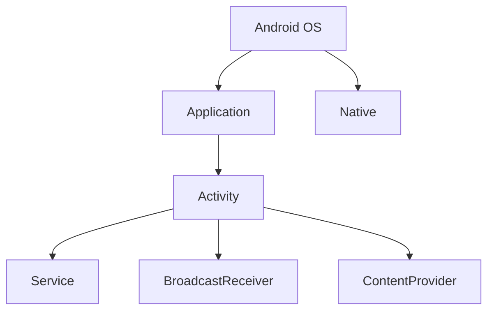

                 

# 2025年快手社招Android开发工程师面试指南

## 关键词
- 快手
- Android开发
- 面试指南
- 技术栈
- 性能优化
- 安全性
- 热更新

## 摘要
本文旨在为即将参加2025年快手社招Android开发工程师面试的应聘者提供一份全面的面试指南。本文将围绕Android开发基础、高级开发技术、面试准备等方面进行详细阐述，帮助应聘者深入了解快手Android团队的需求，掌握面试技巧，成功应对面试挑战。

## 目录大纲

### 《2025年快手社招Android开发工程师面试指南》目录大纲

#### 第一部分：Android基础

1. **Android开发概述**
    - Android平台的发展历程
    - Android架构与核心组件

2. **Android应用程序基础**
    - AndroidManifest.xml文件详解
    - Android项目结构分析
    - Activities、Services、Broadcast Receivers和Content Providers详解

3. **Android UI开发**
    - 布局与视图
    - 绘制与动画

4. **Android数据存储**
    - 文件存储
    - SQLite数据库
    - SharedPreferences

5. **Android网络编程**
    - 网络基础
    - Http请求
    - WebSocket

6. **Android性能优化**
    - 帧率优化
    - 内存管理
    - 线程管理

#### 第二部分：高级Android开发

7. **Android多线程与并发**
    - Handler、Message和Looper
    - AsyncTask
    - ThreadPoolExecutor

8. **Android动画与特效**
    - View动画
    - 属性动画
    - 自定义动画

9. **Android安全与权限**
    - 权限管理
    - 安全存储
    - 反编译与保护

10. **Android热更新**
    - Gradle插件开发
    - 插件化框架使用
    - 热更新实践

#### 第三部分：面试准备

11. **Android面试常见问题**
    - 概念与原理
    - 编码题与实践题
    - 案例分析

12. **面试技巧与心态调整**
    - 面试前的准备
    - 面试中的沟通技巧
    - 面试后的反思与总结

13. **快手Android团队介绍**
    - 快手产品概述
    - Android团队组织结构
    - 开发团队文化

#### 附录

14. **Android开发工具与资源**
    - Android Studio使用技巧
    - 常用库和框架
    - 学习资源推荐

### 第一部分：Android基础

#### Android开发概述

Android操作系统是谷歌公司基于Linux内核开发的一款移动操作系统，自2008年发布以来，已成为全球最流行的移动操作系统之一。Android平台的发展历程可以分为以下几个阶段：

1. **早期阶段（2008-2010年）**：Android 1.0至Android 1.5版本发布，这一阶段的Android系统较为简单，主要面向手机和手持设备。

2. **快速发展阶段（2010-2014年）**：Android 2.0至Android 4.4版本发布，这一阶段的Android系统逐渐完善，开始支持平板电脑和智能手表等设备。

3. **成熟阶段（2014年至今）**：Android 5.0及以上版本发布，这一阶段的Android系统在性能、安全性和用户体验等方面都有了显著提升。

Android架构由以下核心组件组成：

1. **应用程序框架**：提供应用程序开发者访问各种硬件设备（如通讯模块、多媒体设备、屏幕等）的高级接口。

2. **系统库**：包括C/C++库和Bionic libc等，提供应用程序运行所需的底层功能，如图形处理、音频和视频播放等。

3. **Android运行时**：包括Dalvik虚拟机和Android运行时库，为应用程序提供执行环境。

4. **Linux内核**：提供底层的系统服务，如进程管理、内存管理和设备驱动程序等。

#### Android应用程序基础

Android应用程序主要由以下几个部分组成：

1. **AndroidManifest.xml文件**：用于描述应用程序的基本信息，如应用程序的名称、版本号、支持设备等。

2. **Android项目结构**：包括应用程序的源代码、资源文件和构建脚本等。

3. **主要组件**：包括Activity（活动）、Service（服务）、BroadcastReceiver（广播接收器）和ContentProvider（内容提供者）。

- **Activity**：表示应用程序中的一个界面，用户可以通过Activity完成特定的任务。

- **Service**：用于在后台执行长时间运行的任务，如下载文件、播放音乐等。

- **BroadcastReceiver**：用于接收系统或其他应用程序发出的广播消息，如网络状态变化、屏幕旋转等。

- **ContentProvider**：用于访问和管理应用程序的数据，如数据库、文件等。

#### Android UI开发

Android UI开发主要包括布局和视图、绘制和动画等方面。

1. **布局与视图**：Android使用XML语言定义布局，布局可以包含各种视图组件，如文本框、按钮、列表等。视图组件具有丰富的属性，可以满足不同的界面需求。

2. **绘制与动画**：Android通过绘制视图组件来渲染界面。动画可以通过XML或代码定义，实现视图的平移、缩放、旋转等效果。

#### Android数据存储

Android数据存储主要包括文件存储、SQLite数据库和SharedPreferences。

1. **文件存储**：Android使用File类和Context的openFileOutput()方法来存储和读取文件。

2. **SQLite数据库**：Android内置的数据库引擎，支持SQL语句，用于存储和管理结构化数据。

3. **SharedPreferences**：用于存储简单的键值对数据，适用于应用程序的配置信息。

#### Android网络编程

Android网络编程主要包括网络基础、HTTP请求和WebSocket等方面。

1. **网络基础**：Android使用Socket API和HttpURLConnection类实现网络通信。

2. **HTTP请求**：Android通过URL类和HttpURLConnection类实现HTTP请求，包括GET和POST方法。

3. **WebSocket**：Android使用WebSocket库实现实时通信，适用于聊天、实时数据推送等场景。

#### Android性能优化

Android性能优化主要包括帧率优化、内存管理和线程管理。

1. **帧率优化**：通过减少绘制操作、优化布局性能和降低CPU负载来提高帧率。

2. **内存管理**：通过合理使用内存、回收无用对象和优化数据结构来减少内存占用。

3. **线程管理**：通过线程池和异步任务来提高应用程序的响应速度和性能。

### 第二部分：高级Android开发

#### Android多线程与并发

Android多线程与并发技术主要包括Handler、Message和Looper、AsyncTask和ThreadPoolExecutor。

1. **Handler、Message和Looper**：用于线程间通信，实现线程同步和异步操作。

2. **AsyncTask**：用于简化异步任务的编写，内部实现线程管理和线程同步。

3. **ThreadPoolExecutor**：用于线程池管理，提高并发性能和资源利用率。

#### Android动画与特效

Android动画与特效主要包括View动画、属性动画和自定义动画。

1. **View动画**：通过改变View的位置、大小、透明度等属性实现动画效果。

2. **属性动画**：通过改变View的属性值实现动画效果，支持多种动画效果。

3. **自定义动画**：通过继承Animator和AnimatorListener等类自定义动画效果。

#### Android安全与权限

Android安全与权限主要包括权限管理、安全存储和反编译与保护。

1. **权限管理**：通过AndroidManifest.xml文件申请权限，控制应用程序访问设备资源的权限。

2. **安全存储**：通过加密和存储隔离等技术保护应用程序的数据安全。

3. **反编译与保护**：通过混淆和加固等技术防止应用程序被反编译和破解。

#### Android热更新

Android热更新主要包括Gradle插件开发、插件化框架使用和热更新实践。

1. **Gradle插件开发**：用于自定义构建任务和脚本，实现热更新功能。

2. **插件化框架使用**：通过插件化框架实现应用程序的模块化，提高热更新的效率和可靠性。

3. **热更新实践**：通过实际案例介绍热更新的实现过程和注意事项。

### 第三部分：面试准备

#### Android面试常见问题

Android面试常见问题包括概念与原理、编码题与实践题和案例分析。

1. **概念与原理**：涉及Android架构、组件、网络编程、数据存储等基础知识的理解和应用。

2. **编码题与实践题**：涉及编程技能和算法思维的考察，如排序算法、搜索算法、网络编程等。

3. **案例分析**：通过实际案例考察应聘者的分析问题和解决问题的能力。

#### 面试技巧与心态调整

面试技巧与心态调整包括面试前的准备、面试中的沟通技巧和面试后的反思与总结。

1. **面试前的准备**：熟悉面试流程、准备好面试资料、调整心态。

2. **面试中的沟通技巧**：注意倾听、清晰表达、逻辑严密。

3. **面试后的反思与总结**：总结面试经验、找出不足、持续改进。

#### 快手Android团队介绍

快手Android团队负责快手移动端产品的开发与维护，团队成员具备丰富的开发经验和优秀的专业素养。快手产品涵盖了短视频、直播、社交等多个领域，拥有庞大的用户群体和强大的市场竞争力。

1. **快手产品概述**：介绍快手的主要产品功能和特点。

2. **Android团队组织结构**：介绍快手Android团队的部门设置和人员构成。

3. **开发团队文化**：强调团队协作、技术创新和追求卓越。

### 附录

#### Android开发工具与资源

Android开发工具与资源包括Android Studio使用技巧、常用库和框架以及学习资源推荐。

1. **Android Studio使用技巧**：介绍Android Studio的常用功能和使用技巧。

2. **常用库和框架**：推荐一些常用的Android库和框架，如Retrofit、Gson、OkHttp等。

3. **学习资源推荐**：推荐一些优质的Android学习资源，如官方文档、技术博客、在线课程等。

### 核心概念与联系

**Android架构图**：


### 核心算法原理讲解

**线程管理伪代码**：
```java
ThreadPoolExecutor executor = new ThreadPoolExecutor(
    CorePoolSize, 
    MaximumPoolSize, 
    KeepAliveTime, 
    TimeUnit.MILLISECONDS, 
    new LinkedBlockingQueue<Runnable>()
);

executor.execute(() -> {
    // 线程任务
});

executor.shutdown();
```

### 数学模型和数学公式 & 详细讲解 & 举例说明

**协方差与相关系数**：

$$ 
\text{Cov}(X,Y) = E[(X - \mu_X)(Y - \mu_Y)] 
$$

$$ 
\text{Corr}(X,Y) = \frac{\text{Cov}(X,Y)}{\sigma_X \sigma_Y}
$$

**举例**：给定两个随机变量X和Y，计算它们的协方差和相关系数。

### 项目实战

#### 实践一：Android应用启动流程

**环境搭建**：使用Android Studio创建一个简单的Android应用。

**源代码实现**：分析应用的启动流程，包括Activity的创建、生命周期方法和回调函数。

**代码解读与分析**：详细解析应用的启动过程，包括Intent的使用、Activity栈的管理以及启动模式的配置。

#### 实践二：Android网络请求

**环境搭建**：使用Retrofit库创建一个网络请求示例。

**源代码实现**：编写网络请求接口、配置Retrofit和解析响应数据。

**代码解读与分析**：详细说明网络请求的过程，包括如何配置OkHttp、如何处理响应数据以及如何处理异常。

### 作者

作者：AI天才研究院/AI Genius Institute & 禅与计算机程序设计艺术 /Zen And The Art of Computer Programming

本文通过详细的章节结构和丰富的内容，旨在为2025年快手社招Android开发工程师面试的应聘者提供一份全面的面试指南。希望本文能帮助读者掌握Android开发的核心技术和面试技巧，成功通过面试，加入快手Android团队，共同推动移动技术的发展。

