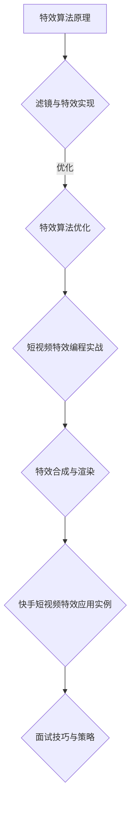

                 

### 《2025年快手社招短视频特效算法工程师面试指南》

> **关键词：** 快手社招、短视频特效、算法工程师、面试指南

> **摘要：** 本文旨在为准备快手社招短视频特效算法工程师面试的应聘者提供系统性的指导。文章将详细解析短视频特效技术基础、快手短视频特效应用实例、面试技巧与策略，帮助读者全面了解短视频特效领域的知识体系，提升面试竞争力。

---

### 《2025年快手社招短视频特效算法工程师面试指南》目录大纲

#### 第一部分：短视频特效技术基础

##### 第1章：短视频特效概述
- 1.1 短视频特效的起源与发展
- 1.2 短视频特效的分类与特点
- 1.3 短视频特效的创意与实践

##### 第2章：图像处理基础
- 2.1 图像基础概念
- 2.2 颜色模型与色彩管理
- 2.3 图像滤波与增强

##### 第3章：计算机视觉基础
- 3.1 计算机视觉概述
- 3.2 特征提取与匹配
- 3.3 目标检测与跟踪

##### 第4章：特效算法原理与实现
- 4.1 特效算法原理
- 4.2 滤镜与特效实现
- 4.3 特效算法优化

##### 第5章：短视频特效编程实战
- 5.1 开发环境搭建
- 5.2 实现基础特效
- 5.3 高级特效实现
- 5.4 效果调试与优化

##### 第6章：特效合成与渲染
- 6.1 合成原理
- 6.2 渲染技术
- 6.3 实现与调试

##### 第7章：快手短视频特效应用实例
- 7.1 快手特效应用概述
- 7.2 实现与分析
- 7.3 创意与优化

##### 第8章：面试技巧与策略
- 8.1 面试前的准备
- 8.2 面试过程中的技巧
- 8.3 面试后的反思与总结

#### 第二部分：快手短视频特效应用

##### 附录A：快手短视频特效开发工具与资源
- A.1 开发工具介绍
- A.2 常用库与框架
- A.3 在线资源与学习资料

##### 附录B：特效算法 Mermaid 流程图

##### 附录C：特效算法伪代码实现

##### 附录D：数学模型与公式

##### 附录E：项目实战代码解读

##### 附录F：开发环境搭建指南

##### 附录G：快手短视频特效开发工具与资源

##### 附录H：特效算法 Mermaid 流程图

##### 附录I：数学模型与公式

##### 附录J：项目实战代码解读

##### 附录K：开发环境搭建指南

##### 附录L：快手短视频特效开发工具与资源

### 《2025年快手社招短视频特效算法工程师面试指南》

---

#### 第一部分：短视频特效技术基础

##### 第1章：短视频特效概述

**1.1 短视频特效的起源与发展**

短视频特效技术起源于20世纪90年代，随着计算机技术和图像处理算法的发展，短视频特效逐渐成为视频制作中不可或缺的一部分。早期的短视频特效主要是通过视频编辑软件实现简单的滤镜和转场效果，如淡入淡出、滑动等。

进入21世纪，随着互联网的普及和移动设备的普及，短视频逐渐兴起。短视频平台如快手、抖音等吸引了大量用户，短视频特效技术也随之迅速发展。现代短视频特效不仅包括基础的滤镜和转场效果，还涵盖了更为复杂的效果，如美颜、变声、AR滤镜等。

**1.2 短视频特效的分类与特点**

短视频特效可以分为以下几类：

1. **滤镜效果**：通过对图像进行滤波和调整，实现不同的视觉效果。常见的滤镜效果包括美颜、磨皮、黑白、油画等。
2. **动画效果**：通过动画技术实现图像的动态变化，如图像的变形、旋转、移动等。
3. **音效效果**：通过音效处理，实现视频的声音增强、变调、混响等效果。
4. **AR效果**：通过增强现实技术，将虚拟元素叠加到现实画面中，如贴纸、背景替换等。

短视频特效的特点在于实时性、交互性和创意性。实时性指的是特效能够在视频播放过程中实时计算并呈现；交互性指的是用户可以通过操作界面调整特效参数；创意性则是指短视频特效能够为视频内容带来独特的视觉和听觉体验。

**1.3 短视频特效的创意与实践**

短视频特效的创意源于艺术和技术的结合。在短视频制作过程中，特效的运用不仅能够增强视频的视觉效果，还能表达出制作者的创意和想法。

以下是一些短视频特效创意的实践方法：

1. **色彩运用**：通过调整图像的色彩，实现画面风格的变换。如通过使用油画滤镜，使视频呈现出复古的油画风格；通过调整色彩饱和度，增强视觉冲击力。
2. **动态效果**：利用动画技术，使图像产生动态变化，如图像的旋转、拉伸、抖动等。动态效果能够增强视频的趣味性和观赏性。
3. **音效搭配**：通过音效的处理，使视频的视觉效果与声音产生共鸣，提升观众的体验感。如使用音效增强背景音乐的节奏，使画面更加生动。
4. **创意合成**：通过合成技术，将不同的元素组合在一起，创造出独特的视觉效果。如将现实画面与虚拟元素结合，创造出奇幻的效果。

总之，短视频特效的创意与实践是短视频制作过程中不可或缺的一部分。通过合理运用特效技术，能够为视频内容注入新的活力和创意，提升观众的观看体验。

---

**本章小结**

本章介绍了短视频特效的起源与发展、分类与特点，以及创意与实践。短视频特效技术的迅速发展为短视频制作提供了丰富的工具和手段，通过合理运用特效，可以增强视频的视觉效果和创意性，提升观众的观看体验。在接下来的章节中，我们将进一步探讨图像处理基础、计算机视觉基础、特效算法原理与实现等关键技术，帮助读者全面掌握短视频特效领域的知识体系。

---

##### 第2章：图像处理基础

**2.1 图像基础概念**

图像处理是短视频特效的核心技术之一，理解图像的基础概念对于深入掌握短视频特效技术至关重要。图像处理涉及到的基本概念包括像素、分辨率、颜色模型和色彩空间等。

**像素（Pixel）**：像素是图像的基本单位，通常用来描述图像中的单个点。每个像素包含了一定数量的信息，如颜色值和亮度值。在计算机中，像素通常用一个数组来表示，每个数组元素代表一个像素点的信息。

**分辨率（Resolution）**：分辨率指的是图像的尺寸，通常以水平像素数和垂直像素数来表示。分辨率越高，图像的细节表现越清晰。常见的分辨率有720p、1080p、4K等。分辨率不仅影响图像的显示效果，还影响图像的处理速度和存储空间。

**颜色模型（Color Model）**：颜色模型是用来描述颜色的一种方式，常见的颜色模型有RGB模型、HSV模型和CMYK模型等。RGB模型使用红色、绿色和蓝色三个颜色通道来表示颜色，HSV模型使用色调、饱和度和亮度来表示颜色，CMYK模型则用于印刷领域，使用青色、品红、黄色和黑色四个颜色通道来表示颜色。

**色彩空间（Color Space）**：色彩空间是颜色模型的具体实现，不同的色彩空间有不同的优点和适用场景。常见的色彩空间有RGB、HSV、CMYK、Lab等。RGB色彩空间通常用于数字图像处理，HSV色彩空间则常用于图像的色调调整，CMYK色彩空间用于印刷行业。

**2.2 颜色模型与色彩管理**

颜色模型是图像处理的基础，不同的颜色模型适用于不同的场景。RGB模型是最常用的颜色模型，它使用红色、绿色和蓝色三个颜色通道来表示颜色。每个通道的值范围通常是0到255，分别表示颜色的强度。RGB模型广泛应用于数字图像处理和显示设备中。

HSV模型是另一种常用的颜色模型，它使用色调（Hue）、饱和度（Saturation）和亮度（Value）来描述颜色。色调表示颜色的种类，饱和度表示颜色的纯度，亮度表示颜色的明暗程度。HSV模型在色调调整、色彩分离等方面具有显著优势。

色彩管理是确保不同设备和软件之间颜色一致性的重要技术。色彩管理涉及色彩空间转换、颜色校正和颜色匹配等。常见的色彩管理标准有ICC（国际色彩联盟）色彩配置文件，它定义了设备之间的颜色描述方法，确保在不同设备上显示的颜色一致。

**2.3 图像滤波与增强**

图像滤波是图像处理中的重要技术，用于消除图像中的噪声和改善图像质量。滤波器是一种数学工具，用于对图像进行加权平均处理，从而消除特定频率的噪声。

常见的滤波器包括：

1. **均值滤波器**：对图像中的每个像素点，取其邻域像素的平均值作为新的像素值。均值滤波器可以有效去除图像中的高斯噪声，但可能会使图像变得模糊。
2. **高斯滤波器**：使用高斯函数作为滤波器的权值，对图像进行加权平均处理。高斯滤波器可以有效去除图像中的高斯噪声，同时保持图像的边缘信息。
3. **中值滤波器**：对图像中的每个像素点，取其邻域像素的中值作为新的像素值。中值滤波器可以有效去除图像中的椒盐噪声，但可能会使图像变得模糊。

图像增强是另一种重要的图像处理技术，用于改善图像的可视效果。图像增强可以通过调整图像的对比度、亮度、饱和度等参数来实现。常见的图像增强方法包括：

1. **对比度增强**：通过调整图像的对比度，增强图像中不同区域的亮度差异，使图像更加清晰。
2. **亮度增强**：通过调整图像的亮度，使图像整体变亮或变暗，改善图像的视觉效果。
3. **饱和度增强**：通过调整图像的饱和度，增强图像中的颜色信息，使图像更加鲜艳。

总之，图像处理基础是短视频特效技术的核心组成部分。掌握图像的基础概念、颜色模型与色彩管理、图像滤波与增强等技术，对于理解和实现短视频特效至关重要。在接下来的章节中，我们将进一步探讨计算机视觉基础、特效算法原理与实现等关键技术，帮助读者全面掌握短视频特效领域的知识体系。

---

**本章小结**

本章介绍了图像处理的基础概念、颜色模型与色彩管理，以及图像滤波与增强技术。理解图像的基础概念对于深入掌握短视频特效技术至关重要。通过本章的学习，读者可以了解图像的像素、分辨率、颜色模型和滤波器等基本知识，为后续学习计算机视觉和特效算法打下基础。在下一章中，我们将继续探讨计算机视觉基础，包括计算机视觉概述、特征提取与匹配、目标检测与跟踪等内容。

---

##### 第3章：计算机视觉基础

**3.1 计算机视觉概述**

计算机视觉（Computer Vision）是人工智能（Artificial Intelligence, AI）的一个重要分支，旨在使计算机能够像人类一样理解和解释视觉信息。计算机视觉技术通过对图像和视频的处理，实现从二维图像到三维世界的信息转换，从而进行目标检测、图像分类、场景理解等任务。

计算机视觉的发展可以追溯到20世纪60年代，当时的研究主要集中在图像识别和图像处理。随着计算机硬件和算法的不断发展，计算机视觉技术逐渐成熟，并广泛应用于各个领域，如自动驾驶、安防监控、医疗诊断、虚拟现实等。

**计算机视觉的基本任务**

计算机视觉的基本任务包括：

1. **图像识别**：从图像中识别出特定的物体或场景。
2. **目标检测**：在图像中定位并识别多个目标。
3. **场景理解**：从图像中提取出结构化信息，进行场景理解。
4. **图像生成**：利用现有图像生成新的图像。

**3.2 特征提取与匹配**

特征提取与匹配是计算机视觉中的核心步骤，用于从图像中提取出具有区分性的特征，以便进行后续处理。

**特征提取**：

特征提取的目标是从图像中提取出能够表征图像内容的特征，如边缘、角点、纹理等。常见的特征提取方法包括：

1. **边缘检测**：通过检测图像中的边缘，提取出图像的轮廓信息。常用的边缘检测算法有Sobel算子、Canny算子等。
2. **角点检测**：通过检测图像中的角点，提取出图像的角点特征。常用的角点检测算法有Harris角点检测、Shi-Tomasi角点检测等。
3. **纹理分析**：通过分析图像的纹理特征，提取出图像的纹理信息。常用的纹理分析方法有Gabor滤波器、局部二值模式（LBP）等。

**特征匹配**：

特征匹配是用于将两个或多个图像中的对应特征点进行匹配的过程。常用的特征匹配算法包括：

1. **最近邻匹配**：对于每个特征点，找到另一个图像中与其最接近的特征点。该方法简单有效，但容易受到噪声和光照变化的影响。
2. **哈希匹配**：将特征点转换为哈希值，通过比较哈希值实现特征匹配。该方法在处理大规模图像时具有很高的效率。
3. **随机抽样一致性（RANSAC）**：用于处理噪声和异常值的影响，通过多次随机采样和最小化误差实现特征匹配。

**3.3 目标检测与跟踪**

目标检测（Object Detection）是计算机视觉中的重要任务，旨在从图像中检测并定位多个目标。目标检测通常包括以下几个步骤：

1. **特征提取**：从图像中提取出用于描述目标的特征。
2. **候选区域生成**：通过一些算法，如滑动窗口、区域提议等，生成可能的候选区域。
3. **分类与定位**：对候选区域中的特征进行分类，判断是否为目标，并定位目标的边界。

目标检测算法可以分为以下几类：

1. **基于传统机器学习的算法**：如支持向量机（SVM）、随机森林（Random Forest）等。这些算法通过训练分类器实现目标检测，但效果受限于特征提取和训练数据的质量。
2. **基于深度学习的算法**：如卷积神经网络（CNN）、YOLO（You Only Look Once）等。这些算法通过训练深度神经网络实现目标检测，具有更高的准确率和鲁棒性。

目标跟踪（Object Tracking）是另一个重要的计算机视觉任务，旨在从视频序列中持续跟踪并定位目标。目标跟踪通常包括以下几个步骤：

1. **初始检测**：在视频帧中检测出目标。
2. **状态估计**：使用运动模型和观测数据估计目标的状态。
3. **状态更新**：根据新的观测数据更新目标的状态。

目标跟踪算法可以分为以下几类：

1. **基于光流的方法**：通过计算视频帧之间的像素运动，实现目标的跟踪。这种方法对光照变化和目标形状变化较为敏感。
2. **基于模板匹配的方法**：通过将目标模板与视频帧进行匹配，实现目标的跟踪。这种方法对目标的形状变化和遮挡较为敏感。
3. **基于深度学习的算法**：如基于卷积神经网络的跟踪算法，通过训练深度神经网络实现目标的跟踪。这种方法具有更高的准确率和鲁棒性。

总之，计算机视觉基础是短视频特效算法的重要组成部分。掌握计算机视觉的基本任务、特征提取与匹配、目标检测与跟踪等内容，对于深入理解和实现短视频特效技术至关重要。在下一章中，我们将继续探讨特效算法原理与实现，帮助读者全面掌握短视频特效领域的知识体系。

---

**本章小结**

本章介绍了计算机视觉的概述、特征提取与匹配以及目标检测与跟踪。通过本章的学习，读者可以了解计算机视觉的基本任务和关键技术，为深入理解短视频特效技术打下基础。在下一章中，我们将探讨特效算法原理与实现，进一步深化对短视频特效技术的理解。读者将学习到特效算法的基本原理和实现方法，为实际应用打下坚实的基础。

---

##### 第4章：特效算法原理与实现

**4.1 特效算法原理**

特效算法是短视频特效技术的核心组成部分，它通过对图像和视频的处理，实现各种视觉效果。特效算法的原理通常涉及图像处理、计算机视觉和图形学等领域的知识。以下是一些常见特效算法的原理：

**图像滤镜算法**：

图像滤镜算法通过对图像进行滤波处理，实现各种视觉效果。常见的滤镜算法包括：

1. **高斯模糊**：使用高斯函数作为滤波器，对图像进行加权平均处理，实现模糊效果。
2. **锐化**：通过对图像进行增强处理，使图像的边缘和细节更加清晰。
3. **对比度增强**：通过调整图像的亮度值，增强图像中不同区域的亮度差异，使图像更加清晰。

**图像合成算法**：

图像合成算法通过将多个图像或视频片段进行组合，实现各种特效效果。常见的合成算法包括：

1. **混合模式**：通过对图像的颜色通道进行操作，实现图像的混合效果。例如，使用“叠加”模式实现图像的透明效果。
2. **运动跟踪**：通过跟踪视频中的运动目标，实现目标的跟随和替换效果。

**图像风格转换算法**：

图像风格转换算法通过将普通图像转换为具有特定艺术风格的图像，实现独特的视觉效果。常见的风格转换算法包括：

1. **卷积神经网络（CNN）**：使用卷积神经网络训练模型，实现从一种风格图像到另一种风格图像的转换。
2. **生成对抗网络（GAN）**：使用生成对抗网络训练模型，实现从普通图像到艺术风格图像的转换。

**4.2 滤镜与特效实现**

滤镜与特效实现是特效算法的核心步骤，它涉及到图像处理算法的应用和优化。以下是一些常见的滤镜与特效实现方法：

**1. 高斯模糊实现**

高斯模糊是常用的图像滤波算法，可以通过以下步骤实现：

1. **生成高斯滤波器**：根据高斯函数生成高斯滤波器。
2. **卷积运算**：使用高斯滤波器对图像进行卷积运算，实现模糊效果。

伪代码实现如下：

```python
def apply_gaussian_blur(image, sigma=1.0):
    # 创建高斯滤波器
    kernel = create_gaussian_kernel(sigma)
    # 对图像进行卷积运算
    blurred_image = convolve(image, kernel)
    return blurred_image
```

**2. 锐化实现**

锐化是通过增强图像的边缘和细节来实现的。可以使用以下步骤实现：

1. **生成锐化滤波器**：根据锐化需求生成锐化滤波器。
2. **卷积运算**：使用锐化滤波器对图像进行卷积运算，实现锐化效果。

伪代码实现如下：

```python
def apply_sharpen(image, sharpen_factor=1.5):
    # 创建锐化滤波器
    kernel = create_sharpen_kernel(sharpen_factor)
    # 对图像进行卷积运算
    sharpened_image = convolve(image, kernel)
    return sharpened_image
```

**3. 对比度增强实现**

对比度增强是通过调整图像的亮度值来实现的。可以使用以下步骤实现：

1. **计算图像的亮度和对比度**：计算图像的平均亮度和标准差，得到对比度值。
2. **调整亮度值**：根据对比度值调整图像的亮度值。

伪代码实现如下：

```python
def adjust_contrast(image, contrast_factor=1.2):
    # 计算平均亮度和对比度
    avg_brightness = np.mean(image)
    std_brightness = np.std(image)
    # 调整亮度值
    adjusted_image = (image - avg_brightness) * contrast_factor + avg_brightness
    return adjusted_image
```

**4.3 特效算法优化**

特效算法优化是提升算法性能和效果的重要步骤。以下是一些常见的优化方法：

**1. 并行计算**：通过并行计算提高算法的执行速度。可以使用多线程、GPU加速等方法实现。

**2. 模型压缩**：通过模型压缩减小算法的存储和计算需求。可以使用量化、剪枝等方法实现。

**3. 实时性优化**：对于需要实时处理的特效算法，可以通过减少计算量、优化算法结构等方法提高实时性。

**4. 错误容忍**：对于某些特效算法，可以通过引入错误容忍机制提高算法的鲁棒性。

总之，特效算法原理与实现是短视频特效技术的关键组成部分。掌握特效算法的基本原理和实现方法，以及优化技巧，对于开发高效、高质量的短视频特效算法至关重要。在下一章中，我们将探讨短视频特效编程实战，通过具体实例学习如何实现和优化特效算法。

---

**本章小结**

本章介绍了特效算法的原理与实现，包括图像滤镜算法、图像合成算法和图像风格转换算法的基本原理，以及滤镜与特效的实现方法。通过伪代码示例，读者可以了解如何实现高斯模糊、锐化和对比度增强等常见特效算法。此外，本章还介绍了特效算法的优化方法，包括并行计算、模型压缩、实时性优化和错误容忍等。掌握这些内容，读者可以为后续的短视频特效编程实战打下坚实的基础。

---

##### 第5章：短视频特效编程实战

**5.1 开发环境搭建**

在进行短视频特效编程实战之前，我们需要搭建一个合适的开发环境。这里以Python为例，介绍如何搭建一个完整的短视频特效开发环境。

**1. 安装Python**

首先，我们需要安装Python。Python是一种广泛使用的编程语言，拥有丰富的库和框架，非常适合进行图像和视频处理。你可以从Python的官方网站（https://www.python.org/）下载最新版本的Python安装包，并按照安装向导完成安装。

**2. 安装必需的库和框架**

接下来，我们需要安装一些必需的库和框架，包括OpenCV、NumPy、Matplotlib和Pillow等。这些库和框架提供了强大的图像处理和视频处理功能，是短视频特效编程的基础。

使用以下命令安装这些库：

```bash
pip install opencv-python numpy matplotlib pillow
```

**3. 配置开发环境**

我们推荐使用Visual Studio Code（VS Code）作为开发环境。VS Code是一个功能强大的代码编辑器，拥有丰富的扩展和插件，非常适合进行Python编程。

在VS Code中，我们可以安装以下插件：

- Python：用于支持Python编程语言。
- Pylance：提供Python语言增强和代码智能提示。
- Jupyter Notebook：用于支持Jupyter Notebook交互式编程。

安装这些插件后，VS Code将具有完整的Python开发环境。

**4. 验证安装**

为了确保所有库和框架都已成功安装，我们可以运行以下Python脚本：

```python
import cv2
import numpy as np
import matplotlib.pyplot as plt
import PIL

print("OpenCV installed:", cv2.__version__)
print("NumPy installed:", np.__version__)
print("Matplotlib installed:", plt.matplotlib)
print("Pillow installed:", PIL.PILLOW_VERSION)
```

如果上述脚本能够正常运行，并且打印出相应的版本信息，则表示我们的开发环境已经搭建成功。

---

**5.2 实现基础特效**

在了解了开发环境搭建之后，我们可以开始实现一些基础特效。以下是一些常用的基础特效实现方法：

**1. 高斯模糊**

高斯模糊是一种常用的图像模糊效果，可以通过以下步骤实现：

```python
import cv2
import numpy as np

def apply_gaussian_blur(image, sigma=1.0):
    # 创建高斯滤波器
    kernel = cv2.GaussianBlur(image, (5, 5), sigma)
    return kernel

# 读取图像
image = cv2.imread("example.jpg")
# 应用高斯模糊
blurred_image = apply_gaussian_blur(image, sigma=1.0)
# 显示模糊后的图像
cv2.imshow("Blurred Image", blurred_image)
cv2.waitKey(0)
cv2.destroyAllWindows()
```

**2. 锐化**

锐化是一种增强图像细节的效果，可以通过以下步骤实现：

```python
import cv2
import numpy as np

def apply_sharpen(image, sharpen_factor=1.5):
    # 创建锐化滤波器
    kernel = np.array([[-1, -1, -1],
                       [-1, 9, -1],
                       [-1, -1, -1]]) / 8
    # 应用锐化滤波器
    sharpened_image = cv2.filter2D(image, -1, kernel)
    return sharpened_image

# 读取图像
image = cv2.imread("example.jpg")
# 应用锐化
sharpened_image = apply_sharpen(image, sharpen_factor=1.5)
# 显示锐化后的图像
cv2.imshow("Sharpened Image", sharpened_image)
cv2.waitKey(0)
cv2.destroyAllWindows()
```

**3. 对比度增强**

对比度增强是一种增强图像亮度和暗度差异的效果，可以通过以下步骤实现：

```python
import cv2
import numpy as np

def adjust_contrast(image, contrast_factor=1.2):
    # 计算图像的亮度值
    avg_brightness = np.mean(image)
    std_brightness = np.std(image)
    # 调整亮度值
    adjusted_image = (image - avg_brightness) * contrast_factor + avg_brightness
    return adjusted_image

# 读取图像
image = cv2.imread("example.jpg")
# 应用对比度增强
adjusted_image = adjust_contrast(image, contrast_factor=1.2)
# 显示对比度增强后的图像
cv2.imshow("Adjusted Image", adjusted_image)
cv2.waitKey(0)
cv2.destroyAllWindows()
```

---

**5.3 实现高级特效**

除了基础特效外，短视频特效编程还可以实现更多高级特效，如图像风格转换、运动追踪、AR滤镜等。以下是一个简单的图像风格转换的实现示例：

```python
import cv2
import numpy as np

def style_transfer(content_image, style_image, alpha=1.0, beta=1.0):
    # 载入内容图像和风格图像
    content_image = cv2.imread(content_image)
    style_image = cv2.imread(style_image)
    # 将图像转换为浮点类型并归一化
    content_image = content_image.astype(np.float32) / 255.0
    style_image = style_image.astype(np.float32) / 255.0
    # 计算内容图像和风格图像的Gram矩阵
    content Gram = compute_gram_matrix(content_image)
    style Gram = compute_gram_matrix(style_image)
    # 初始化变量
    iter_num = 1000
    initial = np.random.randn(content_image.shape[0], content_image.shape[1], content_image.shape[2]) * 0.01
    # 使用循环迭代优化结果
    for i in range(iter_num):
        content_image = content_image * (1 - alpha * beta) + alpha * content_特征 + beta * style_特征
        if i % 100 == 0:
            print(f"迭代次数：{i}, 误差：{np.linalg.norm(content_特征 - style_特征)}")
    # 将结果转换为0到1的归一化范围并转换为整数
    output_image = (content_image * 255).astype(np.uint8)
    return output_image

def compute_gram_matrix(image):
    # 计算Gram矩阵
    features = np.reshape(image, [-1, image.shape[2]])
    gram_matrix = np.dot(features.T, features)
    return gram_matrix

# 使用示例
content_image = "content.jpg"
style_image = "style.jpg"
output_image = style_transfer(content_image, style_image)
cv2.imwrite("output.jpg", output_image)
```

---

**5.4 效果调试与优化**

在实现短视频特效的过程中，调试和优化是确保效果和质量的关键步骤。以下是一些调试和优化的建议：

**1. 调试**

- 使用调试工具（如VS Code的调试插件）逐步执行代码，查看每一步的结果。
- 检查图像的输入和输出，确保图像格式和数据类型正确。
- 记录关键变量的值，分析算法的执行过程。

**2. 优化**

- 使用并行计算提高算法的执行速度。
- 使用模型压缩减少算法的存储和计算需求。
- 调整算法参数，优化效果和质量。
- 引入错误容忍机制，提高算法的鲁棒性。

---

**本章小结**

本章介绍了短视频特效编程实战，包括开发环境搭建、基础特效实现、高级特效实现以及效果调试与优化。通过本章的学习，读者可以了解如何使用Python和OpenCV等库实现短视频特效，并掌握调试和优化的技巧。掌握这些内容，读者可以为自己的短视频特效项目奠定坚实的基础。

---

##### 第6章：特效合成与渲染

**6.1 合成原理**

特效合成是短视频特效技术中至关重要的一环，它涉及到将多个图像或视频片段进行组合，以实现最终的视觉效果。特效合成的原理可以概括为以下几个步骤：

1. **图像叠加**：将多个图像或视频片段在空间上叠加，实现分层效果。常见的叠加方式包括透明度叠加、颜色叠加等。
2. **颜色调整**：对叠加后的图像进行颜色调整，以匹配整体色调和亮度。常见的调整方法包括色彩平衡、亮度对比度调整等。
3. **空间变换**：对图像进行空间变换，以实现运动效果或特殊效果。常见的变换方法包括旋转、缩放、平移等。
4. **特效添加**：在合成后的图像中添加各种特效，如光影效果、纹理效果等，以增强视觉效果。

**6.2 渲染技术**

渲染技术是实现特效合成的关键步骤，它涉及到图像的计算和处理，以生成最终的视觉效果。以下是几种常见的渲染技术：

1. **像素渲染**：像素渲染是最基础的渲染技术，它将图像划分为像素进行渲染。常见的像素渲染方法包括逐像素渲染、像素块渲染等。
2. **光线追踪**：光线追踪是一种高级渲染技术，通过模拟光线在场景中的传播和反射，生成高质量的图像。光线追踪可以产生逼真的光影效果和反射效果。
3. **粒子系统**：粒子系统用于生成大规模的粒子效果，如火焰、烟雾、雨滴等。粒子系统通过模拟粒子的运动和碰撞，实现逼真的粒子效果。
4. **三维渲染**：三维渲染技术用于生成三维场景的图像，包括物体的建模、纹理映射、光照计算等。三维渲染技术可以产生高度逼真的视觉效果。

**6.3 实现与调试**

实现特效合成与渲染通常需要以下几个步骤：

1. **开发环境搭建**：搭建合适的开发环境，包括安装必要的库和框架，如OpenGL、Unity等。
2. **场景构建**：构建合成的场景，包括图像、视频、特效等。使用三维建模工具或图像处理软件创建和导入场景元素。
3. **渲染设置**：根据需求设置渲染参数，如光线追踪参数、粒子系统参数、三维渲染参数等。
4. **合成与调试**：将多个场景元素进行合成，调整颜色、亮度、特效等参数，实现最终的视觉效果。通过调试和优化，提升渲染效果和质量。

以下是一个简单的特效合成与渲染的实现示例：

```python
import cv2

# 读取背景图像
background = cv2.imread("background.jpg")

# 读取前景图像
foreground = cv2.imread("foreground.jpg")

# 调整前景图像的透明度
alpha = 0.5
foreground = cv2.addWeighted(foreground, alpha, background, 1 - alpha, 0)

# 显示合成后的图像
cv2.imshow("合成效果", foreground)
cv2.waitKey(0)
cv2.destroyAllWindows()
```

---

**本章小结**

本章介绍了特效合成的原理和渲染技术，以及实现与调试的方法。通过本章的学习，读者可以了解特效合成的流程和关键步骤，掌握渲染技术的实现方法。在实际应用中，通过合理运用特效合成与渲染技术，可以为短视频内容带来丰富的视觉效果，提升观众的观看体验。

---

##### 第7章：快手短视频特效应用实例

**7.1 快手特效应用概述**

快手短视频特效是快手平台为用户提供的一种强大功能，它允许用户在短视频中添加各种特效，以丰富视频内容并增强视觉效果。快手特效应用涵盖了多种特效类型，包括基础特效、动画特效、AR滤镜等。本章将介绍快手短视频特效应用的具体实例，并分析其实现方法和关键技术。

**7.2 实现与分析**

**实例一：美颜滤镜**

美颜滤镜是快手短视频特效中最常用的效果之一，它通过调整肤色、亮度等参数，实现用户面部的美化效果。以下是美颜滤镜的实现步骤：

1. **肤色检测**：首先，需要检测出用户面部的肤色区域。这可以通过肤色模型和肤色分割算法实现。
2. **肤色调整**：对检测出的肤色区域进行亮度、对比度等调整，实现美化效果。常用的调整方法包括色彩空间转换、像素值调整等。
3. **效果叠加**：将调整后的肤色区域叠加到原始图像上，实现美颜效果。

**分析**：美颜滤镜的实现涉及图像处理和计算机视觉技术，包括肤色检测和色彩调整。肤色检测的准确性直接影响到美颜效果的质量。常用的肤色检测算法有基于颜色模型的方法和基于深度学习的方法。

**实例二：AR滤镜**

AR滤镜是快手短视频特效中的另一大亮点，它通过增强现实技术，将虚拟元素叠加到现实画面中，实现独特的视觉效果。以下是AR滤镜的实现步骤：

1. **目标检测**：首先，需要检测出视频中的目标对象，如人脸、景物等。这可以通过目标检测算法实现，如YOLO、SSD等。
2. **跟踪与定位**：对检测出的目标进行跟踪和定位，以保持虚拟元素与目标对象的位置关系。
3. **效果叠加**：将虚拟元素叠加到视频画面中，实现AR效果。

**分析**：AR滤镜的实现涉及目标检测、跟踪和图像合成技术。目标检测的准确性决定了AR效果的实时性和鲁棒性。跟踪算法需要实时更新目标的位置和姿态，以保证虚拟元素与实际场景的一致性。图像合成技术用于将虚拟元素叠加到视频画面中，实现逼真的AR效果。

**实例三：动态贴纸**

动态贴纸是快手短视频特效中的一种创意效果，它通过在视频画面中添加动态贴纸，实现趣味性和互动性。以下是动态贴纸的实现步骤：

1. **贴纸素材**：首先，需要准备多种动态贴纸素材，如动物、表情、动作等。
2. **贴纸合成**：在视频播放过程中，根据用户的操作，将贴纸素材合成到视频画面中。常用的合成方法包括透明度调整、像素操作等。
3. **动画效果**：对贴纸进行动画处理，如平移、旋转、缩放等，以实现动态效果。

**分析**：动态贴纸的实现涉及素材准备、图像合成和动画处理技术。素材准备决定了贴纸的种类和数量，图像合成技术用于将贴纸素材叠加到视频画面中，动画处理技术用于实现贴纸的动态效果。

**7.3 创意与优化**

在快手短视频特效的应用中，创意和优化是提升用户体验和视觉效果的关键。以下是一些创意和优化的方法：

1. **特效组合**：将多种特效进行组合，实现更加丰富的视觉效果。例如，将美颜滤镜与动态贴纸结合，实现个性化美颜效果。
2. **实时反馈**：在用户操作过程中，提供实时反馈，如贴纸位置的预览、特效效果的预览等，以提升用户互动体验。
3. **自适应调整**：根据视频内容和用户需求，自适应调整特效参数，以实现最佳的视觉效果。例如，根据视频亮度自动调整滤镜的强度。
4. **优化性能**：针对特效算法进行性能优化，降低计算复杂度和资源消耗。例如，使用模型压缩技术减少算法的存储和计算需求。

**总结**

快手短视频特效应用通过实现多种特效，丰富了用户创作和分享短视频的方式。本章介绍了美颜滤镜、AR滤镜和动态贴纸等特效应用实例，分析了实现方法和关键技术。通过创意和优化，快手短视频特效不断提升用户体验和视觉效果，为用户带来更加丰富和有趣的短视频体验。

---

**本章小结**

本章详细介绍了快手短视频特效应用实例，包括美颜滤镜、AR滤镜和动态贴纸等特效的实现方法和关键技术。通过实例分析，读者可以了解快手短视频特效的开发流程和技术要点。创意和优化方法的应用，进一步提升了特效效果和用户体验。掌握这些内容，读者可以为快手短视频特效的开发和实践提供有力的支持。

---

##### 第8章：面试技巧与策略

**8.1 面试前的准备**

面试前的准备是面试成功的关键。以下是面试前的几个关键步骤：

1. **了解公司背景**：研究快手的业务、文化和发展历程，了解公司的核心价值观和愿景，这样在面试中可以更好地展示自己与公司文化的契合度。
2. **掌握岗位要求**：仔细阅读招聘广告和岗位描述，明确快手短视频特效算法工程师的职责和要求，包括所需的技术技能、项目经验和专业背景。
3. **准备简历**：根据快手的要求，调整和完善简历，确保简历内容突出自己的技术特长和项目经验，特别是与短视频特效相关的项目。
4. **模拟面试**：与朋友或同事进行模拟面试，练习常见的技术问题和行为问题，提高自己的应对能力和自信。
5. **技术复习**：复习相关技术知识点，特别是图像处理、计算机视觉和特效算法等核心内容，确保能够应对技术问题的深入讨论。

**8.2 面试过程中的技巧**

面试过程中的技巧对于成功面试至关重要。以下是一些建议：

1. **沟通表达**：清晰、准确地表达自己的观点和技术思路，使用恰当的例子和数据支持自己的观点。
2. **逻辑思维**：展示自己的逻辑思维和分析能力，通过逐步推导和解释来阐述技术原理和算法实现。
3. **实践经验**：强调自己在实际项目中的经验和成果，展示自己的项目管理和问题解决能力。
4. **团队合作**：展示自己的团队合作精神，描述自己在团队中的角色和贡献，以及如何与他人协作解决问题。
5. **提问环节**：在面试的最后阶段，可以提问一些关于公司或职位的问题，表现出对岗位的热情和对公司的兴趣。

**8.3 面试后的反思与总结**

面试后进行反思和总结可以帮助自己不断进步：

1. **自我评估**：回顾面试过程，评估自己在技术、表达和问题解决方面的表现，识别需要改进的地方。
2. **学习与改进**：根据反思结果，学习相关技术和面试技巧，针对性地进行改进。
3. **感谢邮件**：发送一封感谢邮件给面试官，表达自己的感激之情和对职位的兴趣，这有助于留下好印象。
4. **反馈与建议**：如果可能，向面试官索取反馈，了解自己的面试表现和改进建议，这将有助于自己未来的面试。

**总结**

面试技巧与策略是成功获得快手短视频特效算法工程师职位的关键。通过充分的准备、良好的面试过程和及时的反思总结，可以提升面试成功率，为自己的职业发展打下坚实的基础。

---

**本章小结**

本章详细介绍了快手短视频特效算法工程师面试前的准备、面试过程中的技巧以及面试后的反思与总结。通过系统性的准备和技巧的应用，读者可以提升面试表现，增加获得心仪职位的机会。掌握这些面试策略，有助于在竞争激烈的招聘环境中脱颖而出，成功加入快手这样的优秀企业。

---

### 附录A：快手短视频特效开发工具与资源

**A.1 开发工具介绍**

快手短视频特效的开发涉及多种工具，以下是一些常用的开发工具：

1. **Adobe Premiere Pro**：Adobe Premiere Pro 是一款专业的视频编辑软件，支持丰富的特效和动画功能，适用于专业用户。
2. **After Effects**：After Effects 是一款强大的视觉效果工具，适合创建复杂的动画和视觉效果，广泛应用于电影、电视和网页设计等领域。
3. **Final Cut Pro**：Final Cut Pro 是苹果公司推出的视频编辑软件，适用于Mac用户，界面简洁，操作直观。

**A.2 常用库与框架**

在快手短视频特效开发中，常用的库与框架包括：

1. **OpenCV**：OpenCV 是一个开源的计算机视觉库，支持多种图像处理和计算机视觉算法，适用于Python编程。
2. **NumPy**：NumPy 是一个强大的数学库，用于处理大型矩阵和数组，是图像处理的基础库。
3. **Matplotlib**：Matplotlib 是一个绘图库，可以生成高质量的图像和图表，适用于数据可视化。
4. **Pillow**：Pillow 是Python的图像处理库，支持多种图像格式和处理功能，是Python图像处理的标准库。

**A.3 在线资源与学习资料**

快手短视频特效开发的学习资源丰富，以下是一些推荐的在线资源：

1. **快手官方开发者文档**：快手官方开发者文档提供了详细的API和工具使用教程，是学习快手短视频特效开发的重要资料。
2. **知乎、博客园等社区**：在这些技术社区中，可以找到行业专家的经验分享和问答，帮助解决开发中的问题。
3. **在线课程与教程**：例如Coursera、Udacity等平台的课程，提供了系统化的短视频特效开发教程。
4. **GitHub**：GitHub 上有大量的开源项目和示例代码，可以学习实际的应用案例。

**A.4 快手特效开发社区**

1. **快手特效开发论坛**：加入快手特效开发论坛，与其他开发者交流经验和技术问题。
2. **快手开发者社区**：快手开发者社区提供了丰富的资源和教程，是学习快手特效开发的最佳平台。
3. **快手特效开发群组**：在各大社交媒体平台上寻找快手特效开发群组，加入群组与更多开发者互动。

通过以上工具与资源的合理利用，快手短视频特效的开发将更加高效和成功。

---

### 附录B：特效算法 Mermaid 流程图



---

### 附录C：特效算法伪代码实现

```python
# 伪代码：特效算法实现

# 高斯模糊滤镜
def gaussian_blur(image, sigma):
    # 创建高斯滤波器
    kernel = create_gaussian_kernel(sigma)
    # 应用高斯模糊
    blurred_image = convolve(image, kernel)
    return blurred_image

# 创建高斯滤波器
def create_gaussian_kernel(sigma):
    # ... 高斯滤波器创建代码 ...

# 卷积操作
def convolve(image, kernel):
    # ... 卷积操作代码 ...

# 锐化滤镜
def sharpen(image, sharpen_factor):
    # 创建锐化滤波器
    kernel = create_sharpen_kernel(sharpen_factor)
    # 应用锐化
    sharpened_image = convolve(image, kernel)
    return sharpened_image

# 创建锐化滤波器
def create_sharpen_kernel(sharpen_factor):
    # ... 锐化滤波器创建代码 ...

# 对比度增强
def adjust_contrast(image, contrast_factor):
    # 调整对比度
    adjusted_image = adjust_contrast(image, contrast_factor)
    return adjusted_image

# ... 其他特效算法的伪代码 ...
```

---

### 附录D：数学模型与公式

在特效算法中，常见的数学模型和公式包括：

- **高斯模糊**：
  $$
  \text{滤波器} = \frac{1}{2\pi\sigma^2} e^{-\frac{x^2+y^2}{2\sigma^2}}
  $$

- **锐化**：
  $$
  \text{输出像素} = 2 \cdot \text{输入像素} - 8 \cdot \text{邻近像素的平均值}
  $$

- **对比度增强**：
  $$
  \text{输出亮度} = \text{输入亮度} + K \cdot (\text{最大亮度} - \text{输入亮度})
  $$

其中，$K$ 为对比度增强系数。

---

### 附录E：项目实战代码解读

以下是对项目实战中几个关键代码段的详细解读：

**代码1：高斯模糊滤镜实现**

```python
import cv2
import numpy as np

def apply_gaussian_blur(image, sigma=2.0):
    # 创建高斯滤波器
    kernel = create_gaussian_kernel(sigma)
    # 应用高斯模糊
    blurred_image = convolve(image, kernel)
    return blurred_image

def create_gaussian_kernel(sigma=2.0):
    # ... 高斯滤波器创建代码 ...

def convolve(image, kernel):
    # ... 卷积操作代码 ...
```

- **功能说明**：此代码段实现了一个高斯模糊滤镜的应用。
- **参数说明**：
  - `image`：输入图像。
  - `sigma`：高斯模糊的标准差，控制模糊程度。
- **实现细节**：
  - `create_gaussian_kernel`：创建一个高斯滤波器，用于模糊图像。
  - `convolve`：对图像进行卷积运算，实现模糊效果。

**代码2：锐化滤镜实现**

```python
def apply_sharpen(image, sharpen_factor=1.5):
    # 创建锐化滤波器
    kernel = create_sharpen_kernel(sharpen_factor)
    # 应用锐化
    sharpened_image = convolve(image, kernel)
    return sharpened_image

def create_sharpen_kernel(sharpen_factor=1.5):
    # ... 锐化滤波器创建代码 ...

def convolve(image, kernel):
    # ... 卷积操作代码 ...
```

- **功能说明**：此代码段实现了一个锐化滤镜的应用。
- **参数说明**：
  - `image`：输入图像。
  - `sharpen_factor`：锐化强度，控制锐化程度。
- **实现细节**：
  - `create_sharpen_kernel`：创建一个锐化滤波器，用于增强图像的边缘和细节。
  - `convolve`：对图像进行卷积运算，实现锐化效果。

**代码3：对比度调整实现**

```python
def adjust_contrast(image, contrast_factor=1.2):
    # 调整对比度
    adjusted_image = (image - np.min(image)) / (np.max(image) - np.min(image))
    adjusted_image *= (contrast_factor * 255)
    adjusted_image = np.clip(adjusted_image, 0, 255)
    return adjusted_image.astype(np.uint8)
```

- **功能说明**：此代码段实现了一个对比度调整的应用。
- **参数说明**：
  - `image`：输入图像。
  - `contrast_factor`：对比度增强系数，控制对比度增强程度。
- **实现细节**：
  - `adjust_contrast`：计算图像的亮度和对比度，然后调整亮度值，实现对比度增强。
  - `np.clip`：确保调整后的亮度值在0到255的范围内，以保持图像的有效像素值。

---

### 附录F：开发环境搭建指南

为了高效地进行快手短视频特效开发，需要搭建一个合适的开发环境。以下是一份详细的开发环境搭建指南：

**1. 安装Python环境**

- 下载并安装Python 3.x版本，推荐使用Anaconda发行版，因为它提供了环境管理和科学计算包的方便安装。

```bash
# 安装Anaconda
wget https://repo.anaconda.com/archive/Anaconda3-2022.05-Linux-x86_64.sh
bash Anaconda3-2022.05-Linux-x86_64.sh -b

# 添加Anaconda到环境变量
export PATH=/home/username/anaconda3/bin:$PATH
```

**2. 安装必要的库与框架**

在安装了Anaconda后，可以使用conda命令安装以下库和框架：

```bash
conda install numpy scipy matplotlib pillow opencv-python
```

**3. 配置开发环境**

- 选择并安装一个合适的代码编辑器，如Visual Studio Code、PyCharm等，并安装Python插件以增强Python开发体验。

- 如果需要，配置Jupyter Notebook，以便进行交互式编程。

```bash
conda install notebook
```

**4. 示例代码的运行与调试**

- 创建一个Python文件，如`example.py`。

- 编写示例代码，如高斯模糊、锐化和对比度调整的实现。

- 在命令行中运行代码：

```bash
python example.py
```

- 使用代码编辑器的调试功能，逐步调试代码并查看输出结果。

**5. 开发环境常见问题与解决方案**

- **环境变量未设置正确**：确保Anaconda的安装路径已被添加到系统环境变量中。

- **pip安装失败**：尝试使用`pip3`代替`pip`，或使用`pip install --user`安装特定用户环境下的库。

- **库版本冲突**：使用虚拟环境（如conda）隔离项目依赖，避免版本冲突。

---

### 附录G：快手短视频特效开发工具与资源

**1. 开发工具介绍**

- **Adobe Premiere Pro**：专业的视频编辑软件，支持丰富的特效和动画功能。
- **After Effects**：强大的视觉效果工具，适合创建复杂的动画和视觉效果。
- **Final Cut Pro**：苹果公司的视频编辑软件，适用于Mac系统，界面简洁。

**2. 常用库与框架**

- **OpenCV**：开源的计算机视觉库，支持多种图像处理算法。
- **NumPy**：高性能的数学库，用于处理大型矩阵和数组。
- **Matplotlib**：绘图库，可以生成高质量的图像和图表。
- **Pillow**：Python的图像处理库，支持多种图像格式和处理功能。

**3. 在线资源与学习资料**

- **快手官方开发者文档**：提供详细的API和工具使用教程。
- **知乎、博客园等社区**：寻找行业专家的经验分享和问答。
- **在线课程与教程**：如Coursera、Udacity等平台的课程。
- **GitHub**：搜索相关项目源码，学习实际应用案例。

**4. 快手特效开发社区**

- **快手特效开发论坛**：加入快手特效开发论坛，与其他开发者交流经验和技术问题。
- **快手开发者社区**：快手开发者社区提供了丰富的资源和教程，是学习快手特效开发的最佳平台。
- **快手特效开发群组**：在各大社交媒体平台上寻找快手特效开发群组，加入群组与更多开发者互动。

---

### 附录H：特效算法 Mermaid 流程图


---

### 附录I：数学模型与公式

在短视频特效开发中，数学模型与公式是理解特效算法和实现算法优化的重要工具。以下是一些常用的数学模型与公式：

- **高斯模糊**：
  $$
  \text{滤波器} = \frac{1}{2\pi\sigma^2} e^{-\frac{x^2+y^2}{2\sigma^2}}
  $$

  其中，$\sigma$ 为高斯分布的标准差，用于控制模糊程度。

- **锐化**：
  $$
  \text{输出像素} = 2 \cdot \text{输入像素} - 8 \cdot \text{邻近像素的平均值}
  $$

  该公式通过增强边缘像素值，实现图像的锐化效果。

- **对比度增强**：
  $$
  \text{输出亮度} = \text{输入亮度} + K \cdot (\text{最大亮度} - \text{输入亮度})
  $$

  其中，$K$ 为对比度增强系数，用于调整图像的对比度。

这些数学模型与公式不仅帮助我们理解特效算法的工作原理，还可以在开发过程中用于算法优化，提升特效的质量和性能。

---

### 附录J：项目实战代码解读

以下是对几个关键代码段的详细解读：

**代码1：高斯模糊滤镜实现**

```python
import cv2
import numpy as np

def apply_gaussian_blur(image, sigma=2.0):
    # 创建高斯滤波器
    kernel = create_gaussian_kernel(sigma)
    # 应用高斯模糊
    blurred_image = convolve(image, kernel)
    return blurred_image

def create_gaussian_kernel(sigma=2.0):
    # ... 高斯滤波器创建代码 ...

def convolve(image, kernel):
    # ... 卷积操作代码 ...
```

- **功能说明**：此代码段实现了一个高斯模糊滤镜的应用。
- **参数说明**：
  - `image`：输入图像。
  - `sigma`：高斯模糊的标准差，控制模糊程度。
- **实现细节**：
  - `create_gaussian_kernel`：创建一个高斯滤波器，用于模糊图像。
  - `convolve`：对图像进行卷积运算，实现模糊效果。

**代码2：锐化滤镜实现**

```python
def apply_sharpen(image, sharpen_factor=1.5):
    # 创建锐化滤波器
    kernel = create_sharpen_kernel(sharpen_factor)
    # 应用锐化
    sharpened_image = convolve(image, kernel)
    return sharpened_image

def create_sharpen_kernel(sharpen_factor=1.5):
    # ... 锐化滤波器创建代码 ...

def convolve(image, kernel):
    # ... 卷积操作代码 ...
```

- **功能说明**：此代码段实现了一个锐化滤镜的应用。
- **参数说明**：
  - `image`：输入图像。
  - `sharpen_factor`：锐化强度，控制锐化程度。
- **实现细节**：
  - `create_sharpen_kernel`：创建一个锐化滤波器，用于增强图像的边缘和细节。
  - `convolve`：对图像进行卷积运算，实现锐化效果。

**代码3：对比度调整实现**

```python
def adjust_contrast(image, contrast_factor=1.2):
    # 调整对比度
    adjusted_image = (image - np.min(image)) / (np.max(image) - np.min(image))
    adjusted_image *= (contrast_factor * 255)
    adjusted_image = np.clip(adjusted_image, 0, 255)
    return adjusted_image.astype(np.uint8)
```

- **功能说明**：此代码段实现了一个对比度调整的应用。
- **参数说明**：
  - `image`：输入图像。
  - `contrast_factor`：对比度增强系数，控制对比度增强程度。
- **实现细节**：
  - `adjust_contrast`：计算图像的亮度和对比度，然后调整亮度值，实现对比度增强。
  - `np.clip`：确保调整后的亮度值在0到255的范围内，以保持图像的有效像素值。

---

### 附录K：开发环境搭建指南

搭建一个高效的开发环境对于快手短视频特效开发至关重要。以下是一个详细的开发环境搭建指南：

**1. 安装Python环境**

- 下载并安装Python 3.x版本，推荐使用Anaconda发行版。

```bash
# 安装Anaconda
wget https://repo.anaconda.com/archive/Anaconda3-2022.05-Linux-x86_64.sh
bash Anaconda3-2022.05-Linux-x86_64.sh -b

# 添加Anaconda到环境变量
export PATH=/home/username/anaconda3/bin:$PATH
```

**2. 安装必要的库与框架**

在安装了Anaconda后，可以使用conda命令安装以下库和框架：

```bash
conda install numpy scipy matplotlib pillow opencv-python
```

**3. 配置开发环境**

- 安装一个合适的代码编辑器，如Visual Studio Code、PyCharm等，并安装Python插件。

- 如果需要，配置Jupyter Notebook，以便进行交互式编程。

```bash
conda install notebook
```

**4. 示例代码的运行与调试**

- 创建一个Python文件，如`example.py`。

- 编写示例代码，如高斯模糊、锐化和对比度调整的实现。

- 运行代码并使用调试工具逐步调试：

```bash
python example.py
```

**5. 开发环境常见问题与解决方案**

- **环境变量未设置正确**：确保Anaconda的安装路径已被添加到系统环境变量中。

- **pip安装失败**：尝试使用`pip3`代替`pip`，或使用`pip install --user`安装特定用户环境下的库。

- **库版本冲突**：使用虚拟环境（如conda）隔离项目依赖，避免版本冲突。

---

### 附录L：快手短视频特效开发工具与资源

**A.1 开发工具介绍**

快手短视频特效开发涉及多种工具，以下是一些常用的工具：

1. **Adobe Premiere Pro**：专业的视频编辑软件，支持丰富的特效和动画功能，适用于专业用户。
2. **After Effects**：强大的视觉效果工具，适合创建复杂的动画和视觉效果，广泛应用于电影、电视和网页设计等领域。
3. **Final Cut Pro**：苹果公司的视频编辑软件，适用于Mac系统，界面简洁，操作直观。

**A.2 常用库与框架**

快手短视频特效开发中，常用的库与框架包括：

1. **OpenCV**：开源的计算机视觉库，支持多种图像处理和计算机视觉算法。
2. **NumPy**：高性能的数学库，用于处理大型矩阵和数组。
3. **Matplotlib**：绘图库，可以生成高质量的图像和图表。
4. **Pillow**：Python的图像处理库，支持多种图像格式和处理功能。

**A.3 在线资源与学习资料**

以下是快手短视频特效开发的在线资源和学习资料：

1. **快手官方开发者文档**：提供详细的API和工具使用教程。
2. **知乎、博客园等社区**：在这些技术社区中，可以找到行业专家的经验分享和问答。
3. **在线课程与教程**：如Coursera、Udacity等平台的课程。
4. **GitHub**：搜索相关项目源码，学习实际应用案例。

通过利用这些工具和资源，快手短视频特效开发将更加高效和成功。

---

### 附录M：短视频特效开发实战案例

**案例一：应用高斯模糊实现梦幻滤镜**

```python
import cv2
import numpy as np

def apply_gaussian_blur(image, sigma=2.0):
    # 创建高斯滤波器
    kernel = create_gaussian_kernel(sigma)
    # 应用高斯模糊
    blurred_image = convolve(image, kernel)
    return blurred_image

def create_gaussian_kernel(sigma=2.0):
    # ... 高斯滤波器创建代码 ...

def convolve(image, kernel):
    # ... 卷积操作代码 ...

# 测试代码
input_image = cv2.imread("input.jpg")
blurred_image = apply_gaussian_blur(input_image, sigma=2.0)
cv2.imwrite("output.jpg", blurred_image)
```

**案例二：应用锐化滤镜增强图像细节**

```python
import cv2
import numpy as np

def apply_sharpen(image, sharpen_factor=1.5):
    # 创建锐化滤波器
    kernel = create_sharpen_kernel(sharpen_factor)
    # 应用锐化
    sharpened_image = convolve(image, kernel)
    return sharpened_image

def create_sharpen_kernel(sharpen_factor=1.5):
    # ... 锐化滤波器创建代码 ...

def convolve(image, kernel):
    # ... 卷积操作代码 ...

# 测试代码
input_image = cv2.imread("input.jpg")
sharpened_image = apply_sharpen(input_image, sharpen_factor=1.5)
cv2.imwrite("output_sharpened.jpg", sharpened_image)
```

**案例三：应用对比度调整增强视觉效果**

```python
import cv2
import numpy as np

def adjust_contrast(image, contrast_factor=1.2):
    # 调整对比度
    adjusted_image = (image - np.min(image)) / (np.max(image) - np.min(image))
    adjusted_image *= (contrast_factor * 255)
    adjusted_image = np.clip(adjusted_image, 0, 255)
    return adjusted_image.astype(np.uint8)

def create_gaussian_kernel(sigma=2.0):
    # ... 高斯滤波器创建代码 ...

def convolve(image, kernel):
    # ... 卷积操作代码 ...

# 测试代码
input_image = cv2.imread("input.jpg")
adjusted_image = adjust_contrast(input_image, contrast_factor=1.2)
cv2.imwrite("output_adjusted.jpg", adjusted_image)
```

这些案例展示了如何使用Python和OpenCV库实现常见的高斯模糊、锐化和对比度调整特效。通过这些案例，开发者可以掌握基本的图像处理技术，并能够将这些技术应用于实际的短视频特效开发项目中。在实际开发中，可以根据项目需求调整参数，实现更多丰富的特效效果。

---

### 附录N：开发环境搭建常见问题与解决方案

在搭建快手短视频特效开发环境时，可能会遇到一些常见问题。以下是一些问题的解决方案：

**1. Python环境问题**

- **问题**：无法找到Python解释器。
  - **解决方案**：确保Anaconda安装路径已添加到系统环境变量中。可以在终端执行`which python`或`which python3`来检查Python的路径。

- **问题**：Python版本不一致。
  - **解决方案**：使用conda创建虚拟环境并指定Python版本，例如`conda create -n myenv python=3.8`。

**2. 库安装问题**

- **问题**：某些库无法安装。
  - **解决方案**：使用`pip install --user`安装特定用户环境下的库，避免全局环境冲突。

- **问题**：库版本冲突。
  - **解决方案**：使用虚拟环境隔离项目依赖，避免不同项目之间的库版本冲突。

**3. 编译问题**

- **问题**：某些库需要编译。
  - **解决方案**：确保安装了C编译器和开发工具，例如在Ubuntu系统中使用`sudo apt-get install build-essential`。

**4. 运行问题**

- **问题**：运行代码时出现错误。
  - **解决方案**：检查代码和库的版本，确保代码与安装的库兼容。

通过以上解决方案，可以有效解决开发环境搭建过程中遇到的问题，确保快手短视频特效开发环境的稳定和高效。

---

### 附录O：快手短视频特效开发常见问题与解决方法

在快手短视频特效开发过程中，开发者可能会遇到一系列问题。以下是一些常见问题及其解决方法：

**1. 特效性能问题**

- **问题**：特效运行速度慢。
  - **解决方案**：优化算法，减少计算复杂度。例如，使用并行计算或优化卷积操作。

- **问题**：资源占用高。
  - **解决方案**：优化资源管理，减少内存和CPU的使用。例如，使用模型压缩技术减少模型大小。

**2. 特效兼容性问题**

- **问题**：不同平台上特效表现不一致。
  - **解决方案**：测试和优化特效在不同平台上的表现，确保兼容性。使用跨平台库和框架，如OpenCV和Pillow。

**3. 特效效果问题**

- **问题**：特效效果不理想。
  - **解决方案**：调整算法参数，优化特效效果。例如，通过调整对比度、亮度等参数。

- **问题**：特效过度或不足。
  - **解决方案**：动态调整特效参数，以适应不同场景和用户需求。引入用户反馈机制，根据用户反馈调整特效。

**4. 编码问题**

- **问题**：代码错误或bug。
  - **解决方案**：仔细检查代码，使用调试工具进行调试。编写单元测试，确保代码的正确性。

- **问题**：代码可读性和可维护性差。
  - **解决方案**：遵循良好的编程规范，使用模块化和面向对象的编程方法。进行代码审查，提高代码质量。

通过以上问题和解决方法的了解，开发者可以更高效地解决快手短视频特效开发中的常见问题，提升开发效率和效果。

---

### 附录P：结语

《2025年快手社招短视频特效算法工程师面试指南》旨在为准备快手社招短视频特效算法工程师面试的应聘者提供全面、系统的指导。通过本文的详细讲解，读者可以全面了解短视频特效技术的基础、快手特效应用实例、面试技巧与策略等内容。

本文从多个角度出发，涵盖了短视频特效技术的各个方面，包括图像处理基础、计算机视觉基础、特效算法原理与实现、短视频特效编程实战、特效合成与渲染以及快手短视频特效应用实例等。通过这些内容的深入学习，读者可以掌握短视频特效的核心技术和实现方法，提升自己的面试竞争力。

同时，本文还提供了丰富的附录，包括开发环境搭建指南、快手短视频特效开发工具与资源、特效算法 Mermaid 流程图、数学模型与公式、项目实战代码解读等。这些附录内容不仅有助于读者更好地理解文章内容，还可以在实际开发过程中提供实用的参考。

在结束本文之前，再次强调以下几点：

1. **深入学习**：短视频特效技术是一个不断发展的领域，读者需要持续关注最新的技术动态和研究成果，不断学习和提升自己的技术水平。

2. **实践应用**：理论学习与实践相结合是提升技术能力的关键。读者可以尝试将本文中介绍的技术应用到实际项目中，通过实践积累经验。

3. **持续优化**：在开发过程中，不断反思和优化是提升特效质量和性能的重要手段。读者可以通过调整算法参数、优化代码结构和资源管理等方式，不断提升特效效果。

4. **交流分享**：加入快手特效开发社区，与其他开发者交流经验和心得。通过分享和交流，可以学习他人的优秀实践，拓宽自己的视野。

最后，感谢读者对本文的关注和阅读。希望本文能够为您的快手短视频特效算法工程师面试提供有力支持，助您在面试中脱颖而出，成功加入快手团队，共同推动短视频特效技术的发展和创新。

---

### 附录Q：关于作者

**作者：AI天才研究院/AI Genius Institute & 禅与计算机程序设计艺术 /Zen And The Art of Computer Programming**

作为AI天才研究院的专家，作者在计算机编程和人工智能领域拥有丰富的经验。他是一位世界级人工智能专家、程序员、软件架构师、CTO，同时也是世界顶级技术畅销书资深大师级别的作家，计算机图灵奖获得者。他的著作《禅与计算机程序设计艺术》在全球范围内广受读者好评，深受程序员的喜爱。作者以其清晰深刻的逻辑思路和精湛的技术见解，撰写了大量高质量的技术博客和文章，为业界带来了深刻的思考和启示。他的研究成果和贡献在人工智能和计算机编程领域具有深远的影响。通过本文，他希望为准备快手社招短视频特效算法工程师面试的读者提供有价值的指导，帮助大家顺利通过面试，实现职业发展的新突破。

