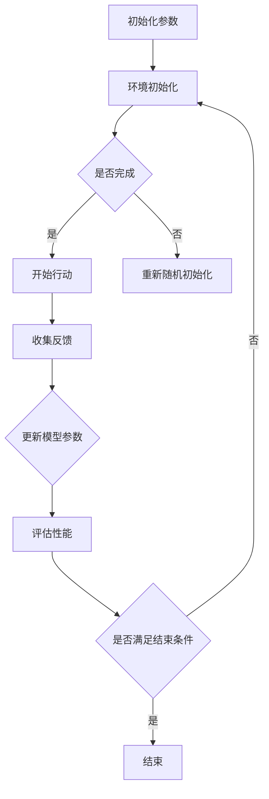

                 

### 《强化学习在机器人操作中的应用：提高灵活性》

强化学习作为一种机器学习的重要分支，近年来在人工智能领域取得了显著的进展。它通过学习环境中的奖励和惩罚来逐步优化决策过程，从而实现自主控制和目标达成。在机器人操作领域，强化学习正逐渐展现出其独特的优势和广阔的应用前景。本文将系统地探讨强化学习在机器人操作中的应用，旨在提高机器人的灵活性和自主性。

本文将分为三个主要部分：

**第一部分：强化学习基础**

在这一部分，我们将介绍强化学习的基本概念、数学基础以及常见的强化学习算法。首先，我们将回顾强化学习的定义和基本术语，接着介绍马尔可夫决策过程（MDP），然后讨论动态规划与价值函数，最后简要比较强化学习与其他学习方法的优缺点。

**第二部分：强化学习算法**

这一部分将深入探讨强化学习算法的具体实现。我们将详细讲解值函数方法和策略搜索方法，包括Q-learning、SARSA、蒙特卡洛方法等。此外，我们将介绍深度强化学习，重点讨论深度Q网络（DQN）、累积优势与回报归一化，以及策略梯度方法。最后，我们将讨论多智能体强化学习，介绍零和博弈与协同博弈，以及多智能体强化学习的算法与应用。

**第三部分：强化学习在机器人操作中的应用**

这一部分将聚焦于强化学习在机器人操作中的实际应用。我们将探讨强化学习在机器人控制、路径规划、对象抓取和机器人协作中的具体应用，并通过案例研究来展示强化学习如何提高机器人的灵活性和自主性。最后，我们将总结强化学习在机器人操作中的实践与应用，并给出未来的研究方向和挑战。

通过本文的深入探讨，读者将能够全面了解强化学习在机器人操作中的应用，并掌握如何使用强化学习算法来提高机器人的灵活性和自主性。

### 关键词

- 强化学习
- 机器人控制
- 路径规划
- 对象抓取
- 深度强化学习
- 多智能体强化学习
- 灵活性
- 机器人协作

### 摘要

本文系统地探讨了强化学习在机器人操作中的应用。首先，我们介绍了强化学习的基本概念和数学基础，包括马尔可夫决策过程（MDP）、动态规划与价值函数、以及常见的强化学习算法。接着，我们深入讲解了值函数方法和策略搜索方法，如Q-learning、SARSA、蒙特卡洛方法等。此外，我们还介绍了深度强化学习、策略梯度方法以及多智能体强化学习。最后，我们通过具体案例研究，展示了强化学习在机器人控制、路径规划、对象抓取和机器人协作中的应用，并讨论了如何通过强化学习提高机器人的灵活性和自主性。本文旨在为读者提供全面而深入的强化学习在机器人操作中的应用指南。

### 《强化学习在机器人操作中的应用：提高灵活性》目录大纲

**第一部分：强化学习基础**

1. **强化学习概述**
    - **1.1 强化学习的概念与历史发展**
    - **1.2 强化学习的基本术语**
    - **1.3 强化学习与其他学习方法的比较**

2. **强化学习的数学基础**
    - **2.1 马尔可夫决策过程（MDP）**
    - **2.2 动态规划与价值函数**
    - **2.3 政策评估与策略迭代**

**第二部分：强化学习算法**

3. **值函数方法**
    - **3.1 Q-learning算法**
    - **3.2 SARSA算法**
    - **3.3 Q-learning与SARSA的伪代码实现**

4. **策略搜索方法**
    - **4.1 蒙特卡洛方法**
    - **4.2 探索策略**
    - **4.3 具有随机起始点的策略迭代算法**

5. **深度强化学习**
    - **5.1 神经网络与深度强化学习**
    - **5.2 深度Q网络（DQN）**
    - **5.3 累计优势与回报归一化**

6. **策略梯度方法**
    - **6.1 Policy Gradient方法**
    - **6.2 REINFORCE算法**
    - **6.3 具有优势估计的Policy Gradient方法**

7. **多智能体强化学习**
    - **7.1 多智能体强化学习简介**
    - **7.2 零和博弈与协同博弈**
    - **7.3 多智能体强化学习的算法与应用**

**第三部分：强化学习在机器人操作中的应用**

8. **机器人控制中的强化学习**
    - **8.1 强化学习在机器人控制中的挑战**
    - **8.2 强化学习在轨迹优化中的应用**
    - **8.3 机器人控制中的深度强化学习方法**

9. **强化学习在路径规划中的应用**
    - **9.1 强化学习在路径规划中的基本方法**
    - **9.2 环境建模与状态空间设计**
    - **9.3 案例研究：基于强化学习的机器人路径规划**

10. **强化学习在对象抓取中的应用**
    - **10.1 强化学习在对象抓取中的挑战**
    - **10.2 状态空间与动作空间的设计**
    - **10.3 强化学习算法在对象抓取中的应用**

11. **强化学习在机器人协作中的应用**
    - **11.1 机器人协作的挑战与机遇**
    - **11.2 多智能体强化学习的协作方法**
    - **11.3 案例研究：基于强化学习的机器人协作系统**

12. **强化学习在机器人操作中的实践与应用**
    - **12.1 实践项目的准备**
    - **12.2 开发环境搭建与配置**
    - **12.3 实际应用案例分析与代码解读**

**附录**

- **附录A：强化学习相关资源与工具**
    - **A.1 强化学习开源框架**
    - **A.2 强化学习相关论文与书籍**
    - **A.3 强化学习在线课程与社区**

### 强化学习算法流程图

在探讨强化学习算法之前，首先需要理解其基本流程。以下是强化学习算法的Mermaid流程图示例：



在这个流程图中，A表示初始化参数，包括模型参数和探索策略等。B表示环境初始化，即创建一个环境实例。C用于判断初始化是否完成，如果完成则继续执行下一步，否则重新随机初始化。D表示开始行动，模型根据当前状态选择一个动作。F表示收集反馈，包括下一个状态和奖励。G用于更新模型参数，通过学习机制（如梯度下降）调整参数。H用于评估性能，判断是否满足结束条件。I用于判断是否满足结束条件，如果满足则结束，否则继续循环。

通过这个流程图，我们可以清晰地看到强化学习算法的基本框架和执行流程。接下来，我们将详细介绍强化学习的基础知识，包括其基本概念、数学基础和常见算法。

### 强化学习概述

强化学习（Reinforcement Learning, RL）是机器学习的一个重要分支，它主要研究如何通过试错（trial-and-error）的方法，在给定环境中进行决策，以实现长期目标。强化学习起源于动物学习理论，其核心思想是通过奖励和惩罚来塑造行为，从而实现智能体的自主学习和优化。

#### 定义与历史发展

强化学习可以定义为一种交互式的学习过程，其中智能体（agent）在环境中采取行动，通过观察环境的反馈（奖励或惩罚）来调整其行为策略，以最大化累积奖励。以下是强化学习的一些基本术语：

- **智能体（Agent）**：执行动作并从环境中接收反馈的实体。
- **环境（Environment）**：智能体进行交互的动态环境。
- **状态（State）**：智能体在某一时刻所处的环境描述。
- **动作（Action）**：智能体可以采取的行为。
- **奖励（Reward）**：环境对智能体动作的即时反馈，可以是正奖励（鼓励行为）或负奖励（惩罚行为）。
- **策略（Policy）**：智能体在给定状态下选择动作的规则。

强化学习的历史可以追溯到20世纪50年代，由Richard Sutton和Andrew Barto的经典教材《 reinforcement learning: An Introduction》奠定了现代强化学习的基础。近年来，随着深度学习技术的发展，深度强化学习（Deep Reinforcement Learning, DRL）成为研究热点，实现了在复杂环境中的智能行为。

#### 强化学习与其他学习方法的比较

强化学习与其他机器学习方法（如监督学习和无监督学习）有以下几点区别：

- **监督学习**：监督学习依赖于预先标记的数据集，通过学习输入和输出之间的关系来预测新数据。强化学习则通过与环境交互，自主学习最优策略。
- **无监督学习**：无监督学习从未标记的数据中学习，发现数据中的模式和结构。强化学习需要与环境交互来获取奖励信号，从而指导学习过程。
- **强化学习**：强化学习通过试错学习最优策略，在动态环境中实现自主控制。其目标是最小化长期期望损失（累积奖励），而不是像监督学习那样最小化预测误差。

强化学习的优点包括：

- **自适应性强**：强化学习能够根据环境的动态变化调整策略，适应新的情况。
- **灵活性高**：强化学习不仅适用于静态环境，也能在动态和不确定性环境中表现良好。
- **泛化能力强**：通过积累经验，强化学习能够泛化到未见过的环境。

然而，强化学习也存在一些挑战，如：

- **样本效率低**：强化学习需要大量交互来积累经验，训练时间较长。
- **奖励工程**：设计合适的奖励函数对于强化学习至关重要，但奖励设计复杂且难以确定最优。
- **探索与利用的平衡**：在强化学习中，需要平衡探索新的行动和利用已知的最优行动。

总之，强化学习作为一种重要的机器学习方法，在解决动态和复杂决策问题方面具有独特优势，但其面临的挑战也需要进一步研究和解决。

#### 强化学习的基本术语

在深入探讨强化学习之前，我们需要了解一些基本术语，这些术语是理解强化学习概念和算法的关键。

1. **智能体（Agent）**：智能体是执行动作并从环境中接收反馈的实体。在强化学习中，智能体是一个具有自主决策能力的系统，其目标是最大化累积奖励。

2. **环境（Environment）**：环境是智能体进行交互的动态环境。环境定义了智能体的状态空间和动作空间，并提供对智能体动作的即时反馈。环境可以是物理环境，如机器人操作环境，也可以是虚拟环境，如计算机模拟。

3. **状态（State）**：状态是智能体在某一时刻所处的环境描述。状态通常是一个多维向量，包含智能体当前所处的位置、方向、速度等信息。状态是智能体决策的基础，通过状态，智能体可以了解当前的环境情况。

4. **动作（Action）**：动作是智能体可以采取的行为。动作通常也是一个多维向量，表示智能体可以执行的具体操作，如移动、旋转、抓取等。动作的选择取决于智能体的策略。

5. **奖励（Reward）**：奖励是环境对智能体动作的即时反馈，可以是正奖励（鼓励行为）或负奖励（惩罚行为）。奖励用于指导智能体学习最优策略，其目的是最大化累积奖励。奖励的设定对强化学习的效果至关重要。

6. **策略（Policy）**：策略是智能体在给定状态下选择动作的规则。策略可以是确定性策略，即在任何状态下都选择相同的动作；也可以是非确定性策略，即根据概率分布选择动作。策略的目的是最大化累积奖励。

7. **价值函数（Value Function）**：价值函数是衡量智能体在给定状态下执行给定策略所能获得的期望累积奖励。价值函数分为状态价值函数（V(s)）和动作价值函数（Q(s, a)）。状态价值函数表示在给定状态下，执行最优策略所能获得的累积奖励；动作价值函数表示在给定状态下，执行特定动作所能获得的累积奖励。

8. **策略评估（Policy Evaluation）**：策略评估是计算当前策略下的价值函数。通过策略评估，智能体可以了解当前策略的优劣，从而调整策略。

9. **策略迭代（Policy Iteration）**：策略迭代是一种强化学习算法，通过交替进行策略评估和策略改进来找到最优策略。策略评估用于计算当前策略下的价值函数，策略改进则根据价值函数调整策略。

10. **探索（Exploration）与利用（Exploitation）**：在强化学习中，探索是指智能体尝试新的动作以获取更多经验；利用是指智能体利用已有的经验选择最优动作。探索与利用的平衡是强化学习的关键挑战。

通过理解这些基本术语，我们可以更好地理解强化学习的工作原理和实现方法。

### 强化学习与其他学习方法的比较

强化学习作为一种独特的机器学习方法，在解决复杂和动态决策问题时具有显著优势。为了更好地理解其独特性，我们需要将其与监督学习和无监督学习进行比较。

#### 与监督学习的比较

监督学习是一种通过学习输入和输出之间的关系来预测新数据的机器学习方法。其主要特点包括：

- **数据依赖**：监督学习依赖于大量标记的数据集。这些数据集包含了输入特征和对应的标签，用于训练模型。
- **预定义目标**：监督学习中的目标是明确和预定义的，通常是通过最小化预测误差来实现的。
- **快速反馈**：由于目标明确，监督学习可以快速地获得反馈，并通过梯度下降等方法调整模型参数。

相比之下，强化学习的主要特点如下：

- **自主学习**：强化学习通过与环境交互自主学习最优策略，不需要预先标记的数据集。
- **动态目标**：强化学习的目标不是固定的，而是随着与环境的交互逐步优化的。智能体需要通过累积奖励来最大化长期目标。
- **缓慢反馈**：强化学习的反馈是通过奖励信号逐步获得的，可能需要大量交互才能达到预期的性能。

#### 与无监督学习的比较

无监督学习是通过学习数据中的模式和结构来发现知识的一种学习方法。其主要特点包括：

- **无标签数据**：无监督学习仅依赖无标签的数据集，不需要预先标记的输入和输出。
- **探索模式**：无监督学习的目标是发现数据中的潜在结构和规律，如聚类、降维等。
- **自我优化**：无监督学习通过内部竞争和优化机制来发现数据中的特征和模式。

强化学习与无监督学习的主要区别在于：

- **奖励机制**：强化学习通过奖励信号来指导学习过程，而无监督学习则没有外部奖励信号，主要依赖内部竞争机制。
- **环境交互**：强化学习需要与环境进行交互，以获取奖励信号并调整策略；无监督学习则不需要与环境交互，直接从数据中学习。
- **长期目标**：强化学习的目标是最大化长期累积奖励，而无监督学习的目标通常是发现数据中的内在结构或模式。

#### 强化学习的优势

尽管强化学习在许多方面与监督学习和无监督学习有所不同，但它仍具有以下优势：

- **适应性强**：强化学习能够适应动态和复杂的环境，智能体可以通过与环境的交互不断调整策略。
- **灵活性高**：强化学习不仅适用于静态环境，也能在动态和不确定性环境中表现出色。
- **泛化能力强**：通过积累经验，强化学习能够泛化到未见过的环境，提高智能体的泛化能力。

#### 强化学习的挑战

虽然强化学习具有显著的优势，但也面临着一些挑战：

- **样本效率低**：强化学习需要大量交互来积累经验，训练时间较长，样本效率相对较低。
- **奖励工程**：设计合适的奖励函数对于强化学习至关重要，但奖励设计复杂且难以确定最优。
- **探索与利用的平衡**：在强化学习中，需要平衡探索新的行动和利用已知的最优行动。

通过比较强化学习与其他学习方法，我们可以更好地理解其独特性和适用场景。在接下来的章节中，我们将详细探讨强化学习的数学基础和算法实现。

### 强化学习的数学基础

在深入探讨强化学习算法之前，我们需要了解其数学基础，尤其是马尔可夫决策过程（MDP）。MDP是强化学习模型的核心，它定义了智能体在环境中的行为和决策过程。

#### 马尔可夫决策过程（MDP）

MDP是一个数学模型，用于描述智能体在动态环境中做出决策的过程。它由以下几个组成部分：

1. **状态空间（State Space）**：状态空间是一个集合\( S = \{s_1, s_2, ..., s_n\} \)，其中每个状态\( s_i \)是智能体在某一时刻所处的环境描述。状态可以是离散的，如机器人的位置和方向，也可以是连续的，如无人驾驶车辆的速度和加速度。

2. **动作空间（Action Space）**：动作空间是一个集合\( A = \{a_1, a_2, ..., a_m\} \)，其中每个动作\( a_j \)是智能体可以采取的行为。动作可以是离散的，如向左转、向右转，也可以是连续的，如加速、减速。

3. **状态转移概率（State Transition Probability）**：对于每个状态\( s_i \)和动作\( a_j \)，状态转移概率\( P(s'|s, a) \)表示智能体从状态\( s_i \)采取动作\( a_j \)后转移到状态\( s' \)的概率。状态转移概率通常是一个矩阵，表示为\( P \)：

   \[
   P = \begin{bmatrix}
   P(s_1'|s_1, a_1) & P(s_1'|s_1, a_2) & ... & P(s_1'|s_1, a_m) \\
   P(s_2'|s_1, a_1) & P(s_2'|s_1, a_2) & ... & P(s_2'|s_1, a_m) \\
   ... & ... & ... & ... \\
   P(s_n'|s_1, a_1) & P(s_n'|s_1, a_2) & ... & P(s_n'|s_1, a_m)
   \end{bmatrix}
   \]

4. **奖励函数（Reward Function）**：奖励函数\( R(s, a) \)是环境对智能体采取动作的即时反馈。奖励可以是正的（鼓励行为）或负的（惩罚行为），用于指导智能体学习最优策略。奖励函数通常是一个向量，表示为\( r \)：

   \[
   r = \begin{bmatrix}
   R(s_1, a_1) \\
   R(s_2, a_1) \\
   ... \\
   R(s_n, a_1) \\
   R(s_1, a_2) \\
   R(s_2, a_2) \\
   ... \\
   R(s_n, a_2) \\
   ... \\
   R(s_1, a_m) \\
   R(s_2, a_m) \\
   ... \\
   R(s_n, a_m)
   \end{bmatrix}
   \]

5. **折扣因子（Discount Factor）**：折扣因子\( \gamma \)是用于调整未来奖励的重要性。它的取值范围在0到1之间，表示为\( 0 \leq \gamma \leq 1 \)。当\( \gamma = 1 \)时，所有未来的奖励都具有相同的权重；当\( \gamma = 0 \)时，只有当前奖励是重要的。

#### 动态规划与价值函数

动态规划是一种用于解决MDP优化问题的重要方法，它通过递归方式计算最优策略。价值函数是动态规划的核心，用于衡量智能体在给定状态和策略下的长期收益。

1. **状态价值函数（State Value Function）**：状态价值函数\( V^*(s) \)是衡量智能体在状态\( s \)下执行最优策略所能获得的期望累积奖励。它定义为：

   \[
   V^*(s) = \sum_{a} \pi^*(s, a) Q^*(s, a)
   \]

   其中，\( \pi^*(s, a) \)是最优策略，\( Q^*(s, a) \)是最优动作价值函数。

2. **最优动作价值函数（Optimal Action Value Function）**：最优动作价值函数\( Q^*(s, a) \)是衡量智能体在状态\( s \)下执行特定动作\( a \)所能获得的期望累积奖励。它定义为：

   \[
   Q^*(s, a) = \sum_{s'} P(s'|s, a) [R(s, a) + \gamma V^*(s')]
   \]

   其中，\( P(s'|s, a) \)是状态转移概率，\( R(s, a) \)是奖励函数，\( V^*(s') \)是下一个状态的价值函数。

通过动态规划，我们可以递归地计算状态价值函数和最优动作价值函数。具体步骤如下：

1. **初始化**：初始化所有状态的价值函数为0。

2. **迭代更新**：对于每个状态\( s \)和每个动作\( a \)，计算当前状态价值函数：

   \[
   V(s) = \sum_{a} \pi(s, a) Q(s, a)
   \]

   其中，\( \pi(s, a) \)是当前策略。

3. **更新策略**：根据当前状态价值函数更新策略，选择使价值函数最大的动作。

4. **重复步骤2和3**，直到状态价值函数收敛。

通过上述步骤，我们可以逐步优化智能体的策略，使其在给定状态和动作下获得最大的期望累积奖励。

#### 政策评估与策略迭代

政策评估和政策迭代是动态规划中的两个重要概念，用于计算和优化策略。

1. **政策评估（Policy Evaluation）**：政策评估是通过递归计算来评估当前策略下的价值函数。具体步骤如下：

   - 初始化价值函数为0。
   - 对于每个状态\( s \)，计算当前状态价值函数：
   
     \[
     V(s) = \sum_{a} \pi(s, a) Q(s, a)
     \]

   - 重复上述步骤，直到价值函数收敛。

2. **政策迭代（Policy Iteration）**：政策迭代是通过交替进行政策评估和政策改进来找到最优策略。具体步骤如下：

   - **评估阶段**：使用当前策略评估价值函数。
   - **改进阶段**：根据当前价值函数更新策略，选择使价值函数最大的动作。
   - **重复评估和改进阶段**，直到策略收敛。

通过政策评估与策略迭代，我们可以逐步优化智能体的策略，使其在给定状态和动作下获得最大的期望累积奖励。

#### 总结

通过介绍马尔可夫决策过程（MDP）、动态规划与价值函数、以及政策评估与策略迭代，我们可以看到强化学习的数学基础是如何为智能体在动态环境中做出最优决策提供支持的。在接下来的章节中，我们将进一步探讨强化学习的算法实现，包括值函数方法和策略搜索方法。

### 值函数方法

值函数方法是强化学习中最基础和常用的方法之一，它通过学习状态价值函数或动作价值函数来指导智能体的行为。值函数方法的核心思想是利用历史经验来估计状态和动作的预期回报，进而优化智能体的策略。以下是值函数方法中的两个主要算法：Q-learning和SARSA。

#### Q-learning算法

Q-learning是一种基于值函数的强化学习算法，它通过迭代更新Q值（动作价值函数）来学习最优策略。Q-learning的基本步骤如下：

1. **初始化Q值**：随机初始化Q值矩阵，通常初始化为0。

2. **选择动作**：在给定状态下，根据当前策略选择动作。Q-learning通常使用**epsilon-greedy策略**进行动作选择，即以概率\( \epsilon \)随机选择动作，以\( 1-\epsilon \)的概率选择当前Q值最大的动作。

   \[
   \text{action} = \begin{cases}
   \text{random()} & \text{with probability } \epsilon \\
   \arg\max_a Q(s, a) & \text{with probability } 1-\epsilon
   \end{cases}
   \]

3. **执行动作**：执行选定的动作，并获得下一个状态和奖励。

4. **更新Q值**：使用下面的公式更新Q值：

   \[
   Q(s, a) \leftarrow Q(s, a) + \alpha [r + \gamma \max_{a'} Q(s', a') - Q(s, a)]
   \]

   其中，\( r \)是即时奖励，\( \gamma \)是折扣因子，\( \alpha \)是学习率。这个更新公式被称为**Bellman方程**。

5. **重复步骤2-4**，直到达到终止条件（如达到最大步数或累积奖励达到某个阈值）。

Q-learning算法的一个关键优点是它不需要明确的策略，而是直接学习Q值，这使得它适用于多种不同类型的环境。

#### SARSA算法

SARSA（State-Action-Reward-State-Action）是一种基于值函数的强化学习算法，它与Q-learning类似，但有一个显著的区别：SARSA使用实际观察到的下一个动作来更新Q值，而不是预测的最优动作。SARSA的基本步骤如下：

1. **初始化Q值**：随机初始化Q值矩阵，通常初始化为0。

2. **选择动作**：在给定状态下，根据当前策略选择动作。同样使用epsilon-greedy策略。

3. **执行动作**：执行选定的动作，并获得下一个状态和奖励。

4. **更新Q值**：使用下面的公式更新Q值：

   \[
   Q(s, a) \leftarrow Q(s, a) + \alpha [r + \gamma Q(s', a') - Q(s, a)]
   \]

   其中，\( r \)是即时奖励，\( \gamma \)是折扣因子，\( \alpha \)是学习率。这个更新公式也基于Bellman方程。

5. **重复步骤2-4**，直到达到终止条件。

SARSA的一个优点是它不需要预测下一个最优动作，这使得它对于不确定的环境更为鲁棒。

#### Q-learning与SARSA的伪代码实现

以下是Q-learning和SARSA算法的伪代码实现示例：

**Q-learning算法伪代码**：

```python
Initialize Q(s, a) to 0
Initialize ε and α
while not termination_condition:
    s <- environment.reset()
    while not environment.is_done(s):
        a <- epsilon_greedy_policy(s, Q(s, *))
        s', r <- environment.step(s, a)
        Q(s, a) <- Q(s, a) + α * (r + γ * max(Q(s', a')) - Q(s, a))
        s <- s'
```

**SARSA算法伪代码**：

```python
Initialize Q(s, a) to 0
Initialize ε and α
while not termination_condition:
    s <- environment.reset()
    while not environment.is_done(s):
        a <- epsilon_greedy_policy(s, Q(s, *))
        s', r <- environment.step(s, a)
        a' <- epsilon_greedy_policy(s', Q(s', *))
        Q(s, a) <- Q(s, a) + α * (r + γ * Q(s', a') - Q(s, a))
        s <- s'
```

在上述伪代码中，`environment.reset()`表示重置环境，`epsilon_greedy_policy(s, Q(s, *))`表示使用epsilon-greedy策略选择动作，`environment.step(s, a)`表示执行动作并获取下一个状态和奖励，`termination_condition`表示终止条件（如达到最大步数或累积奖励达到阈值）。

通过Q-learning和SARSA算法，我们可以有效地学习状态和动作的价值函数，进而优化智能体的策略，使其在复杂动态的环境中实现自主控制和目标达成。

### 策略搜索方法

策略搜索方法是一类旨在通过直接优化策略来学习最优行为的强化学习算法。与值函数方法通过学习状态或动作的价值来间接优化策略不同，策略搜索方法直接优化策略本身，以最大化累积奖励。策略搜索方法包括蒙特卡洛方法、策略迭代和具有随机起始点的策略迭代等。以下是这些方法的详细介绍。

#### 蒙特卡洛方法

蒙特卡洛方法是一种基于随机抽样的策略搜索方法，它通过在环境中执行一系列随机样本来估计策略的价值。蒙特卡洛方法的核心思想是通过多次迭代，累积经验来优化策略。以下是蒙特卡洛方法的基本步骤：

1. **初始化**：初始化策略π和奖励统计信息。

2. **模拟轨迹**：在当前策略π下，从初始状态开始，执行一系列随机动作，生成一个完整的轨迹，记录每个步骤的奖励。

3. **更新策略**：根据模拟的轨迹更新策略。具体来说，可以计算策略的回报，并基于回报来调整策略。

蒙特卡洛方法的一个关键优点是它不需要关于环境的具体模型，这使得它适用于高度动态和不确定性的环境。然而，蒙特卡洛方法的一个主要缺点是它需要大量的样本数据来获得稳定的估计，因此训练时间较长。

#### 探索策略

探索策略（Exploration Strategy）是强化学习中的一个重要概念，它用于平衡探索（尝试新的动作）和利用（执行已知的最佳动作）。常见的探索策略包括ε-贪婪策略、均匀随机策略和探索概率递减策略。

- **ε-贪婪策略**：在给定状态下，以概率\( \epsilon \)随机选择动作，以\( 1-\epsilon \)的概率选择当前Q值最大的动作。这种方法在早期阶段更多地探索，随着经验的积累，更多地利用已知的最优动作。

- **均匀随机策略**：在给定状态下，随机选择动作，不依赖于当前Q值。

- **探索概率递减策略**：随着经验的积累，逐渐减少探索的概率，更多地依赖已知的最优动作。

#### 具有随机起始点的策略迭代算法

策略迭代算法是一种通过迭代更新策略来找到最优策略的方法。具有随机起始点的策略迭代算法在每次迭代中随机选择起始点，并在该起始点上执行策略评估和策略改进。以下是具有随机起始点的策略迭代算法的基本步骤：

1. **随机选择起始状态**：从状态空间中随机选择一个状态作为起始状态。

2. **策略评估**：在给定策略π下，使用当前价值函数估计状态价值函数。这通常通过递归计算实现。

3. **策略改进**：根据当前价值函数更新策略。可以选择使价值函数最大化的动作作为新策略。

4. **重复步骤2和3**，直到策略收敛。

具有随机起始点的策略迭代算法的优点是它能够在每次迭代中随机探索不同的状态，从而提高策略搜索的鲁棒性和效率。

#### 总结

策略搜索方法通过直接优化策略来学习最优行为，提供了与值函数方法不同的优化路径。蒙特卡洛方法通过随机抽样来估计策略价值，适用于动态和不确定性环境，但训练时间较长。探索策略用于平衡探索和利用，确保策略能够适应变化。具有随机起始点的策略迭代算法通过随机探索不同的起始点来优化策略，提高了搜索效率。在接下来的章节中，我们将进一步探讨深度强化学习和策略梯度方法，为解决复杂和高度动态的机器人操作问题提供更有效的解决方案。

### 深度强化学习

深度强化学习（Deep Reinforcement Learning, DRL）是强化学习与深度学习相结合的产物，它通过引入深度神经网络来处理复杂的状态空间和动作空间。深度强化学习在解决机器人操作、自动驾驶、游戏智能等领域取得了显著成果。以下是深度强化学习的核心概念及其具体实现方法。

#### 神经网络与深度强化学习

深度强化学习中的神经网络主要用于表示状态和动作的价值函数或策略函数。常见的神经网络结构包括卷积神经网络（CNN）、循环神经网络（RNN）和变换器（Transformer）。这些神经网络可以有效地捕捉状态和动作之间的复杂非线性关系。

1. **卷积神经网络（CNN）**：CNN常用于处理图像数据，通过卷积层、池化层和全连接层提取图像特征，从而实现图像识别、目标检测等任务。

2. **循环神经网络（RNN）**：RNN适用于处理序列数据，如时间序列分析、自然语言处理等。RNN可以通过隐藏状态捕捉序列中的长期依赖关系。

3. **变换器（Transformer）**：Transformer是一种基于自注意力机制的神经网络结构，广泛应用于自然语言处理和计算机视觉领域。它通过自注意力机制捕获序列中的全局依赖关系，提高了模型的表达能力。

#### 深度Q网络（DQN）

深度Q网络（Deep Q-Network, DQN）是最早的深度强化学习算法之一，它通过深度神经网络来估计动作价值函数。DQN的核心思想是将状态作为输入，通过深度神经网络输出动作价值函数的估计值，然后根据动作价值函数选择动作。

1. **DQN算法的基本步骤**：

   - **初始化**：初始化深度神经网络Q（参数为θ）和一个经验回放记忆池。
   - **选择动作**：使用epsilon-greedy策略选择动作，以概率\( \epsilon \)随机选择动作，以\( 1-\epsilon \)的概率选择当前Q值最大的动作。
   - **执行动作**：执行选定的动作，并获得下一个状态和奖励。
   - **存储经验**：将当前状态、动作、奖励、下一个状态和是否结束的信息存储在经验回放记忆池中。
   - **更新Q值**：从经验回放记忆池中随机抽样，使用下面的公式更新Q值：

     \[
     Q(s, a) \leftarrow Q(s, a) + \alpha [r + \gamma \max_{a'} Q(s', a') - Q(s, a)]
     \]

     其中，\( r \)是即时奖励，\( \gamma \)是折扣因子，\( \alpha \)是学习率。

   - **重复步骤2-5**，直到达到终止条件。

2. **DQN算法的优势**：

   - **处理高维状态空间**：DQN通过深度神经网络可以处理高维的状态空间，从而适应复杂的动态环境。
   - **缓解梯度消失问题**：通过经验回放记忆池缓解了梯度消失问题，提高了训练的稳定性。

#### 累计优势与回报归一化

在深度强化学习中，累计优势（Cumulative Advantage）和回报归一化（Reward Normalization）是两个重要的概念。

1. **累计优势**：累计优势表示某个动作相对于其他动作的累积优势，它有助于识别具有较高回报的动作。累计优势可以通过以下公式计算：

   \[
   A(s, a) = \sum_{t=0}^T \gamma^t [R_t + \gamma \lambda (s', a')]
   \]

   其中，\( T \)是时间步数，\( R_t \)是第\( t \)步的即时奖励，\( s' \)是下一个状态，\( a' \)是下一个动作，\( \gamma \)是折扣因子，\( \lambda \)是优势函数的权重。

2. **回报归一化**：回报归一化用于消除不同任务之间的奖励差异，使模型能够更好地学习。回报归一化可以通过以下公式实现：

   \[
   R_t' = \frac{R_t - \mu}{\sigma}
   \]

   其中，\( \mu \)是所有奖励的平均值，\( \sigma \)是奖励的标准差。

通过引入累计优势和回报归一化，可以进一步提高深度强化学习算法在复杂环境中的性能。

#### 策略梯度方法

策略梯度方法是一类直接优化策略的深度强化学习算法，它通过估计策略的梯度来更新策略参数。策略梯度方法包括REINFORCE算法、带有优势估计的Policy Gradient方法等。

1. **REINFORCE算法**：

   - **基本思想**：REINFORCE算法通过估计策略的梯度来更新策略参数，其更新公式为：

     \[
     \theta \leftarrow \theta + \alpha \frac{\partial L(\theta)}{\partial \theta}
     \]

     其中，\( L(\theta) \)是策略的损失函数，通常表示为：

     \[
     L(\theta) = \sum_{t=0}^T \log \pi(\theta)(s_t, a_t)
     \]

   - **优势估计**：为了提高算法的性能，可以使用优势估计来改进REINFORCE算法。优势估计通过估计每个动作的累积优势来改进策略梯度：

     \[
     \theta \leftarrow \theta + \alpha \frac{\partial L(\theta)}{\partial \theta} A(s, a)
     \]

2. **带有优势估计的Policy Gradient方法**：

   - **基本思想**：带有优势估计的Policy Gradient方法通过估计策略的梯度并加上优势估计来更新策略参数，其更新公式为：

     \[
     \theta \leftarrow \theta + \alpha \sum_{t=0}^T \frac{\partial \log \pi(\theta)(s_t, a_t)}{\partial \theta} A(s, a)
     \]

通过策略梯度方法，可以直接优化策略，从而实现高效的智能体控制。

#### 深度强化学习在机器人操作中的应用

深度强化学习在机器人操作中具有广泛的应用，包括路径规划、对象抓取和机器人协作等。

1. **路径规划**：深度强化学习可以用于解决机器人路径规划问题，通过训练深度Q网络或策略梯度模型，机器人可以自主规划从起点到终点的最优路径。

2. **对象抓取**：深度强化学习可以用于训练机器人学习对象抓取技能，通过模拟和实际操作，机器人可以学会如何抓取各种不同形状和大小的对象。

3. **机器人协作**：深度强化学习可以用于训练多个机器人之间的协作策略，通过共同完成任务，机器人可以学会如何协同工作，提高整体效率。

总之，深度强化学习为解决复杂和动态的机器人操作问题提供了一种有效的解决方案，其应用前景十分广阔。

### 策略梯度方法

策略梯度方法是强化学习中的一类直接优化策略的方法，它通过估计策略的梯度来更新策略参数，从而优化策略。策略梯度方法包括REINFORCE算法、带有优势估计的Policy Gradient方法等。以下是这些方法的详细讲解。

#### REINFORCE算法

REINFORCE算法是一种基于策略梯度的简单强化学习算法，它通过估计策略的梯度来更新策略参数。REINFORCE算法的基本思想是：

1. **选择动作**：在给定状态下，智能体根据当前策略π选择一个动作。

2. **执行动作**：执行选定的动作，并获得下一个状态和奖励。

3. **更新策略**：使用奖励信号来更新策略参数。具体来说，策略梯度的估计如下：

   \[
   \nabla_{\theta} J(\theta) = \sum_{t=0}^{T} \nabla_{\theta} \log \pi(\theta)(s_t, a_t) R_t
   \]

   其中，\( J(\theta) \)是策略的损失函数，\( \log \pi(\theta)(s_t, a_t) \)是对数策略概率，\( R_t \)是第\( t \)步的即时奖励。

4. **梯度上升**：根据策略梯度的估计，使用梯度上升法更新策略参数：

   \[
   \theta \leftarrow \theta + \alpha \nabla_{\theta} J(\theta)
   \]

   其中，\( \alpha \)是学习率。

REINFORCE算法的优点是简单易实现，但它的主要缺点是方差较大，可能导致训练不稳定。

#### 带有优势估计的Policy Gradient方法

带有优势估计的Policy Gradient方法是一种改进的策略梯度方法，它通过引入优势函数（Advantage Function）来降低方差，提高训练稳定性。优势函数定义如下：

\[
A(s_t, a_t) = R_t + \gamma V(s_{t+1}) - V(s_t)
\]

其中，\( R_t \)是第\( t \)步的即时奖励，\( \gamma \)是折扣因子，\( V(s_{t+1}) \)是下一个状态的价值函数。

带有优势估计的Policy Gradient方法的基本步骤如下：

1. **选择动作**：在给定状态下，智能体根据当前策略π选择一个动作。

2. **执行动作**：执行选定的动作，并获得下一个状态和奖励。

3. **更新策略**：使用优势估计来更新策略参数。具体来说，策略梯度的估计如下：

   \[
   \nabla_{\theta} J(\theta) = \sum_{t=0}^{T} \nabla_{\theta} \log \pi(\theta)(s_t, a_t) A(s_t, a_t)
   \]

4. **梯度上升**：根据策略梯度的估计，使用梯度上升法更新策略参数：

   \[
   \theta \leftarrow \theta + \alpha \nabla_{\theta} J(\theta)
   \]

带有优势估计的Policy Gradient方法通过引入优势函数，减少了策略梯度的方差，从而提高了训练的稳定性。

#### 数学公式

以下是策略梯度方法的数学公式：

- **策略概率**：

  \[
  \pi(\theta)(s_t, a_t) = \frac{exp(\theta^T \phi(s_t, a_t))}{\sum_{a'} exp(\theta^T \phi(s_t, a'))
  \]

  其中，\( \theta \)是策略参数，\( \phi(s_t, a_t) \)是特征向量。

- **损失函数**：

  \[
  J(\theta) = -\sum_{t=0}^{T} \log \pi(\theta)(s_t, a_t)
  \]

- **策略梯度**：

  \[
  \nabla_{\theta} J(\theta) = \sum_{t=0}^{T} \nabla_{\theta} \log \pi(\theta)(s_t, a_t) R_t
  \]

- **优势函数**：

  \[
  A(s_t, a_t) = R_t + \gamma V(s_{t+1}) - V(s_t)
  \]

通过上述公式，我们可以清晰地看到策略梯度方法的数学基础和实现步骤。

#### 策略梯度方法在机器人操作中的应用

策略梯度方法在机器人操作中具有广泛的应用，以下是其主要应用领域：

1. **机器人控制**：策略梯度方法可以用于训练机器人执行各种控制任务，如轨迹跟踪、动态平衡等。通过学习最优控制策略，机器人可以自主适应复杂的环境变化。

2. **路径规划**：策略梯度方法可以用于训练机器人进行自主路径规划，通过学习最优路径选择策略，机器人可以在复杂环境中找到从起点到终点的最优路径。

3. **对象抓取**：策略梯度方法可以用于训练机器人学习对象抓取技能，通过学习最优抓取策略，机器人可以学会如何抓取各种不同形状和大小的对象。

4. **多机器人协作**：策略梯度方法可以用于训练多机器人系统进行协作任务，通过学习最优协作策略，机器人可以共同完成任务，提高整体效率。

总之，策略梯度方法为解决复杂和动态的机器人操作问题提供了一种有效的解决方案，其在实际应用中具有广泛的前景。

### 多智能体强化学习

多智能体强化学习（Multi-Agent Reinforcement Learning, MARL）是一种研究多个智能体在共享环境中协作或竞争的强化学习方法。与单智能体强化学习相比，MARL考虑了智能体之间的交互和合作，具有更复杂的决策过程和更广泛的应用场景。以下是多智能体强化学习的基本概念和算法。

#### 多智能体强化学习简介

在多智能体系统中，智能体可以是机器人、自主车辆、虚拟代理等。这些智能体在同一个环境中进行交互，每个智能体都有自己的状态、动作、奖励和策略。多智能体强化学习的目标是找到一组最优策略，使得所有智能体在长期交互中都能获得最大的累积奖励。

多智能体强化学习的基本概念包括：

- **智能体**：具有自主决策能力的实体，每个智能体都有自己的状态空间和动作空间。
- **环境**：智能体进行交互的共享环境，环境的状态由所有智能体的状态组成。
- **状态**：描述所有智能体当前状态的向量。
- **动作**：智能体可以采取的行为。
- **奖励**：智能体在执行动作后获得的即时奖励，可以是正奖励（鼓励行为）或负奖励（惩罚行为）。
- **策略**：智能体在给定状态下选择动作的规则。

#### 零和博弈与协同博弈

在多智能体强化学习中，智能体之间的交互可以表现为博弈。博弈可以分为零和博弈和协同博弈。

- **零和博弈**：每个智能体的收益完全取决于其他智能体的损失，即一个智能体的收益等于其他所有智能体的损失之和。例如，在围棋游戏中，一方的胜利意味着另一方的失败。
- **协同博弈**：多个智能体共同协作以实现一个共同的收益目标，即智能体之间的收益是相互依赖的。例如，在自动驾驶车队中，所有车辆的协同控制可以优化整个车队的行驶效率。

#### 多智能体强化学习的算法与应用

多智能体强化学习的算法可以分为分布式算法和集中式算法。分布式算法将决策权分配给各个智能体，每个智能体独立地学习自己的策略；集中式算法则将所有智能体的决策集中到一个中央控制器中。

以下是几种常见的多智能体强化学习算法：

1. **分布式Q-learning（Distributed Q-Learning）**：
   分布式Q-learning算法通过分布式方式更新每个智能体的Q值。每个智能体独立学习自己的Q值，并在一定程度上共享信息。

2. **分布式策略梯度方法**：
   分布式策略梯度方法通过分布式方式更新策略参数。每个智能体根据局部经验更新自己的策略参数，并在一定程度上进行参数同步。

3. **马尔可夫决

