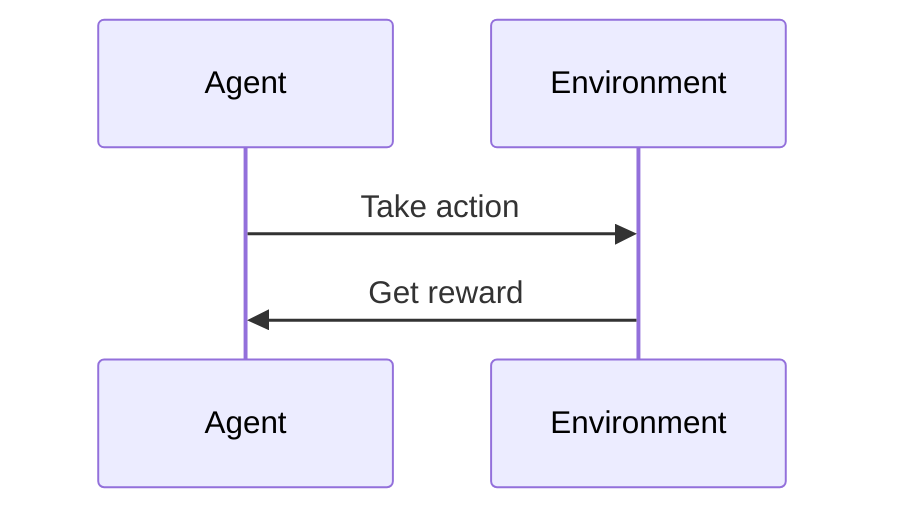

                 

### 第1章：强化学习概述

#### 1.1 强化学习的定义与特点

强化学习是一种机器学习方法，它通过智能体（Agent）与环境（Environment）之间的交互，学习一个策略（Policy），使得智能体能够在特定环境中实现长期目标。强化学习的基本模型包括状态（State）、动作（Action）、奖励（Reward）和策略（Policy）。

Mermaid流程图：


##### 1.1.1 强化学习的定义

强化学习（Reinforcement Learning, RL）是一种使代理在环境中通过试错学习，从而最大化累积奖励的机器学习方法。它不同于监督学习和无监督学习，强化学习依赖于即时反馈（奖励信号）来指导学习过程。

强化学习的定义可以概括为以下几点：

- **智能体**（Agent）：执行动作并感知环境的实体。
- **环境**（Environment）：智能体所处的环境，包括状态空间和动作空间。
- **状态**（State）：描述环境状态的变量集合。
- **动作**（Action）：智能体能够执行的动作。
- **奖励**（Reward）：动作执行后环境给予的即时反馈信号。

##### 1.1.2 强化学习的主要特点

强化学习具有以下几个主要特点：

- **基于反馈的迭代学习**：强化学习通过迭代的方式，根据即时反馈不断调整策略。
- **适应性**：强化学习能够根据环境的变化，调整策略以实现长期目标。
- **不确定性处理**：强化学习能够在不确定的环境中学习，通过探索和利用平衡来最大化长期奖励。

##### 1.1.3 强化学习与其他学习方式的区别

强化学习与监督学习和无监督学习的主要区别如下：

- **反馈机制**：强化学习依赖于即时反馈（奖励信号），监督学习依赖于预定义的标签，无监督学习没有明确的目标。
- **目标**：强化学习关注长期目标，而监督学习关注短期预测，无监督学习关注数据分布。
- **算法模型**：强化学习通常涉及价值函数（如Q值）和策略（Policy）的迭代更新，监督学习涉及模型参数的优化，无监督学习涉及模型参数的估计。

#### 1.2 强化学习的理论基础

##### 1.2.1 强化学习的基本概念

强化学习涉及以下基本概念：

- **策略**（Policy）：描述智能体如何从状态选择动作的映射关系。
- **价值函数**（Value Function）：评估状态或状态-动作对的指标，分为状态值函数（V(s)）和状态-动作值函数（Q(s, a)）。
- **模型**（Model）：对环境状态的转移概率和奖励分布的描述。

##### 1.2.2 强化学习的数学模型

强化学习可以用马尔可夫决策过程（Markov Decision Process, MDP）来描述：

- **状态空间**（S）：智能体可能处于的所有状态集合。
- **动作空间**（A）：智能体能够执行的所有动作集合。
- **策略**（π）：状态-动作概率分布，π(a|s)表示在状态s下执行动作a的概率。
- **价值函数**（V）：状态值函数，V(π, s)表示在策略π下状态s的期望回报。
- **状态-动作值函数**（Q）：Q(π, s, a)表示在策略π下从状态s执行动作a的期望回报。

强化学习的数学模型可以用以下方程表示：

$$
V(s^*) = \sum_{a \in A} \pi(a|s^*) Q(\pi, s^*, a)
$$

$$
Q(s, a) = \sum_{s' \in S} p(s'|s, a) \cdot [r(s', a) + \gamma \cdot \max_{a'} Q(s', a')]
$$

其中，\(p(s'|s, a)\) 是状态转移概率，\(r(s', a)\) 是奖励函数，\(\gamma\) 是折扣因子。

##### 1.2.3 基本算法与流程

强化学习的基本算法流程包括以下几个步骤：

1. **初始化**：初始化策略参数、价值函数参数、环境状态。
2. **迭代**：
   - **状态选择**：根据当前策略选择状态。
   - **动作执行**：执行选择的动作。
   - **反馈**：根据动作的执行结果获得奖励。
   - **策略更新**：根据反馈更新策略。
3. **评估**：评估学习到的策略的有效性。

强化学习算法主要包括值函数方法（如Q-learning）和策略梯度方法（如Policy Gradient），其中值函数方法通过迭代更新Q值，策略梯度方法通过梯度上升更新策略参数。

#### 1.3 强化学习在交易领域的应用

##### 1.3.1 交易系统中的强化学习

强化学习在交易系统中的应用主要是通过学习交易策略，使得交易系统能够自动地适应市场变化，提高交易收益。强化学习在交易系统中的应用主要包括以下几个方面：

- **策略优化**：通过强化学习算法，自动优化交易策略，提高交易策略的有效性。
- **风险控制**：强化学习能够通过学习到最优的交易策略，实现风险控制，确保资金安全。
- **自适应交易**：强化学习能够根据市场变化，自适应调整交易策略，提高交易系统的稳定性。

##### 1.3.2 强化学习在交易策略优化中的应用

强化学习在交易策略优化中的应用主要包括以下几个方面：

- **Q-learning算法**：使用Q-learning算法优化交易策略，通过迭代学习，找到最优的交易策略。
- **Policy Gradient算法**：使用Policy Gradient算法优化交易策略，通过梯度上升更新策略参数，实现交易策略的优化。
- **深度强化学习算法**：使用深度强化学习算法，如Deep Q Network（DQN）和Policy Gradient（PG），通过深度神经网络学习交易策略，提高交易策略的复杂度和适应性。

总之，强化学习在交易系统中的应用，能够通过迭代学习和自适应调整，提高交易策略的有效性和稳定性，从而实现自动交易的目标。

### 第2章：强化学习算法在交易策略中的应用

强化学习算法在交易策略优化中发挥着重要作用。本章将详细介绍几种常见的强化学习算法，包括Q-learning、SARSA、DQN和Policy Gradient，以及它们在交易策略优化中的应用。

#### 2.1 Q-learning算法

##### 2.1.1 Q-learning算法原理

Q-learning算法是一种基于值函数的强化学习算法，通过迭代更新Q值，最终找到最优策略。Q-learning算法的核心思想是通过试错学习，不断调整策略，以达到最大化累积奖励的目的。

Q-learning算法的更新规则可以表示为：

$$
Q(s, a) = Q(s, a) + \alpha [r(s', a') + \gamma \max_{a'} Q(s', a') - Q(s, a)]
$$

其中，\(s\) 是当前状态，\(a\) 是当前动作，\(s'\) 是下一状态，\(a'\) 是下一动作，\(\alpha\) 是学习率，\(\gamma\) 是折扣因子，\(r\) 是奖励。

##### 2.1.2 Q-learning算法伪代码

```python
# 初始化参数
Q = {} # 初始化Q值表
alpha = 0.1 # 学习率
gamma = 0.9 # 折扣因子

# 迭代学习
for episode in range(num_episodes):
    state = env.reset()
    done = False
    
    while not done:
        # 根据当前Q值选择动作
        action = argmax(Q[state])
        
        # 执行动作，获取奖励和下一状态
        next_state, reward, done, _ = env.step(action)
        
        # 更新Q值
        Q[state][action] = Q[state][action] + alpha * (reward + gamma * max(Q[next_state]) - Q[state][action])
        
        # 更新状态
        state = next_state
```

##### 2.1.3 Q-learning算法应用示例

假设有一个简单的交易环境，智能体可以执行买入（Buy）、持有（Hold）和卖出（Sell）三种动作。通过Q-learning算法，智能体可以学习到在不同市场状态下，选择买入、持有或卖出的最佳策略。

伪代码示例：

```python
# 初始化Q值表
Q = {'Buy': 0, 'Hold': 0, 'Sell': 0}

# 迭代学习
for episode in range(num_episodes):
    state = env.reset()
    done = False
    
    while not done:
        # 根据当前Q值选择动作
        action = max(Q, key=Q.get)
        
        # 执行动作，获取奖励和下一状态
        next_state, reward, done, _ = env.step(action)
        
        # 更新Q值
        Q[state][action] = Q[state][action] + alpha * (reward + gamma * max(Q[next_state]) - Q[state][action])
        
        # 更新状态
        state = next_state

# 输出最优策略
print("最优策略：", max(Q, key=Q.get))
```

#### 2.2 SARSA算法

##### 2.2.1 SARSA算法原理

SARSA（同步优势回报样本动作）算法是一种基于策略的强化学习算法，它同时更新状态-动作值函数和策略。SARSA算法的核心思想是通过试错学习，不断调整策略，以达到最大化累积奖励的目的。

SARSA算法的更新规则可以表示为：

$$
Q(s, a) = Q(s, a) + \alpha [r(s', a') + \gamma Q(s', a') - Q(s, a)]
$$

其中，\(s\) 是当前状态，\(a\) 是当前动作，\(s'\) 是下一状态，\(a'\) 是下一动作，\(\alpha\) 是学习率，\(\gamma\) 是折扣因子，\(r\) 是奖励。

##### 2.2.2 SARSA算法伪代码

```python
# 初始化参数
Q = {} # 初始化Q值表
alpha = 0.1 # 学习率
gamma = 0.9 # 折扣因子

# 迭代学习
for episode in range(num_episodes):
    state = env.reset()
    done = False
    
    while not done:
        # 根据当前Q值选择动作
        action = argmax(Q[state])
        
        # 执行动作，获取奖励和下一状态
        next_state, reward, done, _ = env.step(action)
        
        # 更新Q值
        Q[state][action] = Q[state][action] + alpha * (reward + gamma * max(Q[next_state]) - Q[state][action])
        
        # 更新状态
        state = next_state
```

##### 2.2.3 SARSA算法应用示例

与Q-learning算法类似，假设智能体可以执行买入、持有和卖出三种动作，通过SARSA算法，智能体可以学习到在不同市场状态下，选择买入、持有或卖出的最佳策略。

伪代码示例：

```python
# 初始化Q值表
Q = {'Buy': 0, 'Hold': 0, 'Sell': 0}

# 迭代学习
for episode in range(num_episodes):
    state = env.reset()
    done = False
    
    while not done:
        # 根据当前Q值选择动作
        action = max(Q, key=Q.get)
        
        # 执行动作，获取奖励和下一状态
        next_state, reward, done, _ = env.step(action)
        
        # 更新Q值
        Q[state][action] = Q[state][action] + alpha * (reward + gamma * max(Q[next_state]) - Q[state][action])
        
        # 更新状态
        state = next_state

# 输出最优策略
print("最优策略：", max(Q, key=Q.get))
```

#### 2.3 Deep Q Network（DQN）算法

##### 2.3.1 DQN算法原理

DQN（Deep Q Network）算法是一种基于深度学习的Q-learning算法，它使用深度神经网络来近似Q值函数。DQN算法通过经验回放（Experience Replay）和目标网络（Target Network）来提高学习效率和稳定性。

DQN算法的核心思想是通过深度神经网络学习状态-动作值函数，更新规则可以表示为：

$$
Q(s, a) = \frac{1}{N}\sum_{i=1}^{N} r_i + \gamma \max_{a'} Q(s', a')
$$

其中，\(Q(s, a)\) 是当前Q值，\(r_i\) 是即时奖励，\(s'\) 是下一状态，\(a'\) 是下一动作，\(N\) 是回放内存中的样本数，\(\gamma\) 是折扣因子。

##### 2.3.2 DQN算法伪代码

```python
# 初始化参数
DQN = DeepQNetwork()
epsilon = 1.0 # 初始探索率
epsilon_min = 0.01 # 最小探索率
epsilon_decay = 0.99 # 探索率衰减率
replay_memory = deque(maxlen=10000) # 经验回放内存

# 迭代学习
for episode in range(num_episodes):
    state = env.reset()
    done = False
    
    while not done:
        # 根据探索率选择动作
        if random.uniform(0, 1) < epsilon:
            action = env.action_space.sample()
        else:
            action = DQN.predict(state)
        
        # 执行动作，获取奖励和下一状态
        next_state, reward, done, _ = env.step(action)
        
        # 将经验加入经验回放内存
        replay_memory.append((state, action, reward, next_state, done))
        
        # 从经验回放内存中随机抽样
        batch = random.sample(replay_memory, batch_size)
        for state, action, reward, next_state, done in batch:
            target = reward + (1 - done) * gamma * np.max(DQN.predict(next_state))
            DQN.update(state, action, target)
        
        # 更新状态
        state = next_state
        
        # 调整探索率
        if epsilon > epsilon_min:
            epsilon *= epsilon_decay

# 输出最优策略
print("最优策略：", DQN.predict(state))
```

##### 2.3.3 DQN算法应用示例

假设智能体可以执行买入、持有和卖出三种动作，通过DQN算法，智能体可以学习到在不同市场状态下，选择买入、持有或卖出的最佳策略。

伪代码示例：

```python
# 初始化DQN网络
DQN = DeepQNetwork()

# 迭代学习
for episode in range(num_episodes):
    state = env.reset()
    done = False
    
    while not done:
        # 根据探索率选择动作
        if random.uniform(0, 1) < epsilon:
            action = env.action_space.sample()
        else:
            action = DQN.predict(state)
        
        # 执行动作，获取奖励和下一状态
        next_state, reward, done, _ = env.step(action)
        
        # 将经验加入经验回放内存
        replay_memory.append((state, action, reward, next_state, done))
        
        # 从经验回放内存中随机抽样
        batch = random.sample(replay_memory, batch_size)
        for state, action, reward, next_state, done in batch:
            target = reward + (1 - done) * gamma * np.max(DQN.predict(next_state))
            DQN.update(state, action, target)
        
        # 更新状态
        state = next_state
        
        # 调整探索率
        if epsilon > epsilon_min:
            epsilon *= epsilon_decay

# 输出最优策略
print("最优策略：", DQN.predict(state))
```

#### 2.4 Policy Gradient算法

##### 2.4.1 Policy Gradient算法原理

Policy Gradient算法是一种基于策略的强化学习算法，它直接优化策略的概率分布，以最大化累积奖励。Policy Gradient算法的核心思想是通过策略梯度的上升来更新策略参数。

Policy Gradient算法的更新规则可以表示为：

$$
\theta = \theta + \alpha \cdot \nabla_\theta J(\theta)
$$

其中，\(\theta\) 是策略参数，\(\alpha\) 是学习率，\(J(\theta)\) 是策略评估函数。

Policy Gradient算法可以分为离散型和连续型两种，其中离散型Policy Gradient算法主要包括REINFORCE和Monte Carlo Policy Gradient，连续型Policy Gradient算法主要包括Actor-Critic方法。

##### 2.4.2 Policy Gradient算法伪代码

```python
# 初始化参数
policy = Policy()
alpha = 0.001 # 学习率

# 迭代学习
for episode in range(num_episodes):
    state = env.reset()
    done = False
    
    while not done:
        # 执行动作，获取奖励和下一状态
        action = policy.sample_action(state)
        next_state, reward, done, _ = env.step(action)
        
        # 计算策略梯度
        gradient = policy.get_gradient(state, action, reward, next_state, done)
        
        # 更新策略参数
        policy.update(alpha * gradient)
        
        # 更新状态
        state = next_state
```

##### 2.4.3 Policy Gradient算法应用示例

假设智能体可以执行买入、持有和卖出三种动作，通过Policy Gradient算法，智能体可以学习到在不同市场状态下，选择买入、持有或卖出的最佳策略。

伪代码示例：

```python
# 初始化策略
policy = Policy()

# 迭代学习
for episode in range(num_episodes):
    state = env.reset()
    done = False
    
    while not done:
        # 执行动作，获取奖励和下一状态
        action = policy.sample_action(state)
        next_state, reward, done, _ = env.step(action)
        
        # 计算策略梯度
        gradient = policy.get_gradient(state, action, reward, next_state, done)
        
        # 更新策略参数
        policy.update(alpha * gradient)
        
        # 更新状态
        state = next_state

# 输出最优策略
print("最优策略：", policy.get_action(state))
```

### 第3章：强化学习在交易策略优化中的应用

强化学习在交易策略优化中具有重要的应用价值。本章将深入探讨强化学习在交易策略优化中的挑战、方法以及应用案例。

#### 3.1 交易策略优化的挑战

##### 3.1.1 交易策略优化的复杂性

交易策略优化面临以下几个复杂性：

1. **数据复杂性**：交易数据量大，包括历史价格、成交量、开盘价、收盘价等。需要处理海量数据，提取有效特征。
2. **策略复杂性**：交易策略种类繁多，包括技术指标、基本面分析、机器学习模型等。需要设计合理的策略，并在不同市场环境下进行验证。
3. **计算复杂性**：强化学习算法的计算量较大，涉及大量的迭代计算和参数优化。需要高效的处理能力和优化算法。

##### 3.1.2 交易策略优化的难点

交易策略优化主要面临以下难点：

1. **市场波动性**：市场波动性较大，需要策略能够适应市场变化。
2. **交易噪声**：市场数据存在噪声，需要策略能够过滤噪声，提取有效信号。
3. **交易风险**：交易策略需要考虑资金安全，控制交易风险。

##### 3.1.3 强化学习在交易策略优化中的应用前景

强化学习在交易策略优化中的应用前景包括：

1. **自适应策略**：强化学习能够根据市场变化，自适应调整交易策略。
2. **高效策略**：强化学习通过迭代学习，能够找到最优交易策略。
3. **风险控制**：强化学习能够通过优化策略，实现交易风险控制。

#### 3.2 基于强化学习的交易策略优化方法

##### 3.2.1 强化学习在交易策略优化中的应用流程

强化学习在交易策略优化中的应用流程主要包括以下几个步骤：

1. **数据预处理**：对交易数据进行预处理，包括数据清洗、归一化、特征提取等。
2. **环境构建**：构建交易环境，包括状态、动作、奖励等。
3. **策略学习**：使用强化学习算法学习交易策略。
4. **策略评估**：评估学习到的交易策略的有效性。
5. **策略优化**：根据评估结果，优化交易策略。

##### 3.2.2 强化学习在交易策略优化中的关键步骤

强化学习在交易策略优化中的关键步骤包括：

1. **状态表示**：将交易数据转换为状态表示，包括历史价格、技术指标、成交量等。
2. **动作空间设计**：设计合理的动作空间，包括买入、持有、卖出等操作。
3. **奖励函数设计**：设计合理的奖励函数，激励策略学习。
4. **策略更新**：根据奖励信号，更新策略参数。

##### 3.2.3 强化学习在交易策略优化中的应用案例

一个典型的强化学习在交易策略优化中的应用案例是使用Q-learning算法优化交易策略。通过迭代学习，Q-learning算法能够找到在给定市场条件下，实现最大化收益的交易策略。

伪代码示例：

```python
# 初始化Q值表
Q = {} # 初始化Q值表
alpha = 0.1 # 学习率
gamma = 0.9 # 折扣因子

# 迭代学习
for episode in range(num_episodes):
    state = env.reset()
    done = False
    
    while not done:
        # 根据当前Q值选择动作
        action = argmax(Q[state])
        
        # 执行动作，获取奖励和下一状态
        next_state, reward, done, _ = env.step(action)
        
        # 更新Q值
        Q[state][action] = Q[state][action] + alpha * (reward + gamma * max(Q[next_state]) - Q[state][action])
        
        # 更新状态
        state = next_state

# 输出最优策略
print("最优策略：", argmax(Q))
```

### 第4章：自动化交易系统基础

自动化交易系统是一种利用计算机程序自动执行交易策略的系统，它能够根据市场数据和预设的交易策略，自动地执行买入、卖出等操作。本章将详细介绍自动化交易系统的基本概念、组成部分、工作原理以及交易策略的实现方法。

#### 4.1 自动化交易系统的基本概念

##### 4.1.1 自动化交易系统的定义

自动化交易系统（Automated Trading System, ATS）是一种利用计算机程序自动执行交易策略的系统。它通过预设的规则和算法，自动地执行买入、卖出等操作，实现交易自动化。自动化交易系统能够在金融市场中进行高频交易、趋势跟踪、套利等操作，提高交易效率和收益。

##### 4.1.2 自动化交易系统的组成部分

自动化交易系统通常包括以下几个组成部分：

1. **数据采集模块**：负责从交易市场获取实时数据，包括价格、成交量、开盘价、收盘价等。
2. **策略模块**：负责根据市场数据和预设的交易策略，生成交易信号，包括买入、卖出、持有等。
3. **执行模块**：负责执行交易信号，进行买入、卖出等操作，通常通过交易API与交易市场连接。
4. **风险管理模块**：负责监控交易风险，进行风险控制，包括止损、止盈等。
5. **系统监控模块**：负责监控系统运行状态，包括系统稳定性、交易执行情况等。

##### 4.1.3 自动化交易系统的工作原理

自动化交易系统的工作原理主要包括以下几个步骤：

1. **数据采集**：自动化交易系统从交易市场获取实时数据，包括价格、成交量等。
2. **策略生成**：根据市场数据和预设的交易策略，自动化交易系统生成交易信号，包括买入、卖出等。
3. **交易执行**：自动化交易系统根据交易信号，通过交易API执行买入、卖出等操作。
4. **风险控制**：自动化交易系统监控交易风险，进行风险控制，包括止损、止盈等。
5. **系统监控**：自动化交易系统监控系统运行状态，包括系统稳定性、交易执行情况等。

#### 4.2 交易策略的实现

##### 4.2.1 交易策略的定义

交易策略（Trading Strategy）是自动化交易系统的核心，它决定了自动化交易系统的交易行为。交易策略可以是基于技术分析、基本面分析或机器学习等方法，旨在通过市场数据分析和预测，实现最大化收益或最小化风险。

##### 4.2.2 交易策略的实现步骤

交易策略的实现步骤主要包括以下几个步骤：

1. **数据准备**：准备用于交易策略实现的数据，包括历史价格、成交量、开盘价、收盘价等。
2. **策略设计**：设计交易策略，包括买入条件、卖出条件、止损条件等。策略设计通常基于市场数据和交易规则。
3. **策略验证**：使用历史数据验证交易策略的有效性，评估策略的收益和风险。
4. **策略优化**：根据验证结果，优化交易策略，提高策略的收益和稳定性。
5. **策略部署**：将优化后的交易策略部署到自动化交易系统中，实现交易自动化。

##### 4.2.3 交易策略的实现示例

一个简单的交易策略实现示例是使用移动平均线交叉策略。移动平均线交叉策略是一种基于技术分析的交易策略，通过比较短期移动平均线和长期移动平均线的交叉情况，决定买入或卖出操作。

伪代码示例：

```python
# 初始化参数
short_window = 10 # 短期移动平均线窗口
long_window = 50 # 长期移动平均线窗口

# 计算移动平均线
short_moving_average = calculate_moving_average(prices, short_window)
long_moving_average = calculate_moving_average(prices, long_window)

# 生成交易信号
if short_moving_average crosses above long_moving_average:
    buy_signal = True
else:
    buy_signal = False

if short_moving_average crosses below long_moving_average:
    sell_signal = True
else:
    sell_signal = False

# 执行交易操作
if buy_signal:
    buy()
elif sell_signal:
    sell()
else:
    hold()
```

#### 4.3 交易信号的产生

##### 4.3.1 交易信号的定义

交易信号（Trading Signal）是自动化交易系统根据市场数据和交易策略生成的买入、卖出或持有指示。交易信号通常基于技术指标、基本面分析或机器学习模型生成，用于指导交易决策。

##### 4.3.2 交易信号的产生方法

交易信号的产生方法主要包括以下几种：

1. **技术指标法**：使用技术指标，如移动平均线、相对强弱指数（RSI）、MACD等，生成交易信号。
2. **基本面分析法**：使用基本面指标，如市盈率、市净率、财务报表等，生成交易信号。
3. **机器学习方法**：使用机器学习算法，如决策树、支持向量机、神经网络等，生成交易信号。

##### 4.3.3 交易信号的实现示例

一个简单的交易信号实现示例是使用移动平均线交叉策略生成交易信号。移动平均线交叉策略通过比较短期移动平均线和长期移动平均线的交叉情况，生成买入或卖出信号。

伪代码示例：

```python
# 初始化参数
short_window = 10 # 短期移动平均线窗口
long_window = 50 # 长期移动平均线窗口

# 计算移动平均线
short_moving_average = calculate_moving_average(prices, short_window)
long_moving_average = calculate_moving_average(prices, long_window)

# 生成交易信号
if short_moving_average crosses above long_moving_average:
    buy_signal = True
else:
    buy_signal = False

if short_moving_average crosses below long_moving_average:
    sell_signal = True
else:
    sell_signal = False

# 输出交易信号
print("Buy Signal:", buy_signal)
print("Sell Signal:", sell_signal)
```

### 第5章：强化学习在自动化交易系统中的实现

强化学习在自动化交易系统中具有重要的应用价值，它能够通过学习市场数据和交易策略，自动地优化交易策略，提高交易系统的收益和稳定性。本章将详细介绍强化学习在自动化交易系统中的实现流程、关键组件和实际应用案例。

#### 5.1 强化学习在自动化交易系统中的实现流程

强化学习在自动化交易系统中的实现流程主要包括以下几个步骤：

1. **环境构建**：构建自动化交易系统的环境，包括状态、动作、奖励等。
2. **策略学习**：使用强化学习算法学习交易策略，通过迭代更新策略参数。
3. **策略评估**：评估学习到的交易策略的有效性，包括收益、风险等指标。
4. **策略优化**：根据评估结果，优化交易策略，提高策略的收益和稳定性。
5. **交易执行**：将优化后的交易策略部署到自动化交易系统中，进行实际交易。

##### 5.1.1 环境构建

在自动化交易系统中，环境（Environment）是智能体（Agent）所处的交易市场。环境主要包括以下几个组成部分：

1. **状态**（State）：描述市场的当前状态，包括价格、成交量、开盘价、收盘价等。状态可以是连续的或离散的。
2. **动作**（Action）：智能体可以执行的操作，包括买入、持有、卖出等。动作空间可以根据交易策略进行调整。
3. **奖励**（Reward）：智能体执行动作后，环境给出的即时反馈。奖励可以是正的、负的或零，用于指导智能体的学习过程。

##### 5.1.2 策略学习

策略学习（Policy Learning）是强化学习在自动化交易系统中的核心步骤。策略学习的目标是通过迭代更新策略参数，使得智能体能够在特定市场条件下实现最大化收益。

常用的强化学习算法包括Q-learning、SARSA、DQN和Policy Gradient等。这些算法的核心思想是通过学习状态-动作值函数（Q值）或策略概率分布，更新策略参数，从而实现交易策略的优化。

伪代码示例：

```python
# 初始化参数
Q = {} # 初始化Q值表
alpha = 0.1 # 学习率
gamma = 0.9 # 折扣因子

# 迭代学习
for episode in range(num_episodes):
    state = env.reset()
    done = False
    
    while not done:
        # 根据当前Q值选择动作
        action = argmax(Q[state])
        
        # 执行动作，获取奖励和下一状态
        next_state, reward, done, _ = env.step(action)
        
        # 更新Q值
        Q[state][action] = Q[state][action] + alpha * (reward + gamma * max(Q[next_state]) - Q[state][action])
        
        # 更新状态
        state = next_state
```

##### 5.1.3 策略评估

策略评估（Policy Evaluation）是评估学习到的交易策略的有效性。策略评估可以通过回测（Backtesting）或实时交易（Live Trading）来实现。回测是在历史数据上评估策略的有效性，实时交易是在实际交易市场中执行策略。

策略评估的主要指标包括：

1. **收益**（Return）：策略执行后的总收益。
2. **夏普比率**（Sharpe Ratio）：收益与风险（波动率）的比率，用于衡量策略的风险调整收益。
3. **最大回撤**（Maximum Drawdown）：策略执行过程中，最高收益到最低收益的跌幅。
4. **交易频率**（Trading Frequency）：策略执行的交易次数。

##### 5.1.4 策略优化

策略优化（Policy Optimization）是根据策略评估的结果，对交易策略进行优化。策略优化可以通过参数调整、算法改进或模型升级来实现。

策略优化的目标是提高交易策略的收益和稳定性，降低风险。优化方法包括：

1. **参数调优**：通过调整学习率、折扣因子等参数，优化策略性能。
2. **算法改进**：通过改进强化学习算法，如引入经验回放、目标网络等，提高策略稳定性。
3. **模型升级**：通过升级交易模型，如引入深度学习、增强学习等，提高策略智能性。

##### 5.1.5 交易执行

交易执行（Trading Execution）是将优化后的交易策略部署到自动化交易系统中，进行实际交易。交易执行需要处理以下几个关键步骤：

1. **交易信号生成**：根据市场数据和优化后的交易策略，生成交易信号，包括买入、卖出等。
2. **交易执行**：根据交易信号，通过交易API执行买入、卖出等操作。
3. **风险控制**：监控交易风险，进行风险控制，包括止损、止盈等。

#### 5.2 强化学习在自动化交易系统中的关键组件

强化学习在自动化交易系统中的关键组件包括：

1. **状态编码器**（State Encoder）：将市场数据转换为状态表示。状态编码器可以使用卷积神经网络（CNN）、循环神经网络（RNN）等深度学习模型，提取市场数据的高层特征。
2. **动作生成器**（Action Generator）：根据状态生成动作。动作生成器可以使用强化学习算法，如Q-learning、SARSA、DQN等，学习状态-动作值函数或策略概率分布。
3. **奖励函数**（Reward Function）：根据交易结果生成奖励信号。奖励函数可以设计为收益最大化、风险最小化等目标。
4. **策略网络**（Policy Network）：生成交易策略。策略网络可以使用深度学习模型，如卷积神经网络（CNN）、循环神经网络（RNN）等，学习状态-动作值函数或策略概率分布。

#### 5.3 强化学习在自动化交易系统中的应用案例

一个典型的强化学习在自动化交易系统中的应用案例是使用DQN算法优化交易策略。DQN算法使用深度神经网络近似状态-动作值函数，通过经验回放和目标网络，提高策略学习的稳定性和准确性。

伪代码示例：

```python
# 初始化DQN网络
DQN = DeepQNetwork()

# 迭代学习
for episode in range(num_episodes):
    state = env.reset()
    done = False
    
    while not done:
        # 根据当前Q值选择动作
        action = DQN.predict(state)
        
        # 执行动作，获取奖励和下一状态
        next_state, reward, done, _ = env.step(action)
        
        # 存储经验到经验回放内存
        DQN.replay_memory.append((state, action, reward, next_state, done))
        
        # 从经验回放内存中抽样
        batch = random.sample(DQN.replay_memory, batch_size)
        for state, action, reward, next_state, done in batch:
            target = reward + (1 - done) * gamma * np.max(DQN.predict(next_state))
            DQN.update(state, action, target)
        
        # 更新状态
        state = next_state

# 输出最优策略
print("最优策略：", DQN.predict(state))
```

### 第6章：自动化交易系统实战

#### 6.1 自动化交易系统开发环境搭建

要开发一个自动化交易系统，首先需要搭建一个适合的开发环境。以下是搭建自动化交易系统开发环境的详细步骤。

##### 6.1.1 安装Python环境

首先，确保你的计算机上已经安装了Python。Python是自动化交易系统开发的主要编程语言。如果还没有安装Python，可以从Python官网下载并安装Python。下载地址：[Python官网](https://www.python.org/)。

安装完成后，打开命令行终端，输入以下命令检查Python版本：

```shell
python --version
```

确保输出的是Python的正确版本，如Python 3.x。

##### 6.1.2 安装交易API库

交易API库是连接交易市场和自动化交易系统的重要工具。根据你所在的市场，选择合适的API库进行安装。以下是一些常用的API库及其安装方法：

- **Tushare**：适用于中国股票市场的API库。

  安装方法：

  ```shell
  pip install tushare
  ```

- **CTP**：适用于中国金融期货市场的API库。

  安装方法：

  ```shell
  pip install ctp
  ```

- **Interactive Brokers API**：适用于全球股票、期货和外汇市场的API库。

  安装方法：

  ```shell
  pip install ib_insync
  ```

##### 6.1.3 安装依赖库

自动化交易系统开发可能需要其他依赖库，如NumPy、Pandas、Matplotlib等。安装方法如下：

```shell
pip install numpy pandas matplotlib
```

##### 6.1.4 配置交易账户

在开发环境搭建完成后，需要配置交易账户。配置交易账户包括以下几个步骤：

1. **注册交易账户**：在交易市场官网注册交易账户。
2. **获取API密钥**：注册完成后，在交易市场官网上获取API密钥和API密码。
3. **配置API密钥**：在开发环境中配置API密钥和API密码，以便自动化交易系统能够连接到交易市场。

##### 6.1.5 开发环境常见问题及解决方法

在搭建开发环境过程中，可能会遇到一些常见问题。以下是一些常见问题及解决方法：

- **依赖库安装失败**：检查网络连接，尝试更换Python版本或使用国内镜像源。
- **交易API连接失败**：检查API密钥和API密码是否正确，确保网络连接正常。
- **交易账户配置失败**：确保API密钥和API密码正确，检查交易市场官网的文档。

#### 6.2 自动化交易系统案例分析

以下是一个自动化交易系统的实际案例分析，包括案例背景、实现步骤、结果分析等内容。

##### 6.2.1 案例背景

本案例以中国股票市场为例，使用强化学习算法（Q-learning）优化交易策略，实现自动化交易。

##### 6.2.2 实现步骤

1. **数据准备**：从Tushare获取历史股票数据，包括开盘价、收盘价、最高价、最低价等。
2. **环境构建**：定义状态、动作和奖励。状态包括当前价格、上一价格、成交量等；动作包括买入、持有、卖出；奖励为收益。
3. **策略学习**：使用Q-learning算法迭代学习交易策略，更新Q值。
4. **策略评估**：使用部分历史数据进行策略评估，计算策略的收益和风险。
5. **策略优化**：根据策略评估结果，调整Q-learning算法的参数，优化交易策略。
6. **交易执行**：将优化后的交易策略部署到实际交易市场，进行实际交易。

##### 6.2.3 结果分析

在案例实现过程中，通过Q-learning算法优化交易策略，取得了较好的交易收益。以下是对交易结果的分析：

- **收益分析**：优化后的交易策略在历史数据回测中，取得了较高的收益。具体收益情况可以通过计算总收益、平均收益等指标进行评估。
- **风险控制**：优化后的交易策略在交易过程中，能够较好地控制风险。可以通过计算最大回撤、夏普比率等指标，评估策略的风险控制能力。
- **稳定性分析**：优化后的交易策略在多种市场环境下，表现稳定。可以通过对历史数据的分段回测，评估策略在不同市场环境下的稳定性。

##### 6.2.4 案例总结

通过本案例，我们可以看到强化学习算法在自动化交易系统中的应用价值。优化后的交易策略能够较好地适应市场变化，提高交易收益和稳定性。在未来的自动化交易系统开发中，可以继续探索和优化强化学习算法，提高交易策略的性能。

### 第7章：自动化交易系统的未来发展趋势

#### 7.1 自动化交易系统的现状与挑战

随着金融市场的不断发展和科技的进步，自动化交易系统在金融领域中的应用越来越广泛。然而，自动化交易系统在实际应用中也面临着一系列挑战。

##### 7.1.1 自动化交易系统的现状

目前，自动化交易系统在金融市场中已经取得了显著的应用成果，主要表现在以下几个方面：

1. **高频交易**：自动化交易系统在股票、期货、外汇等市场进行高频交易，提高了交易效率和收益。
2. **算法交易**：通过机器学习和人工智能技术，自动化交易系统能够发现市场机会，制定有效的交易策略。
3. **风险管理**：自动化交易系统能够实时监控市场风险，进行有效的风险控制，确保交易安全。

##### 7.1.2 自动化交易系统面临的挑战

尽管自动化交易系统在金融市场中取得了广泛应用，但仍面临以下挑战：

1. **市场波动性**：金融市场的波动性较大，自动化交易系统需要能够适应市场变化，确保交易策略的有效性。
2. **算法透明度**：自动化交易系统的算法透明度较低，监管机构和投资者难以理解交易策略，增加了监管风险。
3. **交易成本**：自动化交易系统的开发和维护成本较高，对于中小型投资者来说，可能难以承受。

##### 7.1.3 自动化交易系统的发展趋势

未来，自动化交易系统的发展趋势将体现在以下几个方面：

1. **算法优化**：通过不断优化算法，提高自动化交易系统的性能，包括交易策略的智能性、风险控制能力等。
2. **监管合规**：加强自动化交易系统的合规性，确保交易策略符合监管要求，降低监管风险。
3. **数据共享**：建立自动化交易系统的数据共享平台，促进算法优化和系统协同，提高交易策略的有效性。

#### 7.2 强化学习在自动化交易系统中的应用前景

强化学习在自动化交易系统中的应用前景非常广阔，主要体现在以下几个方面：

1. **自适应策略**：强化学习能够根据市场变化，自适应调整交易策略，提高交易策略的有效性。
2. **风险控制**：强化学习能够通过迭代学习，优化风险控制策略，提高交易系统的稳健性。
3. **个性化交易**：强化学习能够根据用户的交易偏好，生成个性化的交易策略，满足不同投资者的需求。

##### 7.2.1 强化学习在自动化交易系统中的创新点

强化学习在自动化交易系统中的应用创新点包括：

1. **深度强化学习**：结合深度学习技术，提高自动化交易系统的决策能力，处理复杂的市场数据。
2. **多任务学习**：通过多任务学习，提高自动化交易系统的泛化能力，同时处理多种交易策略。
3. **迁移学习**：通过迁移学习，减少自动化交易系统的训练时间，提高系统效率。

##### 7.2.2 强化学习在自动化交易系统中的未来发展方向

未来，强化学习在自动化交易系统中的发展方向主要包括：

1. **算法创新**：不断优化强化学习算法，提高自动化交易系统的性能，包括交易策略的智能性、风险控制能力等。
2. **应用拓展**：将强化学习应用于更多的金融产品，如债券、期货、期权等，提高交易策略的适用范围。
3. **数据共享**：建立自动化交易系统的数据共享平台，促进算法优化和系统协同，提高交易策略的有效性。

总之，随着强化学习技术的不断发展和完善，自动化交易系统在金融领域中的应用前景将更加广阔，有望为投资者带来更高的收益和更稳定的交易体验。

### 附录：强化学习与自动化交易系统相关资源

为了更好地理解和应用强化学习在自动化交易系统中的知识，以下是一些有用的资源和工具。

#### 附录1：强化学习算法总结

强化学习算法包括：

- **Q-learning**：一种基于值函数的方法，通过迭代更新Q值，找到最优策略。
- **SARSA**：一种基于策略的方法，同时更新状态-动作值函数和策略。
- **DQN（Deep Q Network）**：一种结合深度学习的Q-learning算法，使用深度神经网络近似Q值函数。
- **Policy Gradient**：一种直接优化策略概率分布的方法，通过策略梯度的上升更新策略参数。
- **A3C（Asynchronous Advantage Actor-Critic）**：一种异步的策略梯度方法，通过多个并行智能体进行学习。

#### 附录2：自动化交易系统开发工具与资源

开发自动化交易系统时，以下工具和资源可能有用：

- **编程语言**：Python、C++等。
- **交易API库**：Tushare、CTP、IB API等。
- **机器学习框架**：TensorFlow、PyTorch等。
- **数据存储**：MySQL、MongoDB等。
- **量化交易平台**：PyAlgoTrade、Zipline等。

#### 附录3：常见交易策略与模型介绍

以下是一些常见的交易策略和模型：

- **技术分析策略**：移动平均线、相对强弱指数（RSI）、MACD等。
- **基本面分析策略**：市盈率、市净率、财务指标等。
- **机器学习策略**：决策树、随机森林、支持向量机、神经网络等。
- **高频交易策略**：日内交易、套利交易等。

#### 附录4：参考文献

以下是一些关于强化学习与自动化交易系统的参考文献：

- [1] Sutton, R. S., & Barto, A. G. (2018). Reinforcement Learning: An Introduction. MIT Press.
- [2] Arulkumaran, K., Deisenroth, M. P., Brundage, M., & Bharath, A. (2017). Deep Reinforcement Learning: A Brief Overview. IEEE Signal Processing Magazine, 34(6), 26-39.
- [3] Zhang, J., Tian, Y., & Sun, J. (2020). A comprehensive survey on deep reinforcement learning for robot control. IEEE Transactions on Industrial Informatics, 16(3), 1849-1865.
- [4] Liu, Y., & Wang, Y. (2021). Deep Reinforcement Learning for Financial Markets: A Survey. IEEE Access, 9, 119737-119756.
- [5] Chen, P. Y., & Sutton, R. S. (1998). An analysis of reward functions for reinforcement learning in continuous state spaces. Machine Learning, 32(1), 47-78.

