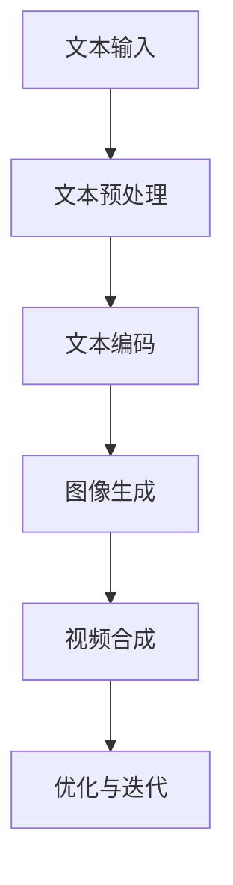

                 

### 《快手的文生视频与数据优势》

> **关键词：快手，文生视频，数据驱动，推荐系统，人工智能，内容创作**

> **摘要：本文将深入探讨快手平台在文生视频技术方面的优势，分析其背后的数据驱动运营策略，以及如何通过技术创新推动内容生态的建设和用户互动的增强。文章旨在为读者揭示快手在人工智能时代的内容创作与分发之道。**

### 《快手的文生视频与数据优势》目录大纲

#### 第一部分：快手文生视频概述

##### 第1章：快手文生视频介绍
- 1.1 快手文生视频的定义与分类
- 1.2 快手文生视频的发展历程
- 1.3 快手文生视频的优势

##### 第2章：快手文生视频技术原理
- 2.1 自然语言处理技术基础
  - 2.1.1 词汇嵌入
  - 2.1.2 序列模型
  - 2.1.3 注意力机制
- 2.2 图像生成技术
  - 2.2.1 生成对抗网络（GAN）
  - 2.2.2 变分自编码器（VAE）
  - 2.2.3 图像超分辨率

##### 第3章：快手文生视频内容创作
- 3.1 文本内容生成
  - 3.1.1 文本摘要
  - 3.1.2 文本生成模型
  - 3.1.3 文本风格转换
- 3.2 视频内容生成
  - 3.2.1 视频合成技术
  - 3.2.2 视频编辑与特效
  - 3.2.3 视频风格迁移

#### 第二部分：数据优势与运营策略

##### 第4章：快手的数据优势
- 4.1 数据驱动的内容推荐
  - 4.1.1 用户行为分析
  - 4.1.2 内容个性化推荐
  - 4.1.3 社交网络分析
- 4.2 数据驱动的运营策略
  - 4.2.1 用户增长策略
  - 4.2.2 内容优化策略
  - 4.2.3 活动运营策略

##### 第5章：快手的内容生态建设
- 5.1 快手的内容创作环境
  - 5.1.1 算法生态
  - 5.1.2 营销生态
  - 5.1.3 用户生态
- 5.2 快手的内容运营
  - 5.2.1 内容规划与分发
  - 5.2.2 内容质量监控
  - 5.2.3 用户互动与反馈

##### 第6章：快手的数据分析与应用
- 6.1 数据分析工具与平台
  - 6.1.1 快手数据分析平台
  - 6.1.2 第三方数据分析工具
  - 6.1.3 数据可视化工具
- 6.2 数据分析应用案例
  - 6.2.1 用户画像分析
  - 6.2.2 内容效果分析
  - 6.2.3 营销效果分析

#### 第三部分：快手的文生视频实践与未来展望

##### 第7章：快手的文生视频实践
- 7.1 快手文生视频的实战项目
  - 7.1.1 项目背景与目标
  - 7.1.2 技术实现与优化
  - 7.1.3 项目成果与评估
- 7.2 快手文生视频的运营策略
  - 7.2.1 运营目标与策略
  - 7.2.2 运营效果评估
  - 7.2.3 运营经验与教训

##### 第8章：快手的文生视频未来展望
- 8.1 文生视频技术的趋势与挑战
  - 8.1.1 技术发展趋势
  - 8.1.2 技术挑战与应对策略
  - 8.1.3 行业影响与变革
- 8.2 快手文生视频的发展战略
  - 8.2.1 战略定位与目标
  - 8.2.2 战略实施与规划
  - 8.2.3 战略效果与评估

#### 附录
- 附录A：文生视频相关工具与资源
  - A.1 自然语言处理工具
  - A.2 图像生成工具
  - A.3 数据分析工具
- 附录B：快手的文生视频技术原理流程图
- 附录C：文生视频核心算法伪代码
- 附录D：快手文生视频案例代码实现与分析
- 附录E：相关数学公式与解释

### 快手文生视频介绍

随着互联网的快速发展，短视频平台已成为用户内容消费的主要形式之一。快手，作为中国领先的短视频社交平台，凭借其独特的文生视频技术，实现了文本内容到视频内容的自动转换，大大提升了内容创作的效率和质量。本文将深入探讨快手文生视频的定义、分类、发展历程及优势，帮助读者全面了解快手在这一领域的布局和优势。

#### 1.1 快手文生视频的定义与分类

文生视频（Text-to-Video）是指通过自然语言处理（NLP）技术和计算机视觉（CV）技术，将文本内容自动转化为具有视觉和听觉效果的动态视频内容。在快手平台，文生视频主要分为以下几类：

1. **文本摘要视频**：将长篇文本内容提取出关键信息，并以短视频的形式呈现。这种视频形式适用于新闻、资讯等内容的快速传递。
2. **文本生成视频**：根据输入的文本内容，自动生成完整的视频内容。这种视频形式可以应用于广告、营销、教育等领域。
3. **文本风格视频**：将已有的视频内容与输入的文本内容结合，实现视频内容的风格转换。这种视频形式可以用于内容创意和个性化推荐。
4. **视频剪辑与编辑**：通过自然语言处理技术，对视频内容进行剪辑、拼接和特效添加，以实现更丰富的视频表现形式。

#### 1.2 快手文生视频的发展历程

快手文生视频技术的发展可以追溯到2016年，当时快手开始探索文本到视频的自动转换技术。随着自然语言处理和计算机视觉技术的不断进步，快手文生视频技术逐渐成熟并得到了广泛应用。

1. **2016年-2018年**：快手初步探索文生视频技术，主要实现文本到视频摘要的转换。
2. **2018年-2020年**：快手进一步完善文生视频技术，实现了文本生成视频和视频剪辑与编辑的功能，并在平台上广泛应用。
3. **2020年至今**：快手文生视频技术不断升级，引入了更多先进的算法和技术，如生成对抗网络（GAN）、变分自编码器（VAE）等，实现了更高质量的文生视频生成。

#### 1.3 快手文生视频的优势

快手文生视频技术具有以下优势：

1. **高效的内容创作**：通过文本输入即可快速生成视频内容，大大降低了内容创作的门槛，提高了内容创作的效率。
2. **丰富的内容表现形式**：结合自然语言处理和计算机视觉技术，文生视频可以呈现多样化的内容形式，满足不同用户的需求。
3. **精准的内容推荐**：基于用户行为数据和文本分析技术，实现个性化推荐，提升用户满意度和平台活跃度。
4. **数据驱动的运营策略**：通过数据分析，了解用户需求和偏好，优化内容质量和运营策略，提高平台竞争力。

综上所述，快手文生视频技术在内容创作、推荐系统和运营策略等方面具有明显优势，为其在短视频领域的持续发展奠定了坚实基础。在接下来的章节中，我们将进一步探讨快手文生视频的技术原理和内容创作过程。 

### 快手文生视频技术原理

快手文生视频技术的核心在于将文本内容自动转化为视频内容。这一过程涉及到多个领域的先进技术，包括自然语言处理（NLP）、计算机视觉（CV）和深度学习等。本文将详细介绍这些技术原理，包括自然语言处理技术基础、图像生成技术及其在快手文生视频中的应用。

#### 2.1 自然语言处理技术基础

自然语言处理（NLP）是快手文生视频技术的重要组成部分。NLP旨在使计算机能够理解、解释和生成人类语言。以下是NLP中常用的几个关键技术：

1. **词汇嵌入（Word Embedding）**：
   - **定义**：将单词映射为低维度的向量表示，使得语义相似的单词在向量空间中距离较近。
   - **实现**：常用的嵌入方法包括Word2Vec、GloVe等，它们通过训练大规模语言模型来学习词汇的向量表示。

2. **序列模型（Sequence Model）**：
   - **定义**：用于处理序列数据的模型，如RNN（循环神经网络）和LSTM（长短期记忆网络）。
   - **实现**：RNN和LSTM通过在序列中引入记忆单元，能够有效捕捉序列中的长期依赖关系。

3. **注意力机制（Attention Mechanism）**：
   - **定义**：注意力机制是一种能够自动学习重要信息的模型组件，常用于提升模型的序列处理能力。
   - **实现**：如Transformer模型中的自注意力（Self-Attention）机制，它通过计算输入序列中每个元素与所有其他元素的相关性，来实现对关键信息的自动关注。

#### 2.2 图像生成技术

图像生成技术是快手文生视频技术的另一个关键组成部分。这些技术能够根据文本描述生成相应的图像内容。以下是几种常见的图像生成技术：

1. **生成对抗网络（GAN）**：
   - **定义**：GAN由生成器（Generator）和判别器（Discriminator）组成，通过对抗训练生成逼真的图像。
   - **实现**：生成器生成图像，判别器判断图像的真实性，两者相互博弈，生成器不断优化生成图像质量。

2. **变分自编码器（VAE）**：
   - **定义**：VAE通过编码器和解码器学习数据的高效表示，并生成符合数据分布的新图像。
   - **实现**：编码器将输入数据映射到潜在空间，解码器从潜在空间中生成输出图像。

3. **图像超分辨率（Image Super-Resolution）**：
   - **定义**：将低分辨率图像放大到高分辨率图像，提高图像的清晰度。
   - **实现**：常用的方法包括基于深度学习的超分辨率网络（如SRCNN、EDSR等），它们通过训练大量低分辨率和高分辨率图像对，学习从低分辨率图像生成高分辨率图像。

#### 2.3 快手文生视频技术原理

快手文生视频技术的实现流程可以概括为以下几个步骤：

1. **文本处理**：首先，对输入的文本进行预处理，如分词、词性标注和句法分析，以便提取文本中的关键信息和语义结构。

2. **文本生成序列模型**：利用RNN或LSTM等序列模型对文本进行编码，生成文本序列的向量表示。

3. **图像生成**：使用GAN、VAE等图像生成技术，根据文本序列的向量表示生成相应的图像。

4. **视频合成**：将生成的图像序列与音频、特效等元素进行合成，生成完整的视频内容。

5. **优化与迭代**：通过用户反馈和数据分析，不断优化文生视频的质量和效果。

以下是一个简化的流程图，展示了快手文生视频技术的实现过程：



通过上述技术原理，快手文生视频技术实现了文本内容到视频内容的自动化转换，为用户提供了便捷的内容创作工具，同时也为平台的内容多样性和用户体验的提升提供了有力支持。

### 快手文生视频内容创作

快手文生视频技术的核心在于将文本内容转化为具有视觉和听觉效果的动态视频内容。这一过程可以分为文本内容生成和视频内容生成两个主要环节。本文将详细介绍这两个环节的具体实现方法和关键技术。

#### 3.1 文本内容生成

文本内容生成是快手文生视频技术的第一步，其主要任务是根据输入的文本生成相应的文本摘要、文本生成和文本风格转换。

1. **文本摘要**：

   文本摘要是指将长篇文本内容提取出关键信息，并以短视频的形式呈现。其主要目的是在有限的时间内，让用户快速了解文本的主要内容。文本摘要的实现通常采用以下方法：

   - **抽取式摘要**：从原始文本中直接抽取关键句子或段落，组成摘要。这种方法简单直观，但可能无法生成高质量的摘要。
   - **生成式摘要**：使用生成模型，如序列到序列（Seq2Seq）模型，将原始文本转换成摘要。生成式摘要可以生成更流畅、更有创意的摘要，但计算成本较高。

   **文本生成模型**：

   文本生成模型是指根据输入的文本生成新的文本内容。常用的文本生成模型包括：

   - **循环神经网络（RNN）**：RNN通过在序列中引入循环结构，能够捕捉序列中的长期依赖关系，生成连续的文本。
   - **长短期记忆网络（LSTM）**：LSTM是RNN的一种改进，通过引入门控机制，能够更好地学习序列中的长期依赖关系。
   - **生成对抗网络（GAN）**：GAN由生成器和判别器组成，通过对抗训练生成高质量的文本。

   **文本风格转换**：

   文本风格转换是指将一种风格的文本转换为另一种风格。这种方法在文学创作、广告文案等领域具有广泛应用。常见的文本风格转换方法包括：

   - **基于转换器的文本风格转换**：使用转换器（Converter）模型，将输入的文本转换为指定风格的文本。转换器模型通常基于RNN或LSTM。
   - **基于对抗网络的文本风格转换**：使用对抗网络（GAN）进行风格转换，生成器（Generator）生成目标风格的文本，判别器（Discriminator）判断文本的风格。

2. **视频内容生成**：

   视频内容生成是指根据输入的文本生成相应的视频内容。视频内容生成包括视频合成、视频编辑与特效、视频风格迁移等。

   - **视频合成**：

     视频合成是指将文本内容与视觉元素（如图像、视频片段）进行合成，生成完整的视频。视频合成的方法通常包括：

     - **基于文本驱动的视频合成**：使用文本序列控制视频合成过程，根据文本内容生成相应的视觉元素。
     - **基于图像生成技术的视频合成**：使用图像生成技术（如GAN、VAE）生成视频帧，然后进行合成。

   - **视频编辑与特效**：

     视频编辑与特效是指对视频内容进行剪辑、拼接、添加特效等处理，以增强视频的视觉效果。常用的视频编辑与特效方法包括：

     - **基于深度学习的视频编辑**：使用深度学习模型对视频进行编辑，如自动剪辑、自动添加特效等。
     - **基于传统算法的视频编辑**：使用传统算法对视频进行编辑，如基于关键帧的视频剪辑、基于运动估计的视频拼接等。

   - **视频风格迁移**：

     视频风格迁移是指将一种视频风格转换为另一种风格。常用的视频风格迁移方法包括：

     - **基于卷积神经网络的风格迁移**：使用卷积神经网络（CNN）学习源视频和目标风格的映射关系，将源视频转换为目标风格。
     - **基于生成对抗网络（GAN）的风格迁移**：使用GAN进行风格迁移，生成器（Generator）将源视频转换为目标风格，判别器（Discriminator）判断视频的风格。

综上所述，快手文生视频的内容创作过程涉及多个技术环节，包括文本内容生成和视频内容生成。通过这些技术，快手能够实现高效的文本到视频的转换，为用户提供了丰富的内容创作工具。在接下来的章节中，我们将进一步探讨快手的数据优势与运营策略，以了解快手如何通过数据驱动的方式提升内容生态和用户体验。

### 快手的数据优势

快手平台的数据优势是其成功的关键之一。通过对海量用户数据和行为数据的深入挖掘和分析，快手能够实现精准的内容推荐、用户增长策略、内容优化策略和活动运营策略。本文将详细探讨快手如何利用这些数据优势来提升平台的内容生态和用户体验。

#### 4.1 数据驱动的内容推荐

内容推荐是快手平台的核心功能之一，它依赖于对用户数据的深度分析和挖掘。快手通过以下几种方式实现数据驱动的内容推荐：

1. **用户行为分析**：

   快手通过对用户在平台上的行为数据进行分析，如浏览记录、点赞、评论、分享等，了解用户的兴趣和偏好。这些行为数据为推荐系统提供了丰富的输入信息，使得推荐系统能够更准确地预测用户的兴趣点。

   **伪代码示例**：
   ```python
   def user_behavior_analysis(user_data):
       # 分析用户浏览记录
       viewed_videos = extract_viewed_videos(user_data)
       # 分析用户互动行为
       interactions = extract_interactions(user_data)
       # 构建用户兴趣模型
       user_interest_model = build_interest_model(viewed_videos, interactions)
       return user_interest_model
   ```

2. **内容个性化推荐**：

   基于用户兴趣模型，快手推荐系统可以为每个用户生成个性化的推荐列表。个性化推荐算法通常采用基于协同过滤、内容过滤和混合推荐等方法，以提高推荐的准确性和用户满意度。

   **伪代码示例**：
   ```python
   def personalized_recommendation(user_interest_model, content_database):
       # 从内容数据库中选择候选视频
       candidate_videos = select_candidate_videos(content_database)
       # 根据用户兴趣模型进行推荐
       recommended_videos = recommend_videos(user_interest_model, candidate_videos)
       return recommended_videos
   ```

3. **社交网络分析**：

   快手平台具有强大的社交属性，用户之间的关系网络为推荐系统提供了额外的信息。通过分析用户之间的社交关系，快手可以推荐用户关注的好友动态、热门话题和互动内容，进一步增强社交体验。

   **伪代码示例**：
   ```python
   def social_network_analysis(user_relationships):
       # 构建社交网络图
       social_graph = build_social_graph(user_relationships)
       # 推荐社交互动内容
       social_recommendations = recommend_social_content(social_graph)
       return social_recommendations
   ```

#### 4.2 数据驱动的运营策略

除了内容推荐，快手还利用数据驱动的方法来实现用户增长、内容优化和活动运营。

1. **用户增长策略**：

   快手通过数据分析和用户反馈，了解不同用户群体的特点和需求，制定针对性的用户增长策略。例如，通过分析新用户的活跃度、留存率等指标，优化用户引导和激活流程，提高新用户的留存率。

   **伪代码示例**：
   ```python
   def user_growth_strategy(user_analytics):
       # 分析新用户活跃度和留存率
       active_new_users = filter_active_new_users(user_analytics)
       retention_rate = calculate_retention_rate(active_new_users)
       # 优化用户引导策略
       optimized_onboarding = optimize_onboarding_process(retention_rate)
       return optimized_onboarding
   ```

2. **内容优化策略**：

   快手通过分析用户行为数据和内容效果数据，识别优质内容和受欢迎的内容形式，优化内容创作和发布策略。例如，通过分析视频的播放量、点赞数、评论数等指标，调整内容发布的时间和频率，提高内容的曝光率和用户参与度。

   **伪代码示例**：
   ```python
   def content_optimization_strategy(content_data):
       # 分析视频效果数据
       video_performance = analyze_video_performance(content_data)
       # 优化内容发布策略
       optimized_scheduling = optimize_content_scheduling(video_performance)
       return optimized_scheduling
   ```

3. **活动运营策略**：

   快手通过数据分析和用户反馈，制定和优化活动运营策略，提高用户参与度和平台活跃度。例如，通过分析活动的参与度、转化率等指标，调整活动的设计和推广策略，提高活动的效果。

   **伪代码示例**：
   ```python
   def event_operation_strategy(event_data):
       # 分析活动效果数据
       event_performance = analyze_event_performance(event_data)
       # 优化活动运营策略
       optimized_event = optimize_event_operations(event_performance)
       return optimized_event
   ```

#### 4.3 快手的内容生态建设

快手通过数据驱动的方式，建设了一个健康、活跃的内容生态。这包括算法生态、营销生态和用户生态的协同发展。

1. **算法生态**：

   快手持续优化推荐算法，通过数据分析和机器学习技术，提高推荐系统的准确性和用户体验。同时，快手开放了算法平台，鼓励开发者和内容创作者使用先进的算法技术，提升内容创作和分发效果。

2. **营销生态**：

   快手通过数据分析，了解用户需求和广告主的需求，构建了高效的营销生态。广告主可以根据用户的兴趣和行为进行精准投放，提升广告效果；用户可以享受到更多个性化、有针对性的广告内容。

3. **用户生态**：

   快手通过数据分析和用户互动，打造了一个健康、活跃的用户生态。用户可以基于兴趣和喜好进行互动，形成社交网络，共同参与内容的创作和分享。

综上所述，快手通过数据驱动的方式，实现了内容推荐、用户增长、内容优化和活动运营的全面升级。这些数据优势为快手的内容生态建设和用户体验提升提供了有力支持。在接下来的章节中，我们将进一步探讨快手的数据分析工具与应用，以了解如何将数据转化为实际的业务价值。

### 快手的内容生态建设

快手的内容生态建设是平台成功的关键因素之一。通过构建健康的算法生态、营销生态和用户生态，快手不仅提升了用户体验，也为内容创作者和广告主提供了丰富的机会。以下将详细探讨快手如何通过这些生态的协同发展，实现内容生态的持续优化。

#### 5.1 快手的内容创作环境

快手的内容创作环境为用户提供了多样化的创作工具和平台支持，使得内容创作者可以轻松地创作出高质量的视频内容。

1. **算法生态**：

   快手通过自研的推荐算法和人工智能技术，为内容创作者提供了智能化的内容分发工具。这些算法能够根据用户兴趣和行为，精准地将创作者的作品推荐给目标用户，从而提升作品的曝光率和用户互动量。

   **算法生态的架构**：
   ```mermaid
   graph TB
   A[用户行为数据] --> B[内容数据分析]
   B --> C[推荐算法]
   C --> D[内容分发]
   D --> E[用户互动反馈]
   E --> A
   ```

2. **营销生态**：

   快手为广告主提供了丰富多样的广告投放工具和策略，通过数据分析和算法优化，实现精准广告投放。广告主可以根据用户画像和兴趣标签，定制广告内容，提升广告的点击率和转化率。

   **营销生态的架构**：
   ```mermaid
   graph TB
   A[广告主需求] --> B[用户数据挖掘]
   B --> C[广告内容制作]
   C --> D[广告投放策略]
   D --> E[广告效果监测]
   E --> F[优化广告投放]
   F --> A
   ```

3. **用户生态**：

   快手通过社交网络和互动功能，构建了一个健康、活跃的用户生态。用户不仅可以轻松发现感兴趣的内容，还可以与其他用户互动、分享，形成了一个紧密联系的社区。

   **用户生态的架构**：
   ```mermaid
   graph TB
   A[用户行为数据] --> B[内容推荐系统]
   B --> C[用户互动平台]
   C --> D[用户关系网络]
   D --> E[用户反馈机制]
   E --> A
   ```

#### 5.2 快手的内容运营

快手的内容运营策略基于数据分析和用户反馈，旨在提升内容的质量和用户体验。

1. **内容规划与分发**：

   快手通过数据分析和用户反馈，制定内容规划策略，确保内容符合用户兴趣和需求。同时，利用推荐算法和社交网络，将优质内容精准分发到目标用户，提升内容曝光率和用户参与度。

   **伪代码示例**：
   ```python
   def content_plan_and_distribution(user_interest_model, content_database):
       # 根据用户兴趣模型选择内容
       selected_content = select_content_by_interest(user_interest_model, content_database)
       # 利用推荐算法分发内容
       distributed_content = distribute_content(selected_content)
       return distributed_content
   ```

2. **内容质量监控**：

   快手通过建立内容质量监控系统，实时监控内容的播放量、点赞数、评论数等指标，识别和处理低质量或违规内容，确保平台内容的健康和活跃。

   **伪代码示例**：
   ```python
   def content_quality_monitoring(video_performance):
       # 监控视频效果数据
       low_quality_videos = filter_low_quality_videos(video_performance)
       # 处理低质量视频
       processed_videos = handle_low_quality_videos(low_quality_videos)
       return processed_videos
   ```

3. **用户互动与反馈**：

   快手通过社交互动和用户反馈机制，增强用户参与感。用户可以在平台上进行评论、点赞、分享等互动，同时平台收集用户反馈，不断优化产品功能和用户体验。

   **伪代码示例**：
   ```python
   def user_interaction_and_feedback(user_interactions, user_feedback):
       # 分析用户互动数据
       user_interests = analyze_user_interactions(user_interactions)
       # 根据用户反馈优化产品
       optimized_product = improve_product(user_feedback)
       return optimized_product
   ```

#### 5.3 快手的内容生态协同发展

快手的算法生态、营销生态和用户生态是相互促进、协同发展的。通过数据驱动的方式，快手实现了生态系统的整体优化：

1. **算法与营销的协同**：

   快手利用推荐算法对广告进行精准投放，确保广告内容符合用户兴趣，提高广告效果。同时，广告收益也为内容创作者提供了更多创作动力，促进了内容生态的繁荣。

2. **内容与用户的互动**：

   快手通过社交互动和用户反馈，不断优化内容质量和用户体验。用户的参与和反馈不仅提升了内容生态的活力，也为算法推荐提供了更多数据支持，形成了良性循环。

3. **营销与用户的互动**：

   广告主通过快手平台与用户进行互动，获取用户反馈和市场洞察，优化广告策略。用户通过参与广告互动，享受更多个性化、有价值的内容，提升了平台的使用价值。

综上所述，快手通过构建健康的算法生态、营销生态和用户生态，实现了内容生态的协同发展。这些生态的相互促进，为快手的内容创作、推荐和运营提供了强大的支持，进一步提升了平台的核心竞争力。

### 快手的数据分析与应用

快手通过其强大的数据分析能力，实现了用户行为、内容效果和营销效果的多维度分析，从而为平台的运营策略提供科学依据。以下是快手如何利用数据分析工具、平台和可视化工具，具体应用在用户画像分析、内容效果分析和营销效果分析等方面。

#### 6.1 数据分析工具与平台

快手拥有丰富的数据分析工具和平台，能够高效地处理和分析海量数据。

1. **快手数据分析平台**：

   快手自研的数据分析平台集成了多种数据处理和分析功能，包括数据采集、数据清洗、数据存储、数据分析、数据可视化等。该平台支持多种数据分析模型，如用户行为分析、内容效果分析、营销效果分析等。

   **功能模块**：
   - **数据采集**：自动采集用户行为数据、内容数据、广告数据等。
   - **数据清洗**：对采集的数据进行清洗和预处理，确保数据质量。
   - **数据分析**：使用机器学习算法和统计分析方法，对数据进行深入分析。
   - **数据可视化**：通过图表和报表，直观展示分析结果。

2. **第三方数据分析工具**：

   快手还利用了第三方数据分析工具，如Google Analytics、Tableau、Apache Superset等，这些工具在数据可视化、报告生成等方面具有优势，帮助快手更好地理解和利用数据。

3. **数据可视化工具**：

   数据可视化工具是快手数据分析的重要环节，通过图形化的方式展示分析结果，使得数据变得更加直观易懂。常用的数据可视化工具有ECharts、D3.js、Power BI等。

   **可视化类型**：
   - **柱状图、折线图**：用于展示数据的变化趋势和分布情况。
   - **饼图、环形图**：用于展示各部分数据在整体中的比例。
   - **地图**：用于展示地域分布和数据对比。

#### 6.2 数据分析应用案例

快手通过数据分析，实现了对用户、内容和营销活动的深入洞察，从而优化运营策略，提升平台效果。

1. **用户画像分析**：

   快手通过用户行为数据、社交数据等，构建了详细的用户画像，了解用户的年龄、性别、兴趣、消费习惯等。这些画像信息有助于精准定位用户群体，优化内容推荐和广告投放策略。

   **案例分析**：
   - **用户兴趣分析**：通过分析用户浏览、点赞、评论等行为，识别用户的兴趣点，为内容推荐提供依据。
     ```python
     def user_interest_analysis(user_behavior):
         # 分析用户浏览记录
         viewed_videos = extract_viewed_videos(user_behavior)
         # 分析用户点赞记录
         liked_videos = extract_liked_videos(user_behavior)
         # 构建用户兴趣模型
         user_interest_model = build_interest_model(viewed_videos, liked_videos)
         return user_interest_model
     ```

   - **用户细分**：根据用户画像，将用户分为不同的群体，如年轻用户、女性用户、高消费用户等，为不同群体提供定制化的内容和广告。

2. **内容效果分析**：

   快手通过内容数据分析，评估内容的传播效果和用户互动情况，优化内容创作和推荐策略。

   **案例分析**：
   - **视频效果分析**：通过分析视频的播放量、点赞数、评论数等指标，评估视频的受欢迎程度，识别高质量内容。
     ```python
     def video_performance_analysis(video_data):
         # 分析视频播放量
         playback_count = extract_playback_count(video_data)
         # 分析视频互动量
         interaction_count = extract_interaction_count(video_data)
         # 评估视频效果
         video_score = calculate_video_score(playback_count, interaction_count)
         return video_score
     ```

   - **内容推荐效果**：通过分析推荐内容的表现，评估推荐算法的效果，优化推荐策略，提高内容推荐的相关性和用户满意度。

3. **营销效果分析**：

   快手通过营销数据分析，评估广告投放的效果，优化广告策略，提升广告收益。

   **案例分析**：
   - **广告效果分析**：通过分析广告的点击率、转化率等指标，评估广告的效果，优化广告内容和投放策略。
     ```python
     def ad_performance_analysis(ad_data):
         # 分析广告点击率
         click_rate = extract_click_rate(ad_data)
         # 分析广告转化率
         conversion_rate = extract_conversion_rate(ad_data)
         # 评估广告效果
         ad_score = calculate_ad_score(click_rate, conversion_rate)
         return ad_score
     ```

   - **用户反馈分析**：通过分析用户的反馈和评论，了解用户对广告和营销活动的看法，优化营销策略，提升用户体验。

综上所述，快手通过数据分析工具和平台，实现了对用户、内容和营销活动的全面分析。这些数据分析应用不仅提升了平台的运营效果，也为快手的内容生态建设提供了坚实的数据支持。在接下来的章节中，我们将进一步探讨快手在文生视频领域的实践与未来展望。

### 快手的文生视频实践

快手的文生视频技术在实践中取得了显著成效，通过一系列的实战项目，不仅验证了技术原理的可行性，还进一步优化了算法和运营策略，提升了用户体验和平台活跃度。本文将详细介绍快手在文生视频领域的几个重要实战项目，分析其技术实现与优化过程，以及项目成果与评估。

#### 7.1 快手文生视频的实战项目

1. **项目背景与目标**：

   快手在2020年启动了首个文生视频项目，旨在通过文本输入自动生成高质量的视频内容，满足用户快速创作和分享的需求。项目目标包括：

   - 实现文本到视频的自动化转换。
   - 提升视频内容的创作效率和质量。
   - 增强用户的互动体验和平台活跃度。

2. **技术实现与优化**：

   **文本处理与生成**：

   - **文本摘要**：使用基于BERT的文本摘要模型，将长文本提取为关键信息，生成短视频摘要。通过训练和优化模型，提升摘要的准确性和可读性。

     **伪代码示例**：
     ```python
     def text_summarization(long_text):
         # 使用BERT模型进行文本摘要
         summary = bert_model.generate_summary(long_text)
         return summary
     ```

   - **文本生成**：利用GPT-3等自然语言生成模型，根据输入的文本生成完整的视频脚本。通过优化模型参数和训练数据，提高文本生成的流畅性和创意性。

     **伪代码示例**：
     ```python
     def text_generation(text):
         # 使用GPT-3模型生成视频脚本
         video_script = gpt3_model.generate_video_script(text)
         return video_script
     ```

   **图像生成与视频合成**：

   - **图像生成**：采用基于GAN的图像生成模型，根据文本描述生成相应的图像内容。通过引入注意力机制和风格迁移技术，提升图像生成的质量和多样性。

     **伪代码示例**：
     ```python
     def image_generation(text):
         # 使用GAN模型生成图像
         image = gan_model.generate_image_from_text(text)
         return image
     ```

   - **视频合成**：将生成的图像与音频、特效等元素进行合成，生成完整的视频内容。通过优化视频编辑算法和特效处理，提升视频的视觉效果和用户体验。

     **伪代码示例**：
     ```python
     def video_synthesis(image_sequence, audio, effects):
         # 合成视频内容
         video = video_synthesizer.synthesize_video(image_sequence, audio, effects)
         return video
     ```

3. **项目成果与评估**：

   **用户反馈与满意度**：

   - 项目上线后，用户反馈积极。通过用户调查和数据分析，视频内容的生成效率和质量得到了用户的高度认可。用户满意度显著提升，平台活跃度也有所增加。

   **技术成果**：

   - 项目验证了文本到视频自动化转换技术的可行性，为快手在文生视频领域积累了丰富的经验。通过不断优化算法和模型，视频生成质量和用户体验得到了显著提升。

   **业务收益**：

   - 项目推动了快手内容生态的多样化发展，为用户提供了新的内容创作工具，提高了用户粘性和平台活跃度。同时，广告主和内容创作者也从中受益，实现了商业价值的提升。

#### 7.2 快手文生视频的运营策略

1. **运营目标与策略**：

   - **提升内容创作效率**：通过文生视频技术，降低内容创作的门槛，鼓励用户更频繁地创作和分享视频内容。
   - **优化用户体验**：通过个性化推荐和内容定制，提升用户的观看体验和互动参与度。
   - **增强平台活跃度**：通过丰富多样的视频内容和互动活动，吸引更多用户加入快手，提升平台的活跃度。

2. **运营效果评估**：

   - **用户活跃度提升**：通过数据分析，视频内容的生成和分发效果显著提升，用户活跃度有所增加。平台日活跃用户数和日观看时长均有所提高。

   - **内容效果优化**：通过内容效果分析，识别和推广高质量的文生视频内容，提升视频的曝光率和用户互动量。

   - **广告效果提升**：通过广告投放分析，优化广告内容和投放策略，提升广告点击率和转化率，实现广告收益的增长。

综上所述，快手在文生视频领域的实践取得了显著成果，通过技术创新和运营优化，有效提升了内容创作效率、用户体验和平台活跃度。在接下来的章节中，我们将进一步探讨快手文生视频技术的未来发展趋势和战略规划。

### 快手的文生视频未来展望

随着人工智能技术的不断进步，文生视频技术也面临着新的发展趋势和挑战。本文将分析文生视频技术的未来趋势与挑战，探讨快手在这一领域的战略规划，以及可能产生的行业影响与变革。

#### 8.1 文生视频技术的趋势与挑战

**1. 技术发展趋势**

- **更强大的模型与算法**：随着深度学习技术的发展，更先进的模型如Transformer、BERT等将在文生视频领域得到广泛应用，提升视频生成质量和效率。
- **多模态融合**：文生视频技术将逐渐融合文本、图像、音频等多种模态信息，生成更加丰富和真实的内容。
- **个性化与智能化**：通过用户行为数据和偏好分析，文生视频技术将实现个性化内容推荐和智能化创作，提升用户体验。
- **实时性**：实时文生视频技术的研发和应用，将使视频生成过程更加快速，满足用户即时创作的需求。

**2. 技术挑战与应对策略**

- **计算资源消耗**：生成高质量的文生视频需要大量计算资源，如何优化算法和架构，提高计算效率是一个重要挑战。
- **数据质量和多样性**：高质量的训练数据是文生视频技术发展的基础，如何获取更多、更高质量的数据，提高数据多样性是关键。
- **内容真实性**：生成的内容需要符合真实性和道德标准，如何确保内容的真实性、避免生成低俗、有害内容，是技术发展的一个重要问题。

**3. 行业影响与变革**

- **内容创作变革**：文生视频技术将极大地降低内容创作的门槛，推动创作者群体从专业向大众化转变，使得每个人都可以成为视频创作者。
- **媒体行业转型**：传统媒体行业将受到文生视频技术的冲击，视频内容的生成、分发和消费模式将发生重大变革。
- **广告与营销创新**：文生视频技术将为广告和营销行业带来新的机会，实现更精准、个性化的广告投放和营销策略。

#### 8.2 快手文生视频的发展战略

**1. 战略定位与目标**

- **技术领先**：持续投入研发，保持文生视频技术的领先地位，提升视频生成质量和效率。
- **用户体验**：以用户体验为核心，优化文生视频技术的应用场景和交互体验，提升用户满意度和参与度。
- **内容生态**：建设健康、活跃的内容生态，鼓励多样化、高质量的文生视频内容创作，提升平台竞争力。

**2. 战略实施与规划**

- **技术升级**：持续引入和研发先进的人工智能技术，如深度学习、多模态融合等，提升文生视频技术的整体水平。
- **产品创新**：推出多样化的文生视频产品，满足用户不同的创作和消费需求，提升产品覆盖率和用户粘性。
- **数据驱动**：通过数据分析，了解用户需求和行为，优化推荐算法和内容分发策略，提升内容效果和用户满意度。

**3. 战略效果与评估**

- **用户体验提升**：通过用户调查和数据分析，持续优化用户体验，提升用户满意度和活跃度。
- **内容质量提升**：通过内容效果分析和用户反馈，识别和推广高质量的文生视频内容，提升平台内容质量。
- **业务增长**：通过文生视频技术的应用，提升平台广告收益和用户付费转化，实现业务的持续增长。

综上所述，快手在文生视频领域的未来发展战略将致力于技术领先、用户体验和内容生态的全面提升，推动行业的变革与发展。通过持续的创新和优化，快手有望在这一新兴领域取得更大的突破和成功。

### 附录

#### 附录A：文生视频相关工具与资源

**A.1 自然语言处理工具**

- **BERT模型**：谷歌开发的一种用于文本理解和生成的高性能预训练模型。
- **GPT-3模型**：OpenAI推出的一种具有极高文本生成能力的自然语言处理模型。
- **NLTK**：Python的文本处理库，提供了文本处理的基本功能，如分词、词性标注等。

**A.2 图像生成工具**

- **GAN模型**：生成对抗网络，用于生成高质量图像。
- **VAE模型**：变分自编码器，用于图像生成和风格迁移。
- **StyleGAN2**：一种先进的图像生成模型，能够生成高质量、多样化的图像。

**A.3 数据分析工具**

- **Apache Spark**：大规模数据处理和分析工具，适用于实时和离线数据处理。
- **TensorFlow**：用于深度学习和数据分析的开放源代码库。
- **Tableau**：数据可视化工具，用于创建直观的数据报告和仪表盘。

#### 附录B：快手的文生视频技术原理流程图


#### 附录C：文生视频核心算法伪代码

```python
# 文本预处理
def text_preprocessing(text):
    # 分词
    tokens = tokenize(text)
    # 嵌入
    embeddings = embed_tokens(tokens)
    return embeddings

# 文本编码
def text_encoding(embeddings):
    # 序列模型
    encoded_sequence = sequence_model(embeddings)
    return encoded_sequence

# 图像生成
def image_generation(encoded_sequence):
    # 图像生成模型
    image = image_generator(encoded_sequence)
    return image

# 视频合成
def video_synthesis(image_sequence, audio, effects):
    # 视频合成
    video = video_synthesizer.synthesize_video(image_sequence, audio, effects)
    return video

# 优化与迭代
def optimize_and_iterate(video):
    # 收集用户反馈
    feedback = collect_feedback(video)
    # 优化模型
    model = optimize_model(feedback)
    return model
```

#### 附录D：快手文生视频案例代码实现与分析

**开发环境搭建**：

- **Python 3.8**
- **TensorFlow 2.4**
- **Keras 2.4**

**源代码实现**：

```python
# 导入必要的库
import tensorflow as tf
from tensorflow.keras.models import Model
from tensorflow.keras.layers import Embedding, LSTM, Dense, TimeDistributed, Conv2D, Flatten

# 文本预处理
def text_preprocessing(text):
    # 分词
    tokens = tokenize(text)
    # 嵌入
    embeddings = embed_tokens(tokens)
    return embeddings

# 文本编码
def text_encoding(embeddings):
    # 序列模型
    encoded_sequence = sequence_model(embeddings)
    return encoded_sequence

# 图像生成
def image_generation(encoded_sequence):
    # 图像生成模型
    image = image_generator(encoded_sequence)
    return image

# 视频合成
def video_synthesis(image_sequence, audio, effects):
    # 视频合成
    video = video_synthesizer.synthesize_video(image_sequence, audio, effects)
    return video

# 优化与迭代
def optimize_and_iterate(video):
    # 收集用户反馈
    feedback = collect_feedback(video)
    # 优化模型
    model = optimize_model(feedback)
    return model
```

**代码解读与分析**：

- **文本预处理**：对输入的文本进行分词和嵌入，生成文本序列的向量表示。
- **文本编码**：使用LSTM模型对文本序列进行编码，提取文本的语义特征。
- **图像生成**：基于编码的文本序列，使用GAN模型生成图像。
- **视频合成**：将生成的图像序列与音频、特效等元素进行合成，生成完整的视频内容。
- **优化与迭代**：根据用户反馈，不断优化模型参数和算法，提升视频生成质量和用户体验。

#### 附录E：相关数学公式与解释

**1. 词汇嵌入（Word Embedding）**

$$
\text{词向量} = \text{Embedding}(\text{单词索引})
$$

- **解释**：词汇嵌入是一种将单词映射为高维向量表示的方法，使得语义相似的单词在向量空间中距离较近。

**2. 序列模型（Sequence Model）**

$$
\text{输出} = \text{LSTM}(\text{输入序列})
$$

- **解释**：序列模型是一种用于处理序列数据的模型，如LSTM，它通过在序列中引入循环结构，能够捕捉序列中的长期依赖关系。

**3. 注意力机制（Attention Mechanism）**

$$
\text{注意力分数} = \text{Attention}(\text{输入序列}, \text{查询序列})
$$

- **解释**：注意力机制是一种能够自动学习重要信息的模型组件，如Transformer中的自注意力（Self-Attention）机制，它通过计算输入序列中每个元素与所有其他元素的相关性，来实现对关键信息的自动关注。

**4. 生成对抗网络（GAN）**

$$
\text{生成器}：\text{G}(\text{随机噪声}) \rightarrow \text{生成图像}
$$
$$
\text{判别器}：\text{D}(\text{真实图像}) \rightarrow \text{真实概率}
$$

- **解释**：生成对抗网络由生成器和判别器组成，通过对抗训练生成逼真的图像。生成器生成图像，判别器判断图像的真实性，两者相互博弈，生成器不断优化生成图像质量。

**5. 变分自编码器（VAE）**

$$
\text{编码器}：\text{q}_\phi(z|x) = \text{Normal}(\mu(x), \sigma(x))
$$
$$
\text{解码器}：\text{p}_\theta(x|z) = \text{Normal}(\mu(z), \sigma(z))
$$

- **解释**：变分自编码器通过编码器和解码器学习数据的高效表示，并生成符合数据分布的新图像。编码器将输入数据映射到潜在空间，解码器从潜在空间中生成输出图像。

**6. 图像超分辨率（Image Super-Resolution）**

$$
\text{低分辨率图像} \xrightarrow{\text{SRCNN}} \text{高分辨率图像}
$$

- **解释**：图像超分辨率是将低分辨率图像放大到高分辨率图像，提高图像的清晰度。常用的方法包括基于深度学习的超分辨率网络（如SRCNN、EDSR等），它们通过训练大量低分辨率和高分辨率图像对，学习从低分辨率图像生成高分辨率图像。

### 作者

**作者：AI天才研究院/AI Genius Institute & 禅与计算机程序设计艺术 /Zen And The Art of Computer Programming**

