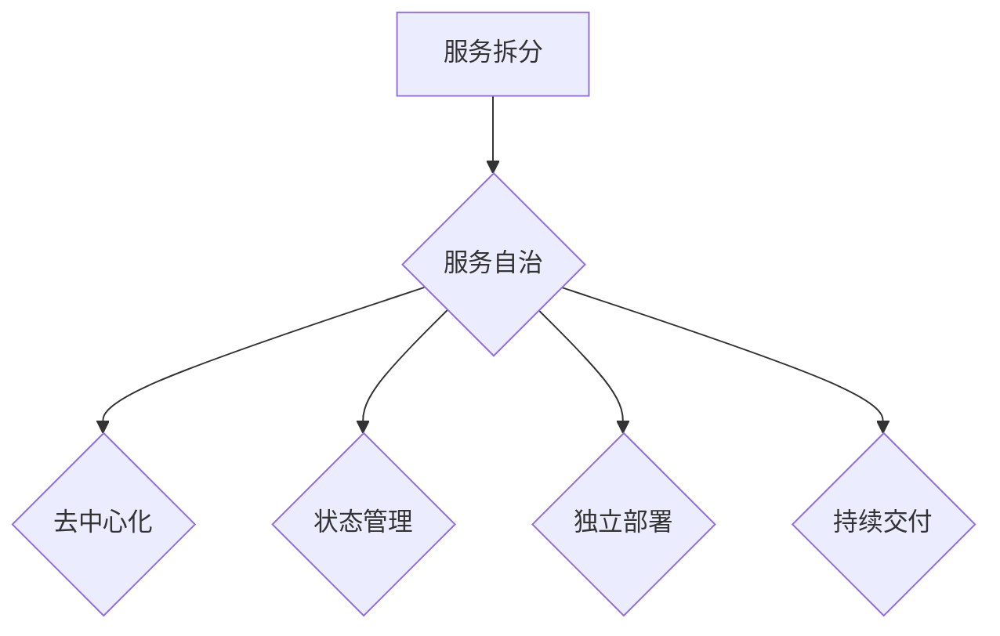

                 

### 书名：《快速构建LLM应用的微服务架构》

在当前技术迅速发展的时代，大规模语言模型（Large Language Model，简称LLM）的应用已经成为人工智能领域的一个重要方向。无论是自然语言处理、智能客服、还是内容生成，LLM都展示出了巨大的潜力和应用价值。然而，随着LLM的应用场景不断扩大，如何高效、可扩展地构建和管理LLM应用成为了一个亟待解决的问题。

本书《快速构建LLM应用的微服务架构》正是为了解决这一问题而诞生的。本书旨在为开发者提供一套完整的微服务架构实践指南，帮助读者快速掌握如何利用微服务架构构建高性能、可扩展的LLM应用。通过本书，读者不仅能够理解微服务架构的核心概念和设计原则，还能通过具体的案例和代码实战，深入掌握微服务在LLM应用中的实现细节。

本书的结构清晰，内容丰富，涵盖了微服务架构从基础到进阶的各个方面。首先，读者将了解微服务架构的核心概念和优势，包括服务拆分、自治、去中心化、持续交付与部署等。接着，本书将详细介绍微服务架构的关键组件，如API网关、服务发现、配置管理和安全认证等。随后，本书将深入探讨微服务架构在LLM应用中的具体应用，包括模型训练、预测与查询等模块的设计与实现。

为了让读者能够真正掌握微服务架构在LLM应用中的实践技能，本书还提供了详细的开发环境搭建指南、实际项目案例解析以及性能优化与调试策略。通过这些实践内容，读者将能够将所学知识应用到实际项目中，构建出高效、可靠的LLM应用。

总之，本书不仅是微服务架构的入门指南，也是LLM应用开发的实用手册。无论你是初学者还是资深开发者，都能从本书中受益，提升你的技术能力和项目实践经验。

### 关键词

- 微服务架构
- 大规模语言模型（LLM）
- 服务拆分
- 自治
- 持续交付与部署
- API网关
- 服务发现
- 配置管理
- 安全认证
- 分布式计算
- 弹性伸缩
- 软件可复用性
- 持续集成与持续部署（CI/CD）

### 摘要

本书《快速构建LLM应用的微服务架构》致力于为开发者提供一套全面的微服务架构实践指南，旨在帮助读者高效、可扩展地构建大规模语言模型（LLM）应用。本书首先介绍了微服务架构的核心概念、设计原则和关键组件，使读者对微服务架构有一个全面的理解。随后，本书结合LLM应用的特点，详细阐述了微服务架构在LLM应用中的具体应用，包括模型训练、预测与查询等模块的设计与实现。通过提供详细的开发环境搭建指南、实际项目案例解析以及性能优化与调试策略，本书不仅帮助读者掌握微服务架构的理论知识，更提供了实用的实战经验和技巧。无论是初学者还是资深开发者，都能从本书中找到所需的知识和技能，提升自己在LLM应用开发中的竞争力。

#### 第一部分：微服务架构概述

微服务架构是一种基于服务的软件架构风格，它将应用程序构建为一组小的、独立的、分布式服务。这些服务通过定义良好的API进行通信，每个服务都有自己的数据存储、业务逻辑和松散耦合的组件。微服务架构的核心思想是将复杂的单体应用拆分成多个小而独立的服务，以便实现更高效、可扩展、易于维护的软件系统。

##### 第1章：微服务架构的原理与实践

本章将深入探讨微服务架构的原理和实践，帮助读者理解微服务架构的核心概念、设计原则和关键组件。通过本章节的学习，读者将能够了解微服务架构的优势和挑战，并掌握在项目中如何应用微服务架构。

- **1.1 微服务架构的核心概念**

  微服务架构的核心概念包括服务拆分、服务自治、去中心化、状态管理、独立部署和持续交付等。以下是对这些概念的具体解释：

  - **服务拆分**：将大型单体应用拆分为多个小服务，每个服务负责单一业务功能。
  - **服务自治**：每个服务都是独立的，拥有自己的数据存储、业务逻辑和部署环境，可以独立运行和扩展。
  - **去中心化**：服务之间通过定义良好的API进行通信，没有中心化的控制节点，系统更加灵活和可扩展。
  - **状态管理**：在微服务架构中，状态通常被分散存储在各个服务中，避免了单点故障和复杂的状态同步问题。
  - **独立部署**：每个服务可以独立部署和升级，无需重启整个系统，提高了系统的可靠性和可维护性。
  - **持续交付**：通过自动化工具和流程，实现服务的快速迭代和部署，提高了开发效率和系统的稳定性。

- **1.2 微服务架构的设计原则**

  微服务架构的设计原则包括：

  - **单一职责原则**：每个服务应只负责一个单一的业务功能，避免功能过于复杂。
  - **服务独立性**：服务之间应该松耦合，独立部署和扩展，降低系统的复杂度和维护成本。
  - **自治性**：服务应拥有自己的数据存储、业务逻辑和部署环境，减少依赖和冲突。
  - **可扩展性**：设计服务时需要考虑未来可能的扩展，确保系统能够水平扩展以满足业务增长需求。
  - **可测试性**：服务应该易于测试，保证每个服务都是可测试的单元。
  - **可监控性**：系统应该具备良好的监控机制，可以实时监控服务的运行状态和性能指标。

- **1.3 微服务架构的关键组件**

  微服务架构的实施需要一系列关键组件的支持，以下是这些组件的详细解释：

  - **API网关**：API网关是微服务架构中的核心组件，负责处理客户端的请求，并将其路由到相应的服务。它还提供认证、授权、路由、负载均衡等功能。
  - **服务发现**：服务发现是指服务消费者能够动态地查询和获取服务提供者的地址信息。这通常通过注册中心或服务发现组件来实现。
  - **配置管理**：配置管理组件负责管理服务的配置信息，包括服务地址、端口、环境变量等。它支持服务配置的动态更新，确保服务之间的一致性。
  - **安全认证**：安全认证组件负责确保服务之间的通信是安全的，通常包括身份验证、授权、加密等机制。
  - **服务监控**：服务监控组件负责实时监控服务的运行状态和性能指标，提供报警和日志分析功能，帮助开发者快速定位和解决问题。

- **1.4 微服务架构的挑战与解决方案**

  尽管微服务架构具有很多优势，但在实际应用中也会面临一些挑战。以下是一些常见的挑战及其解决方案：

  - **分布式系统的复杂性**：微服务架构引入了分布式系统的复杂性，包括数据一致性问题、服务发现问题、分布式事务管理等。解决方案包括使用分布式算法（如Paxos、Raft）、分布式数据库、服务网格等。
  - **服务拆分策略**：如何合理地拆分服务是微服务架构中的一大挑战。解决方案包括基于业务功能拆分、基于数据一致性需求拆分、基于团队职责拆分等。
  - **服务间通信**：服务间通信是微服务架构中一个重要环节，需要保证高效、可靠、安全。解决方案包括使用RESTful API、消息队列、服务总线等。
  - **系统监控与调试**：在分布式系统中，监控和调试变得更加复杂。解决方案包括使用分布式追踪系统、日志聚合工具、监控平台等。

通过本章的学习，读者将能够深入理解微服务架构的原理和实践，为后续章节的学习和应用打下坚实的基础。无论是新手还是有经验的开发者，都可以从中获得有益的知识和经验。

##### 1.1 微服务架构的核心概念

微服务架构的核心概念主要包括服务拆分、服务自治、去中心化、状态管理、独立部署和持续交付等。这些概念是构建高效、可扩展和易于维护的软件系统的基石。

- **服务拆分**：服务拆分是将一个复杂的单体应用分解为多个较小的、独立的服务。每个服务负责一个单一的业务功能，这种拆分方式有助于提高系统的模块化程度，使得每个服务都可以独立开发和部署。服务拆分通常基于业务需求、数据一致性需求或团队职责等因素进行。

- **服务自治**：服务自治是指每个服务拥有自己的数据存储、业务逻辑和部署环境，能够独立运行和扩展。这种自治性确保了服务的独立性和可扩展性，使得一个服务的问题不会影响到其他服务，从而提高了系统的可靠性和容错能力。

- **去中心化**：去中心化是微服务架构的一个重要特点，意味着系统中没有中心化的控制节点。所有服务都是平等的，通过定义良好的API进行通信。这种去中心化的设计提高了系统的灵活性和可扩展性，使得系统更加健壮。

- **状态管理**：在微服务架构中，状态管理是一个重要且复杂的问题。由于服务是独立的，状态通常分散存储在各个服务中，这避免了单点故障和复杂的状态同步问题。然而，这也带来了数据一致性问题，需要采用分布式算法（如Paxos、Raft）来确保数据的一致性。

- **独立部署**：独立部署是指每个服务可以独立部署和升级，不需要重启整个系统。这种部署方式提高了系统的可维护性和可靠性，因为开发者可以单独更新或修复某个服务，而不会影响到其他服务。

- **持续交付**：持续交付是一种软件开发和部署的最佳实践，通过自动化工具和流程实现快速迭代和部署。在微服务架构中，持续交付尤为重要，因为它确保了服务的快速更新和部署，提高了开发效率和系统的稳定性。

以上这些核心概念相互关联，共同构成了微服务架构的基础。理解这些概念有助于开发者更好地设计、开发和维护微服务系统。下面，我们将通过一个Mermaid流程图来展示这些核心概念之间的关系：

在这个流程图中，服务拆分作为起点，将应用程序分解为多个服务。这些服务实现了自治性，使得它们可以独立运行和扩展。去中心化设计确保了系统没有单点故障，状态管理解决了分布式系统中的数据一致性问题。独立部署和持续交付则使得系统的维护和更新更加高效和可靠。

通过理解这些核心概念，开发者可以设计出更加灵活、可扩展和易于维护的微服务系统，从而应对不断变化的技术和业务需求。

##### 1.2 微服务架构的设计原则

微服务架构的设计原则是确保系统高效、可扩展和易于维护的关键。以下是微服务架构的主要设计原则及其详细解释：

- **单一职责原则**：每个服务应只负责一个单一的业务功能。这一原则有助于提高代码的模块化程度，使得每个服务都能独立开发、测试和部署。单一职责原则有助于降低系统的复杂性，使得维护和扩展变得更加容易。

- **服务独立性**：服务独立性要求每个服务都应该是松耦合的，即服务之间通过定义良好的API进行通信，而不是共享全局状态或依赖其他服务的内部实现。这种独立性确保了服务之间的解耦，使得一个服务的问题不会影响到其他服务，从而提高了系统的容错性和可靠性。

- **自治性**：自治性是指每个服务都应该拥有自己的数据存储、业务逻辑和部署环境。这种设计使得服务可以独立运行和扩展，避免了单点故障和复杂的状态同步问题。自治性还提高了系统的可维护性，因为开发者可以单独更新或修复某个服务，而不会影响到其他服务。

- **可扩展性**：可扩展性是微服务架构的核心设计原则之一。系统设计时应考虑未来的扩展需求，确保系统能够水平扩展以满足业务增长。水平扩展意味着可以增加服务的实例数量来处理更多的请求，而不是垂直扩展（增加服务器的硬件资源）。

- **可测试性**：可测试性是衡量一个服务设计是否良好的重要指标。每个服务都应该易于测试，保证每个服务都是可测试的单元。这通常意味着服务应该是独立的，可以独立启动和停止，并且具有清晰的输入输出接口。

- **可监控性**：可监控性是指系统应该具备良好的监控机制，可以实时监控服务的运行状态和性能指标。这包括日志记录、性能监控、报警机制等。良好的监控机制有助于快速发现和解决问题，从而提高系统的稳定性和可靠性。

- **可部署性**：可部署性是指服务应能够独立部署和升级，无需重启整个系统。这通常通过容器化技术（如Docker）和自动化部署工具（如Kubernetes）来实现。独立部署提高了系统的可维护性和灵活性，使得开发者可以单独更新或修复某个服务，而不会影响其他服务。

- **可恢复性**：可恢复性是指系统能够在遇到故障时快速恢复，确保服务的连续性和稳定性。这通常通过冗余设计、故障转移和自动恢复机制来实现。良好的可恢复性是高可用性系统的重要组成部分。

- **安全性**：安全性是微服务架构设计中的重要原则。服务之间的通信应该通过安全的协议（如HTTPS）进行加密，确保数据传输的安全。此外，还应实施访问控制和认证机制，确保只有授权的用户和服务才能访问敏感数据或执行特定操作。

通过遵循这些设计原则，开发者可以构建出高效、可扩展、可靠和易于维护的微服务系统。这些原则不仅适用于新系统，也可以用于对现有系统进行重构和优化，以提升其性能和可维护性。

##### 1.3 微服务架构的关键组件

微服务架构的实施需要一个完整且协调的组件集合，这些组件相互协作，共同确保系统的可靠性、可扩展性和可维护性。以下是微服务架构中的关键组件及其详细解释：

- **API网关**：API网关是微服务架构中的核心组件，负责处理客户端的请求，并将其路由到相应的服务。API网关提供了一系列重要的功能，包括认证、授权、路由、负载均衡、请求限流和熔断等。通过API网关，开发者可以统一管理和监控所有服务，简化客户端的集成工作，同时为服务之间的通信提供额外的安全层。

- **服务发现**：服务发现是指服务消费者能够动态地查询和获取服务提供者的地址信息。服务发现组件通常与注册中心配合使用，服务启动时会将自己注册到注册中心，服务停止时会从注册中心注销。服务消费者通过查询注册中心来获取服务提供者的地址，从而实现动态服务发现。服务发现提高了系统的灵活性，使得服务可以独立部署和扩展，而不会影响到其他服务。

- **配置管理**：配置管理组件负责管理服务的配置信息，包括服务地址、端口、环境变量等。配置管理支持配置信息的动态更新，确保服务之间的一致性。通过配置管理，开发者可以集中管理和修改配置，而不需要手动更新每个服务的配置文件，提高了系统的可维护性和灵活性。

- **安全认证**：安全认证组件负责确保服务之间的通信是安全的，通常包括身份验证、授权、加密等机制。常见的身份验证方式有用户名/密码、OAuth、JWT等。通过安全认证，可以确保只有授权的用户或服务才能访问敏感数据和执行特定操作，从而提高了系统的安全性。

- **服务监控**：服务监控组件负责实时监控服务的运行状态和性能指标，提供报警和日志分析功能。通过服务监控，开发者可以及时发现和解决问题，确保服务的稳定性和可靠性。常见的监控工具包括Prometheus、Grafana、ELK Stack等。

- **服务日志**：服务日志是记录服务运行过程中的重要信息，包括错误日志、访问日志等。服务日志对于问题诊断和性能分析至关重要。通过日志聚合工具（如Logstash、Fluentd），可以将分散的日志集中存储和管理，便于查询和分析。同时，通过日志分析工具（如Kibana），可以实时监控服务的运行状态和性能指标。

- **分布式事务**：分布式事务是指在分布式系统中，保证多个服务操作的一致性。由于服务是独立的，分布式事务通常较为复杂。常见的分布式事务解决方案包括两阶段提交（2PC）、最终一致性、分布式锁等。通过分布式事务，可以确保数据的一致性和完整性。

- **服务网格**：服务网格是一种新型的架构模式，用于管理和优化服务之间的通信。服务网格通过边车（sidecar）代理和服务发现组件，实现了服务间通信的透明化。服务网格提供了负载均衡、熔断、超时、重试、加密等高级功能，使得服务之间的通信更加高效和安全。

以上关键组件在微服务架构中各自承担着重要的职责，相互协作，共同确保系统的稳定性、可靠性和可扩展性。通过合理地设计和部署这些组件，开发者可以构建出高效、可靠的微服务系统，应对复杂的多变业务需求。

##### 1.4 微服务架构的挑战与解决方案

尽管微服务架构具有许多优点，但在实际应用中也会面临一些挑战。这些挑战包括分布式系统的复杂性、服务拆分策略、服务间通信、系统监控与调试等方面。下面，我们将详细探讨这些挑战及其解决方案。

- **分布式系统的复杂性**：微服务架构的核心特征之一是分布式系统。分布式系统相比单体架构，带来了更高的复杂性和维护成本。主要挑战包括：

  - **数据一致性问题**：在分布式系统中，数据一致性问题尤为突出。由于服务独立运行，数据可能在多个服务之间出现不一致。解决数据一致性问题通常需要采用分布式算法，如Paxos、Raft等，确保分布式事务的一致性。

  - **服务发现问题**：服务发现是分布式系统中的一项基础功能。如何高效地查找和选择合适的服务实例是一个挑战。可以使用服务注册中心和服务发现组件，如Consul、Zookeeper等，来管理和查询服务实例。

  - **分布式事务管理**：分布式事务管理是一个复杂的问题。传统的事务管理机制在分布式系统中难以适用，需要采用最终一致性、补偿事务等策略来确保数据的一致性。

  - **故障恢复**：分布式系统的故障恢复机制需要确保在服务故障时，系统能够快速恢复，从而保证服务的可用性。可以采用冗余设计、负载均衡和故障转移机制来实现。

- **服务拆分策略**：服务拆分是微服务架构中的关键步骤。如何合理地拆分服务是一个挑战，需要考虑以下因素：

  - **业务功能独立性**：服务应尽可能独立，避免功能过于复杂，影响系统的可维护性和可扩展性。

  - **数据一致性需求**：在拆分服务时，需要考虑数据一致性需求。如果服务之间存在强依赖关系，可能导致数据一致性问题。

  - **团队职责**：服务拆分可以基于团队职责，将不同的业务功能分配给不同的团队，从而提高开发效率和团队协作。

  - **服务粒度**：服务粒度应适中，不宜过细或过粗。过细的服务可能导致过多的通信开销和复杂度，而过粗的服务则可能难以实现独立性和可扩展性。

- **服务间通信**：服务间通信是微服务架构中一个重要环节，需要保证高效、可靠、安全。主要挑战包括：

  - **通信协议**：选择合适的通信协议对于确保服务间通信的高效和安全至关重要。常见的通信协议包括HTTP/HTTPS、gRPC、Message Queue等。

  - **负载均衡**：负载均衡可以有效地分配请求到不同的服务实例，确保系统的性能和稳定性。常用的负载均衡算法有轮询、最小连接数、随机等。

  - **服务发现与路由**：服务发现与路由策略决定了服务实例的选取和请求的转发。可以使用动态服务发现和路由策略，如基于Consistent Hash算法的路由。

  - **通信安全**：服务间通信应确保数据传输的安全，通常采用TLS/SSL加密、身份认证和访问控制等安全措施。

- **系统监控与调试**：在分布式系统中，监控和调试变得更加复杂。主要挑战包括：

  - **日志收集与存储**：分布式系统中的日志分散在各个服务实例中，需要使用日志聚合工具（如Fluentd、Logstash）将日志收集到中央日志存储，便于查询和分析。

  - **性能监控**：性能监控工具（如Prometheus、Grafana）可以实时监控服务的性能指标，如CPU使用率、内存占用、响应时间等，帮助开发者快速定位性能瓶颈。

  - **分布式追踪**：分布式追踪系

