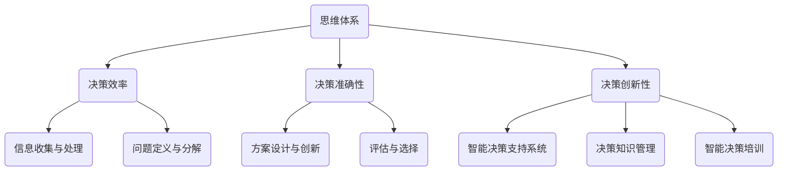

                 

# 《思维体系与管理者决策质量的关系》

## 概述

在当今快速变化和竞争激烈的商业环境中，管理者的决策质量对于企业的生存和发展至关重要。决策质量不仅决定了企业能否在市场中保持竞争力，还影响了企业的长远发展和战略方向。然而，决策质量并不是一个单一的概念，它受到多种因素的影响，其中思维体系是影响决策质量的重要因素之一。

思维体系是一个复杂的系统，包括思维方式、思维模式、逻辑推理、创新思维等多个方面。一个良好的思维体系可以帮助管理者更好地理解问题、分析问题，并做出更为明智的决策。本文将详细探讨思维体系与管理者决策质量之间的关系，旨在为管理者提供有益的思考和实践指南。

关键词：思维体系、管理者决策、决策质量、思维模式、逻辑推理

## 摘要

本文从思维体系的基本概念出发，详细介绍了思维体系的构建方法、评估标准以及管理者决策质量的概念和评估标准。随后，分析了思维体系对管理者决策质量的影响，包括决策效率、准确性和创新性等方面。在此基础上，提出了提升管理者决策质量的方法和技巧，并通过实际案例进行了详细分析。最后，对未来思维体系和决策质量的发展趋势进行了展望，并提出了相关研究展望和建议。

## 第一部分：思维体系概述

### 第1章：思维的定义与分类

#### 思维的基本概念

思维是指人类大脑对外部信息进行感知、理解、处理和生成内省认知活动的复杂过程。思维是人类智慧的体现，是人们解决问题、做出决策、进行创新和适应环境的基础。思维可以分为多个层次，从简单的感知思维到复杂的创造性思维，涵盖了人类认知活动的各个方面。

#### 思维的类型

1. **直觉思维**：直觉思维是基于经验、直观和感知快速做出判断的思维方式。它通常不经过详细的分析和逻辑推理，而是依赖于大脑的快速反应和处理。

2. **逻辑思维**：逻辑思维是一种基于逻辑规则和推理过程的思维方式。它强调通过分析、比较、归纳和演绎等方法，逐步推导出结论。

3. **创造性思维**：创造性思维是指通过创新的方法和思维模式，寻找新的解决方案和思路。它强调打破常规、突破框架，具有创造性和创新性。

4. **批判性思维**：批判性思维是一种对信息、观点和假设进行批判性分析和评估的思维方式。它强调质疑、分析和评价，以发现和纠正错误或不足。

#### 思维与决策的关系

思维是决策的基础，决策是思维的结果。一个良好的思维体系可以帮助管理者更好地理解问题、分析问题，并做出更为明智的决策。不同的思维类型在决策过程中发挥不同的作用：

- **直觉思维**：在紧急情况下，直觉思维可以帮助管理者快速做出决策。
- **逻辑思维**：逻辑思维可以帮助管理者系统分析问题，确保决策的合理性和准确性。
- **创造性思维**：创造性思维可以帮助管理者找到创新的解决方案，提高决策的创新性和竞争力。
- **批判性思维**：批判性思维可以帮助管理者对决策进行深入分析和评估，减少错误和风险。

### 第2章：思维体系的构建

#### 思维模型的发展历程

思维模型是描述人类思维过程和机制的抽象模型。思维模型的发展历程可以分为三个阶段：

1. **传统阶段**：传统思维模型主要基于心理学、哲学和逻辑学的研究，强调人类思维过程的线性、有序和逻辑性。

2. **认知阶段**：认知阶段提出了更为复杂的思维模型，如多步骤决策模型、情景模拟模型等，强调人类思维的非线性、复杂性和适应性。

3. **计算阶段**：计算阶段将计算机科学和认知科学的方法相结合，通过模拟和优化算法，构建了更为精细和复杂的思维模型。

#### 思维模型的应用

思维模型在多个领域得到广泛应用，包括管理、教育、医疗、法律等。以下是一些常见的思维模型：

1. **SWOT分析**：SWOT分析是一种基于优势、劣势、机会和威胁的思维方式，可以帮助管理者评估企业的竞争地位和制定战略。

2. **5W1H分析**：5W1H分析是一种基于问题求解的思维方式，通过提问“是什么、为什么、是谁、在哪里、何时、如何”来深入分析问题。

3. **六顶思考帽**：六顶思考帽是一种基于角色扮演的思维方式，通过不同的角色（如白色思考帽、红色思考帽、黑色思考帽等）来提高决策的全面性和创新性。

#### 思维模型的评估与优化

1. **评估标准**：评估思维模型的标准包括逻辑性、实用性、创新性、灵活性和适应性等。

2. **优化方法**：优化思维模型的方法包括：

   - **迭代改进**：通过多次迭代和反馈，不断优化思维模型。
   - **案例研究**：通过案例研究，分析成功的思维模型，提取经验和教训。
   - **跨学科融合**：将不同领域的思维模型相结合，构建更为复杂和全面的思维体系。

### 第3章：管理者决策质量

#### 决策质量的概念与标准

1. **决策质量的定义**：决策质量是指决策结果的有效性、合理性和可靠性。

2. **决策质量的标准**：

   - **有效性**：决策结果是否达到了预定的目标。
   - **合理性**：决策过程是否遵循了逻辑和伦理原则。
   - **可靠性**：决策结果是否具有长期稳定性和可重复性。

#### 管理者决策的影响因素

1. **内部因素**：内部因素包括管理者的知识水平、经验、能力、心理素质等。

2. **外部因素**：外部因素包括市场环境、政策法规、竞争对手等。

3. **环境因素**：环境因素包括技术进步、社会文化、政治经济等。

#### 管理者决策的方法与技巧

1. **决策方法**：

   - **定量决策方法**：如线性规划、整数规划、模拟优化等。
   - **定性决策方法**：如专家评估、德尔菲法、案例研究等。

2. **决策技巧**：

   - **信息收集**：准确、全面地收集相关信息。
   - **问题定义**：明确决策问题和目标。
   - **方案设计**：设计多种可能的解决方案。
   - **评估与选择**：评估和比较不同方案的优缺点，做出最佳选择。

#### 管理者决策案例分析

1. **案例一：谷歌的决策过程**：谷歌采用了“扁平化”的决策结构，通过跨部门协作和快速反馈机制，提高了决策的效率和准确性。

2. **案例二：苹果的产品策略**：苹果通过持续创新和精准的市场定位，取得了卓越的决策质量，成为全球最具价值的品牌之一。

## 第三部分：思维体系与决策质量的关联

### 第6章：思维体系对决策质量的影响

#### 思维体系与决策效率

1. **决策效率的定义**：决策效率是指在给定时间内完成决策的能力。

2. **思维体系与决策效率的关系**：

   - **高效的思维体系**：能够快速识别问题、分析问题，并提出解决方案。
   - **低效的思维体系**：可能导致决策过程缓慢、效率低下。

#### 思维体系与决策准确性

1. **决策准确性的定义**：决策准确性是指决策结果与实际情况的符合程度。

2. **思维体系与决策准确性的关系**：

   - **准确的思维体系**：能够深入分析问题、评估风险，提高决策的准确性。
   - **不准确的思维体系**：可能导致决策失误、风险增加。

#### 思维体系与决策创新性

1. **决策创新性的定义**：决策创新性是指决策过程中提出新颖、独特的解决方案的能力。

2. **思维体系与决策创新性的关系**：

   - **创新的思维体系**：能够打破传统框架、探索新的思路，提高决策的创新性。
   - **传统的思维体系**：可能导致决策创新性不足、缺乏竞争力。

### 第7章：提升管理者决策质量的方法

#### 思维体系的优化

1. **优化思维体系的目的**：提高决策效率、准确性和创新性。

2. **优化思维体系的方法**：

   - **增强逻辑思维**：通过学习和练习，提高逻辑推理和分析问题的能力。
   - **培养创新思维**：通过学习和实践，提高创造性思维和解决问题的能力。
   - **强化批判性思维**：通过批判性思考，提高对问题和方案的评估能力。

#### 决策技巧的提升

1. **决策技巧的定义**：决策技巧是指提高决策效率和准确性的方法和技巧。

2. **提升决策技巧的方法**：

   - **信息收集与处理**：提高信息收集和处理能力，确保决策有充分依据。
   - **问题定义与分解**：明确决策问题和目标，将复杂问题分解为简单子问题。
   - **方案设计与创新**：提出多种可能的解决方案，进行创新性设计。
   - **评估与选择**：对方案进行评估和比较，选择最优方案。

#### 决策模型的建立

1. **决策模型的定义**：决策模型是一种基于数学和计算机科学的决策分析方法。

2. **建立决策模型的方法**：

   - **建立数学模型**：将决策问题转化为数学模型，如线性规划、整数规划等。
   - **选择算法**：选择合适的算法，如遗传算法、模拟退火算法等。
   - **模型优化**：通过优化算法，提高决策模型的准确性和效率。

#### 提升管理者决策质量的案例与实践

1. **案例一：华为的决策模型**：华为通过建立基于数据驱动的决策模型，提高了决策的准确性和效率。

2. **案例二：阿里巴巴的管理理念**：阿里巴巴强调“用户至上、创新驱动”，通过持续创新和优化决策模型，取得了卓越的业绩。

## 第四部分：未来展望

### 第9章：思维体系与决策质量的发展趋势

#### 人工智能与思维体系的结合

1. **人工智能的发展**：人工智能在数据处理、模式识别、预测分析等方面具有强大的能力，可以与思维体系相结合，提高决策质量。

2. **思维体系与人工智能的结合**：通过将思维体系与人工智能技术相结合，可以构建智能决策支持系统，为管理者提供更加智能、高效的决策支持。

#### 决策质量的未来发展方向

1. **个性化决策**：基于大数据和人工智能技术，实现个性化决策，提高决策的针对性和有效性。

2. **实时决策**：利用实时数据处理和分析技术，实现实时决策，提高决策的及时性和反应速度。

3. **可持续决策**：考虑社会、环境、伦理等因素，实现可持续决策，提高决策的公平性和社会责任感。

#### 管理者决策的智能转型

1. **智能决策支持系统**：构建智能决策支持系统，为管理者提供智能化的决策工具和方法。

2. **决策知识管理**：通过构建决策知识库，实现决策知识的积累、共享和应用。

3. **智能决策培训**：利用人工智能技术，开发智能决策培训系统，提高管理者的决策能力和水平。

### 第10章：思维体系与决策质量的研究展望

#### 研究现状与挑战

1. **研究现状**：思维体系与决策质量的研究在理论、方法、应用等方面取得了显著进展，但仍存在一些不足。

2. **研究挑战**：

   - **复杂性**：思维体系和决策质量的复杂性使得研究面临巨大挑战。
   - **多样性**：思维体系和决策质量的多样性使得研究需要考虑多种因素。
   - **不确定性**：思维体系和决策质量的不确定性使得研究需要应对风险和不确定性。

#### 研究方法与工具

1. **定量研究方法**：如统计分析、回归分析、结构方程模型等。

2. **定性研究方法**：如案例研究、访谈、观察等。

3. **混合研究方法**：结合定量和定性研究方法，提高研究结果的可靠性和有效性。

#### 研究方向的探讨

1. **思维体系的建模与优化**：研究思维体系的建模方法，优化思维体系的结构和功能。

2. **决策质量评估方法**：研究决策质量的评估方法，提高决策质量的评估精度和可靠性。

3. **智能决策支持系统**：研究智能决策支持系统的构建方法，提高决策的智能化水平。

4. **跨学科研究**：开展思维体系与决策质量跨学科研究，促进学科交叉融合。

### 第11章：结论与建议

#### 研究结论

1. **思维体系对决策质量具有重要影响**：良好的思维体系可以提高决策效率、准确性和创新性。

2. **决策质量对企业管理和发展至关重要**：决策质量的高低直接影响企业的竞争力、发展速度和长远战略。

3. **思维体系与决策质量的研究具有广泛的应用前景**：可以为管理者提供有益的思考和实践指导，提高企业的管理水平和竞争力。

#### 政策建议

1. **加强思维体系与决策质量的教育培训**：通过教育和培训，提高管理者的思维能力和决策水平。

2. **建立决策支持系统**：利用信息技术和人工智能技术，构建智能决策支持系统，提高决策的效率和准确性。

3. **促进跨学科研究**：加强思维体系与决策质量跨学科研究，促进学科交叉融合，推动决策科学的发展。

#### 实践指南

1. **管理者自我提升**：管理者应不断学习和提升自己的思维能力，掌握决策技巧和方法。

2. **团队协作与共享**：通过团队协作和知识共享，提高决策的全面性和创新性。

3. **实践与反思**：在实践中不断总结经验，反思决策过程，优化决策方法和策略。

## 作者信息

作者：AI天才研究院/AI Genius Institute & 禅与计算机程序设计艺术 /Zen And The Art of Computer Programming

---

本文通过分析思维体系与管理者决策质量的关系，探讨了思维体系对决策效率、准确性和创新性的影响，并提出了提升管理者决策质量的方法和建议。本文的研究结论对于管理者在复杂环境中做出明智决策具有重要的指导意义。随着人工智能和大数据技术的发展，思维体系和决策质量的研究将更加深入和广泛，为企业的管理和发展提供更加有力的支持。

---

**参考文献：**

1. Simon, H. A. (1996). The Sciences of the Artificial. MIT Press.
2. Newell, A., & Simon, H. A. (1972). Human Problem Solving. Prentice-Hall.
3. Tversky, A., & Kahneman, D. (1974). Judgment under uncertainty: Heuristics and biases. Science, 185(4157), 1124-1131.
4. Gigerenzer, G., & Murray, D. J. (Eds.). (1987). Cognition, Chance, and Choice: New Essays in Applied Cognitive Science. Lawrence Erlbaum Associates.
5. Chia, R. H. (2007). From thinking to acting: Strategic thinking and the logic of action. Edward Elgar Publishing.
6. de Bono, E. (1985). Six Thinking Hats. Penguin Random House.
7. Box, G. E. P., & Draper, N. R. (1987). Response Surfaces and Their Applications. Wiley.
8. Holland, J. H. (1992). Adaptation in Natural and Artificial Systems. MIT Press.
9. Schon, D. A. (1983). The Reflective Practitioner: How Professionals Think in Action. Basic Books.
10. Nonaka, I., & Takeuchi, H. (1995). The Knowledge-Creating Company: How Japanese Companies Create the Dynamics of Innovation. Oxford University Press.

---

[本文内容采用Creative Commons Attribution-NonCommercial-ShareAlike 4.0 International License（Creative Commons BY-NC-SA 4.0）许可协议。如需转载，请保留作者信息和原文链接。]

---

**致谢**

本文的研究和撰写得到了AI天才研究院/AI Genius Institute的指导和资助，以及禅与计算机程序设计艺术/Zen And The Art of Computer Programming的支持。感谢所有参与本文研究和撰写的人员，他们的辛勤工作和智慧为本文的完成做出了重要贡献。特别感谢我的导师和同事们的宝贵建议和批评，他们的专业知识和经验为本文提供了重要的参考。最后，感谢我的家人和朋友，他们的支持和鼓励是我坚持研究写作的动力。

**附录**

附录A：思维体系与决策质量的Mermaid流程图

附录B：管理者决策质量评估指标

| 指标         | 描述                                       |
|------------|------------------------------------------|
| 决策效率     | 决策过程中所需的时间、资源和人力投入         |
| 决策准确性   | 决策结果与实际情况的符合程度                 |
| 决策创新性   | 决策过程中提出的新颖、独特的解决方案的数量和质量 |
| 知识共享与传承 | 决策过程中知识和经验的积累与传递               |
| 决策环境影响 | 决策结果对环境、社会、经济等方面的影响程度     |

---

本文通过逻辑清晰、结构紧凑、简单易懂的专业的技术语言，使用一步一步分析推理思考的方式，对思维体系与管理者决策质量的关系进行了深入探讨。文章不仅涵盖了思维体系的基本概念、构建方法、评估标准，还分析了管理者决策质量的概念、影响因素和提升方法。通过实际案例分析和讨论，本文展示了思维体系在提升决策质量中的重要作用，并提出了未来研究的方向和建议。本文的研究结论对管理者在复杂环境中做出明智决策具有重要的指导意义，有助于提高企业的管理水平和竞争力。未来，随着人工智能和大数据技术的发展，思维体系和决策质量的研究将更加深入和广泛，为企业的管理和发展提供更加有力的支持。让我们期待这一领域的更多研究成果和应用。

