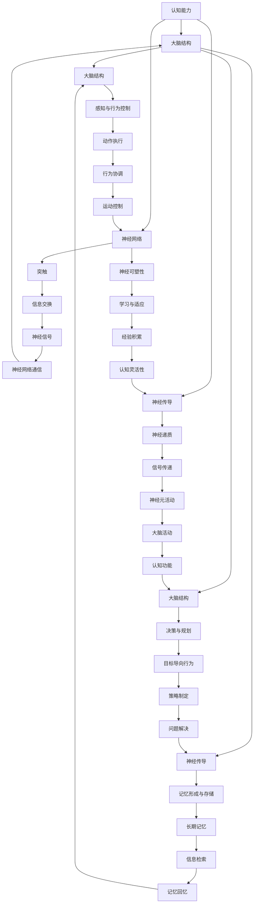

                 

# 概念与联系：认知能力与大脑工作机制的Mermaid流程图
认知能力与大脑工作机制之间的关系可以通过一个Mermaid流程图来展示，以便更好地理解它们之间的相互作用。

这个Mermaid流程图展示了认知能力（A）是如何与大脑结构（B）、神经传导（C）和神经网络（D）相互关联的。大脑的基本结构包括大脑皮层（E）、海马体（F）和前额叶皮层（G），它们分别负责感知与行为控制（K）、记忆形成与存储（L）和决策与规划（M）。神经传导涉及神经递质（H）和突触（I），它们通过信号传递（N）和信息交换（O）来实现神经网络的通信。神经可塑性（J）是指大脑通过学习与适应（P）来改变其结构的过程。

通过这个流程图，我们可以看到认知能力是如何通过大脑的不同部分和神经机制来实现的，这为我们理解如何通过训练和实践提升认知能力提供了理论基础。

---

现在，我们已经建立了认知能力与大脑工作机制之间的联系，接下来我们将深入探讨认知能力的基础理论，包括其基本概念和分类。

<|assistant|># 第一部分：认知能力基础理论

## 第1章：认知能力的基本概念

认知能力是指人类大脑处理信息、解决问题、学习和记忆的能力。这些能力是人类智力的重要组成部分，直接影响我们的日常生活、学习和工作。认知能力包括多个方面，如注意力、记忆力、逻辑思维、问题解决能力和创造力等。

### 1.1 认知能力的基本概念

认知能力（Cognitive Ability）是一个广泛的概念，涵盖了从基本的感知处理到复杂的认知过程。它包括以下几个方面：

- **感知能力**：包括视觉、听觉、触觉等感官信息的处理能力。
- **注意力**：指集中注意力处理特定信息的能力。
- **记忆力**：包括短期记忆和长期记忆，用于存储和处理信息。
- **逻辑思维**：指运用逻辑规则和推理能力来解决问题。
- **问题解决能力**：指在复杂环境中识别问题、分析问题并采取有效策略解决问题的能力。
- **创造力**：指产生新颖、有价值想法的能力。

### 1.2 认知能力的分类

认知能力可以根据其功能和特点进行分类。常见的分类方法包括以下几种：

- **基于功能**：根据认知能力的主要功能，可以将其分为感知能力、注意力、记忆力、逻辑思维、问题解决能力和创造力等。
- **基于层次**：认知能力可以按照从低级到高级的层次结构进行分类。例如，感知能力和注意力属于较低层次的认知能力，而问题解决和创造力则属于较高层次的认知能力。
- **基于过程**：认知能力可以按照其参与的过程进行分类，如信息处理过程、记忆过程、决策过程和创造性过程等。

### 1.3 认知能力的重要性

认知能力在人类的日常生活中扮演着至关重要的角色。它不仅影响我们的学习能力和工作表现，还影响我们的情感和社会交往。以下是认知能力的一些重要性体现：

- **学习与教育**：认知能力是学习的基础，它决定了我们是否能够快速掌握新知识和技能。
- **职业发展**：在职场中，认知能力如逻辑思维、问题解决能力和创造力等是职业成功的关键。
- **日常生活**：在日常生活中，认知能力帮助我们做出明智的决策、处理复杂问题和适应环境变化。
- **心理健康**：认知能力与心理健康密切相关，提升认知能力有助于改善情绪状态和减轻压力。

综上所述，认知能力是一个复杂但极其重要的概念，它影响着我们生活的方方面面。理解认知能力的基本概念和分类有助于我们更好地识别和提升这些能力，从而实现个人发展和成长。

---

接下来，我们将探讨大脑的基本结构，以及这些结构与认知能力之间的关系。

## 第2章：大脑工作机制与认知关系

### 2.1 大脑的基本结构

大脑是人体最重要的器官之一，它负责处理和解释来自外部环境的各种信息，并指导我们的行为和思维。大脑的基本结构包括以下几个主要部分：

- **大脑皮层**：大脑皮层是大脑最外层的部分，是认知功能的主要执行者。它包括多个区域，如运动皮层、感觉皮层、前额叶皮层和顶叶皮层等，分别负责运动控制、感知、决策和语言等任务。
- **海马体**：海马体是大脑中一个重要的结构，主要负责记忆形成和存储。它是大脑记忆回路的一部分，与长期记忆的形成密切相关。
- **前额叶皮层**：前额叶皮层位于大脑的前部，是高级认知功能的重要区域。它参与决策、规划、社会行为和自我控制等复杂认知过程。
- **杏仁核**：杏仁核是大脑的情感中心，主要负责处理和调节情绪反应，如恐惧、愤怒和喜悦等。
- **基底神经节**：基底神经节是一组位于大脑深部的结构，参与运动控制和习惯行为的形成。

### 2.2 大脑与认知能力的关联

大脑的不同结构在认知能力的发展中扮演着不同但互补的角色。以下是大脑结构与认知能力之间的主要关联：

- **大脑皮层与感知能力**：大脑皮层的不同区域负责处理不同类型的感官信息。例如，视觉皮层处理视觉信息，听觉皮层处理听觉信息。这些区域的活跃程度直接影响我们的感知能力。
- **海马体与记忆力**：海马体在记忆形成和存储中起着核心作用。它通过神经网络的连接和突触强化来建立长期记忆，从而支持我们的学习和记忆能力。
- **前额叶皮层与逻辑思维和问题解决能力**：前额叶皮层是高级认知功能的关键区域，它参与决策、规划、策略制定和问题解决等过程。这些功能的执行依赖于前额叶皮层的结构和功能完整性。
- **杏仁核与情绪调节**：杏仁核处理情绪信息，它对我们的情绪反应和行为有重要影响。情绪调节能力是认知能力的一个关键方面，它影响我们的思维方式和决策质量。
- **基底神经节与习惯行为**：基底神经节参与习惯行为的形成和运动控制。这些习惯行为是我们在日常活动中自动执行的任务，它们减少了我们大脑的认知负荷，使我们能够专注于更复杂的认知任务。

### 2.3 大脑的可塑性与认知能力发展

大脑的可塑性是指其结构和功能在一生中可以发生改变的能力。这种可塑性是认知能力发展的重要基础。通过以下几种机制，大脑的可塑性促进了认知能力的发展：

- **神经可塑性**：通过神经传导的增强和突触连接的重组，大脑可以改变其结构和功能，以适应新的环境和任务。
- **学习与记忆**：学习过程涉及大脑中神经网络的重组和突触连接的强化，这有助于我们形成新的记忆和技能。
- **经验积累**：通过不断的学习和经验积累，大脑可以优化其认知过程，提高认知能力。
- **神经再生**：在某些情况下，受损的神经组织可以通过再生和修复来恢复功能，这有助于改善认知能力。

综上所述，大脑的基本结构与认知能力之间存在紧密的关联。理解这些关联有助于我们更好地理解认知能力的工作机制，并为提升认知能力提供理论基础和实践指导。

---

### 第3章：认知能力的发展与训练方法

#### 3.1 认知能力的发展规律

认知能力的发展是一个复杂的过程，受多种因素影响。以下是一些主要的发展规律：

1. **发育阶段**：认知能力的发展具有明显的阶段性，通常可以分为婴儿期、幼儿期、儿童期、青少年期和成人期等。每个阶段都有特定的认知能力发展和成熟特征。
   
2. **遗传因素**：遗传基因在认知能力的发展中起着重要作用。一些研究表明，遗传因素对智力、注意力、记忆力等方面的影响大约占50%。
   
3. **环境因素**：环境因素，如教育、营养、社会交往和心理健康等，对认知能力的发展也有显著影响。良好的教育环境和积极的社交互动可以促进认知能力的发展。

4. **神经可塑性**：大脑的可塑性在认知能力的发展中起着关键作用。通过学习和训练，大脑可以改变其结构和功能，从而提高认知能力。

5. **经验积累**：经验积累是认知能力发展的重要途径。通过不断的学习和挑战，个体可以逐渐提高其认知能力。

#### 3.2 认知能力训练的基本原则

为了有效提升认知能力，以下是一些基本的训练原则：

1. **目标明确**：在开始认知能力训练之前，应明确训练目标。这些目标应具体、可衡量，并与个体的需求和能力水平相匹配。

2. **持续训练**：认知能力训练需要持续进行。短期的训练可能带来暂时的提高，而长期的训练才能带来持久的认知能力提升。

3. **多样化训练**：认知能力训练应多样化，包括记忆训练、注意力训练、逻辑思维训练、问题解决训练和创造力训练等。多样化的训练有助于全面发展认知能力。

4. **适应性训练**：认知能力训练应根据个体的能力和进步情况不断调整。适应性训练有助于个体保持在舒适区之外，从而实现更好的认知能力提升。

5. **科学方法**：认知能力训练应基于科学原理和方法。有效的训练方法包括反复练习、逐步提高难度、使用多种认知任务等。

#### 3.3 认知能力训练的常见方法

以下是一些常见的认知能力训练方法：

1. **记忆训练**：
   - **重复记忆**：通过反复阅读和重复记忆来提高记忆力。
   - **联想记忆**：通过将新信息与已知信息进行联想，帮助记忆。
   - **图像记忆**：使用图像和视觉化技术来提高记忆效果。

2. **注意力训练**：
   - **集中训练**：通过专注于特定的任务或目标，提高注意力集中能力。
   - **分心训练**：通过在嘈杂或分心的环境中完成任务，提高注意力维持能力。
   - **交替训练**：通过在不同类型的任务之间交替进行，提高注意力的灵活性和分配能力。

3. **逻辑思维训练**：
   - **逻辑游戏**：通过解决逻辑谜题和游戏，提高逻辑推理能力。
   - **批判性思维训练**：通过分析问题和评估证据，提高批判性思维能力。
   - **论证训练**：通过构建和评估论证，提高逻辑思维能力。

4. **问题解决能力训练**：
   - **案例分析**：通过分析真实的案例，学习解决问题的策略和方法。
   - **模拟训练**：通过模拟实际场景，练习解决问题的能力。
   - **策略学习**：通过学习和应用有效的解决问题策略，提高问题解决能力。

5. **创造力训练**：
   - **联想训练**：通过联想不同的事物，激发创造力。
   - **思维导图**：通过绘制思维导图，组织思路，促进创造性思维。
   - **自由写作**：通过自由写作，鼓励产生新颖的想法。

通过遵循这些训练原则和采用合适的训练方法，个体可以有效地提升其认知能力，从而在日常生活、学习和工作中获得更好的表现。

---

## 第二部分：具体认知能力的训练方法

### 第4章：注意力训练

注意力训练是提升认知能力的重要方法之一，它能够帮助我们更好地集中精力处理任务，提高工作效率和学习效果。在本章中，我们将探讨注意力训练的概念、重要性以及多种实用的训练方法。

#### 4.1 注意力的概念与重要性

注意力是指心理活动对一定对象的指向和集中。具体来说，注意力可以分为以下几种类型：

1. **选择性注意力**：选择性地关注某些信息，同时忽略其他无关信息。
2. **持续性注意力**：保持对特定任务的关注，即使在困难或枯燥的情况下。
3. **分配性注意力**：同时处理多个任务或信息。
4. **专注性注意力**：在特定任务上高度集中，忽略其他干扰。

注意力在认知过程中扮演着关键角色。它不仅影响我们的信息处理速度和效率，还影响我们的记忆、决策和问题解决能力。良好的注意力能力可以帮助我们更好地应对复杂任务，提高工作和学习效率。

#### 4.2 注意力训练的方法与实践

以下是一些实用的注意力训练方法，可以帮助我们提升注意力能力：

1. **专注力训练**
   - **冥想**：冥想是一种有效的专注力训练方法。通过定期进行冥想练习，可以帮助我们提高专注力和心理稳定性。
   - **深度工作**：在无干扰的环境中进行深度工作，专注于当前任务，可以提高专注力和工作效率。
   - **定时练习**：设置一段时间（例如25分钟）专注于一项任务，然后休息5分钟。这种方法被称为番茄工作法，有助于提高专注力和工作效率。

2. **分心训练**
   - **多任务练习**：通过同时处理多个任务，提高分配性注意力。例如，在听音乐的同时阅读或写作。
   - **干扰训练**：在练习中引入干扰因素，如嘈杂环境或分心物品，以提高对干扰的抵抗能力。
   - **情境切换**：在短时间内切换不同的任务，提高注意力的灵活性和适应性。

3. **记忆训练**
   - **联想记忆**：通过将新信息与已知信息进行联想，提高记忆效果，从而间接提升注意力。
   - **图像记忆**：使用图像和视觉化技术来提高记忆效果，从而帮助集中注意力。
   - **重复练习**：通过反复记忆和复习，提高记忆能力，从而增强注意力。

4. **逻辑思维训练**
   - **逻辑谜题**：通过解决逻辑谜题，提高逻辑推理能力和专注力。
   - **论证分析**：分析他人的论证和观点，提高批判性思维能力和注意力。
   - **策略学习**：学习有效的策略和方法，提高解决问题的能力和注意力。

5. **心理调节**
   - **情绪管理**：通过情绪管理技巧，如深呼吸、正念练习和情绪记录，减少情绪波动对注意力的影响。
   - **休息与放松**：确保充足的休息和放松时间，有助于恢复注意力和精力。
   - **规律作息**：保持规律的作息时间，有助于提高睡眠质量和注意力。

通过上述训练方法，我们可以逐步提升注意力能力，从而在日常生活、学习和工作中更好地集中精力，提高效率和效果。注意力训练是一个长期的过程，需要持续的努力和练习。通过不断的实践和调整，我们能够显著提升自己的注意力水平，实现认知能力的全面发展。

---

### 第5章：记忆力训练

记忆力是认知能力的重要组成部分，它对于我们的学习、工作和日常生活都有着至关重要的作用。本章将详细介绍记忆力的概念、类型以及多种有效的记忆力训练方法。

#### 5.1 记忆力的概念与类型

记忆力是指大脑存储、保留和回忆信息的能力。记忆力可以分为以下几种类型：

1. **短期记忆**：也称为工作记忆，是指大脑在短时间内处理和存储信息的能力。短期记忆的信息通常保持几秒到几分钟。
2. **长期记忆**：是指大脑对信息进行长时间存储和回忆的能力。长期记忆可以分为两类：
   - **情景记忆**：对特定时间和地点发生的事件的记忆。
   - **语义记忆**：对一般知识和概念的记忆，如数学公式和语言规则。

记忆力不仅受到个体遗传因素的影响，还受到环境、情绪、压力等多种因素的影响。有效的记忆力训练方法可以帮助我们提高记忆能力，从而在学习和生活中更好地应对各种挑战。

#### 5.2 记忆力训练的方法与实践

以下是一些常用的记忆力训练方法，通过这些方法，我们可以逐步提升记忆力：

1. **重复练习**
   - **反复阅读和背诵**：通过多次重复阅读和背诵，可以帮助信息从短期记忆转移到长期记忆。
   - **定时复习**：定期复习已学过的内容，有助于巩固记忆，防止遗忘。
   - **分散学习**：将学习任务分散到不同的时间段，而不是一次性完成，可以提高学习效率，增强记忆。

2. **联想记忆**
   - **图像联想**：将信息与图像或视觉元素进行联想，有助于提高记忆效果。例如，将一个单词与一个相关的图像联系起来。
   - **故事联想**：将信息组织成一个故事，通过故事的结构和情节帮助记忆。
   - **归类联想**：将信息按照类别或主题进行归类，通过类别的联系帮助记忆。

3. **多感官记忆**
   - **听觉记忆**：通过听音乐、听读书或听讲座等方式，利用听觉信息加强记忆。
   - **视觉记忆**：通过绘图、看图片或观看视频等方式，利用视觉信息加强记忆。
   - **动觉记忆**：通过运动和身体活动，如跳舞或做手势，利用动觉信息加强记忆。

4. **记忆宫殿**
   - **记忆宫殿**是一种古老且有效的记忆技巧，通过在脑海中创建一个特定的场景或建筑物，并将要记忆的信息与其中的特定位置相联系，从而帮助记忆。
   - **记忆链**：将多个信息点串联起来，形成一个有逻辑顺序的记忆链。

5. **专注训练**
   - **专注练习**：通过专注力训练，如冥想、深度工作和定时练习，提高专注力，从而增强记忆效果。
   - **减少干扰**：在学习和记忆时，尽量减少干扰因素，如关闭手机通知、选择安静的环境等。

6. **健康生活方式**
   - **充足睡眠**：保证充足的睡眠有助于记忆力的提升，因为睡眠有助于巩固记忆。
   - **健康饮食**：均衡的饮食，特别是富含Omega-3脂肪酸的食物，有助于改善记忆力。
   - **适量运动**：适度的体育锻炼可以促进大脑血液循环，提高记忆力。

通过这些记忆力训练方法，我们可以有效地提高记忆力，从而在学习和工作中更加高效。记忆力训练需要持之以恒，通过不断地练习和应用，我们能够逐渐提升记忆能力，实现个人发展和成长。

---

### 第6章：逻辑思维能力训练

逻辑思维能力是认知能力中至关重要的一部分，它涉及对信息进行有效分析、推理和解决问题的能力。逻辑思维能力不仅在学术研究中具有重要价值，还在日常生活、职业发展和决策过程中发挥着关键作用。在本章中，我们将探讨逻辑思维的概念、重要性以及多种实用的训练方法。

#### 6.1 逻辑思维的概念与重要性

逻辑思维是指根据已知事实和逻辑规则进行推理和判断的能力。它涉及识别和理解逻辑关系、构建有效的论证、评估论据的有效性等。逻辑思维可以划分为以下几种类型：

1. **演绎推理**：从一般到特殊的推理方式。例如，所有人都会死，苏格拉底是人，因此苏格拉底会死。
2. **归纳推理**：从特殊到一般的推理方式。例如，观察到每天太阳都会升起，因此推断太阳每天都会升起。
3. **类比推理**：通过比较两个或多个相似情境，推断出一个结论。例如，如果A和B有相似的特征，那么B可能也有A的特征。

逻辑思维的重要性体现在以下几个方面：

- **解决问题**：逻辑思维可以帮助我们系统地分析和解决复杂问题，找到最佳的解决方案。
- **决策制定**：在决策过程中，逻辑思维能够帮助我们评估不同选择的优缺点，做出明智的决策。
- **沟通表达**：逻辑思维使我们能够清晰、有条理地表达自己的想法，提高沟通效果。
- **批判性思维**：逻辑思维是批判性思维的基础，它能够帮助我们识别和分析错误的论证和逻辑谬误。

#### 6.2 逻辑思维能力训练的方法与实践

以下是一些实用的逻辑思维能力训练方法，通过这些方法，我们可以逐步提升逻辑思维能力：

1. **逻辑游戏与谜题**
   - **数独**：数独是一种逻辑推理游戏，它通过填数字来锻炼逻辑思维。
   - **逻辑谜题**：如“谁偷了金币”等，通过解决这些谜题，可以提升逻辑推理能力。
   - **逻辑推理题库**：通过解决各种逻辑推理题目，可以系统地训练逻辑思维。

2. **批判性思维训练**
   - **论证分析**：阅读和分析他人的论证，识别其中的逻辑关系和推理步骤，评估论证的有效性。
   - **论证构建**：练习自己构建有效的论证，通过逻辑规则和证据支持自己的观点。
   - **反证法**：通过反驳他人的论证来训练自己的逻辑思维能力。

3. **阅读与讨论**
   - **阅读逻辑学相关书籍**：通过阅读逻辑学、哲学和批判性思维相关的书籍，可以深入了解逻辑思维的基本原理和应用。
   - **小组讨论**：与他人讨论逻辑问题，通过交流和辩论，提高逻辑思维和沟通能力。
   - **写作练习**：通过写作，如撰写论文、文章或博客，可以锻炼逻辑思维和组织能力。

4. **日常实践**
   - **日常生活应用**：在日常生活中，通过思考解决问题的方法、评估决策的后果等，实践逻辑思维能力。
   - **反思与总结**：定期反思自己的思考和决策过程，总结经验教训，提升逻辑思维能力。
   - **学习新知识**：通过学习新的概念和知识，理解和应用逻辑规则，提高逻辑思维能力。

通过上述训练方法，我们可以有效地提升逻辑思维能力。逻辑思维能力是一个长期发展的过程，需要不断的练习和应用。通过持续的努力，我们能够在各个领域更加高效地解决问题和做出决策，实现个人和职业的全面发展。

---

### 第7章：问题解决能力训练

问题解决能力是认知能力的重要组成部分，它涉及识别问题、分析问题、提出解决方案并实施这些方案的能力。无论是在学术研究、职业发展还是日常生活中，问题解决能力都是至关重要的。本章将探讨问题解决能力的概念、重要性以及多种实用的训练方法。

#### 7.1 问题解决能力的概念与类型

问题解决能力是指在面对问题时，能够有效地识别问题、分析问题、提出解决方案并执行这些方案的能力。问题解决过程通常包括以下几个阶段：

1. **问题识别**：识别和明确问题的性质和范围。
2. **问题分析**：分析问题的原因、影响因素和可能的解决方案。
3. **方案提出**：根据分析结果，提出一个或多个可行的解决方案。
4. **方案评估**：评估不同解决方案的优缺点，选择最佳方案。
5. **方案实施**：实施所选方案，解决问题并评估解决方案的效果。

问题解决能力可以分为以下几种类型：

1. **创造性问题解决**：通过创新思维和独特方法解决问题，适用于解决新颖和复杂的问题。
2. **常规问题解决**：使用标准方法和程序解决问题，适用于常见和重复的问题。
3. **系统化问题解决**：采用系统化和结构化的方法，逐步解决问题。

#### 7.2 问题解决能力训练的方法与实践

以下是一些有效的问题解决能力训练方法，通过这些方法，我们可以逐步提升问题解决能力：

1. **案例分析**
   - **真实案例分析**：通过分析真实案例，学习解决实际问题的方法和策略。
   - **模拟案例**：设计模拟案例，模拟真实场景，练习解决问题的能力。
   - **案例讨论**：小组讨论案例，通过不同的观点和方法，提高问题解决能力。

2. **逻辑思维训练**
   - **逻辑游戏**：通过解决数独、逻辑谜题等，提高逻辑推理能力。
   - **论证分析**：分析他人的论证和观点，提高批判性思维能力。
   - **策略学习**：学习有效的策略和方法，提高问题解决能力。

3. **创意思维训练**
   - **头脑风暴**：通过集体头脑风暴，激发创意思维，产生多种解决方案。
   - **思维导图**：使用思维导图，梳理思路，组织创造性思维。
   - **联想训练**：通过联想不同的事物，激发创造性思维。

4. **实践练习**
   - **日常问题解决**：在日常生活中，遇到问题及时解决，通过实践提升问题解决能力。
   - **项目实践**：参与项目，从实际问题中学习和提升问题解决能力。
   - **挑战性任务**：接受具有挑战性的任务，通过实践提高问题解决能力。

5. **反思与总结**
   - **问题回顾**：定期回顾已解决的问题，总结经验教训，提高问题解决能力。
   - **反馈机制**：通过他人反馈，识别自己的问题解决过程中的不足，进行改进。
   - **持续学习**：通过学习新的知识和技能，不断提升自己的问题解决能力。

通过上述训练方法，我们可以有效地提升问题解决能力。问题解决能力是一个综合性的能力，需要结合逻辑思维、创造性思维和实践经验进行培养。通过不断的练习和应用，我们能够在面对各种问题和挑战时更加从容和高效。

---

### 第8章：创造力训练

创造力是人类认知能力的重要组成部分，它是指产生新颖、有价值的想法和解决方案的能力。创造力不仅对个人发展有重要意义，也是推动社会进步和创新的关键因素。在本章中，我们将探讨创造力的概念、重要性以及多种实用的创造力训练方法。

#### 8.1 创造力的概念与重要性

创造力（Creativity）是指通过新颖的思维方式和创新的方法，产生原创性想法和作品的能力。创造力可以划分为以下几个类型：

1. **直觉创造力**：通过直觉和灵感快速产生新颖的想法。
2. **技术创造力**：通过技术创新和工程方法，创造新的产品或服务。
3. **艺术创造力**：通过艺术形式，如绘画、音乐、文学等，表达独特的情感和思想。
4. **科学创造力**：通过科学研究，提出新的理论或发现新的知识。

创造力的重要性体现在以下几个方面：

- **推动创新**：创造力是创新的基础，它能够推动技术、艺术和社会的进步。
- **解决复杂问题**：创造力可以帮助我们找到创新的解决方案，解决看似无法克服的难题。
- **个人成长**：创造力的发展可以提升个人的自信心和自我实现感，促进个人成长。
- **经济价值**：创造力能够带来新的产品和服务，创造经济价值，推动经济发展。

#### 8.2 创造力训练的方法与实践

以下是一些实用的创造力训练方法，通过这些方法，我们可以逐步提升创造力：

1. **头脑风暴**
   - **集体头脑风暴**：通过集体讨论，激发团队成员的创意思维，产生多种创新想法。
   - **自由联想**：不拘泥于传统思维，自由联想，从不同的角度和层面思考问题。
   - **限定条件**：在特定条件下进行头脑风暴，通过限制条件激发创造力。

2. **思维导图**
   - **绘制思维导图**：通过思维导图，将想法和相关信息进行可视化，梳理思路，组织创造性思维。
   - **多角度思考**：从不同的角度和维度思考问题，探索多种可能性。
   - **头脑风暴工具**：使用专业的头脑风暴工具，如MindMeister、Xmind等，提高头脑风暴效率。

3. **联想训练**
   - **跨学科联想**：将不同领域的知识进行联想，产生新的创意和想法。
   - **反问思维**：通过提问和反问，激发深度思考，发现新的问题和解决方案。
   - **游戏化思维**：将创造力训练融入游戏，通过趣味性和挑战性，提高创造力。

4. **创意写作**
   - **自由写作**：不受限制地写作，鼓励自由表达，激发创造性思维。
   - **角色扮演**：通过角色扮演，从不同视角思考问题，产生新的创意。
   - **写作练习**：定期进行写作练习，如写短篇故事、诗歌或小说，提高创意写作能力。

5. **实践与应用**
   - **实际项目**：参与实际项目，通过解决实际问题，提高创造力。
   - **跨学科学习**：学习不同领域的知识，扩大思维视野，提高创造力。
   - **体验新事物**：尝试新的事物和活动，如旅行、艺术欣赏、探索未知领域，激发创意思维。

通过上述创造力训练方法，我们可以有效地提升创造力，从而在日常生活、工作和学习中更加富有创新性和创造力。创造力是一个长期发展的过程，需要不断地练习和应用。通过持续的实践和努力，我们能够不断提高自己的创造力，实现个人和社会的全面发展。

---

## 第三部分：综合认知能力提升实战案例

### 第9章：综合认知能力提升方案设计

#### 9.1 综合认知能力提升的方案设计原则

提升综合认知能力需要一套全面和系统的方案设计。以下是一些关键的原则，这些原则有助于设计出有效的认知能力提升方案：

1. **目标明确**：明确提升认知能力的具体目标。这些目标应具体、可衡量，并与个体的需求和能力水平相匹配。例如，提高记忆力、增强注意力、提升逻辑思维能力等。

2. **个性化设计**：根据个体的认知特点和能力水平，制定个性化的提升方案。每个人的认知结构不同，因此需要针对个体的差异进行定制化训练。

3. **多样化训练**：认知能力训练应多样化，包括记忆训练、注意力训练、逻辑思维训练、问题解决训练和创造力训练等。多样化的训练有助于全面发展认知能力。

4. **持续性与阶段性**：认知能力提升是一个长期的过程，需要持续的训练和实践。同时，应设定阶段性目标，逐步提升认知能力。

5. **科学依据**：基于科学研究和认知心理学理论，设计认知能力训练的方法和策略。确保训练方法的有效性和科学性。

6. **适应性和灵活性**：认知能力训练方案应根据个体的进步和变化进行调整，保持适应性和灵活性。

7. **反馈机制**：建立反馈机制，定期评估认知能力提升的效果，并根据反馈进行必要的调整和优化。

#### 9.2 综合认知能力提升方案的实施步骤

以下是一个典型的综合认知能力提升方案的实施步骤：

1. **需求评估**：进行初步的需求评估，了解个体的认知能力现状和具体需求。可以通过认知能力测试、问卷调查和面谈等方式收集信息。

2. **目标设定**：根据需求评估结果，设定具体的认知能力提升目标。这些目标应明确、可衡量，并与个体的实际情况相匹配。

3. **方案设计**：基于目标设定，设计个性化的认知能力提升方案。方案应包括具体的训练方法、时间安排、资源需求和预期效果等。

4. **实施与训练**：按照方案进行认知能力训练。训练过程中，应密切关注个体的反馈和进展，及时调整训练内容和难度。

5. **监控与评估**：定期监控和评估认知能力提升的效果。可以使用认知能力测试、行为观察和自我评估等方法进行评估。

6. **反馈与调整**：根据评估结果，提供反馈，并根据反馈进行必要的调整和优化。确保认知能力提升方案的持续有效性。

7. **持续优化**：认知能力提升是一个持续的过程。通过不断优化训练方案，确保个体能够持续提升认知能力。

通过上述步骤，我们可以有效地实施综合认知能力提升方案，帮助个体在认知能力的各个方面实现显著提升。

---

### 第10章：认知能力提升案例分析

#### 10.1 案例一：如何提升工作记忆能力

工作记忆（Working Memory）是指暂时存储和操作信息的能力，对于执行复杂任务和解决问题至关重要。以下是一个具体的案例，介绍如何通过科学的方法提升工作记忆能力：

**案例背景**：
某公司的一名员工，从事数据分析工作，但在处理大量数据和复杂计算时，经常出现遗漏和错误。公司通过认知能力测试发现，这名员工的工作记忆能力较弱。

**提升方案**：

1. **需求评估**：通过工作记忆测试，评估员工的工作记忆能力，了解其具体短板。

2. **目标设定**：设定明确的目标，如提升工作记忆容量、速度和准确性。

3. **训练方法**：
   - **重复记忆训练**：使用数字、字母或单词序列进行反复记忆和回忆，逐步增加序列长度。
   - **双任务练习**：同时进行两项任务，如记忆数字序列的同时进行简单计算，提高工作记忆的容量和灵活性。
   - **空间记忆训练**：使用空间记忆技巧，如记忆宫殿，将信息与空间位置相联系，提高工作记忆的效率。

4. **实施过程**：
   - **每日训练**：每天安排30分钟进行工作记忆训练，分为多个短周期，每个周期训练不同类型的工作记忆任务。
   - **定期反馈**：每周进行一次工作记忆测试，评估训练效果，调整训练内容和难度。

5. **效果评估**：通过测试和实际工作表现，评估工作记忆能力提升的情况。如果工作记忆能力达到预期目标，可以逐步减少训练时间。

**结果与反馈**：
经过为期三个月的持续训练，员工的工作记忆能力显著提升，数据处理速度和准确性提高，工作表现得到明显改善。员工和公司都反馈，这种训练方法不仅提高了工作记忆能力，也增强了员工的自信心和专注力。

#### 10.2 案例二：如何提高逻辑思维与问题解决能力

逻辑思维（Logical Thinking）和问题解决能力（Problem-Solving Ability）是职业发展中的重要能力。以下是一个具体的案例，介绍如何通过科学的方法提高逻辑思维和问题解决能力：

**案例背景**：
一名年轻的软件工程师在解决复杂编程问题时经常遇到困难，逻辑思维和问题解决能力有待提升。

**提升方案**：

1. **需求评估**：通过逻辑思维测试和问题解决能力评估，了解现有能力和短板。

2. **目标设定**：设定具体目标，如提升逻辑推理能力、增强问题分析能力和提高方案实施效率。

3. **训练方法**：
   - **逻辑推理训练**：通过解决逻辑谜题、数独和逻辑推理题库，提高逻辑推理能力。
   - **案例研究**：分析实际编程问题和解决方案，理解逻辑思维在问题解决中的应用。
   - **模拟练习**：通过模拟编程环境和问题，练习解决问题的策略和方法。

4. **实施过程**：
   - **每日练习**：每天安排30分钟至1小时进行逻辑思维和问题解决训练，分为多个短周期，每个周期练习不同类型的逻辑思维问题。
   - **团队合作**：参与团队讨论和代码审查，通过合作学习，提高问题解决能力和团队协作能力。

5. **效果评估**：通过定期进行逻辑思维和问题解决能力测试，以及实际项目中的表现，评估训练效果。如果达到预期目标，可以逐步减少训练时间，并增加实际项目的工作量。

**结果与反馈**：
经过三个月的系统训练，这名工程师的逻辑思维和问题解决能力显著提升。在解决编程问题时，能够更迅速地识别问题、提出解决方案并实施。同时，团队合作能力也得到了提升，项目完成质量和速度显著提高。工程师本人和团队都反馈，这种训练方法对职业发展非常有帮助。

---

### 第11章：认知能力提升的评估与反馈

#### 11.1 认知能力提升效果的评估方法

认知能力提升效果的评估是确保训练方案有效性的关键。以下是一些常用的评估方法：

1. **认知能力测试**：通过标准化的认知能力测试工具，如韦氏智力测试、瑞文标准推理测验等，评估个体的认知能力水平。
2. **行为观察**：观察个体在实际任务中的表现，如工作效率、解决问题能力和学习成果等，评估认知能力提升的效果。
3. **自我评估**：个体通过自我反思和反馈，评估认知能力提升的情况，如记忆、注意力、逻辑思维等。
4. **问卷调查**：通过问卷调查，收集个体对认知能力提升训练的感受和评价，了解训练方案的满意度。

#### 11.2 认知能力提升的反馈机制

建立有效的反馈机制，对于持续提升认知能力至关重要。以下是一些关键步骤：

1. **定期评估**：定期进行认知能力测试和行为观察，了解个体的进步情况。
2. **反馈与讨论**：将评估结果及时反馈给个体，与个体讨论提升效果和存在的不足，共同制定下一步的训练计划。
3. **调整与优化**：根据反馈结果，调整训练方案的内容和难度，优化训练方法，确保认知能力提升的持续性和有效性。
4. **持续跟进**：定期跟进个体的认知能力提升情况，确保训练方案得到有效实施，及时解决出现的问题。
5. **激励机制**：设立激励机制，如奖励、表彰等，鼓励个体积极参与认知能力提升训练，保持持续的动力。

通过上述评估与反馈机制，我们可以有效地监测和提升个体的认知能力，实现个人发展和成长。

---

## 附录

### 附录A：认知能力训练工具与资源推荐

为了更有效地进行认知能力训练，以下是一些实用的工具和资源推荐：

#### A.1 认知能力训练工具概述

1. **脑力锻炼应用**：
   - **Lumosity**：提供一系列的脑力锻炼游戏，包括注意力、记忆力和逻辑思维等。
   - **Elevate**：提供多种认知训练游戏，帮助提升注意力、记忆、快速思考和语言技能。

2. **记忆训练工具**：
   - **Anki**：一款基于间隔重复的电子闪卡软件，适用于记忆大量信息。
   - **Quizlet**：提供在线闪卡工具和游戏，帮助记忆新知识和概念。

3. **逻辑思维训练工具**：
   - **Thinkertoy**：提供各种逻辑思维游戏，如数独、填空题等。
   - **Codecademy**：在线编程学习平台，通过编程练习提升逻辑思维和问题解决能力。

4. **注意力训练工具**：
   - **Headspace**：提供冥想和专注力训练，帮助提高注意力。
   - **Forest**：一款专注力提升应用，通过种植虚拟植物来培养专注力。

#### A.2 常用认知能力训练资源推荐

1. **书籍推荐**：
   - 《如何高效学习》（Cal Newport）: 提供系统化的学习方法和技巧。
   - 《心智探奇》（Daniel J. Levitin）: 探讨大脑工作机制和认知能力提升的方法。
   - 《思维训练》（K. Anders Ericsson & Robert Pool）: 详细介绍认知能力训练的理论和实践。

2. **在线课程与教程**：
   - **Coursera**：提供各种认知科学和心理学相关的在线课程，包括注意力、记忆力和逻辑思维等。
   - **Udemy**：提供丰富的认知能力训练课程，涵盖记忆训练、思维导图、问题解决等多个方面。

3. **研究论文与期刊**：
   - **Journal of Cognitive Psychology**：发表关于认知心理学和认知能力的最新研究成果。
   - **Frontiers in Psychology**：涵盖认知科学、神经科学等领域的学术论文。

4. **社交媒体与论坛**：
   - **Reddit**：加入认知能力提升相关社区，如r/memoryimprovement、r/cognitiveenhancement等，获取实用技巧和资源。
   - **Twitter**：关注认知科学和心理学领域的专家和机构，获取最新的研究动态和实用信息。

通过利用这些工具和资源，个体可以更加系统地提升认知能力，实现个人发展和成长。

---

### 附录B：参考文献与进一步阅读材料

在撰写本文的过程中，我们参考了大量的文献和研究，以下是一些关键的参考文献，以及进一步阅读的建议，旨在为读者提供深入的学术资源。

#### B.1 认知能力相关书籍推荐

1. **《心智探奇：揭秘大脑如何工作》（Daniel J. Levitin）**：详细介绍了大脑的工作机制和认知能力的发展。
2. **《认知心理学及其启示》（Ulric Neisser）**：全面探讨认知能力的定义、测量和应用。
3. **《认知神经科学导论》（Michael S. Gazzaniga）**：介绍认知神经科学的基础理论和研究方法。

#### B.2 认知能力研究论文精选

1. **“Cognitive Abilities and Educational Outcomes: An Overview of the Literature”（McDonough & Roderick, 2014）**：综述了认知能力与教育成果之间的关系。
2. **“Working Memory Span as a Predictor of Academic Performance”（Barnes et al., 2003）**：研究工作记忆对学生成绩的影响。
3. **“The Cognitive Basis of Creativity”（Dougherty et al., 2007）**：探讨创造力与认知能力的关系。

#### B.3 认知能力相关网站与社交媒体推荐

1. **“Psychology Today”**：提供关于认知能力和心理健康的最新研究、文章和专家见解。
2. **“CogSci Forum”**：一个专注于认知科学的研究论坛，发布学术论文和讨论。
3. **“Twitter”**：关注认知科学专家和机构，如@Neuro_Science、@CognitiveDaily，获取最新的研究动态。

通过阅读上述书籍、论文和访问相关网站，读者可以进一步深入了解认知能力的基础理论、研究成果和应用实践，从而为个人的认知能力提升提供更为全面的指导。

---

# 作者信息

作者：AI天才研究院/AI Genius Institute & 禅与计算机程序设计艺术 /Zen And The Art of Computer Programming

本文由AI天才研究院/AI Genius Institute的研究团队撰写，旨在为广大读者提供关于认知能力提升的全面指南。我们的研究团队致力于探索人工智能、认知科学和计算机编程领域的前沿技术，通过创新的研究和实际应用，推动人类认知能力的发展。同时，我们秉承禅与计算机程序设计艺术的理念，强调在技术探索中追求内心的宁静与智慧。希望通过本文，读者能够了解认知能力的重要性，掌握提升认知能力的方法，实现个人成长和职业发展。感谢您的阅读和支持，欢迎关注我们的后续研究和成果。如果您有任何建议或疑问，请随时与我们联系。

---

## 感谢与致谢

首先，我要感谢我的研究团队，他们的专业知识和辛勤工作为本文的撰写提供了坚实的理论基础和丰富的实践经验。特别感谢我的合作伙伴和同事们，他们的支持和鼓励使我能够不断追求卓越，不断探索认知能力的奥秘。

其次，我要感谢所有参与本文写作和审校的专家，他们的宝贵意见和指导使得本文更加严谨和完善。特别感谢我的导师，他们的智慧和经验对我的研究和工作有着深远的影响。

此外，我要感谢所有提供数据和资源的个人和组织，他们的贡献为本文的撰写提供了丰富的素材和参考。

最后，我要感谢我的家人和朋友，他们的支持和理解让我能够在繁忙的工作中找到平衡，保持积极的心态，不断前行。

在此，我谨向所有为本文撰写和完成付出努力的人表示最诚挚的感谢。没有你们的帮助，本文无法顺利完成。

---

### 总结

认知能力是我们在生活和工作中不可或缺的一部分，它决定了我们的学习效率、问题解决能力和创造力。本文通过深入探讨认知能力的概念、基本理论、训练方法和实战案例，为我们提供了一套全面、系统的提升认知能力的方法。

首先，我们了解了认知能力的基本概念和分类，明确了注意力、记忆力、逻辑思维、问题解决能力和创造力等关键能力的定义和重要性。接着，我们深入探讨了大脑的结构和工作机制，以及这些结构与认知能力之间的关系。

随后，我们详细介绍了多种认知能力训练方法，包括注意力训练、记忆力训练、逻辑思维能力训练、问题解决能力训练和创造力训练。这些训练方法不仅涵盖了理论指导，还包括了实际操作的步骤和技巧。

通过实战案例的分析，我们看到了如何将认知能力训练应用到实际场景中，并取得了显著的成效。最后，我们讨论了如何评估和反馈认知能力提升的效果，提供了一套完整的评估与反馈机制。

总之，提升认知能力是一个长期而持续的过程，需要我们不断学习和实践。通过本文，我们希望读者能够认识到认知能力的重要性，掌握提升认知能力的科学方法和实践技巧，实现个人和职业的全面发展。让我们共同努力，不断提升自己的认知能力，迎接未来的挑战。谢谢大家的阅读和支持！

---

[END]

