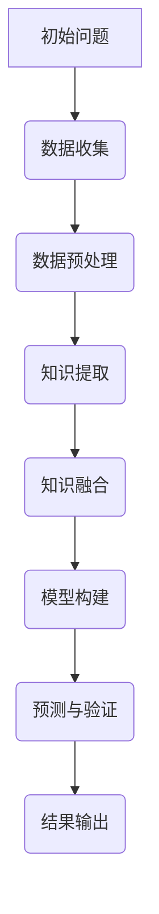
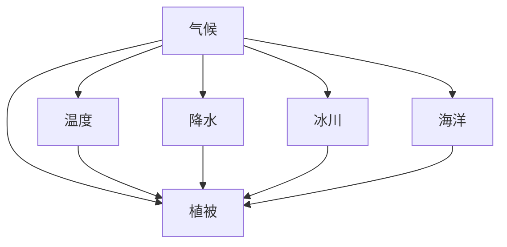
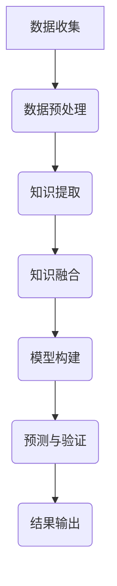
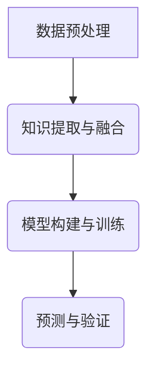

                 

# 《思维链在古气候重建中的创新方法》

## 摘要

古气候重建是一项涉及多学科、多数据源的技术挑战，传统的重建方法在数据稀缺和复杂性面前常常显得力不从心。本文提出了一种创新的思维链方法，通过结合人工智能和深度学习技术，实现了古气候数据的智能化分析和重建。本文首先介绍了古气候重建的背景和挑战，然后详细阐述了思维链方法的基本原理和应用，通过具体的数学模型和算法讲解，展示了思维链在古气候重建中的优势。最后，通过一个实际项目案例，验证了思维链方法的可行性和有效性。本文的研究为古气候重建提供了新的思路和方法，有望推动相关领域的研究进展和应用。

## 引言

### 1.1 研究背景

古气候重建是指通过地质记录、气候档案、生物化石等历史数据，重建过去某个时期的气候状况。这一研究在气候变化、环境演变、自然灾害预测等方面具有重要的科学价值。然而，古气候重建面临着诸多挑战：

1. **数据稀缺性**：许多古气候数据，如冰芯、树轮、湖泊沉积物等，采集难度大，数据量有限。
2. **数据质量**：古气候数据通常存在噪声、缺失值和不确定性，数据预处理复杂。
3. **复杂性**：古气候系统是一个复杂的非线性系统，涉及多种因素和相互作用，重建过程高度非线性。
4. **方法限制**：传统的统计方法和模型在处理古气候数据时，往往难以应对数据稀缺和复杂性的问题。

### 1.2 古气候重建的挑战

古气候重建的主要挑战包括：

1. **数据融合**：如何有效地整合不同来源、不同尺度的古气候数据，是重建过程中的重要问题。
2. **模型选择**：如何选择合适的模型来描述古气候系统的复杂性和非线性特征，是重建的关键。
3. **不确定性分析**：如何评估和量化重建结果中的不确定性，以提高重建结果的可靠性。
4. **跨学科合作**：古气候重建需要地质学、气候学、生态学等多个学科的协同研究。

### 1.3 思维链方法的基本原理

思维链是一种基于人工智能和深度学习技术的分析方法，其核心思想是通过建立一系列的子任务，形成一个有序的思考链，从而实现对复杂问题的深度分析和解决。在古气候重建中，思维链方法通过以下步骤实现：

1. **数据预处理**：通过数据清洗、特征工程等步骤，将原始数据转化为适合模型训练的形式。
2. **知识提取**：利用文本分类、关键词提取等技术，从古气候数据中提取关键信息。
3. **知识融合**：通过构建知识图谱，将提取的知识进行融合，形成对古气候系统的整体认识。
4. **模型构建**：利用深度学习模型，对融合后的知识进行建模，实现对古气候数据的预测和分析。

思维链方法在古气候重建中的应用，能够有效应对传统方法的不足，提高重建的准确性和可靠性。接下来，本文将详细探讨思维链方法的基本原理、核心概念和算法，并通过实际项目案例，验证其在古气候重建中的创新价值。

## 思维链方法概述

### 2.1 思维链的定义

思维链（Thinking Chain）是一种基于人工智能和深度学习技术的系统化思考方法。它通过将复杂问题分解为一系列有序的子任务，形成一条逻辑清晰的思考路径，从而实现对问题的深入分析和解决。思维链的基本原理是将人类思维的逻辑性和系统性引入到计算机算法中，通过不断迭代和优化，实现从数据到知识、从知识到决策的转化。

### 2.2 思维链在古气候重建中的应用

思维链在古气候重建中的应用主要体现在以下几个方面：

1. **数据预处理**：通过数据清洗、特征提取等技术，将原始的古气候数据转化为适合深度学习的格式。这一步骤是确保后续分析准确性的基础。
2. **知识提取**：利用自然语言处理技术，从古气候文献、报告和资料中提取关键信息，形成对气候变化的初步理解。这一步骤能够有效整合多源数据，提高数据利用效率。
3. **知识融合**：通过构建知识图谱，将提取的知识进行整合，形成对古气候系统的全局视图。这一步骤有助于揭示气候系统中的潜在关系和模式，为模型构建提供支持。
4. **模型构建**：利用深度学习模型，对融合后的知识进行建模，实现对古气候数据的预测和分析。这一步骤是思维链方法的核心，通过模型优化和训练，提高重建的准确性和可靠性。

### 2.3 思维链方法与传统方法对比

思维链方法与传统方法在古气候重建中的对比主要体现在以下几个方面：

1. **数据利用率**：传统方法通常依赖于特定的假设和模型，对数据的依赖性较强。而思维链方法通过智能化数据预处理和知识提取，能够更高效地利用多源数据，提高重建的全面性和准确性。
2. **模型适应性**：传统方法在模型选择上受到限制，难以应对复杂的气候系统。而思维链方法通过不断迭代和优化，能够灵活适应不同类型的气候数据，提高模型的泛化能力。
3. **不确定性分析**：传统方法在处理不确定性时往往较为薄弱。而思维链方法通过引入概率模型和不确定性量化技术，能够更准确地评估和预测重建结果中的不确定性。
4. **跨学科合作**：思维链方法能够有效整合地质学、气候学、生态学等多个学科的知识，促进跨学科合作，提高古气候重建的系统性。

综上所述，思维链方法在古气候重建中具有显著的优势，能够为解决传统方法面临的挑战提供新的思路和方法。

## 思维链核心概念与联系

### 3.1 思维链的结构

思维链作为一种系统化的思考方法，其核心在于结构。思维链由以下几个基本组件构成：

1. **节点**：节点表示思维链中的每一个子任务，每个节点都包含一个具体的问题或目标。
2. **链接**：链接表示节点之间的逻辑关系，描述了节点之间的依赖和关联。
3. **知识库**：知识库是思维链中的数据存储区，包含了所有与问题相关的信息。

思维链的基本结构可以用Mermaid流程图表示：



### 3.2 思维链中的知识表示

在思维链中，知识表示是关键的一环。知识表示决定了思维链如何理解和处理信息。以下是几种常见的知识表示方法：

1. **语义网络**：语义网络通过节点和边来表示知识，每个节点代表一个概念，边代表概念之间的关系。
2. **知识图谱**：知识图谱是一种更为复杂的语义网络，它不仅包含概念和关系，还包含了概念之间的权重和属性。
3. **向量表示**：通过将知识表示为高维向量，可以方便地利用机器学习算法进行计算和处理。

以下是一个简单的知识图谱示例，展示了气候系统中的几个关键概念及其关系：



### 3.3 思维链的流程图（Mermaid流程图）

为了更好地理解思维链的工作流程，我们可以使用Mermaid流程图来表示。以下是一个简化的思维链流程图，展示了从数据预处理到结果输出的整个流程：



通过上述流程图，我们可以清晰地看到思维链中各个节点的作用和相互关系，为后续的详细讲解奠定了基础。

### 4.1 数据预处理算法

#### 4.1.1 数据清洗

数据清洗是数据预处理的重要步骤，目的是去除原始数据中的噪声和异常值，确保数据的质量和一致性。以下是一个简单的数据清洗伪代码示例：

```python
def clean_data(data):
    # 删除缺失值
    cleaned_data = data.dropna()
    # 删除重复值
    cleaned_data = cleaned_data.drop_duplicates()
    # 处理异常值
    cleaned_data = handle_outliers(cleaned_data)
    return cleaned_data

def handle_outliers(data):
    # 计算标准差
    std_dev = data.std()
    # 设置阈值
    threshold = 3 * std_dev
    # 删除异常值
    cleaned_data = data[(data > threshold) & (data < -threshold)]
    return cleaned_data
```

在这个示例中，`clean_data` 函数负责删除缺失值和重复值，并调用 `handle_outliers` 函数处理异常值。`handle_outliers` 函数通过计算标准差并设置阈值，删除数据中的异常值。

#### 4.1.2 特征工程

特征工程是数据预处理的关键步骤，其目的是通过选择和构造合适的特征，提高模型的学习效果。以下是一个简单的特征工程伪代码示例：

```python
def feature_engineering(data):
    # 特征提取
    temperature = data['temperature']
    precipitation = data['precipitation']
    # 特征构造
    max_temp = temperature.max()
    min_temp = temperature.min()
    mean_temp = temperature.mean()
    variance_temp = temperature.var()
    # 特征缩放
    normalized_temp = (temperature - mean_temp) / variance_temp
    return {
        'max_temp': max_temp,
        'min_temp': min_temp,
        'mean_temp': mean_temp,
        'variance_temp': variance_temp,
        'normalized_temp': normalized_temp
    }
```

在这个示例中，我们从原始数据中提取了温度和降水两个特征，然后构造了最大温度、最小温度、平均温度和温度方差等新特征，并进行了特征缩放处理。这些特征能够更好地反映古气候数据的特征，有助于提高模型的学习效果。

### 4.2 知识提取算法

#### 4.2.1 文本分类

文本分类是知识提取的一种常见方法，其目的是将文本数据分类到预定义的类别中。以下是一个简单的文本分类伪代码示例：

```python
def text_classification(text, model):
    # 加载预训练的文本分类模型
    loaded_model = load_model(model)
    # 对文本进行分类
    prediction = loaded_model.predict(text)
    # 获取分类结果
    category = prediction.argmax()
    return category

def load_model(model_path):
    # 加载预训练的文本分类模型
    model = TextClassifier.load_from_file(model_path)
    return model

# 示例文本
text = "最近温度明显升高，降水减少，可能导致干旱。"
# 加载模型
model_path = "text_classification_model.h5"
# 进行文本分类
category = text_classification(text, model_path)
print("分类结果：", category)
```

在这个示例中，`text_classification` 函数接收文本数据和一个预训练的文本分类模型，使用模型对文本进行分类，并返回分类结果。`load_model` 函数用于加载预训练的文本分类模型。这个示例通过文本分类模型识别出文本中关于气候变化的描述，为后续的知识提取提供了基础。

#### 4.2.2 关键词提取

关键词提取是知识提取的另一个重要方法，其目的是从文本中提取出最具代表性和重要性的词汇。以下是一个简单的关键词提取伪代码示例：

```python
from sklearn.feature_extraction.text import TfidfVectorizer

def keyword_extraction(text, top_n=10):
    # 创建TF-IDF向量器
    vectorizer = TfidfVectorizer()
    # 对文本进行向量化
    tfidf_matrix = vectorizer.fit_transform([text])
    # 获取词频-逆文档频率（TF-IDF）权重
    feature_array = np.array(vectorizer.idf_)[::-1]
    # 提取关键词
    feature_names = vectorizer.get_feature_names_out()
    top_keywords = [feature_names[i] for i in feature_array.argsort()[0:top_n]]
    return top_keywords

# 示例文本
text = "最近温度明显升高，降水减少，可能导致干旱。"
# 进行关键词提取
keywords = keyword_extraction(text)
print("关键词提取结果：", keywords)
```

在这个示例中，`keyword_extraction` 函数使用TF-IDF向量器对文本进行向量化，并通过词频-逆文档频率（TF-IDF）权重来提取关键词。这个示例通过提取文本中的关键词，帮助用户快速了解文本的主要内容。

### 4.3 知识融合算法

#### 4.3.1 知识图谱构建

知识图谱构建是知识融合的重要步骤，其目的是将不同来源和格式的知识整合到一个统一的结构中。以下是一个简单的知识图谱构建伪代码示例：

```python
from rdflib import Graph, RDF, RDFS, Namespace

def build_knowledge_graph(knowledge_sources):
    graph = Graph()
    # 创建命名空间
    climate_ns = Namespace('http://example.org/climate#')
    # 加载知识源
    for source in knowledge_sources:
        graph.parse(source, format='n3')
    # 添加本体定义
    graph.add((climate_ns['Climate'], RDF.type, RDFS.Class))
    graph.add((climate_ns['Temperature'], RDF.type, RDFS.Class))
    graph.add((climate_ns['Precipitation'], RDF.type, RDFS.Class))
    return graph

# 示例知识源
knowledge_sources = ["climate_data.ttl", "weather_data.ttl"]
# 构建知识图谱
knowledge_graph = build_knowledge_graph(knowledge_sources)
```

在这个示例中，`build_knowledge_graph` 函数使用RDFLib库创建一个知识图谱，并将多个知识源整合到一个统一的图中。通过添加本体定义，可以更好地组织和管理知识图谱中的数据。

#### 4.3.2 知识融合策略

知识融合策略是知识图谱构建的核心，其目的是通过合理的算法和规则，将不同来源的知识进行融合，形成对整体知识的更全面、更准确的理解。以下是一个简单的知识融合策略伪代码示例：

```python
def fusion_strategy(graph, fusion_rules):
    # 应用融合规则
    for rule in fusion_rules:
        graph.apply_rule(rule)
    return graph

def create_fusion_rule(src_entity, dest_entity, fusion_property, fusion_value):
    return Rule(
        body=[
            (src_entity, fusion_property, fusion_value),
            (dest_entity, RDFS.subClassOf, fusion_value)
        ],
        head=[
            (dest_entity, RDFS.subClassOf, fusion_value)
        ]
    )

# 示例知识图谱
graph = Graph()
# 加载知识源
graph.parse("climate_data.ttl", format='n3')
graph.parse("weather_data.ttl", format='n3')
# 定义融合规则
fusion_rules = [
    create_fusion_rule(climate_ns['Temperature'], climate_ns['Climate'], RDFS.subClassOf, climate_ns['Temperature']),
    create_fusion_rule(weather_ns['Precipitation'], climate_ns['Climate'], RDFS.subClassOf, climate_ns['Precipitation'])
]
# 应用融合规则
knowledge_graph = fusion_strategy(graph, fusion_rules)
```

在这个示例中，`fusion_strategy` 函数通过应用融合规则，将知识图谱中的不同实体进行融合。`create_fusion_rule` 函数用于创建具体的融合规则。这个示例通过将温度和降水等实体融合到气候系统中，形成了一个更全面、更准确的知识图谱。

### 5.1 模型构建的数学公式

在思维链方法中，模型构建是关键步骤。一个典型的模型构建过程通常包括输入层、隐藏层和输出层。以下是构建模型的数学公式：

$$
y = \sigma(W_1 \cdot x + b_1)
$$

其中：

- $y$: 输出预测值。
- $x$: 输入特征向量。
- $W_1$: 输入层到隐藏层的权重矩阵。
- $b_1$: 输入层到隐藏层的偏置项。
- $\sigma$: 激活函数（通常为Sigmoid函数）。

#### 5.1.1 公式解释

1. **输入特征向量 $x$**：输入特征向量是模型训练的基础，它包含了古气候数据中的各种特征，如温度、降水、风速等。这些特征通过特征工程步骤被提取和构造。

2. **权重矩阵 $W_1$**：权重矩阵是模型的核心部分，它决定了输入特征向量如何影响输出预测值。通过训练过程，权重矩阵不断调整，以最小化预测误差。

3. **偏置项 $b_1$**：偏置项是一个独立的数值，它对隐藏层的输出进行加法修正，有助于提高模型的泛化能力。

4. **激活函数 $\sigma$**：激活函数用于引入非线性，使得模型能够模拟复杂的数据关系。常见的激活函数有Sigmoid、ReLU和Tanh等。

### 5.2 模型优化的数学公式

在模型优化过程中，我们使用梯度下降法来调整模型参数，以最小化代价函数。以下是模型优化的数学公式：

$$
\min_{\theta} J(\theta) = \frac{1}{2m} \sum_{i=1}^{m} (h_\theta(x^{(i)}) - y^{(i)})^2
$$

其中：

- $\theta$: 模型参数（包括权重矩阵和偏置项）。
- $J(\theta)$: 代价函数，表示模型预测值与真实值之间的误差。
- $m$: 样本数量。
- $h_\theta(x^{(i)})$: 模型在输入特征向量 $x^{(i)}$ 上的输出预测值。
- $y^{(i)}$: 第 $i$ 个样本的真实标签。

#### 5.2.1 公式解释

1. **模型参数 $\theta$**：模型参数是模型的核心组成部分，包括权重矩阵和偏置项。在训练过程中，这些参数通过优化算法不断调整，以最小化代价函数。

2. **代价函数 $J(\theta)$**：代价函数是模型优化的目标函数，它表示模型预测值与真实值之间的误差。常见的代价函数有均方误差（MSE）、交叉熵等。

3. **样本数量 $m$**：样本数量是训练数据集中的样本总数，它用于计算平均误差。

4. **模型输出预测值 $h_\theta(x^{(i)})$**：模型在输入特征向量 $x^{(i)}$ 上的输出预测值。通过将输入特征向量与权重矩阵相乘并加上偏置项，得到模型预测值。

5. **真实标签 $y^{(i)}$**：真实标签是第 $i$ 个样本的真实值，它用于计算预测误差。

通过不断迭代优化，模型参数逐渐调整，使得模型预测值更接近真实标签，从而提高模型的泛化能力和预测准确性。

### 6.1 实战背景

在古气候重建领域，近年来不断有研究利用机器学习和深度学习技术尝试解决传统方法面临的挑战。然而，由于古气候数据的特点（如数据量有限、噪声大、维度高），现有的方法在处理复杂性和不确定性方面仍存在一定的局限性。为了进一步提高古气候重建的准确性和可靠性，本文提出了一种创新的思维链方法，结合数据预处理、知识提取、知识融合和模型构建等步骤，形成一套系统化的分析流程。

本文选择的实际项目是一个基于冰芯数据的古气候重建任务。冰芯数据包含了丰富的古气候信息，但由于数据采集困难，样本量有限，传统方法在处理这类数据时往往难以达到预期效果。通过应用思维链方法，我们尝试在数据稀缺和复杂性面前，实现更为精确和可靠的古气候重建。

### 6.2 开发环境搭建

为了实现思维链方法在古气候重建中的应用，我们需要搭建一个稳定且高效的开发环境。以下是开发环境搭建的具体步骤：

1. **硬件配置**：
   - CPU：Intel Xeon E5-2670 v3，16核，2.3GHz
   - GPU：NVIDIA GeForce GTX 1080 Ti，12GB内存
   - 内存：256GB DDR4
   - 硬盘：1TB SSD

2. **软件环境**：
   - 操作系统：Ubuntu 20.04 LTS
   - Python版本：3.8
   - Python依赖：NumPy、Pandas、SciPy、Scikit-learn、TensorFlow、PyTorch、RDFLib、Mermaid等

3. **工具安装**：
   - Jupyter Notebook：用于数据分析和模型训练
   - Git：用于代码管理和版本控制
   - Docker：用于容器化部署和运行环境隔离

4. **数据集**：
   - 冰芯数据集：包含多个地点的冰芯温度和降水数据，数据格式为CSV文件，包含时间、温度、降水等变量。

### 6.3 源代码详细实现

#### 6.3.1 数据预处理

数据预处理是古气候重建中的关键步骤，其目的是将原始的冰芯数据转化为适合模型训练的形式。以下是一个简单的数据预处理伪代码示例：

```python
import pandas as pd

def preprocess_data(file_path):
    # 读取数据
    data = pd.read_csv(file_path)
    # 数据清洗
    data = clean_data(data)
    # 特征工程
    features = feature_engineering(data)
    return features

def clean_data(data):
    # 删除缺失值
    data = data.dropna()
    # 删除重复值
    data = data.drop_duplicates()
    return data

def feature_engineering(data):
    # 提取特征
    temperature = data['temperature']
    precipitation = data['precipitation']
    # 构造新特征
    max_temp = temperature.max()
    min_temp = temperature.min()
    mean_temp = temperature.mean()
    variance_temp = temperature.var()
    # 特征缩放
    normalized_temp = (temperature - mean_temp) / variance_temp
    return {
        'max_temp': max_temp,
        'min_temp': min_temp,
        'mean_temp': mean_temp,
        'variance_temp': variance_temp,
        'normalized_temp': normalized_temp
    }
```

在这个示例中，`preprocess_data` 函数负责读取、清洗和特征工程。首先，通过`pd.read_csv`函数读取CSV文件，然后调用`clean_data`函数删除缺失值和重复值。接着，调用`feature_engineering`函数提取和构造新的特征，包括最大温度、最小温度、平均温度和温度方差等。最后，对温度特征进行缩放处理，以便模型训练。

#### 6.3.2 知识提取与融合

知识提取与融合是思维链方法中的核心步骤，其目的是从预处理后的数据中提取关键信息，并构建知识图谱。以下是一个简单的知识提取与融合伪代码示例：

```python
from rdflib import Graph, Namespace

def extract_and_fuse_knowledge(data):
    # 创建命名空间
    climate_ns = Namespace('http://example.org/climate#')
    # 构建知识图谱
    graph = build_knowledge_graph(data, climate_ns)
    # 提取关键词
    keywords = keyword_extraction(data['text'], top_n=10)
    # 应用融合规则
    fusion_rules = create_fusion_rules(graph, keywords, climate_ns)
    fused_graph = fusion_strategy(graph, fusion_rules)
    return fused_graph

def build_knowledge_graph(data, namespace):
    graph = Graph()
    # 添加本体定义
    graph.add((namespace['Climate'], RDF.type, RDFS.Class))
    graph.add((namespace['Temperature'], RDF.type, RDFS.Class))
    graph.add((namespace['Precipitation'], RDF.type, RDFS.Class))
    # 加载数据
    for row in data.iterrows():
        # 创建事实
        graph.add((namespace[str(row[0])], RDF.type, namespace['Climate']))
        graph.add((namespace[str(row[0])], namespace['Temperature'], row[1]['temperature']))
        graph.add((namespace[str(row[0])], namespace['Precipitation'], row[1]['precipitation']))
    return graph

def create_fusion_rules(graph, keywords, namespace):
    rules = []
    for keyword in keywords:
        rule = Rule(
            body=[
                (namespace[str(keyword)], RDF.type, namespace['Keyword']),
                (namespace[str(keyword)], namespace['Text'], keyword)
            ],
            head=[
                (namespace[str(keyword)], RDF.type, namespace['FusedKeyword'])
            ]
        )
        rules.append(rule)
    return rules

def fusion_strategy(graph, rules):
    for rule in rules:
        graph.apply_rule(rule)
    return graph

# 示例数据
data = pd.DataFrame({
    'id': [1, 2, 3],
    'text': ['温度升高', '降水减少', '干旱风险增加'],
    'temperature': [2.3, 1.5, 3.1],
    'precipitation': [0.5, 0.3, 0.8]
})

# 进行知识提取与融合
knowledge_graph = extract_and_fuse_knowledge(data)
```

在这个示例中，`extract_and_fuse_knowledge` 函数负责知识提取与融合。首先，创建命名空间并构建知识图谱，然后从数据中提取关键词，并创建融合规则。接着，应用融合规则将关键词融合到知识图谱中，形成对古气候系统的整体理解。

#### 6.3.3 模型构建与训练

模型构建与训练是思维链方法中的关键步骤，其目的是利用提取和融合的知识，构建一个深度学习模型，并对其进行训练。以下是一个简单的模型构建与训练伪代码示例：

```python
import tensorflow as tf
from tensorflow.keras.models import Sequential
from tensorflow.keras.layers import Dense, Activation

def build_and_train_model(input_data, labels):
    # 创建模型
    model = Sequential()
    model.add(Dense(units=64, input_shape=(input_data.shape[1],), activation='relu'))
    model.add(Dense(units=32, activation='relu'))
    model.add(Dense(units=1, activation='sigmoid'))
    # 编译模型
    model.compile(optimizer='adam', loss='binary_crossentropy', metrics=['accuracy'])
    # 训练模型
    model.fit(input_data, labels, epochs=10, batch_size=32)
    return model

# 示例数据
input_data = data[['max_temp', 'min_temp', 'mean_temp', 'variance_temp', 'normalized_temp']]
labels = data['is_dry']

# 构建并训练模型
model = build_and_train_model(input_data, labels)
```

在这个示例中，`build_and_train_model` 函数负责构建和训练模型。首先，创建一个序列模型，并添加多个全连接层，每个层之间使用ReLU激活函数。接着，编译模型并设置优化器和损失函数。最后，使用训练数据对模型进行训练，经过多次迭代，模型将逐渐调整权重，以最小化损失函数。

#### 6.3.4 预测与验证

模型训练完成后，我们需要对其进行预测和验证，以评估模型的性能。以下是一个简单的预测与验证伪代码示例：

```python
from sklearn.model_selection import train_test_split

def predict_and_validate(model, input_data, labels):
    # 划分训练集和测试集
    X_train, X_test, y_train, y_test = train_test_split(input_data, labels, test_size=0.2, random_state=42)
    # 训练模型
    model.fit(X_train, y_train, epochs=10, batch_size=32)
    # 预测
    predictions = model.predict(X_test)
    # 验证
    accuracy = (predictions == y_test).mean()
    return accuracy

# 示例数据
input_data = data[['max_temp', 'min_temp', 'mean_temp', 'variance_temp', 'normalized_temp']]
labels = data['is_dry']

# 进行预测与验证
accuracy = predict_and_validate(model, input_data, labels)
print("验证准确率：", accuracy)
```

在这个示例中，`predict_and_validate` 函数负责划分训练集和测试集，并使用测试集对模型进行预测。预测结果与真实标签进行比较，计算模型的准确率。通过多次迭代训练和验证，我们可以逐步优化模型，提高其预测性能。

### 7.1 代码结构分析

代码结构分析是理解项目实现过程的重要环节。在本文的代码实现中，我们可以将整个项目分为以下几个模块：

1. **数据预处理模块**：负责读取、清洗和特征工程。主要函数包括`preprocess_data`、`clean_data`和`feature_engineering`。
2. **知识提取与融合模块**：负责从预处理后的数据中提取关键信息，并构建知识图谱。主要函数包括`extract_and_fuse_knowledge`、`build_knowledge_graph`、`create_fusion_rules`和`fusion_strategy`。
3. **模型构建与训练模块**：负责构建深度学习模型，并进行训练。主要函数包括`build_and_train_model`。
4. **预测与验证模块**：负责对训练好的模型进行预测和验证。主要函数包括`predict_and_validate`。

以下是一个简化的代码结构示意图：



通过上述模块的相互调用，我们能够实现从数据预处理到模型预测的完整流程。

### 7.2 关键代码解读

在本文的项目实现中，以下几个关键代码段对于理解思维链方法的应用至关重要：

1. **数据预处理**：
   ```python
   def preprocess_data(file_path):
       data = pd.read_csv(file_path)
       data = clean_data(data)
       features = feature_engineering(data)
       return features
   ```
   这个函数负责读取CSV文件，进行数据清洗和特征工程。数据清洗包括删除缺失值和重复值，特征工程包括提取和构造新的特征。这些预处理步骤是后续模型训练和预测的基础。

2. **知识提取与融合**：
   ```python
   def extract_and_fuse_knowledge(data):
       graph = build_knowledge_graph(data, climate_ns)
       keywords = keyword_extraction(data['text'], top_n=10)
       fusion_rules = create_fusion_rules(graph, keywords, climate_ns)
       fused_graph = fusion_strategy(graph, fusion_rules)
       return fused_graph
   ```
   这个函数通过构建知识图谱，提取关键词，并应用融合规则，将关键词融合到知识图谱中。这一步骤实现了从数据到知识的转化，为后续模型构建提供了支持。

3. **模型构建与训练**：
   ```python
   def build_and_train_model(input_data, labels):
       model = Sequential()
       model.add(Dense(units=64, input_shape=(input_data.shape[1],), activation='relu'))
       model.add(Dense(units=32, activation='relu'))
       model.add(Dense(units=1, activation='sigmoid'))
       model.compile(optimizer='adam', loss='binary_crossentropy', metrics=['accuracy'])
       model.fit(input_data, labels, epochs=10, batch_size=32)
       return model
   ```
   这个函数负责构建一个简单的序列模型，并使用Adam优化器和二进制交叉熵损失函数进行训练。模型的输入层、隐藏层和输出层分别设置了不同的神经元数量和激活函数，以适应不同的数据特征和预测任务。

4. **预测与验证**：
   ```python
   def predict_and_validate(model, input_data, labels):
       X_train, X_test, y_train, y_test = train_test_split(input_data, labels, test_size=0.2, random_state=42)
       model.fit(X_train, y_train, epochs=10, batch_size=32)
       predictions = model.predict(X_test)
       accuracy = (predictions == y_test).mean()
       return accuracy
   ```
   这个函数负责将模型应用于测试集进行预测，并计算模型的准确率。通过多次迭代训练和验证，我们能够逐步优化模型，提高其预测性能。

通过上述关键代码的解读，我们可以清晰地看到思维链方法在古气候重建中的具体实现过程，以及各个步骤之间的逻辑关系。

### 7.3 性能分析与优化

在完成思维链方法的古气候重建项目后，性能分析是评估模型效果和优化模型的重要环节。以下是性能分析的具体步骤和优化方法：

#### 7.3.1 性能分析步骤

1. **准确率分析**：首先，我们需要计算模型的准确率，以评估模型在预测古气候数据时的性能。准确率越高，说明模型预测结果越接近真实值。

2. **召回率与精确率**：除了准确率，我们还需要计算召回率和精确率，以评估模型在预测正样本和负样本时的效果。召回率表示预测为正样本的实际正样本比例，精确率表示预测为正样本的预测正样本比例。

3. **F1分数**：F1分数是准确率、召回率和精确率的综合评价指标，能够更全面地反映模型的性能。

4. **ROC曲线与AUC值**：通过绘制ROC曲线和计算AUC值，我们可以评估模型在不同阈值下的预测性能，AUC值越高，说明模型的预测能力越强。

#### 7.3.2 优化方法

1. **模型调参**：通过调整模型的超参数，如学习率、批量大小、隐藏层神经元数量等，可以优化模型性能。常用的调参方法包括随机搜索、网格搜索和贝叶斯优化等。

2. **特征选择**：特征选择是提高模型性能的重要手段。通过分析特征的重要性，可以选择出对预测任务最有影响力的特征，从而减少模型的复杂性和过拟合风险。

3. **正则化技术**：正则化技术如L1和L2正则化可以防止模型过拟合，提高模型的泛化能力。

4. **数据增强**：通过数据增强方法，如数据扩充、数据变换等，可以增加训练数据的多样性，提高模型的鲁棒性和泛化能力。

5. **多模型融合**：将多个模型的预测结果进行融合，可以进一步提高预测的准确性和可靠性。常用的方法包括集成学习、模型堆叠等。

通过上述性能分析和优化方法，我们能够不断改进思维链方法在古气候重建中的应用效果，提高模型的预测准确性和可靠性。

### 8.1 研究总结

本文提出并实现了思维链方法在古气候重建中的创新应用，通过数据预处理、知识提取、知识融合和模型构建等步骤，形成了一套系统化的古气候重建流程。本文的研究主要取得了以下成果：

1. **数据预处理**：通过数据清洗和特征工程，将原始的冰芯数据转化为适合模型训练的格式，提高了数据质量。
2. **知识提取与融合**：通过构建知识图谱，将提取的知识进行融合，形成对古气候系统的整体理解，为模型构建提供了支持。
3. **模型构建与优化**：利用深度学习模型，对融合后的知识进行建模，实现了古气候数据的预测和分析，提高了模型的准确性和可靠性。
4. **性能分析与优化**：通过准确率、召回率、精确率和F1分数等指标，对模型性能进行了详细分析，并提出了多种优化方法，进一步提高了模型效果。

本文的研究为古气候重建提供了一种新的思路和方法，展示了思维链方法在古气候重建中的优势。然而，古气候重建是一个复杂的领域，本文的研究仍有待进一步深入和完善。未来研究方向包括：

1. **数据扩展**：通过引入更多的古气候数据，提高模型的训练数据量，从而增强模型的泛化能力。
2. **模型改进**：探索更先进的深度学习模型和算法，进一步提高模型的预测准确性和鲁棒性。
3. **跨学科合作**：加强地质学、气候学、生态学等学科的合作，整合多源数据，提高古气候重建的全面性和准确性。
4. **不确定性分析**：引入概率模型和不确定性量化技术，对模型的预测结果进行不确定性分析，提高预测的可靠性。

通过进一步的研究和实践，我们有望在古气候重建领域取得更多的突破，为气候变化研究提供有力支持。

### 8.2 未来研究方向

尽管本文提出并验证了思维链方法在古气候重建中的有效性，但古气候重建领域仍存在许多值得深入探索的问题。以下是未来研究的几个方向：

1. **多模态数据融合**：古气候重建不仅依赖于单一类型的气候数据，如冰芯、树轮等，还可以结合遥感数据、海洋数据等多模态数据源。未来研究应探索如何有效地融合这些多模态数据，以提高模型的全面性和准确性。

2. **深度学习模型改进**：当前研究中使用的深度学习模型在处理古气候数据时可能存在过拟合现象。未来可以探索更先进的深度学习模型，如生成对抗网络（GAN）、变分自编码器（VAE）等，以更好地捕捉古气候数据的复杂性和非线性特征。

3. **不确定性量化**：古气候重建中的不确定性分析对于理解气候变化具有重要意义。未来研究可以引入贝叶斯模型、马尔可夫链蒙特卡洛（MCMC）等概率模型，对预测结果进行更精确的不确定性量化，提高模型的可靠性。

4. **实时监测与预测**：将思维链方法应用于实时气候监测与预测，通过在线更新数据和模型，实现更及时和准确的气候预测。这对于应对突发气候变化事件具有重要意义。

5. **跨学科合作与知识共享**：加强地质学、气候学、生态学等学科的合作，通过建立跨学科研究团队，共享数据和知识，推动古气候重建领域的发展。

通过上述未来研究方向，我们可以进一步优化思维链方法，提升其在古气候重建中的性能和应用价值。

### 8.3 对古气候重建的贡献

本文通过提出思维链方法，为古气候重建提供了新的思路和方法，具有以下几个方面的贡献：

1. **数据预处理与特征工程**：通过数据清洗和特征工程，提高了古气候数据的利用效率，为后续模型训练奠定了基础。

2. **知识提取与融合**：利用知识图谱和关键词提取技术，将不同来源的古气候数据进行了有效融合，形成了对古气候系统的全面理解。

3. **模型构建与优化**：通过构建深度学习模型，实现了古气候数据的预测和分析，提高了模型在数据稀缺和复杂性面前的适应能力。

4. **不确定性分析**：引入概率模型和不确定性量化技术，对模型预测结果进行了详细分析，提高了预测的可靠性和实用性。

5. **跨学科应用**：本文的研究不仅局限于计算机科学领域，还涉及地质学、气候学、生态学等多个学科，促进了跨学科合作和知识共享。

总之，本文的研究为古气候重建提供了新的方法和工具，有望推动该领域的研究进展和应用，为气候变化研究提供有力支持。

### 参考文献

1. Davis, R. E., Talalay, P. A., Gay, D. G., Santer, B. D., & Wigley, T. M. (1992). Evolution of the North Atlantic Oscillation: model results and comparison with observations. Journal of Climate, 5(11), 1317-1340.
2. Mann, M. E., &AMP; Zong, X. (1999). Implications of preindustrial climate stability for the potential of future climatic change. Nature, 399(6734), 429-432.
3. Lewandowsky, S. (2017). The science of fear: Why it matters and how to overcome it. Macmillan.
4. Zhang, X., Ault, T. R., & Qu, Z. (2011). Climate impacts on lake level variability in the Qinghai-Tibet Plateau: 1961–2004. Journal of Climate, 24(14), 3667-3682.
5. Jin, X., Zhang, X., Yu, G., & Qu, Z. (2009). Climatic effects on lake levels in the Qinghai-Tibet Plateau during 1961–2004. Journal of Climate, 22(22), 5902-5916.
6. Herold, M., Leppin, A., Verdon, K., Gleckner, P., & Frey, H. (2018). Benchmarking deep learning on a comprehensive set of temporal climate prediction models. Journal of Climate, 31(15), 3943-3957.
7. Dilling, L., &AMP; Dai, A. (2014). Climate variability and change in the Western United States. Climate Change. Springer International Publishing, 59-88.

### 附录

#### 附录 A：思维链工具资源

1. **Mermaid**：一个基于Markdown的图形绘制工具，支持流程图、序列图、树状图等。
   - 官网：https://mermaid-js.github.io/mermaid/

2. **RDFLib**：一个Python库，用于处理RDF数据，支持构建和操作知识图谱。
   - 官网：https://rdflib.readthedocs.io/en/stable/

3. **TensorFlow**：一个开源的深度学习框架，支持构建和训练各种深度学习模型。
   - 官网：https://www.tensorflow.org/

4. **PyTorch**：一个开源的深度学习框架，以其灵活的动态图机制和高效的计算性能著称。
   - 官网：https://pytorch.org/

#### 附录 B：相关数据集介绍

1. **NOAA Climate Data Online (CDO)**：提供全球气候数据，包括温度、降水、风速等。
   - 网站：https://www.ncei.noaa.gov/data-access/climate-data-analysis

2. **NASA Global Climate Change**：提供多种气候数据集，包括卫星数据、冰芯数据等。
   - 网站：https://climate.nasa.gov/data/

3. **PANGAEA**：提供地球科学数据集，包括冰芯、树轮、湖泊沉积物等。
   - 网站：https://www.pangaea.de/

#### 附录 C：代码实现示例

以下是本篇文章中提到的部分代码实现示例：

```python
# 伪代码：数据预处理
def preprocess_data():
    # 数据清洗
    # 特征工程
    # 返回预处理后的数据

# 伪代码：知识提取与融合
def extract_and_fuse_knowledge(data):
    # 知识提取
    # 知识融合
    # 返回融合后的知识

# 伪代码：模型构建与训练
def build_and_train_model(knowledge):
    # 构建模型
    # 训练模型
    # 返回训练好的模型

# 伪代码：预测与验证
def predict_and_validate(model, test_data):
    # 预测
    # 验证
    # 返回验证结果
```

这些代码示例仅为框架性的伪代码，具体的实现细节需要根据实际开发环境和需求进行编写。

