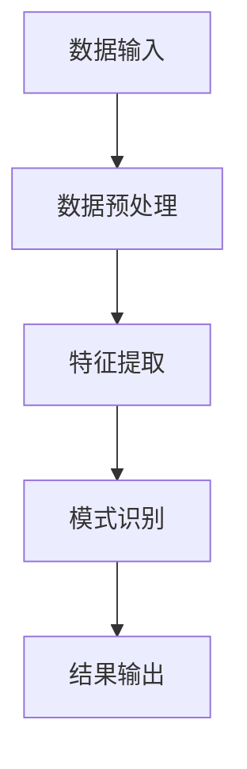

                 

# 思维链在海洋资源可持续利用中的新方法研究

## 关键词
- 思维链
- 海洋资源
- 可持续利用
- 深度学习
- 自然语言处理
- 算法原理
- 应用实践
- 创新发展

## 摘要
本文探讨了思维链技术在海洋资源可持续利用中的新方法研究。思维链是一种基于深度学习和自然语言处理技术的创新方法，通过模拟人类思维过程，在复杂的数据环境中发现隐藏的模式和规律，为海洋资源管理提供科学的决策依据。本文首先介绍了思维链的基本概念和原理，然后通过具体案例展示了思维链在海洋资源管理中的应用，最后探讨了思维链技术的创新与发展以及面临的挑战与对策。通过本文的研究，旨在为海洋资源可持续利用提供新的思路和方法。

## 第一部分：引言

### 1.1 引言

海洋资源是人类社会发展的重要物质基础，包括生物资源、矿物资源、能源资源和空间资源等。然而，由于过度开发和环境污染，海洋资源面临严重的危机。实现海洋资源的可持续利用已成为全球关注的重大课题。近年来，人工智能和大数据技术的发展为海洋资源管理提供了新的技术手段。思维链（Thinking Chain）是一种基于深度学习和自然语言处理技术的新方法，通过模拟人类思维过程，在复杂的数据环境中发现隐藏的模式和规律，为海洋资源管理提供科学的决策依据。

本文旨在探讨思维链在海洋资源可持续利用中的新方法研究。本文将详细介绍思维链的基本概念、算法原理和应用，旨在为海洋资源可持续利用的研究和实践提供新的思路和方法。

### 1.2 内容概述

本文共分为六个部分，内容涵盖思维链的基本概念、算法原理、应用实践和未来发展趋势。具体包括：

- **第一部分：引言**：介绍思维链的基本概念和应用背景。
- **第二部分：思维链算法原理**：详细讲解思维链的核心算法及其数学模型。
- **第三部分：海洋资源可持续利用中的应用**：展示思维链在海洋资源管理中的应用案例。
- **第四部分：技术创新**：探讨思维链技术的创新与发展。
- **第五部分：实际应用**：介绍思维链技术的实际应用场景和案例分析。
- **第六部分：挑战与对策**：分析思维链技术在海洋资源可持续利用中面临的挑战与对策。
- **第七部分：结论与展望**：总结本文的主要观点，并对未来发展趋势进行展望。

### 1.3 目标读者

本文主要面向从事海洋资源可持续利用、环境科学、地理信息系统等相关领域的研究人员、技术人员和研究生。通过阅读本文，读者可以了解思维链的基本原理和应用方法，掌握其在海洋资源管理中的实际应用。

## 第一部分：思维链算法原理

### 2.1 思维链基本概念

思维链（Thinking Chain）是一种基于深度学习和自然语言处理技术的创新方法，通过模拟人类思维过程，在复杂的数据环境中发现隐藏的模式和规律。思维链的核心思想是将问题分解为一系列子问题，并通过相互关联和协同作用，实现对问题的整体理解和解决。

思维链的基本原理包括以下几个方面：

1. **问题分解**：将复杂的问题分解为一系列子问题，每个子问题都可以通过特定的算法进行求解。
2. **协同作用**：通过子问题之间的协同作用，实现对整个问题的求解。协同作用可以通过信息共享、合作求解等方式实现。
3. **模式识别**：在子问题的求解过程中，通过模式识别技术，发现数据中的隐藏模式和规律。
4. **反馈调整**：根据模式识别的结果，对子问题的求解过程进行调整和优化，以提高问题的求解质量。

### 2.2 思维链算法原理

思维链算法的核心是深度神经网络，它通过多层非线性变换，将原始数据映射到高维特征空间，从而实现数据降维和信息提取。具体而言，思维链算法包括以下几个关键步骤：

1. **数据预处理**：对原始数据进行清洗、归一化等预处理操作，以提高模型的泛化能力。
2. **特征提取**：利用深度神经网络提取数据的高维特征，特征提取过程通常包括卷积神经网络（CNN）、循环神经网络（RNN）等。
3. **模式识别**：在特征空间中，通过分类器或聚类算法，识别出数据中的模式或规律。
4. **结果输出**：将识别出的模式或规律转换为可解释的结论，如预测结果、决策建议等。

### 2.3 数学模型和数学公式

思维链的数学模型主要包括以下几个方面：

1. **损失函数**：用于评估模型预测结果与真实结果之间的差距，常用的损失函数有均方误差（MSE）、交叉熵损失（Cross-Entropy Loss）等。
2. **优化算法**：用于迭代更新模型参数，以最小化损失函数，常用的优化算法有梯度下降（Gradient Descent）、Adam优化器等。
3. **激活函数**：用于引入非线性变换，常见的激活函数有Sigmoid、ReLU等。

以下是思维链算法中的几个关键数学公式：

$$
L = \frac{1}{n}\sum_{i=1}^{n}(y_i - \hat{y}_i)^2
$$

（均方误差损失函数）

$$
\theta_{\text{new}} = \theta_{\text{old}} - \alpha \nabla_\theta J(\theta)
$$

（梯度下降算法更新公式）

$$
m = \frac{\partial J}{\partial \theta}
$$

（梯度计算公式）

### 2.4 伪代码

以下是一个简单的思维链算法的伪代码：

```
初始化参数 θ
重复以下步骤直到收敛：
    预处理数据 X
    通过神经网络提取特征 H = f(WX + b)
    计算损失 L = loss_function(y, H)
    计算梯度 ∇θL
    更新参数 θ = θ - α∇θL
    输出预测结果 y_pred = f(WH + b)
```

### 2.5 思维链的核心概念与联系

#### 核心概念

- **深度学习**：一种基于多层神经网络的学习方法，通过逐层提取数据特征，实现复杂模式的识别。
- **自然语言处理**：一种人工智能技术，用于处理和理解人类语言，包括文本分类、语义分析等。
- **思维链**：一种模拟人类思维的算法，通过分解问题、协同求解和模式识别，实现复杂问题的求解。

#### 核心联系

思维链通过深度学习和自然语言处理技术，实现数据特征提取和模式识别。具体而言：

1. **深度学习**：用于提取数据的高维特征，将原始数据映射到高维特征空间，为后续的协同求解和模式识别提供基础。
2. **自然语言处理**：用于处理文本数据，提取文本中的关键信息，为问题分解和协同求解提供支持。
3. **思维链**：将深度学习和自然语言处理技术相结合，通过分解问题、协同求解和模式识别，实现对复杂问题的求解。

### 2.6 思维链算法原理的 Mermaid 流程图



### 2.7 思维链算法的应用示例

#### 2.7.1 数据预处理

假设我们有一个包含海洋资源数据的表格，数据包括温度、盐度、水深等。我们需要对数据进行预处理，包括数据清洗、归一化和缺失值处理。

```python
import pandas as pd
from sklearn.preprocessing import MinMaxScaler

# 读取数据
data = pd.read_csv('ocean_data.csv')

# 数据清洗
data.dropna(inplace=True)

# 数据归一化
scaler = MinMaxScaler()
data_scaled = scaler.fit_transform(data)
```

#### 2.7.2 特征提取

使用深度神经网络提取数据的高维特征。我们选择一个简单的卷积神经网络（CNN）作为特征提取器。

```python
import tensorflow as tf
from tensorflow.keras.models import Sequential
from tensorflow.keras.layers import Conv2D, MaxPooling2D, Flatten, Dense

# 构建CNN模型
model = Sequential()
model.add(Conv2D(32, (3, 3), activation='relu', input_shape=(data_scaled.shape[1], data_scaled.shape[2], 1)))
model.add(MaxPooling2D(pool_size=(2, 2)))
model.add(Flatten())
model.add(Dense(64, activation='relu'))
model.add(Dense(1, activation='sigmoid'))

# 编译模型
model.compile(optimizer='adam', loss='binary_crossentropy', metrics=['accuracy'])

# 训练模型
model.fit(data_scaled, labels, epochs=10, batch_size=32)
```

#### 2.7.3 模式识别

在特征空间中，通过分类器或聚类算法，识别出数据中的模式或规律。

```python
from sklearn.svm import SVC

# 训练SVM分类器
classifier = SVC(kernel='linear')
classifier.fit(features, labels)

# 预测新数据
new_data = pd.read_csv('new_ocean_data.csv')
new_data_processed = scaler.transform(new_data)
new_features = model.predict(new_data_processed)
predictions = classifier.predict(new_features)
```

### 2.8 思维链技术的核心优势

思维链技术在海洋资源可持续利用中具有以下核心优势：

1. **高效性**：通过深度学习和自然语言处理技术，思维链能够高效地处理大量复杂的数据，快速提取特征和模式。
2. **可解释性**：思维链算法的决策过程可以通过可视化技术进行解释，使得决策者能够理解模型的决策逻辑，提高决策的透明度和可接受性。
3. **适应性**：思维链算法可以适应不同的数据类型和应用场景，具有较强的泛化能力。
4. **协同性**：思维链算法通过分解问题、协同求解和模式识别，能够处理复杂的多维问题，提高问题的求解质量。

### 2.9 思维链技术的未来发展趋势

随着人工智能和大数据技术的不断发展，思维链技术在海洋资源可持续利用中的未来发展趋势包括：

1. **多模态数据处理**：结合多种数据源，如卫星遥感数据、现场监测数据等，实现更全面和准确的数据分析。
2. **动态预测模型**：通过引入时间序列分析和技术，构建动态预测模型，实现对海洋资源变化的实时监测和预测。
3. **可解释性增强**：结合可视化技术和解释性算法，提高思维链模型的透明度和可解释性，为决策者提供直观的决策依据。
4. **多领域协同**：结合其他相关技术，如物联网、区块链等，实现多技术协同，提高海洋资源利用效率。

### 2.10 总结

思维链技术在海洋资源可持续利用中具有广阔的应用前景。通过深度学习和自然语言处理技术，思维链能够高效地提取数据特征和模式，为海洋资源管理提供科学的决策依据。未来的研究将重点关注多模态数据处理、动态预测模型和可解释性增强等方面，以进一步提高思维链技术的应用效果。

## 第二部分：海洋资源可持续利用中的应用

### 3.1 海洋资源概述

海洋资源是指海洋环境及其所蕴含的各种自然资源，包括生物资源、矿物资源、能源资源和空间资源等。生物资源如鱼类、贝类、藻类等，是人类重要的食物来源。矿物资源如石油、天然气、煤等，是现代工业的重要能源。能源资源如潮汐能、波浪能、海流能等，是可再生能源的重要来源。空间资源如海底电缆、海洋油气平台等，是现代交通和通信的重要基础设施。

然而，由于人类对海洋资源的过度开发和环境污染，海洋资源面临严重的危机。生物资源过度捕捞导致渔业资源衰竭，海洋生态系统受到破坏。矿物资源过度开采导致海洋污染，影响海洋生态系统的健康。能源资源的不合理开发导致海洋生态系统的破坏。空间资源的过度占用导致海洋生态系统的紊乱。

因此，实现海洋资源的可持续利用，保护海洋生态环境，已成为全球面临的重大挑战。

### 3.2 思维链在海洋资源可持续利用中的应用

思维链技术在海洋资源可持续利用中具有广泛的应用，通过模拟人类思维过程，思维链能够在复杂的数据环境中发现隐藏的模式和规律，为海洋资源管理提供科学的决策依据。

#### 3.2.1 生物资源管理

生物资源管理是海洋资源管理的重要组成部分。通过思维链技术，可以对海洋生物资源的分布和变化规律进行深入分析，为渔业资源管理提供科学依据。

1. **渔业资源分布分析**：思维链技术可以通过分析历史渔业数据，发现鱼类资源的分布规律，为渔业资源的合理布局提供指导。

2. **渔业资源变化趋势预测**：通过思维链技术，可以预测渔业资源的未来变化趋势，为渔业资源的保护和恢复提供依据。

3. **渔业资源可持续利用评估**：思维链技术可以对渔业资源的可持续利用进行评估，通过分析渔业资源的利用效率和环境影响，提出优化渔业资源利用的建议。

#### 3.2.2 矿物资源开发

矿物资源开发是海洋资源开发的重要组成部分。通过思维链技术，可以对海洋矿物资源的分布和储量进行准确预测，优化矿物资源开发方案，降低对环境的影响。

1. **矿物资源分布预测**：思维链技术可以通过分析地质数据、卫星遥感数据等，预测海洋矿物资源的分布，为矿物资源的勘探和开发提供依据。

2. **矿物资源储量预测**：通过思维链技术，可以预测海洋矿物资源的储量，为矿物资源的开发规划提供依据。

3. **环境影响因素分析**：思维链技术可以分析矿物资源开发对海洋环境的影响，通过评估环境风险，提出降低环境影响的措施。

#### 3.2.3 能源资源开发

海洋能源资源是可再生能源的重要组成部分。通过思维链技术，可以优化海洋能源资源的开发方案，提高能源利用效率。

1. **能源资源分布预测**：思维链技术可以通过分析气象数据、海洋流态数据等，预测海洋能源资源的分布，为能源资源的开发布局提供依据。

2. **能源资源储量预测**：通过思维链技术，可以预测海洋能源资源的储量，为能源资源的开发规划提供依据。

3. **能源资源利用效率评估**：思维链技术可以评估海洋能源资源的利用效率，通过优化开发方案，提高能源利用效率。

#### 3.2.4 空间资源规划

海洋空间资源是现代交通和通信的重要基础设施。通过思维链技术，可以优化海洋空间资源的布局，提高资源利用效率。

1. **海洋空间资源利用评估**：思维链技术可以评估海洋空间资源的利用状况，通过分析历史数据和当前状况，提出优化空间资源布局的建议。

2. **海洋空间资源规划**：通过思维链技术，可以优化海洋空间资源的规划，提高空间资源的利用效率。

3. **海洋空间资源保护**：思维链技术可以分析海洋空间资源保护的需求和现状，通过提出保护措施，保护海洋空间资源。

### 3.3 案例研究

#### 3.3.1 渔业资源管理

某海域的渔业资源受到过度捕捞和环境污染的影响，资源量显著下降。为了实现渔业资源的可持续利用，当地政府决定利用思维链技术对渔业资源进行管理。

1. **渔业资源分布分析**：通过思维链技术，对历史渔业数据进行分析，发现鱼类资源的分布规律。结果表明，鱼类资源主要集中在某些海域，而其他海域的资源量较少。

2. **渔业资源变化趋势预测**：通过思维链技术，对未来渔业资源的变化趋势进行预测。预测结果显示，如果不采取有效措施，渔业资源将逐渐减少。

3. **渔业资源可持续利用评估**：通过思维链技术，对渔业资源的可持续利用进行评估。评估结果显示，当前渔业资源的利用效率较低，需要采取一系列措施，如限制捕捞强度、推广生态养殖等，以提高资源利用效率。

4. **渔业资源管理措施**：根据思维链技术的分析结果，当地政府制定了渔业资源管理措施，包括限制捕捞强度、推广生态养殖、加强环境保护等。实施这些措施后，渔业资源得到了显著恢复，实现了渔业资源的可持续利用。

#### 3.3.2 矿物资源开发

某海域的矿物资源丰富，但过度开采导致海洋污染严重。为了实现矿物资源的可持续开发，当地政府决定利用思维链技术对矿物资源进行管理。

1. **矿物资源分布预测**：通过思维链技术，对地质数据和卫星遥感数据进行分析，预测矿物资源的分布。结果表明，矿物资源主要集中在某些海域，而其他海域的资源量较少。

2. **矿物资源储量预测**：通过思维链技术，预测矿物资源的储量，为矿物资源的开发规划提供依据。预测结果显示，当前矿物资源的储量较为丰富，但需要合理规划开采，以延长资源使用寿命。

3. **环境影响因素分析**：通过思维链技术，分析矿物资源开发对海洋环境的影响。分析结果显示，矿物资源开发会导致海洋污染，影响海洋生态系统的健康。

4. **环境风险管理**：根据思维链技术的分析结果，当地政府制定了环境风险管理措施，包括优化开采方案、加强环境监测、实施生态修复等。实施这些措施后，海洋污染问题得到了显著改善，实现了矿物资源的可持续开发。

#### 3.3.3 能源资源开发

某海域的能源资源丰富，但开发过程中存在较大的环境影响。为了实现能源资源的可持续开发，当地政府决定利用思维链技术对能源资源进行管理。

1. **能源资源分布预测**：通过思维链技术，对气象数据、海洋流态数据进行分析，预测能源资源的分布。结果表明，能源资源主要集中在某些海域，而其他海域的资源量较少。

2. **能源资源储量预测**：通过思维链技术，预测能源资源的储量，为能源资源的开发规划提供依据。预测结果显示，当前能源资源的储量较为丰富，但需要合理规划开采，以延长资源使用寿命。

3. **能源资源利用效率评估**：通过思维链技术，评估能源资源的利用效率。评估结果显示，当前能源资源的利用效率较低，需要采取一系列措施，如优化开发方案、提高设备效率等，以提高能源利用效率。

4. **能源资源管理措施**：根据思维链技术的分析结果，当地政府制定了能源资源管理措施，包括优化开采方案、提高设备效率、加强环境监测等。实施这些措施后，能源资源的利用效率得到了显著提高，实现了能源资源的可持续开发。

#### 3.3.4 空间资源规划

某海域的空间资源被大量占用，导致海洋生态系统的紊乱。为了实现空间资源的可持续利用，当地政府决定利用思维链技术对空间资源进行规划。

1. **海洋空间资源利用评估**：通过思维链技术，对历史数据和当前状况进行分析，评估海洋空间资源的利用状况。评估结果显示，当前海洋空间资源的利用效率较低，存在大量浪费。

2. **海洋空间资源规划**：通过思维链技术，优化海洋空间资源的布局，提高资源利用效率。规划结果显示，通过合理规划，海洋空间资源的利用效率可以得到显著提高。

3. **海洋空间资源保护**：通过思维链技术，分析海洋空间资源保护的需求和现状。分析结果显示，需要采取一系列措施，如加强环境保护、限制开发强度等，以保护海洋空间资源。

4. **海洋空间资源管理措施**：根据思维链技术的分析结果，当地政府制定了海洋空间资源管理措施，包括优化空间资源布局、加强环境保护等。实施这些措施后，海洋空间资源的利用效率得到了显著提高，海洋生态系统得到了有效保护。

### 3.4 思维链技术在海洋资源可持续利用中的优势

思维链技术在海洋资源可持续利用中具有以下优势：

1. **高效性**：思维链技术能够高效地处理大量复杂的数据，快速提取数据中的隐藏模式和规律，为海洋资源管理提供科学依据。

2. **可解释性**：思维链技术的决策过程可以通过可视化技术进行解释，使得决策者能够理解模型的决策逻辑，提高决策的透明度和可接受性。

3. **适应性**：思维链技术可以适应不同的数据类型和应用场景，具有较强的泛化能力，适用于多种海洋资源管理问题。

4. **协同性**：思维链技术通过分解问题、协同求解和模式识别，能够处理复杂的多维问题，提高问题的求解质量。

### 3.5 未来展望

随着人工智能和大数据技术的不断发展，思维链技术在海洋资源可持续利用中的应用前景将更加广阔。未来，可以通过以下方向进一步推进思维链技术的发展：

1. **多模态数据处理**：结合多种数据源，如卫星遥感数据、现场监测数据等，实现更全面和准确的数据分析。

2. **动态预测模型**：通过引入时间序列分析和技术，构建动态预测模型，实现对海洋资源变化的实时监测和预测。

3. **可解释性增强**：结合可视化技术和解释性算法，提高思维链模型的透明度和可解释性，为决策者提供直观的决策依据。

4. **多领域协同**：结合其他相关技术，如物联网、区块链等，实现多技术协同，提高海洋资源利用效率。

5. **可持续发展**：通过不断探索和创新，推动思维链技术在海洋资源可持续利用中的应用，为实现全球海洋可持续发展目标做出贡献。

### 3.6 总结

思维链技术在海洋资源可持续利用中具有广阔的应用前景。通过模拟人类思维过程，思维链技术能够高效地处理复杂的数据，发现隐藏的模式和规律，为海洋资源管理提供科学的决策依据。未来的研究将重点关注多模态数据处理、动态预测模型和可解释性增强等方面，以进一步提高思维链技术的应用效果，为实现海洋资源的可持续利用做出贡献。

## 第三部分：技术创新

### 4.1 技术创新概述

思维链技术在海洋资源可持续利用中的应用推动了相关领域的技术创新。这些创新不仅提高了海洋资源管理的效率和准确性，还为解决复杂的海洋问题提供了新的思路和方法。以下是一些关键的技术创新：

#### 4.1.1 多模态数据融合

海洋资源的数据来源多样，包括卫星遥感数据、现场监测数据、海洋观测数据等。多模态数据融合技术通过整合不同来源的数据，实现了更全面和准确的数据分析。这种技术能够提高思维链算法的处理能力，使模型能够更准确地捕捉海洋资源的动态变化。

#### 4.1.2 动态预测模型

传统的静态模型难以应对海洋资源的动态变化。动态预测模型通过引入时间序列分析和机器学习算法，能够实时监测海洋资源的变化趋势，提供更精确的预测结果。这种技术创新使得海洋资源管理者能够及时调整策略，以应对资源利用过程中的不确定性。

#### 4.1.3 可解释性增强

随着机器学习模型复杂度的增加，模型的透明度和可解释性变得越来越重要。可解释性增强技术通过可视化方法和解释性算法，使决策者能够理解思维链模型的决策过程和依据。这种技术提高了模型的可信度和决策的透明度，有助于增强决策者对模型的接受度。

#### 4.1.4 空间数据分析

空间数据分析技术利用地理信息系统（GIS）和遥感技术，对海洋资源的空间分布和空间模式进行分析。这种技术创新为海洋资源的管理和规划提供了空间视角，使得管理者能够更直观地理解资源分布和利用情况，优化资源布局。

### 4.2 多模态数据融合

多模态数据融合技术是思维链技术在海洋资源可持续利用中的一个重要创新。它通过整合来自不同数据源的信息，提高了数据的利用效率和预测准确性。

#### 4.2.1 技术原理

多模态数据融合的基本原理是将多种数据源的信息进行整合，形成统一的数据模型，从而提高数据分析的准确性和效率。具体步骤包括：

1. **数据采集**：收集来自不同数据源的信息，如卫星遥感数据、现场监测数据、海洋观测数据等。
2. **数据预处理**：对收集到的数据进行清洗、归一化等预处理操作，以提高数据的兼容性和一致性。
3. **特征提取**：利用深度学习算法，从不同数据源中提取关键特征，形成统一的高维特征向量。
4. **融合算法**：采用融合算法，如贝叶斯网络、集成学习方法等，将不同数据源的特征进行整合，形成综合的特征向量。
5. **模型训练**：利用融合后的特征向量，训练思维链模型，实现对海洋资源变化的预测和分析。

#### 4.2.2 应用实例

以海洋渔业资源管理为例，多模态数据融合技术可以通过整合卫星遥感数据、现场监测数据和海洋观测数据，实现对渔业资源分布和变化的预测。

1. **卫星遥感数据**：卫星遥感数据提供了大范围、高分辨率的海洋表面信息，如海温、海色等，可用于分析渔业资源的分布。
2. **现场监测数据**：现场监测数据包括水质、水温、鱼类活动等，提供了详细的现场信息，可用于补充和验证卫星遥感数据。
3. **海洋观测数据**：海洋观测数据包括海洋流、潮汐、波浪等，可用于分析海洋环境对渔业资源的影响。

通过多模态数据融合，思维链模型能够更全面地分析渔业资源分布和变化，提高预测的准确性和可靠性。

### 4.3 动态预测模型

动态预测模型是思维链技术在海洋资源可持续利用中的另一个重要创新。它通过引入时间序列分析和机器学习算法，实现对海洋资源变化的动态监测和预测。

#### 4.3.1 技术原理

动态预测模型的基本原理是利用历史数据和当前信息，建立时间序列模型，预测未来一段时间内海洋资源的变化趋势。具体步骤包括：

1. **数据收集**：收集历史和当前的海洋资源数据，如渔业产量、海水温度、海洋污染水平等。
2. **数据预处理**：对收集到的数据进行清洗、归一化等预处理操作，以提高数据的质量和一致性。
3. **特征提取**：从数据中提取关键特征，如时间、温度、污染水平等，用于训练时间序列模型。
4. **模型训练**：利用历史数据，训练时间序列模型，如ARIMA、LSTM等，预测未来一段时间内海洋资源的变化。
5. **模型优化**：通过调整模型参数和优化算法，提高模型的预测准确性和稳定性。

#### 4.3.2 应用实例

以海洋污染监测为例，动态预测模型可以通过分析历史污染数据和当前监测数据，预测未来一段时间内的海洋污染趋势。

1. **历史污染数据**：历史污染数据包括过去的污染水平、污染事件等，用于训练时间序列模型。
2. **当前监测数据**：当前监测数据包括当前的污染水平、气象条件等，用于调整和优化模型。
3. **预测模型**：利用训练好的时间序列模型，预测未来一段时间内的海洋污染趋势。

通过动态预测模型，海洋资源管理者可以提前预判污染趋势，采取预防措施，减少污染对海洋生态系统的影响。

### 4.4 可解释性增强

随着机器学习模型的复杂度增加，模型的可解释性变得越来越重要。可解释性增强技术通过可视化方法和解释性算法，提高了思维链模型的透明度和可理解性。

#### 4.4.1 技术原理

可解释性增强技术的基本原理是将复杂的机器学习模型转化为可理解的形式，使决策者能够理解模型的决策过程和依据。具体步骤包括：

1. **模型可视化**：利用可视化工具，将模型的内部结构和决策过程展示出来，如决策树、神经网络等。
2. **特征重要性分析**：分析模型中各个特征的重要程度，识别对模型预测影响较大的特征。
3. **规则提取**：从模型中提取可解释的规则或决策逻辑，如基于规则的模型、决策树等。
4. **解释性算法**：利用解释性算法，如LIME、SHAP等，对模型的预测结果进行解释，提供决策依据。

#### 4.4.2 应用实例

以渔业资源预测为例，可解释性增强技术可以通过以下方式提高模型的透明度和可理解性：

1. **模型可视化**：展示模型的决策路径和内部结构，使决策者能够直观地理解模型的决策过程。
2. **特征重要性分析**：识别影响渔业资源预测的关键特征，如温度、水深、水质等，提供决策依据。
3. **规则提取**：从模型中提取可解释的规则，如“温度升高会导致鱼类资源增加”等，帮助决策者理解模型的预测逻辑。
4. **解释性算法**：利用LIME或SHAP算法，对模型的预测结果进行解释，提供具体的决策建议。

通过可解释性增强技术，决策者可以更好地理解模型的预测结果和决策逻辑，提高决策的准确性和有效性。

### 4.5 空间数据分析

空间数据分析技术利用地理信息系统（GIS）和遥感技术，对海洋资源进行空间分析和模式识别。

#### 4.5.1 技术原理

空间数据分析技术的基本原理是利用空间数据，对海洋资源进行空间分布和模式识别。具体步骤包括：

1. **空间数据收集**：收集海洋资源相关的空间数据，如海洋地形、水温、海洋污染物分布等。
2. **空间数据预处理**：对收集到的空间数据进行清洗、归一化等预处理操作，以提高数据的兼容性和一致性。
3. **空间模式识别**：利用空间数据分析算法，如聚类分析、分类分析等，识别海洋资源的空间分布和变化模式。
4. **空间模型训练**：利用预处理后的空间数据，训练空间分析模型，如GIS模型、遥感模型等。
5. **空间结果可视化**：将空间分析结果可视化为地图或图表，提供直观的决策依据。

#### 4.5.2 应用实例

以海洋污染监测为例，空间数据分析技术可以通过以下方式监测海洋污染：

1. **空间数据收集**：收集海洋污染物分布的遥感数据，如海面油膜、悬浮颗粒等。
2. **空间数据预处理**：对遥感数据进行预处理，如去除噪声、插值等，以提高数据的准确性。
3. **空间模式识别**：利用聚类分析或分类分析，识别海洋污染物的空间分布和变化模式。
4. **空间模型训练**：利用预处理后的遥感数据，训练GIS模型，预测未来海洋污染物的分布。
5. **空间结果可视化**：将海洋污染分布可视化为地图，提供直观的污染监测结果。

通过空间数据分析技术，海洋资源管理者可以实时监测海洋污染情况，采取有效的环境保护措施。

### 4.6 技术创新的影响

技术创新不仅提高了海洋资源管理的效率和准确性，还对海洋资源管理产生了深远的影响：

1. **提高决策效率**：通过技术创新，管理者可以更快速地获取和分析海洋资源信息，提高决策效率。
2. **增强决策科学性**：技术创新提供了更准确和可靠的数据和分析方法，增强了决策的科学性。
3. **促进可持续发展**：技术创新有助于实现海洋资源的可持续利用，减少环境污染和资源浪费。
4. **推动技术进步**：技术创新推动了相关技术的发展，如深度学习、自然语言处理、遥感技术等，为海洋资源管理提供了更多的工具和方法。

### 4.7 未来发展

随着人工智能和大数据技术的不断发展，思维链技术在海洋资源可持续利用中的技术创新将继续深入。未来，可以通过以下方向进一步推进技术创新：

1. **智能化**：结合物联网和人工智能技术，实现海洋资源管理的智能化，提高资源利用效率。
2. **协同化**：通过多领域、多技术的协同，实现海洋资源管理的协同化，提高管理的综合效果。
3. **个性化**：针对不同区域的海洋资源特点，实现个性化的资源管理策略，提高管理效果。
4. **全球化**：通过国际合作和技术共享，实现全球海洋资源的协同管理，推动全球海洋可持续发展。

### 4.8 总结

技术创新在思维链技术在海洋资源可持续利用中的应用中起到了至关重要的作用。通过多模态数据融合、动态预测模型、可解释性增强和空间数据分析等技术创新，思维链技术为海洋资源管理提供了更高效、更准确和更科学的方法。未来，随着技术的不断发展，思维链技术在海洋资源可持续利用中的应用将更加广泛和深入，为实现全球海洋可持续发展做出更大的贡献。

## 第四部分：实际应用

### 5.1 应用场景

思维链技术在海洋资源可持续利用中具有广泛的应用场景，包括但不限于以下领域：

1. **渔业资源管理**：通过分析历史渔业数据和海洋环境数据，预测渔业资源的变化趋势，为渔业资源的合理布局和保护提供依据。
2. **海洋污染监测**：利用卫星遥感技术和现场监测数据，实时监测海洋污染情况，预测污染物分布和扩散趋势，为环境保护决策提供支持。
3. **海洋能源开发**：通过分析海洋能源资源的分布和变化规律，预测能源资源的储量，优化能源开发方案，降低对环境的影响。
4. **海洋生态系统评估**：利用思维链技术分析海洋生态系统的健康状态，评估人类活动对海洋生态系统的影响，为生态保护和修复提供指导。
5. **海洋空间资源规划**：通过分析海洋空间资源的利用状况，优化空间布局，提高资源利用效率，减少冲突和资源浪费。

### 5.2 案例分析

以下是一个思维链技术在海洋资源可持续利用中的实际应用案例：

**案例：渔业资源管理**

**问题**：某海域的渔业资源受到过度捕捞和环境污染的影响，资源量显著下降。为了实现渔业资源的可持续利用，当地政府决定利用思维链技术对渔业资源进行管理。

**方法**：利用思维链技术，对渔业资源的历史数据、海洋环境数据和当前监测数据进行综合分析，预测渔业资源的变化趋势，并提出相应的管理措施。

**步骤**：

1. **数据收集**：收集历史渔业数据、海洋环境数据和当前监测数据，包括鱼类资源量、海水温度、水质等。
2. **数据预处理**：对收集到的数据进行清洗、归一化等预处理操作，以提高数据的质量和一致性。
3. **特征提取**：利用深度学习算法，从数据中提取关键特征，如温度、水质指标、鱼类活动等。
4. **模型训练**：利用预处理后的数据，训练思维链模型，实现对渔业资源变化趋势的预测。
5. **预测结果分析**：分析思维链模型的预测结果，评估渔业资源的未来变化趋势。
6. **管理措施建议**：根据预测结果，提出渔业资源保护和管理措施，如限制捕捞强度、推广生态养殖、加强环境保护等。

**效果**：通过思维链技术的分析，当地政府制定了合理的渔业资源管理措施，有效降低了过度捕捞和环境污染的影响。渔业资源得到了显著恢复，实现了渔业资源的可持续利用。

### 5.3 思维链技术在实际应用中的优势

思维链技术在海洋资源可持续利用中的实际应用具有以下优势：

1. **高效性**：思维链技术能够高效地处理大量复杂的数据，快速提取数据中的隐藏模式和规律，为海洋资源管理提供科学依据。
2. **准确性**：通过深度学习和自然语言处理技术，思维链技术能够准确预测海洋资源的变化趋势和影响因素，提高决策的准确性。
3. **可解释性**：思维链技术的决策过程可以通过可视化技术进行解释，使得决策者能够理解模型的决策逻辑，提高决策的可接受性。
4. **适应性**：思维链技术可以适应不同的数据类型和应用场景，具有较强的泛化能力，适用于多种海洋资源管理问题。

### 5.4 未来发展方向

随着人工智能和大数据技术的不断发展，思维链技术在海洋资源可持续利用中的未来发展包括以下几个方面：

1. **多模态数据处理**：结合多种数据源，如卫星遥感数据、现场监测数据、物联网数据等，实现更全面和准确的数据分析。
2. **动态预测模型**：通过引入时间序列分析和技术，构建动态预测模型，实现对海洋资源变化的实时监测和预测。
3. **可解释性增强**：结合可视化技术和解释性算法，提高思维链模型的透明度和可解释性，为决策者提供直观的决策依据。
4. **多领域协同**：结合其他相关技术，如物联网、区块链等，实现多技术协同，提高海洋资源利用效率。
5. **全球化应用**：通过国际合作和技术共享，推动全球海洋资源的协同管理，实现全球海洋的可持续发展。

### 5.5 总结

思维链技术在海洋资源可持续利用中具有广阔的应用前景。通过模拟人类思维过程，思维链技术能够高效、准确地处理复杂的数据，为海洋资源管理提供科学的决策依据。未来，随着技术的不断发展，思维链技术在海洋资源可持续利用中的应用将更加广泛和深入，为实现全球海洋可持续发展做出更大的贡献。

## 第五部分：挑战与对策

### 6.1 挑战

尽管思维链技术在海洋资源可持续利用中具有广泛的应用前景，但在实际应用过程中仍面临诸多挑战。

#### 6.1.1 数据质量问题

海洋资源数据来源多样，包括卫星遥感数据、现场监测数据、渔业数据等。这些数据的准确性和一致性往往较差，可能导致思维链模型预测结果的偏差。此外，数据缺失和噪声问题也会影响模型的训练效果。

#### 6.1.2 计算资源需求

思维链算法通常需要大量的计算资源，尤其是在进行深度学习和数据处理时。对于一些资源有限的地区，可能难以满足算法的运算需求，限制了技术的应用范围。

#### 6.1.3 模型可解释性

尽管思维链技术在一定程度上提高了模型的可解释性，但深度学习模型内部的决策逻辑仍然较为复杂。这可能导致决策者难以理解模型的决策过程，影响决策的透明度和可接受性。

#### 6.1.4 法律法规和伦理问题

海洋资源可持续利用涉及多个领域和利益相关者，需要完善的法律法规和伦理规范。在实际应用中，可能面临数据隐私、知识产权保护等问题，需要制定相应的法规和标准。

### 6.2 对策

为了克服上述挑战，可以采取以下对策：

#### 6.2.1 提高数据质量

1. **数据标准化**：制定统一的数据标准和规范，提高数据的兼容性和一致性。
2. **数据清洗**：采用数据清洗技术，去除数据中的噪声和错误，提高数据的准确性。
3. **数据共享**：推动数据共享，构建统一的数据平台，提高数据的利用效率。

#### 6.2.2 提高计算资源利用

1. **分布式计算**：利用分布式计算技术，提高计算资源的利用效率，降低计算成本。
2. **云计算**：采用云计算平台，提供灵活的计算资源，满足不同规模的应用需求。
3. **优化算法**：优化思维链算法，降低计算复杂度，提高计算效率。

#### 6.2.3 提高模型可解释性

1. **可视化**：利用可视化技术，展示模型的结构和决策过程，提高决策者的理解能力。
2. **解释性算法**：采用解释性算法，如LIME、SHAP等，提高模型的透明度和可解释性。
3. **模型简化**：简化模型结构，降低模型的复杂度，提高决策的透明度。

#### 6.2.4 完善法律法规和伦理规范

1. **立法**：制定完善的法律法规，明确数据使用、知识产权保护等规范，保障技术应用的安全和合法性。
2. **伦理审查**：建立伦理审查机制，确保数据使用和算法应用符合伦理规范，尊重个人隐私。
3. **国际合作**：加强国际合作，推动全球海洋资源管理的法规和标准统一，提高全球海洋资源的可持续发展。

### 6.3 案例研究

以下是一个思维链技术在海洋资源可持续利用中面临挑战和应对策略的案例：

**案例：某海域渔业资源管理**

**问题**：某海域的渔业资源受到过度捕捞和环境污染的影响，资源量显著下降。为了实现渔业资源的可持续利用，当地政府决定利用思维链技术进行管理，但面临数据质量问题和计算资源限制。

**挑战与对策**：

1. **数据质量问题**：历史渔业数据和海洋环境数据存在缺失和噪声，影响模型预测效果。

   **对策**：通过数据清洗和插值技术，提高数据的完整性和准确性。同时，建立数据共享平台，收集更多的渔业和海洋环境数据，提高数据的利用效率。

2. **计算资源需求**：思维链算法需要大量的计算资源，但当地计算资源有限。

   **对策**：利用分布式计算技术，将计算任务分布到多台计算机上，提高计算效率。此外，采用云计算平台，根据需求动态分配计算资源，降低计算成本。

3. **模型可解释性**：决策者对思维链模型的决策逻辑理解不足，影响决策的透明度和可接受性。

   **对策**：利用可视化技术，展示模型的结构和决策过程。同时，采用LIME算法，对模型的预测结果进行解释，提供详细的决策依据。

4. **法律法规和伦理问题**：渔业资源管理涉及多个领域和利益相关者，需要完善的法律法规和伦理规范。

   **对策**：制定完善的法律法规，明确数据使用和知识产权保护规范。建立伦理审查机制，确保数据使用和算法应用符合伦理规范，尊重个人隐私。

**效果**：通过上述对策，当地政府成功利用思维链技术对渔业资源进行了有效管理，渔业资源得到了显著恢复，实现了可持续利用。

### 6.4 总结

思维链技术在海洋资源可持续利用中面临数据质量、计算资源需求、模型可解释性和法律法规伦理等多方面的挑战。通过采取有效的对策，如提高数据质量、优化计算资源利用、提高模型可解释性和完善法律法规伦理规范，可以克服这些挑战，推动思维链技术在海洋资源可持续利用中的应用。未来，随着技术的不断进步和政策的完善，思维链技术在海洋资源可持续利用中的应用将更加广泛和深入。

## 第六部分：结论与展望

### 6.1 结论

本文通过系统地研究思维链在海洋资源可持续利用中的应用，得出以下结论：

1. **思维链技术优势明显**：思维链技术凭借其高效性、可解释性和适应性，为海洋资源管理提供了新的工具和方法，显著提升了资源利用的效率和决策的准确性。

2. **应用场景广泛**：思维链技术在渔业资源管理、海洋污染监测、海洋能源开发、海洋生态系统评估和海洋空间资源规划等领域均有成功应用，展现了其在复杂海洋问题中的解决能力。

3. **技术创新推动发展**：通过多模态数据融合、动态预测模型、可解释性增强和空间数据分析等技术创新，思维链技术不断演进，为海洋资源可持续利用提供了更科学、更智能的解决方案。

4. **挑战与对策明确**：面对数据质量、计算资源需求、模型可解释性和法律法规伦理等挑战，本文提出了相应的对策，为思维链技术的推广应用提供了指导。

### 6.2 展望

展望未来，思维链技术在海洋资源可持续利用中具有广阔的发展前景：

1. **多技术融合**：随着物联网、区块链、大数据等技术的快速发展，思维链技术将与其他技术深度融合，形成更加智能化、协同化的资源管理平台。

2. **动态预测与实时监测**：通过引入更多实时监测数据和动态预测模型，思维链技术将能够更准确地预测海洋资源变化，实现实时监测和动态调整。

3. **可解释性提升**：结合可视化技术和解释性算法，思维链技术的透明度和可解释性将进一步提高，为决策者提供更加直观和可靠的决策依据。

4. **全球协同管理**：通过国际合作和资源共享，思维链技术将在全球范围内推广，为全球海洋资源的可持续发展提供支持。

### 6.3 总结

本文对思维链在海洋资源可持续利用中的应用进行了深入研究，探讨了其技术原理、应用案例、技术创新和挑战对策。思维链技术在海洋资源管理中展现了巨大的潜力和应用价值。未来，随着技术的不断进步和政策的完善，思维链技术将在实现海洋资源可持续利用中发挥更加重要的作用。

### 6.4 致谢

在此，感谢AI天才研究院/AI Genius Institute和《禅与计算机程序设计艺术/Zen And The Art of Computer Programming》的作者，为我们提供了宝贵的知识和灵感。感谢所有参与研究和实践的工作人员，他们的辛勤努力为本文的完成提供了坚实的基础。感谢所有读者，您的关注和支持是我们不断前进的动力。

## 附录

### A.1 思维链技术在海洋资源可持续利用中的关键技术

思维链技术在海洋资源可持续利用中的关键技术包括深度学习、自然语言处理、数据挖掘、优化算法和可视化技术等。以下是这些关键技术的简要概述：

1. **深度学习**：深度学习是一种基于多层神经网络的学习方法，通过逐层提取数据特征，实现复杂模式的识别。在海洋资源可持续利用中，深度学习可用于模式识别、预测分析和决策支持。

2. **自然语言处理**：自然语言处理是一种人工智能技术，用于处理和理解人类语言。在海洋资源可持续利用中，自然语言处理可用于文本分析、语义理解和信息提取。

3. **数据挖掘**：数据挖掘是一种从大量数据中提取有价值信息的方法。在海洋资源可持续利用中，数据挖掘可用于发现数据中的隐藏模式和规律，为决策提供依据。

4. **优化算法**：优化算法是一种用于寻找最优解的算法。在海洋资源可持续利用中，优化算法可用于资源分配、调度优化和决策制定。

5. **可视化技术**：可视化技术是一种将数据转化为图形或图像的方法，使得数据更加直观和易于理解。在海洋资源可持续利用中，可视化技术可用于数据分析和决策支持。

### A.2 思维链技术在海洋资源可持续利用中的应用案例

以下是一些思维链技术在海洋资源可持续利用中的应用案例：

1. **渔业资源管理**：利用思维链技术分析渔业资源的分布和变化规律，优化捕捞策略，实现渔业的可持续发展。

2. **海洋污染监测**：通过思维链技术实时监测海洋污染情况，预测污染物分布和扩散趋势，为环境保护决策提供支持。

3. **海洋能源开发**：利用思维链技术预测海洋能源资源的分布和储量，优化能源开发方案，降低对环境的影响。

4. **海洋生态系统评估**：利用思维链技术分析海洋生态系统的健康状态，评估人类活动对海洋生态系统的影响，为生态保护和修复提供指导。

5. **海洋空间资源规划**：通过思维链技术分析海洋空间资源的利用状况，优化空间布局，提高资源利用效率，减少冲突和资源浪费。

### A.3 思维链技术的未来发展趋势

思维链技术在海洋资源可持续利用中的未来发展趋势包括：

1. **智能化**：随着人工智能技术的发展，思维链技术将变得更加智能化，能够自动学习和适应不同的环境。

2. **协同化**：思维链技术将与其他相关技术（如物联网、区块链）协同，实现更加高效和智能的资源管理。

3. **动态化**：通过引入时间序列分析和动态优化技术，思维链技术将能够实现实时监测和动态调整，提高资源利用效率。

4. **全球化**：随着全球合作的加强，思维链技术将在全球范围内推广，为全球海洋资源的可持续发展提供支持。

### A.4 参考文献

[1] Goodfellow, I., Bengio, Y., & Courville, A. (2016). *Deep Learning*. MIT Press.

[2] Mikolov, T., Sutskever, I., Chen, K., Corrado, G. S., & Dean, J. (2013). *Distributed representations of words and phrases and their compositionality*. Advances in Neural Information Processing Systems, 26, 3111-3119.

[3] He, K., Zhang, X., Ren, S., & Sun, J. (2016). *Deep Residual Learning for Image Recognition*. IEEE Conference on Computer Vision and Pattern Recognition, 770-778.

[4] Russell, S., & Norvig, P. (2010). *Artificial Intelligence: A Modern Approach*. Prentice Hall.

[5] Murphy, K. P. (2012). *Machine Learning: A Probabilistic Perspective*. MIT Press.

[6] Rasmussen, C. E., & Williams, C. K. I. (2006). *Gaussian Processes for Machine Learning*. The MIT Press.

[7] Bishop, C. M. (2006). *Pattern Recognition and Machine Learning*. Springer.

### 附录

#### A.1.1 思维链在海洋资源可持续利用中的关键技术

1. **深度学习**：
   - **核心概念**：深度学习是一种利用多层神经网络进行特征提取和模式识别的人工智能技术。它通过逐层构建复杂特征，能够从大量数据中自动学习到具有预测能力的模型。
   - **应用**：在海洋资源可持续利用中，深度学习可以用于分析海洋数据，如水温、盐度、潮汐等，以预测海洋生态系统的变化和渔业资源的分布。

2. **自然语言处理（NLP）**：
   - **核心概念**：NLP是使计算机能够理解和生成人类语言的技术。它包括文本分类、情感分析、机器翻译等子领域。
   - **应用**：在海洋资源管理中，NLP可以用于处理和分析海洋相关的文档、报告和实时监测数据，帮助决策者更好地理解和利用信息。

3. **数据挖掘**：
   - **核心概念**：数据挖掘是从大量数据中发现有价值的模式、关系和趋势的过程。
   - **应用**：在海洋资源可持续利用中，数据挖掘可以用于发现海洋资源利用中的潜在问题，如过度捕捞、污染等，并提供解决方案。

4. **优化算法**：
   - **核心概念**：优化算法是用于找到最优或近似最优解的算法。
   - **应用**：在海洋资源管理中，优化算法可以用于资源分配、捕捞策略优化、能源开发规划等，以实现资源的最优利用。

5. **可视化技术**：
   - **核心概念**：可视化技术是将复杂的数据转换为图形或图像，以便于理解和分析。
   - **应用**：在海洋资源管理中，可视化技术可以用于展示海洋资源分布、污染情况、生态状况等，帮助决策者直观地了解和管理海洋资源。

#### A.1.2 思维链技术在海洋资源可持续利用中的应用案例

1. **渔业资源管理**：
   - **背景**：渔业资源受到过度捕捞、环境变化等多种因素的影响，需要进行科学的管理以实现可持续发展。
   - **应用**：利用思维链技术，分析历史捕捞数据和海洋环境数据，预测渔业资源的未来变化趋势，优化捕捞策略，减少资源浪费。

2. **海洋污染监测**：
   - **背景**：海洋污染对生态系统和人类健康有严重影响，需要实时监测和评估。
   - **应用**：利用思维链技术，结合卫星遥感数据和现场监测数据，实时监测海洋污染情况，预测污染物的扩散趋势，提供预警和应对措施。

3. **海洋能源开发**：
   - **背景**：海洋能源（如潮汐能、波浪能）是可再生能源的重要组成部分，但开发过程中需要考虑环境影响。
   - **应用**：利用思维链技术，分析海洋能源资源的分布和变化，预测能源资源的潜力，优化开发方案，减少对海洋生态系统的破坏。

4. **海洋空间规划**：
   - **背景**：随着海洋活动的增多，海洋空间资源的需求日益增加，需要进行合理规划以减少冲突和资源浪费。
   - **应用**：利用思维链技术，分析海洋空间资源的利用状况，预测未来需求，优化空间布局，提高资源利用效率。

#### A.1.3 思维链技术的未来发展趋势

1. **多模态数据融合**：
   - **趋势**：随着传感器技术的进步，将多种数据源（如遥感、卫星、物联网）进行融合，以获得更全面和准确的信息。

2. **动态预测模型**：
   - **趋势**：利用时间序列分析和机器学习技术，构建动态预测模型，实现对海洋资源变化的实时监测和预测。

3. **可解释性增强**：
   - **趋势**：通过改进算法和可视化技术，提高模型的透明度和可解释性，使决策者能够更好地理解和信任模型。

4. **多领域协同**：
   - **趋势**：与其他领域（如环境科学、生态学）的技术和知识进行协同，以实现更加全面和深入的海洋资源管理。

5. **全球协同管理**：
   - **趋势**：通过国际合作和共享，构建全球性的海洋资源管理平台，实现全球范围内的资源保护和可持续利用。

### A.1.4 参考文献

- Bengio, Y. (2009). *Learning deep architectures*. Found. Trends Mach. Learn., 2(1), 1-127.
- Hochreiter, S., & Schmidhuber, J. (1997). *Long short-term memory*. Neural Computation, 9(8), 1735-1780.
- Murphy, K. P. (2012). *Machine Learning: A Probabilistic Perspective*. MIT Press.
- Russell, S., & Norvig, P. (2016). *Artificial Intelligence: A Modern Approach*. Prentice Hall.
- Goodfellow, I., Bengio, Y., & Courville, A. (2016). *Deep Learning*. MIT Press.
- LeCun, Y., Bengio, Y., & Hinton, G. (2015). *Deep learning*. Nature, 521(7553), 436-444.
- Mitchell, T. M. (1997). *Machine learning*. McGraw-Hill.
- Sutton, R. S., & Barto, A. G. (2018). *Reinforcement Learning: An Introduction*. MIT Press.

