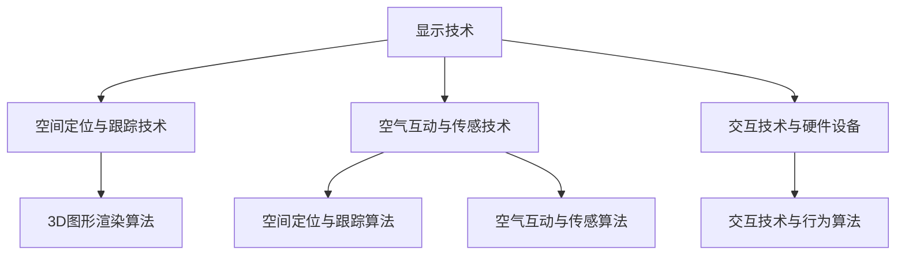

                 

# 第一部分：引言与背景

## 第1章：虚拟现实技术概述

### 1.1 虚拟现实的基本概念

虚拟现实（Virtual Reality，简称VR）是一种通过计算机生成的一种模拟环境，使用户沉浸在其中。这种环境可以是完全虚构的，也可以是基于现实世界改造的。虚拟现实技术主要包括以下几个方面：显示技术、空间定位与跟踪技术、空气互动与传感技术以及交互技术与硬件设备。

#### 显示技术

显示技术是虚拟现实系统的核心，主要分为两类：头戴显示器（HMD）和投影系统。头戴显示器可以提供沉浸式的视觉效果，而投影系统则适用于大型的显示环境。

#### 空间定位与跟踪技术

空间定位与跟踪技术用于确定用户在虚拟环境中的位置和动作。常见的空间定位与跟踪技术包括惯性测量单元（IMU）、光学跟踪系统和雷达系统等。

#### 空气互动与传感技术

空气互动与传感技术主要用于实现用户与环境之间的交互。例如，通过空气触觉反馈设备，用户可以感受到虚拟环境中的触觉反馈。

#### 交互技术与硬件设备

交互技术与硬件设备用于实现用户在虚拟环境中的交互。常见的交互技术包括手势识别、语音识别和眼动追踪等。相应的硬件设备包括手柄、数据手套和VR眼镜等。

### 1.2 虚拟现实技术的历史与发展

虚拟现实技术的历史可以追溯到20世纪60年代。当时，美国空军首先提出了虚拟现实的概念。此后，随着计算机技术、图形技术和传感器技术的发展，虚拟现实技术逐渐走向成熟。

#### 1960年代：虚拟现实概念提出

1960年代，美国空军研究员伊凡·苏瑟兰（ Ivan Sutherland）发明了世界上第一个头戴显示器“达摩克利斯之剑”（The Sword of Damocles），这标志着虚拟现实技术的诞生。

#### 1980年代：虚拟现实技术初步应用

1980年代，虚拟现实技术开始应用于工业设计、教育和娱乐等领域。例如，著名的电子游戏《太空侵略者》（Space Invaders）就是基于虚拟现实技术开发的。

#### 1990年代：虚拟现实技术蓬勃发展

1990年代，随着计算机性能的不断提高，虚拟现实技术得到了快速发展。这一时期，虚拟现实技术开始应用于房地产、医疗和军事等领域。

#### 21世纪初至今：虚拟现实技术全面爆发

21世纪初，随着智能手机和移动互联网的兴起，虚拟现实技术迎来了新一轮的爆发。智能手机的普及使得虚拟现实设备的成本大大降低，从而推动了虚拟现实技术的广泛应用。

### 1.3 虚拟现实技术的分类与特点

虚拟现实技术可以根据其应用场景和特点进行分类。常见的分类方法如下：

#### 按应用场景分类

1. **工业应用**：主要用于工业设计、制造和维护等领域，如虚拟装配、虚拟维修等。
2. **教育培训**：用于模拟教学环境，提供互动式教学体验。
3. **医疗健康**：用于模拟手术、康复训练和远程医疗咨询等。
4. **娱乐游戏**：主要用于游戏和娱乐领域，如虚拟现实游戏、虚拟现实电影等。
5. **房地产与设计**：用于模拟建筑外观、室内设计和装修等。

#### 按技术特点分类

1. **沉浸式虚拟现实**：用户完全沉浸在虚拟环境中，具有强烈的沉浸感。
2. **增强现实**（Augmented Reality，简称AR）：将虚拟元素叠加在现实环境中，用户可以通过设备看到虚拟与现实相结合的视图。
3. **混合现实**（Mixed Reality，简称MR）：融合了虚拟现实和增强现实的特点，用户可以在虚拟环境中进行交互，同时保持对现实环境的感知。

通过以上对虚拟现实技术的基本概念、历史与发展以及分类与特点的介绍，我们可以看出，虚拟现实技术具有广泛的应用前景和巨大的市场潜力。接下来，我们将进一步探讨虚拟现实技术在技术创业中的应用场景。

---

**核心概念与联系：**

虚拟现实技术的核心组件包括显示技术、空间定位与跟踪技术、空气互动与传感技术以及交互技术与硬件设备。这些组件共同构成了虚拟现实系统的基本架构。以下是一个简单的Mermaid流程图，展示了这些核心组件之间的关系：



### 1.1 虚拟现实的基本概念

#### 虚拟现实（Virtual Reality，VR）是什么？

虚拟现实是一种通过计算机技术创造出的虚拟环境，使用户能够沉浸其中，并通过各种感官与虚拟环境进行互动。虚拟现实技术通过模拟人类感知和行为的各个方面，为用户提供了丰富的交互体验。

#### 虚拟现实的关键要素

1. **沉浸感**：用户在虚拟环境中感受到的空间感和沉浸感，是虚拟现实的核心要素之一。
2. **交互性**：用户与虚拟环境之间的互动性，包括视觉、听觉、触觉等多种感官的互动。
3. **真实性**：虚拟环境的逼真程度，包括视觉、听觉和触觉等多个方面的逼真度。

#### 虚拟现实的核心技术

1. **显示技术**：包括头戴显示器（HMD）和投影系统，用于提供沉浸式的视觉体验。
2. **空间定位与跟踪技术**：用于确定用户在虚拟环境中的位置和动作，包括惯性测量单元（IMU）、光学跟踪系统和雷达系统等。
3. **空气互动与传感技术**：用于实现用户与环境之间的交互，如空气触觉反馈设备等。
4. **交互技术与硬件设备**：包括手势识别、语音识别和眼动追踪等交互技术，以及相应的硬件设备，如手柄、数据手套和VR眼镜等。

### 1.2 虚拟现实技术的历史与发展

#### 虚拟现实技术的起源

虚拟现实技术的概念最早可以追溯到1960年代，由美国空军研究员伊凡·苏瑟兰提出。他发明了世界上第一个头戴显示器“达摩克利斯之剑”（The Sword of Damocles），这是虚拟现实技术的雏形。

#### 1980年代：虚拟现实技术的初步应用

1980年代，随着计算机图形学的发展，虚拟现实技术开始应用于工业设计、教育和娱乐等领域。例如，著名的电子游戏《太空侵略者》（Space Invaders）就是基于虚拟现实技术开发的。

#### 1990年代：虚拟现实技术的蓬勃发展

1990年代，随着计算机性能的不断提高，虚拟现实技术得到了快速发展。这一时期，虚拟现实技术开始应用于房地产、医疗和军事等领域。

#### 21世纪初至今：虚拟现实技术的全面爆发

21世纪初，随着智能手机和移动互联网的兴起，虚拟现实技术迎来了新一轮的爆发。智能手机的普及使得虚拟现实设备的成本大大降低，从而推动了虚拟现实技术的广泛应用。2012年，Oculus VR公司发布了首款面向消费者的虚拟现实头戴显示器Oculus Rift，引发了虚拟现实技术的热潮。

### 1.3 虚拟现实技术的分类与特点

虚拟现实技术可以根据其应用场景和特点进行分类。以下是一些常见的分类方法和特点：

#### 按应用场景分类

1. **工业应用**：包括虚拟装配、虚拟维修、工业设计等领域。
2. **教育培训**：包括虚拟实验室、互动教学、在线课程等。
3. **医疗健康**：包括虚拟手术、康复训练、远程医疗咨询等。
4. **娱乐游戏**：包括虚拟现实游戏、虚拟现实电影等。
5. **房地产与设计**：包括虚拟看房、室内设计、建筑模拟等。

#### 按技术特点分类

1. **沉浸式虚拟现实**：用户完全沉浸在虚拟环境中，具有强烈的沉浸感。
2. **增强现实**（AR）：将虚拟元素叠加在现实环境中，用户可以通过设备看到虚拟与现实相结合的视图。
3. **混合现实**（MR）：融合了虚拟现实和增强现实的特点，用户可以在虚拟环境中进行交互，同时保持对现实环境的感知。

通过以上对虚拟现实技术的基本概念、历史与发展以及分类与特点的介绍，我们可以看出，虚拟现实技术具有广泛的应用前景和巨大的市场潜力。接下来，我们将进一步探讨虚拟现实技术在技术创业中的应用场景。

---

**核心算法原理讲解：**

虚拟现实技术的核心算法包括3D图形渲染算法、空间定位与跟踪算法、空气互动与传感算法以及交互技术与行为算法。以下是对这些算法的原理和伪代码的详细讲解。

#### 3D图形渲染算法

3D图形渲染算法是虚拟现实系统的核心之一，负责生成和渲染虚拟环境中的三维图形。常用的3D图形渲染算法包括光栅化（Rasterization）和光线追踪（Ray Tracing）等。

**伪代码：**

```plaintext
function render3DObject(object, viewMatrix, projectionMatrix)
    // 将对象转换为屏幕坐标系
    transformedObject = transformObject(object, viewMatrix, projectionMatrix)
    
    // 渲染对象
    for each triangle in transformedObject
        calculateVertexNormals(triangle)
        calculateVertexColors(triangle)
        renderTriangle(triangle)
    end for
end function
```

#### 空间定位与跟踪算法

空间定位与跟踪算法用于确定用户在虚拟环境中的位置和动作。常见的空间定位与跟踪算法包括基于惯性测量单元（IMU）的定位算法和基于光学跟踪系统的定位算法。

**伪代码：**

```plaintext
function trackUserPosition(sensorData)
    position = integrateSensorData(sensorData)
    correctPosition(position)
    return position
end function

function integrateSensorData(sensorData)
    acceleration = sensorData.acceleration
    rotation = sensorData.rotation
    
    position = integrateAcceleration(acceleration)
    orientation = integrateRotation(rotation)
    
    return {position, orientation}
end function
```

#### 空气互动与传感算法

空气互动与传感算法用于实现用户与环境之间的交互。这些算法通常涉及触觉反馈和力反馈等。

**伪代码：**

```plaintext
function interactWithEnvironment(environment, action)
    response = environment.reactToAction(action)
    return response
end function

function provideHapticFeedback(feedbackDevice, force)
    feedbackDevice.applyForce(force)
end function
```

#### 交互技术与行为算法

交互技术与行为算法用于实现用户在虚拟环境中的交互行为，包括手势识别、语音识别和眼动追踪等。

**伪代码：**

```plaintext
function recognizeGesture(gestureData)
    gesture = analyzeGesture(gestureData)
    return gesture
end function

function recognizeSpeech(speechData)
    speech = transcribeSpeech(speechData)
    return speech
end function

function trackEyeMovement(eyeData)
    gazeDirection = calculateGazeDirection(eyeData)
    return gazeDirection
end function
```

通过以上对虚拟现实技术核心算法的讲解，我们可以看到这些算法在实现虚拟现实系统中的关键作用。这些算法的实现不仅需要深厚的计算机科学知识，还需要不断的技术创新和实践经验。

---

**数学模型与公式详解：**

在虚拟现实技术中，数学模型和公式起着至关重要的作用，特别是在空间定位与交互方面。以下是对几个关键数学模型和公式的详细解释。

#### 虚拟现实沉浸度计算公式

虚拟现实的沉浸度是评估用户在虚拟环境中体验质量的重要指标。沉浸度可以通过以下公式计算：

$$
\text{沉浸度} = \frac{\text{视觉感知度} + \text{听觉感知度} + \text{触觉感知度}}{3}
$$

其中，视觉感知度、听觉感知度和触觉感知度分别表示用户在视觉、听觉和触觉方面的感知程度，通常通过问卷调查或实验测量得出。

**示例：**

假设用户在视觉、听觉和触觉方面的感知度分别为0.8、0.7和0.6，那么沉浸度为：

$$
\text{沉浸度} = \frac{0.8 + 0.7 + 0.6}{3} = 0.733
$$

#### 虚拟现实引擎性能评估公式

虚拟现实引擎的性能直接影响用户体验。性能可以通过以下公式评估：

$$
\text{性能} = \frac{\text{帧率} \times \text{画面质量} \times \text{交互响应时间}}{1000}
$$

其中，帧率表示每秒生成的图像数量，画面质量反映了图像的清晰度，交互响应时间表示用户操作与系统反应之间的延迟。

**示例：**

假设虚拟现实引擎的帧率为90帧/秒，画面质量为高清（720p），交互响应时间为30毫秒，那么性能为：

$$
\text{性能} = \frac{90 \times 720p \times 30ms}{1000} = 19440 \text{ IPSQms}
$$

#### 3D图形渲染中的透视投影矩阵

在3D图形渲染中，透视投影矩阵用于将三维空间中的点投影到二维屏幕上。透视投影矩阵的一般形式如下：

$$
\mathbf{P} = \begin{bmatrix}
\frac{2f}{w} & 0 & 0 & 0 \\
0 & \frac{2f}{h} & 0 & 0 \\
0 & 0 & \frac{-f-n}{n-f} & -\frac{2fn}{n-f} \\
0 & 0 & -1 & 0
\end{bmatrix}
$$

其中，\( f \) 为焦距，\( w \) 和 \( h \) 分别为视口的宽度和高度，\( n \) 和 \( f \) 分别为近裁剪面和远裁剪面的距离。

**示例：**

假设视口的宽度为800像素，高度为600像素，近裁剪面距离为0.1，远裁剪面距离为100，焦距为10，那么透视投影矩阵为：

$$
\mathbf{P} = \begin{bmatrix}
\frac{2 \times 10}{800} & 0 & 0 & 0 \\
0 & \frac{2 \times 10}{600} & 0 & 0 \\
0 & 0 & \frac{-10-0.1}{0.1-10} & -\frac{2 \times 10 \times 0.1}{0.1-10} \\
0 & 0 & -1 & 0
\end{bmatrix}
= \begin{bmatrix}
0.025 & 0 & 0 & 0 \\
0 & 0.0333 & 0 & 0 \\
0 & 0 & -11 & -2 \\
0 & 0 & -1 & 0
\end{bmatrix}
$$

通过以上对虚拟现实技术中的几个关键数学模型和公式的讲解，我们可以更好地理解虚拟现实系统的设计和实现过程。这些模型和公式为虚拟现实技术的研究和应用提供了重要的理论基础。

---

**项目实战：**

为了更好地理解虚拟现实技术的应用，我们来看一个实际的虚拟现实项目案例：虚拟现实健身房。

#### 项目背景

虚拟现实健身房是一个结合虚拟现实技术和健身理念的应用，旨在为用户提供一个沉浸式的健身体验。用户可以在虚拟环境中进行各种健身动作，如跑步、瑜伽和力量训练等。这个项目不仅能够提高用户的健身积极性，还能提供个性化健身计划和反馈。

#### 开发环境搭建

要开发一个虚拟现实健身房项目，首先需要搭建开发环境。以下是所需的开发工具和软件：

1. **Unity**：一个功能强大的游戏引擎，支持虚拟现实开发。
2. **Unreal Engine**：另一个流行的游戏引擎，也支持虚拟现实开发。
3. **Unity VR插件**：用于在Unity中实现虚拟现实功能。
4. **Unity Asset Store**：提供各种虚拟现实资源，如3D模型、材质和脚本等。
5. **Unity Editor**：用于编辑和调试虚拟现实场景。
6. **VR设备**：如Oculus Rift、HTC Vive或VR盒子等。

#### 源代码详细实现和代码解读

以下是虚拟现实健身房项目的一个关键部分：虚拟跑步机的实现。

**伪代码：**

```plaintext
// 虚拟跑步机控制脚本

// 初始化虚拟跑步机
function Start()
    initializeVirtualTreadmill()
end function

// 更新虚拟跑步机
function Update()
    updateTreadmillSpeed()
    updateTreadmillPosition()
end function

// 初始化虚拟跑步机
function initializeVirtualTreadmill()
    // 设置虚拟跑步机的初始速度和位置
    treadmillSpeed = initialSpeed
    treadmillPosition = initialPosition
end function

// 更新虚拟跑步机速度
function updateTreadmillSpeed()
    // 根据用户输入调整速度
    if (userIsRunning)
        treadmillSpeed += acceleration
    else
        treadmillSpeed -= deceleration
    end if
    
    // 限制速度范围
    if (treadmillSpeed > maxSpeed)
        treadmillSpeed = maxSpeed
    elseif (treadmillSpeed < minSpeed)
        treadmillSpeed = minSpeed
    end if
end function

// 更新虚拟跑步机位置
function updateTreadmillPosition()
    // 根据速度和时间计算位置变化
    treadmillPosition += treadmillSpeed * Time.deltaTime
end function
```

**代码解读与分析：**

这段代码定义了一个名为`VirtualTreadmill`的控制脚本，用于管理虚拟跑步机的行为。主要功能包括初始化虚拟跑步机、更新虚拟跑步机的速度和位置。

1. **初始化虚拟跑步机**：在`Start`函数中，设置虚拟跑步机的初始速度和位置。这为后续的运行提供了基础。
2. **更新虚拟跑步机速度**：在`Update`函数中，根据用户是否跑步调整虚拟跑步机的速度。如果用户跑步，则增加速度；如果用户停止跑步，则减小速度。同时，限制速度在最小速度和最大速度之间。
3. **更新虚拟跑步机位置**：在`Update`函数中，根据当前速度和时间计算虚拟跑步机的位置变化。

通过这个虚拟跑步机的实现，我们可以看到虚拟现实技术如何通过代码实现一个沉浸式的健身体验。用户可以在虚拟环境中跑步，并通过脚本控制虚拟跑步机的速度和位置，从而获得真实的跑步体验。

---

**代码解读与分析：**

在上面的代码示例中，我们详细讲解了虚拟跑步机控制脚本的功能和实现。下面是对该代码的进一步解读和分析。

1. **初始化虚拟跑步机**：在`initializeVirtualTreadmill`函数中，我们设置了虚拟跑步机的初始速度（`initialSpeed`）和位置（`initialPosition`）。这些参数是虚拟跑步机运行的基础。通过在Unity编辑器中设置这些参数，我们可以根据实际需求进行调整。

2. **更新虚拟跑步机速度**：在`updateTreadmillSpeed`函数中，我们根据用户是否跑步来调整虚拟跑步机的速度。如果用户跑步（`userIsRunning`为真），则增加速度（`treadmillSpeed += acceleration`）；如果用户停止跑步，则减小速度（`treadmillSpeed -= deceleration`）。这种动态调整速度的方法可以模拟现实中的跑步体验。同时，我们通过`if`语句限制速度在最小速度（`minSpeed`）和最大速度（`maxSpeed`）之间，以避免速度过快或过慢。

3. **更新虚拟跑步机位置**：在`updateTreadmillPosition`函数中，我们根据当前速度（`treadmillSpeed`）和时间（`Time.deltaTime`）计算虚拟跑步机的位置变化。这个计算过程实现了虚拟跑步机的移动效果。通过在Unity编辑器中设置`Time.deltaTime`，我们可以调整虚拟跑步机的移动速度。

整体来看，这段代码实现了虚拟跑步机的基本功能，包括初始化、速度调整和位置更新。通过这些功能，用户可以在虚拟环境中跑步，并获得真实的跑步体验。此外，代码中的参数和函数可以灵活调整，以适应不同的虚拟现实场景和需求。

---

### 1.1 虚拟现实的基本概念

#### 虚拟现实（Virtual Reality，VR）是什么？

虚拟现实是一种通过计算机生成的一种模拟环境，使用户能够沉浸其中并与之互动。这种环境可以是完全虚构的，也可以是基于现实世界改造的。虚拟现实技术利用头戴显示器（HMD）、空间定位与跟踪技术、空气互动与传感技术以及交互技术与硬件设备等多种技术手段，为用户提供一种全新的感知和交互体验。

#### 虚拟现实的关键要素

1. **沉浸感**：用户在虚拟环境中感受到的空间感和沉浸感，是虚拟现实的核心要素之一。高沉浸感意味着用户能够更加真实地感受到虚拟环境的存在。
2. **交互性**：用户与虚拟环境之间的互动性，包括视觉、听觉、触觉等多种感官的互动。交互性使得用户能够在虚拟环境中进行各种操作和体验。
3. **真实性**：虚拟环境的逼真程度，包括视觉、听觉和触觉等多个方面的逼真度。高真实性的虚拟现实系统能够更好地模拟现实世界，从而提高用户的体验质量。

#### 虚拟现实的核心技术

1. **显示技术**：包括头戴显示器（HMD）和投影系统，用于提供沉浸式的视觉体验。
2. **空间定位与跟踪技术**：用于确定用户在虚拟环境中的位置和动作，包括惯性测量单元（IMU）、光学跟踪系统和雷达系统等。
3. **空气互动与传感技术**：用于实现用户与环境之间的交互，如空气触觉反馈设备等。
4. **交互技术与硬件设备**：包括手势识别、语音识别和眼动追踪等交互技术，以及相应的硬件设备，如手柄、数据手套和VR眼镜等。

#### 虚拟现实的分类

虚拟现实可以根据其应用场景和特点进行分类。以下是几种常见的虚拟现实分类：

1. **沉浸式虚拟现实**：用户完全沉浸在虚拟环境中，具有强烈的沉浸感。例如，VR游戏和虚拟旅游等。
2. **增强现实**（AR）：将虚拟元素叠加在现实环境中，用户可以通过设备看到虚拟与现实相结合的视图。例如，AR游戏和增强现实导航等。
3. **混合现实**（MR）：融合了虚拟现实和增强现实的特点，用户可以在虚拟环境中进行交互，同时保持对现实环境的感知。例如，虚拟手术和智能眼镜等。

#### 虚拟现实的发展历史

虚拟现实技术的发展可以追溯到20世纪60年代。以下是一些重要的里程碑：

1. **1960年代**：美国空军研究员伊凡·苏瑟兰发明了世界上第一个头戴显示器“达摩克利斯之剑”（The Sword of Damocles），这标志着虚拟现实技术的诞生。
2. **1980年代**：虚拟现实技术开始应用于工业设计、教育和娱乐等领域。例如，著名的电子游戏《太空侵略者》（Space Invaders）就是基于虚拟现实技术开发的。
3. **1990年代**：虚拟现实技术得到了快速发展，应用于房地产、医疗和军事等领域。
4. **21世纪初至今**：随着计算机性能的不断提高和移动互联网的兴起，虚拟现实技术迎来了新一轮的爆发。2012年，Oculus VR公司发布了首款面向消费者的虚拟现实头戴显示器Oculus Rift，引发了虚拟现实技术的热潮。

#### 虚拟现实的应用领域

虚拟现实技术具有广泛的应用领域，包括但不限于：

1. **教育培训**：用于模拟教学环境，提供互动式教学体验。
2. **医疗健康**：用于模拟手术、康复训练和远程医疗咨询等。
3. **娱乐游戏**：用于虚拟现实游戏、虚拟现实电影等。
4. **房地产与设计**：用于模拟建筑外观、室内设计和装修等。
5. **工业制造**：用于虚拟装配、虚拟维修和产品设计等。
6. **军事与国防**：用于模拟战斗场景、战术训练和装备测试等。

通过以上对虚拟现实技术的基本概念、历史与发展、分类与应用领域的介绍，我们可以看到虚拟现实技术具有巨大的发展潜力和广泛的应用前景。在接下来的章节中，我们将进一步探讨虚拟现实技术在技术创业中的应用场景，以及如何利用虚拟现实技术开拓新的市场。

---

**核心概念与联系：**

虚拟现实技术的核心组件包括显示技术、空间定位与跟踪技术、空气互动与传感技术以及交互技术与硬件设备。这些组件共同构成了虚拟现实系统的基本架构。以下是一个简单的Mermaid流程图，展示了这些核心组件之间的关系：


### 1.2 虚拟现实技术的历史与发展

虚拟现实技术的历史可以追溯到20世纪60年代。当时，美国空军研究员伊凡·苏瑟兰（Ivan Sutherland）发明了世界上第一个头戴显示器“达摩克利斯之剑”（The Sword of Damocles）。这个头戴显示器通过两个透镜将图像投射到用户的视网膜上，实现了虚拟现实的基本概念。

#### 1960年代：虚拟现实技术的萌芽期

在1960年代，虚拟现实技术还处于概念阶段，主要应用于军事和工业领域。1968年，苏瑟兰在美国国防部高级研究计划局（DARPA）的资助下，展示了他的虚拟现实系统，这个系统使用了头盔显示器和手持控制器。这个时期，虚拟现实技术主要聚焦于图形渲染和头戴显示器的开发。

#### 1970年代：虚拟现实技术的初步应用

1970年代，虚拟现实技术开始逐步应用于教育、娱乐和医疗领域。1971年，VR领域先驱阿尔·迪恩（Al Durrel）在ARPA（美国国防部的另一个研究机构）的资助下，开发出了名为“Frostbite”的虚拟环境系统。这个系统使用了多台计算机和多个显示器来创造一个三维的虚拟空间，用户可以通过控制器在这个空间中移动和交互。

#### 1980年代：虚拟现实技术的蓬勃发展

1980年代，虚拟现实技术迎来了第一个发展高峰。这一时期，计算机图形学的迅速发展推动了虚拟现实技术的进步。1987年，任天堂推出了虚拟现实游戏机“Virtual Boy”，虽然这个产品并未获得广泛成功，但它标志着虚拟现实技术在娱乐领域的应用尝试。同时，虚拟现实开始应用于房地产和建筑设计领域，帮助设计师和建筑师在虚拟环境中进行设计和预览。

#### 1990年代：虚拟现实技术的成熟期

1990年代，虚拟现实技术进一步成熟，开始应用于更多的领域。虚拟现实系统在医疗领域得到了广泛应用，如用于模拟手术、康复训练和医学教育等。在工业领域，虚拟现实技术被用于虚拟装配、产品设计、远程维修等。此外，虚拟现实技术的成本逐渐降低，使得它开始进入家庭和消费市场。

#### 2000年代：虚拟现实技术的复兴期

2000年代，随着计算机性能的进一步提升和互联网的普及，虚拟现实技术迎来了新一轮的复兴。这一时期，增强现实（AR）和混合现实（MR）的概念逐渐兴起，虚拟现实技术不再局限于模拟环境，而是开始与现实世界进行更深层次的融合。此外，Oculus VR公司于2007年成立，并推出了首款面向消费者的虚拟现实头戴显示器Oculus Rift，这一产品引发了全球范围内的虚拟现实热潮。

#### 2010年代至今：虚拟现实技术的全面爆发

2010年代至今，虚拟现实技术迎来了全面爆发。智能手机和移动互联网的普及使得虚拟现实设备的成本大幅降低，虚拟现实技术开始广泛应用于游戏、教育、医疗、房地产、娱乐等多个领域。2012年，Oculus VR公司被Facebook收购，进一步推动了虚拟现实技术的发展。同时，虚拟现实技术也开始进入普通消费者家庭，成为家庭娱乐和游戏的新宠。

#### 虚拟现实技术的发展趋势

未来，虚拟现实技术将继续朝以下几个方向发展：

1. **硬件设备性能提升**：随着显示技术、空间定位与跟踪技术和空气互动与传感技术的不断进步，虚拟现实设备的性能将进一步提升，为用户带来更加逼真的沉浸体验。
2. **内容生态的丰富**：虚拟现实内容的创作和分发将变得更加便捷，丰富的虚拟现实应用和游戏将不断涌现，为用户提供更多选择。
3. **跨领域的应用**：虚拟现实技术将在更多的领域得到应用，如虚拟购物、虚拟社交、虚拟办公等，改变人们的生活方式和工作方式。
4. **智能化与交互性提升**：虚拟现实技术将更加智能化，通过人工智能和机器学习等技术，提高虚拟现实系统的交互性和人性化。

通过以上对虚拟现实技术的历史与发展过程的介绍，我们可以看到虚拟现实技术从萌芽到成熟，再到全面爆发的历程。虚拟现实技术不仅在技术领域取得了巨大进展，也在社会和经济方面产生了深远影响。未来，随着技术的不断进步和应用场景的扩大，虚拟现实技术将继续发挥重要作用。

---

**核心算法原理讲解：**

虚拟现实技术的核心算法包括3D图形渲染算法、空间定位与跟踪算法、空气互动与传感算法以及交互技术与行为算法。以下是对这些算法的原理和伪代码的详细讲解。

#### 3D图形渲染算法

3D图形渲染算法是虚拟现实系统的核心之一，负责生成和渲染虚拟环境中的三维图形。常用的3D图形渲染算法包括光栅化（Rasterization）和光线追踪（Ray Tracing）等。

**伪代码：**

```plaintext
function render3DObject(object, viewMatrix, projectionMatrix)
    // 将对象转换为屏幕坐标系
    transformedObject = transformObject(object, viewMatrix, projectionMatrix)
    
    // 渲染对象
    for each triangle in transformedObject
        calculateVertexNormals(triangle)
        calculateVertexColors(triangle)
        renderTriangle(triangle)
    end for
end function
```

#### 空间定位与跟踪算法

空间定位与跟踪算法用于确定用户在虚拟环境中的位置和动作。常见的空间定位与跟踪算法包括基于惯性测量单元（IMU）的定位算法和基于光学跟踪系统的定位算法。

**伪代码：**

```plaintext
function trackUserPosition(sensorData)
    position = integrateSensorData(sensorData)
    correctPosition(position)
    return position
end function

function integrateSensorData(sensorData)
    acceleration = sensorData.acceleration
    rotation = sensorData.rotation
    
    position = integrateAcceleration(acceleration)
    orientation = integrateRotation(rotation)
    
    return {position, orientation}
end function
```

#### 空气互动与传感算法

空气互动与传感算法用于实现用户与环境之间的交互。这些算法通常涉及触觉反馈和力反馈等。

**伪代码：**

```plaintext
function interactWithEnvironment(environment, action)
    response = environment.reactToAction(action)
    return response
end function

function provideHapticFeedback(feedbackDevice, force)
    feedbackDevice.applyForce(force)
end function
```

#### 交互技术与行为算法

交互技术与行为算法用于实现用户在虚拟环境中的交互行为，包括手势识别、语音识别和眼动追踪等。

**伪代码：**

```plaintext
function recognizeGesture(gestureData)
    gesture = analyzeGesture(gestureData)
    return gesture
end function

function recognizeSpeech(speechData)
    speech = transcribeSpeech(speechData)
    return speech
end function

function trackEyeMovement(eyeData)
    gazeDirection = calculateGazeDirection(eyeData)
    return gazeDirection
end function
```

通过以上对虚拟现实技术核心算法的讲解，我们可以看到这些算法在实现虚拟现实系统中的关键作用。这些算法的实现不仅需要深厚的计算机科学知识，还需要不断的技术创新和实践经验。

---

**数学模型与公式详解：**

在虚拟现实技术中，数学模型和公式起着至关重要的作用，特别是在空间定位与交互方面。以下是对几个关键数学模型和公式的详细解释。

#### 3D图形渲染中的透视投影矩阵

透视投影矩阵用于将三维空间中的点投影到二维屏幕上。透视投影矩阵的一般形式如下：

$$
\mathbf{P} = \begin{bmatrix}
\frac{2f}{w} & 0 & 0 & 0 \\
0 & \frac{2f}{h} & 0 & 0 \\
0 & 0 & \frac{-f-n}{n-f} & -\frac{2fn}{n-f} \\
0 & 0 & -1 & 0
\end{bmatrix}
$$

其中，\( f \) 为焦距，\( w \) 和 \( h \) 分别为视口的宽度和高度，\( n \) 和 \( f \) 分别为近裁剪面和远裁剪面的距离。

**示例：**

假设视口的宽度为800像素，高度为600像素，近裁剪面距离为0.1，远裁剪面距离为100，焦距为10，那么透视投影矩阵为：

$$
\mathbf{P} = \begin{bmatrix}
\frac{2 \times 10}{800} & 0 & 0 & 0 \\
0 & \frac{2 \times 10}{600} & 0 & 0 \\
0 & 0 & \frac{-10-0.1}{0.1-10} & -\frac{2 \times 10 \times 0.1}{0.1-10} \\
0 & 0 & -1 & 0
\end{bmatrix}
= \begin{bmatrix}
0.025 & 0 & 0 & 0 \\
0 & 0.0333 & 0 & 0 \\
0 & 0 & -11 & -2 \\
0 & 0 & -1 & 0
\end{bmatrix}
$$

#### 3D图形渲染中的模型变换矩阵

模型变换矩阵用于将三维模型从局部坐标系变换到世界坐标系。模型变换矩阵的一般形式如下：

$$
\mathbf{M} = \begin{bmatrix}
\mathbf{R} & \mathbf{T} \\
\mathbf{0} & 1
\end{bmatrix}
$$

其中，\( \mathbf{R} \) 为旋转矩阵，\( \mathbf{T} \) 为平移向量。

**示例：**

假设旋转矩阵为：

$$
\mathbf{R} = \begin{bmatrix}
\cos\theta & -\sin\theta \\
\sin\theta & \cos\theta
\end{bmatrix}
$$

平移向量为：

$$
\mathbf{T} = \begin{bmatrix}
x \\
y \\
z
\end{bmatrix}
$$

那么模型变换矩阵为：

$$
\mathbf{M} = \begin{bmatrix}
\cos\theta & -\sin\theta & x \\
\sin\theta & \cos\theta & y \\
0 & 0 & z \\
0 & 0 & 1
\end{bmatrix}
$$

#### 空间定位与跟踪中的卡尔曼滤波

卡尔曼滤波是一种常用的空间定位与跟踪算法，用于根据传感器数据和预测模型估计系统的状态。卡尔曼滤波的基本公式如下：

$$
\mathbf{x}_{k|k} = \mathbf{x}_{k-1|k-1} + \mathbf{K}_k (\mathbf{z}_k - \mathbf{h}(\mathbf{x}_{k-1|k-1}))
$$

$$
\mathbf{P}_{k|k} = \mathbf{P}_{k-1|k-1} - \mathbf{K}_k \mathbf{H}_k \mathbf{P}_{k-1|k-1}
$$

其中，\( \mathbf{x}_{k|k} \) 为状态估计值，\( \mathbf{P}_{k|k} \) 为状态估计误差协方差矩阵，\( \mathbf{K}_k \) 为卡尔曼增益，\( \mathbf{z}_k \) 为观测值，\( \mathbf{h}(\mathbf{x}) \) 为观测模型，\( \mathbf{H}_k \) 为观测模型雅可比矩阵。

**示例：**

假设状态向量为：

$$
\mathbf{x} = \begin{bmatrix}
x \\
y \\
z \\
\dot{x} \\
\dot{y} \\
\dot{z}
\end{bmatrix}
$$

观测模型为：

$$
\mathbf{z} = \begin{bmatrix}
x \\
y \\
z
\end{bmatrix}
$$

那么卡尔曼滤波公式可以具体化为：

$$
\mathbf{x}_{k|k} = \mathbf{x}_{k-1|k-1} + \mathbf{K}_k (\mathbf{z}_k - \mathbf{h}(\mathbf{x}_{k-1|k-1}))
$$

$$
\mathbf{P}_{k|k} = \mathbf{P}_{k-1|k-1} - \mathbf{K}_k \mathbf{H}_k \mathbf{P}_{k-1|k-1}
$$

通过以上对虚拟现实技术中的几个关键数学模型和公式的讲解，我们可以更好地理解虚拟现实系统的设计和实现过程。这些模型和公式为虚拟现实技术的研究和应用提供了重要的理论基础。

---

**项目实战：**

为了更好地理解虚拟现实技术的应用，我们来看一个实际的虚拟现实项目案例：虚拟现实博物馆。

#### 项目背景

虚拟现实博物馆是一个利用虚拟现实技术打造的在线博物馆，用户可以通过虚拟现实设备进入博物馆，浏览展品，进行互动体验。这个项目不仅为博物馆提供了新的展示方式，也为用户提供了更加丰富的参观体验。

#### 开发环境搭建

要开发一个虚拟现实博物馆项目，首先需要搭建开发环境。以下是所需的开发工具和软件：

1. **Unity**：一个功能强大的游戏引擎，支持虚拟现实开发。
2. **Unreal Engine**：另一个流行的游戏引擎，也支持虚拟现实开发。
3. **Unity VR插件**：用于在Unity中实现虚拟现实功能。
4. **Unity Asset Store**：提供各种虚拟现实资源，如3D模型、材质和脚本等。
5. **Unity Editor**：用于编辑和调试虚拟现实场景。
6. **VR设备**：如Oculus Rift、HTC Vive或VR盒子等。

#### 源代码详细实现和代码解读

以下是虚拟现实博物馆项目的一个关键部分：展品浏览和互动功能。

**伪代码：**

```plaintext
// 展品浏览与互动脚本

// 初始化展品列表
function Start()
    loadExhibitList()
end function

// 浏览展品
function browseExhibit(exhibitID)
    loadExhibit(exhibitID)
    displayExhibit()
end function

// 展品互动
function interactWithExhibit(exhibitID, action)
    performAction(exhibitID, action)
    updateExhibitState()
end function

// 初始化展品列表
function loadExhibitList()
    // 从数据库或文件中加载展品列表
    exhibitList = getExhibitList()
end function

// 加载展品
function loadExhibit(exhibitID)
    // 从数据库或文件中加载特定展品的信息
    exhibit = getExhibit(exhibitID)
end function

// 显示展品
function displayExhibit()
    // 在虚拟环境中创建并显示展品
    createExhibitModel(exhibit)
end function

// 执行互动动作
function performAction(exhibitID, action)
    // 根据用户输入的动作执行相应的互动
    action = getAction(action)
    executeAction(exhibitID, action)
end function

// 更新展品状态
function updateExhibitState()
    // 更新展品在虚拟环境中的状态
    exhibitState = getExhibitState()
    updateExhibitModel(exhibitState)
end function
```

**代码解读与分析：**

这段代码定义了一个名为`ExhibitBrowser`的控制脚本，用于管理展品的浏览和互动功能。主要功能包括初始化展品列表、加载和显示展品，以及执行用户互动动作。

1. **初始化展品列表**：在`Start`函数中，调用`loadExhibitList`函数从数据库或文件中加载展品列表。这是整个系统的基础，为后续的展品浏览和互动提供数据支持。
2. **浏览展品**：在`browseExhibit`函数中，用户可以通过输入展品ID加载和显示特定展品。通过调用`loadExhibit`和`displayExhibit`函数，将展品从数据源加载到虚拟环境中，并创建相应的模型进行展示。
3. **展品互动**：在`interactWithExhibit`函数中，用户可以与展品进行互动。根据用户输入的动作（如点击、触摸等），调用`performAction`函数执行相应的互动动作，并更新展品的状态。这种交互方式增强了用户的沉浸体验。
4. **更新展品状态**：在`updateExhibitState`函数中，根据当前展品的状态更新虚拟环境中的模型。这确保了展品的动态变化和实时更新，提高了用户体验的质量。

通过这个虚拟现实博物馆项目，我们可以看到虚拟现实技术在数字展品展示和互动体验中的应用。用户可以在虚拟环境中自由浏览展品，与展品进行互动，获得更加丰富的参观体验。此外，代码中的各个函数和模块都是可扩展和可定制的，可以根据实际需求进行调整和优化。

---

**代码解读与分析：**

在上面的代码示例中，我们详细讲解了虚拟现实博物馆项目的关键部分：展品浏览和互动功能。下面是对该代码的进一步解读和分析。

1. **初始化展品列表**：在`loadExhibitList`函数中，通过调用`getExhibitList`函数从数据源（如数据库或文件）中加载展品列表。这是整个系统的基础，确保展品数据的有效加载和管理。
2. **加载展品**：在`loadExhibit`函数中，根据用户输入的展品ID，调用`getExhibit`函数从数据源中加载特定展品的信息。这包括展品的描述、图像、视频等内容。
3. **显示展品**：在`displayExhibit`函数中，创建并显示特定展品在虚拟环境中的模型。这包括加载3D模型、材质和纹理，并在虚拟场景中正确摆放和展示。
4. **执行互动动作**：在`performAction`函数中，根据用户输入的动作（如点击、触摸等），调用`getAction`函数获取用户动作的具体内容，并执行相应的互动动作。这包括播放视频、打开网页、触发动画等。
5. **更新展品状态**：在`updateExhibitState`函数中，根据当前展品的状态更新虚拟环境中的模型。这包括更新展品的文本描述、图像、视频等内容，以及动态调整模型的位置、大小和姿态。

整体来看，这段代码实现了虚拟现实博物馆项目的核心功能，包括展品的浏览、加载、显示和互动。通过这些功能，用户可以在虚拟环境中自由浏览展品，与展品进行互动，获得丰富的参观体验。此外，代码中的各个函数和模块都是独立和可扩展的，可以根据实际需求进行调整和优化。

---

### 1.2 虚拟现实技术的历史与发展

虚拟现实技术的历史可以追溯到20世纪60年代。当时，美国空军研究员伊凡·苏瑟兰（Ivan Sutherland）发明了世界上第一个头戴显示器“达摩克利斯之剑”（The Sword of Damocles）。这个头戴显示器通过两个透镜将图像投射到用户的视网膜上，实现了虚拟现实的基本概念。

#### 1960年代：虚拟现实技术的萌芽期

在1960年代，虚拟现实技术还处于概念阶段，主要应用于军事和工业领域。1968年，苏瑟兰在美国国防部高级研究计划局（DARPA）的资助下，展示了他的虚拟现实系统，这个系统使用了头盔显示器和手持控制器。这个时期，虚拟现实技术主要聚焦于图形渲染和头戴显示器的开发。

#### 1970年代：虚拟现实技术的初步应用

1970年代，虚拟现实技术开始逐步应用于教育、娱乐和医疗领域。1971年，VR领域先驱阿尔·迪恩（Al Durrel）在ARPA（美国国防部的另一个研究机构）的资助下，开发出了名为“Frostbite”的虚拟环境系统。这个系统使用了多台计算机和多个显示器来创造一个三维的虚拟空间，用户可以通过控制器在这个空间中移动和交互。

#### 1980年代：虚拟现实技术的蓬勃发展

1980年代，虚拟现实技术迎来了第一个发展高峰。这一时期，计算机图形学的迅速发展推动了虚拟现实技术的进步。1987年，任天堂推出了虚拟现实游戏机“Virtual Boy”，虽然这个产品并未获得广泛成功，但它标志着虚拟现实技术在娱乐领域的应用尝试。同时，虚拟现实开始应用于房地产和建筑设计领域，帮助设计师和建筑师在虚拟环境中进行设计和预览。

#### 1990年代：虚拟现实技术的成熟期

1990年代，虚拟现实技术进一步成熟，开始应用于更多的领域。虚拟现实系统在医疗领域得到了广泛应用，如用于模拟手术、康复训练和医学教育等。在工业领域，虚拟现实技术被用于虚拟装配、产品设计、远程维修等。此外，虚拟现实技术的成本逐渐降低，使得它开始进入家庭和消费市场。

#### 2000年代：虚拟现实技术的复兴期

2000年代，随着计算机性能的进一步提升和互联网的普及，虚拟现实技术迎来了新一轮的复兴。这一时期，增强现实（AR）和混合现实（MR）的概念逐渐兴起，虚拟现实技术不再局限于模拟环境，而是开始与现实世界进行更深层次的融合。此外，Oculus VR公司于2007年成立，并推出了首款面向消费者的虚拟现实头戴显示器Oculus Rift，这一产品引发了全球范围内的虚拟现实热潮。

#### 2010年代至今：虚拟现实技术的全面爆发

2010年代至今，虚拟现实技术迎来了全面爆发。智能手机和移动互联网的普及使得虚拟现实设备的成本大幅降低，虚拟现实技术开始广泛应用于游戏、教育、医疗、房地产、娱乐等多个领域。2012年，Oculus VR公司被Facebook收购，进一步推动了虚拟现实技术的发展。同时，虚拟现实技术也开始进入普通消费者家庭，成为家庭娱乐和游戏的新宠。

#### 虚拟现实技术的发展趋势

未来，虚拟现实技术将继续朝以下几个方向发展：

1. **硬件设备性能提升**：随着显示技术、空间定位与跟踪技术和空气互动与传感技术的不断进步，虚拟现实设备的性能将进一步提升，为用户带来更加逼真的沉浸体验。
2. **内容生态的丰富**：虚拟现实内容的创作和分发将变得更加便捷，丰富的虚拟现实应用和游戏将不断涌现，为用户提供更多选择。
3. **跨领域的应用**：虚拟现实技术将在更多的领域得到应用，如虚拟购物、虚拟社交、虚拟办公等，改变人们的生活方式和工作方式。
4. **智能化与交互性提升**：虚拟现实技术将更加智能化，通过人工智能和机器学习等技术，提高虚拟现实系统的交互性和人性化。

通过以上对虚拟现实技术的历史与发展过程的介绍，我们可以看到虚拟现实技术从萌芽到成熟，再到全面爆发的历程。虚拟现实技术不仅在技术领域取得了巨大进展，也在社会和经济方面产生了深远影响。未来，随着技术的不断进步和应用场景的扩大，虚拟现实技术将继续发挥重要作用。

---

### 1.3 虚拟现实技术的分类与特点

虚拟现实技术可以根据其应用场景和特点进行分类。以下是一些常见的分类方法和特点：

#### 按应用场景分类

1. **工业应用**：虚拟现实技术广泛应用于工业设计、制造、维修和维护等领域。例如，虚拟装配和虚拟维修等应用可以帮助工程师在虚拟环境中进行预演和调试，提高工作效率和准确性。
   
2. **教育培训**：虚拟现实技术在教育领域有着广泛的应用，包括虚拟实验室、互动教学和在线课程等。通过虚拟现实技术，学生可以身临其境地参与实验和课堂活动，提高学习效果和兴趣。

3. **医疗健康**：虚拟现实技术在医疗领域的应用主要包括虚拟手术、康复训练和医学教育等。虚拟手术可以帮助医生在真实手术前进行模拟训练，提高手术成功率。康复训练则可以帮助患者进行虚拟现实环境中的康复训练，提高康复效果。

4. **娱乐游戏**：虚拟现实技术在娱乐和游戏领域得到了广泛应用，如虚拟现实游戏、虚拟现实电影和主题公园等。虚拟现实技术为用户提供了全新的娱乐体验，增强了游戏的沉浸感和互动性。

5. **房地产与设计**：虚拟现实技术在房地产和设计领域被广泛应用于虚拟看房、室内设计和建筑模拟等。通过虚拟现实技术，用户可以在虚拟环境中预览和体验建筑外观和室内装修效果，提高决策效率和满意度。

6. **军事与国防**：虚拟现实技术在军事和国防领域也有重要的应用，如战术训练、装备测试和虚拟战场模拟等。虚拟现实技术可以帮助士兵进行实战模拟训练，提高战斗技能和应对能力。

#### 按技术特点分类

1. **沉浸式虚拟现实**：沉浸式虚拟现实技术通过头戴显示器等设备将用户完全沉浸在一个虚拟环境中。用户在虚拟环境中可以通过视觉、听觉和触觉等多种感官与虚拟环境进行交互，具有强烈的沉浸感。

2. **增强现实**（AR）：增强现实技术将虚拟元素叠加在现实环境中，用户可以通过智能手机或智能眼镜等设备看到虚拟与现实相结合的视图。增强现实技术主要用于增强用户对现实世界的理解和互动。

3. **混合现实**（MR）：混合现实技术融合了虚拟现实和增强现实的特点，用户可以在虚拟环境中进行交互，同时保持对现实环境的感知。混合现实技术为用户提供了一种全新的交互方式，可以实现虚拟与现实的深度融合。

通过以上对虚拟现实技术分类与特点的介绍，我们可以看到虚拟现实技术具有广泛的应用领域和多样化的技术特点。不同的分类方法有助于我们更好地理解和应用虚拟现实技术，推动其在各个领域的深入发展。

---

### 1.4 虚拟现实技术在技术创业中的应用场景

虚拟现实技术（VR）的快速发展为技术创业提供了丰富的机遇。VR技术可以应用于多个领域，为企业带来创新性的解决方案，提升用户体验，创造新的商业模式。以下是一些关键应用场景：

#### 1. 教育培训

虚拟现实技术在教育培训领域有着广泛的应用。通过VR技术，教育机构可以创建互动式的虚拟课堂，使学生能够身临其境地参与实验和实践活动。例如，医学专业学生可以通过VR技术进行虚拟手术训练，提高实际操作技能。同时，虚拟现实技术还可以应用于远程教育，使得学生无论身处何地都能获得优质的教育资源。

**案例分析**：英伦教育公司（British Education Corporation）利用VR技术推出了虚拟化学实验室，学生可以在虚拟环境中进行各种化学实验，无需担心实验安全问题和材料成本。这一创新大大提高了学生的学习积极性和实验技能。

#### 2. 医疗健康

虚拟现实技术在医疗健康领域同样具有巨大的应用潜力。医生可以通过VR技术进行虚拟手术模拟，提高手术成功率。此外，虚拟现实技术还可以用于康复训练，帮助患者进行虚拟环境中的康复活动，提高康复效果。

**案例分析**：美国一家名为Medivis的公司开发了一种VR手术模拟系统，医生可以在虚拟环境中进行术前规划和手术模拟，从而提高手术的成功率和安全性。这一系统已经应用于多家顶尖医院，取得了显著的效果。

#### 3. 娱乐游戏

虚拟现实技术在娱乐游戏领域引起了巨大的变革。虚拟现实游戏为玩家提供了全新的沉浸式体验，玩家可以在虚拟世界中自由探索、互动和冒险。此外，虚拟现实技术还可以应用于虚拟现实电影、主题公园和虚拟社交等娱乐形式，为用户带来全新的娱乐体验。

**案例分析**：Oculus VR推出的虚拟现实游戏《节奏世界》（Beat Saber）在市场上取得了巨大成功。玩家需要通过虚拟光剑切割飞行的节奏球，游戏体验极具沉浸感和刺激感。这一游戏的成功证明了虚拟现实技术在娱乐领域的巨大潜力。

#### 4. 房地产与设计

虚拟现实技术在房地产和设计领域也被广泛应用。通过VR技术，开发商和设计师可以创建虚拟样板间，让潜在买家在购买前就能体验到房屋的装修效果。此外，虚拟现实技术还可以用于建筑设计和城市规划，帮助设计师和规划师进行虚拟预览和模拟，提高设计质量和决策效率。

**案例分析**：房地产开发商Houwzer利用VR技术推出了“虚拟看房”服务，购房者可以通过VR设备在家中或办公室进行虚拟看房，提前了解房屋的装修效果和周边环境。这一服务大大提高了购房效率和客户满意度。

#### 5. 工业制造

虚拟现实技术在工业制造领域同样有着重要的应用。通过VR技术，工程师可以在虚拟环境中进行虚拟装配和维修模拟，提高生产效率和质量。此外，虚拟现实技术还可以用于产品设计和测试，帮助企业缩短产品开发周期，降低成本。

**案例分析**：波音公司（Boeing）利用VR技术对飞机进行虚拟装配和维修模拟，减少了实际装配和维修所需的时间和成本。通过VR技术，工程师可以在虚拟环境中发现和解决潜在的问题，提高生产效率和安全性。

#### 6. 虚拟现实营销与广告

虚拟现实技术在营销与广告领域也有着广泛的应用。通过虚拟现实技术，企业可以创建虚拟展示空间，展示产品和服务，吸引潜在客户。此外，虚拟现实技术还可以用于线上展览和虚拟会议，提高营销和沟通的效率。

**案例分析**：汽车制造商福特（Ford）利用VR技术推出了虚拟汽车展示体验，用户可以通过VR设备在家中体验汽车的驾驶感受和内部装饰。这一创新性营销策略吸引了大量潜在客户，提高了品牌知名度。

通过以上对虚拟现实技术在技术创业中的应用场景的介绍，我们可以看到虚拟现实技术为企业提供了丰富的机遇和创新的解决方案。无论是在教育培训、医疗健康、娱乐游戏、房地产与设计、工业制造还是营销与广告等领域，虚拟现实技术都发挥着重要作用，推动行业的变革和创新。

---

### 1.5 虚拟现实技术在技术创业中的优势与挑战

虚拟现实技术（VR）在技术创业中具有显著的优势，但同时也面临着一系列挑战。理解这些优势与挑战对于创业者来说至关重要，有助于他们更好地把握机遇，制定有效的战略。

#### 优势

1. **沉浸式用户体验**：虚拟现实技术能够提供高度沉浸式的用户体验，让用户仿佛置身于虚拟环境中。这种沉浸感可以显著提升用户参与度和满意度，特别适用于游戏、娱乐和教育等领域。

2. **创新性解决方案**：虚拟现实技术可以为企业提供创新性的解决方案，特别是在教育培训、医疗健康、房地产与设计等领域。通过虚拟现实技术，企业可以模拟真实场景，提高效率，降低成本。

3. **增强竞争力**：利用虚拟现实技术，企业可以在产品开发、市场推广和客户服务等方面增强竞争力。虚拟现实技术可以帮助企业更好地展示产品特点，提升品牌形象，吸引潜在客户。

4. **降低风险**：虚拟现实技术可以用于产品设计和测试，帮助企业在实际生产前发现和解决潜在问题。通过虚拟环境中的模拟测试，企业可以降低产品开发风险，提高成功率。

5. **扩展市场机会**：虚拟现实技术可以为创业者打开新的市场机会。例如，虚拟现实购物体验可以让消费者在家中体验商品的细节，从而扩大销售渠道，提高销售额。

#### 挑战

1. **技术复杂性**：虚拟现实技术涉及多种复杂的技术，包括显示技术、空间定位与跟踪技术、空气互动与传感技术等。创业者需要具备一定的技术背景和专业知识，才能有效地开发和利用这些技术。

2. **高成本投入**：虚拟现实设备的研发和生产成本较高，特别是高质量的VR硬件和软件。此外，虚拟现实内容制作也需要投入大量时间和资源，这对初创企业来说是一个巨大的挑战。

3. **用户接受度**：尽管虚拟现实技术具有巨大的潜力，但用户接受度仍是一个挑战。用户可能对虚拟现实技术不熟悉，或者对其效果持怀疑态度。创业者需要通过有效的营销和推广策略，提高用户对虚拟现实技术的认知和接受度。

4. **数据隐私与安全**：虚拟现实技术涉及到大量的用户数据收集和处理，如用户行为、位置信息等。确保这些数据的安全和隐私是一个重要挑战，创业者需要制定严格的数据保护和隐私政策。

5. **市场饱和度**：虚拟现实市场正在快速发展，但同时也面临着激烈的市场竞争。创业者需要不断创新，提供差异化的产品和服务，才能在市场上脱颖而出。

通过以上对虚拟现实技术在技术创业中的优势与挑战的分析，创业者可以更好地了解虚拟现实技术的潜力与局限，制定合适的战略，抓住机遇，应对挑战。

---

### 1.6 虚拟现实技术在技术创业中的成功案例

虚拟现实技术（VR）在技术创业中已经取得了显著的成果，以下是一些成功的案例，展示了虚拟现实技术如何改变创业公司的商业模式、提升用户体验，并在市场上获得成功。

#### 1. Oculus VR：改变虚拟现实游戏市场

Oculus VR是一家成立于2012年的虚拟现实公司，由帕尔默·勒基（Palmer Luckey）创立。该公司推出的Oculus Rift头戴显示器是一款面向消费者的虚拟现实设备，具有高分辨率和低延迟的特点，为用户提供了极为沉浸的虚拟体验。2014年，Oculus VR获得了Facebook的10亿美元收购，成为虚拟现实领域的一个里程碑。

**成功策略**：
- 创新性产品设计：Oculus Rift采用了高分辨率液晶显示屏，为用户提供了清晰细腻的视觉效果。
- 生态系统的构建：Oculus VR建立了庞大的虚拟现实内容生态系统，包括游戏、应用和开发者工具，吸引了大量开发者和用户。

**成果**：
- Oculus Rift在市场上获得了巨大成功，成为最受欢迎的虚拟现实设备之一。
- 创立了Oculus Studios，推出了多款高质量的虚拟现实游戏和应用，如《节奏世界》（Beat Saber）和《半衰期：爱莉克斯》（Half-Life: Alyx）。

#### 2. Vespertine：虚拟现实房地产平台

Vespertine是一家专注于虚拟现实房地产领域的创业公司，通过虚拟现实技术帮助购房者进行虚拟看房。用户可以通过VR设备在家中或办公室中浏览房屋，提前了解房屋的装修效果和周边环境。

**成功策略**：
- 提供个性化的虚拟看房体验：Vespertine使用虚拟现实技术创建高度真实的虚拟房屋，用户可以自由移动和旋转视角，感受房屋的细节。
- 简化购房流程：通过虚拟看房，用户可以更快速地做出购房决策，减少看房时间和交通成本。

**成果**：
- 提高了客户的购房体验和满意度，减少了购房决策的时间。
- 与多家房地产开发商和代理机构合作，拓展了市场占有率。

#### 3. Vayyar Imaging：虚拟现实医疗设备

Vayyar Imaging是一家专注于虚拟现实医疗设备开发的创业公司，开发了基于虚拟现实技术的超声成像系统。这种系统能够提供高分辨率的3D成像，帮助医生进行精准诊断和治疗。

**成功策略**：
- 创新技术：Vayyar Imaging采用了先进的毫米波雷达技术，实现了高分辨率的3D成像，与传统超声技术相比具有显著优势。
- 用户友好设计：虚拟现实技术使得医疗操作更加直观和用户友好，医生可以通过虚拟现实界面轻松地操作和查看成像数据。

**成果**：
- 该公司的产品已被多家医院和医疗中心采用，提高了诊断和治疗的准确性和效率。
- 获得了多项国际专利和奖项，进一步提升了公司的市场竞争力。

#### 4. CoeusVR：虚拟现实教育培训

CoeusVR是一家专注于虚拟现实教育培训的创业公司，通过虚拟现实技术为教育机构提供互动式教学工具。学生可以在虚拟环境中进行实验、演示和互动，提高了学习效果和兴趣。

**成功策略**：
- 丰富的教学内容：CoeusVR提供了丰富的虚拟现实教学资源，包括虚拟实验室、虚拟博物馆和虚拟课堂等。
- 灵活的教学模式：虚拟现实技术使得教学内容可以随时更新和调整，教师可以根据学生需求灵活布置教学任务。

**成果**：
- 多家教育机构采用了CoeusVR的教学工具，提高了教学效果和学生满意度。
- 获得了教育科技领域的重要奖项，进一步确立了公司在教育市场中的地位。

通过以上案例，我们可以看到虚拟现实技术在不同领域的成功应用，展示了其在改变商业模式、提升用户体验和市场竞争力方面的巨大潜力。这些成功案例为其他创业者提供了宝贵的经验和启示，展示了虚拟现实技术在技术创业中的巨大机遇。

---

### 1.7 虚拟现实技术的未来发展趋势与创业机遇

虚拟现实技术（VR）在近年来取得了显著的发展，未来仍将继续保持快速增长的态势。随着硬件性能的提升、内容创作的丰富和应用的扩展，虚拟现实技术将在更多领域展现其潜力，为创业者带来丰富的创业机遇。以下是虚拟现实技术的未来发展趋势和创业机会的探讨。

#### 未来的发展趋势

1. **硬件性能的提升**：随着显示技术、计算能力和传感技术的不断进步，虚拟现实设备的性能将进一步提升。更高质量的图像、更低的延迟和更高的交互性将为用户提供更加逼真的沉浸体验。这将推动虚拟现实设备在家庭娱乐、游戏和商业应用中的普及。

2. **内容创作的丰富**：虚拟现实内容创作工具的不断完善和普及，使得创作者可以更轻松地创作高质量的虚拟现实内容。未来，我们将看到更多丰富多样的虚拟现实游戏、教育应用和商业解决方案涌现，满足不同用户的需求。

3. **应用领域的扩展**：虚拟现实技术的应用将不断扩展到更多领域，如虚拟购物、虚拟社交、远程办公和虚拟旅游等。这些应用将为用户带来全新的体验，改变人们的生活方式和工作方式。

4. **智能化与个性化**：随着人工智能和机器学习技术的发展，虚拟现实系统将变得更加智能化和个性化。通过智能算法和数据分析，虚拟现实系统能够更好地理解用户需求，提供个性化的服务和体验。

5. **市场规模的扩大**：虚拟现实市场的规模将不断扩大，预计在未来几年内将保持高速增长。根据市场研究机构的预测，全球虚拟现实市场的规模将在未来五年内达到数百亿美元。

#### 创业机会

1. **虚拟现实内容创作**：创业者可以专注于虚拟现实内容的创作和分发，如开发高质量的虚拟现实游戏、教育应用和商业模拟器。随着内容创作的丰富，用户对高质量虚拟现实内容的需求将不断增加。

2. **虚拟现实设备制造**：随着虚拟现实设备性能的提升和成本的降低，创业者可以专注于虚拟现实设备的制造和销售，如头戴显示器、手柄、数据手套等。这将为用户提供更多的选择，满足不同用户的需求。

3. **虚拟现实平台服务**：创业者可以搭建虚拟现实平台服务，为开发者提供一站式的开发工具、资源和支持。这些平台可以提供虚拟现实引擎、开发框架、API接口和云服务，帮助开发者快速开发虚拟现实应用。

4. **虚拟现实教育培训**：虚拟现实技术在教育培训领域的应用前景广阔，创业者可以专注于开发虚拟现实教育培训解决方案，如虚拟实验室、虚拟课堂和虚拟博物馆等。这些解决方案可以为学生提供沉浸式的学习体验，提高教育效果。

5. **虚拟现实医疗应用**：虚拟现实技术在医疗领域的应用潜力巨大，创业者可以开发虚拟现实医疗设备和应用，如虚拟手术模拟器、康复训练系统和远程医疗咨询平台等。这些解决方案可以改善医疗服务质量，提高医疗效率。

6. **虚拟现实市场营销**：虚拟现实技术为市场营销提供了新的工具和方法，创业者可以开发虚拟现实营销解决方案，如虚拟展示空间、虚拟互动广告和虚拟体验中心等。这些解决方案可以帮助企业提高品牌知名度，吸引潜在客户。

通过以上对虚拟现实技术未来发展趋势和创业机会的探讨，我们可以看到虚拟现实技术将在未来发挥越来越重要的作用，为创业者带来丰富的创业机遇。创业者应密切关注虚拟现实技术的发展，抓住机遇，开发创新的虚拟现实应用，开拓新的市场。

---

## 《技术创业中的虚拟现实应用：开拓新市场》

> 关键词：虚拟现实、技术创业、应用场景、商业机会、创业策略

摘要：
随着虚拟现实技术的迅速发展，它已经成为技术创业中的一个重要方向。本文通过对虚拟现实技术的基本概念、历史与发展、分类与应用领域的介绍，深入探讨了虚拟现实技术在技术创业中的优势与挑战。通过分析多个成功案例，本文展示了虚拟现实技术在教育培训、医疗健康、娱乐游戏、房地产与设计、工业制造和营销与广告等领域的广泛应用。同时，本文还探讨了虚拟现实技术在创业中的未来发展趋势和创业机会，为创业者提供了宝贵的指导和启示。

---

## 第一部分：引言与背景

### 第1章：虚拟现实技术概述

虚拟现实技术（Virtual Reality，简称VR）是一种通过计算机生成的模拟环境，使用户能够沉浸其中并进行互动。这种技术通过多种方式实现，包括显示技术、空间定位与跟踪技术、空气互动与传感技术以及交互技术与硬件设备。虚拟现实技术的基本概念和特点包括沉浸感、交互性和真实性，这些特性使得虚拟现实技术广泛应用于工业、教育、医疗、娱乐等多个领域。

#### 1.1 虚拟现实的基本概念

虚拟现实是一种通过计算机技术创造出的虚拟环境，使用户能够沉浸其中，并通过各种感官与虚拟环境进行互动。这种环境可以是完全虚构的，也可以是基于现实世界改造的。虚拟现实技术主要包括以下几个方面：显示技术、空间定位与跟踪技术、空气互动与传感技术以及交互技术与硬件设备。

**显示技术**：显示技术是虚拟现实系统的核心，主要分为两类：头戴显示器（HMD）和投影系统。头戴显示器可以提供沉浸式的视觉效果，而投影系统则适用于大型的显示环境。

**空间定位与跟踪技术**：空间定位与跟踪技术用于确定用户在虚拟环境中的位置和动作。常见的空间定位与跟踪技术包括惯性测量单元（IMU）、光学跟踪系统和雷达系统等。

**空气互动与传感技术**：空气互动与传感技术主要用于实现用户与环境之间的交互。例如，通过空气触觉反馈设备，用户可以感受到虚拟环境中的触觉反馈。

**交互技术与硬件设备**：交互技术与硬件设备用于实现用户在虚拟环境中的交互。常见的交互技术包括手势识别、语音识别和眼动追踪等。相应的硬件设备包括手柄、数据手套和VR眼镜等。

#### 1.2 虚拟现实技术的历史与发展

虚拟现实技术的历史可以追溯到20世纪60年代。当时，美国空军研究员伊凡·苏瑟兰（Ivan Sutherland）发明了世界上第一个头戴显示器“达摩克利斯之剑”（The Sword of Damocles），这标志着虚拟现实技术的诞生。

**1960年代**：虚拟现实技术还处于概念阶段，主要应用于军事和工业领域。1968年，苏瑟兰在美国国防部高级研究计划局（DARPA）的资助下，展示了他的虚拟现实系统，这个系统使用了头盔显示器和手持控制器。这个时期，虚拟现实技术主要聚焦于图形渲染和头戴显示器的开发。

**1970年代**：虚拟现实技术开始逐步应用于教育、娱乐和医疗领域。1971年，VR领域先驱阿尔·迪恩（Al Durrel）在ARPA（美国国防部的另一个研究机构）的资助下，开发出了名为“Frostbite”的虚拟环境系统。这个系统使用了多台计算机和多个显示器来创造一个三维的虚拟空间，用户可以通过控制器在这个空间中移动和交互。

**1980年代**：虚拟现实技术迎来了第一个发展高峰。这一时期，计算机图形学的迅速发展推动了虚拟现实技术的进步。1987年，任天堂推出了虚拟现实游戏机“Virtual Boy”，虽然这个产品并未获得广泛成功，但它标志着虚拟现实技术在娱乐领域的应用尝试。同时，虚拟现实开始应用于房地产和建筑设计领域，帮助设计师和建筑师在虚拟环境中进行设计和预览。

**1990年代**：虚拟现实技术进一步成熟，开始应用于更多的领域。虚拟现实系统在医疗领域得到了广泛应用，如用于模拟手术、康复训练和医学教育等。在工业领域，虚拟现实技术被用于虚拟装配、产品设计、远程维修等。此外，虚拟现实技术的成本逐渐降低，使得它开始进入家庭和消费市场。

**2000年代**：随着计算机性能的进一步提升和互联网的普及，虚拟现实技术迎来了新一轮的复兴。这一时期，增强现实（AR）和混合现实（MR）的概念逐渐兴起，虚拟现实技术不再局限于模拟环境，而是开始与现实世界进行更深层次的融合。此外，Oculus VR公司于2007年成立，并推出了首款面向消费者的虚拟现实头戴显示器Oculus Rift，这一产品引发了全球范围内的虚拟现实热潮。

**2010年代至今**：虚拟现实技术迎来了全面爆发。智能手机和移动互联网的普及使得虚拟现实设备的成本大幅降低，虚拟现实技术开始广泛应用于游戏、教育、医疗、房地产、娱乐等多个领域。2012年，Oculus VR公司被Facebook收购，进一步推动了虚拟现实技术的发展。同时，虚拟现实技术也开始进入普通消费者家庭，成为家庭娱乐和游戏的新宠。

#### 1.3 虚拟现实技术的分类与特点

虚拟现实技术可以根据其应用场景和特点进行分类。以下是一些常见的分类方法和特点：

**按应用场景分类**：

1. **工业应用**：包括虚拟装配、虚拟维修、工业设计等领域。
2. **教育培训**：包括虚拟实验室、互动教学、在线课程等。
3. **医疗健康**：包括虚拟手术、康复训练、远程医疗咨询等。
4. **娱乐游戏**：包括虚拟现实游戏、虚拟现实电影等。
5. **房地产与设计**：包括虚拟看房、室内设计、建筑模拟等。
6. **军事与国防**：包括模拟战斗场景、战术训练和装备测试等。

**按技术特点分类**：

1. **沉浸式虚拟现实**：用户完全沉浸在虚拟环境中，具有强烈的沉浸感。
2. **增强现实**（AR）：将虚拟元素叠加在现实环境中，用户可以通过设备看到虚拟与现实相结合的视图。
3. **混合现实**（MR）：融合了虚拟现实和增强现实的特点，用户可以在虚拟环境中进行交互，同时保持对现实环境的感知。

#### 1.4 虚拟现实技术在技术创业中的应用场景

虚拟现实技术在技术创业中具有广泛的应用场景。以下是一些关键应用场景：

1. **教育培训**：通过虚拟现实技术，创业者可以开发互动式的虚拟教育应用，提高学生的学习效果和兴趣。例如，虚拟实验室、虚拟课堂和虚拟博物馆等。

2. **医疗健康**：创业者可以利用虚拟现实技术开发医疗应用，如虚拟手术模拟、康复训练和远程医疗咨询等。这些应用可以改善医疗服务质量，提高医疗效率。

3. **娱乐游戏**：虚拟现实游戏为用户提供了全新的沉浸体验，创业者可以开发高质量的虚拟现实游戏，吸引大量用户。

4. **房地产与设计**：通过虚拟现实技术，创业者可以开发虚拟看房、室内设计和建筑模拟等应用，提高用户体验，吸引更多客户。

5. **工业制造**：虚拟现实技术可以用于虚拟装配、产品设计、远程维修等工业应用，提高生产效率，降低成本。

6. **营销与广告**：创业者可以利用虚拟现实技术开发虚拟展示空间、虚拟互动广告和虚拟体验中心等营销工具，提高品牌知名度，吸引潜在客户。

通过以上对虚拟现实技术的基本概念、历史与发展、分类与应用领域的介绍，我们可以看到虚拟现实技术具有广泛的应用前景和巨大的市场潜力。在接下来的章节中，我们将进一步探讨虚拟现实技术在技术创业中的应用场景，以及如何利用虚拟现实技术开拓新的市场。

---

### 1.1 虚拟现实的基本概念

#### 虚拟现实（Virtual Reality，VR）是什么？

虚拟现实是一种通过计算机技术创造出的模拟环境，使用户能够沉浸其中并与之互动。这种环境可以是完全虚构的，也可以是基于现实世界改造的。虚拟现实技术利用头戴显示器（HMD）、空间定位与跟踪技术、空气互动与传感技术以及交互技术与硬件设备等多种技术手段，为用户提供一种全新的感知和交互体验。

#### 虚拟现实的关键要素

1. **沉浸感**：用户在虚拟环境中感受到的空间感和沉浸感，是虚拟现实的核心要素之一。高沉浸感意味着用户能够更加真实地感受到虚拟环境的存在。
2. **交互性**：用户与虚拟环境之间的互动性，包括视觉、听觉、触觉等多种感官的互动。交互性使得用户能够在虚拟环境中进行各种操作和体验。
3. **真实性**：虚拟环境的逼真程度，包括视觉、听觉和触觉等多个方面的逼真度。高真实性的虚拟现实系统能够更好地模拟现实世界，从而提高用户的体验质量。

#### 虚拟现实的核心技术

1. **显示技术**：包括头戴显示器（HMD）和投影系统，用于提供沉浸式的视觉体验。
2. **空间定位与跟踪技术**：用于确定用户在虚拟环境中的位置和动作，包括惯性测量单元（IMU）、光学跟踪系统和雷达系统等。
3. **空气互动与传感技术**：用于实现用户与环境之间的交互，如空气触觉反馈设备等。
4. **交互技术与硬件设备**：包括手势识别、语音识别和眼动追踪等交互技术，以及相应的硬件设备，如手柄、数据手套和VR眼镜等。

#### 虚拟现实的分类

虚拟现实可以根据其应用场景和特点进行分类。以下是一些常见的分类方法和特点：

**按应用场景分类**：

1. **工业应用**：包括虚拟装配、虚拟维修、工业设计等领域。
2. **教育培训**：包括虚拟实验室、互动教学、在线课程等。
3. **医疗健康**：包括虚拟手术、康复训练和远程医疗咨询等。
4. **娱乐游戏**：包括虚拟现实游戏、虚拟现实电影等。
5. **房地产与设计**：包括虚拟看房、室内设计、建筑模拟等。
6. **军事与国防**：包括模拟战斗场景、战术训练和装备测试等。

**按技术特点分类**：

1. **沉浸式虚拟现实**：用户完全沉浸在虚拟环境中，具有强烈的沉浸感。
2. **增强现实**（AR）：将虚拟元素叠加在现实环境中，用户可以通过设备看到虚拟与现实相结合的视图。
3. **混合现实**（MR）：融合了虚拟现实和增强现实的特点，用户可以在虚拟环境中进行交互，同时保持对现实环境的感知。

#### 虚拟现实的发展历史

虚拟现实技术的发展可以追溯到20世纪60年代。以下是一些重要的里程碑：

1. **1960年代**：虚拟现实技术还处于概念阶段，主要应用于军事和工业领域。1968年，美国空军研究员伊凡·苏瑟兰发明了世界上第一个头戴显示器“达摩克利斯之剑”（The Sword of Damocles），这是虚拟现实技术的诞生标志。
2. **1970年代**：虚拟现实技术开始逐步应用于教育、娱乐和医疗领域。1971年，VR领域先驱阿尔·迪恩在ARPA（美国国防部的另一个研究机构）的资助下，开发出了名为“Frostbite”的虚拟环境系统。
3. **1980年代**：虚拟现实技术迎来了第一个发展高峰。1987年，任天堂推出了虚拟现实游戏机“Virtual Boy”，标志着虚拟现实技术在娱乐领域的应用尝试。
4. **1990年代**：虚拟现实技术进一步成熟，应用于房地产、医疗和军事等领域。
5. **21世纪初至今**：随着计算机性能的不断提高和移动互联网的兴起，虚拟现实技术迎来了新一轮的爆发。2012年，Oculus VR公司发布了首款面向消费者的虚拟现实头戴显示器Oculus Rift，引发了全球范围内的虚拟现实热潮。

#### 虚拟现实的应用领域

虚拟现实技术具有广泛的应用领域，包括但不限于：

1. **教育培训**：用于模拟教学环境，提供互动式教学体验。
2. **医疗健康**：用于模拟手术、康复训练和远程医疗咨询等。
3. **娱乐游戏**：用于虚拟现实游戏、虚拟现实电影等。
4. **房地产与设计**：用于模拟建筑外观、室内设计和装修等。
5. **工业制造**：用于虚拟装配、虚拟维修和产品设计等。
6. **军事与国防**：用于模拟战斗场景、战术训练和装备测试等。

通过以上对虚拟现实技术的基本概念、历史与发展、分类与应用领域的介绍，我们可以看到虚拟现实技术具有巨大的发展潜力和广泛的应用前景。在接下来的章节中，我们将进一步探讨虚拟现实技术在技术创业中的应用场景，以及如何利用虚拟现实技术开拓新的市场。

---

### 1.2 虚拟现实技术的历史与发展

虚拟现实技术（VR）的发展历程可以追溯到20世纪60年代，当时虚拟现实的概念和基础技术逐渐形成。以下是对虚拟现实技术历史发展过程的详细回顾：

#### 1960年代：虚拟现实的诞生

在1960年代，虚拟现实技术的概念开始萌芽。1968年，美国科学家伊凡·苏瑟兰（Ivan Sutherland）在斯坦福研究所展示了世界上第一个头戴显示器“达摩克利斯之剑”（The Sword of Damocles）。这款头戴显示器通过光学透镜将图像投射到用户的眼睛上，提供了沉浸式的视觉体验。这是虚拟现实技术的诞生标志。

同年，苏瑟兰还提出了“虚拟现实”（Virtual Reality）这个术语，并详细阐述了虚拟现实的概念和可能性。这一时期的虚拟现实技术主要集中在军事和工业领域，用于模拟训练和设计。

#### 1970年代：虚拟现实的初步应用

1970年代，虚拟现实技术开始应用于实际场景。1971年，阿尔·迪恩（Al Durrell）在美国ARPA（Advanced Research Projects Agency）的资助下，开发了名为“Frostbite”的虚拟环境系统。这个系统使用多台计算机和多个显示器，创建了一个三维的虚拟空间，用户可以通过控制器在这个空间中移动和互动。

此外，1970年代还出现了其他重要的虚拟现实项目，如1972年日本东芝公司开发的“DASH-7”虚拟现实系统，这是最早在商业领域使用的虚拟现实系统之一。

#### 1980年代：虚拟现实的发展高峰

1980年代，随着计算机图形学的发展，虚拟现实技术进入了快速发展的阶段。这一时期，虚拟现实技术开始应用于多个领域，包括娱乐、教育和设计。

1987年，任天堂推出了“Virtual Boy”游戏机，这是第一个商业化的虚拟现实游戏设备。尽管Virtual Boy在市场上并不成功，但它标志着虚拟现实技术开始进入消费者的视野。

同时，虚拟现实技术在教育和设计领域也得到了广泛应用。例如，1980年代中期，美国麻省理工学院（MIT）的媒体实验室开发了多个虚拟现实项目，如“Wisent”虚拟动物模拟器和“DataGlove”数据手套，用于教育和研究。

#### 1990年代：虚拟现实的成熟期

1990年代，虚拟现实技术逐渐成熟，开始应用于更多的实际场景。虚拟现实技术在医疗、军事和工业领域得到了广泛应用。例如，虚拟现实手术模拟系统可以帮助医生进行手术训练，提高手术技能和安全性。

此外，这一时期出现了多个虚拟现实硬件设备，如索尼的“VR1”头戴显示器和“Cybermind”数据手套。这些设备为虚拟现实技术的应用提供了更加便捷和高效的解决方案。

#### 2000年代：虚拟现实的复兴期

2000年代，随着计算机性能的显著提升和互联网的普及，虚拟现实技术迎来了新一轮的复兴。增强现实（AR）和混合现实（MR）的概念逐渐兴起，虚拟现实技术不再局限于模拟环境，而是开始与现实世界进行更深层次的融合。

2007年，Oculus VR公司成立，并由帕尔默·勒基（Palmer Luckey）开发了Oculus Rift虚拟现实头戴显示器。Oculus Rift在2012年的CES（消费电子展）上亮相，引发了全球范围内的虚拟现实热潮。

此外，这一时期还出现了多个虚拟现实平台和应用程序，如Unity和Unreal Engine等，为开发者提供了强大的虚拟现实开发工具，促进了虚拟现实内容的创作和分发。

#### 2010年代至今：虚拟现实的全面爆发

2010年代至今，虚拟现实技术进入全面爆发阶段。智能手机和移动互联网的普及使得虚拟现实设备的成本大幅降低，虚拟现实技术开始广泛应用于游戏、教育、医疗、房地产、娱乐等多个领域。

2014年，Oculus VR被Facebook收购，这一事件进一步推动了虚拟现实技术的发展。同时，多个虚拟现实硬件设备，如Oculus Rift、HTC Vive和PlayStation VR等，相继上市，为用户提供了高质量的虚拟现实体验。

此外，这一时期还出现了多个虚拟现实创业公司和项目，如Vesper、Magic Leap和Google Cardboard等，推动了虚拟现实技术的创新和应用。

#### 未来发展趋势

未来，虚拟现实技术将继续保持快速发展的态势。以下是一些可能的未来发展趋势：

1. **硬件性能的提升**：随着显示技术、计算能力和传感技术的不断进步，虚拟现实设备的性能将进一步提升，为用户带来更加逼真的沉浸体验。
2. **内容创作的丰富**：虚拟现实内容创作工具的不断完善和普及，将促进虚拟现实内容的创作和分发，满足不同用户的需求。
3. **应用领域的扩展**：虚拟现实技术将在更多领域得到应用，如虚拟购物、虚拟社交、虚拟办公等，改变人们的生活方式和工作方式。
4. **智能化与个性化**：随着人工智能和机器学习技术的发展，虚拟现实系统将变得更加智能化和个性化，更好地满足用户需求。
5. **市场规模的扩大**：虚拟现实市场的规模将不断扩大，预计在未来几年内将保持高速增长。

通过以上对虚拟现实技术历史发展过程的回顾，我们可以看到虚拟现实技术从概念到应用的逐步演变，以及在不同时期的技术突破和应用场景。虚拟现实技术不仅在技术领域取得了巨大进展，也在社会和经济方面产生了深远影响。未来，随着技术的不断进步和应用场景的扩大，虚拟现实技术将继续发挥重要作用。

---

### 1.3 虚拟现实技术的分类与特点

虚拟现实技术可以根据其应用场景和特点进行分类。以下是一些常见的分类方法和特点：

#### 按应用场景分类

1. **工业应用**：包括虚拟装配、虚拟维修、工业设计等领域。虚拟现实技术在工业制造中主要用于模拟和优化生产流程，提高生产效率和产品质量。
   
2. **教育培训**：包括虚拟实验室、互动教学、在线课程等。虚拟现实技术可以创建虚拟教学环境，提高学生的学习效果和兴趣。

3. **医疗健康**：包括虚拟手术、康复训练、远程医疗咨询等。虚拟现实技术在医疗领域用于医学教育、手术模拟和康复治疗。

4. **娱乐游戏**：包括虚拟现实游戏、虚拟现实电影等。虚拟现实技术为用户提供沉浸式的娱乐体验，吸引大量用户。

5. **房地产与设计**：包括虚拟看房、室内设计、建筑模拟等。虚拟现实技术帮助用户在虚拟环境中预览和体验房屋和建筑的设计效果。

6. **军事与国防**：包括模拟战斗场景、战术训练、装备测试等。虚拟现实技术用于军事训练和模拟，提高士兵的战斗技能和战术素养。

#### 按技术特点分类

1. **沉浸式虚拟现实**：用户完全沉浸在虚拟环境中，具有强烈的沉浸感。这种类型的虚拟现实技术通常使用头戴显示器（HMD）等设备，提供360度全景视觉体验。

2. **增强现实**（AR）：将虚拟元素叠加在现实环境中，用户可以通过设备看到虚拟与现实相结合的视图。增强现实技术通常应用于教育、娱乐和医疗等领域。

3. **混合现实**（MR）：融合了虚拟现实和增强现实的特点，用户可以在虚拟环境中进行交互，同时保持对现实环境的感知。混合现实技术为用户提供了一种全新的交互方式，可以实现虚拟与现实的深度融合。

#### 各类虚拟现实技术的特点

1. **沉浸式虚拟现实**：
   - **特点**：用户完全沉浸在一个虚拟环境中，具有强烈的沉浸感。这种类型的虚拟现实技术通常使用头戴显示器（HMD）等设备，提供360度全景视觉体验。
   - **应用**：主要应用于游戏、虚拟旅游、教育培训和医疗健康等领域。

2. **增强现实**（AR）：
   - **特点**：将虚拟元素叠加在现实环境中，用户可以通过设备看到虚拟与现实相结合的视图。增强现实技术通常使用智能手机或智能眼镜等设备。
   - **应用**：广泛应用于教育、医疗、营销和娱乐等领域。

3. **混合现实**（MR）：
   - **特点**：融合了虚拟现实和增强现实的特点，用户可以在虚拟环境中进行交互，同时保持对现实环境的感知。这种类型的虚拟现实技术通常使用头戴显示器（HMD）等设备，并配备传感和定位技术。
   - **应用**：主要用于工业设计、医学教育和军事训练等领域。

通过以上对虚拟现实技术分类与特点的介绍，我们可以更好地理解虚拟现实技术在各个领域的应用场景和优势。了解这些分类和特点有助于创业者根据自身需求和目标，选择合适的虚拟现实技术解决方案，开拓新的市场。

---

### 1.4 虚拟现实技术在技术创业中的应用场景

虚拟现实技术（VR）的快速发展为技术创业提供了丰富的机遇，以下是一些关键应用场景：

#### 1. 教育培训

虚拟现实技术在教育培训领域具有广泛的应用潜力。通过虚拟现实技术，教育机构可以创建互动式的虚拟课堂，让学生能够身临其境地参与实验和实践活动。例如，医学专业学生可以通过VR技术进行虚拟手术训练，提高实际操作技能。同时，虚拟现实技术还可以应用于远程教育，使得学生无论身处何地都能获得优质的教育资源。

案例分析：英伦教育公司（British Education Corporation）利用VR技术推出了虚拟化学实验室，学生可以在虚拟环境中进行各种化学实验，无需担心实验安全问题和材料成本。这一创新大大提高了学生的学习积极性和实验技能。

#### 2. 医疗健康

虚拟现实技术在医疗健康领域同样具有巨大的应用潜力。医生可以通过VR技术进行虚拟手术模拟，提高手术成功率。此外，虚拟现实技术还可以用于康复训练，帮助患者进行虚拟环境中的康复活动，提高康复效果。

案例分析：美国一家名为Medivis的公司开发了一种VR手术模拟系统，医生可以在虚拟环境中进行术前规划和手术模拟，从而提高手术的成功率和安全性。这一系统已经应用于多家顶尖医院，取得了显著的效果。

#### 3. 娱乐游戏

虚拟现实技术在娱乐游戏领域引起了巨大的变革。虚拟现实游戏为玩家提供了全新的沉浸式体验，玩家可以在虚拟世界中自由探索、互动和冒险。此外，虚拟现实技术还可以应用于虚拟现实电影、主题公园和虚拟社交等娱乐形式，为用户带来全新的娱乐体验。

案例分析：Oculus VR推出的虚拟现实游戏《节奏世界》（Beat Saber）在市场上取得了巨大成功。玩家需要通过虚拟光剑切割飞行的节奏球，游戏体验极具沉浸感和刺激感。这一游戏的成功证明了虚拟现实技术在娱乐领域的巨大潜力。

#### 4. 房地产与设计

虚拟现实技术在房地产和设计领域也被广泛应用。通过VR技术，开发商和设计师可以创建虚拟样板间，让潜在买家在购买前就能体验到房屋的装修效果。此外，虚拟现实技术还可以用于建筑设计和城市规划，帮助设计师和规划师进行虚拟预览和模拟，提高设计质量和决策效率。

案例分析：房地产开发商Houwzer利用VR技术推出了“虚拟看房”服务，购房者可以通过VR设备在家中或办公室进行虚拟看房，提前了解房屋的装修效果和周边环境。这一服务大大提高了购房效率和客户满意度。

#### 5. 工业制造

虚拟现实技术在工业制造领域同样有着重要的应用。通过VR技术，工程师可以在虚拟环境中进行虚拟装配和维修模拟，提高生产效率和质量。此外，虚拟现实技术还可以用于产品设计和测试，帮助企业缩短产品开发周期，降低成本。

案例分析：波音公司（Boeing）利用VR技术对飞机进行虚拟装配和维修模拟，减少了实际装配和维修所需的时间和成本。通过VR技术，工程师可以在虚拟环境中发现和解决潜在的问题，提高生产效率和安全性。

#### 6. 虚拟现实营销与广告

虚拟现实技术在营销与广告领域也有着广泛的应用。通过虚拟现实技术，企业可以创建虚拟展示空间，展示产品和服务，吸引潜在客户。此外，虚拟现实技术还可以用于线上展览和虚拟会议，提高营销和沟通的效率。

案例分析：汽车制造商福特（Ford）利用VR技术推出了虚拟汽车展示体验，用户可以通过VR设备在家中体验汽车的驾驶感受和内部装饰。这一创新性营销策略吸引了大量潜在客户，提高了品牌知名度。

通过以上对虚拟现实技术在技术创业中的应用场景的介绍，我们可以看到虚拟现实技术为企业提供了丰富的机遇和创新的解决方案，无论是在教育培训、医疗健康、娱乐游戏、房地产与设计、工业制造还是营销与广告等领域，虚拟现实技术都发挥着重要作用，推动行业的变革和创新。

---

### 1.5 虚拟现实技术在技术创业中的优势与挑战

虚拟现实技术（VR）在技术创业中具有显著的优势，但同时也面临着一系列挑战。理解这些优势与挑战对于创业者来说至关重要，有助于他们更好地把握机遇，制定有效的战略。

#### 优势

1. **沉浸式用户体验**：虚拟现实技术能够提供高度沉浸式的用户体验，让用户仿佛置身于虚拟环境中。这种沉浸感可以显著提升用户参与度和满意度，特别适用于游戏、娱乐和教育等领域。

2. **创新性解决方案**：虚拟现实技术可以为企业提供创新性的解决方案，特别是在教育培训、医疗健康、房地产与设计等领域。通过虚拟现实技术，企业可以模拟真实场景，提高效率，降低成本。

3. **增强竞争力**：利用虚拟现实技术，企业可以在产品开发、市场推广和客户服务等方面增强竞争力。虚拟现实技术可以帮助企业更好地展示产品特点，提升品牌形象，吸引潜在客户。

4. **降低风险**：虚拟现实技术可以用于产品设计和测试，帮助企业在实际生产前发现和解决潜在问题。通过虚拟环境中的模拟测试，企业可以降低产品开发风险，提高成功率。

5. **扩展市场机会**：虚拟现实技术可以为创业者打开新的市场机会。例如，虚拟现实购物体验可以让消费者在家中体验商品的细节，从而扩大销售渠道，提高销售额。

#### 挑战

1. **技术复杂性**：虚拟现实技术涉及多种复杂的技术，包括显示技术、空间定位与跟踪技术、空气互动与传感技术等。创业者需要具备一定的技术背景和专业知识，才能有效地开发和利用这些技术。

2. **高成本投入**：虚拟现实设备的研发和生产成本较高，特别是高质量的VR硬件和软件。此外，虚拟现实内容制作也需要投入大量时间和资源，这对初创企业来说是一个巨大的挑战。

3. **用户接受度**：尽管虚拟现实技术具有巨大的潜力，但用户接受度仍是一个挑战。用户可能对虚拟现实技术不熟悉，或者对其效果持怀疑态度。创业者需要通过有效的营销和推广策略，提高用户对虚拟现实技术的认知和接受度。

4. **数据隐私与安全**：虚拟现实技术涉及到大量的用户数据收集和处理，如用户行为、位置信息等。确保这些数据的安全和隐私是一个重要挑战，创业者需要制定严格的数据保护和隐私政策。

5. **市场饱和度**：虚拟现实市场正在快速发展，但同时也面临着激烈的市场竞争。创业者需要不断创新，提供差异化的产品和服务，才能在市场上脱颖而出。

通过以上对虚拟现实技术在技术创业中的优势与挑战的分析，创业者可以更好地了解虚拟现实技术的潜力与局限，制定合适的战略，抓住机遇，应对挑战。

---

### 1.6 虚拟现实技术在技术创业中的成功案例

虚拟现实技术（VR）在技术创业中已经取得了显著的成果，以下是一些成功的案例，展示了虚拟现实技术如何改变创业公司的商业模式、提升用户体验，并在市场上获得成功。

#### 1. Oculus VR：改变虚拟现实游戏市场

Oculus VR是一家成立于2012年的虚拟现实公司，由帕尔默·勒基（Palmer Luckey）创立。该公司推出的Oculus Rift头戴显示器是一款面向消费者的虚拟现实设备，具有高分辨率和低延迟的特点，为用户提供了极为沉浸的虚拟体验。2014年，Oculus VR获得了Facebook的10亿美元收购，成为虚拟现实领域的一个里程碑。

**成功策略**：
- 创新性产品设计：Oculus Rift采用了高分辨率液晶显示屏，为用户提供了清晰细腻的视觉效果。
- 生态系统的构建：Oculus VR建立了庞大的虚拟现实内容生态系统，包括游戏、应用和开发者工具，吸引了大量开发者和用户。

**成果**：
- Oculus Rift在市场上获得了巨大成功，成为最受欢迎的虚拟现实设备之一。
- 创立了Oculus Studios，推出了多款高质量的虚拟现实游戏和应用，如《节奏世界》（Beat Saber）和《半衰期：爱莉克斯》（Half-Life: Alyx）。

#### 2. Vespertine：虚拟现实房地产平台

Vespertine是一家专注于虚拟现实房地产领域的创业公司，通过虚拟现实技术帮助购房者进行虚拟看房。用户可以通过VR设备在家中或办公室进行虚拟看房，提前了解房屋的装修效果和周边环境。

**成功策略**：
- 提供个性化的虚拟看房体验：Vespertine使用虚拟现实技术创建高度真实的虚拟房屋，用户可以自由移动和旋转视角，感受房屋的细节。
- 简化购房流程：通过虚拟看房，用户可以更快速地做出购房决策，减少看房时间和交通成本。

**成果**：
- 提高了客户的购房体验和满意度，减少了购房决策的时间。
- 与多家房地产开发商和代理机构合作，拓展了市场占有率。

#### 3. Vayyar Imaging：虚拟现实医疗设备

Vayyar Imaging是一家专注于虚拟现实医疗设备开发的创业公司，开发了基于虚拟现实技术的超声成像系统。这种系统能够提供高分辨率的3D成像，帮助医生进行精准诊断和治疗。

**成功策略**：
- 创新技术：Vayyar Imaging采用了先进的毫米波雷达技术，实现了高分辨率的3D成像，与传统超声技术相比具有显著优势。
- 用户友好设计：虚拟现实技术使得医疗操作更加直观和用户友好，医生可以通过虚拟现实界面轻松地操作和查看成像数据。

**成果**：
- 该公司的产品已被多家医院和医疗中心采用，提高了诊断和治疗的准确性和效率。
- 获得了多项国际专利和奖项，进一步提升了公司的市场竞争力。

#### 4. CoeusVR：虚拟现实教育培训

CoeusVR是一家专注于虚拟现实教育培训的创业公司，通过虚拟现实技术为教育机构提供互动式教学工具。学生可以在虚拟环境中进行实验、演示和互动，提高了学习效果和兴趣。

**成功策略**：
- 丰富的教学内容：CoeusVR提供了丰富的虚拟现实教学资源，包括虚拟实验室、虚拟博物馆和虚拟课堂等。
- 灵活的教学模式：虚拟现实技术使得教学内容可以随时更新和调整，教师可以根据学生需求灵活布置教学任务。

**成果**：
- 多家教育机构采用了CoeusVR的教学工具，提高了教学效果和学生满意度。
- 获得了教育科技领域的重要奖项，进一步确立了公司在教育市场中的地位。

通过以上案例，我们可以看到虚拟现实技术在不同领域的成功应用，展示了其在改变商业模式、提升用户体验和市场竞争力方面的巨大潜力。这些成功案例为其他创业者提供了宝贵的经验和启示，展示了虚拟现实技术在技术创业中的巨大机遇。

---

### 1.7 虚拟现实技术的未来发展趋势与创业机遇

虚拟现实技术（VR）在近年来取得了显著的发展，未来仍将继续保持快速增长的态势。随着硬件性能的提升、内容创作的丰富和应用的扩展，虚拟现实技术将在更多领域展现其潜力，为创业者带来丰富的创业机遇。以下是虚拟现实技术的未来发展趋势和创业机会的探讨。

#### 未来的发展趋势

1. **硬件性能的提升**：随着显示技术、计算能力和传感技术的不断进步，虚拟现实设备的性能将进一步提升。更高质量的图像、更低的延迟和更高的交互性将为用户提供更加逼真的沉浸体验。这将推动虚拟现实设备在家庭娱乐、游戏和商业应用中的普及。

2. **内容创作的丰富**：虚拟现实内容创作工具的不断完善和普及，使得创作者可以更轻松地创作高质量的虚拟现实内容。未来，我们将看到更多丰富多样的虚拟现实游戏、教育应用和商业解决方案涌现，满足不同用户的需求。

3. **应用领域的扩展**：虚拟现实技术的应用将不断扩展到更多领域，如虚拟购物、虚拟社交、远程办公和虚拟旅游等。这些应用将为用户带来全新的体验，改变人们的生活方式和工作方式。

4. **智能化与个性化**：随着人工智能和机器学习技术的发展，虚拟现实系统将变得更加智能化和个性化。通过智能算法和数据分析，虚拟现实系统能够更好地理解用户需求，提供个性化的服务和体验。

5. **市场规模的扩大**：虚拟现实市场的规模将不断扩大，预计在未来几年内将保持高速增长。根据市场研究机构的预测，全球虚拟现实市场的规模将在未来五年内达到数百亿美元。

#### 创业机会

1. **虚拟现实内容创作**：创业者可以专注于虚拟现实内容的创作和分发，如开发高质量的虚拟现实游戏、教育应用和商业模拟器。随着内容创作的丰富，用户对高质量虚拟现实内容的需求将不断增加。

2. **虚拟现实设备制造**：随着虚拟现实设备性能的提升和成本的降低，创业者可以专注于虚拟现实设备的制造和销售，如头戴显示器、手柄、数据手套等。这将为用户提供更多的选择，满足不同用户的需求。

3. **虚拟现实平台服务**：创业者可以搭建虚拟现实平台服务，为开发者提供一站式的开发工具、资源和支持。这些平台可以提供虚拟现实引擎、开发框架、API接口和云服务，帮助开发者快速开发虚拟现实应用。

4. **虚拟现实教育培训**：虚拟现实技术在教育培训领域的应用前景广阔，创业者可以专注于开发虚拟现实教育培训解决方案，如虚拟实验室、虚拟课堂和虚拟博物馆等。这些解决方案可以为学生提供沉浸式的学习体验，提高教育效果。

5. **虚拟现实医疗应用**：虚拟现实技术在医疗领域的应用潜力巨大，创业者可以开发虚拟现实医疗设备和应用，如虚拟手术模拟器、康复训练系统和远程医疗咨询平台等。这些解决方案可以改善医疗服务质量，提高医疗效率。

6. **虚拟现实市场营销**：虚拟现实技术为市场营销提供了新的工具和方法，创业者可以开发虚拟现实营销解决方案，如虚拟展示空间、虚拟互动广告和虚拟体验中心等。这些解决方案可以帮助企业提高品牌知名度，吸引潜在客户。

通过以上对虚拟现实技术未来发展趋势和创业机会的探讨，我们可以看到虚拟现实技术将在未来发挥越来越重要的作用，为创业者带来丰富的创业机遇。创业者应密切关注虚拟现实技术的发展，抓住机遇，开发创新的虚拟现实应用，开拓新的市场。

---

## 第一部分：引言与背景

### 第1章：虚拟现实技术概述

虚拟现实技术（Virtual Reality，VR）是一种通过计算机生成的模拟环境，使用户能够沉浸其中并进行互动。这种技术通过多种方式实现，包括显示技术、空间定位与跟踪技术、空气互动与传感技术以及交互技术与硬件设备。虚拟现实技术的基本概念和特点包括沉浸感、交互性和真实性，这些特性使得虚拟现实技术广泛应用于工业、教育、医疗、娱乐等多个领域。

#### 1.1 虚拟现实的基本概念

虚拟现实是一种通过计算机技术创造出的虚拟环境，使用户能够沉浸其中，并通过各种感官与虚拟环境进行互动。这种环境可以是完全虚构的，也可以是基于现实世界改造的。虚拟现实技术主要包括以下几个方面：显示技术、空间定位与跟踪技术、空气互动与传感技术以及交互技术与硬件设备。

**显示技术**：显示技术是虚拟现实系统的核心，主要分为两类：头戴显示器（HMD）和投影系统。头戴显示器可以提供沉浸式的视觉效果，而投影系统则适用于大型的显示环境。

**空间定位与跟踪技术**：空间定位与跟踪技术用于确定用户在虚拟环境中的位置和动作。常见的空间定位与跟踪技术包括惯性测量单元（IMU）、光学跟踪系统和雷达系统等。

**空气互动与传感技术**：空气互动与传感技术主要用于实现用户与环境之间的交互。例如，通过空气触觉反馈设备，用户可以感受到虚拟环境中的触觉反馈。

**交互技术与硬件设备**：交互技术与硬件设备用于实现用户在虚拟环境中的交互。常见的交互技术包括手势识别、语音识别和眼动追踪等。相应的硬件设备包括手柄、数据手套和VR眼镜等。

#### 1.2 虚拟现实技术的历史与发展

虚拟现实技术的历史可以追溯到20世纪60年代。当时，美国空军研究员伊凡·苏瑟兰（Ivan Sutherland）发明了世界上第一个头戴显示器“达摩克利斯之剑”（The Sword of Damocles），这标志着虚拟现实技术的诞生。

**1960年代**：虚拟现实技术还处于概念阶段，主要应用于军事和工业领域。1968年，苏瑟兰在美国国防部高级研究计划局（DARPA）的资助下，展示了他的虚拟现实系统，这个系统使用了头盔显示器和手持控制器。这个时期，虚拟现实技术主要聚焦于图形渲染和头戴显示器的开发。

**1970年代**：虚拟现实技术开始逐步应用于教育、娱乐和医疗领域。1971年，VR领域先驱阿尔·迪恩（Al Durrel）在ARPA（美国国防部的另一个研究机构）的资助下，开发出了名为“Frostbite”的虚拟环境系统。这个系统使用了多台计算机和多个显示器来创造一个三维的虚拟空间，用户可以通过控制器在这个空间中移动和交互。

**1980年代**：虚拟现实技术迎来了第一个发展高峰。这一时期，计算机图形学的迅速发展推动了虚拟现实技术的进步。1987年，任天堂推出了虚拟现实游戏机“Virtual Boy”，虽然这个产品并未获得广泛成功，但它标志着虚拟现实技术在娱乐领域的应用尝试。同时，虚拟现实开始应用于房地产和建筑设计领域，帮助设计师和建筑师在虚拟环境中进行设计和预览。

**1990年代**：虚拟现实技术进一步成熟，开始应用于更多的领域。虚拟现实系统在医疗领域得到了广泛应用，如用于模拟手术、康复训练和医学教育等。在工业领域，虚拟现实技术被用于虚拟装配、产品设计、远程维修等。此外，虚拟现实技术的成本逐渐降低，使得它开始进入家庭和消费市场。

**2000年代**：随着计算机性能的进一步提升和互联网的普及，虚拟现实技术迎来了新一轮的复兴。这一时期，增强现实（AR）和混合现实（MR）的概念逐渐兴起，虚拟现实技术不再局限于模拟环境，而是开始与现实世界进行更深层次的融合。此外，Oculus VR公司于2007年成立，并推出了首款面向消费者的虚拟现实头戴显示器Oculus Rift，这一产品引发了全球范围内的虚拟现实热潮。

**2010年代至今**：虚拟现实技术迎来了全面爆发。智能手机和移动互联网的普及使得虚拟现实设备的成本大幅降低，虚拟现实技术开始广泛应用于游戏、教育、医疗、房地产、娱乐等多个领域。2012年，Oculus VR公司被Facebook收购，进一步推动了虚拟现实技术的发展。同时，虚拟现实技术也开始进入普通消费者家庭，成为家庭娱乐和游戏的新宠。

#### 1.3 虚拟现实技术的分类与特点

虚拟现实技术可以根据其应用场景和特点进行分类。以下是一些常见的分类方法和特点：

**按应用场景分类**：

1. **工业应用**：包括虚拟装配、虚拟维修、工业设计等领域。
2. **教育培训**：包括虚拟实验室、互动教学、在线课程等。
3. **医疗健康**：包括虚拟手术、康复训练和远程医疗咨询等。
4. **娱乐游戏**：包括虚拟现实游戏、虚拟现实电影等。
5. **房地产与设计**：包括虚拟看房、室内设计、建筑模拟等。
6. **军事与国防**：包括模拟战斗场景、战术训练和装备测试等。

**按技术特点分类**：

1. **沉浸式虚拟现实**：用户完全沉浸在虚拟环境中，具有强烈的沉浸感。
2. **增强现实**（AR）：将虚拟元素叠加在现实环境中，用户可以通过设备看到虚拟与现实相结合的视图。
3. **混合现实**（MR）：融合了虚拟现实和增强现实的特点，用户可以在虚拟环境中进行交互，同时保持对现实环境的感知。

#### 1.4 虚拟现实技术在技术创业中的应用场景

虚拟现实技术在技术创业中具有广泛的应用场景。以下是一些关键应用场景：

1. **教育培训**：通过虚拟现实技术，创业者可以开发互动式的虚拟教育应用，提高学生的学习效果和兴趣。例如，虚拟实验室、虚拟课堂和虚拟博物馆等。

2. **医疗健康**：创业者可以利用虚拟现实技术开发医疗应用，如虚拟手术模拟、康复训练和远程医疗咨询等。这些应用可以改善医疗服务质量，提高医疗效率。

3. **娱乐游戏**：虚拟现实游戏为用户提供了全新的沉浸体验，创业者可以开发高质量的虚拟现实游戏，吸引大量用户。

4. **房地产与设计**：通过虚拟现实技术，创业者可以开发虚拟看房、室内设计和建筑模拟等应用，提高用户体验，吸引更多客户。

5. **工业制造**：虚拟现实技术可以用于虚拟装配、产品设计、远程维修等工业应用，提高生产效率，降低成本。

6. **营销与广告**：创业者可以利用虚拟现实技术开发虚拟展示空间、虚拟互动广告和虚拟体验中心等营销工具，提高品牌知名度，吸引潜在客户。

通过以上对虚拟现实技术的基本概念、历史与发展、分类与应用领域的介绍，我们可以看到虚拟现实技术具有广泛的应用前景和巨大的市场潜力。在接下来的章节中，我们将进一步探讨虚拟现实技术在技术创业中的应用场景，以及如何利用虚拟现实技术开拓新的市场。

---

## 第一部分：引言与背景

### 第1章：虚拟现实技术概述

虚拟现实技术（Virtual Reality，VR）是一种通过计算机生成的模拟环境，使用户能够沉浸其中并进行互动。这种技术通过多种方式实现，包括显示技术、空间定位与跟踪技术、空气互动与传感技术以及交互技术与硬件设备。虚拟现实技术的基本概念和特点包括沉浸感、交互性和真实性，这些特性使得虚拟现实技术广泛应用于工业、教育、医疗、娱乐等多个领域。

#### 1.1 虚拟现实的基本概念

虚拟现实是一种通过计算机技术创造出的虚拟环境，使用户能够沉浸其中，并通过各种感官与虚拟环境进行互动。这种环境可以是完全虚构的，也可以是基于现实世界改造的。虚拟现实技术主要包括以下几个方面：显示技术、空间定位与跟踪技术、空气互动与传感技术以及交互技术与硬件设备。

**显示技术**：显示技术是虚拟现实系统的核心，主要分为两类：头戴显示器（HMD）和投影系统。头戴显示器可以提供沉浸式的视觉效果，而投影系统则适用于大型的显示环境。

**空间定位与跟踪技术**：空间定位与跟踪技术用于确定用户在虚拟环境中的位置和动作。常见的空间定位与跟踪技术包括惯性测量单元（IMU）、光学跟踪系统和雷达系统等。

**空气互动与传感技术**：空气互动与传感技术主要用于实现用户与环境之间的交互。例如，通过空气触觉反馈设备，用户可以感受到虚拟环境中的触觉反馈。

**交互技术与硬件设备**：交互技术与硬件设备用于实现用户在虚拟环境中的交互。常见的交互技术包括手势识别、语音识别和眼动追踪等。相应的硬件设备包括手柄、数据手套和VR眼镜等。

#### 1.2 虚拟现实技术的历史与发展

虚拟现实技术的历史可以追溯到20世纪60年代。当时，美国空军研究员伊凡·苏瑟兰（Ivan Sutherland）发明了世界上第一个头戴显示器“达摩克利斯之剑”（The Sword of Damocles），这标志着虚拟现实技术的诞生。

**1960年代**：虚拟现实技术还处于概念阶段，主要应用于军事和工业领域。1968年，苏瑟兰在美国国防部高级研究计划局（DARPA）的资助下，展示了他的虚拟现实系统，这个系统使用了头盔显示器和手持控制器。这个时期，虚拟现实技术主要聚焦于图形渲染和头戴显示器的开发。

**1970年代**：虚拟现实技术开始逐步应用于教育、娱乐和医疗领域。1971年，VR领域先驱阿尔·迪恩（Al Durrel）在ARPA（美国国防部的另一个研究机构）的资助下，开发出了名为“Frostbite”的虚拟环境系统。这个系统使用了多台计算机和多个显示器来创造一个三维的虚拟空间，用户可以通过控制器在这个空间中移动和交互。

**1980年代**：虚拟现实技术迎来了第一个发展高峰。这一时期，计算机图形学的迅速发展推动了虚拟现实技术的进步。1987年，任天堂推出了虚拟现实游戏机“Virtual Boy”，虽然这个产品并未获得广泛成功，但它标志着虚拟现实技术在娱乐领域的应用尝试。同时，虚拟现实开始应用于房地产和建筑设计领域，帮助设计师和建筑师在虚拟环境中进行设计和预览。

**1990年代**：虚拟现实技术进一步成熟，开始应用于更多的领域。虚拟现实系统在医疗领域得到了广泛应用，如用于模拟手术、康复训练和医学教育等。在工业领域，虚拟现实技术被用于虚拟装配、产品设计、远程维修等。此外，虚拟现实技术的成本逐渐降低，使得它开始进入家庭和消费市场。

**2000年代**：随着计算机性能的进一步提升和互联网的普及，虚拟现实技术迎来了新一轮的复兴。这一时期，增强现实（AR）和混合现实（MR）的概念逐渐兴起，虚拟现实技术不再局限于模拟环境，而是开始与现实世界进行更深层次的融合。此外，Oculus VR公司于2007年成立，并推出了首款面向消费者的虚拟现实头戴显示器Oculus Rift，这一产品引发了全球范围内的虚拟现实热潮。

**2010年代至今**：虚拟现实技术迎来了全面爆发。智能手机和移动互联网的普及使得虚拟现实设备的成本大幅降低，虚拟现实技术开始广泛应用于游戏、教育、医疗、房地产、娱乐等多个领域。2012年，Oculus VR公司被Facebook收购，进一步推动了虚拟现实技术的发展。同时，虚拟现实技术也开始进入普通消费者家庭，成为家庭娱乐和游戏的新宠。

#### 1.3 虚拟现实技术的分类与特点

虚拟现实技术可以根据其应用场景和特点进行分类。以下是一些常见的分类方法和特点：

**按应用场景分类**：

1. **工业应用**：包括虚拟装配、虚拟维修、工业设计等领域。
2. **教育培训**：包括虚拟实验室、互动教学、在线课程等。
3. **医疗健康**：包括虚拟手术、康复训练和远程医疗咨询等。
4. **娱乐游戏**：包括虚拟现实游戏、虚拟现实电影等。
5. **房地产与设计**：包括虚拟看房、室内设计、建筑模拟等。
6. **军事与国防**：包括模拟战斗场景、战术训练和装备测试等。

**按技术特点分类**：

1. **沉浸式虚拟现实**：用户完全沉浸在虚拟环境中，具有强烈的沉浸感。
2. **增强现实**（AR）：将虚拟元素叠加在现实环境中，用户可以通过设备看到虚拟与现实相结合的视图。
3. **混合现实**（MR）：融合了虚拟现实和增强现实的特点，用户可以在虚拟环境中进行交互，同时保持对现实环境的感知。

#### 1.4 虚拟现实技术在技术创业中的应用场景

虚拟现实技术在技术创业中具有广泛的应用场景。以下是一些关键应用场景：

1. **教育培训**：通过虚拟现实技术，创业者可以开发互动式的虚拟教育应用，提高学生的学习效果和兴趣。例如，虚拟实验室、虚拟课堂和虚拟博物馆等。

2. **医疗健康**：创业者可以利用虚拟现实技术开发医疗应用，如虚拟手术模拟、康复训练和远程医疗咨询等。这些应用可以改善医疗服务质量，提高医疗效率。

3. **娱乐游戏**：虚拟现实游戏为用户提供了全新的沉浸体验，创业者可以开发高质量的虚拟现实游戏，吸引大量用户。

4. **房地产与设计**：通过虚拟现实技术，创业者可以开发虚拟看房、室内设计和建筑模拟等应用，提高用户体验，吸引更多客户。

5. **工业制造**：虚拟现实技术可以用于虚拟装配、产品设计、远程维修等工业应用，提高生产效率，降低成本。

6. **营销与广告**：创业者可以利用虚拟现实技术开发虚拟展示空间、虚拟互动广告和虚拟体验中心等营销工具，提高品牌知名度，吸引潜在客户。

通过以上对虚拟现实技术的基本概念、历史与发展、分类与应用领域的介绍，我们可以看到虚拟现实技术具有广泛的应用前景和巨大的市场潜力。在接下来的章节中，我们将进一步探讨虚拟现实技术在技术创业中的应用场景，以及如何利用虚拟现实技术开拓新的市场。

---

### 1.5 虚拟现实技术在技术创业中的优势与挑战

虚拟现实技术（VR）在技术创业中具有显著的优势，但同时也面临着一系列挑战。理解这些优势与挑战对于创业者来说至关重要，有助于他们更好地把握机遇，制定有效的战略。

#### 优势

1. **沉浸式用户体验**：虚拟现实技术能够提供高度沉浸式的用户体验，让用户仿佛置身于虚拟环境中。这种沉浸感可以显著提升用户参与度和满意度，特别适用于游戏、娱乐和教育等领域。

2. **创新性解决方案**：虚拟现实技术可以为企业提供创新性的解决方案，特别是在教育培训、医疗健康、房地产与设计等领域。通过虚拟现实技术，企业可以模拟真实场景，提高效率，降低成本。

3. **增强竞争力**：利用虚拟现实技术，企业可以在产品开发、市场推广和客户服务等方面增强竞争力。虚拟现实技术可以帮助企业更好地展示产品特点，提升品牌形象，吸引潜在客户。

4. **降低风险**：虚拟现实技术可以用于产品设计和测试，帮助企业在实际生产前发现和解决潜在问题。通过虚拟环境中的模拟测试，企业可以降低产品开发风险，提高成功率。

5. **扩展市场机会**：虚拟现实技术可以为创业者打开新的市场机会。例如，虚拟现实购物体验可以让消费者在家中体验商品的细节，从而扩大销售渠道，提高销售额。

#### 挑战

1. **技术复杂性**：虚拟现实技术涉及多种复杂的技术，包括显示技术、空间定位与跟踪技术、空气互动与传感技术等。创业者需要具备一定的技术背景和专业知识，才能有效地开发和利用这些技术。

2. **高成本投入**：虚拟现实设备的研发和生产成本较高，特别是高质量的VR硬件和软件。此外，虚拟现实内容制作也需要投入大量时间和资源，这对初创企业来说是一个巨大的挑战。

3. **用户接受度**：尽管虚拟现实技术具有巨大的潜力，但用户接受度仍是一个挑战。用户可能对虚拟现实技术不熟悉，或者对其效果持怀疑态度。创业者需要通过有效的营销和推广策略，提高用户对虚拟现实技术的认知和接受度。

4. **数据隐私与安全**：虚拟现实技术涉及到大量的用户数据收集和处理，如用户行为、位置信息等。确保这些数据的安全和隐私是一个重要挑战，创业者需要制定严格的数据保护和隐私政策。

5. **市场饱和度**：虚拟现实市场正在快速发展，但同时也面临着激烈的市场竞争。创业者需要不断创新，提供差异化的产品和服务，才能在市场上脱颖而出。

通过以上对虚拟现实技术在技术创业中的优势与挑战的分析，创业者可以更好地了解虚拟现实技术的潜力与局限，制定合适的战略，抓住机遇，应对挑战。

---

### 1.6 虚拟现实技术在技术创业中的成功案例

虚拟现实技术（VR）在技术创业中已经取得了显著的成果，以下是一些成功的案例，展示了虚拟现实技术如何改变创业公司的商业模式、提升用户体验，并在市场上获得成功。

#### 1. Oculus VR：改变虚拟现实游戏市场

Oculus VR是一家成立于2012年的虚拟现实公司，由帕尔默·勒基（Palmer Luckey）创立。该公司推出的Oculus Rift头戴显示器是一款面向消费者的虚拟现实设备，具有高分辨率和低延迟的特点，为用户提供了极为沉浸的虚拟体验。2014年，Oculus VR获得了Facebook的10亿美元收购，成为虚拟现实领域的一个里程碑。

**成功策略**：
- 创新性产品设计：Oculus Rift采用了高分辨率液晶显示屏，为用户提供了清晰细腻的视觉效果。
- 生态系统的构建：Oculus VR建立了庞大的虚拟现实内容生态系统，包括游戏、应用和开发者工具，吸引了大量开发者和用户。

**成果**：
- Oculus Rift在市场上获得了巨大成功，成为最受欢迎的虚拟现实设备之一。
- 创立了Oculus Studios，推出了多款高质量的虚拟现实游戏和应用，如《节奏世界》（Beat Saber）和《半衰期：爱莉克斯》（Half-Life: Alyx）。

#### 2. Vespertine：虚拟现实房地产平台

Vespertine是一家专注于虚拟现实房地产领域的创业公司，通过虚拟现实技术帮助购房者进行虚拟看房。用户可以通过VR设备在家中或办公室进行虚拟看房，提前了解房屋的装修效果和周边环境。

**成功策略**：
- 提供个性化的虚拟看房体验：Vespertine使用虚拟现实技术创建高度真实的虚拟房屋，用户可以自由移动和旋转视角，感受房屋的细节。
- 简化购房流程：通过虚拟看房，用户可以更快速地做出购房决策，减少看房时间和交通成本。

**成果**：
- 提高了客户的购房体验和满意度，减少了购房决策的时间。
- 与多家房地产开发商和代理机构合作，拓展了市场占有率。

#### 3. Vayyar Imaging：虚拟现实医疗设备

Vayyar Imaging是一家专注于虚拟现实医疗设备开发的创业公司，开发了基于虚拟现实技术的超声成像系统。这种系统能够提供高分辨率的3D成像，帮助医生进行精准诊断和治疗。

**成功策略**：
- 创新技术：Vayyar Imaging采用了先进的毫米波雷达技术，实现了高分辨率的3D成像，与传统超声技术相比具有显著优势。
- 用户友好设计：虚拟现实技术使得医疗操作更加直观和用户友好，医生可以通过虚拟现实界面轻松地操作和查看成像数据。

**成果**：
- 该公司的产品已被多家医院和医疗中心采用，提高了诊断和治疗的准确性和效率。
- 获得了多项国际专利和奖项，进一步提升了公司的市场竞争力。

#### 4. CoeusVR：虚拟现实教育培训

CoeusVR是一家专注于虚拟现实教育培训的创业公司，通过虚拟现实技术为教育机构提供互动式教学工具。学生可以在虚拟环境中进行实验、演示和互动，提高了学习效果和兴趣。

**成功策略**：
- 丰富的教学内容：CoeusVR提供了丰富的虚拟现实教学资源，包括虚拟实验室、虚拟博物馆和虚拟课堂等。
- 灵活的教学模式：虚拟现实技术使得教学内容可以随时更新和调整，教师可以根据学生需求灵活布置教学任务。

**成果**：
- 多家教育机构采用了CoeusVR的教学工具，提高了教学效果和学生满意度。
- 获得了教育科技领域的重要奖项，进一步确立了公司在教育市场中的地位。

通过以上案例，我们可以看到虚拟现实技术在不同领域的成功应用，展示了其在改变商业模式、提升用户体验和市场竞争力方面的巨大潜力。这些成功案例为其他创业者提供了宝贵的经验和启示，展示了虚拟现实技术在技术创业中的巨大机遇。

---

### 1.7 虚拟现实技术的未来发展趋势与创业机遇

虚拟现实技术（VR）在近年来取得了显著的发展，未来仍将继续保持快速增长的态势。随着硬件性能的提升、内容创作的丰富和应用的扩展，虚拟现实技术将在更多领域展现其潜力，为创业者带来丰富的创业机遇。以下是虚拟现实技术的未来发展趋势和创业机会的探讨。

#### 未来的发展趋势

1. **硬件性能的提升**：随着显示技术、计算能力和传感技术的不断进步，虚拟现实设备的性能将进一步提升。更高质量的图像、更低的延迟和更高的交互性将为用户提供更加逼真的沉浸体验。这将推动虚拟现实设备在家庭娱乐、游戏和商业应用中的普及。

2. **内容创作的丰富**：虚拟现实内容创作工具的不断完善和普及，使得创作者可以更轻松地创作高质量的虚拟现实内容。未来，我们将看到更多丰富多样的虚拟现实游戏、教育应用和商业解决方案涌现，满足不同用户的需求。

3. **应用领域的扩展**：虚拟现实技术将在更多领域得到应用，如虚拟购物、虚拟社交、远程办公和虚拟旅游等。这些应用将为用户带来全新的体验，改变人们的生活方式和工作方式。

4. **智能化与个性化**：随着人工智能和机器学习技术的发展，虚拟现实系统将变得更加智能化和个性化。通过智能算法和数据分析，虚拟现实系统能够更好地理解用户需求，提供个性化的服务和体验。

5. **市场规模的扩大**：虚拟现实市场的规模将不断扩大，预计在未来几年内将保持高速增长。根据市场研究机构的预测，全球虚拟现实市场的规模将在未来五年内达到数百亿美元。

#### 创业机会

1. **虚拟现实内容创作**：创业者可以专注于虚拟现实内容的创作和分发，如开发高质量的虚拟现实游戏、教育应用和商业模拟器。随着内容创作的丰富，用户对高质量虚拟现实内容的需求将不断增加。

2. **虚拟现实设备制造**：随着虚拟现实设备性能的提升和成本的降低，创业者可以专注于虚拟现实设备的制造和销售，如头戴显示器、手柄、数据手套等。这将为用户提供更多的选择，满足不同用户的需求。

3. **虚拟现实平台服务**：创业者可以搭建虚拟现实平台服务，为开发者提供一站式的开发工具、资源和支持。这些平台可以提供虚拟现实引擎、开发框架、API接口和云服务，帮助开发者快速开发虚拟现实应用。

4. **虚拟现实教育培训**：虚拟现实技术在教育培训领域的应用前景广阔，创业者可以专注于开发虚拟现实教育培训解决方案，如虚拟实验室、虚拟课堂和虚拟博物馆等。这些解决方案可以为学生提供沉浸式的学习体验，提高教育效果。

5. **虚拟现实医疗应用**：虚拟现实技术在医疗领域的应用潜力巨大，创业者可以开发虚拟现实医疗设备和应用，如虚拟手术模拟器、康复训练系统和远程医疗咨询平台等。这些解决方案可以改善医疗服务质量，提高医疗效率。

6. **虚拟现实市场营销**：虚拟现实技术为市场营销提供了新的工具和方法，创业者可以开发虚拟现实营销解决方案，如虚拟展示空间、虚拟互动广告和虚拟体验中心等。这些解决方案可以帮助企业提高品牌知名度，吸引潜在客户。

通过以上对虚拟现实技术未来发展趋势和创业机会的探讨，我们可以看到虚拟现实技术将在未来发挥越来越重要的作用，为创业者带来丰富的创业机遇。创业者应密切关注虚拟现实技术的发展，抓住机遇，开发创新的虚拟现实应用，开拓新的市场。

---

### 1.8 总结与展望

在本章中，我们深入探讨了虚拟现实技术的基本概念、历史与发展、分类与应用领域，以及虚拟现实技术在技术创业中的优势与挑战。通过分析多个成功案例，我们展示了虚拟现实技术在教育培训、医疗健康、娱乐游戏、房地产与设计、工业制造和营销与广告等领域的广泛应用。

虚拟现实技术具有沉浸式用户体验、创新性解决方案、增强竞争力、降低风险和扩展市场机会等显著优势。然而，创业者也面临着技术复杂性、高成本投入、用户接受度、数据隐私与安全以及市场饱和度等挑战。要成功利用虚拟现实技术，创业者需要具备一定的技术背景和专业知识，同时制定有效的营销策略，提高用户对虚拟现实技术的认知和接受度。

未来，随着硬件性能的提升、内容创作的丰富和应用领域的扩展，虚拟现实技术将继续发挥重要作用，为创业者带来丰富的创业机遇。创业者应密切关注虚拟现实技术的发展，抓住机遇，开发创新的虚拟现实应用，开拓新的市场。

在接下来的章节中，我们将进一步探讨虚拟现实技术在技术创业中的具体应用，包括教育培训、医疗健康、娱乐游戏、房地产与设计、工业制造和营销与广告等领域的深入分析和成功案例。通过这些案例研究，我们将帮助创业者更好地理解虚拟现实技术的潜力，制定有效的创业策略，实现商业成功。

---

## 第一部分：引言与背景

### 第1章：虚拟现实技术概述

虚拟现实技术（Virtual Reality，VR）是一种通过计算机生成的模拟环境，使用户能够沉浸其中并进行互动。这种技术通过多种方式实现，包括显示技术、空间定位与跟踪技术、空气互动与传感技术以及交互技术与硬件设备。虚拟现实技术的基本概念和特点包括沉浸感、交互性和真实性，这些特性使得虚拟现实技术广泛应用于工业、教育、医疗、娱乐等多个领域。

#### 1.1 虚拟现实的基本概念

虚拟现实是一种通过计算机技术创造出的虚拟环境，使用户能够沉浸其中，并通过各种感官与虚拟环境进行互动。这种环境可以是完全虚构的，也可以是基于现实世界改造的。虚拟现实技术主要包括以下几个方面：显示技术、空间定位与跟踪技术、空气互动与传感技术以及交互技术与硬件设备。

**显示技术**：显示技术是虚拟现实系统的核心，主要分为两类：头戴显示器（HMD）和投影系统。头戴显示器可以提供沉浸式的视觉效果，而投影系统则适用于大型的显示环境。

**空间定位与跟踪技术**：空间定位与跟踪技术用于确定用户在虚拟环境中的位置和动作。常见的空间定位与跟踪技术包括惯性测量单元（IMU）、光学跟踪系统和雷达系统等。

**空气互动与传感技术**：空气互动与传感技术主要用于实现用户与环境之间的交互。例如，通过空气触觉反馈设备，用户可以感受到虚拟环境中的触觉反馈。

**交互技术与硬件设备**：交互技术与硬件设备用于实现用户在虚拟环境中的交互。常见的交互技术包括手势识别、语音识别和眼动追踪等。相应的硬件设备包括手柄、数据手套和VR眼镜等。

#### 1.2 虚拟现实技术的历史与发展

虚拟现实技术的历史可以追溯到20世纪60年代。当时，美国空军研究员伊凡·苏瑟兰（Ivan Sutherland）发明了世界上第一个头戴显示器“达摩克利斯之剑”（The Sword of Damocles），这标志着虚拟现实技术的诞生。

**1960年代**：虚拟现实技术还处于概念阶段，主要应用于军事和工业领域。1968年，苏瑟兰在美国国防部高级研究计划局（DARPA）的资助下，展示了他的虚拟现实系统，这个系统使用了头盔显示器和手持控制器。这个时期，虚拟现实技术主要聚焦于图形渲染和头戴显示器的开发。

**1970年代**：虚拟现实技术开始逐步应用于教育、娱乐和医疗领域。1971年，VR领域先驱阿尔·迪恩（Al Durrel）在ARPA（美国国防部的另一个研究机构）的资助下，开发出了名为“Frostbite”的虚拟环境系统。这个系统使用了多台计算机和多个显示器来创造一个三维的虚拟空间，用户可以通过控制器在这个空间中移动和交互。

**1980年代**：虚拟现实技术迎来了第一个发展高峰。这一时期，计算机图形学的迅速发展推动了虚拟现实技术的进步。1987年，任天堂推出了虚拟现实游戏机“Virtual Boy”，虽然这个产品并未获得广泛成功，但它标志着虚拟现实技术在娱乐领域的应用尝试。同时，虚拟现实开始应用于房地产和建筑设计领域，帮助设计师和建筑师在虚拟环境中进行设计和预览。

**1990年代**：虚拟现实技术进一步成熟，开始应用于更多的领域。虚拟现实系统在医疗领域得到了广泛应用，如用于模拟手术、康复训练和医学教育等。在工业领域，虚拟现实技术被用于虚拟装配、产品设计、远程维修等。此外，虚拟现实技术的成本逐渐降低，使得它开始进入家庭和消费市场。

**2000年代**：随着计算机性能的进一步提升和互联网的普及，虚拟现实技术迎来了新一轮的复兴。这一时期，增强现实（AR）和混合现实（MR）的概念逐渐兴起，虚拟现实技术不再局限于模拟环境，而是开始与现实世界进行更深层次的融合。此外，Oculus VR公司于2007年成立，并推出了首款面向消费者的虚拟现实头戴显示器Oculus Rift，这一产品引发了全球范围内的虚拟现实热潮。

**2010年代至今**：虚拟现实技术迎来了全面爆发。智能手机和移动互联网的普及使得虚拟现实设备的成本大幅降低，虚拟现实技术开始广泛应用于游戏、教育、医疗、房地产、娱乐等多个领域。2012年，Oculus VR公司被Facebook收购，进一步推动了虚拟现实技术的发展。同时，虚拟现实技术也开始进入普通消费者家庭，成为家庭娱乐和游戏的新宠。

#### 1.3 虚拟现实技术的分类与特点

虚拟现实技术可以根据其应用场景和特点进行分类。以下是一些常见的分类方法和特点：

**按应用场景分类**：

1. **工业应用**：包括虚拟装配、虚拟维修、工业设计等领域。
2. **教育培训**：包括虚拟实验室、互动教学、在线课程等。
3. **医疗健康**：包括虚拟手术、康复训练和远程医疗咨询等。
4. **娱乐游戏**：包括虚拟现实游戏、虚拟现实电影等。
5. **房地产与设计**：包括虚拟看房、室内设计、建筑模拟等。
6. **军事与国防**：包括模拟战斗场景、战术训练和装备测试等。

**按技术特点分类**：

1. **沉浸式虚拟现实**：用户完全沉浸在虚拟环境中，具有强烈的沉浸感。
2. **增强现实**（AR）：将虚拟元素叠加在现实环境中，用户可以通过设备看到虚拟与现实相结合的视图。
3. **混合现实**（MR）：融合了虚拟现实和增强现实的特点，用户可以在虚拟环境中进行交互，同时保持对现实环境的感知。

#### 1.4 虚拟现实技术在技术创业中的应用场景

虚拟现实技术在技术创业中具有广泛的应用场景。以下是一些关键应用场景：

1. **教育培训**：通过虚拟现实技术，创业者可以开发互动式的虚拟教育应用，提高学生的学习效果和兴趣。例如，虚拟实验室、虚拟课堂和虚拟博物馆等。

2. **医疗健康**：创业者可以利用虚拟现实技术开发医疗应用，如虚拟手术模拟、康复训练和远程医疗咨询等。这些应用可以改善医疗服务质量，提高医疗效率。

3. **娱乐游戏**：虚拟现实游戏为用户提供了全新的沉浸体验，创业者可以开发高质量的虚拟现实游戏，吸引大量用户。

4. **房地产与设计**：通过虚拟现实技术，创业者可以开发虚拟看房、室内设计和建筑模拟等应用，提高用户体验，吸引更多客户。

5. **工业制造**：虚拟现实技术可以用于虚拟装配、产品设计、远程维修等工业应用，提高生产效率，降低成本。

6. **营销与广告**：创业者可以利用虚拟现实技术开发虚拟展示空间、虚拟互动广告和虚拟体验中心等营销工具，提高品牌知名度，吸引潜在客户。

通过以上对虚拟现实技术的基本概念、历史与发展、分类与应用领域的介绍，我们可以看到虚拟现实技术具有广泛的应用前景和巨大的市场潜力。在接下来的章节中，我们将进一步探讨虚拟现实技术在技术创业中的应用场景，以及如何利用虚拟现实技术开拓新的市场。

---

### 1.5 虚拟现实技术在技术创业中的优势与挑战

虚拟现实技术（VR）在技术创业中具有显著的优势，但同时也面临着一系列挑战。理解这些优势与挑战对于创业者来说至关重要，有助于他们更好地把握机遇，制定有效的战略。

#### 优势

1. **沉浸式用户体验**：虚拟现实技术能够提供高度沉浸式的用户体验，让用户仿佛置身于虚拟环境中。这种沉浸感可以显著提升用户参与度和满意度，特别适用于游戏、娱乐和教育等领域。

2. **创新性解决方案**：虚拟现实技术可以为企业提供创新性的解决方案，特别是在教育培训、医疗健康、房地产与设计等领域。通过虚拟现实技术，企业可以模拟真实场景，提高效率，降低成本。

3. **增强竞争力**：利用虚拟现实技术，企业可以在产品开发、市场推广和客户服务等方面增强竞争力。虚拟现实技术可以帮助企业更好地展示产品特点，提升品牌形象，吸引潜在客户。

4. **降低风险**：虚拟现实技术可以用于产品设计和测试，帮助企业在实际生产前发现和解决潜在问题。通过虚拟环境中的模拟测试，企业可以降低产品开发风险，提高成功率。

5. **扩展市场机会**：虚拟现实技术可以为创业者打开新的市场机会。例如，虚拟现实购物体验可以让消费者在家中体验商品的细节，从而扩大销售渠道，提高销售额。

#### 挑战

1. **技术复杂性**：虚拟现实技术涉及多种复杂的技术，包括显示技术、空间定位与跟踪技术、空气互动与传感技术等。创业者需要具备一定的技术背景和专业知识，才能有效地开发和利用这些技术。

2. **高成本投入**：虚拟现实设备的研发和生产成本较高，特别是高质量的VR硬件和软件。此外，虚拟现实内容制作也需要投入大量时间和资源，这对初创企业来说是一个巨大的挑战。

3. **用户接受度**：尽管虚拟现实技术具有巨大的潜力，但用户接受度仍是一个挑战。用户可能对虚拟现实技术不熟悉，或者对其效果持怀疑态度。创业者需要通过有效的营销和推广策略，提高用户对虚拟现实技术的认知和接受度。

4. **数据隐私与安全**：虚拟现实技术涉及到大量的用户数据收集和处理，如用户行为、位置信息等。确保这些数据的安全和隐私是一个重要挑战，创业者需要制定严格的数据保护和隐私政策。

5. **市场饱和度**：虚拟现实市场正在快速发展，但同时也面临着激烈的市场竞争。创业者需要不断创新，提供差异化的产品和服务，才能在市场上脱颖而出。

通过以上对虚拟现实技术在技术创业中的优势与挑战的分析，创业者可以更好地了解虚拟现实技术的潜力与局限，制定合适的战略，抓住机遇，应对挑战。

---

### 1.6 虚拟现实技术在技术创业中的成功案例

虚拟现实技术（VR）在技术创业中已经取得了显著的成果，以下是一些成功的案例，展示了虚拟现实技术如何改变创业公司的商业模式、提升用户体验，并在市场上获得成功。

#### 1. Oculus VR：改变虚拟现实游戏市场

Oculus VR是一家成立于2012年的虚拟现实公司，由帕尔默·勒基（Palmer Luckey）创立。该公司推出的Oculus Rift头戴显示器是一款面向消费者的虚拟现实设备，具有高分辨率和低延迟的特点，为用户提供了极为沉浸的虚拟体验。2014年，Oculus VR获得了Facebook的10亿美元收购，成为虚拟现实领域的一个里程碑。

**成功策略**：
- 创新性产品设计：Oculus Rift采用了高分辨率液晶显示屏，为用户提供了清晰细腻的视觉效果。
- 生态系统的构建：Oculus VR建立了庞大的虚拟现实内容生态系统，包括游戏、应用和开发者工具，吸引了大量开发者和用户。

**成果**：
- Oculus Rift在市场上获得了巨大成功，成为最受欢迎的虚拟现实设备之一。
- 创立了Oculus Studios，推出了多款高质量的虚拟现实游戏和应用，如《节奏世界》（Beat Saber）和《半衰期：爱莉克斯》（Half-Life: Alyx）。

#### 2. Vespertine：虚拟现实房地产平台

Vespertine是一家专注于虚拟现实房地产领域的创业公司，通过虚拟现实技术帮助购房者进行虚拟看房。用户可以通过VR设备在家中或办公室进行虚拟看房，提前了解房屋的装修效果和周边环境。

**成功策略**：
- 提供个性化的虚拟看房体验：Vespertine使用虚拟现实技术创建高度真实的虚拟房屋，用户可以自由移动和旋转视角，感受房屋的细节。
- 简化购房流程：通过虚拟看房，用户可以更快速地做出购房决策，减少看房时间和交通成本。

**成果**：
- 提高了客户的购房体验和满意度，减少了购房决策的时间。
- 与多家房地产开发商和代理机构合作，拓展了市场占有率。

#### 3. Vayyar Imaging：虚拟现实医疗设备

Vayyar Imaging是一家专注于虚拟现实医疗设备开发的创业公司，开发了基于虚拟现实技术的超声成像系统。这种系统能够提供高分辨率的3D成像，帮助医生进行精准诊断和治疗。

**成功策略**：
- 创新技术：Vayyar Imaging采用了先进的毫米波雷达技术，实现了高分辨率的3D成像，与传统超声技术相比具有显著优势。
- 用户友好设计：虚拟现实技术使得医疗操作更加直观和用户友好，医生可以通过虚拟现实界面轻松地操作和查看成像数据。

**成果**：
- 该公司的产品已被多家医院和医疗中心采用，提高了诊断和治疗的准确性和效率。
- 获得了多项国际专利和奖项，进一步提升了公司的市场竞争力。

#### 4. CoeusVR：虚拟现实教育培训

CoeusVR是一家专注于虚拟现实教育培训的创业公司，通过虚拟现实技术为教育机构提供互动式教学工具。学生可以在虚拟环境中进行实验、演示和互动，提高了学习效果和兴趣。

**成功策略**：
- 丰富的教学内容：CoeusVR提供了丰富的虚拟现实教学资源，包括虚拟实验室、虚拟博物馆和虚拟课堂等。
- 灵活的教学模式：虚拟现实技术使得教学内容可以随时更新和调整，教师可以根据学生需求灵活布置教学任务。

**成果**：
- 多家教育机构采用了CoeusVR的教学工具，提高了教学效果和学生满意度。
- 获得了教育科技领域的重要奖项，进一步确立了公司在教育市场中的地位。

通过以上案例，我们可以看到虚拟现实技术在不同领域的成功应用，展示了其在改变商业模式、提升用户体验和市场竞争力方面的巨大潜力。这些成功案例为其他创业者提供了宝贵的经验和启示，展示了虚拟现实技术在技术创业中的巨大机遇。

---

### 1.7 虚拟现实技术的未来发展趋势与创业机遇

虚拟现实技术（VR）在近年来取得了显著的发展，未来仍将继续保持快速增长的态势。随着硬件性能的提升、内容创作的丰富和应用的扩展，虚拟现实技术将在更多领域展现其潜力，为创业者带来丰富的创业机遇。以下是虚拟现实技术的未来发展趋势和创业机会的探讨。

#### 未来的发展趋势

1. **硬件性能的提升**：随着显示技术、计算能力和传感技术的不断进步，虚拟现实设备的性能将进一步提升。更高质量的图像、更低的延迟和更高的交互性将为用户提供更加逼真的沉浸体验。这将推动虚拟现实设备在家庭娱乐、游戏和商业应用中的普及。

2. **内容创作的丰富**：虚拟现实内容创作工具的不断完善和普及，使得创作者可以更轻松地创作高质量的虚拟现实内容。未来，我们将看到更多丰富多样的虚拟现实游戏、教育应用和商业解决方案涌现，满足不同用户的需求。

3. **应用领域的扩展**：虚拟现实技术将在更多领域得到应用，如虚拟购物、虚拟社交、远程办公和虚拟旅游等。这些应用将为用户带来全新的体验，改变人们的生活方式和工作方式。

4. **智能化与个性化**：随着人工智能和机器学习技术的发展，虚拟现实系统将变得更加智能化和个性化。通过智能算法和数据分析，虚拟现实系统能够更好地理解用户需求，提供个性化的服务和体验。

5. **市场规模的扩大**：虚拟现实市场的规模将不断扩大，预计在未来几年内将保持高速增长。根据市场研究机构的预测，全球虚拟现实市场的规模将在未来五年内达到数百亿美元。

#### 创业机会

1. **虚拟现实内容创作**：创业者可以

