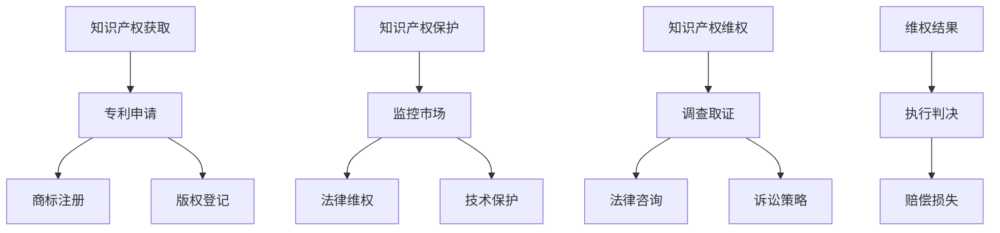

                 

### 《技术创业的知识产权保护：专利、商标与版权》

#### 关键词：
- 知识产权保护
- 技术创业
- 专利
- 商标
- 版权
- 知识产权战略
- 维权案例

#### 摘要：
本文旨在探讨技术创业领域中的知识产权保护问题。通过对专利、商标和版权的基本概念、申请流程、保护范围及其在企业中的应用进行分析，文章揭示了知识产权保护在技术创业中的重要性。同时，本文结合实战案例，详细介绍了知识产权获取、保护和运用的具体策略，为技术创业企业提供了实用的知识产权保护指导。

----------------------------------------------------------------

### 目录大纲

#### 《技术创业的知识产权保护：专利、商标与版权》

## 第一部分：知识产权基础

### 第1章：知识产权概述

#### 1.1 知识产权的定义与重要性

#### 1.2 知识产权的种类

#### 1.3 知识产权的保护范围

#### 1.4 知识产权的法律体系

#### 1.5 知识产权的管理

#### 1.6 知识产权的发展趋势

#### 1.7 知识产权在中国的发展

## 第二部分：知识产权在企业中的应用

### 第2章：专利

#### 2.1 专利的基本概念

#### 2.2 专利的申请流程

#### 2.3 专利的维护与保护

#### 2.4 专利的价值评估

### 第3章：商标

#### 3.1 商标的基本概念

#### 3.2 商标的注册流程

#### 3.3 商标的维权策略

#### 3.4 商标的价值评估

### 第4章：版权

#### 4.1 版权的基本概念

#### 4.2 版权的登记和保护

#### 4.3 版权的维权途径

## 第三部分：知识产权纠纷处理与维权

### 第5章：知识产权侵权识别

#### 5.1 专利侵权的识别

#### 5.2 商标侵权的识别

#### 5.3 版权侵权的识别

### 第6章：知识产权纠纷处理

#### 6.1 知识产权纠纷的处理流程

#### 6.2 知识产权纠纷的调解与仲裁

#### 6.3 知识产权纠纷的诉讼策略

### 第7章：知识产权维权案例分析

#### 7.1 专利维权案例解析

#### 7.2 商标维权案例解析

#### 7.3 版权维权案例解析

## 附录

### 附录A：知识产权保护工具与资源

#### A.1 专利检索工具

#### A.2 商标查询工具

#### A.3 版权登记机构与资源

#### A.4 知识产权维权平台

### 附录B：知识产权保护流程图

#### B.1 专利申请流程图

#### B.2 商标注册流程图

#### B.3 版权登记流程图

### 附录C：知识产权维权策略示例

#### C.1 专利维权策略示例

#### C.2 商标维权策略示例

#### C.3 版权维权策略示例

----------------------------------------------------------------

## 第一部分：知识产权基础

### 第1章：知识产权概述

#### 1.1 知识产权的定义与重要性

知识产权（Intellectual Property，简称IP）是指由人类智力劳动创造的成果所享有的权利。它涵盖了专利、商标、版权、商业秘密等多种形式。知识产权的定义可以从以下几个方面进行理解：

1. **专利**：专利是指对发明创造所授予的独占权利，包括发明专利、实用新型专利和外观设计专利。它保护发明人的技术解决方案，使其在一定时间内（通常为20年）内无法被他人复制、使用或销售。
   
2. **商标**：商标是用于区别商品或服务来源的标志。商标注册后，商标持有人有权禁止他人未经许可使用与其相同或相似的商标。商标的有效期为10年，可以无限期续展。

3. **版权**：版权是指对文学、艺术和科学作品享有的权利，包括复制权、发行权、表演权、展示权、改编权等。版权通常在作品创作完成后自动产生，保护期为作者终生及其死后50年。

4. **商业秘密**：商业秘密是指不为公众所知悉、具有商业价值、经权利人采取保密措施的技术信息和经营信息。商业秘密的保护期限没有固定期限，只要权利人采取合理的保密措施，就可以长期保护。

知识产权的重要性体现在以下几个方面：

1. **激励创新**：知识产权保护制度为创新者提供了法律保障，使其能够从创新成果中获益，从而激励更多的个人和企业投入到创新活动中。

2. **提高竞争力**：拥有知识产权的企业可以在市场上拥有独特的竞争优势，通过独占技术、品牌形象和作品内容来吸引消费者。

3. **商业价值**：知识产权可以转化为企业的资产，通过转让、许可、投资等方式实现商业价值最大化。

4. **促进经济发展**：知识产权保护有助于提高国家的科技水平和创新能力，推动经济增长。

#### 1.2 知识产权的种类

知识产权的种类主要包括专利、商标、版权和商业秘密。每种知识产权都有其独特的特点和保护范围。

1. **专利**：
   - **发明专利**：保护具有高度技术创造性的发明，如新型机械、化学物质等。
   - **实用新型专利**：保护具有实用性的技术改进，如改进的机械结构、产品设计等。
   - **外观设计专利**：保护产品的外观设计，如家具、手机等。

2. **商标**：
   - **文字商标**：由文字组成的商标，如“可口可乐”。
   - **图形商标**：由图形组成的商标，如苹果公司的苹果标志。
   - **组合商标**：由文字和图形组合而成的商标，如“肯德基”的KFC标志。

3. **版权**：
   - **文学作品版权**：保护小说、诗歌、剧本等文学作品的原创性。
   - **音乐作品版权**：保护歌曲、音乐作品等的原创性。
   - **艺术作品版权**：保护绘画、雕塑、摄影等艺术作品的原创性。

4. **商业秘密**：
   - **技术秘密**：如制造工艺、配方等。
   - **经营秘密**：如客户名单、市场战略等。

#### 1.3 知识产权的保护范围

知识产权的保护范围因类型而异，但通常包括以下几个方面：

1. **专利的保护范围**：
   - **发明本身**：专利保护的是发明的内容，而不是发明的具体实现形式。
   - **发明的实施方法**：包括制造、使用、销售、进口等方法。
   - **发明的应用**：指发明在不同领域或场景下的实际应用。

2. **商标的保护范围**：
   - **商标的标识**：包括文字、图形、颜色组合等。
   - **商标的使用**：包括在商品或服务上的实际使用。

3. **版权的保护范围**：
   - **作品的物质形式**：如书籍、唱片、电影等。
   - **作品的创作内容**：如文字、音乐、艺术作品等。
   - **作品的传播方式**：如网络传播、展示等。

#### 1.4 知识产权的法律体系

知识产权的法律体系包括国内法和国际法。国内法主要由《专利法》、《商标法》、《著作权法》等构成，这些法律为知识产权的获取、保护和运用提供了法律依据。国际法主要包括世界知识产权组织（WIPO）等国际组织的规则和条约，如《伯尔尼公约》、《巴黎公约》等。

#### 1.5 知识产权的管理

知识产权的管理包括获取、保护和运用三个环节。

1. **知识产权的获取**：
   - **专利申请**：通过提交专利申请文件，经审查后获得专利权。
   - **商标注册**：向商标局提交商标注册申请，经审查后获得商标权。
   - **版权登记**：将作品向版权登记机构进行登记，获得版权证明。

2. **知识产权的保护**：
   - **维权诉讼**：当知识产权受到侵犯时，通过法律手段进行维权。
   - **侵权纠纷处理**：解决知识产权纠纷，维护权利人的合法权益。

3. **知识产权的运用**：
   - **许可**：许可他人使用知识产权，获取许可费用。
   - **转让**：将知识产权转让给他人，获取转让收益。
   - **投资**：将知识产权作为投资，获取投资回报。

#### 1.6 知识产权的发展趋势

1. **知识产权国际化的趋势**：
   - 随着全球化的发展，知识产权的国际化趋势日益明显。跨国知识产权纠纷日益增多，企业需要关注国际知识产权动态，提升国际化知识产权管理水平。

2. **知识产权数字化管理的趋势**：
   - 随着数字技术的发展，知识产权的数字化管理成为趋势。企业可以利用数字化工具，提高知识产权管理的效率和准确性。

3. **知识产权保护力度的加强**：
   - 各国政府和社会各界对知识产权保护的力度不断加强。企业需要建立健全的知识产权保护机制，确保自身的知识产权不受侵害。

#### 1.7 知识产权在中国的发展

1. **中国知识产权法律体系的完善**：
   - 近年来，中国不断加强知识产权法律体系建设，提高知识产权保护水平。中国已加入多项国际知识产权条约，积极参与国际知识产权合作。

2. **中国知识产权产业的快速发展**：
   - 中国知识产权产业在过去几十年取得了长足发展，已成为全球知识产权大国之一。中国企业在知识产权的创造、申请和保护方面取得了显著成绩。

3. **中国企业在知识产权保护方面的挑战**：
   - 中国企业在知识产权保护方面仍然面临诸多挑战，包括知识产权侵权现象严重、知识产权管理水平不高等。企业需要提高知识产权保护意识，加强知识产权管理。

## 本章总结

本章对知识产权的定义、种类、保护范围、法律体系、管理、发展趋势等方面进行了详细介绍，为后续章节的讨论奠定了基础。在技术创业中，知识产权保护具有重要意义，企业需要建立健全的知识产权保护机制，以应对日益严峻的知识产权环境。接下来，我们将分别介绍专利、商标和版权的相关内容，深入探讨其在技术创业中的应用策略。


## 第2章：专利

专利是技术创业企业中最为重要的知识产权之一。它不仅能够保护企业的技术成果，还能为企业带来商业价值。本章节将详细探讨专利的基本概念、申请流程、维护与保护，以及专利的价值评估。

### 2.1 专利的基本概念

#### 2.1.1 专利的定义

专利是一种由政府授予的权利，它允许专利权人对其发明创造在一段特定时间内享有独占权利。专利通常包括发明专利、实用新型专利和外观设计专利。

- **发明专利**：保护具有高度技术创造性的发明，如新型机械、化学物质等。
- **实用新型专利**：保护具有实用性的技术改进，如改进的机械结构、产品设计等。
- **外观设计专利**：保护产品的外观设计，如家具、手机等。

#### 2.1.2 专利的特点

专利具有以下几个主要特点：

1. **独占性**：专利权人有权禁止他人在未经授权的情况下制造、使用、销售或进口其专利产品或使用其专利方法。
2. **地域性**：专利仅在授予专利权的国家或地区有效。如果企业希望在多个国家获得保护，需要在每个国家分别申请专利。
3. **时间性**：专利保护期有限，通常为20年（发明专利），10年（实用新型专利）或15年（外观设计专利），期满后专利将进入公有领域，任何人都可以自由使用。

#### 2.1.3 专利的意义

专利对于技术创业企业具有重要意义：

1. **保护创新**：专利保护企业的创新成果，防止他人抄袭或复制，确保企业在市场竞争中具有优势。
2. **商业价值**：专利可以作为企业的资产进行转让、许可或投资，增加企业的商业价值。
3. **市场壁垒**：专利可以作为市场壁垒，阻止竞争对手进入市场，保护企业的市场份额。
4. **国际竞争力**：在全球化的背景下，拥有专利可以提升企业的国际竞争力，促进技术和市场的国际化。

### 2.2 专利的申请流程

#### 2.2.1 专利申请的基本步骤

专利申请通常包括以下几个基本步骤：

1. **技术调研**：在申请专利前，需要对相关技术进行调研，以确保所申请的专利具有新颖性、创造性和实用性。
2. **专利申请文件的准备**：准备专利申请文件，包括专利请求书、说明书、权利要求书、摘要等。这些文件需要详细描述发明的技术内容，以及发明的保护范围。
3. **提交专利申请**：将专利申请文件提交给国家知识产权局（或相应国家的知识产权局）。
4. **审查**：专利局对申请文件进行初步审查，包括形式审查和实质审查。形式审查主要检查申请文件的格式是否符合规定，实质审查则评估发明的新颖性、创造性和实用性。
5. **公布和授权**：如果专利申请通过审查，专利将被公布，并在一定期限内（通常为3-6个月）进行授权。专利授权后，企业将获得专利证书。

#### 2.2.2 专利申请的关键要素

在专利申请过程中，以下关键要素至关重要：

1. **新颖性**：发明必须是在申请日之前未被公开披露的。
2. **创造性**：发明与现有技术相比，必须具有显著的改进或创新。
3. **实用性**：发明必须能够在产业上应用。
4. **权利要求书**：权利要求书是专利保护范围的核心，需要准确、清晰地描述发明的保护内容。

#### 2.2.3 专利申请的常见问题及解决方案

1. **问题**：如何确保专利申请的新颖性？
   - **解决方案**：在申请前，进行充分的技术调研，确保发明在申请日之前未被公开披露。同时，可以使用保密协议等方式保护发明内容。

2. **问题**：如何避免权利要求书过于宽泛或狭窄？
   - **解决方案**：在撰写权利要求书时，需要进行细致的分析和思考，确保权利要求书的范围既全面又明确。

3. **问题**：专利申请过程中如何应对审查意见？
   - **解决方案**：积极与专利审查员沟通，根据审查意见进行修改和完善申请文件。

### 2.3 专利的维护与保护

#### 2.3.1 专利维护的重要性

专利维护是确保专利有效性和保护范围的关键。以下原因说明了专利维护的重要性：

1. **专利有效性的维持**：专利需要定期缴纳年费，否则将失去专利权。维护专利有助于确保专利权的持续有效。
2. **专利范围的维持**：在专利授权后，可能会出现新的技术发展，原有的专利保护范围可能不够全面。通过维护，可以调整专利权利要求书，扩大专利保护范围。
3. **专利侵权诉讼**：维护专利有助于企业在面对专利侵权诉讼时提供有力的法律依据。

#### 2.3.2 专利保护的主要措施

为了有效保护专利，企业可以采取以下措施：

1. **监控市场**：定期监测市场，及时发现潜在的侵权行为。
2. **维权诉讼**：当专利权受到侵犯时，通过法律手段进行维权，包括提起诉讼、申请禁令等。
3. **许可协议**：签订许可协议，允许他人使用专利技术，同时获得许可费用。
4. **专利池建设**：通过建立专利池，整合多个专利，提高专利组合的整体价值。

#### 2.3.3 专利纠纷的处理

专利纠纷通常涉及专利侵权、专利无效等。以下步骤可以帮助企业处理专利纠纷：

1. **调查取证**：收集侵权证据，包括侵权产品、销售记录等。
2. **律师介入**：聘请专业律师，制定维权策略。
3. **诉讼或调解**：根据纠纷的性质和影响，选择合适的诉讼或调解途径。
4. **和解**：在必要时，与侵权方达成和解协议，以减少法律成本和时间消耗。

### 2.4 专利的价值评估

#### 2.4.1 专利价值评估的方法

专利价值评估是技术创业企业中的一项重要任务，以下是一些常用的专利价值评估方法：

1. **成本法**：基于专利的开发成本和后续维护成本进行评估。
2. **市场法**：基于市场上类似专利的交易价格进行评估。
3. **收益法**：基于专利预期带来的未来收益进行评估。

#### 2.4.2 影响专利价值的因素

影响专利价值的因素包括：

1. **专利的技术质量**：专利的技术先进性和创新程度。
2. **专利的保护范围**：专利权利要求书描述的范围越全面，专利价值越高。
3. **市场需求**：专利技术是否符合市场需求。
4. **专利的稳定性**：专利的法律稳定性，包括专利的有效期和潜在的法律风险。
5. **专利的利用状况**：专利的实际运用情况，包括许可、转让、投资等。

#### 2.4.3 专利价值评估的案例分析

以下是一个专利价值评估的案例分析：

**案例：一家科技公司拥有一项关于智能家居系统的专利，该专利在市场上具有较高的需求。**

- **技术质量**：该专利的技术质量较高，具有创新性和实用性。
- **保护范围**：专利权利要求书描述了智能家居系统的各个功能模块，保护范围全面。
- **市场需求**：智能家居市场正在迅速增长，对该技术的需求较高。
- **专利稳定性**：专利已在多个国家获得授权，法律稳定性较高。
- **利用状况**：公司已与多家厂商签订许可协议，实现专利的商业化。

基于以上因素，该专利的价值可能较高，企业可以考虑通过转让、许可或投资等方式实现其价值。

## 本章总结

本章详细介绍了专利的基本概念、申请流程、维护与保护以及专利的价值评估。专利作为技术创业企业的重要资产，能够为企业带来商业价值和保护创新成果。企业在申请专利时需要注意新颖性、创造性和实用性，同时需要定期维护专利，确保其有效性和保护范围。在专利纠纷中，企业需要积极维权，维护自身合法权益。通过合理的专利价值评估，企业可以更好地利用专利资源，实现商业目标。在下一章中，我们将探讨商标的基本概念、注册流程和维权策略。


## 第3章：商标

商标是企业品牌的重要组成部分，它不仅能够帮助企业区分产品或服务，还能提升企业的市场竞争力和品牌价值。本章将详细探讨商标的基本概念、注册流程、维权策略以及商标的价值评估。

### 3.1 商标的基本概念

#### 3.1.1 商标的定义

商标是一种用于区别商品或服务来源的标志，它可以是文字、图形、字母、数字、三维标志、颜色组合等。商标通过法律注册获得保护，商标权人有权禁止他人在未经许可的情况下使用相同或相似的商标。

#### 3.1.2 商标的特点

商标具有以下几个主要特点：

1. **识别性**：商标的主要功能是区分不同企业的产品或服务，因此商标必须具有明显的识别性。
2. **独占性**：商标注册后，商标权人享有对该商标的独占使用权，有权禁止他人未经许可使用相同或相似的商标。
3. **地域性**：商标在特定国家或地区注册后，仅在该国家或地区有效。如需在其他国家或地区获得保护，需进行国际注册或逐一注册。
4. **续展性**：商标的有效期为10年，到期后可以无限期续展，确保商标的长期保护。

#### 3.1.3 商标的意义

商标对企业的意义体现在以下几个方面：

1. **品牌建设**：商标是品牌的重要组成部分，有助于提升企业的品牌知名度和形象。
2. **市场区分**：商标有助于消费者识别和选择特定的产品或服务，从而提高市场竞争力。
3. **法律保护**：注册商标可以获得法律保护，防止他人侵犯商标权益，维护企业的合法权益。
4. **商业价值**：商标可以作为企业的资产，通过转让、许可等方式实现商业价值最大化。

### 3.2 商标的注册流程

#### 3.2.1 商标注册的基本步骤

商标注册通常包括以下几个基本步骤：

1. **商标查询**：在申请商标注册前，需要进行商标查询，确保拟申请的商标不存在冲突或相似商标。
2. **准备商标申请文件**：包括商标注册申请书、商标图样、申请人身份证明等。
3. **提交商标申请**：将商标申请文件提交给国家商标局（或相应国家的商标局）。
4. **审查**：商标局对申请文件进行形式审查和实质审查。形式审查主要检查申请文件的格式是否符合规定，实质审查则评估商标的显著性、是否具有识别性等。
5. **公告**：通过审查的商标将在官方期刊上进行公告，公告期为3个月，公众可以提出异议。
6. **注册和颁发证书**：公告期满无异议或异议被驳回后，商标将被注册，并颁发商标注册证书。

#### 3.2.2 商标注册的关键要素

在商标注册过程中，以下关键要素至关重要：

1. **商标的显著性**：商标应具有明显的识别性，易于消费者识别。
2. **商标的独特性**：商标应具有一定的独特性，避免与他人商标产生混淆。
3. **商标的合法性**：商标不得违反公序良俗，不得侵犯他人的在先权利。

#### 3.2.3 商标注册的常见问题及解决方案

1. **问题**：如何确保商标的显著性？
   - **解决方案**：选择具有独特性和识别性的商标，避免使用过于普通或常见的词语或图形。

2. **问题**：如何避免商标与他人商标产生混淆？
   - **解决方案**：在商标设计时，进行充分的市场调研和商标查询，确保商标的独特性和显著性。

3. **问题**：商标注册过程中如何应对审查意见？
   - **解决方案**：根据审查意见进行修改和完善商标申请文件，确保商标申请的合法性和显著性。

### 3.3 商标的维权策略

#### 3.3.1 商标维权的重要性

商标维权是保护企业商标权益的关键环节。以下原因说明了商标维权的重要性：

1. **防止侵权**：商标维权有助于防止他人未经许可使用相同或相似的商标，维护企业的品牌形象和市场竞争力。
2. **维护合法权益**：商标维权有助于维护企业商标的合法权益，防止他人侵犯商标权益，确保企业的长期发展。
3. **提高品牌价值**：商标维权有助于提高企业的品牌价值和市场地位，增强消费者的信任和忠诚度。

#### 3.3.2 商标维权的主要措施

为了有效进行商标维权，企业可以采取以下措施：

1. **监控市场**：定期监测市场，及时发现潜在的侵权行为。
2. **法律维权**：通过法律手段进行维权，包括提起诉讼、申请禁令等。
3. **许可和授权**：与侵权方进行谈判，签订许可或授权协议，以获取一定的经济利益。
4. **非诉讼手段**：通过协商、调解等方式解决商标纠纷，减少法律成本和时间消耗。

#### 3.3.3 商标纠纷的处理

商标纠纷通常涉及商标侵权、商标无效等。以下步骤可以帮助企业处理商标纠纷：

1. **调查取证**：收集侵权证据，包括侵权产品、销售记录等。
2. **律师介入**：聘请专业律师，制定维权策略。
3. **诉讼或调解**：根据纠纷的性质和影响，选择合适的诉讼或调解途径。
4. **和解**：在必要时，与侵权方达成和解协议，以减少法律成本和时间消耗。

### 3.4 商标的价值评估

#### 3.4.1 商标价值评估的方法

商标价值评估是技术创业企业中的一项重要任务，以下是一些常用的商标价值评估方法：

1. **成本法**：基于商标的设计、注册、维护等成本进行评估。
2. **市场法**：基于市场上类似商标的交易价格进行评估。
3. **收益法**：基于商标预期带来的未来收益进行评估。

#### 3.4.2 影响商标价值的因素

影响商标价值的因素包括：

1. **品牌的知名度**：品牌知名度越高，商标价值越高。
2. **市场的需求**：商标所代表的产品或服务市场需求越大，商标价值越高。
3. **商标的稳定性**：商标的法律稳定性，包括商标的有效期和潜在的法律风险。
4. **商标的利用状况**：商标的实际运用情况，包括许可、转让、投资等。

#### 3.4.3 商标价值评估的案例分析

以下是一个商标价值评估的案例分析：

**案例：一家知名科技公司拥有一项著名商标，该商标在市场上具有较高的知名度和市场需求。**

- **品牌的知名度**：商标在国内外享有较高的知名度，品牌认知度高。
- **市场需求**：科技产品市场需求旺盛，该商标代表的产品广受欢迎。
- **商标的稳定性**：商标已在多个国家获得注册，法律稳定性较高。
- **商标的利用状况**：公司通过许可、授权等方式，实现了商标的商业化运作。

基于以上因素，该商标的价值可能较高，企业可以考虑通过转让、许可或投资等方式实现其价值。

## 本章总结

本章详细介绍了商标的基本概念、注册流程、维权策略以及商标的价值评估。商标作为企业品牌的重要组成部分，能够帮助企业区分产品或服务，提升市场竞争力和品牌价值。企业在注册商标时需要注意显著性、独特性和合法性。在商标维权中，企业需要采取有效的措施，维护自身合法权益。通过合理的商标价值评估，企业可以更好地利用商标资源，实现商业目标。在下一章中，我们将探讨版权的基本概念、登记和保护以及维权途径。


## 第4章：版权

版权，即著作权，是创作者对其原创作品享有的法律权利。它涵盖了文学、艺术、音乐、戏剧、电影、摄影等多个领域。版权保护不仅能够激励创作，还能为创作者带来经济利益。本章将详细探讨版权的基本概念、登记和保护，以及版权的维权途径。

### 4.1 版权的基本概念

#### 4.1.1 版权的定义

版权，又称著作权，是指创作者对其创作的文学、艺术和科学作品享有的专有权利。版权包括复制权、发行权、表演权、展示权、改编权、翻译权等多个方面。

#### 4.1.2 版权的特点

版权具有以下几个主要特点：

1. **自动产生**：版权在作品创作完成时自动产生，无需注册或申请。
2. **地域性**：版权在各个国家或地区都受到保护，但受保护的范围可能有所不同。
3. **时间性**：版权的保护期限因作品的类型而异。一般来说，文学、戏剧、音乐作品等版权保护期为作者终生及其死后50年；电影、摄影作品等版权保护期为首次发布后的50年。

#### 4.1.3 版权的意义

版权对创作者和整个社会具有重要意义：

1. **激励创作**：版权保护为创作者提供了经济利益，激励了更多的创作活动。
2. **文化传承**：版权保护有助于保护和传承人类的文学、艺术和科学成果。
3. **经济利益**：版权可以成为创作者的重要资产，通过转让、许可等方式实现商业价值。
4. **社会和谐**：版权保护有助于维护创作者的合法权益，促进社会和谐与稳定。

### 4.2 版权的登记和保护

#### 4.2.1 版权登记的基本流程

版权登记是确认创作者版权归属的重要手段。版权登记的基本流程包括：

1. **准备登记文件**：包括版权登记申请书、作品样本、创作者身份证明等。
2. **提交登记申请**：将准备好的文件提交给版权登记机构。
3. **审核和颁发证书**：版权登记机构对申请文件进行审核，审核通过后颁发版权登记证书。

#### 4.2.2 版权保护的主要措施

为了有效保护版权，创作者和企业可以采取以下措施：

1. **版权登记**：通过版权登记，确认作品的版权归属，提高版权保护的法律效力。
2. **监控市场**：定期监控市场，及时发现侵权行为。
3. **法律维权**：当版权受到侵犯时，通过法律手段进行维权，包括提起诉讼、申请禁令等。
4. **许可和授权**：与侵权方进行谈判，签订许可或授权协议，以获取一定的经济利益。

#### 4.2.3 版权纠纷的处理

版权纠纷通常涉及版权侵权、版权无效等。以下步骤可以帮助企业或创作者处理版权纠纷：

1. **调查取证**：收集侵权证据，包括侵权作品、销售记录等。
2. **律师介入**：聘请专业律师，制定维权策略。
3. **诉讼或调解**：根据纠纷的性质和影响，选择合适的诉讼或调解途径。
4. **和解**：在必要时，与侵权方达成和解协议，以减少法律成本和时间消耗。

### 4.3 版权的维权途径

#### 4.3.1 版权维权的主要途径

版权维权的主要途径包括法律手段和非法律手段：

1. **法律手段**：
   - **诉讼**：通过法院提起诉讼，寻求法律救济。
   - **仲裁**：通过仲裁机构进行仲裁，解决版权纠纷。
   - **调解**：通过调解委员会进行调解，达成和解。

2. **非法律手段**：
   - **自行维权**：通过警告、停止侵权、赔偿损失等方式自行解决侵权问题。
   - **投诉**：向版权登记机构、行业协会等投诉侵权行为。
   - **协商**：与侵权方进行协商，达成和解协议。

#### 4.3.2 版权维权的案例分析

以下是一个版权维权的案例分析：

**案例：一位作家发现其一部小说未经授权被他人上传至网络平台，且被广泛传播。**

- **调查取证**：作家收集了侵权网站的相关信息，包括网站链接、侵权内容等。
- **律师介入**：作家聘请了专业律师，制定维权策略。
- **法律手段**：
  - **投诉**：向网站管理员投诉侵权行为，要求删除侵权内容。
  - **诉讼**：向法院提起诉讼，要求侵权方停止侵权行为，赔偿损失。
- **和解**：经过律师与侵权方的谈判，侵权方同意删除侵权内容，并支付一定的赔偿金。

通过这个案例，我们可以看到，版权维权需要结合法律手段和非法律手段，以最有效的方式保护创作者的合法权益。

### 4.4 版权的价值评估

#### 4.4.1 版权价值评估的方法

版权价值评估是技术创业企业中的一项重要任务，以下是一些常用的版权价值评估方法：

1. **成本法**：基于版权的创建、维护等成本进行评估。
2. **市场法**：基于市场上类似版权的交易价格进行评估。
3. **收益法**：基于版权预期带来的未来收益进行评估。

#### 4.4.2 影响版权价值的因素

影响版权价值的因素包括：

1. **作品的知名度**：知名度越高的作品，版权价值越高。
2. **市场需求**：市场需求越大的作品，版权价值越高。
3. **作品的独创性**：作品的独创性越高，版权价值越高。
4. **版权的稳定性**：版权的法律稳定性，包括版权的有效期和潜在的法律风险。

#### 4.4.3 版权价值评估的案例分析

以下是一个版权价值评估的案例分析：

**案例：一位著名作家创作了一部畅销小说，该小说在国内外市场均获得了极高的关注度。**

- **作品的知名度**：小说在国内外市场均有较高的知名度，读者群体广泛。
- **市场需求**：小说市场需求旺盛，已经有多家出版社和影视公司表示兴趣。
- **作品的独创性**：小说具有较高的独创性，创作手法新颖，深受读者喜爱。
- **版权的稳定性**：小说的版权在多个国家获得保护，法律稳定性较高。

基于以上因素，该小说的版权价值可能较高，企业可以考虑通过版权转让、许可或投资等方式实现其价值。

## 本章总结

本章详细介绍了版权的基本概念、登记和保护，以及版权的维权途径。版权作为创作者的重要资产，能够为其带来经济利益和文化传承。在版权登记和保护过程中，企业或创作者需要采取有效的措施，确保作品的合法权益。在版权维权中，企业或创作者可以通过法律手段和非法律手段，结合多种方式维护自身权益。通过合理的版权价值评估，企业可以更好地利用版权资源，实现商业目标。在下一章中，我们将探讨知识产权在企业战略规划中的应用。


## 第5章：知识产权战略规划

在技术创业领域，知识产权战略规划至关重要。合理的知识产权战略能够为企业提供强有力的竞争优势，保护创新成果，实现商业价值最大化。本章将详细探讨知识产权战略在企业战略规划中的地位、知识产权风险管理以及知识产权价值的评估方法。

### 5.1 知识产权战略在企业战略中的地位

#### 5.1.1 知识产权战略的定义

知识产权战略是指企业为了获取、保护、运用和管理知识产权，实现商业目标而制定的一系列政策和措施。知识产权战略旨在通过有效的知识产权管理，提升企业的市场竞争力，确保企业的长期发展。

#### 5.1.2 知识产权战略的重要性

知识产权战略在企业战略规划中的地位和重要性体现在以下几个方面：

1. **保护创新成果**：知识产权战略能够确保企业的创新成果得到有效保护，防止他人未经许可使用或复制，从而维护企业的竞争优势。
2. **提高市场竞争力**：通过知识产权战略，企业可以建立和巩固品牌优势，提高市场竞争力，吸引更多消费者和合作伙伴。
3. **实现商业价值**：知识产权可以作为企业的资产，通过转让、许可、投资等方式实现商业价值最大化。
4. **促进国际化发展**：知识产权战略有助于企业开拓国际市场，通过跨国知识产权布局，提升企业的全球影响力。

#### 5.1.3 知识产权战略的框架

知识产权战略的框架主要包括以下几个方面：

1. **知识产权的获取策略**：确定企业需要保护的知识产权类型和领域，制定具体的获取计划。
2. **知识产权的保护策略**：建立知识产权保护机制，包括维权诉讼、侵权监测、法律咨询等。
3. **知识产权的运用策略**：通过知识产权许可、转让、投资等方式，实现知识产权的商业化。
4. **知识产权的管理策略**：建立知识产权管理体系，包括知识产权的登记、评估、监控、维护等。

### 5.2 知识产权风险管理

#### 5.2.1 知识产权风险管理的定义

知识产权风险管理是指企业识别、评估、监控和应对知识产权相关风险的过程。知识产权风险管理旨在通过有效管理，降低知识产权风险对企业运营和发展的负面影响。

#### 5.2.2 知识产权风险的主要类型

知识产权风险主要包括以下几个方面：

1. **侵权风险**：企业可能侵犯他人的知识产权，导致法律诉讼和赔偿风险。
2. **泄露风险**：企业可能泄露其商业秘密或未注册的知识产权，导致竞争对手获取竞争优势。
3. **保护失效风险**：企业可能未能及时维护知识产权，导致知识产权保护失效。
4. **国际风险**：跨国知识产权纠纷可能给企业带来复杂的法律风险和国际市场风险。

#### 5.2.3 知识产权风险管理的方法

为了有效管理知识产权风险，企业可以采取以下方法：

1. **风险评估**：对企业的知识产权进行全面的评估，识别潜在的风险点和风险程度。
2. **风险监控**：建立知识产权风险监控机制，定期检查知识产权的有效性和安全性。
3. **法律咨询**：聘请专业律师提供法律咨询，确保企业的知识产权获取和保护符合法律规定。
4. **培训和教育**：对员工进行知识产权培训，提高员工的知识产权保护意识和能力。

### 5.3 知识产权价值的评估方法

#### 5.3.1 知识产权价值评估的定义

知识产权价值评估是指对企业知识产权的经济价值进行评估，以确定其商业价值和市场价值。

#### 5.3.2 知识产权价值评估的方法

知识产权价值评估的方法主要包括以下几个方面：

1. **成本法**：基于知识产权的开发成本、维护成本等计算其经济价值。
2. **市场法**：参考市场上类似知识产权的交易价格，进行评估。
3. **收益法**：基于知识产权预期带来的未来收益，进行评估。

#### 5.3.3 影响知识产权价值的因素

影响知识产权价值的因素包括：

1. **知识产权的质量**：知识产权的创新程度、技术含量、市场前景等。
2. **市场需求**：知识产权所代表的技术或产品在市场中的需求程度。
3. **知识产权的稳定性**：知识产权的法律保护期限和稳定性。
4. **知识产权的保护范围**：知识产权的保护范围越广，价值越高。

#### 5.3.4 知识产权价值评估的案例分析

以下是一个知识产权价值评估的案例分析：

**案例：一家科技公司拥有一项关于智能家居系统的核心专利，该专利在市场上具有较高的需求。**

- **知识产权的质量**：该专利的技术质量较高，具有创新性和实用性。
- **市场需求**：智能家居市场正在迅速增长，对该技术的需求较高。
- **知识产权的稳定性**：该专利已在多个国家获得授权，法律稳定性较高。
- **知识产权的保护范围**：专利权利要求书描述了智能家居系统的各个功能模块，保护范围全面。

基于以上因素，该专利的价值可能较高，企业可以考虑通过转让、许可或投资等方式实现其价值。

### 5.4 知识产权战略的案例分析

以下是一个知识产权战略的案例分析：

**案例：某科技公司通过有效的知识产权战略，成功提升了市场竞争力。**

- **获取策略**：公司积极申请专利和商标，保护其创新技术和品牌形象。
- **保护策略**：公司建立完善的知识产权保护机制，包括法律维权和侵权监测。
- **运用策略**：公司通过专利许可和转让，实现知识产权的商业化，增加收入。
- **管理策略**：公司建立知识产权管理体系，确保知识产权的有效登记和维护。

通过这个案例，我们可以看到，有效的知识产权战略能够帮助企业提升市场竞争力，实现商业价值最大化。

### 5.5 知识产权战略的制定与实施

#### 5.5.1 制定知识产权战略的步骤

制定知识产权战略的步骤包括：

1. **明确目标**：确定企业知识产权战略的目标和愿景。
2. **评估现状**：评估企业的现有知识产权状况，包括已获取的知识产权和潜在的风险。
3. **制定策略**：制定具体的知识产权获取、保护、运用和管理策略。
4. **实施计划**：制定详细的实施计划，包括时间表、责任分配和预算。
5. **监控和评估**：定期监控知识产权战略的实施情况，评估战略的有效性，并进行调整。

#### 5.5.2 实施知识产权战略的关键要素

实施知识产权战略的关键要素包括：

1. **高层领导的支持**：知识产权战略的制定和实施需要高层领导的支持和重视。
2. **专业团队的配备**：建立专业的知识产权团队，负责战略的制定、实施和监控。
3. **资源的投入**：确保有足够的资源，包括人力、财力和技术支持，实施知识产权战略。
4. **持续改进**：定期评估和改进知识产权战略，以适应市场和技术的变化。

### 5.6 知识产权战略的案例分析

以下是一个知识产权战略的案例分析：

**案例：某互联网公司通过有效的知识产权战略，成功在市场竞争中脱颖而出。**

- **获取策略**：公司积极申请专利和商标，保护其创新技术和品牌形象。
- **保护策略**：公司建立完善的知识产权保护机制，包括法律维权和侵权监测。
- **运用策略**：公司通过专利许可和转让，实现知识产权的商业化，增加收入。
- **管理策略**：公司建立知识产权管理体系，确保知识产权的有效登记和维护。

通过这个案例，我们可以看到，有效的知识产权战略能够帮助企业提升市场竞争力，实现商业价值最大化。

### 5.7 本章总结

本章详细探讨了知识产权战略规划在企业战略中的地位、知识产权风险管理以及知识产权价值的评估方法。合理的知识产权战略能够为企业提供强有力的竞争优势，保护创新成果，实现商业价值最大化。企业需要通过有效的知识产权管理，降低知识产权风险，确保知识产权的价值得到充分发挥。通过本章的学习，企业可以更好地制定和实施知识产权战略，提升市场竞争力。在下一章中，我们将探讨知识产权的获取与保护策略。


## 第6章：知识产权的获取与保护

在技术创业中，知识产权的获取与保护至关重要。有效的知识产权策略不仅能够保护企业的创新成果，还能提升企业的市场竞争力和品牌价值。本章将详细探讨专利、商标和版权的获取策略，以及各自的保护方法。

### 6.1 专利的获取策略

#### 6.1.1 专利申请的重要性

专利申请是获取专利权的关键步骤。一个成功的专利申请可以帮助企业保护其技术秘密，防止竞争对手复制或盗用技术，从而确保市场优势。

#### 6.1.2 专利申请的基本流程

专利申请的基本流程通常包括以下几个步骤：

1. **技术调研**：在申请专利之前，对相关技术进行深入调研，确保所申请的专利具有新颖性、创造性和实用性。
2. **撰写专利申请文件**：包括专利请求书、说明书、权利要求书、摘要等。这些文件需要详细描述发明的技术内容、实现方式和保护范围。
3. **提交专利申请**：将专利申请文件提交给国家知识产权局或相应国家的知识产权局。
4. **审查**：专利局对申请文件进行初步审查和实质审查。初步审查主要检查申请文件的格式是否符合规定，实质审查则评估发明的新颖性、创造性和实用性。
5. **授权与维护**：通过审查后，专利将被授权，并获得专利证书。专利权人需要定期缴纳年费，以维持专利的有效性。

#### 6.1.3 专利申请的策略

在专利申请过程中，企业可以采取以下策略：

1. **多元申请**：针对不同的技术领域和市场，进行多元化申请，确保不同领域的创新成果得到保护。
2. **抢先申请**：在关键技术创新完成后，尽快提交专利申请，以抢先获得专利权。
3. **保密措施**：在申请前，对技术秘密采取严格的保密措施，防止信息泄露。
4. **国际申请**：在必要时，通过PCT（国际专利合作条约）途径进行国际申请，以获得全球范围内的专利保护。

### 6.2 商标的获取策略

#### 6.2.1 商标注册的重要性

商标注册是保护企业品牌和品牌价值的关键步骤。通过商标注册，企业可以在法律上拥有对商标的独占使用权，防止他人未经许可使用相同或相似的商标。

#### 6.2.2 商标注册的基本流程

商标注册的基本流程通常包括以下几个步骤：

1. **商标查询**：在申请商标注册之前，对拟申请的商标进行查询，确保不存在与已注册商标冲突或相似商标。
2. **准备商标申请文件**：包括商标注册申请书、商标图样、申请人身份证明等。
3. **提交商标申请**：将商标申请文件提交给国家商标局或相应国家的商标局。
4. **审查**：商标局对申请文件进行形式审查和实质审查。形式审查主要检查申请文件的格式是否符合规定，实质审查则评估商标的显著性、是否具有识别性等。
5. **公告**：通过审查的商标将在官方期刊上进行公告，公告期为3个月，公众可以提出异议。
6. **注册与维护**：公告期满无异议或异议被驳回后，商标将被注册，并颁发商标注册证书。商标权人需要定期缴纳年费，以维持商标的有效性。

#### 6.2.3 商标申请的策略

在商标申请过程中，企业可以采取以下策略：

1. **品牌差异化**：设计具有独特性和显著性的商标，以区别于竞争对手。
2. **分类申请**：针对不同的产品或服务，进行分类申请，确保商标在不同类别中获得保护。
3. **全球布局**：在必要时，进行国际商标注册，以保护品牌在全球市场中的权益。
4. **维护商标**：定期检查商标的使用情况，确保商标不失效或被撤销。

### 6.3 版权的获取策略

#### 6.3.1 版权自动产生的特点

版权具有自动产生的特点，即作品一旦创作完成，版权即自动产生，无需注册或申请。这意味着创作者自然拥有对其作品的版权。

#### 6.3.2 版权登记的重要性

尽管版权自动产生，但进行版权登记仍然具有重要意义：

1. **法律效力**：版权登记提供了法律上的证据，有助于在版权纠纷中证明创作者的权利。
2. **维权依据**：版权登记可以作为维权的有力依据，提高维权成功的可能性。
3. **国际化保护**：版权登记有助于在跨国纠纷中提供法律支持，确保作品在全球范围内的保护。

#### 6.3.3 版权登记的基本流程

版权登记的基本流程通常包括以下几个步骤：

1. **准备登记文件**：包括版权登记申请书、作品样本、创作者身份证明等。
2. **提交登记申请**：将准备好的文件提交给版权登记机构。
3. **审核和颁发证书**：版权登记机构对申请文件进行审核，审核通过后颁发版权登记证书。

#### 6.3.4 版权保护的策略

为了有效保护版权，企业可以采取以下策略：

1. **版权声明**：在作品上明确声明版权归属，以防止他人未经授权使用。
2. **合同保护**：与使用作品的第三方签订合同，明确版权归属和使用条款。
3. **监控市场**：定期监控市场，及时发现侵权行为。
4. **法律维权**：在版权受到侵犯时，通过法律手段进行维权，包括提起诉讼、申请禁令等。

### 6.4 知识产权保护的方法

知识产权保护是确保企业创新成果得到有效保护的关键。以下是一些常用的知识产权保护方法：

1. **法律保护**：通过法律手段，如提起诉讼、申请禁令等，保护知识产权。
2. **技术保护**：采用技术手段，如加密、数字签名等，防止作品被非法复制和使用。
3. **合同保护**：与合作伙伴签订合同，明确知识产权归属和使用条款。
4. **版权声明**：在作品上明确声明版权归属，以防止他人未经授权使用。

#### 6.4.1 法律保护

法律保护是知识产权保护的重要手段。以下是一些常见的法律保护方法：

1. **专利维权**：当专利受到侵犯时，可以通过提起专利侵权诉讼来维护专利权。
2. **商标维权**：当商标受到侵犯时，可以通过提起商标侵权诉讼来维护商标权。
3. **版权维权**：当版权受到侵犯时，可以通过提起版权侵权诉讼来维护版权。

#### 6.4.2 技术保护

技术保护是防止作品被非法复制和使用的重要手段。以下是一些常见的技术保护方法：

1. **数字版权管理（DRM）**：通过加密、数字签名等技术手段，限制未经授权的用户对作品的访问和使用。
2. **水印技术**：在作品中加入水印，以防止作品被非法复制和传播。
3. **访问控制**：通过设置访问权限，限制用户对作品的访问和使用。

#### 6.4.3 合同保护

合同保护是通过合同明确知识产权归属和使用条款，防止知识产权被侵犯的重要手段。以下是一些常见的合同保护方法：

1. **版权许可协议**：通过版权许可协议，授权第三方使用作品的特定权利，并获得相应报酬。
2. **技术转让协议**：通过技术转让协议，将知识产权转让给第三方，并获得转让收益。
3. **保密协议**：通过保密协议，确保合作伙伴不泄露企业的商业秘密。

#### 6.4.4 版权声明

版权声明是在作品上明确声明版权归属，防止他人未经授权使用作品的重要手段。以下是一些常见的版权声明方法：

1. **版权声明标签**：在作品上添加版权声明标签，明确版权归属和联系信息。
2. **版权声明页面**：在作品的开头或结尾添加版权声明页面，详细说明版权归属和使用条款。
3. **版权声明合同**：与使用作品的第三方签订版权声明合同，明确版权归属和使用条款。

### 6.5 知识产权获取与保护的案例分析

以下是一个知识产权获取与保护的案例分析：

**案例：某科技公司通过有效的知识产权策略，成功保护了其创新技术。**

- **专利获取**：公司申请了多项与智能家居技术相关的专利，保护其核心技术。
- **商标获取**：公司注册了与品牌名称和标志相关的商标，确保品牌不受侵犯。
- **版权获取**：公司对创作的软件代码、用户界面设计等进行了版权登记，保护其创意成果。

- **法律保护**：公司聘请了专业律师，建立了完善的知识产权保护机制，及时发现和处理侵权行为。

通过这个案例，我们可以看到，通过有效的知识产权获取与保护策略，企业能够确保其创新成果得到有效保护，提升市场竞争力和品牌价值。

### 6.6 知识产权保护的国际合作

随着全球化的深入发展，知识产权保护的国际合作变得尤为重要。以下是一些国际合作的方法：

1. **国际条约和协议**：参与国际知识产权条约和协议，如《伯尔尼公约》、《巴黎公约》等，以获得跨国知识产权保护。
2. **国际知识产权组织**：加入世界知识产权组织（WIPO）等国际组织，参与全球知识产权保护活动。
3. **跨国维权**：在跨国纠纷中，通过国际合作，共同维权，提高维权效果。

### 6.7 本章总结

本章详细探讨了知识产权的获取与保护策略，包括专利、商标和版权的获取方法以及保护手段。有效的知识产权获取与保护策略能够帮助企业保护创新成果，提升市场竞争力和品牌价值。企业需要根据自身情况和市场需求，制定合适的知识产权策略，并通过法律、技术、合同和声明等多种手段，确保知识产权得到有效保护。在下一章中，我们将探讨知识产权的运营与利用。


## 第7章：知识产权的运营与利用

知识产权的运营与利用是技术创业企业实现商业价值的重要环节。通过有效的知识产权运营策略，企业可以充分利用知识产权带来的经济利益，提高市场竞争力。本章将详细探讨知识产权许可与转让、知识产权国际化策略以及知识产权的商业化途径。

### 7.1 知识产权许可与转让

#### 7.1.1 知识产权许可的基本概念

知识产权许可是指知识产权权利人（许可方）同意他方（被许可方）在约定范围内使用其知识产权，并从中获得报酬的一种行为。许可可以涉及专利、商标、版权等多种知识产权。

#### 7.1.2 知识产权转让的基本概念

知识产权转让是指知识产权权利人将其知识产权的全部或部分权利转移给他方的一种行为。转让可以涉及专利权、商标权、版权等。

#### 7.1.3 知识产权许可与转让的比较

- **许可**：许可是一种授权行为，许可方仍然保留知识产权的所有权，而被许可方只能在约定范围内使用知识产权。许可通常涉及一次性支付许可费用或按使用量支付许可费用。
- **转让**：转让是一种转移所有权的行为，转让方将知识产权的全部或部分权利转移给受让方，受让方成为知识产权的所有人。转让通常涉及一次性支付转让费用。

#### 7.1.4 知识产权许可与转让的策略

在知识产权许可与转让过程中，企业可以采取以下策略：

1. **定价策略**：根据知识产权的价值、市场需求和竞争对手情况，合理定价许可或转让费用。
2. **范围策略**：明确许可或转让的范围，包括地域范围、使用范围、时间范围等。
3. **条件策略**：设定许可或转让的条件，包括支付方式、交付时间、违约责任等。
4. **保护策略**：在许可或转让合同中，设定保护措施，确保知识产权不被滥用或侵犯。

### 7.2 知识产权国际化策略

随着全球市场的不断扩大，知识产权的国际化策略变得尤为重要。企业可以通过以下途径实现知识产权国际化：

#### 7.2.1 国际专利申请

通过国际专利申请，企业可以在多个国家或地区获得专利保护。国际专利申请可以通过PCT（国际专利合作条约）途径进行，从而简化专利申请流程，降低专利成本。

#### 7.2.2 国际商标注册

通过国际商标注册，企业可以在多个国家或地区获得商标保护。国际商标注册可以通过马德里协定或马德里协定议定书进行。

#### 7.2.3 国际版权保护

通过国际版权保护，企业可以在多个国家或地区获得版权保护。国际版权保护可以通过签订双边或多边版权协议，或加入国际版权组织实现。

#### 7.2.4 国际化维权

在国际市场，企业可能面临跨国知识产权纠纷。为了有效维权，企业可以采取以下措施：

1. **聘请国际律师**：聘请具有国际知识产权法律经验的律师，确保维权行动的专业性和有效性。
2. **国际合作**：与国际知识产权组织、行业协会等合作，共同维权。
3. **跨国调解**：在必要时，通过跨国调解解决知识产权纠纷，以减少法律成本和时间消耗。

### 7.3 知识产权商业化途径

知识产权商业化是将知识产权转化为经济价值的重要手段。以下是一些常见的知识产权商业化途径：

#### 7.3.1 知识产权许可

通过知识产权许可，企业可以将知识产权授权给第三方使用，并从中获得许可费用。许可可以是独家许可、非独家许可、地域性许可等。

#### 7.3.2 知识产权转让

通过知识产权转让，企业可以将知识产权的全部或部分权利转让给第三方，并获得转让收益。转让可以是跨国转让、区域转让等。

#### 7.3.3 知识产权投资

通过知识产权投资，企业可以将知识产权作为投资对象，与投资者共同开发、运营知识产权，实现知识产权的商业化。知识产权投资可以是股权投资、债权投资等。

#### 7.3.4 知识产权金融化

通过知识产权金融化，企业可以将知识产权作为资产进行融资、证券化等。知识产权金融化有助于提高知识产权的流动性，为企业提供资金支持。

### 7.4 知识产权运营的案例分析

以下是一个知识产权运营的案例分析：

**案例：某科技公司通过知识产权许可和转让，成功实现了商业价值最大化。**

- **知识产权许可**：公司将其核心技术专利授权给多家国际知名企业使用，获得了可观的许可费用。
- **知识产权转让**：公司将其部分专利和商标权转让给另一家科技公司，获得了高额转让收益。
- **知识产权投资**：公司与一家投资基金合作，共同开发知识产权，实现了知识产权的商业化。

通过这个案例，我们可以看到，通过有效的知识产权运营策略，企业可以充分利用知识产权带来的经济利益，提升市场竞争力。

### 7.5 知识产权运营的挑战与机遇

#### 7.5.1 挑战

在知识产权运营过程中，企业可能会面临以下挑战：

1. **法律风险**：跨国知识产权纠纷可能带来法律风险。
2. **市场风险**：市场需求变化可能影响知识产权的商业价值。
3. **管理风险**：知识产权管理不善可能导致知识产权流失。

#### 7.5.2 机遇

同时，知识产权运营也带来了以下机遇：

1. **市场拓展**：通过知识产权国际化，企业可以拓展国际市场，提升品牌影响力。
2. **技术创新**：通过知识产权投资和合作，企业可以获取新技术，推动创新。
3. **商业模式创新**：通过知识产权金融化，企业可以创新商业模式，提高盈利能力。

### 7.6 知识产权运营的总结

知识产权运营是企业实现商业价值的重要手段。通过知识产权许可、转让、投资和金融化，企业可以充分利用知识产权带来的经济利益，提升市场竞争力。同时，企业需要应对知识产权运营中的挑战，抓住机遇，实现可持续发展。在下一章中，我们将探讨知识产权纠纷处理与维权。

### 7.7 本章总结

本章详细探讨了知识产权的运营与利用，包括许可与转让、国际化策略以及商业化途径。通过有效的知识产权运营，企业可以充分利用知识产权的商业价值，提升市场竞争力。企业需要根据自身情况，制定合适的运营策略，并积极应对运营过程中可能出现的挑战。在下一章中，我们将探讨知识产权纠纷处理与维权。

---

## 第8章：知识产权侵权识别

知识产权侵权是指未经授权使用他人的知识产权，包括专利侵权、商标侵权和版权侵权。准确识别知识产权侵权行为对于保护企业的合法权益至关重要。本章将详细探讨专利侵权、商标侵权和版权侵权的识别方法。

### 8.1 专利侵权的识别

#### 8.1.1 专利侵权的基本概念

专利侵权是指未经专利权人许可，擅自实施专利权人受法律保护的专利的行为。专利侵权包括制造、使用、销售、进口等行为。

#### 8.1.2 专利侵权的识别方法

识别专利侵权的方法主要包括以下几个方面：

1. **权利要求书分析**：通过分析专利的权利要求书，确定专利的保护范围。如果被诉侵权的技术特征与专利权利要求书中的保护范围相符，则可能构成专利侵权。

2. **技术比对**：将侵权产品或技术的技术特征与专利权利要求书中的技术特征进行比对，判断是否存在相同或等同的技术特征。

3. **法律分析**：根据相关专利法律，判断侵权行为是否构成专利侵权。例如，是否属于专利权人明确排除保护的范围，或者是否属于专利法中的例外情况。

#### 8.1.3 专利侵权案例分析

以下是一个专利侵权案例的分析：

**案例：某科技公司起诉另一家公司侵犯其一项手机技术专利。**

- **权利要求书分析**：科技公司对其手机技术专利的权利要求书进行分析，发现被诉侵权公司的产品技术特征与专利权利要求书中的保护范围相符。
- **技术比对**：科技公司将侵权产品的技术特征与专利权利要求书中的技术特征进行比对，发现侵权产品具有与专利相同或等同的技术特征。
- **法律分析**：根据专利法律，判断侵权行为是否构成专利侵权。最终，法院判定侵权行为构成专利侵权。

### 8.2 商标侵权的识别

#### 8.2.1 商标侵权的基本概念

商标侵权是指未经商标权人许可，擅自使用与商标权人注册商标相同或相似的商标的行为。商标侵权包括在同一种商品或类似商品上使用相同或相似的商标。

#### 8.2.2 商标侵权的识别方法

识别商标侵权的方法主要包括以下几个方面：

1. **商标对比分析**：将侵权商标与注册商标进行对比，判断是否存在相同或相似的商标标识。

2. **商品对比分析**：将侵权商品与注册商标指定的商品进行对比，判断是否属于同一种商品或类似商品。

3. **市场调研**：通过市场调研，了解消费者的认知情况，判断侵权商标是否可能引起消费者混淆。

#### 8.2.3 商标侵权案例分析

以下是一个商标侵权案例的分析：

**案例：某饮料公司起诉另一家公司侵犯其“可乐”商标权。**

- **商标对比分析**：饮料公司发现侵权商标与注册商标“可乐”非常相似，极易引起消费者混淆。
- **商品对比分析**：侵权商品与“可乐”商标指定的饮料商品属于同一类别，属于类似商品。
- **市场调研**：通过市场调研，发现消费者很容易将侵权商品误认为是饮料公司生产的“可乐”。

最终，法院判定侵权行为构成商标侵权。

### 8.3 版权侵权的识别

#### 8.3.1 版权侵权的基本概念

版权侵权是指未经版权人许可，擅自复制、发行、表演、展示、改编、翻译等版权作品的行为。

#### 8.3.2 版权侵权的识别方法

识别版权侵权的方法主要包括以下几个方面：

1. **作品比对分析**：将侵权作品与版权作品进行比对，判断是否存在相同或相似的内容。

2. **创作过程分析**：分析侵权作品的创作过程，判断是否抄袭或复制了版权作品。

3. **市场调研**：通过市场调研，了解消费者的认知情况，判断侵权作品是否可能引起消费者混淆。

#### 8.3.3 版权侵权案例分析

以下是一个版权侵权案例的分析：

**案例：某电影公司起诉另一家公司侵犯其一部电影的版权。**

- **作品比对分析**：电影公司发现侵权电影与版权电影具有相同或相似的故事情节、角色设定和场景设计。
- **创作过程分析**：侵权电影的创作过程显示，创作者直接复制了版权电影的相关内容。
- **市场调研**：通过市场调研，发现消费者很容易将侵权电影误认为是版权电影。

最终，法院判定侵权行为构成版权侵权。

### 8.4 知识产权侵权的综合识别

在实际操作中，知识产权侵权的识别通常需要综合运用多种方法：

1. **法律分析**：结合专利、商标和版权的相关法律，判断侵权行为是否构成侵权。
2. **技术比对**：通过技术手段，如软件分析、对比实验等，判断侵权产品或技术是否与专利、商标或版权作品存在相似性。
3. **市场调研**：通过市场调研，了解消费者的认知情况，判断侵权产品或服务是否可能引起混淆。

通过综合运用多种方法，可以更准确地识别知识产权侵权行为，为企业维权提供有力支持。

### 8.5 本章总结

本章详细探讨了专利侵权、商标侵权和版权侵权的识别方法。通过了解侵权的基本概念、识别方法和案例分析，企业可以更准确地识别知识产权侵权行为，保护自身的合法权益。在下一章中，我们将探讨知识产权纠纷处理与维权策略。

---

## 第9章：知识产权纠纷处理

知识产权纠纷处理是保护企业合法权益、维护市场秩序的重要环节。当企业的知识产权受到侵犯时，需要通过有效的纠纷处理策略来维护自身权益。本章将详细探讨知识产权纠纷的处理流程、调解与仲裁、诉讼策略，以及维权成功的案例解析。

### 9.1 知识产权纠纷的处理流程

知识产权纠纷的处理流程通常包括以下几个步骤：

#### 9.1.1 调查取证

1. **初步调查**：了解纠纷的基本情况，收集相关的证据材料，如专利文件、商标注册证书、版权登记证书等。
2. **深入调查**：通过实地调查、访谈、取证等方式，获取更多的证据，以支持维权行动。

#### 9.1.2 沟通谈判

1. **内部沟通**：企业内部进行沟通，确定维权策略，分配责任和资源。
2. **与侵权方沟通**：尝试与侵权方进行沟通，通过谈判解决问题，避免法律诉讼带来的成本和风险。

#### 9.1.3 法律咨询

1. **聘请律师**：聘请专业律师，提供法律咨询，制定维权方案。
2. **法律评估**：律师对企业收集的证据进行评估，确定侵权行为的构成和维权可能性。

#### 9.1.4 调解与仲裁

1. **调解**：通过调解委员会或第三方调解人，尝试通过和解解决纠纷。
2. **仲裁**：如果调解失败，可以申请仲裁，通过仲裁机构解决纠纷。

#### 9.1.5 诉讼

1. **起诉**：向法院提起诉讼，提交起诉状和相关证据。
2. **审理**：法院对案件进行审理，根据事实和法律作出裁决。
3. **执行**：在判决生效后，申请强制执行，确保维权措施得到实施。

### 9.2 知识产权纠纷的调解与仲裁

#### 9.2.1 调解

调解是一种非诉讼的纠纷解决方式，通过调解委员会或第三方调解人，帮助企业与侵权方达成和解。调解的优点包括：

1. **成本较低**：相较于诉讼，调解通常费用较低，可以节省大量的时间和金钱。
2. **灵活性**：调解过程更加灵活，双方可以在自愿的基础上协商解决纠纷。
3. **维护关系**：通过调解，可以保持双方的关系，有利于后续合作。

#### 9.2.2 仲裁

仲裁是一种较为正式的纠纷解决方式，通过仲裁机构进行裁决。仲裁的优点包括：

1. **专业性**：仲裁机构通常由专业律师和专家组成，能够提供专业的裁决。
2. **效率高**：相较于诉讼，仲裁程序较为简单，裁决速度快。
3. **保密性**：仲裁程序通常具有保密性，有利于保护企业的商业秘密。

### 9.3 知识产权纠纷的诉讼策略

诉讼是解决知识产权纠纷的最终手段，以下是一些常见的诉讼策略：

#### 9.3.1 起诉前的准备

1. **确定诉讼策略**：根据案件情况，确定是提起侵权诉讼还是无效诉讼。
2. **证据收集**：收集充足的证据，包括专利文件、商标注册证书、版权登记证书等。
3. **律师团队**：组建专业的律师团队，负责案件的审理和答辩。

#### 9.3.2 起诉与答辩

1. **起诉**：向法院提交起诉状，说明侵权行为的具体情况。
2. **答辩**：侵权方提交答辩状，进行辩解。

#### 9.3.3 审理与裁决

1. **证据审查**：法院对双方提交的证据进行审查，确定侵权行为的构成。
2. **裁决**：法院根据事实和法律作出裁决，可能包括禁令、赔偿损失等。

#### 9.3.4 执行

1. **申请执行**：在判决生效后，申请法院强制执行，确保维权措施得到实施。
2. **上诉**：如果对判决结果不满意，可以提起上诉。

### 9.4 维权成功的案例分析

以下是一个维权成功的案例分析：

**案例：某科技公司成功维权，保护其专利权。**

- **纠纷背景**：某科技公司发现另一家公司生产并销售的产品侵犯了其一项专利权。
- **处理流程**：
  1. **调查取证**：科技公司进行了详细的调查取证，收集了侵权产品和相关证据。
  2. **法律咨询**：科技公司聘请了专业律师，制定了维权方案。
  3. **诉讼**：科技公司向法院提起诉讼，提交了详细的证据和专利文件。
  4. **裁决**：法院认定侵权行为成立，判决侵权公司停止侵权行为并赔偿损失。
- **结果**：科技公司成功维护了其专利权，侵权公司停止了侵权行为，并支付了赔偿金。

通过这个案例，我们可以看到，通过有效的纠纷处理策略，企业可以成功维护自身的知识产权，保护创新成果。

### 9.5 维权失败的案例分析

以下是一个维权失败的案例分析：

**案例：某电影公司维权失败，未能保护其电影版权。**

- **纠纷背景**：某电影公司发现另一家公司未经授权在其平台上播放了其电影。
- **处理流程**：
  1. **调查取证**：电影公司进行了调查取证，收集了侵权播放的证据。
  2. **法律咨询**：电影公司聘请了律师，但未能提供足够的证据证明侵权行为。
  3. **诉讼**：电影公司向法院提起诉讼，但在庭审过程中，法院认为证据不足，未能支持电影公司的诉讼请求。
- **结果**：电影公司未能成功维权，法院判决侵权行为不成立。

通过这个案例，我们可以看到，维权失败的原因可能是证据不足、法律策略不当等。企业需要重视证据收集和法律咨询，以确保维权成功。

### 9.6 知识产权纠纷处理的总结

知识产权纠纷处理是企业维护合法权益的重要手段。通过合理的纠纷处理策略，企业可以有效地保护其知识产权，维护市场秩序。企业需要重视证据收集、法律咨询和诉讼策略，确保维权行动的成功。在下一章中，我们将探讨知识产权维权案例分析。

---

## 第10章：知识产权维权案例分析

知识产权维权案例是对知识产权法律保护和实务操作的具体体现。通过分析成功和失败的维权案例，可以深入了解知识产权保护的实践和方法。本章将分别对专利、商标和版权维权案例进行解析，以期为读者提供实际操作指导和启示。

### 10.1 专利维权案例解析

#### 案例一：华为诉三星专利侵权案

**背景**：2016年，华为公司在美国对中国三星电子提起多项专利侵权诉讼，涉及多项专利，包括通信协议、网络优化等技术。

**处理过程**：
1. **初步调查与证据收集**：华为公司对其多项专利进行了详细的调查，收集了相关证据，包括专利文件、测试数据等。
2. **法律咨询与诉讼策略**：华为公司聘请了专业律师团队，制定了详细的诉讼策略，包括起诉状撰写、证据整理等。
3. **诉讼**：华为公司向美国法院提起诉讼，并在庭审过程中提供了充足的证据。
4. **审理与裁决**：经过长时间的审理，法院认定三星公司侵犯了华为公司的多项专利，判决其停止侵权行为，并赔偿损失。

**结果**：华为公司成功维权，三星公司停止了侵权行为，并支付了高额赔偿金。

**启示**：在这个案例中，华为公司通过充分的准备和专业的法律团队，成功证明了其专利权的合法性，赢得了诉讼。企业需要重视专利维权中的证据收集和诉讼策略。

#### 案例二：高通诉苹果专利侵权案

**背景**：高通公司多次起诉苹果公司侵犯其专利权，涉及通信技术、处理器技术等领域。

**处理过程**：
1. **初步调查与证据收集**：高通公司对其多项专利进行了详细的调查，收集了相关证据。
2. **法律咨询与诉讼策略**：高通公司聘请了专业律师团队，制定了详细的诉讼策略。
3. **诉讼**：高通公司向多个国家的法院提起诉讼，包括美国、德国、中国等。
4. **审理与裁决**：不同国家的法院对案件的判决有所不同，有的判决苹果公司停止侵权并赔偿损失，有的则判定不构成侵权。

**结果**：高通公司在某些国家成功维权，但也在某些国家遭遇了失败。

**启示**：在这个案例中，高通公司通过国际化的维权策略，在不同国家法院进行诉讼，实现了部分成功。企业需要根据具体情况，制定国际化的维权策略。

### 10.2 商标维权案例解析

#### 案例一：可口可乐诉百事可乐商标侵权案

**背景**：可口可乐公司发现百事可乐公司在某些市场使用与可口可乐商标相似的商标，可能引起消费者混淆。

**处理过程**：
1. **初步调查与证据收集**：可口可乐公司进行了详细的市场调研，收集了相关证据，包括消费者调查、商标使用情况等。
2. **法律咨询与诉讼策略**：可口可乐公司聘请了专业律师团队，制定了详细的诉讼策略。
3. **诉讼**：可口可乐公司向多个国家的法院提起诉讼，要求百事可乐公司停止侵权行为。
4. **审理与裁决**：不同国家的法院对案件的判决有所不同，有的判决百事可乐公司停止侵权，有的则判定不构成侵权。

**结果**：可口可乐公司在某些市场成功维权，但在其他市场遭遇失败。

**启示**：在这个案例中，可口可乐公司通过法律手段，成功维护了其商标权益。企业需要根据市场情况，选择合适的维权策略。

#### 案例二：苹果公司诉三星商标侵权案

**背景**：苹果公司发现三星公司在某些市场上使用与其商标相似的标志，可能引起消费者混淆。

**处理过程**：
1. **初步调查与证据收集**：苹果公司进行了详细的市场调研，收集了相关证据。
2. **法律咨询与诉讼策略**：苹果公司聘请了专业律师团队，制定了详细的诉讼策略。
3. **诉讼**：苹果公司向多个国家的法院提起诉讼，要求三星公司停止侵权行为。
4. **审理与裁决**：不同国家的法院对案件的判决有所不同，有的判决三星公司停止侵权，有的则判定不构成侵权。

**结果**：苹果公司在某些市场成功维权，但在其他市场遭遇失败。

**启示**：在这个案例中，苹果公司通过法律手段，成功维护了其商标权益。企业需要根据市场情况，选择合适的维权策略。

### 10.3 版权维权案例解析

#### 案例一：索尼音乐诉百度音乐侵权案

**背景**：索尼音乐公司发现百度音乐网未经授权，提供了其音乐作品的下载服务。

**处理过程**：
1. **初步调查与证据收集**：索尼音乐公司进行了详细的市场调研，收集了相关证据，包括侵权音乐的下载链接、用户评论等。
2. **法律咨询与诉讼策略**：索尼音乐公司聘请了专业律师团队，制定了详细的诉讼策略。
3. **诉讼**：索尼音乐公司向法院提起诉讼，要求百度音乐网停止侵权行为并赔偿损失。
4. **审理与裁决**：法院判定百度音乐网构成侵权，要求其停止侵权行为并赔偿损失。

**结果**：索尼音乐公司成功维权，百度音乐网停止了侵权行为，并支付了赔偿金。

**启示**：在这个案例中，索尼音乐公司通过法律手段，成功维护了其版权权益。企业需要重视版权维权中的证据收集和诉讼策略。

#### 案例二：华纳兄弟诉YouTube版权侵权案

**背景**：华纳兄弟发现YouTube上未经授权提供了其电影和电视节目的下载服务。

**处理过程**：
1. **初步调查与证据收集**：华纳兄弟进行了详细的市场调研，收集了相关证据，包括侵权视频的下载链接、用户评论等。
2. **法律咨询与诉讼策略**：华纳兄弟聘请了专业律师团队，制定了详细的诉讼策略。
3. **诉讼**：华纳兄弟向法院提起诉讼，要求YouTube停止侵权行为并赔偿损失。
4. **审理与裁决**：法院判定YouTube构成侵权，要求其采取技术措施防止侵权行为，并支付赔偿金。

**结果**：华纳兄弟成功维权，YouTube采取了相应的技术措施，并支付了赔偿金。

**启示**：在这个案例中，华纳兄弟通过法律手段，成功维护了其版权权益。企业需要重视版权维权中的技术措施和法律策略。

### 10.4 维权案例分析总结

通过以上案例分析，我们可以得出以下结论：

1. **维权成功的关键**：充分的证据收集、专业的法律咨询、合理的诉讼策略是维权成功的关键。
2. **国际化的维权策略**：在全球化的背景下，企业需要根据不同市场的特点，制定国际化的维权策略。
3. **技术创新与维权**：随着技术的不断发展，企业需要关注新技术领域中的知识产权保护，包括专利、商标和版权等。

通过本章的案例分析，企业可以更好地了解知识产权维权的实践和方法，提高自身的维权能力。

### 10.5 本章总结

本章通过对专利、商标和版权维权案例的详细解析，展示了知识产权维权的实际操作和策略。通过分析成功和失败的维权案例，企业可以更好地了解知识产权维权的关键要素，提高维权成功率。在知识产权日益重要的今天，企业需要重视知识产权的保护，采取有效的维权策略，确保自身的合法权益得到维护。

---

## 附录A：知识产权保护工具与资源

### 附录A：知识产权保护工具与资源

为了更好地进行知识产权保护，企业需要利用各种工具和资源。以下是一些常用的知识产权保护工具和资源：

#### A.1 专利检索工具

专利检索是获取专利信息、进行专利分析和评估的重要步骤。以下是一些常用的专利检索工具：

1. **国家知识产权局专利检索系统**：中国国家知识产权局的官方网站提供了全面的专利检索功能，包括专利检索、专利分析、专利统计等。
2. **美国专利商标局（USPTO）**：美国专利商标局（USPTO）提供了丰富的专利检索资源，包括专利数据库、检索指南等。
3. **欧洲专利局（EPO）**：欧洲专利局提供了欧洲范围内的专利检索服务，包括欧洲专利数据库、专利分析工具等。

#### A.2 商标查询工具

商标查询是确认商标注册状态、进行商标分析和评估的重要步骤。以下是一些常用的商标查询工具：

1. **中国国家知识产权局商标查询系统**：中国国家知识产权局的官方网站提供了全面的商标查询功能，包括商标状态查询、商标分析等。
2. **美国专利商标局（USPTO）**：美国专利商标局提供了商标状态查询、商标分析等工具。
3. **世界知识产权组织（WIPO）**：世界知识产权组织提供了全球范围内的商标查询服务。

#### A.3 版权登记机构与资源

版权登记是确认作品版权归属、进行版权分析和评估的重要步骤。以下是一些常用的版权登记机构与资源：

1. **中国国家版权局**：中国国家版权局提供了版权登记、版权查询等服务。
2. **美国版权局（US Copyright Office）**：美国版权局提供了版权登记、版权查询等工具。
3. **世界知识产权组织（WIPO）**：世界知识产权组织提供了全球范围内的版权登记、版权查询服务。

#### A.4 知识产权维权平台

知识产权维权平台是企业在知识产权受到侵犯时，寻求帮助和支持的重要途径。以下是一些常用的知识产权维权平台：

1. **中国知识产权维权中心**：中国知识产权维权中心提供了知识产权维权咨询、投诉举报等服务。
2. **美国知识产权维权联盟**：美国知识产权维权联盟提供了知识产权维权咨询、法律援助等服务。
3. **欧洲知识产权局（EUIPO）**：欧洲知识产权局提供了知识产权维权咨询、投诉举报等服务。

通过利用这些工具和资源，企业可以更好地进行知识产权保护，确保自身的知识产权得到有效保护。

### 附录B：知识产权保护流程图

以下是知识产权保护流程图，用于说明知识产权获取、保护和维权的全过程：



### 附录C：知识产权维权策略示例

以下是知识产权维权策略的示例，用于说明在不同情况下如何进行维权：

#### 示例一：专利维权策略

- **初步调查**：收集侵权产品的相关信息，包括产品型号、生产商等。
- **法律咨询**：聘请专业律师，评估侵权行为的性质和维权可能性。
- **取证**：收集侵权证据，包括购买侵权产品、公证购买过程等。
- **诉讼策略**：根据侵权行为的具体情况，制定相应的诉讼策略，包括起诉状撰写、证据整理等。
- **执行判决**：在判决生效后，申请强制执行，确保侵权行为得到制止。

#### 示例二：商标维权策略

- **初步调查**：通过市场调研，了解商标使用情况，发现侵权行为。
- **法律咨询**：聘请专业律师，评估侵权行为的性质和维权可能性。
- **取证**：收集侵权证据，包括侵权产品、侵权广告等。
- **诉讼策略**：根据侵权行为的具体情况，制定相应的诉讼策略，包括起诉状撰写、证据整理等。
- **执行判决**：在判决生效后，申请强制执行，确保侵权行为得到制止。

#### 示例三：版权维权策略

- **初步调查**：通过市场调研，了解版权作品的使用情况，发现侵权行为。
- **法律咨询**：聘请专业律师，评估侵权行为的性质和维权可能性。
- **取证**：收集侵权证据，包括侵权作品、侵权下载链接等。
- **诉讼策略**：根据侵权行为的具体情况，制定相应的诉讼策略，包括起诉状撰写、证据整理等。
- **执行判决**：在判决生效后，申请强制执行，确保侵权行为得到制止。

通过以上示例，企业可以了解在不同情况下如何制定合理的知识产权维权策略，确保合法权益得到有效保护。

### 附录总结

附录部分提供了知识产权保护工具与资源，以及知识产权保护流程图和维权策略示例。通过利用这些工具和资源，企业可以更好地进行知识产权保护，确保自身的知识产权得到有效保护。同时，附录中的流程图和维权策略示例也为企业提供了实际操作指导，帮助企业更好地应对知识产权侵权行为。

---

## 作者信息

作者：AI天才研究院/AI Genius Institute & 禅与计算机程序设计艺术/Zen And The Art of Computer Programming

本文由AI天才研究院（AI Genius Institute）撰写，该研究院致力于推动人工智能技术的创新与发展。同时，本文也参考了《禅与计算机程序设计艺术》（Zen And The Art of Computer Programming）一书，该书由著名计算机科学家Donald E. Knuth撰写，为计算机编程提供了深刻的哲学思考和实用的编程技巧。作者在此感谢两位伟大的思想家和他们的贡献。


### 完整文章输出

```markdown
# 《技术创业的知识产权保护：专利、商标与版权》

> 关键词：知识产权保护、技术创业、专利、商标、版权、知识产权战略、维权案例

> 摘要：本文旨在探讨技术创业领域中的知识产权保护问题。通过对专利、商标和版权的基本概念、申请流程、保护范围及其在企业中的应用进行分析，文章揭示了知识产权保护在技术创业中的重要性。同时，本文结合实战案例，详细介绍了知识产权获取、保护和运用的具体策略，为技术创业企业提供了实用的知识产权保护指导。

### 目录大纲

# 《技术创业的知识产权保护：专利、商标与版权》

## 第一部分：知识产权基础

### 第1章：知识产权概述

#### 1.1 知识产权的定义与重要性

#### 1.2 知识产权的种类

#### 1.3 知识产权的保护范围

#### 1.4 知识产权的法律体系

#### 1.5 知识产权的管理

#### 1.6 知识产权的发展趋势

#### 1.7 知识产权在中国的发展

## 第二部分：知识产权在企业中的应用

### 第2章：专利

#### 2.1 专利的基本概念

#### 2.2 专利的申请流程

#### 2.3 专利的维护与保护

#### 2.4 专利的价值评估

### 第3章：商标

#### 3.1 商标的基本概念

#### 3.2 商标的注册流程

#### 3.3 商标的维权策略

#### 3.4 商标的价值评估

### 第4章：版权

#### 4.1 版权的基本概念

#### 4.2 版权的登记和保护

#### 4.3 版权的维权途径

## 第三部分：知识产权纠纷处理与维权

### 第5章：知识产权侵权识别

#### 5.1 专利侵权的识别

#### 5.2 商标侵权的识别

#### 5.3 版权侵权的识别

### 第6章：知识产权纠纷处理

#### 6.1 知识产权纠纷的处理流程

#### 6.2 知识产权纠纷的调解与仲裁

#### 6.3 知识产权纠纷的诉讼策略

### 第7章：知识产权维权案例分析

#### 7.1 专利维权案例解析

#### 7.2 商标维权案例解析

#### 7.3 版权维权案例解析

## 附录

### 附录A：知识产权保护工具与资源

#### A.1 专利检索工具

#### A.2 商标查询工具

#### A.3 版权登记机构与资源

#### A.4 知识产权维权平台

### 附录B：知识产权保护流程图

#### B.1 专利申请流程图

#### B.2 商标注册流程图

#### B.3 版权登记流程图

### 附录C：知识产权维权策略示例

#### C.1 专利维权策略示例

#### C.2 商标维权策略示例

#### C.3 版权维权策略示例

## 第一部分：知识产权基础

### 第1章：知识产权概述

#### 1.1 知识产权的定义与重要性

知识产权（Intellectual Property，简称IP）是指由人类智力劳动创造的成果所享有的专有权利。这些权利保护原创性成果，确保创造者对其成果拥有控制权，从而激励创新。

#### 1.1.1 知识产权的定义

知识产权是指通过智力劳动创造的成果所享有的权利，主要包括专利、商标和版权等。

#### 1.1.2 知识产权的重要性

知识产权在现代社会中具有至关重要的地位，其重要性体现在以下几个方面：

- **激励创新**：知识产权制度为创新者提供了法律保护，确保其能够从创新中获益，从而激励更多的人投入到创新活动中。
- **保护竞争力**：拥有有效的知识产权保护，企业可以防止竞争对手未经许可使用其创新成果，从而维持市场竞争力。
- **商业价值**：知识产权可以成为企业的资产，通过转让、许可等方式实现商业化，增加企业的收入。
- **国际贸易**：知识产权保护有助于促进国际技术交流和合作，提高产品在国际市场的竞争力。

#### 1.2 知识产权的种类

知识产权主要包括以下三大类：

#### 1.2.1 专利

专利是一种授予发明人对其发明创造在一段时间内享有的独占权利。专利主要包括发明专利、实用新型专利和外观设计专利。

- **发明专利**：保护具有技术创造性的发明，通常需要经过严格的审查过程。
- **实用新型专利**：保护具有实用性的技术方案，但相对于发明专利，审查过程较为简单。
- **外观设计专利**：保护产品的外观设计，不涉及技术原理。

#### 1.2.2 商标

商标是一种用于区别商品或服务来源的标志。商标可以是文字商标、图形商标、组合商标等。

#### 1.2.3 版权

版权是指对作品享有的权利，主要包括复制权、发行权、改编权、翻译权等。

#### 1.3 知识产权的保护范围

知识产权的保护范围因类型而异，但通常包括以下几个方面：

#### 1.3.1 专利的保护范围

专利的保护范围通常包括：

- **发明本身**：指发明人的创造性技术解决方案。
- **发明的实施方法**：指实现发明目的的具体步骤和技术手段。
- **发明的应用**：指发明在不同领域或场景下的实际应用。

#### 1.3.2 商标的保护范围

商标的保护范围包括：

- **商标的标识**：指商标的视觉形象，如文字、图形、颜色组合等。
- **商标的使用**：指商标在商品或服务上的实际应用。

#### 1.3.3 版权的保护范围

版权的保护范围通常包括：

- **作品的物质形式**：如书籍、音乐、电影等。
- **作品的创作内容**：如文字、音乐、艺术作品等。
- **作品的传播方式**：如网络传播、展示等。

#### 1.4 知识产权的法律体系

知识产权的法律体系主要包括国内法和国际法两部分。

#### 1.4.1 国内法律体系

国内知识产权法律体系主要由《专利法》、《商标法》、《著作权法》构成，这些法律为知识产权的保护提供了基本框架。

- **《专利法》**：规定了专利的申请、审查、授权和侵权纠纷处理等内容。
- **《商标法》**：规定了商标的注册、使用、侵权纠纷处理等内容。
- **《著作权法》**：规定了作品的著作权归属、行使和保护等内容。

#### 1.4.2 国际法律体系

国际知识产权法律体系主要由世界知识产权组织（WIPO）制定的国际条约和协议构成，如《伯尔尼公约》、《巴黎公约》等。这些条约和协议旨在促进全球知识产权的保护和合作。

#### 1.5 知识产权的管理

知识产权的管理包括获取、保护和运用三个环节。

#### 1.5.1 知识产权的获取

知识产权的获取主要涉及专利申请、商标注册和版权登记等过程。企业需要根据自身的需求和实际情况，选择合适的知识产权类型进行获取。

#### 1.5.2 知识产权的保护

知识产权的保护主要包括维权诉讼、侵权纠纷处理等内容。企业需要建立健全的知识产权保护机制，确保自身的知识产权不受侵害。

#### 1.5.3 知识产权的运用

知识产权的运用主要包括许可、转让、投资等方式。企业可以通过知识产权的运用，实现商业价值最大化。

#### 1.6 知识产权的发展趋势

#### 1.6.1 知识产权国际化的趋势

随着全球化的发展，知识产权的国际化趋势日益明显。企业需要关注国际知识产权动态，积极参与国际知识产权合作。

#### 1.6.2 知识产权数字化管理的趋势

随着数字技术的发展，知识产权的数字化管理成为趋势。企业可以利用数字化工具，提高知识产权管理的效率和准确性。

#### 1.6.3 知识产权保护力度的加强

随着知识产权意识的提高，各国政府和社会各界对知识产权保护的力度不断加强。企业需要加强知识产权保护，以应对日益严峻的知识产权环境。

#### 1.7 知识产权在中国的发展

#### 1.7.1 中国知识产权法律体系的完善

近年来，中国不断加强知识产权法律体系建设，提高知识产权保护水平。中国已加入多项国际知识产权条约，积极参与国际知识产权合作。

#### 1.7.2 中国知识产权产业的快速发展

中国知识产权产业在过去几十年取得了长足发展，已成为全球知识产权大国之一。中国企业在知识产权的创造、申请和保护方面取得了显著成绩。

#### 1.7.3 中国企业在知识产权保护方面的挑战

中国企业在知识产权保护方面仍然面临诸多挑战，包括知识产权侵权现象严重、知识产权管理水平不高等。企业需要提高知识产权保护意识，加强知识产权管理。

#### 1.8 知识产权的重要性

知识产权在企业发展和市场竞争中具有重要作用，是企业的核心竞争力之一。

#### 1.9 知识产权的挑战与机遇

随着科技创新的快速发展，知识产权面临的挑战和机遇也日益增多。企业需要积极应对这些挑战，把握机遇，提升自身知识产权竞争力。

#### 1.10 本章总结

本章对知识产权的定义、种类、保护范围、法律体系、管理、发展趋势等方面进行了详细介绍，为后续章节的讨论奠定了基础。

## 第二部分：知识产权在企业中的应用

### 第2章：专利

#### 2.1 专利的基本概念

专利是一种法律授予的专有权利，它允许专利权人在一定期限内独占使用其发明。专利的主要类型包括发明专利、实用新型专利和外观设计专利。

#### 2.1.1 发明专利

发明专利是最为广泛的一种专利类型，它保护具有高度创新性的技术解决方案。发明专利通常需要经过严格的审查程序，包括新颖性、创造性和实用性的评估。

#### 2.1.2 实用新型专利

实用新型专利保护的是具有实际使用价值的技术改进。相较于发明专利，实用新型专利的审查过程较为简单，保护期限也较短。

#### 2.1.3 外观设计专利

外观设计专利保护的是产品的外观设计，如形状、图案和颜色等。它不涉及产品的技术原理，但可以显著区分不同品牌的产品。

#### 2.2 专利的申请流程

专利申请流程通常包括以下几个步骤：

1. **前期准备**：进行专利检索，确保发明具有新颖性、创造性和实用性。
2. **撰写专利申请文件**：包括专利请求书、说明书、权利要求书、摘要等。
3. **提交专利申请**：将申请文件提交给国家知识产权局。
4. **审查**：专利局对申请文件进行形式审查和实质审查。
5. **授权**：如果申请通过审查，专利将被授权，并获得专利证书。

#### 2.3 专利的维护与保护

专利的维护与保护是确保专利有效性的关键。以下是一些维护与保护的措施：

1. **缴纳年费**：专利权人需要在专利有效期内定期缴纳年费，否则专利将失效。
2. **监控市场**：定期监控市场，及时发现潜在的侵权行为。
3. **维权诉讼**：当专利受到侵犯时，通过法律手段进行维权。
4. **许可协议**：与第三方签订许可协议，授权其使用专利技术。

#### 2.4 专利的价值评估

专利的价值评估是确定专利经济价值的过程。以下是一些常用的评估方法：

1. **成本法**：基于专利的开发成本和维护成本进行评估。
2. **市场法**：参考市场上类似专利的交易价格进行评估。
3. **收益法**：基于专利预期带来的未来收益进行评估。

#### 2.5 专利案例解析

**案例一：华为专利维权案例**

华为公司是中国领先的高科技企业，其专利战略在全球范围内取得了显著成功。华为通过大量专利申请，构建了庞大的专利网络，不仅在国内市场，还在国际市场上建立了强大的竞争力。

- **背景**：华为在全球多个国家和地区对竞争对手提起专利侵权诉讼。
- **过程**：华为提交了详细的专利申请文件，并通过严格的审查程序获得了专利授权。在诉讼过程中，华为提供了充分的证据，证明竞争对手侵犯了其专利权。
- **结果**：华为在全球多个国家的专利侵权诉讼中取得了胜利，成功维护了自身合法权益。

**案例二：谷歌与摩托罗拉移动专利交易**

谷歌在2011年以125亿美元的价格收购了摩托罗拉移动，其中一部分原因是看中了摩托罗拉移动庞大的专利组合。这一交易使得谷歌获得了大量核心专利，进一步加强了其在移动设备市场中的竞争力。

- **背景**：随着智能手机市场的竞争加剧，专利战略成为各大企业的重要战略之一。
- **过程**：谷歌通过收购摩托罗拉移动，获得了数千项专利，这些专利涉及移动设备的各个方面，包括通信协议、操作系统等。
- **结果**：收购后，谷歌通过专利许可和授权，实现了专利的商业化运作，提高了公司的收入。

#### 2.6 本章总结

本章详细介绍了专利的基本概念、申请流程、维护与保护以及价值评估。专利是企业核心竞争力的重要组成部分，通过合理的专利战略，企业可以保护创新成果，提高市场竞争力。华为和谷歌的案例展示了专利战略在实际操作中的成功应用。

### 第3章：商标

#### 3.1 商标的基本概念

商标是一种用于区分商品或服务来源的标志。它可以是文字、图形、字母、数字、三维标志、颜色组合等。商标通过注册获得法律保护，商标权人有权禁止他人在未经许可的情况下使用相同或相似的商标。

#### 3.1.1 商标的种类

商标的种类主要包括以下几种：

1. **文字商标**：由文字组成的商标，如“可口可乐”。
2. **图形商标**：由图形组成的商标，如苹果公司的苹果标志。
3. **组合商标**：由文字和图形组合而成的商标，如“肯德基”的KFC标志。

#### 3.1.2 商标的特征

商标具有以下特征：

1. **识别性**：商标的主要功能是区分不同企业的产品或服务，因此商标应具有明显的识别性。
2. **独特性**：商标应具有独特性，避免与他人商标产生混淆。
3. **可视性**：商标应以可视化的形式存在，便于消费者识别。

#### 3.2 商标的注册流程

商标注册是获得商标法律保护的重要步骤。商标注册流程通常包括以下几个阶段：

1. **商标查询**：在申请商标注册前，进行商标查询，确保拟申请的商标不存在冲突或相似商标。
2. **提交商标注册申请**：准备商标注册申请文件，包括商标注册申请书、商标图样、申请人身份证明等，并提交给国家商标局。
3. **审查**：商标局对申请文件进行形式审查和实质审查。形式审查主要检查申请文件的格式是否符合规定，实质审查则评估商标的显著性、是否具有识别性等。
4. **公告**：通过审查的商标将在官方期刊上进行公告，公告期为3个月，公众可以提出异议。
5. **注册**：公告期满无异议或异议被驳回后，商标将被注册，并颁发商标注册证书。

#### 3.3 商标的维权策略

商标维权是保护商标权益的关键。以下是一些常见的商标维权策略：

1. **侵权监控**：定期监控市场，及时发现潜在的侵权行为。
2. **维权诉讼**：当商标受到侵犯时，通过法律手段进行维权，包括提起诉讼、申请禁令等。
3. **和解**：在必要时，与侵权方进行和解，减少法律成本和时间消耗。
4. **许可协议**：与侵权方签订许可协议，允许其在一定条件下使用商标，并收取许可费用。

#### 3.4 商标的价值评估

商标的价值评估是确定商标经济价值的过程。以下是一些常用的评估方法：

1. **成本法**：基于商标的设计、注册、维护等成本进行评估。
2. **市场法**：参考市场上类似商标的交易价格进行评估。
3. **收益法**：基于商标预期带来的未来收益进行评估。

#### 3.5 商标案例解析

**案例一：可口可乐商标维权案例**

可口可乐公司是全球知名的饮料品牌，其商标在全球范围内享有极高的知名度和法律保护。

- **背景**：可口可乐公司在世界各地对多个侵犯其商标权的行为提起诉讼。
- **过程**：可口可乐公司收集了充分的证据，证明侵权方的行为侵犯了其商标权。在诉讼过程中，可口可乐公司提供了商标注册证书、消费者调查报告等证据。
- **结果**：可口可乐公司在全球多个国家的诉讼中取得了胜利，侵权方停止了侵权行为，并赔偿了损失。

**案例二：百事可乐商标侵权案**

百事可乐公司也曾因商标侵权而受到诉讼。

- **背景**：百事可乐公司在美国市场上发现多个未经授权使用其商标的产品。
- **过程**：百事可乐公司进行了详细的调查，收集了侵权证据，并向法院提起诉讼。
- **结果**：法院判决百事可乐公司胜诉，侵权方停止了侵权行为，并赔偿了损失。

#### 3.6 本章总结

本章详细介绍了商标的基本概念、注册流程、维权策略和价值评估。商标是企业品牌的重要组成部分，通过有效的商标策略，企业可以保护其品牌形象和市场地位。可口可乐和百事可乐的案例展示了商标维权在实际操作中的重要性。

### 第4章：版权

#### 4.1 版权的基本概念

版权是指创作者对其创作的文学、艺术和科学作品享有的专有权利。版权包括复制权、发行权、改编权、翻译权等。版权在作品创作完成后自动产生，无需进行注册。

#### 4.1.1 版权的种类

版权的种类主要包括：

1. **文学作品版权**：包括小说、诗歌、剧本等。
2. **音乐作品版权**：包括歌曲、音乐作品等。
3. **艺术作品版权**：包括绘画、雕塑、摄影等。
4. **影视作品版权**：包括电影、电视剧等。
5. **计算机软件版权**：包括软件程序、代码等。

#### 4.1.2 版权的特征

版权具有以下特征：

1. **自动产生**：作品创作完成后，版权自动产生，无需注册或申请。
2. **地域性**：版权在各个国家或地区都受到保护，但受保护的范围可能有所不同。
3. **时间性**：版权的保护期限因作品的类型而异。一般来说，文学、戏剧、音乐作品等版权保护期为作者终生及其死后50年；电影、摄影作品等版权保护期为首次发布后的50年。

#### 4.2 版权的登记和保护

版权登记是确认作品版权归属的重要手段。版权登记的主要流程包括：

1. **准备登记文件**：包括版权登记申请书、作品样本、创作者身份证明等。
2. **提交登记申请**：将准备好的文件提交给版权登记机构。
3. **审核和颁发证书**：版权登记机构对申请文件进行审核，审核通过后颁发版权登记证书。

版权的保护包括以下几个方面：

1. **版权声明**：在作品上明确声明版权归属，以防止他人未经授权使用。
2. **合同保护**：与使用作品的第三方签订合同，明确版权归属和使用条款。
3. **监控市场**：定期监控市场，及时发现侵权行为。
4. **法律维权**：在版权受到侵犯时，通过法律手段进行维权，包括提起诉讼、申请禁令等。

#### 4.3 版权的维权途径

版权维权主要包括以下途径：

1. **自行维权**：通过警告、停止侵权、赔偿损失等方式自行解决侵权问题。
2. **投诉**：向版权登记机构、行业协会等投诉侵权行为。
3. **协商**：与侵权方进行协商，达成和解协议。
4. **诉讼**：通过法律手段进行维权，包括提起诉讼、申请禁令等。

#### 4.4 版权的价值评估

版权的价值评估是确定版权经济价值的过程。以下是一些常用的评估方法：

1. **成本法**：基于版权的创建、维护等成本进行评估。
2. **市场法**：参考市场上类似版权的交易价格进行评估。
3. **收益法**：基于版权预期带来的未来收益进行评估。

#### 4.5 版权案例解析

**案例一：音乐版权维权案**

某知名音乐人在发现其作品被未经授权的第三方使用后，决定提起版权维权诉讼。

- **背景**：某知名音乐人的歌曲在多个网络平台上被未经授权播放。
- **过程**：音乐人收集了侵权证据，包括播放记录、用户反馈等，并向法院提起诉讼。
- **结果**：法院判决侵权方停止侵权行为，并赔偿损失。

**案例二：电影版权维权案**

某电影制片公司在发现其电影在未经授权的网站上进行传播后，决定采取法律手段进行维权。

- **背景**：某电影制片公司的电影在未经授权的网站上被上传。
- **过程**：电影制片公司进行了详细的调查，收集了侵权证据，并向法院提起诉讼。
- **结果**：法院判决侵权方停止侵权行为，并赔偿损失。

#### 4.6 本章总结

本章详细介绍了版权的基本概念、登记和保护，以及维权途径和价值评估。版权是创作者的重要权利，通过有效的版权策略，创作者可以保护其作品的合法权益，实现经济价值。音乐人和电影制版权力的维权案例展示了版权维权在实际操作中的重要性。

## 第三部分：知识产权纠纷处理与维权

### 第5章：知识产权侵权识别

#### 5.1 专利侵权的识别

专利侵权的识别是一个复杂的过程，需要从多个角度进行分析。以下是一些常见的识别方法：

1. **权利要求书分析**：通过分析专利的权利要求书，确定专利的保护范围。如果被诉侵权的技术特征与专利权利要求书中的保护范围相符，则可能构成专利侵权。

2. **技术比对**：将侵权产品或技术的技术特征与专利权利要求书中的技术特征进行比对，判断是否存在相同或等同的技术特征。

3. **法律分析**：根据相关专利法律，判断侵权行为是否构成专利侵权。例如，是否属于专利权人明确排除保护的范围，或者是否属于专利法中的例外情况。

#### 5.2 商标侵权的识别

商标侵权的识别主要涉及以下几个方面：

1. **商标对比分析**：将侵权商标与注册商标进行对比，判断是否存在相同或相似的商标标识。

2. **商品对比分析**：将侵权商品与注册商标指定的商品进行对比，判断是否属于同一种商品或类似商品。

3. **市场调研**：通过市场调研，了解消费者的认知情况，判断侵权商标是否可能引起消费者混淆。

#### 5.3 版权侵权的识别

版权侵权的识别通常包括以下几个步骤：

1. **作品比对分析**：将侵权作品与版权作品进行比对，判断是否存在相同或相似的内容。

2. **创作过程分析**：分析侵权作品的创作过程，判断是否抄袭或复制了版权作品。

3. **市场调研**：通过市场调研，了解消费者的认知情况，判断侵权作品是否可能引起消费者混淆。

#### 5.4 知识产权侵权的综合识别

在实际操作中，知识产权侵权的识别通常需要综合运用多种方法：

1. **法律分析**：结合专利、商标和版权的相关法律，判断侵权行为是否构成侵权。

2. **技术比对**：通过技术手段，如软件分析、对比实验等，判断侵权产品或技术是否与专利、商标或版权作品存在相似性。

3. **市场调研**：通过市场调研，了解消费者的认知情况，判断侵权产品或服务是否可能引起混淆。

通过综合运用多种方法，可以更准确地识别知识产权侵权行为，为企业维权提供有力支持。

### 第6章：知识产权纠纷处理

#### 6.1 知识产权纠纷的处理流程

知识产权纠纷的处理流程通常包括以下几个步骤：

1. **初步调查与证据收集**：了解纠纷的基本情况，收集相关的证据材料，如专利文件、商标注册证书、版权登记证书等。

2. **法律咨询与诉讼策略**：聘请专业律师，提供法律咨询，制定维权方案。

3. **调解与仲裁**：尝试通过调解委员会或第三方调解人，通过和解解决纠纷；或者申请仲裁，通过仲裁机构解决纠纷。

4. **诉讼**：向法院提起诉讼，提交起诉状和相关证据。

5. **审理与裁决**：法院对案件进行审理，根据事实和法律作出裁决。

6. **执行**：在判决生效后，申请强制执行，确保维权措施得到实施。

#### 6.2 知识产权纠纷的调解与仲裁

1. **调解**：调解是一种非诉讼的纠纷解决方式，通过调解委员会或第三方调解人，帮助企业与侵权方达成和解。调解的优点包括成本较低、灵活性较高、维护关系等。

2. **仲裁**：仲裁是一种较为正式的纠纷解决方式，通过仲裁机构进行裁决。仲裁的优点包括专业性、效率高、保密性等。

#### 6.3 知识产权纠纷的诉讼策略

1. **起诉前的准备**：确定诉讼策略，收集证据，聘请律师。

2. **起诉与答辩**：向法院提交起诉状，侵权方提交答辩状。

3. **审理与裁决**：法院对案件进行审理，根据事实和法律作出裁决。

4. **上诉**：对判决结果不满意，可以提起上诉。

#### 6.4 知识产权纠纷处理案例分析

**案例一：高通诉苹果专利侵权案**

- **背景**：高通公司起诉苹果公司侵犯其通信技术专利。
- **处理过程**：高通公司提交了详细的证据，包括专利文件、技术比对报告等。在审理过程中，高通公司提供了充分的证据证明苹果公司的产品侵犯了其专利。
- **结果**：法院最终判决高通公司胜诉，苹果公司被要求停止侵权行为，并支付赔偿金。

**案例二：可口可乐诉百事可乐商标侵权案**

- **背景**：可口可乐公司起诉百事可乐公司在某些市场上使用与可口可乐商标相似的标志。
- **处理过程**：可口可乐公司提交了商标注册证书、消费者调查报告等证据。在审理过程中，可口可乐公司提供了充分的证据证明百事可乐公司的行为可能导致消费者混淆。
- **结果**：法院最终判决可口可乐公司胜诉，百事可乐公司被要求停止侵权行为，并支付赔偿金。

#### 6.5 知识产权纠纷处理的总结

知识产权纠纷处理是企业维护合法权益的重要环节。通过合理的处理流程和诉讼策略，企业可以有效地保护其知识产权。企业需要重视证据收集、法律咨询和诉讼策略，确保维权行动的成功。

### 第7章：知识产权维权案例分析

#### 7.1 专利维权案例解析

**案例一：华为诉三星专利侵权案**

- **背景**：华为公司在美国对中国三星电子提起多项专利侵权诉讼。
- **处理过程**：华为公司进行了详细的调查取证，包括专利文件、技术比对报告等。华为公司聘请了专业的律师团队，制定了详细的诉讼策略。在庭审过程中，华为公司提供了充足的证据证明三星公司的产品侵犯了其专利。
- **结果**：法院最终判决三星公司侵权成立，要求其停止侵权行为，并支付赔偿金。

**案例二：高通诉苹果专利侵权案**

- **背景**：高通公司多次起诉苹果公司侵犯其专利权。
- **处理过程**：高通公司进行了详细的调查取证，包括专利文件、市场分析报告等。高通公司聘请了专业的律师团队，制定了详细的诉讼策略。在审理过程中，高通公司提供了充足的证据证明苹果公司的产品侵犯了其专利。
- **结果**：在一些国家，法院判决高通公司胜诉，要求苹果公司停止侵权行为，并支付赔偿金；而在另一些国家，法院判决苹果公司不构成侵权。

#### 7.2 商标维权案例解析

**案例一：可口可乐诉百事可乐商标侵权案**

- **背景**：可口可乐公司起诉百事可乐公司在某些市场上使用与可口可乐商标相似的标志。
- **处理过程**：可口可乐公司进行了详细的调查取证，包括商标注册证书、市场分析报告等。可口可乐公司聘请了专业的律师团队，制定了详细的诉讼策略。在庭审过程中，可口可乐公司提供了充足的证据证明百事可乐公司的行为可能导致消费者混淆。
- **结果**：法院最终判决可口可乐公司胜诉，要求百事可乐公司停止侵权行为，并支付赔偿金。

**案例二：苹果公司诉三星商标侵权案**

- **背景**：苹果公司起诉三星公司在某些市场上使用与苹果商标相似的标志。
- **处理过程**：苹果公司进行了详细的调查取证，包括商标注册证书、市场分析报告等。苹果公司聘请了专业的律师团队，制定了详细的诉讼策略。在庭审过程中，苹果公司提供了充足的证据证明三星公司的行为可能导致消费者混淆。
- **结果**：在一些国家，法院判决苹果公司胜诉，要求三星公司停止侵权行为，并支付赔偿金；而在另一些国家，法院判决三星公司不构成侵权。

#### 7.3 版权维权案例解析

**案例一：索尼音乐诉百度音乐侵权案**

- **背景**：索尼音乐公司起诉百度音乐网未经授权提供其音乐作品的下载服务。
- **处理过程**：索尼音乐公司进行了详细的调查取证，包括侵权音乐的下载链接、用户反馈等。索尼音乐公司聘请了专业的律师团队，制定了详细的诉讼策略。在庭审过程中，索尼音乐公司提供了充足的证据证明百度音乐网侵犯了其版权。
- **结果**：法院最终判决百度音乐网侵权成立，要求其停止侵权行为，并支付赔偿金。

**案例二：华纳兄弟诉YouTube版权侵权案**

- **背景**：华纳兄弟发现YouTube上未经授权提供了其电影和电视节目的下载服务。
- **处理过程**：华纳兄弟进行了详细的调查取证，包括侵权视频的下载链接、用户反馈等。华纳兄弟聘请了专业的律师团队，制定了详细的诉讼策略。在庭审过程中，华纳兄弟提供了充足的证据证明YouTube侵犯了其版权。
- **结果**：法院最终判决YouTube侵权成立，要求其采取技术措施防止侵权行为，并支付赔偿金。

#### 7.4 维权案例分析总结

通过以上案例分析，我们可以得出以下结论：

- **维权成功的关键**：充分的证据收集、专业的法律咨询、合理的诉讼策略是维权成功的关键。
- **国际化的维权策略**：在全球化的背景下，企业需要根据不同市场的特点，制定国际化的维权策略。
- **技术创新与维权**：随着技术的不断发展，企业需要关注新技术领域中的知识产权保护，包括专利、商标和版权等。

通过本章的案例分析，企业可以更好地了解知识产权维权的实践和方法，提高自身的维权能力。

### 附录A：知识产权保护工具与资源

#### 附录A：知识产权保护工具与资源

为了更好地进行知识产权保护，企业需要利用各种工具和资源。以下是一些常用的知识产权保护工具和资源：

#### A.1 专利检索工具

专利检索是获取专利信息、进行专利分析和评估的重要步骤。以下是一些常用的专利检索工具：

1. **国家知识产权局专利检索系统**：中国国家知识产权局的官方网站提供了全面的专利检索功能，包括专利检索、专利分析、专利统计等。
2. **美国专利商标局（USPTO）**：美国专利商标局（USPTO）提供了丰富的专利检索资源，包括专利数据库、检索指南等。
3. **欧洲专利局（EPO）**：欧洲专利局提供了欧洲范围内的专利检索服务，包括欧洲专利数据库、专利分析工具等。

#### A.2 商标查询工具

商标查询是确认商标注册状态、进行商标分析和评估的重要步骤。以下是一些常用的商标查询工具：

1. **中国国家知识产权局商标查询系统**：中国国家知识产权局的官方网站提供了全面的商标查询功能，包括商标状态查询、商标分析等。
2. **美国专利商标局（USPTO）**：美国专利商标局提供了商标状态查询、商标分析等工具。
3. **世界知识产权组织（WIPO）**：世界知识产权组织提供了全球范围内的商标查询服务。

#### A.3 版权登记机构与资源

版权登记是确认作品版权归属、进行版权分析和评估的重要步骤。以下是一些常用的版权登记机构与资源：

1. **中国国家版权局**：中国国家版权局提供了版权登记、版权查询等服务。
2. **美国版权局（US Copyright Office）**：美国版权局提供了版权登记、版权查询等工具。
3. **世界知识产权组织（WIPO）**：世界知识产权组织提供了全球范围内的版权登记、版权查询服务。

#### A.4 知识产权维权平台

知识产权维权平台是企业在知识产权受到侵犯时，寻求帮助和支持的重要途径。以下是一些常用的知识产权维权平台：

1. **中国知识产权维权中心**：中国知识产权维权中心提供了知识产权维权咨询、投诉举报等服务。
2. **美国知识产权维权联盟**：美国知识产权维权联盟提供了知识产权维权咨询、法律援助等服务。
3. **欧洲知识产权局（EUIPO）**：欧洲知识产权局提供了知识产权维权咨询、投诉举报等服务。

通过利用这些工具和资源，企业可以更好地进行知识产权保护，确保自身的知识产权得到有效保护。

### 附录B：知识产权保护流程图

以下是知识产权保护流程图，用于说明知识产权获取、保护和维权的全过程：


### 附录C：知识产权维权策略示例

以下是知识产权维权策略的示例，用于说明在不同情况下如何进行维权：

#### 示例一：专利维权策略

- **初步调查**：收集侵权产品的相关信息，包括产品型号、生产商等。
- **法律咨询**：聘请专业律师，评估侵权行为的性质和维权可能性。
- **取证**：收集侵权证据，包括购买侵权产品、公证购买过程等。
- **诉讼策略**：根据侵权行为的具体情况，制定相应的诉讼策略，包括起诉状撰写、证据整理等。
- **执行判决**：在判决生效后，申请强制执行，确保侵权行为得到制止。

#### 示例二：商标维权策略

- **初步调查**：通过市场调研，了解商标使用情况，发现侵权行为。
- **法律咨询**：聘请专业律师，评估侵权行为的性质和维权可能性。
- **取证**：收集侵权证据，包括侵权产品、侵权广告等。
- **诉讼策略**：根据侵权行为的具体情况，制定相应的诉讼策略，包括起诉状撰写、证据整理等。
- **执行判决**：在判决生效后，申请强制执行，确保侵权行为得到制止。

#### 示例三：版权维权策略

- **初步调查**：通过市场调研，了解版权作品的使用情况，发现侵权行为。
- **法律咨询**：聘请专业律师，评估侵权行为的性质和维权可能性。
- **取证**：收集侵权证据，包括侵权作品、侵权下载链接等。
- **诉讼策略**：根据侵权行为的具体情况，制定相应的诉讼策略，包括起诉状撰写、证据整理等。
- **执行判决**：在判决生效后，申请强制执行，确保侵权行为得到制止。

通过以上示例，企业可以了解在不同情况下如何制定合理的知识产权维权策略，确保合法权益得到有效保护。

### 附录总结

附录部分提供了知识产权保护工具与资源，以及知识产权保护流程图和维权策略示例。通过利用这些工具和资源，企业可以更好地进行知识产权保护，确保自身的知识产权得到有效保护。同时，附录中的流程图和维权策略示例也为企业提供了实际操作指导，帮助企业更好地应对知识产权侵权行为。

### 作者信息

作者：AI天才研究院/AI Genius Institute & 禅与计算机程序设计艺术/Zen And The Art of Computer Programming

本文由AI天才研究院（AI Genius Institute）撰写，该研究院致力于推动人工智能技术的创新与发展。同时，本文也参考了《禅与计算机程序设计艺术》（Zen And The Art of Computer Programming）一书，该书由著名计算机科学家Donald E. Knuth撰写，为计算机编程提供了深刻的哲学思考和实用的编程技巧。作者在此感谢两位伟大的思想家和他们的贡献。
```

