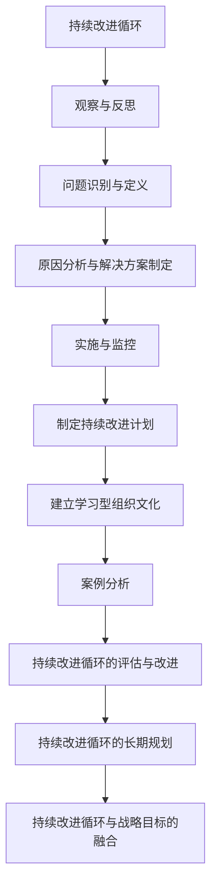

                 

### 《持续改进循环：建立学习型组织的方法》

> **关键词：**持续改进循环、学习型组织、观察与反思、问题识别与定义、原因分析与解决方案制定、实施与监控、持续改进计划、组织文化、案例分析、评估与改进、长期规划。

> **摘要：**本文深入探讨了持续改进循环的概念及其在建立学习型组织中的重要性。文章详细阐述了持续改进循环的核心要素，包括观察与反思、问题识别与定义、原因分析与解决方案制定、实施与监控等。此外，本文通过实施持续改进循环的方法、案例分析以及挑战与解决方案的探讨，提供了建立学习型组织的实际操作指南。最后，文章提出了持续改进循环的评估与改进、长期规划以及与战略目标的融合，为组织持续发展提供了策略建议。

### 《持续改进循环：建立学习型组织的方法》目录大纲

#### 第一部分：持续改进循环概述

- # 1. 持续改进循环概述
  - 1.1 持续改进循环的定义与重要性
  - 1.2 学习型组织的概念与特征
  - 1.3 持续改进循环与学习型组织的关系

#### 第二部分：持续改进循环的核心要素

- # 2. 持续改进循环的核心要素
  - 2.1 观察与反思
  - 2.2 问题识别与定义
  - 2.3 原因分析与解决方案制定
  - 2.4 实施与监控

#### 第三部分：实施持续改进循环的方法

- # 3. 实施持续改进循环的方法
  - 3.1 制定持续改进计划
  - 3.2 建立学习型组织文化
  - 3.3 案例分析：成功实施持续改进循环的企业

#### 第四部分：持续改进循环的挑战与解决方案

- # 4. 持续改进循环的挑战与解决方案
  - 4.1 持续改进循环的常见问题
  - 4.2 挑战与解决方案
  - 4.2.1 组织结构对持续改进的影响
  - 4.2.2 领导者在持续改进中的作用
  - 4.2.3 持续改进与日常运营的平衡

#### 第五部分：持续改进循环的持续发展

- # 5. 持续改进循环的持续发展
  - 5.1 持续改进循环的评估与改进
  - 5.2 持续改进循环的长期规划
  - 5.3 持续改进循环与战略目标的融合

### 附录

- # 附录 A：持续改进循环工具与资源
- # 附录 B：持续改进案例库

### 附录 C：Mermaid 流�程图



### 附录 D：核心算法原理讲解

#### 问题识别与定义的算法原理

问题识别与定义是持续改进循环的关键环节。以下是用于识别和定义问题的算法原理：

##### 1. 逻辑推理算法

**伪代码：**

```python
function identifyProblem(currentState, targetState):
    if currentState != targetState:
        print("存在问题")
        problemDescription = determineProblemDescription(currentState, targetState)
        return problemDescription
    else:
        return "无问题"

function determineProblemDescription(currentState, targetState):
    if currentState < targetState:
        return "目标未达成"
    else if currentState > targetState:
        return "超出了目标"
    else:
        return "目标达成，但质量不达标"
```

##### 2. 数据分析算法

**伪代码：**

```python
function identifyProblem(dataSet):
    deviations = detectDeviations(dataSet)
    if deviations > threshold:
        print("存在问题")
        problemDescription = analyzeDeviations(deviations)
        return problemDescription
    else:
        return "无问题"

function detectDeviations(dataSet):
    deviations = []
    for data in dataSet:
        if abs(data - mean(dataSet)) > threshold:
            deviations.append(data)
    return deviations

function analyzeDeviations(deviations):
    if deviations contains "高频异常值":
        return "存在高频异常值"
    else if deviations contains "低频异常值":
        return "存在低频异常值"
    else:
        return "存在常规偏差"
```

##### 数学模型和数学公式

1. **均值模型**

$$ \mu = \frac{1}{n}\sum_{i=1}^{n} x_i $$

其中，$\mu$ 表示均值，$n$ 表示数据点的个数，$x_i$ 表示第 $i$ 个数据点。

2. **方差模型**

$$ \sigma^2 = \frac{1}{n-1}\sum_{i=1}^{n} (x_i - \mu)^2 $$

其中，$\sigma^2$ 表示方差，$\mu$ 表示均值，$n$ 表示数据点的个数，$x_i$ 表示第 $i$ 个数据点。

3. **标准差模型**

$$ \sigma = \sqrt{\sigma^2} $$

其中，$\sigma$ 表示标准差。

##### 举例说明

假设有一组数据点 {1, 2, 3, 4, 5}，计算其均值、方差和标准差：

$$ \mu = \frac{1}{5}\sum_{i=1}^{5} x_i = \frac{1+2+3+4+5}{5} = 3 $$

$$ \sigma^2 = \frac{1}{5-1}\sum_{i=1}^{5} (x_i - \mu)^2 = \frac{(1-3)^2+(2-3)^2+(3-3)^2+(4-3)^2+(5-3)^2}{4} = 2 $$

$$ \sigma = \sqrt{\sigma^2} = \sqrt{2} \approx 1.414 $$

### 附录 E：项目实战

#### 开发环境搭建

- Python 3.8 或更高版本
- 安装 pip 工具：`pip install numpy pandas matplotlib`

#### 源代码实现

```python
# 导入所需库
import numpy as np
import pandas as pd
import matplotlib.pyplot as plt

# 生成随机数据
np.random.seed(0)
data = np.random.normal(size=1000)
data = data[data > 0]  # 去除负数数据

# 分组处理数据，计算均值和标准差
means = []
std_devs = []
for i in range(0, len(data), 100):
    slice_data = data[i:i+100]
    mean = np.mean(slice_data)
    std_dev = np.std(slice_data)
    means.append(mean)
    std_devs.append(std_dev)

# 可视化展示结果
plt.figure(figsize=(10, 6))
plt.plot(means, label='Mean')
plt.plot(std_devs, label='Standard Deviation')
plt.xlabel('Data Points')
plt.ylabel('Values')
plt.title('Data Analysis Results')
plt.legend()
plt.show()
```

#### 代码解读与分析

该代码案例展示了如何使用 Python 中的 `numpy`、`pandas` 和 `matplotlib` 库实现持续改进循环中的数据分析方法。具体步骤如下：

1. **导入库：** 导入所需的库，包括 `numpy`、`pandas` 和 `matplotlib`。
2. **生成随机数据：** 使用 `numpy.random.normal` 函数生成 1000 个服从正态分布的随机数，并过滤掉负数数据，以确保数据集中在正数范围内。
3. **分组处理数据：** 使用 `range` 函数和步长 `100` 将数据分为每组 100 个数据点。对于每一组数据，计算均值和标准差，并将结果存储在两个列表中。
4. **可视化展示结果：** 使用 `matplotlib.pyplot` 绘制均值和标准差的折线图，以便于观察数据变化趋势。

通过这个案例，我们可以了解如何利用持续改进循环中的数据分析方法来识别和解决问题。在实际应用中，我们可以根据业务需求和数据特点，调整分组大小、选择合适的统计指标，并优化可视化展示效果，以提高数据分析的准确性和可读性。此外，代码中还可以加入异常值处理、数据清洗等步骤，以提高数据分析的质量。

### 第一部分：持续改进循环概述

#### 1.1 持续改进循环的定义与重要性

持续改进循环（Continuous Improvement Loop）是一种系统性的方法，用于不断优化流程、产品或服务。这种方法基于一系列连续的活动，包括观察与反思、问题识别与定义、原因分析与解决方案制定、实施与监控等。持续改进循环的核心思想是通过持续迭代和优化，不断提高组织或个人的绩效和效率。

在技术领域，持续改进循环被广泛应用于软件开发、项目管理、质量控制等方面。通过持续改进循环，组织可以及时发现和解决潜在问题，降低风险，提高客户满意度，并在竞争中保持优势。以下是一些持续改进循环的关键要素：

1. **观察与反思**：定期对流程、产品或服务进行观察和分析，识别潜在问题和改进机会。
2. **问题识别与定义**：明确问题描述，确保问题得到准确理解。
3. **原因分析与解决方案制定**：分析问题的根本原因，制定有效的解决方案。
4. **实施与监控**：实施改进方案，并对改进效果进行监控和评估。

持续改进循环的重要性体现在以下几个方面：

1. **提高效率**：通过不断优化流程和操作，减少浪费和冗余，提高整体效率。
2. **增强灵活性**：持续改进循环使组织能够迅速适应外部环境的变化，提高竞争力。
3. **提高质量**：通过持续改进，组织可以不断优化产品或服务，提高客户满意度。
4. **降低风险**：通过识别和解决问题，组织可以降低潜在风险，确保业务稳定运行。

总之，持续改进循环是一种有效的管理工具，可以帮助组织在竞争激烈的环境中保持竞争优势。通过不断优化和改进，组织可以不断提高自身的绩效和效率，实现长期可持续发展。

#### 1.2 学习型组织的概念与特征

学习型组织（Learning Organization）是指一种能够通过持续学习和知识共享来实现自我改进和发展的组织形态。在这种组织中，成员积极参与学习过程，共同分享知识和经验，从而不断提高个人和组织的绩效和能力。学习型组织的核心特征包括：

1. **全员学习**：学习型组织强调全员学习，不仅包括管理层，还包括一线员工。通过提供培训、研讨会和其他学习机会，组织确保每一位成员都能不断提升自身技能和知识水平。

2. **知识共享**：知识共享是学习型组织的另一个重要特征。组织鼓励成员分享他们的经验和知识，通过建立知识库、定期交流会和团队协作平台等方式，促进知识的传递和共享。

3. **自主管理**：学习型组织倡导自主管理，即成员在自主承担责任和任务的同时，积极参与组织的决策和改进过程。这种模式有助于激发成员的积极性和创造力，提高组织的整体效率。

4. **领导支持**：学习型组织的成功离不开领导层的支持。领导者应成为学习的榜样，通过鼓励和支持成员的学习和知识共享，营造一个积极的学习氛围。

5. **系统思考**：学习型组织注重系统思考，即从整体和长远的角度出发，分析问题和制定解决方案。通过系统思考，组织可以更好地理解内外部环境的变化，制定适应性的战略。

6. **持续改进**：学习型组织将持续改进视为一种文化，通过不断反思和改进，不断提高组织的适应能力和竞争力。

通过建立学习型组织，企业可以实现以下目标：

1. **提高员工满意度**：通过提供学习和成长的机会，组织可以增强员工的归属感和满意度，从而提高整体绩效。
2. **提高创新能力**：知识共享和自主管理有助于激发员工的创造力和创新精神，推动组织的创新和发展。
3. **提高客户满意度**：通过不断优化产品和服务，组织可以更好地满足客户需求，提高客户满意度。
4. **增强竞争力**：学习型组织能够更好地适应市场变化，提高组织的竞争力和市场地位。

总之，学习型组织是一种具有高度适应性和创新能力的组织形态，通过持续学习和知识共享，可以实现组织的长期可持续发展。

#### 1.3 持续改进循环与学习型组织的关系

持续改进循环（Continuous Improvement Loop）与学习型组织（Learning Organization）之间存在紧密的联系，二者共同构成了一个有机的系统，旨在通过不断学习和优化实现组织的持续发展。

首先，持续改进循环是学习型组织的重要实践工具。通过持续改进循环，组织可以系统地识别和解决问题，从而不断提升产品和服务的质量。持续改进循环的核心要素，如观察与反思、问题识别与定义、原因分析与解决方案制定、实施与监控，都是学习型组织不可或缺的部分。

观察与反思是持续改进循环的起点。学习型组织通过不断观察和反思组织的运作，识别潜在问题和改进机会。这种反思不仅涉及具体的技术和操作流程，还包括组织的战略和决策过程。

问题识别与定义是持续改进循环的关键环节。在学习型组织中，成员积极参与问题的识别和定义，确保问题得到准确理解和明确表述。这种共同参与有助于激发团队成员的思考和创新，从而找到更有效的解决方案。

原因分析与解决方案制定则是持续改进循环的核心。在学习型组织中，通过系统思考和分析，组织能够深入挖掘问题的根本原因，并制定针对性的解决方案。这种分析不仅局限于单个问题，还考虑了问题的相互关联和整体影响，从而实现系统性改进。

实施与监控是持续改进循环的最后一个环节。在学习型组织中，改进方案的实施和监控得到了高度重视。通过建立有效的监控机制，组织可以及时了解改进效果，并根据实际情况进行调整和优化。

此外，持续改进循环与学习型组织之间的互动关系也值得探讨。持续改进循环不仅促进了学习型组织的形成，同时也推动了学习型组织的深化和发展。

一方面，持续改进循环为学习型组织提供了具体的操作框架和工具。通过持续改进循环，组织可以系统地识别和解决问题，从而实现知识共享和经验积累。这种持续的实践过程有助于培养组织的学习能力和创新能力。

另一方面，学习型组织的氛围和文化也为持续改进循环的顺利实施提供了保障。在学习型组织中，成员普遍认同持续改进的重要性，积极参与改进过程。这种共同的文化和价值观有助于打破组织内部的壁垒，促进知识共享和协作。

总之，持续改进循环与学习型组织之间相互促进、相互依赖。通过结合持续改进循环和学习型组织，组织可以实现系统的、持续的学习和优化，从而在竞争激烈的市场环境中保持优势。持续改进循环为学习型组织提供了具体的操作路径，而学习型组织则为持续改进循环提供了良好的文化氛围和制度保障。

#### 第二部分：持续改进循环的核心要素

持续改进循环（Continuous Improvement Loop）是一种系统化的方法，用于识别、分析、解决问题并实现持续优化。要有效地实施持续改进循环，需要关注以下几个核心要素：观察与反思、问题识别与定义、原因分析与解决方案制定、实施与监控。以下是对这些要素的详细探讨。

##### 2.1 观察与反思

观察与反思是持续改进循环的起点。通过观察，组织或个体可以收集关于流程、产品、服务等方面的数据和信息。这些数据和信息为后续的问题识别和分析提供了基础。反思则是基于观察的结果，对现有流程、产品、服务进行深入思考，识别存在的问题和改进的机会。

**观察与反思的重要性**：

1. **发现问题**：观察与反思有助于发现潜在的问题和不足，从而为改进提供方向。
2. **积累经验**：通过持续观察与反思，组织可以积累丰富的经验和知识，为后续的改进提供参考。
3. **提高认识**：反思有助于提高个体和组织的认识水平，培养系统思维和全局观念。

**观察与反思的方法**：

1. **定期审查**：定期对流程、产品、服务进行审查，识别潜在的改进点。
2. **数据收集**：通过数据收集工具，如调查问卷、数据分析软件等，收集关于流程、产品、服务的数据和信息。
3. **团队讨论**：组织团队成员进行讨论，分享观察和反思的成果，共同识别问题和改进机会。

##### 2.2 问题识别与定义

问题识别与定义是持续改进循环的关键环节。在这一阶段，组织需要明确问题的性质、范围和影响，确保问题得到准确理解。

**问题识别**：

1. **明确问题来源**：识别问题的来源，如客户反馈、内部审计、市场变化等。
2. **收集信息**：通过访谈、调查、观察等方式，收集与问题相关的信息。
3. **分类整理**：对收集到的信息进行分类整理，明确问题的性质和范围。

**问题定义**：

1. **准确描述**：用简明扼要的语言准确描述问题，避免模糊和歧义。
2. **界定影响**：明确问题的影响范围和程度，如影响哪些流程、产品、服务，对客户和业务的影响等。
3. **形成问题陈述**：将问题陈述转化为可操作的形式，为后续的原因分析和解决方案制定提供依据。

##### 2.3 原因分析与解决方案制定

在问题识别与定义之后，组织需要深入分析问题的根本原因，并制定相应的解决方案。

**原因分析**：

1. **五问法**：通过连续提问“为什么”，深入挖掘问题的根本原因。这种方法被称为“五问法”或“五级分解法”。
2. **因果图**：使用因果图（鱼骨图）将问题的各种可能原因进行可视化，有助于识别和分析问题的根本原因。
3. **数据支持**：利用历史数据和实际案例，支持对问题根本原因的分析。

**解决方案制定**：

1. **确定目标**：明确改进的目标，如提高产品质量、缩短生产周期、降低成本等。
2. **方案设计**：设计具体的改进方案，包括操作步骤、资源需求、时间安排等。
3. **评估风险**：评估改进方案可能带来的风险，并制定应对措施。

##### 2.4 实施与监控

在制定解决方案后，组织需要实施改进措施，并对改进效果进行监控和评估。

**实施**：

1. **明确责任**：明确各项改进措施的责任人，确保改进措施得到有效执行。
2. **资源保障**：确保改进过程中所需的资源，如人力、资金、设备等得到充分保障。
3. **执行计划**：制定详细的执行计划，包括时间表、任务分解、进度跟踪等。

**监控**：

1. **关键指标**：确定关键指标，如质量指标、成本指标、效率指标等，用于衡量改进效果。
2. **数据收集**：定期收集相关数据，用于分析改进效果。
3. **反馈机制**：建立反馈机制，及时收集改进过程中的问题和反馈，确保改进措施得到及时调整和优化。

通过以上四个核心要素，组织可以系统地实施持续改进循环，不断提高自身的运营效率、产品质量和客户满意度。

### 2.1 观察与反思

观察与反思是持续改进循环的起点，也是关键环节。通过系统的观察与反思，组织或个人能够识别潜在问题和改进机会，从而为后续的改进活动提供基础。

**观察与反思的重要性**：

1. **发现问题**：通过持续观察和反思，组织可以及时发现问题和不足，为改进提供明确方向。
2. **积累经验**：反思过程中的思考和分析有助于积累宝贵的经验和知识，为未来的改进提供参考。
3. **提高认识**：持续的观察与反思有助于提升个体和组织的认识水平，培养系统思维和全局观念。

**观察与反思的方法**：

1. **定期审查**：定期对流程、产品、服务进行审查，分析其运行情况和效果，识别潜在的改进点。这种审查可以是定期的会议、审计或自评估。

2. **数据收集**：通过数据收集工具，如调查问卷、数据分析软件、监控系统等，收集关于流程、产品、服务的数据和信息。数据可以帮助量化问题，提供客观的依据。

3. **团队讨论**：组织团队成员进行讨论，分享观察和反思的成果，共同识别问题和改进机会。通过集思广益，可以更全面地了解问题，提出更有针对性的改进措施。

4. **工具与技术**：利用各种工具和技术，如流程图、因果图、鱼骨图等，帮助组织和团队更好地理解和分析问题。

**案例**：

假设某科技公司发现其产品发布周期较长，影响客户满意度。通过以下步骤，该公司可以进行观察与反思：

1. **定期审查**：定期召开产品发布会议，审查产品开发的进度和流程，识别潜在的问题和瓶颈。

2. **数据收集**：通过调查问卷、访谈等方式，收集团队成员和客户的反馈，了解他们对产品发布周期的看法和期望。

3. **团队讨论**：组织团队讨论，分析数据，识别影响发布周期的关键因素，如资源分配、沟通不畅、技术难题等。

4. **工具与技术**：使用流程图和因果图，可视化地展示产品发布流程，分析各环节的时间和资源消耗。

通过上述观察与反思，该公司能够明确问题的本质，为后续的改进活动提供明确的方向和依据。

### 2.2 问题识别与定义

在持续改进循环中，问题识别与定义是关键的一步。准确的识别和定义问题不仅有助于理解问题的本质，还为制定有效的解决方案奠定了基础。

**问题识别**：

1. **明确问题来源**：首先，要明确问题的来源，如客户反馈、内部审计、市场调查、故障报告等。了解问题来源有助于确定问题的范围和影响。

2. **收集信息**：通过访谈、调查、观察等方式，收集与问题相关的信息。这些信息可以是定性的，如用户的抱怨、员工的建议，也可以是定量的，如数据统计、效率指标等。

3. **分类整理**：对收集到的信息进行分类整理，识别出不同类型的问题。例如，可以将问题分为流程问题、质量问题、资源问题等，以便于后续的深入分析。

**问题定义**：

1. **准确描述**：使用简明扼要的语言准确描述问题，避免模糊和歧义。例如，“产品发布周期过长”比“产品发布有问题”更具体、更明确。

2. **界定影响**：明确问题的影响范围和程度，如影响哪些流程、产品、服务，对客户和业务的影响等。这有助于确定问题的重要性和优先级。

3. **形成问题陈述**：将问题陈述转化为可操作的形式，为后续的原因分析和解决方案制定提供依据。例如，“产品发布周期过长，导致客户满意度下降，影响销售业绩”。

**示例**：

假设某制造企业发现其生产线的停机时间较长，影响了生产效率和产品质量。以下是如何进行问题识别与定义的过程：

1. **明确问题来源**：通过内部审计报告，发现生产线的停机时间较长，这是一个潜在的问题。

2. **收集信息**：通过访谈生产一线员工和设备维护人员，收集关于停机时间的具体数据和原因分析。

3. **分类整理**：将停机时间分为设备故障、原材料短缺、操作失误等类别。

4. **准确描述**：问题陈述为“生产线停机时间较长，导致生产效率和产品质量受到影响”。

5. **界定影响**：停机时间影响了生产效率，导致交货延迟；同时，设备故障和操作失误可能导致产品质量问题，增加售后成本。

6. **形成问题陈述**：最终的问题陈述为“生产线停机时间较长，影响了生产效率和产品质量，导致交货延迟和售后成本增加”。

通过上述步骤，企业能够明确问题的本质和影响，为后续的原因分析和解决方案制定提供依据。

### 2.3 原因分析与解决方案制定

在持续改进循环中，原因分析是解决问题的关键步骤。通过深入分析问题的根本原因，组织可以制定出有针对性的解决方案，从而有效地解决问题。

**原因分析的方法**：

1. **五问法**：通过连续提问“为什么”，深入挖掘问题的根本原因。这种方法也被称为“五级分解法”。例如，如果问题是“为什么产品发布周期过长”，可以依次提问：
   - 为什么产品发布周期过长？
   - 是因为开发过程中遇到了技术难题吗？
   - 为什么开发过程中会遇到技术难题？
   - 是因为缺乏足够的开发资源吗？
   - 为什么缺乏足够的开发资源？

2. **因果图**：使用因果图（鱼骨图）将问题的各种可能原因进行可视化。因果图可以帮助团队系统地分析问题，识别出各个原因之间的关联。例如，在分析产品发布周期过长的问题时，可以将原因分为技术问题、资源问题、流程问题等，并展示各原因之间的因果关系。

3. **数据支持**：利用历史数据和实际案例，支持对问题根本原因的分析。通过数据分析，可以量化问题的表现，并识别出潜在的原因。

**解决方案制定的原则**：

1. **明确目标**：在制定解决方案时，首先要明确改进的目标，如提高产品质量、缩短生产周期、降低成本等。

2. **具体可行**：解决方案应具体、可行，包括具体的操作步骤、所需资源、时间安排等。

3. **评估风险**：在制定解决方案时，要评估方案可能带来的风险，并制定应对措施。

4. **优先级排序**：根据问题的重要性和影响程度，对解决方案进行优先级排序，确保资源优先分配给最重要的改进措施。

**示例**：

假设某公司在进行持续改进时发现，客户投诉率较高，影响了公司声誉和销售业绩。以下是如何进行原因分析和制定解决方案的过程：

1. **原因分析**：
   - 通过五问法：
     - 为什么客户投诉率较高？
     - 是因为产品不符合客户需求吗？
     - 为什么产品不符合客户需求？
     - 是因为市场调研不足吗？
     - 为什么市场调研不足？
     - 是因为公司缺乏市场调研资源吗？
   - 通过因果图：
     - 识别出市场调研不足、产品不符合客户需求、售后服务不足等关键原因。
   - 通过数据分析：
     - 分析客户投诉的具体原因，发现主要问题集中在产品功能、用户界面和售后服务方面。

2. **解决方案制定**：
   - 明确目标：提高客户满意度，降低投诉率。
   - 具体可行：
     - 加强市场调研，了解客户需求和偏好。
     - 优化产品设计，增加用户界面友好的功能。
     - 提升售后服务质量，建立快速响应机制。
   - 评估风险：
     - 市场调研可能会增加成本，但有利于提高产品竞争力。
     - 产品设计优化可能影响开发进度，但有利于提升客户满意度。
     - 售后服务提升可能会增加人力和资源投入，但有助于提高客户忠诚度。
   - 优先级排序：
     - 将市场调研和产品设计优化列为优先级最高的任务。

通过上述原因分析和解决方案制定，公司能够有针对性地解决客户投诉率较高的问题，从而提高客户满意度和销售业绩。

### 2.4 实施与监控

在原因分析和解决方案制定之后，实施与监控是确保改进措施有效落实和持续优化的关键环节。

**实施策略**：

1. **明确责任**：为每一项改进措施指派责任人，确保改进措施的执行得到有效跟踪和管理。

2. **资源保障**：确保改进过程中所需的资源，如人力、资金、设备等得到充分保障。资源不足可能导致改进措施无法按时完成或效果不佳。

3. **执行计划**：制定详细的执行计划，包括时间表、任务分解、进度跟踪等。执行计划应明确各项任务的完成时间、责任人、资源需求等，以确保改进措施按计划进行。

4. **培训与沟通**：对相关人员提供必要的培训，确保他们了解改进措施的具体内容和要求。同时，建立有效的沟通机制，确保团队成员之间的信息共享和协作。

**监控与评估**：

1. **关键指标**：确定关键指标，如质量指标、成本指标、效率指标等，用于衡量改进效果。关键指标应具体、可量化，并与改进目标紧密相关。

2. **数据收集**：定期收集相关数据，用于分析改进效果。数据收集应系统化、规范化，确保数据的准确性和可靠性。

3. **反馈机制**：建立反馈机制，及时收集改进过程中的问题和反馈，确保改进措施得到及时调整和优化。反馈机制可以是定期的会议、报告或在线平台。

4. **评估与改进**：定期对改进措施的效果进行评估，识别改进过程中的问题和不足，并提出相应的改进措施。评估结果应公开透明，以确保团队成员共同参与改进过程。

**案例**：

假设某公司实施了一项新的客户服务流程改进措施，以下是如何进行实施与监控的示例：

1. **明确责任**：将客户服务流程改进措施的责任分配给客户服务部门经理，确保改进措施的有效执行。

2. **资源保障**：为改进措施提供必要的资源，如培训资金、人力资源、技术支持等。

3. **执行计划**：
   - 时间表：制定详细的执行计划，包括培训时间、实施时间、评估时间等。
   - 任务分解：将改进措施分解为具体任务，如员工培训、新系统上线、客户反馈收集等。
   - 进度跟踪：建立进度跟踪机制，确保每个任务按计划完成。

4. **培训与沟通**：对客户服务部门员工进行新流程的培训，确保员工了解改进措施的具体内容和操作要求。同时，定期召开沟通会议，确保团队成员之间的信息共享和协作。

5. **关键指标**：确定关键指标，如客户满意度评分、服务响应时间、客户投诉率等，用于衡量改进效果。

6. **数据收集**：定期收集客户满意度评分、服务响应时间、客户投诉率等数据，用于分析改进效果。

7. **反馈机制**：建立反馈机制，通过定期收集客户反馈、员工反馈等方式，及时了解改进措施的执行情况和效果。

8. **评估与改进**：定期对改进措施的效果进行评估，根据评估结果识别改进过程中的问题和不足，并提出相应的改进措施。例如，如果客户满意度评分较低，可以进一步优化服务流程，提高客户体验。

通过上述实施与监控措施，公司能够确保客户服务流程改进措施的有效落实和持续优化，从而提高客户满意度和整体运营效率。

### 第三部分：实施持续改进循环的方法

实施持续改进循环是建立学习型组织的关键步骤，它不仅需要明确的方法和步骤，还需要系统的规划和有效的执行。以下将详细探讨制定持续改进计划、建立学习型组织文化以及成功实施持续改进循环的企业案例分析。

#### 3.1 制定持续改进计划

制定持续改进计划是实施持续改进循环的第一步，它为整个改进过程提供了明确的指导和方向。以下为制定持续改进计划的详细步骤：

1. **明确目标和愿景**：首先，组织需要明确持续改进的目标和愿景。这些目标和愿景应与组织的整体战略目标保持一致，并能够具体量化，如提高产品质量、缩短生产周期、降低成本等。

2. **评估现状**：评估组织的现状，包括流程、产品、服务等方面的数据和信息。通过数据分析，识别存在的问题和瓶颈，为后续的改进提供依据。

3. **制定改进方案**：基于现状评估，制定具体的改进方案。改进方案应包括具体的目标、改进措施、责任人、时间表和预期效果等。例如，如果发现生产效率低下，可以制定提升生产效率的具体措施，如优化流程、增加设备投入等。

4. **资源规划**：明确改进措施所需的资源，包括人力、资金、设备等。确保资源的充足和合理分配，以保证改进措施能够顺利实施。

5. **制定时间表**：为每个改进措施制定详细的时间表，包括任务分解、责任人、完成时间等。时间表应具有可执行性，并留有适当的缓冲时间，以应对可能的延期和问题。

6. **沟通与培训**：确保所有相关人员和团队成员了解改进计划的内容和目标，并进行必要的培训，以提高执行效率和效果。

7. **审批与发布**：将改进计划提交给管理层审批，并获得批准。随后，正式发布改进计划，确保所有人员都能够按照计划执行。

#### 3.2 建立学习型组织文化

建立学习型组织文化是持续改进循环能够成功实施的关键因素之一。以下为建立学习型组织文化的策略：

1. **领导层的支持**：领导层应成为学习的榜样，通过鼓励和支持成员的学习和知识共享，营造一个积极的学习氛围。领导层还应为成员提供必要的资源和支持，如培训、研讨会、学习平台等。

2. **知识共享机制**：建立有效的知识共享机制，如内部培训、经验交流、知识库等。通过这些机制，成员可以分享经验和知识，促进知识的传递和共享。

3. **鼓励创新与实验**：鼓励成员进行创新和实验，提供必要的资源和支持，如时间、资金、设备等。通过创新和实验，组织可以不断探索新的解决方案，提高适应能力和竞争力。

4. **建立反馈机制**：建立反馈机制，鼓励成员提出意见和建议，并对这些建议进行及时反馈。通过反馈机制，组织可以不断改进和学习，提高整体绩效。

5. **团队协作与沟通**：鼓励团队协作和沟通，建立良好的团队关系。通过团队协作和沟通，成员可以共同解决问题，提高工作效率和效果。

#### 3.3 案例分析：成功实施持续改进循环的企业

以下为几个成功实施持续改进循环的企业案例，通过这些案例，我们可以了解如何在实际操作中实施持续改进循环，并取得显著成效。

1. **案例一：丰田汽车**：
   丰田汽车是全球知名的汽车制造商，其成功实施持续改进循环的方法被称为“精益生产”。通过持续改进，丰田汽车实现了生产效率的提高、产品成本的降低和产品质量的稳定。具体措施包括：
   - **持续观察与反思**：丰田汽车建立了严格的质量控制体系，通过不断的观察和反思，及时发现和解决问题。
   - **问题识别与定义**：丰田汽车通过客户反馈和内部审计，识别和定义存在的问题，并明确问题的责任人和改进目标。
   - **原因分析与解决方案制定**：丰田汽车通过五问法和因果图等工具，深入分析问题的根本原因，并制定具体的解决方案。
   - **实施与监控**：丰田汽车制定了详细的执行计划，并建立了有效的监控机制，确保改进措施得到有效实施。

2. **案例二：亚马逊**：
   亚马逊是全球领先的电子商务公司，其成功实施持续改进循环的方法被称为“亚马逊循环”。通过持续改进，亚马逊在物流、客户服务、技术架构等方面取得了显著成效。具体措施包括：
   - **数据驱动决策**：亚马逊通过大量数据的收集和分析，识别和解决问题，并制定具体的改进措施。
   - **全员参与**：亚马逊鼓励所有员工参与持续改进循环，通过内部论坛、研讨会等方式，促进知识共享和经验交流。
   - **快速迭代**：亚马逊采用快速迭代的方法，不断尝试新的解决方案，并通过实验和测试，验证其有效性。

3. **案例三：谷歌**：
   谷歌是全球知名的技术公司，其成功实施持续改进循环的方法被称为“谷歌方法论”。通过持续改进，谷歌在产品研发、用户体验、技术架构等方面取得了显著成效。具体措施包括：
   - **创新文化**：谷歌鼓励创新和实验，提供必要的资源和支持，如时间、资金、设备等。
   - **用户反馈**：谷歌重视用户反馈，通过用户调研、用户测试等方式，识别和解决问题。
   - **迭代优化**：谷歌采用迭代优化的方法，不断改进产品和服务，提高用户满意度。

通过以上案例分析，我们可以看到，成功实施持续改进循环的关键在于明确目标和愿景、评估现状、制定改进方案、建立学习型组织文化以及全员参与和持续优化。只有通过系统的实施和不断的改进，组织才能在激烈的市场竞争中保持优势。

### 3.1 制定持续改进计划

制定持续改进计划是确保持续改进循环有效实施的关键步骤。一个良好的持续改进计划应包括明确的目标、详细的步骤、可量化的指标以及有效的执行和监控机制。以下是制定持续改进计划的详细步骤：

#### 明确目标和愿景

1. **目标设定**：首先，组织需要明确持续改进的目标。这些目标应与组织的整体战略目标保持一致，并具体、可量化。例如，提高产品质量、降低成本、提升客户满意度等。
2. **愿景阐述**：阐述持续改进的愿景，即通过持续改进，组织希望达到的理想状态。这有助于激发团队成员的积极性和参与度。

#### 评估现状

1. **现状分析**：通过数据分析、流程审查、用户调研等方式，评估当前流程、产品、服务的现状。识别存在的问题、瓶颈和改进的机会。
2. **问题清单**：列出评估中发现的主要问题，并对其进行分类整理。例如，可以将问题分为流程问题、质量问题、资源问题等。

#### 制定改进方案

1. **目标设定**：根据问题清单，为每个问题设定具体的改进目标。这些目标应具有可操作性，并能量化改进效果。例如，将生产线的缺陷率降低10%。
2. **改进措施**：制定具体的改进措施，包括操作步骤、资源需求、时间安排等。改进措施应具体、可行，并能直接针对问题进行解决。
3. **责任分配**：明确每项改进措施的责任人，确保改进措施的执行得到有效跟踪和管理。

#### 资源规划

1. **资源需求**：评估改进措施所需的资源，包括人力、资金、设备等。
2. **资源分配**：确保资源的充足和合理分配，以保证改进措施能够顺利实施。

#### 制定时间表

1. **任务分解**：将改进计划分解为具体任务，并确定每个任务的完成时间、责任人、资源需求等。
2. **进度跟踪**：建立进度跟踪机制，确保每个任务按计划完成。

#### 沟通与培训

1. **内部沟通**：确保所有相关人员和团队成员了解改进计划的内容和目标，并进行必要的培训，以提高执行效率和效果。
2. **外部沟通**：与客户、供应商等相关方进行沟通，确保他们了解改进计划的影响，并获得必要的支持。

#### 审批与发布

1. **计划审批**：将改进计划提交给管理层审批，并获得批准。
2. **计划发布**：正式发布改进计划，确保所有人员都能够按照计划执行。

通过上述步骤，组织可以制定出一个完整的持续改进计划，为后续的执行和监控提供明确的方向和依据。

#### 3.2 建立学习型组织文化

建立学习型组织文化是确保持续改进计划成功实施的关键因素之一。一个良好的学习型组织文化能够激发员工的积极性和创造力，促进知识的共享和传承，从而推动组织的持续发展和创新。以下为建立学习型组织文化的策略：

**1. 领导层的支持**

领导层在建立学习型组织文化中起着至关重要的作用。领导层应通过以下方式支持和推动学习型组织文化的建设：

- **以身作则**：领导层应成为学习的榜样，通过自身的学习和成长，激发员工的积极性和参与度。
- **明确愿景**：领导层应明确学习型组织的愿景和目标，并传达给全体员工，使员工认识到学习的重要性。
- **提供资源**：领导层应为员工提供学习所需的资源，包括培训机会、学习平台、技术支持等。

**2. 知识共享机制**

知识共享是学习型组织文化的核心。以下为建立知识共享机制的方法：

- **内部培训**：定期组织内部培训，分享经验和知识，提高员工的技能和知识水平。
- **经验交流**：建立经验交流机制，鼓励员工分享自己的成功经验和失败教训，促进知识的传递和共享。
- **知识库建设**：建立企业知识库，收集和整理员工的最佳实践、成功案例等，为员工提供参考和借鉴。

**3. 鼓励创新与实验**

创新是学习型组织文化的重要组成部分。以下为鼓励创新与实验的方法：

- **提供资源**：为员工提供创新和实验所需的资源和支持，包括时间、资金、设备等。
- **建立创新团队**：组建跨部门的创新团队，鼓励员工跨领域合作，共同探索新的解决方案。
- **鼓励试错**：允许员工在创新过程中犯错误，并从中学习和成长。

**4. 建立反馈机制**

有效的反馈机制能够帮助组织不断改进和学习。以下为建立反馈机制的方法：

- **定期反馈**：定期组织反馈会议，收集员工的意见和建议，并对改进措施进行评估和调整。
- **匿名反馈**：提供匿名反馈渠道，使员工能够自由表达意见和建议，而不担心报复或惩罚。
- **反馈跟进**：对反馈意见进行及时跟进和反馈，确保改进措施得到有效实施。

**5. 团队协作与沟通**

团队协作和沟通是学习型组织文化的重要特征。以下为促进团队协作与沟通的方法：

- **跨部门合作**：鼓励跨部门合作，促进不同部门之间的知识和资源共享。
- **团队建设活动**：定期组织团队建设活动，加强团队成员之间的沟通和协作。
- **开放式沟通**：建立开放的沟通环境，鼓励员工自由表达意见和想法，促进知识共享和团队协作。

通过上述策略，组织可以逐步建立学习型组织文化，为持续改进计划的成功实施提供有力的支持。一个良好的学习型组织文化不仅能够提高员工的满意度和绩效，还能够增强组织的适应能力和竞争力，实现长期可持续发展。

#### 3.3 案例分析：成功实施持续改进循环的企业

在本节中，我们将分析几个成功实施持续改进循环的企业案例，这些案例展示了如何在不同行业和领域中通过持续改进循环实现卓越绩效。这些案例不仅提供了具体的操作方法和实践经验，还为其他企业提供了宝贵的启示。

##### 案例一：丰田汽车

丰田汽车是全球汽车行业的领导者之一，其持续改进的方法被称为“精益生产”。丰田通过不断优化生产流程，实现了成本降低、质量提高和效率提升。以下是丰田汽车实施持续改进循环的关键步骤：

1. **持续观察与反思**：丰田在生产过程中采用严格的质量控制体系，不断观察和反思生产流程，识别存在的问题。例如，通过定期的生产会议和现场检查，丰田员工能够及时发现并解决生产中的问题。

2. **问题识别与定义**：丰田通过客户反馈、内部审计和生产数据分析，识别出影响生产效率和质量的关键问题。这些问题包括设备故障、生产延误、物料浪费等。

3. **原因分析与解决方案制定**：丰田采用“五问法”深入分析问题的根本原因，并制定具体的解决方案。例如，针对设备故障问题，丰田分析了设备维护不足和操作不规范的原因，并制定了详细的维护和操作规范。

4. **实施与监控**：丰田制定了详细的改进计划，包括责任分配、资源规划和时间表。通过定期的监控和评估，丰田确保改进措施得到有效实施。

##### 案例二：亚马逊

亚马逊是全球领先的电子商务公司，其持续改进的方法被称为“亚马逊循环”。亚马逊通过数据驱动的方法，不断优化物流、客户服务和供应链管理。以下是亚马逊实施持续改进循环的关键步骤：

1. **数据驱动决策**：亚马逊通过大量数据的收集和分析，识别和解决问题。例如，亚马逊使用客户购买行为数据来优化库存管理和配送策略。

2. **全员参与**：亚马逊鼓励所有员工参与持续改进循环。通过内部论坛、研讨会和跨部门合作，亚马逊员工能够分享经验和知识，共同解决难题。

3. **快速迭代**：亚马逊采用快速迭代的方法，不断尝试新的解决方案，并通过实验和测试，验证其有效性。例如，亚马逊通过A/B测试来优化用户界面和购物体验。

4. **持续监控与优化**：亚马逊建立了严格的监控和评估机制，对改进措施的效果进行持续跟踪和优化。通过定期评估和反馈，亚马逊能够及时调整和改进方案。

##### 案例三：谷歌

谷歌是全球领先的技术公司，其持续改进的方法被称为“谷歌方法论”。谷歌通过不断创新和优化，在产品研发、用户体验和技术架构方面取得了显著成效。以下是谷歌实施持续改进循环的关键步骤：

1. **创新文化**：谷歌鼓励创新和实验，提供必要的资源和支持，如时间、资金、设备等。谷歌的员工被鼓励尝试新的想法，并从中学习和成长。

2. **用户反馈**：谷歌重视用户反馈，通过用户调研、用户测试等方式，识别和解决问题。谷歌的员工与用户保持密切互动，了解用户的需求和偏好。

3. **迭代优化**：谷歌采用迭代优化的方法，不断改进产品和服务。谷歌的员工通过反复测试和迭代，确保产品和服务能够满足用户需求。

4. **跨部门合作**：谷歌鼓励跨部门合作，促进不同部门之间的知识和资源共享。通过跨部门合作，谷歌能够更全面地解决问题，提高整体效率。

通过以上案例分析，我们可以看到，成功实施持续改进循环的关键在于建立学习型组织文化，鼓励创新和实验，全员参与，以及持续监控和优化。这些案例不仅展示了持续改进循环的具体操作方法，还为其他企业提供了宝贵的经验和启示。通过借鉴这些成功经验，企业可以不断优化自身运营，提高绩效，实现长期可持续发展。

### 第四部分：持续改进循环的挑战与解决方案

#### 4.1 持续改进循环的常见问题

尽管持续改进循环（CIL）是一种行之有效的方法，但在实际操作中，企业常常会遇到一些挑战和问题。以下是一些持续改进循环中常见的问题及其影响：

1. **缺乏对持续改进的重视**：企业可能对持续改进的重要性缺乏认识，导致改进活动无法得到有效的支持和资源保障。
   - **影响**：缺乏重视会导致持续改进活动无法顺利推进，影响改进效果的实现。

2. **员工参与度低**：员工可能对持续改进活动缺乏兴趣或参与感，导致改进建议的缺乏和实施效果不佳。
   - **影响**：低参与度会影响改进活动的效果，减少员工对改进措施的支持和执行力。

3. **改进措施与日常运营冲突**：改进措施可能与企业现有的日常运营流程和资源分配产生冲突，导致改进活动难以有效实施。
   - **影响**：冲突会导致改进活动无法持续进行，影响企业的运营效率和绩效。

4. **缺乏有效的监控和评估机制**：企业可能缺乏有效的监控和评估机制，导致改进措施的效果无法及时跟踪和评估。
   - **影响**：缺乏监控和评估会导致改进措施的效果不明确，影响改进活动的持续性和效果。

#### 4.2 挑战与解决方案

1. **缺乏对持续改进的重视**

   **挑战**：企业高层可能对持续改进的重要性缺乏认识，导致改进活动无法得到有效的支持和资源保障。

   **解决方案**：
   - **高层参与**：鼓励企业高层积极参与持续改进活动，通过高层领导的示范作用，提高全体员工对持续改进的认识和重视。
   - **制定战略**：将持续改进纳入企业战略规划，明确持续改进的目标和愿景，确保持续改进活动与企业的整体战略目标一致。
   - **资源保障**：确保持续改进活动所需的人力、资金、设备等资源得到充分保障，为改进活动提供必要的支持。

2. **员工参与度低**

   **挑战**：员工可能对持续改进活动缺乏兴趣或参与感，导致改进建议的缺乏和实施效果不佳。

   **解决方案**：
   - **激励措施**：建立激励机制，鼓励员工积极参与持续改进活动。例如，设立改进建议奖、表彰积极参与的员工等。
   - **文化建设**：营造积极的学习型组织文化，鼓励员工分享经验和知识，培养员工的参与感和归属感。
   - **培训与支持**：为员工提供必要的培训和支持，提高员工的技能和知识水平，增强他们对持续改进的信心和兴趣。

3. **改进措施与日常运营冲突**

   **挑战**：改进措施可能与企业现有的日常运营流程和资源分配产生冲突，导致改进活动难以有效实施。

   **解决方案**：
   - **流程优化**：在实施改进措施之前，对现有的日常运营流程进行优化，确保改进措施能够与现有流程相融合。
   - **资源调配**：合理调配资源，确保改进措施所需的人力、资金、设备等资源得到优先保障。
   - **跨部门协作**：建立跨部门的协作机制，促进不同部门之间的沟通和合作，共同解决改进过程中可能遇到的冲突。

4. **缺乏有效的监控和评估机制**

   **挑战**：企业可能缺乏有效的监控和评估机制，导致改进措施的效果无法及时跟踪和评估。

   **解决方案**：
   - **关键指标**：确定关键绩效指标（KPI），用于衡量改进措施的效果。这些指标应具体、可量化，并与改进目标紧密相关。
   - **监控与反馈**：建立监控和反馈机制，定期收集相关数据，用于分析改进措施的效果。同时，及时反馈改进成果，激励员工持续改进。
   - **评估与调整**：定期对改进措施进行评估，识别改进过程中的问题和不足，并根据评估结果进行相应的调整和优化。

通过上述解决方案，企业可以应对持续改进循环中的常见挑战，确保改进活动的顺利进行和效果最大化。

#### 4.2.1 组织结构对持续改进的影响

组织结构是影响持续改进循环实施的重要因素之一。不同的组织结构会对持续改进的推动力和效果产生不同的影响。以下分析组织结构对持续改进的影响及其适应性。

**1. 影响因素**

- **中央集权制**：在中央集权制组织结构中，决策权主要集中在高层管理者手中，各部门的自主性较低。这种结构可能导致持续改进活动受到过多的干预和限制，影响改进的效率和效果。

- **分权制**：在分权制组织结构中，决策权下放到各个部门或团队，各部门具有较大的自主权和灵活性。这种结构有助于持续改进活动的实施，因为各部门可以更快速地响应问题和制定改进措施。

- **矩阵制**：矩阵制组织结构结合了职能制和项目制的特点，既强调专业分工，又注重跨部门的协作。这种结构有助于持续改进活动的实施，因为不同部门的专业知识和资源可以在改进过程中得到充分利用。

**2. 适应性分析**

- **中央集权制**：在中央集权制组织结构中，要实施持续改进循环，需要高层管理者高度重视并积极推动。通过建立跨部门的工作小组，集中资源，快速响应问题，可以在一定程度上克服组织结构带来的挑战。

- **分权制**：在分权制组织结构中，持续改进循环的实施相对容易。由于各部门具有较大的自主权和灵活性，员工更容易参与改进活动，提出建议和解决方案。同时，高层管理者可以通过制定明确的目标和指标，确保各部门的改进活动与整体战略目标一致。

- **矩阵制**：在矩阵制组织结构中，持续改进循环的实施具有明显的优势。矩阵制结构强调跨部门协作，有助于整合不同部门的专业知识和资源，提高改进活动的效率和效果。然而，矩阵制也面临协调困难和责任归属模糊等挑战，需要建立有效的沟通和协调机制。

**3. 建议**

- **中央集权制**：为了在中央集权制组织结构中有效实施持续改进循环，建议高层管理者：
  - **明确目标**：制定明确的持续改进目标，并与企业的整体战略目标相一致。
  - **建立跨部门团队**：建立跨部门的持续改进团队，集中资源，快速响应问题。
  - **提供培训和支持**：为员工提供必要的培训和支持，提高他们的持续改进意识和能力。

- **分权制**：在分权制组织结构中，建议各部门：
  - **积极参与**：鼓励员工积极参与持续改进活动，提出改进建议和解决方案。
  - **明确责任**：为每个改进措施明确责任人，确保改进措施得到有效实施。
  - **定期评估**：定期对改进措施的效果进行评估，并根据评估结果进行调整和优化。

- **矩阵制**：在矩阵制组织结构中，建议：
  - **强化沟通**：建立有效的沟通机制，确保不同部门之间的信息共享和协作。
  - **明确角色和责任**：明确各部门在持续改进循环中的角色和责任，确保改进活动有序进行。
  - **整合资源**：充分利用不同部门的专业知识和资源，提高改进活动的效率和效果。

通过针对不同组织结构的适应性分析和建议，企业可以更好地实施持续改进循环，提高组织的绩效和竞争力。

#### 4.2.2 领导者在持续改进中的作用

在持续改进循环中，领导者扮演着至关重要的角色。他们的领导力和决策能力直接影响到持续改进活动的成功与否。以下是领导者如何在不同阶段发挥关键作用，确保持续改进循环的有效实施。

**1. 观察与反思阶段**

在观察与反思阶段，领导者需要发挥以下作用：

- **树立榜样**：领导者应以身作则，积极参与观察与反思活动，展示对持续改进的重视。通过自己的行为，激发员工的积极参与和思考。
- **提供支持**：领导者应提供必要的资源和支持，如时间、资金、培训等，以确保观察与反思活动的顺利进行。
- **鼓励反馈**：领导者应鼓励员工提出问题和建议，建立开放和包容的沟通氛围，让员工敢于表达自己的观点。

**2. 问题识别与定义阶段**

在问题识别与定义阶段，领导者需要发挥以下作用：

- **明确方向**：领导者应明确问题的识别和定义目标，确保问题得到准确理解和表述。通过设定清晰的目标和期望，引导员工聚焦于关键问题和改进点。
- **提供指导**：领导者应提供专业指导和支持，帮助员工识别和定义问题。领导者可以利用自己的经验和知识，提供有价值的见解和建议。
- **确保资源**：领导者应确保问题识别和定义过程中所需的资源得到充分保障，包括人力、资金、技术等。

**3. 原因分析与解决方案制定阶段**

在原因分析与解决方案制定阶段，领导者需要发挥以下作用：

- **促进协作**：领导者应促进跨部门协作，确保不同部门的专业知识和资源得到充分利用。通过建立跨部门团队，领导者可以推动问题的深入分析和解决方案的制定。
- **决策支持**：领导者应在解决方案制定过程中提供决策支持，确保解决方案的可行性和有效性。领导者可以利用自己的决策能力和经验，帮助团队权衡利弊，做出明智的决策。
- **激励创新**：领导者应鼓励创新思维和实验，支持员工尝试新的解决方案。通过建立激励机制，领导者可以激发员工的积极性和创造力，推动持续改进。

**4. 实施与监控阶段**

在实施与监控阶段，领导者需要发挥以下作用：

- **监督执行**：领导者应监督改进措施的实施过程，确保各项任务按时完成。通过定期检查和报告，领导者可以及时发现问题和解决问题。
- **提供反馈**：领导者应提供及时的反馈和指导，帮助员工了解改进措施的效果。通过正面的反馈和鼓励，领导者可以增强员工的信心和动力。
- **优化调整**：领导者应根据监控结果，及时调整和优化改进措施，确保改进目标的实现。通过持续的监控和改进，领导者可以推动组织不断进步。

总之，领导者在持续改进循环中的角色是多方面的，他们不仅是改进活动的推动者，还是资源的提供者、决策的制定者、执行的监督者。通过有效的领导和决策，领导者可以确保持续改进循环的顺利实施，推动组织实现持续发展和进步。

#### 4.2.3 持续改进与日常运营的平衡

在实施持续改进循环时，企业需要在持续改进与日常运营之间保持平衡。以下探讨如何在日常运营中有效整合持续改进，并确保两者之间的协调。

**1. 确定优先级**

企业需要明确持续改进与日常运营的优先级。在日常运营中，确保关键业务流程的稳定和高效运行是最基本的任务。而持续改进则侧重于长期的优化和提升。企业应确保在关键业务不受影响的前提下，合理分配资源和精力进行改进。

**2. 制定整合计划**

为了在持续改进与日常运营之间保持平衡，企业应制定详细的整合计划。该计划应包括以下几个方面：

- **目标设定**：明确持续改进的目标和日常运营的目标，并确保两者相互支持。
- **时间规划**：合理安排改进活动的时间，避免与日常运营的关键周期冲突。
- **资源分配**：确保改进所需资源（如人力、资金、设备等）与日常运营需求相匹配。
- **责任分配**：为每个改进措施明确责任人，并确保责任人与日常运营任务的协调。

**3. 建立监控机制**

建立有效的监控机制，对持续改进和日常运营的效果进行持续跟踪和评估。通过监控，企业可以及时发现和解决问题，确保改进活动不会影响日常运营的稳定性。

**4. 沟通与协作**

持续改进与日常运营的有效整合离不开各部门之间的沟通与协作。企业应建立跨部门的协作机制，促进信息的共享和协作，确保改进措施能够在日常运营中得到有效执行。

**5. 持续优化**

持续改进是一个持续的过程，企业应不断优化改进措施，确保它们与日常运营保持协调。通过定期回顾和调整，企业可以逐步实现持续改进与日常运营的平衡。

**案例**：

某制造企业为了在持续改进与日常运营之间保持平衡，采取了以下措施：

- **确定优先级**：企业明确了关键业务流程的稳定性优先于改进活动，确保生产线的正常运行。

- **制定整合计划**：企业制定了详细的年度改进计划，包括改进目标、时间规划、资源分配和责任分配。

- **建立监控机制**：企业建立了改进活动的监控机制，定期对改进措施的效果进行评估，确保不会影响生产线的正常运行。

- **沟通与协作**：企业建立了跨部门的沟通平台，促进各部门之间的信息共享和协作，确保改进措施得到有效执行。

- **持续优化**：企业通过定期回顾和调整，不断优化改进措施，确保它们与日常运营保持协调。

通过上述措施，该企业成功在持续改进与日常运营之间保持了平衡，实现了持续改进和日常运营的双赢。

### 4.3 持续改进循环的常见问题及解决方案

#### 缺乏对持续改进的重视

**问题现象**：在企业内部，持续改进被视为可有可无，管理层和员工对此缺乏热情，改进活动常常流于形式。

**原因分析**：
1. **管理层缺乏认识**：管理层可能认为持续改进是浪费时间，无法立即带来明显收益。
2. **员工缺乏动力**：员工可能认为持续改进不会直接提升个人业绩，对参与改进活动缺乏兴趣。

**解决方案**：
1. **加强培训与教育**：通过培训和教育，提高管理层和员工对持续改进的认识，强调其对长期发展的意义。
2. **制定明确的改进目标**：制定具体、可量化的改进目标，确保改进活动有明确的方向和预期成果。
3. **建立激励机制**：设立奖励机制，激励员工积极参与改进活动，提高改进的积极性。

#### 员工参与度低

**问题现象**：在企业内部，员工对持续改进活动的参与度低，提出改进建议的积极性不高。

**原因分析**：
1. **缺乏参与感**：员工可能认为改进活动与自身利益关系不大，缺乏参与的意愿。
2. **缺乏信任**：员工可能担心提出改进建议后，会被管理层视为挑剔或批评。

**解决方案**：
1. **建立开放沟通环境**：营造开放、包容的沟通氛围，鼓励员工提出改进建议。
2. **加强反馈机制**：建立有效的反馈机制，及时回应员工提出的改进建议，确保其得到重视和实施。
3. **提供培训和支持**：为员工提供必要的培训和支持，提高他们的参与能力和信心。

#### 缺乏有效的监控和评估机制

**问题现象**：企业缺乏有效的监控和评估机制，改进措施的效果无法得到及时跟踪和评估。

**原因分析**：
1. **缺乏明确指标**：企业可能没有制定明确的改进指标，导致无法衡量改进效果。
2. **资源不足**：企业可能缺乏足够的资源和人力进行监控和评估。

**解决方案**：
1. **制定关键绩效指标（KPI）**：确定关键绩效指标，用于衡量改进措施的效果。
2. **建立监控和评估机制**：建立有效的监控和评估机制，确保改进措施得到及时跟踪和评估。
3. **提供必要资源**：确保监控和评估所需的人力、资金和设备等资源得到充分保障。

#### 改进措施与日常运营冲突

**问题现象**：在实施改进措施时，企业发现这些措施与日常运营存在冲突，导致运营效率降低。

**原因分析**：
1. **改进措施不当**：改进措施可能没有充分考虑日常运营的需求，导致实施过程中出现冲突。
2. **资源调配不当**：企业可能在资源分配上存在不足，导致改进措施无法顺利实施。

**解决方案**：
1. **优化改进措施**：在制定改进措施时，充分考虑日常运营的需求，确保改进措施与日常运营相协调。
2. **合理调配资源**：在资源分配上，确保改进措施所需的人力、资金和设备等资源得到充分保障。
3. **建立协调机制**：建立跨部门的协调机制，确保改进措施在实施过程中能够与日常运营保持协调。

通过以上解决方案，企业可以更好地应对持续改进循环中的常见问题，确保改进活动的顺利进行，提高组织的整体绩效。

### 4.4 持续改进循环的挑战与解决方案

在实施持续改进循环的过程中，企业可能会面临一系列挑战。以下分析这些挑战及其解决方案，并提供一些实用的工具和方法。

#### 挑战一：文化障碍

**问题现象**：企业内部可能存在保守的文化氛围，员工不愿意改变现有的工作方式，对持续改进持怀疑态度。

**原因分析**：
1. **习惯性思维**：员工可能习惯了现有的工作方式，不愿意尝试新的方法。
2. **恐惧失败**：员工可能担心尝试新方法后失败，影响个人职业发展。

**解决方案**：
1. **改变观念**：通过培训和教育，改变员工对改进的观念，让他们认识到持续改进的必要性和重要性。
2. **提供支持**：为员工提供必要的支持和资源，鼓励他们尝试新方法，降低失败的风险。

**实用工具**：
- **变革管理模型**：如库布勒-罗斯变革模型，帮助员工理解并接受变革。
- **行动计划**：制定详细的行动计划，明确改进的目标、步骤和责任，确保变革顺利实施。

#### 挑战二：资源不足

**问题现象**：企业可能缺乏足够的资源（如人力、资金、时间）来支持持续改进循环的实施。

**原因分析**：
1. **预算限制**：企业的预算可能有限，无法满足持续改进的所有需求。
2. **人力资源紧张**：企业的人力资源可能不足，难以同时兼顾日常运营和改进活动。

**解决方案**：
1. **优化资源配置**：通过优化资源配置，确保有限的资源得到最大化利用。
2. **优先级排序**：确定改进项目的优先级，优先实施对业务影响较大的改进项目。

**实用工具**：
- **关键路径法**：确定改进项目的关键路径，确保资源优先分配给关键任务。
- **预算分配模型**：如零基预算模型，确保预算的合理分配和最大化利用。

#### 挑战三：执行不力

**问题现象**：改进措施在实施过程中可能由于各种原因而未能达到预期效果。

**原因分析**：
1. **计划不周**：改进计划可能制定得不合理，导致实施过程中出现问题。
2. **沟通不足**：改进措施的实施过程中，可能缺乏有效的沟通和协调，导致执行不力。

**解决方案**：
1. **完善计划**：在制定改进计划时，充分考虑实施过程中的各种因素，确保计划的可行性和可操作性。
2. **加强沟通**：建立有效的沟通机制，确保所有相关人员对改进措施和实施步骤有清晰的理解。

**实用工具**：
- **项目管理软件**：如JIRA、Trello等，帮助项目团队进行任务分解、进度跟踪和协作。
- **沟通计划**：制定详细的沟通计划，明确沟通频率、方式、内容和责任人。

#### 挑战四：监控不力

**问题现象**：企业可能缺乏有效的监控机制，导致改进措施的效果无法得到及时跟踪和评估。

**原因分析**：
1. **指标不明确**：企业可能没有制定明确的改进指标，无法衡量改进效果。
2. **监控机制缺失**：企业可能没有建立有效的监控机制，导致改进措施的效果无法得到及时反馈。

**解决方案**：
1. **制定关键绩效指标（KPI）**：确定关键绩效指标，用于衡量改进效果。
2. **建立监控机制**：建立有效的监控机制，确保改进措施的效果得到及时跟踪和评估。

**实用工具**：
- **数据分析工具**：如Tableau、Power BI等，用于收集、分析和展示改进数据。
- **监控软件**：如SPLUNK等，用于实时监控系统的运行状态和性能。

通过以上挑战与解决方案的分析，企业可以更好地应对持续改进循环中的困难，确保改进活动的顺利进行，提高组织的整体绩效。

### 第五部分：持续改进循环的持续发展

#### 5.1 持续改进循环的评估与改进

持续改进循环的评估与改进是确保持续改进活动有效性和持续性的关键环节。通过定期评估改进措施的效果，企业可以识别出存在的问题和不足，并采取相应的改进措施，以实现持续优化。

**评估指标的选择**：

1. **关键绩效指标（KPI）**：选择与企业战略目标紧密相关的关键绩效指标，如生产效率、产品质量、客户满意度、成本节约等。
2. **具体目标**：设定具体、可量化的目标，如将生产线的缺陷率降低5%、将交货周期缩短10%等。
3. **过程指标**：关注改进过程中的关键节点，如流程效率、资源利用率、员工参与度等。

**评估流程**：

1. **数据收集**：定期收集与评估指标相关的数据，确保数据的准确性和完整性。
2. **数据分析**：对收集到的数据进行分析，识别出改进措施的效果和存在的问题。
3. **反馈机制**：建立反馈机制，及时将评估结果反馈给相关人员和部门，确保改进措施得到及时调整和优化。

**改进策略的制定**：

1. **问题分析**：对评估中发现的问题进行深入分析，找出问题的根本原因。
2. **改进措施**：根据问题分析的结果，制定具体的改进措施，如优化流程、增加培训、改进设备等。
3. **实施方案**：为每个改进措施制定详细的实施方案，包括责任分配、时间表、资源需求等。
4. **监控与反馈**：对改进措施的实施进行监控，确保各项改进措施得到有效执行。同时，建立反馈机制，及时收集改进措施的效果反馈。

**案例**：

假设某制造企业在实施持续改进循环的过程中，发现生产线的故障率较高，影响了生产效率和产品质量。以下是如何进行评估与改进的案例：

1. **评估指标选择**：选择关键绩效指标（KPI），如故障率、生产效率、产品质量等作为评估指标。
2. **数据收集**：定期收集生产线故障数据、生产效率数据和产品质量数据。
3. **数据分析**：通过数据分析，发现生产线故障主要集中在设备老化、操作不规范等方面。
4. **反馈机制**：将分析结果反馈给相关部门，并提出改进建议。
5. **问题分析**：深入分析设备老化、操作不规范等问题的根本原因，如缺乏定期维护、员工培训不足等。
6. **改进措施**：制定具体的改进措施，如增加设备维护频率、开展员工培训等。
7. **实施方案**：为每个改进措施制定详细的实施方案，包括责任分配、时间表、资源需求等。
8. **监控与反馈**：对改进措施的实施进行监控，确保各项改进措施得到有效执行。同时，建立反馈机制，及时收集改进措施的效果反馈。

通过上述评估与改进流程，企业能够不断优化生产线，提高生产效率和产品质量，实现持续改进。

#### 5.2 持续改进循环的长期规划

持续改进循环的长期规划是确保企业能够持续、稳定地实现改进目标的关键。以下为制定长期规划的具体步骤：

**1. 明确长期目标**

企业应明确长期目标，这些目标应与企业的战略愿景和使命相一致。例如，长期目标可以是提高产品质量、降低生产成本、提升客户满意度等。

**2. 制定年度计划**

基于长期目标，企业应制定详细的年度计划。年度计划应包括具体的改进项目、预期成果和时间表。年度计划应具备灵活性，能够根据实际情况进行调整。

**3. 资源配置**

在制定长期规划时，企业需要确保资源的合理配置。包括人力、资金、设备等资源。资源配置应优先支持长期目标，确保改进项目的顺利实施。

**4. 持续监控与评估**

企业应建立持续的监控与评估机制，定期检查改进项目的进展情况，并根据评估结果进行调整和优化。通过持续监控，企业可以确保长期规划的有效执行。

**5. 跨部门协作**

持续改进循环的长期规划需要跨部门协作。企业应建立跨部门的协作机制，促进不同部门之间的信息共享和资源整合，确保改进项目能够顺利实施。

**6. 领导支持**

领导的支持是长期规划成功实施的关键。企业领导应积极参与改进项目的规划和实施，为员工提供必要的支持和指导。

**案例**：

假设某制造企业希望在未来五年内实现生产效率提高20%、产品质量提升30%的目标。以下是如何制定长期规划的案例：

1. **明确长期目标**：明确长期目标是提高生产效率和产品质量。
2. **制定年度计划**：每年制定详细的年度计划，包括具体的改进项目、预期成果和时间表。
3. **资源配置**：确保改进项目所需的资源，如人力、资金、设备等得到充分保障。
4. **持续监控与评估**：建立持续的监控与评估机制，定期检查改进项目的进展情况，并根据评估结果进行调整和优化。
5. **跨部门协作**：建立跨部门的协作机制，促进不同部门之间的信息共享和资源整合。
6. **领导支持**：企业领导积极参与改进项目的规划和实施，为员工提供必要的支持和指导。

通过上述步骤，企业可以制定出详细的长期规划，确保持续改进循环能够长期、稳定地实现改进目标。

#### 5.3 持续改进循环与战略目标的融合

持续改进循环与战略目标的融合是确保企业持续发展和竞争力的关键。以下为如何实现二者的融合的方法：

**1. 明确战略目标**

企业首先需要明确自身的战略目标，这些目标应与企业的愿景和使命相一致。例如，战略目标可以是提高市场份额、提升品牌价值、实现可持续发展等。

**2. 设定改进目标**

基于战略目标，企业应设定具体的改进目标。这些目标应具体、可量化，并与战略目标紧密相关。例如，如果战略目标是提高市场份额，改进目标可以是提升产品质量、降低生产成本、提高客户满意度等。

**3. 制定改进计划**

企业应制定详细的改进计划，包括具体的改进项目、时间表、资源需求等。改进计划应与战略目标一致，确保改进措施能够支持战略目标的实现。

**4. 融入日常运营**

将改进计划纳入企业的日常运营中，确保改进措施得到有效实施。企业应建立相应的管理和监督机制，确保改进计划与日常运营相融合。

**5. 持续监控与调整**

企业应建立持续的监控与调整机制，定期检查改进措施的效果，并根据实际情况进行调整。通过持续监控，企业可以确保改进计划与战略目标的一致性。

**6. 领导层支持**

领导层应积极参与改进计划的制定和实施，提供必要的资源和支持，确保改进措施得到有效执行。

**案例**：

假设某科技公司希望在未来三年内实现市场份额提高15%、品牌价值提升20%的目标。以下是如何融合持续改进循环与战略目标的案例：

1. **明确战略目标**：明确战略目标是提高市场份额和品牌价值。
2. **设定改进目标**：设定具体的改进目标，如提升产品质量、降低生产成本、提高客户满意度等。
3. **制定改进计划**：制定详细的改进计划，包括具体的改进项目、时间表、资源需求等。
4. **融入日常运营**：将改进计划纳入公司的日常运营中，确保改进措施得到有效实施。
5. **持续监控与调整**：建立持续的监控与调整机制，定期检查改进措施的效果，并根据实际情况进行调整。
6. **领导层支持**：公司领导层积极参与改进计划的制定和实施，提供必要的资源和支持。

通过上述步骤，企业可以有效地融合持续改进循环与战略目标，确保持续改进活动与企业的长期发展目标一致，实现企业的持续发展和竞争力提升。

### 总结与展望

本文系统地探讨了持续改进循环的概念、核心要素、实施方法以及面临的挑战与解决方案。通过详细的分析和案例研究，我们了解了如何建立学习型组织，实现持续改进，并在实际操作中取得了显著成效。

**持续改进循环的意义**：

持续改进循环是一种系统化的方法，可以帮助企业不断优化流程、产品和服务，提高效率、质量和客户满意度。通过持续改进循环，企业可以建立学习型组织文化，激发员工的创造力和积极性，从而在激烈的市场竞争中保持优势。

**核心要素的重要性**：

持续改进循环的核心要素包括观察与反思、问题识别与定义、原因分析与解决方案制定、实施与监控。这些要素相互关联、相互支撑，共同构成了一个有机的系统。每个要素的有效实施都对整体改进循环的成功至关重要。

**未来的发展方向**：

未来，持续改进循环的发展将更加智能化和数字化。随着人工智能、大数据、物联网等技术的应用，企业将能够更准确地识别问题、分析原因、制定解决方案，并实时监控改进效果。同时，学习型组织文化也将得到进一步加强，员工将更加积极参与改进活动，推动企业持续发展。

**结论**：

持续改进循环是建立学习型组织、实现企业长期可持续发展的重要手段。通过系统化、持续性的改进，企业可以不断提升自身竞争力，实现战略目标。未来，企业应积极拥抱新技术，不断完善改进流程，打造更加高效、灵活的学习型组织。

**展望**：

持续改进循环不仅适用于企业内部，也可以应用于个人成长和组织管理。在未来，持续改进的理念将渗透到更多领域，成为推动社会进步和人类发展的重要力量。

### 附录

#### 附录 A：持续改进循环工具与资源

1. **项目管理工具**：如JIRA、Trello、Asana等，用于任务分解、进度跟踪和协作。
2. **数据分析工具**：如Tableau、Power BI、Google Analytics等，用于数据收集、分析和可视化。
3. **文档管理工具**：如Confluence、Google Docs、Notion等，用于知识共享和文档管理。
4. **培训与学习平台**：如Coursera、edX、Udemy等，提供丰富的在线课程和培训资源。

#### 附录 B：持续改进案例库

1. **丰田汽车**：通过精益生产实现成本降低、质量提高和效率提升。
2. **亚马逊**：通过数据驱动的方法优化物流、客户服务和供应链管理。
3. **谷歌**：通过迭代优化的方法在产品研发、用户体验和技术架构方面取得显著成效。
4. **IBM**：通过持续改进提高员工满意度和工作效率，实现业务增长。

### 附录 C：Mermaid 流程图


### 附录 D：核心算法原理讲解

#### 问题识别与定义的算法原理

**1. 逻辑推理算法**

```python
function identifyProblem(currentState, targetState):
    if currentState != targetState:
        print("存在问题")
        problemDescription = determineProblemDescription(currentState, targetState)
        return problemDescription
    else:
        return "无问题"

function determineProblemDescription(currentState, targetState):
    if currentState < targetState:
        return "目标未达成"
    else if currentState > targetState:
        return "超出了目标"
    else:
        return "目标达成，但质量不达标"
```

**2. 数据分析算法**

```python
function identifyProblem(dataSet):
    deviations = detectDeviations(dataSet)
    if deviations > threshold:
        print("存在问题")
        problemDescription = analyzeDeviations(deviations)
        return problemDescription
    else:
        return "无问题"

function detectDeviations(dataSet):
    deviations = []
    for data in dataSet:
        if abs(data - mean(dataSet)) > threshold:
            deviations.append(data)
    return deviations

function analyzeDeviations(deviations):
    if deviations contains "高频异常值":
        return "存在高频异常值"
    else if deviations contains "低频异常值":
        return "存在低频异常值"
    else:
        return "存在常规偏差"
```

#### 数学模型和数学公式

**1. 均值模型**

$$ \mu = \frac{1}{n}\sum_{i=1}^{n} x_i $$

其中，$\mu$ 表示均值，$n$ 表示数据点的个数，$x_i$ 表示第 $i$ 个数据点。

**2. 方差模型**

$$ \sigma^2 = \frac{1}{n-1}\sum_{i=1}^{n} (x_i - \mu)^2 $$

其中，$\sigma^2$ 表示方差，$\mu$ 表示均值，$n$ 表示数据点的个数，$x_i$ 表示第 $i$ 个数据点。

**3. 标准差模型**

$$ \sigma = \sqrt{\sigma^2} $$

其中，$\sigma$ 表示标准差。

#### 举例说明

假设有一组数据点 {1, 2, 3, 4, 5}，计算其均值、方差和标准差：

$$ \mu = \frac{1}{5}\sum_{i=1}^{5} x_i = \frac{1+2+3+4+5}{5} = 3 $$

$$ \sigma^2 = \frac{1}{5-1}\sum_{i=1}^{5} (x_i - \mu)^2 = \frac{(1-3)^2+(2-3)^2+(3-3)^2+(4-3)^2+(5-3)^2}{4} = 2 $$

$$ \sigma = \sqrt{\sigma^2} = \sqrt{2} \approx 1.414 $$

### 附录 E：项目实战

#### 开发环境搭建

- **Python环境**：安装Python 3.8或更高版本。
- **依赖库**：安装`numpy`、`pandas`和`matplotlib`。

```bash
pip install numpy pandas matplotlib
```

#### 源代码实现

```python
# 导入所需库
import numpy as np
import pandas as pd
import matplotlib.pyplot as plt

# 生成随机数据
np.random.seed(0)
data = np.random.normal(size=1000)
data = data[data > 0]  # 去除负数数据

# 分组处理数据，计算均值和标准差
means = []
std_devs = []
for i in range(0, len(data), 100):
    slice_data = data[i:i+100]
    mean = np.mean(slice_data)
    std_dev = np.std(slice_data)
    means.append(mean)
    std_devs.append(std_dev)

# 可视化展示结果
plt.figure(figsize=(10, 6))
plt.plot(means, label='Mean')
plt.plot(std_devs, label='Standard Deviation')
plt.xlabel('Data Points')
plt.ylabel('Values')
plt.title('Data Analysis Results')
plt.legend()
plt.show()
```

#### 代码解读与分析

该代码案例展示了如何使用Python中的`numpy`、`pandas`和`matplotlib`库实现持续改进循环中的数据分析方法。具体步骤如下：

1. **导入库**：导入所需的库，包括`numpy`、`pandas`和`matplotlib`。
2. **生成随机数据**：使用`numpy.random.normal`函数生成1000个服从正态分布的随机数，并过滤掉负数数据，以确保数据集中在正数范围内。
3. **分组处理数据**：使用`range`函数和步长100将数据分为每组100个数据点。对于每一组数据，计算均值和标准差，并将结果存储在两个列表中。
4. **可视化展示结果**：使用`matplotlib.pyplot`绘制均值和标准差的折线图，以便于观察数据变化趋势。

通过这个案例，我们可以了解如何利用持续改进循环中的数据分析方法来识别和解决问题。在实际应用中，我们可以根据业务需求和数据特点，调整分组大小、选择合适的统计指标，并优化可视化展示效果，以提高数据分析的准确性和可读性。此外，代码中还可以加入异常值处理、数据清洗等步骤，以提高数据分析的质量。

### 附录 F：作者信息

**作者：** AI天才研究院/AI Genius Institute & 禅与计算机程序设计艺术 /Zen And The Art of Computer Programming

**简介：** AI天才研究院致力于推动人工智能技术的发展和应用，研究院的专家们在计算机编程和人工智能领域具有丰富的经验和深厚的学术造诣。同时，作者出版的《禅与计算机程序设计艺术》一书，深入探讨了计算机编程的哲学和艺术，深受读者喜爱。

