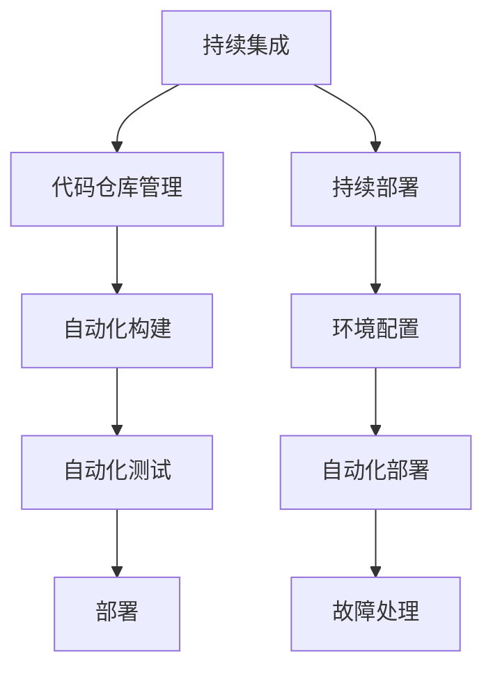

                 

# 持续集成与部署在LLM应用开发中的实践

## 关键词

持续集成，持续部署，LLM，应用开发，自动化，代码质量，测试，优化

## 摘要

本文将深入探讨持续集成（CI）与持续部署（CD）在大型语言模型（LLM）应用开发中的实践。首先，我们将了解CI/CD的基本概念、核心组件以及其在软件开发中的重要性。接着，本文将具体分析CI/CD在LLM应用开发中的应用，包括需求分析、流程设计、代码管理、自动化构建和测试，以及部署过程中的环境配置和故障处理。随后，通过实际案例展示CI/CD在LLM应用开发中的具体实现，并讨论流程优化策略。最后，本文将展望持续集成与部署的未来发展趋势，以及LLM应用开发中的挑战和优化方向。

## 第一部分：持续集成与持续部署的基础知识

### 第1章：持续集成与持续部署的基本概念

#### 1.1 持续集成与持续部署的起源与发展

持续集成（Continuous Integration，CI）和持续部署（Continuous Deployment，CD）是现代软件开发中的重要概念，起源于敏捷开发和DevOps文化的兴起。

持续集成的概念最早由ThoughtWorks的Martin Fowler和Joshua Kerievsky提出。他们的初衷是通过频繁的代码集成，快速发现并解决代码冲突和错误，以提高代码质量和开发效率。

持续部署的概念则由Netflix等公司率先提出，其核心思想是通过自动化流程，快速将代码发布到生产环境，以实现持续交付。

随着时间的推移，CI/CD已经从简单的代码集成和部署，发展成为一套全面的软件开发和交付流程。

#### 1.2 持续集成与持续部署的区别与联系

持续集成（CI）指的是频繁地将开发者的代码集成到一个共享的主干分支中，并通过自动化测试确保代码质量。CI的目的是快速发现和解决代码冲突，减少集成风险。

持续部署（CD）则是在CI的基础上，将代码自动化部署到生产环境。CD的目的是实现快速交付，确保软件的持续可用性。

尽管CI和CD有明确的区别，但它们在实际应用中通常是紧密关联的。CI为CD提供了稳定、高质量的代码基础，而CD则为CI提供了验证代码质量的实际场景。

#### 1.3 持续集成与持续部署的优势

持续集成与持续部署的优势主要体现在以下几个方面：

1. **提高代码质量**：通过频繁的代码集成和自动化测试，可以快速发现并解决代码中的问题，提高代码的稳定性。
2. **缩短开发周期**：自动化流程减少了手动操作，加快了开发进度，缩短了产品从开发到交付的时间。
3. **降低风险**：通过在早期阶段发现和解决问题，降低了大规模集成和发布时的风险。
4. **增强团队协作**：CI/CD鼓励团队成员频繁沟通和协作，提高了团队的效率和凝聚力。
5. **提高客户满意度**：快速交付高质量的产品，可以更好地满足客户需求，提高客户满意度。

### 第2章：持续集成与持续部署的核心组件

#### 2.1 源代码管理工具

源代码管理（Version Control System，VCS）是持续集成与持续部署的基础。常见的源代码管理工具有Git、SVN和Mercurial等。

- **Git**：Git是目前最流行的分布式版本控制系统，它支持离线工作，便于多人协作。
- **SVN**：SVN是集中式版本控制系统，适用于小规模团队，但缺乏Git的灵活性和高效性。
- **Mercurial**：Mercurial是一种分布式版本控制系统，与Git类似，但更加注重易用性和稳定性。

#### 2.2 自动化构建工具

自动化构建工具用于将源代码编译、打包和构建成可执行的软件。常见的自动化构建工具有Jenkins、Travis CI和GitLab CI等。

- **Jenkins**：Jenkins是一个开源的自动化服务器，支持多种集成工具，可定制化工作流程。
- **Travis CI**：Travis CI是一个在线的自动化构建服务，支持多种编程语言，可自动触发构建。
- **GitLab CI**：GitLab CI是GitLab自带的一个持续集成服务，可集成到GitLab项目中。

#### 2.3 自动化测试工具

自动化测试工具用于验证软件的功能和性能，确保代码的质量。常见的自动化测试工具有Selenium、JUnit和pytest等。

- **Selenium**：Selenium是一个开源的自动化测试工具，可用于Web应用的自动化测试。
- **JUnit**：JUnit是Java编程语言的一个测试框架，用于编写和运行单元测试。
- **pytest**：pytest是一个开源的Python测试框架，提供了丰富的测试功能和报告。

#### 2.4 代码质量分析工具

代码质量分析工具用于检测代码中的潜在问题，如代码风格不一致、代码冗余、安全漏洞等。常见的代码质量分析工具有SonarQube、Checkstyle和PMD等。

- **SonarQube**：SonarQube是一个代码质量管理平台，可用于代码质量检测和报告。
- **Checkstyle**：Checkstyle是一个Java代码风格检查工具，可自动检测代码风格问题。
- **PMD**：PMD是一个Java代码质量分析工具，可用于检测代码中的潜在问题和冗余代码。

#### 2.5 静态代码分析工具

静态代码分析工具用于在不运行代码的情况下分析代码的语法和结构，检测潜在的问题。常见的静态代码分析工具有FindBugs、LGT和PyFlakes等。

- **FindBugs**：FindBugs是一个Java静态代码分析工具，用于检测代码中的潜在问题和漏洞。
- **LGT**：LGT是一个Java静态代码分析工具，可用于检测代码中的冗余和低效代码。
- **PyFlakes**：PyFlakes是一个Python静态代码分析工具，用于检测Python代码中的潜在问题和风格问题。

### 第3章：持续集成与持续部署的流程设计

#### 3.1 持续集成的工作流程

持续集成的工作流程主要包括以下几个步骤：

1. **代码提交**：开发人员将代码提交到代码仓库。
2. **代码获取**：持续集成系统从代码仓库获取最新代码。
3. **构建**：使用自动化构建工具编译和打包代码。
4. **测试**：执行自动化测试，验证代码的功能和性能。
5. **报告**：生成测试报告，显示构建和测试的结果。
6. **部署**：如果测试通过，将代码部署到测试环境或生产环境。

#### 3.2 持续部署的工作流程

持续部署的工作流程主要包括以下几个步骤：

1. **构建**：使用自动化构建工具构建代码。
2. **测试**：执行自动化测试，确保代码的质量。
3. **部署**：将代码部署到生产环境。
4. **监控**：监控部署后的系统性能和稳定性。
5. **回滚**：如果部署失败或出现故障，可以回滚到上一个稳定版本。

#### 3.3 流程优化与实践

持续集成与持续部署的流程设计需要不断优化，以满足项目需求和提高开发效率。以下是一些流程优化的实践：

1. **自动化程度**：提高自动化程度，减少手动操作，降低错误率。
2. **并行执行**：在测试和部署阶段，使用并行执行，加快流程速度。
3. **弹性扩展**：根据项目规模和需求，弹性扩展CI/CD系统，提高性能和稳定性。
4. **持续优化**：定期回顾和优化流程，根据实际情况调整和改进。
5. **团队协作**：加强团队协作，确保CI/CD流程的顺利执行。

## 第二部分：持续集成与部署在LLM应用开发中的实践

### 第4章：LLM应用开发中的持续集成

#### 4.1 LLM应用开发的需求分析

在LLM应用开发中，持续集成（CI）是确保代码质量、提高开发效率和降低集成风险的重要手段。以下是LLM应用开发中CI的需求分析：

1. **频繁的代码集成**：由于LLM模型的开发涉及大量的代码修改和迭代，频繁的代码集成有助于及时发现问题，确保代码的一致性和稳定性。
2. **高效的自动化测试**：LLM应用通常具有复杂的业务逻辑和性能要求，需要高效的自动化测试来验证代码的正确性和性能。
3. **全面的代码质量检测**：需要对代码进行全面的质量检测，包括语法错误、代码风格、安全漏洞等，确保代码的可维护性和可靠性。
4. **灵活的部署策略**：需要支持多种部署环境，包括开发环境、测试环境和生产环境，确保代码在不同的环境下都能正常运行。

#### 4.2 LLM应用开发的持续集成流程设计

LLM应用开发的持续集成流程设计需要综合考虑代码管理、自动化构建、自动化测试和部署等方面。以下是具体的流程设计：

1. **代码管理**：使用Git等源代码管理工具，将代码存储在代码仓库中，支持多人协作和版本控制。
2. **自动化构建**：使用Jenkins、Travis CI或GitLab CI等自动化构建工具，将代码编译、打包和构建成可执行的软件。
3. **自动化测试**：编写自动化测试脚本，使用JUnit、pytest等自动化测试工具执行功能测试和性能测试，确保代码的质量和性能。
4. **代码质量检测**：使用SonarQube、Checkstyle或PMD等代码质量分析工具，对代码进行质量检测，发现潜在的问题和改进点。
5. **部署**：使用Kubernetes等容器化技术，将构建后的代码部署到测试环境或生产环境，实现自动化部署和运维。

#### 4.3 LLM应用开发中的代码管理

在LLM应用开发中，代码管理是确保代码质量、提高开发效率和降低集成风险的重要环节。以下是LLM应用开发中的代码管理策略：

1. **多人协作**：使用Git等源代码管理工具，支持多人协作和版本控制，确保代码的一致性和稳定性。
2. **分支管理**：采用分支管理策略，如Git Flow或GitHub Flow，确保代码的有序开发和发布。
3. **代码规范**：制定代码规范，包括命名规则、代码结构和注释要求，确保代码的可读性和可维护性。
4. **代码审查**：实施代码审查机制，如Code Review或Pull Request，确保代码的质量和可靠性。
5. **自动化部署**：集成持续集成和持续部署工具，实现代码的自动化构建、测试和部署，提高开发效率和稳定性。

#### 4.4 LLM应用开发中的自动化构建

自动化构建是LLM应用开发中CI的重要环节，通过自动化构建工具，可以快速、高效地将代码编译、打包和构建成可执行的软件。以下是LLM应用开发中的自动化构建策略：

1. **选择合适的构建工具**：根据项目需求和技术栈，选择合适的自动化构建工具，如Jenkins、Travis CI或GitLab CI等。
2. **构建脚本编写**：编写高效的构建脚本，包括编译、打包、依赖管理等，确保构建过程的自动化和可重复性。
3. **构建环境配置**：配置构建环境，包括操作系统、编译器、依赖库等，确保构建环境的稳定性和一致性。
4. **构建优化**：优化构建过程，如并行构建、缓存构建结果等，提高构建效率和速度。
5. **构建监控**：监控构建过程，包括构建时间、构建失败率等，及时发现和解决问题。

#### 4.5 LLM应用开发中的自动化测试

自动化测试是LLM应用开发中CI的重要组成部分，通过自动化测试工具，可以快速、全面地验证代码的功能和性能。以下是LLM应用开发中的自动化测试策略：

1. **测试用例编写**：根据需求文档和设计文档，编写全面的测试用例，包括功能测试和性能测试。
2. **测试框架选择**：选择合适的测试框架，如JUnit、pytest或TestNG等，提高测试的自动化程度和可维护性。
3. **测试环境配置**：配置测试环境，包括操作系统、数据库、中间件等，确保测试环境的稳定性和一致性。
4. **测试数据管理**：管理测试数据，包括测试数据的创建、修改和清理等，确保测试数据的完整性和有效性。
5. **测试报告生成**：生成详细的测试报告，包括测试结果、错误日志和性能指标等，方便测试分析和问题定位。

### 第5章：LLM应用开发中的持续部署

#### 5.1 LLM应用部署的需求分析

在LLM应用开发中，持续部署（CD）是实现自动化交付和快速发布的重要手段。以下是LLM应用部署的需求分析：

1. **快速交付**：LLM应用开发周期通常较短，需要快速交付以应对市场需求的变化。
2. **高质量**：确保交付的LLM应用具有高质量，包括功能完整、性能优秀、稳定性高。
3. **安全性**：确保部署过程和部署后的系统具有安全性，防止潜在的安全漏洞和风险。
4. **可扩展性**：支持灵活的部署策略，如水平扩展和垂直扩展，以适应业务规模的变化。
5. **可监控性**：对部署后的系统进行实时监控，包括性能监控、错误日志和异常告警等，确保系统的稳定性和可用性。

#### 5.2 LLM应用部署的持续部署流程设计

LLM应用部署的持续部署流程设计需要综合考虑自动化构建、测试、部署和监控等方面。以下是具体的流程设计：

1. **自动化构建**：使用自动化构建工具，将代码编译、打包和构建成可执行的软件。
2. **自动化测试**：执行自动化测试，包括单元测试、集成测试和性能测试等，确保代码的质量和性能。
3. **部署策略**：选择合适的部署策略，如蓝绿部署或金丝雀部署，确保部署过程的平滑和风险可控。
4. **部署执行**：将构建后的软件部署到测试环境或生产环境，实现自动化部署和运维。
5. **监控告警**：对部署后的系统进行实时监控，包括性能监控、错误日志和异常告警等，确保系统的稳定性和可用性。

#### 5.3 LLM应用部署中的环境配置

在LLM应用部署中，环境配置是确保应用在不同环境中正常运行的关键。以下是LLM应用部署中的环境配置策略：

1. **开发环境**：配置开发环境，包括操作系统、数据库、中间件和开发工具等，确保开发过程的顺利进行。
2. **测试环境**：配置测试环境，与开发环境保持一致，用于测试代码的质量和性能。
3. **生产环境**：配置生产环境，包括服务器、网络和存储等，确保应用的高可用性和高性能。
4. **配置管理**：使用配置管理工具，如Ansible或Terraform，自动化管理环境配置，确保配置的一致性和可重复性。
5. **版本控制**：对环境配置进行版本控制，记录配置的变更历史，方便追溯和回滚。

#### 5.4 LLM应用部署中的自动化部署工具

在LLM应用部署中，自动化部署工具是实现自动化交付和快速发布的关键。以下是LLM应用部署中的自动化部署工具选择和策略：

1. **Kubernetes**：Kubernetes是一个开源的容器编排平台，支持自动化部署、扩展和管理容器化应用。
2. **Docker**：Docker是一个开源的容器化平台，用于打包、发布和运行应用，支持自动化部署和容器化架构。
3. **Jenkins**：Jenkins是一个开源的自动化服务器，支持自动化构建、测试和部署，与Kubernetes和Docker集成，实现自动化交付。
4. **Ansible**：Ansible是一个开源的配置管理和自动化工具，用于自动化部署和管理环境配置。
5. **Terraform**：Terraform是一个开源的基础设施即代码工具，用于自动化部署和管理云基础设施，与Kubernetes和Docker集成，实现自动化交付。

#### 5.5 LLM应用部署中的故障处理与回滚

在LLM应用部署过程中，可能会出现各种故障，如部署失败、应用崩溃和性能下降等。以下是LLM应用部署中的故障处理与回滚策略：

1. **故障监控**：对部署后的系统进行实时监控，包括性能监控、错误日志和异常告警等，及时发现和定位故障。
2. **故障定位**：根据监控数据和日志分析，定位故障原因，如代码问题、配置错误或资源不足等。
3. **故障恢复**：根据故障原因，采取相应的故障恢复措施，如重启应用、调整配置或增加资源等。
4. **回滚策略**：如果故障无法恢复或影响较大，采取回滚策略，将系统回滚到上一个稳定版本，确保系统的可用性和稳定性。
5. **故障总结**：对故障处理过程进行总结，记录故障原因、处理方法和解决方案，为后续故障处理提供参考。

### 第三部分：实战案例与优化策略

#### 第6章：LLM应用开发实战案例

#### 6.1 案例一：某电商平台的LLM应用开发

某电商平台在开发智能客服应用时，采用了持续集成与持续部署（CI/CD）的策略，以提高开发效率和代码质量。以下是具体的实施过程：

1. **代码管理**：使用Git进行代码管理，采用Git Flow模型进行分支管理，确保代码的有序开发和发布。
2. **自动化构建**：使用Jenkins作为自动化构建工具，配置Jenkinsfile，实现自动化编译、打包和构建。
3. **自动化测试**：编写自动化测试脚本，使用Selenium进行功能测试，使用JUnit进行单元测试，确保代码的质量和性能。
4. **代码质量检测**：使用SonarQube进行代码质量检测，检测代码中的潜在问题和风格问题。
5. **部署**：使用Kubernetes进行容器化部署，实现自动化部署和运维。
6. **监控告警**：使用Prometheus和Grafana进行实时监控和告警，确保系统的稳定性和可用性。

通过CI/CD策略的实施，该电商平台显著提高了开发效率和代码质量，减少了部署故障和风险，提高了系统的稳定性和用户体验。

#### 6.2 案例二：某金融公司的LLM应用开发

某金融公司在开发智能投顾应用时，采用了持续集成与持续部署（CI/CD）的策略，以确保应用的安全性和稳定性。以下是具体的实施过程：

1. **代码管理**：使用Git进行代码管理，采用Git Flow模型进行分支管理，确保代码的有序开发和发布。
2. **自动化构建**：使用Jenkins作为自动化构建工具，配置Jenkinsfile，实现自动化编译、打包和构建。
3. **自动化测试**：编写自动化测试脚本，使用pytest进行单元测试，使用Selenium进行功能测试，确保代码的质量和性能。
4. **代码质量检测**：使用Checkstyle进行代码质量检测，检测代码中的潜在问题和风格问题。
5. **部署**：使用Kubernetes进行容器化部署，实现自动化部署和运维。
6. **监控告警**：使用Prometheus和Grafana进行实时监控和告警，确保系统的稳定性和可用性。

通过CI/CD策略的实施，该金融公司显著提高了开发效率和代码质量，降低了部署故障和风险，提高了系统的稳定性和用户体验。

#### 6.3 案例三：某教育平台的LLM应用开发

某教育平台在开发智能辅导应用时，采用了持续集成与持续部署（CI/CD）的策略，以提高开发效率和用户体验。以下是具体的实施过程：

1. **代码管理**：使用Git进行代码管理，采用Git Flow模型进行分支管理，确保代码的有序开发和发布。
2. **自动化构建**：使用Jenkins作为自动化构建工具，配置Jenkinsfile，实现自动化编译、打包和构建。
3. **自动化测试**：编写自动化测试脚本，使用pytest进行单元测试，使用pytest-bdd进行集成测试，确保代码的质量和性能。
4. **代码质量检测**：使用PMD进行代码质量检测，检测代码中的潜在问题和风格问题。
5. **部署**：使用Kubernetes进行容器化部署，实现自动化部署和运维。
6. **监控告警**：使用Prometheus和Grafana进行实时监控和告警，确保系统的稳定性和可用性。

通过CI/CD策略的实施，该教育平台显著提高了开发效率和用户体验，减少了部署故障和风险，提高了系统的稳定性和性能。

### 第7章：持续集成与部署的优化策略

#### 7.1 流程优化

持续集成与持续部署的流程优化是提高开发效率和代码质量的关键。以下是一些流程优化的策略：

1. **自动化程度**：提高自动化程度，减少手动操作，降低错误率。
2. **并行执行**：在测试和部署阶段，使用并行执行，加快流程速度。
3. **弹性扩展**：根据项目规模和需求，弹性扩展CI/CD系统，提高性能和稳定性。
4. **持续优化**：定期回顾和优化流程，根据实际情况调整和改进。
5. **团队协作**：加强团队协作，确保CI/CD流程的顺利执行。

#### 7.2 工具选型

选择合适的CI/CD工具是确保流程顺利执行的关键。以下是一些工具选型的考虑因素：

1. **功能需求**：根据项目需求，选择具有所需功能的工具。
2. **集成性**：选择易于与其他工具集成的工具，提高开发效率。
3. **可扩展性**：选择具有良好扩展性的工具，以适应项目规模的变化。
4. **性能**：选择性能优秀的工具，确保流程的顺畅执行。
5. **社区支持**：选择具有强大社区支持的工具，以便获取帮助和资源。

#### 7.3 团队协作

团队协作是CI/CD成功实施的重要保障。以下是一些团队协作的策略：

1. **代码规范**：制定统一的代码规范，提高代码的可读性和可维护性。
2. **代码审查**：实施代码审查机制，确保代码的质量和可靠性。
3. **自动化培训**：定期进行自动化测试和CI/CD的培训，提高团队成员的技能水平。
4. **沟通与协作**：加强团队沟通和协作，确保CI/CD流程的顺利执行。
5. **反馈与改进**：鼓励团队成员反馈问题和建议，不断改进CI/CD流程。

#### 7.4 性能优化

持续集成与持续部署的性能优化是提高系统稳定性和用户体验的关键。以下是一些性能优化的策略：

1. **缓存机制**：使用缓存机制，减少重复的构建和测试，提高流程速度。
2. **资源分配**：合理分配资源和权限，确保流程的顺畅执行。
3. **并行处理**：使用并行处理技术，提高构建和测试的并发能力。
4. **监控与告警**：对CI/CD系统进行实时监控，及时发现和解决性能问题。
5. **持续优化**：根据性能监控数据和用户反馈，持续优化CI/CD系统。

### 第8章：未来展望与趋势

#### 8.1 持续集成与持续部署的发展趋势

随着云计算、容器化和微服务架构的普及，持续集成与持续部署（CI/CD）正朝着以下几个趋势发展：

1. **云原生CI/CD**：随着云原生技术的兴起，CI/CD系统将更加集成到云平台，实现自动化部署和运维。
2. **微服务CI/CD**：微服务架构的普及使得CI/CD系统需要更好地支持微服务的构建、测试和部署。
3. **智能化CI/CD**：利用人工智能和机器学习技术，实现更智能的CI/CD流程，提高流程的自动化程度和稳定性。
4. **DevOps文化的普及**：DevOps文化的普及将推动CI/CD在更多企业和项目中的实施，提高开发效率和代码质量。

#### 8.2 LLM应用开发中的持续集成与部署挑战

在LLM应用开发中，持续集成与部署（CI/CD）面临以下几个挑战：

1. **模型规模**：LLM模型通常具有较大的规模和复杂性，需要优化CI/CD流程，以适应模型规模的变化。
2. **数据隐私**：在CI/CD过程中，数据隐私和安全是重要问题，需要采取有效的数据保护措施。
3. **测试覆盖**：确保对LLM模型进行全面的测试，覆盖所有可能的场景和输入，提高测试覆盖率。
4. **性能优化**：优化CI/CD系统的性能，确保模型构建、测试和部署的高效执行。

#### 8.3 未来持续集成与部署的优化方向

未来持续集成与部署（CI/CD）的优化方向包括：

1. **自动化程度**：进一步提高CI/CD的自动化程度，减少手动操作，降低错误率。
2. **智能化**：利用人工智能和机器学习技术，实现更智能的CI/CD流程，提高流程的自动化程度和稳定性。
3. **性能优化**：优化CI/CD系统的性能，提高模型构建、测试和部署的速度。
4. **安全性**：加强CI/CD系统的安全性，保护数据和模型的安全。
5. **可扩展性**：支持灵活的部署策略，适应不同规模和复杂度的项目。

### 附录

#### 附录A：常用持续集成与部署工具列表

1. **Jenkins**：一个开源的持续集成服务器，支持多种插件和定制化工作流程。
2. **GitLab CI/CD**：GitLab内置的持续集成与持续部署工具，支持自动化构建、测试和部署。
3. **GitHub Actions**：GitHub提供的持续集成与持续部署服务，支持多种编程语言和工作流程。
4. **GitPod**：一个集成的开发环境，支持代码托管和持续集成。

#### 附录B：LLM应用开发中的常见问题及解决方案

1. **问题1：构建失败**
   - **解决方案**：检查构建脚本和依赖库，确保构建环境的配置正确。
2. **问题2：测试失败**
   - **解决方案**：检查测试脚本和测试用例，确保测试环境的配置正确。
3. **问题3：部署失败**
   - **解决方案**：检查部署脚本和Kubernetes配置，确保部署环境的配置正确。

#### 附录C：持续集成与部署的参考资料与推荐阅读

1. **《持续集成实践》**：由ThoughtWorks团队编写，详细介绍了CI的概念和实践。
2. **《Jenkins实战：持续集成与持续部署》**：由吴波等编著，介绍了Jenkins的安装、配置和实战应用。
3. **《Kubernetes权威指南》**：由刘江编写，详细介绍了Kubernetes的架构、安装和配置。
4. **《深度学习与自然语言处理》**：由崔丽娜等编著，介绍了深度学习和自然语言处理的基本原理和应用。

### 核心算法原理讲解

#### 伪代码：

```plaintext
// 伪代码：持续集成过程
function ContinuousIntegration() {
    // 1. 从代码仓库获取最新代码
    code = getCodeFromRepository()

    // 2. 构建代码
    build = buildCode(code)

    // 3. 测试代码
    test = testCode(build)

    // 4. 如果测试失败，则回滚
    if (!test.pass) {
        rollback(code)
        return "Failed"
    }

    // 5. 如果测试成功，则部署
    deploy(build)
    return "Succeeded"
}
```

#### 持续集成过程中的成本函数：

$$
C = C_{build} + C_{test} + C_{deploy}
$$

其中：

- \(C_{build}\)：构建成本
- \(C_{test}\)：测试成本
- \(C_{deploy}\)：部署成本

#### 假设构建成本为10小时，测试成本为5小时，部署成本为3小时，则总成本为：

$$
C = 10 + 5 + 3 = 18 \text{小时}
$$

### 项目实战

#### 代码实际案例：

##### 环境搭建

```bash
# 安装Jenkins
sudo apt-get update
sudo apt-get install jenkins

# 启动Jenkins服务
sudo systemctl start jenkins

# 访问Jenkins Web界面
open http://localhost:8080
```

##### 源代码实现：

```java
// Jenkinsfile
pipeline {
    agent any
    stages {
        stage('Build') {
            steps {
                sh 'mvn clean install'
            }
        }
        stage('Test') {
            steps {
                sh 'mvn test'
            }
        }
        stage('Deploy') {
            steps {
                sh 'mvn package'
                sh 'kubectl apply -f deployment.yaml'
            }
        }
    }
    post {
        always {
            echo 'Build and deploy completed'
        }
        success {
            echo 'Deployment succeeded'
        }
        failure {
            echo 'Deployment failed'
        }
    }
}
```

##### 代码解读与分析：

- **Jenkinsfile** 用于定义持续集成与持续部署的流程。
- `agent any` 指定在任何节点上执行流水线。
- `stages` 定义了三个阶段：构建（Build）、测试（Test）、部署（Deploy）。
- `post` 定义了在构建和部署完成后执行的命令。
- **构建阶段** 执行 Maven 构建命令。
- **测试阶段** 执行 Maven 测试命令。
- **部署阶段** 执行 Maven 打包命令和 Kubernetes 部署命令。

### 附录

#### 附录A：常用持续集成与部署工具列表

- **Jenkins**：一个开源的持续集成服务器，支持多种插件和定制化工作流程。
- **GitLab CI/CD**：GitLab内置的持续集成与持续部署工具，支持自动化构建、测试和部署。
- **GitHub Actions**：GitHub提供的持续集成与持续部署服务，支持多种编程语言和工作流程。
- **GitPod**：一个集成的开发环境，支持代码托管和持续集成。

#### 附录B：LLM应用开发中的常见问题及解决方案

- **问题1：构建失败**
  - **解决方案**：检查构建脚本和依赖库，确保构建环境的配置正确。
- **问题2：测试失败**
  - **解决方案**：检查测试脚本和测试用例，确保测试环境的配置正确。
- **问题3：部署失败**
  - **解决方案**：检查部署脚本和 Kubernetes 配置，确保部署环境的配置正确。

#### 附录C：持续集成与部署的参考资料与推荐阅读

- **《持续集成实践》**：由ThoughtWorks团队编写，详细介绍了CI的概念和实践。
- **《Jenkins实战：持续集成与持续部署》**：由吴波等编著，介绍了Jenkins的安装、配置和实战应用。
- **《Kubernetes权威指南》**：由刘江编写，详细介绍了Kubernetes的架构、安装和配置。
- **《深度学习与自然语言处理》**：由崔丽娜等编著，介绍了深度学习和自然语言处理的基本原理和应用。

**### Mermaid 流程图**



### 作者信息

**作者：** AI天才研究院/AI Genius Institute & 禅与计算机程序设计艺术 /Zen And The Art of Computer Programming

### 结语

本文从基础概念、实践应用和优化策略等方面，全面探讨了持续集成与持续部署在LLM应用开发中的实践。通过实际案例和代码解读，展示了CI/CD在LLM应用开发中的应用和优势。随着云计算、容器化和微服务架构的普及，CI/CD将在未来继续发展，为LLM应用开发提供更高效的解决方案。希望本文能为读者在LLM应用开发中引入CI/CD提供有益的参考。

