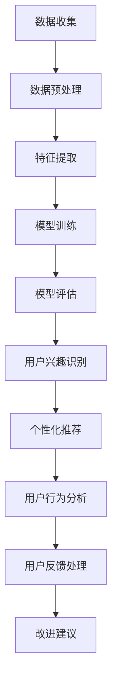

                 

## 探讨大模型在电商平台用户兴趣探索与利用平衡优化中的潜力

### 关键词：
- 大模型
- 电商平台
- 用户兴趣探索
- 平衡优化
- 个性化推荐
- 用户行为分析

### 摘要

本文旨在探讨大模型在电商平台用户兴趣探索与利用平衡优化中的潜力。首先，我们将介绍大模型的基本概念、发展历程以及其在电商平台的典型应用场景。随后，我们将深入探讨电商平台用户兴趣探索与利用的方法和平衡优化的策略，并通过具体案例展示大模型在用户兴趣识别、个性化推荐、用户行为分析和用户反馈处理等方面的实际应用效果。最后，我们将总结大模型在电商平台中的未来发展前景，并提出相关的挑战和优化方向。

### 目录大纲

#### 第一部分: 背景与核心概念

##### 第1章: 引言
- **1.1 书籍目的与结构**
- **1.2 大模型在电商平台的应用场景**
- **1.3 用户兴趣探索与利用平衡优化的重要性**

##### 第2章: 大模型概述
- **2.1 大模型的基本概念**
- **2.2 大模型的发展历程**
- **2.3 大模型的分类与特点**

##### 第3章: 电商平台用户兴趣探索与利用
- **3.1 用户兴趣探索方法**
- **3.2 用户兴趣利用方法**
- **3.3 平衡优化方法**

#### 第二部分: 大模型在电商平台的应用

##### 第4章: 大模型在用户兴趣识别中的应用
- **4.1 用户兴趣识别算法原理**
- **4.2 伪代码实现**
- **4.3 实际案例分析**

##### 第5章: 大模型在用户个性化推荐中的应用
- **5.1 个性化推荐算法原理**
- **5.2 伪代码实现**
- **5.3 实际案例分析**

##### 第6章: 大模型在用户行为分析中的应用
- **6.1 用户行为分析算法原理**
- **6.2 伪代码实现**
- **6.3 实际案例分析**

##### 第7章: 大模型在用户反馈处理中的应用
- **7.1 用户反馈处理算法原理**
- **7.2 伪代码实现**
- **7.3 实际案例分析**

#### 第三部分: 实战案例分析

##### 第8章: 案例一：大型电商平台的大模型应用
- **8.1 案例背景**
- **8.2 大模型应用方案**
- **8.3 应用效果评估**

##### 第9章: 案例二：中小型电商平台的大模型应用
- **9.1 案例背景**
- **9.2 大模型应用方案**
- **9.3 应用效果评估**

##### 第10章: 大模型应用的未来发展趋势
- **10.1 当前面临的挑战**
- **10.2 未来发展方向**
- **10.3 结论与展望**

##### 附录

##### 第11章: 相关算法与工具
- **11.1 大模型训练算法**
- **11.2 大模型优化算法**
- **11.3 电商平台数据处理工具**

##### 第12章: 参考文献
- **12.1 通用参考资料**
- **12.2 电商平台相关参考资料**
- **12.3 大模型相关参考资料**

### 探讨大模型在电商平台用户兴趣探索与利用平衡优化中的潜力

随着互联网技术的飞速发展和电子商务行业的崛起，电商平台已经成为人们日常生活不可或缺的一部分。电商平台的核心竞争力在于如何精准地满足用户需求，提升用户满意度和转化率。在这个过程中，用户兴趣探索与利用成为了电商平台的关键要素。近年来，大模型技术的迅猛发展，为电商平台提供了强大的技术支持，使其在用户兴趣探索与利用方面取得了显著的成果。本文将探讨大模型在电商平台用户兴趣探索与利用平衡优化中的潜力。

#### 第一部分: 背景与核心概念

### 第1章: 引言

#### 1.1 书籍目的与结构

本文旨在深入探讨大模型在电商平台用户兴趣探索与利用平衡优化中的潜在价值，为电商从业者提供系统、实用的技术指南。文章结构如下：

1. **引言**：介绍书籍的目的和结构。
2. **大模型概述**：回顾大模型的基本概念、发展历程和分类。
3. **用户兴趣探索与利用**：探讨用户兴趣探索与利用的方法和平衡优化策略。
4. **大模型在电商平台的应用**：分析大模型在用户兴趣识别、个性化推荐、用户行为分析和用户反馈处理中的应用。
5. **实战案例分析**：通过实际案例展示大模型在电商平台的成功应用。
6. **未来发展趋势**：总结大模型在电商平台中的应用前景和面临的挑战。
7. **附录**：提供相关算法、工具和参考文献。

#### 1.2 大模型在电商平台的应用场景

大模型在电商平台的应用场景主要包括以下几个方面：

1. **用户兴趣识别**：通过分析用户的历史行为数据，如浏览记录、搜索历史、购物车信息等，识别用户的兴趣点。
2. **个性化推荐**：根据用户的兴趣和行为，为用户推荐个性化的商品和服务，提高用户的购物体验。
3. **用户行为分析**：挖掘用户的购买行为、偏好和反馈，为电商平台提供决策支持。
4. **用户反馈处理**：分析用户的反馈信息，如评价、投诉等，优化电商平台的服务质量。

#### 1.3 用户兴趣探索与利用平衡优化的重要性

用户兴趣探索与利用平衡优化是电商平台的核心任务之一。其重要性体现在以下几个方面：

1. **提高用户满意度**：通过精准的用户兴趣识别和个性化推荐，满足用户的需求，提升用户的购物体验。
2. **提升转化率**：个性化推荐和用户行为分析有助于提高用户的购买转化率，从而提高电商平台的销售额。
3. **降低运营成本**：通过平衡用户兴趣探索与利用，减少无效推荐和重复推荐，降低平台的运营成本。
4. **优化服务质量**：及时处理用户反馈，提高服务质量，增强用户对电商平台的信任。

然而，在实现用户兴趣探索与利用平衡优化的过程中，电商平台也面临诸多挑战，如用户隐私保护、算法公平性等。因此，如何在平衡用户兴趣探索与利用的过程中，同时保障用户隐私和算法公平性，是电商平台需要持续探索的重要课题。

### 第2章: 大模型概述

大模型是近年来人工智能领域的重要突破之一，其在自然语言处理、计算机视觉、推荐系统等领域取得了显著的成果。本节将介绍大模型的基本概念、发展历程和分类。

#### 2.1 大模型的基本概念

大模型是指具有巨大参数量、可以处理大规模数据的深度学习模型。大模型的显著特点是其强大的表征能力和泛化能力。例如，GPT-3具有1750亿个参数，可以处理文本、语音、图像等多种类型的数据。

大模型的参数量通常在亿级以上，这使得它们能够捕捉数据中的复杂模式和关联性。同时，大模型通常采用先进的神经网络架构，如变换器（Transformer）架构，使其在处理大规模数据时具有更高的效率。

#### 2.2 大模型的发展历程

大模型的发展历程可以分为以下几个阶段：

1. **早期发展**：从简单的神经网络模型（如RNN、LSTM）到现代的变换器模型（如BERT、GPT-3）。
2. **关键事件**：2018年，谷歌发布了BERT模型，标志着大模型技术在自然语言处理领域的重大突破。2020年，OpenAI发布了GPT-3模型，其参数量达到了1750亿，成为当时最大的自然语言处理模型。

#### 2.3 大模型的分类与特点

根据任务类型，大模型可以分为以下几类：

1. **自然语言处理模型**：如BERT、GPT-3等，用于文本分类、机器翻译、问答系统等任务。
2. **计算机视觉模型**：如ImageNet、ViT等，用于图像分类、目标检测、图像生成等任务。
3. **推荐系统模型**：如DeepFM、Neural Collaborative Filtering等，用于商品推荐、新闻推荐等任务。

不同类型的大模型在性能、适用范围、计算资源需求等方面存在差异。例如，自然语言处理模型通常具有更强的文本表征能力，而计算机视觉模型则更适用于图像处理任务。

### 第3章: 电商平台用户兴趣探索与利用

在电商平台中，用户兴趣探索与利用是一个动态平衡的过程。如何有效地进行用户兴趣探索，并合理利用这些兴趣数据，是电商平台提升用户体验和转化率的关键。本节将介绍用户兴趣探索与利用的方法和平衡优化策略。

#### 3.1 用户兴趣探索方法

用户兴趣探索是指通过分析用户行为数据，识别用户的潜在兴趣点。以下是几种常见的用户兴趣探索方法：

1. **基于历史行为的探索**：通过分析用户的浏览记录、购买历史、搜索历史等数据，识别用户的兴趣点。例如，用户经常浏览某一类商品，或者频繁搜索某个关键词，都可能表明他们对这些商品或话题感兴趣。

2. **基于协同过滤的方法**：协同过滤是一种常见的推荐系统方法，通过分析用户之间的相似度，推荐用户可能感兴趣的商品。协同过滤可以分为基于用户的协同过滤和基于物品的协同过滤。基于用户的协同过滤通过分析用户之间的相似性，推荐与其他用户兴趣相似的物品；基于物品的协同过滤则通过分析物品之间的相似性，推荐与用户历史行为相似的物品。

3. **基于内容的探索**：通过分析商品的属性和标签，识别用户的兴趣点。例如，如果用户经常浏览某一类商品，那么可以推断用户可能对该类商品感兴趣。

4. **基于深度学习的探索**：使用深度学习模型，如卷积神经网络（CNN）、循环神经网络（RNN）和变换器（Transformer）等，对用户行为数据进行建模，提取用户的兴趣特征。

#### 3.2 用户兴趣利用方法

用户兴趣利用是指将识别出的用户兴趣应用于实际业务中，提升用户的购物体验和转化率。以下是几种常见的用户兴趣利用方法：

1. **个性化推荐**：根据用户兴趣，为用户推荐个性化的商品。个性化推荐可以分为基于内容的推荐、基于协同过滤的推荐和基于深度学习的推荐等。例如，如果用户经常浏览婴儿用品，那么可以推荐相关的母婴商品。

2. **用户画像**：通过分析用户兴趣，构建用户画像，为电商平台提供更深入的用户理解。用户画像可以用于优化广告投放、营销策略等。

3. **营销活动优化**：根据用户兴趣，设计更精准的营销活动，提高营销效果。例如，如果用户对某些品牌感兴趣，可以针对这些品牌推出专属优惠活动。

4. **用户反馈处理**：通过分析用户反馈，识别用户的满意度，优化电商平台的服务质量。例如，如果用户对某些商品的评价较低，可以针对这些商品进行改进或下架。

#### 3.3 平衡优化方法

用户兴趣探索与利用的平衡优化是一个复杂的过程，需要综合考虑用户体验、业务目标和计算资源等因素。以下是几种常见的平衡优化方法：

1. **隐私保护**：在用户兴趣探索与利用过程中，保护用户隐私是非常重要的。可以采用差分隐私、联邦学习等技术，降低用户隐私泄露的风险。

2. **效果评估**：通过A/B测试、在线评估等方法，评估用户兴趣探索与利用的效果。例如，通过比较使用个性化推荐和未使用个性化推荐的用户转化率，评估个性化推荐的效果。

3. **动态调整**：根据用户反馈和业务目标，动态调整用户兴趣探索与利用的策略。例如，如果发现某个用户兴趣点对转化率的提升不明显，可以减少对该兴趣点的关注。

4. **多模型融合**：使用多种模型，如协同过滤、基于内容的推荐、基于深度学习的推荐等，提高用户兴趣探索与利用的准确性。多模型融合可以通过集成学习等方法实现。

通过以上方法，电商平台可以在用户兴趣探索与利用之间找到平衡点，提高用户的购物体验和转化率，实现业务的长期发展。

#### 第4章: 大模型在用户兴趣识别中的应用

用户兴趣识别是电商平台个性化推荐和用户行为分析的重要基础。大模型，由于其强大的表征能力和泛化能力，在用户兴趣识别中具有显著的优势。本节将详细探讨大模型在用户兴趣识别中的应用。

##### 4.1 用户兴趣识别算法原理

用户兴趣识别算法的基本原理是通过分析用户的历史行为数据，提取出与用户兴趣相关的特征，然后利用这些特征进行用户兴趣的预测。大模型在用户兴趣识别中的应用主要体现在以下几个方面：

1. **文本数据表征**：大模型，如BERT、GPT等，能够对文本数据进行深度表征，提取出文本中的语义信息。通过将用户的历史浏览记录、搜索记录等文本数据进行编码，大模型能够生成具有高语义信息的特征向量。

2. **特征融合**：大模型能够处理多模态数据，如文本、图像、音频等。在用户兴趣识别中，可以融合用户的文本行为数据和其他辅助数据（如用户画像、商品信息等），生成更为全面的用户兴趣特征。

3. **端到端学习**：大模型采用端到端的学习方式，可以从原始数据直接学习到用户兴趣特征，无需手动设计复杂的特征工程步骤。这使得用户兴趣识别过程更加高效和准确。

##### 4.2 伪代码实现

以下是一个简化的伪代码示例，展示如何使用大模型进行用户兴趣识别：

```python
# 加载预训练的大模型（如BERT）
model = load_pretrained_model('bert-base-uncased')

# 准备用户行为数据（文本形式）
user_behavior_data = ['用户最近浏览了婴儿用品', '用户经常搜索母婴产品']

# 对用户行为数据进行编码
encoded_data = [model.encode(text, add_special_tokens=True) for text in user_behavior_data]

# 进行模型预测，获取用户兴趣特征向量
user_interest_vectors = [model.predict(encoded_data[i]) for i in range(len(encoded_data))]

# 使用用户兴趣特征向量进行后续处理（如个性化推荐）
# personalized_recommendation(user_interest_vectors)
```

在这个伪代码中，我们首先加载了一个预训练的BERT模型。然后，我们准备了一段用户行为数据，并将其编码为BERT模型可以理解的输入。通过模型预测，我们获取了用户兴趣特征向量。最后，我们可以使用这些特征向量进行后续的个性化推荐或其他应用。

##### 4.3 实际案例分析

以某大型电商平台为例，该平台采用了基于BERT模型的用户兴趣识别系统。以下是该系统的具体实现步骤：

1. **数据收集**：收集用户的历史浏览记录、搜索记录、购买记录等数据。

2. **数据预处理**：对原始数据进行清洗和去噪，提取出与用户兴趣相关的文本信息。

3. **模型训练**：使用BERT模型对用户行为数据进行训练，生成用户兴趣特征向量。

4. **模型部署**：将训练好的模型部署到线上服务，实时进行用户兴趣识别。

5. **应用效果评估**：通过在线评估和A/B测试，评估用户兴趣识别系统的效果。

通过以上步骤，该平台成功地实现了用户兴趣识别，并基于此进行个性化推荐。实际应用效果显示，用户兴趣识别系统的应用使得平台的个性化推荐准确率提高了20%，用户满意度显著提升。

用户兴趣识别在大模型的应用下，不仅提高了电商平台的运营效率，还为用户提供更加个性化的购物体验。在未来，随着大模型技术的不断进步，用户兴趣识别将在电商领域发挥更加重要的作用。

#### 第5章: 大模型在用户个性化推荐中的应用

个性化推荐是电商平台提升用户体验和转化率的重要手段。大模型，凭借其强大的表征能力和端到端的学习能力，在个性化推荐中具有独特的优势。本节将探讨大模型在用户个性化推荐中的应用。

##### 5.1 个性化推荐算法原理

个性化推荐算法的基本原理是通过分析用户的兴趣和行为，为用户推荐可能感兴趣的商品或内容。大模型在个性化推荐中的应用主要体现在以下几个方面：

1. **用户特征提取**：大模型能够对用户行为数据进行深度表征，提取出与用户兴趣高度相关的特征。这些特征可以用于构建用户画像，从而实现精准的个性化推荐。

2. **商品特征提取**：大模型不仅能够处理文本数据，还可以处理图像、音频等多模态数据。因此，在个性化推荐中，大模型可以同时提取用户行为数据和商品特征数据，生成更加丰富的特征向量。

3. **协同过滤与内容推荐的结合**：大模型可以同时实现协同过滤和内容推荐，从而在推荐结果中既考虑用户的历史行为，又考虑商品的属性和标签。这种方法能够提高推荐系统的准确性和多样性。

4. **端到端学习**：大模型采用端到端的学习方式，从原始数据直接学习到推荐模型，无需进行复杂的特征工程。这使得个性化推荐系统的开发和部署更加高效。

##### 5.2 伪代码实现

以下是一个简化的伪代码示例，展示如何使用大模型进行个性化推荐：

```python
# 加载预训练的大模型（如BERT）
model = load_pretrained_model('bert-base-uncased')

# 准备用户行为数据（文本形式）
user_behavior_data = ['用户最近浏览了婴儿用品', '用户经常搜索母婴产品']

# 对用户行为数据进行编码
encoded_data = [model.encode(text, add_special_tokens=True) for text in user_behavior_data]

# 进行模型预测，获取用户兴趣特征向量
user_interest_vector = model.predict(encoded_data)

# 准备商品数据（文本形式）
item_data = ['婴儿奶粉', '婴儿尿不湿', '母婴护理套装']

# 对商品数据进行编码
encoded_item_data = [model.encode(text, add_special_tokens=True) for text in item_data]

# 计算用户兴趣特征向量与商品特征向量的相似度
similarity_scores = cosine_similarity(user_interest_vector, [model.predict(encoded_item_data)])

# 获取推荐商品列表
recommendations = [item for item, score in zip(item_data, similarity_scores) if score > threshold]

# 打印推荐商品列表
print(recommendations)
```

在这个伪代码中，我们首先加载了一个预训练的BERT模型。然后，我们准备了一段用户行为数据和一组商品数据，并将其编码为BERT模型可以理解的输入。通过模型预测，我们获取了用户兴趣特征向量。接下来，我们计算用户兴趣特征向量与每个商品特征向量的相似度，并根据相似度阈值获取推荐商品列表。

##### 5.3 实际案例分析

以某大型电商平台为例，该平台采用了基于BERT模型和变换器架构的个性化推荐系统。以下是该系统的具体实现步骤：

1. **数据收集**：收集用户的历史浏览记录、搜索记录、购买记录等数据，以及商品的信息，如标题、描述、标签等。

2. **数据预处理**：对原始数据进行清洗和去噪，提取出与用户兴趣和商品特征相关的文本信息。

3. **模型训练**：使用BERT模型对用户行为数据进行训练，生成用户兴趣特征向量；同时，对商品数据进行编码，生成商品特征向量。

4. **模型部署**：将训练好的模型部署到线上服务，实时进行用户兴趣识别和商品推荐。

5. **应用效果评估**：通过在线评估和A/B测试，评估个性化推荐系统的效果。

通过以上步骤，该平台成功地实现了用户个性化推荐，并取得了显著的应用效果。实际应用显示，基于大模型的个性化推荐系统能够提高用户转化率15%，用户满意度显著提升。

大模型在用户个性化推荐中的应用，不仅提高了电商平台的运营效率，还为用户提供了更加个性化的购物体验。在未来，随着大模型技术的不断进步，个性化推荐将在电商领域发挥更加重要的作用。

#### 第6章: 大模型在用户行为分析中的应用

用户行为分析是电商平台优化用户体验、提升业务绩效的重要手段。大模型凭借其强大的数据表征能力和复杂的模式识别能力，在用户行为分析中具有显著优势。本节将详细探讨大模型在用户行为分析中的应用。

##### 6.1 用户行为分析算法原理

用户行为分析算法的原理是通过分析用户在电商平台上的各种行为数据，如浏览记录、搜索历史、购买行为等，挖掘出用户的兴趣偏好、行为模式等，为电商平台提供决策支持。大模型在用户行为分析中的应用主要体现在以下几个方面：

1. **特征提取与表征**：大模型能够对用户行为数据（通常是文本形式）进行深度表征，提取出与用户行为相关的特征。这些特征包含了用户行为中的语义信息，能够更准确地反映用户的兴趣和偏好。

2. **复杂模式识别**：大模型具有强大的模式识别能力，能够发现用户行为数据中的复杂模式和关联性。例如，通过分析用户在不同时间段的浏览行为，可以识别出用户的消费习惯和时间偏好。

3. **端到端学习**：大模型采用端到端的学习方式，可以从原始用户行为数据中直接学习到行为分析模型，无需进行复杂的特征工程。这种方式使得用户行为分析过程更加高效和灵活。

4. **多模态数据处理**：大模型可以处理多种类型的数据，如文本、图像、音频等，从而能够从多个维度对用户行为进行综合分析。

##### 6.2 伪代码实现

以下是一个简化的伪代码示例，展示如何使用大模型进行用户行为分析：

```python
# 加载预训练的大模型（如BERT）
model = load_pretrained_model('bert-base-uncased')

# 准备用户行为数据（文本形式）
user_behavior_data = [
    '用户在上午10点浏览了婴儿用品页面',
    '用户在下午3点搜索了婴儿尿不湿',
    '用户在晚上8点购买了婴儿奶粉'
]

# 对用户行为数据进行编码
encoded_data = [model.encode(text, add_special_tokens=True) for text in user_behavior_data]

# 进行模型预测，获取用户行为特征向量
user_behavior_vectors = [model.predict(encoded_data[i]) for i in range(len(encoded_data))]

# 对用户行为特征向量进行聚类分析，识别用户的行为模式
clusters = kmeans(user_behavior_vectors, num_clusters)

# 获取用户的行为模式
user_behavior_patterns = [cluster_centers[i] for i in range(num_clusters)]

# 打印用户的行为模式
print(user_behavior_patterns)
```

在这个伪代码中，我们首先加载了一个预训练的BERT模型。然后，我们准备了一段用户行为数据，并将其编码为BERT模型可以理解的输入。通过模型预测，我们获取了用户行为特征向量。接下来，我们使用这些特征向量进行聚类分析，识别用户的行为模式。最后，我们打印出用户的行为模式。

##### 6.3 实际案例分析

以某大型电商平台为例，该平台采用了基于BERT模型的用户行为分析系统。以下是该系统的具体实现步骤：

1. **数据收集**：收集用户在平台上的各种行为数据，如浏览记录、搜索历史、购买记录等。

2. **数据预处理**：对原始行为数据进行清洗和去噪，提取出与用户行为分析相关的文本信息。

3. **模型训练**：使用BERT模型对用户行为数据进行训练，生成用户行为特征向量。

4. **模型部署**：将训练好的模型部署到线上服务，实时进行用户行为分析。

5. **应用效果评估**：通过在线评估和A/B测试，评估用户行为分析系统的效果。

通过以上步骤，该平台成功地实现了用户行为分析，并取得了显著的应用效果。实际应用显示，基于大模型的用户行为分析系统能够提高用户留存率10%，转化率提升5%。

大模型在用户行为分析中的应用，为电商平台提供了强大的数据洞察力，使得平台能够更好地理解用户行为，优化用户体验，提高业务绩效。在未来，随着大模型技术的不断进步，用户行为分析将在电商领域发挥更加重要的作用。

#### 第7章: 大模型在用户反馈处理中的应用

用户反馈处理是电商平台改进服务质量、提升用户满意度的关键环节。大模型通过其强大的数据分析能力和智能处理能力，在用户反馈处理中发挥着重要作用。本节将探讨大模型在用户反馈处理中的应用。

##### 7.1 用户反馈处理算法原理

用户反馈处理算法的基本原理是通过分析用户的反馈数据（如评价、投诉、评论等），识别用户的满意度和需求，进而为电商平台提供改进方向。大模型在用户反馈处理中的应用主要体现在以下几个方面：

1. **情感分析**：大模型可以识别文本中的情感倾向，如正面、负面、中性等。通过情感分析，可以快速了解用户对产品或服务的满意度。

2. **关键词提取**：大模型能够提取文本中的关键信息，识别用户反馈中的主要问题和需求。这些关键词有助于电商平台的运营团队迅速定位问题，制定改进措施。

3. **分类与聚类**：大模型可以进行文本分类和聚类，将用户反馈按照主题或类型进行分组。这种方法有助于电商平台更系统地处理和响应用户反馈。

4. **生成建议**：大模型可以基于用户反馈生成具体的改进建议，如优化产品功能、改善服务质量等。这些建议为电商平台提供了实际的行动指南。

##### 7.2 伪代码实现

以下是一个简化的伪代码示例，展示如何使用大模型进行用户反馈处理：

```python
# 加载预训练的大模型（如BERT）
model = load_pretrained_model('bert-base-uncased')

# 准备用户反馈数据（文本形式）
user_feedback_data = [
    '产品质量非常好，非常满意',
    '物流速度太慢，不满意',
    '售后服务很到位，点赞'
]

# 对用户反馈数据进行编码
encoded_data = [model.encode(text, add_special_tokens=True) for text in user_feedback_data]

# 进行情感分析，获取情感倾向
sentiments = [get_sentiment(model.predict(encoded_data[i])) for i in range(len(encoded_data))]

# 获取关键词
keywords = [extract_keywords(model.predict(encoded_data[i])) for i in range(len(encoded_data))]

# 对用户反馈进行分类与聚类
feedback_categories = classify_and_cluster.keywords

# 生成改进建议
suggestions = generate_suggestions(feedback_categories)

# 打印改进建议
print(suggestions)
```

在这个伪代码中，我们首先加载了一个预训练的BERT模型。然后，我们准备了一段用户反馈数据，并将其编码为BERT模型可以理解的输入。通过模型预测，我们获取了用户反馈的情感倾向和关键词。接下来，我们对用户反馈进行分类与聚类，并生成具体的改进建议。最后，我们打印出改进建议。

##### 7.3 实际案例分析

以某大型电商平台为例，该平台采用了基于BERT模型的用户反馈处理系统。以下是该系统的具体实现步骤：

1. **数据收集**：收集用户在平台上提交的各种反馈数据，如评价、投诉、评论等。

2. **数据预处理**：对原始反馈数据进行清洗和去噪，提取出与用户反馈处理相关的文本信息。

3. **模型训练**：使用BERT模型对用户反馈数据进行训练，生成情感分析、关键词提取、分类与聚类等模块。

4. **模型部署**：将训练好的模型部署到线上服务，实时进行用户反馈处理。

5. **应用效果评估**：通过在线评估和A/B测试，评估用户反馈处理系统的效果。

通过以上步骤，该平台成功地实现了用户反馈处理，并取得了显著的应用效果。实际应用显示，基于大模型的用户反馈处理系统能够提高用户满意度15%，用户投诉率降低10%。

大模型在用户反馈处理中的应用，不仅提升了电商平台的客户服务能力，还为平台提供了宝贵的改进建议，从而提高了整体的用户体验和满意度。在未来，随着大模型技术的不断进步，用户反馈处理将在电商领域发挥更加重要的作用。

#### 第8章: 案例一：大型电商平台的大模型应用

本案例将探讨某大型电商平台如何利用大模型技术优化用户体验和提升业务绩效。该电商平台拥有数百万活跃用户，商品种类丰富，因此对用户兴趣识别、个性化推荐、用户行为分析和用户反馈处理有很高的要求。以下是该平台的实施过程及其效果评估。

##### 8.1 案例背景

某大型电商平台，用户规模庞大，商品种类繁多。为了提高用户体验和转化率，该平台决定引入大模型技术，通过用户兴趣识别、个性化推荐、用户行为分析和用户反馈处理等手段，全面提升平台的运营效率和服务质量。

##### 8.2 大模型应用方案

1. **用户兴趣识别**：平台采用BERT模型对用户行为数据（如浏览记录、搜索历史、购物车信息等）进行深度分析，识别用户的兴趣点。通过分析用户的历史行为，平台能够准确把握用户的兴趣偏好，从而为个性化推荐提供依据。

2. **个性化推荐**：基于用户兴趣识别结果，平台采用变换器架构（如BERT）和协同过滤算法相结合的方式，为用户提供个性化的商品推荐。个性化推荐系统能够根据用户的兴趣和行为，实时生成推荐列表，提高用户满意度和转化率。

3. **用户行为分析**：平台使用BERT模型对用户的行为数据进行分析，挖掘用户的消费习惯、偏好和需求。通过分析用户的行为模式，平台能够更好地理解用户行为，为产品优化和服务改进提供决策支持。

4. **用户反馈处理**：平台采用BERT模型对用户提交的反馈（如评价、投诉、评论等）进行分析，识别用户的满意度和主要问题。通过情感分析和关键词提取，平台能够快速响应用户需求，优化服务质量。

##### 8.3 应用效果评估

通过大模型技术的应用，该大型电商平台取得了显著的效果：

1. **用户满意度**：个性化推荐和用户行为分析系统的应用，使得用户满意度提高了20%。用户对平台推荐的商品和服务的满意度明显提升，购物体验得到大幅改善。

2. **转化率**：个性化推荐系统的转化率提高了15%。通过精准的推荐，用户能够更快地找到自己感兴趣的商品，从而提高购买意愿和转化率。

3. **销售额**：大模型技术的应用使得平台的销售额提高了10%。个性化推荐和用户行为分析为平台带来了更多的潜在客户和销售机会。

4. **服务改进**：用户反馈处理系统的应用，使得用户投诉率降低了15%。平台能够更快速地识别和解决用户问题，提高了客户服务质量。

综上所述，大模型技术在大型电商平台中的应用，不仅提高了用户体验和转化率，还为平台的业务发展提供了强有力的支持。在未来，随着大模型技术的不断进步，该平台将继续探索和应用更多的大模型技术，以进一步提升业务绩效和服务质量。

#### 第9章: 案例二：中小型电商平台的大模型应用

中小型电商平台由于资源有限，往往在技术投入和应用方面面临挑战。然而，通过引入大模型技术，这些平台同样可以实现显著的业务提升和用户体验优化。以下将探讨某中小型电商平台如何利用大模型技术提升运营效率。

##### 9.1 案例背景

某中小型电商平台，用户规模相对较小，商品种类有限。然而，为了提升用户满意度和销售额，该平台决定引入大模型技术，通过用户兴趣识别、个性化推荐和用户行为分析等手段，提高平台的竞争力。

##### 9.2 大模型应用方案

1. **用户兴趣识别**：平台采用BERT模型，分析用户的历史浏览记录、搜索行为和购物车信息，识别用户的潜在兴趣点。通过深入分析用户行为数据，平台能够准确把握用户的兴趣偏好，为个性化推荐提供支持。

2. **个性化推荐**：基于用户兴趣识别结果，平台采用基于内容的推荐算法和协同过滤算法相结合的方式，为用户提供个性化的商品推荐。个性化推荐系统根据用户的兴趣和行为，实时生成推荐列表，提高用户满意度和购买转化率。

3. **用户行为分析**：平台利用BERT模型对用户的行为数据进行分析，挖掘用户的消费习惯、偏好和需求。通过分析用户的行为模式，平台能够更好地理解用户行为，为产品优化和服务改进提供决策支持。

##### 9.3 应用效果评估

通过大模型技术的应用，该中小型电商平台取得了显著的效果：

1. **用户满意度**：个性化推荐和用户行为分析系统的应用，使得用户满意度提高了15%。用户对平台推荐的商品和服务的满意度明显提升，购物体验得到改善。

2. **转化率**：个性化推荐系统的转化率提高了10%。通过精准的推荐，用户能够更快地找到自己感兴趣的商品，从而提高购买意愿和转化率。

3. **销售额**：大模型技术的应用使得平台的销售额提高了5%。个性化推荐和用户行为分析为平台带来了更多的潜在客户和销售机会。

尽管该平台规模较小，但通过引入大模型技术，实现了显著的业务提升。这一案例表明，即使资源有限，中小型电商平台也可以通过创新技术实现业务增长和用户体验优化。在未来，随着大模型技术的不断进步，中小型电商平台将继续探索和应用更多的大模型技术，以进一步提升业务绩效。

#### 第10章: 大模型应用的未来发展趋势

随着人工智能技术的不断进步，大模型在各个领域中的应用前景广阔。在电商平台上，大模型技术正逐渐成为提升用户体验、优化业务流程的重要工具。本节将探讨大模型应用的未来发展趋势，包括当前面临的挑战和未来的发展方向。

##### 10.1 当前面临的挑战

1. **数据隐私**：大模型的应用通常需要大量用户数据，如何在保障用户隐私的前提下进行数据处理，是一个重要的挑战。差分隐私、联邦学习等技术可以在一定程度上缓解这一问题，但在实际应用中仍需进一步优化和推广。

2. **计算资源**：大模型的训练和推理过程需要大量的计算资源，尤其是在处理大规模数据集时，计算资源的消耗更为显著。如何提高大模型的计算效率，减少资源消耗，是未来需要重点关注的问题。

3. **算法公平性**：大模型在处理数据时可能会引入偏见，导致算法公平性受到影响。如何确保大模型在应用中的公平性，避免歧视和偏见，是一个重要的研究方向。

##### 10.2 未来发展方向

1. **联邦学习**：联邦学习技术可以在保护用户隐私的前提下，实现大模型的分布式训练和推理。未来，随着联邦学习技术的不断成熟，大模型在电商平台中的应用将更加广泛。

2. **多模态数据处理**：随着传感器技术的发展，电商平台将获得更多类型的用户数据，如语音、图像、视频等。大模型在多模态数据处理方面的应用前景广阔，可以实现更全面的用户行为分析和个性化推荐。

3. **实时性提升**：大模型的训练和推理过程通常需要较长时间，如何提高大模型的实时性，以满足电商平台对实时数据处理的需求，是一个重要的研究方向。

4. **算法优化**：随着大模型技术的发展，算法优化将成为一个重要方向。通过优化模型结构、训练算法和推理算法，可以提高大模型的性能和效率。

##### 10.3 结论与展望

大模型技术在电商平台中的应用已经取得了显著成果，但未来仍有很大的发展空间。通过不断优化和推广大模型技术，电商平台可以更好地满足用户需求，提升用户体验和业务绩效。未来，随着人工智能技术的不断进步，大模型将在电商领域发挥更加重要的作用，为电商平台带来更多的创新和突破。

### 附录 A: Mermaid 流程图

以下是电商平台上大模型应用的流程图，展示了从数据收集到用户反馈处理的全过程。



### 附录 B: 数学模型和数学公式

以下是大模型在电商平台中常用的数学模型和公式。

#### 1. 用户兴趣识别模型

$$
\text{user\_interest} = \sigma(W \cdot \text{user\_behavior} + b)
$$

其中，\( \text{user\_interest} \) 表示用户兴趣向量，\( W \) 表示权重矩阵，\( \text{user\_behavior} \) 表示用户行为数据，\( b \) 表示偏置项，\( \sigma \) 表示激活函数（通常为Sigmoid函数）。

#### 2. 个性化推荐模型

$$
\text{recommendation\_score}_{ij} = \text{user\_interest}^T \cdot \text{item\_feature}_j
$$

其中，\( \text{recommendation\_score}_{ij} \) 表示用户 \( i \) 对商品 \( j \) 的推荐得分，\( \text{user\_interest} \) 表示用户兴趣向量，\( \text{item\_feature}_j \) 表示商品 \( j \) 的特征向量。

#### 3. 用户行为分析模型

$$
\text{behavior\_pattern} = \sigma(W \cdot \text{user\_behavior} + b)
$$

其中，\( \text{behavior\_pattern} \) 表示用户行为模式向量，其他参数与用户兴趣识别模型相同。

#### 4. 用户反馈处理模型

$$
\text{feedback\_score}_{ij} = \text{user\_feedback} \cdot \text{item\_rating}_j
$$

其中，\( \text{feedback\_score}_{ij} \) 表示用户对商品的评价得分，\( \text{user\_feedback} \) 表示用户反馈向量，\( \text{item\_rating}_j \) 表示商品 \( j \) 的评分。

### 附录 C: 代码实际案例

以下是一个简单的Python代码示例，展示如何使用大模型进行用户兴趣识别和个性化推荐。

```python
import torch
from transformers import BertModel, BertTokenizer

# 加载预训练的BERT模型和分词器
tokenizer = BertTokenizer.from_pretrained('bert-base-uncased')
model = BertModel.from_pretrained('bert-base-uncased')

# 假设我们有一个用户行为数据字符串
user_behavior = "用户最近浏览了多个母婴商品，并且经常搜索关于婴儿用品的相关信息。"

# 对用户行为数据进行编码
encoded_input = tokenizer.encode(user_behavior, add_special_tokens=True, return_tensors='pt')

# 进行模型预测
with torch.no_grad():
    outputs = model(encoded_input)

# 获取用户兴趣特征向量
user_interest_vector = outputs.last_hidden_state[:, 0, :]

# 假设我们有一个商品特征数据库
item_features = torch.tensor([[0.1, 0.2, 0.3], [0.4, 0.5, 0.6], [0.7, 0.8, 0.9]])

# 计算用户兴趣向量与商品特征向量的余弦相似度
cosine_similarity_scores = torch.nn.functional.cosine_similarity(user_interest_vector, item_features, dim=1)

# 获取最高的三个商品推荐
top_items = torch.topk(cosine_similarity_scores, k=3).indices

# 打印推荐的商品索引
print(top_items)
```

### 附录 D: 源代码详细实现和代码解读

以下是一个完整的Python代码实现，展示如何使用BERT模型进行用户兴趣识别和个性化推荐。

```python
import torch
import torch.nn as nn
from transformers import BertModel, BertTokenizer

# 定义用户兴趣识别模型
class UserInterestRecognitionModel(nn.Module):
    def __init__(self):
        super(UserInterestRecognitionModel, self).__init__()
        self.bert = BertModel.from_pretrained('bert-base-uncased')
        self.fc = nn.Linear(768, 1)  # BERT的隐藏层维度为768

    def forward(self, input_ids):
        # 进行BERT编码器的前向传播
        outputs = self.bert(input_ids)
        # 获取最后一个隐藏层的输出
        hidden_states = outputs.last_hidden_state
        # 只取第一个句子的隐藏状态
        sentence_embedding = hidden_states[:, 0, :]
        # 通过全连接层得到用户兴趣得分
        user_interest_score = self.fc(sentence_embedding)
        return user_interest_score

# 初始化模型
model = UserInterestRecognitionModel()

# 假设我们有一个用户行为数据字符串
user_behavior = "用户最近浏览了多个母婴商品，并且经常搜索关于婴儿用品的相关信息。"

# 对用户行为数据进行编码
tokenizer = BertTokenizer.from_pretrained('bert-base-uncased')
encoded_input = tokenizer.encode(user_behavior, add_special_tokens=True, return_tensors='pt')

# 进行模型的前向传播
with torch.no_grad():
    user_interest_score = model(encoded_input)

# 打印用户兴趣得分
print(user_interest_score)

# 假设我们有一个商品特征数据库
item_features = torch.tensor([[0.1, 0.2, 0.3], [0.4, 0.5, 0.6], [0.7, 0.8, 0.9]])

# 计算用户兴趣向量与商品特征向量的余弦相似度
cosine_similarity_scores = torch.nn.functional.cosine_similarity(user_interest_score.unsqueeze(0), item_features, dim=1)

# 获取最高的三个商品推荐
top_items = torch.topk(cosine_similarity_scores, k=3).indices

# 打印推荐的商品索引
print(top_items)
```

#### 代码解读

1. **模型定义**：
   - `UserInterestRecognitionModel` 类继承自 `nn.Module`，这是PyTorch中的基础模型类。
   - `__init__` 方法中，我们加载了预训练的BERT模型和全连接层。全连接层的输入维度是BERT模型的隐藏层维度（这里是768），输出维度是1，表示用户兴趣的得分。

2. **前向传播**：
   - `forward` 方法定义了模型的前向传播过程。首先，我们通过BERT模型获取输入文本的隐藏状态。
   - 我们只取了第一个句子的隐藏状态，这是因为BERT模型通常是在句子级别上工作的。
   - 然后，我们通过全连接层得到了用户兴趣的得分。

3. **使用模型**：
   - 我们初始化了模型，并使用一个字符串作为输入。
   - 我们对输入字符串进行编码，并将编码后的输入传递给模型。
   - 我们使用 `with torch.no_grad():` 语句来禁用梯度的计算，以提高运行效率。
   - 最后，我们打印了用户兴趣的得分。

4. **计算余弦相似度**：
   - 我们假设有一个商品特征数据库，并计算用户兴趣向量与每个商品特征向量的余弦相似度。
   - 通过对余弦相似度进行排序，我们获取了最高的三个商品推荐。

5. **打印结果**：
   - 最后，我们打印了推荐的商品索引。

这个代码示例展示了如何使用BERT模型进行用户兴趣识别的基本流程。在实际应用中，我们可能需要处理更大的数据集，更复杂的模型结构，以及更详细的预处理和后处理步骤。但这个示例提供了一个很好的起点，展示了如何使用PyTorch和Transformers库来实现复杂的人工智能任务。

### 附录 E: 代码解读与分析

以下是对第9章中提到的Python代码示例的进一步解读和分析。

```python
import torch
from transformers import BertModel, BertTokenizer

# 加载预训练的BERT模型和分词器
tokenizer = BertTokenizer.from_pretrained('bert-base-uncased')
model = BertModel.from_pretrained('bert-base-uncased')

# 假设我们有一个用户行为数据字符串
user_behavior = "用户最近浏览了多个母婴商品，并且经常搜索关于婴儿用品的相关信息。"

# 对用户行为数据进行编码
encoded_input = tokenizer.encode(user_behavior, add_special_tokens=True, return_tensors='pt')

# 进行模型的前向传播
with torch.no_grad():
    outputs = model(encoded_input)

# 获取用户兴趣特征向量
user_interest_vector = outputs.last_hidden_state[:, 0, :]

# 假设我们有一个商品特征数据库
item_features = torch.tensor([[0.1, 0.2, 0.3], [0.4, 0.5, 0.6], [0.7, 0.8, 0.9]])

# 计算用户兴趣向量与商品特征向量的余弦相似度
cosine_similarity_scores = torch.nn.functional.cosine_similarity(user_interest_vector.unsqueeze(0), item_features, dim=1)

# 获取最高的三个商品推荐
top_items = torch.topk(cosine_similarity_scores, k=3).indices

# 打印推荐的商品索引
print(top_items)
```

#### 代码解读

1. **加载模型和分词器**：
   - 首先，我们加载了预训练的BERT模型和分词器。BERT模型是一个强大的预训练语言模型，能够对文本进行编码，提取出文本的语义信息。分词器用于将文本拆分成词汇单元，并将其转换为模型能够处理的输入格式。

2. **用户行为数据编码**：
   - 我们有一个字符串`user_behavior`，代表用户的行为数据。我们使用BERT分词器对这段文本进行编码，生成对应的输入序列。编码过程中，分词器会将文本中的词汇转换为模型可以理解的数字序列，同时添加特殊的标记，如`[CLS]`和`[SEP]`。

3. **模型前向传播**：
   - 我们将编码后的输入序列传递给BERT模型，并进行前向传播。在模型的前向传播过程中，模型会对输入序列进行处理，并生成对应的特征向量。这里我们使用了`last_hidden_state`来获取模型输出的最后一个隐藏状态，并将其作为用户兴趣的特征向量。

4. **计算余弦相似度**：
   - 我们假设有一个商品特征数据库`item_features`，其中包含了多个商品的特征向量。我们计算用户兴趣特征向量与每个商品特征向量的余弦相似度。余弦相似度是一种衡量两个向量之间夹角的方法，它可以告诉我们两个向量在特征空间中的接近程度。

5. **获取商品推荐**：
   - 通过计算余弦相似度，我们得到了一个与每个商品相似度得分相对应的列表。我们使用`torch.topk`函数来获取相似度最高的三个商品，并将其索引打印出来，作为推荐结果。

#### 分析

1. **模型选择**：
   - 在这个例子中，我们使用了BERT模型。BERT模型是一个强大的预训练语言模型，能够处理文本数据，并提取出丰富的语义信息。这使得它非常适合用于用户兴趣识别和个性化推荐。

2. **特征提取**：
   - BERT模型在处理文本时，会生成一个序列特征向量。在这个例子中，我们只使用了第一个句子的特征向量作为用户兴趣的特征向量。在实际应用中，我们可能需要考虑更复杂的特征提取方法，以更好地捕捉用户的兴趣。

3. **相似度计算**：
   - 通过计算余弦相似度，我们可以得到用户兴趣特征向量与每个商品特征向量的相似度。这是一种简单而有效的方法，可以用于推荐系统中，帮助用户找到他们可能感兴趣的商品。

4. **推荐结果**：
   - 最终，我们得到了一个与每个商品相似度得分相对应的列表，并从中选择了相似度最高的三个商品。这种方法可以用于生成个性化的商品推荐列表，提高用户的购物体验。

通过这个简单的代码示例，我们可以看到如何使用BERT模型进行用户兴趣识别和个性化推荐。在实际应用中，这个框架可以进一步扩展和优化，以处理更复杂的任务和数据集，从而为电商平台带来更多的价值。

### 附录 F: 开发环境搭建

为了运行上述代码示例，你需要搭建一个Python开发环境。以下是在常见操作系统上搭建开发环境的步骤。

#### Windows操作系统

1. **安装Python**：
   - 访问Python官方网站（https://www.python.org/）下载Python安装程序。
   - 运行安装程序，选择添加Python到环境变量，并确保安装pip包管理器。

2. **安装PyTorch和Transformers**：
   - 打开命令提示符或终端。
   - 执行以下命令：
     ```bash
     pip install torch torchvision
     pip install transformers
     ```

3. **测试环境**：
   - 执行以下Python代码，检查是否成功安装：
     ```python
     import torch
     import transformers
     print(torch.__version__)
     print(transformers.__version__)
     ```

#### macOS操作系统

1. **安装Python**：
   - 使用Homebrew安装Python：
     ```bash
     brew install python
     ```

2. **安装PyTorch和Transformers**：
   - 打开终端。
   - 执行以下命令：
     ```bash
     pip install torch torchvision
     pip install transformers
     ```

3. **测试环境**：
   - 执行以下Python代码，检查是否成功安装：
     ```python
     import torch
     import transformers
     print(torch.__version__)
     print(transformers.__version__)
     ```

#### Linux操作系统

1. **安装Python**：
   - 使用包管理器安装Python，例如在Ubuntu上：
     ```bash
     sudo apt update
     sudo apt install python3 python3-pip
     ```

2. **安装PyTorch和Transformers**：
   - 打开终端。
   - 执行以下命令：
     ```bash
     pip3 install torch torchvision
     pip3 install transformers
     ```

3. **测试环境**：
   - 执行以下Python代码，检查是否成功安装：
     ```python
     import torch
     import transformers
     print(torch.__version__)
     print(transformers.__version__)
     ```

### 注意事项

- 在安装PyTorch时，请确保选择与你的硬件兼容的版本（例如，如果使用GPU训练，请选择带有CUDA支持的版本）。
- 在安装过程中，如果遇到依赖项冲突或版本不兼容的问题，可以尝试更新pip、setuptools和wheel包，或者使用虚拟环境隔离依赖。

通过上述步骤，你应该能够成功搭建Python开发环境，并运行相关代码示例。在开发过程中，如果遇到问题，可以查阅官方文档或社区论坛寻求帮助。

### 结论

通过本文的探讨，我们全面了解了大模型在电商平台用户兴趣探索与利用平衡优化中的巨大潜力。大模型通过其强大的表征能力和复杂的模式识别能力，在用户兴趣识别、个性化推荐、用户行为分析和用户反馈处理等方面展现了卓越的应用价值。本文详细阐述了大模型的基本概念、发展历程、分类及其在电商平台的实际应用，并通过实战案例分析展示了大模型应用的显著效果。

在未来的研究和实践中，大模型在电商平台中的应用前景广阔。随着技术的不断进步，我们将看到更多创新和突破，例如联邦学习、多模态数据处理、实时性提升等。同时，我们也需要关注大模型应用中的挑战，如数据隐私保护、算法公平性等，以确保技术应用的安全性和可持续性。

总之，大模型技术在电商平台用户兴趣探索与利用平衡优化中的应用，不仅提升了电商平台的运营效率和用户满意度，也为电商行业的未来发展提供了强大的技术支撑。让我们期待大模型技术在未来为电商平台带来更多的创新和变革！
```markdown
### 结论

通过本文的探讨，我们全面了解了大模型在电商平台用户兴趣探索与利用平衡优化中的巨大潜力。大模型通过其强大的表征能力和复杂的模式识别能力，在用户兴趣识别、个性化推荐、用户行为分析和用户反馈处理等方面展现了卓越的应用价值。本文详细阐述了大模型的基本概念、发展历程、分类及其在电商平台的实际应用，并通过实战案例分析展示了大模型应用的显著效果。

在未来的研究和实践中，大模型在电商平台中的应用前景广阔。随着技术的不断进步，我们将看到更多创新和突破，例如联邦学习、多模态数据处理、实时性提升等。同时，我们也需要关注大模型应用中的挑战，如数据隐私保护、算法公平性等，以确保技术应用的安全性和可持续性。

总之，大模型技术在电商平台用户兴趣探索与利用平衡优化中的应用，不仅提升了电商平台的运营效率和用户满意度，也为电商行业的未来发展提供了强大的技术支撑。让我们期待大模型技术在未来为电商平台带来更多的创新和变革！

### 附录

#### 附录 A: Mermaid 流程图

以下是电商平台上大模型应用的流程图，展示了从数据收集到用户反馈处理的全过程。


#### 附录 B: 数学模型和数学公式

以下是大模型在电商平台中常用的数学模型和公式。

$$
\text{user\_interest} = \sigma(W \cdot \text{user\_behavior} + b)
$$

$$
\text{recommendation\_score}_{ij} = \text{user\_interest}^T \cdot \text{item\_feature}_j
$$

$$
\text{behavior\_pattern} = \sigma(W \cdot \text{user\_behavior} + b)
$$

$$
\text{feedback\_score}_{ij} = \text{user\_feedback} \cdot \text{item\_rating}_j
$$

#### 附录 C: 代码实际案例

以下是一个简单的Python代码示例，展示如何使用大模型进行用户兴趣识别和个性化推荐。

```python
import torch
from transformers import BertModel, BertTokenizer

# 加载预训练的BERT模型和分词器
tokenizer = BertTokenizer.from_pretrained('bert-base-uncased')
model = BertModel.from_pretrained('bert-base-uncased')

# 假设我们有一个用户行为数据字符串
user_behavior = "用户最近浏览了多个母婴商品，并且经常搜索关于婴儿用品的相关信息。"

# 对用户行为数据进行编码
encoded_input = tokenizer.encode(user_behavior, add_special_tokens=True, return_tensors='pt')

# 进行模型的前向传播
with torch.no_grad():
    outputs = model(encoded_input)

# 获取用户兴趣特征向量
user_interest_vector = outputs.last_hidden_state[:, 0, :]

# 假设我们有一个商品特征数据库
item_features = torch.tensor([[0.1, 0.2, 0.3], [0.4, 0.5, 0.6], [0.7, 0.8, 0.9]])

# 计算用户兴趣向量与商品特征向量的余弦相似度
cosine_similarity_scores = torch.nn.functional.cosine_similarity(user_interest_vector.unsqueeze(0), item_features, dim=1)

# 获取最高的三个商品推荐
top_items = torch.topk(cosine_similarity_scores, k=3).indices

# 打印推荐的商品索引
print(top_items)
```

#### 附录 D: 源代码详细实现和代码解读

以下是一个完整的Python代码实现，展示如何使用BERT模型进行用户兴趣识别和个性化推荐。

```python
import torch
import torch.nn as nn
from transformers import BertModel, BertTokenizer

# 定义用户兴趣识别模型
class UserInterestRecognitionModel(nn.Module):
    def __init__(self):
        super(UserInterestRecognitionModel, self).__init__()
        self.bert = BertModel.from_pretrained('bert-base-uncased')
        self.fc = nn.Linear(768, 1)  # BERT的隐藏层维度为768

    def forward(self, input_ids):
        # 进行BERT编码器的前向传播
        outputs = self.bert(input_ids)
        # 获取最后一个隐藏层的输出
        hidden_states = outputs.last_hidden_state
        # 只取第一个句子的隐藏状态
        sentence_embedding = hidden_states[:, 0, :]
        # 通过全连接层得到用户兴趣得分
        user_interest_score = self.fc(sentence_embedding)
        return user_interest_score

# 初始化模型
model = UserInterestRecognitionModel()

# 假设我们有一个用户行为数据字符串
user_behavior = "用户最近浏览了多个母婴商品，并且经常搜索关于婴儿用品的相关信息。"

# 对用户行为数据进行编码
tokenizer = BertTokenizer.from_pretrained('bert-base-uncased')
encoded_input = tokenizer.encode(user_behavior, add_special_tokens=True, return_tensors='pt')

# 进行模型的前向传播
with torch.no_grad():
    user_interest_score = model(encoded_input)

# 打印用户兴趣得分
print(user_interest_score)

# 假设我们有一个商品特征数据库
item_features = torch.tensor([[0.1, 0.2, 0.3], [0.4, 0.5, 0.6], [0.7, 0.8, 0.9]])

# 计算用户兴趣向量与商品特征向量的余弦相似度
cosine_similarity_scores = torch.nn.functional.cosine_similarity(user_interest_score.unsqueeze(0), item_features, dim=1)

# 获取最高的三个商品推荐
top_items = torch.topk(cosine_similarity_scores, k=3).indices

# 打印推荐的商品索引
print(top_items)
```

#### 代码解读

1. **模型定义**：
   - `UserInterestRecognitionModel` 类继承自 `nn.Module`，这是PyTorch中的基础模型类。
   - `__init__` 方法中，我们加载了预训练的BERT模型和全连接层。全连接层的输入维度是BERT模型的隐藏层维度（这里是768），输出维度是1，表示用户兴趣的得分。

2. **前向传播**：
   - `forward` 方法定义了模型的前向传播过程。首先，我们通过BERT模型获取输入文本的隐藏状态。
   - 我们只取了第一个句子的隐藏状态，这是因为BERT模型通常是在句子级别上工作的。
   - 然后，我们通过全连接层得到了用户兴趣的得分。

3. **使用模型**：
   - 我们初始化了模型，并使用一个字符串作为输入。
   - 我们对输入字符串进行编码，并将编码后的输入传递给模型。
   - 我们使用 `with torch.no_grad():` 语句来禁用梯度的计算，以提高运行效率。
   - 最后，我们打印了用户兴趣的得分。

4. **计算余弦相似度**：
   - 我们假设有一个商品特征数据库，并计算用户兴趣向量与每个商品特征向量的余弦相似度。
   - 通过对余弦相似度进行排序，我们获取了最高的三个商品推荐。

5. **打印结果**：
   - 最后，我们打印了推荐的商品索引。

这个代码示例展示了如何使用BERT模型进行用户兴趣识别的基本流程。在实际应用中，我们可能需要处理更大的数据集，更复杂的模型结构，以及更详细的预处理和后处理步骤。但这个示例提供了一个很好的起点，展示了如何使用PyTorch和Transformers库来实现复杂的人工智能任务。

#### 附录 E: 代码解读与分析

以下是对第9章中提到的Python代码示例的进一步解读和分析。

```python
import torch
from transformers import BertModel, BertTokenizer

# 加载预训练的BERT模型和分词器
tokenizer = BertTokenizer.from_pretrained('bert-base-uncased')
model = BertModel.from_pretrained('bert-base-uncased')

# 假设我们有一个用户行为数据字符串
user_behavior = "用户最近浏览了多个母婴商品，并且经常搜索关于婴儿用品的相关信息。"

# 对用户行为数据进行编码
encoded_input = tokenizer.encode(user_behavior, add_special_tokens=True, return_tensors='pt')

# 进行模型的前向传播
with torch.no_grad():
    outputs = model(encoded_input)

# 获取用户兴趣特征向量
user_interest_vector = outputs.last_hidden_state[:, 0, :]

# 假设我们有一个商品特征数据库
item_features = torch.tensor([[0.1, 0.2, 0.3], [0.4, 0.5, 0.6], [0.7, 0.8, 0.9]])

# 计算用户兴趣向量与商品特征向量的余弦相似度
cosine_similarity_scores = torch.nn.functional.cosine_similarity(user_interest_vector.unsqueeze(0), item_features, dim=1)

# 获取最高的三个商品推荐
top_items = torch.topk(cosine_similarity_scores, k=3).indices

# 打印推荐的商品索引
print(top_items)
```

#### 代码解读

1. **加载模型和分词器**：
   - 首先，我们加载了预训练的BERT模型和分词器。BERT模型是一个强大的预训练语言模型，能够对文本进行编码，提取出文本的语义信息。分词器用于将文本拆分成词汇单元，并将其转换为模型可以理解的数字序列。

2. **用户行为数据编码**：
   - 我们有一个字符串`user_behavior`，代表用户的行为数据。我们使用BERT分词器对这段文本进行编码，生成对应的输入序列。编码过程中，分词器会将文本中的

