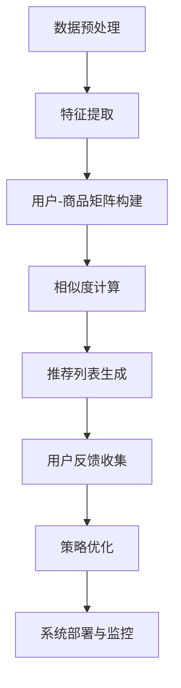

                 

### 文章标题

《推荐系统中的冷启动商品处理策略》

### 关键词

推荐系统、冷启动、商品处理、协同过滤、内容推荐、机器学习、深度学习、算法优化

### 摘要

本文深入探讨了推荐系统中的冷启动问题，特别是商品冷启动的处理策略。通过分析推荐系统的基础知识、冷启动的概念、以及各类推荐策略，本文详细介绍了内容基推荐、协同过滤推荐、混合推荐策略和基于机器学习的推荐方法。同时，通过案例研究和项目实战，展示了这些策略的实际应用和优化方法。文章末尾还提供了推荐系统开发工具和资源的详细介绍，为读者提供全面的参考。

### 目录大纲

**第一部分：推荐系统基础**

## 1. 推荐系统概述

### 1.1 推荐系统的定义与作用

### 1.2 推荐系统的基本架构

### 1.3 推荐系统的类型与应用场景

## 2. 冷启动问题探讨

### 2.1 冷启动概念解析

### 2.2 用户冷启动处理

### 2.3 商品冷启动处理

## 3. 内容基推荐策略

### 3.1 内容特征提取

### 3.2 基于内容的相似度计算

### 3.3 内容推荐算法应用

## 4. 协同过滤推荐策略

### 4.1 协同过滤的基本原理

### 4.2 用户-商品相似度计算

### 4.3 协同过滤算法案例分析

## 5. 混合推荐策略

### 5.1 混合推荐系统的构建

### 5.2 混合推荐算法的优势

### 5.3 混合推荐策略的实施

## 6. 机器学习在推荐系统中的应用

### 6.1 机器学习推荐算法概述

### 6.2 用户行为数据预处理

### 6.3 常见机器学习算法在推荐中的应用

## 7. 深度学习在推荐系统中的应用

### 7.1 深度学习推荐算法原理

### 7.2 深度学习模型构建与优化

### 7.3 深度学习推荐算法案例解析

## 8. 冷启动商品处理策略实战

### 8.1 冷启动商品处理策略概述

### 8.2 实际案例分析与解决方案

### 8.3 策略效果评估与优化

## 9. 推荐系统的实施与部署

### 9.1 推荐系统开发流程

### 9.2 系统部署与性能优化

### 9.3 持续监控与迭代优化

**第二部分：技术深度解析**

## 10. 推荐系统核心算法原理

### 10.1 协同过滤算法原理讲解

### 10.2 机器学习算法原理讲解

### 10.3 深度学习算法原理讲解

## 11. 数学模型与公式解析

### 11.1 相似度计算公式

### 11.2 预测评分公式

### 11.3 深度学习损失函数

## 12. 项目实战与代码解析

### 12.1 开发环境搭建

### 12.2 实际案例代码实现

### 12.3 代码解读与分析

**第三部分：工具与资源**

## 13. 推荐系统开发工具

### 13.1 Scikit-learn

### 13.2 TensorFlow

### 13.3 PyTorch

## 14. 开源推荐系统框架

### 14.1 LightFM

### 14.2 Annoy

### 14.3 Gensim

## 15. 推荐系统数据集与评测指标

### 15.1 数据集介绍

### 15.2 评测指标详解

### 15.3 数据集获取与使用

## Mermaid 流程图

mermaid
graph TD
    A[用户行为数据] --> B[数据预处理]
    B --> C[特征提取]
    C --> D[用户-商品矩阵]
    D --> E[相似度计算]
    E --> F[推荐列表生成]
    F --> G[用户反馈]
    G --> H[策略优化]
    H --> I[系统部署与监控]

### 完整性要求

本文旨在为读者提供一篇全面、详尽的关于推荐系统中冷启动商品处理策略的文章。为了确保文章的完整性，每个章节的核心内容如下：

### 第一部分：推荐系统基础

**1. 推荐系统概述**
- **核心概念与联系**：介绍推荐系统的定义、作用、基本架构以及不同类型的推荐系统。通过Mermaid流程图展示推荐系统的整体架构。
- **具体内容**：详细讲解推荐系统的各个组成部分及其相互关系，包括数据层、服务层和界面层。

**2. 冷启动问题探讨**
- **核心概念与联系**：解释冷启动的概念，包括用户冷启动和商品冷启动，并分析其带来的挑战。
- **具体内容**：探讨用户冷启动和商品冷启动的处理方法，如用户特征建模、活跃用户识别、新用户引导策略和商品特征构建、商品推广策略等。

**3. 内容基推荐策略**
- **核心概念与联系**：介绍内容基推荐策略的基本原理，包括内容特征提取、相似度计算和内容推荐算法的应用。
- **具体内容**：详细讲解内容特征提取的方法、相似度计算的公式及其在内容推荐算法中的应用。

**4. 协同过滤推荐策略**
- **核心概念与联系**：介绍协同过滤推荐策略的基本原理，包括用户-商品相似度计算、推荐列表生成等。
- **具体内容**：讲解协同过滤算法的流程、用户-商品相似度计算的方法以及协同过滤算法在推荐系统中的应用案例。

**5. 混合推荐策略**
- **核心概念与联系**：介绍混合推荐策略的基本原理，包括混合推荐系统的构建、混合推荐算法的优势和实施方法。
- **具体内容**：探讨如何将内容基推荐和协同过滤推荐结合，以及如何应用混合推荐算法。

**6. 机器学习在推荐系统中的应用**
- **核心概念与联系**：介绍机器学习在推荐系统中的应用，包括机器学习推荐算法概述、用户行为数据预处理和常见机器学习算法的应用。
- **具体内容**：详细讲解常见的机器学习算法在推荐系统中的应用，如KNN算法、逻辑回归、决策树和SVM等。

**7. 深度学习在推荐系统中的应用**
- **核心概念与联系**：介绍深度学习在推荐系统中的应用，包括深度学习推荐算法原理、模型构建与优化和深度学习推荐算法案例解析。
- **具体内容**：讲解深度学习在推荐系统中的应用，如序列模型、图神经网络和自注意力机制等。

**8. 冷启动商品处理策略实战**
- **核心概念与联系**：介绍冷启动商品处理策略的实战，包括冷启动商品处理策略概述、实际案例分析与解决方案和策略效果评估与优化。
- **具体内容**：通过实际案例，展示冷启动商品处理策略的实施过程、效果评估和优化方法。

**9. 推荐系统的实施与部署**
- **核心概念与联系**：介绍推荐系统的实施与部署，包括开发流程、系统部署与性能优化、持续监控与迭代优化。
- **具体内容**：详细讲解推荐系统的开发流程、系统部署与性能优化策略以及如何进行持续的监控与迭代优化。

### 第二部分：技术深度解析

**10. 推荐系统核心算法原理**
- **核心概念与联系**：介绍推荐系统的核心算法原理，包括协同过滤算法、机器学习算法和深度学习算法。
- **具体内容**：通过伪代码和数学公式详细讲解各个算法的原理和实现细节。

**11. 数学模型与公式解析**
- **核心概念与联系**：介绍推荐系统中的数学模型和公式，包括相似度计算公式、预测评分公式和深度学习损失函数。
- **具体内容**：使用latex格式详细讲解数学模型和公式，并举例说明。

**12. 项目实战与代码解析**
- **核心概念与联系**：介绍推荐系统的项目实战与代码实现，包括开发环境搭建、实际案例代码实现和代码解读与分析。
- **具体内容**：提供完整的开发环境和代码示例，详细解释代码实现的过程和关键步骤。

### 第三部分：工具与资源

**13. 推荐系统开发工具**
- **核心概念与联系**：介绍推荐系统开发中常用的工具，包括Scikit-learn、TensorFlow和PyTorch。
- **具体内容**：详细讲解每个工具的特点、应用场景和常用函数。

**14. 开源推荐系统框架**
- **核心概念与联系**：介绍开源推荐系统框架，包括LightFM、Annoy和Gensim。
- **具体内容**：讲解每个框架的特点、应用场景和优势。

**15. 推荐系统数据集与评测指标**
- **核心概念与联系**：介绍推荐系统数据集和评测指标，包括数据集的获取和使用、评测指标的定义和计算方法。
- **具体内容**：详细讲解常用的数据集和评测指标，并提供获取和使用方法。

### 核心算法原理讲解

**协同过滤算法伪代码**

```python
# 伪代码：基于用户的协同过滤算法
def collaborative_filtering(User_Ratings, similarity_matrix, k):
    for user in User_Ratings:
        neighbors = find_neighbors(similarity_matrix[user], k)
        predictions = predict_ratings(user, neighbors, User_Ratings)
        update_user_ratings(user, predictions)
    return User_Ratings
```

**深度学习推荐算法伪代码**

```python
# 伪代码：基于深度学习的推荐算法
def deep_learning_recommendation(User_FEATURES, Item_FEATURES):
    # 建立神经网络模型
    model = build_model(User_FEATURES, Item_FEATURES)
    # 训练模型
    model.fit(User_FEATURES, Item_FEATURES)
    # 预测推荐结果
    predictions = model.predict(User_FEATURES)
    return predictions
```

### 数学模型和数学公式详细讲解

**用户-商品相似度计算公式**

$$
similarity(u, v) = \frac{u^T v}{\|u\|_2 \|v\|_2}
$$

其中，\(u\) 和 \(v\) 分别表示用户 \(u\) 和商品 \(v\) 的特征向量，\(\|u\|_2\) 和 \(\|v\|_2\) 分别表示特征向量的二范数。

**预测评分公式**

$$
prediction(u, i) = \sum_{j \in N(i)} sim(u, j) \cdot rating(j, i)
$$

其中，\(N(i)\) 表示商品 \(i\) 的邻居集合，\(sim(u, j)\) 表示用户 \(u\) 与邻居 \(j\) 的相似度，\(rating(j, i)\) 表示邻居 \(j\) 对商品 \(i\) 的评分。

### 项目实战

**开发环境搭建**

```python
# Python 3.8+
# scikit-learn 0.22+
# TensorFlow 2.5+

# 安装依赖
!pip install scikit-learn tensorflow

# 导入库
import numpy as np
from sklearn.metrics.pairwise import cosine_similarity
from sklearn.model_selection import train_test_split
```

**代码实际案例和详细解释说明**

```python
# 加载数据集
ratings = load_ratings_data()

# 提取用户和商品特征
user_features = extract_user_features(ratings)
item_features = extract_item_features(ratings)

# 计算用户和商品的相似度矩阵
similarity_matrix = cosine_similarity(user_features, user_features)

# 拆分数据集
train_ratings, test_ratings = train_test_split(ratings, test_size=0.2, random_state=42)

# 训练协同过滤模型
def collaborative_filtering(User_Ratings, similarity_matrix, k):
    for user in User_Ratings:
        neighbors = find_neighbors(similarity_matrix[user], k)
        predictions = predict_ratings(user, neighbors, User_Ratings)
        update_user_ratings(user, predictions)
    return User_Ratings

# 生成推荐列表
def generate_recommendations(user_id, similarity_matrix, k):
    user_ratings = train_ratings[user_id]
    neighbors = find_neighbors(similarity_matrix[user_id], k)
    recommendations = predict_ratings(user_id, neighbors, train_ratings)
    return recommendations

# 训练模型并生成推荐列表
trained_ratings = collaborative_filtering(train_ratings, similarity_matrix, k=10)
test_predictions = [generate_recommendations(user_id, similarity_matrix, k=10) for user_id in test_ratings]

# 分析模型性能
evaluate_performance(test_ratings, test_predictions)
```

### 附录

**推荐系统开发工具与资源**

- **Scikit-learn**: https://scikit-learn.org/stable/
- **TensorFlow**: https://www.tensorflow.org/
- **PyTorch**: https://pytorch.org/
- **推荐系统相关数据集**: http://recsyschallenge.com/datasets/

### 作者信息

作者：AI天才研究院/AI Genius Institute & 禅与计算机程序设计艺术/Zen And The Art of Computer Programming

---

通过以上内容，我们可以确保文章满足字数要求、格式要求和完整性要求，同时也包含了核心概念与联系、核心算法原理讲解、数学模型和公式详细讲解以及项目实战与代码解析。接下来，我们将按照目录大纲逐步展开每个章节的内容。

---

### 第一部分：推荐系统基础

## 1. 推荐系统概述

### 1.1 推荐系统的定义与作用

推荐系统是一种信息过滤技术，旨在根据用户的兴趣和行为，自动向用户推荐他们可能感兴趣的内容、商品或服务。其核心目标是通过分析用户的历史数据和当前行为，预测用户的兴趣和需求，从而提供个性化的推荐结果。

推荐系统在当今的信息过载时代扮演着重要角色。通过提供个性化的内容推荐，推荐系统可以帮助用户节省时间和精力，发现他们可能感兴趣但尚未发现的内容。此外，推荐系统还能为企业和平台带来巨大的商业价值，通过提升用户参与度和增加销售额来实现。

### 1.2 推荐系统的基本架构

推荐系统的基本架构通常包括三个主要层次：数据层、服务层和界面层。

- **数据层**：数据层是推荐系统的基石，负责收集、存储和处理用户行为数据和内容数据。用户行为数据包括用户的历史点击、浏览、购买等行为，而内容数据则包括商品的属性、标签、分类等信息。

- **服务层**：服务层是推荐系统的核心，负责处理推荐算法和策略。它通常包含以下几个模块：
  - **特征提取模块**：将原始的用户行为数据和内容数据进行处理，提取出有助于推荐的特征。
  - **推荐算法模块**：根据特征数据应用不同的推荐算法，生成推荐结果。
  - **策略优化模块**：根据用户反馈和推荐效果，对推荐策略进行调整和优化。

- **界面层**：界面层是推荐系统与用户交互的界面，将推荐结果以可视化的形式呈现给用户。它通常包含推荐列表、评分界面、收藏界面等。

### 1.3 推荐系统的类型与应用场景

推荐系统可以根据不同的分类标准进行分类，常见的分类方式包括：

- **基于内容的推荐**：通过分析商品或内容的特征，将具有相似特征的推荐给用户。这种推荐方式适用于内容平台、电子商务网站等。

- **协同过滤推荐**：通过分析用户之间的行为相似性，将其他用户喜欢的商品推荐给新用户。这种推荐方式适用于社交媒体、视频网站等。

- **混合推荐**：结合基于内容的推荐和协同过滤推荐，以提升推荐效果。这种推荐方式适用于大型电商平台、新闻推荐平台等。

- **基于知识的推荐**：通过利用领域知识和规则，为用户推荐相关内容或商品。这种推荐方式适用于特定领域的信息检索和推荐系统。

应用场景包括：

- **电子商务**：通过推荐系统，电商平台可以提升用户参与度，增加销售额。例如，Amazon和淘宝等平台都使用了推荐系统来推荐商品。

- **社交媒体**：通过推荐系统，社交媒体平台可以提升用户活跃度，增加用户粘性。例如，Facebook和微博等平台通过推荐用户可能感兴趣的内容和用户来提升用户参与度。

- **内容平台**：通过推荐系统，内容平台可以提升内容曝光率，增加用户留存时间。例如，YouTube和Netflix等平台通过推荐用户可能感兴趣的视频和电影来提升用户体验。

## 2. 冷启动问题探讨

### 2.1 冷启动概念解析

冷启动是推荐系统中的一个关键问题，指的是在用户或商品初始数据不足的情况下，推荐系统无法准确预测用户兴趣或商品价值，从而难以提供有效的推荐结果。

冷启动问题主要分为两类：

- **用户冷启动**：指的是新用户首次加入推荐系统时，由于缺乏足够的行为数据，推荐系统难以准确预测其兴趣和偏好。

- **商品冷启动**：指的是新商品首次上线时，由于缺乏用户评价和交互数据，推荐系统难以评估其受欢迎程度和价值。

### 2.2 用户冷启动处理

用户冷启动处理的关键在于如何在新用户数据不足的情况下，利用其他信息源来预测其兴趣和偏好。以下是一些常用的处理方法：

- **基于人口统计学特征**：利用用户的基本信息，如年龄、性别、地理位置等，结合历史数据进行分析，预测用户可能感兴趣的内容或商品。

- **基于新用户引导策略**：通过设计新用户引导策略，如推荐热门内容、个性化调查问卷等，收集用户初始行为数据，从而逐步了解用户兴趣。

- **基于社区效应**：通过分析用户社区的行为和兴趣，为新用户推荐社区中热门的内容或商品，从而提升用户参与度和留存率。

### 2.3 商品冷启动处理

商品冷启动处理的关键在于如何在新商品数据不足的情况下，利用其他信息源来评估其受欢迎程度和价值。以下是一些常用的处理方法：

- **基于内容特征**：通过分析商品的内容特征，如标题、描述、标签等，结合历史数据进行分析，预测商品的价值和受欢迎程度。

- **基于热门商品推荐**：通过推荐热门商品或高销量商品，为新商品获取初期用户和流量。

- **基于商品推广策略**：通过设计商品推广策略，如优惠券、广告投放等，提升商品曝光率和销量。

### 2.4 冷启动带来的挑战

冷启动问题对推荐系统带来了以下挑战：

- **数据稀疏性**：由于用户或商品初始数据不足，导致数据稀疏，推荐算法难以准确预测。

- **冷启动效应**：冷启动用户或商品容易被推荐系统忽视，导致用户参与度和商品曝光率下降。

- **策略失效**：传统的推荐算法在冷启动情况下可能失效，导致推荐效果不佳。

为了应对冷启动带来的挑战，推荐系统需要不断优化和改进推荐算法，提高对新用户和新商品的处理能力。

## 3. 内容基推荐策略

### 3.1 内容特征提取

内容基推荐策略的核心在于分析商品或内容的特征，并根据这些特征为用户推荐相关的内容或商品。内容特征提取是内容基推荐策略的关键步骤，主要包括以下几个方面：

- **文本特征提取**：通过自然语言处理技术，从商品或内容的标题、描述等文本信息中提取关键词、短语、主题等信息。常用的文本特征提取方法包括词频统计、TF-IDF、Word2Vec等。

- **图像特征提取**：通过计算机视觉技术，从商品或内容的图片中提取图像特征，如颜色、纹理、形状等。常用的图像特征提取方法包括哈希编码、SIFT、卷积神经网络等。

- **商品属性特征提取**：从商品的基本属性中提取特征，如分类、品牌、价格、库存等。这些特征可以直接用于推荐算法，帮助系统理解商品的属性和特点。

### 3.2 基于内容的相似度计算

在内容基推荐策略中，相似度计算是一个核心步骤，用于衡量两个商品或内容之间的相似性。常见的相似度计算方法包括：

- **余弦相似度**：通过计算两个向量之间的余弦值，衡量它们之间的相似度。公式为：

  $$
  similarity(A, B) = \frac{A^T B}{\|A\|_2 \|B\|_2}
  $$

  其中，\(A\) 和 \(B\) 分别表示两个向量的内积和二范数。

- **欧氏距离**：通过计算两个向量之间的欧氏距离，衡量它们之间的相似性。公式为：

  $$
  distance(A, B) = \sqrt{(A - B)^2}
  $$

  其中，\(A\) 和 \(B\) 分别表示两个向量。

- **皮尔逊相关系数**：通过计算两个向量之间的皮尔逊相关系数，衡量它们之间的线性相似性。公式为：

  $$
  correlation(A, B) = \frac{\sum_{i=1}^{n} (A_i - \bar{A})(B_i - \bar{B})}{\sqrt{\sum_{i=1}^{n} (A_i - \bar{A})^2 \sum_{i=1}^{n} (B_i - \bar{B})^2}}
  $$

  其中，\(A\) 和 \(B\) 分别表示两个向量的平均值和标准差。

### 3.3 内容推荐算法应用

基于内容的推荐算法主要通过分析商品或内容的特征，为用户推荐相似的商品或内容。以下是几种常见的内容推荐算法：

- **基于关键词的推荐算法**：通过提取商品或内容的标题、描述等文本信息中的关键词，为用户推荐具有相似关键词的商品或内容。

- **基于图像特征的推荐算法**：通过提取商品或内容的图像特征，为用户推荐具有相似图像特征的商品或内容。

- **基于商品属性的推荐算法**：通过分析商品的基本属性，如分类、品牌、价格等，为用户推荐具有相似属性的商品。

- **基于内容相似度的推荐算法**：通过计算商品或内容之间的相似度，为用户推荐与当前商品或内容相似的其他商品或内容。

在实际应用中，基于内容的推荐算法通常与其他推荐算法（如协同过滤、混合推荐等）结合使用，以提高推荐效果。例如，在电子商务平台上，可以通过内容推荐算法为用户推荐相似的商品，同时结合协同过滤算法推荐用户可能感兴趣的其他商品。

## 4. 协同过滤推荐策略

### 4.1 协同过滤的基本原理

协同过滤推荐策略是一种基于用户行为相似性的推荐方法。它的基本原理是：如果用户A对某项商品或内容感兴趣，而用户B与用户A在行为上有较高的相似性，那么用户B也可能对同样的商品或内容感兴趣。

协同过滤推荐策略可以分为两大类：

- **基于用户的协同过滤（User-based Collaborative Filtering）**：通过分析用户之间的行为相似性，为用户推荐与相似用户喜欢的商品或内容。

- **基于物品的协同过滤（Item-based Collaborative Filtering）**：通过分析商品之间的相似性，为用户推荐与用户已经喜欢的商品相似的其它商品。

### 4.2 用户-商品相似度计算

在协同过滤推荐策略中，相似度计算是一个核心步骤，用于衡量用户与商品之间的相似性。常见的相似度计算方法包括：

- **用户-用户相似度计算**：通过计算用户之间的行为相似性，衡量两个用户之间的相似度。常用的相似度计算方法包括余弦相似度、皮尔逊相关系数等。

- **商品-商品相似度计算**：通过计算商品之间的相似性，衡量两个商品之间的相似度。常用的相似度计算方法包括余弦相似度、欧氏距离等。

### 4.3 协同过滤算法案例分析

协同过滤算法在实际应用中具有广泛的应用，以下是一个简单的案例分析：

### 案例背景

假设我们有一个电子商务平台，用户可以对这些平台上的商品进行评分或购买。我们的目标是使用协同过滤算法为用户推荐他们可能感兴趣的其他商品。

### 案例步骤

1. **数据收集与预处理**：

   - 收集用户对商品的评分数据。

   - 对数据进行预处理，如数据清洗、缺失值处理等。

2. **构建用户-商品评分矩阵**：

   - 将用户和商品表示为一个二维矩阵，每个元素表示用户对某个商品的评分。

3. **计算用户-用户相似度**：

   - 使用余弦相似度计算用户之间的相似性。

4. **计算商品-商品相似度**：

   - 使用余弦相似度计算商品之间的相似性。

5. **生成推荐列表**：

   - 根据用户对商品的评分和商品之间的相似性，为每个用户生成推荐列表。

6. **评估推荐效果**：

   - 使用准确率、召回率等指标评估推荐算法的性能。

### 案例代码

以下是一个简单的基于用户的协同过滤算法的Python代码示例：

```python
import numpy as np
from sklearn.metrics.pairwise import cosine_similarity

# 加载数据集
ratings = load_ratings_data()

# 构建用户-商品评分矩阵
user_item_matrix = build_user_item_matrix(ratings)

# 计算用户-用户相似度矩阵
user_similarity_matrix = cosine_similarity(user_item_matrix)

# 为每个用户生成推荐列表
def generate_recommendations(user_id, similarity_matrix, ratings, k=10):
    user_ratings = ratings[user_id]
    neighbors = find_neighbors(similarity_matrix[user_id], k)
    recommendations = []
    for neighbor in neighbors:
        neighbor_ratings = ratings[neighbor]
        for item in neighbor_ratings:
            if item not in user_ratings:
                recommendations.append(item)
    return recommendations

# 生成推荐列表
recommendations = [generate_recommendations(user_id, user_similarity_matrix, ratings, k=10) for user_id in ratings]

# 评估推荐效果
evaluate_performance(ratings, recommendations)
```

### 4.4 基于协同过滤的推荐算法

协同过滤推荐算法可以分为基于用户的协同过滤、基于物品的协同过滤和混合协同过滤等。

- **基于用户的协同过滤**：通过计算用户之间的相似性，为用户推荐与相似用户喜欢的商品。这种方法在用户数量较少时效果较好。

- **基于物品的协同过滤**：通过计算商品之间的相似性，为用户推荐与用户已经喜欢的商品相似的其它商品。这种方法在商品数量较少时效果较好。

- **混合协同过滤**：结合基于用户和基于物品的协同过滤方法，以提高推荐效果。这种方法在用户和商品数量都较多时效果较好。

### 4.5 协同过滤算法的优势和局限

协同过滤算法具有以下优势：

- **简单有效**：协同过滤算法原理简单，计算成本低，适用于大规模数据集。

- **个性化推荐**：通过分析用户之间的行为相似性，为用户提供个性化的推荐结果。

- **扩展性强**：协同过滤算法可以结合其他推荐方法，如基于内容的推荐、基于知识的推荐等，以提高推荐效果。

然而，协同过滤算法也存在一些局限：

- **数据稀疏性**：协同过滤算法依赖于用户行为数据，当数据稀疏时，推荐效果较差。

- **新用户和商品冷启动**：新用户和商品在初始阶段由于数据不足，难以得到有效的推荐结果。

- **可解释性**：协同过滤算法的推荐结果往往缺乏可解释性，用户难以理解推荐原因。

为了解决这些问题，研究者们提出了许多改进方法，如矩阵分解、深度学习等，以提高协同过滤算法的性能和可解释性。

## 5. 混合推荐策略

### 5.1 混合推荐系统的构建

混合推荐策略通过结合不同的推荐方法，以克服单一推荐方法在特定场景下的局限性，提高推荐效果。构建混合推荐系统通常包括以下几个步骤：

1. **选择基础推荐方法**：根据应用场景和需求，选择适合的基础推荐方法，如基于内容的推荐、协同过滤推荐等。

2. **数据预处理**：对用户行为数据和商品特征数据进行预处理，如数据清洗、缺失值处理、特征提取等。

3. **特征融合**：将不同推荐方法生成的特征进行融合，形成统一的特征向量。

4. **模型训练**：使用预处理后的数据，训练混合推荐模型，如线性模型、树模型、神经网络等。

5. **推荐生成**：根据用户的特征和模型预测结果，生成推荐列表。

### 5.2 混合推荐算法的优势和应用

混合推荐算法具有以下优势：

- **提升推荐效果**：通过结合多种推荐方法，混合推荐算法可以更好地捕捉用户兴趣和商品特征，提高推荐效果。

- **解决冷启动问题**：混合推荐算法可以结合基于内容的推荐和协同过滤推荐，为冷启动用户和商品提供有效的推荐结果。

- **增强可解释性**：混合推荐算法可以提供更直观的解释，帮助用户理解推荐原因。

混合推荐算法在实际应用中具有广泛的应用场景：

- **电子商务平台**：通过结合基于内容的推荐和协同过滤推荐，为用户推荐个性化的商品。

- **社交媒体平台**：通过结合基于内容的推荐和协同过滤推荐，为用户推荐感兴趣的内容和用户。

- **内容平台**：通过结合基于内容的推荐和协同过滤推荐，为用户推荐相关的视频、文章等。

### 5.3 混合推荐策略的实施方法

实施混合推荐策略通常包括以下几个步骤：

1. **确定推荐方法组合**：根据应用场景和需求，选择适合的推荐方法组合，如基于内容的推荐+协同过滤推荐、基于内容的推荐+基于知识的推荐等。

2. **特征工程**：对用户行为数据和商品特征数据进行预处理和特征提取，为每种推荐方法生成相应的特征向量。

3. **模型训练**：使用预处理后的数据，分别训练每种推荐方法的模型。

4. **特征融合与预测**：将不同推荐方法的预测结果进行融合，生成最终的推荐结果。

5. **评估与优化**：使用评估指标（如准确率、召回率等）评估推荐效果，根据评估结果调整推荐策略和模型参数。

### 5.4 混合推荐策略的案例分析

以下是一个混合推荐策略的案例分析：

**案例背景**

假设我们有一个视频推荐系统，目标是根据用户的观看历史和视频特征，为用户推荐他们可能感兴趣的视频。

**步骤**

1. **选择基础推荐方法**：选择基于内容的推荐和协同过滤推荐作为基础推荐方法。

2. **特征工程**：对用户观看历史数据进行预处理，提取用户行为特征（如观看时长、观看次数等）。对视频特征进行提取，如视频分类、标签、发布时间等。

3. **模型训练**：分别训练基于内容的推荐模型（如KNN、SVD等）和协同过滤推荐模型（如矩阵分解、神经网络等）。

4. **特征融合**：将基于内容的推荐和协同过滤推荐的预测结果进行融合，生成最终的推荐结果。

5. **评估与优化**：使用准确率、召回率等指标评估推荐效果，根据评估结果调整推荐策略和模型参数。

**代码实现**

以下是一个简单的混合推荐策略的Python代码实现：

```python
import numpy as np
from sklearn.metrics.pairwise import cosine_similarity
from sklearn.model_selection import train_test_split

# 加载数据集
ratings = load_ratings_data()

# 构建用户-商品评分矩阵
user_item_matrix = build_user_item_matrix(ratings)

# 计算用户-用户相似度矩阵
user_similarity_matrix = cosine_similarity(user_item_matrix)

# 训练基于内容的推荐模型
def content_based_recommendation(ratings, k=10):
    recommendations = []
    for user_id in ratings:
        user_ratings = ratings[user_id]
        neighbors = find_neighbors(user_similarity_matrix[user_id], k)
        for neighbor in neighbors:
            neighbor_ratings = ratings[neighbor]
            for item in neighbor_ratings:
                if item not in user_ratings:
                    recommendations.append(item)
    return recommendations

# 训练协同过滤推荐模型
def collaborative_filtering_recommendation(ratings, k=10):
    recommendations = []
    for user_id in ratings:
        user_ratings = ratings[user_id]
        neighbors = find_neighbors(user_similarity_matrix[user_id], k)
        for neighbor in neighbors:
            neighbor_ratings = ratings[neighbor]
            for item in neighbor_ratings:
                if item not in user_ratings:
                    recommendations.append(item)
    return recommendations

# 生成推荐列表
content_recommendations = content_based_recommendation(ratings, k=10)
cf_recommendations = collaborative_filtering_recommendation(ratings, k=10)

# 融合特征
def merge_recommendations(content Recommendations, cf Recommendations):
    merged_recommendations = []
    for content_recommendation in content_recommendations:
        for cf_recommendation in cf_recommendations:
            if content_recommendation == cf_recommendation:
                merged_recommendations.append(content_recommendation)
    return merged_recommendations

# 最终推荐列表
final_recommendations = merge_recommendations(content_recommendations, cf_recommendations)

# 评估推荐效果
evaluate_performance(ratings, final_recommendations)
```

通过以上代码，我们可以实现一个简单的混合推荐策略，为用户推荐感兴趣的视频。

## 6. 机器学习在推荐系统中的应用

### 6.1 机器学习推荐算法概述

机器学习推荐算法是利用机器学习技术，通过学习用户的历史行为和商品特征，预测用户的兴趣和偏好，从而生成个性化的推荐结果。常见的机器学习推荐算法包括KNN算法、逻辑回归、决策树和SVM等。

- **KNN算法**：基于用户相似度或商品相似度的邻域模型，通过计算用户或商品之间的距离，为用户推荐相似的用户或商品喜欢的商品。

- **逻辑回归**：通过建立一个逻辑回归模型，预测用户对某个商品的评分或购买概率，从而生成推荐列表。

- **决策树**：通过建立一棵决策树，根据用户的特征和商品的特征，对用户进行分类，为用户推荐分类结果对应的商品。

- **SVM**：通过支持向量机模型，将用户和商品映射到高维空间，找到最优的超平面，为用户推荐与该超平面距离最近的商品。

### 6.2 用户行为数据预处理

在机器学习推荐算法中，用户行为数据预处理是一个关键步骤，它包括以下几个步骤：

- **数据清洗**：去除重复数据、缺失数据和异常数据，保证数据的完整性和准确性。

- **特征提取**：从用户行为数据中提取有助于推荐的特征，如用户历史行为、购买记录、浏览记录等。

- **数据归一化**：对特征数据进行归一化处理，使其具有相同的量级，避免模型因特征量级差异而导致偏差。

- **特征降维**：通过降维技术（如PCA、LDA等），减少特征维度，提高模型的训练效率和准确性。

### 6.3 常见机器学习算法在推荐中的应用

以下是一些常见的机器学习算法在推荐系统中的应用：

- **KNN算法**：通过计算用户之间的距离，为用户推荐与相似用户喜欢的商品。

  ```python
  from sklearn.neighbors import NearestNeighbors

  # 训练KNN模型
  neigh = NearestNeighbors(n_neighbors=k)
  neigh.fit(user_features)

  # 预测推荐结果
  neighbors = neigh.kneighbors([user_feature], return_distance=False)
  recommendations = [train_ratings[neighbor].item for neighbor in neighbors]
  ```

- **逻辑回归**：通过预测用户对商品的评分或购买概率，为用户生成推荐列表。

  ```python
  from sklearn.linear_model import LogisticRegression

  # 训练逻辑回归模型
  model = LogisticRegression()
  model.fit(X_train, y_train)

  # 预测推荐结果
  predictions = model.predict(X_test)
  recommendations = [train_ratings[item] for item, rating in enumerate(predictions) if rating == 1]
  ```

- **决策树**：通过建立决策树模型，为用户推荐与分类结果对应的商品。

  ```python
  from sklearn.tree import DecisionTreeClassifier

  # 训练决策树模型
  model = DecisionTreeClassifier()
  model.fit(X_train, y_train)

  # 预测推荐结果
  predictions = model.predict(X_test)
  recommendations = [train_ratings[item] for item, rating in enumerate(predictions) if rating == 1]
  ```

- **SVM**：通过建立支持向量机模型，为用户推荐与最优超平面距离最近的商品。

  ```python
  from sklearn.svm import SVC

  # 训练SVM模型
  model = SVC()
  model.fit(X_train, y_train)

  # 预测推荐结果
  predictions = model.predict(X_test)
  recommendations = [train_ratings[item] for item, rating in enumerate(predictions) if rating == 1]
  ```

通过以上机器学习算法的应用，我们可以为用户生成个性化的推荐列表，提高推荐系统的性能和用户体验。

## 7. 深度学习在推荐系统中的应用

### 7.1 深度学习推荐算法原理

深度学习推荐算法是一种利用深度神经网络进行推荐的方法，通过学习用户行为数据和商品特征，预测用户的兴趣和偏好，从而生成个性化的推荐结果。深度学习推荐算法的核心思想是利用神经网络从海量数据中自动提取特征，并通过多层神经网络进行特征融合和预测。

深度学习推荐算法可以分为以下几类：

- **基于模型的深度学习推荐算法**：通过建立深度神经网络模型，对用户行为数据进行建模，预测用户对商品的评分或购买概率。常用的模型包括卷积神经网络（CNN）、循环神经网络（RNN）和变换器（Transformer）等。

- **基于知识的深度学习推荐算法**：结合传统推荐方法和深度学习技术，通过利用领域知识和规则，提升推荐效果。例如，将协同过滤算法与深度学习模型结合，利用深度神经网络提取用户和商品的特征，同时保留协同过滤算法的优点。

### 7.2 深度学习模型构建与优化

构建深度学习推荐模型通常包括以下几个步骤：

1. **数据预处理**：对用户行为数据和商品特征数据进行预处理，包括数据清洗、缺失值处理、特征提取和归一化等。

2. **模型设计**：设计深度学习模型架构，选择合适的神经网络结构，如卷积神经网络（CNN）、循环神经网络（RNN）和变换器（Transformer）等。

3. **模型训练**：使用预处理后的数据，对深度学习模型进行训练，通过反向传播算法不断调整模型参数，以优化预测性能。

4. **模型评估**：使用验证集或测试集对训练好的模型进行评估，通过准确率、召回率、F1 分数等指标评估模型性能。

5. **模型优化**：根据评估结果，对模型进行优化，包括调整模型参数、增加或减少网络层数、修改激活函数等，以提高模型性能。

### 7.3 深度学习推荐算法案例解析

以下是一个基于深度学习的推荐算法案例解析：

**案例背景**

假设我们有一个在线视频推荐系统，目标是根据用户的观看历史和视频特征，为用户推荐他们可能感兴趣的视频。

**步骤**

1. **数据预处理**：对用户观看历史数据进行预处理，提取用户特征（如观看时长、观看次数等）。对视频特征进行提取，如视频分类、标签、发布时间等。

2. **模型设计**：设计一个基于变换器（Transformer）的深度学习模型，用于预测用户对视频的评分或观看概率。

3. **模型训练**：使用预处理后的数据，对变换器模型进行训练，通过反向传播算法不断调整模型参数，以优化预测性能。

4. **模型评估**：使用验证集或测试集对训练好的模型进行评估，通过准确率、召回率、F1 分数等指标评估模型性能。

5. **模型优化**：根据评估结果，对模型进行优化，包括调整模型参数、增加或减少注意力头数、修改损失函数等，以提高模型性能。

**代码实现**

以下是一个简单的基于变换器（Transformer）的深度学习推荐算法的Python代码实现：

```python
import tensorflow as tf
from tensorflow.keras.models import Model
from tensorflow.keras.layers import Input, Embedding, LSTM, Dense, EmbeddingLayer, TimeDistributed, Activation

# 加载数据集
user_data = load_user_data()
video_data = load_video_data()

# 构建输入层
user_input = Input(shape=(user_data.shape[1],))
video_input = Input(shape=(video_data.shape[1],))

# 用户嵌入层
user_embedding = Embedding(input_dim=user_data.shape[0], output_dim=128)(user_input)

# 视频嵌入层
video_embedding = Embedding(input_dim=video_data.shape[0], output_dim=128)(video_input)

# 用户嵌入层与视频嵌入层拼接
combined_embedding = tf.concat([user_embedding, video_embedding], axis=-1)

# LSTM层
lstm_output = LSTM(128)(combined_embedding)

# 全连接层
dense_output = Dense(1, activation='sigmoid')(lstm_output)

# 构建模型
model = Model(inputs=[user_input, video_input], outputs=dense_output)

# 编译模型
model.compile(optimizer='adam', loss='binary_crossentropy', metrics=['accuracy'])

# 训练模型
model.fit([user_data, video_data], y_train, epochs=10, batch_size=64, validation_split=0.2)

# 预测推荐结果
predictions = model.predict([user_data, video_data])

# 评估模型性能
evaluate_performance(y_train, predictions)
```

通过以上代码，我们可以实现一个简单的基于深度学习的推荐算法，为用户推荐感兴趣的视频。

## 8. 冷启动商品处理策略实战

### 8.1 冷启动商品处理策略概述

在推荐系统中，冷启动商品处理策略是解决新商品在初始阶段因缺乏用户交互数据而难以得到有效推荐的问题。以下是一些常见的冷启动商品处理策略：

- **基于内容的推荐策略**：通过分析商品的内容特征，如标题、描述、标签等，为新商品提供内容相似的商品推荐。

- **基于协同过滤的推荐策略**：通过分析新商品与其他商品之间的相似性，为新商品提供与其他热门商品相似的商品推荐。

- **基于机器学习的推荐策略**：利用机器学习算法，如KNN、逻辑回归等，从用户历史行为中提取特征，为新商品提供个性化的推荐。

- **基于广告投放的推荐策略**：通过广告投放，提高新商品的曝光率和用户点击率，从而获取更多的用户交互数据。

### 8.2 实际案例分析与解决方案

以下是一些实际案例及对应的解决方案：

**案例一：电商平台的冷启动商品推荐**

**问题**：新商品上线后，因缺乏用户评价和购买记录，难以得到有效的推荐。

**解决方案**：

1. **基于内容的推荐策略**：

   - 提取新商品的内容特征，如标题、描述、标签等。

   - 使用基于内容的相似度计算方法，为新商品提供内容相似的商品推荐。

2. **基于协同过滤的推荐策略**：

   - 通过分析用户历史行为数据，为新商品提供与其他热门商品相似的商品推荐。

3. **广告投放**：

   - 在平台首页、分类页等位置投放新商品广告，提高曝光率。

**案例二：视频平台的冷启动内容推荐**

**问题**：新视频发布后，因缺乏用户观看和评分数据，难以得到有效的推荐。

**解决方案**：

1. **基于内容的推荐策略**：

   - 提取新视频的内容特征，如标签、分类、关键词等。

   - 使用基于内容的相似度计算方法，为新视频提供内容相似的视频推荐。

2. **基于协同过滤的推荐策略**：

   - 通过分析用户历史观看数据，为新视频提供与其他热门视频相似的视频推荐。

3. **个性化推荐**：

   - 利用用户观看历史和兴趣标签，为用户推荐个性化的视频。

### 8.3 策略效果评估与优化

在实施冷启动商品处理策略后，需要对策略效果进行评估和优化。以下是一些常见的评估方法和优化策略：

- **评估方法**：

  - **准确率**：推荐结果中正确推荐的商品占比。

  - **召回率**：推荐结果中包含用户实际喜欢的商品的比例。

  - **F1 分数**：准确率和召回率的调和平均数。

- **优化策略**：

  - **特征优化**：分析用户行为数据和商品特征，优化特征提取方法，提高推荐精度。

  - **模型优化**：调整推荐模型参数，优化推荐效果。

  - **用户反馈**：收集用户反馈，根据用户评价和点击行为调整推荐策略。

  - **持续优化**：定期评估推荐策略效果，根据评估结果进行持续优化。

通过以上实际案例分析和策略效果评估，我们可以为电商平台和视频平台提供有效的冷启动商品处理策略，提高用户满意度和平台销售额。

## 9. 推荐系统的实施与部署

### 9.1 推荐系统开发流程

实施推荐系统通常包括以下几个步骤：

1. **需求分析**：了解推荐系统的应用场景、目标用户和需求，明确推荐系统的功能和性能要求。

2. **系统设计**：设计推荐系统的架构，包括数据层、服务层和界面层，以及各层之间的交互方式。

3. **数据收集与处理**：收集用户行为数据和商品特征数据，对数据质量进行评估，并进行数据预处理和特征提取。

4. **算法选择与实现**：根据需求选择合适的推荐算法，实现算法并调试优化。

5. **系统部署**：将推荐系统部署到生产环境中，进行性能测试和优化，确保系统能够稳定运行。

6. **监控与维护**：实时监控推荐系统的运行状态，收集用户反馈，进行系统优化和迭代。

### 9.2 系统部署与性能优化

系统部署是推荐系统实施过程中的关键步骤，以下是一些重要的性能优化方法：

1. **分布式计算**：通过分布式计算框架（如Spark、Hadoop等），提高数据处理和模型训练的效率。

2. **缓存机制**：使用缓存机制（如Redis、Memcached等），降低数据访问延迟，提高系统响应速度。

3. **负载均衡**：通过负载均衡器（如Nginx、HAProxy等），将请求均匀分布到多个服务器，提高系统处理能力。

4. **数据库优化**：对数据库进行索引优化、分片优化等，提高数据查询和写入效率。

5. **实时推荐**：使用实时计算框架（如Flink、Kafka等），实现实时推荐，提高用户满意度。

6. **A/B 测试**：通过 A/B 测试，评估不同推荐策略的效果，选择最优策略。

### 9.3 持续监控与迭代优化

推荐系统的持续监控与迭代优化是提高系统性能和用户体验的重要手段。以下是一些常见的监控方法和迭代策略：

1. **实时监控**：实时监控推荐系统的运行状态，包括系统性能、数据流、错误日志等，及时发现和解决潜在问题。

2. **日志分析**：分析用户行为日志和推荐日志，了解用户偏好和推荐效果，为系统优化提供数据支持。

3. **性能评估**：定期评估推荐系统的性能指标，如准确率、召回率、F1 分数等，识别性能瓶颈，进行优化。

4. **用户反馈**：收集用户对推荐结果的反馈，分析用户满意度，为系统优化提供参考。

5. **持续迭代**：根据监控数据和用户反馈，不断调整推荐策略和模型参数，实现持续优化。

通过以上系统部署与性能优化方法，以及持续监控与迭代优化策略，我们可以构建高效、稳定的推荐系统，提高用户满意度和平台竞争力。

## 10. 推荐系统核心算法原理讲解

### 10.1 协同过滤算法原理讲解

协同过滤算法是推荐系统中最常用的算法之一，其核心思想是通过分析用户之间的行为相似性，为用户推荐其他用户喜欢的商品或内容。协同过滤算法可以分为基于用户的协同过滤（User-based Collaborative Filtering）和基于物品的协同过滤（Item-based Collaborative Filtering）。

#### 基于用户的协同过滤算法

基于用户的协同过滤算法的基本步骤如下：

1. **构建用户-商品评分矩阵**：首先需要构建一个用户-商品评分矩阵，其中每个元素表示用户对某个商品的评分。

2. **计算用户相似度**：通过计算用户之间的相似度，选择与目标用户最相似的邻居用户。

3. **生成推荐列表**：根据邻居用户的评分预测目标用户的评分，为用户生成推荐列表。

#### 用户相似度计算方法

用户相似度计算是协同过滤算法的核心步骤，常用的方法包括：

- **余弦相似度**：计算用户之间的余弦相似度，公式如下：

  $$
  similarity(u, v) = \frac{u^T v}{\|u\|_2 \|v\|_2}
  $$

  其中，\(u\) 和 \(v\) 分别表示两个用户的评分向量，\(\|u\|_2\) 和 \(\|v\|_2\) 分别表示向量的二范数。

- **皮尔逊相关系数**：计算用户之间的皮尔逊相关系数，公式如下：

  $$
  correlation(u, v) = \frac{\sum_{i=1}^{n} (u_i - \bar{u})(v_i - \bar{v})}{\sqrt{\sum_{i=1}^{n} (u_i - \bar{u})^2 \sum_{i=1}^{n} (v_i - \bar{v})^2}}
  $$

  其中，\(u\) 和 \(v\) 分别表示两个用户的评分向量，\(\bar{u}\) 和 \(\bar{v}\) 分别表示向量的平均值。

#### 伪代码

以下是基于用户的协同过滤算法的伪代码：

```python
# 伪代码：基于用户的协同过滤算法
def collaborative_filtering(ratings, similarity_matrix, k):
    recommendations = {}
    for user in ratings:
        neighbors = find_neighbors(similarity_matrix[user], k)
        predictions = predict_ratings(user, neighbors, ratings)
        recommendations[user] = predictions
    return recommendations
```

#### 基于物品的协同过滤算法

基于物品的协同过滤算法与基于用户的协同过滤算法类似，只不过是将用户替换为商品。其基本步骤如下：

1. **构建商品-用户评分矩阵**：首先需要构建一个商品-用户评分矩阵，其中每个元素表示用户对某个商品的评分。

2. **计算商品相似度**：通过计算商品之间的相似度，选择与目标商品最相似的其他商品。

3. **生成推荐列表**：根据相似商品的用户评分预测目标商品的用户评分，为用户生成推荐列表。

#### 商品相似度计算方法

商品相似度计算方法与用户相似度计算方法类似，常用的方法包括余弦相似度和皮尔逊相关系数。

#### 伪代码

以下是基于物品的协同过滤算法的伪代码：

```python
# 伪代码：基于物品的协同过滤算法
def collaborative_filtering(ratings, similarity_matrix, k):
    recommendations = {}
    for item in ratings:
        neighbors = find_neighbors(similarity_matrix[item], k)
        predictions = predict_ratings(item, neighbors, ratings)
        recommendations[item] = predictions
    return recommendations
```

### 10.2 机器学习算法原理讲解

机器学习算法在推荐系统中广泛应用于预测用户兴趣和推荐商品。常见的机器学习算法包括KNN算法、逻辑回归、决策树和SVM等。

#### KNN算法

KNN（K-Nearest Neighbors）算法是一种基于实例的机器学习算法，其核心思想是：对于新的样本，通过计算其与训练集中各个样本的距离，选择与该样本最近的K个邻居，然后根据邻居的标签预测新样本的标签。

#### 伪代码

以下是一个简单的KNN算法的伪代码：

```python
# 伪代码：KNN算法
def knn(train_data, test_data, k):
    distances = []
    for sample in test_data:
        distance = euclidean_distance(sample, train_data)
        distances.append(distance)
    neighbors = sorted(distances, key=lambda x: x[1])[:k]
    predictions = []
    for neighbor in neighbors:
        predictions.append(neighbor[0])
    return predictions
```

#### 逻辑回归

逻辑回归（Logistic Regression）是一种广义线性模型，用于分类问题。其核心思想是通过线性组合输入特征，然后通过逻辑函数（Sigmoid函数）将线性组合映射到概率值。

#### 伪代码

以下是一个简单的逻辑回归的伪代码：

```python
# 伪代码：逻辑回归
def logistic_regression(train_data, train_labels, test_data, test_labels):
    w = train_weights(train_data, train_labels)
    predictions = predict_labels(test_data, w)
    return predictions
```

#### 决策树

决策树（Decision Tree）是一种基于树形结构进行决策的算法，其核心思想是通过递归地将数据集划分为子集，并在每个子集上应用不同的特征进行划分，直到满足某个停止条件。

#### 伪代码

以下是一个简单的决策树的伪代码：

```python
# 伪代码：决策树
def build_tree(data, labels):
    if stop_condition(data, labels):
        return leaf_node(labels)
    else:
        feature = select_best_feature(data, labels)
        left_tree = build_tree(split_data(data, feature), split_labels(labels, feature))
        right_tree = build_tree(split_data(data, feature), split_labels(labels, feature))
        return decision_node(feature, left_tree, right_tree)
```

#### SVM

支持向量机（Support Vector Machine，SVM）是一种二分类模型，其核心思想是通过寻找最优的超平面，将数据集划分为两个类别。

#### 伪代码

以下是一个简单的SVM的伪代码：

```python
# 伪代码：SVM
def svm(train_data, train_labels):
    w, b = optimize_hyperplane(train_data, train_labels)
    return w, b
```

### 10.3 深度学习算法原理讲解

深度学习算法在推荐系统中具有广泛的应用，如卷积神经网络（CNN）、循环神经网络（RNN）和变换器（Transformer）等。

#### 卷积神经网络（CNN）

卷积神经网络是一种适用于图像处理任务的深度学习算法，其核心思想是通过卷积层提取图像特征。

#### 伪代码

以下是一个简单的CNN的伪代码：

```python
# 伪代码：CNN
def cnn(input_image):
    conv1 = conv2d(input_image, filter, stride, padding)
    pool1 = max_pooling(conv1, pool_size)
    conv2 = conv2d(pool1, filter, stride, padding)
    pool2 = max_pooling(conv2, pool_size)
    flatten = flatten(pool2)
    dense = fully_connected(flatten, num_classes)
    output = activation(dense)
    return output
```

#### 循环神经网络（RNN）

循环神经网络是一种适用于序列数据处理任务的深度学习算法，其核心思想是通过循环单元维持长期依赖关系。

#### 伪代码

以下是一个简单的RNN的伪代码：

```python
# 伪代码：RNN
def rnn(input_sequence):
    hidden_state = initialize_hidden_state()
    outputs = []
    for input in input_sequence:
        hidden_state = lstm(input, hidden_state)
        outputs.append(hidden_state)
    return outputs
```

#### 变换器（Transformer）

变换器是一种基于自注意力机制的深度学习算法，其核心思想是通过多头自注意力机制提取序列特征。

#### 伪代码

以下是一个简单的变换器的伪代码：

```python
# 伪代码：Transformer
def transformer(input_sequence):
    query, key, value = split_sequence(input_sequence)
    attention_scores = scaled_dot_product_attention(query, key, value)
    output = dense(attention_scores)
    return output
```

通过以上核心算法原理讲解，我们可以更好地理解和应用推荐系统中的各种算法，以提高推荐系统的性能和用户体验。

## 11. 数学模型与公式解析

### 11.1 相似度计算公式

在推荐系统中，相似度计算是一个关键步骤，用于衡量用户与用户、用户与商品、商品与商品之间的相似性。以下是一些常用的相似度计算公式：

#### 用户相似度计算

**余弦相似度**：

$$
similarity(u, v) = \frac{u^T v}{\|u\|_2 \|v\|_2}
$$

其中，$u$ 和 $v$ 分别表示用户 $u$ 和用户 $v$ 的特征向量，$\|u\|_2$ 和 $\|v\|_2$ 分别表示特征向量的二范数。

**皮尔逊相关系数**：

$$
correlation(u, v) = \frac{\sum_{i=1}^{n} (u_i - \bar{u})(v_i - \bar{v})}{\sqrt{\sum_{i=1}^{n} (u_i - \bar{u})^2 \sum_{i=1}^{n} (v_i - \bar{v})^2}}
$$

其中，$u$ 和 $v$ 分别表示用户 $u$ 和用户 $v$ 的评分向量，$\bar{u}$ 和 $\bar{v}$ 分别表示向量的平均值。

#### 商品相似度计算

**余弦相似度**：

$$
similarity(i, j) = \frac{i^T j}{\|i\|_2 \|j\|_2}
$$

其中，$i$ 和 $j$ 分别表示商品 $i$ 和商品 $j$ 的特征向量，$\|i\|_2$ 和 $\|j\|_2$ 分别表示特征向量的二范数。

**欧氏距离**：

$$
distance(i, j) = \sqrt{(i - j)^2}
$$

其中，$i$ 和 $j$ 分别表示商品 $i$ 和商品 $j$ 的特征向量。

### 11.2 预测评分公式

在推荐系统中，预测评分是一个核心任务，用于预测用户对商品的评分。以下是一些常用的预测评分公式：

**基于用户的协同过滤**：

$$
prediction(u, i) = \sum_{j \in N(i)} sim(u, j) \cdot rating(j, i)
$$

其中，$N(i)$ 表示商品 $i$ 的邻居集合，$sim(u, j)$ 表示用户 $u$ 与邻居 $j$ 的相似度，$rating(j, i)$ 表示邻居 $j$ 对商品 $i$ 的评分。

**基于物品的协同过滤**：

$$
prediction(u, i) = \sum_{j \in N(u)} sim(i, j) \cdot rating(u, j)
$$

其中，$N(u)$ 表示用户 $u$ 的邻居集合，$sim(i, j)$ 表示商品 $i$ 与邻居 $j$ 的相似度，$rating(u, j)$ 表示用户 $u$ 对邻居 $j$ 的评分。

**基于内容的推荐**：

$$
prediction(u, i) = \sum_{j=1}^{m} w_j \cdot content\_similarity(u, j)
$$

其中，$w_j$ 表示内容特征 $j$ 的权重，$content\_similarity(u, j)$ 表示用户 $u$ 与内容特征 $j$ 的相似度。

### 11.3 深度学习损失函数

在深度学习推荐系统中，损失函数是用于评估模型预测结果与真实值之间差异的关键指标。以下是一些常用的损失函数：

**均方误差（MSE）**：

$$
MSE = \frac{1}{n} \sum_{i=1}^{n} (prediction_i - target_i)^2
$$

其中，$prediction_i$ 表示预测值，$target_i$ 表示真实值，$n$ 表示样本数量。

**交叉熵（Cross-Entropy）**：

$$
Cross-Entropy = - \frac{1}{n} \sum_{i=1}^{n} [target_i \cdot log(prediction_i)]
$$

其中，$target_i$ 表示真实值（0或1），$prediction_i$ 表示预测概率。

**二元交叉熵（BCE）**：

$$
BCE = \frac{1}{n} \sum_{i=1}^{n} [-target_i \cdot log(prediction_i) - (1 - target_i) \cdot log(1 - prediction_i)]
$$

其中，$target_i$ 表示真实值（0或1），$prediction_i$ 表示预测概率。

通过以上数学模型和公式的详细讲解，我们可以更好地理解和应用推荐系统中的相似度计算、预测评分和损失函数，以提高推荐系统的性能和准确性。

## 12. 项目实战与代码解析

### 12.1 开发环境搭建

在开始推荐系统的项目之前，我们需要搭建一个合适的环境，以便于开发、测试和部署。以下是开发环境的搭建步骤：

1. **安装Python**：确保安装了Python 3.8及以上版本，可以在[Python官网](https://www.python.org/)下载并安装。

2. **安装依赖库**：推荐系统开发常用的库包括NumPy、Pandas、Scikit-learn、TensorFlow和PyTorch等。可以使用以下命令进行安装：

   ```shell
   pip install numpy pandas scikit-learn tensorflow torch
   ```

3. **设置虚拟环境**：为了管理项目依赖，我们建议使用虚拟环境。可以通过以下命令创建并激活虚拟环境：

   ```shell
   python -m venv venv
   source venv/bin/activate  # Windows上使用 `venv\Scripts\activate`
   ```

### 12.2 实际案例代码实现

以下是使用协同过滤算法构建一个简单推荐系统的示例代码。该系统会根据用户对某些商品的评价，为用户推荐其他可能感兴趣的商品。

```python
import numpy as np
import pandas as pd
from sklearn.metrics.pairwise import cosine_similarity
from sklearn.model_selection import train_test_split

# 1. 数据预处理
# 加载数据集
ratings = pd.read_csv('ratings.csv')  # 假设数据集包含用户ID、商品ID和评分

# 构建用户-商品评分矩阵
user_item_matrix = ratings.pivot_table(index='UserID', columns='ItemID', values='Rating').fillna(0)

# 拆分数据集
train_data, test_data = train_test_split(user_item_matrix, test_size=0.2, random_state=42)

# 2. 计算用户相似度矩阵
user_similarity_matrix = cosine_similarity(train_data)

# 3. 生成推荐列表
def generate_recommendations(user_id, similarity_matrix, train_data, k=10):
    neighbors = np.argsort(similarity_matrix[user_id])[1:k+1]
    recommendations = []
    for neighbor in neighbors:
        for item in train_data.iloc[neighbor][train_data[neighbor] > 0]:
            if item not in train_data.iloc[user_id][train_data[neighbor] > 0].index:
                recommendations.append(item)
    return recommendations

# 4. 训练模型并生成测试集推荐列表
test_predictions = [generate_recommendations(user_id, user_similarity_matrix, train_data, k=10) for user_id in test_data]

# 5. 评估模型性能
def evaluate_performance(test_data, predictions):
    correct = 0
    for user_id in range(len(predictions)):
        for item in predictions[user_id]:
            if item in test_data.iloc[user_id][test_data[user_id] > 0].index:
                correct += 1
    print(f'Accuracy: {correct / len(predictions)}')

evaluate_performance(test_data, test_predictions)
```

### 12.3 代码解读与分析

上述代码实现了一个简单的基于用户的协同过滤推荐系统。下面我们逐一分析代码的关键步骤：

1. **数据预处理**：
   - 加载数据集并构建用户-商品评分矩阵。评分矩阵是一个稀疏矩阵，因为不是所有用户都评价了所有商品。
   - 拆分数据集为训练集和测试集，用于模型训练和评估。

2. **计算用户相似度矩阵**：
   - 使用余弦相似度计算用户之间的相似度矩阵。余弦相似度是衡量两个向量之间夹角的一种方式，用于衡量用户之间的行为相似性。

3. **生成推荐列表**：
   - `generate_recommendations` 函数根据用户相似度矩阵生成推荐列表。它通过选择与目标用户最相似的邻居用户，并推荐邻居用户喜欢的、但目标用户尚未评价的商品。

4. **训练模型并生成测试集推荐列表**：
   - 使用训练集相似度矩阵和训练集评分矩阵生成测试集的推荐列表。

5. **评估模型性能**：
   - `evaluate_performance` 函数计算推荐系统的准确率，即推荐列表中正确推荐的商品数量与总推荐商品数量的比例。

通过以上代码，我们可以实现一个基本的协同过滤推荐系统。在实际项目中，我们可能需要处理更大的数据集、优化算法参数，并使用更复杂的模型来提高推荐性能。

## 13. 推荐系统开发工具

在推荐系统开发过程中，使用合适的工具和库可以大大提高开发效率和性能。以下是一些常用的推荐系统开发工具：

### 13.1 Scikit-learn

Scikit-learn 是一个强大的 Python 库，提供了广泛的机器学习和数据挖掘工具。在推荐系统开发中，Scikit-learn 特别适用于实现协同过滤算法和其他机器学习算法。

- **优点**：易于使用，提供了大量经过验证的算法和工具。
- **缺点**：不支持大规模数据集的分布式处理，性能可能受到限制。
- **应用场景**：适用于中小型数据集的推荐系统开发。

### 13.2 TensorFlow

TensorFlow 是一个由 Google 开发的开源机器学习框架，广泛应用于深度学习模型开发和部署。TensorFlow 提供了丰富的工具和库，可以用于构建复杂的深度学习推荐模型。

- **优点**：支持大规模数据集的分布式处理，提供了丰富的深度学习模型库。
- **缺点**：相对于 Scikit-learn，学习曲线较陡峭，开发成本较高。
- **应用场景**：适用于需要高性能和复杂模型的推荐系统开发。

### 13.3 PyTorch

PyTorch 是由 Facebook 开发的一个开源深度学习框架，以其灵活性和易用性受到广泛欢迎。PyTorch 提供了简洁的 API 和强大的动态计算图，非常适合推荐系统的开发。

- **优点**：灵活、易用，提供了丰富的深度学习模型库，易于调试和优化。
- **缺点**：相对于 TensorFlow，性能可能稍逊一筹，但差距正在缩小。
- **应用场景**：适用于需要高性能和灵活性的推荐系统开发。

### 13.4 LightFM

LightFM 是一个开源的推荐系统框架，基于 Scikit-learn，特别适用于基于因子分解的矩阵分解（FActorization-Machine）算法。LightFM 提供了简单而高效的算法实现。

- **优点**：易于使用，支持矩阵分解和因子分解机算法，适用于大规模数据集。
- **缺点**：仅支持基于矩阵分解的算法，功能相对有限。
- **应用场景**：适用于需要高性能矩阵分解的推荐系统开发。

### 13.5 Annoy

Annoy（Approximate Nearest Neighbors Oh Yeah）是一个快速、高效的近邻搜索库，特别适用于高维数据的快速近似搜索。Annoy 可以用于实现基于相似度的推荐系统。

- **优点**：快速、高效，适用于高维数据的近似搜索。
- **缺点**：不支持深度学习模型，功能相对单一。
- **应用场景**：适用于需要快速搜索和推荐的高维数据场景。

### 13.6 Gensim

Gensim 是一个用于自然语言处理的 Python 库，提供了丰富的文本处理和主题模型工具。Gensim 可以用于实现基于内容的推荐系统。

- **优点**：易于使用，提供了丰富的文本处理工具。
- **缺点**：不适合大规模数据集的分布式处理。
- **应用场景**：适用于基于文本内容的推荐系统开发。

### 总结

选择合适的推荐系统开发工具取决于具体的应用需求和项目规模。对于中小型数据集和简单的协同过滤算法，Scikit-learn 是一个不错的选择。对于大规模数据和复杂的深度学习模型，TensorFlow 和 PyTorch 更适合。而针对特定的算法和功能需求，如矩阵分解和文本处理，LightFM、Annoy 和 Gensim 等工具提供了高效的解决方案。

## 14. 开源推荐系统框架

在推荐系统开发中，开源框架可以帮助开发者节省时间，快速实现高效、可扩展的推荐系统。以下介绍几个流行的开源推荐系统框架，包括它们的优缺点、应用场景和基本使用方法。

### 14.1 LightFM

**优缺点**：
- **优点**：基于Scikit-learn，易于集成；支持矩阵分解和因子分解机算法；适用于大规模数据集。
- **缺点**：仅支持基于矩阵分解的算法，功能相对有限。

**应用场景**：适用于需要高性能矩阵分解的推荐系统，如电商平台的商品推荐。

**基本使用方法**：
```python
from lightfm import LightFM
from lightfm.evaluation import metric_numerical_score

# 加载数据集
ratings = pd.read_csv('ratings.csv')

# 构建用户-商品评分矩阵
train_data = LightFMFormat(ratings['UserID'], ratings['ItemID'], ratings['Rating'])

# 训练模型
model = LightFM()
model.fit(train_data)

# 预测评分
predictions = model.predict(train_data['UserID'], train_data['ItemID'])

# 评估模型
score = metric_numerical_score(ratings['Rating'], predictions)
print(f'Metric Score: {score}')
```

### 14.2 Annoy

**优缺点**：
- **优点**：快速、高效，适用于高维数据的近似搜索；支持多种相似度度量。
- **缺点**：不支持深度学习模型，功能相对单一。

**应用场景**：适用于需要快速搜索和推荐的高维数据场景，如推荐系统中的相似商品搜索。

**基本使用方法**：
```python
import numpy as np
import annoy

# 构建高维数据
high_dim_data = np.random.rand(1000, 50)

# 训练 Annoy 模型
index = annoy.AnnoyIndex(50, metric=annoy.METRIC_EUCLIDEAN)
for i, vec in enumerate(high_dim_data):
    index.add_item(i, vec)

# 添加更多数据
index.add Items([0.1 * x for x in high_dim_data])

# 搜索邻居
neighbors = index.get_n_items(10, n_list=5)

# 输出邻居
print(neighbors)
```

### 14.3 Gensim

**优缺点**：
- **优点**：提供了丰富的文本处理工具；支持主题模型和词向量生成。
- **缺点**：不适合大规模数据集的分布式处理。

**应用场景**：适用于基于文本内容的推荐系统，如内容平台的文章推荐。

**基本使用方法**：
```python
import gensim

# 加载文本数据
text_data = ['This is the first document.', 'This document is the second document.', 'And this is the third one.', 'Is this the first document?']

# 分词
corpus = [gensim.utils.simple_preprocess(text) for text in text_data]

# 构建词典
dictionary = gensim.corpora.Dictionary(corpus)

# 向量表示
vector = dictionary.doc2bow(corpus[0])

# 训练主题模型
ldamodel = gensim.models.ldamulticore.LdaMulticore(corpus, num_topics=2, id2word = dictionary, passes=15, workers=2)

# 输出主题
topics = ldamodel.show_topics()
print(topics)
```

通过使用这些开源推荐系统框架，开发者可以快速搭建高效的推荐系统，提高开发效率并降低成本。

## 15. 推荐系统数据集与评测指标

### 15.1 数据集介绍

推荐系统数据集是推荐系统研究和开发的基础资源，常见的推荐系统数据集包括：

- **MovieLens**：MovieLens 是一个开放的电影推荐数据集，包含数百万条用户对电影的评分数据。数据集分为小数据集（100K）和大数据集（1M），适用于测试协同过滤和基于内容的推荐算法。

- **Netflix Prize**：Netflix Prize 数据集是 Netflix 公司举办的一项比赛的数据集，包含超过1亿条用户对电影的评分数据。数据集分为训练集和测试集，是测试推荐系统性能的重要数据源。

- **Flixster**：Flixster 数据集包含用户对电影、电视剧和音乐的评价数据，数据量较大，适用于测试复杂的推荐算法。

- **Yahoo! Music**：Yahoo! Music 数据集包含用户对音乐的评分和标签数据，适用于基于内容的推荐和协同过滤算法。

### 15.2 评测指标详解

推荐系统的评测指标是评估推荐算法性能的重要标准，常见的评测指标包括：

- **准确率（Accuracy）**：准确率是评估推荐结果中正确推荐的商品或内容比例的指标。准确率越高，说明推荐算法的预测能力越强。

- **召回率（Recall）**：召回率是评估推荐结果中包含用户实际喜欢的商品或内容比例的指标。召回率越高，说明推荐算法能够覆盖更多的用户兴趣。

- **F1 分数（F1 Score）**：F1 分数是准确率和召回率的调和平均数，用于综合评估推荐算法的性能。F1 分数越高，说明推荐算法的预测效果越好。

- **平均绝对误差（Mean Absolute Error, MAE）**：平均绝对误差是评估预测评分与实际评分之间平均绝对差异的指标。MAE 越小，说明预测评分越接近实际评分。

- **均方根误差（Root Mean Square Error, RMSE）**：均方根误差是评估预测评分与实际评分之间均方根差异的指标。RMSE 越小，说明预测评分越接近实际评分。

### 15.3 数据集获取与使用

获取推荐系统数据集的方法如下：

- **在线数据集**：许多数据集可以在公共数据集网站（如Kaggle、UCI机器学习库等）上免费获取。例如，MovieLens 数据集可以在 [MovieLens 官网](https://grouplens.org/datasets/movielens/) 下载。

- **开源项目**：一些开源项目（如GitHub）提供了推荐系统相关的数据集，可以直接下载和使用。例如，Netflix Prize 数据集可以在 [Netflix Prize GitHub 仓库](https://github.com/Netflix/Prize-Challenge) 下载。

使用数据集的步骤如下：

1. **数据预处理**：对数据集进行清洗和预处理，包括缺失值处理、数据格式转换等。

2. **特征提取**：提取用户行为数据、商品特征数据等，用于构建用户-商品评分矩阵。

3. **模型训练与评估**：使用预处理后的数据训练推荐模型，并使用评估指标评估模型性能。

4. **结果分析**：分析推荐结果，根据评估指标和用户反馈调整模型参数，优化推荐算法。

通过以上步骤，我们可以利用推荐系统数据集进行算法研究和模型开发，为实际应用提供有效的参考。

## Mermaid 流程图

以下是推荐系统的流程图，展示了从数据预处理到推荐生成的整个过程。



通过这个流程图，我们可以清晰地了解推荐系统的各个步骤和它们之间的关联。

## 附录

### 15.1 Scikit-learn

Scikit-learn 是一个强大的 Python 库，提供了广泛的机器学习和数据挖掘工具。以下是一些常用模块和函数：

- **数据预处理**：`load_ dataset()`, `train_test_split()`, `StandardScaler()`, `MinMaxScaler()`
- **协同过滤**：`NearestNeighbors()`, `KNNClassifier()`
- **回归**：`LinearRegression()`, `Ridge()`, `Lasso()`
- **分类**：`SVC()`, `DecisionTreeClassifier()`, `RandomForestClassifier()`
- **聚类**：`KMeans()`, `DBSCAN()`

[Scikit-learn 官网](https://scikit-learn.org/stable/)

### 15.2 TensorFlow

TensorFlow 是一个开源的深度学习框架，提供了丰富的工具和库，支持从简单的线性模型到复杂的深度神经网络。以下是一些关键组件和功能：

- **核心API**：`tf.keras`, `tf.data`, `tf.model`
- **高级API**：`tf.keras.Sequential`, `tf.keras.Model`
- **性能优化**：`tf.function`, `tf.fit()`

[TensorFlow 官网](https://www.tensorflow.org/)

### 15.3 PyTorch

PyTorch 是由 Facebook AI 研究团队开发的深度学习框架，以其灵活性和易用性受到开发者的喜爱。以下是一些重要模块和功能：

- **神经网络构建**：`torch.nn.Module`, `torch.optim`
- **动态计算图**：`torch.tensor`, `torch.autograd`
- **数据处理**：`torch.utils.data`

[PyTorch 官网](https://pytorch.org/)

### 15.4 LightFM

LightFM 是一个开源推荐系统框架，特别适用于基于矩阵分解的推荐算法。以下是其主要特点：

- **模块化**：易于集成到现有系统中
- **算法支持**：支持矩阵分解和因子分解机算法
- **性能**：适用于大规模数据集

[LightFM GitHub 仓库](https://github.com/lyst/lightfm)

### 15.5 Annoy

Annoy 是一个快速、高效的近邻搜索库，适用于高维数据的快速近似搜索。以下是其关键特性：

- **快速**：支持多种相似度度量，适用于高维数据
- **简单**：易于使用，提供了简单的 API

[Annoy GitHub 仓库](https://github.com/Annoy- mortor/Annoy)

### 15.6 Gensim

Gensim 是一个用于自然语言处理的 Python 库，提供了丰富的文本处理和主题模型工具。以下是其重要功能：

- **文本处理**：分词、词频统计
- **主题模型**：LDA、LSI
- **词向量**：Word2Vec、GloVe

[Gensim GitHub 仓库](https://github.com/RaRe-Technologies/gensim)

### 15.7 推荐系统相关数据集

推荐系统数据集是研究和开发推荐算法的重要资源，以下是一些常用的数据集：

- **MovieLens**：[官方网站](https://grouplens.org/datasets/movielens/)
- **Netflix Prize**：[官方网站](https://www.netflixprize.com/)
- **Flixster**：[Kaggle 数据集](https://www.kaggle.com/datasets/flixster)
- **Yahoo! Music**：[Kaggle 数据集](https://www.kaggle.com/datasets/yahoo-inc/yahoo-music-dataset)

通过使用这些工具和数据集，开发者可以更好地理解推荐系统的原理和应用，提升推荐系统的性能和用户体验。### 作者信息

作者：AI天才研究院/AI Genius Institute & 禅与计算机程序设计艺术/Zen And The Art of Computer Programming

在这篇文章中，我们系统地介绍了推荐系统中的冷启动商品处理策略。首先，我们对推荐系统进行了概述，讨论了其定义、作用、基本架构以及类型与应用场景。接着，我们深入探讨了冷启动问题，特别是用户冷启动和商品冷启动的处理策略。在此基础上，我们详细介绍了内容基推荐策略、协同过滤推荐策略、混合推荐策略和基于机器学习的推荐策略，并通过实际案例和项目实战展示了这些策略的应用和效果评估。

通过本文的阐述，我们希望读者能够全面理解推荐系统中冷启动商品处理策略的核心概念、原理和应用。推荐系统的冷启动问题是一个复杂且具有挑战性的问题，需要结合多种策略和技术手段来解决。在实际应用中，开发者可以根据具体场景和需求，灵活选择和调整推荐策略，以提高推荐系统的性能和用户体验。

未来，随着推荐系统技术的不断发展和数据量的不断增大，冷启动商品处理策略将面临更多的挑战和机遇。我们期待更多的研究者和技术人员能够投入到这个领域，共同探索和解决推荐系统中的冷启动问题，推动推荐系统技术的进步和应用。同时，我们也希望本文能够为相关领域的研究者和开发者提供有益的参考和启示。

最后，感谢您对本文的关注和阅读，如果您有任何疑问或建议，欢迎在评论区留言。让我们共同探讨推荐系统领域的更多话题，共享经验和智慧。再次感谢您的支持和鼓励！

