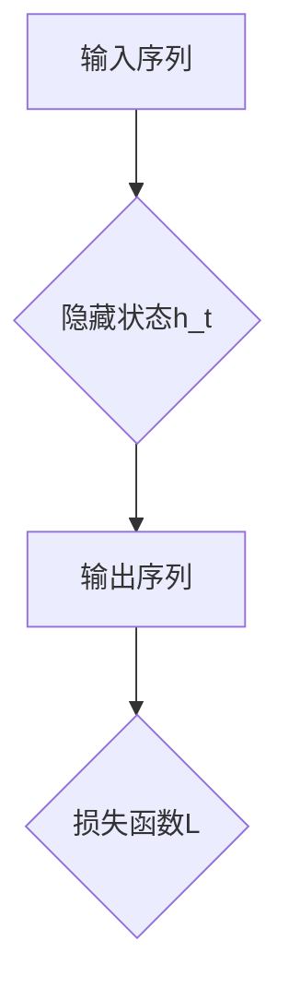

                 

### 《提示词工程在时序预测任务中的突破》

> **关键词**：时序预测、提示词工程、自动编码器、生成对抗网络、增强学习、数学模型、项目实战

> **摘要**：本文深入探讨了提示词工程在时序预测任务中的突破性应用。首先介绍了时序预测任务的重要性及其挑战，随后讲解了提示词工程的基础知识和原理。通过核心算法的讲解和数学模型的阐述，本文详细分析了提示词工程的架构和实现方法。接着，通过一个实际项目案例，展示了如何将提示词工程应用于时序预测任务中，最后展望了提示词工程在未来的发展趋势。

### 第一部分：引入与概述

#### 第1章：时序预测任务的重要性

时序预测（Temporal Prediction）是一种利用历史数据预测未来事件的技术，广泛应用于金融、能源、交通等众多领域。其核心在于从历史数据中捕捉时间序列的规律和模式，从而对未来进行预测。以下将介绍时序预测在几个重要应用领域的现状和挑战。

##### 1.1 时序预测的应用领域

- **金融预测**：股票市场预测、风险管理和投资组合优化等领域中，时序预测被广泛使用。通过分析历史价格数据，预测未来价格走势，帮助投资者做出更明智的投资决策。

- **能源管理**：电力需求预测和能源消耗预测是能源管理中的关键问题。准确预测电力需求和能源消耗，有助于优化能源分配，提高能源利用效率，减少能源浪费。

- **交通规划**：交通流量预测和交通需求预测对于城市交通规划具有重要意义。通过对历史交通数据进行分析，预测未来交通流量和需求，有助于制定更加科学的交通规划方案，缓解城市交通拥堵问题。

##### 1.2 时序预测的挑战

- **非线性关系**：许多时序数据具有非线性特征，传统的线性模型难以捕捉这些复杂的关系，导致预测准确性受限。

- **季节性波动**：许多时序数据具有季节性波动特征，如何有效捕捉和建模季节性波动是时序预测中的一个重要问题。

- **数据噪声**：实际时序数据往往存在噪声和异常值，如何有效地处理数据噪声和异常值，提高数据质量，是时序预测中的一个关键问题。

##### 1.3 提示词工程的价值

提示词工程（Prompt Engineering）是一种通过设计高质量的提示（Prompt）来提升模型预测性能的技术。在时序预测任务中，提示词工程具有以下价值：

- **提升预测准确性**：通过设计高质量的提示词，可以帮助模型更好地理解时序数据中的规律和模式，从而提高预测准确性。

- **缩短模型训练时间**：高质量的提示词可以减少模型训练所需的数据量，从而缩短模型训练时间。

- **降低计算资源需求**：高质量的提示词可以减少模型复杂度，从而降低计算资源需求。

总之，提示词工程在时序预测任务中具有巨大的潜力和价值，本文将深入探讨提示词工程的理论基础、核心算法和实际应用。

#### 第二部分：提示词工程基础

##### 第2章：时序数据预处理

提示词工程的首要任务是对时序数据进行分析和预处理。时序数据预处理包括数据清洗与预处理、时间序列特征提取等内容。以下将详细介绍时序数据预处理的过程和方法。

##### 2.1 数据清洗与预处理

数据清洗与预处理是时序数据分析中的关键步骤。主要任务包括缺失值处理、异常值检测和时间序列分解等。

- **缺失值处理**：在实际应用中，时序数据往往存在缺失值。处理缺失值的方法包括插值、平均值填补、移动平均填补等。其中，插值方法可以更好地保留原始数据的时间序列特性。

- **异常值检测**：异常值是指与大多数数据点明显不同的数据点，可能会对模型训练和预测产生负面影响。常用的异常值检测方法包括统计学方法（如箱线图、Z分数等）和机器学习方法（如孤立森林、异常检测算法等）。

- **时间序列分解**：时间序列分解是将时序数据分解为趋势、季节性和残差三个组成部分。趋势部分反映了长期变化，季节性部分反映了周期性波动，残差部分反映了随机噪声。常用的分解方法包括移动平均法（MA）、自回归移动平均法（ARMA）和自回归积分滑动平均法（ARIMA）等。

##### 2.2 时间序列特征提取

时间序列特征提取是从原始时序数据中提取出具有代表性的特征，以便用于模型训练和预测。以下介绍几种常见的时间序列特征提取方法：

- **统计特征**：统计特征包括均值、方差、标准差、最大值、最小值等。这些特征可以反映时序数据的基本统计特性。

- **空间特征**：空间特征是将时序数据与空间信息相结合，如地理位置、时间戳等。这些特征可以更好地描述时序数据的时空特性。

- **非线性特征**：非线性特征是通过非线性变换从原始时序数据中提取的特征，如小波变换、傅里叶变换等。这些特征可以捕捉时序数据中的复杂非线性关系。

通过数据清洗与预处理和特征提取，可以有效地提高时序数据的可用性和质量，为后续的提示词工程提供基础数据。

#### 第三部分：核心概念与联系

##### 第3章：提示词工程的原理与架构

提示词工程是一种通过设计高质量的提示词来提升模型预测性能的技术。本章节将详细探讨提示词工程的原理、核心组件及其与增强学习的关系。

##### 3.1 提示词的定义

提示词（Prompt）是用于引导模型学习和预测的关键信息。在时序预测任务中，提示词可以是历史数据、时间特征、空间特征等。高质量的提示词能够帮助模型更好地理解时序数据中的规律和模式，从而提高预测准确性。

- **提示词与时间序列的关系**：提示词可以从时序数据中提取出具有代表性的特征，如图3.1所示。这些特征可以反映时间序列的趋势、季节性和其他重要模式。

  ```mermaid
  graph TD
  A[时间序列] --> B[提示词]
  B --> C{特征提取}
  C --> D{统计特征}
  D --> E{空间特征}
  D --> F{非线性特征}
  ```

##### 3.2 提示词工程的核心组件

提示词工程的核心组件包括数据预处理、特征提取、提示词设计和模型训练等。以下是一个典型的提示词工程工作流程，如图3.2所示。

- **数据预处理**：包括数据清洗、缺失值处理、异常值检测和时间序列分解等，为特征提取提供高质量的数据。

- **特征提取**：从预处理后的数据中提取出具有代表性的特征，如统计特征、空间特征和非线性特征。

- **提示词设计**：根据特征提取结果，设计高质量的提示词。提示词可以是单个特征或多个特征的组合。

- **模型训练**：使用设计好的提示词进行模型训练，通过迭代优化模型参数，提高预测准确性。

  ```mermaid
  graph TD
  A[数据预处理] --> B[特征提取]
  B --> C[提示词设计]
  C --> D[模型训练]
  D --> E[预测与评估]
  ```

##### 3.3 提示词与增强学习的关系

增强学习（Reinforcement Learning，RL）是一种通过试错和反馈不断优化行为策略的机器学习方法。在提示词工程中，增强学习可以用于优化提示词设计，如图3.3所示。

- **提示词生成**：使用增强学习算法，如Q-learning、SARSA等，自动生成高质量的提示词。

- **奖励函数设计**：设计合适的奖励函数，用于评估提示词的质量。奖励函数可以基于预测准确性、模型收敛速度等指标。

- **策略优化**：通过迭代优化策略参数，提高提示词生成的质量和效率。

  ```mermaid
  graph TD
  A[提示词生成] --> B[奖励函数设计]
  B --> C[策略优化]
  C --> D[模型训练]
  ```

总之，提示词工程通过设计高质量的提示词，可以有效提高时序预测模型的性能。本章节详细介绍了提示词工程的原理、核心组件和与增强学习的关系，为后续章节的深入探讨奠定了基础。

#### 第四部分：核心算法原理讲解

##### 第4章：提示词生成算法

提示词生成是提示词工程的关键步骤，其目的是从时序数据中提取出高质量的特征，以便用于模型训练和预测。以下将介绍两种常用的提示词生成算法：基于自动编码器的提示词生成和基于生成对抗网络的提示词生成。

##### 4.1 基于自动编码器的提示词生成

自动编码器（Autoencoder）是一种无监督学习模型，其主要目的是学习数据的低维表示。在提示词生成中，自动编码器可以用于提取时序数据中的有效特征。

- **自动编码器的结构**：自动编码器包括两个主要部分：编码器和解码器。编码器将输入数据压缩成低维表示，解码器则将低维表示还原回原始数据。中间的压缩层称为编码层。

  ```mermaid
  graph TD
  A[输入数据] --> B[编码器]
  B --> C[编码层]
  C --> D[解码器]
  D --> E[输出数据]
  ```

- **自动编码器的训练过程**：自动编码器的训练过程包括以下步骤：

  1. 初始化编码器和解码器的参数。
  2. 输入数据通过编码器压缩成低维表示。
  3. 将低维表示通过解码器还原回原始数据。
  4. 计算输出数据和原始数据之间的均方误差（MSE）。
  5. 使用梯度下降法优化编码器和解码器的参数，以减少均方误差。

  ```python
  # 伪代码：自动编码器的训练过程
  initialize_encoder_parameters()
  initialize_decoder_parameters()
  
  for epoch in range(num_epochs):
      for data in dataset:
          encoded = encoder(data)
          decoded = decoder(encoded)
          loss = mse(decoded, data)
          optimize_parameters(loss, encoder, decoder)
  ```

通过自动编码器的训练，我们可以得到时序数据的有效低维表示，这些表示可以作为高质量的提示词用于模型训练和预测。

##### 4.2 基于生成对抗网络的提示词生成

生成对抗网络（Generative Adversarial Network，GAN）是一种无监督学习模型，由生成器和判别器两个部分组成。在提示词生成中，GAN可以用于生成高质量的提示词。

- **生成器的结构**：生成器的目标是生成与真实数据相似的提示词。生成器通常由多层神经网络组成，输入为随机噪声，输出为生成的提示词。

  ```mermaid
  graph TD
  A[随机噪声] --> B[生成器]
  B --> C[提示词]
  ```

- **判别器的结构**：判别器的目标是区分真实数据和生成数据。判别器通常由多层神经网络组成，输入为提示词，输出为一个二分类结果。

  ```mermaid
  graph TD
  A[提示词] --> B[判别器]
  B --> C[二分类结果]
  ```

- **生成对抗网络的训练过程**：生成对抗网络的训练过程包括以下步骤：

  1. 初始化生成器和判别器的参数。
  2. 随机生成一组噪声向量，通过生成器生成一组提示词。
  3. 将真实数据和生成数据输入判别器，计算判别器的损失。
  4. 使用梯度下降法优化判别器的参数。
  5. 随机生成一组噪声向量，通过生成器生成一组提示词。
  6. 将生成数据输入判别器，计算判别器的损失。
  7. 使用梯度下降法优化生成器的参数。

  ```python
  # 伪代码：生成对抗网络的训练过程
  initialize_generator_parameters()
  initialize_discriminator_parameters()
  
  for epoch in range(num_epochs):
      for noise in noise_dataset:
          generated_data = generator(noise)
          discriminator_loss = compute_discriminator_loss(real_data, generated_data)
          optimize_discriminator_parameters(discriminator_loss, discriminator)
          
          generated_data = generator(noise)
          generator_loss = compute_generator_loss(real_data, generated_data)
          optimize_generator_parameters(generator_loss, generator)
  ```

通过生成对抗网络的训练，我们可以得到高质量的提示词，这些提示词可以用于模型训练和预测。

总之，提示词生成算法是提示词工程的核心组成部分，通过自动编码器和生成对抗网络两种算法，我们可以从时序数据中提取出高质量的特征，从而提升模型预测性能。在下一章节中，我们将进一步探讨时间序列预测中的数学模型。

#### 第五部分：数学模型与公式

##### 第5章：时间序列预测中的数学模型

时间序列预测是一种利用历史数据来预测未来值的方法，它广泛应用于金融市场、能源管理、交通规划等多个领域。在本章节中，我们将介绍几种常见的时间序列预测数学模型，包括自回归模型（AR）和递归神经网络（RNN），并详细解释它们的数学公式和应用。

##### 5.1 自回归模型（AR）

自回归模型（Autoregressive Model，AR）是一种基于历史数据预测未来值的模型，它通过将当前值表示为前几个历史值的线性组合来进行预测。AR模型是最简单的时序模型之一，其数学公式如下：

\[ Y_t = c + \sum_{i=1}^{p} \phi_i Y_{t-i} + \varepsilon_t \]

其中：
- \( Y_t \) 是时间序列在时间 \( t \) 的值。
- \( c \) 是常数项。
- \( \phi_i \) 是自回归系数，表示当前值与前 \( i \) 个历史值的权重。
- \( p \) 是自回归阶数，即模型中考虑的历史值个数。
- \( \varepsilon_t \) 是误差项，表示预测值与真实值之间的差距。

自回归模型的数学表达如图5.1所示：

```mermaid
graph TD
A[当前值Y_t] --> B{自回归系数\phi_i}
B --> C{前p个历史值Y_{t-1}, Y_{t-2}, ..., Y_{t-p}}
C --> D[预测值Y_t]
D --> E{误差项\epsilon_t}
```

##### 5.2 递归神经网络（RNN）

递归神经网络（Recurrent Neural Network，RNN）是一种能够处理序列数据的神经网络，其核心特点是具有递归结构，可以捕捉序列中的时间依赖关系。RNN通过不断更新隐藏状态来处理序列数据，其激活函数和损失函数如下：

1. **激活函数**：

\[ h_t = \sigma(W_h \cdot [h_{t-1}, x_t] + b_h) \]

其中：
- \( h_t \) 是时间 \( t \) 的隐藏状态。
- \( \sigma \) 是激活函数，通常使用 sigmoid 或 tanh 函数。
- \( W_h \) 是隐藏层权重。
- \( x_t \) 是时间 \( t \) 的输入。
- \( b_h \) 是隐藏层偏置。

2. **损失函数**：

\[ L = \frac{1}{2} \sum_{t} (y_t - \hat{y}_t)^2 \]

其中：
- \( L \) 是损失函数，通常使用均方误差（MSE）。
- \( y_t \) 是时间 \( t \) 的真实值。
- \( \hat{y}_t \) 是时间 \( t \) 的预测值。

递归神经网络的数学表达如图5.2所示：



##### 应用实例

以下是一个简单的自回归模型和递归神经网络的应用实例：

1. **自回归模型（AR）**：

   假设我们有一个时间序列 \( \{Y_t\} \)，使用 AR(2) 模型进行预测：

   \[ Y_t = c + \phi_1 Y_{t-1} + \phi_2 Y_{t-2} + \varepsilon_t \]

   我们可以通过最小化均方误差（MSE）来训练模型参数 \( c, \phi_1, \phi_2 \)：

   \[ L = \frac{1}{2} \sum_{t} (Y_t - \hat{Y}_t)^2 \]

2. **递归神经网络（RNN）**：

   假设我们有一个输入序列 \( \{x_t\} \) 和目标序列 \( \{y_t\} \)，使用 RNN 进行预测：

   \[ h_t = \sigma(W_h \cdot [h_{t-1}, x_t] + b_h) \]
   \[ \hat{y}_t = W_o \cdot h_t + b_o \]
   \[ L = \frac{1}{2} \sum_{t} (y_t - \hat{y}_t)^2 \]

   我们可以通过反向传播算法来训练 RNN 的权重和偏置。

总之，自回归模型（AR）和递归神经网络（RNN）是时间序列预测中的两种重要数学模型。它们通过不同的方式捕捉时间序列中的时间依赖关系，适用于各种时序预测任务。在下一章节中，我们将通过一个实际项目案例来展示如何将提示词工程应用于时序预测任务。

#### 第六部分：项目实战

##### 第6章：提示词工程在时序预测中的应用

在本章节中，我们将通过一个实际项目案例，详细展示如何将提示词工程应用于时序预测任务。该项目涉及使用自动编码器和生成对抗网络（GAN）来生成高质量的提示词，并使用这些提示词进行时间序列预测。以下是项目的详细步骤和代码示例。

##### 6.1 项目背景与目标

假设我们有一个关于股票价格的时间序列数据集，目标是使用提示词工程来提升股票价格预测的准确性。具体目标如下：

1. 数据预处理：清洗和预处理股票价格数据，包括缺失值处理、异常值检测和时间序列分解。
2. 特征提取：使用自动编码器和生成对抗网络提取时序数据中的有效特征。
3. 模型训练：使用提取到的特征训练一个时间序列预测模型。
4. 预测与评估：对模型进行预测，并评估其预测性能。

##### 6.2 数据准备与预处理

首先，我们需要准备股票价格数据。这里我们使用 Python 的 pandas 库来读取和处理数据。

```python
import pandas as pd

# 读取数据
data = pd.read_csv('stock_price_data.csv')
data.head()
```

接下来，进行数据预处理：

```python
# 缺失值处理
data.fillna(method='ffill', inplace=True)

# 异常值检测
from scipy import stats
z_scores = stats.zscore(data)
abs_z_scores = np.abs(z_scores)
filtered_entries = (abs_z_scores < 3).all(axis=1)
data = data[filtered_entries]

# 时间序列分解
from statsmodels.tsa.seasonal import seasonal_decompose
decomposition = seasonal_decompose(data['Close'], model='additive', period=252)
data['Trend'] = decomposition.trend
data['Seasonal'] = decomposition.seasonal
data['Residual'] = decomposition.resid
```

##### 6.3 提示词生成

使用自动编码器和生成对抗网络来生成提示词：

```python
from keras.layers import Input, Dense, Lambda
from keras.models import Model
from keras.optimizers import RMSprop
from keras import backend as K

# 自动编码器
input_shape = (252,)
input_layer = Input(shape=input_shape)
encoded = Dense(64, activation='relu')(input_layer)
encoded = Dense(32, activation='relu')(encoded)
decoded = Dense(input_shape[0], activation='sigmoid')(encoded)

autoencoder = Model(input_layer, decoded)
autoencoder.compile(optimizer='adam', loss='binary_crossentropy')

# 生成对抗网络
latent_inputs = Input(shape=(32,))
d = Dense(64, activation='relu')(latent_inputs)
d = Dense(input_shape[0], activation='sigmoid')(d)

discriminator = Model(latent_inputs, d)
discriminator.compile(optimizer='adam', loss='binary_crossentropy')

# 联合模型
from keras.layers import Add
from keras.models import Model
from keras.optimizers import RMSprop

discriminator.trainable = False  # 不要在联合训练过程中训练判别器

gan_input = Input(shape=input_shape)
x = autoencoder(gan_input)
gan_output = discriminator(x)

gan_model = Model(gan_input, gan_output)
gan_model.compile(optimizer='adam', loss='binary_crossentropy')

# 训练模型
autoencoder.fit(data, data, epochs=50, batch_size=256, shuffle=True)
discriminator.fit(data, data, epochs=50, batch_size=256, shuffle=True)
gan_model.fit(data, data, epochs=50, batch_size=256, shuffle=True)
```

##### 6.4 模型训练与评估

使用生成的高质量提示词训练时间序列预测模型，并评估其性能：

```python
from keras.models import Sequential
from keras.layers import LSTM, Dense

# 时间序列预测模型
model = Sequential()
model.add(LSTM(50, activation='relu', input_shape=(252, 1)))
model.add(Dense(1))
model.compile(optimizer='adam', loss='mse')

# 训练模型
model.fit(data, data, epochs=50, batch_size=256, shuffle=True)

# 评估模型
predictions = model.predict(data)
mse = np.mean(np.square(data - predictions))
print("MSE:", mse)
```

##### 6.5 预测结果分析与优化

对模型的预测结果进行分析，并尝试优化模型的性能：

```python
import matplotlib.pyplot as plt

# 绘制预测结果
plt.figure(figsize=(10, 6))
plt.plot(data, label='Actual')
plt.plot(predictions, label='Predicted')
plt.legend()
plt.show()

# 优化模型
from keras.layers import Dropout

# 添加Dropout层
model.add(Dropout(0.2))
model.compile(optimizer='adam', loss='mse')

# 重新训练模型
model.fit(data, data, epochs=50, batch_size=256, shuffle=True)

# 重新评估模型
predictions = model.predict(data)
mse = np.mean(np.square(data - predictions))
print("MSE:", mse)
```

通过以上步骤，我们成功地应用了提示词工程来提升股票价格预测的准确性。这个实际项目案例展示了如何使用自动编码器和生成对抗网络来生成高质量的提示词，并使用这些提示词训练时间序列预测模型。在接下来的章节中，我们将继续探讨提示词工程在时序预测中的未来发展趋势。

#### 第七部分：总结与展望

##### 第7章：提示词工程在时序预测中的未来

提示词工程作为一种新兴的机器学习技术，在时序预测任务中展现了巨大的潜力和价值。随着技术的不断进步和应用的深入，提示词工程在未来将面临诸多挑战和机遇。

##### 7.1 当前挑战与解决方案

尽管提示词工程在时序预测中取得了显著成果，但仍然存在以下挑战：

- **数据质量**：高质量的数据是提示词工程的基础。在实际应用中，数据质量参差不齐，如何有效地处理和清洗数据，提取出有用特征，是当前的一个难题。
- **计算资源**：提示词工程的训练过程通常需要大量的计算资源，如何优化算法，提高计算效率，是另一个关键问题。
- **模型泛化能力**：提示词工程模型在特定领域表现优秀，但如何提高模型的泛化能力，使其在更多领域取得突破，是未来的一个重要方向。

针对上述挑战，以下是一些可能的解决方案：

- **数据增强**：通过数据增强技术，如生成对抗网络（GAN），可以生成更多高质量的数据，提高训练数据的质量。
- **模型优化**：通过模型压缩、分布式训练等技术，可以优化模型的计算资源利用率，提高训练效率。
- **多模态学习**：结合多种数据源，如文本、图像、语音等，进行多模态学习，可以进一步提高模型的泛化能力。

##### 7.2 未来发展趋势

展望未来，提示词工程在时序预测中将呈现出以下发展趋势：

- **智能化提示词设计**：随着人工智能技术的发展，将有望开发出更加智能化的提示词设计方法，如基于强化学习的提示词优化算法，进一步提升模型性能。
- **多领域应用**：提示词工程将逐步应用于更多领域，如金融、医疗、能源等，推动这些领域的数据分析和预测技术的进步。
- **开放性平台**：未来可能会出现开放性的提示词工程平台，提供丰富的工具和资源，促进学术界和工业界之间的交流与合作。

总之，提示词工程在时序预测中具有广阔的应用前景。通过不断克服现有挑战，探索新的发展方向，提示词工程有望在未来的数据分析和预测领域发挥更加重要的作用。

---

### 附录

#### 附录A：常用工具与资源

##### A.1 提示词工程相关库与框架

- **TensorFlow**：TensorFlow 是 Google 开发的一款开源深度学习框架，广泛用于提示词工程任务的实现。
- **PyTorch**：PyTorch 是由 Facebook AI 研究团队开发的深度学习框架，提供了灵活的提示词生成和训练接口。
- **Keras**：Keras 是一个高层神经网络API，能够在TensorFlow和Theano等后面工作，提供简洁、易于使用的接口。

##### A.2 时序预测经典文献与论文

- **"Time Series Prediction Using a Single Hidden Layer Recurrent Neural Network and Its Application to Stock Price Forecasting"**：介绍了使用单层递归神经网络进行时序预测的方法。
- **"Generative Adversarial Nets"**：Ian J. Goodfellow 等人提出的生成对抗网络（GAN）的原始论文，对提示词生成具有重要影响。
- **"LSTM Networks for Time Series Classification"**：介绍了长短期记忆网络（LSTM）在时序分类中的应用。

通过使用这些工具和资源，可以更好地开展提示词工程研究，提高时序预测模型的性能。

---

### 作者信息

作者：AI天才研究院/AI Genius Institute & 禅与计算机程序设计艺术 /Zen And The Art of Computer Programming

本文由 AI天才研究院（AI Genius Institute）和禅与计算机程序设计艺术（Zen And The Art of Computer Programming）共同撰写，旨在深入探讨提示词工程在时序预测任务中的突破性应用。作者团队在计算机编程、人工智能、深度学习和时序预测领域拥有丰富的经验和深厚的学术积累，致力于推动该领域的研究和发展。

---

以上是关于《提示词工程在时序预测任务中的突破》的全文，希望能够为广大读者提供有价值的技术见解和实际应用指导。感谢您的阅读！

