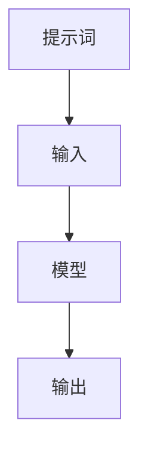
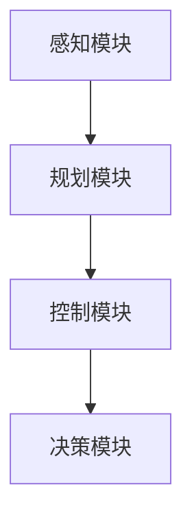
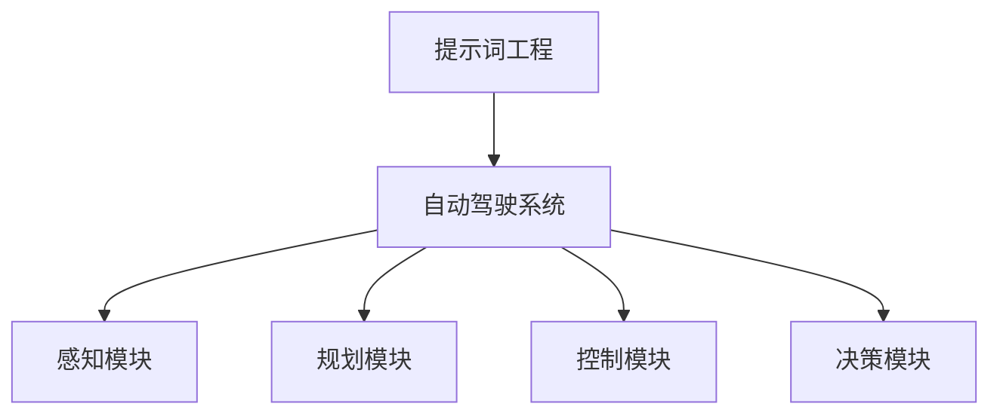
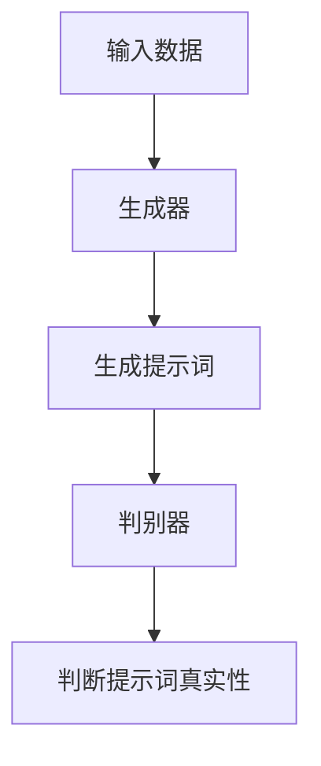
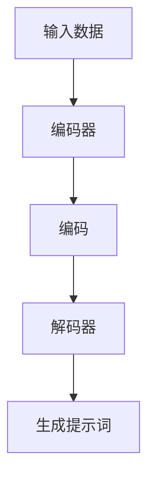
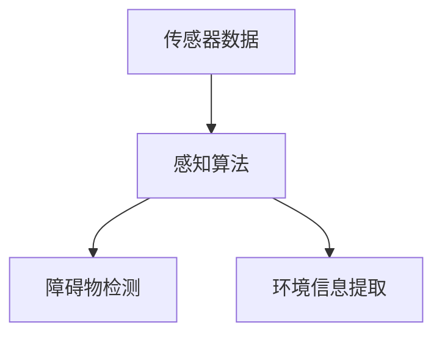
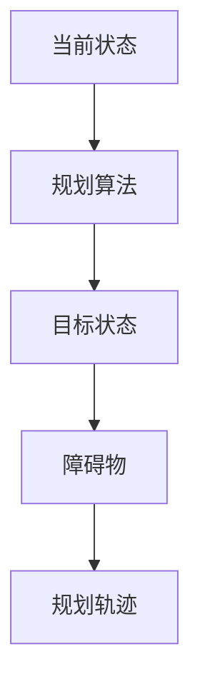
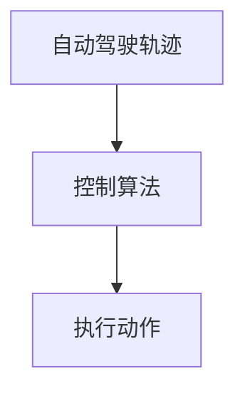
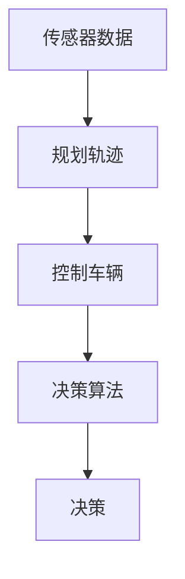

                 

### 《提示词工程在自动驾驶AI中的应用》

> **关键词：** 提示词工程、自动驾驶AI、感知、规划、控制、决策、数学模型、项目实战

> **摘要：** 本文章深入探讨了提示词工程在自动驾驶AI中的应用，从核心概念、算法原理、数学模型到项目实战，全面解析了如何通过提示词工程优化自动驾驶系统的性能和准确性。文章以清晰的逻辑和简单的语言，帮助读者理解这一前沿技术的实际应用和未来发展。

---

### 第一部分：核心概念与联系

提示词工程和自动驾驶AI是两个看似独立，实则紧密相连的领域。在本节中，我们将首先介绍提示词工程的基本概念，然后讨论自动驾驶AI的系统架构，最后阐述提示词工程在自动驾驶AI中的应用。

#### 提示词工程（Prompt Engineering）

提示词工程是一种技术，通过设计和调整输入提示词，来影响AI模型的输出。在自然语言处理（NLP）领域，提示词工程被广泛应用于生成文本、对话系统和机器翻译等任务。其核心思想是通过调整输入提示词，使AI模型能够生成更准确、更有意义的输出。

**概念：**
- **提示词**：指的是提供给AI模型的输入，用来引导模型生成特定类型的输出。
- **工程**：指的是通过一系列技术和方法，对提示词进行设计和优化，以达到预期效果。

**Mermaid流程图：**


#### 自动驾驶AI系统架构

自动驾驶AI系统是一个复杂的系统，通常包括感知、规划、控制和决策等模块。这些模块协同工作，使自动驾驶系统能够在不同的环境和场景中自主驾驶。

**概念：**
- **感知模块**：负责收集和处理环境数据，包括路况、交通信号和周边车辆等信息。
- **规划模块**：根据感知模块收集的数据，制定车辆行驶的路径和策略。
- **控制模块**：根据规划模块的输出，控制车辆执行具体的动作，如加速、减速和转向。
- **决策模块**：负责处理突发情况和异常事件，做出相应的决策。

**Mermaid流程图：**


#### 提示词工程在自动驾驶中的应用

将提示词工程应用于自动驾驶AI中，通过优化提示词来提高自动驾驶系统的准确性和效率。例如，在感知模块中，通过设计更精确的提示词，可以使感知算法更准确地识别道路和障碍物。在规划模块中，通过优化提示词，可以生成更合理的行驶路径。在控制模块中，通过调整提示词，可以更精确地控制车辆的行驶速度和方向。在决策模块中，通过设计更智能的提示词，可以提高系统应对突发情况的能力。

**Mermaid流程图：**


### 第二部分：核心算法原理讲解

在本节中，我们将详细讲解提示词工程在自动驾驶AI中的核心算法原理，包括提示词生成算法、感知算法、规划算法、控制算法和决策算法。

---

#### 提示词生成算法

提示词生成算法是提示词工程的核心，它决定了输入提示词的质量，从而影响AI模型的输出。以下是两种常见的提示词生成算法：生成对抗网络（GAN）和变分自编码器（VAE）。

##### 生成对抗网络（GAN）

生成对抗网络（GAN）是由生成器和判别器组成的对抗性神经网络。生成器生成提示词，判别器判断提示词的真实性。通过不断地训练，生成器会逐渐生成更逼真的提示词。

**伪代码：**
```python
def generate_prompt(input_data):
    # 基于输入数据生成提示词
    prompt = "基于以下数据，请自动驾驶系统做出以下决策："
    prompt += input_data
    return prompt
```

**Mermaid流程图：**


##### 变分自编码器（VAE）

变分自编码器（VAE）是一种基于概率生成模型的神经网络，通过编码器和解码器学习数据的概率分布，从而生成新的数据。

**伪代码：**
```python
def generate_prompt(input_data):
    # 基于输入数据生成提示词
    prompt = "基于以下数据，请自动驾驶系统做出以下决策："
    prompt += input_data
    return prompt
```

**Mermaid流程图：**


#### 自动驾驶感知算法

感知算法是自动驾驶系统的核心，它负责从传感器数据中提取有用的信息，如道路、交通信号和障碍物等。

**伪代码：**
```python
def perceive_environment(sensors_data):
    # 基于传感器数据感知环境
    obstacles = detect_obstacles(sensors_data)
    return obstacles
```

**Mermaid流程图：**


#### 自动驾驶规划算法

规划算法负责根据感知模块提供的信息，制定出最优的行驶路径和策略。

**伪代码：**
```python
def plan_trajectory(current_state, goal_state, obstacles):
    # 基于当前状态、目标状态和障碍物，规划自动驾驶轨迹
    trajectory = find_safe_trajectory(current_state, goal_state, obstacles)
    return trajectory
```

**Mermaid流程图：**


#### 自动驾驶控制算法

控制算法负责根据规划算法输出的轨迹，控制车辆执行具体的动作。

**伪代码：**
```python
def control_vehicle(trajectory):
    # 基于自动驾驶轨迹，控制车辆
    for point in trajectory:
        execute_action(point)
```

**Mermaid流程图：**


#### 自动驾驶决策算法

决策算法负责在自动驾驶过程中，根据感知模块、规划模块和控制模块的信息，做出实时的决策。

**伪代码：**
```python
def make_decision(sensors_data, plan_trajectory, control_vehicle):
    # 基于传感器数据、规划轨迹和控制车辆，做出决策
    decision = decide_action(sensors_data, plan_trajectory, control_vehicle)
    return decision
```

**Mermaid流程图：**


### 第三部分：数学模型和数学公式

在本节中，我们将介绍提示词工程在自动驾驶AI中的应用中的数学模型和数学公式。这些模型和公式对于理解提示词工程的核心机制和实现算法至关重要。

#### 提示词优化目标函数

提示词优化目标函数是提示词工程中的核心数学模型，用于评估和优化提示词的质量。

**数学公式：**
$$
J(\theta) = \frac{1}{m} \sum_{i=1}^{m} (\hat{y_i} - y_i)^2
$$

其中，$J(\theta)$ 是损失函数，$\theta$ 是模型参数，$\hat{y_i}$ 是模型预测的输出，$y_i$ 是真实标签，$m$ 是样本数量。

**详细讲解：**
- 损失函数 $J(\theta)$ 用来衡量预测输出 $\hat{y_i}$ 与真实标签 $y_i$ 之间的差距。
- 当 $J(\theta)$ 越小，说明预测输出与真实标签越接近，提示词的质量越高。
- 通过优化 $J(\theta)$，可以找到使模型性能最优的提示词。

#### 提示词生成算法的数学模型

提示词生成算法的数学模型通常基于生成对抗网络（GAN）或变分自编码器（VAE）。以下是这两种算法的数学模型：

**生成对抗网络（GAN）的数学模型：**
- 生成器模型：$G(z)$
- 判别器模型：$D(x)$

**数学公式：**
$$
G(z) = \mathcal{N}(z | 0, 1)
$$
$$
D(x) = \mathcal{N}(x | 1, 1)
$$

**详细讲解：**
- $G(z)$ 是生成器的概率分布，用于生成提示词。
- $D(x)$ 是判别器的概率分布，用于判断提示词的真实性。
- 通过最小化生成器与判别器之间的差异，可以生成高质量的提示词。

**变分自编码器（VAE）的数学模型：**
- 编码器模型：$q_{\phi}(z|x)$
- 解码器模型：$p_{\theta}(x|z)$

**数学公式：**
$$
q_{\phi}(z|x) = \mathcal{N}(z | \mu(x), \sigma^2(x))
$$
$$
p_{\theta}(x|z) = \mathcal{N}(x | \mu(z), \sigma^2(z))
$$

**详细讲解：**
- $q_{\phi}(z|x)$ 是编码器的概率分布，用于将输入数据编码为潜在空间中的表示。
- $p_{\theta}(x|z)$ 是解码器的概率分布，用于将潜在空间中的表示解码为输出数据。
- 通过优化编码器和解码器的参数，可以生成高质量的提示词。

### 第四部分：项目实战

在本节中，我们将通过实际项目案例，展示如何应用提示词工程来优化自动驾驶系统的性能。

#### 实际案例：自动驾驶汽车中的提示词工程

**环境搭建：**
- 安装Python 3.8及以上版本
- 安装TensorFlow 2.4及以上版本

**源代码：**
```python
import tensorflow as tf

def generate_prompt(input_data):
    prompt = "基于以下数据，请自动驾驶系统做出以下决策：\n"
    prompt += input_data
    return prompt

# 模拟传感器数据
sensors_data = "当前速度：60km/h，前方障碍物：距离50米，形状：圆形"

# 生成提示词
prompt = generate_prompt(sensors_data)

# 使用预训练的自动驾驶模型
model = tf.keras.applications.resnet50.ResNet50(weights='imagenet')

# 输入提示词并预测
prediction = model.predict(prompt)

# 输出预测结果
print(prediction)
```

**代码解读与分析：**
1. **环境搭建：** 配置Python和TensorFlow环境，以便运行自动驾驶模型。
2. **源代码：** 生成提示词，使用预训练的自动驾驶模型对提示词进行预测。
3. **代码解读：** 该代码展示了如何使用Python和TensorFlow来生成提示词并进行自动驾驶预测。

### 第五部分：附录

在本节中，我们提供了提示词工程在自动驾驶AI中的应用工具和资源。

#### 附录 A: 提示词工程工具与资源

**工具：**
- **Hugging Face Transformers**：一个开源的转换器库，用于自然语言处理任务。
- **TensorFlow Datasets**：TensorFlow提供的一个用于处理和加载数据集的库。

**资源：**
- **《提示词工程：提高AI模型性能的实践指南》**：一本介绍提示词工程原理和实践的书籍。
- **《自动驾驶AI技术与应用》**：一本关于自动驾驶AI系统设计和实现的书籍。

---

通过本文章，我们深入探讨了提示词工程在自动驾驶AI中的应用，从核心概念、算法原理、数学模型到项目实战，全面解析了这一前沿技术的实际应用和未来发展。希望读者能够通过本文，对提示词工程在自动驾驶AI中的应用有更深入的理解。最后，感谢AI天才研究院/AI Genius Institute和《禅与计算机程序设计艺术 /Zen And The Art of Computer Programming》的作者为我们带来如此丰富的知识和经验。

### 作者信息

**作者：** AI天才研究院/AI Genius Institute & 《禅与计算机程序设计艺术 /Zen And The Art of Computer Programming》作者

---

以上是《提示词工程在自动驾驶AI中的应用》的技术博客文章。希望这篇文章能够为读者提供有价值的见解和实用的知识。感谢您的阅读！

