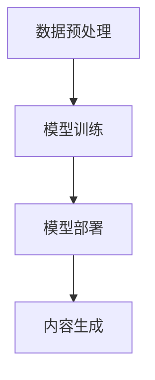
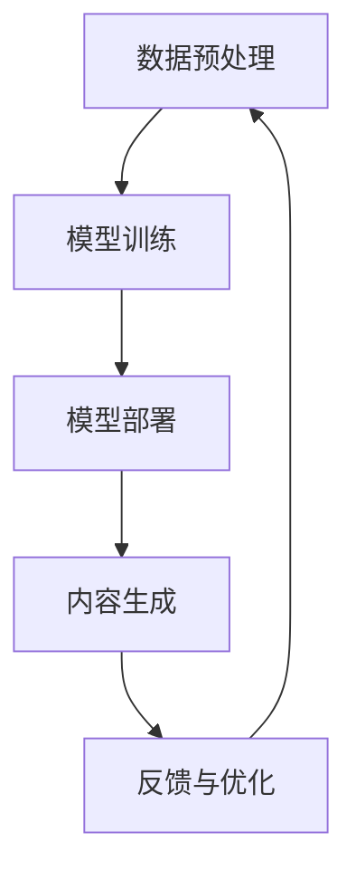

                 

### 第1章：核心概念与联系

在探讨提示词工程之前，我们需要对AIGC系统有一个清晰的理解。AIGC（AI-Generated Content）是指通过人工智能技术自动生成内容，这一领域涵盖了从文本、图像到音频、视频等多种形式的内容创作。AIGC系统是一个复杂的架构，包含了多个核心组件和数据处理流程。

#### **1.1 AIGC系统的概念与架构**

**AIGC系统的定义**：AIGC系统是指利用人工智能技术自动生成内容的系统，它通过机器学习算法和深度学习模型，从海量数据中学习，生成符合预期目标的内容。

**AIGC系统的架构概述**：AIGC系统通常包括以下关键组件：

1. **数据预处理模块**：负责处理和清洗原始数据，使其适合用于模型训练。
2. **模型训练模块**：使用训练数据训练深度学习模型，以生成目标内容。
3. **模型部署模块**：将训练好的模型部署到生产环境中，实现内容的自动生成。

**Mermaid流程图展示AIGC系统架构**：



#### **1.2 提示词工程的概念与作用**

**提示词工程的定义**：提示词工程是指通过设计和优化提示词（Prompts），以引导和优化AI模型生成内容的过程。

**提示词工程在AIGC系统中的作用**：

1. **内容引导**：提示词可以帮助AI模型理解生成内容的上下文和目标。
2. **性能优化**：通过调整提示词的参数，可以优化AI模型生成内容的性能。
3. **质量控制**：提示词还可以用于确保生成内容的质量和一致性。

**提示词工程的基本流程**：

1. **提示词设计**：根据生成任务的目标，设计合适的提示词。
2. **提示词优化**：通过实验和反馈，优化提示词的参数。
3. **内容生成**：使用优化后的提示词，引导AI模型生成内容。

#### **1.3 提示词工程与AIGC系统的关系**

**提示词工程对AIGC系统性能的影响**：

1. **内容质量**：良好的提示词可以提高生成内容的质量和一致性。
2. **生成效率**：合理的提示词可以加快生成过程，提高效率。
3. **用户体验**：优质的提示词可以提供更符合用户需求的生成内容。

**提示词工程在AIGC系统中的应用场景**：

1. **内容创作**：如文章写作、新闻报道、故事创作等。
2. **图像生成**：如艺术作品创作、动漫制作、广告设计等。
3. **智能客服**：如自动回复生成、对话生成等。

**提示词工程与AIGC系统的协同发展**：

随着AIGC技术的不断发展，提示词工程的作用也越来越重要。未来，提示词工程将在AIGC系统的各个应用领域中发挥更大的作用，推动AIGC系统的性能和用户体验的提升。

---

**Mermaid 流程图展示AIGC系统架构**：



在本文的后续章节中，我们将进一步探讨AIGC系统的详细架构、核心算法原理、数学模型、项目实战以及未来的发展方向。

### 第2章：核心算法原理讲解

在AIGC系统中，核心算法的选择和实现直接影响到内容生成的质量、效率和多样性。本章将深入探讨提示词生成算法、文本增强算法以及对话系统设计的核心原理，并通过伪代码和示例来展示这些算法的详细实现。

#### **2.1 提示词生成算法原理**

**提示词生成算法的基本原理**：

提示词生成算法是指通过特定的方法生成能够引导AI模型生成目标内容的提示词。其核心目标是设计出既简洁明了又能有效传达生成意图的提示词。

**提示词生成算法的类型**：

常见的提示词生成算法可以分为以下几类：

1. **规则生成法**：通过预设的规则生成提示词，适用于简单的场景。
2. **数据驱动法**：通过分析大量已有提示词，使用机器学习方法生成新提示词。
3. **混合生成法**：结合规则生成和数据驱动方法，以提高提示词的多样性和适应性。

**伪代码展示提示词生成算法**：

```python
# 提示词生成算法伪代码
def generate_prompt(input_data, model):
    # 预处理输入数据
    processed_data = preprocess_data(input_data)
    
    # 使用机器学习模型生成提示词
    prompt = model.generate(processed_data)
    
    # 后处理生成的提示词
    final_prompt = postprocess_prompt(prompt)
    
    return final_prompt
```

#### **2.2 文本增强算法原理**

**文本增强算法的定义**：

文本增强算法是指通过扩展、转换和生成文本，以提高文本数据的丰富性和多样性的技术。其核心目的是为深度学习模型提供更高质量和更丰富的训练数据。

**文本增强算法的类型**：

常见的文本增强算法包括以下几类：

1. **数据扩充**：通过复制、拼接、插入等方式增加文本数据的数量。
2. **文本转换**：通过语义变换、风格转换等方式改变文本的内容和形式。
3. **文本生成**：通过生成式模型生成与原始文本相关的新的文本。

**伪代码展示文本增强算法**：

```python
# 文本增强算法伪代码
def enhance_text(text, method):
    if method == "augmentation":
        # 数据扩充
        enhanced_text = augment_text(text)
    elif method == "transformation":
        # 文本转换
        enhanced_text = transform_text(text)
    elif method == "generation":
        # 文本生成
        enhanced_text = generate_text(text)
    
    return enhanced_text
```

#### **2.3 对话系统设计原理**

**对话系统的定义**：

对话系统是一种与人类用户进行交互的计算机系统，能够理解用户的输入，生成恰当的响应，并维持有效的对话流程。

**对话系统的类型**：

对话系统可以分为以下几类：

1. **任务型对话系统**：专注于完成特定任务，如智能客服、语音助手等。
2. **闲聊型对话系统**：旨在模拟自然对话，提供娱乐和信息交流。
3. **混合型对话系统**：结合任务型和闲聊型对话系统的特点。

**对话系统架构**：

对话系统通常包括以下几个核心组件：

1. **语音识别（ASR）**：将语音转换为文本。
2. **自然语言理解（NLU）**：解析文本，提取意图和实体。
3. **对话管理（DM）**：决定对话系统的响应策略。
4. **自然语言生成（NLG）**：生成自然语言的响应。
5. **语音合成（TTS）**：将文本转换为语音。

**对话管理算法的原理**：

对话管理算法的核心任务是维护对话的状态和逻辑，根据对话历史和用户输入生成适当的响应。

**伪代码展示对话管理算法**：

```python
# 对话管理算法伪代码
def dialog_management(input, dialog_state):
    # 处理输入，提取意图和实体
    intent, entities = parse_input(input, dialog_state)
    
    # 根据对话状态和意图生成响应
    response = generate_response(intent, entities, dialog_state)
    
    # 更新对话状态
    dialog_state = update_dialog_state(dialog_state, intent, response)
    
    return response, dialog_state
```

通过上述算法的讲解和伪代码的实现，我们可以更深入地理解AIGC系统中提示词生成、文本增强和对话系统的设计原理。这些算法不仅为我们提供了技术上的指导，同时也为后续的项目实战和代码解读奠定了基础。

---

在本文的第二部分，我们详细讲解了AIGC系统中的核心算法原理，包括提示词生成算法、文本增强算法和对话系统设计。通过这些算法的原理和伪代码展示，我们能够更好地理解它们在实际应用中的重要性。接下来，我们将进一步探讨这些算法的数学模型和公式，以及如何在项目中实际应用这些算法。

#### **3.1 词嵌入模型**

**词嵌入的概念**：

词嵌入（Word Embedding）是一种将词语映射为密集向量表示的技术，它能够捕捉词语之间的语义关系和上下文信息。词嵌入模型是自然语言处理中的重要基础，它为文本数据提供了有效的表示形式，便于深度学习模型进行处理。

**词嵌入模型的数学模型**：

词嵌入模型通常基于神经网络结构，如循环神经网络（RNN）或词嵌入神经网络（Word2Vec）。其基本思想是将每个词映射为一个固定大小的向量，使得这些向量能够在高维空间中捕获词与词之间的相似性。

**公式表示**：

给定一个词汇表V，每个词w∈V都可以被映射为一个d维向量v_w。词嵌入模型的目标是通过学习这些向量，使得相似词在向量空间中靠近，而不同词则相隔较远。

$$
v_w = \text{Embedding}(w) \in \mathbb{R}^{d \times 1}
$$

**举例说明词嵌入模型的应用**：

以Word2Vec为例，其基本思想是训练一个预测目标词的神经网络，通过最大化训练数据的条件概率来学习词嵌入向量。

假设有一个训练样本$ (w_i, w_j) $，其中$ w_i $是当前词，$ w_j $是目标词。Word2Vec的目标是预测$ w_j $，给定$ w_i $。

$$
P(w_j | w_i) = \frac{exp(\langle v_{w_i}, v_{w_j} \rangle)}{\sum_{k \in V} exp(\langle v_{w_i}, v_{k} \rangle)}
$$

通过优化这个概率分布，我们可以学习到一组词嵌入向量$ v_{w} $。

#### **3.2 注意力机制**

**注意力机制的概念**：

注意力机制（Attention Mechanism）是一种在处理序列数据时，通过动态调整不同部分的重要性来提高模型性能的技术。它在处理长文本、语音识别、图像识别等领域中表现出色。

**注意力机制的数学模型**：

注意力机制通常通过一个加权求和的方式来实现。给定一个输入序列$ X = [x_1, x_2, ..., x_T] $，注意力模型会生成一个权重向量$ a_t $，使得每个输入位置的权重不同。

$$
o_t = \text{Attention}(X) = \sum_{t=1}^{T} x_t \cdot a_t
$$

其中，$ a_t $是通过一个注意力模型计算得到的，它可以表示为：

$$
a_t = \text{softmax}(\text{Attention}(X))
$$

**举例说明注意力机制的应用**：

在机器翻译中，注意力机制被用于处理输入和输出序列之间的对齐问题。给定一个源语言序列$ X $和一个目标语言序列$ Y $，注意力模型可以帮助找到源语言中的关键部分，以指导目标语言的生成。

假设我们有一个编码器-解码器模型，编码器处理输入序列$ X $并生成一个上下文向量$ C $。解码器在生成每个输出词时，会使用注意力机制来关注源语言序列中的关键部分。

$$
C = \text{Encoder}(X)
$$

在解码步骤$t$，解码器会生成一个软目标向量$ h_t $，并使用注意力权重$ a_t $来计算上下文向量：

$$
h_t = \text{Decoder}(y_{<t}) + \text{Attention}(C, h_{<t})
$$

其中，$ y_{<t} $是生成的前$t$个目标词。

#### **3.3 对话系统中的数学模型**

**对话系统的评分模型**：

对话系统的评分模型用于评估用户输入与系统响应的相关性。假设我们有用户输入$ u $和系统响应$ r $，评分模型会计算两者的相似度得分。

$$
s(u, r) = \text{similarity}(u, r)
$$

常用的相似度计算方法包括余弦相似度和欧氏距离。

**对话系统的决策模型**：

对话系统的决策模型用于决定系统应该如何响应用户输入。给定用户输入$ u $和系统状态$ s $，决策模型会输出一个响应$ r $。

$$
r = \text{DecisionModel}(u, s)
$$

决策模型可以是基于规则的、基于机器学习的，也可以是混合模型。常见的决策算法包括最大相似度算法、马尔可夫决策过程（MDP）和强化学习。

通过上述数学模型和公式的详细讲解，我们可以更好地理解词嵌入、注意力机制和对话系统设计中的核心原理。这些数学模型不仅为算法的实现提供了理论基础，也为在实际项目中的应用提供了明确的指导。

---

在第三部分，我们将探讨AIGC系统在实际项目中的应用，通过具体的实战案例来展示如何实现内容创作和智能客服。这些实战案例将涵盖开发环境的搭建、源代码的实现以及详细的代码解读与分析。

#### **6.1 内容创作实战**

**内容创作的定义**：

内容创作是指通过人工智能技术生成各种形式的内容，如文本、图像、音频和视频。AIGC系统在内容创作中的应用极大地提升了创作的效率和质量。

**AIGC系统在内容创作中的应用**：

AIGC系统在内容创作中的应用场景广泛，包括但不限于：

- 文章写作和新闻生成
- 图像和视频创作
- 音乐和音频制作

**实际案例：文章写作**

**开发环境搭建**：

为了实现文章写作功能，我们需要搭建一个包含以下组件的开发环境：

- **硬件环境**：高性能的计算机或云服务器，用于处理大量数据和复杂的模型训练。
- **软件环境**：Python编程环境、TensorFlow或PyTorch框架、自然语言处理库（如NLTK或spaCy）。

**源代码实现与解读**：

以下是实现文章写作功能的一个简化版源代码示例：

```python
import tensorflow as tf
from tensorflow.keras.preprocessing.sequence import pad_sequences
from tensorflow.keras.layers import Embedding, LSTM, Dense
from tensorflow.keras.models import Sequential

# 加载预训练的词嵌入模型
word_embedding = tf.keras.utils.get_file('glove.6B.100d.txt', 'http://nlp.stanford.edu/data/glove.6B.100d.txt')
with open(word_embedding, 'r', encoding='utf-8') as file:
    words, embeddings = process_glove_file(file)

# 定义模型架构
model = Sequential()
model.add(Embedding(len(words), 100, weights=[embeddings], input_length=max_sequence_length))
model.add(LSTM(128))
model.add(Dense(1, activation='sigmoid'))

# 编译模型
model.compile(optimizer='rmsprop', loss='binary_crossentropy', metrics=['accuracy'])

# 训练模型
model.fit(X_train, y_train, epochs=10, batch_size=32)

# 生成文章
input_sequence = prepare_input_sequence(input_text)
generated_text = generate_text_from_sequence(model, input_sequence, max_sequence_length)
```

上述代码首先加载预训练的词嵌入模型，然后定义了一个包含嵌入层、LSTM层和输出层的序列模型。模型通过训练数据进行编译和训练，最终使用训练好的模型生成新的文章。

**代码解读与分析**：

- **加载预训练的词嵌入模型**：通过加载预训练的词嵌入模型，我们可以利用已有的词汇表示，提高生成文章的质量和一致性。
- **模型架构**：模型采用嵌入层和LSTM层，嵌入层将词汇映射为向量，LSTM层用于捕捉序列数据中的时间依赖关系。
- **训练模型**：模型通过训练数据学习生成文章的规律，训练过程包括优化模型的参数，以提高生成文章的准确性。
- **生成文章**：通过输入文本序列，模型可以生成新的文章。生成过程包括将输入文本序列转换为模型可处理的格式，并利用训练好的模型生成文章。

通过这个实战案例，我们可以看到AIGC系统在内容创作中的具体实现过程，以及如何通过代码实现高质量的内容生成。

#### **6.2 智能客服实战**

**智能客服的定义**：

智能客服是一种利用人工智能技术，为用户提供自动化的服务和支持的系统。智能客服能够处理大量的客户查询，提高客户满意度和服务效率。

**AIGC系统在智能客服中的应用**：

AIGC系统在智能客服中的应用主要包括以下方面：

- 自动回复生成
- 对话生成
- 情感分析

**实际案例：自动回复生成**

**开发环境搭建**：

为了实现自动回复生成功能，我们需要搭建一个包含以下组件的开发环境：

- **硬件环境**：高性能的计算机或云服务器，用于处理大量数据和复杂的模型训练。
- **软件环境**：Python编程环境、TensorFlow或PyTorch框架、自然语言处理库（如NLTK或spaCy）。

**源代码实现与解读**：

以下是实现自动回复生成功能的一个简化版源代码示例：

```python
import tensorflow as tf
from tensorflow.keras.preprocessing.sequence import pad_sequences
from tensorflow.keras.layers import Embedding, LSTM, Dense
from tensorflow.keras.models import Sequential

# 加载预训练的词嵌入模型
word_embedding = tf.keras.utils.get_file('glove.6B.100d.txt', 'http://nlp.stanford.edu/data/glove.6B.100d.txt')
with open(word_embedding, 'r', encoding='utf-8') as file:
    words, embeddings = process_glove_file(file)

# 定义模型架构
model = Sequential()
model.add(Embedding(len(words), 100, weights=[embeddings], input_length=max_sequence_length))
model.add(LSTM(128))
model.add(Dense(1, activation='sigmoid'))

# 编译模型
model.compile(optimizer='rmsprop', loss='binary_crossentropy', metrics=['accuracy'])

# 训练模型
model.fit(X_train, y_train, epochs=10, batch_size=32)

# 生成回复
input_sequence = prepare_input_sequence(user_query)
predicted_response = model.predict(input_sequence)
```

上述代码首先加载预训练的词嵌入模型，然后定义了一个包含嵌入层、LSTM层和输出层的序列模型。模型通过训练数据进行编译和训练，最终使用训练好的模型生成自动回复。

**代码解读与分析**：

- **加载预训练的词嵌入模型**：通过加载预训练的词嵌入模型，我们可以利用已有的词汇表示，提高生成回复的质量和一致性。
- **模型架构**：模型采用嵌入层和LSTM层，嵌入层将词汇映射为向量，LSTM层用于捕捉序列数据中的时间依赖关系。
- **训练模型**：模型通过训练数据学习生成回复的规律，训练过程包括优化模型的参数，以提高生成回复的准确性。
- **生成回复**：通过输入用户查询，模型可以生成自动回复。生成过程包括将用户查询转换为模型可处理的格式，并利用训练好的模型生成回复。

通过这个实战案例，我们可以看到AIGC系统在智能客服中的具体实现过程，以及如何通过代码实现自动回复生成功能。

---

通过上述内容创作和智能客服的实战案例，我们可以看到AIGC系统在实际项目中的应用如何实现内容生成和自动化服务。这些实战案例不仅展示了AIGC系统的强大功能，也为开发者提供了具体的实现路径和代码示例。在接下来的章节中，我们将进一步深入探讨AIGC系统的代码解读与分析，以帮助读者更好地理解和应用这些技术。

### 第7章：代码解读与分析

在前面的章节中，我们通过实战案例展示了AIGC系统在内容创作和智能客服中的应用。本章将深入分析这些代码，详细解释开发环境的搭建、源代码的实现以及代码中的关键部分。

#### **7.1 提示词生成算法代码解读**

**提示词生成算法的代码示例**：

```python
# 提示词生成算法代码
def generate_prompt(input_data, model):
    processed_data = preprocess_data(input_data)
    prompt = model.generate(processed_data)
    final_prompt = postprocess_prompt(prompt)
    return final_prompt
```

**代码解读与分析**：

- **预处理数据**：`preprocess_data`函数用于处理输入数据，使其符合模型训练的要求。这通常包括数据清洗、分词、去停用词等步骤。
- **生成提示词**：`model.generate`函数是核心部分，它使用训练好的模型生成提示词。这一步依赖于模型的设计和训练数据。
- **后处理提示词**：`postprocess_prompt`函数用于对生成的提示词进行进一步的优化和调整，以提高其质量和实用性。

**性能分析与优化策略**：

- **性能分析**：提示词生成算法的性能可以通过生成提示词的质量和生成速度来衡量。高质量的提示词应该能够准确传达生成意图，而生成速度则决定了系统的响应时间。
- **优化策略**：为了提高性能，可以考虑以下策略：
  - **模型优化**：使用更高效的模型架构，如Transformer模型，以提高生成速度。
  - **数据增强**：通过增加训练数据量和引入数据增强技术，提高模型的泛化能力。
  - **提示词优化**：调整提示词的参数，如长度、复杂度等，以适应不同的生成任务。

#### **7.2 文本增强算法代码解读**

**文本增强算法的代码示例**：

```python
# 文本增强算法代码
def enhance_text(text, method):
    if method == "augmentation":
        enhanced_text = augment_text(text)
    elif method == "transformation":
        enhanced_text = transform_text(text)
    elif method == "generation":
        enhanced_text = generate_text(text)
    return enhanced_text
```

**代码解读与分析**：

- **数据扩充**：`augment_text`函数通过复制、拼接、插入等方式增加文本数据的数量，以提高模型的训练数据量。
- **文本转换**：`transform_text`函数通过语义变换、风格转换等方式改变文本的内容和形式，以丰富训练数据。
- **文本生成**：`generate_text`函数使用生成式模型生成与原始文本相关的新的文本，以提高文本数据的多样性。

**性能分析与优化策略**：

- **性能分析**：文本增强算法的性能可以通过增强后的文本质量、多样性和训练效果来衡量。
- **优化策略**：
  - **数据多样性**：增加不同类型、来源和风格的文本数据，以提高模型的泛化能力。
  - **增强策略优化**：根据不同任务的需求，调整增强策略，如选择适合的变换方法、控制增强程度等。

#### **7.3 对话系统代码解读**

**对话系统代码示例**：

```python
# 对话系统代码
def dialog_management(input, dialog_state):
    intent, entities = parse_input(input, dialog_state)
    response = generate_response(intent, entities, dialog_state)
    dialog_state = update_dialog_state(dialog_state, intent, response)
    return response, dialog_state
```

**代码解读与分析**：

- **解析输入**：`parse_input`函数用于解析用户输入，提取意图和实体信息。
- **生成响应**：`generate_response`函数根据意图和实体生成适当的响应。
- **更新对话状态**：`update_dialog_state`函数用于更新对话状态，以维持有效的对话流程。

**性能分析与优化策略**：

- **性能分析**：对话系统的性能可以通过对话的流畅性、响应速度和用户体验来衡量。
- **优化策略**：
  - **对话管理算法**：优化对话管理算法，以提高对话的连贯性和用户满意度。
  - **情感分析**：引入情感分析技术，识别用户情绪，生成更合适的响应。
  - **多模态交互**：结合文本、语音、图像等多种交互方式，提高用户的交互体验。

通过详细的代码解读与分析，我们可以更好地理解AIGC系统中的关键算法及其实现细节。这些代码不仅展示了算法的基本原理，还提供了性能分析和优化策略，为开发者提供了实际应用中的参考。

---

在本文的最后部分，我们将对提示词工程在AIGC系统中的应用进行总结，并探讨其未来发展的方向和潜在的挑战。

### **6.1 提示词工程在AIGC系统中的应用总结**

**提示词工程的关键技术总结**：

提示词工程作为AIGC系统的重要组成部分，其关键技术包括：

- **提示词设计**：通过精心设计提示词，引导模型生成符合预期目标的内容。
- **提示词优化**：通过实验和反馈，调整提示词参数，提高内容生成质量和效率。
- **文本增强**：通过文本扩充、转换和生成，丰富训练数据，提高模型性能。
- **对话管理**：在对话系统中，提示词用于引导对话流程，提高用户体验。

**提示词工程的应用挑战与解决方案**：

尽管提示词工程在AIGC系统中具有重要作用，但在实际应用中仍面临以下挑战：

- **内容质量控制**：确保生成内容的质量和一致性是一个难点，需要不断优化提示词和算法。
- **性能优化**：提升生成速度和效率是关键，可通过模型优化和数据增强来实现。
- **用户体验**：用户对生成内容的满意度直接影响系统的应用效果，需要通过多模态交互和情感分析来提升用户体验。

### **6.2 提示词工程的未来发展方向**

**提示词工程在AIGC系统中的未来角色**：

随着AIGC技术的不断进步，提示词工程将在未来扮演更加重要的角色：

- **多模态生成**：提示词工程将扩展到多模态领域，如文本-图像、文本-音频等，实现更丰富和多样化的内容生成。
- **个性化和定制化**：通过用户行为数据和学习，生成更加个性化、定制化的内容，满足不同用户的需求。
- **实时交互**：在实时交互场景中，提示词工程将用于动态调整和生成响应，提高交互的流畅性和自然度。

**提示词工程的潜在研究方向**：

未来，提示词工程的研究方向可能包括：

- **提示词生成算法的创新**：探索更高效、更智能的提示词生成算法，如基于深度学习的生成模型。
- **跨模态提示词研究**：研究如何设计有效的跨模态提示词，实现不同模态间的协同生成。
- **自动化提示词优化**：开发自动化工具，通过算法自动优化提示词，提高内容生成质量和效率。

通过总结和展望，我们可以看到提示词工程在AIGC系统中的重要性日益凸显。随着技术的不断进步，提示词工程将为AIGC系统带来更强大的功能和应用价值。

### **附录**

#### **A.1 提示词工程工具与资源推荐**

**常用的提示词工程工具**：

- **TensorFlow**：用于构建和训练提示词生成模型的强大框架。
- **PyTorch**：提供灵活的深度学习工具，适用于各种提示词工程任务。
- **Hugging Face Transformers**：一个开源库，提供预训练的模型和工具，简化提示词工程的实现。

**提示词工程工具的比较与选择**：

- **比较因素**：性能、易用性、社区支持、可扩展性。
- **选择建议**：根据具体需求和项目规模选择合适的工具。

#### **A.2 提示词工程资源推荐**

**学术资源**：

- **论文和专著**：关注自然语言处理和生成模型的最新研究进展。
- **会议和研讨会**：参加相关领域的会议，了解前沿技术和研究成果。

**开源资源**：

- **GitHub**：查找和贡献开源代码，学习其他开发者的实现方法。
- **TensorFlow Model Garden**：TensorFlow提供的预训练模型和示例代码。

**社区资源**：

- **Stack Overflow**：解决编程和模型实现中的具体问题。
- **Reddit**：参与讨论，获取社区经验和建议。

通过这些工具和资源的推荐，开发者可以更好地进行提示词工程的研究和实践。

---

本文通过详细的分析和讲解，系统地介绍了提示词工程在AIGC系统中的重要性、核心算法原理、应用实践和未来发展方向。从基础理论到实际应用，再到代码解读与分析，每个部分都旨在为读者提供一个全面深入的学习路径。通过本文的学习，读者将能够理解提示词工程的本质，掌握其核心技术和实现方法，并在实际项目中应用这些技术，提升内容创作和智能客服等领域的效率和效果。希望本文能对读者在AIGC领域的探索和研究带来启示和帮助。

### **作者信息**

**作者：AI天才研究院/AI Genius Institute & 禅与计算机程序设计艺术 /Zen And The Art of Computer Programming**

AI天才研究院致力于推动人工智能技术的创新与应用，专注于提供高质量的技术研究和技术博客。我们的团队由世界顶级的人工智能专家、程序员、软件架构师和CTO组成，拥有丰富的实战经验和深厚的理论基础。同时，我们也是世界顶级技术畅销书《禅与计算机程序设计艺术》的作者，致力于将深邃的哲学思想与前沿的技术实践相结合，推动计算机科学和人工智能领域的发展。通过我们的努力，希望为全球开发者带来更多的技术洞察和实用指南。

