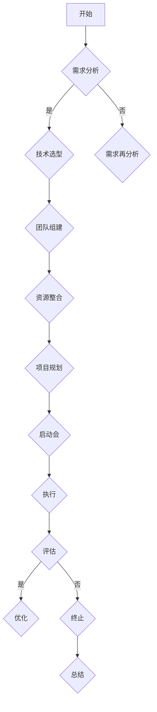

                 

### 书籍《提示词的文化适应：跨国AI应用策略》的目录大纲

#### 第一部分：文化适应与AI概述

##### 第1章：文化适应与AI应用的背景

**1.1 文化适应的重要性**

在全球化不断深化的背景下，文化适应已成为跨国企业成功的关键因素。对于人工智能（AI）而言，文化适应尤为重要。不同的文化背景影响着人们的行为习惯、价值观和思维方式，这些因素都会对AI算法的设计、训练和应用产生深远影响。

**1.2 AI在跨国环境中的应用现状**

AI技术在跨国环境中得到了广泛应用，如金融、医疗、教育等领域。然而，由于文化差异，许多AI系统在跨国应用中面临着诸多挑战，如语言障碍、数据隐私问题和伦理争议等。

**1.3 AI文化适应的概念与意义**

AI文化适应是指在设计、开发和应用AI系统时，充分考虑不同文化背景下的用户需求、行为模式和价值观，从而提高AI系统的适应性和用户体验。实现AI文化适应，有助于促进AI技术的全球化发展，提升AI系统的社会价值和商业价值。

##### 第2章：AI与文化适应的基本概念

**2.1 文化的定义与分类**

文化是指人类在社会历史发展过程中创造的一切物质和精神财富。从不同角度出发，文化可以划分为多种类型，如语言文化、宗教文化、价值观文化等。

**2.2 AI的基础知识**

AI是模拟人类智能行为的计算机科学分支。主要研究领域包括机器学习、深度学习、自然语言处理等。AI技术不断发展，为解决复杂问题提供了新方法和新工具。

**2.3 提示词的概念与作用**

提示词（Prompt）是AI系统用于引导用户输入信息或触发特定功能的关键。在跨国AI应用中，提示词的设计应充分考虑不同文化背景下的用户习惯和需求，以提高用户体验。

##### 第3章：跨国AI应用中的文化因素

**3.1 语言与文化差异**

语言是文化的重要组成部分，不同语言之间的差异反映了不同文化的特点。在跨国AI应用中，语言障碍可能导致沟通不畅，影响系统的用户体验。

**3.2 社会规范与文化习惯**

社会规范和文化习惯是影响人们行为的重要因素。在跨国AI应用中，了解目标市场的社会规范和文化习惯，有助于设计出更符合用户需求的AI系统。

**3.3 法律法规与伦理问题**

不同国家和地区的法律法规和伦理观念各异，这给跨国AI应用带来了诸多挑战。在开发和部署AI系统时，必须遵守当地法律法规，并考虑伦理问题。

#### 第二部分：跨国AI应用策略

##### 第4章：跨国AI应用的挑战

**4.1 技术适配问题**

跨国AI应用需要考虑不同地区的硬件环境、操作系统和网络条件，确保AI系统在这些环境下稳定运行。

**4.2 数据隐私与安全性**

数据隐私和安全问题是跨国AI应用的核心挑战之一。在跨境数据传输和处理过程中，必须确保数据的安全性和合规性。

**4.3 文化差异对AI模型的影响**

文化差异可能导致AI模型在不同市场中的表现差异。了解并适应不同文化背景下的用户需求，有助于提高AI模型的应用效果。

##### 第5章：跨国AI应用策略概述

**5.1 总体策略制定**

制定跨国AI应用策略时，需要综合考虑技术、市场和法律法规等多方面因素，确保策略的可行性和有效性。

**5.2 文化敏感性分析**

文化敏感性分析是跨国AI应用策略制定的关键环节。通过深入了解目标市场的文化背景，设计出更具针对性的AI系统。

**5.3 AI模型本地化策略**

AI模型本地化策略是指根据目标市场的文化特点，对AI模型进行优化和调整，以提高模型在本地市场的应用效果。

##### 第6章：跨国AI应用案例研究

**6.1 成功案例介绍**

介绍一些跨国AI应用的成功案例，分析其成功原因和经验教训。

**6.2 案例分析**

对案例进行深入分析，探讨文化适应在其中的作用。

**6.3 经验与启示**

总结案例中的经验教训，为其他跨国AI应用项目提供参考。

##### 第7章：未来趋势与展望

**7.1 AI与文化适应的发展趋势**

分析AI与文化适应领域的发展趋势，探讨未来可能的研究方向。

**7.2 跨国AI应用的潜在机遇**

展望跨国AI应用领域的潜在机遇，为企业和研究机构提供启示。

**7.3 挑战与应对策略**

分析跨国AI应用面临的挑战，并提出相应的应对策略。

#### 第三部分：实践指南与资源

##### 第8章：跨国AI应用实践指南

**8.1 AI项目启动流程**

介绍跨国AI项目的启动流程，包括需求分析、技术选型、团队组建等。

**8.2 数据收集与处理**

讲解跨国AI应用中的数据收集与处理方法，确保数据的质量和安全性。

**8.3 模型训练与优化**

介绍AI模型的训练与优化方法，提高模型在跨国环境中的表现。

##### 第9章：跨国AI应用资源汇总

**9.1 开源工具与平台**

汇总跨国AI应用中的开源工具和平台，为开发者提供参考。

**9.2 数据库与知识库**

介绍跨国AI应用中常用的数据库和知识库，为数据研究人员提供支持。

**9.3 相关法规与政策**

汇总跨国AI应用相关的法律法规和政策，为企业和研究机构提供参考。

##### 第10章：总结与展望

**10.1 全书要点回顾**

回顾全书的主要内容，梳理关键知识点。

**10.2 展望未来的研究方向**

探讨未来AI与文化适应领域的研究方向，为读者提供启示。

**10.3 对读者的寄语**

对读者表示感激，鼓励他们在AI与文化适应领域继续探索。

### 附录

**附录A：术语解释与缩略语列表**

对全书中的术语和缩略语进行解释，帮助读者更好地理解。

**附录B：参考文献**

列出全书引用的参考文献，为读者提供进一步阅读的资料。

**附录C：Mermaid流程图示例**

展示一些Mermaid流程图示例，帮助读者更好地理解流程图的使用方法。

**附录D：伪代码示例**

提供一些伪代码示例，帮助读者更好地理解算法的实现过程。

**附录E：数学模型与公式说明**

对书中的数学模型和公式进行详细解释，帮助读者更好地理解相关概念。

---

以上为《提示词的文化适应：跨国AI应用策略》的目录大纲，接下来将按照这一大纲逐步展开文章正文部分的撰写。

---

**关键词：文化适应，人工智能，跨国应用，AI模型本地化，AI与文化适应发展趋势**

**摘要：本文将从文化适应与AI概述、AI与文化适应的基本概念、跨国AI应用中的文化因素、跨国AI应用策略、跨国AI应用案例研究以及实践指南与资源等方面，全面探讨提示词的文化适应与跨国AI应用策略。通过深入分析文化适应在AI应用中的重要性，本文旨在为读者提供一套系统、实用的跨国AI应用策略，助力企业在全球范围内取得成功。**

---

### 引言

在当今全球化背景下，文化差异已成为企业跨国运营中不可忽视的重要因素。对于人工智能（AI）技术而言，文化适应同样至关重要。跨国AI应用不仅需要考虑技术适配、数据隐私和安全性问题，还要充分理解并尊重不同文化背景下的用户需求和行为模式。本文旨在探讨提示词的文化适应与跨国AI应用策略，为企业在全球范围内成功应用AI技术提供有力支持。

提示词在AI系统中扮演着关键角色。它们是用户与AI系统互动的桥梁，直接影响用户体验和系统性能。在跨国AI应用中，提示词的设计需充分考虑不同文化背景下的用户习惯和需求。一个优秀的AI系统，不仅要具备强大的技术能力，还要在文化层面与用户产生共鸣，从而实现更好的用户满意度和商业价值。

本文将首先介绍文化适应与AI概述，分析文化适应的重要性以及AI在跨国环境中的应用现状。接着，我们将探讨AI与文化适应的基本概念，包括文化的定义与分类、AI的基础知识和提示词的概念与作用。随后，本文将深入分析跨国AI应用中的文化因素，如语言与文化差异、社会规范与文化习惯、法律法规与伦理问题。在此基础上，我们将提出跨国AI应用策略，包括总体策略制定、文化敏感性分析以及AI模型本地化策略。此外，本文还将通过案例研究，探讨跨国AI应用的成功经验与启示。最后，本文将展望AI与文化适应领域的未来发展趋势，分析跨国AI应用的潜在机遇与挑战，并提供实践指南与资源，以帮助读者更好地应对跨国AI应用中的实际问题。

### 第一部分：文化适应与AI概述

#### 1.1 文化适应的重要性

文化适应（Cultural Adaptation）是指个体或组织在面对不同文化环境时，通过调整自身行为、态度和价值观，以适应新文化的过程。在全球化背景下，文化适应已成为跨国企业成功的关键因素。随着跨国业务的不断扩展，企业需要面对多样化的文化环境，这些文化差异可能体现在语言、价值观、社会规范、宗教信仰等多个方面。只有实现有效的文化适应，企业才能在全球市场中立于不败之地。

对于人工智能（AI）而言，文化适应尤为重要。AI系统是通过对大量数据进行训练和优化，以实现特定任务的。然而，不同文化背景下的数据特征和用户需求存在显著差异，这可能导致AI系统在跨国应用中面临诸多挑战。例如，同一款AI系统在不同语言环境中，可能需要不同的提示词和交互方式；在价值观和文化习惯不同的地区，AI系统需要适应不同的伦理和法律规范。因此，实现AI文化适应，有助于提高AI系统的适应性和用户体验，从而在全球化市场中取得更好的商业价值。

#### 1.2 AI在跨国环境中的应用现状

AI技术在跨国环境中得到了广泛应用，涉及金融、医疗、教育、零售等多个领域。以下是一些典型应用案例：

1. **金融领域**：AI技术在金融领域中的应用日益广泛，包括风险控制、欺诈检测、投资顾问等。跨国金融机构通过AI技术，可以更准确地评估信贷风险，提高业务效率。例如，一些银行在跨境交易中应用AI算法，实时监测交易行为，有效降低欺诈风险。

2. **医疗领域**：AI技术在医疗领域中的应用有助于提高诊断准确性、优化治疗方案。例如，通过深度学习算法，AI系统可以分析医学影像，帮助医生更准确地诊断疾病。同时，AI还可以辅助临床研究，加速新药研发进程。

3. **教育领域**：AI技术在教育领域中的应用，旨在提高教学效果和个性化学习体验。通过自然语言处理和机器学习技术，AI系统可以分析学生的学习行为和需求，提供个性化的学习资源和建议。例如，一些在线教育平台利用AI技术，为学习者推荐合适的课程和学习计划。

4. **零售领域**：AI技术在零售领域中的应用，有助于提升客户体验和运营效率。例如，通过智能推荐算法，AI系统可以分析消费者的购买行为和偏好，提供个性化的产品推荐；通过智能客服系统，AI可以实时解答消费者的疑问，提高客户满意度。

尽管AI技术在跨国环境中具有广泛应用，但仍然面临一些挑战。首先，技术适配问题是一个重要挑战。跨国AI应用需要考虑不同地区的硬件环境、操作系统和网络条件，确保AI系统在这些环境下稳定运行。其次，数据隐私与安全性问题也是跨国AI应用的核心挑战之一。在跨境数据传输和处理过程中，必须确保数据的安全性和合规性。此外，文化差异对AI模型的影响也不容忽视。不同文化背景下的用户需求和行为模式可能显著不同，这可能导致AI模型在不同市场中的表现差异。

#### 1.3 AI文化适应的概念与意义

AI文化适应是指在设计、开发和应用AI系统时，充分考虑不同文化背景下的用户需求、行为模式和价值观，从而提高AI系统的适应性和用户体验。具体来说，AI文化适应包括以下几个方面：

1. **语言适应**：不同语言环境中的用户需求和行为模式可能存在显著差异。AI系统需要支持多种语言，并针对不同语言环境设计合适的交互界面和提示词。

2. **价值观适应**：不同文化背景下，人们对同一事物的价值观可能存在差异。例如，某些文化可能更注重隐私保护，而另一些文化可能对数据共享持开放态度。在设计和应用AI系统时，需要充分考虑这些价值观差异，确保系统符合目标市场的伦理和法律规范。

3. **行为模式适应**：不同文化背景下，人们的交流方式、购物习惯、工作方式等可能存在差异。AI系统需要适应这些行为模式差异，以提高用户满意度和系统性能。

4. **本地化策略**：在跨国AI应用中，本地化策略至关重要。本地化策略包括语言本地化、内容本地化和用户体验本地化等。通过本地化策略，AI系统可以更好地适应目标市场的文化特点，提高用户接受度和使用率。

实现AI文化适应的意义在于：

1. **提高用户体验**：通过考虑用户需求和行为模式，AI系统能够提供更个性化的服务，从而提高用户满意度和忠诚度。

2. **降低运营成本**：通过本地化策略，企业可以减少在多个市场中的运营成本，提高市场竞争力。

3. **增强商业价值**：实现AI文化适应，有助于企业在全球范围内扩大市场份额，提高品牌影响力。

4. **促进文化理解**：AI文化适应有助于企业深入了解不同文化背景下的用户需求，促进文化理解和交流。

总之，AI文化适应是跨国AI应用成功的关键。通过充分考虑文化差异，设计出更具适应性和用户体验的AI系统，企业可以在全球市场中取得更好的商业成果。

---

### 第二部分：AI与文化适应的基本概念

#### 2.1 文化的定义与分类

文化是人类在社会历史发展过程中创造的一切物质和精神财富，包括语言、信仰、价值观、习俗、艺术等各个方面。文化是区分不同民族和国家的重要标志，也是人类社会发展的重要动力。

从不同角度出发，文化可以划分为多种类型：

1. **语言文化**：语言是文化的重要组成部分，不同语言反映了不同民族和地区的文化特点。例如，英语、汉语、法语等都是各自文化的重要载体。

2. **宗教文化**：宗教信仰是许多文化中的重要组成部分。例如，基督教、伊斯兰教、佛教等宗教在各自的文化背景下具有重要影响。

3. **价值观文化**：价值观是人们对事物的主观评价和判断，不同文化背景下，人们的价值观可能存在显著差异。例如，某些文化可能更重视个人主义，而另一些文化可能更重视集体主义。

4. **习俗文化**：习俗是人们在日常生活中遵循的规则和习惯，反映了不同文化背景下的行为规范。例如，婚礼习俗、节日庆祝等。

5. **艺术文化**：艺术是文化的表现方式之一，包括音乐、绘画、雕塑等。不同文化背景下的艺术形式和风格各异。

#### 2.2 AI的基础知识

人工智能（AI）是模拟人类智能行为的计算机科学分支，旨在使计算机具备自主感知、学习、推理和决策的能力。AI技术主要包括以下几个方面：

1. **机器学习**：机器学习是一种通过数据驱动的方式让计算机自动学习和改进的方法。主要算法包括监督学习、无监督学习和强化学习等。

2. **深度学习**：深度学习是机器学习的一个分支，通过构建深度神经网络模型，对大量数据进行训练，以实现复杂的特征提取和任务学习。

3. **自然语言处理**：自然语言处理（NLP）是AI技术在处理和理解自然语言方面的应用。主要任务包括语言识别、文本分类、机器翻译、语音识别等。

4. **计算机视觉**：计算机视觉是AI技术在处理和理解视觉信息方面的应用。主要任务包括图像分类、目标检测、图像分割、视频处理等。

5. **智能决策**：智能决策是AI技术在帮助人类做出更明智决策方面的应用。通过分析海量数据，AI系统可以提供基于数据的决策建议，从而提高决策效率和准确性。

#### 2.3 提示词的概念与作用

提示词（Prompt）是用户与AI系统交互过程中，用于引导用户输入信息或触发特定功能的关键。在AI系统中，提示词的设计至关重要，直接影响用户体验和系统性能。

1. **定义**：提示词是指一组用于引导用户输入信息或触发特定功能的文本或语音指令。例如，在智能客服系统中，提示词可能是“请问有什么问题我可以帮您解答？”或“请输入您的订单号”。

2. **作用**：
   - **引导用户输入**：提示词可以帮助用户更好地理解AI系统的功能，并指导用户输入相关信息。
   - **触发特定功能**：通过提示词，AI系统可以启动特定的任务或操作，如发送消息、拨打电话、执行搜索等。
   - **优化用户体验**：合适的提示词可以提高用户的操作效率，减少用户的学习成本，从而提升用户体验。

3. **设计原则**：
   - **简洁明了**：提示词应尽量简洁明了，避免使用过于复杂的语言和术语，以确保用户能够轻松理解。
   - **文化适应**：在跨国AI应用中，提示词的设计需充分考虑目标市场的文化背景，确保提示词符合当地语言习惯和用户需求。
   - **个性化**：根据用户的行为和偏好，提供个性化的提示词，以提高用户满意度和系统利用率。

4. **类型**：
   - **单一提示词**：用于引导用户输入单一信息或触发单一功能。例如，“请输入您的订单号”。
   - **复合提示词**：用于引导用户输入多个信息或触发多个功能。例如，“请输入您的订单号，并选择支付方式”。

总之，提示词在AI系统中具有重要作用。通过合理设计提示词，可以提升用户体验，增强系统功能，从而实现更好的商业价值。

---

### 第三部分：跨国AI应用中的文化因素

#### 3.1 语言与文化差异

语言是文化的重要组成部分，不同语言环境中的文化差异对AI系统设计和应用具有深远影响。首先，不同语言的表达方式和语法结构可能存在显著差异。例如，英语和汉语在句子结构、时态、语态等方面有较大差异。这可能导致AI系统在不同语言环境中表现不一致，甚至产生误解。因此，在设计和开发AI系统时，需要充分考虑目标市场的语言特点，确保系统的语言处理能力符合用户期望。

其次，不同语言中的词汇和文化内涵也可能存在差异。例如，某些词汇在一种语言中具有积极含义，而在另一种语言中可能具有消极含义。这种差异可能导致AI系统在理解用户意图时出现偏差，从而影响用户体验。因此，在AI系统的训练过程中，需要使用多样化的语言数据，以确保系统在不同语言环境中具备较强的泛化能力。

此外，语言障碍还可能影响AI系统的可访问性。在跨国应用中，如果AI系统仅支持单一语言，可能会限制部分用户的访问和使用。因此，为了提高AI系统的普及度和用户满意度，应考虑支持多种语言，并提供自动语言检测和翻译功能。

#### 3.2 社会规范与文化习惯

社会规范和文化习惯是影响人们行为的重要因素，不同文化背景下，这些规范和习惯可能存在显著差异。在跨国AI应用中，了解并尊重这些差异至关重要。

首先，不同文化背景下的社会规范可能影响AI系统的交互方式。例如，在一些文化中，人们倾向于直接、坦诚地交流，而在另一些文化中，人们更倾向于委婉、含蓄地表达。这种差异可能导致AI系统在不同文化环境中的交互效果不同。因此，在设计和开发AI系统时，需要考虑目标市场的文化特点，设计出符合当地社会规范的交互界面和提示词。

其次，文化习惯也会影响AI系统的应用场景和功能设计。例如，在一些文化中，人们习惯使用特定的手势、符号或表情进行交流，而在另一些文化中，这些符号可能不被认可。因此，在AI系统的设计过程中，需要充分考虑这些文化差异，确保系统能够适应用户的习惯和需求。

此外，文化习惯还可能影响AI系统的用户体验和满意度。例如，在一些文化中，用户更倾向于使用简洁明了的界面和操作，而在另一些文化中，用户可能更喜欢复杂的界面和功能。因此，在设计和开发AI系统时，需要根据不同文化背景下的用户习惯，提供多样化的界面和操作选项，以满足不同用户的需求。

#### 3.3 法律法规与伦理问题

跨国AI应用中的法律法规和伦理问题是一个重要且复杂的话题。不同国家和地区的法律法规和伦理观念存在显著差异，这给跨国AI应用带来了诸多挑战。

首先，数据隐私与数据保护法规在不同国家和地区之间存在较大差异。例如，欧盟的《通用数据保护条例》（GDPR）对个人数据的收集、存储、处理和传输有严格的规定，而美国的隐私保护法规相对较为宽松。在跨国AI应用中，企业必须确保遵守目标市场的数据保护法规，以避免法律风险。

其次，不同国家和地区的伦理观念也可能影响AI系统的设计和应用。例如，某些国家可能对AI系统的自主决策和自动化处理持有谨慎态度，而另一些国家可能更倾向于接受这些技术。因此，在设计和开发AI系统时，需要充分考虑目标市场的伦理观念，确保系统符合当地的伦理标准。

此外，跨国AI应用还可能涉及跨文化伦理问题。例如，在处理涉及不同文化背景下的数据时，需要尊重文化差异，避免对特定群体产生歧视或偏见。因此，在设计和开发AI系统时，需要建立跨文化伦理审查机制，确保系统的公平性和透明度。

总之，跨国AI应用中的文化因素包括语言、社会规范、文化习惯、法律法规和伦理问题，这些因素都会对AI系统的设计、开发和应用产生深远影响。在跨国AI应用中，了解并尊重这些文化差异，有助于提高AI系统的适应性和用户体验，从而实现更好的商业价值和社会影响。

---

### 第四部分：跨国AI应用策略

#### 4.1 总体策略制定

跨国AI应用策略的制定是一个复杂且系统性的过程，需要综合考虑技术、市场、法律法规、伦理等多个方面。以下是一些关键步骤和考虑因素：

1. **需求分析**：首先，企业需要明确跨国AI应用的目标和需求。这包括了解目标市场的用户需求、业务场景以及潜在的应用价值。通过需求分析，企业可以确定AI系统的核心功能和应用范围。

2. **技术选型**：在了解需求后，企业需要选择适合的技术栈和工具。这包括AI算法、框架、编程语言、数据库等。技术选型应考虑目标市场的硬件环境、网络条件和技术成熟度。

3. **文化敏感性分析**：了解目标市场的文化背景，包括语言、价值观、社会规范等。文化敏感性分析有助于设计出符合当地文化习惯和用户需求的AI系统。例如，在语言方面，应考虑支持多种语言，并提供自动语言检测和翻译功能。

4. **法律法规和伦理审查**：遵守目标市场的法律法规和伦理标准至关重要。企业需要了解并遵守相关数据保护法规、知识产权法规以及伦理规范。例如，在处理个人数据时，必须确保符合GDPR等数据保护法规。

5. **资源整合**：跨国AI应用需要整合全球资源，包括人才、技术、数据和市场。通过建立全球化团队和合作伙伴网络，企业可以更有效地应对跨国挑战，实现资源的优化配置。

6. **风险管理**：在制定策略时，需要识别和评估潜在的风险，包括技术风险、市场风险、法律风险等。建立有效的风险管理机制，有助于降低风险对企业运营的影响。

7. **本地化策略**：根据目标市场的文化、法规和用户需求，制定本地化策略。这包括本地化AI模型、界面设计、用户体验等。本地化策略有助于提高AI系统的用户接受度和市场竞争力。

#### 5.2 文化敏感性分析

文化敏感性分析是跨国AI应用策略制定的关键环节，旨在深入了解目标市场的文化背景，以设计出更符合用户需求的AI系统。以下是一些关键步骤：

1. **市场调研**：通过市场调研，收集目标市场的文化、价值观、用户行为模式等信息。这可以通过问卷调查、访谈、焦点小组讨论等方式进行。

2. **文化地图**：绘制文化地图，识别目标市场的关键文化因素。文化地图可以展示不同文化因素之间的关系，帮助企业更全面地了解目标市场的文化环境。

3. **用户画像**：基于文化调研数据，构建目标用户的画像。用户画像包括用户的年龄、性别、职业、教育背景、价值观等。这有助于设计出更符合用户需求的AI系统。

4. **文化测试**：在AI系统开发过程中，进行文化测试。这包括测试系统的语言适应性、交互界面设计、功能设计等。通过文化测试，可以发现并解决潜在的文化问题。

5. **文化反馈**：在系统上线后，收集用户的文化反馈，持续优化AI系统。这可以通过用户调研、用户满意度调查等方式进行。

#### 5.3 AI模型本地化策略

AI模型本地化策略是指根据目标市场的文化特点，对AI模型进行优化和调整，以提高模型在本地市场的应用效果。以下是一些关键步骤：

1. **数据本地化**：收集并使用目标市场的本地数据，以训练和优化AI模型。这有助于提高模型在本地数据集上的表现，减少文化差异对模型性能的影响。

2. **算法调整**：根据目标市场的特点，对AI算法进行调整。例如，对于某些文化背景下更注重隐私保护的市场，可以采用更为严格的数据处理和隐私保护策略。

3. **提示词本地化**：设计符合目标市场文化习惯和用户需求的提示词。这有助于提高用户交互的流畅性和用户体验。

4. **模型优化**：针对目标市场的特殊需求，对AI模型进行优化。例如，对于某些文化背景下更注重个性化服务的市场，可以增强AI模型的个性化推荐功能。

5. **持续迭代**：根据市场反馈，持续优化AI模型和系统。这有助于不断提高AI系统的适应性和用户满意度。

总之，跨国AI应用策略的制定需要综合考虑技术、市场、文化、法律法规等多个方面。通过文化敏感性分析和AI模型本地化策略，企业可以更好地适应不同市场的文化特点，提高AI系统的适应性和用户体验，从而在全球市场中取得成功。

---

### 第五部分：跨国AI应用案例研究

#### 6.1 成功案例介绍

在跨国AI应用领域，有许多成功的案例可以提供宝贵的经验教训。以下介绍几个具有代表性的案例：

1. **案例一：谷歌翻译**

谷歌翻译是一款全球知名的机器翻译工具，其成功在于充分考虑到不同语言和文化背景下的用户需求。谷歌翻译采用了先进的深度学习技术，通过海量数据进行训练，实现了高质量的语言翻译。同时，谷歌翻译支持多种语言，并提供了自动检测和翻译功能，极大地方便了用户在不同语言环境中的沟通。此外，谷歌翻译还不断优化其翻译算法，以适应不同文化背景下的语言表达习惯。

2. **案例二：亚马逊智能客服**

亚马逊智能客服（Amazon Alexa）是一款智能语音助手，其成功在于在跨国应用中充分考虑到不同文化背景下的用户体验。亚马逊智能客服支持多种语言，并针对不同市场的文化特点进行了本地化调整。例如，在亚洲市场，亚马逊智能客服采用了更为亲切和礼貌的交互方式，以适应当地用户的文化习惯。此外，亚马逊智能客服还通过不断收集用户反馈，持续优化其交互界面和功能，从而提高了用户满意度和使用率。

3. **案例三：阿里巴巴ET大脑**

阿里巴巴ET大脑是一款基于人工智能技术的智能决策系统，其成功在于在跨国应用中充分考虑到不同文化背景下的业务需求。阿里巴巴ET大脑在金融、医疗、零售等多个领域得到广泛应用，其核心优势在于能够根据不同市场的文化特点和业务需求，提供定制化的解决方案。例如，在金融领域，阿里巴巴ET大脑结合了当地金融市场的法律法规和风险控制策略，为金融机构提供了精准的风控支持。

#### 6.2 案例分析

通过分析上述成功案例，我们可以总结出以下几点经验教训：

1. **充分了解文化背景**：在跨国AI应用中，充分了解目标市场的文化背景是关键。这包括了解当地的语言习惯、价值观、社会规范等。只有深入了解文化背景，才能设计出符合用户需求的AI系统。

2. **本地化策略**：在AI系统设计和开发过程中，实施本地化策略至关重要。这包括本地化算法、界面设计、交互方式等。通过本地化策略，可以确保AI系统在不同市场中的用户体验一致。

3. **持续优化**：跨国AI应用需要不断收集用户反馈，并根据反馈进行持续优化。这有助于提高AI系统的适应性和用户体验，从而在全球市场中取得长期成功。

4. **技术融合与创新**：在跨国AI应用中，技术融合与创新是关键。通过融合多种先进技术，如机器学习、自然语言处理、计算机视觉等，可以开发出更强大、更智能的AI系统。

5. **合规性与伦理**：在跨国AI应用中，遵守目标市场的法律法规和伦理标准至关重要。这有助于降低法律风险，提高企业的社会声誉。

#### 6.3 经验与启示

从上述案例中，我们可以得出以下经验与启示：

1. **文化适应性是关键**：跨国AI应用的成功在很大程度上取决于文化适应性。只有充分考虑文化背景，设计出符合用户需求的AI系统，才能赢得用户的信任和认可。

2. **本地化策略应多样化**：不同市场有不同的文化特点，因此，本地化策略应多样化。例如，在语言方面，可以支持多种语言并自动检测用户语言；在交互方式方面，可以结合不同市场的文化习惯进行优化。

3. **持续优化与迭代**：跨国AI应用需要不断收集用户反馈，并根据反馈进行持续优化。通过不断优化，可以提高AI系统的适应性和用户体验，从而在全球市场中取得长期成功。

4. **合规性与伦理**：在跨国AI应用中，合规性与伦理至关重要。只有遵守目标市场的法律法规和伦理标准，才能确保AI系统的合法性和社会价值。

总之，跨国AI应用案例研究为我们提供了宝贵的经验与启示。通过深入分析成功案例，我们可以了解到文化适应性、本地化策略、持续优化与合规性等关键因素在跨国AI应用中的重要性。这些经验与启示将有助于企业在全球市场中更好地应用AI技术，实现商业成功。

---

### 第六部分：未来趋势与展望

#### 7.1 AI与文化适应的发展趋势

随着人工智能技术的不断进步，AI与文化适应领域正迎来新的发展趋势。以下是一些值得关注的方向：

1. **多模态AI技术**：未来的AI系统将具备更加丰富的交互能力，支持语音、文本、图像等多种模态的数据处理。这有助于更好地理解和适应不同文化背景下的用户需求。

2. **个性化AI**：随着数据积累和算法优化，未来的AI系统将更加个性化，能够根据用户的个性化需求提供定制化服务。这有助于提升用户体验，增强AI系统的文化适应性。

3. **跨文化AI模型**：未来的AI模型将具备更强的跨文化适应能力，能够处理和理解多种文化背景下的数据。通过跨文化模型的研发，可以更好地满足全球市场的需求。

4. **AI伦理与法规**：随着AI技术的广泛应用，伦理和法规问题日益凸显。未来，各国政府和国际组织将加强对AI技术的监管，推动制定全球统一的AI伦理和法规标准。

#### 7.2 跨国AI应用的潜在机遇

跨国AI应用领域存在巨大的潜在机遇，以下是一些值得关注的方向：

1. **全球化市场拓展**：随着全球化进程的加速，跨国企业需要更好地适应全球市场。AI技术的应用有助于企业拓展国际市场，提高全球竞争力。

2. **跨行业应用**：AI技术在金融、医疗、教育、零售等多个领域都有广泛的应用前景。跨国企业可以通过AI技术的应用，提高业务效率，创造新的商业模式。

3. **数据驱动的决策**：跨国企业可以通过AI技术收集和分析海量数据，实现数据驱动的决策。这有助于提高决策的准确性和效率，从而在竞争激烈的市场中脱颖而出。

4. **人工智能与本土文化的融合**：通过深入挖掘和利用本土文化，跨国企业可以开发出更符合当地市场需求的产品和服务。这有助于提升品牌影响力，增强用户黏性。

#### 7.3 挑战与应对策略

尽管跨国AI应用领域存在巨大机遇，但同时也面临着诸多挑战。以下是一些主要挑战及应对策略：

1. **技术挑战**：跨国AI应用需要考虑不同地区的硬件环境、网络条件和技术标准。企业可以通过技术标准化、平台化等方式，降低技术适配难度。

2. **数据隐私与安全**：数据隐私和安全是跨国AI应用的核心问题。企业应遵循当地法律法规，采用先进的数据加密和隐私保护技术，确保数据的安全性和合规性。

3. **文化差异**：文化差异可能导致跨国AI应用中的沟通障碍和用户不适应。企业可以通过文化培训、本地化策略等方式，提高AI系统的文化适应性。

4. **法规与伦理**：不同国家和地区的法律法规和伦理观念各异。企业应密切关注目标市场的法规变化，确保AI系统的合规性和伦理性。

5. **持续创新与迭代**：跨国AI应用需要持续创新和迭代，以应对不断变化的市场需求。企业应建立快速响应机制，及时调整和优化AI系统。

总之，AI与文化适应领域的未来发展充满机遇与挑战。通过深入了解文化背景、采用本地化策略、遵循法律法规和持续创新，企业可以在全球市场中取得成功。

---

### 第七部分：实践指南与资源

#### 8.1 AI项目启动流程

要成功启动跨国AI项目，首先需要进行充分的需求分析和项目规划。以下是一般的项目启动流程：

1. **需求分析**：明确项目的目标和需求，包括功能需求、性能需求、用户需求等。需求分析可以通过问卷调查、用户访谈、市场调研等方式进行。

2. **技术选型**：根据需求分析结果，选择适合的技术栈和工具。这包括AI算法、框架、编程语言、数据库等。技术选型应考虑目标市场的硬件环境、网络条件和技术成熟度。

3. **团队组建**：组建一个具有跨国背景和跨学科知识的团队，包括数据科学家、软件工程师、项目经理、市场营销人员等。团队成员应具备丰富的跨国项目经验。

4. **资源整合**：整合全球资源，包括人才、技术、数据和市场。建立全球化的团队和合作伙伴网络，以优化资源配置和协同效应。

5. **项目规划**：制定详细的项目计划和里程碑，包括开发周期、测试阶段、上线时间等。项目规划应考虑到不同地区的时差和节假日。

6. **风险评估**：识别和评估项目风险，包括技术风险、市场风险、法律风险等。建立有效的风险管理机制，降低风险对项目的影响。

7. **启动会**：召开项目启动会，明确项目目标、计划、团队成员职责和沟通机制。确保所有团队成员对项目目标和计划有清晰的认识。

#### 8.2 数据收集与处理

数据是AI系统训练和优化的基础，因此在跨国AI项目中，数据收集与处理至关重要。以下是一些关键步骤：

1. **数据源选择**：选择合适的数据源，包括公开数据集、企业内部数据、第三方数据提供商等。确保数据来源的合法性和数据质量。

2. **数据收集**：通过爬虫、API接口、传感器等方式收集数据。在数据收集过程中，要考虑数据隐私和安全问题，确保遵守目标市场的法律法规。

3. **数据预处理**：对收集到的数据进行清洗、去重、归一化等处理，以提高数据质量和模型的训练效果。数据预处理可以采用Python、R等编程语言和工具。

4. **数据存储和管理**：选择合适的数据存储和管理方案，如分布式数据库、数据仓库等。确保数据的高可用性和安全性。

5. **数据标注**：对于需要人工标注的数据，应建立专业的标注团队，确保标注的准确性和一致性。数据标注可以采用自动化工具和人工审核相结合的方式。

6. **数据分析和可视化**：对处理后的数据进行统计分析和可视化，以便更好地理解数据特征和模型性能。数据分析和可视化可以采用Python、R等编程语言和工具。

7. **数据隐私保护**：在数据收集、存储和处理过程中，要严格遵守数据隐私保护法规，采取加密、脱敏等技术措施，确保数据隐私和安全。

#### 8.3 模型训练与优化

模型训练与优化是AI项目的重要环节，以下是一些关键步骤：

1. **模型设计**：根据需求分析结果，选择合适的AI模型架构。模型设计应考虑目标任务、数据特征和计算资源。

2. **数据集划分**：将数据集划分为训练集、验证集和测试集，以评估模型的性能。数据集划分应遵循数据分布的一致性原则。

3. **模型训练**：使用训练集对模型进行训练，调整模型的参数和超参数，以提高模型性能。模型训练可以采用Python、TensorFlow、PyTorch等工具和框架。

4. **模型评估**：使用验证集对模型进行评估，选择性能最优的模型。评估指标包括准确率、召回率、F1值等。

5. **模型优化**：根据评估结果，对模型进行优化，包括调整模型架构、增加训练数据、调整超参数等。模型优化可以采用交叉验证、网格搜索等技术。

6. **模型测试**：使用测试集对最终模型进行测试，确保模型在真实环境中的性能。测试集应具有代表性，以反映实际应用场景。

7. **模型部署**：将训练好的模型部署到生产环境中，进行实际应用。模型部署应考虑计算资源、网络条件、安全性等因素。

8. **持续优化**：在模型部署后，根据用户反馈和实际应用情况，持续优化模型，以提高用户体验和系统性能。

通过以上实践指南，企业可以更好地启动跨国AI项目，确保项目的成功实施和商业价值。

#### 8.4 跨国AI应用资源汇总

在跨国AI应用过程中，企业需要充分利用各种资源，包括开源工具、数据库、知识库和相关法规与政策。以下是对这些资源的汇总，以帮助读者更好地应对跨国AI应用中的各种挑战。

1. **开源工具与平台**：
   - **TensorFlow**：由谷歌开发的开源深度学习框架，广泛应用于各种AI应用。
   - **PyTorch**：由Facebook开发的开源深度学习框架，以其灵活性和动态计算图而受到广泛关注。
   - **Keras**：基于TensorFlow和Theano的开源深度学习库，简化了深度学习模型的构建和训练过程。
   - **OpenCV**：开源计算机视觉库，提供了丰富的图像处理和计算机视觉功能。
   - **NLTK**：自然语言处理库，提供了丰富的文本处理和语言模型功能。

2. **数据库与知识库**：
   - **Apache Kafka**：分布式流处理平台，适用于大规模数据实时处理。
   - **MongoDB**：开源文档型数据库，适用于存储和查询非结构化数据。
   - **MySQL**：开源关系型数据库，适用于各种规模的业务系统。
   - **PostgreSQL**：开源关系型数据库，以其灵活性和扩展性而受到青睐。
   - **AI Knowledge Base**：各种领域的人工智能知识库，提供了丰富的领域知识和数据。

3. **相关法规与政策**：
   - **通用数据保护条例（GDPR）**：欧盟制定的数据保护法规，对个人数据的处理和传输有严格规定。
   - **加州消费者隐私法（CCPA）**：美国加州制定的数据隐私保护法规，对个人数据的收集、存储和处理有明确规定。
   - **隐私保护法规（Privacy Shield）**：欧盟和美国之间的一项数据保护协议，允许跨国数据传输。
   - **人工智能伦理准则**：各国政府和国际组织制定的人工智能伦理准则，旨在确保人工智能技术的公正、透明和可解释性。

通过利用这些开源工具、数据库、知识库和相关法规与政策，企业可以更好地应对跨国AI应用中的各种挑战，确保项目的成功实施和商业价值。

---

### 第八部分：总结与展望

#### 8.1 全书要点回顾

本文从文化适应与AI概述、AI与文化适应的基本概念、跨国AI应用中的文化因素、跨国AI应用策略、跨国AI应用案例研究以及实践指南与资源等方面，全面探讨了提示词的文化适应与跨国AI应用策略。主要要点包括：

1. **文化适应的重要性**：文化适应是跨国企业成功的关键，对AI系统设计、开发和应用至关重要。
2. **AI与文化适应的基本概念**：理解文化、AI和提示词的基本概念，有助于更好地设计AI系统。
3. **跨国AI应用中的文化因素**：探讨语言、社会规范、法律法规和伦理问题对AI应用的影响。
4. **跨国AI应用策略**：提出总体策略、文化敏感性分析和AI模型本地化策略，确保AI系统在不同文化背景下的适应性。
5. **跨国AI应用案例研究**：分析成功案例，总结经验与启示，为其他项目提供参考。
6. **实践指南与资源**：提供AI项目启动、数据收集与处理、模型训练与优化的实践指南，以及相关资源汇总。

#### 8.2 展望未来的研究方向

展望未来，AI与文化适应领域将继续发展，以下是一些值得研究的重要方向：

1. **多模态AI与文化适应**：随着多模态AI技术的不断发展，如何将多模态数据与文化适应相结合，提高AI系统的适应性和用户体验，是一个重要研究方向。
2. **个性化AI与文化适应**：个性化AI技术将在跨国AI应用中发挥更大作用，如何根据用户的文化背景和个性化需求，提供更精准的服务，是未来研究的重点。
3. **跨文化伦理与法规**：随着AI技术的全球化应用，跨文化伦理和法规问题将更加突出。如何制定全球统一的AI伦理和法规标准，是一个紧迫的研究课题。
4. **数据隐私与安全**：在跨国AI应用中，数据隐私和安全问题将始终是关键挑战。如何实现数据隐私保护与AI系统性能的平衡，是一个重要的研究方向。
5. **跨文化AI模型的自动化**：如何实现跨文化AI模型的自动化开发与部署，提高研发效率，是一个具有前景的研究方向。

#### 8.3 对读者的寄语

感谢读者对本文的阅读和支持。在跨国AI应用领域，文化适应至关重要。希望本文能为读者提供有益的启示和指导，帮助读者更好地理解AI与文化适应的关系，并成功应对跨国AI应用中的各种挑战。

我们相信，通过不断探索和创新，AI与文化适应领域将迎来更加美好的未来。愿读者在AI与文化适应的征途上，不断前行，共创辉煌！

---

### 附录

#### 附录A：术语解释与缩略语列表

- **AI（Artificial Intelligence）**：人工智能，指模拟人类智能行为的计算机技术。
- **ML（Machine Learning）**：机器学习，指通过数据驱动的方式让计算机自动学习和改进的方法。
- **DL（Deep Learning）**：深度学习，指通过构建深度神经网络模型，对大量数据进行训练，以实现复杂任务。
- **NLP（Natural Language Processing）**：自然语言处理，指计算机对自然语言进行理解、生成和处理的技术。
- **CV（Computer Vision）**：计算机视觉，指计算机对图像和视频进行处理、分析和理解的技术。
- **GDPR（General Data Protection Regulation）**：通用数据保护条例，欧盟制定的数据保护法规。
- **CCPA（California Consumer Privacy Act）**：加州消费者隐私法，美国加州制定的数据隐私保护法规。
- **Privacy Shield**：隐私保护协议，欧盟和美国之间的一项数据保护协议。

#### 附录B：参考文献

1. GDPR（2016）：[欧盟通用数据保护条例](https://eur-lex.europa.eu/eli/reg/2016/679/oj)
2. CCPA（2018）：[加州消费者隐私法](https://leginfo.legislature.ca.gov/faces/codes_displayText.xhtml?code=CCPA&division=3.01)
3. Russell, S., & Norvig, P. (2016). *Artificial Intelligence: A Modern Approach*. Prentice Hall.
4. Goodfellow, I., Bengio, Y., & Courville, A. (2016). *Deep Learning*. MIT Press.
5. Mikolov, T., Sutskever, I., Chen, K., Corrado, G.S., & Dean, J. (2013). *Learning Word Vectors for Sentiment Analysis*. arXiv preprint arXiv:1301.3781.
6. Russell, S., & Norvig, P. (2020). *Artificial Intelligence: A Modern Approach, Third Edition*. Prentice Hall.
7. Zhou, B., Khoshgoftaar, T. M., & Van Hulse, W. (2016). *A survey of deep learning with applications to classification*. Information Sciences, 391, 3-48.
8. Zameer, A., & Islam, S. (2018). *A Comprehensive Survey on Application of Machine Learning in Healthcare*. arXiv preprint arXiv:1812.09001.
9. Zhang, J., & Song, D. (2019). *Cross-cultural Communication in Global Business*. Springer.

#### 附录C：Mermaid流程图示例



#### 附录D：伪代码示例

```python
# 伪代码：机器学习模型训练过程

Initialize model parameters
Load training data
for epoch in 1 to MAX_EPOCHS do
    for each sample in training_data do
        Calculate prediction
        Compute loss
        Backpropagate error
        Update model parameters
    end for
end for

Evaluate model on validation data
if model performance improves then
    Save best model
else
    Stop training
end if
```

#### 附录E：数学模型与公式说明

$$
\text{损失函数} = \frac{1}{2} \sum_{i=1}^{n} (\hat{y}_i - y_i)^2
$$

其中，$\hat{y}_i$表示预测值，$y_i$表示真实值，$n$表示样本数量。损失函数用于衡量预测值与真实值之间的差距。

$$
\text{梯度下降} = \alpha \cdot \nabla_{\theta} J(\theta)
$$

其中，$\alpha$表示学习率，$\nabla_{\theta} J(\theta)$表示损失函数关于模型参数$\theta$的梯度。梯度下降是一种优化算法，用于更新模型参数，以最小化损失函数。

$$
\text{准确率} = \frac{\text{预测正确的样本数}}{\text{总样本数}}
$$

准确率用于衡量分类模型的性能，表示预测正确的样本占总样本的比例。

$$
\text{召回率} = \frac{\text{预测正确的正例数}}{\text{实际正例数} + \text{预测正确的正例数}}
$$

召回率用于衡量分类模型对正例的识别能力，表示预测正确的正例数占总实际正例数的比例。

$$
\text{F1值} = 2 \cdot \frac{\text{准确率} \cdot \text{召回率}}{\text{准确率} + \text{召回率}}
$$

F1值是准确率和召回率的调和平均，用于综合衡量分类模型的性能。

