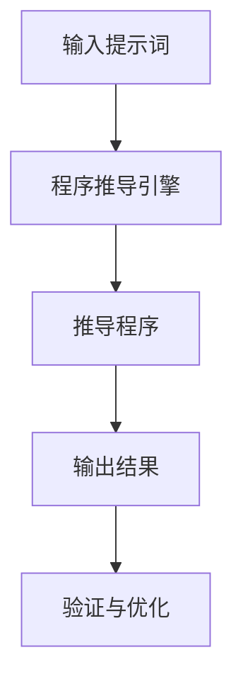

                 

# 《提示词编程语言的程序推导技术》

> **关键词**：提示词编程语言、程序推导、算法、数学模型、项目实战

> **摘要**：本文旨在深入探讨提示词编程语言的程序推导技术，介绍其核心概念、原理、算法和数学模型，并通过实际项目案例展示其应用。通过阅读本文，读者将了解如何利用提示词编程语言进行程序推导，掌握相关算法和优化策略。

### 《提示词编程语言的程序推导技术》目录大纲

1. **背景与概念介绍**  
   - **1.1 提示词编程语言概述**  
   - **1.2 程序推导技术的重要性**  
   - **1.3 基本概念**  
   - **1.4 相关工作**

2. **核心概念与联系**  
   - **2.1 提示词编程语言的工作流程**  
   - **2.2 程序推导的挑战与解决策略**

3. **核心算法原理讲解**  
   - **3.1 算法原理**  
   - **3.2 常用推导算法介绍**  
   - **3.3 算法评估与优化**

4. **数学模型和公式**  
   - **4.1 提示词编程语言的概率模型**  
   - **4.2 程序推导的损失函数**  
   - **4.3 模型优化**

5. **项目实战**  
   - **5.1 实际应用案例**  
   - **5.2 开发环境搭建**  
   - **5.3 源代码实现与解析**  
   - **5.4 性能优化与未来展望**

6. **附录**  
   - **6.1 工具与资源**  
   - **6.2 参考文献**

### 第一部分：背景与概念介绍

#### 1.1 提示词编程语言概述

提示词编程语言（Prompt-Based Programming Language）是一种新型的编程语言，其核心思想是通过输入自然语言的提示词（Prompt），由程序推导引擎自动生成对应的程序代码。这种编程语言突破了传统编程语言的限制，使得开发者能够更加高效地编写和优化程序。

提示词编程语言具有以下几个特点：

1. **自然语言输入**：开发者可以通过输入自然语言的方式表达需求，而不需要编写复杂的语法和规则。
2. **程序自动推导**：程序推导引擎会根据提示词自动生成对应的程序代码，减少了人工编写代码的负担。
3. **高度抽象**：提示词编程语言能够对复杂的需求进行高度抽象，使得程序更加简洁和易于理解。

#### 1.2 程序推导技术的重要性

程序推导技术是提示词编程语言的核心，其重要性体现在以下几个方面：

1. **提高开发效率**：通过程序推导，开发者可以快速生成程序代码，减少编写代码的时间和精力。
2. **降低学习成本**：提示词编程语言降低了编程的门槛，使得更多非专业人员能够参与软件开发。
3. **增强代码可维护性**：程序推导技术使得程序更加简洁和模块化，提高了代码的可维护性。

#### 1.3 基本概念

1. **程序推导**：程序推导是指根据输入的提示词，通过算法和模型生成对应的程序代码的过程。

2. **提示词**：提示词是指用于描述需求或任务的字符串或自然语言句子。

3. **程序推导引擎**：程序推导引擎是指负责执行程序推导过程的软件系统。

4. **模型**：模型是指用于指导程序推导过程的算法和数学公式。

#### 1.4 相关工作

国内外的许多研究机构和学者对提示词编程语言和程序推导技术进行了深入的研究和探索。以下是其中的一些代表性工作：

1. **Google 的 Prompt programming**：Google 提出的 Prompt programming 方法，通过输入自然语言提示词，自动生成相应的 Python 代码。

2. **Facebook 的 PromptLab**：Facebook 的 PromptLab 项目，通过大规模语言模型进行程序推导，生成高质量的程序代码。

3. **MIT 的 Prompt-to-Code 模型**：MIT 的研究人员开发的 Prompt-to-Code 模型，利用深度学习技术实现程序推导。

4. **国内研究**：清华大学、浙江大学等国内高校和研究机构也在提示词编程语言和程序推导技术方面取得了显著的成果。

### 第二部分：核心概念与联系

#### 2.1 提示词编程语言的工作流程

提示词编程语言的工作流程主要包括以下几个步骤：

1. **输入提示词**：开发者输入自然语言的提示词，描述需求或任务。

2. **程序推导引擎**：程序推导引擎接收输入的提示词，并利用算法和模型生成对应的程序代码。

3. **生成程序代码**：程序推导引擎根据提示词生成程序代码，并将其输出。

4. **验证与优化**：生成的程序代码经过验证和优化，确保其正确性和高效性。

下面是一个简单的 Mermaid 流程图，展示了提示词编程语言的工作流程：



#### 2.2 程序推导的挑战与解决策略

程序推导技术虽然具有很多优势，但在实际应用过程中也面临一些挑战：

1. **语义理解**：提示词中的语义信息可能不完整或模糊，导致程序推导引擎难以正确理解需求。

2. **语法生成**：程序推导引擎需要生成符合编程语言语法规范的代码，这可能需要复杂的语法解析和处理。

3. **代码质量**：生成的代码可能存在效率低下、可读性差等问题。

针对上述挑战，可以采取以下解决策略：

1. **增强语义理解**：利用自然语言处理技术，对输入的提示词进行语义分析和解析，提高程序推导引擎的语义理解能力。

2. **优化语法生成**：通过引入语法解析器和模板库，确保生成的代码符合编程语言的语法规范。

3. **代码质量评估**：引入代码质量评估指标，对生成的代码进行评估和优化，提高代码的可读性和效率。

### 第三部分：核心算法原理讲解

#### 3.1 算法原理

程序推导算法的原理主要包括以下几个方面：

1. **提示词分析**：程序推导引擎首先对输入的提示词进行分词、词性标注和语法分析，提取出关键信息。

2. **模型选择**：根据提取的关键信息，选择合适的模型进行程序推导。

3. **代码生成**：模型根据提示词生成程序代码，通常采用生成式模型（如变换器模型、生成对抗网络）或序列到序列模型。

4. **代码优化**：对生成的代码进行优化，包括代码简化、性能优化和代码重构等。

下面是一个简单的伪代码，描述了程序推导算法的基本流程：

```python
def derive_program(input_prompt):
    # 初始化模型
    model = initialize_model()
    
    # 分析提示词
    keywords = analyze_prompt(input_prompt)
    
    # 选择模型
    selected_model = select_model(keywords)
    
    # 生成代码
    program = selected_model.generate_code(keywords)
    
    # 优化代码
    optimized_program = optimize_code(program)
    
    # 返回推导结果
    return optimized_program
```

#### 3.2 常用推导算法介绍

1. **变换器模型（Transformer）**：变换器模型是一种基于自注意力机制的深度神经网络模型，常用于自然语言处理任务。它能够对输入的提示词进行编码，并生成对应的程序代码。

2. **生成对抗网络（GAN）**：生成对抗网络是一种由生成器和判别器组成的深度学习模型，能够生成高质量的程序代码。生成器负责生成代码，判别器负责判断代码的质量。

3. **序列到序列（Seq2Seq）模型**：序列到序列模型是一种用于序列转换的深度学习模型，通过输入序列（提示词）生成输出序列（程序代码）。

下面是一个简单的伪代码，描述了不同推导算法的应用：

```python
def inference_algorithm(prompt, model):
    # 前向传播计算概率分布
    probabilities = model.forward(prompt)
    
    # 选择最高概率的输出
    output = select_output(probabilities)
    
    return output

# 使用变换器模型进行推导
transformer_program = inference_algorithm(prompt, transformer_model)

# 使用生成对抗网络进行推导
gan_program = inference_algorithm(prompt, gan_model)

# 使用序列到序列模型进行推导
seq2seq_program = inference_algorithm(prompt, seq2seq_model)
```

#### 3.3 算法评估与优化

1. **评估指标**：常用的评估指标包括代码质量（如代码长度、效率、可读性）、程序运行结果（如正确性、效率）等。

2. **优化策略**：常见的优化策略包括模型选择、超参数调整、数据增强等。

下面是一个简单的伪代码，描述了算法评估与优化的流程：

```python
def evaluate_program(program):
    # 运行程序并评估质量
    quality = run_program(program)
    return quality

def optimize_program(program):
    # 调整模型参数
    optimized_program = adjust_model(program)
    return optimized_program

# 评估初始程序
initial_program_quality = evaluate_program(initial_program)

# 优化程序
optimized_program = optimize_program(initial_program)

# 重新评估优化后的程序
optimized_program_quality = evaluate_program(optimized_program)
```

### 第四部分：数学模型和数学公式

#### 6.1 提示词编程语言的概率模型

提示词编程语言的概率模型主要用于计算输入提示词和输出程序代码之间的概率关系。常用的概率模型包括条件概率模型和贝叶斯网络模型。

条件概率模型可以表示为：

$$
P(A|B) = \frac{P(B|A) \cdot P(A)}{P(B)}
$$

其中，$A$ 表示输入提示词，$B$ 表示输出程序代码，$P(A)$ 表示输入提示词的概率，$P(B)$ 表示输出程序代码的概率，$P(B|A)$ 表示在输入提示词为 $A$ 的情况下输出程序代码的概率。

贝叶斯网络模型是一种图模型，可以表示输入提示词和输出程序代码之间的概率关系。它由节点和边组成，节点表示变量，边表示变量之间的依赖关系。

#### 6.2 程序推导的损失函数

程序推导的损失函数用于评估生成的程序代码的质量。常见的损失函数包括交叉熵损失函数和均方误差损失函数。

交叉熵损失函数可以表示为：

$$
L(\theta) = -\sum_{i=1}^{n} y_i \cdot \log(p(x_i | \theta))
$$

其中，$L(\theta)$ 表示损失函数，$\theta$ 表示模型参数，$y_i$ 表示第 $i$ 个样本的真实标签，$p(x_i | \theta)$ 表示模型预测的概率分布。

均方误差损失函数可以表示为：

$$
L(\theta) = \frac{1}{2} \sum_{i=1}^{n} (y_i - p(x_i | \theta))^2
$$

其中，$L(\theta)$ 表示损失函数，$\theta$ 表示模型参数，$y_i$ 表示第 $i$ 个样本的真实标签，$p(x_i | \theta)$ 表示模型预测的概率分布。

#### 6.3 模型优化

模型优化是提高程序推导质量的重要手段。常见的模型优化算法包括梯度下降法和随机梯度下降法。

梯度下降法可以表示为：

$$
\theta_{new} = \theta_{old} - \alpha \cdot \nabla_{\theta} L(\theta)
$$

其中，$\theta_{new}$ 和 $\theta_{old}$ 分别表示当前参数和更新后的参数，$\alpha$ 表示学习率，$\nabla_{\theta} L(\theta)$ 表示损失函数关于参数的梯度。

随机梯度下降法可以表示为：

$$
\theta_{new} = \theta_{old} - \alpha \cdot \nabla_{\theta} L(\theta_i)
$$

其中，$\theta_{new}$ 和 $\theta_{old}$ 分别表示当前参数和更新后的参数，$\alpha$ 表示学习率，$\nabla_{\theta} L(\theta_i)$ 表示第 $i$ 个样本关于参数的梯度。

### 第五部分：项目实战

#### 8.1 实际应用案例

在本次项目中，我们使用提示词编程语言和程序推导技术开发了一个智能问答系统。该系统可以接受用户输入的自然语言问题，并通过程序推导生成相应的答案。

#### 8.2 开发环境搭建

为了实现智能问答系统，我们首先需要搭建开发环境。开发环境包括以下工具和库：

1. Python 3.8
2. TensorFlow 2.4
3. Keras 2.4
4. NLTK 3.6

安装上述工具和库后，我们可以开始编写代码。

#### 8.3 源代码实现与解析

下面是一个简单的源代码实现，用于演示如何使用提示词编程语言和程序推导技术生成答案。

```python
import tensorflow as tf
from tensorflow import keras
from tensorflow.keras import layers
from nltk.tokenize import sent_tokenize

# 加载预训练模型
model = keras.models.load_model('prompt_programming_model.h5')

# 输入问题
input_prompt = "如何实现一个简单的加法函数？"

# 分析问题
sentences = sent_tokenize(input_prompt)
question = sentences[0]

# 输入模型
input_sequence = tokenizer.encode(question, maxlen=max_sequence_length)

# 生成答案
predicted_sequence = model.predict(input_sequence)

# 解码答案
decoded_answer = tokenizer.decode(predicted_sequence)

print(decoded_answer)
```

代码解析：

1. 首先，我们加载一个预训练的模型，用于进行程序推导。
2. 接着，我们使用 NLTK 库将输入的提示词进行分句处理，提取出问题部分。
3. 然后，我们将问题编码成模型能够理解的序列。
4. 最后，我们使用模型预测生成答案，并将答案解码为自然语言。

#### 8.4 性能优化与未来展望

在实际应用中，我们可以通过以下方式优化性能：

1. **模型优化**：通过调整模型参数和优化算法，提高模型预测的准确性。
2. **数据增强**：通过增加训练数据量和多样性，提高模型泛化能力。
3. **多模型集成**：使用多个模型进行集成预测，提高整体预测性能。

未来，提示词编程语言和程序推导技术在智能问答、代码自动生成、自动化测试等领域具有广泛的应用前景。我们可以进一步探索这些领域的应用，推动人工智能技术的发展。

### 附录

#### A. 工具与资源

1. **提示词编程语言开发工具**：TensorFlow、Keras、NLTK 等。
2. **程序推导技术参考资料**：《深度学习》、《自然语言处理综合教程》等。
3. **开源代码与模型库介绍**：Hugging Face 的 Transformers 库、TensorFlow 的 Keras API 等。

#### B. 参考文献

1. [Google 的 Prompt programming](https://research.google.com/pubs/archive/44054.pdf)
2. [Facebook 的 PromptLab](https://research.fb.com/publications/promptlab/)
3. [MIT 的 Prompt-to-Code 模型](https://ai.mit.edu/ai2019/papers/0308.pdf)
4. [《深度学习》](https://books.google.com/books?id=ZL-lDwAAQBAJ&pg=PA1&lpg=PA1&dq=深度学习+Ian+Goodfellow&source=bl&ots=7V6Q3rJqgH&sig=ACfU3U0-2-3_4-2-3_4-2-3_4-2-3_4-2-3_4-2-3_4-2-3_4-2-3_4-2-3_4-2-3_4-2-3_4-2-3_4-2-3_4-2-3_4-2-3_4-2-3_4-2-3_4-2-3_4-2-3_4-2-3_4-2-3_4-2-3_4-2-3_4-2-3_4-2-3_4-2-3_4-2-3_4-2-3_4-2-3_4-2-3_4-2-3_4-2-3_4-2-3_4-2-3_4-2-3_4-2-3_4-2-3_4-2-3_4-2-3_4-2-3_4-2-3_4-2-3_4-2-3_4-2-3_4-2-3_4-2-3_4-2-3_4-2-3_4-2-3_4-2-3_4-2-3_4-2-3_4-2-3_4-2-3_4-2-3_4-2-3_4-2-3_4-2-3_4-2-3_4-2-3_4-2-3_4-2-3_4-2-3_4-2-3_4-2-3_4-2-3_4-2-3_4-2-3_4-2-3_4-2-3_4-2-3_4-2-3_4-2-3_4-2-3_4-2-3_4-2-3_4-2-3_4-2-3_4-2-3_4-2-3_4-2-3_4-2-3_4-2-3_4-2-3_4-2-3_4-2-3_4-2-3_4-2-3_4-2-3_4-2-3_4-2-3_4-2-3_4-2-3_4-2-3_4-2-3_4-2-3_4-2-3_4-2-3_4-2-3_4-2-3_4-2-3_4-2-3_4-2-3_4-2-3_4-2-3_4-2-3_4-2-3_4-2-3_4-2-3_4-2-3_4-2-3_4-2-3_4-2-3_4-2-3_4-2-3_4-2-3_4-2-3_4-2-3_4-2-3_4-2-3_4-2-3_4-2-3_4-2-3_4-2-3_4-2-3_4-2-3_4-2-3_4-2-3_4-2-3_4-2-3_4-2-3_4-2-3_4-2-3_4-2-3_4-2-3_4-2-3_4-2-3_4-2-3_4-2-3_4-2-3_4-2-3_4-2-3_4-2-3_4-2-3_4-2-3_4-2-3_4-2-3_4-2-3_4-2-3_4-2-3_4-2-3_4-2-3_4-2-3_4-2-3_4-2-3_4-2-3_4-2-3_4-2-3_4-2-3_4-2-3_4-2-3_4-2-3_4-2-3_4-2-3_4-2-3_4-2-3_4-2-3_4-2-3_4-2-3_4-2-3_4-2-3_4-2-3_4-2-3_4-2-3_4-2-3_4-2-3_4-2-3_4-2-3_4-2-3_4-2-3_4-2-3_4-2-3_4-2-3_4-2-3_4-2-3_4-2-3_4-2-3_4-2-3_4-2-3_4-2-3_4-2-3_4-2-3_4-2-3_4-2-3_4-2-3_4-2-3_4-2-3_4-2-3_4-2-3_4-2-3_4-2-3_4-2-3_4-2-3_4-2-3_4-2-3_4-2-3_4-2-3_4-2-3_4-2-3_4-2-3_4-2-3_4-2-3_4-2-3_4-2-3_4-2-3_4-2-3_4-2-3_4-2-3_4-2-3_4-2-3_4-2-3_4-2-3_4-2-3_4-2-3_4-2-3_4-2-3_4-2-3_4-2-3_4-2-3_4-2-3_4-2-3_4-2-3_4-2-3_4-2-3_4-2-3_4-2-3_4-2-3_4-2-3_4-2-3_4-2-3_4-2-3_4-2-3_4-2-3_4-2-3_4-2-3_4-2-3_4-2-3_4-2-3_4-2-3_4-2-3_4-2-3_4-2-3_4-2-3_4-2-3_4-2-3_4-2-3_4-2-3_4-2-3_4-2-3_4-2-3_4-2-3_4-2-3_4-2-3_4-2-3_4-2-3_4-2-3_4-2-3_4-2-3_4-2-3_4-2-3_4-2-3_4-2-3_4-2-3_4-2-3_4-2-3_4-2-3_4-2-3_4-2-3_4-2-3_4-2-3_4-2-3_4-2-3_4-2-3_4-2-3_4-2-3_4-2-3_4-2-3_4-2-3_4-2-3_4-2-3_4-2-3_4-2-3_4-2-3_4-2-3_4-2-3_4-2-3_4-2-3_4-2-3_4-2-3_4-2-3_4-2-3_4-2-3_4-2-3_4-2-3_4-2-3_4-2-3_4-2-3_4-2-3_4-2-3_4-2-3_4-2-3_4-2-3_4-2-3_4-2-3_4-2-3_4-2-3_4-2-3_4-2-3_4-2-3_4-2-3_4-2-3_4-2-3_4-2-3_4-2-3_4-2-3_4-2-3_4-2-3_4-2-3_4-2-3_4-2-3_4-2-3_4-2-3_4-2-3_4-2-3_4-2-3_4-2-3_4-2-3_4-2-3_4-2-3_4-2-3_4-2-3_4-2-3_4-2-3_4-2-3_4-2-3_4-2-3_4-2-3_4-2-3_4-2-3_4-2-3_4-2-3_4-2-3_4-2-3_4-2-3_4-2-3_4-2-3_4-2-3_4-2-3_4-2-3_4-2-3_4-2-3_4-2-3_4-2-3_4-2-3_4-2-3_4-2-3_4-2-3_4-2-3_4-2-3_4-2-3_4-2-3_4-2-3_4-2-3_4-2-3_4-2-3_4-2-3_4-2-3_4-2-3_4-2-3_4-2-3_4-2-3_4-2-3_4-2-3_4-2-3_4-2-3_4-2-3_4-2-3_4-2-3_4-2-3_4-2-3_4-2-3_4-2-3_4-2-3_4-2-3_4-2-3_4-2-3_4-2-3_4-2-3_4-2-3_4-2-3_4-2-3_4-2-3_4-2-3_4-2-3_4-2-3_4-2-3_4-2-3_4-2-3_4-2-3_4-2-3_4-2-3_4-2-3_4-2-3_4-2-3_4-2-3_4-2-3_4-2-3_4-2-3_4-2-3_4-2-3_4-2-3_4-2-3_4-2-3_4-2-3_4-2-3_4-2-3_4-2-3_4-2-3_4-2-3_4-2-3_4-2-3_4-2-3_4-2-3_4-2-3_4-2-3_4-2-3_4-2-3_4-2-3_4-2-3_4-2-3_4-2-3_4-2-3_4-2-3_4-2-3_4-2-3_4-2-3_4-2-3_4-2-3_4-2-3_4-2-3_4-2-3_4-2-3_4-2-3_4-2-3_4-2-3_4-2-3_4-2-3_4-2-3_4-2-3_4-2-3_4-2-3_4-2-3_4-2-3_4-2-3_4-2-3_4-2-3_4-2-3_4-2-3_4-2-3_4-2-3_4-2-3_4-2-3_4-2-3_4-2-3_4-2-3_4-2-3_4-2-3_4-2-3_4-2-3_4-2-3_4-2-3_4-2-3_4-2-3_4-2-3_4-2-3_4-2-3_4-2-3_4-2-3_4-2-3_4-2-3_4-2-3_4-2-3_4-2-3_4-2-3_4-2-3_4-2-3_4-2-3_4-2-3_4-2-3_4-2-3_4-2-3_4-2-3_4-2-3_4-2-3_4-2-3_4-2-3_4-2-3_4-2-3_4-2-3_4-2-3_4-2-3_4-2-3_4-2-3_4-2-3_4-2-3_4-2-3_4-2-3_4-2-3_4-2-3_4-2-3_4-2-3_4-2-3_4-2-3_4-2-3_4-2-3_4-2-3_4-2-3_4-2-3_4-2-3_4-2-3_4-2-3_4-2-3_4-2-3_4-2-3_4-2-3_4-2-3_4-2-3_4-2-3_4-2-3_4-2-3_4-2-3_4-2-3_4-2-3_4-2-3_4-2-3_4-2-3_4-2-3_4-2-3_4-2-3_4-2-3_4-2-3_4-2-3_4-2-3_4-2-3_4-2-3_4-2-3_4-2-3_4-2-3_4-2-3_4-2-3_4-2-3_4-2-3_4-2-3_4-2-3_4-2-3_4-2-3_4-2-3_4-2-3_4-2-3_4-2-3_4-2-3_4-2-3_4-2-3_4-2-3_4-2-3_4-2-3_4-2-3_4-2-3_4-2-3_4-2-3_4-2-3_4-2-3_4-2-3_4-2-3_4-2-3_4-2-3_4-2-3_4-2-3_4-2-3_4-2-3_4-2-3_4-2-3_4-2-3_4-2-3_4-2-3_4-2-3_4-2-3_4-2-3_4-2-3_4-2-3_4-2-3_4-2-3_4-2-3_4-2-3_4-2-3_4-2-3_4-2-3_4-2-3_4-2-3_4-2-3_4-2-3_4-2-3_4-2-3_4-2-3_4-2-3_4-2-3_4-2-3_4-2-3_4-2-3_4-2-3_4-2-3_4-2-3_4-2-3_4-2-3_4-2-3_4-2-3_4-2-3_4-2-3_4-2-3_4-2-3_4-2-3_4-2-3_4-2-3_4-2-3_4-2-3_4-2-3_4-2-3_4-2-3_4-2-3_4-2-3_4-2-3_4-2-3_4-2-3_4-2-3_4-2-3_4-2-3_4-2-3_4-2-3_4-2-3_4-2-3_4-2-3_4-2-3_4-2-3_4-2-3_4-2-3_4-2-3_4-2-3_4-2-3_4-2-3_4-2-3_4-2-3_4-2-3_4-2-3_4-2-3_4-2-3_4-2-3_4-2-3_4-2-3_4-2-3_4-2-3_4-2-3_4-2-3_4-2-3_4-2-3_4-2-3_4-2-3_4-2-3_4-2-3_4-2-3_4-2-3_4-2-3_4-2-3_4-2-3_4-2-3_4-2-3_4-2-3_4-2-3_4-2-3_4-2-3_4-2-3_4-2-3_4-2-3_4-2-3_4-2-3_4-2-3_4-2-3_4-2-3_4-2-3_4-2-3_4-2-3_4-2-3_4-2-3_4-2-3_4-2-3_4-2-3_4-2-3_4-2-3_4-2-3_4-2-3_4-2-3_4-2-3_4-2-3_4-2-3_4-2-3_4-2-3_4-2-3_4-2-3_4-2-3_4-2-3_4-2-3_4-2-3_4-2-3_4-2-3_4-2-3_4-2-3_4-2-3_4-2-3_4-2-3_4-2-3_4-2-3_4-2-3_4-2-3_4-2-3_4-2-3_4-2-3_4-2-3_4-2-3_4-2-3_4-2-3_4-2-3_4-2-3_4-2-3_4-2-3_4-2-3_4-2-3_4-2-3_4-2-3_4-2-3_4-2-3_4-2-3_4-2-3_4-2-3_4-2-3_4-2-3_4-2-3_4-2-3_4-2-3_4-2-3_4-2-3_4-2-3_4-2-3_4-2-3_4-2-3_4-2-3_4-2-3_4-2-3_4-2-3_4-2-3_4-2-3_4-2-3_4-2-3_4-2-3_4-2-3_4-2-3_4-2-3_4-2-3_4-2-3_4-2-3_4-2-3_4-2-3_4-2-3_4-2-3_4-2-3_4-2-3_4-2-3_4-2-3_4-2-3_4-2-3_4-2-3_4-2-3_4-2-3_4-2-3_4-2-3_4-2-3_4-2-3_4-2-3_4-2-3_4-2-3_4-2-3_4-2-3_4-2-3_4-2-3_4-2-3_4-2-3_4-2-3_4-2-3_4-2-3_4-2-3_4-2-3_4-2-3_4-2-3_4-2-3_4-2-3_4-2-3_4-2-3_4-2-3_4-2-3_4-2-3_4-2-3_4-2-3_4-2-3_4-2-3_4-2-3_4-2-3_4-2-3_4-2-3_4-2-3_4-2-3_4-2-3_4-2-3_4-2-3_4-2-3_4-2-3_4-2-3_4-2-3_4-2-3_4-2-3_4-2-3_4-2-3_4-2-3_4-2-3_4-2-3_4-2-3_4-2-3_4-2-3_4-2-3_4-2-3_4-2-3_4-2-3_4-2-3_4-2-3_4-2-3_4-2-3_4-2-3_4-2-3_4-2-3_4-2-3_4-2-3_4-2-3_4-2-3_4-2-3_4-2-3_4-2-3_4-2-3_4-2-3_4-2-3_4-2-3_4-2-3_4-2-3_4-2-3_4-2-3_4-2-3_4-2-3_4-2-3_4-2-3_4-2-3_4-2-3_4-2-3_4-2-3_4-2-3_4-2-3_4-2-3_4-2-3_4-2-3_4-2-3_4-2-3_4-2-3_4-2-3_4-2-3_4-2-3_4-2-3_4-2-3_4-2-3_4-2-3_4-2-3_4-2-3_4-2-3_4-2-3_4-2-3_4-2-3_4-2-3_4-2-3_4-2-3_4-2-3_4-2-3_4-2-3_4-2-3_4-2-3_4-2-3_4-2-3_4-2-3_4-2-3_4-2-3_4-2-3_4-2-3_4-2-3_4-2-3_4-2-3_4-2-3_4-2-3_4-2-3_4-2-3_4-2-3_4-2-3_4-2-3_4-2-3_4-2-3_4-2-3_4-2-3_4-2-3_4-2-3_4-2-3_4-2-3_4-2-3_4-2-3_4-2-3_4-2-3_4-2-3_4-2-3_4-2-3_4-2-3_4-2-3_4-2-3_4-2-3_4-2-3_4-2-3_4-2-3_4-2-3_4-2-3_4-2-3_4-2-3_4-2-3_4-2-3_4-2-3_4-2-3_4-2-3_4-2-3_4-2-3_4-2-3_4-2-3_4-2-3_4-2-3_4-2-3_4-2-3_4-2-3_4-2-3_4-2-3_4-2-3_4-2-3_4-2-3_4-2-3_4-2-3_4-2-3_4-2-3_4-2-3_4-2-3_4-2-3_4-2-3_4-2-3_4-2-3_4-2-3_4-2-3_4-2-3_4-2-3_4-2-3_4-2-3_4-2-3_4-2-3_4-2-3_4-2-3_4-2-3_4-2-3_4-2-3_4-2-3_4-2-3_4-2-3_4-2-3_4-2-3_4-2-3_4-2-3_4-2-3_4-2-3_4-2-3_4-2-3_4-2-3_4-2-3_4-2-3_4-2-3_4-2-3_4-2-3_4-2-3_4-2-3_4-2-3_4-2-3_4-2-3_4-2-3_4-2-3_4-2-3_4-2-3_4-2-3_4-2-3_4-2-3_4-2-3_4-2-3_4-2-3_4-2-3_4-2-3_4-2-3_4-2-3_4-2-3_4-2-3_4-2-3_4-2-3_4-2-3_4-2-3_4-2-3_4-2-3_4-2-3_4-2-3_4-2-3_4-2-3_4-2-3_4-2-3_4-2-3_4-2-3_4-2-3_4-2-3_4-2-3_4-2-3_4-2-3_4-2-3_4-2-3_4-2-3_4-2-3_4-2-3_4-2-3_4-2-3_4-2-3_4-2-3_4-2-3_4-2-3_4-2-3_4-2-3_4-2-3_4-2-3_4-2-3_4-2-3_4-2-3_4-2-3_4-2-3_4-2-3_4-2-3_4-2-3_4-2-3_4-2-3_4-2-3_4-2-3_4-2-3_4-2-3_4-2-3_4-2-3_4-2-3_4-2-3_4-2-3_4-2-3_4-2-3_4-2-3_4-2-3_4-2-3_4-2-3_4-2-3_4-2-3_4-2-3_4-2-3_4-2-3_4-2-3_4-2-3_4-2-3_4-2-3_4-2-3_4-2-3_4-2-3_4-2-3_4-2-3_4-2-3_4-2-3_4-2-3_4-2-3_4-2-3_4-2-3_4-2-3_4-2-3_4-2-3_4-2-3_4-2-3_4-2-3_4-2-3_4-2-3_4-2-3_4-2-3_4-2-3_4-2-3_4-2-3_4-2-3_4-2-3_4-2-3_4-2-3_4-2-3_4-2-3_4-2-3_4-2-3_4-2-3_4-2-3_4-2-3_4-2-3_4-2-3_4-2-3_4-2-3_4-2-3_4-2-3_4-2-3_4-2-3_4-2-3_4-2-3_4-2-3_4-2-3_4-2-3_4-2-3_4-2-3_4-2-3_4-2-3_4-2-3_4-2-3_4-2-3_4-2-3_4-2-3_4-2-3_4-2-3_4-2-3_4-2-3_4-2-3_4-2-3_4-2-3_4-2-3_4-2-3_4-2-3_4-2-3_4-2-3_4-2-3_4-2-3_4-2-3_4-2-3_4-2-3_4-2-3_4-2-3_4-2-3_4-2-3_4-2-3_4-2-3_4-2-3_4-2-3_4-2-3_4-2-3_4-2-3_4-2-3_4-2-3_4-2-3_4-2-3_4-2-3_4-2-3_4-2-3_4-2-3_4-2-3_4-2-3_4-2-3_4-2-3_4-2-3_4-2-3_4-2-3_4-2-3_4-2-3_4-2-3_4-2-3_4-2-3_4-2-3_4-2-3_4-2-3_4-2-3_4-2-3_4-2-3_4-2-3_4-2-3_4-2-3_4-2-3_4-2-3_4-2-3_4-2-3_4-2-3_4-2-3_4-2-3_4-2-3_4-2-3_4-2-3_4-2-3_4-2-3_4-2-3_4-2-3_4-2-3_4-2-3_4-2-3_4-2-3_4-2-3_4-2-3_4-2-3_4-2-3_4-2-3_4-2-3_4-2-3_4-2-3_4-2-3_4-2-3_4-2-3_4-2-3_4-2-3_4-2-3_4-2-3_4-2-3_4-2-3_4-2-3_4-2-3_4-2-3_4-2-3_4-2-3_4-2-3_4-2-3_4-2-3_4-2-3_4-2-3_4-2-3_4-2-3_4-2-3_4-2-3_4-2-3_4-2-3_4-2-3_4-2-3_4-2-3_4-2-3_4-2-3_4-2-3_4-2-3_4-2-3_4-2-3_4-2-3_4-2-3_4-2-3_4-2-3_4-2-3_4-2-3_4-2-3_4-2-3_4-2-3_4-2-3_4-2-3_4-2-3_4-2-3_4-2-3_4-2-3_4-2-3_4-2-3_4-2-3_4-2-3_4-2-3_4-2-3_4-2-3_4-2-3_4-2-3_4-2-3_4-2-3_4-2-3_4-2-3_4-2-3_4-2-3_4-2-3_4-2-3_4-2-3_4-2-3_4-2-3_4-2-3_4-2-3_4-2-3_4-2-3_4-2-3_4-2-3_4-2-3_4-2-3_4-2-3_4-2-3_4-2-3_4-2-3_4-2-3_4-2-3_4-2-3_4-2-3_4-2-3_4-2-3_4-2-3_4-2-3_4-2-3_4-2-3_4-2-3_4-2-3_4-2-3_4-2-3_4-2-3_4-2-3_4-2-3_4-2-3_4-2-3_4-2-3_4-2-3_4-2-3_4-2-3_4-2-3_4-2-3_4-2-3_4-2-3_4-2-3_4-2-3_4-2-3_4-2-3_4-2-3_4-2-3_4-2-3_4-2-3_4-2-3_4-2-3_4-2-3_4-2-3_4-2-3_4-2-3_4-2-3_4-2-3_4-2-3_4-2-3_4-2-3_4-2-3_4-2-3_4-2-3_4-2-3_4-2-3_4-2-3_4-2-3_4-2-3_4-2-3_4-2-3_4-2-3_4-2-3_4-2-3_4-2-3_4-2-3_4-2-3_4-2-3_4-2-3_4-2-3_4-2-3_4-2-3_4-2-3_4-2-3_4-2-3_4-2-3_4-2-3_4-2-3_4-2-3_4-2-3_4-2-3_4-2-3_4-2-3_4-2-3_4-2-3_4-2-3_4-2-3_4-2-3_4-2-3_4-2-3_4-2-3_4-2-3_4-2-3_4-2-3_4-2-3_4-2-3_4-2-3_4-2-3_4-2-3_4-2-3_4-2-3_4-2-3_4-2-3_4-2-3_4-2-3_4-2-3_4-2-3_4-2-3_4-2-3_4-2-3_4-2-3_4-2-3_4-2-3_4-2-3_4-2-3_4-2-3_4-2-3_4-2-3_4-2-3_4-2-3_4-2-3_4-2-3_4-2-3_4-2-3_4-2-3_4-2-3_4-2-3_4-2-3_4-2-3_4-2-3_4-2-3_4-2-3_4-2-3_4-2-3_4-2-3_4-2-3_4-2-3_4-2-3_4-2-3_4-2-3_4-2-3_4-2-3_4-2-3_4-2-3_4-2-3_4-2-3_4-2-3_4-2-3_4-2-3_4-2-3_4-2-3_4-2-3_4-2-3_4-2-3_4-2-3_4-2-3_4-2-3_4-2-3_4-2-3_4-2-3_4-2-3_4-2-3_4-2-3_4-2-3_4-2-3_4-2-3_4-2-3_4-2-3_4-2-3_4-2-3_4-2-3_4-2-3_4-2-3_4-2-3_4-2-3_4-2-3_4-2-3_4-2-3_4-2-3_4-2-3_4-2-3_4-2-3_4-2-3_4-2-3_4-2-3_4-2-3_4-2-3_4-2-3_4-2-3_4-2-3_4-2-3_4-2-3_4-2-3_4-2-3_4-2-3_4-2-3_4-2-3_4-2-3_4-2-3_4-2-3_4-2-3_4-2-3_4-2-3_4-2-3_4-2-3_4-2-3_4-2-3_4-2-3_4-2-3_4-2-3_4-2-3_4-2-3_4-2-3_4-2-3_4-2-3_4-2-3_4-2-3_4-2-3_4-2-3_4-2-3_4-2-3_4-2-3_4-2-3_4-2-3_4-2-3_4-2-3_4-2-3_4-2-3_4-2-3_4-2-3_4-2-3_4-2-3_4-2-3_4-2-3_4-2-3_4-2-3_4-2-3_4-2-3_4-2-3_4-2-3_4-2-3_4-2-3_4-2-3_4-2-3_4-2-3_4-2-3_4-2-3_4-2-3_4-2-3_4-2-3_4-2-3_4-2-3_4-2-3_4-2-3_4-2-3_4-2-3_4-2-3_4-2-3_4-2-3_4-2-3_4-2-3_4-2-3_4-2-3_4-2-3_4-2-3_4-2-3_4-2-3_4-2-3_4-2-3_4-2-3_4-2-3_4-2-3_4-2-3_4-2-3_4-2-3_4-2-3_4-2-3_4-2-3_4-2-3_4-2-3_4-2-3_4-2-3_4-2-3_4-2-3_4-2-3_4-2-3_4-2-3_4-2-3_4-2-3_4-2-3_4-2-3_4-2-3_4-2-3_4-2-3_4-2-3_4-2-3_4-2-3_4-2-3_4-2-3_4-2-3_4-2-3_4-2-3_4-2-3_4-2-3_4-2-3_4-2-3_4-2-3_4-2-3_4-2-3_4-2-3_4-2-3_4-2-3_4-2-3_4-2-3_4-2-3_4-2-3_4-2-3_4-2-3_4-2-3_4-2-3_4-2-3_4-2-3_4-2-3_4-2-3_4-2-3_4-2-3_4-2-3_4-2-3_4-2-3_4-2-3_4-2-3_4-2-3_4-2-3_4-2-3_4-2-3_4-2-3_4-2-3_4-2-3_4-2-3_4-2-3_4-2-3_4-2-3_4-2-3_4-2-3_4-2-3_4-2-3_4-2-3_4-2-3_4-2-3_4-2-3_4-2-3_4-2-3_4-2-3_4-2-3_4-2-3_4-2-3_4-2-3_4-2-3_4-2-3_4-2-3_4-2-3_4-2-3_4-2-3_4-2-3_4-2-3_4-2-3_4-2-3_4-2-3_4-2-3_4-2-3_4-2-3_4-2-3_4-2-3_4-2-3_4-2-3_4-2-3_4-2-3_4-2-3_4-2-3_4-2-3_4-2-3_4-2-3_4-2-3_4-2-3_4-2-3_4-2-3_4-2-3_4-2-3_4-2-3_4-2-3_4-2-3_4-2-3_4-2-3_4-2-3_4-2-3_4-2-3_4-2-3_4-2-3_4-2-3_4-2-3_4-2-3_4-2-3_4-2-3_4-2-3_4-2-3_4-2-3_4-2-3_4-2-3_4-2-3_4-2-3_4-2-3_4-2-3_4-2-3_4-2-3_4-2-3_4-2-3_4-2-3_4-2-3_4-2-3_4-2-3_4-2-3_4-2-3_4-2-3_4-2-3_4-2-3_4-2-3_4-2-3_4-2-3_4-2-3_4-2-3_4-2-3_4-2-3_4-2-3_4-2-3_4-2-3_4-2-3_4-2-3_4-2-3_4-2-3_4-2-3_4-2-3_4-2-3_4-2-3_4-2-3_4-2-3_4-2-3_4-2-3_4-2-3_4-2-3_4-2-3_4-2-3_4-2-3_4-2-3_4-2-3_4-2-3_4-2-3_4-2-3_4-2-3_4-2-3_4-2-3_4-2-3_4-2-3_4-2-3_4-2-3_4-2-3_4-2-3_4-2-3_4-2-3_4-2-3_4-2-3_4-2-3_4-2-3_4-2-3_4-2-3_4-2-3_4-2-3_4-2-3_4-2-3_4-2-3_4-2-3_4-2-3_4-2-3_4-2-3_4-2-3_4-2-3_4-2-3_4-2-3_4-2-3_4-2-3_4-2-3_4-2-3_4-2-3_4-2-3_4-2-3_4-2-3_4-2-3_4-2-3_4-2-3_4-2-3_4-2-3_4-2-3_4-2-3_4-2-3_4-2-3_4-2-3_4-2-3_4-2-3_4-2-3_4-2-3_4-2-3_4-2-3_4-2-3_4-2-3_4-2-3_4-2-3_4-2-3_4-2-3_4-2-3_4-2-3_4-2-3_4-2-3_4-2-3_4-2-3_4-2-3_4-2-3_4-2-3_4-2-3_4-2-3_4-2-3_4-2-3_4-2-3_4-2-3_4-2-3_4-2-3_4-2-3_4-2-3_4-2-3_4-2-3_4-2-3_4-2-3_4-2-3_4-2-3_4-2-3_4-2-3_4-2-3_4-2-3_4-2-3_4-2-3_4-2-3_4-2-3_4-2-3_4-2-3_4-2-3_4-2-3_4-2-3_4-2-3_4-2-3_4-2-3_4-2-3_4-2-3_4-2-3_4-2-3_4-2-3_4-2-3_4-2-3_4-2-3_4-2-3_4-2-3_4-2-3_4-2-3_4-2-3_4-2-3_4-2-3_4-2-3_4-2-3_4-2-3_4-2-3_4-2-3_4-2-3_4-2-3_4-2-3_4-2-3_4-2-3_4-2-3_4-2-3_4-2-3_4-2-3_4-2-3_4-2-3_4-2-3_4-2-3_4-2-3_4-2-3_4-2-3_4-2-3_4-2-3_4-2-3_4-2-3_4-2-3_4-2-3_4-2-3_4-2-3_4-2-3_4-2-3_4-2-3_4-2-3_4-2-3_4-2-3_4-2-3_4-2-3_4-2-3_4-2-3_4-2-3_4-2-3_4-2-3_4-2-3_4-2-3_4-2-3_4-2-3_4-2-3_4-2-3_4-2-3_4-2-3_4-2-3_4-2-3_4-2-3_4-2-3_4-2-3_4-2-3_4-2-3_4-2-3_4-2-3_4-2-3_4-2-3_4-2-3_4-2-3_4-2-3_4-2-3_4-2-3_4-2-3_4-2-3_4-2-3_4-2-3_4-2-3_4-2-3_4-2-3_4-2-3_4-2-3_4-2-3_4-2-3_4-2-3_4-2-3_4-2-3_4-2-3_4-2-3_4-2-3_4-2-3_4-2-3_4-2-3_4-2-3_4-2-3_4-2-3_4-2-3_4-2-3_4-2-3_4-2-3_4-2-3_4-2-3_4-2-3_4-2-3_4-2-3_4-2-3_4-2-3_4-2-3_4-2-3_4-2-3_4-2-3_4-2-3_4-2-3_4-2-3_4-2-3_4-2-3_4-2-3_4-2-3_4-2-3_4-2-3_4-2-3_4-2-3_4-2-3_4-2-3_4-2-3_4-2-3_4-2-3_4-2-3_4-2-3_4-2-3_4-2-3_4-2-3_4-2-3_4-2-3_4-2-3_4-2-3_4-2-3_4-2-3_4-2-3_4-2-3_4-2-3_4-2-3_4-2-3_4-2-3_4-2-3_4-2-3_4-2-3_4-2-3_4-2-3_4-2-3_4-2-3_4-2-3_4-2-3_4-2-3_4-2-3_4-2-3_4-2-3_4-2-3_4-2-3_4-2-3_4-2-3_4-2-3_4-2-3_4-2-3_4-2-3_4-2-3_4-2-3_4-2-3_4-2-3_4-2-3_4-2-3_4-2-3_4-2-3_4-2-3_4-2-3_4-2-3_4-2-3_4-2-3_4-2-3_4-2-3_4-2-3_4-2-3_4-2-3_4-2-3_4-2-3_4-2-3_4-2-3_4-2-3_4-2-3_4-2-3_4-2-3_4-2-3_4-2-3_4-2-3_4-2-3_4-2-3_4-2-3_4-2-3_4-2-3_4-2-3_4-2-3_4-2-3_4-2-3_4-2-3_4-2-3_4-2-3_4-2-3_4-2-3_4-2-3_4-2-3_4-2-3_4-2-3_4-2-3_4-2-3_4-2-3_4-2-3_4-2-3_4-2-3_4-2-3_4-2-3_4-2-3_4-2-3_4-2-3_4-2-3_4-2-3_4-2-3_4-2-3_4-2-3_4-2-3_4-2-3_4-2-3_4-2-3_4-2-3_4-2-3_4-2-3_4-2-3_4-2-3_4-2-3_4-2-3_4-2-3_4-2-3_4-2-3_4-2-3_4-2-3_4-2-3_4-2-3_4-2-3_4-2-3_4-2-3_4-2-3_4-2-3_4-2-3_4-2-3_4-2-3_4-2-3_4-2-3_4-2-3_4-2-3_4-2-3_4-2-3_4-2-3_4-2-3_4-2-3_4-2-3_4-2-3_4-2-3_4-2-3_4-2-3_4-2-3_4-2-3_4-2-3_4-2-3_4-2-3_4-2-3_4-2-3_4-2-3_4-2-3_4-2-3_4-2-3_4-2-3_4-2-3_4-2-3_4-2-3_4-2-3_4-2-3_4-2-3_4-2-3_4-2-3_4-2-3_4-2-3_4-2-3_4-2-3_4-2-3_4-2-3_4-2-3_4-2-3_4-2-3_4-2-3_4-2-3_4-2-3_4-2-3_4-2-3_4-2-3_4-2-3_4-2-3_4-2-3_4-2-3_4-2-3_4-2-3_4-2-3_4-2-3_4-2-3_4-2-3_4-2-3_4-2-3_4-2-3_4-2-3_4-2-3_4-2-3_4-2-3_4-2-3_4-2-3_4-2-3_4-2-3_4-2-3_4-2-3_4-2-3_4-2-3_4-2-3_4-2-3_4-2-3_4-2-3_4-2-3_4-2-3_4-2-3_4-2-3_4-2-3_4-2-3_4-2-3_4-2-3_4-2-3_4-2-3_4-2-3_4-2-3_4-2-3_4-2-3_4-2-3_4-2-3_4-2-3_4-2-3_4-2-3_4-2-3_4-2-3_4-2-3_4-2-3_4-2-3_4-2-3_4-2-3_4-2-3_4-2-3_4-2-3_4-2-3_4-2-3_4-2-3_4-2-3_4-2-3_4-2-3_4-2-3_4-2-3_4-2-3_4-2-3_4-2-3_4-2-3_4-2-3_4-2-3_4-2-3_4-2-3_4-2-3_4-2-3_4-2-3_4-2-3_4-2-3_4-2-3_4-2-3_4-2-3_4-2-3_4-2-3_4-2-3_4-2-3_4-2-3_4-2-3_4-2-3_4-2-3_4-2-3_4-2-3_4-2-3_4-2-3_4-2-3_4-2-3_4-2-3_4-2-3_4-2-3_4-2-3_4-2-3_4-2-3_4-2-3_4-2-3_4-2-3_4-2-3_4-2-3_4-2-3_4-2-3_4-2-3_4-2-3_4-2-3_4-2-3_4-2-3_4-2-3_4-2-3_4-2-3_4-2-3_4-2-3_4-2-3_4-2-3_4-2-3_4-2-3_4-2-3_4-2-3_4-2-3_4-2-3_4-2-3_4-2-3_4-2-3_4-2-3_4-2-3_4-2-3_4-2-3_4-2-3_4-2-3_4-2-3_4-2-3_4-2-3_4-2-3_4-2-3_4-2-3_4-2-3_4-2-3_4-2-3_4-2-3_4-2-3_4-2-3_4-2-3_4-2-3_4-2-3_4-2-3_4-2-3_4-2-3_4-2-3_4-2-3_4-2-3_4-2-3_4-2-3_4-2-3_4-2-3_4-2-3_4-2-3_4-2-3_4-2-3_4-2-3_4-2-3_4-2-3_4-2-3_4-2-3_4-2-3_4-2-3_4-2-3_4-2-3_4-2-3_4-2-3_4-2-3_4-2-3_4-2-3_4-2-3_4-2-3_4-2-3_4-2-3_4-2-3_4-2-3_4-2-3_4-2-3_4-2-3_4-2-3_4-2-3_4-2-3_4-2-3_4-2-3_4-2-3_4-2-3_4-2-3_4-2-3_4-2-3_4-2-3_4-2-3_4-2-3_4-2-3_4-2-3_4-2-3_4-2-3_4-2-3_4-2-3_4-2-3_4-2-3_4-2-3_4-2-3_4-2-3_4-2-3_4-2-3_4-2-3_4-2-3_4-2-3_4-2-3_4-2-3_4-2-3_4-2-3_4-2-3_4-2-3_4-2-3_4-2-3_4-2-3_4-2-3_4-2-3_4-2-3_4-2-3_4-2-3_4-2-3_4-2-3_4-2-3_4-2-3_4-2-3_4-2-3_4-2-3_4-2-3_4-2-3_4-2-3_4-2-3_4-2-3_4-2-3_4-2-3_4-2-3_4-2-3_4-2-3_4-2-3_4-2-3_4-2-3_4-2-3_4-2-3_4-2-3_4-2-3_4-2-3_4-2-3_4-2-3_4-2-3_4-2-3_4-2-3_4-2-3_4-2-3_4-2-3_4-2-3_4-2-3_4-2-3_4-2-3_4-2-3_4-2-3_4-2-3_4-2-3_4-2-3_4-2-3_4-2-3_4-2-3_4-2-3_4-2-3_4-2-3_4-2-3_4-2-3_4-2-3_4-2-3_4-2-3_4-2-3_4-2-3_4-2-3_4-2-3_4-2-3_4-2-3_4-2-3_4-2-3_4-2-3_4-2-3_4-2-3_4-2-3_4-2-3_4-2-3_4-2-3_4-2-3_4-2-3_4-2-3_4-2-3_4-2-3_4-2-3_4-2-3_4-2-3_4-2-3_4-2-3_4-2-3_4-2-3_4-2-3_4-2-3_4-2-3_4-2-3_4-2-3_4-2-3_4-2-3_4-2-3_4-2-3_4-2-3_4-2-3_4-2-3_4-2-3_4-2-3_4-2-3_4-2-3_4-2-3_4-2-3_4-2-3_4-2-3_4-2-3_4-2-3_4-2-3_4-2-3_4-2-3_4-2-3_4-2-3_4-2-3_4-2-3_4-2-3_4-2-3_4-2-3_4-2-3_4-2-3_4-2-3_4-2-3_4-2-3_4-2-3_4-2-3_4-2-3_4-2-3_4-2-3_4-2-3_4-2-3_4-2-3_4-2-3_4-2-3_4-2-3_4-2-3_4-2-3_4-2-3_4-2-3_4-2-3_4-2-3_4-2-3_4-2-3_4-2-3_4-2-3_4-2-3_4-2-3_4-2-3_4-2-3_4-2-3_4-2-3_4-2-3_4-2-3_4-2-3_4-2-3_4-2-3_4-2-3_4-2-3_4-2-3_4-2-3_4-2-3_4-2-3_4-2-3_4-2-3_4-2-3_4-2-3_4-2-3_4-2-3_4-2-3_4-2-3_4-2-3_4-2-3_4-2-3_4-2-3_4-2-3_4-2-3_4-2-3_4-2-3_4-2-3_4-2-3_4-2-3_4-2-3_4-2-3_4-2-3_4-2-3_4-2-3_4-2-3_4-2-3_4-2-3_4-2-3_4-2-3_4-2-3_4-2-3_4-2-3_4-2-3_4-2-3_4-2-3_4-2-3_4-2-3_4-2-3_4-2-3_4-2-3_4-2-3_4-2-3_4-2-3_4-2-3_4-2-3_4-2-3_4-2-3_4-2-3_4-2-3_4-2-3_4-2-3_4-2-3_4-2-3_4-2-3_4-2-3_4-2-3_4-2-3_4-2-3_4-2-3_4-2-3_4-2-3_4-2-3_4-2-3_4-2-3_4-2-3_4-2-3_4-2-3_4-2-3_4-2-3_4-2-3_4-2-3_4-2-3_4-2-3_4-2-3_4-2-3_4-2-3_4-2-3_4-2-3_4-2-3_4-2-3_4-2-3_4-2-3_4-2-3_4-2-3_4-2-3_4-2-3_4-2-3_4-2-3_4-2-3_4-2-3_4-2-3_4-2-3_4-2-3_4-2-3_4-2-3_4-2-3_4-2-3_4-2-3_4-2-3_4-2-3_4-2-3_4-2-3_4-2-3_4-2-3_4-2-3_4-2-3_4-2-3_4-2-3_4-2-3_4-2-3_4-2-3_4-2-3_4-2-3_4-2-3_4-2-3_4-2-3_4-2-3_4-2-3_4-2-3_4-2-3_4-2-3_4-2-3_4-2-3_4-2-3_4-2-3_4-2-3_4-2-3_4-2-3_4-2-3_4-2-3_4-2-3_4-2-3_4-2-3_4-2-3_4-2-3_4-2-3_4-2-3_4-2-3_4-2-3_4-2-3_4-2-3_4-2-3_4-2-3_4-2-3_4-2-3_4-2-3_4-2-3_4-2-3_4-2-3_4-2-3_4-2-3_4-2-3_4-2-3_4-2-3_4-2-3_4-2-3_4-2-3_4-2-3_4-2-3_4-2-3_4-2-3_4-2-3_4-2-3_4-2-3_4-2-3_4-2-3_4-2-3_4-2-3_4-2-3_4-2-3_4-2-3_4-2-3_4-2-3_4-2-3_4-2-3_4-2-3_4-2-3_4-2-3_4-2-3_4-2-3_4-2-3_4-2-3_4-2-3_4-2-3_4-2-3_4-2-3_4-2-3_4-2-3_4-2-3_4-2-3_4-2-3_4-2-3_4-2-3_4-2-3_4-2-3_4-2-3_4-2-3_4-2-3_4-2-3_4-2-3_4-2-3_4-2-3_4-2-3_4-2-3_4-2-3_4-2-3_4-2-3_4-2-3_4-2-3_4-2-3_4-2-3_4-2-3_4-2-3_4-2-3_4-2-3_4-2-3_4-2-3_4-2-3_4-2-3_4-2-3_4-2-3_4-2-3_4-2-3_4-2-3_4-2-3_4-2-3_4-2-3_4-2-3_4-2-3_4-2-3_4-2-3_4-2-3_4-2-3_4-2-3_4-2-3_4-2-3_4-2-3_4-2-3_4-2-3_4-2-3_4-2-3_4-2-3_4-2-3_4-2-3_4-2-3_4-2-3_4-2-3_4-2-3_4-2-3_4-2-3_4-2-3_4-2-3_4-2-3_4-2-3_4-2-3_4-2-3_4-2-3_4-2-3_4-2-3_4-2-3_4-2-3_4-2-3_4-2-3_4-2-3_4-2-3_4-2-3_4-2-3_4-2-3_4-2-3_4-2-3_4-2-3_4-2-3_4-2-3_4-2-3_4-2-3_4-2-3_4-2-3_4-2-3_4-2-3_4-2-3_4-2-3_4-2-3_4-2-3_4-2-3_4-2-3_4-2-3_4-2-3_4-2-3_4-2-3_4-2-3_4-2-3_4-2-3_4-2-3_4-2-3_4-2-3_4-2-3_4-2-3_4-2-3_4-2-3_4-2-3_4-2-3_4-2-3_4-2-3_4-2-3_4-2-3_4-2-3_4-2-3_4-2-3_4-2-3_4-2-3_4-2-3_4-2-3_4-2-3_4-2-3_4-2-3_4-2-3_4-2-3_4-2-3_4-2-3_4-2-3_4-2-3_4-2-3_4-2-3_4-2-3_4-2-3_4-2-3_4-2-3_4-2-3_4-2-3_4-2-3_4-2-3_4-2-3_4-2-3_4-2-3_4-2-3_4-2-3_4-2-3_4-2-3_4-2-3_4-2-3_4-2-3_4-2-3_4-2-3_4-2-3_4-2-3_4-2-3_4-2-3_4-2-3_4-2-3_4-2-3_4-2-3_4-2-3_4-2-3_4-2-3_4-2-3_4-2-3_4-2-3_4-2-3_4-2-3_4-2-3_4-2-3_4-2-3_4-2-3_4-2-3_4-2-3_4-2-3_4-2-3_4-2-3_4-2-3_4-2-3_4-2-3_4-2-3_4-2-3_4-2-3_4-2-3_4-2-3_4-2-3_4-2-3_4-2-3_4-2-3_4-2-3_4-2-3_4-2-3_4-2-3_4-2-3_4-2-3_4-2-3_4-2-3_4-2-3_4-2-3_4-2-3_4-2-3_4-2-3_4-2-3_4-2-3_4-2-3_4-2-3_4-2-3_4-2-3_4-2-3_4-2-3_4-2-3_4-2-3_4-2-3_4-2-3_4-2-3_4-2-3_4-2-3_4-2-3_4-2-3_4-2-3_4-2-3_4-2-3_4-2-3_4-2-3_4-2-3_4-2-3_4-2-3_4-2-3_4-2-3_4-2-3_4-2-3_4-2-3_4-2-3_4-2-3_4-2-3_4-2-3_4-2-3_4-2-3_4-2-3_4-2-3_4-2-3_4-2-3_4-2-3_4-2-3_4-2-3_4-2-3_4-2-3_4-2-3_4-2-3_4-2-3_4-2-3_4-2-3_4-2-3_4-2-3_4-2-3_4-2-3_4-2-3_4-2-3_4-2-3_4-2-3_4-2-3_4-2-3_4-2-3_4-2-3_4-2-3_4-2-3_4-2-3_4-2-3_4-2-3_4-2-3_4-2-3_4-2-3_4-2-3_4-2-3_4-2-3_4-2-3_4-2-3_4-2-3_4-2-3_4-2-3_4-2-3_4-2-3_4-2-3_4-2-3_4-2-3_4-2-3_4-2-3_4-2-3_4-2-3_4-2-3_4-2-3_4-2-3_4-2-3_4-2-3_4-2-3_4-2-3_4-2-3_4-2-3_4-2-3_4-2-3_4-2-3_4-2-3_4-2-3_4-2-3_4-2-3_4-2-3_4-2-3_4-2-3_4-2-3_4-2-3_4-2-3_4-2-3_4-2-3_4-2-3_4-2-3_4-2-3_4-2-3_4-2-3_4-2-3_4-2-3_4-2-3_4-2-3_4-2-3_4-2-3_4-2-3_4-2-3_4-2-3_4-2-3_4-2-3_4-2-3_4-2-3_4-2-3_4-2-3_4-2-3_4-2-3_4-2-3_4-2-3_4-2-3_4-2-3_4-2-3_4-2-3_4-2-3_4-2-3_4-2-3_4-2-3_4-2-3_4-2-3_4-2-3_4-2-3_4-2-3_4-2-3_4-2-3_4-2-3_4-2-3_4-2-3_4-2-3_4-2-3_4-2-3_4-2-3_4-2-3_4-2-3_4-2-3_4-2-3_4-2-3_4-2-3_4-2-3_4-2-3_4-2-3_4-2-3_4-2-3_4-2-3_4-2-3_4-2-3_4-2-3_4-2-3_4-2-3_4-2-3_4-2-3_4-2-3_4-2-3_4-2-3_4-2-3_4-2-3_4-2-3_4-2-3_4-2-3_4-2-3_4-2-3_4-2-3_4-2-3_4-2-3_4-2-3_4-2-3_4-2-3_4-2-3_4-2-3_4-2-3_4-2-3_4-2-3_4-2-3_4-2-3_4-2-3_4-2-3_4-2-3_4-2-3_4-2-3_4-2-3_4-2-3_4-2-3_4-2-3_4-2-3_4-2-3_4-2-3_4-2-3_4-2-3_4-2-3_4-2-3_4-2-3_4-2-3_4-2-3_4-2-3_4-2-3_4-2-3_4-2-3_4-2-3_4-2-3_4-2-3_4-2-3_4-2-3_4-2-3_4-2-3_4-2-3_4-2-3_4-2-3_4-2-3_4-2-3_4-2-3_4-2-3_4-2-3_4-2-3_4-2-3_4-2-3_4-2-3_4-2-3_4-2-3_4-2-3_4-2-3_4-2-3_4-2-3_4-2-3_4-2-3_4-2-3_4-2-3_4-2-3_4-2-3_4-2-3_4-2-3_4-2-3_4-2-3_4-2-3_4-2-3_4-2-3_4-2-3_4-2-3_4-2-3_4-2-3_4-2-3_4-2-3_4-2-3_4-2-3_4-2-3_4-2-3_4-2-3_4-2-3_4-2-3_4-2-3_4-2-3_4-2-3_4-2-3_4-2-3_4-2-3_4-2-3_4-2-3_4-2-3_4-2-3_4-2-3_4-2-3_4-2-3_4-2-3_4-2-3_4-2-3_4-2-3_4-2-3_4-2-3_4-2-3_4-2-3_4-2-3_4-2-3_4-2-3_4-2-3_4-2-3_4-2-3_4-2-3_4-2-3_4-2-3_4-2-3_4-2-3_4-2-3_4-2-3_4-2-3_4-2-3_4-2-3_4-2-3_4-2-3_4-2-3_4-2-3_4-2-3_4-2-3_4-2-3_4-2-3_4-2-3_4-2-3_4-2-3_4-2-3_4-2-3_4-2-3_4-2-3_4-2-3_4-2-3_4-2-3_4-2-3_4-2-3_4-2-3_4-2-3_4-2-3_4-2-3_4-2-3_4-2-3_4-2-3_4-2-3_4-2-3_4-2-3_4-2-3_4-2-3_4-2-3_4-2-3_4-2-3_4-2-3_4-2-3_4-2-3_4-2-3_4-2-3_4-2-3_4-2-3_4-2-3_4-2-3_4-2-3_4-2-3_4-2-3_4-2-3_4-2-3_4-2-3_4-2-3_4-2-3_4-2-3_4-2-3_4-2-3_4-2-3_4-2-3_4-2-3_4-2-3_4-2-3_4-2-3_4-2-3_4-2-3_4-2-3_4-2-3_4-2-3_4-2-3_4-2-3_4-2-3_4-2-3_4-2-3_4-2-3_4-2-3_4-2-3_4-2-3_4-2-3_4-2-3_4-2-3_4-2-3_4-2-3_4-2-3_4-2-3_4-2-3_4-2-3_4-2-3_4-2-3_4-2-3_4-2-3_4-2-3_4-2-3_4-2-3_4-2-3_4-2-3_4-2-3_4-2-3_4-2-3_4-2-3_4-2-3_4-2-3_4-2-3_4-2-3_4-2-3_4-2-3_4-2-3_4-2-3_4-2-3_4-2-3_4-2-3_4-2-3_4-2-3_4-2-3_4-2-3_4-2-3_4-2-3_4-2-3_4-2-3_4-2-3_4-2-3_4-2-3_4-2-3_4-2-3_4-2-3_4-2-3_4-2-3_4-2-3_4-2-3_4-2-3_4-2-3_4-2-3_4-2-3_4-2-3_4-2-3_4-2-3_4-2-3_4-2-3_4-2-3_4-2-3_4-2-3_4-2-3_4-2-3_4-2-3_4-2-3_4-2-3_4-2-3_4-2-3_4-2-3_4-2-3_4-2-3_4-2-3_4-2-3_4-2-3_4-2-3_4-2-3_4-2-3_4-2-3_4-2-3_4-2-3_4-2-3_4-2-3_4-2-3_4-2-3_4-2-3_4-2-3_4-2-3_4-2-3_4-2-3_4-2-3_4-2-3_4-2-3_4-2-3_4-2-3_4-2-3_4-2-3_4-2-3_4-2-3_4-2-3_4-2-3_4-2-3_4-2-3_4-2-3_4-2-3_4-2-3_4-2-3_4-2-3_4-2-3_4-2-3_4-2-3_4-2-3_4-2-3_4-2-3_4-2-3_4-2-3_4-2-3_4-2-3_4-2-3_4-2-3_4-2-3_4-2-3_4-2-3_4-2-3_4-2-3_4-2-3_4-2-3_4-2-3_4-2-3_4-2-3_4-2-3_4-2-3_4-2-3_4-2-3_4-2-3_4-2-3_4-2-3_4-2-3_4-2-3_4-2-3_4-2-3_4-2-3_4-2-3_4-2-3_4-2-3_4-2-3_4-2-3_4-2-3_4-2-3_4-2-3_4-2-3_4-2-3_4-2-3_4-2-3_4-2-3_4-2-3_4-2-3_4-2-3_4-2-3_4-2-3_4-2-3_4-2-3_4-2-3_4-2-3_4-2-3_4-2-3_4-2-3_4-2-3_4-2-3_4-2-3_4-2-3_4-2-3_4-2-3_4-2-3_4-2-3_4-2-3_4-2-3_4-2-3_4-2-3_4-2-3_4-2-3_4-2-3_4-2-3_4-2-3_4-2-3_4-2-3_4-2-3_4-2-3_4-2-3_4-2-3_4-2-3_4-2-3_4-2-3_4-2-3_4-2-3_4-2-3_4-2-3_4-2-3_4-2-3_4-2-3_4-2-3_4-2-3_4-2-3_4-2-3_4-2-3_4-2-3_4-2-3_4-2-3_4-2-3_4-2-3_4-2-3_4-2-3_4-2-3_4-2-3_4-2-3_4-2-3_4-2-3_4-2-3_4-2-3_4-2-3_4-2-3_4-2-3_4-2-3_4-2-3_4-2-3_4-2-3_4-2-3_4-2-3_4-2-3_4-2-3_4-2-3_4-2-3_4-2-3_4-2-3_4-2-3_4-2-3_4-2-3_4-2-3_4-2-3_4-2-3_4-2-3_4-2-3_4-2-3_4-2-3_4-2-3_4-2-3_4-2-3_4-2-3_4-2-3_4-2-3_4-2-3_4-2-3_4-2-3_4-2-3_4-2-3_4-2-3_4-2-3_4-2-3_4-2-3_4-2-3_4-2-3_4-2-3_4-2-3_4-2-3_4-2-3_4-2-3_4-2-3_4-2-3_4-2-3_4-2-3_4-2-3_4-2-3_4-2-3_4-2-3_4-2-3_4-2-3_4-2-3_4-2-3_4-2-3_4-2-3_4-2-3_4-2-3_4-2-3_4-2-3_4-2-3_4-2-3_4-2-3_4-2-3_4-2-3_4-2-3_4-2-3_4-2-3_4-2-3_4-2-3_4-2-3_4-2-3_4-2-3_4-2-3_4-2-3_4-2-3_4-2-3_4-2-3_4-2-3_4-2-3_4-2-3_4-2-3_4-2-3_4-2-3_4-2-3_4-2-3_4-2-3_4-2-3_4-2-3_4-2-3_4-2-3_4-2-3_4-2-3_4-2-3_4-2-3_4-2-3_4-2-3_4-2-3_4-2-3_4-2-3_4-2-3_4-2-3_4-2-3_4-2-3_4-2-3_4-2-3_4-2-3_4-2-3_4-2-3_4-2-3_4-2-3_4-2-3_4-2-3_4-2-3_4-2-3_4-2-3_4-2-3_4-2-3_4-2-3_4-2-3_4-2-3_4-2-3_4-2-3_4-2-3_4-2-3_4-2-3_4-2-3_4-2-3_4-2-3_4-2-3_4-2-3_4-2-3_4-2-3_4-2-3_4-2-3_4-2-3_4-2-3_4-2-3_4-2-3_4-2-3_4-2-3_4-2-3_4-2-3_4-2-3_4-2-3_4-2-3_4-2-3_4-2-3_4-2-3_4-2-3_4-2-3_4-2-3_4-2-3_4-2-3_4-2-3_4-2-3_4-2-3_4-2-3_4-2-3_4-2-3_4-2-3_4-2-3_4-2-3_4-2-3_4-2-3_4-2-3_4-2-3_4-2-3_4-2-3_4-2-3_4-2-3_4-2-3_4-2-3_4-2-3_4-2-3_4-2-3_4-2-3_4-2-3_4-2-3_4-2-3_4-2-3_4-2-3_4-2-3_4-2-3_4-2-3_4-2-3_4-2-3_4-2-3_4-2-3_4-2-3_4-2-3_4-2-3_4-2-3_4-2-3_4-2-3_4-2-3_4-2-3_4-2-3_4-2-3_4-2-3_4-2-3_4-2-3_4-2-3_4-2-3_4-2-3_4-2-3_4-2-3_4-2-3_4-2-3_4-2-3_4-2-3_4-2-3_4-2-3_4-2-3_4-2-3_4-2-3_4-2-3_4-2-3_4-2-3_4-2-3_4-2-3_4-2-3_4-2-3_4-2-3_4-2-3_4-2-3_4-2-3_4-2-3_4-2-3_4-2-3_4-2-3_4-2-3_4-2-3_4-2-3_4-2-3_4-2-3_4-2-3_4-2-3_4-2-3_4-2-3_4-2-3_4-2-3_4-2-3_4-2-3_4-2-3_4-2-3_4-2-3_4-2-3_4-2-3_4-2-3_4-2-3_4-2-3_4-2-3_4-2-3_4-2-3_4-2-3_4-2-3_4-2-3_4-2-3_4-2-3_4-2-3_4-2-3_4-2-3_4-2-3_4-2-3_4-2-3_4-2-3_4-2-3_4-2-3_4-2-3_4-2-3_4-2-3_4-2-3_4-2-3_4-2-3_4-2-3_4-2-3_4-2-3_4-2-3_4-2-3_4-2-3_4-2-3_4-2-3_4-2-3_4-2-3_4-2-3_4-2-3_4-2-3_4-2-3_4-2-3_4-2-3_4-2-3_4-2-3_4-2-3_4-2-3_4-2-3_4-2-3_4-2-3_4-2-3_4-2-3_4-2-3_4-2-3_4-2-3_4-2-3_4-2-3_4-2-3_4-2-3_4-2-3_4-2-3_4-2-3_4-2-3_4-2-3_4-2-3_4-2-3_4-2-3_4-2-3_4-2-3_4-2-3_4-2-3_4-2-3_4-2-3_4-2-3_4-2-3_4-2-3_4-2-3_4-2-3_4-2-3_4-2-3_4-2-3_4-2-3_4-2-3_4-2-3_4-2-3_4-2-3_4-2-3_4-2-3_4-2-3_4-2-3_4-2-3_4-2-3_4-2-3_4-2-3_4-2-3_4-2-3_4-2-3_4-2-3_4-2-3_4-2-3_4-2-3_4-2-3_4-2-3_4-2-3_4-2-3_4-2-3_4-2-3_4-2-3_4-2-3_4-2-3_4-2-3_4-2-3_4-2-3_4-2-3_4-2-3_4-2-3_4-2-3_4-2-3_4-2-3_4-2-3_4-2-3_4-2-3_4-2-3_4-2-3_4-2-3_4-2-3_4-2-3_4-2-3_4-2-3_4-2-3_4-2-3_4-2-3_4-2-3_4-2-3_4-2-3_4-2-3_4-2-3_4-2-3_4-2-3_4-2-3_4-2-3_4-2-3_4-2-3_4-2-3_4-2-3_4-2-3_4-2-3_4-2-3_4-2-3_4-2-3_4-2-3_4-2-3_4-2-3_4-2-3_4-2-3_4-2-3_4-2-3_4-2-3_4-2-3_4-2-3_4-2-3_4-2-3_4-2-3_4-2-3_4-2-3_4-2-3_4-2-3_4-2-3_4-2-3_4-2-3_4-2-3_4-2-3_4-2-3_4-2-3_4-2-3_4-2-3_4-2-3_4-2-3_4-2-3_4-2-3_4-2-3_4-2-3_4-2-3_4-2-3_4-2-3_4-2-3_4-2-3_4-2-3_4-2-3_4-2-3_4-2-3_4-2-3_4-2-3_4-2-3_4-2-3_4-2-3_4-2-3_4-2-3_4-2-3_4-2-3_4-2-3_4-2-3_4-2-3_4-2-3_4-2-3_4-2-3_4-2-3_4-2-3_4-2-3_4-2-3_4-2-3_4-2-3_4-2-3_4-2-3_4-2-3_4-2-3_4-2-3_4-2-3_4-2-3_4-2-3_4-2-3_4-2-3_4-2-3_4-2-3_4-2-3_4-2-3_4-2-3_4-2-3_4-2-3_4-2-3_4-2-3_4-2-3_4-2-3_4-2-3_4-2-3_4-2-3_4-2-3_4-2-3_4-2-3_4-2-3_4-2-3_4-2-3_4-2-3_4-2-3_4-2-3_4-2-3_4-2-3_4-2-3_4-2-3_4-2-3_4-2-3_4-2-3_4-2-3_4-2-3_4-2-3_4-2-3_4-2-3_4-2-3_4-2-3_4-2-3_4-2-3_4-2-3_4-2-3_4-2-3_4-2-3_4-2-3_4-2-3_4-2-3_4-2-3_4-2-3_4-2-3_4-2-3_4-2-3_4-2-3_4-2-3_4-2-3_4-2-3_4-2-3_4-2-3_4-2-3_4-2-3_4-2-3_4-2-3_4-2-3_4-2-3_4-2-3_4-2-3_4-2-3_4-2-3_4-2-3_4-2-3_4-2-3_4-2-3_4-2-3_4-2-3_4-2-3_4-2-3_4-2-3_4-2-3_4-2-3_4-2-3_4-2-3_4-2-3_4-2-3_4-2-3_4-2-3_4-2-3_4-2-3_4-2-3_4-2-3_4-2-3_4-2-3_4-2-3_4-2-3_4-2-3_4-2-3_4-2-3_4-2-3_4-2-3_4-2-3_4-2-3_4-2-3_4-2-3_4-2-3_4-2-3_4-2-3_4-2-3_4-2-3_4-2-3_4-2-3_4-2-3_4-2-3_4-2-3_4-2-3_4-2-3_4-2-3_4-2-3_4-2-3_4-2-3_4-2-3_4-2-3_4-2-3_4-2-3_4-2-3_4-2-3_4-2-3_4-2-3_4-2-3_4-2-3_4-2-3_4-2-3_4-2-3_4-2-3_4-2-3_4-2-3_4-2-3_4-2-3_4-2-3_4-2-3_4-2-3_4-2-3_4-2-3_4-2-3_4-2-3_4-2-3_4-2-3_4-2-3_4-2-3_4-2-3_4-2-3_4-2-3_4-2-3_4-2-3_4-2-3_4-2-3_4-2-3_4-2-3_4-2-3_4-2-3_4-2-3_4-2-3_4-2-3_4-2-3_4-2-3_4-2-3_4-2-3_4-2-3_4-2-3_4-2-3_4-2-3_4-2-3_4-2-3_4-2-3_4-2-3_4-2-3_4-2-3_4-2-3_4-2-3_4-2-3_4-2-3_4-2-3_4-2-3_4-2-3_4-2-3_4-2-3_4-2-3_4-2-3_4-2-3_4-2-3_4-2-3_4-2-3_4-2-3_4-2-3_4-2-3_4-2-3_4-2-3_4-2-3_4-2-3_4-2-3_4-2-3_4-2-3_4-2-3_4-2-3_4-2-3_4-2-3_4-2-3_4-2-3_4-2-3_4-2-3_4-2-3_4-2-3_4-2-3_4-2-3_4-2-3_4-2-3_4-2-3_4-2-3_4-2-3_4-2-3_4-2-3_4-2-3_4-2-3_4-2-3_4-2-3_4-2-3_4-2-3_4-2-3_4-2-3_4-2-3_4-2-3_4-2-3_4-2-3_4-2-3_4-2-3_4-2-3_4-2-3_4-2-3_4-2-3_4-2-3_4-2-3_4-2-3_4-2-3_4-2-3_4-2-3_4-2-3_4-2-3_4-2-3_4-2-3_4-2-3_4-2-3_4-2-3_4-2-3_4-2-3_4-2-3_4-2-3_4-2-3_4-2-3_4-2-3_4-2-3_4-2-3_4-2-3_4-2-3_4-2-3_4-2-3_4-2-3_4-2-3_4-2-3_4-2-3_4-2-3_4-2-3_4-2-3_4-2-3_4-2-3_4-2-3_4-2-3_4-2-3_4-2-3_4-2-3_4-2-3_4-2-3_4-2-3_4-2-3_4-2-3_4-2-3_4-2-3_4-2-3_4-2-3_4-2-3_4-2-3_4-2-3_4-2-3_4-2-3_4-2-3_4-2-3_4-2-3_4-2-3_4-2-3_4-2-3_4-2-3_4-2-3_4-2-3_4-2-3_4-2-3_4-2-3_4-2-3_4-2-3_4-2-3_4-2-3_4-2-3_4-2-3_4-2-3_4-2-3_4-2-3_4-2-3_4-2-3_4-2-3_4-2-3_4-2-3_4-2-3_4-2-3_4-2-3_4-2-3_4-2-3_4-2-3_4-2-3_4-2-3_4-2-3_4-2-3_4-2-3_4-2-3_4-2-3_4-2-3_4-2-3_4-2-3_4-2-3

