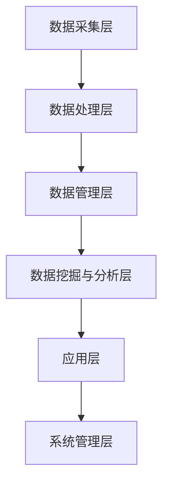
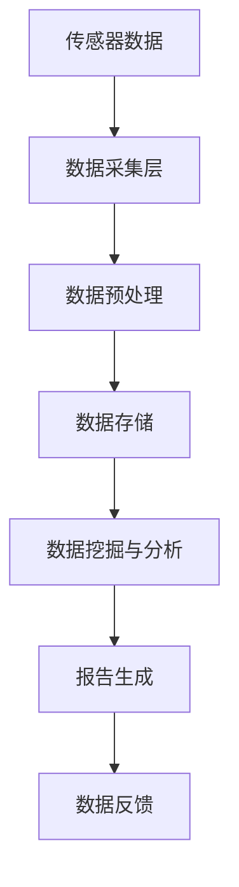
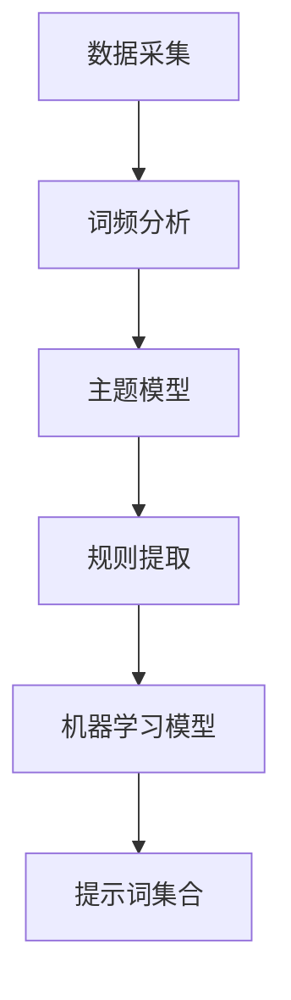
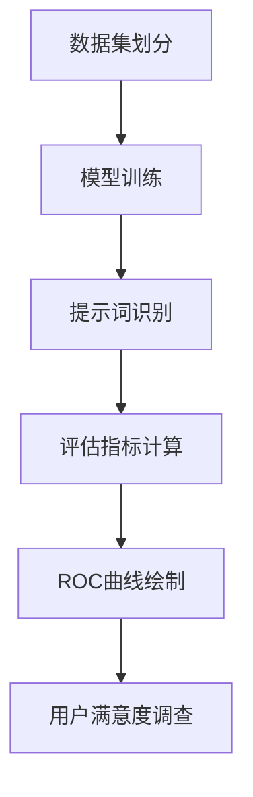
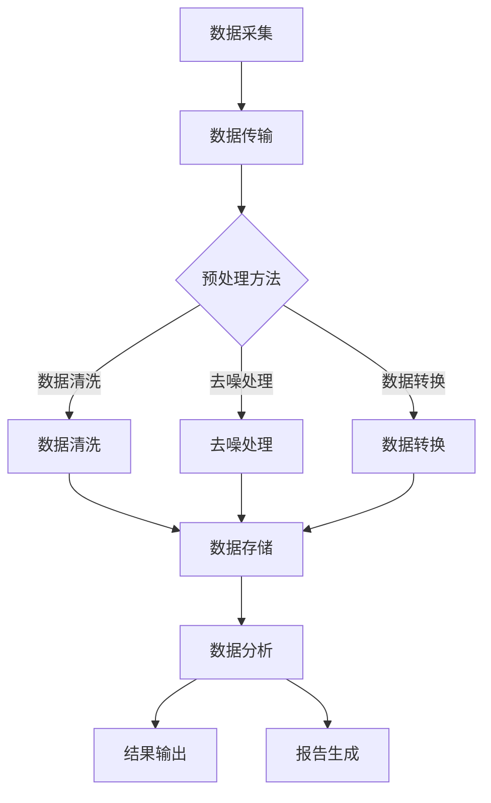

                 

# 引言与概述

## 智能环境监测的重要性

随着全球环境问题的日益突出，生态系统保护和环境保护成为世界各国共同关注的焦点。气候变化、空气污染、水资源短缺、生物多样性丧失等问题不仅对人类的生存和发展构成了严重威胁，也对地球生态系统的平衡和稳定产生了深远影响。为了应对这些挑战，实现可持续发展和生态文明建设，智能环境监测技术的研发和应用显得尤为重要。

智能环境监测是一种通过先进的信息技术手段，对环境进行实时、高效、全面的监测和评估的方法。它利用传感器、数据处理、人工智能等技术，对环境数据进行采集、传输、处理和分析，从而实现对环境状态的精准感知和动态监测。智能环境监测技术不仅可以实时监测环境污染物的浓度变化，还能对生态系统健康状态进行综合评估，为生态环境保护决策提供科学依据。

## 提示词驱动的智能监测概念

提示词驱动的智能监测是一种结合自然语言处理和人工智能技术的智能环境监测方法。它通过提取和分析环境数据中的关键词和关键短语，实现对环境信息的自动识别和分类。提示词驱动的智能监测具有以下几个特点：

1. **高效率**：提示词驱动的方法能够快速从大量数据中提取关键信息，大大提高监测效率。
2. **灵活性**：提示词可以根据不同的监测需求和场景进行灵活调整和优化，适应不同的环境监测任务。
3. **自动化**：提示词驱动的方法可以实现监测过程的自动化，减少人工干预，降低成本。

在智能环境监测中，提示词的作用类似于人类语言理解过程中的关键词，通过这些关键词可以快速定位和识别监测对象和目标。例如，在水质监测中，可以通过提取“氨氮”、“总磷”、“溶解氧”等关键词，快速识别水体的污染情况。

## 本书组织结构

本书将从以下几个方面详细探讨提示词驱动的智能环境监测：

- **第一部分：引言与概述**：介绍智能环境监测的重要性以及提示词驱动的智能监测概念。
- **第二部分：提示词驱动的智能监测基础理论**：包括提示词与自然语言处理基础、智能监测系统架构与设计、环境监测数据采集与预处理、提示词生成与优化等。
- **第三部分：提示词驱动的智能环境监测应用**：重点介绍提示词驱动的生态系统保护监测应用。
- **附录**：提供相关开发工具与资源，包括主流自然语言处理框架、开源环境监测数据集以及智能监测系统开源项目。

通过本书的阐述，我们希望能够为读者提供一个全面、系统的提示词驱动智能环境监测的理论框架和应用案例，为实际环境监测工作提供参考和指导。

### 第1章 提示词驱动的智能环境监测概述

### 1.1 智能环境监测的重要性

智能环境监测在现代环境保护中扮演着至关重要的角色。它不仅有助于及时、准确地监测环境变化，提供决策支持，还能为科学研究、政策制定提供科学依据。以下从几个方面详细阐述智能环境监测的重要性。

#### 1.1.1 实时监测环境变化

智能环境监测系统可以通过传感器网络实时收集环境数据，如空气质量、水质、土壤污染等。这些数据可以实时传输到中央处理系统进行分析和处理，从而实现对环境状态的动态监测。实时监测有助于及时发现环境问题，采取及时有效的应对措施，防止问题扩大化。

#### 1.1.2 提高环境保护效率

传统的环境监测方法往往依赖于人工采样和分析，效率较低且存在人为误差。智能环境监测通过自动化和数据化手段，可以大幅提高监测效率和准确性。例如，利用无人机进行遥感监测，可以覆盖更广的区域，获取更高分辨率的数据。此外，智能监测系统还可以通过大数据分析，识别环境问题的高风险区域，优化资源配置，提高环境保护的针对性。

#### 1.1.3 支持科学研究与政策制定

智能环境监测系统可以收集到大量准确、详细的环境数据，为科学研究提供宝贵的数据资源。例如，通过对气候变化的监测数据进行分析，可以揭示气候变化的规律和趋势，为应对气候变化提供科学依据。同时，智能环境监测数据还可以为政策制定提供数据支持，帮助制定更加科学、有效的环保政策。

#### 1.1.4 促进可持续发展

智能环境监测是实现可持续发展的重要手段之一。通过实时监测和评估环境状态，可以发现并解决环境问题，促进资源的合理利用和生态系统的保护。此外，智能环境监测还可以通过技术手段提高资源利用效率，减少污染排放，推动绿色经济的发展。

### 1.2 提示词驱动的智能监测概念

提示词驱动的智能监测是一种基于自然语言处理和人工智能技术的智能环境监测方法。它通过提取和分析环境数据中的关键词和关键短语（即提示词），实现对环境信息的自动识别和分类。

#### 1.2.1 提示词的基本概念

提示词（Query Words）是自然语言处理中用来检索或分析文本的关键词或短语。在智能环境监测中，提示词通常是指与环境数据相关的专业术语或常见污染物名称，如“二氧化碳”、“PM2.5”、“重金属”等。通过识别这些提示词，可以快速定位和识别监测对象和目标。

#### 1.2.2 提示词驱动的监测原理

提示词驱动的监测原理主要包括以下几个步骤：

1. **数据采集**：利用传感器和其他监测设备收集环境数据。
2. **数据预处理**：对采集到的数据进行清洗、过滤和转换，使其适合进一步处理。
3. **提示词提取**：通过自然语言处理技术从预处理后的数据中提取关键词和短语，形成提示词列表。
4. **信息识别与分类**：利用提示词对提取的环境信息进行识别和分类，生成监测报告。

#### 1.2.3 提示词驱动的优势

提示词驱动的智能监测具有以下优势：

1. **高效率**：提示词驱动的方法能够快速从大量数据中提取关键信息，提高监测效率。
2. **灵活性**：提示词可以根据不同的监测需求和场景进行灵活调整和优化，适应不同的环境监测任务。
3. **自动化**：提示词驱动的方法可以实现监测过程的自动化，减少人工干预，降低成本。

### 1.3 本书组织结构

本书旨在为读者提供一个全面、系统的提示词驱动智能环境监测的理论框架和应用案例。具体内容安排如下：

- **第一部分：引言与概述**：介绍智能环境监测的重要性和提示词驱动的智能监测概念。
- **第二部分：提示词驱动的智能监测基础理论**：包括提示词与自然语言处理基础、智能监测系统架构与设计、环境监测数据采集与预处理、提示词生成与优化等。
- **第三部分：提示词驱动的智能环境监测应用**：重点介绍提示词驱动的生态系统保护监测应用。
- **附录**：提供相关开发工具与资源，包括主流自然语言处理框架、开源环境监测数据集以及智能监测系统开源项目。

通过本书的阐述，我们希望能够帮助读者深入理解提示词驱动的智能环境监测技术，并掌握其实际应用方法。

### 第二部分 提示词驱动的智能监测基础理论

### 第2章 提示词与自然语言处理基础

提示词驱动的智能监测技术依赖于自然语言处理（Natural Language Processing, NLP）的核心技术。NLP是人工智能领域的一个重要分支，旨在使计算机能够理解和处理人类语言。在这一章中，我们将探讨提示词的基本概念、NLP的核心技术，以及提示词与NLP的结合方式。

#### 2.1 提示词的基本概念

提示词是指用来引导信息检索、文本分析或理解的词语或短语。在智能环境监测中，提示词通常是指与环境污染、生态系统健康等相关的专业术语。例如，在水质监测中，常用的提示词包括“氨氮”、“总磷”、“溶解氧”等。这些提示词能够帮助我们快速定位和识别监测目标，从而提高监测效率。

提示词的基本概念包括以下几个方面：

1. **关键词**：指在文本中出现的频率较高的单词或短语，通常与文本的主题密切相关。
2. **主题词**：指能够代表文本主题的单词或短语，通常具有高度的信息密度。
3. **实体识别**：指从文本中识别出具有特定意义的实体，如人名、地点、组织等。在智能环境监测中，实体识别可以帮助我们识别出具体的污染物或监测对象。

#### 2.2 自然语言处理概述

自然语言处理（NLP）是人工智能领域的一个分支，旨在使计算机能够理解和生成人类语言。NLP的核心任务包括：

1. **文本预处理**：包括文本清洗、分词、词性标注、命名实体识别等。文本预处理是NLP的基础，它能够将原始文本转换为适合进一步处理的形式。
2. **词嵌入（Word Embedding）**：将单词映射为高维向量，以便计算机能够理解和计算单词之间的关系。词嵌入技术是NLP的核心技术之一，广泛应用于文本分类、情感分析、信息检索等领域。
3. **文本分类（Text Classification）**：指根据文本的特征将其分为不同的类别。在智能环境监测中，文本分类技术可以用于对监测报告进行分类，以便快速识别出关键信息。
4. **命名实体识别（Named Entity Recognition, NER）**：指从文本中识别出具有特定意义的实体，如人名、地点、组织等。在智能环境监测中，NER技术可以用于识别污染物名称和监测对象。
5. **情感分析（Sentiment Analysis）**：指分析文本中的情感倾向，如正面、负面或中性。在智能环境监测中，情感分析可以用于分析公众对环境保护措施的看法，为政策制定提供参考。

#### 2.3 提示词与NLP的结合

提示词与NLP的结合是提示词驱动的智能监测的核心。以下是如何结合的几个关键步骤：

1. **提示词提取**：通过自然语言处理技术从环境监测数据中提取关键词和短语，形成提示词列表。这一步通常包括文本预处理和词嵌入。
2. **提示词优化**：根据监测任务的需求，对提取的提示词进行优化。例如，可以通过统计方法筛选出与监测目标密切相关的提示词，或者通过机器学习模型对提示词进行权重调整。
3. **信息检索与分类**：利用提取和优化的提示词对监测数据进行分析，识别出关键信息并生成监测报告。这一步通常包括文本分类和命名实体识别。
4. **监测报告生成**：根据分析结果生成详细的监测报告，为环境保护决策提供科学依据。

#### 2.4 提示词驱动的智能监测流程

提示词驱动的智能监测流程可以概括为以下几个步骤：

1. **数据采集**：利用传感器和其他监测设备收集环境数据。
2. **数据预处理**：对采集到的数据进行清洗、过滤和转换，使其适合进一步处理。
3. **提示词提取**：通过自然语言处理技术从预处理后的数据中提取关键词和短语，形成提示词列表。
4. **提示词优化**：对提取的提示词进行优化，提高其准确性和可靠性。
5. **信息检索与分类**：利用提取和优化的提示词对监测数据进行分析，识别出关键信息并生成监测报告。
6. **监测报告生成**：根据分析结果生成详细的监测报告，为环境保护决策提供科学依据。

通过上述步骤，提示词驱动的智能监测技术能够实现对环境数据的自动化、智能化分析，为环境保护工作提供有力支持。

### 第3章 智能监测系统架构与设计

智能监测系统是提示词驱动的智能环境监测的核心，其架构和设计直接影响到系统的性能和效率。本章将详细讨论智能监测系统的整体架构、设计原则以及数据流设计，以便为实际系统开发提供理论指导。

#### 3.1 智能监测系统架构

智能监测系统的架构可以分为以下几个主要部分：

1. **数据采集层**：负责从各种传感器和监测设备中收集数据。这些数据可以是环境质量数据、气象数据、水文数据等。数据采集层通常包括传感器节点、数据采集模块和通信网络。

2. **数据处理层**：对采集到的原始数据进行清洗、过滤、转换和存储。数据处理层通常包括数据预处理模块、数据库和数据存储模块。

3. **数据管理层**：负责数据的存储、管理和维护。数据管理层通常包括数据仓库、数据湖和元数据管理模块。

4. **数据挖掘与分析层**：利用自然语言处理、机器学习等算法，从数据中提取有价值的信息。数据挖掘与分析层通常包括数据挖掘模块、分析引擎和报告生成模块。

5. **应用层**：为用户提供监控、分析、报告和决策支持功能。应用层通常包括用户界面、应用服务器和业务逻辑模块。

6. **系统管理层**：负责系统的配置、监控、维护和升级。系统管理层通常包括系统管理模块、日志管理和安全模块。

以下是一个简化的智能监测系统架构图，展示了各个部分之间的关系：

#### 3.2 系统设计原则

在智能监测系统的设计中，应遵循以下原则：

1. **模块化设计**：将系统划分为多个模块，每个模块负责特定的功能，便于系统的开发和维护。
2. **可扩展性**：系统设计应考虑未来扩展的需求，能够方便地添加新的传感器、新的分析算法或新的应用功能。
3. **高可用性**：系统应具备高可用性，确保在传感器故障、网络中断等情况下，系统能够保持正常运行。
4. **安全性**：系统设计应确保数据安全和用户隐私，防止未授权访问和数据泄露。
5. **灵活性**：系统设计应允许提示词的灵活调整和优化，以适应不同的监测任务和环境。
6. **实时性**：系统设计应确保数据的实时处理和反馈，以便及时响应环境变化。

#### 3.3 数据流设计

智能监测系统的数据流设计是系统设计的核心之一。一个典型智能监测系统的数据流大致如下：

1. **数据采集**：传感器采集到的原始数据通过网络传输到数据采集层。数据采集层对数据进行初步处理，如去噪、滤波等，然后存储到临时缓冲区。

2. **数据预处理**：预处理模块对原始数据进行清洗、过滤、转换等操作，以提高数据的质量和一致性。预处理后的数据被存储到数据库或数据仓库中。

3. **数据存储**：预处理后的数据存储到数据管理层，以便后续的分析和处理。数据存储层通常采用分布式架构，以提高数据存储和访问的效率。

4. **数据挖掘与分析**：数据挖掘与分析层对存储的数据进行挖掘和分析，提取有价值的信息。例如，通过自然语言处理技术从监测报告中提取关键信息，或者使用机器学习算法预测环境变化趋势。

5. **报告生成**：分析结果被用于生成监测报告，报告内容通常包括数据摘要、趋势分析、异常检测等。报告生成模块可以生成多种格式的报告，如PDF、HTML、Excel等。

6. **数据反馈**：监测报告和分析结果可以被实时反馈给用户，以便用户及时了解环境状况并采取相应的措施。

以下是智能监测系统的数据流图示例：

通过上述设计，智能监测系统可以实现高效、可靠的数据采集、处理、分析和反馈，为环境监测和生态保护提供强有力的技术支持。

### 第4章 环境监测数据采集与预处理

环境监测数据的准确性和完整性是智能监测系统能否提供有效信息的关键。本章将详细讨论环境监测数据的采集技术、预处理方法以及数据质量控制，以确保数据的可靠性和适用性。

#### 4.1 数据采集技术

数据采集是环境监测系统的第一步，其核心任务是从环境中获取高质量的原始数据。以下是一些常用的数据采集技术：

1. **传感器技术**：传感器是数据采集的基础，常见的传感器包括温度传感器、湿度传感器、空气质量传感器、水质传感器等。传感器可以实时监测环境参数，并将数据转换为电信号或其他可处理的形式。

2. **遥感和无人机技术**：遥感和无人机技术可以用于大范围的环境监测。遥感技术通过卫星或飞机上的传感器获取地表信息，适用于土地利用、植被覆盖、水质监测等领域。无人机则适用于小范围、高精度的监测，如城市空气质量监测、农业监测等。

3. **物联网（IoT）技术**：物联网技术可以将传感器与互联网连接，实现实时数据采集和传输。通过物联网平台，可以收集来自各种传感器的数据，进行统一管理和分析。

4. **自动化采样设备**：自动化采样设备可以定期或根据需要从环境中采集样本，用于实验室分析。这些设备适用于水质监测、土壤监测等领域。

#### 4.2 数据预处理方法

采集到的原始数据通常含有噪声、缺失值和冗余信息，需要通过预处理方法进行清洗和转换，以提高数据的质量和一致性。以下是一些常用的数据预处理方法：

1. **去噪**：去噪是数据预处理的重要步骤，目的是去除数据中的噪声和异常值。常用的去噪方法包括滤波、平滑和阈值处理等。

2. **数据清洗**：数据清洗包括填充缺失值、纠正错误值和删除重复数据等。缺失值的填充方法包括平均值填充、中值填充和插值法等。错误值的纠正可以通过专家知识和统计分析进行。

3. **数据转换**：数据转换包括数据格式转换、单位转换和比例缩放等。这些操作可以提高数据的可比性和一致性。

4. **数据标准化**：数据标准化是将不同特征的数据转换为相同的尺度，以消除不同特征之间的量纲差异。常用的标准化方法包括最小-最大标准化和Z-score标准化。

5. **特征选择**：特征选择是从大量特征中选出对监测目标最具代表性的特征，以减少数据维度和提高模型性能。特征选择方法包括过滤式方法、包裹式方法和嵌入式方法等。

#### 4.3 数据质量控制

数据质量控制是确保监测数据可靠性和准确性的重要环节。以下是一些常用的数据质量控制方法：

1. **数据校验**：数据校验包括对数据的类型、范围、一致性等进行检查。通过设置合理的校验规则，可以及时发现和纠正数据错误。

2. **数据审核**：数据审核是通过对数据的完整性和准确性进行人工审查，以确保数据的可靠性。审核过程通常包括数据质量评估、异常值分析和专家评审等。

3. **数据比对**：数据比对是将来自不同来源或不同方法的监测数据进行比较，以发现不一致之处。通过数据比对，可以识别潜在的误差源和改进数据采集方法。

4. **数据验证**：数据验证是通过实际监测或实验室分析对数据进行验证，以确保数据的质量和准确性。数据验证可以采用交叉验证、独立验证等方法。

5. **数据备份和恢复**：数据备份和恢复是确保数据安全性的重要措施。通过定期备份和恢复，可以在数据丢失或损坏时迅速恢复数据。

通过上述数据采集、预处理和质量控制方法，可以确保环境监测数据的准确性和可靠性，为智能监测系统提供高质量的数据支持。

### 第5章 提示词生成与优化

提示词生成与优化是智能环境监测系统的核心环节之一，它决定了监测系统对环境数据的识别和分类能力。本章将详细讨论提示词生成方法、优化策略以及效果评估，以帮助读者理解和应用这些技术。

#### 5.1 提示词生成方法

提示词生成方法主要包括以下几个步骤：

1. **词频分析**：词频分析是一种基于统计的方法，通过分析环境数据中的词频分布，识别出出现频率较高的关键词。这些高频词通常与监测目标密切相关，可以作为初步的提示词候选集。

2. **主题模型**：主题模型（如LDA - Latent Dirichlet Allocation）可以从大规模文本数据中自动提取主题，每个主题代表一组相关的关键词。通过主题模型，可以生成包含多个主题的提示词集合，提高提示词的多样性。

3. **规则提取**：规则提取是一种基于专家知识的方法，通过分析环境监测领域的专业知识和规则，手动定义提示词。这种方法生成的提示词具有高度的针对性，适用于特定的监测任务。

4. **机器学习模型**：机器学习模型（如朴素贝叶斯分类器、支持向量机等）可以通过训练数据自动学习并生成提示词。这种方法可以自动适应不同监测场景，提高提示词的泛化能力。

以下是一个简单的提示词生成流程图：

#### 5.2 提示词优化策略

生成提示词后，需要对提示词进行优化，以提高监测系统的性能。以下是一些常见的提示词优化策略：

1. **权重调整**：根据提示词在监测任务中的重要性，对提示词进行权重调整。高重要性的提示词赋予更高的权重，可以提高监测系统的敏感性和准确性。

2. **提示词筛选**：通过统计方法或机器学习模型筛选出最有效的提示词。筛选标准可以包括提示词的词频、主题相关性、信息增益等。

3. **提示词组合**：将多个提示词组合成复合提示词，以增强监测系统的表达能力。复合提示词可以捕捉更复杂的环境特征，提高监测的全面性。

4. **自适应优化**：根据环境监测任务的变化，动态调整提示词。例如，在不同季节或不同污染事件中，调整提示词以适应环境变化。

#### 5.3 提示词效果评估

提示词效果评估是验证优化策略有效性的关键步骤。以下是一些常见的评估指标和方法：

1. **精确率（Precision）**：精确率是识别出的正确提示词数与总识别提示词数的比例。精确率越高，说明提示词的识别能力越强。

2. **召回率（Recall）**：召回率是识别出的正确提示词数与实际存在的提示词数的比例。召回率越高，说明提示词的覆盖面越广。

3. **F1分数（F1 Score）**：F1分数是精确率和召回率的调和平均数，用于综合评估提示词的效果。F1分数介于0和1之间，越接近1表示提示词效果越好。

4. **ROC曲线**：ROC曲线（Receiver Operating Characteristic Curve）是评估分类模型性能的重要工具，通过计算真阳性率与假阳性率之间的关系，可以直观地比较不同模型的性能。

5. **用户满意度**：用户满意度是衡量提示词效果的重要指标，通过问卷调查或用户反馈，可以了解用户对提示词的接受度和使用体验。

以下是一个提示词效果评估的示例流程：

通过上述方法，可以全面评估提示词的效果，并根据评估结果进一步优化提示词，以提高智能监测系统的性能。

### 第6章 生态系统保护中的智能监测应用

在生态系统保护中，智能监测技术的应用具有重要意义。它能够实时监测生态系统的健康状况，评估人类活动对生态环境的影响，为保护和管理生态系统提供科学依据。本章将介绍生态系统监测的概述、提示词驱动的监测方法以及一个实际案例：基于提示词驱动的自然保护区监测系统。

#### 6.1 生态系统监测概述

生态系统监测是指对生态系统的物理、化学和生物过程进行连续、系统的观测和评估。其目的是了解生态系统的变化规律，预测未来的发展趋势，从而制定有效的保护和管理策略。生态系统监测通常涉及以下几个方面：

1. **生物多样性监测**：包括物种丰富度、物种分布、遗传多样性等指标的监测，以评估生态系统的健康状态。
2. **环境质量监测**：涉及水质、空气质量、土壤质量等环境因素的监测，以评估人类活动对生态系统的影响。
3. **生态系统功能监测**：包括生态系统的生产力、碳循环、养分循环等功能的监测，以评估生态系统的整体功能。
4. **气候变化监测**：通过监测气候参数，如温度、湿度、风速、降水量等，评估气候变化对生态系统的影响。

#### 6.2 提示词驱动的生态系统监测方法

提示词驱动的生态系统监测方法通过提取和分析与生态系统相关的关键词，实现对生态数据的自动识别和分类。这种方法具有高效性和灵活性，可以适应不同的监测任务和需求。以下是一个简化的提示词驱动生态系统监测流程：

1. **数据采集**：利用传感器、遥感和物联网技术收集生态系统数据，如生物多样性数据、环境质量数据和气候数据。
2. **数据预处理**：对采集到的原始数据进行清洗、过滤和转换，使其适合进一步处理。
3. **提示词提取**：通过自然语言处理技术从预处理后的数据中提取关键词和短语，形成提示词列表。这些提示词包括与生物多样性、环境质量、生态系统功能等相关的术语。
4. **信息识别与分类**：利用提取的提示词对生态系统数据进行识别和分类，生成监测报告。例如，可以识别出特定物种的分布变化、污染源的影响范围等。
5. **监测报告生成**：根据分析结果生成详细的监测报告，为生态保护决策提供科学依据。

#### 6.3 案例分析：基于提示词驱动的自然保护区监测系统

以下是一个基于提示词驱动的自然保护区监测系统的案例分析：

**背景**：某自然保护区位于山区，占地面积广阔，生物多样性丰富。由于保护区面积大、地形复杂，传统的监测手段难以全面覆盖和保护区的每个角落。为了更有效地监测和保护该自然保护区，科研团队决定开发一个基于提示词驱动的智能监测系统。

**系统设计**：

1. **数据采集**：系统采用物联网技术，在保护区内布置多种传感器，如温度传感器、湿度传感器、空气质量传感器、土壤质量传感器等。传感器实时采集环境数据，并通过无线网络传输到中央处理系统。

2. **数据预处理**：数据预处理模块对采集到的原始数据进行清洗、去噪和标准化处理，确保数据的质量和一致性。

3. **提示词提取**：通过自然语言处理技术，从预处理后的数据中提取与生态系统相关的关键词。例如，针对水质监测，提取关键词如“氨氮”、“总磷”、“溶解氧”等；针对生物多样性监测，提取关键词如“物种名称”、“数量”、“分布范围”等。

4. **信息识别与分类**：利用提取的提示词对保护区内的生态数据进行分析和分类。例如，识别出特定物种的栖息地变化、水源地的污染程度等。

5. **监测报告生成**：系统根据分析结果生成监测报告，报告内容包括环境质量评估、生物多样性监测结果、污染源分布等。这些报告为保护区的管理和决策提供科学依据。

**系统效果**：

1. **实时监测**：系统实现了对保护区内生态数据的实时监测，提高了监测的及时性和准确性。

2. **高效分析**：通过提示词驱动的监测方法，系统能够快速从大量数据中提取关键信息，提高了数据分析的效率。

3. **决策支持**：系统生成的监测报告为保护区管理人员提供了丰富的数据支持，帮助他们更好地了解保护区的状况，制定有效的保护和管理措施。

通过这个案例，可以看出提示词驱动的智能监测系统在生态系统保护中的应用前景。它不仅能够提高监测的效率和准确性，还能为生态保护决策提供科学依据，为实现可持续发展目标提供技术支持。

### 第7章 智能环境监测系统的实现

智能环境监测系统的实现是一个复杂而精细的过程，涉及技术选型、工具选择、系统部署和维护等多个环节。本章将详细探讨智能环境监测系统的实现步骤，包括开发环境搭建、源代码实现和代码解读，以及系统的部署和维护。

#### 7.1 系统实现步骤

智能环境监测系统的实现可以分为以下几个步骤：

1. **需求分析**：首先，明确系统需求，包括监测目标、数据类型、功能要求等。这一步是系统实现的基础，决定了系统的架构和功能。

2. **架构设计**：根据需求分析结果，设计系统的整体架构，包括数据采集层、数据处理层、数据存储层、数据挖掘与分析层和应用层等。架构设计应考虑系统的可扩展性、高可用性和安全性。

3. **技术选型**：选择合适的技术和工具，包括编程语言、数据库、自然语言处理框架、机器学习库等。技术选型应满足系统需求，同时考虑到开发效率和维护成本。

4. **环境搭建**：搭建开发环境，安装和配置必要的软件和工具，包括编程环境、数据库环境、自然语言处理框架等。开发环境的搭建是系统实现的前提条件。

5. **源代码实现**：根据架构设计和技术选型，开始编写系统的源代码。源代码实现包括数据采集模块、数据预处理模块、数据存储模块、数据分析模块和用户界面模块等。

6. **系统集成与测试**：将各个模块集成到一起，进行系统集成测试。测试内容包括功能测试、性能测试和安全测试等，确保系统的稳定性和可靠性。

7. **系统部署**：将系统部署到生产环境，包括安装必要的软件、配置系统参数、部署应用程序等。系统部署应考虑系统的可扩展性和高可用性。

8. **系统维护与更新**：系统部署后，需要进行定期维护和更新，包括修复漏洞、优化性能、添加新功能等，确保系统的长期稳定运行。

#### 7.2 技术选型与工具

智能环境监测系统的技术选型应考虑以下方面：

1. **编程语言**：Python和Java是常用的编程语言，适用于构建智能环境监测系统。Python具有简洁的语法和丰富的库支持，适合快速开发和原型实现。Java则具有强大的性能和稳定性，适用于大型系统和企业级应用。

2. **数据库**：NoSQL数据库（如MongoDB、Cassandra）和关系型数据库（如MySQL、PostgreSQL）是常用的数据库类型。NoSQL数据库适用于存储大规模的非结构化数据，具有高扩展性和灵活性。关系型数据库则适用于存储结构化数据，具有强大的查询能力和事务支持。

3. **自然语言处理框架**：TensorFlow和PyTorch是常用的深度学习框架，适用于自然语言处理任务。TensorFlow提供了丰富的API和工具，适合大规模分布式训练和推理。PyTorch则具有灵活的动态图编程，适合快速原型开发和实验。

4. **机器学习库**：Scikit-learn和XGBoost是常用的机器学习库，适用于各种机器学习任务。Scikit-learn提供了丰富的算法库和工具，适合快速实现和评估机器学习模型。XGBoost则具有出色的性能和效率，适合大规模数据处理和模型优化。

5. **云计算平台**：AWS、Azure和Google Cloud是常用的云计算平台，适用于搭建和部署智能环境监测系统。这些平台提供了丰富的云服务和工具，包括计算资源、存储服务和人工智能服务，可以灵活配置和扩展。

#### 7.3 系统部署与维护

智能环境监测系统的部署与维护是确保系统长期稳定运行的关键。以下是一些常见的部署与维护方法：

1. **容器化与编排**：使用容器化技术（如Docker）将系统组件打包成容器，可以提高系统的可移植性和可扩展性。通过编排工具（如Kubernetes），可以自动化管理容器化应用的生命周期，实现系统的弹性扩展和自动化部署。

2. **自动化部署**：使用持续集成和持续部署（CI/CD）工具（如Jenkins、GitHub Actions），可以自动化构建、测试和部署系统。自动化部署可以减少人为错误，提高部署效率，缩短系统发布周期。

3. **监控与报警**：使用监控工具（如Prometheus、Grafana）对系统性能和状态进行实时监控。通过设置报警规则，可以及时发现系统异常，并自动触发相应的应对措施，确保系统的稳定运行。

4. **安全与合规**：确保系统的数据安全和用户隐私，遵循相关的安全标准和合规要求。使用加密技术保护数据传输和存储，定期进行安全审计和漏洞扫描，防范潜在的安全威胁。

5. **维护与更新**：定期检查系统运行状态，修复漏洞、优化性能和添加新功能。更新系统时应注意兼容性和稳定性，确保更新过程对用户的影响最小。

通过上述方法，可以确保智能环境监测系统的稳定运行和持续发展，为环境监测和生态保护提供可靠的技术支持。

### 第8章 提示词驱动的智能环境监测前景与挑战

#### 8.1 发展趋势

提示词驱动的智能环境监测技术正处于快速发展阶段，随着人工智能、物联网、大数据等技术的不断进步，其在环境保护和生态监测中的应用前景十分广阔。以下是几个关键的发展趋势：

1. **技术融合**：人工智能和物联网技术的深入融合，将使得环境监测数据的采集、处理和分析更加高效和精准。例如，深度学习算法的结合可以提升提示词提取和优化的效果，增强系统的智能化水平。

2. **实时性与高分辨率**：随着传感器技术和无线通信技术的进步，实时环境监测的数据采集频率和分辨率将进一步提高。这有助于实现更细致的环境监测，为生态环境保护提供更及时的科学依据。

3. **跨学科研究**：环境监测技术的进步将促进跨学科的研究合作，如生态学、气象学、地理学等领域的专家共同探讨如何更有效地利用智能监测数据，为生态保护和环境保护提供综合解决方案。

4. **个性化与定制化**：基于大数据分析和机器学习算法，智能环境监测系统将能够根据具体应用场景和用户需求，提供个性化的监测方案和服务，提高监测的针对性和有效性。

5. **国际合作**：全球环境问题日益突出，提示词驱动的智能环境监测技术将促进国际合作，共享监测数据和技术成果，推动全球环境保护和可持续发展。

#### 8.2 技术挑战

尽管提示词驱动的智能环境监测技术具有广阔的应用前景，但在实际应用过程中仍面临一系列技术挑战：

1. **数据质量问题**：环境监测数据的质量直接影响监测结果的准确性。噪声干扰、数据缺失、不一致性等问题仍然存在，需要通过先进的数据预处理和清洗技术来提高数据质量。

2. **数据隐私与安全**：环境监测数据通常包含敏感信息，如污染物浓度、生态状态等，数据隐私和安全是系统面临的重大挑战。需要采取严格的加密、访问控制和审计机制，确保数据的安全性和隐私性。

3. **算法性能优化**：智能监测系统依赖于高效的自然语言处理和机器学习算法。如何优化算法性能，提高提示词提取和优化的准确性，是当前研究的热点和难点。

4. **跨平台兼容性**：智能监测系统需要在不同的硬件平台、操作系统和云计算环境中运行，如何确保系统的跨平台兼容性，是一个亟待解决的问题。

5. **用户界面与用户体验**：智能监测系统的用户界面设计直接影响用户体验。如何设计直观、易用的界面，使得用户能够轻松地获取和分析监测数据，是系统开发的重要任务。

#### 8.3 未来研究方向

为了克服上述挑战，未来的研究可以从以下几个方面展开：

1. **数据融合与多源数据融合**：研究如何将多源、多尺度的环境数据进行融合，提高监测数据的综合性和准确性。

2. **智能化数据处理**：开发更先进的数据预处理和清洗算法，提高数据质量，减少数据噪声和缺失值的影响。

3. **隐私保护与安全机制**：研究隐私保护和数据安全机制，确保监测数据在传输和存储过程中的安全性和隐私性。

4. **高效算法优化**：优化自然语言处理和机器学习算法，提高提示词提取和优化的效率，提升系统的智能化水平。

5. **跨平台与跨应用兼容性**：研究智能监测系统的跨平台兼容性，确保系统能够在不同硬件平台、操作系统和云计算环境中高效运行。

6. **用户界面与交互设计**：结合用户体验设计，优化系统界面，提高用户的操作便捷性和使用满意度。

通过上述研究方向的深入探索，提示词驱动的智能环境监测技术将不断成熟和发展，为生态保护和环境保护提供更强有力的技术支持。

### 附录

#### 附录A 提示词驱动的智能环境监测系统开发工具与资源

为了帮助读者深入了解和开发提示词驱动的智能环境监测系统，以下是几项关键的开发工具和资源介绍：

##### A.1 主流自然语言处理框架

1. **TensorFlow**：由Google开发的开源机器学习框架，支持多种深度学习模型的训练和部署。TensorFlow提供了丰富的API和工具，适合构建复杂的自然语言处理模型。
   - 官网：[TensorFlow官网](https://www.tensorflow.org/)

2. **PyTorch**：由Facebook AI Research开发的开源深度学习框架，具有灵活的动态图编程和易于理解的界面。PyTorch在自然语言处理和计算机视觉领域具有广泛的应用。
   - 官网：[PyTorch官网](https://pytorch.org/)

##### A.2 开源环境监测数据集

1. **Google Earth Engine**：提供全球环境监测数据集，包括土地利用、气候变化、森林覆盖等数据。Google Earth Engine是一个强大的云平台，支持大规模数据的分析和可视化。
   - 官网：[Google Earth Engine](https://earthengine.google.com/)

2. **Open Climate Data**：提供全球气候数据集，包括温度、降水、风速等指标。这些数据集可以用于研究气候变化和生态环境。
   - 官网：[Open Climate Data](https://opencd.ncei.noaa.gov/)

##### A.3 智能监测系统开源项目

1. **EcoMonitor**：一个开源的环境监测平台，支持多种环境数据的采集、处理和分析。EcoMonitor提供了丰富的接口和模块，方便用户进行定制化开发。
   - GitHub：[EcoMonitor GitHub](https://github.com/EcoMonitor)

2. **EnviroCar**：一个基于物联网的环境监测项目，利用车载传感器收集空气质量数据，并通过云计算平台进行数据分析和共享。
   - GitHub：[EnviroCar GitHub](https://github.com/envirocar/envirocar-cloud)

通过利用这些开发工具和资源，开发者可以更加便捷地构建和优化提示词驱动的智能环境监测系统，为生态保护和环境保护提供技术支持。

### 附录B: Mermaid流程图示例

在智能环境监测系统的开发过程中，流程图可以帮助我们清晰地展示数据流和处理步骤。以下是一个简单的Mermaid流程图示例，用于说明数据采集、预处理和分析的流程：

这个流程图展示了从数据采集到数据预处理、数据存储、数据分析和结果输出的整体流程。通过Mermaid，我们可以轻松地将复杂的流程图嵌入文档中，以便更好地理解和交流系统设计。

