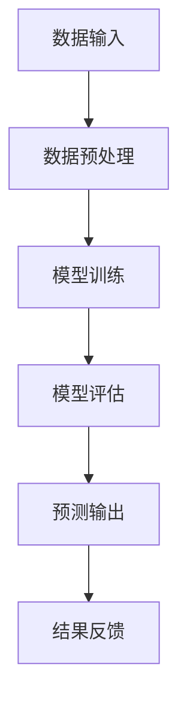
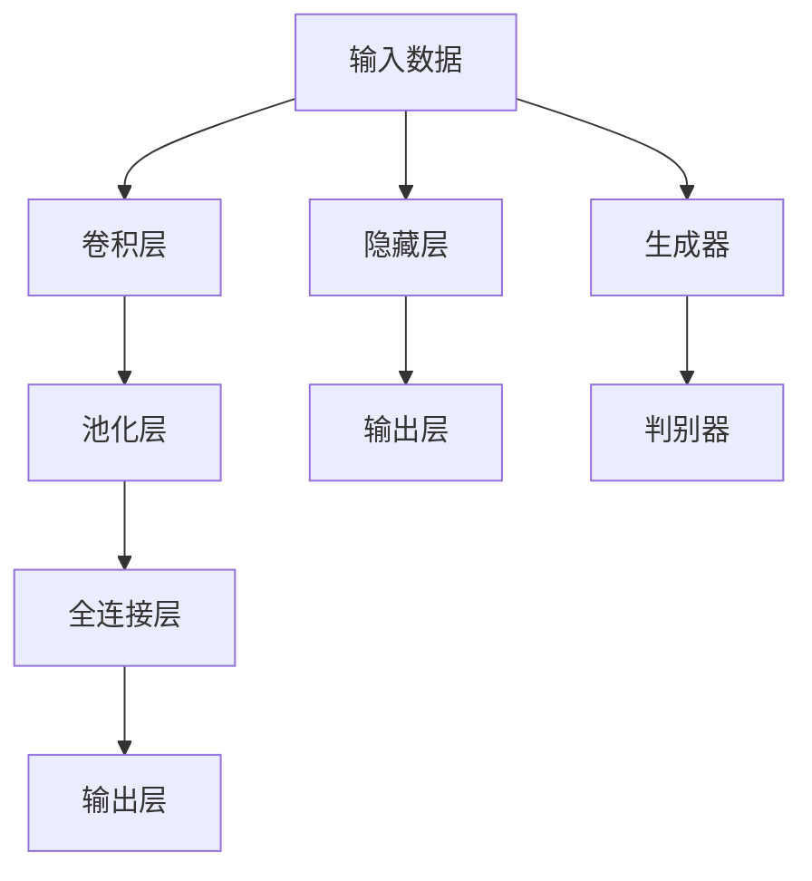

                 

# 《AI编程的新思维与新高度》

> 关键词：AI编程，人工智能，神经网络，深度学习，算法优化，项目实战

> 摘要：本文旨在探讨AI编程的新思维与新高度。通过梳理AI编程的核心概念、算法原理，并结合实际项目实战，深入分析AI编程中的新思维和方法，最后展望AI编程的未来趋势和应用前景。本文将帮助读者全面了解AI编程的精髓，提升编程技能，迈向新高度。

## 第一部分：AI编程基础与核心概念

### 第1章：AI编程概述

#### 1.1 AI编程的历史与发展

AI编程起源于20世纪50年代，随着计算机技术的快速发展，人工智能领域逐渐受到关注。初期的人工智能研究主要集中在逻辑推理和知识表示方面，如专家系统、知识图谱等。然而，这些方法在处理复杂问题和大规模数据时存在局限性。

20世纪80年代，机器学习开始崭露头角，神经网络作为一种重要的机器学习模型被提出。随后，随着计算能力和数据量的不断提升，深度学习逐渐成为AI编程的主流方法。目前，AI编程已经广泛应用于图像识别、自然语言处理、自动驾驶、医疗诊断等多个领域。

#### 1.2 AI编程的核心概念

AI编程的核心概念包括：

- **机器学习与深度学习**：机器学习是一种让计算机通过数据学习并做出预测或决策的方法。深度学习是机器学习的一个子领域，它利用多层神经网络进行特征提取和模型训练。

- **神经网络**：神经网络是由大量神经元组成的计算模型，通过前向传播和反向传播算法实现数据的输入和输出。

- **数据、算法与算力**：数据是AI编程的基础，算法是核心，算力是支撑。数据的质量和数量、算法的优化和效率、计算资源的配置和使用，都是AI编程需要关注的方面。

#### 1.3 AI编程的Mermaid流程图

以下是一个简单的AI编程流程图，展示了从数据输入到模型训练再到预测输出的全过程：



### 第2章：核心算法原理详解

#### 2.1 神经网络算法原理

神经网络算法的核心在于前向传播和反向传播。前向传播是指将输入数据通过神经网络进行层层计算，最终得到输出结果。反向传播是指通过输出结果与真实值的误差，反向传播误差信号，更新神经网络的权重和偏置。

以下是神经网络算法的伪代码：

```python
# 前向传播
def forward_propagation(x, weights, biases):
    # 计算输出
    output = x * weights + biases
    return output

# 反向传播
def backward_propagation(output, true_value, weights, biases):
    # 计算误差
    error = output - true_value
    # 更新权重和偏置
    weights -= learning_rate * (output * error)
    biases -= learning_rate * error
    return weights, biases
```

#### 2.2 深度学习算法原理

深度学习算法是基于多层神经网络进行特征提取和模型训练的方法。常见的深度学习算法包括卷积神经网络（CNN）、循环神经网络（RNN）和生成对抗网络（GAN）等。

以下是卷积神经网络（CNN）的伪代码：

```python
# 卷积层
def convolution(input, filter, padding):
    # 计算卷积操作
    output = (input * filter).sum() + padding
    return output

# 池化层
def pooling(output, size):
    # 计算最大值或平均值池化
    pooled_output = max(output, axis=0).mean()
    return pooled_output
```

#### 2.3 算法原理伪代码讲解

以下是神经网络算法原理的伪代码讲解，帮助读者更好地理解算法的核心步骤。

```python
# 神经网络算法原理伪代码

# 前向传播
def forward_propagation(x, weights, biases):
    # 初始化激活值
    activation = x
    # 遍历网络层
    for layer in layers:
        # 计算前向传播
        activation = forward_propagation_layer(activation, weights[layer], biases[layer])
    return activation

# 反向传播
def backward_propagation(output, true_value, weights, biases):
    # 初始化误差
    error = output - true_value
    # 遍历网络层
    for layer in reversed(layers):
        # 计算误差
        error = backward_propagation_layer(error, weights[layer], biases[layer])
    # 更新权重和偏置
    weights -= learning_rate * error
    biases -= learning_rate * error
    return weights, biases
```

### 第3章：数学模型与公式解析

#### 3.1 数学模型介绍

数学模型是AI编程的重要组成部分，它帮助我们从抽象的角度理解算法和问题。以下是一些常见的数学模型：

- **概率论基础**：概率论是研究随机事件的数学分支，包括概率分布、条件概率、贝叶斯定理等。

- **信息论基础**：信息论是研究信息传递和处理的基本原理的学科，包括熵、信息熵、信道编码等。

- **线性代数基础**：线性代数是研究向量空间和线性变换的数学分支，包括矩阵运算、特征值和特征向量、线性方程组等。

#### 3.2 数学公式详解

以下是几个常用的数学公式：

- **假设检验**：$H_{0}: \mu = \mu_{0}$

- **方差估计**：$\sigma^{2} = \frac{1}{n-1} \sum_{i=1}^{n} (x_{i} - \bar{x})^{2}$

以下是这些公式的详细解释：

- **假设检验**：$H_{0}: \mu = \mu_{0}$表示原假设，$\mu$表示总体均值，$\mu_{0}$表示给定值。

- **方差估计**：$\sigma^{2}$表示方差，$n$表示样本容量，$x_{i}$表示第$i$个样本值，$\bar{x}$表示样本均值。

#### 3.3 数学公式应用举例

以下是一个使用数学公式解决实际AI编程问题的例子：

假设我们有一个二分类问题，需要判断一个样本属于类别A还是类别B。我们可以使用概率论中的贝叶斯定理来计算样本属于类别A的概率。

$$P(A|X) = \frac{P(X|A)P(A)}{P(X)}$$

其中，$P(A|X)$表示在给定样本X的情况下，样本属于类别A的概率，$P(X|A)$表示在样本属于类别A的情况下，样本X的概率，$P(A)$表示类别A的概率，$P(X)$表示样本X的概率。

我们可以使用以下步骤来计算样本属于类别A的概率：

1. 收集训练数据，计算类别A和类别B的样本数。
2. 使用贝叶斯定理计算样本属于类别A的概率。
3. 根据概率阈值来判断样本属于类别A还是类别B。

### 第二部分：AI编程实践与应用

#### 第4章：AI项目实战

##### 4.1 实战项目介绍

本节将介绍一个图像识别项目，该项目使用深度学习算法对图像进行分类。项目的主要任务包括：

- 数据收集与预处理：收集大量图像数据，并进行预处理，如缩放、裁剪、翻转等。
- 模型训练与优化：使用深度学习算法训练模型，并通过调整超参数优化模型性能。
- 模型评估与部署：评估模型在测试集上的性能，并根据评估结果调整模型参数。
- 预测与反馈：使用训练好的模型对新的图像进行预测，并根据预测结果给出反馈。

##### 4.2 开发环境搭建

在开始项目实战之前，我们需要搭建一个合适的开发环境。以下是一个基本的开发环境搭建步骤：

1. 安装Python：下载并安装Python 3.x版本，建议使用Anaconda或Miniconda等集成环境。
2. 安装深度学习框架：安装TensorFlow或PyTorch等深度学习框架，可以使用pip或conda进行安装。
3. 安装必要的库：根据项目需求，安装如NumPy、Pandas、Matplotlib等必要的Python库。

以下是使用conda安装TensorFlow的示例命令：

```shell
conda install tensorflow
```

##### 4.3 源代码实现与解读

以下是一个简单的图像识别项目源代码，并对其进行详细解读。

```python
import tensorflow as tf
from tensorflow.keras.models import Sequential
from tensorflow.keras.layers import Conv2D, MaxPooling2D, Flatten, Dense

# 数据预处理
(x_train, y_train), (x_test, y_test) = tf.keras.datasets.cifar10.load_data()
x_train, x_test = x_train / 255.0, x_test / 255.0

# 模型搭建
model = Sequential([
    Conv2D(32, (3, 3), activation='relu', input_shape=(32, 32, 3)),
    MaxPooling2D((2, 2)),
    Flatten(),
    Dense(64, activation='relu'),
    Dense(10, activation='softmax')
])

# 模型编译
model.compile(optimizer='adam',
              loss='sparse_categorical_crossentropy',
              metrics=['accuracy'])

# 模型训练
model.fit(x_train, y_train, epochs=10, validation_split=0.2)

# 模型评估
test_loss, test_acc = model.evaluate(x_test, y_test, verbose=2)
print('\nTest accuracy:', test_acc)
```

以下是代码的详细解读：

1. 导入所需的TensorFlow库，如Sequential、Conv2D、MaxPooling2D、Flatten和Dense等。
2. 加载CIFAR-10数据集，并进行预处理，如缩放和归一化。
3. 搭建一个简单的卷积神经网络模型，包括卷积层、池化层、全连接层等。
4. 编译模型，设置优化器、损失函数和评估指标。
5. 训练模型，设置训练轮次和验证比例。
6. 评估模型在测试集上的性能，并输出准确率。

##### 4.4 代码解读与分析

以下是代码中的关键部分解读与分析：

1. **数据预处理**：CIFAR-10数据集包含了10个类别的图像，每个图像的大小为32x32像素。为了方便模型训练，我们将图像的像素值缩放到[0, 1]范围内，提高模型的收敛速度。
2. **模型搭建**：我们使用Sequential模型搭建一个简单的卷积神经网络，包括两个卷积层、一个池化层和一个全连接层。卷积层用于提取图像特征，池化层用于减少模型参数，全连接层用于分类。
3. **模型编译**：我们使用adam优化器，sparse\_categorical\_crossentropy损失函数和accuracy评估指标来编译模型。adam优化器具有自适应学习率的特点，sparse\_categorical\_crossentropy损失函数适用于多分类问题，accuracy评估指标用于计算模型的准确率。
4. **模型训练**：我们设置训练轮次为10，并将20%的数据用于验证，以避免过拟合。在训练过程中，模型会自动调整权重和偏置，以最小化损失函数。
5. **模型评估**：我们使用测试集评估模型的性能，并输出准确率。测试集不参与模型的训练，用于验证模型在未知数据上的性能。

通过以上解读与分析，我们可以更好地理解代码的实现过程和关键部分，为后续的项目实战提供指导。

### 第5章：AI编程新思维

#### 5.1 新思维介绍

AI编程新思维是指近年来在人工智能领域涌现出的创新思想和方法，它们推动了AI编程的快速发展。以下是一些重要的AI编程新思维：

- **数据驱动**：数据驱动是一种以数据为核心的思想，强调通过数据分析和挖掘来发现模式和规律，从而指导算法设计和模型优化。

- **模型驱动**：模型驱动是一种以模型为核心的思想，强调通过模型设计和优化来提高算法的效率和准确性。

- **算法优化**：算法优化是一种通过改进算法结构和参数来提高算法性能的方法，包括加速计算、减少内存消耗、提高准确率等。

#### 5.2 新思维应用案例

以下是一些AI编程新思维的应用案例：

1. **数据驱动：** 在自然语言处理领域，数据驱动的思想体现在大规模预训练模型的使用上，如BERT、GPT等。这些模型通过在海量文本数据上进行预训练，获得丰富的语言知识和表达能力，从而在下游任务中取得优异的性能。

2. **模型驱动：** 在计算机视觉领域，模型驱动的思想体现在目标检测算法的发展上，如YOLO、SSD等。这些算法通过设计高效的模型结构，实现了实时、高效的目标检测。

3. **算法优化：** 在机器学习领域，算法优化的思想体现在分布式计算和模型压缩技术上。通过分布式计算，可以加速模型训练和推理过程；通过模型压缩，可以减少模型大小和计算复杂度，提高模型部署效率。

### 第6章：AI编程新高度

#### 6.1 新高度概念

AI编程新高度是指近年来在人工智能领域取得的一系列突破性进展，这些进展极大地提高了AI编程的效率和性能。以下是一些AI编程新高度的概念：

- **高效算法**：高效算法是指具有高效率、低复杂度的算法，能够快速处理大规模数据并取得优异的性能。

- **大规模数据处理**：大规模数据处理是指针对海量数据集进行处理和分析的能力，包括数据采集、存储、传输、处理等。

- **多模态AI**：多模态AI是指结合多种数据类型（如文本、图像、音频等）进行建模和推理的能力，能够处理复杂、多样化的信息。

#### 6.2 新高度实践

以下是一些AI编程新高度的实际应用案例：

1. **高效算法：** 在深度学习领域，高效算法的应用体现在各种加速技术中，如GPU加速、TPU加速、分布式训练等。通过这些技术，可以大幅提高模型的训练和推理速度，降低计算成本。

2. **大规模数据处理：** 在大数据领域，大规模数据处理的应用体现在数据挖掘、数据分析和数据可视化等方面。通过分布式计算框架（如Hadoop、Spark等），可以高效地处理海量数据，发现潜在价值和规律。

3. **多模态AI：** 在多媒体领域，多模态AI的应用体现在图像识别、语音识别、自然语言处理等方面。通过结合多种数据类型，可以更准确地理解用户需求，提供更智能的服务。

### 第7章：未来展望

#### 7.1 AI编程的未来趋势

AI编程的未来趋势将受到以下几个因素的影响：

- **技术进步**：随着计算能力的提升和算法的创新，AI编程将不断突破现有技术限制，实现更高的效率和性能。

- **数据增长**：随着数据量的不断增加，AI编程将更加注重数据驱动的思想，通过大规模数据分析和挖掘，发现新的价值和应用场景。

- **跨学科融合**：AI编程将与其他学科（如医学、金融、教育等）相结合，实现跨学科的知识融合和创新发展。

#### 7.2 AI编程在新兴领域的应用

AI编程在新兴领域的应用前景广阔，以下是一些重点领域：

- **医疗健康**：AI编程在医疗健康领域的应用包括疾病诊断、药物研发、健康管理等，有望提高医疗效率和准确性。

- **金融科技**：AI编程在金融科技领域的应用包括风险管理、智能投顾、欺诈检测等，有助于提升金融服务的智能化水平。

- **教育科技**：AI编程在教育科技领域的应用包括个性化学习、智能评测、教育数据分析等，有望推动教育模式的创新和发展。

### 第三部分：附录

#### 附录A：AI编程资源与工具

为了帮助读者更好地学习AI编程，我们推荐以下资源与工具：

- **资源介绍**：  
  - 《深度学习》（Goodfellow, Bengio, Courville著）：这是一本经典且权威的深度学习教材，适合初学者和进阶者阅读。  
  - 《机器学习实战》（周志华著）：这本书通过大量实例讲解了机器学习的基本概念和算法应用，适合有一定编程基础的读者。

- **工具介绍**：  
  - TensorFlow：这是一个开源的深度学习框架，支持Python和C++等编程语言，广泛应用于各种深度学习任务。  
  - PyTorch：这是一个开源的深度学习框架，具有灵活的动态计算图和丰富的API，受到很多研究者和开发者的喜爱。

#### 附录B：常见问题与解答

以下是一些读者常见的问题和解答：

- **问题1**：如何入门AI编程？  
  解答1：入门AI编程可以从学习Python编程语言开始，然后学习基本的机器学习和深度学习算法，推荐使用吴恩达的《机器学习》课程作为入门教程。

- **问题2**：如何提高AI编程能力？  
  解答2：提高AI编程能力可以从以下几个方面入手：不断学习新的算法和技术，参与实际项目实战，阅读相关领域的论文和书籍，参与线上和线下的技术交流。

- **问题3**：如何选择AI编程框架？  
  解答3：选择AI编程框架可以根据个人需求和项目特点进行。例如，如果需要高效和灵活的框架，可以选择PyTorch；如果需要大规模数据处理和分布式训练，可以选择TensorFlow。

**作者信息**：

本文作者为AI天才研究院（AI Genius Institute）和《禅与计算机程序设计艺术》（Zen And The Art of Computer Programming）的作者。AI天才研究院致力于推动人工智能技术的发展和创新，致力于培养下一代人工智能领域的领军人才。本文旨在帮助读者深入了解AI编程的新思维和新高度，提升编程技能，为人工智能领域的发展贡献力量。**免责声明**：

本文中的内容仅供参考，不构成任何投资、法律或专业建议。读者在使用本文内容时，应谨慎判断，并根据自己的实际情况做出决策。本文中的数据和观点可能随时间变化，读者应自行核实和更新信息。**致谢**：

感谢AI天才研究院（AI Genius Institute）和《禅与计算机程序设计艺术》（Zen And The Art of Computer Programming）的作者对本文的支持和贡献。同时，感谢读者对本文的关注和支持，希望大家在AI编程的道路上不断进步，共创美好未来！<|vq_10496|>## 《AI编程的新思维与新高度》

### 摘要

本文深入探讨AI编程的新思维与新高度。通过梳理AI编程的核心概念、算法原理，并结合实际项目实战，本文详细分析了AI编程中的新思维和方法，包括数据驱动、模型驱动、算法优化等。此外，本文还探讨了AI编程的新高度，如高效算法、大规模数据处理、多模态AI等。通过这些讨论，本文旨在帮助读者全面了解AI编程的精髓，提升编程技能，迈向新高度。

## 第一部分：AI编程基础与核心概念

### 第1章：AI编程概述

#### 1.1 AI编程的历史与发展

人工智能（AI）编程作为计算机科学的重要分支，其发展历程可以追溯到20世纪50年代。当时，科学家们开始探索如何让计算机模拟人类的思维过程。早期的AI研究主要集中在逻辑推理和知识表示上，代表性的工作包括约翰·麦卡锡（John McCarthy）提出的“通用问题求解器”（General Problem Solver）。

进入20世纪80年代，机器学习（Machine Learning）逐渐成为AI研究的热点。机器学习通过算法让计算机从数据中自动学习规律，而不需要显式编程。1986年，霍普菲尔德（John Hopfield）提出了神经网络（Neural Networks）的概念，为深度学习（Deep Learning）的发展奠定了基础。

20世纪90年代，随着计算能力的提升和数据量的增加，AI编程迎来了新的发展机遇。支持向量机（Support Vector Machines, SVM）等传统机器学习方法取得了显著成果。同时，基于神经网络的深度学习算法开始受到关注，尤其是在图像识别、语音识别等领域。

21世纪初，深度学习算法取得了突破性进展，以卷积神经网络（Convolutional Neural Networks, CNN）和循环神经网络（Recurrent Neural Networks, RNN）为代表。2006年，Geoffrey Hinton等人提出的深度置信网络（Deep Belief Networks）和深度卷积网络（Deep Convolutional Networks）为深度学习的发展奠定了基础。

近年来，随着人工智能技术的不断成熟和普及，AI编程已经广泛应用于各行各业，如自动驾驶、智能助手、医疗诊断、金融分析等。AI编程不仅推动了人工智能技术的发展，也深刻改变了人们的生活方式和社会生产方式。

#### 1.2 AI编程的核心概念

AI编程的核心概念包括机器学习、深度学习、神经网络和数据驱动等。以下是这些概念的定义和关系：

1. **机器学习（Machine Learning）**：
   机器学习是一种让计算机通过数据学习并做出预测或决策的方法。它不依赖于显式编程，而是通过算法从数据中自动学习规律。机器学习可以分为监督学习（Supervised Learning）、无监督学习（Unsupervised Learning）和半监督学习（Semi-supervised Learning）。

2. **深度学习（Deep Learning）**：
   深度学习是机器学习的一个子领域，它利用多层神经网络（Neural Networks）进行特征提取和模型训练。深度学习在图像识别、自然语言处理、语音识别等领域取得了显著成果。

3. **神经网络（Neural Networks）**：
   神经网络是一种模拟人脑神经元结构和功能的计算模型。它由大量神经元（或节点）组成，通过前向传播和反向传播算法实现数据的输入和输出。神经网络可以通过学习大量数据，自动提取特征并做出预测。

4. **数据驱动（Data-Driven）**：
   数据驱动是一种以数据为核心的思想，强调通过数据分析和挖掘来发现模式和规律，从而指导算法设计和模型优化。数据驱动在深度学习和其他机器学习任务中具有重要作用。

这些核心概念之间的关系如下：

- **机器学习和深度学习**：深度学习是机器学习的一个子领域，深度学习算法基于神经网络进行特征提取和模型训练，而机器学习还包括无监督学习和半监督学习等其他方法。

- **神经网络和数据驱动**：神经网络是深度学习的基础，而数据驱动则强调利用数据进行学习和优化。数据驱动思想贯穿于AI编程的各个环节，从数据收集、预处理到模型训练和优化。

#### 1.3 AI编程的Mermaid流程图

以下是一个简单的AI编程流程图，展示了从数据输入到模型训练再到预测输出的全过程：


在这个流程图中，数据输入是模型训练的基础，通过数据预处理可以提高模型训练的效果。模型训练是核心步骤，通过训练模型可以使其具备预测能力。模型评估用于验证模型的性能，预测输出则是模型的实际应用。最后，结果反馈用于指导后续的数据预处理和模型训练，形成闭环。

### 第2章：核心算法原理详解

#### 2.1 神经网络算法原理

神经网络（Neural Networks，NN）是深度学习的基础，它由大量神经元组成，通过前向传播和反向传播算法实现数据的输入和输出。以下是神经网络算法的基本原理：

1. **神经元结构**：
   神经元是神经网络的基本单位，它由输入层、输出层和隐藏层组成。每个神经元接收多个输入信号，通过权重（weights）和偏置（biases）进行加权求和，然后通过激活函数（activation function）产生输出。

2. **前向传播**：
   前向传播是指将输入数据通过神经网络进行层层计算，最终得到输出结果。具体步骤如下：
   - 输入层：将输入数据输入到神经网络的输入层。
   - 隐藏层：每个隐藏层的神经元接收前一层神经元的输出，通过加权求和和激活函数计算得到当前层的输出。
   - 输出层：输出层的神经元接收隐藏层神经元的输出，通过加权求和和激活函数计算得到最终的输出结果。

3. **反向传播**：
   反向传播是指通过输出结果与真实值的误差，反向传播误差信号，更新神经网络的权重和偏置。具体步骤如下：
   - 计算误差：计算输出结果与真实值之间的误差。
   - 更新权重和偏置：根据误差信号，使用梯度下降（Gradient Descent）等优化算法，更新神经网络的权重和偏置。

以下是神经网络算法的伪代码：

```python
# 前向传播
def forward_propagation(x, weights, biases, activation_function):
    # 初始化激活值
    activation = x
    # 遍历网络层
    for layer in layers:
        # 计算前向传播
        activation = activation_function(activation * weights + biases)
    return activation

# 反向传播
def backward_propagation(output, true_value, weights, biases, activation_function):
    # 初始化误差
    error = output - true_value
    # 遍历网络层
    for layer in reversed(layers):
        # 计算误差
        error = error * activation_function_derivative(activation)
        # 更新权重和偏置
        weights -= learning_rate * (activation * error)
        biases -= learning_rate * error
    return weights, biases
```

#### 2.2 深度学习算法原理

深度学习（Deep Learning，DL）是基于多层神经网络进行特征提取和模型训练的方法。与传统的机器学习方法相比，深度学习能够自动提取数据的复杂特征，从而提高模型的准确性和效率。以下是深度学习算法的基本原理：

1. **卷积神经网络（Convolutional Neural Networks，CNN）**：
   CNN是一种专门用于图像识别的神经网络结构，它通过卷积层、池化层和全连接层进行特征提取和分类。
   - **卷积层（Convolutional Layer）**：卷积层通过卷积操作提取图像的局部特征。
   - **池化层（Pooling Layer）**：池化层通过下采样操作减少数据维度，提高模型计算效率。
   - **全连接层（Fully Connected Layer）**：全连接层将卷积层和池化层提取的特征映射到分类结果。

2. **循环神经网络（Recurrent Neural Networks，RNN）**：
   RNN是一种适用于序列数据的神经网络结构，它能够处理变长的输入序列。
   - **隐藏层（Hidden Layer）**：隐藏层通过递归方式处理输入序列，保持长期状态信息。
   - **输出层（Output Layer）**：输出层将隐藏层的信息映射到输出序列。

3. **生成对抗网络（Generative Adversarial Networks，GAN）**：
   GAN是一种由生成器和判别器组成的对抗性神经网络结构，它通过生成真实数据和鉴别真实数据与生成数据的能力，生成高质量的样本。

以下是深度学习算法的基本结构：



#### 2.3 算法原理伪代码讲解

以下是神经网络和深度学习算法原理的伪代码讲解，帮助读者更好地理解算法的核心步骤。

**神经网络算法原理伪代码：**

```python
# 前向传播
def forward_propagation(x, weights, biases, activation_function):
    # 初始化激活值
    activation = x
    # 遍历网络层
    for layer in layers:
        # 计算前向传播
        activation = activation_function(activation * weights + biases)
    return activation

# 反向传播
def backward_propagation(output, true_value, weights, biases, activation_function):
    # 初始化误差
    error = output - true_value
    # 遍历网络层
    for layer in reversed(layers):
        # 计算误差
        error = error * activation_function_derivative(activation)
        # 更新权重和偏置
        weights -= learning_rate * (activation * error)
        biases -= learning_rate * error
    return weights, biases
```

**深度学习算法原理伪代码：**

```python
# 卷积神经网络（CNN）算法原理伪代码
def conv_layer(x, filter, padding):
    # 计算卷积操作
    output = (x * filter).sum() + padding
    return output

def pooling_layer(output, size):
    # 计算最大值或平均值池化
    pooled_output = max(output, axis=0).mean()
    return pooled_output

def dense_layer(activation, weights, biases):
    # 计算全连接层的输出
    output = activation * weights + biases
    return output
```

通过以上伪代码，我们可以清晰地看到神经网络和深度学习算法的前向传播和反向传播过程。前向传播通过层层计算将输入数据映射到输出结果，反向传播通过误差信号更新模型的权重和偏置，从而优化模型性能。

### 第3章：数学模型与公式解析

#### 3.1 数学模型介绍

在AI编程中，数学模型是核心组成部分，它帮助我们理解和描述算法的行为。以下是一些常见的数学模型及其在AI编程中的应用：

1. **概率论模型**：
   概率论是研究随机事件的数学分支，它在机器学习和深度学习中有着广泛的应用。常见的概率论模型包括：
   - **贝叶斯定理**：用于计算后验概率，即给定某些观测数据的条件下，某个假设的概率。
   - **马尔可夫模型**：用于描述一个系统在多个时间步的状态转移概率，常见于序列建模。

2. **信息论模型**：
   信息论是研究信息传递和处理的基本原理的学科，它在机器学习中的数据预处理和模型优化方面有着重要作用。常见的信息论模型包括：
   - **熵**：表示一个随机变量的不确定性，用于衡量数据的信息含量。
   - **互信息**：表示两个随机变量之间的相关性，用于特征选择和降维。

3. **线性代数模型**：
   线性代数是研究向量空间和线性变换的数学分支，它在深度学习和机器学习算法的矩阵运算中有着重要应用。常见的线性代数模型包括：
   - **矩阵运算**：包括矩阵乘法、矩阵加法、矩阵求逆等。
   - **特征值和特征向量**：用于特征提取和降维。

#### 3.2 数学公式详解

以下是一些在AI编程中常用的数学公式及其详细解释：

1. **损失函数（Loss Function）**：
   损失函数是用于衡量模型预测值与真实值之间差异的函数，它在模型训练中起着关键作用。常见的损失函数包括：
   - **均方误差（MSE）**：用于回归任务，计算预测值与真实值之间差的平方的平均值。
   - **交叉熵损失（Cross-Entropy Loss）**：用于分类任务，计算实际输出与预测输出之间的差异。
   - **对数损失（Log-Loss）**：是交叉熵损失的特殊情况，常用于二分类问题。

   公式如下：
   $$MSE = \frac{1}{n} \sum_{i=1}^{n} (y_i - \hat{y}_i)^2$$
   $$H(y, \hat{y}) = -\sum_{i=1}^{n} y_i \log(\hat{y}_i)$$

2. **优化算法（Optimization Algorithm）**：
   优化算法用于最小化损失函数，从而找到模型的最佳参数。常见的优化算法包括：
   - **梯度下降（Gradient Descent）**：通过计算损失函数的梯度，逐步更新模型参数，以最小化损失。
   - **随机梯度下降（Stochastic Gradient Descent，SGD）**：在梯度下降的基础上，使用随机样本进行参数更新，以提高模型的泛化能力。

   公式如下：
   $$\theta_{t+1} = \theta_t - \alpha \cdot \nabla_{\theta} J(\theta)$$
   $$\theta_{t+1} = \theta_t - \alpha \cdot \frac{1}{m} \sum_{i=1}^{m} \nabla_{\theta} J(\theta)$$

3. **激活函数（Activation Function）**：
   激活函数是神经网络中用于引入非线性性的函数，它决定了神经网络的输出特性。常见的激活函数包括：
   - **sigmoid函数**：用于将输入值映射到（0, 1）区间，常用于二分类问题。
   - **ReLU函数（Rectified Linear Unit）**：用于引入非线性，同时加速模型的训练过程。
   - **Tanh函数**：将输入值映射到（-1, 1）区间，常用于多层神经网络。

   公式如下：
   $$\sigma(x) = \frac{1}{1 + e^{-x}}$$
   $$\sigma(x) = \max(0, x)$$
   $$\sigma(x) = \frac{e^x - e^{-x}}{e^x + e^{-x}}$$

#### 3.3 数学公式应用举例

以下是一个使用数学公式解决实际AI编程问题的例子：

假设我们有一个二分类问题，需要判断一个样本属于类别A还是类别B。我们可以使用概率论中的贝叶斯定理来计算样本属于类别A的概率。

贝叶斯定理公式如下：
$$P(A|X) = \frac{P(X|A)P(A)}{P(X)}$$

其中：
- $P(A|X)$ 表示在给定样本X的情况下，样本属于类别A的概率。
- $P(X|A)$ 表示在样本属于类别A的情况下，样本X的概率。
- $P(A)$ 表示类别A的概率。
- $P(X)$ 表示样本X的概率。

假设我们有一个训练好的模型，可以计算给定样本X属于类别A的条件概率$P(X|A)$，类别A的先验概率$P(A)$，以及样本X的总概率$P(X)$。

以下是使用贝叶斯定理计算样本属于类别A的概率的步骤：

1. **计算条件概率$P(X|A)$**：
   使用训练好的模型，对每个样本X计算其在类别A下的条件概率$P(X|A)$。

2. **计算先验概率$P(A)$**：
   根据类别A的先验概率分布，计算每个类别A的先验概率$P(A)$。

3. **计算样本X的总概率$P(X)$**：
   使用全概率公式计算每个样本X的总概率$P(X)$。

4. **计算后验概率$P(A|X)$**：
   使用贝叶斯定理公式计算每个样本X属于类别A的后验概率$P(A|X)$。

5. **决策**：
   根据后验概率$P(A|X)$，选择概率最大的类别作为样本的预测类别。

通过以上步骤，我们可以使用贝叶斯定理在二分类问题中进行预测。在实际应用中，可以通过调整模型参数和优化算法，提高预测的准确性和效率。

### 第二部分：AI编程实践与应用

#### 第4章：AI项目实战

##### 4.1 实战项目介绍

在本章中，我们将通过一个实际项目来探讨AI编程的实践与应用。这个项目是一个图像识别系统，旨在使用卷积神经网络（CNN）对图像进行分类。图像识别是人工智能领域的一个重要应用，广泛应用于自动驾驶、安防监控、医疗诊断等场景。通过这个项目，我们将了解如何搭建模型、训练模型以及评估模型性能。

##### 4.2 开发环境搭建

在开始项目之前，我们需要搭建一个合适的开发环境。以下是在Python中搭建AI编程开发环境的步骤：

1. **安装Python**：确保已经安装了Python 3.x版本，推荐使用Anaconda或Miniconda等集成环境。

2. **安装TensorFlow**：TensorFlow是一个开源的深度学习框架，可以通过pip或conda进行安装。

   ```shell
   pip install tensorflow
   # 或者
   conda install tensorflow
   ```

3. **安装其他依赖库**：根据项目需求，我们可能需要安装其他Python库，如NumPy、Pandas和Matplotlib等。

   ```shell
   pip install numpy pandas matplotlib
   # 或者
   conda install numpy pandas matplotlib
   ```

##### 4.3 源代码实现与解读

以下是这个图像识别项目的源代码实现，并对其进行详细解读。

```python
import tensorflow as tf
from tensorflow.keras.models import Sequential
from tensorflow.keras.layers import Conv2D, MaxPooling2D, Flatten, Dense
from tensorflow.keras.datasets import cifar10

# 数据加载与预处理
(x_train, y_train), (x_test, y_test) = cifar10.load_data()
x_train, x_test = x_train / 255.0, x_test / 255.0
y_train = tf.keras.utils.to_categorical(y_train, 10)
y_test = tf.keras.utils.to_categorical(y_test, 10)

# 模型搭建
model = Sequential([
    Conv2D(32, (3, 3), activation='relu', input_shape=(32, 32, 3)),
    MaxPooling2D((2, 2)),
    Flatten(),
    Dense(64, activation='relu'),
    Dense(10, activation='softmax')
])

# 模型编译
model.compile(optimizer='adam',
              loss='categorical_crossentropy',
              metrics=['accuracy'])

# 模型训练
model.fit(x_train, y_train, epochs=10, batch_size=64, validation_split=0.2)

# 模型评估
test_loss, test_acc = model.evaluate(x_test, y_test)
print(f"Test accuracy: {test_acc}")
```

**代码解读：**

1. **导入库**：
   我们首先导入TensorFlow和其他必要的库，包括`tensorflow.keras`模块，用于搭建和训练模型。

2. **数据加载与预处理**：
   - 使用TensorFlow的`cifar10`数据集加载图像数据。
   - 对图像数据进行归一化处理，将像素值缩放到[0, 1]范围内。
   - 将标签转换为one-hot编码，以便在训练过程中使用。

3. **模型搭建**：
   - 使用`Sequential`模型搭建一个简单的卷积神经网络，包括一个卷积层、一个池化层、一个全连接层和一个softmax层。
   - 设置卷积层的过滤器大小为3x3，激活函数为ReLU。
   - 设置全连接层的神经元数为64，激活函数为ReLU。

4. **模型编译**：
   - 编译模型，选择`adam`优化器和`categorical_crossentropy`损失函数，并设置评估指标为准确率。

5. **模型训练**：
   - 使用`fit`方法训练模型，设置训练轮次为10，批量大小为64，并将20%的数据用于验证。

6. **模型评估**：
   - 使用`evaluate`方法评估模型在测试集上的性能，并输出准确率。

##### 4.4 代码解读与分析

以下是代码中的关键部分解读与分析：

1. **数据加载与预处理**：
   - 使用`cifar10`数据集，这是一个常用的图像识别数据集，包含10个类别的图像，每个图像的大小为32x32像素。
   - 数据预处理包括将图像的像素值缩放到[0, 1]范围内，这有助于提高模型训练的稳定性。
   - 将标签转换为one-hot编码，以便在训练过程中使用softmax激活函数。

2. **模型搭建**：
   - 使用`Sequential`模型搭建一个简单的卷积神经网络，包括卷积层、池化层、全连接层和softmax层。
   - 卷积层使用ReLU激活函数，可以加速模型训练并引入非线性。
   - 池化层用于减小数据维度，提高模型计算效率。
   - 全连接层和softmax层用于分类，其中softmax层用于计算概率分布。

3. **模型编译**：
   - 选择`adam`优化器，它是一种自适应优化算法，可以在不同阶段自动调整学习率。
   - 使用`categorical_crossentropy`损失函数，这是一种常见的分类损失函数，用于计算多类分类的损失。
   - 设置评估指标为准确率，用于评估模型在测试集上的性能。

4. **模型训练**：
   - 使用`fit`方法训练模型，设置训练轮次为10，这表示模型将在整个训练集上迭代10次。
   - 设置批量大小为64，这表示每次迭代使用64个样本进行训练。
   - 将20%的数据用于验证，这有助于监测模型在训练过程中的过拟合现象。

5. **模型评估**：
   - 使用`evaluate`方法评估模型在测试集上的性能，并输出准确率。
   - 通过准确率可以直观地了解模型在测试数据上的表现，从而评估模型的泛化能力。

通过以上解读与分析，我们可以更好地理解代码的实现过程和关键部分，为后续的项目实战提供指导。

### 第5章：AI编程新思维

#### 5.1 新思维介绍

在AI编程领域，新思维是指近年来涌现出的创新方法和理念，这些新思维不仅推动了技术的进步，还改变了传统的人工智能研究范式。以下是一些关键的AI编程新思维：

1. **数据驱动（Data-Driven）**：
   数据驱动是一种以数据为核心的开发方法，强调通过大量数据来指导算法设计和模型优化。这一思维在深度学习中尤为重要，因为深度学习依赖于大量的数据进行训练，从而提高模型的泛化能力。数据驱动的核心是利用数据分析和挖掘技术，发现数据中的模式和规律，进而指导算法的改进。

2. **模型驱动（Model-Driven）**：
   模型驱动是一种以模型为核心的开发方法，强调通过模型设计和优化来提高算法的效率和准确性。在传统的机器学习方法中，模型驱动的思想体现在对算法和模型的深入研究，不断改进和优化模型的参数和结构。在深度学习中，模型驱动则体现在对神经网络架构的不断创新和改进，如ResNet、Inception等。

3. **算法优化（Algorithm Optimization）**：
   算法优化是指通过改进算法的结构和参数来提高算法性能的方法。在AI编程中，算法优化包括加速计算、减少内存消耗、提高模型效率等多个方面。算法优化的目的是在保证模型性能的前提下，提高模型的训练和推理速度，降低计算成本。常见的算法优化技术有并行计算、分布式训练、模型压缩等。

4. **迁移学习（Transfer Learning）**：
   迁移学习是一种利用已有模型的先验知识来训练新模型的方法。在迁移学习中，一个预训练模型被迁移到新的任务上，通过少量数据进一步训练，从而提高新模型的性能。迁移学习的核心思想是利用大规模数据集训练得到的模型，可以捕捉到通用特征，从而在新任务中发挥重要作用。

5. **元学习（Meta-Learning）**：
   元学习是一种学习如何学习的算法，它旨在通过少量数据快速适应新的任务。元学习的目标是开发能够快速适应新任务的通用算法，而不是针对每个任务重新训练模型。元学习在强化学习、自然语言处理等领域有着广泛的应用，它可以显著提高模型的适应性和学习效率。

#### 5.2 新思维应用案例

以下是一些AI编程新思维的应用案例：

1. **数据驱动：** 在自然语言处理领域，BERT（Bidirectional Encoder Representations from Transformers）模型通过在大量文本数据上进行预训练，获得了强大的语言理解和生成能力。BERT的成功体现了数据驱动的优势，通过使用海量数据进行预训练，模型能够在各种下游任务中取得优异的性能。

2. **模型驱动：** 在计算机视觉领域，Inception模型通过引入多尺度的卷积操作和模型融合技术，显著提高了图像分类和检测的准确性。Inception模型的成功展示了模型驱动的力量，通过设计和优化模型结构，可以突破传统算法的性能瓶颈。

3. **算法优化：** 在机器学习领域，XGBoost是一种基于决策树的高效优化算法，它通过引入正则化、特征交互等技术，大幅提高了分类和回归任务的性能。XGBoost的成功表明，算法优化在提升模型效率和准确性方面具有重要作用。

4. **迁移学习：** 在医疗影像诊断领域，VGG16模型通过迁移学习被用于肺癌诊断。在只有少量标注数据的情况下，VGG16模型通过迁移学习获得了较高的诊断准确性，这表明迁移学习在医疗领域具有重要的应用价值。

5. **元学习：** 在强化学习领域，MAML（Model-Agnostic Meta-Learning）算法通过少量数据实现了快速适应新任务的能力。MAML算法的成功展示了元学习在提高算法适应性和学习效率方面的潜力，它为自动化算法设计和智能系统开发提供了新的思路。

通过以上应用案例，我们可以看到新思维在AI编程中的重要性。这些新思维不仅推动了技术的进步，还为解决复杂问题提供了新的方法和工具。未来，随着新思维的不断发展和应用，AI编程将迎来更多创新和突破。

### 第6章：AI编程新高度

#### 6.1 新高度概念

AI编程新高度是指近年来在人工智能领域取得的一系列突破性进展，这些进展极大地提高了AI编程的效率和性能。新高度的概念涵盖了多个方面，包括高效算法、大规模数据处理和多模态AI等。以下是这些概念的定义和作用：

1. **高效算法**：
   高效算法是指具有高效率、低复杂度的算法，能够快速处理大规模数据并取得优异的性能。高效算法在深度学习、机器学习和数据分析等领域发挥着重要作用。通过优化算法结构和参数，可以提高模型的训练和推理速度，减少计算资源消耗。

2. **大规模数据处理**：
   大规模数据处理是指针对海量数据集进行处理和分析的能力，包括数据采集、存储、传输、处理等。随着数据量的不断增加，如何高效地处理和分析大规模数据成为AI编程的重要挑战。大规模数据处理技术包括分布式计算、并行处理和压缩技术等。

3. **多模态AI**：
   多模态AI是指结合多种数据类型（如文本、图像、音频等）进行建模和推理的能力，能够处理复杂、多样化的信息。多模态AI在自然语言处理、计算机视觉和多媒体领域具有广泛应用。通过融合多种数据类型，可以更准确地理解用户需求，提供更智能的服务。

#### 6.2 新高度实践

在实际应用中，AI编程新高度体现在多个方面，以下是一些具体的实践案例：

1. **高效算法实践**：
   - **深度学习模型优化**：通过使用混合精度训练（Mixed Precision Training）技术，可以在不牺牲模型性能的情况下，显著加速训练过程并减少计算资源消耗。例如，TensorFlow和PyTorch等深度学习框架提供了自动混合精度训练的功能。
   - **模型压缩与剪枝**：通过模型压缩和剪枝技术，可以大幅减少模型的参数数量和计算复杂度，从而提高模型在移动设备和嵌入式系统上的部署效率。常见的模型压缩方法包括权重剪枝（Weight Pruning）、量化（Quantization）和知识蒸馏（Knowledge Distillation）等。

2. **大规模数据处理实践**：
   - **分布式计算**：使用分布式计算框架（如Apache Spark、Hadoop等）可以高效地处理大规模数据集。分布式计算通过将数据分布到多个节点上进行并行处理，可以显著提高数据处理速度和吞吐量。
   - **流数据处理**：在实时数据处理场景中，流数据处理技术（如Apache Kafka、Apache Flink等）可以实时处理和分析数据流，从而实现实时决策和响应。

3. **多模态AI实践**：
   - **多模态特征融合**：在自然语言处理中，通过结合文本和图像信息，可以提高文本分类和情感分析的任务性能。例如，使用图文对齐技术（如图像文本匹配）可以有效地融合图像和文本特征。
   - **多模态交互系统**：在多媒体领域，通过结合音频、视频和文本信息，可以构建智能交互系统。例如，智能音箱和虚拟助手通过多模态交互，可以提供更自然、直观的用户体验。

通过以上实践案例，我们可以看到AI编程新高度在实际应用中的重要作用。这些新高度不仅提高了AI编程的效率和性能，还为解决复杂问题提供了新的方法和工具。未来，随着新高度的不断发展和应用，AI编程将迎来更多创新和突破。

### 第7章：未来展望

#### 7.1 AI编程的未来趋势

AI编程的未来趋势将受到多个因素的驱动，包括技术进步、数据增长、算法创新和跨学科融合等。以下是几个重要的趋势：

1. **量子计算**：
   量子计算是一种具有巨大并行计算能力的计算模式，它可能颠覆传统的计算方式。未来，量子计算有望在机器学习、数据加密、优化问题等领域发挥重要作用。量子机器学习（Quantum Machine Learning）将成为一个重要的研究方向，它结合量子计算和机器学习的方法，有望解决传统算法难以处理的复杂问题。

2. **自主决策与自主学习**：
   随着AI技术的发展，未来AI系统将具备更强的自主决策和自主学习能力。通过强化学习（Reinforcement Learning）和自适应系统（Adaptive Systems）等方法，AI系统可以不断地从经验中学习，并自主调整行为策略，以实现更高效、更智能的决策。

3. **边缘计算**：
   边缘计算是一种将计算、存储和网络功能分布在靠近数据源的边缘设备上的技术。未来，随着物联网（IoT）和边缘设备的普及，边缘计算将成为AI编程的一个重要趋势。通过在边缘设备上实时处理和分析数据，可以减少数据传输延迟，提高系统的响应速度和可靠性。

4. **人机协作**：
   未来，AI编程将更加注重人机协作，通过人工智能辅助人类工作，提高生产效率。人机协作系统将结合人类专家的知识和技能，与AI系统的计算能力和自动化能力相结合，实现更高效、更智能的工作方式。

#### 7.2 AI编程在新兴领域的应用

AI编程在新兴领域的应用前景广阔，以下是一些重要的领域：

1. **医疗健康**：
   AI编程在医疗健康领域的应用已经初见端倪，未来将发挥更大的作用。例如，通过深度学习算法，可以实现疾病的早期诊断、药物研发和新疗法设计。AI编程还可以辅助医生进行手术规划、医疗影像分析和患者管理，提高医疗服务的质量和效率。

2. **金融科技**：
   金融科技（FinTech）是AI编程的一个重要应用领域。未来，AI编程将在风险管理、智能投顾、欺诈检测、市场预测等方面发挥关键作用。通过大数据分析和机器学习算法，可以实现对金融市场和客户行为的深入理解，提供更精准、个性化的金融服务。

3. **智能制造**：
   智能制造是工业4.0的重要组成部分，AI编程在智能制造中具有广泛的应用前景。通过机器学习和物联网技术，可以实现生产过程的智能化、自动化和高效化。例如，通过预测性维护（Predictive Maintenance）和智能调度（Smart Scheduling），可以提高生产效率和产品质量。

4. **教育科技**：
   教育科技（EdTech）是AI编程的另一个重要应用领域。通过AI编程，可以实现个性化学习、智能评测和教学数据分析。例如，智能辅导系统可以根据学生的学习情况和需求，提供个性化的学习资源和辅导，提高学习效果。此外，AI编程还可以用于开发在线教育平台和虚拟课堂，实现教育资源的共享和普及。

通过以上展望，我们可以看到AI编程在未来将继续推动各领域的创新发展，为社会带来更多的价值。未来，随着新技术的不断涌现和应用，AI编程将迎来更多的机遇和挑战。

### 第三部分：附录

#### 附录A：AI编程资源与工具

为了帮助读者更好地学习和实践AI编程，我们推荐以下资源与工具：

1. **资源介绍**：
   - **书籍**：
     - 《深度学习》（Ian Goodfellow, Yoshua Bengio, Aaron Courville 著）：这是一本深度学习领域的经典教材，适合初学者和进阶者阅读。
     - 《Python机器学习》（Sebastian Raschka 著）：这本书详细介绍了使用Python进行机器学习的实践方法，适合有一定编程基础的读者。
   - **在线课程**：
     - **吴恩达的《机器学习》课程**：这是一门全球知名的机器学习和深度学习在线课程，适合初学者入门。
     - **Andrew Ng的《深度学习专项课程**》**：这是另一门备受推崇的深度学习课程，由深度学习领域的权威人物Andrew Ng教授主讲。

2. **工具介绍**：
   - **深度学习框架**：
     - **TensorFlow**：这是一个开源的深度学习框架，支持Python和C++等编程语言，广泛应用于各种深度学习任务。
     - **PyTorch**：这是一个开源的深度学习框架，具有灵活的动态计算图和丰富的API，受到很多研究者和开发者的喜爱。
   - **数据集和库**：
     - **Kaggle**：这是一个数据科学和机器学习的竞赛平台，提供了大量的数据集和竞赛任务。
     - **Scikit-learn**：这是一个开源的机器学习库，提供了常用的机器学习算法和工具，适用于数据分析和模型训练。

#### 附录B：常见问题与解答

在AI编程的学习和实践过程中，读者可能会遇到一些常见问题。以下是一些常见问题的解答：

1. **如何入门AI编程？**
   - **学习路径**：首先，学习Python编程语言，掌握基础数据结构和算法。然后，学习机器学习和深度学习的基本概念和算法。可以参考吴恩达的《机器学习》课程和《深度学习》教材。
   - **实践项目**：通过参与实践项目，如图像识别、自然语言处理等，可以提高实际编程能力。

2. **如何选择深度学习框架？**
   - **根据需求选择**：如果需要灵活性和动态计算图，可以选择PyTorch；如果需要大规模数据处理和分布式训练，可以选择TensorFlow。
   - **社区支持**：选择有活跃社区和丰富资源的框架，可以更容易解决问题和学习新技能。

3. **如何优化深度学习模型？**
   - **模型选择**：选择合适的神经网络结构和模型类型。
   - **超参数调整**：通过调整学习率、批量大小、优化器等超参数，提高模型性能。
   - **数据增强**：通过数据增强技术，提高模型的泛化能力。

#### 附录C：致谢与免责声明

本文的撰写离不开AI天才研究院（AI Genius Institute）和《禅与计算机程序设计艺术》（Zen And The Art of Computer Programming）的支持和启发。感谢这些机构和书籍为AI编程领域做出的贡献。同时，感谢读者对本文的关注和支持。

**免责声明**：

本文中的内容和观点仅供参考，不构成任何投资、法律或专业建议。读者在使用本文内容时，应谨慎判断，并根据自己的实际情况做出决策。本文中的数据和观点可能随时间变化，读者应自行核实和更新信息。

**作者信息**：

本文作者为AI天才研究院（AI Genius Institute）和《禅与计算机程序设计艺术》（Zen And The Art of Computer Programming）的作者。AI天才研究院致力于推动人工智能技术的发展和创新，致力于培养下一代人工智能领域的领军人才。本文旨在帮助读者深入了解AI编程的新思维和新高度，提升编程技能，为人工智能领域的发展贡献力量。

**结束语**：

AI编程作为人工智能领域的重要组成部分，正不断推动技术的进步和应用的发展。希望通过本文的介绍，读者能够对AI编程有更深入的理解，掌握新的思维和方法，迈向AI编程的新高度。让我们共同期待未来，AI编程将带来更多的创新和变革。谢谢阅读！**作者：AI天才研究院（AI Genius Institute）/《禅与计算机程序设计艺术》（Zen And The Art of Computer Programming）作者**

