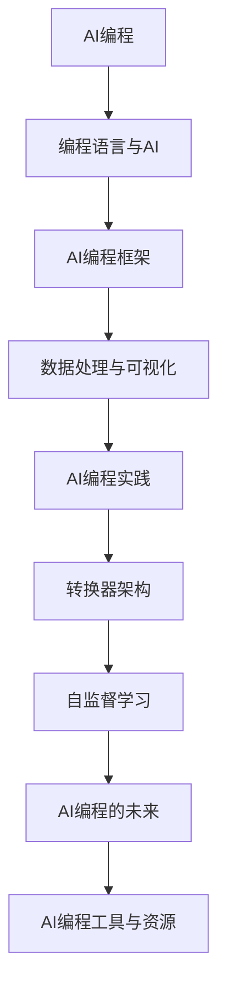

                 

# 《AI编程的新范式》

## 关键词
人工智能，编程范式，转换器架构，自监督学习，编程语言

## 摘要
本文深入探讨了人工智能编程的新范式，包括转换器架构、自监督学习等先进技术，并提供了详细的算法原理、流程图、伪代码、数学公式和项目实战实例。通过本文的阅读，读者将了解AI编程的核心概念，掌握新的编程范式，并具备在实际项目中应用这些技术的技能。

## 目录大纲

### 第一部分: AI编程基础

#### 第1章: AI编程概述
1.1 AI编程的背景与意义
1.2 AI编程的核心概念
1.3 AI编程的发展历程
1.4 AI编程的应用场景

#### 第2章: 编程语言与AI
2.1 常用编程语言在AI中的应用
2.2 AI编程语言的特点
2.3 AI编程语言的优势与挑战

#### 第3章: AI编程框架
3.1 常见的AI编程框架
3.2 深度学习框架的选择
3.3 AI编程框架的应用与比较

#### 第4章: 数据处理与可视化
4.1 数据预处理技术
4.2 数据可视化方法
4.3 数据分析工具与应用

#### 第5章: AI编程实践
5.1 AI编程项目规划
5.2 AI编程实战案例
5.3 AI编程项目总结与优化

#### 第二部分: 新范式AI编程

#### 第6章: 转换器架构
6.1 转换器架构的概念与原理
6.2 转换器架构的优势与应用
6.3 转换器架构的实现与优化

#### 第7章: 自监督学习
7.1 自监督学习的原理与方法
7.2 自监督学习的应用领域
7.3 自监督学习的挑战与解决方案

#### 第8章: AI编程的未来
8.1 AI编程的发展趋势
8.2 AI编程的未来挑战
8.3 AI编程的未来应用场景

#### 第9章: AI编程工具与资源
9.1 常用AI编程工具
9.2 AI编程资源推荐
9.3 AI编程学习路线图

#### 附录
附录A: AI编程常见问题解答
附录B: AI编程项目代码示例
附录C: AI编程参考文献与资料

### 梅里迪安流程图


### 梅里迪安伪代码
```python
# 伪代码：自监督学习算法实现
function SelfSupervisedLearning(data, model, epochs):
    for epoch in range(epochs):
        for batch in data:
            # 前向传播
            predictions = model(batch)

            # 计算损失函数
            loss = compute_loss(predictions, batch)

            # 反向传播与优化
            model.backward(loss)

    return model
```

### 数学公式讲解
$$
\text{损失函数} = \frac{1}{2} \sum_{i=1}^{n} (\hat{y}_i - y_i)^2
$$

损失函数是衡量预测值与真实值之间差异的指标，其中 $y_i$ 为真实值，$\hat{y}_i$ 为预测值。

### 项目实战
1. 开发环境搭建
2. 数据集准备
3. 模型训练与调参
4. 模型评估与优化
5. 项目总结与分享

### 代码解读与分析
```python
# 代码示例：转换器架构实现
class TransformerModel(nn.Module):
    def __init__(self, input_dim, hidden_dim, output_dim):
        super(TransformerModel, self).__init__()
        self.embedding = nn.Embedding(input_dim, hidden_dim)
        self.transformer = nn.Transformer(hidden_dim, hidden_dim)
        self.fc = nn.Linear(hidden_dim, output_dim)
    
    def forward(self, x):
        x = self.embedding(x)
        x = self.transformer(x)
        x = self.fc(x)
        return x

```

该代码实现了一个简单的转换器模型，包括嵌入层、转换器层和全连接层。在训练过程中，通过调整模型的超参数，可以优化模型的表现。通过该模型，可以实现对输入数据的转换和输出预测。

接下来，我们将逐一展开每个章节的内容，深入探讨AI编程的基础、新范式以及未来发展趋势。让我们开始这一段技术的旅程。

---

### 第一部分: AI编程基础

#### 第1章: AI编程概述

人工智能（AI）编程作为当代最具前瞻性和发展潜力的技术领域，正迅速改变着各行各业的运作方式。从自动驾驶汽车到自然语言处理，从图像识别到医疗诊断，人工智能的应用场景正变得日益丰富和多样化。

**1.1 AI编程的背景与意义**

AI编程的起源可以追溯到20世纪50年代，当时计算机科学家们开始探索如何使计算机模拟人类智能。随着计算能力和算法的进步，AI技术逐渐从理论研究走向实际应用。如今，AI编程已经成为了推动社会发展和科技进步的重要力量。

AI编程的意义在于其能够解决复杂问题，提高生产效率，创造新的商业模式，并极大地提升人类生活质量。例如，在金融领域，AI可以用于风险管理、欺诈检测和投资策略优化；在医疗领域，AI可以辅助医生进行疾病诊断和治疗；在制造业，AI可以用于生产线的自动化控制和产品质量检测。

**1.2 AI编程的核心概念**

AI编程涉及的核心概念包括：

- **机器学习（Machine Learning）**：通过算法从数据中学习，使计算机能够进行预测和决策。
- **深度学习（Deep Learning）**：一种特殊的机器学习方法，通过多层神经网络来学习和模拟复杂的数据模式。
- **神经网络（Neural Networks）**：模仿人脑神经元连接的结构，用于数据处理和特征提取。
- **自然语言处理（Natural Language Processing, NLP）**：使计算机能够理解和生成人类语言。
- **计算机视觉（Computer Vision）**：使计算机能够从图像或视频中提取信息。

**1.3 AI编程的发展历程**

AI编程的发展历程可以分为以下几个阶段：

1. **早期探索阶段（1950s-1960s）**：这个时期以符号主义和逻辑推理为主要方法，如专家系统和推理机。
2. **人工智能寒冬阶段（1970s-1980s）**：由于实际应用效果不佳，AI研究进入低潮期。
3. **复兴阶段（1990s-2000s）**：随着计算能力的提高和数据量的增加，机器学习和深度学习开始兴起。
4. **繁荣阶段（2010s至今）**：大数据、云计算和GPU加速推动了AI技术的快速发展，AI编程迎来了黄金时代。

**1.4 AI编程的应用场景**

AI编程的应用场景非常广泛，以下是一些典型的应用场景：

- **图像识别**：用于人脸识别、物体检测和图像分类。
- **语音识别**：用于语音助手、自动字幕和语音翻译。
- **自然语言处理**：用于机器翻译、文本摘要和情感分析。
- **自动驾驶**：用于无人车和无人飞行器的自动导航。
- **医疗诊断**：用于疾病检测、药物研发和个性化医疗。
- **金融分析**：用于风险评估、股票交易和市场预测。

在下一章中，我们将深入探讨编程语言在AI编程中的应用，以及AI编程语言的特点和优势。敬请期待。

---

### 第一部分: AI编程基础

#### 第2章: 编程语言与AI

在人工智能编程领域，选择合适的编程语言是至关重要的一步。不同的编程语言在AI开发中有着各自的特点和优势，能够适应不同的应用场景和需求。本章节将介绍常用编程语言在AI中的应用，探讨AI编程语言的特点和优势与挑战。

**2.1 常用编程语言在AI中的应用**

以下是一些在AI编程中常用的编程语言：

- **Python**：由于其强大的科学计算库（如NumPy、Pandas、SciPy）和深度学习框架（如TensorFlow、PyTorch），Python成为了AI编程的首选语言。Python的简洁语法和丰富的库支持使得快速原型开发和实验变得非常容易。
  
- **R**：R是一种专门用于统计分析的语言，广泛用于数据分析和机器学习。R的包管理系统和丰富的统计模型库为数据科学家提供了强大的工具。

- **Java**：Java在大型企业级应用中有着广泛的应用，其稳定性、安全性和跨平台特性使得它成为构建大规模AI系统的理想选择。

- **C++**：C++因其高性能和可控制性，在需要高性能计算和实时应用的AI项目中非常受欢迎。深度学习库如Caffe和MXNet就是用C++编写的。

- **Julia**：Julia是一种新兴的编程语言，以其高性能和易于使用著称。它结合了Python的易用性和C++的高性能，适合进行高性能AI计算。

**2.2 AI编程语言的特点**

AI编程语言的特点主要表现在以下几个方面：

- **易用性**：AI编程语言通常具有简洁的语法和强大的库支持，使得开发者可以快速构建和测试模型。
  
- **高效性**：高性能是AI编程语言的一个重要特点，特别是在处理大规模数据和高计算需求时。

- **灵活性**：AI编程语言通常具有高度的灵活性，允许开发者根据具体需求进行定制化开发。

- **跨平台性**：AI编程语言通常支持跨平台部署，使得模型可以在不同的硬件和操作系统上运行。

**2.3 AI编程语言的优势与挑战**

**优势**：

- **丰富的库和框架**：AI编程语言通常拥有丰富的库和框架，为开发者提供了丰富的工具和资源，使得AI模型的开发变得更加高效。

- **快速迭代和原型开发**：简洁的语法和易于使用的库使得开发者可以快速迭代和实验，加速了AI模型的开发和优化。

- **跨学科融合**：AI编程语言不仅支持计算机科学，还融合了数学、统计学和工程学等领域的知识，为多学科交叉提供了可能。

**挑战**：

- **性能瓶颈**：尽管AI编程语言具有高性能的特性，但在处理极端高性能需求时仍可能遇到瓶颈。

- **生态系统不完善**：一些AI编程语言（如Julia）虽然具有潜力，但其生态系统和库支持尚不完善，可能限制其应用范围。

- **学习曲线**：一些AI编程语言（如R）可能对初学者来说学习曲线较陡，需要一定的专业背景知识。

在下一章中，我们将探讨常见的AI编程框架，分析其特点和应用。敬请期待。

---

### 第一部分: AI编程基础

#### 第3章: AI编程框架

AI编程框架是AI开发中的重要工具，为开发者提供了丰富的功能和便捷的接口，使得复杂模型的构建和优化变得更加高效。本章将介绍常见的AI编程框架，探讨如何选择深度学习框架，以及这些框架在实际应用中的比较。

**3.1 常见的AI编程框架**

以下是一些在AI开发中广泛使用的编程框架：

- **TensorFlow**：由谷歌开发，是当前最受欢迎的开源深度学习框架之一。TensorFlow提供了丰富的API和工具，支持多种编程语言，包括Python、C++和Java。

- **PyTorch**：由Facebook的AI研究团队开发，以其动态计算图和灵活的接口而闻名。PyTorch的动态计算图使得模型构建和调试变得更加直观。

- **Keras**：是一个高层次的神经网络API，建立在TensorFlow和Theano之上。Keras以其简洁的接口和易于使用的特性受到了开发者的青睐。

- **Caffe**：由伯克利视觉与学习中心开发，是一个深度学习框架，特别适合图像识别任务。Caffe以高效性和可扩展性著称。

- **MXNet**：由Apache Software Foundation维护，是一个灵活的深度学习框架，支持多种编程语言，包括Python、R、Scala和Julia。

- **Theano**：是一个Python库，用于定义、优化和评估数学表达式。虽然Theano的开发已经暂停，但其在某些特定场景中仍然被使用。

**3.2 深度学习框架的选择**

选择深度学习框架时，需要考虑以下几个因素：

- **易用性**：选择一个易于学习和使用的框架可以减少开发成本和上手难度。

- **性能**：框架的性能直接影响模型的训练速度和效果。需要考虑CPU和GPU的支持，以及优化算法的效率。

- **生态系统和社区支持**：一个强大的生态系统和活跃的社区可以提供丰富的资源和帮助，解决开发中的问题。

- **可扩展性和灵活性**：框架是否支持分布式训练和部署，是否能够适应不同的硬件平台。

**3.3 AI编程框架的应用与比较**

以下是对几个常见AI编程框架的简要比较：

- **TensorFlow**：TensorFlow以其强大的功能和广泛的社区支持而著称。它适用于复杂模型和高性能需求，但在动态计算方面不如PyTorch灵活。

- **PyTorch**：PyTorch以其动态计算图和直观的接口而受到欢迎。它适合快速原型开发和实验，但可能在性能上不如TensorFlow。

- **Keras**：Keras提供了简洁的接口和丰富的功能，特别适合快速开发。它依赖于TensorFlow或Theano，提供了高层API，简化了模型构建。

- **Caffe**：Caffe以其高效性和可扩展性在图像识别领域表现出色。它适合大规模图像处理任务，但在其他类型的任务上使用较少。

- **MXNet**：MXNet支持多种编程语言，具有灵活性和可扩展性。它适用于多语言和分布式训练，特别适合工业应用。

- **Theano**：虽然Theano的开发已经暂停，但它仍然在某些场景中被使用。Theano提供了强大的数学表达和优化功能，适合复杂的计算任务。

在下一章中，我们将探讨数据处理与可视化在AI编程中的重要性，并介绍相关技术。敬请期待。

---

### 第一部分: AI编程基础

#### 第4章: 数据处理与可视化

在人工智能编程中，数据是驱动模型学习和预测的核心资源。有效的数据处理与可视化技术能够显著提升模型性能，帮助开发者更好地理解和分析数据，从而实现高效的AI应用。本章将介绍数据预处理技术、数据可视化方法和数据分析工具与应用。

**4.1 数据预处理技术**

数据预处理是AI编程中至关重要的一步，其目的是提高数据质量和模型的泛化能力。以下是一些常用的数据预处理技术：

- **数据清洗**：处理缺失值、异常值和重复值，确保数据的一致性和准确性。

- **数据转换**：将数据转换为适合模型训练的格式，如归一化、标准化和缩放。

- **特征提取**：从原始数据中提取有用的特征，如主成分分析（PCA）和特征选择。

- **数据增强**：通过生成虚拟数据样本来扩充训练集，提高模型的鲁棒性。

**4.2 数据可视化方法**

数据可视化是理解和传达数据信息的重要手段。以下是一些常见的数据可视化方法：

- **散点图**：用于展示两组变量之间的关系。

- **直方图**：用于显示数据的分布情况。

- **箱线图**：用于比较不同数据集的统计特征。

- **热力图**：用于展示多维数据的关联性。

- **时间序列图**：用于展示数据随时间的变化趋势。

**4.3 数据分析工具与应用**

在AI编程中，常用的数据分析工具包括Python中的Pandas、Matplotlib和Seaborn等。以下是一些具体应用：

- **Pandas**：提供强大的数据操作和分析功能，支持数据清洗、转换和合并。

- **Matplotlib**：用于创建高质量的静态图表。

- **Seaborn**：基于Matplotlib，提供丰富的可视化样式和统计图形。

- **Plotly**：用于创建交互式图表和可视化。

- **TensorBoard**：TensorFlow的工具，用于可视化模型训练过程和参数。

通过数据预处理与可视化，开发者能够更好地理解数据，发现潜在的模式和关联，从而构建出更有效的AI模型。在下一章中，我们将探讨AI编程实践，介绍项目规划、实战案例和项目总结。敬请期待。

---

### 第一部分: AI编程基础

#### 第5章: AI编程实践

在了解了AI编程的基础理论和常用技术后，通过实际项目来应用和实践这些知识是至关重要的。本章将介绍AI编程项目规划、实战案例和项目总结，帮助读者将理论转化为实践，掌握AI编程的实用技能。

**5.1 AI编程项目规划**

一个成功的AI项目需要清晰的项目规划和目标设定。以下是在规划AI项目时需要考虑的几个关键步骤：

- **项目目标**：明确项目的目的和预期目标，如提高预测准确性、优化生产效率或改进用户体验。

- **数据需求**：确定所需的数据类型和量级，包括数据来源、数据质量要求以及数据获取方式。

- **技术栈选择**：根据项目需求选择合适的编程语言、框架和工具，确保技术栈的稳定性和适应性。

- **时间规划**：制定项目的时间表，包括开发阶段、测试阶段和部署阶段，确保项目按计划推进。

- **团队分工**：明确团队成员的角色和职责，确保每个成员都能充分发挥其专长。

**5.2 AI编程实战案例**

以下是一个简单的AI编程实战案例：使用Python和Keras实现一个基于卷积神经网络的手写数字识别模型。

1. **开发环境搭建**

首先，需要安装Python和必要的库，如TensorFlow和Keras。可以使用Anaconda来管理环境和依赖。

```bash
conda create -n mnist_env python=3.8
conda activate mnist_env
conda install tensorflow keras
```

2. **数据集准备**

使用MNIST数据集，该数据集包含70,000个手写数字图像和10,000个测试图像。

```python
from tensorflow.keras.datasets import mnist
(train_images, train_labels), (test_images, test_labels) = mnist.load_data()
```

3. **模型训练与调参**

构建一个简单的卷积神经网络模型，并使用训练数据对其进行训练。在训练过程中，可以通过调整学习率、批次大小和迭代次数等超参数来优化模型性能。

```python
from tensorflow.keras import layers, models

model = models.Sequential()
model.add(layers.Conv2D(32, (3, 3), activation='relu', input_shape=(28, 28, 1)))
model.add(layers.MaxPooling2D((2, 2)))
model.add(layers.Conv2D(64, (3, 3), activation='relu'))
model.add(layers.MaxPooling2D((2, 2)))
model.add(layers.Conv2D(64, (3, 3), activation='relu'))

model.add(layers.Flatten())
model.add(layers.Dense(64, activation='relu'))
model.add(layers.Dense(10, activation='softmax'))

model.compile(optimizer='adam',
              loss='sparse_categorical_crossentropy',
              metrics=['accuracy'])

model.fit(train_images, train_labels, epochs=5)
```

4. **模型评估与优化**

使用测试数据集对模型进行评估，并分析模型性能。根据评估结果，可以进一步调整模型结构和超参数，以提高准确性。

```python
test_loss, test_acc = model.evaluate(test_images,  test_labels, verbose=2)
print('\nTest accuracy:', test_acc)
```

5. **项目总结与分享**

在项目完成后，进行项目总结，包括模型性能分析、开发经验和技术挑战。这些总结可以为后续项目提供宝贵的经验教训。

**5.3 AI编程项目总结与优化**

在AI编程项目中，常见的优化方法包括：

- **数据增强**：通过生成虚拟数据样本来扩充训练集，提高模型的泛化能力。

- **模型集成**：将多个模型的结果进行集成，以提高预测的准确性。

- **超参数调优**：通过调整学习率、批次大小、迭代次数等超参数来优化模型性能。

- **正则化技术**：如Dropout、L1/L2正则化等，减少模型过拟合。

通过实际项目，开发者能够将AI编程理论知识应用到实际场景中，提升编程技能和问题解决能力。在下一部分中，我们将探讨AI编程的新范式，包括转换器架构和自监督学习等先进技术。敬请期待。

---

### 第二部分: 新范式AI编程

#### 第6章: 转换器架构

转换器架构（Transformer Architecture）是近年来在深度学习领域引起广泛关注的一种新型神经网络架构，尤其是在自然语言处理（NLP）领域取得了显著的成功。本章节将详细介绍转换器架构的概念与原理，探讨其优势与应用，并分析实现与优化方法。

**6.1 转换器架构的概念与原理**

转换器架构是由谷歌在2017年提出的一种用于序列到序列学习的神经网络模型，其核心思想是利用自注意力机制（Self-Attention Mechanism）来处理输入序列。与传统序列模型（如RNN、LSTM）不同，转换器架构通过全局 attent

