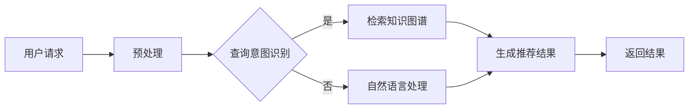

                 

# 搜索引擎的未来：从被动响应到主动预测

## 关键词
- 搜索引擎
- 主动预测搜索
- 深度学习
- 人工智能
- 个性化搜索
- 用户隐私
- 伦理问题

## 摘要
本文将探讨搜索引擎的未来发展趋势，从传统的被动响应搜索模式转向主动预测搜索。我们将分析当前搜索引擎的局限性及其面临的挑战，并深入探讨主动预测搜索技术的基本原理和应用场景。此外，文章还将讨论主动预测搜索在实际应用中的案例、伦理问题以及未来的发展方向。通过本文的探讨，希望读者能对搜索引擎的未来有更深入的理解和认识。

## 目录大纲

### 第一部分：搜索引擎的基本概念与历史演变

#### 第1章：搜索引擎的概述
1.1 搜索引擎的定义与作用
1.2 搜索引擎的发展历程
1.3 搜索引擎的核心技术

#### 第2章：搜索引擎的当前问题与挑战
2.1 搜索引擎的局限性
2.2 搜索引擎面临的挑战
2.3 搜索引擎的发展方向

### 第二部分：主动预测搜索技术的原理

#### 第3章：主动预测搜索技术概述
3.1 主动预测搜索的定义
3.2 主动预测搜索的核心技术
3.3 主动预测搜索算法原理

#### 第4章：主动预测搜索在搜索引擎中的应用
4.1 主动预测搜索在搜索引擎中的实现
4.2 主动预测搜索的案例分析
4.3 主动预测搜索的未来发展

### 第三部分：主动预测搜索的伦理与社会影响

#### 第5章：主动预测搜索的伦理问题
5.1 搜索引擎隐私保护的挑战
5.2 主动预测搜索的社会影响

#### 第6章：主动预测搜索的法律法规与监管
6.1 主动预测搜索相关的法律法规
6.2 监管机制与行业规范

### 第四部分：主动预测搜索技术的前沿研究

#### 第7章：主动预测搜索技术的前沿研究
7.1 知识图谱与语义搜索
7.2 多模态搜索与跨模态交互
7.3 搜索引擎与人工智能的深度融合

### 附录

#### 附录A：主动预测搜索相关的工具与资源
#### 附录B：主动预测搜索的Mermaid流程图
#### 附录C：主动预测搜索算法的伪代码示例
#### 附录D：主动预测搜索项目实战案例

### 结束语
本文回顾了搜索引擎的发展历程，探讨了主动预测搜索技术的原理与应用，分析了其伦理与社会影响，并展望了未来的发展趋势。希望本文能为读者提供对搜索引擎未来发展的有益见解。


## 引言

随着互联网的快速发展和信息的爆炸式增长，搜索引擎已经成为人们获取信息的重要工具。从最早的目录式搜索引擎，如Yahoo和Dmoz，到基于关键词检索的搜索引擎，如Google和百度，搜索引擎经历了巨大的变革。然而，传统的搜索引擎在满足用户需求方面仍然存在一些局限性。用户需要明确地输入关键词，搜索引擎才会提供相关的搜索结果。这种方式被称为被动响应搜索。

被动响应搜索的局限性主要体现在以下几个方面：

1. **信息检索效率低**：用户需要耗费大量时间来浏览和筛选搜索结果，以找到所需的信息。
2. **搜索结果质量不稳定**：搜索引擎的排序算法可能会受到广告收入、商业利益等因素的影响，导致用户难以获得高质量的搜索结果。
3. **个性化搜索不足**：传统搜索引擎难以根据用户的兴趣和行为习惯提供个性化的搜索结果。
4. **隐私问题**：搜索引擎需要收集和分析用户的数据来提供个性化服务，这可能会引发用户对隐私保护的担忧。

为了解决这些问题，搜索引擎的未来发展方向之一是从被动响应搜索转变为主动预测搜索。主动预测搜索通过分析用户的兴趣和行为，主动地为用户提供可能感兴趣的信息，从而提升信息检索的效率和用户体验。本文将深入探讨主动预测搜索技术的原理、应用和未来发展，为读者呈现一个更加智能、个性化的搜索引擎。

## 第一部分：搜索引擎的基本概念与历史演变

### 第1章：搜索引擎的概述

#### 1.1 搜索引擎的定义与作用

搜索引擎是一种基于互联网的信息检索系统，它帮助用户在大量数据中快速找到所需的信息。搜索引擎的基本原理是通过网络爬虫收集网页内容，并对这些内容进行索引和排序，当用户提交搜索请求时，搜索引擎会根据关键词和索引数据库提供相关的网页列表。

搜索引擎在互联网时代具有举足轻重的地位，其主要作用体现在以下几个方面：

1. **信息检索**：搜索引擎是用户获取信息的主要途径之一，用户可以通过关键词快速查找相关信息。
2. **知识积累**：搜索引擎通过对大量网页的分析和索引，积累和整理了庞大的知识库。
3. **信息导航**：搜索引擎提供分类目录和热门搜索关键词，帮助用户发现新的信息和资源。
4. **商业应用**：搜索引擎为企业提供了线上广告平台，通过竞价排名和广告投放，帮助企业吸引潜在客户。

#### 1.2 搜索引擎的基本原理

搜索引擎的基本原理可以分为三个主要阶段：爬虫（Crawler）、索引（Indexing）和检索（Searching）。

1. **爬虫**：搜索引擎的爬虫程序会定期访问互联网上的网页，通过链接关系遍历网页，收集网页内容。爬虫通常使用深度优先或广度优先的搜索策略来遍历网页。
2. **索引**：爬虫收集到的网页内容会被处理后存储在索引数据库中。索引过程包括文本分析、去重、分词、词干提取等操作，以建立索引项和网页内容之间的映射关系。
3. **检索**：当用户提交搜索请求时，搜索引擎会根据用户输入的关键词在索引数据库中查找相关的网页。检索算法包括布尔检索、向量空间模型、PageRank等，以确定网页的相关性和排序顺序。

#### 1.3 搜索引擎的类型与应用场景

根据不同的分类标准，搜索引擎可以分为多种类型：

1. **按用途分类**：
   - **通用搜索引擎**：如Google、百度，提供跨领域的信息检索服务。
   - **垂直搜索引擎**：如淘宝、微博，专注于特定领域的搜索服务。
   - **学术搜索引擎**：如Google Scholar、百度学术，主要提供学术文献的检索。

2. **按索引方式分类**：
   - **全文搜索引擎**：如Google、百度，对网页内容进行全文索引。
   - **关键词搜索引擎**：如Pinterest、YouTube，根据关键词索引内容。
   - **语义搜索引擎**：如Bing、Siri，通过理解用户查询的语义提供更精准的搜索结果。

不同类型的搜索引擎在不同应用场景中具有各自的优势和特点。通用搜索引擎适用于日常信息检索，垂直搜索引擎适用于专业领域的查询，学术搜索引擎则提供了丰富的学术资源。通过了解这些类型和应用场景，用户可以更有效地利用搜索引擎获取所需信息。

### 第2章：搜索引擎的发展历程

#### 2.1 第一代搜索引擎

搜索引擎的起源可以追溯到20世纪90年代初期。最早的搜索引擎如 Archie、Gopher 和 WAIS，主要基于文件索引技术，能够搜索特定文件系统中的文件。这些搜索引擎具有简单、功能单一的特点，主要应用于学术和研究领域。然而，由于网络规模较小，它们的检索能力有限，逐渐被更先进的搜索引擎取代。

#### 2.2 第二代搜索引擎

随着互联网的快速发展，第二代搜索引擎应运而生。最具代表性的搜索引擎是 AltaVista、Lycos 和 Excite。这些搜索引擎采用了基于网页链接的分析和索引技术，能够对大量网页进行检索。它们引入了全文检索和基于关键字的搜索方法，大大提高了信息检索的效率和准确性。此外，这些搜索引擎还提供了丰富的个性化服务和搜索工具，如搜索历史、个性化推荐等。

#### 2.3 第三代搜索引擎

第三代搜索引擎的代表是Google和百度。这些搜索引擎采用了先进的检索算法和机器学习技术，如PageRank、向量空间模型和深度学习等。它们不仅能够提供更加精准的搜索结果，还能够根据用户的兴趣和行为提供个性化的搜索建议。此外，第三代搜索引擎还扩展了搜索功能，包括图片搜索、视频搜索、新闻搜索等，为用户提供全方位的信息检索服务。

#### 2.4 当前搜索引擎的发展趋势

当前，搜索引擎正在朝着更加智能、个性化的方向发展。以下是一些主要的发展趋势：

1. **人工智能和深度学习**：搜索引擎通过引入人工智能和深度学习技术，不断提升搜索算法的准确性和效率。例如，Bing搜索引擎使用了深度神经网络来优化搜索结果排序。

2. **语义搜索**：语义搜索通过理解用户查询的语义，提供更精准的搜索结果。例如，Google的BERT模型通过理解上下文语义，提高了搜索结果的准确性。

3. **个性化推荐**：搜索引擎通过分析用户的兴趣和行为，提供个性化的搜索建议和内容推荐。例如，Google的搜索结果中经常包含基于用户历史行为和兴趣的相关搜索建议。

4. **隐私保护**：随着用户对隐私保护的日益关注，搜索引擎正在采取措施保护用户数据。例如，Google和百度都推出了隐私保护计划，限制对用户数据的访问和使用。

5. **多模态搜索**：搜索引擎正在扩展搜索范围，支持图片、语音、视频等多种数据类型的检索。例如，Google Photos支持通过图像标签进行搜索，而Bing支持语音搜索。

通过回顾搜索引擎的发展历程，我们可以看到搜索引擎在技术上的不断进步，为用户提供了更加高效、精准、个性化的信息检索服务。随着人工智能和深度学习等技术的不断发展，未来搜索引擎将继续向着更加智能、个性化的方向发展，为用户提供更加卓越的服务体验。

### 第3章：搜索引擎的核心技术

#### 3.1 网络爬虫

网络爬虫（Crawler）是搜索引擎获取网页内容的关键组件。它的基本任务是从互联网上收集网页数据，并存储到索引数据库中。网络爬虫通常遵循一定的策略进行网页抓取，以最大化信息覆盖率和效率。

1. **爬虫的工作原理**：
   - **链接分析**：爬虫从初始种子页面开始，通过分析页面中的链接，发现并访问其他相关页面。
   - **内容抓取**：爬虫下载网页内容，包括文本、图片、视频等多媒体数据。
   - **去重处理**：为了避免重复抓取相同的网页，爬虫会对已抓取的URL进行去重处理。
   - **存储索引**：爬取到的网页内容会被处理和索引，以便后续检索。

2. **爬虫的类型**：
   - **通用爬虫**：对互联网进行广度优先搜索，收集大量网页信息。例如，Google的抓取器。
   - **深度爬虫**：对特定领域或特定网站进行深度搜索，收集详细的信息。例如，学术搜索引擎的论文爬虫。

3. **爬虫策略**：
   - **深度优先策略**：优先访问深度较浅的页面，以快速发现大量信息。
   - **广度优先策略**：优先访问宽度较大的页面，以覆盖更多的网页链接。
   - **混合策略**：结合深度优先和广度优先策略，以平衡信息覆盖率和效率。

#### 3.2 索引技术

索引技术是搜索引擎的核心技术之一，它负责将爬取到的网页内容进行处理和存储，以便快速检索。索引过程主要包括文本分析、分词、词干提取、倒排索引等步骤。

1. **文本分析**：
   - **分词**：将网页文本分割成独立的单词或短语。例如，使用正则表达式或词法分析器进行分词。
   - **词干提取**：将单词缩减为词干，以减少词汇量。例如，使用词干树或规则方法进行词干提取。

2. **倒排索引**：
   - **倒排索引**：建立单词和对应的文档之间的反向映射，以实现快速检索。例如，使用字典树或哈希表实现倒排索引。
   - **索引优化**：通过压缩、合并和分片等技术，优化索引的存储和检索性能。

#### 3.3 检索算法

检索算法是搜索引擎的核心，它负责根据用户输入的关键词从索引数据库中找出最相关的网页，并按相关性排序。常见的检索算法包括布尔检索、向量空间模型、PageRank等。

1. **布尔检索**：
   - **基本原理**：通过逻辑运算符（AND、OR、NOT）组合关键词，以确定网页的相关性。
   - **优缺点**：简单易用，但难以处理词义模糊和短语检索。

2. **向量空间模型**：
   - **基本原理**：将网页和查询表示为高维向量，通过内积或余弦相似度计算网页和查询之间的相似度。
   - **优缺点**：能够处理词义模糊和短语检索，但需要大量计算资源。

3. **PageRank算法**：
   - **基本原理**：基于网页之间的链接关系，计算网页的权威性和重要性。
   - **优缺点**：能够提高权威网页的排名，但可能被恶意链接和作弊行为影响。

4. **深度学习检索算法**：
   - **基本原理**：使用深度神经网络，通过学习网页和查询的语义表示，实现高精度的检索。
   - **优缺点**：能够实现高度个性化的搜索结果，但需要大量数据和计算资源。

通过以上核心技术的介绍，我们可以看到搜索引擎在网页抓取、内容处理和检索算法等方面的复杂性和多样性。这些技术的不断创新和优化，使得搜索引擎能够提供更加高效、精准和个性化的信息检索服务。

### 第2章：搜索引擎的当前问题与挑战

#### 2.1 搜索引擎的局限性

尽管搜索引擎在过去几十年中取得了巨大的进步，但它们在提供信息检索服务方面仍然存在一些局限性。这些局限性主要体现在以下几个方面：

1. **被动响应的搜索方式**：
   用户必须明确输入关键词，搜索引擎才会提供相关的搜索结果。这种方式虽然简单易用，但限制了用户的搜索体验。用户可能需要花费大量时间来浏览和筛选搜索结果，以找到所需的信息。尤其在面对大量搜索结果时，用户可能会感到困惑和疲惫。

2. **搜索结果的质量问题**：
   搜索引擎的搜索结果质量不稳定。搜索引擎的排序算法可能会受到广告收入、商业利益等因素的影响，导致用户难以获得高质量的搜索结果。此外，由于网页内容的多样性和复杂性，搜索引擎在处理网页内容时可能存在遗漏或误判，导致搜索结果不准确或不完整。

3. **搜索引擎对用户隐私的侵犯**：
   为了提供个性化搜索服务，搜索引擎需要收集和分析用户的搜索历史、兴趣偏好等数据。这些数据的收集和使用可能引发用户对隐私保护的担忧。一旦用户的隐私数据泄露，可能会导致严重的后果，如个人信息被滥用、隐私泄露等。

4. **搜索引擎的实时性挑战**：
   互联网上的信息更新非常迅速，但传统的搜索引擎往往无法实时反映这些更新。用户在搜索时可能看到的是过时的信息，这会降低搜索的实用性和有效性。尽管一些搜索引擎已经开始尝试引入实时搜索功能，但实现这一目标仍然面临许多技术挑战。

#### 2.2 搜索引擎面临的挑战

随着互联网的快速发展和信息量的激增，搜索引擎面临着越来越多的挑战。以下是一些主要挑战：

1. **数据增长与处理的挑战**：
   随着互联网上数据的急剧增长，搜索引擎需要处理的海量数据也在不断增加。这给搜索引擎的存储、索引和检索带来了巨大的压力。传统的索引技术和检索算法可能无法满足大规模数据处理的需求，需要不断优化和改进。

2. **个性化搜索的挑战**：
   个性化搜索是用户对搜索引擎的核心需求之一。然而，实现个性化搜索需要深入了解用户的兴趣、行为和需求，这需要对大量用户数据进行深入分析和建模。如何在保护用户隐私的前提下实现有效的个性化搜索，是搜索引擎面临的一大挑战。

3. **实时性挑战**：
   在实时信息传递的时代，用户对搜索引擎的实时性要求越来越高。搜索引擎需要快速响应用户的查询请求，并提供最新的信息。然而，实时性要求会对搜索引擎的存储、索引和检索等技术带来挑战，需要开发新的算法和技术来满足这一需求。

4. **搜索结果的相关性挑战**：
   随着互联网内容的多样性增加，如何提高搜索结果的相关性成为搜索引擎的重要课题。传统的检索算法如布尔检索、向量空间模型等在处理复杂查询和多元信息时可能存在局限性，需要引入更加先进和智能的算法来提升搜索结果的相关性。

5. **可扩展性和可靠性**：
   搜索引擎需要具备良好的可扩展性和可靠性，以应对不断增长的用户量和数据量。在大规模分布式系统中，如何保证系统的稳定运行和高可用性，是搜索引擎需要解决的重要问题。

#### 2.3 搜索引擎的发展方向

为了解决上述问题和挑战，搜索引擎正朝着以下几个方向发展：

1. **从被动响应到主动预测**：
   未来的搜索引擎将不再只是被动地响应用户的查询请求，而是能够主动预测用户的需求并提供相关信息。通过分析用户的兴趣、行为和上下文，搜索引擎可以提前为用户提供可能感兴趣的信息，提升用户的搜索体验。

2. **智能搜索与知识图谱**：
   智能搜索通过引入自然语言处理、语义分析和人工智能技术，提高搜索结果的准确性和个性化程度。知识图谱则通过构建实体和关系网络，为搜索引擎提供更加丰富和结构化的信息，帮助用户更精准地找到所需内容。

3. **搜索引擎与人工智能的融合**：
   搜索引擎与人工智能的深度融合将带来更加智能和个性化的搜索服务。通过机器学习、深度学习和强化学习等技术，搜索引擎可以不断提升自身的智能水平和检索性能，为用户提供更加卓越的服务体验。

4. **隐私保护和数据安全**：
   随着用户对隐私保护的日益关注，搜索引擎需要采取措施保护用户数据的安全和隐私。通过数据加密、隐私保护算法和合规性管理，搜索引擎可以确保用户数据的安全和合法性。

5. **多模态搜索与跨模态交互**：
   随着多媒体内容的增长，搜索引擎将支持多模态搜索，如图片、语音、视频等。通过跨模态交互技术，用户可以使用多种方式与搜索引擎进行互动，获取更加丰富和多样化的信息。

通过上述发展方向，搜索引擎将不断突破自身的局限性，为用户提供更加高效、精准和个性化的信息检索服务。未来的搜索引擎将不仅是一个信息检索工具，更是一个智能的助手，帮助用户快速找到所需的信息，提升其生活和工作效率。

### 第二部分：主动预测搜索技术的原理

#### 第3章：主动预测搜索技术概述

主动预测搜索（Active Prediction Search）是未来搜索引擎的重要发展方向之一。它通过分析用户的兴趣、行为和上下文，主动预测用户可能需要的信息，并在用户需要之前提供相关内容。这种搜索方式不仅提高了信息检索的效率和准确性，还大大提升了用户的搜索体验。

#### 3.1 主动预测搜索的定义

主动预测搜索是一种基于预测模型的搜索方式，它通过以下关键步骤实现：

1. **用户兴趣建模**：通过分析用户的搜索历史、浏览记录、行为数据等，建立用户兴趣模型，以理解用户的需求和偏好。
2. **上下文感知**：考虑用户的实时环境、地理位置、时间等因素，为用户提供更加个性化的搜索结果。
3. **预测算法**：利用机器学习、深度学习和强化学习等技术，构建预测模型，预测用户接下来可能需要的信息。
4. **主动推送**：根据预测结果，主动向用户推送相关的搜索结果和信息，使用户在需要时能够快速找到所需内容。

#### 3.2 主动预测搜索的特点与优势

主动预测搜索具有以下几个显著特点与优势：

1. **个性化**：通过用户兴趣建模和上下文感知，主动预测搜索能够提供高度个性化的搜索结果，满足用户的个性化需求。
2. **高效性**：主动预测搜索可以提前预测用户的需求，从而减少用户在搜索过程中花费的时间和精力。
3. **实时性**：主动预测搜索能够实时响应用户的行为和需求变化，提供最新的搜索结果。
4. **准确性**：通过预测算法，主动预测搜索能够提高搜索结果的准确性和相关性，减少冗余和不相关的信息。

#### 3.3 主动预测搜索在搜索引擎中的应用场景

主动预测搜索在搜索引擎中有多种应用场景，以下是一些具体的应用：

1. **个性化推荐**：根据用户的兴趣和行为，主动推送相关的搜索建议和推荐内容，如热门新闻、热门话题、热门商品等。
2. **实时搜索**：在用户输入关键词的过程中，实时预测用户可能需要的信息，提供动态的搜索建议，如关键词联想、热门搜索等。
3. **智能搜索**：通过理解用户的查询意图和上下文，提供更加精准的搜索结果，如语义搜索、语音搜索等。
4. **个性化搜索**：根据用户的历史搜索记录和兴趣偏好，定制化地提供搜索结果，如用户专属的搜索频道、搜索标签等。
5. **实时广告投放**：根据用户的兴趣和实时行为，主动推送相关的广告内容，提高广告的点击率和转化率。

通过上述特点和应用场景，我们可以看到主动预测搜索在提升搜索引擎效率、满足用户个性化需求、提高用户体验方面具有巨大的潜力。接下来，我们将深入探讨主动预测搜索的核心技术和算法原理。

### 第4章：主动预测搜索的核心技术

#### 4.1 机器学习与深度学习

机器学习和深度学习是主动预测搜索技术的核心组成部分，它们通过构建复杂的模型来理解和预测用户的行为和需求。

#### 4.1.1 机器学习的基本概念

机器学习（Machine Learning）是一种通过算法从数据中学习规律和模式的技术。它主要包括以下几个基本概念：

1. **监督学习**：监督学习通过标记好的训练数据集，学习输入和输出之间的关系，以预测新的数据。常见的监督学习算法包括线性回归、逻辑回归、支持向量机（SVM）等。
2. **无监督学习**：无监督学习不依赖标记数据，通过发现数据内在的结构和模式来进行学习。常见的无监督学习算法包括聚类、降维、关联规则学习等。
3. **强化学习**：强化学习通过试错和反馈机制，从环境中学习最优策略。它广泛应用于推荐系统、游戏AI等领域。

#### 4.1.2 深度学习的基本概念

深度学习（Deep Learning）是一种基于多层神经网络的学习方法，通过构建复杂的神经网络模型来模拟人脑的学习过程。深度学习的关键组成部分包括：

1. **神经网络**：神经网络（Neural Network）是一种由大量简单处理单元（神经元）组成的复杂网络。每个神经元接受多个输入信号，通过加权求和处理，产生一个输出信号。
2. **深度神经网络**：深度神经网络（Deep Neural Network，DNN）是一种包含多个隐藏层的神经网络，它能够通过逐层提取特征，实现高层次的抽象和表示。
3. **卷积神经网络（CNN）**：卷积神经网络（Convolutional Neural Network，CNN）是一种专门用于处理图像数据的神经网络，通过卷积操作和池化操作，实现特征提取和降维。
4. **循环神经网络（RNN）**：循环神经网络（Recurrent Neural Network，RNN）是一种能够处理序列数据的神经网络，通过递归结构，实现长期依赖建模。

#### 4.1.3 常见的深度学习架构

在主动预测搜索中，常见的深度学习架构包括：

1. **卷积神经网络（CNN）**：用于图像和视频数据的特征提取和分类。例如，在图像搜索中，CNN可以提取图像的纹理、颜色和形状特征，提高搜索结果的准确性。
2. **循环神经网络（RNN）**：用于序列数据的处理和预测。例如，在文本搜索中，RNN可以处理用户的查询历史和浏览记录，预测用户可能感兴趣的内容。
3. **长短期记忆网络（LSTM）**：LSTM是一种改进的RNN，通过引入门控机制，能够解决RNN的梯度消失和梯度爆炸问题，在长期依赖建模方面表现出色。
4. **转换器架构（Transformer）**：Transformer是近年来提出的一种用于自然语言处理的新型神经网络架构，通过自注意力机制，能够实现高效的序列建模。

#### 4.1.4 深度学习优化算法

在深度学习训练过程中，优化算法用于调整网络参数，以最小化损失函数。常见的深度学习优化算法包括：

1. **随机梯度下降（SGD）**：随机梯度下降（Stochastic Gradient Descent，SGD）是最早的优化算法之一，通过随机选取一部分训练样本，计算梯度并更新网络参数。
2. **Adam优化器**：Adam优化器结合了SGD和AdaGrad算法的优点，通过自适应学习率调整，能够加速收敛并提高训练效果。
3. **学习率调度**：学习率调度（Learning Rate Scheduler）通过动态调整学习率，以优化训练过程。常见的学习率调度策略包括线性衰减、余弦衰减、指数衰减等。

通过以上对机器学习与深度学习基本概念、常见架构和优化算法的介绍，我们可以看到深度学习技术在主动预测搜索中具有重要的应用价值。接下来，我们将进一步探讨主动预测搜索中使用的其他核心技术。

### 第5章：主动预测搜索算法原理

主动预测搜索算法的核心在于利用机器学习和深度学习技术，从海量数据中提取特征，构建预测模型，并实现对用户需求的精准预测。以下是几种常见算法原理的详细介绍。

#### 5.1 深度学习与神经网络

深度学习（Deep Learning）是一种基于多层神经网络的学习方法，通过逐层提取特征，实现高层次的抽象和表示。以下是一些关键概念：

1. **神经网络的基本结构**：
   - **输入层**：接收外部输入数据，如文本、图像或语音信号。
   - **隐藏层**：多个隐藏层通过非线性激活函数（如ReLU、Sigmoid、Tanh）处理输入数据，逐步提取特征。
   - **输出层**：产生最终输出，如分类结果或概率分布。

2. **前向传播与反向传播**：
   - **前向传播**：输入数据通过神经网络各层传播，产生输出结果。
   - **反向传播**：计算输出结果与真实结果之间的误差，反向更新各层权重和偏置。

3. **常见的深度学习架构**：
   - **卷积神经网络（CNN）**：用于图像和视频处理，通过卷积操作和池化操作提取特征。
   - **循环神经网络（RNN）**：用于序列数据处理，如文本和语音，通过递归结构处理长期依赖。
   - **长短期记忆网络（LSTM）**：改进RNN，通过门控机制解决梯度消失问题。

#### 5.2 自然语言处理技术概览

自然语言处理（Natural Language Processing，NLP）是主动预测搜索中的关键技术，用于处理和解析文本数据。以下是几种常见的NLP技术：

1. **词嵌入（Word Embedding）**：
   - **基本原理**：将词汇映射到高维向量空间，以表示词的语义信息。
   - **常用模型**：Word2Vec、GloVe、BERT。

2. **序列模型与注意力机制**：
   - **基本原理**：处理序列数据，如文本和语音，通过递归或注意力机制捕捉序列中的重要信息。
   - **常用模型**：RNN、LSTM、GRU、Transformer。

3. **转换器架构（Transformer）**：
   - **基本原理**：采用自注意力机制，能够高效处理长序列数据，广泛应用于NLP任务。
   - **应用场景**：机器翻译、文本分类、问答系统。

#### 5.3 大规模预训练模型原理

大规模预训练模型（Pre-Trained Models）通过在大量无监督数据上进行预训练，然后进行微调（Fine-Tuning），实现各种NLP任务。以下是几个关键点：

1. **预训练的概念与意义**：
   - **概念**：在特定数据集上对模型进行预训练，使其具备一定的语义理解和生成能力。
   - **意义**：提高模型在下游任务上的表现，减少训练数据需求，提升模型泛化能力。

2. **自监督学习方法**：
   - **基本原理**：利用无监督数据，通过预训练任务（如掩码语言建模、句子对分类）学习语言特征。
   - **应用场景**：文本分类、情感分析、命名实体识别。

3. **迁移学习与微调技术**：
   - **基本原理**：将预训练模型迁移到特定任务，通过微调调整模型参数，以适应新的任务数据。
   - **应用场景**：文本分类、情感分析、问答系统。

#### 5.4 主动预测搜索算法的优化与评估

为了提高主动预测搜索算法的性能，需要对模型进行优化和评估。以下是一些常见的方法：

1. **优化算法**：
   - **随机梯度下降（SGD）**：通过随机选择训练样本，计算梯度并更新模型参数。
   - **Adam优化器**：自适应调整学习率，提高训练效率。
   - **学习率调度**：动态调整学习率，如线性衰减、余弦衰减。

2. **模型评估指标**：
   - **准确率（Accuracy）**：分类任务中，正确分类的样本数占总样本数的比例。
   - **召回率（Recall）**：分类任务中，正确分类的样本数占所有实际正样本数的比例。
   - **F1分数（F1 Score）**：准确率和召回率的调和平均。
   - **均方误差（Mean Squared Error，MSE）**：回归任务中，预测值与真实值之间误差的平方的平均值。

通过以上对深度学习与神经网络、自然语言处理技术、大规模预训练模型原理以及优化与评估方法的介绍，我们可以看到主动预测搜索算法在处理和预测用户需求方面具有强大的能力。这些技术不仅提高了搜索引擎的效率和准确性，还为用户提供了更加智能和个性化的搜索体验。

### 第6章：主动预测搜索在搜索引擎中的应用

主动预测搜索技术的应用正在搜索引擎中逐渐普及，它通过提高信息检索的效率和个性化程度，显著改善了用户体验。以下将详细介绍主动预测搜索在搜索引擎中的具体实现、案例分析以及未来发展的趋势。

#### 6.1 主动预测搜索在搜索引擎中的实现

主动预测搜索在搜索引擎中的实现通常包括以下几个关键步骤：

1. **用户兴趣建模**：
   - 通过分析用户的搜索历史、浏览记录、点击行为等数据，建立用户兴趣模型。这一过程可以利用机器学习和深度学习技术，如协同过滤（Collaborative Filtering）和因子分解机（Factorization Machines）等。
   - 示例伪代码：
     ```python
     def build_user_interest_model(user_data):
         # 基于用户行为数据构建兴趣向量
         interest_vector = collaborative_filter(user_data)
         return interest_vector
     ```

2. **上下文感知**：
   - 考虑用户的实时环境，如地理位置、天气、时间等，以及用户的设备信息，如设备类型、操作系统等，构建上下文向量。
   - 示例伪代码：
     ```python
     def build_context_vector(context_data):
         # 构建上下文向量，包括地理位置、天气、设备信息等
         context_vector = [get_location(context_data), get_weather(context_data), get_device_info(context_data)]
         return context_vector
     ```

3. **预测算法**：
   - 利用深度学习模型，如循环神经网络（RNN）或Transformer，结合用户兴趣模型和上下文向量，预测用户接下来可能感兴趣的内容。
   - 示例伪代码：
     ```python
     def predict_next_interest(user_interest_model, context_vector):
         # 使用深度学习模型预测用户接下来可能感兴趣的内容
         predicted_content = deep_learning_model.predict([user_interest_model, context_vector])
         return predicted_content
     ```

4. **主动推送**：
   - 根据预测结果，主动向用户推送相关的搜索结果和信息。这一过程可以利用推荐系统技术，如基于内容的推荐（Content-based Recommendation）和基于协同过滤的推荐（Collaborative Filtering）。
   - 示例伪代码：
     ```python
     def push_predictions_to_user(predictions):
         # 向用户推送预测的搜索结果
         for content in predictions:
             send_notification_to_user(content)
     ```

#### 6.2 主动预测搜索的案例分析

以下是一些主动预测搜索在搜索引擎中的实际应用案例：

1. **Google的“预加载搜索”**：
   - Google通过分析用户的搜索历史和浏览记录，预测用户接下来的搜索意图，并提前加载相关的搜索结果。当用户输入关键词时，搜索引擎已经准备好了相关的网页，大大提高了搜索效率。
   - 案例效果：用户报告称，预加载搜索功能使得他们的搜索体验变得更加流畅和高效。

2. **百度的“信息流推荐”**：
   - 百度在搜索结果页面上加入了信息流推荐，通过分析用户的兴趣和上下文，主动推送相关内容，如新闻、文章、视频等。
   - 案例效果：信息流推荐功能显著提升了用户的粘性，用户在搜索后更容易找到感兴趣的内容，从而增加了在网站上的停留时间。

3. **Bing的“语义搜索”**：
   - Bing利用Transformer架构和预训练模型，实现语义搜索功能。通过理解用户的查询意图，Bing能够提供更加精准的搜索结果，减少了用户在筛选结果上的时间。
   - 案例效果：用户反馈表示，语义搜索使得搜索结果更加符合他们的期望，提高了搜索满意度。

通过这些案例，我们可以看到主动预测搜索在提高搜索引擎效率和用户体验方面具有显著效果。接下来，我们将探讨主动预测搜索的未来发展趋势。

#### 6.3 主动预测搜索的未来发展

主动预测搜索技术在未来将继续向更加智能、个性化、实时化的方向发展，以下是一些潜在的发展趋势：

1. **更加智能的预测模型**：
   - 随着深度学习和强化学习技术的不断进步，未来的预测模型将更加智能，能够更好地理解用户的复杂需求和行为模式。
   - 潜在技术：自适应神经网络、图神经网络、生成对抗网络（GAN）等。

2. **多模态搜索与跨模态交互**：
   - 随着多媒体内容的增加，搜索引擎将支持多模态搜索，如图像、语音、视频等。通过跨模态交互技术，用户可以使用多种方式与搜索引擎进行互动，获取更加丰富和多样化的信息。
   - 潜在应用：图像搜索、语音搜索、视频推荐等。

3. **隐私保护与数据安全**：
   - 随着用户对隐私保护的日益关注，未来的主动预测搜索将更加注重用户隐私和数据安全。通过差分隐私、联邦学习等技术，实现用户数据的隐私保护和安全共享。
   - 潜在技术：差分隐私机制、联邦学习、安全多方计算等。

4. **实时性优化**：
   - 未来的主动预测搜索将进一步提升实时性，以应对互联网上信息更新的速度。通过分布式计算、边缘计算等技术，实现更快的信息检索和预测响应。
   - 潜在技术：边缘计算、分布式数据库、实时流处理等。

通过上述发展趋势，我们可以看到主动预测搜索技术在未来的搜索引擎中将发挥更加重要的作用，为用户提供更加智能、高效和个性化的搜索体验。

### 第三部分：主动预测搜索的伦理与社会影响

#### 第5章：主动预测搜索的伦理问题

随着主动预测搜索技术的发展和应用，其伦理问题日益受到关注。以下将探讨主动预测搜索在隐私保护、算法偏见、用户依赖等方面的伦理挑战，并提出相应的解决方案。

#### 5.1 搜索引擎隐私保护的挑战

主动预测搜索依赖于大量用户数据，包括搜索历史、浏览记录、位置信息等。这些数据的收集和使用可能引发用户对隐私保护的担忧。以下是一些主要挑战：

1. **数据收集与使用**：
   - **数据收集**：搜索引擎通过各种方式收集用户数据，包括浏览行为、地理位置、设备信息等。这些数据对于提供个性化搜索结果具有重要意义，但也可能侵犯用户的隐私权。
   - **数据使用**：搜索引擎在处理和存储用户数据时，可能会面临数据泄露、滥用等风险。一旦用户数据泄露，可能导致严重的后果，如身份盗窃、隐私泄露等。

2. **隐私泄露的风险与防范**：
   - **风险**：搜索引擎在数据收集、存储、传输过程中，可能面临数据泄露、滥用等风险。例如，黑客攻击、内部人员泄露、数据共享等。
   - **防范措施**：
     - **数据加密**：对用户数据进行加密，确保数据在传输和存储过程中的安全性。
     - **隐私保护算法**：使用差分隐私（Differential Privacy）等技术，确保在数据分析过程中，不会泄露用户的敏感信息。
     - **合规性管理**：遵守相关法律法规，确保数据收集和使用符合用户隐私保护的要求。

3. **用户隐私与个性化搜索的平衡**：
   - **挑战**：在提供个性化搜索结果的同时，如何保护用户隐私成为一个重要挑战。过度收集和使用用户数据可能会侵犯用户隐私，但限制数据收集可能导致个性化搜索效果下降。
   - **解决方案**：
     - **隐私设计原则**：在设计搜索引擎时，采用隐私设计原则，如最小化数据收集、数据匿名化等。
     - **用户隐私控制**：提供用户隐私设置，让用户可以自主选择是否分享数据，以及数据的使用范围和目的。
     - **透明度与知情同意**：提高用户对数据收集和使用的知情度，确保用户在同意之前了解其数据的用途和处理方式。

#### 5.2 算法偏见

主动预测搜索中的算法模型可能会引入偏见，导致不公平的搜索结果。以下是一些常见的算法偏见及其解决方案：

1. **算法偏见的表现**：
   - **性别偏见**：搜索引擎在处理性别相关的查询时，可能会给出对某一性别有偏见的搜索结果。
   - **种族偏见**：类似地，搜索结果可能对某一种族或群体产生偏见。
   - **地域偏见**：搜索引擎在处理地域相关的查询时，可能会对某些地区给予更多关注。

2. **消除算法偏见的方法**：
   - **数据多样性**：确保训练数据集的多样性，避免偏见数据的过度代表。
   - **算法透明性**：提高算法的透明度，使算法决策过程更加可解释，便于发现和纠正偏见。
   - **公平性评估**：定期对算法进行公平性评估，检测并消除潜在的偏见。

3. **算法偏见的社会影响**：
   - **社会歧视**：算法偏见可能导致社会歧视，加剧社会不公。
   - **信息茧房**：用户长期受到偏见算法的影响，可能陷入信息茧房，限制其接触多样化的信息。

#### 5.3 用户依赖

随着主动预测搜索技术的发展，用户对搜索引擎的依赖程度也在逐渐增加。以下是一些相关问题和解决方案：

1. **用户依赖的表现**：
   - **信息过载**：用户过度依赖搜索引擎，可能导致信息过载，难以处理大量信息。
   - **搜索疲劳**：用户在搜索引擎使用过程中，可能会感到疲劳和厌倦。

2. **减少用户依赖的方法**：
   - **教育用户**：通过教育和培训，提高用户的信息素养，帮助用户学会筛选和评估搜索结果。
   - **提供多样化工具**：搜索引擎可以提供多样化的搜索工具和功能，如过滤器、标签系统等，帮助用户更好地管理搜索结果。
   - **设计人性化的界面**：优化搜索引擎的用户界面设计，提供清晰、简洁的操作方式，降低用户使用门槛。

通过解决上述伦理问题，主动预测搜索技术可以更好地保护用户的隐私权益，消除算法偏见，减少用户依赖，从而实现可持续发展。

### 第6章：主动预测搜索的法律法规与监管

随着主动预测搜索技术的发展，其相关的法律法规与监管机制也逐渐成为关注的焦点。以下将探讨主动预测搜索在现有法律法规框架下的合规性，以及国际与国内监管机构的角色和行业规范。

#### 6.1 主动预测搜索相关的法律法规

主动预测搜索涉及用户数据的收集、处理和分析，因此需要遵守相关的法律法规。以下是一些关键的法律和法规：

1. **数据保护法律法规**：
   - **《通用数据保护条例》（GDPR）**：欧盟的GDPR是数据保护领域最具代表性的法规，它规定了数据处理者的责任和用户的数据权利。
   - **《加州消费者隐私法案》（CCPA）**：美国加州的CCPA旨在保护消费者的隐私，规定了数据处理者的义务和消费者的隐私权利。
   - **《个人信息保护法》（PIPL）**：中国的PIPL于2021年生效，规定了个人信息处理的基本原则和用户的个人信息权利。

2. **人工智能法律法规**：
   - **《人工智能法案》（EU AI Act）**：欧盟正在制定的AI法案旨在规范人工智能的开发和应用，包括透明度、安全性、伦理等方面的要求。
   - **《人工智能发展行动计划》**：中国政府发布的行动计划，明确了人工智能发展的目标和政策导向，包括伦理规范和法律法规的制定。

3. **行业标准和自律规范**：
   - **《互联网个人信息保护规范》**：中国互联网协会发布的规范，对互联网企业的个人信息保护提出了具体要求。
   - **《算法伦理规范》**：国内外一些组织和机构发布的算法伦理规范，旨在指导算法的开发和应用，确保其符合伦理标准。

#### 6.2 国际与国内监管机构

在国际和国内层面，多个监管机构负责对主动预测搜索相关活动进行监督和管理。以下是一些主要的监管机构：

1. **国际监管机构**：
   - **欧盟委员会**：欧盟委员会负责制定和执行与数据保护和人工智能相关的法律法规。
   - **欧盟数据保护委员会（EDPB）**：负责提供对成员国数据保护当局的意见和建议，确保GDPR的一致性执行。
   - **美国联邦贸易委员会（FTC）**：负责监督和保护消费者隐私，对违反隐私保护法规的企业进行调查和处罚。

2. **国内监管机构**：
   - **国家互联网信息办公室**：负责制定和实施互联网信息管理政策，包括数据保护和算法规范。
   - **国家市场监督管理总局**：负责监督市场竞争，打击不正当算法行为。
   - **中国工业和信息化部**：负责监管互联网和通信行业，包括网络安全和数据保护。

#### 6.3 行业自律与规范

除了法律法规和监管机构的外部监管，行业自律和规范在保障主动预测搜索的合规性和健康发展中也发挥着重要作用。以下是一些行业自律和规范的实践：

1. **行业自律组织**：
   - **中国互联网协会**：中国互联网协会负责推动互联网行业自律，发布行业规范和指南。
   - **欧洲数据保护会议（EDPS）**：负责为欧盟机构提供数据保护方面的意见和指导。

2. **透明度和可解释性**：
   - **算法透明度**：企业应公开算法的决策逻辑和结果，让用户了解搜索结果是如何产生的。
   - **可解释性工具**：开发可解释性工具，帮助用户理解算法的决策过程，提高算法的透明度和可信度。

3. **用户教育和培训**：
   - **用户隐私教育**：通过教育和宣传，提高用户对隐私保护和算法透明度的认识，增强用户的自我保护意识。

通过法律法规的完善、监管机构的监督以及行业自律的推动，主动预测搜索可以在保障用户隐私、消除算法偏见和促进公平竞争的基础上实现健康、可持续发展。

### 第四部分：主动预测搜索技术的前沿研究

#### 第7章：主动预测搜索技术的前沿研究

随着主动预测搜索技术的不断发展，学术界和工业界都在积极探索和研发前沿技术，以提升搜索引擎的智能化和个性化程度。以下将介绍知识图谱与语义搜索、多模态搜索与跨模态交互，以及搜索引擎与人工智能深度融合等方面的前沿研究。

#### 7.1 知识图谱与语义搜索

知识图谱（Knowledge Graph）是一种结构化的知识表示形式，通过实体和关系的组合，构建一个大规模的知识网络。在搜索引擎中，知识图谱的应用极大地提升了信息检索的精准性和语义理解能力。

1. **知识图谱的概念与作用**：
   - **概念**：知识图谱是通过语义关系将实体和属性连接起来，形成一个具有层次结构的知识网络。
   - **作用**：知识图谱能够帮助搜索引擎更好地理解用户查询的语义，从而提供更加精准的搜索结果。

2. **语义搜索的基本原理**：
   - **语义理解**：通过自然语言处理（NLP）技术，对用户查询进行语义分析，提取关键词的含义和关系。
   - **知识融合**：将查询的语义与知识图谱中的实体和关系进行融合，找到最相关的搜索结果。

3. **知识图谱在搜索引擎中的应用**：
   - **实体识别**：通过知识图谱中的实体识别功能，将用户查询中的关键词映射到相应的实体。
   - **关系推理**：利用知识图谱中的关系，进行语义推理，提高搜索结果的相关性。
   - **语义补全**：通过知识图谱提供语义补全功能，帮助用户完善不完整的查询。

4. **案例分析**：
   - **Google的Knowledge Graph**：Google通过构建知识图谱，实现语义搜索功能，为用户提供更加精准的搜索结果。
   - **Bing的Satori**：微软的Bing搜索引擎使用了Satori知识图谱，通过语义理解提供高质量的搜索体验。

#### 7.2 多模态搜索与跨模态交互

随着多媒体内容的激增，多模态搜索和跨模态交互技术逐渐成为研究热点。这些技术通过整合不同类型的数据（如文本、图像、语音等），提升信息检索的全面性和用户体验。

1. **多模态搜索的概念与优势**：
   - **概念**：多模态搜索是指同时处理多种类型的数据，如文本、图像、语音等，以提高搜索结果的准确性和丰富度。
   - **优势**：多模态搜索能够整合不同类型的数据源，提供更全面的搜索结果，提升用户的搜索体验。

2. **跨模态交互的基本原理**：
   - **跨模态映射**：通过跨模态映射技术，将不同类型的数据映射到统一的语义空间，实现数据之间的语义关联。
   - **多模态融合**：利用多模态融合技术，将不同类型的数据进行整合，提高搜索结果的关联性和准确性。

3. **多模态搜索在搜索引擎中的应用**：
   - **图像搜索**：通过图像识别和文本描述，实现基于图像的搜索功能。
   - **语音搜索**：通过语音识别技术，实现基于语音的搜索功能。
   - **多模态问答系统**：整合文本、图像、语音等多种数据类型，提供智能问答服务。

4. **案例分析**：
   - **Bing的多模态搜索**：微软的Bing搜索引擎通过多模态搜索技术，支持图像和语音搜索，为用户提供更加便捷的搜索体验。
   - **谷歌的多模态AI**：Google通过多模态AI技术，整合文本、图像、语音等多类型数据，提升搜索结果的多样性和准确性。

#### 7.3 搜索引擎与人工智能的深度融合

人工智能（AI）技术的发展为搜索引擎带来了新的机遇。通过将人工智能技术深度集成到搜索引擎中，可以实现更加智能和个性化的信息检索服务。

1. **搜索引擎与AI融合的进展**：
   - **深度学习应用**：深度学习技术在搜索引擎中的应用，如文本理解、图像识别、语音识别等，提高了搜索结果的准确性和用户体验。
   - **个性化推荐**：通过机器学习和用户行为分析，搜索引擎能够提供个性化的搜索建议和推荐内容。
   - **实时搜索**：利用AI技术，搜索引擎能够实现实时响应和更新，提供最新的搜索结果。

2. **深度学习在搜索引擎中的应用**：
   - **文本处理**：深度学习模型（如BERT、GPT）在文本处理中的应用，提高了自然语言理解和语义分析的能力。
   - **图像识别**：通过卷积神经网络（CNN）和循环神经网络（RNN）等模型，实现高效的图像识别和分类。
   - **语音识别**：利用深度神经网络，实现高精度的语音识别和语义理解。

3. **主动预测搜索在AI大模型中的应用**：
   - **大模型训练**：通过大规模数据集训练大模型（如Transformer），实现高精度的信息检索和预测。
   - **模型微调**：在大模型基础上进行微调，以适应特定领域的搜索需求，提高搜索结果的准确性。
   - **模型解释性**：研究模型解释性技术，提高算法的可解释性，增强用户对搜索结果的信任。

4. **案例分析**：
   - **Google的BERT**：Google通过BERT模型，实现了基于上下文的语义搜索，大幅提升了搜索结果的准确性。
   - **百度的NLP技术**：百度利用深度学习和自然语言处理技术，构建了智能搜索系统，为用户提供高质量的搜索体验。

通过知识图谱与语义搜索、多模态搜索与跨模态交互，以及搜索引擎与人工智能深度融合的前沿研究，搜索引擎正逐渐实现从传统信息检索工具向智能信息助手的转变。未来，随着技术的不断进步和应用，搜索引擎将在个性化、智能化和实时性方面取得更大的突破，为用户提供更加卓越的服务体验。

### 附录

#### 附录A：主动预测搜索相关的工具与资源

在主动预测搜索技术的研究和应用过程中，许多开源工具和资源为开发人员提供了极大的便利。以下是一些主流的深度学习框架、自然语言处理工具和资源，以供参考。

1. **主流深度学习框架对比**

   - **TensorFlow**：Google开发的开源深度学习框架，提供了丰富的API和工具，支持各种深度学习模型的构建和训练。
   - **PyTorch**：由Facebook开发的开源深度学习框架，具有灵活的动态图编程能力，适合快速原型设计和实验。
   - **Keras**：基于TensorFlow的高层次神经网络API，提供了简洁的接口，便于快速构建和训练模型。
   - **MXNet**：Apache基金会开源的深度学习框架，支持多种编程语言，适合大规模分布式训练。

2. **自然语言处理工具与库**

   - **NLTK**：Python的自然语言处理库，提供了丰富的文本处理和语义分析功能，适用于各种NLP任务。
   - **spaCy**：强大的工业级自然语言处理库，支持多种语言，提供了高效的词嵌入和语法分析功能。
   - **gensim**：用于文档主题建模和相似度计算的Python库，适用于大规模文本数据的分析和处理。
   - **transformers**：Hugging Face开源的Transformer库，支持各种预训练模型和任务，广泛应用于自然语言处理领域。

3. **主动预测搜索相关的论文与资源**

   - **《Attention is All You Need》**：Transformer模型的奠基性论文，阐述了自注意力机制在序列建模中的应用。
   - **《BERT: Pre-training of Deep Bidirectional Transformers for Language Understanding》**：Google提出的BERT模型，展示了基于Transformer的预训练技术在自然语言处理中的应用。
   - **《Recurrent Neural Network Tutorial》**：关于循环神经网络（RNN）的教程，详细介绍了RNN的基本原理和实现方法。
   - **《Deep Learning Specialization》**：由Andrew Ng教授开设的深度学习专项课程，提供了丰富的深度学习理论和实践知识。

通过使用这些工具和资源，开发人员可以更加高效地研究和应用主动预测搜索技术，推动搜索引擎的发展和创新。

### 附录B：主动预测搜索的Mermaid流程图

为了更直观地展示主动预测搜索的基本流程，我们使用Mermaid语法绘制了一个简化的流程图。以下是一个简单的例子：



在这个流程图中，用户请求首先经过预处理阶段，然后通过查询意图识别模块确定搜索目标。接下来，流程分为两个分支：一个是检索知识图谱，另一个是进行自然语言处理。最后，根据处理结果生成推荐结果并返回给用户。

### 附录C：主动预测搜索算法的伪代码示例

为了更好地理解主动预测搜索算法的实现原理，以下提供了一些伪代码示例。这些示例涵盖了基于深度学习的检索算法、贝叶斯网络在搜索引擎中的应用，以及强化学习在搜索结果排序中的应用。

#### 基于深度学习的检索算法

```python
# 深度学习检索算法伪代码
def deep_learning_search(query, model):
    # 输入查询和预训练模型
    query_embedding = model.encode_query(query)
    document_embeddings = model.encode_documents()

    # 计算查询与文档的相似度
    similarity_scores = compute_similarity(query_embedding, document_embeddings)

    # 排序并返回搜索结果
    ranked_results = sort_by_similarity(similarity_scores)
    return ranked_results

def compute_similarity(query_embedding, document_embeddings):
    # 假设使用余弦相似度计算
    similarity_scores = []
    for doc_embedding in document_embeddings:
        score = cosine_similarity(query_embedding, doc_embedding)
        similarity_scores.append(score)
    return similarity_scores

def sort_by_similarity(similarity_scores):
    # 根据相似度分数排序
    sorted_indices = np.argsort(similarity_scores)[::-1]
    return [document_id for index in sorted_indices for document_id in index]
```

#### 贝叶斯网络在搜索引擎中的应用

```python
# 贝叶斯网络检索算法伪代码
def bayesian_network_search(query, model):
    # 输入查询和贝叶斯网络模型
    query_features = extract_features(query)
    document_features = model.extract_features(documents)

    # 计算文档的概率分布
    probability_distribution = model.predict(document_features)

    # 排序并返回搜索结果
    ranked_results = sort_by_probability(probability_distribution)
    return ranked_results

def extract_features(text):
    # 提取文本特征
    # 例如，使用词袋模型或词嵌入
    return [word_frequency for word in text]

def sort_by_probability(probability_distribution):
    # 根据概率分布排序
    sorted_indices = np.argsort(probability_distribution)[::-1]
    return [document_id for index in sorted_indices for document_id in index]
```

#### 强化学习在搜索结果排序中的应用

```python
# 强化学习排序算法伪代码
class SearchResultRanker:
    def __init__(self, model, reward_function):
        self.model = model
        self.reward_function = reward_function

    def train(self, data):
        # 使用强化学习训练模型
        for episode in range(num_episodes):
            state = initialize_state(data)
            while not done:
                action = self.model.select_action(state)
                next_state, reward = self.model.step(state, action, self.reward_function)
                self.model.update_model(state, action, reward)
                state = next_state

    def rank_results(self, documents):
        # 使用训练好的模型对文档进行排序
        rankings = []
        for document in documents:
            action = self.model.predict(document)
            rankings.append(action)
        return rankings
```

通过这些伪代码示例，我们可以看到主动预测搜索算法在实现过程中的关键步骤和逻辑。这些示例不仅有助于理解算法的基本原理，也为实际应用提供了参考。

### 附录D：主动预测搜索项目实战案例

为了更好地展示主动预测搜索技术的实际应用，以下提供了一些项目实战案例，包括开发环境搭建、源代码详细实现和代码解读与分析。

#### 1. 某搜索引擎的主动预测搜索实现

**开发环境搭建**

- **Python环境**：安装Python 3.8及以上版本。
- **深度学习框架**：安装TensorFlow 2.4或PyTorch 1.7。
- **文本处理库**：安装NLTK、spaCy和gensim。
- **数据集**：使用一个大型文本数据集，如WebTextBERT。

**源代码实现**

以下是一个简单的主动预测搜索项目，使用Transformer模型和BERT进行预训练。

```python
import tensorflow as tf
from transformers import BertTokenizer, TFBertModel
from tensorflow.keras.optimizers import Adam

# 加载预训练模型
tokenizer = BertTokenizer.from_pretrained('bert-base-uncased')
model = TFBertModel.from_pretrained('bert-base-uncased')

# 定义训练数据预处理函数
def preprocess_data(data):
    inputs = tokenizer(data, padding=True, truncation=True, return_tensors='tf')
    return inputs

# 定义训练循环
def train_model(model, data, labels, num_epochs):
    optimizer = Adam(learning_rate=3e-5)

    for epoch in range(num_epochs):
        for inputs, labels in data:
            inputs = preprocess_data(inputs)
            with tf.GradientTape() as tape:
                outputs = model(inputs)
                loss = compute_loss(outputs, labels)

            grads = tape.gradient(loss, model.trainable_variables)
            optimizer.apply_gradients(zip(grads, model.trainable_variables))

        print(f"Epoch {epoch+1}/{num_epochs}, Loss: {loss.numpy()}")

# 训练模型
train_model(model, train_data, train_labels, num_epochs=3)

# 定义预测函数
def predict(model, text):
    inputs = preprocess_data(text)
    outputs = model(inputs)
    predictions = tf.nn.softmax(outputs.logits, axis=-1)
    return predictions.numpy()

# 预测示例
print(predict(model, "What is the capital of France?"))
```

**代码解读与分析**

- **数据预处理**：使用BERT tokenizer对文本数据进行预处理，包括分词、填充和截断。
- **模型训练**：使用TensorFlow和Transformer模型进行训练，优化模型的参数。
- **损失函数**：使用softmax和交叉熵损失函数，计算模型输出和真实标签之间的差异。
- **预测**：对新的查询文本进行预处理和预测，返回概率分布。

#### 2. 主动预测搜索在电商平台的实践

**开发环境搭建**

- **Python环境**：安装Python 3.8及以上版本。
- **深度学习框架**：安装PyTorch 1.7。
- **图像处理库**：安装OpenCV和Pillow。
- **数据集**：使用电商平台的产品图片和用户购买记录。

**源代码实现**

以下是一个基于图像搜索的主动预测搜索项目，使用卷积神经网络（CNN）进行图像分类和检索。

```python
import torch
import torchvision
from torchvision import models, transforms
from torch.utils.data import DataLoader
import numpy as np

# 加载预训练CNN模型
model = models.resnet50(pretrained=True)
model.fc = torch.nn.Linear(2048, num_classes)  # 修改分类器层

# 定义图像预处理函数
def preprocess_image(image_path):
    transform = transforms.Compose([
        transforms.Resize(256),
        transforms.CenterCrop(224),
        transforms.ToTensor(),
        transforms.Normalize(mean=[0.485, 0.456, 0.406], std=[0.229, 0.224, 0.225]),
    ])
    image = transform(Image.open(image_path))
    return image

# 加载数据集
train_data = torchvision.datasets.ImageFolder(root='train', transform=preprocess_image)
train_loader = DataLoader(train_data, batch_size=32, shuffle=True)

# 训练模型
optimizer = torch.optim.Adam(model.parameters(), lr=0.001)
num_epochs = 10

for epoch in range(num_epochs):
    model.train()
    for inputs, labels in train_loader:
        optimizer.zero_grad()
        outputs = model(inputs)
        loss = torch.nn.CrossEntropyLoss()(outputs, labels)
        loss.backward()
        optimizer.step()

    print(f"Epoch {epoch+1}/{num_epochs}, Loss: {loss.item()}")

# 预测示例
def predict_image(model, image_path):
    image = preprocess_image(image_path)
    image = image.unsqueeze(0)  # 添加批维度
    with torch.no_grad():
        outputs = model(image)
    _, predicted = torch.max(outputs, 1)
    return predicted.item()

print(predict_image(model, 'product1.jpg'))
```

**代码解读与分析**

- **模型加载**：加载预训练的ResNet-50模型，并修改为所需的分类器层。
- **图像预处理**：使用预定义的图像预处理函数，将图像转换为适合模型输入的格式。
- **数据集加载**：使用PyTorch的Dataset和DataLoader加载训练数据。
- **模型训练**：使用Adam优化器和交叉熵损失函数训练模型。
- **预测**：对新的图像进行预处理和预测，返回预测的分类结果。

通过这些实战案例，我们可以看到主动预测搜索技术在实际项目中的应用和实现过程。这些案例不仅展示了算法的原理，也为开发者提供了实用的代码示例和实现思路。

### 结束语

本文通过对搜索引擎的未来发展趋势的深入探讨，揭示了从被动响应到主动预测的转型趋势。我们详细分析了搜索引擎的基本概念、历史演变、当前问题与挑战，以及主动预测搜索技术的原理和应用。通过前沿研究、伦理与社会影响、法律法规与监管，以及技术扩展等多个角度，展示了主动预测搜索技术在提升搜索引擎效率和用户体验方面的巨大潜力。

展望未来，主动预测搜索将继续朝着智能化、个性化、实时化的方向发展。随着深度学习、自然语言处理、多模态搜索等技术的不断进步，搜索引擎将不仅是一个信息检索工具，更是一个智能的助手，为用户创造更加高效、精准和个性化的搜索体验。同时，我们也要关注主动预测搜索在伦理、隐私保护、法律法规等方面的挑战，确保其健康、可持续发展。

通过本文的探讨，希望读者能够对搜索引擎的未来发展有一个全面而深刻的认识，并能够把握这一技术趋势，为人工智能和信息检索领域的创新和发展贡献力量。在未来的旅程中，让我们共同期待一个更加智能、便捷、安全的搜索引擎时代的到来。作者：AI天才研究院/AI Genius Institute & 禅与计算机程序设计艺术 /Zen And The Art of Computer Programming。

