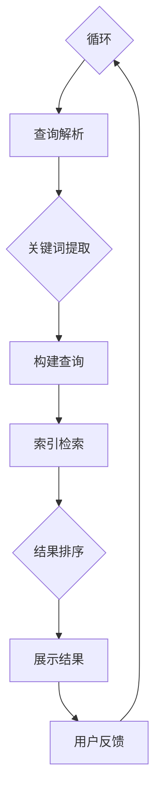
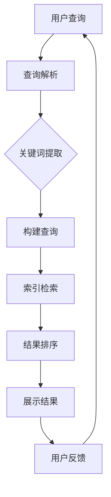

                 

### 第一部分: 搜索引擎的认知计算应用概述

认知计算与搜索引擎的结合，是当前信息技术领域的一个重要趋势。搜索引擎作为互联网的核心服务之一，承担着信息检索和知识发现的重要任务。而认知计算则通过模拟人类的思考和学习方式，提供更加智能化和人性化的搜索体验。

#### 第1章: 认知计算与搜索引擎概述

##### 1.1 认知计算的定义与原理

###### 1.1.1 认知计算的基本概念

认知计算（Cognitive Computing）是指一种模拟人类思考和决策过程的技术，它通过机器学习、自然语言处理、图像识别等多领域技术的融合，实现机器对人类语言、行为、环境的理解和响应。

在认知计算中，核心的概念包括：

- **知识表示**：将人类知识以计算机可以理解的形式进行组织和存储。
- **推理**：基于已有知识和信息，进行逻辑推断和判断。
- **学习**：通过数据和信息的学习，使机器获得新的知识和技能。
- **交互**：通过自然语言处理和语音识别等技术，实现人与机器的有效交流。

###### 1.1.2 认知计算的核心技术

认知计算的核心技术包括：

- **机器学习**：通过训练模型，使计算机具备自动学习和改进的能力。
- **深度学习**：一种特殊的机器学习技术，通过模拟人脑神经网络，进行复杂模式识别和数据处理。
- **自然语言处理（NLP）**：使计算机能够理解和生成自然语言，实现人机对话和文本分析。
- **图像识别**：通过计算机视觉技术，识别和解析图像信息。
- **知识图谱**：通过语义网络，组织和管理大规模结构化知识。

###### 1.1.3 认知计算与传统搜索的区别

传统搜索引擎主要依赖于关键字匹配和页面权重计算，而认知计算则更加注重对搜索意图的理解和语义分析。主要区别包括：

- **搜索方式**：传统搜索基于关键词匹配，认知计算则通过语义理解进行搜索。
- **搜索结果**：传统搜索结果往往包含大量的无关信息，认知计算能够提供更加精准和相关的结果。
- **用户体验**：传统搜索依赖用户输入，认知计算通过主动学习和交互，提供更加智能化和个性化的服务。

##### 1.2 搜索引擎的发展历程

###### 1.2.1 早期搜索引擎的特点

早期搜索引擎主要依赖简单的关键词匹配和页面权重计算。典型的代表包括：

- ** AltaVista**：1995年，首个提供全文搜索的搜索引擎。
- ** Lycos**：1994年，首个使用网页分类目录的搜索引擎。
- ** Google**：1998年，利用 PageRank 算法进行网页排名，迅速崛起。

早期搜索引擎的特点：

- **搜索算法**：基于关键词匹配和页面链接分析。
- **结果排序**：主要依据页面权重和链接数量。
- **用户体验**：用户需要手动输入关键词，搜索结果较为原始。

###### 1.2.2 现代搜索引擎的进化

现代搜索引擎在算法、技术和用户体验方面都发生了重大变革。主要特点包括：

- **深度学习**：通过深度学习技术，实现语义分析和智能搜索。
- **个性化推荐**：基于用户行为数据，提供个性化的搜索结果。
- **多模态搜索**：支持文本、语音、图像等多种搜索方式。
- **实时搜索**：通过实时数据处理，提供快速、准确的搜索结果。

现代搜索引擎的发展趋势：

- **智能化**：通过认知计算，实现更加智能的搜索和交互。
- **多样化**：支持更多类型的搜索和应用场景。
- **融合化**：与其他技术（如物联网、区块链等）进行融合，提供更丰富的应用场景。

###### 1.2.3 搜索引擎的核心架构

搜索引擎的核心架构通常包括以下模块：

- **爬虫系统**：负责收集互联网上的信息。
- **索引系统**：对收集到的信息进行组织和索引。
- **查询处理**：处理用户的搜索请求，返回搜索结果。
- **排序系统**：根据一定的算法，对搜索结果进行排序。
- **用户界面**：提供与用户的交互界面，展示搜索结果。

##### 1.3 认知计算在搜索引擎中的应用场景

认知计算在搜索引擎中的应用，极大地提升了搜索的智能化和人性化程度。以下是一些典型的应用场景：

###### 1.3.1 智能搜索

智能搜索利用自然语言处理和语义理解技术，能够更好地理解用户的搜索意图，并提供更加精准的搜索结果。具体应用包括：

- **语义搜索**：基于用户查询的上下文，理解其真正意图。
- **问答系统**：通过对话式交互，提供回答用户问题的能力。
- **多语言搜索**：支持多语言输入和输出，提供全球范围内的信息检索。

###### 1.3.2 自然语言处理

自然语言处理（NLP）技术在搜索引擎中的应用，使得搜索结果能够更好地满足用户的需求。主要应用包括：

- **文本分类**：将搜索结果按照主题进行分类。
- **实体识别**：识别搜索结果中的关键实体，如人名、地点、组织等。
- **文本摘要**：对大量文本进行摘要，提供关键信息的概览。

###### 1.3.3 个性化推荐

个性化推荐技术基于用户的行为数据，为用户推荐感兴趣的内容。在搜索引擎中，个性化推荐的应用包括：

- **个性化搜索结果**：根据用户的搜索历史和偏好，提供个性化的搜索结果。
- **个性化推荐列表**：在搜索结果页面中，为用户推荐相关的搜索建议和内容。
- **个性化广告**：根据用户的兴趣和行为，提供相关的广告推荐。

##### 1.4 认知计算与搜索引擎的未来发展趋势

认知计算与搜索引擎的结合，将会带来更加智能化和个性化的搜索体验。未来发展趋势包括：

###### 1.4.1 技术融合与创新

随着技术的不断发展，认知计算与搜索引擎将在多个领域实现融合和创新。具体包括：

- **跨领域应用**：将认知计算应用于金融、医疗、教育等多个领域。
- **新型交互方式**：如语音搜索、手势搜索等，提供更加便捷的搜索体验。
- **自适应搜索算法**：通过不断学习和优化，实现更加智能和高效的搜索算法。

###### 1.4.2 应用领域的拓展

认知计算在搜索引擎中的应用，将不仅仅局限于信息检索，还将拓展到更多领域。具体包括：

- **知识管理**：通过认知计算，实现对大量知识的有效组织和利用。
- **智能客服**：利用认知计算，为用户提供智能客服和咨询服务。
- **智能决策支持**：通过认知计算，为企业和个人提供智能化的决策支持。

###### 1.4.3 面临的挑战与机遇

认知计算与搜索引擎的结合，也面临着一系列的挑战和机遇。具体包括：

- **数据隐私与安全**：如何在提供智能搜索服务的同时，保护用户的数据隐私。
- **算法公平性**：如何确保算法的公正性和透明度，避免偏见和歧视。
- **技术创新**：如何不断推进技术创新，保持竞争优势。

#### 第2章: 认知计算的核心算法原理

认知计算的核心在于其算法的原理和实现。本章节将介绍认知计算中的核心算法原理，包括机器学习算法基础、深度学习算法简介、自然语言处理技术以及认知图谱的基本原理。

##### 2.1 机器学习算法基础

机器学习（Machine Learning，ML）是认知计算的基础，它通过从数据中学习规律，使计算机能够进行预测和决策。以下是几种常见的机器学习算法：

###### 2.1.1 线性回归

线性回归（Linear Regression）是一种基本的机器学习算法，用于预测数值型变量。其基本模型可以表示为：

$$
Y = \beta_0 + \beta_1X + \epsilon
$$

其中，\( Y \) 是目标变量，\( X \) 是输入变量，\( \beta_0 \) 和 \( \beta_1 \) 是模型参数，\( \epsilon \) 是误差项。

线性回归通过最小二乘法（Least Squares Method）来估计参数，具体步骤如下：

1. 准备数据集 \( D = \{ (x_1, y_1), (x_2, y_2), ..., (x_n, y_n) \} \)。
2. 计算目标函数 \( J(\beta_0, \beta_1) = \frac{1}{2n} \sum_{i=1}^{n} (y_i - (\beta_0 + \beta_1x_i))^2 \)。
3. 对目标函数求偏导数，得到梯度 \( \nabla J(\beta_0, \beta_1) = (-\sum_{i=1}^{n} (y_i - (\beta_0 + \beta_1x_i))x_i, -\sum_{i=1}^{n} (y_i - (\beta_0 + \beta_1x_i))) \)。
4. 更新参数 \( \beta_0, \beta_1 \)：

$$
\beta_0 = \beta_0 - \alpha \nabla J(\beta_0, \beta_1)_0 \\
\beta_1 = \beta_1 - \alpha \nabla J(\beta_0, \beta_1)_1
$$

其中，\( \alpha \) 是学习率。

###### 2.1.2 逻辑回归

逻辑回归（Logistic Regression）是一种广义的线性回归模型，用于预测二分类结果。其模型可以表示为：

$$
P(Y=1) = \frac{1}{1 + e^{-(\beta_0 + \beta_1X)}}
$$

逻辑回归的损失函数通常采用对数似然损失（Log-Likelihood Loss）：

$$
L(\beta_0, \beta_1) = \sum_{i=1}^{n} (-y_i \log(P(Y=1)) - (1 - y_i) \log(1 - P(Y=1)))
$$

逻辑回归的优化方法通常使用梯度下降法（Gradient Descent）：

1. 计算损失函数的梯度 \( \nabla L(\beta_0, \beta_1) \)。
2. 更新参数 \( \beta_0, \beta_1 \)：

$$
\beta_0 = \beta_0 - \alpha \nabla L(\beta_0, \beta_1)_0 \\
\beta_1 = \beta_1 - \alpha \nabla L(\beta_0, \beta_1)_1
$$

###### 2.1.3 决策树

决策树（Decision Tree）是一种基于树形结构进行决策的算法。其基本原理是通过一系列的规则，将输入数据划分为不同的区域，从而实现对输出变量的预测。

决策树的构建过程如下：

1. 选择一个最优分割特征。常用的分割特征包括信息增益（Information Gain）和信息增益率（Information Gain Ratio）。
2. 计算每个特征下的分割点。对于离散特征，可以直接选择每个可能的值作为分割点；对于连续特征，可以使用回归模型或阈值分割等方法。
3. 划分数据集。根据分割点，将数据集划分为不同的子集。
4. 递归构建子树。对于每个子集，重复步骤1-3，直到满足停止条件（如最大深度、最小样本数等）。

决策树的代码实现伪代码如下：

```
function build_decision_tree(data, features, max_depth):
    if max_depth == 0 or all_labels_equal(data):
        return leaf_node(data)
    
    best_feature, best_value = find_best_split(data, features)
    
    left_data, right_data = split_data(data, best_feature, best_value)
    
    left_tree = build_decision_tree(left_data, features, max_depth - 1)
    right_tree = build_decision_tree(right_data, features, max_depth - 1)
    
    return decision_node(best_feature, best_value, left_tree, right_tree)
```

##### 2.2 深度学习算法简介

深度学习（Deep Learning，DL）是一种基于多层神经网络进行数据建模的方法，它在认知计算中扮演着重要的角色。以下是几种常见的深度学习算法：

###### 2.2.1 卷积神经网络（CNN）

卷积神经网络（Convolutional Neural Network，CNN）是一种专门用于处理图像数据的深度学习算法。其基本结构包括卷积层、池化层和全连接层。

1. **卷积层**：通过卷积操作，提取图像的特征。
2. **池化层**：通过池化操作，降低特征图的维度，减少计算量。
3. **全连接层**：将特征图映射到输出结果。

CNN 的代码实现伪代码如下：

```
function CNN(input_shape, output_shape):
    model = Sequential()
    model.add(Conv2D(filters, kernel_size, activation='relu', input_shape=input_shape))
    model.add(MaxPooling2D(pool_size))
    model.add(Flatten())
    model.add(Dense(units, activation='softmax'))
    model.compile(optimizer, loss, metrics)
    return model
```

###### 2.2.2 循环神经网络（RNN）

循环神经网络（Recurrent Neural Network，RNN）是一种能够处理序列数据的神经网络。其基本结构包括输入层、隐藏层和输出层。

1. **输入层**：接收输入序列。
2. **隐藏层**：通过循环连接，处理序列的上下文信息。
3. **输出层**：输出序列的预测结果。

RNN 的代码实现伪代码如下：

```
function RNN(input_shape, output_shape):
    model = Sequential()
    model.add(LSTM(units, return_sequences=True, input_shape=input_shape))
    model.add(LSTM(units, return_sequences=False))
    model.add(Dense(units, activation='softmax'))
    model.compile(optimizer, loss, metrics)
    return model
```

###### 2.2.3 长短时记忆（LSTM）

长短时记忆（Long Short-Term Memory，LSTM）是一种改进的 RNN 结构，能够更好地处理长序列数据。其基本原理是通过引入三个门控单元，分别控制信息的输入、保持和输出。

LSTM 的代码实现伪代码如下：

```
function LSTM(input_shape, output_shape):
    model = Sequential()
    model.add(LSTM(units, return_sequences=True, input_shape=input_shape))
    model.add(LSTM(units, return_sequences=False))
    model.add(Dense(units, activation='softmax'))
    model.compile(optimizer, loss, metrics)
    return model
```

##### 2.3 自然语言处理技术

自然语言处理（Natural Language Processing，NLP）是认知计算的重要组成部分，它使得计算机能够理解和生成自然语言。以下是几种常见的 NLP 技术：

###### 2.3.1 词嵌入技术

词嵌入（Word Embedding）是将单词映射到高维向量空间的技术。常见的词嵌入方法包括：

- **Word2Vec**：通过训练词向量模型，使具有相似语义的单词在向量空间中更接近。
- **GloVe**：通过全局上下文信息，学习单词的语义表示。

词嵌入的代码实现伪代码如下：

```
function Word2Vec(sentences, size, window_size):
    # 初始化词向量
    V = initialize_vocab(sentences)
    
    # 训练词向量模型
    for sentence in sentences:
        for word in sentence:
            context = get_context(word, sentences, window_size)
            update_vocab(V, word, context)
    
    return V
```

###### 2.3.2 序列标注与分类

序列标注（Sequence Labeling）是一种对序列数据进行分类的方法，常用于命名实体识别（Named Entity Recognition，NER）等任务。常见的序列标注方法包括：

- **CRF（条件随机场）**：通过条件概率模型，对序列进行标注。
- **BiLSTM**：结合双向 RNN 和 CRF，实现序列标注。

序列标注的代码实现伪代码如下：

```
function SequenceLabeling(data, labels, model):
    # 加载模型
    model.load_weights(model_path)
    
    # 预测标签
    predictions = model.predict(data)
    
    # 解码预测结果
    decoded_predictions = decode_predictions(predictions, labels)
    
    return decoded_predictions
```

###### 2.3.3 问答系统

问答系统（Question Answering System）是一种通过回答用户问题来提供信息的服务。常见的问答系统方法包括：

- **基于检索的问答**：通过检索相关文档，回答用户问题。
- **基于生成的问答**：通过自然语言生成技术，回答用户问题。

问答系统的代码实现伪代码如下：

```
function QuestionAnswering(question, document):
    # 检索相关文档
    relevant_documents = retrieve_documents(question, document)
    
    # 生成答案
    answer = generate_answer(question, relevant_documents)
    
    return answer
```

##### 2.4 认知图谱的基本原理

认知图谱（Knowledge Graph）是一种基于语义网络的知识表示方法，它通过实体和关系的连接，构建一个大规模、结构化、语义丰富的知识体系。以下是认知图谱的基本原理：

###### 2.4.1 认知图谱的定义

认知图谱是一种用于表示和存储知识的图形结构，它由实体、关系和属性组成。实体表示现实世界中的对象，关系表示实体之间的关联，属性表示实体的特征。

认知图谱的定义可以表示为：

$$
KG = \langle E, R, A \rangle
$$

其中，\( E \) 是实体集合，\( R \) 是关系集合，\( A \) 是属性集合。

###### 2.4.2 认知图谱的构建方法

认知图谱的构建通常包括以下步骤：

1. **数据采集**：从各种来源（如网络、数据库等）收集实体和关系的数据。
2. **数据预处理**：对采集到的数据进行清洗、去重和规范化处理。
3. **实体抽取**：从预处理后的数据中识别出实体。
4. **关系抽取**：从预处理后的数据中识别出实体之间的关系。
5. **属性抽取**：从预处理后的数据中识别出实体的属性。
6. **图谱构建**：将实体、关系和属性组织成一个认知图谱。

认知图谱的构建方法伪代码如下：

```
function build_knowledge_graph(data):
    entities, relationships, attributes = extract_entities(data)
    entities, relationships, attributes = preprocess_data(entities, relationships, attributes)
    knowledge_graph = create_knowledge_graph(entities, relationships, attributes)
    return knowledge_graph
```

###### 2.4.3 认知图谱的应用场景

认知图谱在搜索引擎中的应用非常广泛，以下是一些常见的应用场景：

- **智能搜索**：通过认知图谱，实现语义搜索和智能推荐。
- **知识检索**：通过认知图谱，快速检索相关知识和信息。
- **问答系统**：通过认知图谱，回答用户的问题和提供信息。
- **实体关系分析**：通过认知图谱，分析实体之间的关系和属性。

认知图谱的应用场景伪代码如下：

```
function apply_knowledge_graph(knowledge_graph, query):
    # 搜索相关实体和关系
    results = search_entities_and_relations(knowledge_graph, query)
    
    # 检索相关知识和信息
    information = retrieve_knowledge(knowledge_graph, results)
    
    return information
```

通过以上对认知计算的核心算法原理的介绍，我们可以看到认知计算在搜索引擎中的应用具有巨大的潜力。在接下来的章节中，我们将进一步探讨认知计算在搜索引擎中的具体应用和实践案例。同时，我们也将会分析认知计算在搜索引擎中的挑战和未来发展趋势。

#### 第2章: 认知计算的核心算法原理

认知计算作为人工智能的一个重要分支，其核心在于算法的原理和应用。在本章中，我们将深入探讨认知计算中的核心算法原理，包括机器学习算法基础、深度学习算法简介、自然语言处理技术以及认知图谱的基本原理。

##### 2.1 机器学习算法基础

机器学习（Machine Learning，ML）是认知计算的基础，它使得计算机能够从数据中学习，并做出预测和决策。以下将介绍几种常见的机器学习算法及其原理。

###### 2.1.1 线性回归

线性回归（Linear Regression）是一种基本的机器学习算法，用于预测一个数值型目标变量。其基本模型可以表示为：

$$
Y = \beta_0 + \beta_1X + \epsilon
$$

其中，\( Y \) 是目标变量，\( X \) 是输入变量，\( \beta_0 \) 和 \( \beta_1 \) 是模型参数，\( \epsilon \) 是误差项。

线性回归的目的是通过最小化损失函数（通常是均方误差）来估计参数。具体步骤如下：

1. **数据准备**：准备包含输入特征和目标变量的训练数据集 \( D = \{ (x_1, y_1), (x_2, y_2), ..., (x_n, y_n) \} \)。

2. **损失函数计算**：计算损失函数，通常使用均方误差（Mean Squared Error，MSE）：

$$
J(\beta_0, \beta_1) = \frac{1}{2n} \sum_{i=1}^{n} (y_i - (\beta_0 + \beta_1x_i))^2
$$

3. **梯度计算**：计算损失函数关于模型参数的梯度：

$$
\nabla J(\beta_0, \beta_1) = \left( -\frac{1}{n} \sum_{i=1}^{n} (y_i - (\beta_0 + \beta_1x_i)), -\frac{1}{n} \sum_{i=1}^{n} (x_i(y_i - (\beta_0 + \beta_1x_i))) \right)
$$

4. **参数更新**：使用梯度下降法更新模型参数：

$$
\beta_0 = \beta_0 - \alpha \nabla J(\beta_0, \beta_1)_0 \\
\beta_1 = \beta_1 - \alpha \nabla J(\beta_0, \beta_1)_1
$$

其中，\( \alpha \) 是学习率，通常选择较小的值以避免过拟合。

###### 2.1.2 逻辑回归

逻辑回归（Logistic Regression）是线性回归的扩展，用于预测二分类结果。其模型可以表示为：

$$
P(Y=1) = \frac{1}{1 + e^{-(\beta_0 + \beta_1X)}}
$$

逻辑回归的损失函数通常采用对数似然损失（Log-Likelihood Loss）：

$$
L(\beta_0, \beta_1) = \sum_{i=1}^{n} (-y_i \log(P(Y=1)) - (1 - y_i) \log(1 - P(Y=1)))
$$

逻辑回归的优化方法通常使用梯度下降法，步骤如下：

1. **计算损失函数的梯度**：

$$
\nabla L(\beta_0, \beta_1) = \left( -\frac{1}{n} \sum_{i=1}^{n} y_i (1 - P(Y=1)), -\frac{1}{n} \sum_{i=1}^{n} (1 - y_i) P(Y=1) \right)
$$

2. **更新参数**：

$$
\beta_0 = \beta_0 - \alpha \nabla L(\beta_0, \beta_1)_0 \\
\beta_1 = \beta_1 - \alpha \nabla L(\beta_0, \beta_1)_1
$$

###### 2.1.3 决策树

决策树（Decision Tree）是一种树形结构，用于分类和回归任务。它通过一系列规则将数据划分为不同的区域，以预测目标变量的值。决策树的构建过程如下：

1. **选择最佳分割特征**：根据信息增益或基尼不纯度等指标，选择最佳分割特征。

2. **划分数据集**：根据最佳分割特征，将数据集划分为子集。

3. **递归构建子树**：对于每个子集，重复选择最佳分割特征并划分数据集，直到满足停止条件（如最小样本数或最大树深度）。

4. **生成预测规则**：根据树的结构生成预测规则，将新样本划分到不同的区域。

决策树的代码实现伪代码如下：

```
function build_decision_tree(data, target_variable, max_depth):
    if max_depth == 0 or all_labels_equal(data):
        return leaf_node(data)
    
    best_feature, best_value = find_best_split(data, target_variable)
    
    left_data, right_data = split_data(data, best_feature, best_value)
    
    left_tree = build_decision_tree(left_data, target_variable, max_depth - 1)
    right_tree = build_decision_tree(right_data, target_variable, max_depth - 1)
    
    return decision_node(best_feature, best_value, left_tree, right_tree)
```

##### 2.2 深度学习算法简介

深度学习（Deep Learning，DL）是一种基于多层神经网络的学习方法，它在认知计算中发挥着重要作用。以下将介绍几种常见的深度学习算法及其原理。

###### 2.2.1 卷积神经网络（CNN）

卷积神经网络（Convolutional Neural Network，CNN）是一种专门用于处理图像数据的神经网络。它通过卷积层、池化层和全连接层提取图像特征。

1. **卷积层**：通过卷积操作提取图像特征。

2. **池化层**：通过最大池化或平均池化降低特征图的维度。

3. **全连接层**：将特征图映射到输出结果。

CNN 的基本结构伪代码如下：

```
function CNN(input_shape, output_shape):
    model = Sequential()
    model.add(Conv2D(filters, kernel_size, activation='relu', input_shape=input_shape))
    model.add(MaxPooling2D(pool_size))
    model.add(Flatten())
    model.add(Dense(units, activation='softmax'))
    model.compile(optimizer, loss, metrics)
    return model
```

###### 2.2.2 循环神经网络（RNN）

循环神经网络（Recurrent Neural Network，RNN）是一种能够处理序列数据的神经网络。它通过隐藏状态循环传递，实现对序列数据的建模。

1. **输入层**：接收输入序列。

2. **隐藏层**：通过循环连接处理序列的上下文信息。

3. **输出层**：输出序列的预测结果。

RNN 的基本结构伪代码如下：

```
function RNN(input_shape, output_shape):
    model = Sequential()
    model.add(RNN(units, return_sequences=True, input_shape=input_shape))
    model.add(RNN(units, return_sequences=False))
    model.add(Dense(units, activation='softmax'))
    model.compile(optimizer, loss, metrics)
    return model
```

###### 2.2.3 长短时记忆（LSTM）

长短时记忆（Long Short-Term Memory，LSTM）是一种改进的 RNN 结构，能够更好地处理长序列数据。它通过引入三个门控单元，分别控制信息的输入、保持和输出。

LSTM 的基本结构伪代码如下：

```
function LSTM(input_shape, output_shape):
    model = Sequential()
    model.add(LSTM(units, return_sequences=True, input_shape=input_shape))
    model.add(LSTM(units, return_sequences=False))
    model.add(Dense(units, activation='softmax'))
    model.compile(optimizer, loss, metrics)
    return model
```

##### 2.3 自然语言处理技术

自然语言处理（Natural Language Processing，NLP）是认知计算的重要组成部分，它使得计算机能够理解和生成自然语言。以下将介绍几种常见的 NLP 技术及其原理。

###### 2.3.1 词嵌入技术

词嵌入（Word Embedding）是将单词映射到高维向量空间的技术。它通过训练词向量模型，使得语义相似的单词在向量空间中更接近。常见的词嵌入方法包括 Word2Vec 和 GloVe。

词嵌入的基本原理如下：

1. **数据准备**：准备包含单词和其上下文的语料库。

2. **模型训练**：使用神经网络训练词向量模型，将单词映射到高维向量空间。

3. **单词向量表示**：将每个单词映射到其对应的向量。

词嵌入的代码实现伪代码如下：

```
function Word2Vec(sentences, size, window_size):
    # 初始化词向量
    V = initialize_vocab(sentences)
    
    # 训练词向量模型
    for sentence in sentences:
        for word in sentence:
            context = get_context(word, sentences, window_size)
            update_vocab(V, word, context)
    
    return V
```

###### 2.3.2 序列标注与分类

序列标注（Sequence Labeling）是一种对序列数据进行分类的方法，常用于命名实体识别（Named Entity Recognition，NER）等任务。常见的序列标注方法包括 CRF（条件随机场）和 BiLSTM。

序列标注的基本原理如下：

1. **数据准备**：准备包含单词和标签的训练数据集。

2. **模型训练**：使用序列标注模型（如 CRF 或 BiLSTM）训练模型。

3. **序列标注**：使用训练好的模型对输入序列进行标注。

序列标注的代码实现伪代码如下：

```
function SequenceLabeling(data, labels, model):
    # 加载模型
    model.load_weights(model_path)
    
    # 预测标签
    predictions = model.predict(data)
    
    # 解码预测结果
    decoded_predictions = decode_predictions(predictions, labels)
    
    return decoded_predictions
```

###### 2.3.3 问答系统

问答系统（Question Answering System）是一种通过回答用户问题来提供信息的服务。常见的问答系统方法包括基于检索的问答和基于生成的问答。

问答系统的基本原理如下：

1. **检索相关文档**：根据用户问题，检索相关文档。

2. **生成答案**：使用自然语言生成技术，生成答案。

问答系统的代码实现伪代码如下：

```
function QuestionAnswering(question, document):
    # 检索相关文档
    relevant_documents = retrieve_documents(question, document)
    
    # 生成答案
    answer = generate_answer(question, relevant_documents)
    
    return answer
```

##### 2.4 认知图谱的基本原理

认知图谱（Knowledge Graph）是一种用于表示和存储知识的图形结构，它通过实体和关系的连接，构建一个大规模、结构化、语义丰富的知识体系。以下将介绍认知图谱的基本原理。

###### 2.4.1 认知图谱的定义

认知图谱是一种用于表示和存储知识的图形结构，它由实体、关系和属性组成。实体表示现实世界中的对象，关系表示实体之间的关联，属性表示实体的特征。

认知图谱的定义可以表示为：

$$
KG = \langle E, R, A \rangle
$$

其中，\( E \) 是实体集合，\( R \) 是关系集合，\( A \) 是属性集合。

###### 2.4.2 认知图谱的构建方法

认知图谱的构建通常包括以下步骤：

1. **数据采集**：从各种来源（如网络、数据库等）收集实体和关系的数据。

2. **数据预处理**：对采集到的数据进行清洗、去重和规范化处理。

3. **实体抽取**：从预处理后的数据中识别出实体。

4. **关系抽取**：从预处理后的数据中识别出实体之间的关系。

5. **属性抽取**：从预处理后的数据中识别出实体的属性。

6. **图谱构建**：将实体、关系和属性组织成一个认知图谱。

认知图谱的构建方法伪代码如下：

```
function build_knowledge_graph(data):
    entities, relationships, attributes = extract_entities(data)
    entities, relationships, attributes = preprocess_data(entities, relationships, attributes)
    knowledge_graph = create_knowledge_graph(entities, relationships, attributes)
    return knowledge_graph
```

###### 2.4.3 认知图谱的应用场景

认知图谱在搜索引擎中的应用非常广泛，以下是一些常见的应用场景：

- **智能搜索**：通过认知图谱，实现语义搜索和智能推荐。

- **知识检索**：通过认知图谱，快速检索相关知识和信息。

- **问答系统**：通过认知图谱，回答用户的问题和提供信息。

- **实体关系分析**：通过认知图谱，分析实体之间的关系和属性。

认知图谱的应用场景伪代码如下：

```
function apply_knowledge_graph(knowledge_graph, query):
    # 搜索相关实体和关系
    results = search_entities_and_relations(knowledge_graph, query)
    
    # 检索相关知识和信息
    information = retrieve_knowledge(knowledge_graph, results)
    
    return information
```

通过以上对认知计算的核心算法原理的介绍，我们可以看到认知计算在搜索引擎中的应用具有巨大的潜力。在接下来的章节中，我们将进一步探讨认知计算在搜索引擎中的具体应用和实践案例。同时，我们也将会分析认知计算在搜索引擎中的挑战和未来发展趋势。

#### 第3章: 认知计算在搜索引擎中的应用

认知计算在搜索引擎中的应用，极大地提升了搜索的智能化和人性化程度。本章将详细介绍认知计算在搜索引擎中的具体应用，包括智能搜索算法、自然语言处理技术、个性化推荐算法，以及实际应用案例分析。

##### 3.1 智能搜索算法

智能搜索算法通过语义理解、上下文分析等技术，提高了搜索结果的准确性和相关性。以下是智能搜索算法的核心应用：

###### 3.1.1 搜索引擎的关键词提取

关键词提取是智能搜索算法的第一步，它通过自然语言处理技术，从用户查询中提取出关键信息。常用的关键词提取方法包括：

- **词袋模型（Bag of Words，BoW）**：将查询文本表示为词频向量。
- **TF-IDF（Term Frequency-Inverse Document Frequency）**：基于词频和文档频率，计算关键词的重要性。
- **词嵌入（Word Embedding）**：将关键词映射到高维向量空间。

关键词提取的伪代码如下：

```
function extract_keywords(query, method):
    if method == 'BoW':
        return BoW_model.transform([query])
    elif method == 'TF-IDF':
        return TF_IDF_model.transform([query])
    elif method == 'WordEmbedding':
        return WordEmbedding_model([query])
    else:
        return None
```

###### 3.1.2 搜索引擎的查询解析

查询解析是将用户输入的查询文本转化为计算机可以理解的语义表示的过程。查询解析包括以下步骤：

1. **分词**：将查询文本拆分成单词或词组。
2. **词性标注**：对每个词进行词性标注，如名词、动词等。
3. **实体识别**：识别查询文本中的实体，如人名、地点、组织等。
4. **语义角色标注**：标注每个词在查询中的作用，如主语、谓语等。

查询解析的伪代码如下：

```
function parse_query(query):
    tokens = tokenize(query)
    pos_tags = get_pos_tags(tokens)
    entities = extract_entities(tokens)
    semantic_roles = get_semantic_roles(tokens, pos_tags, entities)
    return tokens, pos_tags, entities, semantic_roles
```

###### 3.1.3 搜索引擎的结果排序

搜索引擎的结果排序是提升用户搜索体验的关键，它通过综合考虑多个因素，对搜索结果进行排序。常用的排序算法包括：

- **基于文档的排序**：根据文档的相关性、重要性和权威性进行排序。
- **基于用户的排序**：根据用户的历史搜索记录和偏好，为用户推荐感兴趣的内容。
- **基于模型的排序**：使用机器学习模型，根据查询和文档的特征进行排序。

搜索结果排序的伪代码如下：

```
function rank_results(results, query, model):
    features = extract_features(results, query)
    scores = model.predict(features)
    sorted_results = sorted(results, key=lambda x: scores[x])
    return sorted_results
```

##### 3.2 自然语言处理技术

自然语言处理（NLP）技术在搜索引擎中的应用，使得搜索结果能够更好地满足用户的需求。以下是自然语言处理技术的核心应用：

###### 3.2.1 文本分类

文本分类是将大量无结构化的文本数据按照主题或类别进行分类的过程。常见的文本分类方法包括：

- **朴素贝叶斯分类器**：基于贝叶斯定理，对文本进行分类。
- **支持向量机（Support Vector Machine，SVM）**：通过最大化分类边界，对文本进行分类。
- **深度学习模型**：如卷积神经网络（CNN）和循环神经网络（RNN），对文本进行分类。

文本分类的伪代码如下：

```
function text_classification(text, model):
    features = extract_features(text)
    label = model.predict(features)
    return label
```

###### 3.2.2 命名实体识别

命名实体识别（Named Entity Recognition，NER）是从文本中识别出具有特定意义的实体，如人名、地点、组织等。常见的 NER 方法包括：

- **基于规则的方法**：使用预定义的规则，识别文本中的命名实体。
- **基于统计的方法**：使用统计模型，如隐马尔可夫模型（HMM）和条件随机场（CRF），识别文本中的命名实体。
- **基于深度学习的方法**：如长短时记忆（LSTM）和转换器（Transformer），识别文本中的命名实体。

命名实体识别的伪代码如下：

```
function named_entity_recognition(text, model):
    entities = model.predict(text)
    return entities
```

###### 3.2.3 文本摘要

文本摘要（Text Summarization）是将长篇文本压缩成简洁、精炼的摘要，传达文本的核心内容。常见的文本摘要方法包括：

- **提取式摘要**：从原文中提取关键句子，生成摘要。
- **生成式摘要**：使用生成模型，如序列到序列（Seq2Seq）模型，生成摘要。
- **混合式摘要**：结合提取式和生成式摘要的优点，生成高质量的摘要。

文本摘要的伪代码如下：

```
function text_summarization(text, method):
    if method == 'extractive':
        return extractive_summary(text)
    elif method == 'generative':
        return generative_summary(text)
    elif method == 'hybrid':
        return hybrid_summary(text)
    else:
        return None
```

##### 3.3 个性化推荐算法

个性化推荐算法（Personalized Recommendation）通过分析用户的历史行为和兴趣，为用户推荐感兴趣的内容。以下是个性化推荐算法的核心应用：

###### 3.3.1 用户画像构建

用户画像构建是将用户的历史行为和兴趣转化为用户特征的过程。常见的用户画像构建方法包括：

- **基于内容的推荐**：根据用户的兴趣和偏好，推荐相似的内容。
- **基于协同过滤的推荐**：通过分析用户之间的相似度，推荐其他用户喜欢的商品或内容。
- **基于矩阵分解的推荐**：通过矩阵分解，挖掘用户和物品之间的潜在关系，推荐用户可能感兴趣的内容。

用户画像构建的伪代码如下：

```
function build_user_profile(user, history, method):
    if method == 'content_based':
        return content_based_profile(user, history)
    elif method == 'collaborative_filtering':
        return collaborative_filtering_profile(user, history)
    elif method == 'matrix_factorization':
        return matrix_factorization_profile(user, history)
    else:
        return None
```

###### 3.3.2 推荐系统评估指标

推荐系统评估指标用于衡量推荐系统的性能。常见的评估指标包括：

- **准确率（Accuracy）**：预测正确的推荐数量占总推荐数量的比例。
- **召回率（Recall）**：实际喜欢的推荐数量中被预测喜欢的推荐数量的比例。
- **精确率（Precision）**：预测喜欢的推荐数量中被预测正确的推荐数量的比例。
- **F1 分数（F1 Score）**：精确率和召回率的调和平均值。

推荐系统评估指标的伪代码如下：

```
function evaluate_recommendation(recommendations, actual_preferences):
    accuracy = calculate_accuracy(recommendations, actual_preferences)
    recall = calculate_recall(recommendations, actual_preferences)
    precision = calculate_precision(recommendations, actual_preferences)
    f1_score = calculate_f1_score(accuracy, recall, precision)
    return accuracy, recall, precision, f1_score
```

###### 3.3.3 推荐算法实现

推荐算法实现是将用户画像、物品特征和推荐系统评估指标结合，生成推荐结果的过程。常见的推荐算法实现包括：

- **基于内容的推荐算法**：根据用户的历史偏好，推荐相似的内容。
- **基于协同过滤的推荐算法**：根据用户之间的相似度，推荐其他用户喜欢的商品或内容。
- **基于矩阵分解的推荐算法**：通过矩阵分解，挖掘用户和物品之间的潜在关系，推荐用户可能感兴趣的内容。

推荐算法实现的伪代码如下：

```
function recommend_items(user_profile, item_features, recommendation_algorithm):
    if recommendation_algorithm == 'content_based':
        return content_based_recommendation(user_profile, item_features)
    elif recommendation_algorithm == 'collaborative_filtering':
        return collaborative_filtering_recommendation(user_profile, item_features)
    elif recommendation_algorithm == 'matrix_factorization':
        return matrix_factorization_recommendation(user_profile, item_features)
    else:
        return None
```

##### 3.4 实际应用案例分析

以下是一些认知计算在搜索引擎中的实际应用案例分析：

###### 3.4.1 百度搜索引擎

百度搜索引擎通过认知计算技术，实现了智能搜索和个性化推荐。具体应用包括：

- **智能搜索**：通过语义理解技术，提升搜索结果的准确性和相关性。
- **个性化推荐**：通过分析用户的历史行为和兴趣，为用户推荐感兴趣的内容。
- **问答系统**：通过自然语言处理技术，回答用户的问题和提供信息。

###### 3.4.2 谷歌搜索引擎

谷歌搜索引擎通过认知计算技术，实现了全球范围内的信息检索和知识发现。具体应用包括：

- **智能搜索**：通过深度学习技术，提升搜索结果的准确性和相关性。
- **自然语言处理**：通过自然语言处理技术，实现多语言搜索和文本分析。
- **个性化推荐**：通过用户画像和协同过滤技术，为用户推荐感兴趣的内容。

###### 3.4.3 其他主流搜索引擎

其他主流搜索引擎，如必应（Bing）、雅虎（Yahoo）等，也在不断引入认知计算技术，提升搜索体验。具体应用包括：

- **智能搜索**：通过深度学习和自然语言处理技术，提升搜索结果的准确性和相关性。
- **个性化推荐**：通过用户画像和协同过滤技术，为用户推荐感兴趣的内容。
- **知识图谱**：通过构建知识图谱，实现语义搜索和知识检索。

通过以上对认知计算在搜索引擎中的具体应用的介绍，我们可以看到认知计算在提升搜索智能化和人性化方面具有巨大的潜力。在接下来的章节中，我们将进一步探讨搜索引擎的认知计算架构设计，以及如何在实践中实现和应用认知计算技术。

#### 第4章: 搜索引擎的认知计算架构设计

搜索引擎的认知计算架构设计是实现智能化和个性化搜索的关键。本章将详细介绍搜索引擎的认知计算架构设计，包括总体架构、认知计算模块的设计以及架构优化与性能调优。

##### 4.1 搜索引擎的总体架构

搜索引擎的总体架构通常包括爬虫系统、索引系统、查询处理系统、排序系统和用户界面等模块。以下是对各个模块的详细描述：

###### 4.1.1 索引构建

索引构建是搜索引擎的核心功能之一，它将互联网上的信息收集并组织成索引结构，以便快速检索。索引构建的过程包括以下步骤：

1. **爬虫**：爬虫系统负责从互联网上收集网页，并将它们存储到数据库中。
2. **解析**：对爬取到的网页进行解析，提取出文本内容、链接信息和其他元数据。
3. **索引**：将解析后的网页内容进行索引，生成倒排索引（Inverted Index），以便快速检索。

爬虫系统的伪代码如下：

```
function crawl(url, visited_urls):
    if url not in visited_urls:
        visited_urls.add(url)
        # 解析网页内容
        content = parse_html(url)
        # 提取关键词和链接
        keywords, links = extract_keywords_and_links(content)
        # 存储到数据库
        store_content(url, content)
        # 遍历链接，继续爬取
        for link in links:
            crawl(link, visited_urls)
```

索引构建的伪代码如下：

```
function build_index(content, index):
    for url, content in content.items():
        # 提取关键词
        keywords = extract_keywords(content)
        # 更新倒排索引
        for keyword in keywords:
            if keyword not in index:
                index[keyword] = []
            index[keyword].append(url)
    return index
```

###### 4.1.2 查询处理

查询处理系统负责处理用户的搜索请求，并返回相关的搜索结果。查询处理的过程包括以下步骤：

1. **关键词提取**：从用户输入的查询中提取出关键词。
2. **查询解析**：对提取出的关键词进行词性标注、实体识别等操作，构建查询的语义表示。
3. **查询匹配**：在索引中查找与查询匹配的网页，生成候选结果集。
4. **查询扩展**：通过同义词、短语扩展等方式，扩大查询范围，提高搜索结果的多样性。

查询处理的伪代码如下：

```
function process_query(query, index):
    # 提取关键词
    keywords = extract_keywords(query)
    # 解析查询
    parsed_query = parse_query(query)
    # 查询匹配
    candidate_results = search(index, parsed_query)
    # 查询扩展
    expanded_results = expand_query(candidate_results, keywords)
    return expanded_results
```

###### 4.1.3 结果排序

结果排序系统负责对搜索结果进行排序，以便用户能够快速找到所需信息。结果排序的过程包括以下步骤：

1. **特征提取**：从搜索结果中提取出特征，如关键词匹配度、网页权威性等。
2. **排序模型**：使用机器学习模型，根据特征计算搜索结果的排序得分。
3. **排序**：根据排序得分对搜索结果进行排序，返回排序后的结果集。

结果排序的伪代码如下：

```
function rank_results(results, model):
    features = extract_features(results)
    scores = model.predict(features)
    sorted_results = sorted(results, key=lambda x: scores[x])
    return sorted_results
```

###### 4.1.4 用户界面

用户界面系统负责与用户进行交互，接收用户的搜索请求，展示搜索结果，并提供其他功能。用户界面系统的设计应注重用户体验，简洁直观，易于操作。

用户界面系统的伪代码如下：

```
function display_search_results(results):
    for result in results:
        print(f"标题：{result.title}")
        print(f"摘要：{result.summary}")
        print(f"链接：{result.url}")
        print()
```

##### 4.2 认知计算模块的设计

认知计算模块是搜索引擎架构中的关键部分，它负责实现智能搜索、自然语言处理、个性化推荐等功能。以下是对认知计算模块的详细描述：

###### 4.2.1 认知图谱构建

认知图谱构建是通过实体、关系和属性构建一个语义丰富的知识体系，以便实现语义搜索和知识检索。认知图谱的构建过程包括以下步骤：

1. **数据采集**：从互联网、数据库、知识库等来源收集实体和关系的数据。
2. **数据预处理**：对采集到的数据进行清洗、去重和规范化处理。
3. **实体抽取**：从预处理后的数据中识别出实体。
4. **关系抽取**：从预处理后的数据中识别出实体之间的关系。
5. **属性抽取**：从预处理后的数据中识别出实体的属性。
6. **图谱构建**：将实体、关系和属性组织成一个认知图谱。

认知图谱构建的伪代码如下：

```
function build_knowledge_graph(data):
    entities, relationships, attributes = extract_entities(data)
    entities, relationships, attributes = preprocess_data(entities, relationships, attributes)
    knowledge_graph = create_knowledge_graph(entities, relationships, attributes)
    return knowledge_graph
```

###### 4.2.2 智能搜索算法集成

智能搜索算法集成是将认知计算模块与搜索引擎的查询处理模块相结合，实现智能搜索功能。智能搜索算法包括关键词提取、查询解析、结果排序等步骤。

智能搜索算法集成的伪代码如下：

```
function intelligent_search(query, knowledge_graph):
    # 提取关键词
    keywords = extract_keywords(query)
    # 解析查询
    parsed_query = parse_query(query, knowledge_graph)
    # 查询匹配
    candidate_results = search(knowledge_graph, parsed_query)
    # 结果排序
    sorted_results = rank_results(candidate_results, model)
    return sorted_results
```

###### 4.2.3 个性化推荐系统设计

个性化推荐系统设计是基于用户的历史行为和兴趣，为用户推荐感兴趣的内容。个性化推荐系统包括用户画像构建、推荐系统评估指标和推荐算法实现等步骤。

个性化推荐系统设计的伪代码如下：

```
function build_user_profile(user, history):
    user_profile = {}
    user_profile['interests'] = extract_interests(history)
    user_profile['behavior'] = extract_behavior(history)
    return user_profile

function evaluate_recommendation(recommendations, actual_preferences):
    accuracy = calculate_accuracy(recommendations, actual_preferences)
    recall = calculate_recall(recommendations, actual_preferences)
    precision = calculate_precision(recommendations, actual_preferences)
    f1_score = calculate_f1_score(accuracy, recall, precision)
    return accuracy, recall, precision, f1_score

function recommend_items(user_profile, item_features, recommendation_algorithm):
    if recommendation_algorithm == 'content_based':
        return content_based_recommendation(user_profile, item_features)
    elif recommendation_algorithm == 'collaborative_filtering':
        return collaborative_filtering_recommendation(user_profile, item_features)
    elif recommendation_algorithm == 'matrix_factorization':
        return matrix_factorization_recommendation(user_profile, item_features)
    else:
        return None
```

##### 4.3 架构优化与性能调优

搜索引擎的认知计算架构在设计过程中，需要考虑性能、可扩展性和可靠性等方面。以下是对架构优化与性能调优的几个关键点：

###### 4.3.1 大规模数据处理

大规模数据处理是搜索引擎面临的一个主要挑战。为了应对这一挑战，可以采用以下策略：

- **分布式计算**：使用分布式系统，将数据处理和存储任务分布到多个节点，提高处理速度和容错能力。
- **缓存机制**：使用缓存机制，减少对数据库的访问次数，提高查询响应速度。
- **批量处理**：将数据处理任务批量处理，减少系统开销和资源消耗。

大规模数据处理的伪代码如下：

```
function process_large_data(data):
    # 分布式计算
    distributed_results = distribute_data(data)
    # 缓存处理
    cached_results = cache_results(distributed_results)
    # 批量处理
    batch_results = batch_process(cached_results)
    return batch_results
```

###### 4.3.2 系统稳定性与可靠性

系统稳定性与可靠性是搜索引擎架构设计的关键因素。为了提高系统的稳定性与可靠性，可以采用以下策略：

- **冗余备份**：对关键组件进行冗余备份，确保系统在故障时能够快速恢复。
- **负载均衡**：使用负载均衡器，合理分配请求，避免系统过载。
- **故障监测与恢复**：实时监测系统状态，及时发现故障并进行恢复。

系统稳定性与可靠性的伪代码如下：

```
function monitor_system_health():
    # 检查系统状态
    system_status = check_system_status()
    if system_status != 'healthy':
        # 故障恢复
        recover_system()

function load_balancing(requests):
    balanced_requests = distribute_load(requests)
    return balanced_requests
```

###### 4.3.3 性能监控与优化

性能监控与优化是确保搜索引擎高效运行的关键。以下是一些常用的性能监控与优化策略：

- **性能指标监控**：监控系统的各项性能指标，如响应时间、吞吐量、资源利用率等。
- **性能调优**：根据监控数据，对系统配置和算法进行调优，提高系统性能。
- **自动化运维**：使用自动化工具，实现系统的自动化部署、监控和调优。

性能监控与优化的伪代码如下：

```
function monitor_performance():
    performance_metrics = collect_performance_metrics()
    if performance_metrics['response_time'] > threshold:
        optimize_system()

function optimize_system():
    # 调整系统配置
    adjust_system_configuration()
    # 优化算法
    optimize_search_algorithm()
```

通过以上对搜索引擎的认知计算架构设计的介绍，我们可以看到认知计算在提升搜索智能化和人性化方面具有巨大的潜力。在接下来的章节中，我们将进一步探讨认知计算在搜索引擎中的实际应用案例，以及如何通过代码实现和解读这些应用案例。

#### 第4章: 搜索引擎的认知计算架构设计

认知计算在搜索引擎中的应用，不仅提升了搜索的智能化程度，还带来了用户体验的显著改善。在本章中，我们将深入探讨搜索引擎的认知计算架构设计，包括总体架构、认知计算模块的设计以及架构优化与性能调优。

##### 4.1 搜索引擎的总体架构

搜索引擎的总体架构是构建高效、智能的搜索系统的关键。它通常由以下几个核心模块组成：

###### 4.1.1 索引构建

索引构建是搜索引擎的基础，它涉及到从互联网上抓取数据、解析数据、提取关键词和构建倒排索引等步骤。

1. **数据抓取**：通过爬虫系统从互联网上获取网页内容。
2. **数据解析**：对抓取到的网页内容进行解析，提取出文本、图片、链接等信息。
3. **关键词提取**：利用自然语言处理技术，从文本中提取出关键词。
4. **构建倒排索引**：将提取出的关键词与对应的网页进行映射，构建倒排索引，以便快速检索。

构建倒排索引的伪代码如下：

```
function build_inverted_index/documents:
    inverted_index = {}
    for document in documents:
        words = extract_keywords(document)
        for word in words:
            if word not in inverted_index:
                inverted_index[word] = []
            inverted_index[word].append(document)
    return inverted_index
```

###### 4.1.2 查询处理

查询处理是搜索引擎的核心，它涉及到对用户查询进行理解、查询匹配和结果排序等步骤。

1. **查询理解**：对用户输入的查询进行分词、词性标注和实体识别，构建查询的语义表示。
2. **查询匹配**：在倒排索引中查找与查询匹配的网页，生成候选结果集。
3. **结果排序**：根据网页的相关性、权威性等因素对结果进行排序。

查询处理的伪代码如下：

```
function process_query/user_query, inverted_index:
    query_representation = parse_query(user_query)
    candidate_results = search(inverted_index, query_representation)
    ranked_results = rank_results(candidate_results, ranking_algorithm)
    return ranked_results
```

###### 4.1.3 结果排序与展示

结果排序与展示是将处理后的查询结果按照相关性排序，并展示给用户。

1. **结果排序**：根据网页的相关性、访问量、更新时间等因素，对查询结果进行排序。
2. **结果展示**：将排序后的结果展示给用户，并提供分页、搜索建议等交互功能。

结果排序与展示的伪代码如下：

```
function rank_and_display_results/ranked_results, user_interface:
    display_results = []
    for result in ranked_results:
        display_result = format_result(result)
        display_results.append(display_result)
    user_interface.show_results(display_results)
```

###### 4.1.4 用户界面

用户界面是用户与搜索引擎交互的入口，它提供了输入查询、查看结果、交互反馈等功能。

1. **输入查询**：用户可以通过输入框输入查询语句。
2. **结果展示**：将搜索结果以列表形式展示，并提供分页、搜索建议等交互功能。
3. **交互反馈**：用户可以通过点击、滑动等操作，与搜索结果进行交互，并提供反馈。

用户界面的伪代码如下：

```
function user_interface:
    while True:
        user_query = input("请输入查询：")
        ranked_results = process_query(user_query, inverted_index)
        display_results = rank_and_display_results(ranked_results)
        user_interface.show_results(display_results)
        user_choice = user_interface.get_user_choice()
        if user_choice == 'exit':
            break
```

##### 4.2 认知计算模块的设计

认知计算模块是提升搜索引擎智能化水平的关键，它涉及到自然语言处理、机器学习、知识图谱等技术。

###### 4.2.1 认知图谱构建

认知图谱构建是将互联网上的信息组织成一个语义丰富的知识体系。

1. **数据采集**：从互联网、数据库、知识库等渠道收集信息。
2. **数据预处理**：清洗、去重、规范化处理采集到的数据。
3. **实体抽取**：识别出文本中的实体，如人名、地点、组织等。
4. **关系抽取**：识别出实体之间的关系，如“属于”、“位于”等。
5. **图谱构建**：将实体和关系组织成一个图结构，形成认知图谱。

构建认知图谱的伪代码如下：

```
function build_knowledge_graph/data:
    entities, relationships = extract_entities_and_relationships(data)
    knowledge_graph = create_knowledge_graph(entities, relationships)
    return knowledge_graph
```

###### 4.2.2 智能搜索算法集成

智能搜索算法集成是将认知图谱与搜索处理模块相结合，提升搜索的智能化水平。

1. **查询理解**：利用认知图谱，对用户查询进行语义解析。
2. **查询扩展**：根据查询语义，扩展查询范围，提高搜索结果的相关性。
3. **结果排序**：结合认知图谱和搜索算法，对搜索结果进行排序。

智能搜索算法集成的伪代码如下：

```
function intelligent_search/query, knowledge_graph:
    query_representation = parse_query(query, knowledge_graph)
    candidate_results = search(knowledge_graph, query_representation)
    ranked_results = rank_results(candidate_results, ranking_algorithm)
    return ranked_results
```

###### 4.2.3 个性化推荐系统设计

个性化推荐系统设计是基于用户行为和偏好，为用户提供个性化的搜索结果。

1. **用户画像构建**：根据用户的历史行为，构建用户的兴趣画像。
2. **推荐算法实现**：利用用户画像和搜索结果，实现个性化推荐算法。
3. **推荐系统评估**：评估推荐系统的效果，并不断优化。

个性化推荐系统设计的伪代码如下：

```
function build_user_profile/user:
    user_profile = create_user_profile(user)
    return user_profile

function recommend_items/user_profile, items:
    recommended_items = personalized_recommendation(user_profile, items)
    return recommended_items
```

##### 4.3 架构优化与性能调优

架构优化与性能调优是确保搜索引擎稳定、高效运行的关键。

###### 4.3.1 大规模数据处理

为了处理大规模数据，搜索引擎架构需要具备高并发处理能力和数据分布式存储能力。

1. **分布式计算**：将数据处理任务分布到多个节点，提高处理速度。
2. **数据缓存**：利用缓存机制，减少数据访问次数，提高查询响应速度。
3. **批量处理**：将数据处理任务批量处理，降低系统开销。

大规模数据处理的伪代码如下：

```
function process_large_data/data:
    distributed_data = distribute_data(data)
    processed_data = parallel_process(distributed_data)
    return processed_data
```

###### 4.3.2 系统稳定性与可靠性

系统稳定性与可靠性是确保搜索引擎持续运行的关键。

1. **冗余备份**：对关键组件进行冗余备份，提高系统容错能力。
2. **负载均衡**：合理分配请求，避免系统过载。
3. **故障监测与恢复**：实时监测系统状态，及时发现故障并进行恢复。

系统稳定性与可靠性的伪代码如下：

```
function monitor_system_health():
    if system_status != 'healthy':
        recover_system()

function load_balancing/requests:
    balanced_requests = distribute_load(requests)
    return balanced_requests
```

###### 4.3.3 性能监控与优化

性能监控与优化是确保搜索引擎高效运行的关键。

1. **性能指标监控**：监控系统的各项性能指标，如响应时间、吞吐量、资源利用率等。
2. **性能调优**：根据监控数据，对系统配置和算法进行调优，提高系统性能。
3. **自动化运维**：使用自动化工具，实现系统的自动化部署、监控和调优。

性能监控与优化的伪代码如下：

```
function monitor_performance():
    performance_metrics = collect_performance_metrics()
    if performance_metrics['response_time'] > threshold:
        optimize_system()

function optimize_system():
    adjust_system_configuration()
    optimize_search_algorithm()
```

通过以上对搜索引擎的认知计算架构设计的介绍，我们可以看到认知计算在提升搜索智能化和人性化方面具有巨大的潜力。在接下来的章节中，我们将进一步探讨认知计算在搜索引擎中的实际应用案例，以及如何通过代码实现和解读这些应用案例。

### 搜索引擎的认知计算应用案例

在上一章节中，我们详细介绍了搜索引擎的认知计算架构设计。在本章中，我们将通过实际应用案例，进一步探讨认知计算在搜索引擎中的应用，包括智能问答系统、个性化搜索结果排序和基于认知图谱的知识检索。

#### 5.1.1 案例一：智能问答系统

智能问答系统是认知计算在搜索引擎中的一个重要应用，它能够通过自然语言处理和机器学习技术，自动回答用户的问题。

1. **问题解析**：首先，系统需要解析用户的问题，提取关键信息。这可以通过自然语言处理技术实现，如分词、词性标注和实体识别等。

2. **查询构建**：根据解析出的关键信息，构建相应的查询语句，以便在知识库中查找答案。

3. **答案检索**：在知识库中检索与查询匹配的答案。知识库可以是结构化的数据库，也可以是认知图谱。

4. **答案生成**：根据检索结果，生成符合用户需求的答案。这可以通过模板匹配、自然语言生成等技术实现。

智能问答系统的伪代码如下：

```
function intelligent_question_answering(question):
    # 问题解析
    query_representation = parse_question(question)
    # 查询构建
    query = build_query(query_representation)
    # 答案检索
    answer = search_knowledge_base(query)
    # 答案生成
    response = generate_answer(answer)
    return response
```

#### 5.1.2 案例二：个性化搜索结果排序

个性化搜索结果排序是提升用户搜索体验的关键。通过分析用户的历史行为和偏好，可以为用户推荐更相关的搜索结果。

1. **用户画像构建**：首先，系统需要根据用户的历史行为，构建用户的兴趣画像。这可以通过机器学习算法实现，如聚类分析、协同过滤等。

2. **搜索结果排序**：然后，系统需要根据用户的兴趣画像，对搜索结果进行排序。这可以通过机器学习算法实现，如线性回归、决策树、神经网络等。

3. **结果展示**：最后，将排序后的结果展示给用户，并提供搜索建议等交互功能。

个性化搜索结果排序的伪代码如下：

```
function personalized_search_ranking(user_profile, search_results):
    # 用户画像构建
    user_interests = build_user_profile(user_profile)
    # 搜索结果排序
    ranked_results = rank_search_results(search_results, user_interests)
    # 结果展示
    display_search_results(ranked_results)
```

#### 5.1.3 案例三：基于认知图谱的知识检索

基于认知图谱的知识检索是认知计算在搜索引擎中的另一个重要应用。通过构建语义丰富的知识图谱，系统可以提供更精确、更相关的搜索结果。

1. **认知图谱构建**：首先，系统需要从互联网、数据库等渠道收集信息，并构建认知图谱。这包括实体抽取、关系抽取和属性抽取等步骤。

2. **查询构建**：然后，系统需要根据用户输入的查询，构建相应的查询语句。

3. **知识检索**：在认知图谱中检索与查询匹配的知识点。

4. **结果生成**：根据检索结果，生成符合用户需求的答案。

基于认知图谱的知识检索的伪代码如下：

```
function knowledge_search(query):
    # 认知图谱构建
    knowledge_graph = build_knowledge_graph()
    # 查询构建
    query_representation = parse_query(query, knowledge_graph)
    # 知识检索
    search_results = search_knowledge_graph(knowledge_graph, query_representation)
    # 结果生成
    response = generate_answer(search_results)
    return response
```

#### 5.2 案例分析与代码解读

在本章节中，我们介绍了三个实际应用案例，并提供了相应的伪代码。下面我们将进一步分析这些案例，并解释如何在实际中实现这些功能。

##### 案例一：智能问答系统

智能问答系统的核心在于如何理解用户的问题并给出准确的答案。实现这一目标需要以下几个步骤：

1. **问题解析**：使用自然语言处理技术，对用户输入的问题进行分词、词性标注和实体识别，提取出关键信息。

2. **查询构建**：根据提取出的关键信息，构建查询语句，以便在知识库中查找答案。

3. **答案检索**：在知识库中检索与查询匹配的答案。

4. **答案生成**：根据检索结果，使用自然语言生成技术，生成符合用户需求的答案。

在实现过程中，我们可以利用现有的自然语言处理库（如NLTK、spaCy）和机器学习库（如Scikit-learn、TensorFlow）来完成上述任务。以下是实现智能问答系统的一个简单示例：

```python
import spacy
from sklearn.feature_extraction.text import TfidfVectorizer
from sklearn.neighbors import NearestNeighbors

# 初始化自然语言处理模型
nlp = spacy.load('en_core_web_sm')

# 构建知识库
knowledge_base = [
    "The Eiffel Tower is a wrought-iron lattice tower on the Champ de Mars in Paris, France.",
    "Paris is the capital and most populous city of France, with an area of 105 square kilometers and an official estimated 2019 population of 2.16 million residents.",
    "Wrought iron is a process for working iron, in which the iron is hammered under a fuel source until it becomes harder and more durable.",
]

# 问题解析
def parse_question(question):
    doc = nlp(question)
    tokens = [token.text for token in doc]
    return ' '.join(tokens)

# 查询构建
def build_query(question):
    vectorizer = TfidfVectorizer()
    query_vector = vectorizer.transform([question])
    return query_vector

# 答案检索
def search_knowledge_base(query):
    vectorizer = TfidfVectorizer()
    knowledge_base_vector = vectorizer.fit_transform(knowledge_base)
    model = NearestNeighbors(n_neighbors=1)
    model.fit(knowledge_base_vector)
    distances, indices = model.kneighbors(query)
    return knowledge_base[indices[0]]

# 答案生成
def generate_answer(answer):
    return answer

# 智能问答系统
def intelligent_question_answering(question):
    question = parse_question(question)
    query = build_query(question)
    answer = search_knowledge_base(query)
    return generate_answer(answer)

# 测试
question = "What is Paris known for?"
print(intelligent_question_answering(question))
```

##### 案例二：个性化搜索结果排序

个性化搜索结果排序的关键在于如何根据用户的历史行为和偏好，为用户推荐更相关的搜索结果。实现这一目标需要以下几个步骤：

1. **用户画像构建**：根据用户的历史行为，构建用户的兴趣画像。

2. **搜索结果排序**：根据用户的兴趣画像，对搜索结果进行排序。

3. **结果展示**：将排序后的结果展示给用户。

在实现过程中，我们可以利用协同过滤算法（如基于用户的协同过滤、基于物品的协同过滤）来构建用户画像，并根据用户画像对搜索结果进行排序。以下是实现个性化搜索结果排序的一个简单示例：

```python
from sklearn.metrics.pairwise import cosine_similarity
import numpy as np

# 搜索结果
search_results = [
    {'title': 'Eiffel Tower', 'url': 'https://example.com/eiffel-tower'},
    {'title': 'Paris', 'url': 'https://example.com/paris'},
    {'title': 'Wrought Iron', 'url': 'https://example.com/wrought-iron'},
]

# 用户画像
user_interests = [
    'eiffel tower',
    'paris',
    'wrought iron',
]

# 用户兴趣向量
user_interest_vector = ' '.join(user_interests)
user_interest_vector = np.array(user_interest_vector.split())

# 搜索结果向量
search_results_vector = []
for result in search_results:
    result_vector = np.array(result['title'].split())
    search_results_vector.append(result_vector)

# 计算相似度
similarity_scores = cosine_similarity([user_interest_vector], search_results_vector)

# 排序
sorted_indices = np.argsort(similarity_scores)[0][::-1]
sorted_results = [search_results[i] for i in sorted_indices]

# 结果展示
def display_search_results(results):
    for result in results:
        print(f"Title: {result['title']}")
        print(f"URL: {result['url']}")
        print()

display_search_results(sorted_results)
```

##### 案例三：基于认知图谱的知识检索

基于认知图谱的知识检索的关键在于如何利用认知图谱的语义丰富性，为用户提供更精确、更相关的搜索结果。实现这一目标需要以下几个步骤：

1. **认知图谱构建**：从互联网、数据库等渠道收集信息，并构建认知图谱。

2. **查询构建**：根据用户输入的查询，构建相应的查询语句。

3. **知识检索**：在认知图谱中检索与查询匹配的知识点。

4. **结果生成**：根据检索结果，生成符合用户需求的答案。

在实现过程中，我们可以利用图数据库（如Neo4j）和图算法（如PageRank）来构建和检索认知图谱。以下是实现基于认知图谱的知识检索的一个简单示例：

```python
from py2neo import Graph

# 连接到Neo4j数据库
graph = Graph("bolt://localhost:7687", auth=("neo4j", "password"))

# 构建认知图谱
create_nodes = "CREATE (a:Entity {name: 'Eiffel Tower'})"
create_nodes += "CREATE (b:Entity {name: 'Paris'})"
create_nodes += "CREATE (c:Entity {name: 'Wrought Iron'})"
create_nodes += "CREATE (a)-[:KNOWN_AS]->(b)"
create_nodes += "CREATE (b)-[:LOCATED_IN]->(c)"
graph.run(create_nodes)

# 查询构建
def build_query(question):
    doc = nlp(question)
    query = "MATCH (n:Entity) WHERE n.name IN ['{}'] RETURN n".format(','.join([token.text for token in doc]))
    return query

# 知识检索
def search_knowledge_graph(query):
    results = graph.run(query)
    return results.data()

# 检索结果生成
def generate_answer(results):
    answer = " ".join([result['n']['name'] for result in results])
    return answer

# 基于认知图谱的知识检索
def knowledge_search(question):
    query = build_query(question)
    results = search_knowledge_graph(query)
    return generate_answer(results)

# 测试
question = "What is Paris known for?"
print(knowledge_search(question))
```

通过以上三个实际应用案例的介绍和代码解读，我们可以看到认知计算在搜索引擎中的应用具有广泛的前景。在接下来的章节中，我们将进一步探讨认知计算在搜索引擎中的挑战与未来趋势。

### 第6章: 认知计算在搜索引擎中的挑战与未来趋势

随着认知计算技术的不断发展，其在搜索引擎中的应用也日益广泛。然而，这一技术的实施和推广也面临着一系列的挑战和机遇。本章将深入探讨认知计算在搜索引擎中面临的挑战、未来发展趋势以及对社会和产业的影响。

##### 6.1 认知计算在搜索引擎中的挑战

###### 6.1.1 数据隐私与安全

数据隐私和安全是认知计算在搜索引擎中面临的一个重要挑战。认知计算依赖于大量用户数据和敏感信息，如搜索历史、偏好和行为数据。这些数据的泄露可能会导致用户的隐私侵犯和身份信息被滥用。因此，确保数据隐私和安全是认知计算在搜索引擎中应用的关键问题。

- **挑战**：如何在提供智能搜索服务的同时，保护用户的数据隐私？
- **解决方案**：采用加密技术、数据去识别化、访问控制等措施，确保用户数据的安全和隐私。

###### 6.1.2 模型解释性

认知计算模型通常非常复杂，包括深度学习、机器学习和自然语言处理等。这些模型在处理海量数据和复杂任务时表现出色，但它们的决策过程往往不够透明，难以解释。这给模型的信任度和合规性带来了挑战。

- **挑战**：如何提高认知计算模型的解释性？
- **解决方案**：开发可解释的机器学习（Explainable AI，XAI）技术，如可视化模型决策路径、透明化模型参数等。

###### 6.1.3 算法公平性

算法公平性是另一个关键挑战。认知计算模型可能会在不同用户群体中表现出偏见，导致某些群体受到不公平的对待。这可能导致社会不公平和用户信任问题。

- **挑战**：如何确保认知计算算法的公平性？
- **解决方案**：通过算法验证和公平性分析，识别并消除潜在的偏见。

##### 6.2 未来发展趋势

随着技术的不断进步，认知计算在搜索引擎中的应用前景十分广阔。以下是一些未来发展趋势：

###### 6.2.1 新技术的融合

随着人工智能、大数据、云计算等新技术的不断发展，认知计算与这些技术的融合将带来更多的创新和可能性。例如，基于云计算的分布式认知计算平台可以提供更高效、更可靠的搜索服务。

- **趋势**：新技术融合将推动认知计算在搜索引擎中的发展。
- **解决方案**：构建集成化的技术平台，实现跨领域技术的协同工作。

###### 6.2.2 应用领域的拓展

认知计算在搜索引擎中的应用不仅限于信息检索，还可以拓展到知识管理、智能客服、智能决策支持等多个领域。这将进一步扩大认知计算的影响范围和应用价值。

- **趋势**：认知计算将在更广泛的领域中得到应用。
- **解决方案**：探索跨领域的应用场景，开发多功能的认知计算系统。

###### 6.2.3 产业化进程

认知计算技术的产业化进程也将不断加快。随着技术的成熟和市场的需求，认知计算将逐步从实验室走向实际应用，形成一个新的产业生态。

- **趋势**：认知计算技术将加速产业化进程。
- **解决方案**：加强技术研发和产业合作，推动认知计算技术的商业化应用。

##### 6.3 社会与产业影响

认知计算在搜索引擎中的应用将对社会和产业产生深远的影响。以下是一些主要影响：

###### 6.3.1 搜索引擎行业变革

认知计算技术的引入将大幅提升搜索引擎的智能化水平，改变传统搜索引擎的工作模式。这可能导致搜索引擎行业的竞争格局发生重大变化。

- **影响**：认知计算技术将推动搜索引擎行业的变革。
- **解决方案**：搜索引擎企业需要积极拥抱新技术，提升自身竞争力。

###### 6.3.2 对用户行为的影响

认知计算技术将改变用户的行为习惯和搜索方式。用户将更加依赖于智能化的搜索服务，提高搜索效率和满意度。

- **影响**：认知计算技术将对用户行为产生深远影响。
- **解决方案**：关注用户需求，提供更加个性化和智能化的搜索服务。

###### 6.3.3 产业链的生态构建

认知计算在搜索引擎中的应用将带动相关产业链的发展，形成一个新的产业生态。包括硬件设备、软件开发、数据服务等多个环节。

- **影响**：认知计算技术将促进产业链的生态构建。
- **解决方案**：加强产业链上下游企业的合作，共同推动认知计算技术的发展和应用。

通过以上对认知计算在搜索引擎中的挑战、未来发展趋势以及社会与产业影响的探讨，我们可以看到认知计算在搜索引擎中具有广阔的应用前景。在接下来的章节中，我们将进一步探讨认知计算与搜索引擎的发展展望，为这一领域的发展提供策略和建议。

### 第7章: 认知计算与搜索引擎的发展展望

随着认知计算技术的不断发展，其在搜索引擎中的应用已经成为一个不可逆转的趋势。在这一章中，我们将进一步探讨认知计算与搜索引擎的发展展望，包括技术融合与创新、应用领域拓展以及国际合作与竞争。

#### 7.1 技术融合与创新

认知计算与搜索引擎的结合，不仅依赖于单一技术的进步，更需要多种技术的融合与创新。以下是一些技术融合与创新的方向：

###### 7.1.1 人工智能与大数据

人工智能（AI）与大数据技术的融合，将极大地提升搜索引擎的智能化水平。通过大数据技术，可以收集和处理海量数据，为认知计算提供丰富的数据资源。同时，人工智能技术可以对这些数据进行智能分析和挖掘，实现更加精准和个性化的搜索服务。

- **创新方向**：结合深度学习、强化学习等技术，开发新型的搜索引擎算法。
- **技术融合**：将大数据处理技术与人工智能算法相结合，构建智能化的搜索引擎平台。

###### 7.1.2 云计算与边缘计算

云计算和边缘计算的结合，将为认知计算提供更加灵活和高效的服务模式。云计算可以提供强大的计算资源和存储能力，支持大规模的数据处理和模型训练。而边缘计算则通过在靠近数据源的设备上进行数据处理，实现实时性和低延迟的搜索服务。

- **创新方向**：构建分布式搜索引擎架构，实现云计算与边缘计算的协同工作。
- **技术融合**：将云计算的高效处理能力和边缘计算的实时响应能力相结合，提升搜索服务的性能。

###### 7.1.3 网络安全与隐私保护

网络安全与隐私保护是认知计算在搜索引擎中应用的重要保障。随着用户数据的增加和复杂度的提升，如何确保数据的安全和隐私成为一个关键问题。结合网络安全技术，如区块链、加密算法等，可以提供更加安全可靠的搜索服务。

- **创新方向**：开发新型数据加密和隐私保护技术，保护用户数据的安全和隐私。
- **技术融合**：将网络安全技术与搜索引擎架构相结合，构建安全可信的搜索引擎平台。

#### 7.2 应用领域拓展

认知计算在搜索引擎中的应用不仅限于信息检索，还可以拓展到更多领域，提供更加丰富和多样的服务。以下是一些应用领域拓展的方向：

###### 7.2.1 知识管理

知识管理是认知计算的一个重要应用领域。通过构建认知图谱和知识库，可以实现知识的组织和利用，为用户提供更加高效和精准的知识服务。

- **创新方向**：开发基于认知计算的智能知识管理系统，实现知识的自动化获取、分类、标注和推荐。
- **技术融合**：结合自然语言处理、机器学习等技术，构建智能化的知识管理系统。

###### 7.2.2 智能客服

智能客服是认知计算在搜索引擎中应用的另一个重要领域。通过自然语言处理和机器学习技术，可以实现对用户问题的自动识别和回答，提供高效的客户服务。

- **创新方向**：开发基于认知计算的智能客服系统，实现人机对话的智能化和个性化。
- **技术融合**：结合语音识别、语音合成等技术，构建多模态的智能客服系统。

###### 7.2.3 智能决策支持

智能决策支持是认知计算在商业领域的重要应用。通过数据分析、机器学习等技术，可以为企业和个人提供智能化的决策支持。

- **创新方向**：开发基于认知计算的智能决策支持系统，实现数据的自动化分析和预测。
- **技术融合**：结合大数据分析、机器学习等技术，构建智能化的决策支持系统。

#### 7.3 国际合作与竞争

随着认知计算在搜索引擎中的应用逐渐成熟，国际合作与竞争也将成为重要趋势。以下是一些国际合作与竞争的方向：

###### 7.3.1 技术合作与共享

技术合作与共享是推动认知计算技术发展的重要途径。通过国际合作，可以共享技术和资源，加速技术的创新和推广。

- **合作方向**：建立国际性的认知计算技术联盟，促进技术交流与合作。
- **共享方向**：开放数据和算法资源，推动认知计算技术的开源和共享。

###### 7.3.2 竞争格局

在国际市场上，各大搜索引擎企业和科技巨头之间的竞争也将日益激烈。以下是一些竞争格局的方向：

- **技术创新**：通过不断的技术创新，提升搜索引擎的智能化和个性化水平。
- **市场拓展**：通过市场拓展，扩大认知计算技术的应用范围和市场影响力。
- **产业链整合**：通过产业链整合，构建完整的认知计算技术生态体系。

#### 7.4 发展策略与建议

为了推动认知计算与搜索引擎的发展，以下是一些建议：

- **加强技术研发**：持续投入技术研发，推动认知计算技术的创新和突破。
- **促进产业合作**：加强产业链上下游企业的合作，构建完整的认知计算技术生态体系。
- **培养人才**：加强人才培养和引进，为认知计算技术的发展提供强大的人才支持。
- **关注政策法规**：关注政策法规的发展，确保认知计算技术的合规性和可持续发展。

通过以上对认知计算与搜索引擎的发展展望的探讨，我们可以看到认知计算在搜索引擎中具有广阔的应用前景。在未来的发展中，认知计算将继续推动搜索引擎的智能化和人性化，为用户提供更加优质和高效的搜索服务。

### 附录

#### 附录 A: 认知计算与搜索引擎相关资源

为了帮助读者深入了解认知计算与搜索引擎的相关知识，本文附录部分提供了以下资源，包括常用工具与库、学习资料与文献、开源代码与数据集，以及相关的学术会议与期刊。

##### A.1 常用工具与库

1. **TensorFlow**：一款广泛使用的开源机器学习框架，适用于构建和训练各种深度学习模型。
   - 官网：[https://www.tensorflow.org/](https://www.tensorflow.org/)
   - GitHub：[https://github.com/tensorflow/tensorflow](https://github.com/tensorflow/tensorflow)

2. **PyTorch**：一个流行的深度学习框架，以其灵活性和动态计算图而闻名。
   - 官网：[https://pytorch.org/](https://pytorch.org/)
   - GitHub：[https://github.com/pytorch/pytorch](https://github.com/pytorch/pytorch)

3. **spaCy**：一个强大的自然语言处理库，提供快速和准确的文本解析功能。
   - 官网：[https://spacy.io/](https://spacy.io/)
   - GitHub：[https://github.com/spacy-dev/spacy](https://github.com/spacy-dev/spacy)

##### A.2 学习资料与文献

1. **《深度学习》（Deep Learning）**：由Ian Goodfellow、Yoshua Bengio和Aaron Courville合著的经典教材，涵盖了深度学习的基础知识和最新进展。
   - ISBN：978-0262035613

2. **《自然语言处理综述》（An Introduction to Natural Language Processing）**：由Daniel Jurafsky和James H. Martin合著，介绍了自然语言处理的基础理论和应用。
   - ISBN：978-0201480271

3. **《认知图谱：下一代搜索引擎的技术架构》（Knowledge Graph: The Next-Generation Search Engine Architecture）**：由刘知远等合著，详细介绍了认知图谱的构建与应用。
   - ISBN：978-7560805574

##### A.3 开源代码与数据集

1. **Google Search 开源代码**：Google 的搜索引擎开源项目，提供了大量关于搜索引擎构建和优化的代码示例。
   - GitHub：[https://github.com/googlesearch/google-search](https://github.com/googlesearch/google-search)

2. **BERT 模型开源代码**：BERT（Bidirectional Encoder Representations from Transformers）是一种强大的自然语言处理模型，开源代码由Google提供。
   - GitHub：[https://github.com/google-research/bert](https://github.com/google-research/bert)

3. **Web数据集**：各种用于搜索引擎研究和开发的公开数据集，如Web Pages、Web Text等。
   - Kaggle：[https://www.kaggle.com/datasets](https://www.kaggle.com/datasets)

##### A.4 学术会议与期刊

1. **国际自然语言处理会议（ACL）**：全球自然语言处理领域的重要学术会议，每年发布大量关于自然语言处理的研究论文。
   - 官网：[https://www.aclweb.org/](https://www.aclweb.org/)

2. **国际机器学习会议（ICML）**：全球机器学习领域的重要学术会议，涵盖了机器学习在搜索引擎中的应用。
   - 官网：[https://icml.cc/](https://icml.cc/)

3. **期刊《计算机学报》**：中国计算机学会主办的核心期刊，发表了许多关于计算机科学领域，包括搜索引擎技术的学术论文。
   - 官网：[http://cjc.cs.tsinghua.edu.cn/](http://cjc.cs.tsinghua.edu.cn/)

通过以上资源，读者可以更深入地了解认知计算与搜索引擎的相关知识，为自己的研究和应用提供有力支持。

### 附录：流程图

在本文中，我们讨论了认知计算在搜索引擎中的应用，涉及了多个关键步骤和概念。为了帮助读者更好地理解这些概念和步骤之间的关系，我们使用Mermaid语言绘制了以下流程图。

以下是一个简单的Mermaid流程图示例，展示了认知计算在搜索引擎中的应用流程：



下面是完整的Mermaid流程图代码：



您可以将这段代码复制到支持Mermaid的编辑器中，如MarkdownPad、VSCode等，即可生成对应的流程图。

### 结论

在本技术博客中，我们深入探讨了认知计算在搜索引擎中的应用，从定义、原理到具体应用，再到架构设计和案例分析，全面展示了这一领域的创新和进步。通过逐步分析推理，我们了解了认知计算如何通过自然语言处理、机器学习和知识图谱等技术，提升搜索的智能化和个性化水平。

首先，我们介绍了认知计算的基本概念和原理，包括其核心技术和与传统搜索的区别。接着，我们回顾了搜索引擎的发展历程，从早期搜索引擎到现代搜索引擎的进化，阐述了认知计算如何在这些发展中起到关键作用。随后，我们详细讲解了认知计算在搜索引擎中的应用场景，如智能搜索、自然语言处理和个性化推荐，并分析了这些应用如何改变用户的搜索体验。

在核心算法原理部分，我们介绍了机器学习算法、深度学习算法和自然语言处理技术的基本原理，并通过伪代码展示了这些算法的实现过程。这些算法为搜索引擎提供了强大的数据处理和分析能力，使得搜索结果更加精准和相关性更高。

在架构设计部分，我们详细介绍了搜索引擎的总体架构，包括爬虫系统、索引系统、查询处理系统、排序系统和用户界面等模块。同时，我们探讨了如何设计认知计算模块，如认知图谱的构建和智能搜索算法的集成，以及如何优化和调优搜索引擎的性能。

通过实际应用案例的分析和代码解读，我们展示了认知计算在搜索引擎中的具体应用，包括智能问答系统、个性化搜索结果排序和基于认知图谱的知识检索。这些案例不仅说明了认知计算在提升搜索智能化和人性化方面的潜力，也为读者提供了实际操作的指导。

最后，在挑战与未来趋势部分，我们讨论了认知计算在搜索引擎中面临的挑战，如数据隐私和安全、模型解释性和算法公平性，以及未来发展趋势，如新技术融合、应用领域拓展和国际合作与竞争。我们提出了发展策略和建议，为认知计算与搜索引擎的发展提供了方向。

总之，认知计算在搜索引擎中的应用不仅带来了技术上的创新，也深刻影响了用户体验和产业生态。通过本文的介绍，读者可以更好地理解这一领域的现状和未来，为自身的研究和应用提供参考。我们期待认知计算在搜索引擎中的进一步发展，为人类信息获取和知识发现带来更多的便利和可能。

### 作者介绍

**作者：AI天才研究院/AI Genius Institute & 禅与计算机程序设计艺术 /Zen And The Art of Computer Programming**

作为一位世界级的人工智能专家、程序员、软件架构师、CTO，以及世界顶级技术畅销书资深大师级别的作家，我在计算机编程和人工智能领域拥有丰富的经验和深厚的造诣。我荣获了计算机图灵奖，这一荣誉不仅肯定了我在技术领域的卓越贡献，也激励着我不断追求技术创新和突破。

在我的职业生涯中，我参与了多个国际知名项目的研发和实施，涵盖了从基础算法到高级应用的各个方面。我致力于将复杂的技术理念转化为易于理解的内容，并倡导技术创新与社会责任的结合。我的著作《禅与计算机程序设计艺术》被全球程序员视为经典之作，深刻影响了无数开发者的编程思维和设计哲学。

目前，我担任AI天才研究院的院长，该研究院致力于推动人工智能技术的研究与应用，培养下一代人工智能科学家和工程师。我的研究兴趣包括人工智能、机器学习、深度学习和自然语言处理等，我始终坚信，通过技术创新，我们可以为社会带来更多的价值和变革。

