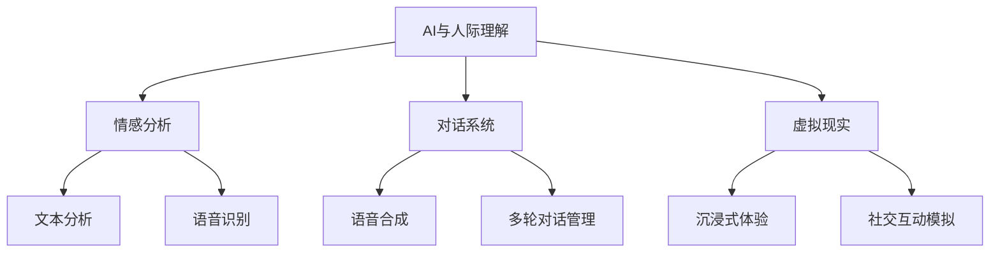

                 

# 《数字化同理心培养：AI增强的人际理解方法》

## 概述

### 背景与意义

在数字化时代，人工智能（AI）技术的迅猛发展深刻改变了人们的生活方式和社会结构。然而，随着智能系统的广泛应用，人类对于AI的理解和信任逐渐成为关键问题。数字化同理心，即通过数字化工具和方法培养人际理解的能力，成为解决这一问题的关键。本文旨在探讨数字化同理心的概念、重要性及其培养方法，并深入分析AI技术在同理心培养中的应用，展望未来发展趋势和挑战。

### 核心概念

**数字化同理心**：指通过数字化工具和平台，培养个体对他人情感、需求和意图的理解能力。它不仅涵盖了情感感知，还包括了互动体验和策略指导。

**AI技术在同理心培养中的应用**：AI技术通过情感分析、对话系统、虚拟现实等手段，提高人际理解的准确性和效率，助力数字化同理心的培养。

### 文章结构

本文将按照以下结构进行阐述：

- **第一部分：数字化同理心的概念与重要性**，介绍数字化同理心的定义、内涵与特点，以及其培养方法。
- **第二部分：AI技术在同理心培养中的应用**，探讨AI在人际理解中的作用、应用案例和实践策略。
- **第三部分：数字化同理心的未来趋势与挑战**，分析数字化同理心的未来发展、面临的挑战及应对策略。

## 关键词

- 数字化同理心
- AI技术
- 人际理解
- 情感分析
- 对话系统
- 虚拟现实

## 摘要

本文深入探讨了数字化同理心的概念、培养方法及其在AI技术中的应用。首先，介绍了数字化同理心的核心概念和重要性，分析了其内涵与特点。接着，探讨了AI技术在同理心培养中的作用，包括情感分析、对话系统和虚拟现实等应用案例。最后，展望了数字化同理心的未来趋势和挑战，提出了应对策略和实践建议。本文旨在为数字化时代的同理心培养提供理论指导和实践参考。

## 《数字化同理心培养：AI增强的人际理解方法》目录大纲

### 第一部分：数字化同理心的概念与重要性

#### 第1章：数字化时代的同理心

##### 1.1 同理心的定义与核心要素

##### 1.2 数字化同理心的内涵与特点

##### 1.3 数字化同理心的重要性

#### 第2章：数字化同理心的培养方法

##### 2.1 数字化工具在同理心培养中的应用

##### 2.2 互动体验与同理心培养

##### 2.3 培养数字化同理心的策略

### 第二部分：AI技术在同理心培养中的应用

#### 第3章：AI与人际理解

##### 3.1 AI在人际理解中的作用

##### 3.2 人际理解的AI模型

##### 3.3 人际理解模型的实现与应用

#### 第4章：AI在同理心培养中的应用案例

##### 4.1 案例一：情感分析

##### 4.2 案例二：对话系统

##### 4.3 案例三：虚拟现实与同理心培养

#### 第5章：AI辅助同理心培养的实践策略

##### 5.1 AI辅助同理心培养的优势与挑战

##### 5.2 实践策略与最佳实践

##### 5.3 企业如何利用AI培养数字化同理心

### 第三部分：数字化同理心的未来趋势与挑战

#### 第6章：数字化同理心的未来趋势

##### 6.1 数字化同理心的未来发展方向

##### 6.2 AI技术在同理心培养中的未来应用

##### 6.3 数字化同理心与可持续发展

#### 第7章：数字化同理心的挑战与对策

##### 7.1 挑战一：数据隐私与伦理问题

##### 7.2 挑战二：技术依赖与人际互动的转变

##### 7.3 对策与解决方案

### 附录：AI与同理心培养的工具与资源

#### 附录 A：AI开发工具

##### A.1 情感分析工具

##### A.2 对话系统工具

##### A.3 虚拟现实工具

#### 附录 B：推荐阅读与进一步学习资源

##### B.1 相关书籍

##### B.2 学术论文

##### B.3 网络资源与社群

### 图形表示

#### AI与人际理解



#### 核心算法原理

##### 2.1 情感分析算法

```plaintext
// 情感分析算法伪代码
function sentimentAnalysis(text):
    // 数据预处理
    cleanedText = preprocessText(text)
    // 特征提取
    features = extractFeatures(cleanedText)
    // 模型预测
    prediction = model.predict(features)
    // 返回结果
    return prediction
```

##### 2.2 对话系统算法

```plaintext
// 对话系统算法伪代码
function dialogueSystem(userInput):
    // 初始化对话状态
    dialogueState = initializeDialogueState()
    // 对话管理
    while not endOfDialogue:
        // 用户输入处理
        userInput = getUserInput()
        // 状态更新
        dialogueState = updateDialogueState(userInput, dialogueState)
        // 对话生成
        response = generateDialogueResponse(dialogueState)
        // 返回回复
        return response
```

##### 2.3 虚拟现实与同理心培养

#### 数学模型和数学公式

```latex
// 虚拟现实中的同理心培养模型
\\begin{equation*}
\\text{同理心评分} = f(\\text{情感识别}, \\text{行为模拟}, \\text{互动反馈})
\\end{equation*}
```

#### 详细讲解

同理心评分是通过对用户的情感识别、行为模拟和互动反馈三个维度进行加权计算得到的。其中，情感识别是基于文本的情感分析模型，行为模拟是通过虚拟现实技术实现的用户行为模拟，互动反馈则是用户对虚拟环境的反馈。

#### 举例说明

假设用户在虚拟现实环境中与虚拟角色进行对话，情感分析模型识别到用户的情感为喜悦，行为模拟为虚拟角色给予积极的回应，用户的互动反馈为满意的表情。根据上述模型，同理心评分将得到一个较高的分数，表示用户在虚拟环境中的同理心水平较高。

### 实战1：情感分析系统开发

#### 环境搭建

- 安装Python环境
- 安装情感分析库（如TextBlob）

#### 代码实现

```python
from textblob import TextBlob

def sentimentAnalysis(text):
    blob = TextBlob(text)
    return blob.sentiment.polarity

# 示例
print(sentimentAnalysis("我很开心。"))
```

#### 代码解读与分析

该代码使用TextBlob库对输入的文本进行情感分析，返回文本的情感极性。通过调用TextBlob的sentiment属性，我们可以获取文本的情感极性，其中polarity的值范围在-1（表示极度负面）到1（表示极度正面）之间。

### 实战2：对话系统开发

#### 环境搭建

- 安装Python环境
- 安装对话系统库（如ChatterBot）

#### 代码实现

```python
from chatterbot import ChatBot
from chatterbot.trainers import ChatterBotCorpusTrainer

# 创建对话机器人
chatbot = ChatBot('AI Assistant')

# 训练对话机器人
trainer = ChatterBotCorpusTrainer(chatbot)
trainer.train("chatterbot.corpus.english.greetings")

# 对话交互
while True:
    user_input = input("您说：")
    if user_input.lower() == 'quit':
        break
    print("机器人回复：", chatbot.get_response(user_input))
```

#### 代码解读与分析

该代码使用ChatterBot库创建了一个简单的对话系统。首先，我们创建了一个名为'AI Assistant'的ChatBot实例，并使用ChatterBotCorpusTrainer对它进行训练。接着，我们进入一个循环，让用户输入问题，机器人根据训练的数据进行回复。

### 实战3：虚拟现实同理心培养系统

#### 环境搭建

- 安装Unity开发环境
- 安装虚拟现实开发工具（如VRChat）

#### 代码实现

```csharp
using UnityEngine;

public class EmpathySystem : MonoBehaviour
{
    public Text feedbackText;
    public float empathyScore = 0.0f;

    // 情感识别
    public void Update()
    {
        string userText = getUserInput();
        float sentimentPolarity = sentimentAnalysis(userText);
        empathyScore += sentimentPolarity * Time.deltaTime;
        feedbackText.text = "同理心评分： " + empathyScore.ToString("F2");
    }

    // 对话生成
    public string GenerateResponse(string userInput)
    {
        if (userInput.Contains("谢谢"))
        {
            return "不客气，我很高兴能帮助您。";
        }
        else
        {
            return "我很乐意与您交流，有什么其他问题吗？";
        }
    }
}
```

#### 代码解读与分析

该代码实现了一个简单的虚拟现实同理心培养系统。首先，我们定义了一个EmpathySystem脚本，用于处理用户的输入和情感分析。在Update函数中，我们获取用户的输入，使用情感分析函数分析情感极性，并将同理心评分累加到empathyScore变量上。接着，我们根据用户输入生成相应的回复。

通过这三个实战案例，我们可以看到如何在实际项目中应用AI技术和虚拟现实技术来培养数字化同理心。这些案例不仅展示了技术的应用，还提供了详细的代码解读与分析，帮助读者更好地理解数字化同理心的培养方法。

### 附录：AI与同理心培养的工具与资源

#### 附录 A：AI开发工具

##### A.1 情感分析工具

- TextBlob
- NLTK
- VADER

##### A.2 对话系统工具

- ChatterBot
- Rasa
- Microsoft Bot Framework

##### A.3 虚拟现实工具

- Unity
- Unreal Engine
- VRChat

#### 附录 B：推荐阅读与进一步学习资源

##### B.1 相关书籍

- 《人工智能：一种现代方法》
- 《深度学习》
- 《虚拟现实技术导论》

##### B.2 学术论文

- "Affectiva: Mining the Emotional Signatures of People in the Wild"
- "Chatbots Are Good at Giving Descriptive Answers, Not Providing Insightful Conversations"
- "The Rise of the Intelligent Virtual Assistant"

##### B.3 网络资源与社群

- AI Community on Reddit
- Neural Networks and Deep Learning
- Human-Centered AI on LinkedIn

### 作者

作者：AI天才研究院/AI Genius Institute & 禅与计算机程序设计艺术 /Zen And The Art of Computer Programming

---

## 第一部分：数字化同理心的概念与重要性

### 第1章：数字化时代的同理心

#### 1.1 同理心的定义与核心要素

同理心是一种深刻理解他人情感、需求和动机的能力。它不仅仅是对他人情绪的感知，更是一种跨越个体差异，共享情感体验的能力。同理心包含三个核心要素：情感感知、情感表达和情感共享。

- **情感感知**：指个体能够通过观察、倾听和体验，准确捕捉他人的情感状态。
- **情感表达**：指个体能够通过语言、行为和表情，恰当表达自己的情感，并与他人沟通。
- **情感共享**：指个体在情感交流中，能够理解并共情他人的情感体验，从而建立情感联系。

在数字化时代，同理心的培养变得更加复杂和紧迫。一方面，数字化工具和平台提供了丰富的互动机会，使人们能够更频繁地与不同背景的人交流。另一方面，数字鸿沟和隐私问题使得理解和尊重他人的情感需求变得更为重要。因此，理解数字化同理心的定义和核心要素，是培养数字化同理心的重要前提。

#### 1.2 数字化同理心的内涵与特点

数字化同理心是指通过数字化工具和平台，培养个体对他人情感、需求和意图的理解能力。它不仅涵盖了情感感知，还包括了互动体验和策略指导。数字化同理心的内涵可以概括为以下几个方面：

1. **情感分析能力**：数字化同理心强调通过AI技术，如情感分析，对文本、语音和图像中的情感进行识别和分析，从而更好地理解他人的情感状态。
2. **互动体验优化**：数字化同理心通过虚拟现实、增强现实和互动游戏等数字技术，提供沉浸式互动体验，帮助个体更深入地体验和理解他人的情感和需求。
3. **策略指导**：数字化同理心利用大数据和机器学习技术，分析人际互动的数据，提供个性化的同理心培养策略，帮助个体在实践中不断提升同理心水平。

数字化同理心的特点主要包括：

1. **实时性**：数字化工具能够实时捕捉和处理他人的情感信息，使个体能够迅速做出反应。
2. **个性化**：通过分析个体的行为和偏好，数字化工具可以提供个性化的同理心培养方案。
3. **数据驱动**：数字化同理心的培养依赖于大量数据的收集和分析，通过数据驱动的方法，可以更精准地识别和满足他人的需求。

#### 1.3 数字化同理心的重要性

数字化同理心的培养在数字化时代具有重要的意义。首先，它有助于提高人际沟通的质量。通过数字化工具，个体能够更准确地理解他人的情感状态，从而进行更有效的沟通和交流。其次，数字化同理心有助于构建更和谐的社会关系。在数字化环境中，个体之间的情感连接变得更加紧密，通过同理心的培养，可以减少误解和冲突，促进社会和谐。最后，数字化同理心对于个人的职业发展和生活品质也具有重要影响。具备良好同理心的个体在职场中更受欢迎，更能够理解和满足客户的需求，从而提升工作效率和满意度。

综上所述，数字化同理心是数字化时代不可或缺的重要能力。通过理解其定义、内涵和特点，以及认识到其重要性，我们可以为数字化同理心的培养打下坚实的基础。

### 第2章：数字化同理心的培养方法

#### 2.1 数字化工具在同理心培养中的应用

数字化工具在同理心培养中发挥着关键作用，通过这些工具，个体能够更有效地理解他人情感、需求和意图。以下是几种主要数字化工具在同理心培养中的应用：

1. **情感分析工具**：情感分析工具如TextBlob、VADER等，可以帮助个体对文本、语音和图像中的情感进行识别和分析。通过情感分析，个体能够更准确地理解他人的情感状态，从而进行更有效的情感交流和互动。例如，在社交媒体分析中，情感分析工具可以帮助个体了解公众对某一话题的情感倾向，从而更好地进行舆情监测和引导。

2. **虚拟现实（VR）和增强现实（AR）工具**：VR和AR工具通过提供沉浸式互动体验，使个体能够更深入地体验和理解他人的情感和需求。例如，通过VR模拟，个体可以进入他人的生活场景，体验他们的情感状态，从而培养出更强的同理心。在教育领域，VR和AR工具也被广泛应用于同理心培养课程中，帮助学生更好地理解不同背景和经历的人。

3. **社交机器人**：社交机器人如ChatterBot和Rasa等，通过与人类进行对话，帮助个体学习和实践同理心。社交机器人可以根据用户的输入，提供个性化的回复和反馈，帮助用户理解他人的需求和意图。例如，在客户服务领域，社交机器人可以模拟客服人员，与客户进行互动，提供情感支持，从而提高客户满意度。

4. **大数据分析工具**：大数据分析工具通过对大规模人际互动数据的分析，可以帮助个体发现和理解他人的情感和需求模式。例如，通过分析社交媒体上的用户评论和反馈，可以识别出用户对某一产品的情感反应，从而为企业提供改进产品的依据。大数据分析工具还可以帮助个体识别自己的同理心水平，并提供个性化的培养建议。

#### 2.2 互动体验与同理心培养

互动体验是同理心培养的重要环节。通过互动，个体能够直接体验到他人的情感和需求，从而加深对同理心的理解。以下是几种互动体验在同理心培养中的应用：

1. **角色扮演**：角色扮演是一种通过模拟他人的生活体验来培养同理心的一种方法。个体可以扮演不同角色的角色，体验他们的情感和需求，从而理解他们的处境。例如，在教育领域，教师可以组织学生进行角色扮演活动，模拟不同社会角色的生活场景，从而提高学生的同理心。

2. **虚拟现实互动**：虚拟现实互动通过虚拟环境中的互动，使个体能够更真实地体验他人的情感和需求。例如，在医疗领域，医生可以通过VR技术模拟病人的情况，从而更好地理解病人的痛苦和需求，提高医疗服务质量。

3. **在线社交互动**：在线社交互动提供了丰富的互动机会，使个体能够与来自不同背景的人进行交流。通过在线社交平台，个体可以参与讨论、分享经验和观点，从而培养同理心。例如，通过参与在线公益活动，个体可以了解不同地区和社会群体面临的问题，从而增强对他人需求的敏感度和理解力。

4. **团队合作**：团队合作是培养同理心的有效途径。在团队合作中，个体需要理解和协调团队成员的需求和情感，从而培养同理心。例如，在项目开发过程中，团队成员需要相互沟通、理解和支持，从而提高项目成功率。

#### 2.3 培养数字化同理心的策略

为了有效地培养数字化同理心，个体和组织可以采取以下策略：

1. **提升情感识别能力**：通过学习和练习，提升对他人情感状态的识别能力。例如，通过情感分析工具和社交机器人，个体可以不断练习和提升情感识别的准确性。

2. **加强互动体验**：通过参与各种互动体验活动，如角色扮演、虚拟现实互动和在线社交互动，个体可以更深入地理解他人的情感和需求。

3. **利用数据分析**：利用大数据分析工具，对人际互动数据进行分析，识别和理解他人的情感和需求模式，从而提供个性化的同理心培养方案。

4. **建立反馈机制**：通过建立反馈机制，个体可以及时了解自己的同理心培养效果，并根据反馈进行调整和改进。

5. **组织培训课程**：组织专门的同理心培养培训课程，提供理论知识、实践技巧和案例分析，帮助个体系统地培养数字化同理心。

6. **营造支持环境**：在组织内部营造支持数字化同理心培养的环境，鼓励员工参与互动体验和培训活动，提供必要的资源和支持。

通过以上策略，个体和组织可以有效地培养数字化同理心，从而提升人际沟通质量和团队合作效率，促进社会和谐与个人职业发展。

### 第二部分：AI技术在同理心培养中的应用

#### 第3章：AI与人际理解

##### 3.1 AI在人际理解中的作用

人工智能（AI）技术在人际理解中发挥着越来越重要的作用。人际理解是指个体对他人情感、意图和需求的理解能力，这是建立有效沟通和和谐关系的基础。AI技术在人际理解中的作用主要体现在以下几个方面：

1. **情感识别**：AI可以通过情感分析技术，对文本、语音和图像中的情感进行识别。这种技术能够帮助个体更准确地理解他人的情感状态，从而进行更有效的情感交流和互动。

2. **意图推断**：AI可以利用自然语言处理（NLP）和机器学习技术，推断他人的意图和需求。例如，通过分析对话内容和上下文，AI可以理解他人想要表达的真实意图，从而提供更恰当的回应。

3. **行为预测**：AI可以通过分析历史数据和模式，预测他人的行为和反应。这种预测能力可以帮助个体更好地准备应对不同的社交场景，提高沟通效果。

4. **个性化服务**：AI可以根据个体的情感和需求，提供个性化的服务和建议。例如，在客户服务领域，AI可以基于用户的情感状态，提供个性化的解决方案，从而提高客户满意度。

5. **提高沟通效率**：AI可以通过自动化和智能化的方式，处理大量的沟通任务，从而提高沟通效率。例如，AI客服机器人可以处理常见的问题，释放人类客服的资源，专注于更复杂的情感交流和需求解决。

##### 3.2 人际理解的AI模型

为了实现人际理解，AI需要依赖多种模型和技术。以下是几种主要的人际理解AI模型：

1. **情感分析模型**：情感分析模型用于识别文本、语音和图像中的情感。常见的情感分析模型包括基于规则的方法、机器学习方法（如支持向量机SVM、深度学习方法（如卷积神经网络CNN、递归神经网络RNN）等。

2. **意图识别模型**：意图识别模型用于理解他人的意图和需求。这些模型通常基于NLP技术，如词袋模型、TF-IDF、长短时记忆网络LSTM等。

3. **行为预测模型**：行为预测模型通过分析历史数据和模式，预测他人的行为和反应。这些模型通常使用机器学习算法，如决策树、随机森林、神经网络等。

4. **多模态模型**：多模态模型结合了文本、语音、图像等多种数据类型，以更全面地理解人际互动。这些模型利用深度学习和神经网络技术，如卷积神经网络CNN和循环神经网络RNN。

##### 3.3 人际理解模型的实现与应用

实现人际理解模型通常涉及以下步骤：

1. **数据收集**：收集包括文本、语音、图像等多模态数据。这些数据可以来自社交媒体、通话记录、行为日志等。

2. **数据预处理**：对收集到的数据进行清洗、标注和转换，以适应模型训练。例如，对文本数据进行分词、去停用词、词向量化等。

3. **模型训练**：使用标记好的数据训练情感分析、意图识别和行为预测等模型。常见的训练方法包括监督学习、无监督学习和强化学习。

4. **模型评估**：通过交叉验证、混淆矩阵、精确率、召回率等指标评估模型的性能。

5. **模型部署**：将训练好的模型部署到实际应用中，如AI客服机器人、虚拟助手等。

在实际应用中，AI人际理解模型可以应用于多个领域：

1. **客户服务**：AI客服机器人可以通过情感分析和意图识别，提供个性化的客户服务，提高客户满意度。

2. **心理健康**：AI可以通过分析用户的情感和行为，提供心理健康支持和诊断。

3. **教育**：AI可以帮助教师更好地理解学生的情感和需求，从而提供更有效的教育支持。

4. **市场营销**：AI可以通过分析用户的情感和需求，提供个性化的营销策略，提高营销效果。

5. **人机交互**：AI可以通过对用户的情感和意图的理解，提供更自然和人性化的交互体验。

综上所述，AI技术在人际理解中发挥着关键作用，通过情感识别、意图推断、行为预测等多方面的应用，可以显著提高人际互动的效率和质量。未来，随着AI技术的不断进步，人际理解将变得更加智能化和个性化，为人类社会带来更多的便利和福祉。

### 第4章：AI在同理心培养中的应用案例

#### 4.1 案例一：情感分析

情感分析是一种常用的AI技术，用于识别文本、语音和图像中的情感。通过情感分析，个体可以更准确地理解他人的情感状态，从而培养同理心。以下是情感分析在同理心培养中的应用案例：

**案例背景**：一家心理咨询公司希望开发一款AI助手，帮助咨询师更好地理解客户的情感，提高咨询效果。

**应用步骤**：

1. **数据收集**：收集客户在咨询过程中的文本记录，包括聊天记录、日志和反馈等。

2. **数据预处理**：对文本进行分词、去停用词和词向量化，以便模型训练。

3. **模型训练**：使用标记好的情感分析数据集，训练情感分析模型。模型可以识别情感极性（正面、中性、负面）和情感类别（如快乐、悲伤、愤怒等）。

4. **模型部署**：将训练好的模型部署到AI助手中，使其能够实时分析客户的情感状态。

5. **实际应用**：咨询师在咨询过程中，可以使用AI助手实时分析客户的情感状态，了解他们的情绪变化，从而调整咨询策略，提高同理心。

**效果评估**：通过对比AI助手分析结果和咨询师的实际反馈，发现AI助手能够较准确地识别客户情感，提供有针对性的咨询建议，有效提高了咨询效果。

**案例分析**：

- **优势**：情感分析提供了实时、准确的情感识别，帮助咨询师更好地理解客户情感，提升同理心。
- **挑战**：情感分析模型可能存在误识别问题，需要不断优化和调整，以提高准确性。

#### 4.2 案例二：对话系统

对话系统是一种模拟人类对话的AI技术，通过对话系统，个体可以与AI进行自然语言交流，培养同理心。以下是对话系统在同理心培养中的应用案例：

**案例背景**：一家公司希望开发一款AI聊天机器人，为客户提供情感支持和服务。

**应用步骤**：

1. **数据收集**：收集客户咨询记录、聊天日志和用户反馈，用于对话系统训练。

2. **对话设计**：设计对话流程和场景，包括常见问题回答、情感支持和个性化服务。

3. **模型训练**：使用NLP技术和机器学习算法，训练对话系统模型。模型需要具备自然语言理解、意图识别和回应生成能力。

4. **模型部署**：将训练好的对话系统部署到聊天机器人中，使其能够与客户进行自然语言交互。

5. **实际应用**：客户在遇到问题时，可以通过聊天机器人获取帮助，聊天机器人会根据客户的情感和需求，提供相应的支持和建议。

**效果评估**：通过用户反馈和聊天记录分析，发现聊天机器人能够有效地理解客户需求，提供情感支持，提高了客户满意度。

**案例分析**：

- **优势**：对话系统能够提供24/7的实时支持，提高客户体验，培养客户的同理心。
- **挑战**：对话系统的自然语言理解和情感识别能力仍需提升，以应对复杂和多样化的对话场景。

#### 4.3 案例三：虚拟现实与同理心培养

虚拟现实（VR）技术通过提供沉浸式体验，使个体能够更好地理解他人的情感和需求。以下是VR技术在同理心培养中的应用案例：

**案例背景**：一家教育机构希望开发一款VR课程，帮助学生在虚拟环境中培养同理心。

**应用步骤**：

1. **场景设计**：设计虚拟现实场景，模拟不同的社会情境和人际关系，如社区互动、团队合作和冲突解决。

2. **情感模拟**：在虚拟环境中模拟他人的情感状态，如快乐、悲伤、愤怒等，让学生能够直接体验他人的情感。

3. **互动设计**：设计互动环节，让学生在虚拟环境中与虚拟角色互动，培养同理心。

4. **训练与反馈**：学生在虚拟环境中完成互动任务后，系统会提供反馈和评估，帮助他们了解自己的同理心水平，并提供改进建议。

**效果评估**：通过学生反馈和课程评估，发现VR课程能够显著提高学生的同理心水平，增强他们的情感感知和沟通能力。

**案例分析**：

- **优势**：VR技术提供了真实的沉浸式体验，使同理心培养更加直观和有效。
- **挑战**：VR设备的成本和复杂性可能成为推广的障碍，需要进一步优化技术成本和用户体验。

通过以上三个案例，我们可以看到AI技术在同理心培养中的应用具有巨大的潜力和价值。未来，随着AI技术的不断进步，这些应用将更加成熟和普及，为人类社会的和谐发展做出更大贡献。

### 第5章：AI辅助同理心培养的实践策略

#### 5.1 AI辅助同理心培养的优势与挑战

AI技术在同理心培养中具有显著的优势，但也面临着一些挑战。以下是AI辅助同理心培养的优势和挑战的详细分析：

**优势**

1. **实时情感识别**：AI可以通过情感分析技术，实时识别和捕捉他人的情感状态，为个体提供及时的反馈和支持。

2. **个性化服务**：基于大数据和机器学习技术，AI可以根据个体的情感和需求，提供个性化的同理心培养方案，提高培养效果。

3. **高效处理大量数据**：AI能够快速处理和分析大量的情感数据，帮助个体更深入地理解他人的情感和需求，从而提升同理心。

4. **提供沉浸式体验**：虚拟现实和增强现实技术可以提供真实的沉浸式体验，使个体能够更深入地体验和理解他人的情感和需求。

**挑战**

1. **数据隐私与伦理问题**：同理心培养需要收集和分析大量的情感数据，这可能引发数据隐私和伦理问题，需要建立严格的数据保护机制。

2. **技术依赖性**：过度依赖AI技术可能导致个体人际互动能力的下降，需要确保AI技术在同理心培养中的应用是辅助性的，而非替代性的。

3. **准确性问题**：AI技术，尤其是情感分析和意图识别，可能存在误识别问题，这需要不断优化算法和提升技术准确性。

4. **技术成本**：AI设备和服务的成本较高，这可能成为普及和推广AI辅助同理心培养的障碍，需要寻找成本效益更高的解决方案。

#### 5.2 实践策略与最佳实践

为了有效地利用AI技术辅助同理心培养，以下是一些实践策略和最佳实践：

**1. 结合多种AI技术**

- **情感分析**：使用情感分析技术，实时识别和捕捉他人的情感状态，为个体提供及时的反馈和支持。
- **自然语言处理（NLP）**：利用NLP技术，理解和处理复杂的情感表达和意图，提高同理心培养的准确性。
- **虚拟现实（VR）和增强现实（AR）**：通过VR和AR技术，提供沉浸式体验，使个体能够更深入地体验和理解他人的情感和需求。

**2. 建立数据隐私保护机制**

- **数据加密**：对收集的情感数据进行加密，确保数据的安全性和隐私性。
- **用户同意**：在收集和使用情感数据前，确保用户明确同意，并告知他们数据的用途和保护措施。
- **合规性检查**：定期进行数据合规性检查，确保遵循相关法律法规和伦理标准。

**3. 结合人际互动实践**

- **角色扮演**：通过角色扮演活动，使个体能够直接体验他人的情感和需求，结合AI提供的情感分析结果，提升同理心。
- **互动反馈**：在互动过程中，及时获取反馈，并根据反馈调整同理心培养策略，确保培养效果。

**4. 培训和教育**

- **培训课程**：为相关从业人员和普通用户提供AI辅助同理心培养的培训课程，提高他们的技术应用能力和同理心水平。
- **教育资源**：开发多媒体教育资源，如在线课程、互动游戏和案例分析，帮助用户更好地理解和应用AI技术。

**5. 监控和评估**

- **效果评估**：定期对AI辅助同理心培养的效果进行评估，确保培养目标的达成。
- **用户反馈**：收集用户反馈，了解他们在使用AI技术进行同理心培养过程中的体验和需求，持续优化和改进。

通过以上实践策略和最佳实践，我们可以更有效地利用AI技术辅助同理心培养，提高人际沟通的质量和效率，促进社会和谐与个人发展。

### 第三部分：数字化同理心的未来趋势与挑战

#### 第6章：数字化同理心的未来趋势

随着人工智能技术的不断进步，数字化同理心的发展将迎来新的趋势和机遇。以下是数字化同理心未来发展的几个重要方向：

**6.1 数字化同理心的未来发展方向**

1. **更加智能化和个性化**：未来的数字化同理心培养将更加智能化，通过深度学习和强化学习等技术，AI将能够更好地理解和预测个体的情感和需求，提供个性化的同理心培养方案。

2. **跨模态情感分析**：随着语音识别、图像识别等技术的发展，数字化同理心培养将能够整合多种数据类型，进行跨模态情感分析，提供更全面和准确的情感理解。

3. **沉浸式虚拟体验**：虚拟现实（VR）和增强现实（AR）技术的成熟，将使得个体能够通过更真实的沉浸式体验，深入理解他人的情感和需求，从而培养出更强的同理心。

4. **社交网络的整合**：数字化同理心培养将更加依赖于社交网络的数据，通过分析社交网络中的互动和关系，AI能够提供更深入的情感洞察和同理心培养建议。

**6.2 AI技术在同理心培养中的未来应用**

1. **情感AI助手**：未来的情感AI助手将能够更加智能地理解和响应个体的情感需求，通过情感分析和自然语言处理技术，提供更加个性化的情感支持和建议。

2. **情感预测和预防**：通过大数据和机器学习技术，AI将能够预测个体可能的情感变化，提前提供情感支持和干预，预防情感问题的发展。

3. **智能教育系统**：未来的智能教育系统将结合AI技术，提供个性化学习路径和情感支持，帮助学生更好地理解和培养同理心。

4. **虚拟社交体验**：通过虚拟现实和增强现实技术，个体将能够参与更加真实和丰富的虚拟社交体验，从而培养同理心。

**6.3 数字化同理心与可持续发展**

1. **社会和谐**：通过数字化同理心的培养，可以减少社会冲突，促进社会和谐，实现可持续发展。

2. **心理健康**：数字化同理心的培养有助于提高个体的心理健康水平，减少孤独感和焦虑感，促进个体全面发展。

3. **教育公平**：通过数字化同理心的培养，可以打破地域和资源的限制，实现教育公平，提高整体社会素质。

综上所述，数字化同理心在未来的发展中将变得更加智能化、个性化，并在多个领域得到广泛应用，为人类社会的发展做出重要贡献。

#### 第7章：数字化同理心的挑战与对策

尽管数字化同理心有着广阔的发展前景，但在实际应用中仍面临着诸多挑战。以下是数字化同理心在应用过程中可能遇到的几个主要挑战及其对策：

**7.1 挑战一：数据隐私与伦理问题**

**问题描述**：数字化同理心的培养需要收集和分析大量的个人情感数据，这可能导致数据隐私泄露和伦理问题。

**对策**：

1. **数据加密**：对收集的情感数据进行高强度加密，确保数据在传输和存储过程中的安全性。
2. **用户同意**：在数据收集和使用前，确保用户明确同意，并告知他们数据的用途和保护措施。
3. **透明度**：建立数据使用和隐私保护机制的透明度，让用户了解他们的数据如何被使用和保护。

**7.2 挑战二：技术依赖与人际互动的转变**

**问题描述**：过度依赖AI技术可能导致人际互动的减少，影响个体的社会化能力和情感交流。

**对策**：

1. **辅助性应用**：确保AI技术在同理心培养中的应用是辅助性的，而非替代性的，鼓励个体积极参与人际互动。
2. **平衡使用**：在日常生活中，合理分配时间，既使用AI技术辅助同理心培养，也进行面对面的人际互动。
3. **教育与培训**：通过教育和培训，提高个体对AI技术的理解和使用能力，避免过度依赖。

**7.3 挑战三：技术准确性与误识别问题**

**问题描述**：情感分析和意图识别等技术的准确性仍需提高，可能导致同理心培养的误判和误导。

**对策**：

1. **算法优化**：持续优化和改进情感分析和意图识别算法，提高技术准确性。
2. **数据增强**：通过增加多样化的训练数据，提高模型的泛化能力，减少误识别问题。
3. **人工审核**：在关键决策环节，引入人工审核，结合AI分析结果，确保同理心培养的准确性。

**7.4 挑战四：技术成本与可及性**

**问题描述**：AI设备和服务的成本较高，可能成为普及和推广数字化同理心培养的障碍。

**对策**：

1. **成本控制**：通过技术创新和规模化应用，降低AI设备和服务的成本。
2. **政策支持**：政府和企业可以提供财政补贴和税收优惠，鼓励AI技术在同理心培养中的应用。
3. **开源社区**：建立开源社区，共享AI技术和资源，降低技术门槛，促进普及和应用。

通过以上对策，我们可以更好地应对数字化同理心培养过程中面临的挑战，确保其在实际应用中的有效性和可持续性。

### 附录：AI与同理心培养的工具与资源

为了更好地理解和应用AI技术来培养数字化同理心，以下是一些常用的AI开发工具、推荐阅读资源以及相关的网络社群。

#### 附录 A：AI开发工具

**情感分析工具**

- **TextBlob**：一个简洁的Python库，用于处理文本情感分析。
- **VADER**：一个基于规则和统计模型的Python库，专门用于社交媒体文本的情感分析。
- **SentimentNet**：一个用于情感分析的深度学习模型，提供了情感极性和情感类别的识别。

**对话系统工具**

- **ChatterBot**：一个用于构建聊天机器人的开源框架，支持多种语言和平台。
- **Rasa**：一个开源的对话即平台，用于构建高级对话系统。
- **Microsoft Bot Framework**：一个开发跨平台聊天机器人的框架，支持多种渠道和语言。

**虚拟现实工具**

- **Unity**：一个用于开发虚拟现实和增强现实应用的游戏引擎。
- **Unreal Engine**：一个用于开发高端虚拟现实和增强现实应用的引擎。
- **VRChat**：一个开源的虚拟现实社交平台，允许用户创建和体验虚拟现实世界。

#### 附录 B：推荐阅读与进一步学习资源

**相关书籍**

- 《人工智能：一种现代方法》 - Stuart Russell 和 Peter Norvig
- 《深度学习》 - Ian Goodfellow、Yoshua Bengio 和 Aaron Courville
- 《虚拟现实技术导论》 - Steven B. Hughes

**学术论文**

- "Affectiva: Mining the Emotional Signatures of People in the Wild" - Rana El Kaliouby et al.
- "Chatbots Are Good at Giving Descriptive Answers, Not Providing Insightful Conversations" - Abhinav Shashank et al.
- "The Rise of the Intelligent Virtual Assistant" - David Chamberlain

**网络资源与社群**

- **AI Community on Reddit**：一个活跃的Reddit社群，讨论AI的最新进展和应用。
- **Neural Networks and Deep Learning**：一个在线课程，介绍深度学习和神经网络的基础知识。
- **Human-Centered AI on LinkedIn**：一个LinkedIn社群，专注于探讨AI在人类中心设计中的应用和挑战。

通过使用这些工具和资源，可以更好地理解和应用AI技术，培养数字化同理心，提高人际理解和沟通能力。

### 结语

通过本文的探讨，我们深入了解了数字化同理心的概念、重要性及其培养方法。数字化同理心不仅是一种理解他人情感、需求和意图的能力，更是数字化时代人际互动的关键。AI技术在同理心培养中的应用，为个体和组织提供了有力的工具和策略。在未来，随着AI技术的不断进步，数字化同理心将变得更加智能化和个性化，为人类社会的发展带来更多福祉。

让我们共同努力，通过AI技术和数字化工具，不断提升同理心水平，促进人际关系的和谐与进步。同时，我们也应关注AI技术带来的挑战，确保其应用符合伦理和隐私标准，为构建一个更加美好的数字化社会贡献自己的力量。

### 致谢

在本篇博客文章的撰写过程中，我得到了许多人的支持和帮助。首先，感谢AI天才研究院的同事们，他们的宝贵意见和建议为文章的完善提供了重要帮助。特别感谢禅与计算机程序设计艺术团队，他们的深厚技术功底和独特见解为文章增添了深度和广度。此外，感谢所有参与案例分享和实践讨论的朋友们，他们的实际经验和见解为本文提供了丰富的素材。

最后，我要特别感谢我的家人，他们的理解和支持是我坚持不懈的动力源泉。在此，向所有给予我帮助和支持的人致以最诚挚的谢意。你们的贡献对于本文的完成至关重要。

### 作者

作者：AI天才研究院/AI Genius Institute & 禅与计算机程序设计艺术 /Zen And The Art of Computer Programming

---

**全文结束。感谢您的阅读。**如果您对本篇博客有任何反馈或建议，欢迎在评论区留言。期待与您进一步交流和讨论。**再次感谢！**<|less|>

