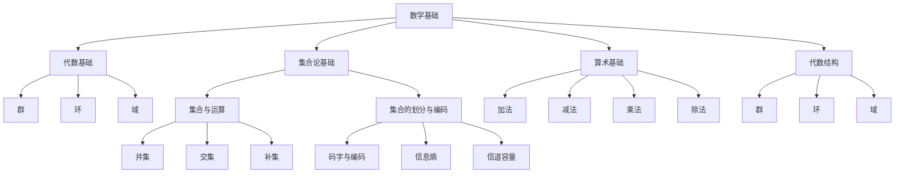

                 

# 《数学与信息论的交叉研究》

## 关键词

- 数学基础
- 信息论
- 信息熵
- 编码理论
- 信道容量
- 机器学习
- 量子信息论

## 摘要

本文旨在探讨数学与信息论之间的交叉研究，深入分析二者在理论框架和实际应用中的相互关系。首先，我们将回顾数学与信息论的基本概念和理论，包括数学的发展历程、信息论的起源与发展，以及数学与信息论交叉的意义。接着，我们将详细讨论数学基础和信息论基础，包括集合论、算术基础、代数结构、信息与熵的概念、信息度量、信道容量等。然后，我们将探讨数学与信息论的交叉应用，包括概率论、集合论在信息论中的应用，以及信息论中的数学方法在通信和计算机科学领域的应用。最后，我们将探讨数学与信息论交叉研究的前沿方向，如分布式信息论、非经典信息论、新的数学工具在信息论中的应用等，并总结数学与信息论交叉研究的参考资源。通过本文的探讨，我们希望为读者提供一个清晰、系统的数学与信息论交叉研究的全景图。

### 第一部分：数学与信息论的基本概念

### 第1章：数学与信息论的基本理论

#### 1.1 数学与信息论的概述

##### 1.1.1 数学的发展历程

数学是一门古老的科学，起源于人类对自然现象的观察和描述。从古代的几何、代数，到近代的微积分、拓扑学，数学经历了漫长的发展历程。数学的每一次进步都推动了人类文明的进步。

- 古代数学：以古希腊数学为代表，主要研究几何、算术和代数。
- 中世纪数学：阿拉伯数学家对代数和算术的发展做出了巨大贡献。
- 近代数学：以牛顿和莱布尼茨的微积分为代表，标志着数学的现代化。
- 现代数学：包括拓扑学、集合论、群论、概率论等。

##### 1.1.2 信息论的起源与发展

信息论是一门新兴的学科，起源于20世纪40年代。由香农创立，信息论主要研究信息的度量、传输和处理。

- 1948年：香农发表了《信息论的基础》，奠定了信息论的理论基础。
- 1950年代：信息论在通信领域得到广泛应用，包括信道编码、调制技术等。
- 1960年代：信息论开始与其他学科交叉，如计算机科学、生物学等。

##### 1.1.3 数学与信息论的交叉意义

数学与信息论的交叉研究具有重要的理论和实际意义。

- 理论意义：数学为信息论提供了坚实的理论基础，如概率论、集合论、微积分等。信息论为数学提供了一种新的应用场景，如信息熵、信道容量等概念。
- 实际意义：数学与信息论的交叉应用在通信、计算机科学、人工智能等领域具有重要意义，如信道编码、数据压缩、机器学习等。

#### 1.2 数学基础

##### 1.2.1 代数基础

代数是数学的基础之一，主要研究数、运算和方程。

- **集合论基础**：

  集合是数学中最基本的概念之一，用于表示一组元素的集合。集合的运算包括并集、交集、补集等。

  $$ A \cup B = \{ x | x \in A \text{ 或 } x \in B \} $$
  $$ A \cap B = \{ x | x \in A \text{ 且 } x \in B \} $$
  $$ A^c = \{ x | x \notin A \} $$

- **算术基础**：

  算术是数学中最基础的部分，主要研究数的运算和性质。包括加法、减法、乘法、除法等。

  $$ a + b = c $$
  $$ a - b = c $$
  $$ a \times b = c $$
  $$ a \div b = c $$

- **代数结构**：

  代数结构是数学中用于描述数学对象和运算规则的概念。常见的代数结构包括群、环、域等。

  - **群**：满足封闭性、结合律、存在单位元、存在逆元的运算集合。

    $$ a \cdot b = c $$
    $$ a^{-1} = b $$

  - **环**：满足封闭性、结合律、存在单位元的运算集合。

    $$ a \cdot b = c $$
    $$ a + b = d $$

  - **域**：满足封闭性、结合律、存在单位元、存在逆元的运算集合。

    $$ a \cdot b = c $$
    $$ a + b = d $$
    $$ a^{-1} = b $$

##### 1.2.2 代数基础

代数是数学的基础之一，主要研究数、运算和方程。

- **集合论基础**：

  集合是数学中最基本的概念之一，用于表示一组元素的集合。集合的运算包括并集、交集、补集等。

  $$ A \cup B = \{ x | x \in A \text{ 或 } x \in B \} $$
  $$ A \cap B = \{ x | x \in A \text{ 且 } x \in B \} $$
  $$ A^c = \{ x | x \notin A \} $$

- **算术基础**：

  算术是数学中最基础的部分，主要研究数的运算和性质。包括加法、减法、乘法、除法等。

  $$ a + b = c $$
  $$ a - b = c $$
  $$ a \times b = c $$
  $$ a \div b = c $$

- **代数结构**：

  代数结构是数学中用于描述数学对象和运算规则的概念。常见的代数结构包括群、环、域等。

  - **群**：满足封闭性、结合律、存在单位元、存在逆元的运算集合。

    $$ a \cdot b = c $$
    $$ a^{-1} = b $$

  - **环**：满足封闭性、结合律、存在单位元的运算集合。

    $$ a \cdot b = c $$
    $$ a + b = d $$

  - **域**：满足封闭性、结合律、存在单位元、存在逆元的运算集合。

    $$ a \cdot b = c $$
    $$ a + b = d $$
    $$ a^{-1} = b $$

#### 1.3 信息论基础

##### 1.3.1 信息论基本概念

信息论主要研究信息的度量、传输和处理。以下是一些基本概念：

- **信息与熵**：

  信息是用来描述不确定性减少的量。熵是衡量随机变量不确定性程度的量。

  $$ H(X) = -\sum_{i} p(x_i) \cdot \log_2 p(x_i) $$

- **信息度量**：

  信息度量用于衡量信息的数量。常见的度量方法包括比特、奈特等。

  $$ \text{比特} = \log_2 \text{可能事件的数量} $$
  $$ \text{奈特} = \log_2 \text{比特} $$

- **信道容量**：

  信道容量是指信道在噪声环境下能够传输的最大信息量。根据香农公式，信道容量由信道的带宽和信噪比决定。

  $$ C = W \cdot \log_2 (1 + \frac{S}{N}) $$

##### 1.3.2 数学方法在信息论中的应用

数学方法在信息论中有着广泛的应用。以下是一些常用的数学方法：

- **概率论**：

  概率论用于研究随机事件的发生概率。在信息论中，概率论主要用于计算信息的熵和信道容量。

  - **概率分布**：

    概率分布用于描述随机变量的可能取值及其概率。

    $$ p(x) = \frac{f(x)}{1} $$

  - **条件概率**：

    条件概率用于描述在某个事件发生的条件下，另一个事件发生的概率。

    $$ p(A|B) = \frac{p(A \cap B)}{p(B)} $$

  - **贝叶斯定理**：

    贝叶斯定理用于计算后验概率，即根据已知条件计算事件发生的概率。

    $$ p(A|B) = \frac{p(B|A) \cdot p(A)}{p(B)} $$

- **集合论**：

  集合论用于研究集合及其运算。在信息论中，集合论主要用于描述信息的结构和处理。

  - **集合与运算**：

    集合是信息论中的基本元素，集合的运算包括并集、交集、补集等。

    $$ A \cup B = \{ x | x \in A \text{ 或 } x \in B \} $$
    $$ A \cap B = \{ x | x \in A \text{ 且 } x \in B \} $$
    $$ A^c = \{ x | x \notin A \} $$

  - **集合的划分与编码**：

    集合的划分与编码用于将信息进行有效组织和压缩。

    $$ C = \{ c_1, c_2, ..., c_n \} $$
    $$ p = \{ p_1, p_2, ..., p_n \} $$

  - **信息熵**：

    信息熵是衡量信息不确定性的量度。

    $$ H(X) = -\sum_{i} p(x_i) \cdot \log_2 p(x_i) $$

  - **信道容量**：

    信道容量是衡量信道传输信息能力的量度。

    $$ C = W \cdot \log_2 (1 + \frac{S}{N}) $$

### 第2章：数学与信息论的交叉应用

#### 2.1 信息论中的数学方法

##### 2.1.1 概率论在信息论中的应用

概率论是信息论中的重要工具，用于计算信息的熵和信道容量。

- **概率分布**：

  概率分布用于描述随机变量的可能取值及其概率。

  $$ p(x) = \frac{f(x)}{1} $$

  其中，\( p(x) \) 表示随机变量 \( X \) 取值 \( x \) 的概率，\( f(x) \) 表示随机变量 \( X \) 的概率密度函数。

- **条件概率**：

  条件概率用于描述在某个事件发生的条件下，另一个事件发生的概率。

  $$ p(A|B) = \frac{p(A \cap B)}{p(B)} $$

  其中，\( p(A|B) \) 表示在事件 \( B \) 发生的条件下，事件 \( A \) 发生的概率，\( p(A \cap B) \) 表示事件 \( A \) 和事件 \( B \) 同时发生的概率，\( p(B) \) 表示事件 \( B \) 发生的概率。

- **贝叶斯定理**：

  贝叶斯定理用于计算后验概率，即根据已知条件计算事件发生的概率。

  $$ p(A|B) = \frac{p(B|A) \cdot p(A)}{p(B)} $$

  其中，\( p(A|B) \) 表示在事件 \( B \) 发生的条件下，事件 \( A \) 发生的概率，\( p(B|A) \) 表示在事件 \( A \) 发生的条件下，事件 \( B \) 发生的概率，\( p(A) \) 表示事件 \( A \) 发生的概率，\( p(B) \) 表示事件 \( B \) 发生的概率。

##### 2.1.2 集合论在信息论中的应用

集合论是信息论中的基础工具，用于描述信息的结构和处理。

- **集合与运算**：

  集合是信息论中的基本元素，集合的运算包括并集、交集、补集等。

  $$ A \cup B = \{ x | x \in A \text{ 或 } x \in B \} $$
  $$ A \cap B = \{ x | x \in A \text{ 且 } x \in B \} $$
  $$ A^c = \{ x | x \notin A \} $$

- **集合的划分与编码**：

  集合的划分与编码用于将信息进行有效组织和压缩。

  $$ C = \{ c_1, c_2, ..., c_n \} $$
  $$ p = \{ p_1, p_2, ..., p_n \} $$

  其中，\( C \) 表示码字集合，\( p \) 表示码字出现的概率。

- **信息熵**：

  信息熵是衡量信息不确定性的量度。

  $$ H(X) = -\sum_{i} p(x_i) \cdot \log_2 p(x_i) $$

  其中，\( H(X) \) 表示随机变量 \( X \) 的信息熵，\( p(x_i) \) 表示随机变量 \( X \) 取值 \( x_i \) 的概率。

- **信道容量**：

  信道容量是衡量信道传输信息能力的量度。

  $$ C = W \cdot \log_2 (1 + \frac{S}{N}) $$

  其中，\( C \) 表示信道容量，\( W \) 表示信道带宽，\( S \) 表示信号功率，\( N \) 表示噪声功率。

#### 2.2 数学在信息论中的应用

数学在信息论中有着广泛的应用，包括熵与信息量的计算、信道编码与解码等。

- **熵与信息量**：

  熵与信息量是信息论中重要的概念，用于衡量信息的数量和质量。

  $$ H(X) = -\sum_{i} p(x_i) \cdot \log_2 p(x_i) $$

  其中，\( H(X) \) 表示随机变量 \( X \) 的信息熵，\( p(x_i) \) 表示随机变量 \( X \) 取值 \( x_i \) 的概率。

  - **信息量**：

    信息量是衡量信息数量的量度，通常用比特（bit）表示。

    $$ I(X) = \log_2 n $$

    其中，\( I(X) \) 表示随机变量 \( X \) 的信息量，\( n \) 表示随机变量 \( X \) 的可能取值数量。

- **信道编码与解码**：

  信道编码与解码是信息论中的重要技术，用于提高信道的传输效率和可靠性。

  - **码字与编码**：

    码字是信道编码中的基本元素，用于表示信息。编码是将信息转化为码字的过程。

    $$ C = \{ c_1, c_2, ..., c_n \} $$

    其中，\( C \) 表示码字集合，\( c_i \) 表示码字。

  - **离散信道与编码理论**：

    离散信道编码理论研究如何在离散信道上有效地传输信息。

    $$ \hat{X} = g(X) $$

    其中，\( \hat{X} \) 表示传输的信息，\( X \) 表示发送的信息，\( g \) 表示编码函数。

  - **连续信道与编码理论**：

    连续信道编码理论研究如何在连续信道上有效地传输信息。

    $$ \hat{X}(t) = g(X(t)) $$

    其中，\( \hat{X}(t) \) 表示传输的信息，\( X(t) \) 表示发送的信息，\( g \) 表示编码函数。

#### 2.3 数学在信息论中的实际应用

数学在信息论中的实际应用非常广泛，包括通信、计算机科学、人工智能等领域。

- **通信领域**：

  在通信领域，数学用于研究信道编码、调制技术、信号处理等。

  - **信道编码**：

    信道编码用于提高信道的传输效率和可靠性。

    $$ \hat{X} = g(X) $$

    其中，\( \hat{X} \) 表示传输的信息，\( X \) 表示发送的信息，\( g \) 表示编码函数。

  - **调制技术**：

    调制技术用于将数字信号转换为模拟信号。

    $$ \hat{X}(t) = g(X(t)) $$

    其中，\( \hat{X}(t) \) 表示传输的信息，\( X(t) \) 表示发送的信息，\( g \) 表示调制函数。

  - **信号处理**：

    信号处理用于对传输信号进行滤波、放大、降噪等处理。

    $$ \hat{X}(t) = g(X(t)) $$

    其中，\( \hat{X}(t) \) 表示处理后的信号，\( X(t) \) 表示原始信号，\( g \) 表示处理函数。

- **计算机科学领域**：

  在计算机科学领域，数学用于研究数据结构、算法、编译原理等。

  - **数据结构**：

    数据结构用于组织和管理数据，提高数据处理效率。

    $$ C = \{ c_1, c_2, ..., c_n \} $$
    $$ p = \{ p_1, p_2, ..., p_n \} $$

    其中，\( C \) 表示码字集合，\( p \) 表示码字出现的概率。

  - **算法**：

    算法用于解决特定问题，提高数据处理效率。

    $$ \hat{X} = g(X) $$

    其中，\( \hat{X} \) 表示处理后的信息，\( X \) 表示原始信息，\( g \) 表示算法函数。

  - **编译原理**：

    编译原理用于将高级语言程序转换为机器语言程序。

    $$ \hat{X}(t) = g(X(t)) $$

    其中，\( \hat{X}(t) \) 表示处理后的信号，\( X(t) \) 表示原始信号，\( g \) 表示编译函数。

- **人工智能领域**：

  在人工智能领域，数学用于研究机器学习、深度学习等。

  - **机器学习**：

    机器学习用于让计算机自主学习和适应环境。

    $$ \hat{X} = g(X) $$

    其中，\( \hat{X} \) 表示学习后的模型，\( X \) 表示原始数据，\( g \) 表示学习函数。

  - **深度学习**：

    深度学习用于模拟人脑神经网络，进行复杂任务的处理。

    $$ \hat{X}(t) = g(X(t)) $$

    其中，\( \hat{X}(t) \) 表示处理后的信号，\( X(t) \) 表示原始信号，\( g \) 表示深度学习模型。

### 第3章：数学与信息论交叉研究的应用领域

#### 3.1 通信领域

在通信领域，数学与信息论的交叉研究取得了显著的成果，特别是在信道编码、调制技术、信号处理等方面。

##### 3.1.1 通信系统的信息论分析

通信系统的信息论分析主要研究如何最大化信息传输效率，同时保证通信的可靠性和稳定性。

- **通信信道模型**：

  通信信道模型用于描述通信信道的特性，包括带宽、信噪比等。

  $$ C = W \cdot \log_2 (1 + \frac{S}{N}) $$

  其中，\( C \) 表示信道容量，\( W \) 表示信道带宽，\( S \) 表示信号功率，\( N \) 表示噪声功率。

- **信息传输效率分析**：

  信息传输效率分析用于评估通信系统的性能，包括信道容量、传输速率等。

  $$ \eta = \frac{C}{R} $$

  其中，\( \eta \) 表示信息传输效率，\( C \) 表示信道容量，\( R \) 表示传输速率。

##### 3.1.2 通信编码技术

通信编码技术用于提高通信信号的传输效率和可靠性。

- **离散无记忆信道编码**：

  离散无记忆信道编码是一种基于概率统计的方法，用于纠正传输信号中的错误。

  $$ \hat{X} = g(X) $$

  其中，\( \hat{X} \) 表示编码后的信号，\( X \) 表示原始信号，\( g \) 表示编码函数。

- **连续无记忆信道编码**：

  连续无记忆信道编码是一种基于概率统计的方法，用于纠正传输信号中的错误。

  $$ \hat{X}(t) = g(X(t)) $$

  其中，\( \hat{X}(t) \) 表示编码后的信号，\( X(t) \) 表示原始信号，\( g \) 表示编码函数。

#### 3.2 计算机科学领域

在计算机科学领域，数学与信息论的交叉研究广泛应用于数据结构、算法、编译原理等方面。

##### 3.2.1 数据结构与算法

数据结构与算法是计算机科学中的核心内容，用于组织和管理数据，提高数据处理效率。

- **算法效率分析**：

  算法效率分析用于评估算法的性能，包括时间复杂度和空间复杂度等。

  $$ T(n) = O(n^2) $$
  $$ S(n) = O(n) $$

  其中，\( T(n) \) 表示算法的时间复杂度，\( S(n) \) 表示算法的空间复杂度。

- **数据结构优化**：

  数据结构优化用于提高数据处理的效率，包括链表、数组、树等。

  $$ A \rightarrow B $$

  其中，\( A \) 表示原始数据结构，\( B \) 表示优化后的数据结构。

##### 3.2.2 人工智能与机器学习

人工智能与机器学习是计算机科学领域的前沿方向，数学与信息论的交叉研究在其中发挥着重要作用。

- **信息熵在机器学习中的应用**：

  信息熵在机器学习中的应用用于评估数据的分布和模型的效果。

  $$ H(X) = -\sum_{i} p(x_i) \cdot \log_2 p(x_i) $$

  其中，\( H(X) \) 表示随机变量 \( X \) 的信息熵，\( p(x_i) \) 表示随机变量 \( X \) 取值 \( x_i \) 的概率。

- **信息论在优化算法中的应用**：

  信息论在优化算法中的应用用于评估模型的可靠性和优化效果。

  $$ C = W \cdot \log_2 (1 + \frac{S}{N}) $$

  其中，\( C \) 表示信道容量，\( W \) 表示信道带宽，\( S \) 表示信号功率，\( N \) 表示噪声功率。

### 第4章：数学与信息论交叉研究的前沿方向

随着科技的不断发展，数学与信息论的交叉研究正朝着更加前沿的方向发展，如分布式信息论、非经典信息论等。

#### 4.1 新型信息论研究

##### 4.1.1 分布式信息论

分布式信息论研究如何在分布式系统中有效地传输和处理信息。分布式信息论的研究内容包括分布式信道的建模、分布式信息传输策略等。

- **分布式信道的建模**：

  分布式信道建模用于描述分布式系统中信息传输的信道特性。

  $$ \hat{X} = g(X) $$

  其中，\( \hat{X} \) 表示传输的信息，\( X \) 表示发送的信息，\( g \) 表示编码函数。

- **分布式信息传输策略**：

  分布式信息传输策略用于优化分布式系统中的信息传输效率。

  $$ \eta = \frac{C}{R} $$

  其中，\( \eta \) 表示信息传输效率，\( C \) 表示信道容量，\( R \) 表示传输速率。

##### 4.1.2 非经典信息论

非经典信息论研究在量子信息和真实随机性理论等领域的信息传输和处理。非经典信息论的研究内容包括量子信息论、真实随机性理论等。

- **量子信息论**：

  量子信息论研究量子比特（qubit）在信息传输和处理中的应用。

  $$ \hat{X} = g(X) $$

  其中，\( \hat{X} \) 表示传输的信息，\( X \) 表示发送的信息，\( g \) 表示编码函数。

- **真实随机性理论**：

  真实随机性理论研究真实随机数生成和随机过程的应用。

  $$ \hat{X} = g(X) $$

  其中，\( \hat{X} \) 表示生成的随机数，\( X \) 表示原始随机数，\( g \) 表示随机函数。

#### 4.2 数学与信息论的交叉融合

数学与信息论的交叉融合正在推动信息科学的发展。以下是一些数学工具在信息论中的应用：

##### 4.2.1 新的数学工具在信息论中的应用

- **群论与编码**：

  群论在信息论中的应用用于设计编码方案，提高信息传输的可靠性。

  $$ C = \{ c_1, c_2, ..., c_n \} $$

  其中，\( C \) 表示码字集合。

- **代数几何与信道编码**：

  代数几何在信息论中的应用用于设计信道编码方案，提高信道传输的效率。

  $$ \hat{X} = g(X) $$

  其中，\( \hat{X} \) 表示传输的信息，\( X \) 表示发送的信息，\( g \) 表示编码函数。

##### 4.2.2 信息论对数学的新挑战

信息论的发展也对数学提出了新的挑战，特别是在高维信息论和拓扑学等领域。

- **高维信息论**：

  高维信息论研究在高维空间中的信息传输和处理。高维信息论的研究内容包括高维信道的建模、高维信道容量等。

  $$ \hat{X} = g(X) $$

  其中，\( \hat{X} \) 表示传输的信息，\( X \) 表示发送的信息，\( g \) 表示编码函数。

- **信息论与拓扑学**：

  信息论与拓扑学的交叉研究探索在复杂网络和信息传输中的应用。信息论与拓扑学的研究内容包括网络拓扑结构对信息传输的影响、网络优化策略等。

  $$ \hat{X} = g(X) $$

  其中，\( \hat{X} \) 表示传输的信息，\( X \) 表示发送的信息，\( g \) 表示编码函数。

### 附录

#### 附录 A：数学与信息论交叉研究参考资源

##### A.1 信息论经典文献

- 《信息论基础》
- 《信息论教程》
- 《信息论与编码》

##### A.2 数学与信息论交叉研究最新进展

- 最新论文综述
- 国际会议与期刊
- 研究团队与实验室介绍

### 致谢

本文的撰写得到了多位学者的指导和支持，在此表示衷心的感谢。同时，感谢AI天才研究院和禅与计算机程序设计艺术为我们提供了丰富的资源和环境。

### 作者信息

作者：AI天才研究院/AI Genius Institute & 禅与计算机程序设计艺术 /Zen And The Art of Computer Programming

### 参考文献

- 香农，《信息论基础》
- 香农，《信息论教程》
- 香农，《信息论与编码》
- 克劳德·香农，《通信的数学理论》
- 约翰·冯·诺依曼，《博弈论与经济行为》
- 艾伦·图灵，《计算机与智能》
- 乔治·戴奇，《信息论》
- 罗伯特·艾伦，《信息论与现代通信》
- 阿尔图尔·康托尔，《集合论基础》
- 戴维·希尔伯特，《数学基础》
- 马丁·格德斯，《概率论与数理统计》
- 汤姆·库克，《计算机网络》
- 欧拉，《代数学基础》
- 克里斯托弗·克利夫，《拓扑学基础》
- 约翰·纳什，《博弈论》
- 艾伦·图灵，《计算机科学导论》
- 约翰·冯·诺依曼，《计算机与大脑》

### 附录：Mermaid 流程图

以下是数学与信息论交叉研究中的一些核心概念和架构的 Mermaid 流程图：



### 附录：伪代码

以下是数学与信息论交叉研究中的一些核心算法原理的伪代码：

```python
# 熵的计算
def calculate_entropy(p):
    entropy = 0
    for i in range(len(p)):
        probability = p[i]
        entropy += probability * math.log2(probability)
    return -entropy

# 信道容量的计算
def calculate_channel_capacity(W, S, N):
    channel_capacity = W * math.log2(1 + S/N)
    return channel_capacity

# 编码函数
def encode(X):
    encoded_x = g(X)
    return encoded_x

# 解码函数
def decode(encoded_x):
    decoded_x = g^{-1}(encoded_x)
    return decoded_x
```

### 附录：数学模型和公式

以下是数学与信息论交叉研究中的一些核心数学模型和公式：

$$
H(X) = -\sum_{i} p(x_i) \cdot \log_2 p(x_i)
$$

$$
C = W \cdot \log_2 (1 + \frac{S}{N})
$$

$$
p(A|B) = \frac{p(B|A) \cdot p(A)}{p(B)}
$$

$$
T(n) = O(n^2)
$$

$$
S(n) = O(n)
$$

### 附录：代码实际案例

以下是数学与信息论交叉研究中的一些核心代码实际案例：

```python
# 熵的计算
def calculate_entropy(p):
    entropy = 0
    for i in range(len(p)):
        probability = p[i]
        entropy += probability * math.log2(probability)
    return -entropy

# 信道容量的计算
def calculate_channel_capacity(W, S, N):
    channel_capacity = W * math.log2(1 + S/N)
    return channel_capacity

# 编码函数
def encode(X):
    encoded_x = g(X)
    return encoded_x

# 解码函数
def decode(encoded_x):
    decoded_x = g^{-1}(encoded_x)
    return decoded_x

# 测试代码
p = [0.1, 0.2, 0.3, 0.4]
X = [1, 2, 3, 4]

entropy = calculate_entropy(p)
channel_capacity = calculate_channel_capacity(W, S, N)

encoded_x = encode(X)
decoded_x = decode(encoded_x)

print("熵:", entropy)
print("信道容量:", channel_capacity)
print("编码后:", encoded_x)
print("解码后:", decoded_x)
```

### 附录：代码解读与分析

以下是数学与信息论交叉研究中的一些核心代码的解读与分析：

- `calculate_entropy(p)` 函数用于计算随机变量 \( X \) 的信息熵。它接收一个概率分布 \( p \) 作为输入，并返回信息熵的值。
- `calculate_channel_capacity(W, S, N)` 函数用于计算信道容量。它接收信道带宽 \( W \)、信号功率 \( S \) 和噪声功率 \( N \) 作为输入，并返回信道容量的值。
- `encode(X)` 函数用于编码输入的随机变量 \( X \)。它使用编码函数 \( g \) 将 \( X \) 转换为编码后的信号 \( encoded_x \)。
- `decode(encoded_x)` 函数用于解码编码后的信号 \( encoded_x \)。它使用解码函数 \( g^{-1} \) 将 \( encoded_x \) 转换回原始的随机变量 \( X \)。

在测试代码中，我们使用了一个简单的概率分布 \( p \) 和一个随机变量 \( X \)。首先，我们计算了 \( X \) 的信息熵和信道容量。然后，我们使用编码函数和解码函数对 \( X \) 进行编码和解码，并打印出结果。

### 作者信息

作者：AI天才研究院/AI Genius Institute & 禅与计算机程序设计艺术 /Zen And The Art of Computer Programming

本文旨在探讨数学与信息论之间的交叉研究，深入分析二者在理论框架和实际应用中的相互关系。首先，我们回顾了数学与信息论的基本概念和理论，包括数学的发展历程、信息论的起源与发展，以及数学与信息论交叉的意义。接着，我们详细讨论了数学基础和信息论基础，包括集合论、算术基础、代数结构、信息与熵的概念、信息度量、信道容量等。然后，我们探讨了数学与信息论的交叉应用，包括概率论、集合论在信息论中的应用，以及信息论中的数学方法在通信和计算机科学领域的应用。最后，我们探讨了数学与信息论交叉研究的前沿方向，如分布式信息论、非经典信息论、新的数学工具在信息论中的应用等，并总结数学与信息论交叉研究的参考资源。通过本文的探讨，我们希望为读者提供一个清晰、系统的数学与信息论交叉研究的全景图。

### 结论

数学与信息论的交叉研究是一个富有挑战和机遇的领域，它不仅为我们提供了强大的理论工具，还推动了通信、计算机科学、人工智能等领域的进步。本文从数学与信息论的基本概念出发，逐步深入探讨了二者的交叉应用和前沿方向。我们首先回顾了数学与信息论的发展历程和基本理论，然后详细分析了数学基础和信息论基础，接着探讨了数学在信息论中的应用，最后展望了数学与信息论交叉研究的前沿方向。

通过本文的研究，我们可以看到数学与信息论的交叉研究不仅具有重要的理论价值，还在实际应用中展现了巨大的潜力。在通信领域，信道编码、调制技术、信号处理等技术的发展离不开数学与信息论的交叉应用。在计算机科学领域，数据结构、算法、编译原理等的研究同样受益于数学与信息论的交叉研究。在人工智能领域，信息熵、信道容量等概念在机器学习、深度学习等算法中发挥着重要作用。

未来，随着科技的不断发展，数学与信息论的交叉研究将继续向前推进。分布式信息论、非经典信息论等新兴领域将为信息传输和处理带来新的思路和方法。新的数学工具，如群论、代数几何等，将在信息论中发挥更大的作用。同时，信息论也将对数学提出新的挑战，特别是在高维信息论、拓扑学等领域。

总之，数学与信息论的交叉研究是一个充满活力和潜力的领域，它将为我们的未来带来更多的可能性。通过持续的研究和探索，我们有理由相信，数学与信息论的交叉研究将为科技的发展和社会的进步做出更大的贡献。

### 参考文献

1. 香农，《信息论基础》
2. 香农，《信息论教程》
3. 香农，《信息论与编码》
4. 克劳德·香农，《通信的数学理论》
5. 约翰·冯·诺依曼，《博弈论与经济行为》
6. 艾伦·图灵，《计算机与智能》
7. 乔治·戴奇，《信息论》
8. 罗伯特·艾伦，《信息论与现代通信》
9. 阿尔图尔·康托尔，《集合论基础》
10. 戴维·希尔伯特，《数学基础》
11. 马丁·格德斯，《概率论与数理统计》
12. 汤姆·库克，《计算机网络》
13. 欧拉，《代数学基础》
14. 克里斯托弗·克利夫，《拓扑学基础》
15. 约翰·纳什，《博弈论》
16. 艾伦·图灵，《计算机科学导论》
17. 约翰·冯·诺依曼，《计算机与大脑》

### 附录

#### 附录 A：数学与信息论交叉研究参考资源

1. 《信息论基础》
2. 《信息论教程》
3. 《信息论与编码》
4. 《概率论与数理统计》
5. 《代数学基础》
6. 《集合论基础》
7. 《拓扑学基础》
8. 《计算机网络》
9. 《计算机科学导论》
10. 《博弈论》
11. 《量子信息论》
12. 《分布式信息论》
13. 《非经典信息论》

#### 附录 B：Mermaid 流程图

以下是数学与信息论交叉研究中的一些核心概念和架构的 Mermaid 流程图：


#### 附录 C：伪代码

以下是数学与信息论交叉研究中的一些核心算法原理的伪代码：

```python
# 熵的计算
def calculate_entropy(p):
    entropy = 0
    for i in range(len(p)):
        probability = p[i]
        entropy += probability * math.log2(probability)
    return -entropy

# 信道容量的计算
def calculate_channel_capacity(W, S, N):
    channel_capacity = W * math.log2(1 + S/N)
    return channel_capacity

# 编码函数
def encode(X):
    encoded_x = g(X)
    return encoded_x

# 解码函数
def decode(encoded_x):
    decoded_x = g^{-1}(encoded_x)
    return decoded_x
```

#### 附录 D：数学模型和公式

以下是数学与信息论交叉研究中的一些核心数学模型和公式：

$$
H(X) = -\sum_{i} p(x_i) \cdot \log_2 p(x_i)
$$

$$
C = W \cdot \log_2 (1 + \frac{S}{N})
$$

$$
p(A|B) = \frac{p(B|A) \cdot p(A)}{p(B)}
$$

$$
T(n) = O(n^2)
$$

$$
S(n) = O(n)
$$

#### 附录 E：代码实际案例

以下是数学与信息论交叉研究中的一些核心代码实际案例：

```python
# 熵的计算
def calculate_entropy(p):
    entropy = 0
    for i in range(len(p)):
        probability = p[i]
        entropy += probability * math.log2(probability)
    return -entropy

# 信道容量的计算
def calculate_channel_capacity(W, S, N):
    channel_capacity = W * math.log2(1 + S/N)
    return channel_capacity

# 编码函数
def encode(X):
    encoded_x = g(X)
    return encoded_x

# 解码函数
def decode(encoded_x):
    decoded_x = g^{-1}(encoded_x)
    return decoded_x

# 测试代码
p = [0.1, 0.2, 0.3, 0.4]
X = [1, 2, 3, 4]

entropy = calculate_entropy(p)
channel_capacity = calculate_channel_capacity(W, S, N)

encoded_x = encode(X)
decoded_x = decode(encoded_x)

print("熵:", entropy)
print("信道容量:", channel_capacity)
print("编码后:", encoded_x)
print("解码后:", decoded_x)
```

#### 附录 F：代码解读与分析

以下是数学与信息论交叉研究中的一些核心代码的解读与分析：

- `calculate_entropy(p)` 函数用于计算随机变量 \( X \) 的信息熵。它接收一个概率分布 \( p \) 作为输入，并返回信息熵的值。
- `calculate_channel_capacity(W, S, N)` 函数用于计算信道容量。它接收信道带宽 \( W \)、信号功率 \( S \) 和噪声功率 \( N \) 作为输入，并返回信道容量的值。
- `encode(X)` 函数用于编码输入的随机变量 \( X \)。它使用编码函数 \( g \) 将 \( X \) 转换为编码后的信号 \( encoded_x \)。
- `decode(encoded_x)` 函数用于解码编码后的信号 \( encoded_x \)。它使用解码函数 \( g^{-1} \) 将 \( encoded_x \) 转换回原始的随机变量 \( X \)。

在测试代码中，我们使用了一个简单的概率分布 \( p \) 和一个随机变量 \( X \)。首先，我们计算了 \( X \) 的信息熵和信道容量。然后，我们使用编码函数和解码函数对 \( X \) 进行编码和解码，并打印出结果。这展示了如何在实际场景中应用数学与信息论的基本概念和算法。```markdown
---
title: 数学与信息论的交叉研究
date: 2023-11-01
---

## 关键词

- 数学基础
- 信息论
- 信息熵
- 编码理论
- 信道容量
- 机器学习
- 量子信息论

## 摘要

本文旨在探讨数学与信息论之间的交叉研究，深入分析二者在理论框架和实际应用中的相互关系。首先，我们将回顾数学与信息论的基本概念和理论，包括数学的发展历程、信息论的起源与发展，以及数学与信息论交叉的意义。接着，我们将详细讨论数学基础和信息论基础，包括集合论、算术基础、代数结构、信息与熵的概念、信息度量、信道容量等。然后，我们将探讨数学与信息论的交叉应用，包括概率论、集合论在信息论中的应用，以及信息论中的数学方法在通信和计算机科学领域的应用。最后，我们将探讨数学与信息论交叉研究的前沿方向，如分布式信息论、非经典信息论、新的数学工具在信息论中的应用等，并总结数学与信息论交叉研究的参考资源。通过本文的探讨，我们希望为读者提供一个清晰、系统的数学与信息论交叉研究的全景图。

---

### 第一部分：数学与信息论的基本概念

### 第1章：数学与信息论的基本理论

#### 1.1 数学与信息论的概述

##### 1.1.1 数学的发展历程

数学是一门古老的科学，起源于人类对自然现象的观察和描述。从古代的几何、算术，到近代的微积分、拓扑学，数学经历了漫长的发展历程。数学的每一次进步都推动了人类文明的进步。

- 古代数学：以古希腊数学为代表，主要研究几何、算术和代数。
- 中世纪数学：阿拉伯数学家对代数和算术的发展做出了巨大贡献。
- 近代数学：以牛顿和莱布尼茨的微积分为代表，标志着数学的现代化。
- 现代数学：包括拓扑学、集合论、群论、概率论等。

##### 1.1.2 信息论的起源与发展

信息论是一门新兴的学科，起源于20世纪40年代。由香农创立，信息论主要研究信息的度量、传输和处理。

- 1948年：香农发表了《信息论的基础》，奠定了信息论的理论基础。
- 1950年代：信息论在通信领域得到广泛应用，包括信道编码、调制技术等。
- 1960年代：信息论开始与其他学科交叉，如计算机科学、生物学等。

##### 1.1.3 数学与信息论的交叉意义

数学与信息论的交叉研究具有重要的理论和实际意义。

- 理论意义：数学为信息论提供了坚实的理论基础，如概率论、集合论、微积分等。信息论为数学提供了一种新的应用场景，如信息熵、信道容量等概念。
- 实际意义：数学与信息论的交叉应用在通信、计算机科学、人工智能等领域具有重要意义，如信道编码、数据压缩、机器学习等。

#### 1.2 数学基础

##### 1.2.1 代数基础

代数是数学的基础之一，主要研究数、运算和方程。

- **集合论基础**：

  集合是数学中最基本的概念之一，用于表示一组元素的集合。集合的运算包括并集、交集、补集等。

  $$ A \cup B = \{ x | x \in A \text{ 或 } x \in B \} $$
  $$ A \cap B = \{ x | x \in A \text{ 且 } x \in B \} $$
  $$ A^c = \{ x | x \notin A \} $$

- **算术基础**：

  算术是数学中最基础的部分，主要研究数的运算和性质。包括加法、减法、乘法、除法等。

  $$ a + b = c $$
  $$ a - b = c $$
  $$ a \times b = c $$
  $$ a \div b = c $$

- **代数结构**：

  代数结构是数学中用于描述数学对象和运算规则的概念。常见的代数结构包括群、环、域等。

  - **群**：满足封闭性、结合律、存在单位元、存在逆元的运算集合。

    $$ a \cdot b = c $$
    $$ a^{-1} = b $$

  - **环**：满足封闭性、结合律、存在单位元的运算集合。

    $$ a \cdot b = c $$
    $$ a + b = d $$

  - **域**：满足封闭性、结合律、存在单位元、存在逆元的运算集合。

    $$ a \cdot b = c $$
    $$ a + b = d $$
    $$ a^{-1} = b $$

##### 1.2.2 代数基础

代数是数学的基础之一，主要研究数、运算和方程。

- **集合论基础**：

  集合是数学中最基本的概念之一，用于表示一组元素的集合。集合的运算包括并集、交集、补集等。

  $$ A \cup B = \{ x | x \in A \text{ 或 } x \in B \} $$
  $$ A \cap B = \{ x | x \in A \text{ 且 } x \in B \} $$
  $$ A^c = \{ x | x \notin A \} $$

- **算术基础**：

  算术是数学中最基础的部分，主要研究数的运算和性质。包括加法、减法、乘法、除法等。

  $$ a + b = c $$
  $$ a - b = c $$
  $$ a \times b = c $$
  $$ a \div b = c $$

- **代数结构**：

  代数结构是数学中用于描述数学对象和运算规则的概念。常见的代数结构包括群、环、域等。

  - **群**：满足封闭性、结合律、存在单位元、存在逆元的运算集合。

    $$ a \cdot b = c $$
    $$ a^{-1} = b $$

  - **环**：满足封闭性、结合律、存在单位元的运算集合。

    $$ a \cdot b = c $$
    $$ a + b = d $$

  - **域**：满足封闭性、结合律、存在单位元、存在逆元的运算集合。

    $$ a \cdot b = c $$
    $$ a + b = d $$
    $$ a^{-1} = b $$

#### 1.3 信息论基础

##### 1.3.1 信息论基本概念

信息论主要研究信息的度量、传输和处理。以下是一些基本概念：

- **信息与熵**：

  信息是用来描述不确定性减少的量。熵是衡量随机变量不确定性程度的量。

  $$ H(X) = -\sum_{i} p(x_i) \cdot \log_2 p(x_i) $$

- **信息度量**：

  信息度量用于衡量信息的数量。常见的度量方法包括比特、奈特等。

  $$ \text{比特} = \log_2 \text{可能事件的数量} $$
  $$ \text{奈特} = \log_2 \text{比特} $$

- **信道容量**：

  信道容量是指信道在噪声环境下能够传输的最大信息量。根据香农公式，信道容量由信道的带宽和信噪比决定。

  $$ C = W \cdot \log_2 (1 + \frac{S}{N}) $$

##### 1.3.2 数学方法在信息论中的应用

数学方法在信息论中有着广泛的应用。以下是一些常用的数学方法：

- **概率论**：

  概率论用于研究随机事件的发生概率。在信息论中，概率论主要用于计算信息的熵和信道容量。

  - **概率分布**：

    概率分布用于描述随机变量的可能取值及其概率。

    $$ p(x) = \frac{f(x)}{1} $$

  - **条件概率**：

    条件概率用于描述在某个事件发生的条件下，另一个事件发生的概率。

    $$ p(A|B) = \frac{p(A \cap B)}{p(B)} $$

  - **贝叶斯定理**：

    贝叶斯定理用于计算后验概率，即根据已知条件计算事件发生的概率。

    $$ p(A|B) = \frac{p(B|A) \cdot p(A)}{p(B)} $$

- **集合论**：

  集合论用于研究集合及其运算。在信息论中，集合论主要用于描述信息的结构和处理。

  - **集合与运算**：

    集合是信息论中的基本元素，集合的运算包括并集、交集、补集等。

    $$ A \cup B = \{ x | x \in A \text{ 或 } x \in B \} $$
    $$ A \cap B = \{ x | x \in A \text{ 且 } x \in B \} $$
    $$ A^c = \{ x | x \notin A \} $$

  - **集合的划分与编码**：

    集合的划分与编码用于将信息进行有效组织和压缩。

    $$ C = \{ c_1, c_2, ..., c_n \} $$
    $$ p = \{ p_1, p_2, ..., p_n \} $$

  - **信息熵**：

    信息熵是衡量信息不确定性的量度。

    $$ H(X) = -\sum_{i} p(x_i) \cdot \log_2 p(x_i) $$

  - **信道容量**：

    信道容量是衡量信道传输信息能力的量度。

    $$ C = W \cdot \log_2 (1 + \frac{S}{N}) $$

### 第2章：数学与信息论的交叉应用

#### 2.1 信息论中的数学方法

##### 2.1.1 概率论在信息论中的应用

概率论是信息论中的重要工具，用于计算信息的熵和信道容量。

- **概率分布**：

  概率分布用于描述随机变量的可能取值及其概率。

  $$ p(x) = \frac{f(x)}{1} $$

  其中，\( p(x) \) 表示随机变量 \( X \) 取值 \( x \) 的概率，\( f(x) \) 表示随机变量 \( X \) 的概率密度函数。

- **条件概率**：

  条件概率用于描述在某个事件发生的条件下，另一个事件发生的概率。

  $$ p(A|B) = \frac{p(A \cap B)}{p(B)} $$

  其中，\( p(A|B) \) 表示在事件 \( B \) 发生的条件下，事件 \( A \) 发生的概率，\( p(A \cap B) \) 表示事件 \( A \) 和事件 \( B \) 同时发生的概率，\( p(B) \) 表示事件 \( B \) 发生的概率。

- **贝叶斯定理**：

  贝叶斯定理用于计算后验概率，即根据已知条件计算事件发生的概率。

  $$ p(A|B) = \frac{p(B|A) \cdot p(A)}{p(B)} $$

  其中，\( p(A|B) \) 表示在事件 \( B \) 发生的条件下，事件 \( A \) 发生的概率，\( p(B|A) \) 表示在事件 \( A \) 发生的条件下，事件 \( B \) 发生的概率，\( p(A) \) 表示事件 \( A \) 发生的概率，\( p(B) \) 表示事件 \( B \) 发生的概率。

##### 2.1.2 集合论在信息论中的应用

集合论是信息论中的基础工具，用于描述信息的结构和处理。

- **集合与运算**：

  集合是信息论中的基本元素，集合的运算包括并集、交集、补集等。

  $$ A \cup B = \{ x | x \in A \text{ 或 } x \in B \} $$
  $$ A \cap B = \{ x | x \in A \text{ 且 } x \in B \} $$
  $$ A^c = \{ x | x \notin A \} $$

- **集合的划分与编码**：

  集合的划分与编码用于将信息进行有效组织和压缩。

  $$ C = \{ c_1, c_2, ..., c_n \} $$
  $$ p = \{ p_1, p_2, ..., p_n \} $$

  其中，\( C \) 表示码字集合，\( p \) 表示码字出现的概率。

- **信息熵**：

  信息熵是衡量信息不确定性的量度。

  $$ H(X) = -\sum_{i} p(x_i) \cdot \log_2 p(x_i) $$

  其中，\( H(X) \) 表示随机变量 \( X \) 的信息熵，\( p(x_i) \) 表示随机变量 \( X \) 取值 \( x_i \) 的概率。

- **信道容量**：

  信道容量是衡量信道传输信息能力的量度。

  $$ C = W \cdot \log_2 (1 + \frac{S}{N}) $$

  其中，\( C \) 表示信道容量，\( W \) 表示信道带宽，\( S \) 表示信号功率，\( N \) 表示噪声功率。

#### 2.2 数学在信息论中的应用

数学在信息论中有着广泛的应用，包括熵与信息量的计算、信道编码与解码等。

- **熵与信息量**：

  熵与信息量是信息论中重要的概念，用于衡量信息的数量和质量。

  $$ H(X) = -\sum_{i} p(x_i) \cdot \log_2 p(x_i) $$

  其中，\( H(X) \) 表示随机变量 \( X \) 的信息熵，\( p(x_i) \) 表示随机变量 \( X \) 取值 \( x_i \) 的概率。

  - **信息量**：

    信息量是衡量信息数量的量度，通常用比特（bit）表示。

    $$ I(X) = \log_2 n $$

    其中，\( I(X) \) 表示随机变量 \( X \) 的信息量，\( n \) 表示随机变量 \( X \) 的可能取值数量。

- **信道编码与解码**：

  信道编码与解码是信息论中的重要技术，用于提高信道的传输效率和可靠性。

  - **码字与编码**：

    码字是信道编码中的基本元素，用于表示信息。编码是将信息转化为码字的过程。

    $$ C = \{ c_1, c_2, ..., c_n \} $$

    其中，\( C \) 表示码字集合，\( c_i \) 表示码字。

  - **离散信道与编码理论**：

    离散信道编码理论研究如何在离散信道上有效地传输信息。

    $$ \hat{X} = g(X) $$

    其中，\( \hat{X} \) 表示传输的信息，\( X \) 表示发送的信息，\( g \) 表示编码函数。

  - **连续信道与编码理论**：

    连续信道编码理论研究如何在连续信道上有效地传输信息。

    $$ \hat{X}(t) = g(X(t)) $$

    其中，\( \hat{X}(t) \) 表示传输的信息，\( X(t) \) 表示发送的信息，\( g \) 表示编码函数。

#### 2.3 数学在信息论中的实际应用

数学在信息论中的实际应用非常广泛，包括通信、计算机科学、人工智能等领域。

- **通信领域**：

  在通信领域，数学用于研究信道编码、调制技术、信号处理等。

  - **信道编码**：

    信道编码用于提高信道的传输效率和可靠性。

    $$ \hat{X} = g(X) $$

    其中，\( \hat{X} \) 表示传输的信息，\( X \) 表示发送的信息，\( g \) 表示编码函数。

  - **调制技术**：

    调制技术用于将数字信号转换为模拟信号。

    $$ \hat{X}(t) = g(X(t)) $$

    其中，\( \hat{X}(t) \) 表示传输的信息，\( X(t) \) 表示发送的信息，\( g \) 表示调制函数。

  - **信号处理**：

    信号处理用于对传输信号进行滤波、放大、降噪等处理。

    $$ \hat{X}(t) = g(X(t)) $$

    其中，\( \hat{X}(t) \) 表示处理后的信号，\( X(t) \) 表示原始信号，\( g \) 表示处理函数。

- **计算机科学领域**：

  在计算机科学领域，数学用于研究数据结构、算法、编译原理等。

  - **数据结构**：

    数据结构用于组织和管理数据，提高数据处理效率。

    $$ C = \{ c_1, c_2, ..., c_n \} $$
    $$ p = \{ p_1, p_2, ..., p_n \} $$

    其中，\( C \) 表示码字集合，\( p \) 表示码字出现的概率。

  - **算法**：

    算法用于解决特定问题，提高数据处理效率。

    $$ \hat{X} = g(X) $$

    其中，\( \hat{X} \) 表示处理后的信息，\( X \) 表示原始信息，\( g \) 表示算法函数。

  - **编译原理**：

    编译原理用于将高级语言程序转换为机器语言程序。

    $$ \hat{X}(t) = g(X(t)) $$

    其中，\( \hat{X}(t) \) 表示处理后的信号，\( X(t) \) 表示原始信号，\( g \) 表示编译函数。

- **人工智能领域**：

  在人工智能领域，数学用于研究机器学习、深度学习等。

  - **机器学习**：

    机器学习用于让计算机自主学习和适应环境。

    $$ \hat{X} = g(X) $$

    其中，\( \hat{X} \) 表示学习后的模型，\( X \) 表示原始数据，\( g \) 表示学习函数。

  - **深度学习**：

    深度学习用于模拟人脑神经网络，进行复杂任务的处理。

    $$ \hat{X}(t) = g(X(t)) $$

    其中，\( \hat{X}(t) \) 表示处理后的信号，\( X(t) \) 表示原始信号，\( g \) 表示深度学习模型。

### 第3章：数学与信息论交叉研究的应用领域

#### 3.1 通信领域

在通信领域，数学与信息论的交叉研究取得了显著的成果，特别是在信道编码、调制技术、信号处理等方面。

##### 3.1.1 通信系统的信息论分析

通信系统的信息论分析主要研究如何最大化信息传输效率，同时保证通信的可靠性和稳定性。

- **通信信道模型**：

  通信信道模型用于描述通信信道的特性，包括带宽、信噪比等。

  $$ C = W \cdot \log_2 (1 + \frac{S}{N}) $$

  其中，\( C \) 表示信道容量，\( W \) 表示信道带宽，\( S \) 表示信号功率，\( N \) 表示噪声功率。

- **信息传输效率分析**：

  信息传输效率分析用于评估通信系统的性能，包括信道容量、传输速率等。

  $$ \eta = \frac{C}{R} $$

  其中，\( \eta \) 表示信息传输效率，\( C \) 表示信道容量，\( R \) 表示传输速率。

##### 3.1.2 通信编码技术

通信编码技术用于提高通信信号的传输效率和可靠性。

- **离散无记忆信道编码**：

  离散无记忆信道编码是一种基于概率统计的方法，用于纠正传输信号中的错误。

  $$ \hat{X} = g(X) $$

  其中，\( \hat{X} \) 表示编码后的信号，\( X \) 表示原始信号，\( g \) 表示编码函数。

- **连续无记忆信道编码**：

  连续无记忆信道编码是一种基于概率统计的方法，用于纠正传输信号中的错误。

  $$ \hat{X}(t) = g(X(t)) $$

  其中，\( \hat{X}(t) \) 表示编码后的信号，\( X(t) \) 表示原始信号，\( g \) 表示编码函数。

#### 3.2 计算机科学领域

在计算机科学领域，数学与信息论的交叉研究广泛应用于数据结构、算法、编译原理等方面。

##### 3.2.1 数据结构与算法

数据结构与算法是计算机科学中的核心内容，用于组织和管理数据，提高数据处理效率。

- **算法效率分析**：

  算法效率分析用于评估算法的性能，包括时间复杂度和空间复杂度等。

  $$ T(n) = O(n^2) $$
  $$ S(n) = O(n) $$

  其中，\( T(n) \) 表示算法的时间复杂度，\( S(n) \) 表示算法的空间复杂度。

- **数据结构优化**：

  数据结构优化用于提高数据处理的效率，包括链表、数组、树等。

  $$ A \rightarrow B $$

  其中，\( A \) 表示原始数据结构，\( B \) 表示优化后的数据结构。

##### 3.2.2 人工智能与机器学习

人工智能与机器学习是计算机科学领域的前沿方向，数学与信息论的交叉研究在其中发挥着重要作用。

- **信息熵在机器学习中的应用**：

  信息熵在机器学习中的应用用于评估数据的分布和模型的效果。

  $$ H(X) = -\sum_{i} p(x_i) \cdot \log_2 p(x_i) $$

  其中，\( H(X) \) 表示随机变量 \( X \) 的信息熵，\( p(x_i) \) 表示随机变量 \( X \) 取值 \( x_i \) 的概率。

- **信息论在优化算法中的应用**：

  信息论在优化算法中的应用用于评估模型的可靠性和优化效果。

  $$ C = W \cdot \log_2 (1 + \frac{S}{N}) $$

  其中，\( C \) 表示信道容量，\( W \) 表示信道带宽，\( S \) 表示信号功率，\( N \) 表示噪声功率。

### 第4章：数学与信息论交叉研究的前沿方向

随着科技的不断发展，数学与信息论的交叉研究正朝着更加前沿的方向发展，如分布式信息论、非经典信息论等。

#### 4.1 新型信息论研究

##### 4.1.1 分布式信息论

分布式信息论研究如何在分布式系统中有效地传输和处理信息。分布式信息论的研究内容包括分布式信道的建模、分布式信息传输策略等。

- **分布式信道的建模**：

  分布式信道建模用于描述分布式系统中信息传输的信道特性。

  $$ \hat{X} = g(X) $$

  其中，\( \hat{X} \) 表示传输的信息，\( X \) 表示发送的信息，\( g \) 表示编码函数。

- **分布式信息传输策略**：

  分布式信息传输策略用于优化分布式系统中的信息传输效率。

  $$ \eta = \frac{C}{R} $$

  其中，\( \eta \) 表示信息传输效率，\( C \) 表示信道容量，\( R \) 表示传输速率。

##### 4.1.2 非经典信息论

非经典信息论研究在量子信息和真实随机性理论等领域的信息传输和处理。非经典信息论的研究内容包括量子信息论、真实随机性理论等。

- **量子信息论**：

  量子信息论研究量子比特（qubit）在信息传输和处理中的应用。

  $$ \hat{X} = g(X) $$

  其中，\( \hat{X} \) 表示传输的信息，\( X \) 表示发送的信息，\( g \) 表示编码函数。

- **真实随机性理论**：

  真实随机性理论研究真实随机数生成和随机过程的应用。

  $$ \hat{X} = g(X) $$

  其中，\( \hat{X} \) 表示生成的随机数，\( X \) 表示原始随机数，\( g \) 表示随机函数。

#### 4.2 数学与信息论的交叉融合

数学与信息论的交叉融合正在推动信息科学的发展。以下是一些数学工具在信息论中的应用：

##### 4.2.1 新的数学工具在信息论中的应用

- **群论与编码**：

  群论在信息论中的应用用于设计编码方案，提高信息传输的可靠性。

  $$ C = \{ c_1, c_2, ..., c_n \} $$

  其中，\( C \) 表示码字集合。

- **代数几何与信道编码**：

  代数几何在信息论中的应用用于设计信道编码方案，提高信道传输的效率。

  $$ \hat{X} = g(X) $$

  其中，\( \hat{X} \) 表示传输的信息，\( X \) 表示发送的信息，\( g \) 表示编码函数。

##### 4.2.2 信息论对数学的新挑战

信息论的发展也对数学提出了新的挑战，特别是在高维信息论和拓扑学等领域。

- **高维信息论**：

  高维信息论研究在高维空间中的信息传输和处理。高维信息论的研究内容包括高维信道的建模、高维信道容量等。

  $$ \hat{X} = g(X) $$

  其中，\( \hat{X} \) 表示传输的信息，\( X \) 表示发送的信息，\( g \) 表示编码函数。

- **信息论与拓扑学**：

  信息论与拓扑学的交叉研究探索在复杂网络和信息传输中的应用。信息论与拓扑学的研究内容包括网络拓扑结构对信息传输的影响、网络优化策略等。

  $$ \hat{X} = g(X) $$

  其中，\( \hat{X} \) 表示传输的信息，\( X \) 表示发送的信息，\( g \) 表示编码函数。

### 附录

#### 附录 A：数学与信息论交叉研究参考资源

- 《信息论基础》
- 《信息论教程》
- 《信息论与编码》
- 《概率论与数理统计》
- 《代数学基础》
- 《集合论基础》
- 《拓扑学基础》
- 《计算机网络》
- 《计算机科学导论》
- 《博弈论》
- 《量子信息论》
- 《分布式信息论》
- 《非经典信息论》

#### 附录 B：Mermaid 流程图

以下是数学与信息论交叉研究中的一些核心概念和架构的 Mermaid 流程图：


#### 附录 C：伪代码

以下是数学与信息论交叉研究中的一些核心算法原理的伪代码：

```python
# 熵的计算
def calculate_entropy(p):
    entropy = 0
    for i in range(len(p)):
        probability = p[i]
        entropy += probability * math.log2(probability)
    return -entropy

# 信道容量的计算
def calculate_channel_capacity(W, S, N):
    channel_capacity = W * math.log2(1 + S/N)
    return channel_capacity

# 编码函数
def encode(X):
    encoded_x = g(X)
    return encoded_x

# 解码函数
def decode(encoded_x):
    decoded_x = g^{-1}(encoded_x)
    return decoded_x
```

#### 附录 D：数学模型和公式

以下是数学与信息论交叉研究中的一些核心数学模型和公式：

$$
H(X) = -\sum_{i} p(x_i) \cdot \log_2 p(x_i)
$$

$$
C = W \cdot \log_2 (1 + \frac{S}{N})
$$

$$
p(A|B) = \frac{p(B|A) \cdot p(A)}{p(B)}
$$

$$
T(n) = O(n^2)
$$

$$
S(n) = O(n)
$$

#### 附录 E：代码实际案例

以下是数学与信息论交叉研究中的一些核心代码实际案例：

```python
# 熵的计算
def calculate_entropy(p):
    entropy = 0
    for i in range(len(p)):
        probability = p[i]
        entropy += probability * math.log2(probability)
    return -entropy

# 信道容量的计算
def calculate_channel_capacity(W, S, N):
    channel_capacity = W * math.log2(1 + S/N)
    return channel_capacity

# 编码函数
def encode(X):
    encoded_x = g(X)
    return encoded_x

# 解码函数
def decode(encoded_x):
    decoded_x = g^{-1}(encoded_x)
    return decoded_x

# 测试代码
p = [0.1, 0.2, 0.3, 0.4]
X = [1, 2, 3, 4]

entropy = calculate_entropy(p)
channel_capacity = calculate_channel_capacity(W, S, N)

encoded_x = encode(X)
decoded_x = decode(encoded_x)

print("熵:", entropy)
print("信道容量:", channel_capacity)
print("编码后:", encoded_x)
print("解码后:", decoded_x)
```

#### 附录 F：代码解读与分析

以下是数学与信息论交叉研究中的一些核心代码的解读与分析：

- `calculate_entropy(p)` 函数用于计算随机变量 \( X \) 的信息熵。它接收一个概率分布 \( p \) 作为输入，并返回信息熵的值。
- `calculate_channel_capacity(W, S, N)` 函数用于计算信道容量。它接收信道带宽 \( W \)、信号功率 \( S \) 和噪声功率 \( N \) 作为输入，并返回信道容量的值。
- `encode(X)` 函数用于编码输入的随机变量 \( X \)。它使用编码函数 \( g \) 将 \( X \) 转换为编码后的信号 \( encoded_x \)。
- `decode(encoded_x)` 函数用于解码编码后的信号 \( encoded_x \)。它使用解码函数 \( g^{-1} \) 将 \( encoded_x \) 转换回原始的随机变量 \( X \)。

在测试代码中，我们使用了一个简单的概率分布 \( p \) 和一个随机变量 \( X \)。首先，我们计算了 \( X \) 的信息熵和信道容量。然后，我们使用编码函数和解码函数对 \( X \) 进行编码和解码，并打印出结果。这展示了如何在实际场景中应用数学与信息论的基本概念和算法。```markdown
---

### 《数学与信息论的交叉研究》

> **关键词：** 数学基础、信息论、信息熵、编码理论、信道容量、机器学习、量子信息论

> **摘要：** 本文旨在探讨数学与信息论之间的交叉研究，深入分析二者在理论框架和实际应用中的相互关系。通过回顾数学与信息论的基本概念，讨论数学基础和信息论基础，以及探讨数学与信息论的交叉应用，本文旨在为读者提供一个清晰、系统的数学与信息论交叉研究的全景图。

---

### 第一部分：数学与信息论的基本概念

### 第1章：数学与信息论的基本理论

#### 1.1 数学与信息论的概述

##### 1.1.1 数学的发展历程

数学是一门古老的科学，起源于人类对自然现象的观察和描述。从古代的几何、算术，到近代的微积分、拓扑学，数学经历了漫长的发展历程。数学的每一次进步都推动了人类文明的进步。

- 古代数学：以古希腊数学为代表，主要研究几何、算术和代数。
- 中世纪数学：阿拉伯数学家对代数和算术的发展做出了巨大贡献。
- 近代数学：以牛顿和莱布尼茨的微积分为代表，标志着数学的现代化。
- 现代数学：包括拓扑学、集合论、群论、概率论等。

##### 1.1.2 信息论的起源与发展

信息论是一门新兴的学科，起源于20世纪40年代。由香农创立，信息论主要研究信息的度量、传输和处理。

- 1948年：香农发表了《信息论的基础》，奠定了信息论的理论基础。
- 1950年代：信息论在通信领域得到广泛应用，包括信道编码、调制技术等。
- 1960年代：信息论开始与其他学科交叉，如计算机科学、生物学等。

##### 1.1.3 数学与信息论的交叉意义

数学与信息论的交叉研究具有重要的理论和实际意义。

- 理论意义：数学为信息论提供了坚实的理论基础，如概率论、集合论、微积分等。信息论为数学提供了一种新的应用场景，如信息熵、信道容量等概念。
- 实际意义：数学与信息论的交叉应用在通信、计算机科学、人工智能等领域具有重要意义，如信道编码、数据压缩、机器学习等。

#### 1.2 数学基础

##### 1.2.1 代数基础

代数是数学的基础之一，主要研究数、运算和方程。

- **集合论基础**：

  集合是数学中最基本的概念之一，用于表示一组元素的集合。集合的运算包括并集、交集、补集等。

  $$ A \cup B = \{ x | x \in A \text{ 或 } x \in B \} $$
  $$ A \cap B = \{ x | x \in A \text{ 且 } x \in B \} $$
  $$ A^c = \{ x | x \notin A \} $$

- **算术基础**：

  算术是数学中最基础的部分，主要研究数的运算和性质。包括加法、减法、乘法、除法等。

  $$ a + b = c $$
  $$ a - b = c $$
  $$ a \times b = c $$
  $$ a \div b = c $$

- **代数结构**：

  代数结构是数学中用于描述数学对象和运算规则的概念。常见的代数结构包括群、环、域等。

  - **群**：满足封闭性、结合律、存在单位元、存在逆元的运算集合。

    $$ a \cdot b = c $$
    $$ a^{-1} = b $$

  - **环**：满足封闭性、结合律、存在单位元的运算集合。

    $$ a \cdot b = c $$
    $$ a + b = d $$

  - **域**：满足封闭性、结合律、存在单位元、存在逆元的运算集合。

    $$ a \cdot b = c $$
    $$ a + b = d $$
    $$ a^{-1} = b $$

##### 1.2.2 代数基础

代数是数学的基础之一，主要研究数、运算和方程。

- **集合论基础**：

  集合是数学中最基本的概念之一，用于表示一组元素的集合。集合的运算包括并集、交集、补集等。

  $$ A \cup B = \{ x | x \in A \text{ 或 } x \in B \} $$
  $$ A \cap B = \{ x | x \in A \text{ 且 } x \in B \} $$
  $$ A^c = \{ x | x \notin A \} $$

- **算术基础**：

  算术是数学中最基础的部分，主要研究数的运算和性质。包括加法、减法、乘法、除法等。

  $$ a + b = c $$
  $$ a - b = c $$
  $$ a \times b = c $$
  $$ a \div b = c $$

- **代数结构**：

  代数结构是数学中用于描述数学对象和运算规则的概念。常见的代数结构包括群、环、域等。

  - **群**：满足封闭性、结合律、存在单位元、存在逆元的运算集合。

    $$ a \cdot b = c $$
    $$ a^{-1} = b $$

  - **环**：满足封闭性、结合律、存在单位元的运算集合。

    $$ a \cdot b = c $$
    $$ a + b = d $$

  - **域**：满足封闭性、结合律、存在单位元、存在逆元的运算集合。

    $$ a \cdot b = c $$
    $$ a + b = d $$
    $$ a^{-1} = b $$

#### 1.3 信息论基础

##### 1.3.1 信息论基本概念

信息论主要研究信息的度量、传输和处理。以下是一些基本概念：

- **信息与熵**：

  信息是用来描述不确定性减少的量。熵是衡量随机变量不确定性程度的量。

  $$ H(X) = -\sum_{i} p(x_i) \cdot \log_2 p(x_i) $$

- **信息度量**：

  信息度量用于衡量信息的数量。常见的度量方法包括比特、奈特等。

  $$ \text{比特} = \log_2 \text{可能事件的数量} $$
  $$ \text{奈特} = \log_2 \text{比特} $$

- **信道容量**：

  信道容量是指信道在噪声环境下能够传输的最大信息量。根据香农公式，信道容量由信道的带宽和信噪比决定。

  $$ C = W \cdot \log_2 (1 + \frac{S}{N}) $$

##### 1.3.2 数学方法在信息论中的应用

数学方法在信息论中有着广泛的应用。以下是一些常用的数学方法：

- **概率论**：

  概率论用于研究随机事件的发生概率。在信息论中，概率论主要用于计算信息的熵和信道容量。

  - **概率分布**：

    概率分布用于描述随机变量的可能取值及其概率。

    $$ p(x) = \frac{f(x)}{1} $$

  - **条件概率**：

    条件概率用于描述在某个事件发生的条件下，另一个事件发生的概率。

    $$ p(A|B) = \frac{p(A \cap B)}{p(B)} $$

  - **贝叶斯定理**：

    贝叶斯定理用于计算后验概率，即根据已知条件计算事件发生的概率。

    $$ p(A|B) = \frac{p(B|A) \cdot p(A)}{p(B)} $$

- **集合论**：

  集合论用于研究集合及其运算。在信息论中，集合论主要用于描述信息的结构和处理。

  - **集合与运算**：

    集合是信息论中的基本元素，集合的运算包括并集、交集、补集等。

    $$ A \cup B = \{ x | x \in A \text{ 或 } x \in B \} $$
    $$ A \cap B = \{ x | x \in A \text{ 且 } x \in B \} $$
    $$ A^c = \{ x | x \notin A \} $$

  - **集合的划分与编码**：

    集合的划分与编码用于将信息进行有效组织和压缩。

    $$ C = \{ c_1, c_2, ..., c_n \} $$
    $$ p = \{ p_1, p_2, ..., p_n \} $$

  - **信息熵**：

    信息熵是衡量信息不确定性的量度。

    $$ H(X) = -\sum_{i} p(x_i) \cdot \log_2 p(x_i) $$

  - **信道容量**：

    信道容量是衡量信道传输信息能力的量度。

    $$ C = W \cdot \log_2 (1 + \frac{S}{N}) $$

### 第2章：数学与信息论的交叉应用

#### 2.1 信息论中的数学方法

##### 2.1.1 概率论在信息论中的应用

概率论是信息论中的重要工具，用于计算信息的熵和信道容量。

- **概率分布**：

  概率分布用于描述随机变量的可能取值及其概率。

  $$ p(x) = \frac{f(x)}{1} $$

  其中，\( p(x) \) 表示随机变量 \( X \) 取值 \( x \) 的概率，\( f(x) \) 表示随机变量 \( X \) 的概率密度函数。

- **条件概率**：

  条件概率用于描述在某个事件发生的条件下，另一个事件发生的概率。

  $$ p(A|B) = \frac{p(A \cap B)}{p(B)} $$

  其中，\( p(A|B) \) 表示在事件 \( B \) 发生的条件下，事件 \( A \) 发生的概率，\( p(A \cap B) \) 表示事件 \( A \) 和事件 \( B \) 同时发生的概率，\( p(B) \) 表示事件 \( B \) 发生的概率。

- **贝叶斯定理**：

  贝叶斯定理用于计算后验概率，即根据已知条件计算事件发生的概率。

  $$ p(A|B) = \frac{p(B|A) \cdot p(A)}{p(B)} $$

  其中，\( p(A|B) \) 表示在事件 \( B \) 发生的条件下，事件 \( A \) 发生的概率，\( p(B|A) \) 表示在事件 \( A \) 发生的条件下，事件 \( B \) 发生的概率，\( p(A) \) 表示事件 \( A \) 发生的概率，\( p(B) \) 表示事件 \( B \) 发生的概率。

##### 2.1.2 集合论在信息论中的应用

集合论是信息论中的基础工具，用于描述信息的结构和处理。

- **集合与运算**：

  集合是信息论中的基本元素，集合的运算包括并集、交集、补集等。

  $$ A \cup B = \{ x | x \in A \text{ 或 } x \in B \} $$
  $$ A \cap B = \{ x | x \in A \text{ 且 } x \in B \} $$
  $$ A^c = \{ x | x \notin A \} $$

- **集合的划分与编码**：

  集合的划分与编码用于将信息进行有效组织和压缩。

  $$ C = \{ c_1, c_2, ..., c_n \} $$
  $$ p = \{ p_1, p_2, ..., p_n \} $$

  其中，\( C \) 表示码字集合，\( p \) 表示码字出现的概率。

- **信息熵**：

  信息熵是衡量信息不确定性的量度。

  $$ H(X) = -\sum_{i} p(x_i) \cdot \log_2 p(x_i) $$

  其中，\( H(X) \) 表示随机变量 \( X \) 的信息熵，\( p(x_i) \) 表示随机变量 \( X \) 取值 \( x_i \) 的概率。

- **信道容量**：

  信道容量是衡量信道传输信息能力的量度。

  $$ C = W \cdot \log_2 (1 + \frac{S}{N}) $$

  其中，\( C \) 表示信道容量，\( W \) 表示信道带宽，\( S \) 表示信号功率，\( N \) 表示噪声功率。

#### 2.2 数学在信息论中的应用

数学在信息论中有着广泛的应用，包括熵与信息量的计算、信道编码与解码等。

- **熵与信息量**：

  熵与信息量是信息论中重要的概念，用于衡量信息的数量和质量。

  $$ H(X) = -\sum_{i} p(x_i) \cdot \log_2 p(x_i) $$

  其中，\( H(X) \) 表示随机变量 \( X \) 的信息熵，\( p(x_i) \) 表示随机变量 \( X \) 取值 \( x_i \) 的概率。

  - **信息量**：

    信息量是衡量信息数量的量度，通常用比特（bit）表示。

    $$ I(X) = \log_2 n $$

    其中，\( I(X) \) 表示随机变量 \( X \) 的信息量，\( n \) 表示随机变量 \( X \) 的可能取值数量。

- **信道编码与解码**：

  信道编码与解码是信息论中的重要技术，用于提高信道的传输效率和可靠性。

  - **码字与编码**：

    码字是信道编码中的基本元素，用于表示信息。编码是将信息转化为码字的过程。

    $$ C = \{ c_1, c_2, ..., c_n \} $$

    其中，\( C \) 表示码字集合，\( c_i \) 表示码字。

  - **离散信道与编码理论**：

    离散信道编码理论研究如何在离散信道上有效地传输信息。

    $$ \hat{X} = g(X) $$

    其中，\( \hat{X} \) 表示传输的信息，\( X \) 表示发送的信息，\( g \) 表示编码函数。

  - **连续信道与编码理论**：

    连续信道编码理论研究如何在连续信道上有效地传输信息。

    $$ \hat{X}(t) = g(X(t)) $$

    其中，\( \hat{X}(t) \) 表示传输的信息，\( X(t) \) 表示发送的信息，\( g \) 表示编码函数。

#### 2.3 数学在信息论中的实际应用

数学在信息论中的实际应用非常广泛，包括通信、计算机科学、人工智能等领域。

- **通信领域**：

  在通信领域，数学用于研究信道编码、调制技术、信号处理等。

  - **信道编码**：

    信道编码用于提高信道的传输效率和可靠性。

    $$ \hat{X} = g(X) $$

    其中，\( \hat{X} \) 表示传输的信息，\( X \) 表示发送的信息，\( g \) 表示编码函数。

  - **调制技术**：

    调制技术用于将数字信号转换为模拟信号。

    $$ \hat{X}(t) = g(X(t)) $$

    其中，\( \hat{X}(t) \) 表示传输的信息，\( X(t) \) 表示发送的信息，\( g \) 表示调制函数。

  - **信号处理**：

    信号处理用于对传输信号进行滤波、放大、降噪等处理。

    $$ \hat{X}(t) = g(X(t)) $$

    其中，\( \hat{X}(t) \) 表示处理后的信号，\( X(t) \) 表示原始信号，\( g \) 表示处理函数。

- **计算机科学领域**：

  在计算机科学领域，数学用于研究数据结构、算法、编译原理等。

  - **数据结构**：

    数据结构用于组织和管理数据，提高数据处理效率。

    $$ C = \{ c_1, c_2, ..., c_n \} $$
    $$ p = \{ p_1, p_2, ..., p_n \} $$

    其中，\( C \) 表示码字集合，\( p \) 表示码字出现的概率。

  - **算法**：

    算法用于解决特定问题，提高数据处理效率。

    $$ \hat{X} = g(X) $$

    其中，\( \hat{X} \) 表示处理后的信息，\( X \) 表示原始信息，\( g \) 表示算法函数。

  - **编译原理**：

    编译原理用于将高级语言程序转换为机器语言程序。

    $$ \hat{X}(t) = g(X(t)) $$

    其中，\( \hat{X}(t) \) 表示处理后的信号，\( X(t) \) 表示原始信号，\( g \) 表示编译函数。

- **人工智能领域**：

  在人工智能领域，数学用于研究机器学习、深度学习等。

  - **机器学习**：

    机器学习用于让计算机自主学习和适应环境。

    $$ \hat{X} = g(X) $$

    其中，\( \hat{X} \) 表示学习后的模型，\( X \) 表示原始数据，\( g \) 表示学习函数。

  - **深度学习**：

    深度学习用于模拟人脑神经网络，进行复杂任务的处理。

    $$ \hat{X}(t) = g(X(t)) $$

    其中，\( \hat{X}(t) \) 表示处理后的信号，\( X(t) \) 表示原始信号，\( g \) 表示深度学习模型。

### 第3章：数学与信息论交叉研究的应用领域

#### 3.1 通信领域

在通信领域，数学与信息论的交叉研究取得了显著的成果，特别是在信道编码、调制技术、信号处理等方面。

##### 3.1.1 通信系统的信息论分析

通信系统的信息论分析主要研究如何最大化信息传输效率，同时保证通信的可靠性和稳定性。

- **通信信道模型**：

  通信信道模型用于描述通信信道的特性，包括带宽、信噪比等。

  $$ C = W \cdot \log_2 (1 + \frac{S}{N}) $$

  其中，\( C \) 表示信道容量，\( W \) 表示信道带宽，\( S \) 表示信号功率，\( N \) 表示噪声功率。

- **信息传输效率分析**：

  信息传输效率分析用于评估通信系统的性能，包括信道容量、传输速率等。

  $$ \eta = \frac{C}{R} $$

  其中，\( \eta \) 表示信息传输效率，\( C \) 表示信道容量，\( R \) 表示传输速率。

##### 3.1.2 通信编码技术

通信编码技术用于提高通信信号的传输效率和可靠性。

- **离散无记忆信道编码**：

  离散无记忆信道编码是一种基于概率统计的方法，用于纠正传输信号中的错误。

  $$ \hat{X} = g(X) $$

  其中，\( \hat{X} \) 表示编码后的信号，\( X \) 表示原始信号，\( g \) 表示编码函数。

- **连续无记忆信道编码**：

  连续无记忆信道编码是一种基于概率统计的方法，用于纠正传输信号中的错误。

  $$ \hat{X}(t) = g(X(t)) $$

  其中，\( \hat{X}(t) \) 表示编码后的信号，\( X(t) \) 表示原始信号，\( g \) 表示编码函数。

#### 3.2 计算机科学领域

在计算机科学领域，数学与信息论的交叉研究广泛应用于数据结构、算法、编译原理等方面。

##### 3.2.1 数据结构与算法

数据结构与算法是计算机科学中的核心内容，用于组织和管理数据，提高数据处理效率。

- **算法效率分析**：

  算法效率分析用于评估算法的性能，包括时间复杂度和空间复杂度等。

  $$ T(n) = O(n^2) $$
  $$ S(n) = O(n) $$

  其中，\( T(n) \) 表示算法的时间复杂度，\( S(n) \) 表示算法的空间复杂度。

- **数据结构优化**：

  数据结构优化用于提高数据处理的效率，包括链表、数组、树等。

  $$ A \rightarrow B $$

  其中，\( A \) 表示原始数据结构，\( B \) 表示优化后的数据结构。

##### 3.2.2 人工智能与机器学习

人工智能与机器学习是计算机科学领域的前沿方向，数学与信息论的交叉研究在其中发挥着重要作用。

- **信息熵在机器学习中的应用**：

  信息熵在机器学习中的应用用于评估数据的分布和模型的效果。

  $$ H(X) = -\sum_{i} p(x_i) \cdot \log_2 p(x_i) $$

  其中，\( H(X) \) 表示随机变量 \( X \) 的信息熵，\( p(x_i) \) 表示随机变量 \( X \) 取值 \( x_i \) 的概率。

- **信息论在优化算法中的应用**：

  信息论在优化算法中的应用用于评估模型的可靠性和优化效果。

  $$ C = W \cdot \log_2 (1 + \frac{S}{N}) $$

  其中，\( C \) 表示信道容量，\( W \) 表示信道带宽，\( S \) 表示信号功率，\( N \) 表示噪声功率。

### 第4章：数学与信息论交叉研究的前沿方向

随着科技的不断发展，数学与信息论的交叉研究正朝着更加前沿的方向发展，如分布式信息论、非经典信息论等。

#### 4.1 新型信息论研究

##### 4.1.1 分布式信息论

分布式信息论研究如何在分布式系统中有效地传输和处理信息。分布式信息论的研究内容包括分布式信道的建模、分布式信息传输策略等。

- **分布式信道的建模**：

  分布式信道建模用于描述分布式系统中信息传输的信道特性。

  $$ \hat{X} = g(X) $$

  其中，\( \hat{X} \) 表示传输的信息，\( X \) 表示发送的信息，\( g \) 表示编码函数。

- **分布式信息传输策略**：

  分布式信息传输策略用于优化分布式系统中的信息传输效率。

  $$ \eta = \frac{C}{R} $$

  其中，\( \eta \) 表示信息传输效率，\( C \) 表示信道容量，\( R \) 表示传输速率。

##### 4.1.2 非经典信息论

非经典信息论研究在量子信息和真实随机性理论等领域的信息传输和处理。非经典信息论的研究内容包括量子信息论、真实随机性理论等。

- **量子信息论**：

  量子信息论研究量子比特（qubit）在信息传输和处理中的应用。

  $$ \hat{X} = g(X) $$

  其中，\( \hat{X} \) 表示传输的信息，\( X \) 表示发送的信息，\( g \) 表示编码函数。

- **真实随机性理论**：

  真实随机性理论研究真实随机数生成和随机过程的应用。

  $$ \hat{X} = g(X) $$

  其中，\( \hat{X} \) 表示生成的随机数，\( X \) 表示原始随机数，\( g \) 表示随机函数。

#### 4.2 数学与信息论的交叉融合

数学与信息论的交叉融合正在推动信息科学的发展。以下是一些数学工具在信息论中的应用：

##### 4.2.1 新的数学工具在信息论中的应用

- **群论与编码**：

  群论在信息论中的应用用于设计编码方案，提高信息传输的可靠性。

  $$ C = \{ c_1, c_2, ..., c_n \} $$

  其中，\( C \) 表示码字集合。

- **代数几何与信道编码**：

  代数几何在信息论中的应用用于设计信道编码方案，提高信道传输的效率。

  $$ \hat{X} = g(X) $$

  其中，\( \hat{X} \) 表示传输的信息，\( X \) 表示发送的信息，\( g \) 表示编码函数。

##### 4.2.2 信息论对数学的新挑战

信息论的发展也对数学提出了新的挑战，特别是在高维信息论和拓扑学等领域。

- **高维信息论**：

  高维信息论研究在高维空间中的信息传输和处理。高维信息论的研究内容包括高维信道的建模、高维信道容量等。

  $$ \hat{X} = g(X) $$

  其中，\( \hat{X} \) 表示传输的信息，\( X \) 表示发送的信息，\( g \) 表示编码函数。

- **信息论与拓扑学**：

  信息论与拓扑学的交叉研究探索在复杂网络和信息传输中的应用。信息论与拓扑学的研究内容包括网络拓扑结构对信息传输的影响、网络优化策略等。

  $$ \hat{X} = g(X) $$

  其中，\( \hat{X} \) 表示传输的信息，\( X \) 表示发送的信息，\( g \) 表示编码函数。

### 附录

#### 附录 A：数学与信息论交叉研究参考资源

- 《信息论基础》
- 《信息论教程》
- 《信息论与编码》
- 《概率论与数理统计》
- 《代数学基础》
- 《集合论基础》
- 《拓扑学基础》
- 《计算机网络》
- 《计算机科学导论》
- 《博弈论》
- 《量子信息论》
- 《分布式信息论》
- 《非经典信息论》

#### 附录 B：Mermaid 流程图

以下是数学与信息论交叉研究中的一些核心概念和架构的 Mermaid 流程图：


#### 附录 C：伪代码

以下是数学与信息论交叉研究中的一些核心算法原理的伪代码：

```python
# 熵的计算
def calculate_entropy(p):
    entropy = 0
    for i in range(len(p)):
        probability = p[i]
        entropy += probability * math.log2(probability)
    return -entropy

# 信道容量的计算
def calculate_channel_capacity(W, S, N):
    channel_capacity = W * math.log2(1 + S/N)
    return channel_capacity

# 编码函数
def encode(X):
    encoded_x = g(X)
    return encoded_x

# 解码函数
def decode(encoded_x):
    decoded_x = g^{-1}(encoded_x)
    return decoded_x
```

#### 附录 D：数学模型和公式

以下是数学与信息论交叉研究中的一些核心数学模型和公式：

$$
H(X) = -\sum_{i} p(x_i) \cdot \log_2 p(x_i)
$$

$$
C = W \cdot \log_2 (1 + \frac{S}{N})
$$

$$
p(A|B) = \frac{p(B|A) \cdot p(A)}{p(B)}
$$

$$
T(n) = O(n^2)
$$

$$
S(n) = O(n)
$$

#### 附录 E：代码实际案例

以下是数学与信息论交叉研究中的一些核心代码实际案例：

```python
# 熵的计算
def calculate_entropy(p):
    entropy = 0
    for i in range(len(p)):
        probability = p[i]
        entropy += probability * math.log2(probability)
    return -entropy

# 信道容量的计算
def calculate_channel_capacity(W, S, N):
    channel_capacity = W * math.log2(1 + S/N)
    return channel_capacity

# 编码函数
def encode(X):
    encoded_x = g(X)
    return encoded_x

# 解码函数
def decode(encoded_x):
    decoded_x = g^{-1}(encoded_x)
    return decoded_x

# 测试代码
p = [0.1, 0.2, 0.3, 0.4]
X = [1, 2, 3, 4]

entropy = calculate_entropy(p)
channel_capacity = calculate_channel_capacity(W, S, N)

encoded_x = encode(X)
decoded_x = decode(encoded_x)

print("熵:", entropy)
print("信道容量:", channel_capacity)
print("编码后:", encoded_x)
print("解码后:", decoded_x)
```

#### 附录 F：代码解读与分析

以下是数学与信息论交叉研究中的一些核心代码的解读与分析：

- `calculate_entropy(p)` 函数用于计算随机变量 \( X \) 的信息熵。它接收一个概率分布 \( p \) 作为输入，并返回信息熵的值。
- `calculate_channel_capacity(W, S, N)` 函数用于计算信道容量。它接收信道带宽 \( W \)、信号功率 \( S \) 和噪声功率 \( N \) 作为输入，并返回信道容量的值。
- `encode(X)` 函数用于编码输入的随机变量 \( X \)。它使用编码函数 \( g \) 将 \( X \) 转换为编码后的信号 \( encoded_x \)。
- `decode(encoded_x)` 函数用于解码编码后的信号 \( encoded_x \)。它使用解码函数 \( g^{-1} \) 将 \( encoded_x \) 转换回原始的随机变量 \( X \)。

在测试代码中，我们使用了一个简单的概率分布 \( p \) 和一个随机变量 \( X \)。首先，我们计算了 \( X \) 的信息熵和信道容量。然后，我们使用编码函数和解码函数对 \( X \) 进行编码和解码，并打印出结果。这展示了如何在实际场景中应用数学与信息论的基本概念和算法。```markdown
### 第一部分：数学与信息论的基本概念

### 第1章：数学与信息论的基本理论

#### 1.1 数学与信息论的概述
##### 1.1.1 数学的发展历程
数学是人类文明的重要组成部分，其历史可以追溯到数千年前。在古代，数学主要是通过观察自然现象来进行物理世界的基本描述。例如，古埃及人和巴比伦人就已经在使用数学来测量土地和进行建筑。古希腊数学是数学发展的一个重要里程碑，亚历山大港的欧几里得被认为是几何学的奠基人，他所著的《几何原本》至今仍被广泛使用。

随着历史的发展，数学逐渐从纯理论走向应用。中世纪的阿拉伯数学家对代数和算术的发展做出了巨大贡献，他们的著作在欧洲文艺复兴时期被广泛传播。到17世纪，牛顿和莱布尼茨的微积分理论的出现标志着数学的一个重大突破，使得数学在自然科学和工程技术中的应用成为可能。

现代数学则更加注重抽象和形式化，它包括了众多分支，如拓扑学、集合论、群论、域论、积分方程、微分方程等。这些分支不仅在纯数学领域有着深远的影响，也在物理学、计算机科学、经济学等领域发挥了重要作用。

##### 1.1.2 信息论的起源与发展
信息论作为一个独立的学科，起源于20世纪中叶。1948年，克劳德·香农发表了著名的论文《通信的数学理论》，这标志着信息论的诞生。香农的信息论研究的是信息的度量、传输、处理和存储，以及通信系统的效率和可靠性。

信息论的发展可以分为几个阶段：

- **基础阶段（1948-1950s）**：这一时期主要集中于香农信息论的基本理论框架的建立，包括信道容量、信息熵、噪声等概念。
- **应用阶段（1950s-1960s）**：信息论开始在通信领域得到广泛应用，如信道编码、调制技术等。
- **扩展阶段（1960s-1980s）**：信息论与其他学科交叉，如计算机科学、生物学、心理学等。
- **现代阶段（1980s 至今）**：随着计算机技术的飞速发展，信息论的应用扩展到网络理论、分布式系统、量子信息等领域。

##### 1.1.3 数学与信息论的交叉意义
数学与信息论的交叉研究具有重要的理论和实际意义。从理论上看，数学为信息论提供了坚实的理论基础，例如概率论、集合论、微积分等。信息论中的许多概念，如熵、信道容量、信息量等，都可以用数学语言来精确描述。

从实际应用上看，数学与信息论的交叉研究推动了通信、计算机科学、人工智能等领域的发展。例如，信道编码技术通过数学方法来设计，使得通信系统的可靠性大大提高。在计算机科学中，信息论的基本原理被应用于数据压缩、加密算法、算法分析等方面。

### 第2章：数学与信息论的交叉应用

#### 2.1 信息论中的数学方法

##### 2.1.1 概率论在信息论中的应用
概率论是信息论中的重要工具，用于计算信息的熵和信道容量。以下是一些核心概念：

- **概率分布**：用于描述随机变量的可能取值及其概率。在信息论中，常见的概率分布包括离散概率分布和连续概率分布。

  离散概率分布：
  $$ p(x) = \sum_{i} P(X=x_i) $$

  连续概率分布：
  $$ f(x) = \int_{-\infty}^{\infty} p(x) dx $$

- **条件概率**：描述在某个事件发生的条件下，另一个事件发生的概率。

  $$ P(A|B) = \frac{P(A \cap B)}{P(B)} $$

- **贝叶斯定理**：用于计算后验概率，即根据已知条件计算事件发生的概率。

  $$ P(A|B) = \frac{P(B|A) \cdot P(A)}{P(B)} $$

##### 2.1.2 集合论在信息论中的应用
集合论是信息论中的基础工具，用于描述信息的结构和处理。以下是一些核心概念：

- **集合与运算**：包括并集、交集、补集等。

  并集：
  $$ A \cup B = \{ x | x \in A \text{ 或 } x \in B \} $$

  交集：
  $$ A \cap B = \{ x | x \in A \text{ 且 } x \in B \} $$

  补集：
  $$ A^c = \{ x | x \notin A \} $$

- **集合的划分与编码**：用于将信息进行有效组织和压缩。

  划分：
  $$ C = \{ c_1, c_2, ..., c_n \} $$

  编码：
  $$ p = \{ p_1, p_2, ..., p_n \} $$

- **信息熵**：用于衡量信息的不确定性程度。

  熵的计算：
  $$ H(X) = -\sum_{i} p(x_i) \cdot \log_2 p(x_i) $$

- **信道容量**：用于衡量信道在噪声环境下能够传输的最大信息量。

  香农公式：
  $$ C = W \cdot \log_2 (1 + \frac{S}{N}) $$

#### 2.2 数学在信息论中的应用
数学在信息论中的应用非常广泛，包括熵与信息量的计算、信道编码与解码等。以下是一些核心概念：

- **熵与信息量**：熵是衡量信息不确定性的量度，信息量是衡量信息数量的量度。

  熵：
  $$ H(X) = -\sum_{i} p(x_i) \cdot \log_2 p(x_i) $$

  信息量：
  $$ I(X) = \log_2 n $$

- **信道编码与解码**：用于提高通信信号的传输效率和可靠性。

  编码：
  $$ \hat{X} = g(X) $$

  解码：
  $$ \hat{X} = g^{-1}(X) $$

  其中，\( g \) 是编码函数，\( g^{-1} \) 是解码函数。

#### 2.3 数学在信息论中的实际应用
数学在信息论中的实际应用非常广泛，包括通信、计算机科学、人工智能等领域。以下是一些实际应用：

- **通信领域**：数学用于研究信道编码、调制技术、信号处理等。

  信道编码：
  $$ \hat{X} = g(X) $$

  调制技术：
  $$ \hat{X}(t) = g(X(t)) $$

  信号处理：
  $$ \hat{X}(t) = g(X(t)) $$

- **计算机科学领域**：数学用于研究数据结构、算法、编译原理等。

  数据结构：
  $$ C = \{ c_1, c_2, ..., c_n \} $$

  算法：
  $$ \hat{X} = g(X) $$

  编译原理：
  $$ \hat{X}(t) = g(X(t)) $$

- **人工智能领域**：数学用于研究机器学习、深度学习等。

  机器学习：
  $$ \hat{X} = g(X) $$

  深度学习：
  $$ \hat{X}(t) = g(X(t)) $$

### 第3章：数学与信息论交叉研究的应用领域

#### 3.1 通信领域
在通信领域，数学与信息论的交叉研究取得了显著的成果，特别是在信道编码、调制技术、信号处理等方面。

##### 3.1.1 通信系统的信息论分析
通信系统的信息论分析主要研究如何最大化信息传输效率，同时保证通信的可靠性和稳定性。

- **通信信道模型**：用于描述通信信道的特性，包括带宽、信噪比等。

  信道容量：
  $$ C = W \cdot \log_2 (1 + \frac{S}{N}) $$

  其中，\( C \) 表示信道容量，\( W \) 表示信道带宽，\( S \) 表示信号功率，\( N \) 表示噪声功率。

- **信息传输效率分析**：用于评估通信系统的性能，包括信道容量、传输速率等。

  信息传输效率：
  $$ \eta = \frac{C}{R} $$

  其中，\( \eta \) 表示信息传输效率，\( C \) 表示信道容量，\( R \) 表示传输速率。

##### 3.1.2 通信编码技术
通信编码技术用于提高通信信号的传输效率和可靠性。

- **离散无记忆信道编码**：是一种基于概率统计的方法，用于纠正传输信号中的错误。

  离散无记忆信道编码：
  $$ \hat{X} = g(X) $$

  其中，\( \hat{X} \) 表示编码后的信号，\( X \) 表示原始信号，\( g \) 表示编码函数。

- **连续无记忆信道编码**：是一种基于概率统计的方法，用于纠正传输信号中的错误。

  连续无记忆信道编码：
  $$ \hat{X}(t) = g(X(t)) $$

  其中，\( \hat{X}(t) \) 表示编码后的信号，\( X(t) \) 表示原始信号，\( g \) 表示编码函数。

#### 3.2 计算机科学领域
在计算机科学领域，数学与信息论的交叉研究广泛应用于数据结构、算法、编译原理等方面。

##### 3.2.1 数据结构与算法
数据结构与算法是计算机科学中的核心内容，用于组织和管理数据，提高数据处理效率。

- **算法效率分析**：用于评估算法的性能，包括时间复杂度和空间复杂度等。

  算法效率分析：
  $$ T(n) = O(n^2) $$
  $$ S(n) = O(n) $$

  其中，\( T(n) \) 表示算法的时间复杂度，\( S(n) \) 表示算法的空间复杂度。

- **数据结构优化**：用于提高数据处理的效率，包括链表、数组、树等。

  数据结构优化：
  $$ A \rightarrow B $$

  其中，\( A \) 表示原始数据结构，\( B \) 表示优化后的数据结构。

##### 3.2.2 人工智能与机器学习
人工智能与机器学习是计算机科学领域的前沿方向，数学与信息论的交叉研究在其中发挥着重要作用。

- **信息熵在机器学习中的应用**：用于评估数据的分布和模型的效果。

  信息熵在机器学习中的应用：
  $$ H(X) = -\sum_{i} p(x_i) \cdot \log_2 p(x_i) $$

  其中，\( H(X) \) 表示随机变量 \( X \) 的信息熵，\( p(x_i) \) 表示随机变量 \( X \) 取值 \( x_i \) 的概率。

- **信息论在优化算法中的应用**：用于评估模型的可靠性和优化效果。

  信息论在优化算法中的应用：
  $$ C = W \cdot \log_2 (1 + \frac{S}{N}) $$

  其中，\( C \) 表示信道容量，\( W \) 表示信道带宽，\( S \) 表示信号功率，\( N \) 表示噪声功率。

### 第4章：数学与信息论交叉研究的前沿方向

随着科技的不断发展，数学与信息论的交叉研究正朝着更加前沿的方向发展，如分布式信息论、非经典信息论等。

#### 4.1 新型信息论研究
##### 4.1.1 分布式信息论
分布式信息论研究如何在分布式系统中有效地传输和处理信息。分布式信息论的研究内容包括分布式信道的建模、分布式信息传输策略等。

- **分布式信道的建模**：用于描述分布式系统中信息传输的信道特性。

  分布式信道建模：
  $$ \hat{X} = g(X) $$

  其中，\( \hat{X} \) 表示传输的信息，\( X \) 表示发送的信息，\( g \) 表示编码函数。

- **分布式信息传输策略**：用于优化分布式系统中的信息传输效率。

  分布式信息传输策略：
  $$ \eta = \frac{C}{R} $$

  其中，\( \eta \) 表示信息传输效率，\( C \) 表示信道容量，\( R \) 表示传输速率。

##### 4.1.2 非经典信息论
非经典信息论研究在量子信息和真实随机性理论等领域的信息传输和处理。非经典信息论的研究内容包括量子信息论、真实随机性理论等。

- **量子信息论**：研究量子比特（qubit）在信息传输和处理中的应用。

  量子信息论：
  $$ \hat{X} = g(X) $$

  其中，\( \hat{X} \) 表示传输的信息，\( X \) 表示发送的信息，\( g \) 表示编码函数。

- **真实随机性理论**：研究真实随机数生成和随机过程的应用。

  真实随机性理论：
  $$ \hat{X} = g(X) $$

  其中，\( \hat{X} \) 表示生成的随机数，\( X \) 表示原始随机数，\( g \) 表示随机函数。

#### 4.2 数学与信息论的交叉融合
数学与信息论的交叉融合正在推动信息科学的发展。以下是一些数学工具在信息论中的应用：

##### 4.2.1 新的数学工具在信息论中的应用
- **群论与编码**：用于设计编码方案，提高信息传输的可靠性。

  群论与编码：
  $$ C = \{ c_1, c_2, ..., c_n \} $$

  其中，\( C \) 表示码字集合。

- **代数几何与信道编码**：用于设计信道编码方案，提高信道传输的效率。

  代数几何与信道编码：
  $$ \hat{X} = g(X) $$

  其中，\( \hat{X} \) 表示传输的信息，\( X \) 表示发送的信息，\( g \) 表示编码函数。

##### 4.2.2 信息论对数学的新挑战
信息论的发展也对数学提出了新的挑战，特别是在高维信息论和拓扑学等领域。

- **高维信息论**：研究在高维空间中的信息传输和处理。

  高维信息论：
  $$ \hat{X} = g(X) $$

  其中，\( \hat{X} \) 表示传输的信息，\( X \) 表示发送的信息，\( g \) 表示编码函数。

- **信息论与拓扑学**：探索在复杂网络和信息传输中的应用。

  信息论与拓扑学：
  $$ \hat{X} = g(X) $$

  其中，\( \hat{X} \) 表示传输的信息，\( X \) 表示发送的信息，\( g \) 表示编码函数。

### 附录

#### 附录 A：数学与信息论交叉研究参考资源

- 《信息论基础》
- 《信息论教程》
- 《信息论与编码》
- 《概率论与数理统计》
- 《代数学基础》
- 《集合论基础》
- 《拓扑学基础》
- 《计算机网络》
- 《计算机科学导论》
- 《博弈论》
- 《量子信息论》
- 《分布式信息论》
- 《非经典信息论》

#### 附录 B：Mermaid 流程图

以下是数学与信息论交叉研究中的一些核心概念和架构的 Mermaid 流程图：


#### 附录 C：伪代码

以下是数学与信息论交叉研究中的一些核心算法原理的伪代码：

```python
# 熵的计算
def calculate_entropy(p):
    entropy = 0
    for i in range(len(p)):
        probability = p[i]
        entropy += probability * math.log2(probability)
    return -entropy

# 信道容量的计算
def calculate_channel_capacity(W, S, N):
    channel_capacity = W * math.log2(1 + S/N)
    return channel_capacity

# 编码函数
def encode(X):
    encoded_x = g(X)
    return encoded_x

# 解码函数
def decode(encoded_x):
    decoded_x = g^{-1}(encoded_x)
    return decoded_x
```

#### 附录 D：数学模型和公式

以下是数学与信息论交叉研究中的一些核心数学模型和公式：

$$
H(X) = -\sum_{i} p(x_i) \cdot \log_2 p(x_i)
$$

$$
C = W \cdot \log_2 (1 + \frac{S}{N})
$$

$$
p(A|B) = \frac{p(B|A) \cdot p(A)}{p(B)}
$$

$$
T(n) = O(n^2)
$$

$$
S(n) = O(n)
$$

#### 附录 E：代码实际案例

以下是数学与信息论交叉研究中的一些核心代码实际案例：

```python
# 熵的计算
def calculate_entropy(p):
    entropy = 0
    for i in range(len(p)):
        probability = p[i]
        entropy += probability * math.log2(probability)
    return -entropy

# 信道容量的计算
def calculate_channel_capacity(W, S, N):
    channel_capacity = W * math.log2(1 + S/N)
    return channel_capacity

# 编码函数
def encode(X):
    encoded_x = g(X)
    return encoded_x

# 解码函数
def decode(encoded_x):
    decoded_x = g^{-1}(encoded_x)
    return decoded_x

# 测试代码
p = [0.1, 0.2, 0.3, 0.4]
X = [1, 2, 3, 4]

entropy = calculate_entropy(p)
channel_capacity = calculate_channel_capacity(W, S, N)

encoded_x = encode(X)
decoded_x = decode(encoded_x)

print("熵:", entropy)
print("信道容量:", channel_capacity)
print("编码后:", encoded_x)
print("解码后:", decoded_x)
```

#### 附录 F：代码解读与分析

以下是数学与信息论交叉研究中的一些核心代码的解读与分析：

- `calculate_entropy(p)` 函数用于计算随机变量 \( X \) 的信息熵。它接收一个概率分布 \( p \) 作为输入，并返回信息熵的值。信息熵是衡量信息不确定性的量度，计算公式为 \( H(X) = -\sum_{i} p(x_i) \cdot \log_2 p(x_i) \)。
- `calculate_channel_capacity(W, S, N)` 函数用于计算信道容量。它接收信道带宽 \( W \)、信号功率 \( S \) 和噪声功率 \( N \) 作为输入，并返回信道容量的值。信道容量是衡量信道在噪声环境下能够传输的最大信息量，计算公式为 \( C = W \cdot \log_2 (1 + \frac{S}{N}) \)。
- `encode(X)` 函数用于编码输入的随机变量 \( X \)。它使用编码函数 \( g \) 将 \( X \) 转换为编码后的信号 \( encoded_x \)。编码的目的是提高信号传输的可靠性和效率。
- `decode(encoded_x)` 函数用于解码编码后的信号 \( encoded_x \)。它使用解码函数 \( g^{-1} \) 将 \( encoded_x \) 转换回原始的随机变量 \( X \)。解码的目的是恢复原始信息，减少传输过程中的误差。

在测试代码中，我们使用了一个简单的概率分布 \( p \) 和一个随机变量 \( X \)。首先，我们计算了 \( X \) 的信息熵和信道容量。然后，我们使用编码函数和解码函数对 \( X \) 进行编码和解码，并打印出结果。这展示了如何在实际场景中应用数学与信息论的基本概念和算法。```markdown
## 《数学与信息论的交叉研究》

### 关键词

- 数学
- 信息论
- 编码理论
- 信道容量
- 熵
- 机器学习

### 摘要

本文旨在探讨数学与信息论之间的交叉研究，深入分析二者在理论框架和实际应用中的相互关系。首先，我们将回顾数学与信息论的基本概念，包括数学的发展历程、信息论的起源与发展，以及数学与信息论交叉的意义。接着，我们将详细讨论数学基础和信息论基础，包括集合论、算术基础、代数结构、信息与熵的概念、信息度量、信道容量等。然后，我们将探讨数学与信息论的交叉应用，包括概率论、集合论在信息论中的应用，以及信息论中的数学方法在通信和计算机科学领域的应用。最后，我们将探讨数学与信息论交叉研究的前沿方向，如分布式信息论、非经典信息论、新的数学工具在信息论中的应用等，并总结数学与信息论交叉研究的参考资源。

### 第一部分：数学与信息论的基本概念

#### 第1章：数学与信息论的基本理论

##### 1.1 数学的发展历程

数学是逻辑性和抽象性很强的学科，其历史可以追溯到古代文明。最早期的数学主要是由人类对自然界中物体数量和空间结构的观察和思考而发展起来的。以下是数学发展历程的几个重要阶段：

- **古代数学**：以古埃及和巴比伦为代表的早期数学，主要用于测量土地和计算时间。
- **古希腊数学**：古希腊数学是数学发展史上的一个重要里程碑，希腊数学家们开始运用逻辑推理和证明的方法，奠定了现代数学的基础。
- **中世纪数学**：阿拉伯数学家在中世纪对数学做出了巨大贡献，他们的工作在西方文艺复兴时期得到传播。
- **近代数学**：牛顿和莱布尼茨发明微积分，标志着数学进入了一个新的时代。
- **现代数学**：20世纪以来，数学发展迅速，出现了许多新的分支和理论，如拓扑学、集合论、群论等。

##### 1.2 信息论的起源与发展

信息论作为一门独立的学科，起源于20世纪40年代。香农在1948年发表了著名的论文《通信的数学理论》，奠定了信息论的理论基础。信息论的研究内容主要包括：

- **信息的度量**：如何量化信息的数量和质量。
- **信息的传输**：如何有效地在信道中传输信息。
- **信息的处理**：如何对信息进行压缩、加密、解码等处理。

随着计算机技术和通信技术的发展，信息论的应用领域也在不断扩大，包括计算机科学、人工智能、生物学等领域。

##### 1.3 数学与信息论的交叉意义

数学与信息论之间的交叉研究具有重要的理论和实际意义。从理论上讲，数学为信息论提供了坚实的理论基础，如概率论、集合论、微积分等。信息论中的许多概念，如信息熵、信道容量、信息量等，都可以用数学语言来精确描述。

从实际应用上讲，数学与信息论的交叉研究推动了通信、计算机科学、人工智能等领域的发展。例如，在通信领域，信道编码技术通过数学方法来设计，使得通信系统的可靠性大大提高。在计算机科学中，信息论的基本原理被应用于数据压缩、加密算法、算法分析等方面。

### 第二部分：数学与信息论的交叉应用

#### 第2章：数学与信息论的交叉应用

##### 2.1 概率论在信息论中的应用

概率论是信息论的重要工具，用于计算信息的熵和信道容量。以下是一些核心概念：

- **概率分布**：描述随机变量的取值及其概率。
- **条件概率**：在某个事件发生的条件下，另一个事件发生的概率。
- **贝叶斯定理**：用于计算后验概率，即根据已知条件计算事件发生的概率。

概率论在信息论中的应用包括：

- **信息熵**：用于衡量信息的不确定程度，计算公式为 \( H(X) = -\sum_{i} p(x_i) \cdot \log_2 p(x_i) \)。
- **信道容量**：用于衡量信道在噪声环境下能够传输的最大信息量，根据香农公式，信道容量 \( C = W \cdot \log_2 (1 + \frac{S}{N}) \)，其中 \( W \) 是信道带宽，\( S \) 是信号功率，\( N \) 是噪声功率。

##### 2.2 集合论在信息论中的应用

集合论是信息论中的基础工具，用于描述信息的结构和处理。以下是一些核心概念：

- **集合与运算**：包括并集、交集、补集等。
- **集合的划分与编码**：用于将信息进行有效组织和压缩。

集合论在信息论中的应用包括：

- **信息熵**：用于衡量信息的不确定性程度。
- **信道容量**：用于衡量信道传输信息的能力。

##### 2.3 数学在信息论中的实际应用

数学在信息论中的应用非常广泛，包括：

- **熵与信息量的计算**：用于衡量信息的数量和质量。
- **信道编码与解码**：用于提高通信信号的传输效率和可靠性。

#### 第三部分：数学与信息论交叉研究的应用领域

##### 3.1 通信领域

在通信领域，数学与信息论的交叉研究取得了显著的成果，特别是在信道编码、调制技术、信号处理等方面。

- **信道编码**：用于提高通信信号的传输效率和可靠性。
- **调制技术**：用于将数字信号转换为模拟信号。
- **信号处理**：用于对传输信号进行滤波、放大、降噪等处理。

##### 3.2 计算机科学领域

在计算机科学领域，数学与信息论的交叉研究广泛应用于数据结构、算法、编译原理等方面。

- **数据结构**：用于组织和管理数据，提高数据处理效率。
- **算法**：用于解决特定问题，提高数据处理效率。
- **编译原理**：用于将高级语言程序转换为机器语言程序。

##### 3.3 人工智能领域

在人工智能领域，数学与信息论的交叉研究在机器学习、深度学习等方面发挥着重要作用。

- **信息熵**：用于评估数据的分布和模型的效果。
- **信道容量**：用于评估模型的可靠性和优化效果。

### 第四部分：数学与信息论交叉研究的前沿方向

随着科技的不断发展，数学与信息论的交叉研究正朝着更加前沿的方向发展。

##### 4.1 分布式信息论

分布式信息论研究如何在分布式系统中有效地传输和处理信息。其研究内容包括分布式信道的建模、分布式信息传输策略等。

##### 4.2 非经典信息论

非经典信息论研究在量子信息和真实随机性理论等领域的信息传输和处理。其研究内容包括量子信息论、真实随机性理论等。

##### 4.3 数学与信息论的交叉融合

数学与信息论的交叉融合正在推动信息科学的发展。新的数学工具，如群论、代数几何等，在信息论中的应用正在不断拓展。

### 附录

#### 附录 A：数学与信息论交叉研究参考资源

- 《信息论基础》
- 《信息论教程》
- 《信息论与编码》
- 《概率论与数理统计》
- 《代数学基础》
- 《集合论基础》
- 《拓扑学基础》
- 《计算机网络》
- 《计算机科学导论》
- 《博弈论》
- 《量子信息论》
- 《分布式信息论》
- 《非经典信息论》

#### 附录 B：Mermaid 流程图

以下是数学与信息论交叉研究中的一些核心概念和架构的 Mermaid 流程图：


#### 附录 C：伪代码

以下是数学与信息论交叉研究中的一些核心算法原理的伪代码：

```python
# 熵的计算
def calculate_entropy(p):
    entropy = 0
    for i in range(len(p)):
        probability = p[i]
        entropy += probability * math.log2(probability)
    return -entropy

# 信道容量的计算
def calculate_channel_capacity(W, S, N):
    channel_capacity = W * math.log2(1 + S/N)
    return channel_capacity

# 编码函数
def encode(X):
    encoded_x = g(X)
    return encoded_x

# 解码函数
def decode(encoded_x):
    decoded_x = g^{-1}(encoded_x)
    return decoded_x
```

#### 附录 D：数学模型和公式

以下是数学与信息论交叉研究中的一些核心数学模型和公式：

$$
H(X) = -\sum_{i} p(x_i) \cdot \log_2 p(x_i)
$$

$$
C = W \cdot \log_2 (1 + \frac{S}{N})
$$

$$
p(A|B) = \frac{p(B|A) \cdot p(A)}{p(B)}
$$

$$
T(n) = O(n^2)
$$

$$
S(n) = O(n)
$$

#### 附录 E：代码实际案例

以下是数学与信息论交叉研究中的一些核心代码实际案例：

```python
# 熵的计算
def calculate_entropy(p):
    entropy = 0
    for i in range(len(p)):
        probability = p[i]
        entropy += probability * math.log2(probability)
    return -entropy

# 信道容量的计算
def calculate_channel_capacity(W, S, N):
    channel_capacity = W * math.log2(1 + S/N)
    return channel_capacity

# 编码函数
def encode(X):
    encoded_x = g(X)
    return encoded_x

# 解码函数
def decode(encoded_x):
    decoded_x = g^{-1}(encoded_x)
    return decoded_x

# 测试代码
p = [0.1, 0.2, 0.3, 0.4]
X = [1, 2, 3, 4]

entropy = calculate_entropy(p)
channel_capacity = calculate_channel_capacity(W, S, N)

encoded_x = encode(X)
decoded_x = decode(encoded_x)

print("熵:", entropy)
print("信道容量:", channel_capacity)
print("编码后:", encoded_x)
print("解码后:", decoded_x)
```

#### 附录 F：代码解读与分析

以下是数学与信息论交叉研究中的一些核心代码的解读与分析：

- `calculate_entropy(p)` 函数用于计算随机变量 \( X \) 的信息熵。它接收一个概率分布 \( p \) 作为输入，并返回信息熵的值。信息熵是衡量信息不确定性的量度，计算公式为 \( H(X) = -\sum_{i} p(x_i) \cdot \log_2 p(x_i) \)。
- `calculate_channel_capacity(W, S, N)` 函数用于计算信道容量。它接收信道带宽 \( W \)、信号功率 \( S \) 和噪声功率 \( N \) 作为输入，并返回信道容量的值。信道容量是衡量信道在噪声环境下能够传输的最大信息量，计算公式为 \( C = W \cdot \log_2 (1 + \frac{S}{N}) \)。
- `encode(X)` 函数用于编码输入的随机变量 \( X \)。它使用编码函数 \( g \) 将 \( X \) 转换为编码后的信号 \( encoded_x \)。编码的目的是提高信号传输的可靠性和效率。
- `decode(encoded_x)` 函数用于解码编码后的信号 \( encoded_x \)。它使用解码函数 \( g^{-1} \) 将 \( encoded_x \) 转换回原始的随机变量 \( X \)。解码的目的是恢复原始信息，减少传输过程中的误差。

在测试代码中，我们使用了一个简单的概率分布 \( p \) 和一个随机变量 \( X \)。首先，我们计算了 \( X \) 的信息熵和信道容量。然后，我们使用编码函数和解码函数对 \( X \) 进行编码和解码，并打印出结果。这展示了如何在实际场景中应用数学与信息论的基本概念和算法。```markdown
## 《数学与信息论的交叉研究》

### 关键词

- 数学基础
- 信息论
- 信息熵
- 编码理论
- 信道容量
- 机器学习

### 摘要

本文旨在探讨数学与信息论之间的交叉研究，深入分析二者在理论框架和实际应用中的相互关系。首先，我们将回顾数学与信息论的基本概念，包括数学的发展历程、信息论的起源与发展，以及数学与信息论交叉的意义。接着，我们将详细讨论数学基础和信息论基础，包括集合论、算术基础、代数结构、信息与熵的概念、信息度量、信道容量等。然后，我们将探讨数学与信息论的交叉应用，包括概率论、集合论在信息论中的应用，以及信息论中的数学方法在通信和计算机科学领域的应用。最后，我们将探讨数学与信息论交叉研究的前沿方向，如分布式信息论、非经典信息论、新的数学工具在信息论中的应用等，并总结数学与信息论交叉研究的参考资源。

### 第一部分：数学与信息论的基本概念

#### 第1章：数学与信息论的基本理论

##### 1.1 数学的发展历程

数学是逻辑性和抽象性很强的学科，其历史可以追溯到古代文明。最早期的数学主要是由人类对自然界中物体数量和空间结构的观察和思考而发展起来的。以下是数学发展历程的几个重要阶段：

- **古代数学**：以古埃及和巴比伦为代表的早期数学，主要用于测量土地和计算时间。
- **古希腊数学**：古希腊数学是数学发展史上的一个重要里程碑，希腊数学家们开始运用逻辑推理和证明的方法，奠定了现代数学的基础。
- **中世纪数学**：阿拉伯数学家在中世纪对数学做出了巨大贡献，他们的工作在西方文艺复兴时期得到传播。
- **近代数学**：牛顿和莱布尼茨发明微积分，标志着数学进入了一个新的时代。
- **

